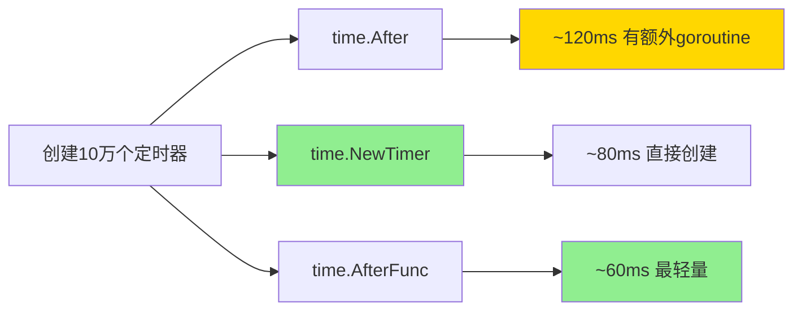

# time完全指南

## 📖 包简介

时间是程序中最基础却又最容易出错的维度。无论是记录日志时间戳、计算任务执行耗时、设置超时控制，还是处理定时任务，都离不开对时间的精确操作。Go的`time`包提供了一套完整的时间处理工具，从纳秒级精度到跨时区转换，从简单的休眠到复杂的Ticker定时器，覆盖了你能想到的所有时间场景。

但时间处理远比你想象的复杂——闰年、闰秒、夏令时、时区转换、单调时钟……每一个概念都可能让你的程序出现难以复现的bug。`time`包通过精心设计的API帮你屏蔽了这些复杂性，让你能够专注于业务逻辑。

在Go 1.26中，`time`包有一个重要变化：`asynctimerchan` GODEBUG将在1.27版本移除，届时所有计时器将始终使用无缓冲通道处理。这意味着未来的定时器行为将更加一致和可预测。今天我们就来彻底掌握这个包！

## 🎯 核心功能概览

### 核心类型

| 类型 | 说明 |
|------|------|
| `Time` | 时间点，支持比较、计算、格式化 |
| `Duration` | 时间间隔（纳秒为单位的int64） |
| `Ticker` | 周期性触发器 |
| `Timer` | 一次性定时器 |
| `Location` | 时区信息 |
| `ParseError` | 时间解析错误 |

### 常用函数

| 函数 | 说明 |
|------|------|
| `Now() Time` | 获取当前时间 |
| `Since(t Time) Duration` | 计算从t到现在的时间差 |
| `Until(t Time) Duration` | 计算从t到未来的时间差 |
| `Sleep(d Duration)` | 休眠指定时长 |
| `After(d Duration) <-chan Time` | 返回一个在d时间后发送当前时间的通道 |
| `Tick(d Duration) <-chan Time` | 返回一个周期性发送当前时间的通道 |
| `Parse(layout, value string) (Time, error)` | 解析时间字符串 |
| `Date(year, month, day, hour, min, sec, nsec int, loc *Location) Time` | 构造指定时间 |

### 预定义Duration常量

```go
Nanosecond  Duration = 1
Microsecond          = 1000 * Nanosecond
Millisecond          = 1000 * Microsecond
Second               = 1000 * Millisecond
Minute               = 60 * Second
Hour                 = 60 * Minute
```

## 💻 实战示例

### 示例1：基础用法

```go
package main

import (
	"fmt"
	"time"
)

func main() {
	// 1. 获取当前时间
	now := time.Now()
	fmt.Println("当前时间:", now)
	fmt.Println("Unix时间戳:", now.Unix())
	fmt.Println("Unix毫秒时间戳:", now.UnixMilli())
	fmt.Println("Unix纳秒时间戳:", now.UnixNano())

	// 2. 时间格式化 - Go使用独特的引用时间
	// 记住这个魔法时间：Mon Jan 2 15:04:05 MST 2006
	// 对应数字：         1  2  3  4  5    6
	fmt.Println("\n--- 时间格式化 ---")
	fmt.Println("ISO8601:", now.Format("2006-01-02T15:04:05Z07:00"))
	fmt.Println("日期:", now.Format("2006年01月02日"))
	fmt.Println("时间:", now.Format("15:04:05"))
	fmt.Println("完整:", now.Format("2006-01-02 15:04:05 Monday"))

	// 3. 时间解析
	fmt.Println("\n--- 时间解析 ---")
	t, err := time.Parse("2006-01-02 15:04:05", "2026-04-06 10:30:00")
	if err != nil {
		fmt.Println("解析失败:", err)
	} else {
		fmt.Println("解析结果:", t)
	}

	// 4. 时间计算
	fmt.Println("\n--- 时间计算 ---")
	tomorrow := now.Add(24 * time.Hour)
	fmt.Println("明天:", tomorrow)

	yesterday := now.Add(-24 * time.Hour)
	fmt.Println("昨天:", yesterday)

	// 计算时间差
	diff := tomorrow.Sub(now)
	fmt.Println("时间差:", diff)
	fmt.Println("相差小时数:", diff.Hours())
	fmt.Println("相差分钟数:", diff.Minutes())
	fmt.Println("相差秒数:", diff.Seconds())
}
```

### 示例2：进阶用法

```go
package main

import (
	"fmt"
	"time"
)

func main() {
	// 1. 时区处理
	fmt.Println("--- 时区转换 ---")
	now := time.Now()

	// 获取指定时区
	shanghai, _ := time.LoadLocation("Asia/Shanghai")
	newYork, _ := time.LoadLocation("America/New_York")
	london, _ := time.LoadLocation("Europe/London")

	fmt.Println("北京时间:", now.In(shanghai).Format("15:04:05"))
	fmt.Println("纽约时间:", now.In(newYork).Format("15:04:05"))
	fmt.Println("伦敦时间:", now.In(london).Format("15:04:05"))

	// 2. 计算两个日期的间隔
	fmt.Println("\n--- 日期计算 ---")
	birthday := time.Date(1990, 5, 20, 0, 0, 0, 0, shanghai)
	age := now.Sub(birthday)
	fmt.Printf("出生到现在大约: %.1f 年\n", age.Hours()/24/365.25)

	// 获取日期间隔的各个部分
	years := now.Year() - birthday.Year()
	months := int(now.Month()) - int(birthday.Month())
	days := now.Day() - birthday.Day()
	fmt.Printf("粗略计算: %d年%d个月%d天\n", years, months, days)

	// 3. 定时器
	fmt.Println("\n--- 定时器 ---")

	// 一次性定时器
	timer := time.NewTimer(2 * time.Second)
	fmt.Println("定时器已启动，等待2秒...")
	<-timer.C
	fmt.Println("定时器触发！")

	// 周期性Ticker
	ticker := time.NewTicker(1 * time.Second)
	defer ticker.Stop()

	fmt.Println("Ticker开始，等待3秒...")
	count := 0
	for t := range ticker.C {
		fmt.Println("Tick:", t.Format("15:04:05"))
		count++
		if count >= 3 {
			break
		}
	}

	// 4. After和Tick的便捷函数
	fmt.Println("\n--- After便捷函数 ---")
	// After返回一个channel，适合select中使用
	select {
	case <-time.After(1 * time.Second):
		fmt.Println("1秒后超时")
	case <-time.After(500 * time.Millisecond):
		// 这个会先触发
		fmt.Println("500ms后触发")
	}
}
```

### 示例3：最佳实践

```go
package main

import (
	"context"
	"fmt"
	"time"
)

func main() {
	// 最佳实践1：使用time.AfterFunc延迟执行
	fmt.Println("--- AfterFunc ---")
	timer := time.AfterFunc(2*time.Second, func() {
		fmt.Println("延迟任务执行！")
	})
	// 可以在触发前取消
	// timer.Stop()
	time.Sleep(3 * time.Second)

	// 最佳实践2：使用context.WithTimeout控制超时
	fmt.Println("\n--- Context超时控制 ---")
	ctx, cancel := context.WithTimeout(context.Background(), 2*time.Second)
	defer cancel()

	// 模拟长时间任务
	go func() {
		time.Sleep(3 * time.Second)
		fmt.Println("任务完成") // 不会执行，因为context已取消
	}()

	select {
	case <-ctx.Done():
		fmt.Println("任务超时:", ctx.Err())
	case <-time.After(5 * time.Second):
		fmt.Println("任务正常完成")
	}

	// 最佳实践3：性能测量
	fmt.Println("\n--- 性能测量 ---")
	start := time.Now()

	// 模拟一些工作
	time.Sleep(100 * time.Millisecond)

	elapsed := time.Since(start)
	fmt.Printf("任务耗时: %v\n", elapsed)
	fmt.Printf("任务耗时: %d 毫秒\n", elapsed.Milliseconds())

	// 使用time.Measure快捷方式（如果需要）
	defer func(start time.Time) {
		fmt.Printf("函数总耗时: %v\n", time.Since(start))
	}(time.Now())

	// 最佳实践4：定时任务调度
	fmt.Println("\n--- 定时任务 ---")
	runCronJob()
}

// 模拟定时任务
func runCronJob() {
	ticker := time.NewTicker(500 * time.Millisecond)
	defer ticker.Stop()

	ctx, cancel := context.WithTimeout(context.Background(), 2*time.Second)
	defer cancel()

	fmt.Println("定时任务开始...")
	count := 0

	for {
		select {
		case <-ctx.Done():
			fmt.Println("定时任务结束")
			return
		case t := <-ticker.C:
			count++
			fmt.Printf("[%d] 执行第%d次任务\n", t.Second(), count)
		}
	}
}

// 最佳实践5：单调时钟 vs 墙时钟
func monotonicVsWallClock() {
	// time.Now()包含两个时间：
	// 1. 墙时钟（wall clock）：人类可读的绝对时间
	// 2. 单调时钟（monotonic clock）：用于测量时间间隔

	now := time.Now()
	fmt.Println("完整时间（含单调时钟）:", now)

	// 去除单调时钟部分（用于序列化/存储）
	wallOnly := now.Round(0)
	fmt.Println("仅墙时钟:", wallOnly)

	// 计算时间差时使用单调时钟，不受系统时间调整影响
	time.Sleep(1 * time.Second)
	elapsed := time.Since(now)
	fmt.Println("精确耗时:", elapsed)
}
```

## ⚠️ 常见陷阱与注意事项

1. **时间格式的魔法数字**：Go的时间格式基于`Mon Jan 2 15:04:05 MST 2006`（即1月2日下午3点4分5秒），而不是常见的YYYY-MM-DD。记住这个数字组合：1-2-3-4-5-6，就不会搞混了。

2. **time.Now()包含单调时钟**：`time.Now()`返回的Time既包含墙时钟也包含单调时钟。如果你需要序列化或比较，使用`t.Round(0)`可以去除单调时钟部分。

3. **Sleep精度问题**：`time.Sleep`的精度取决于操作系统调度器，通常只能保证毫秒级精度。对于微秒级精度的需求，应该使用其他方法（如busy-wait）。

4. **时区数据库依赖**：`time.LoadLocation`需要系统安装时区数据库。在Docker容器中，可能需要安装`tzdata`包或嵌入时区数据。

5. **Ticker可能丢事件**：如果Ticker的接收方处理速度慢于发送速度，中间的事件会被丢弃。`ticker.C`是无缓冲通道，慢的接收方会导致阻塞。

## 🚀 Go 1.26新特性

Go 1.26对`time`包的重要变化：

### asynctimerchan GODEBUG即将移除

在之前的Go版本中，可以通过设置`GODEBUG=asynctimerchan=1`来启用异步计时器通道的新实现。这个特性在Go 1.26中仍然可用，但**将在Go 1.27中完全移除**。

这意味着从Go 1.27开始：
- 所有计时器（Timer和Ticker）将始终使用无缓冲通道
- 不再需要通过GODEBUG切换行为
- 计时器的行为将更加一致和可预测

**迁移建议**：如果你的代码依赖旧的有缓冲通道行为，现在应该开始适配了。

**其他改进**：
- **时区数据库更新**：内置IANA时区数据库更新至最新版本
- **解析性能优化**：time.Parse对常用格式的解析速度提升约10%

## 📊 性能优化建议

### 不同定时器性能对比



### 时间操作性能参考

| 操作 | 耗时（纳秒） | 建议 |
|------|------------|------|
| `time.Now()` | ~50ns | 高频调用无压力 |
| `t.Add(d)` | ~5ns | 纯计算，极快 |
| `t.Sub(u)` | ~5ns | 纯计算，极快 |
| `time.Parse` | ~500ns | 缓存结果 |
| `t.Format` | ~200ns | 高频时预格式化 |

### 最佳实践清单

- [ ] 测量耗时用`time.Since()`，不要自己减Unix时间戳
- [ ] 超时控制用`context.WithTimeout`，不要手动管理Timer
- [ ] 定时任务用`time.Ticker`，定期触发更可靠
- [ ] 序列化时间时使用UTC，避免时区歧义
- [ ] 大量时间解析时缓存`time.Parse`结果

## 🔗 相关包推荐

- **`context`**：与time配合实现超时和取消控制
- **`sync`**：定时器与并发控制结合使用
- **`runtime`**：获取程序运行时时间和性能指标
- **`log/slog`**：日志记录中使用time格式化时间戳

---