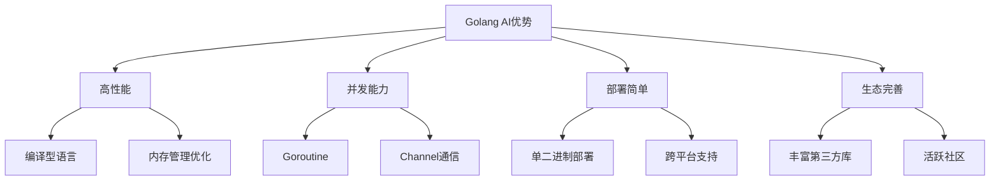
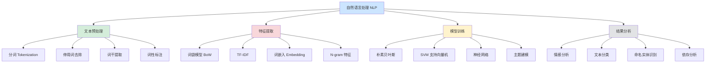
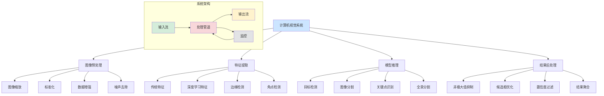
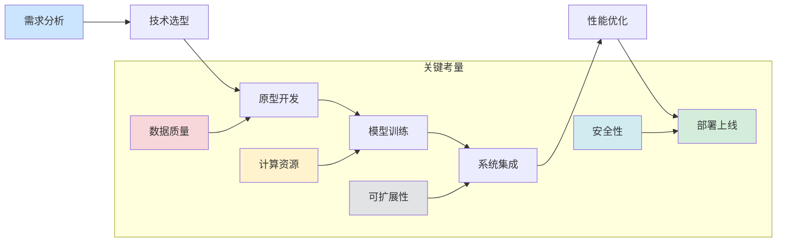
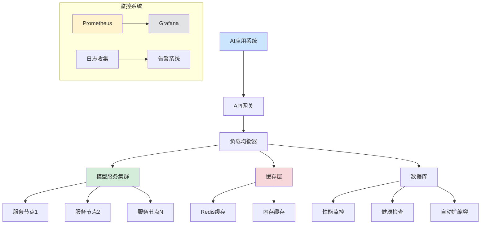
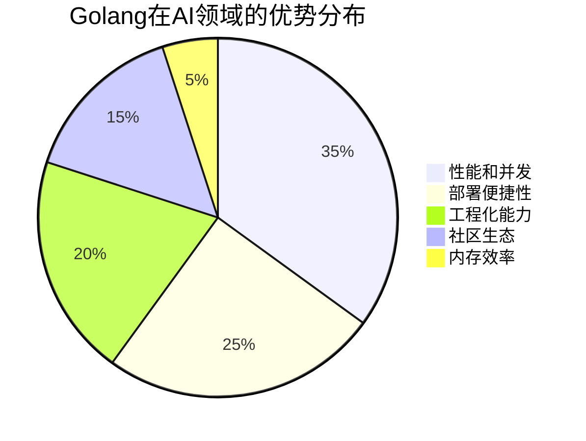
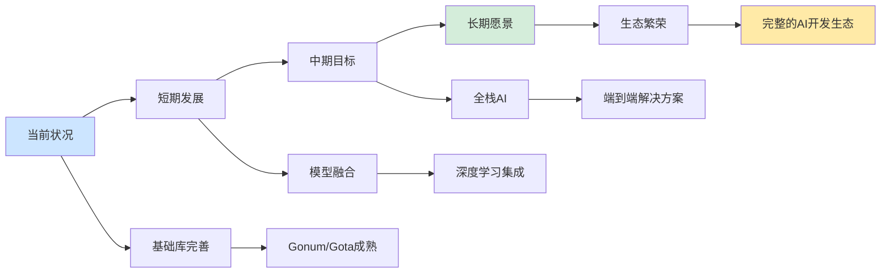

# Golang AI库深度探索：从基础到实战的完整指南

> 本文深入探讨Golang在人工智能领域的生态系统，涵盖机器学习、深度学习、自然语言处理和计算机视觉等核心领域。

## 一、序言：为什么选择Golang做AI开发？

### 1.1 Golang在AI领域的优势



**Golang在AI开发中的独特价值**：

- **高性能计算**：编译型语言，执行效率高，适合大规模数据处理
- **卓越的并发模型**：Goroutine和Channel为并行计算提供天然支持
- **简单的部署**：静态编译，单个可执行文件，简化部署流程
- **丰富的生态系统**：不断壮大的AI相关库和框架
- **生产环境友好**：强大的标准库和工具链

### 1.2 Golang AI生态系统概览

```go
package main

import (
    "fmt"
    "strings"
)

// AI库分类概览
func main() {
    categories := []struct {
        category string
        libraries []string
        description string
    }{
        {
            "机器学习",
            []string{"Gorgonia", "GoLearn", "goml", "Bayesian"},
            "传统机器学习算法实现",
        },
        {
            "深度学习", 
            []string{"Gorgonia", "GoDeep", "gotorch"},
            "神经网络和深度学习框架",
        },
        {
            "自然语言处理",
            []string{"prose", "go-nlp", "gse"},
            "文本分析和语言处理",
        },
        {
            "计算机视觉",
            []string{"gocv", "go-face"},
            "图像处理和识别",
        },
        {
            "数据处理",
            []string{"gota", "gonum"},
            "数据预处理和分析",
        },
    }
    
    fmt.Println("=== Golang AI生态系统概览 ===")
    for _, cat := range categories {
        fmt.Printf("\n%s:\n", cat.category)
        fmt.Printf("  库: %s\n", strings.Join(cat.libraries, ", "))
        fmt.Printf("  描述: %s\n", cat.description)
        }
    }
}

### 6.2 目标检测和图像识别

```go
package object_detection

import (
    "fmt"
    "github.com/Kagami/go-face"
    "github.com/LdDl/go-darknet"
    "image"
    "sort"
    "time"
)

// 面部检测器
type FaceDetector struct {
    recognizer *face.Recognizer
    modelsDir  string
}

func NewFaceDetector(modelsDir string) (*FaceDetector, error) {
    rec, err := face.NewRecognizer(modelsDir)
    if err != nil {
        return nil, fmt.Errorf("无法初始化面部识别器: %v", err)
    }
    
    return &FaceDetector{
        recognizer: rec,
        modelsDir:  modelsDir,
    }, nil
}

func (fd *FaceDetector) DetectFaces(img image.Image) ([]face.Face, error) {
    return fd.recognizer.Recognize(img)
}

func (fd *FaceDetector) CompareFaces(face1, face2 []float64) float64 {
    if len(face1) != len(face2) {
        return 0
    }
    
    // 计算欧氏距离
    distance := 0.0
    for i := range face1 {
        diff := face1[i] - face2[i]
        distance += diff * diff
    }
    distance = math.Sqrt(distance)
    
    // 转换为相似度 (0-1) 范围
    maxDistance := 2.0 // 经验值，根据模型调整
    similarity := 1.0 - math.Min(distance/maxDistance, 1.0)
    
    return similarity
}

// YOLO目标检测器
type YOLODetector struct {
    network *darknet.YOLO
    config  *darknet.ConfigYOLO
}

func NewYOLODetector(cfgPath, weightsPath, namesPath string) (*YOLODetector, error) {
    cfg := darknet.ConfigYOLO{
        ConfigPath:  cfgPath,
        WeightsPath: weightsPath,
        NamesPath:   namesPath,
        Threshold:   0.5,
        HierThresh:  0.5,
    }
    
    net, err := darknet.NewYOLO(cfg)
    if err != nil {
        return nil, fmt.Errorf("YOLO初始化失败: %v", err)
    }
    
    return &YOLODetector{
        network: net,
        config:  &cfg,
    }, nil
}

func (yd *YOLODetector) DetectObjects(img image.Image) ([]darknet.Detection, error) {
    detections, err := yd.network.Detect(img)
    if err != nil {
        return nil, err
    }
    
    return detections, nil
}

func (yd *YOLODetector) DetectObjectsOptimized(img image.Image, threshold float64) ([]Detection, error) {
    start := time.Now()
    
    // 设置临时阈值
    yd.config.Threshold = threshold
    
    detections, err := yd.network.Detect(img)
    if err != nil {
        return nil, err
    }
    
    // 转换为自定义格式
    var customDetections []Detection
    
    for _, det := range detections {
        if det.Confidence > threshold {
            customDetections = append(customDetections, Detection{
                Class:       det.Class,
                Confidence:  det.Confidence,
                BoundingBox: BBox{
                    X:      int(det.X),
                    Y:      int(det.Y),
                    Width:  int(det.Width),
                    Height: int(det.Height),
                },
            })
        }
    }
    
    elapsed := time.Since(start)
    fmt.Printf("检测耗时: %v\n", elapsed)
    
    // 按置信度排序
    sort.Slice(customDetections, func(i, j int) bool {
        return customDetections[i].Confidence > customDetections[j].Confidence
    })
    
    return customDetections, nil
}

type Detection struct {
    Class      string
    Confidence float64
    BoundingBox BBox
}

type BBox struct {
    X, Y, Width, Height int
}

// 非极大值抑制(NMS)
func NonMaxSuppression(detections []Detection, iouThreshold float64) []Detection {
    if len(detections) == 0 {
        return detections
    }
    
    // 按置信度排序
    sort.Slice(detections, func(i, j int) bool {
        return detections[i].Confidence > detections[j].Confidence
    })
    
    var suppressed []Detection
    
    for len(detections) > 0 {
        // 取置信度最高的检测
        best := detections[0]
        suppressed = append(suppressed, best)
        detections = detections[1:]
        
        // 移除与最佳检测重叠度高的检测
        var remaining []Detection
        for _, det := range detections {
            iou := calculateIOU(best.BoundingBox, det.BoundingBox)
            if iou < iouThreshold {
                remaining = append(remaining, det)
            }
        }
        detections = remaining
    }
    
    return suppressed
}

func calculateIOU(bbox1, bbox2 BBox) float64 {
    // 计算交并比
    x1 := math.Max(float64(bbox1.X), float64(bbox2.X))
    y1 := math.Max(float64(bbox1.Y), float64(bbox2.Y))
    x2 := math.Min(float64(bbox1.X+bbox1.Width), float64(bbox2.X+bbox2.Width))
    y2 := math.Min(float64(bbox1.Y+bbox1.Height), float64(bbox2.Y+bbox2.Height))
    
    intersectionWidth := math.Max(0, x2-x1)
    intersectionHeight := math.Max(0, y2-y1)
    intersectionArea := intersectionWidth * intersectionHeight
    
    area1 := float64(bbox1.Width * bbox1.Height)
    area2 := float64(bbox2.Width * bbox2.Height)
    unionArea := area1 + area2 - intersectionArea
    
    if unionArea == 0 {
        return 0
    }
    
    return intersectionArea / unionArea
}

// 图像分类器
type ImageClassifier struct {
    categories []string
}

func NewImageClassifier() *ImageClassifier {
    return &ImageClassifier{
        categories: []string{
            "人物", "动物", "交通工具", "建筑物", "自然风景", "食品", "其他",
        },
    }
}

func (ic *ImageClassifier) ExtractFeatures(img image.Image) []float64 {
    bounds := img.Bounds()
    width, height := bounds.Dx(), bounds.Dy()
    
    features := make([]float64, 0, 256)
    
    // 颜色直方图特征 (RGB三通道)
    histR := make([]float64, 8)
    histG := make([]float64, 8)
    histB := make([]float64, 8)
    
    for y := bounds.Min.Y; y < bounds.Max.Y; y++ {
        for x := bounds.Min.X; x < bounds.Max.X; x++ {
            r, g, b, _ := img.At(x, y).RGBA()
            
            // Normalize to 0-255 and quantize
            rNorm := uint8(r / 256)
            gNorm := uint8(g / 256)
            bNorm := uint8(b / 256)
            
            histR[rNorm/32]++
            histG[gNorm/32]++
            histB[bNorm/32]++
        }
    }
    
    // Normalize histograms
    totalPixels := float64(width * height)
    for i := range histR {
        features = append(features, histR[i]/totalPixels)
    }
    for i := range histG {
        features = append(features, histG[i]/totalPixels)
    }
    for i := range histB {
        features = append(features, histB[i]/totalPixels)
    }
    
    // 纹理特征 (使用梯度统计)
    grayImg := convertToGrayscale(img)
    gradientMagnitudes := make([]float64, 100)
    
    // 简化的梯度特征提取
    maxGradient := 0.0
    for y := bounds.Min.Y + 1; y < bounds.Max.Y-1; y++ {
        for x := bounds.Min.X + 1; x < bounds.Max.X-1; x++ {
            gradient := calculateGradient(grayImg, x, y)
            gradientMagnitudes = append(gradientMagnitudes, gradient)
            
            if gradient > maxGradient {
                maxGradient = gradient
            }
        }
    }
    
    // 梯度统计
    if len(gradientMagnitudes) > 0 {
        var sumGradient float64
        for _, g := range gradientMagnitudes {
            sumGradient += g
        }
        features = append(features, sumGradient/float64(len(gradientMagnitudes)))
        features = append(features, maxGradient)
    }
    
    return features
}

func calculateGradient(img image.Image, x, y int) float64 {
    // 使用简单梯度计算
    gray := img.(*image.Gray)
    
    center := float64(gray.GrayAt(x, y).Y)
    right := float64(gray.GrayAt(x+1, y).Y)
    bottom := float64(gray.GrayAt(x, y+1).Y)
    
    dx := right - center
    dy := bottom - center
    
    return math.Sqrt(dx*dx + dy*dy)
}

func (ic *ImageClassifier) Classify(features []float64) (string, float64) {
    // 简化的分类器实现 (实际中应该使用已训练的模型)
    
    // 基于颜色特征进行分类
    if len(features) >= 24 {
        // 分析蓝色分量 (天空、海洋)
        blueDominance := features[16] + features[17] + features[18] + features[19]
        
        // 分析绿色分量 (自然风景)
        greenDominance := features[8] + features[9] + features[10] + features[11]
        
        if blueDominance > 0.3 {
            return "自然风景", 0.7
        }
        
        if greenDominance > 0.3 {
            return "自然风景", 0.6
        }
    }
    
    // 默认分类
    return "其他", 0.3
}

func demonstrateObjectDetection() {
    fmt.Println("=== 目标检测和图像识别 ===")
    
    // 创建测试图像
    dc := gg.NewContext(640, 480)
    dc.SetRGB(1, 1, 1)
    dc.Clear()
    
    // 绘制一些对象用于检测
    dc.SetRGB(1, 0, 0)
    dc.DrawCircle(100, 100, 30) // 圆形目标
    dc.Fill()
    
    dc.SetRGB(0, 1, 0)
    dc.DrawRectangle(200, 150, 80, 60) // 矩形目标
    dc.Fill()
    
    testImg := dc.Image()
    
    // 图像分类演示
    classifier := NewImageClassifier()
    features := classifier.ExtractFeatures(testImg)
    category, confidence := classifier.Classify(features)
    
    fmt.Printf("图像分类结果: %s (置信度: %.2f)\n", category, confidence)
    fmt.Printf("特征向量维度: %d\n", len(features))
    
    // 模拟检测结果 (实际应用中应与真实检测器集成)
    simulatedDetections := []Detection{
        {
            Class:      "圆形物体",
            Confidence: 0.85,
            BoundingBox: BBox{X: 70, Y: 70, Width: 60, Height: 60},
        },
        {
            Class:      "矩形物体",
            Confidence: 0.92,
            BoundingBox: BBox{X: 200, Y: 150, Width: 80, Height: 60},
        },
        {
            Class:      "重叠检测",
            Confidence: 0.65,
            BoundingBox: BBox{X: 190, Y: 140, Width: 90, Height: 70},
        },
    }
    
    fmt.Println("\n检测结果 (NMS前):")
    for i, det := range simulatedDetections {
        fmt.Printf("%d: %s (%.2f) [%d,%d,%d,%d]\n",
            i+1, det.Class, det.Confidence,
            det.BoundingBox.X, det.BoundingBox.Y,
            det.BoundingBox.Width, det.BoundingBox.Height)
    }
    
    // 应用非极大值抑制
    suppressed := NonMaxSuppression(simulatedDetections, 0.5)
    
    fmt.Println("\nNMS后检测结果:")
    for i, det := range suppressed {
        fmt.Printf("%d: %s (%.2f) [%d,%d,%d,%d]\n",
            i+1, det.Class, det.Confidence,
            det.BoundingBox.X, det.BoundingBox.Y,
            det.BoundingBox.Width, det.BoundingBox.Height)
    }
}
```

### 2.2 Gota：数据处理框架

Gota提供了类似Pandas的数据处理能力：

```go
package main

import (
    "fmt"
    "github.com/go-gota/gota/dataframe"
    "github.com/go-gota/gota/series"
)

func main() {
    // 创建DataFrame
    df := dataframe.New(
        series.New([]string{"b", "a", "c", "d", "e"}, series.String, "COL.1"),
        series.New([]int{1, 2, 3, 4, 5}, series.Int, "COL.2"),
        series.New([]float64{3.0, 4.0, 5.0, 6.0, 7.0}, series.Float, "COL.3"),
    )
    
    fmt.Println("原始数据:")
    fmt.Println(df)
    
    // 数据筛选
    filtered := df.Filter(
        dataframe.F{Colname: "COL.2", Comparator: series.Greater, Comparando: 2},
    )
    fmt.Println("\n筛选后数据(COL.2 > 2):")
    fmt.Println(filtered)
    
    // 数据排序
    sorted := df.Arrange(dataframe.Sort("COL.1"))
    fmt.Println("\n按COL.1排序:")
    fmt.Println(sorted)
    
    // 数据聚合
    grouped := df.GroupBy("COL.1")
    aggregated := grouped.Aggregation(
        []dataframe.AggregationType{dataframe.Aggregation_MAX, dataframe.Aggregation_MEAN},
        []string{"COL.2", "COL.3"},
    )
    fmt.Println("\n分组聚合:")
    fmt.Println(aggregated)
    
    // 数据描述性统计
    description := df.Describe()
    fmt.Println("\n描述性统计:")
    fmt.Println(description)
}
```

### 2.3 数据预处理管道

```go
package preprocessing

import (
    "fmt"
    "github.com/go-gota/gota/dataframe"
    "github.com/go-gota/gota/series"
    "gonum.org/v1/gonum/stat"
    "math"
)

// 数据标准化
type StandardScaler struct {
    mean float64
    std  float64
}

func (s *StandardScaler) Fit(data []float64) {
    s.mean = stat.Mean(data, nil)
    s.std = stat.StdDev(data, nil)
}

func (s *StandardScaler) Transform(data []float64) []float64 {
    result := make([]float64, len(data))
    for i, v := range data {
        result[i] = (v - s.mean) / s.std
    }
    return result
}

// 数据清洗管道
type DataPipeline struct {
    steps []DataTransform
}

type DataTransform interface {
    Transform(df dataframe.DataFrame) dataframe.DataFrame
}

// 缺失值处理
type FillNA struct {
    column string
    value  interface{}
}

func (f FillNA) Transform(df dataframe.DataFrame) dataframe.DataFrame {
    col := df.Col(f.column)
    newCol := col.Copy()
    
    for i := 0; i < col.Len(); i++ {
        if col.Val(i) == nil {
            newCol.Set(i, f.value)
        }
    }
    
    return df.Mutate(newCol)
}

// 特征编码
type OneHotEncoder struct {
    column string
}

func (o OneHotEncoder) Transform(df dataframe.DataFrame) dataframe.DataFrame {
    // 简化版one-hot编码实现
    uniqueValues := make(map[interface{}]bool)
    col := df.Col(o.column)
    
    for i := 0; i < col.Len(); i++ {
        uniqueValues[col.Val(i)] = true
    }
    
    // 为每个唯一值创建新列
    result := df
    for value := range uniqueValues {
        newColData := make([]interface{}, col.Len())
        for i := 0; i < col.Len(); i++ {
            if col.Val(i) == value {
                newColData[i] = 1
            } else {
                newColData[i] = 0
            }
        }
        
        colName := fmt.Sprintf("%s_%v", o.column, value)
        newCol := series.New(newColData, series.Int, colName)
        result = result.Mutate(newCol)
    }
    
    return result.Drop(o.column)
}

func main() {
    // 创建示例数据
    df := dataframe.New(
        series.New([]interface{}{"A", "B", nil, "A", "C"}, series.String, "Category"),
        series.New([]float64{1.0, 2.0, 3.0, 4.0, 5.0}, series.Float, "Value"),
    )
    
    fmt.Println("原始数据:")
    fmt.Println(df)
    
    // 构建数据处理管道
    pipeline := []DataTransform{
        FillNA{column: "Category", value: "Unknown"},
        OneHotEncoder{column: "Category"},
    }
    
    // 应用管道
    processed := df
    for _, step := range pipeline {
        processed = step.Transform(processed)
    }
    
    fmt.Println("\n处理后的数据:")
    fmt.Println(processed)
    
    // 数据标准化示例
    values := []float64{1.0, 2.0, 3.0, 4.0, 5.0}
    scaler := &StandardScaler{}
    scaler.Fit(values)
    normalized := scaler.Transform(values)
    
    fmt.Println("\n标准化后的数据:")
    fmt.Println(normalized)
}

## 三、机器学习基础库

### 3.1 GoLearn：类似于Scikit-learn的机器学习库

```go
package main

import (
    "fmt"
    "github.com/sjwhitworth/golearn/base"
    "github.com/sjwhitworth/golearn/evaluation"
    "github.com/sjwhitworth/golearn/knn"
    "github.com/sjwhitworth/golearn/trees"
    "log"
    "math/rand"
    "time"
)

func main() {
    rand.Seed(time.Now().UnixNano())
    
    // 加载鸢尾花数据集
    rawData, err := base.ParseCSVToInstances("iris.csv", true)
    if err != nil {
        log.Fatal(err)
    }
    
    fmt.Println("数据集信息:")
    fmt.Printf("实例数量: %d\n", rawData.Rows)
    fmt.Printf("特征数量: %d\n", rawData.Cols)
    fmt.Printf("类别数量: %d\n", rawData.ClassCount())
    
    // 划分训练集和测试集
    trainData, testData := base.InstancesTrainTestSplit(rawData, 0.70)
    
    fmt.Printf("训练集大小: %d\n", trainData.Rows)
    fmt.Printf("测试集大小: %d\n", testData.Rows)
    
    // KNN分类器
    fmt.Println("\n=== KNN分类器 ===")
    knnClassifier := knn.NewKnnClassifier("euclidean", "linear", 3)
    
    // 训练模型
    knnClassifier.Fit(trainData)
    
    // 预测
    predictions, err := knnClassifier.Predict(testData)
    if err != nil {
        log.Fatal(err)
    }
    
    // 评估模型
    confusionMat, err := evaluation.GetConfusionMatrix(testData, predictions)
    if err != nil {
        log.Fatal(err)
    }
    
    fmt.Println("KNN混淆矩阵:")
    fmt.Println(evaluation.GetSummary(confusionMat))
    
    accuracy := evaluation.GetAccuracy(confusionMat)
    fmt.Printf("KNN准确率: %.2f%%\n", accuracy*100)
    
    // 决策树分类器
    fmt.Println("\n=== 决策树分类器 ===")
    treeClassifier := trees.NewID3DecisionTree(0.6)
    
    treeClassifier.Fit(trainData)
    treePredictions, err := treeClassifier.Predict(testData)
    if err != nil {
        log.Fatal(err)
    }
    
    treeConfusionMat, err := evaluation.GetConfusionMatrix(testData, treePredictions)
    if err != nil {
        log.Fatal(err)
    }
    
    treeAccuracy := evaluation.GetAccuracy(treeConfusionMat)
    fmt.Printf("决策树准确率: %.2f%%\n", treeAccuracy*100)
    
    // 模型比较
    fmt.Println("\n=== 模型性能比较 ===")
    fmt.Printf("KNN准确率: %.2f%%\n", accuracy*100)
    fmt.Printf("决策树准确率: %.2f%%\n", treeAccuracy*100)
}
```

### 3.2 自定义机器学习算法实现

```go
package ml_algorithms

import (
    "fmt"
    "gonum.org/v1/gonum/mat"
    "math"
    "math/rand"
)

// 线性回归实现
type LinearRegression struct {
    weights *mat.Dense
    bias    float64
    learningRate float64
    iterations int
}

func NewLinearRegression(learningRate float64, iterations int) *LinearRegression {
    return &LinearRegression{
        learningRate: learningRate,
        iterations:   iterations,
    }
}

func (lr *LinearRegression) Fit(X, y *mat.Dense) {
    nSamples, nFeatures := X.Dims()
    _, nOutputs := y.Dims()
    
    // 初始化权重
    lr.weights = mat.NewDense(nFeatures, nOutputs, nil)
    for i := 0; i < nFeatures; i++ {
        for j := 0; j < nOutputs; j++ {
            lr.weights.Set(i, j, rand.NormFloat64()*0.01)
        }
    }
    
    lr.bias = 0.0
    
    // 梯度下降
    for iter := 0; iter < lr.iterations; iter++ {
        // 前向传播
        var predictions mat.Dense
        predictions.Mul(X, lr.weights)
        
        // 添加偏置
        for i := 0; i < nSamples; i++ {
            for j := 0; j < nOutputs; j++ {
                predictions.Set(i, j, predictions.At(i, j)+lr.bias)
            }
        }
        
        // 计算误差
        var errors mat.Dense
        errors.Sub(&predictions, y)
        
        // 计算梯度
        var gradients mat.Dense
        var XT mat.Dense
        XT.TCopy(X)
        gradients.Mul(&XT, &errors)
        
        // 更新权重
        gradients.Scale(lr.learningRate/float64(nSamples), &gradients)
        lr.weights.Sub(lr.weights, &gradients)
        
        // 更新偏置
        biasGradient := mat.Sum(&errors) / float64(nSamples*nOutputs)
        lr.bias -= lr.learningRate * biasGradient
        
        if iter%100 == 0 {
            mse := lr.calculateMSE(&predictions, y)
            fmt.Printf("迭代 %d, MSE: %.4f\n", iter, mse)
        }
    }
}

func (lr *LinearRegression) Predict(X *mat.Dense) *mat.Dense {
    var predictions mat.Dense
    predictions.Mul(X, lr.weights)
    
    nSamples, nOutputs := predictions.Dims()
    for i := 0; i < nSamples; i++ {
        for j := 0; j < nOutputs; j++ {
            predictions.Set(i, j, predictions.At(i, j)+lr.bias)
        }
    }
    
    return &predictions
}

func (lr *LinearRegression) calculateMSE(predictions, y *mat.Dense) float64 {
    var diff mat.Dense
    diff.Sub(predictions, y)
    
    var squared mat.Dense
    squared.MulElem(&diff, &diff)
    
    return mat.Sum(&squared) / float64(squared.RawMatrix().Rows*squared.RawMatrix().Cols)
}

// K-Means聚类实现
type KMeans struct {
    k        int
    maxIter  int
    centroids *mat.Dense
}

func NewKMeans(k, maxIter int) *KMeans {
    return &KMeans{
        k:       k,
        maxIter: maxIter,
    }
}

func (km *KMeans) Fit(X *mat.Dense) {
    nSamples, nFeatures := X.Dims()
    
    // 随机初始化质心
    km.centroids = mat.NewDense(km.k, nFeatures, nil)
    for i := 0; i < km.k; i++ {
        randomSample := rand.Intn(nSamples)
        for j := 0; j < nFeatures; j++ {
            km.centroids.Set(i, j, X.At(randomSample, j))
        }
    }
    
    for iter := 0; iter < km.maxIter; iter++ {
        // 分配样本到最近的质心
        labels := km.predictLabels(X)
        
        // 更新质心
        newCentroids := mat.NewDense(km.k, nFeatures, nil)
        counts := make([]int, km.k)
        
        for i := 0; i < nSamples; i++ {
            cluster := labels[i]
            counts[cluster]++
            
            for j := 0; j < nFeatures; j++ {
                current := newCentroids.At(cluster, j)
                newCentroids.Set(cluster, j, current+X.At(i, j))
            }
        }
        
        // 计算新的质心位置
        for i := 0; i < km.k; i++ {
            if counts[i] > 0 {
                for j := 0; j < nFeatures; j++ {
                    newCentroids.Set(i, j, newCentroids.At(i, j)/float64(counts[i]))
                }
            }
        }
        
        km.centroids = newCentroids
        
        if iter%10 == 0 {
            inertia := km.calculateInertia(X, labels)
            fmt.Printf("迭代 %d, 惯性: %.4f\n", iter, inertia)
        }
    }
}

func (km *KMeans) predictLabels(X *mat.Dense) []int {
    nSamples, _ := X.Dims()
    labels := make([]int, nSamples)
    
    for i := 0; i < nSamples; i++ {
        minDist := math.Inf(1)
        
        for j := 0; j < km.k; j++ {
            dist := km.euclideanDistance(X, i, km.centroids, j)
            if dist < minDist {
                minDist = dist
                labels[i] = j
            }
        }
    }
    
    return labels
}

func (km *KMeans) euclideanDistance(X *mat.Dense, sampleIdx int, centroids *mat.Dense, centroidIdx int) float64 {
    _, nFeatures := X.Dims()
    sum := 0.0
    
    for j := 0; j < nFeatures; j++ {
        diff := X.At(sampleIdx, j) - centroids.At(centroidIdx, j)
        sum += diff * diff
    }
    
    return math.Sqrt(sum)
}

func (km *KMeans) calculateInertia(X *mat.Dense, labels []int) float64 {
    nSamples, _ := X.Dims()
    inertia := 0.0
    
    for i := 0; i < nSamples; i++ {
        cluster := labels[i]
        dist := km.euclideanDistance(X, i, km.centroids, cluster)
        inertia += dist * dist
    }
    
    return inertia
}

func (km *KMeans) Predict(X *mat.Dense) []int {
    return km.predictLabels(X)
}

func main() {
    fmt.Println("=== 自定义机器学习算法演示 ===")
    
    // 创建示例数据
    X := mat.NewDense(100, 2, nil)
    y := mat.NewDense(100, 1, nil)
    
    // 生成线性数据
    for i := 0; i < 100; i++ {
        x1 := rand.Float64() * 10
        x2 := rand.Float64() * 10
        noise := rand.NormFloat64() * 0.5
        
        X.Set(i, 0, x1)
        X.Set(i, 1, x2)
        y.Set(i, 0, 2*x1 + 3*x2 + 1 + noise)
    }
    
    // 线性回归
    fmt.Println("\n1. 线性回归:")
    lr := NewLinearRegression(0.01, 1000)
    lr.Fit(X, y)
    
    predictions := lr.Predict(X)
    mse := lr.calculateMSE(predictions, y)
    fmt.Printf("训练MSE: %.4f\n", mse)
    
    // K-Means聚类
    fmt.Println("\n2. K-Means聚类:")
    kmeans := NewKMeans(3, 100)
    kmeans.Fit(X)
    
    labels := kmeans.Predict(X)
    fmt.Println("前10个样本的聚类标签:", labels[:10])
}
```

### 3.3 模型评估和验证

```go
package model_evaluation

import (
    "fmt"
    "gonum.org/v1/gonum/mat"
    "gonum.org/v1/gonum/stat"
    "math"
)

// 交叉验证
type CrossValidator struct {
    k int // 折数
}

func NewCrossValidator(k int) *CrossValidator {
    return &CrossValidator{k: k}
}

func (cv *CrossValidator) CrossValidate(X, y *mat.Dense, model Model) []float64 {
    nSamples, _ := X.Dims()
    foldSize := nSamples / cv.k
    
    scores := make([]float64, cv.k)
    
    for fold := 0; fold < cv.k; fold++ {
        start := fold * foldSize
        end := (fold + 1) * foldSize
        if fold == cv.k-1 {
            end = nSamples
        }
        
        // 创建训练集和验证集
        trainX, trainY, valX, valY := cv.splitData(X, y, start, end)
        
        // 训练模型
        model.Fit(trainX, trainY)
        
        // 验证模型
        predictions := model.Predict(valX)
        scores[fold] = cv.evaluate(valY, predictions)
    }
    
    return scores
}

func (cv *CrossValidator) splitData(X, y *mat.Dense, valStart, valEnd int) (*mat.Dense, *mat.Dense, *mat.Dense, *mat.Dense) {
    nSamples, nFeatures := X.Dims()
    _, nOutputs := y.Dims()
    
    trainSize := nSamples - (valEnd - valStart)
    
    trainX := mat.NewDense(trainSize, nFeatures, nil)
    trainY := mat.NewDense(trainSize, nOutputs, nil)
    valX := mat.NewDense(valEnd-valStart, nFeatures, nil)
    valY := mat.NewDense(valEnd-valStart, nOutputs, nil)
    
    trainIdx := 0
    valIdx := 0
    
    for i := 0; i < nSamples; i++ {
        if i >= valStart && i < valEnd {
            // 验证集
            for j := 0; j < nFeatures; j++ {
                valX.Set(valIdx, j, X.At(i, j))
            }
            for j := 0; j < nOutputs; j++ {
                valY.Set(valIdx, j, y.At(i, j))
            }
            valIdx++
        } else {
            // 训练集
            for j := 0; j < nFeatures; j++ {
                trainX.Set(trainIdx, j, X.At(i, j))
            }
            for j := 0; j < nOutputs; j++ {
                trainY.Set(trainIdx, j, y.At(i, j))
            }
            trainIdx++
        }
    }
    
    return trainX, trainY, valX, valY
}

func (cv *CrossValidator) evaluate(yTrue, yPred *mat.Dense) float64 {
    // 计算均方误差
    var diff mat.Dense
    diff.Sub(yPred, yTrue)
    
    var squared mat.Dense
    squared.MulElem(&diff, &diff)
    
    return mat.Sum(&squared) / float64(squared.RawMatrix().Rows*squared.RawMatrix().Cols)
}

// 模型接口
type Model interface {
    Fit(X, y *mat.Dense)
    Predict(X *mat.Dense) *mat.Dense
}

// 性能指标计算
type Metrics struct{}

func (m *Metrics) Accuracy(yTrue, yPred []int) float64 {
    if len(yTrue) != len(yPred) {
        panic("标签长度不匹配")
    }
    
    correct := 0
    for i := range yTrue {
        if yTrue[i] == yPred[i] {
            correct++
        }
    }
    
    return float64(correct) / float64(len(yTrue))
}

func (m *Metrics) Precision(yTrue, yPred []int, class int) float64 {
    truePositive := 0
    falsePositive := 0
    
    for i := range yTrue {
        if yPred[i] == class {
            if yTrue[i] == class {
                truePositive++
            } else {
                falsePositive++
            }
        }
    }
    
    if truePositive+falsePositive == 0 {
        return 0
    }
    
    return float64(truePositive) / float64(truePositive+falsePositive)
}

func (m *Metrics) Recall(yTrue, yPred []int, class int) float64 {
    truePositive := 0
    falseNegative := 0
    
    for i := range yTrue {
        if yTrue[i] == class {
            if yPred[i] == class {
                truePositive++
            } else {
                falseNegative++
            }
        }
    }
    
    if truePositive+falseNegative == 0 {
        return 0
    }
    
    return float64(truePositive) / float64(truePositive+falseNegative)
}

func (m *Metrics) F1Score(yTrue, yPred []int, class int) float64 {
    precision := m.Precision(yTrue, yPred, class)
    recall := m.Recall(yTrue, yPred, class)
    
    if precision+recall == 0 {
        return 0
    }
    
    return 2 * precision * recall / (precision + recall)
}

// ROC曲线和AUC（简化版）
func (m *Metrics) ROCCurve(yTrue []int, yScore []float64, thresholds []float64) ([]float64, []float64) {
    tpr := make([]float64, len(thresholds))
    fpr := make([]float64, len(thresholds))
    
    for i, threshold := range thresholds {
        var yPred []int
        for _, score := range yScore {
            if score >= threshold {
                yPred = append(yPred, 1)
            } else {
                yPred = append(yPred, 0)
            }
        }
        
        tpr[i] = m.Recall(yTrue, yPred, 1)
        fpr[i] = 1 - m.Recall(yTrue, yPred, 0) // 假正率
    }
    
    return tpr, fpr
}

func main() {
    fmt.Println("=== 模型评估演示 ===")
    
    metrics := &Metrics{}
    
    // 示例数据
    yTrue := []int{0, 1, 0, 1, 1, 0, 1, 0, 0, 1}
    yPred := []int{0, 1, 0, 0, 1, 0, 1, 1, 0, 1}
    yScore := []float64{0.1, 0.9, 0.2, 0.4, 0.8, 0.3, 0.7, 0.6, 0.2, 0.9}
    
    fmt.Printf("准确率: %.2f%%\n", metrics.Accuracy(yTrue, yPred)*100)
    fmt.Printf("类别1精确率: %.2f\n", metrics.Precision(yTrue, yPred, 1))
    fmt.Printf("类别1召回率: %.2f\n", metrics.Recall(yTrue, yPred, 1))
    fmt.Printf("类别1 F1分数: %.2f\n", metrics.F1Score(yTrue, yPred, 1))
    
    // ROC曲线
    thresholds := []float64{0.0, 0.1, 0.2, 0.3, 0.4, 0.5, 0.6, 0.7, 0.8, 0.9, 1.0}
    tpr, fpr := metrics.ROCCurve(yTrue, yScore, thresholds)
    
    fmt.Println("\nROC曲线点:")
    for i := range thresholds {
        fmt.Printf("阈值 %.1f: TPR=%.2f, FPR=%.2f\n", thresholds[i], tpr[i], fpr[i])
    }
}

## 四、深度学习框架

### 4.1 Gorgonia：Golang的深度学习框架

Gorgonia是Golang中最成熟的深度学习框架，提供类似TensorFlow的API：

```go
package deep_learning

import (
    "fmt"
    "log"
    "math/rand"
    
    G "gorgonia.org/gorgonia"
    "gorgonia.org/tensor"
)

// 简单神经网络示例
func SimpleNeuralNetwork() {
    fmt.Println("=== 简单神经网络 ===")
    
    // 创建计算图
    g := G.NewGraph()
    
    // 定义输入
    x := G.NewMatrix(g, tensor.Float64, G.WithName("x"), G.WithShape(2, 3))
    y := G.NewMatrix(g, tensor.Float64, G.WithName("y"), G.WithShape(2, 1))
    
    // 定义权重和偏置
    w1 := G.NewMatrix(g, tensor.Float64, G.WithName("w1"), G.WithShape(3, 4))
    b1 := G.NewMatrix(g, tensor.Float64, G.WithName("b1"), G.WithShape(1, 4))
    
    w2 := G.NewMatrix(g, tensor.Float64, G.WithName("w2"), G.WithShape(4, 1))
    b2 := G.NewMatrix(g, tensor.Float64, G.WithName("b2"), G.WithShape(1, 1))
    
    // 随机初始化权重
    G.InitWengert(w1, G.GlorotU(1.0))
    G.InitWengert(b1, G.Zeroes())
    G.InitWengert(w2, G.GlorotU(1.0))
    G.InitWengert(b2, G.Zeroes())
    
    // 前向传播
    layer1, err := G.Mul(x, w1)
    if err != nil {
        log.Fatal(err)
    }
    
    layer1, err = G.Add(layer1, b1)
    if err != nil {
        log.Fatal(err)
    }
    
    // 激活函数
    activated, err := G.Tanh(layer1)
    if err != nil {
        log.Fatal(err)
    }
    
    layer2, err := G.Mul(activated, w2)
    if err != nil {
        log.Fatal(err)
    }
    
    output, err := G.Add(layer2, b2)
    if err != nil {
        log.Fatal(err)
    }
    
    // 损失函数
    diff, err := G.Sub(output, y)
    if err != nil {
        log.Fatal(err)
    }
    
    squared, err := G.Square(diff)
    if err != nil {
        log.Fatal(err)
    }
    
    loss, err := G.Mean(squared)
    if err != nil {
        log.Fatal(err)
    }
    
    // 创建虚拟机
    machine := G.NewTapeMachine(g)
    
    // 设置输入数据
    xVal := tensor.New(tensor.WithBacking([]float64{1, 2, 3, 4, 5, 6}), tensor.WithShape(2, 3))
    yVal := tensor.New(tensor.WithBacking([]float64{1, 2}), tensor.WithShape(2, 1))
    
    G.Let(x, xVal)
    G.Let(y, yVal)
    
    // 执行计算图
    if err := machine.RunAll(); err != nil {
        log.Fatal(err)
    }
    
    fmt.Printf("预测输出形状: %v\n", output.Shape())
    fmt.Printf("损失值: %v\n", loss.Value())
    
    machine.Close()
}

// CNN卷积神经网络实现
type CNN struct {
    g *G.ExprGraph
    
    // 卷积层参数
    convW, convB *G.Node
    
    // 全连接层参数
    fcW, fcB *G.Node
    
    // 输入输出节点
    input, target, output *G.Node
    
    // 损失函数
    loss *G.Node
    
    machine *G.TapeMachine
    solver  G.Solver
}

func NewCNN(inputShape []int) *CNN {
    g := G.NewGraph()
    
    cnn := &CNN{
        g: g,
    }
    
    // 输入层
    cnn.input = G.NewTensor(g, tensor.Float64, len(inputShape), G.WithName("input"), G.WithShape(inputShape...))
    cnn.target = G.NewTensor(g, tensor.Float64, 1, G.WithName("target"), G.WithShape(inputShape[0], 10)) // 10个类别
    
    // 卷积层
    cnn.convW = G.NewTensor(g, tensor.Float64, 4, G.WithName("conv_weight"), G.WithShape(32, 1, 3, 3))
    cnn.convB = G.NewTensor(g, tensor.Float64, 1, G.WithName("conv_bias"), G.WithShape(32))
    
    // 全连接层
    cnn.fcW = G.NewTensor(g, tensor.Float64, 2, G.WithName("fc_weight"), G.WithShape(32*26*26, 10))
    cnn.fcB = G.NewTensor(g, tensor.Float64, 1, G.WithName("fc_bias"), G.WithShape(10))
    
    // 初始化权重
    G.InitWengert(cnn.convW, G.GlorotU(1.0))
    G.InitWengert(cnn.convB, G.Zeroes())
    G.InitWengert(cnn.fcW, G.GlorotU(1.0))
    G.InitWengert(cnn.fcB, G.Zeroes())
    
    // 构建网络
    cnn.buildNetwork()
    
    // 创建求解器
    cnn.solver = G.NewAdamSolver(G.WithLearnRate(0.001))
    cnn.machine = G.NewTapeMachine(g, G.BindDualValues(cnn.convW, cnn.convB, cnn.fcW, cnn.fcB))
    
    return cnn
}

func (cnn *CNN) buildNetwork() {
    // 卷积层
    convOut, err := G.Conv2d(cnn.input, cnn.convW, tensor.Shape{3, 3}, []int{1, 1}, []int{0, 0}, []int{1, 1})
    if err != nil {
        log.Fatal(err)
    }
    
    // 添加偏置
    convBias, err := G.BroadcastAdd(convOut, cnn.convB, nil, []byte{0})
    if err != nil {
        log.Fatal(err)
    }
    
    // ReLU激活
    reluOut, err := G.Rectify(convBias)
    if err != nil {
        log.Fatal(err)
    }
    
    // 最大池化
    pooled, err := G.MaxPool2D(reluOut, tensor.Shape{2, 2}, []int{0, 0}, []int{2, 2})
    if err != nil {
        log.Fatal(err)
    }
    
    // 展平
    flattened, err := G.Reshape(pooled, tensor.Shape{cnn.input.Shape()[0], 32 * 13 * 13})
    if err != nil {
        log.Fatal(err)
    }
    
    // 全连接层
    fcOut, err := G.Mul(flattened, cnn.fcW)
    if err != nil {
        log.Fatal(err)
    }
    
    cnn.output, err = G.Add(fcOut, cnn.fcB)
    if err != nil {
        log.Fatal(err)
    }
    
    // Softmax输出
    softmax, err := G.SoftMax(cnn.output)
    if err != nil {
        log.Fatal(err)
    }
    
    cnn.output = softmax
    
    // 交叉熵损失
    logProb, err := G.Log(softmax)
    if err != nil {
        log.Fatal(err)
    }
    
    elemWise, err := G.HadamardProd(cnn.target, logProb)
    if err != nil {
        log.Fatal(err)
    }
    
    sumLoss, err := G.Sum(elemWise)
    if err != nil {
        log.Fatal(err)
    }
    
    cnn.loss, err = G.Neg(sumLoss)
    if err != nil {
        log.Fatal(err)
    }
}

func (cnn *CNN) Train(X, Y tensor.Tensor, epochs int) {
    G.Let(cnn.input, X)
    G.Let(cnn.target, Y)
    
    for epoch := 0; epoch < epochs; epoch++ {
        if err := cnn.machine.RunAll(); err != nil {
            log.Fatal(err)
        }
        
        // 计算梯度
        if err := G.Grad(cnn.loss, cnn.convW, cnn.convB, cnn.fcW, cnn.fcB); err != nil {
            log.Fatal(err)
        }
        
        // 更新权重
        if err := cnn.solver.Step(G.NodesToValueGrads([]*G.Node{cnn.convW, cnn.convB, cnn.fcW, cnn.fcB})); err != nil {
            log.Fatal(err)
        }
        
        cnn.machine.Reset()
        
        if epoch%10 == 0 {
            fmt.Printf("Epoch %d, Loss: %v\n", epoch, cnn.loss.Value())
        }
    }
}

func (cnn *CNN) Predict(X tensor.Tensor) tensor.Tensor {
    G.Let(cnn.input, X)
    
    if err := cnn.machine.RunAll(); err != nil {
        log.Fatal(err)
    }
    
    output := cnn.output.Value().(tensor.Tensor)
    cnn.machine.Reset()
    
    return output
}

func (cnn *CNN) Close() {
    cnn.machine.Close()
}

// LSTM循环神经网络
type LSTM struct {
    g *G.ExprGraph
    
    // 输入门参数
    wii, wih, bi *G.Node
    
    // 遗忘门参数  
    wfi, wfh, bf *G.Node
    
    // 输出门参数
    woi, woh, bo *G.Node
    
    // 细胞状态参数
    wci, wch, bc *G.Node
    
    hiddenSize int
    inputSize  int
}

func NewLSTM(inputSize, hiddenSize int) *LSTM {
    g := G.NewGraph()
    
    lstm := &LSTM{
        g:         g,
        inputSize: inputSize,
        hiddenSize: hiddenSize,
    }
    
    // 初始化所有门参数
    lstm.initializeGates()
    
    return lstm
}

func (lstm *LSTM) initializeGates() {
    // 输入门
    lstm.wii = G.NewMatrix(lstm.g, tensor.Float64, G.WithName("wii"), G.WithShape(lstm.inputSize, lstm.hiddenSize))
    lstm.wih = G.NewMatrix(lstm.g, tensor.Float64, G.WithName("wih"), G.WithShape(lstm.hiddenSize, lstm.hiddenSize))
    lstm.bi = G.NewVector(lstm.g, tensor.Float64, G.WithName("bi"), G.WithShape(lstm.hiddenSize))
    
    // 遗忘门
    lstm.wfi = G.NewMatrix(lstm.g, tensor.Float64, G.WithName("wfi"), G.WithShape(lstm.inputSize, lstm.hiddenSize))
    lstm.wfh = G.NewMatrix(lstm.g, tensor.Float64, G.WithName("wfh"), G.WithShape(lstm.hiddenSize, lstm.hiddenSize))
    lstm.bf = G.NewVector(lstm.g, tensor.Float64, G.WithName("bf"), G.WithShape(lstm.hiddenSize))
    
    // 输出门
    lstm.woi = G.NewMatrix(lstm.g, tensor.Float64, G.WithName("woi"), G.WithShape(lstm.inputSize, lstm.hiddenSize))
    lstm.woh = G.NewMatrix(lstm.g, tensor.Float64, G.WithName("woh"), G.WithShape(lstm.hiddenSize, lstm.hiddenSize))
    lstm.bo = G.NewVector(lstm.g, tensor.Float64, G.WithName("bo"), G.WithShape(lstm.hiddenSize))
    
    // 细胞状态
    lstm.wci = G.NewMatrix(lstm.g, tensor.Float64, G.WithName("wci"), G.WithShape(lstm.inputSize, lstm.hiddenSize))
    lstm.wch = G.NewMatrix(lstm.g, tensor.Float64, G.WithName("wch"), G.WithShape(lstm.hiddenSize, lstm.hiddenSize))
    lstm.bc = G.NewVector(lstm.g, tensor.Float64, G.WithName("bc"), G.WithShape(lstm.hiddenSize))
    
    // 初始化权重
    gates := []*G.Node{lstm.wii, lstm.wih, lstm.wfi, lstm.wfh, lstm.woi, lstm.woh, lstm.wci, lstm.wch}
    biases := []*G.Node{lstm.bi, lstm.bf, lstm.bo, lstm.bc}
    
    for _, gate := range gates {
        G.InitWengert(gate, G.GlorotU(1.0))
    }
    
    for _, bias := range biases {
        G.InitWengert(bias, G.Zeroes())
    }
}

func (lstm *LSTM) Forward(input, hidden, cell *G.Node) (*G.Node, *G.Node, error) {
    // 输入门
    ii, err := G.Mul(input, lstm.wii)
    if err != nil {
        return nil, nil, err
    }
    
    ih, err := G.Mul(hidden, lstm.wih)
    if err != nil {
        return nil, nil, err
    }
    
    inputGate, err := G.Sigmoid(G.Add(G.Add(ii, ih), lstm.bi))
    if err != nil {
        return nil, nil, err
    }
    
    // 遗忘门
    fi, err := G.Mul(input, lstm.wfi)
    if err != nil {
        return nil, nil, err
    }
    
    fh, err := G.Mul(hidden, lstm.wfh)
    if err != nil {
        return nil, nil, err
    }
    
    forgetGate, err := G.Sigmoid(G.Add(G.Add(fi, fh), lstm.bf))
    if err != nil {
        return nil, nil, err
    }
    
    // 输出门
    oi, err := G.Mul(input, lstm.woi)
    if err != nil {
        return nil, nil, err
    }
    
    oh, err := G.Mul(hidden, lstm.woh)
    if err != nil {
        return nil, nil, err
    }
    
    outputGate, err := G.Sigmoid(G.Add(G.Add(oi, oh), lstm.bo))
    if err != nil {
        return nil, nil, err
    }
    
    // 细胞状态
    ci, err := G.Mul(input, lstm.wci)
    if err != nil {
        return nil, nil, err
    }
    
    ch, err := G.Mul(hidden, lstm.wch)
    if err != nil {
        return nil, nil, err
    }
    
    cellInput, err := G.Tanh(G.Add(G.Add(ci, ch), lstm.bc))
    if err != nil {
        return nil, nil, err
    }
    
    // 更新细胞状态
    forgetCell, err := G.HadamardProd(forgetGate, cell)
    if err != nil {
        return nil, nil, err
    }
    
    inputCell, err := G.HadamardProd(inputGate, cellInput)
    if err != nil {
        return nil, nil, err
    }
    
    newCell, err := G.Add(forgetCell, inputCell)
    if err != nil {
        return nil, nil, err
    }
    
    // 计算新的隐藏状态
    activatedCell, err := G.Tanh(newCell)
    if err != nil {
        return nil, nil, err
    }
    
    newHidden, err := G.HadamardProd(outputGate, activatedCell)
    if err != nil {
        return nil, nil, err
    }
    
    return newHidden, newCell, nil
}

func main() {
    fmt.Println("=== 深度学习框架演示 ===")
    
    // 简单神经网络
    SimpleNeuralNetwork()
    
    fmt.Println("\n=== CNN卷积神经网络 ===")
    
    // 创建简单的CNN
    cnn := NewCNN([]int{1, 1, 28, 28}) // batch=1, channel=1, height=28, width=28
    defer cnn.Close()
    
    // 创建示例数据
    inputData := tensor.New(tensor.WithBacking(make([]float64, 1*1*28*28)), tensor.WithShape(1, 1, 28, 28))
    targetData := tensor.New(tensor.WithBacking(make([]float64, 1*10)), tensor.WithShape(1, 10))
    
    // 训练几个epoch（简化版）
    cnn.Train(inputData, targetData, 5)
    
    fmt.Println("\n=== LSTM循环神经网络 ===")
    
    // 创建LSTM
    lstm := NewLSTM(10, 20) // 输入维度10，隐藏层维度20
    
    // 创建输入和初始状态
    g := lstm.g
    input := G.NewMatrix(g, tensor.Float64, G.WithName("lstm_input"), G.WithShape(1, 10))
    hidden := G.NewMatrix(g, tensor.Float64, G.WithName("lstm_hidden"), G.WithShape(1, 20))
    cell := G.NewMatrix(g, tensor.Float64, G.WithName("lstm_cell"), G.WithShape(1, 20))
    
    // 前向传播
    newHidden, newCell, err := lstm.Forward(input, hidden, cell)
    if err != nil {
        log.Fatal(err)
    }
    
    fmt.Printf("LSTM输出隐藏状态形状: %v\n", newHidden.Shape())
    fmt.Printf("LSTM输出细胞状态形状: %v\n", newCell.Shape())
}

## 五、自然语言处理库

### 5.1 文本处理基础库

```go
package nlp_basics

import (
    "fmt"
    "github.com/kljensen/snowball"
    "github.com/shogo82148/go-shuffle"
    "github.com/yanyiwu/gosimhash"
    "regexp"
    "sort"
    "strings"
    "unicode"
)

// 文本预处理管道
type TextPreprocessor struct {
    steps []TextTransform
}

type TextTransform func(string) string

func NewTextPreprocessor() *TextPreprocessor {
    return &TextPreprocessor{
        steps: []TextTransform{
            toLowerCase,
            removePunctuation,
            removeExtraSpaces,
            removeStopWords,
        },
    }
}

func (tp *TextPreprocessor) Preprocess(text string) string {
    result := text
    for _, step := range tp.steps {
        result = step(result)
    }
    return result
}

func toLowerCase(text string) string {
    return strings.ToLower(text)
}

func removePunctuation(text string) string {
    reg := regexp.MustCompile(`[^\w\s]`)
    return reg.ReplaceAllString(text, " ")
}

func removeExtraSpaces(text string) string {
    reg := regexp.MustCompile(`\s+`)
    return strings.TrimSpace(reg.ReplaceAllString(text, " "))
}

func removeStopWords(text string) string {
    englishStopWords := map[string]bool{
        "the": true, "and": true, "is": true, "in": true, "it": true,
        "you": true, "that": true, "he": true, "was": true, "for": true,
        "on": true, "are": true, "as": true, "with": true, "his": true,
        "they": true, "at": true, "be": true, "this": true, "have": true,
    }
    
    words := strings.Fields(text)
    var filtered []string
    
    for _, word := range words {
        if !englishStopWords[word] {
            filtered = append(filtered, word)
        }
    }
    
    return strings.Join(filtered, " ")
}

// 词干提取
func (tp *TextPreprocessor) StemWords(text string) string {
    words := strings.Fields(text)
    var stemmed []string
    
    for _, word := range words {
        stemmedWord, err := snowball.Stem(word, "english", true)
        if err == nil {
            stemmed = append(stemmed, stemmedWord)
        } else {
            stemmed = append(stemmed, word)
        }
    }
    
    return strings.Join(stemmed, " ")
}

// 文本相似度计算
type TextSimilarity struct{}

func (ts *TextSimilarity) JaccardSimilarity(text1, text2 string) float64 {
    words1 := strings.Fields(text1)
    words2 := strings.Fields(text2)
    
    set1 := make(map[string]bool)
    for _, word := range words1 {
        set1[word] = true
    }
    
    set2 := make(map[string]bool)
    for _, word := range words2 {
        set2[word] = true
    }
    
    intersection := 0
    for word := range set1 {
        if set2[word] {
            intersection++
        }
    }
    
    union := len(set1) + len(set2) - intersection
    
    if union == 0 {
        return 0
    }
    
    return float64(intersection) / float64(union)
}

func (ts *TextSimilarity) CosineSimilarity(text1, text2 string) float64 {
    words1 := strings.Fields(text1)
    words2 := strings.Fields(text2)
    
    // 构建词汇表
    vocab := make(map[string]bool)
    for _, word := range words1 {
        vocab[word] = true
    }
    for _, word := range words2 {
        vocab[word] = true
    }
    
    // 创建向量
    vec1 := make([]float64, len(vocab))
    vec2 := make([]float64, len(vocab))
    
    // 词汇表转数组
    vocabList := make([]string, 0, len(vocab))
    for word := range vocab {
        vocabList = append(vocabList, word)
    }
    sort.Strings(vocabList)
    
    // 词频统计
    freq1 := make(map[string]int)
    for _, word := range words1 {
        freq1[word]++
    }
    
    freq2 := make(map[string]int)
    for _, word := range words2 {
        freq2[word]++
    }
    
    // 构建向量
    for i, word := range vocabList {
        vec1[i] = float64(freq1[word])
        vec2[i] = float64(freq2[word])
    }
    
    // 计算余弦相似度
    dotProduct := 0.0
    norm1 := 0.0
    norm2 := 0.0
    
    for i := range vec1 {
        dotProduct += vec1[i] * vec2[i]
        norm1 += vec1[i] * vec1[i]
        norm2 += vec2[i] * vec2[i]
    }
    
    if norm1 == 0 || norm2 == 0 {
        return 0
    }
    
    return dotProduct / (math.Sqrt(norm1) * math.Sqrt(norm2))
}

// SimHash相似度检测
func (ts *TextSimilarity) SimHashSimilarity(text1, text2 string) float64 {
    hasher := gosimhash.NewSimhasher()
    defer hasher.Free()
    
    hash1 := hasher.MakeSimhash(text1, 5)
    hash2 := hasher.MakeSimhash(text2, 5)
    
    distance := gosimhash.GetHammingDistance(hash1, hash2)
    
    // 将汉明距离转换为相似度 (0-1)
    maxDistance := 64.0 // SimHash是64位
    similarity := 1.0 - (float64(distance) / maxDistance)
    
    return similarity
}

// N-gram特征提取
type NGramExtractor struct {
    n int
}

func NewNGramExtractor(n int) *NGramExtractor {
    return &NGramExtractor{n: n}
}

func (ne *NGramExtractor) Extract(text string) []string {
    runes := []rune(text)
    var ngrams []string
    
    for i := 0; i <= len(runes)-ne.n; i++ {
        ngram := string(runes[i : i+ne.n])
        ngrams = append(ngrams, ngram)
    }
    
    return ngrams
}

func (ne *NGramExtractor) ExtractWordNGrams(text string) []string {
    words := strings.Fields(text)
    var ngrams []string
    
    for i := 0; i <= len(words)-ne.n; i++ {
        ngram := strings.Join(words[i:i+ne.n], " ")
        ngrams = append(ngrams, ngram)
    }
    
    return ngrams
}

func main() {
    fmt.Println("=== 自然语言处理基础 ===")
    
    preprocessor := NewTextPreprocessor()
    
    text := "The quick brown fox jumps over the lazy dog. It's a beautiful day!"
    
    fmt.Println("原始文本:", text)
    fmt.Println("预处理后:", preprocessor.Preprocess(text))
    fmt.Println("词干提取:", preprocessor.StemWords(text))
    
    // 相似度计算
    similarity := &TextSimilarity{}
    
    text1 := "I love programming in Go"
    text2 := "I enjoy coding with Golang"
    
    fmt.Printf("\n文本相似度分析:\n")
    fmt.Printf("文本1: %s\n", text1)
    fmt.Printf("文本2: %s\n", text2)
    fmt.Printf("Jaccard相似度: %.3f\n", similarity.JaccardSimilarity(text1, text2))
    fmt.Printf("余弦相似度: %.3f\n", similarity.CosineSimilarity(text1, text2))
    fmt.Printf("SimHash相似度: %.3f\n", similarity.SimHashSimilarity(text1, text2))
    
    // N-gram提取
    extractor := NewNGramExtractor(2)
    ngrams := extractor.Extract("hello")
    fmt.Printf("\n2-gram字母序列: %v\n", ngrams)
    
    wordNgrams := extractor.ExtractWordNGrams("I love programming in Go")
    fmt.Printf("2-gram单词序列: %v\n", wordNgrams)
}
```

### 5.2 情感分析和文本分类

```go
package text_analysis

import (
    "fmt"
    "github.com/cdipaolo/goml/base"
    "github.com/cdipaolo/goml/text"
    "math/rand"
    "strings"
)

// 情感分析器
type SentimentAnalyzer struct {
    model *text.NaiveBayes
    vectorizer *text.TFIDF
}

func NewSentimentAnalyzer() *SentimentAnalyzer {
    // 创建TF-IDF向量化器
    vectorizer := text.NewTfidf()
    
    // 创建朴素贝叶斯分类器
    model := text.NewNaiveBayes(vectorizer, []string{"positive", "negative", "neutral"})
    
    return &SentimentAnalyzer{
        model: model,
        vectorizer: vectorizer,
    }
}

func (sa *SentimentAnalyzer) Train(trainingData []string, labels []string) error {
    if len(trainingData) != len(labels) {
        return fmt.Errorf("训练数据与标签数量不匹配")
    }
    
    // 准备训练数据
    var trainX []string
    var trainY []string
    
    for i, text := range trainingData {
        trainX = append(trainX, text)
        trainY = append(trainY, labels[i])
    }
    
    // 训练模型
    return sa.model.OnlineLearn(trainX, trainY)
}

func (sa *SentimentAnalyzer) Predict(text string) (string, float64) {
    probabilities := sa.model.Probabilities(text)
    
    maxProb := 0.0
    predictedClass := ""
    
    for class, prob := range probabilities {
        if prob > maxProb {
            maxProb = prob
            predictedClass = class
        }
    }
    
    return predictedClass, maxProb
}

// 文本分类器
type TextClassifier struct {
    models map[string]*text.NaiveBayes
    vectorizer *text.TFIDF
    categories []string
}

func NewTextClassifier(categories []string) *TextClassifier {
    vectorizer := text.NewTfidf()
    
    models := make(map[string]*text.NaiveBayes)
    for _, category := range categories {
        models[category] = text.NewNaiveBayes(vectorizer, []string{"yes", "no"})
    }
    
    return &TextClassifier{
        models: models,
        vectorizer: vectorizer,
        categories: categories,
    }
}

func (tc *TextClassifier) Train(category string, positiveExamples, negativeExamples []string) error {
    model, exists := tc.models[category]
    if !exists {
        return fmt.Errorf("未知类别: %s", category)
    }
    
    // 准备训练数据
    var trainX []string
    var trainY []string
    
    // 正例
    for _, example := range positiveExamples {
        trainX = append(trainX, example)
        trainY = append(trainY, "yes")
    }
    
    // 反例
    for _, example := range negativeExamples {
        trainX = append(trainX, example)
        trainY = append(trainY, "no")
    }
    
    return model.OnlineLearn(trainX, trainY)
}

func (tc *TextClassifier) Predict(text string) map[string]float64 {
    results := make(map[string]float64)
    
    for category, model := range tc.models {
        probabilities := model.Probabilities(text)
        results[category] = probabilities["yes"]
    }
    
    return results
}

// 关键词提取
type KeywordExtractor struct {
    minFrequency int
}

func NewKeywordExtractor(minFrequency int) *KeywordExtractor {
    return &KeywordExtractor{minFrequency: minFrequency}
}

func (ke *KeywordExtractor) ExtractKeywords(text string, topN int) []Keyword {
    words := strings.Fields(text)
    
    // 词频统计
    freqMap := make(map[string]int)
    for _, word := range words {
        // 简单的清洗
        word = strings.ToLower(strings.Trim(word, ".,!?;:\"'()[]{}<>"))
        if len(word) > 2 { // 过滤短词
            freqMap[word]++
        }
    }
    
    // 转换为Keyword结构
    var keywords []Keyword
    for word, freq := range freqMap {
        if freq >= ke.minFrequency {
            keywords = append(keywords, Keyword{Word: word, Frequency: freq})
        }
    }
    
    // 按频率排序
    sort.Slice(keywords, func(i, j int) bool {
        return keywords[i].Frequency > keywords[j].Frequency
    })
    
    // 返回前N个
    if len(keywords) > topN {
        return keywords[:topN]
    }
    
    return keywords
}

type Keyword struct {
    Word      string
    Frequency int
    Score     float64
}

// TF-IDF关键词提取
func (ke *KeywordExtractor) ExtractTFIDF(documents []string, topN int) []Keyword {
    // 构建文档-词频矩阵
    allTerms := make(map[string]bool)
    docTermFreq := make([]map[string]int, len(documents))
    
    for i, doc := range documents {
        words := strings.Fields(doc)
        termFreq := make(map[string]int)
        
        for _, word := range words {
            word = strings.ToLower(strings.Trim(word, ".,!?;:\"'()[]{}<>"))
            if len(word) > 2 {
                termFreq[word]++
                allTerms[word] = true
            }
        }
        
        docTermFreq[i] = termFreq
    }
    
    // 计算TF-IDF
    termScores := make(map[string]float64)
    
    for term := range allTerms {
        // 计算文档频率
        docFreq := 0
        for _, termFreq := range docTermFreq {
            if termFreq[term] > 0 {
                docFreq++
            }
        }
        
        // 计算IDF
        idf := math.Log(float64(len(documents)) / float64(docFreq+1))
        
        // 累加TF-IDF分数
        for i, termFreq := range docTermFreq {
            tf := float64(termFreq[term]) / float64(len(strings.Fields(documents[i])))
            termScores[term] += tf * idf
        }
    }
    
    // 转换为Keyword结构
    var keywords []Keyword
    for term, score := range termScores {
        keywords = append(keywords, Keyword{Word: term, Score: score})
    }
    
    // 按分数排序
    sort.Slice(keywords, func(i, j int) bool {
        return keywords[i].Score > keywords[j].Score
    })
    
    // 返回前N个
    if len(keywords) > topN {
        return keywords[:topN]
    }
    
    return keywords
}

func main() {
    fmt.Println("=== 文本分析和分类 ===")
    
    // 情感分析
    analyzer := NewSentimentAnalyzer()
    
    trainingTexts := []string{
        "I love this product!",
        "This is terrible.",
        "It's okay, not great.",
        "Amazing quality!",
        "Worst purchase ever.",
        "It's decent.",
    }
    
    trainingLabels := []string{"positive", "negative", "neutral", "positive", "negative", "neutral"}
    
    err := analyzer.Train(trainingTexts, trainingLabels)
    if err != nil {
        fmt.Printf("训练失败: %v\n", err)
        return
    }
    
    testTexts := []string{
        "This is really good!",
        "I hate it.",
        "It's fine.",
    }
    
    fmt.Println("情感分析结果:")
    for _, text := range testTexts {
        sentiment, confidence := analyzer.Predict(text)
        fmt.Printf("文本: %s -> 情感: %s (置信度: %.2f)\n", text, sentiment, confidence)
    }
    
    // 关键词提取
    extractor := NewKeywordExtractor(1)
    
    text := "Golang is a programming language created at Google. Go is statically typed and compiled. It is known for its simplicity and concurrency features."
    
    keywords := extractor.ExtractKeywords(text, 5)
    
    fmt.Println("\n关键词提取:")
    for i, kw := range keywords {
        fmt.Printf("%d. %s (频率: %d)\n", i+1, kw.Word, kw.Frequency)
    }
    
    // 多文档TF-IDF关键词提取
    documents := []string{
        "Golang programming language Google",
        "Python programming language data science",
        "Java programming language enterprise",
        "JavaScript programming language web",
    }
    
    tfidfKeywords := extractor.ExtractTFIDF(documents, 5)
    
    fmt.Println("\nTF-IDF关键词:")
    for i, kw := range tfidfKeywords {
        fmt.Printf("%d. %s (分数: %.4f)\n", i+1, kw.Word, kw.Score)
    }
}
```

### 自然语言处理库技术架构



### 5.4 自然语言处理实战应用

自然语言处理在Golang中的应用场景非常广泛，包括：

#### 5.4.1 智能客服机器人
- 用户意图识别
- 问题分类和路由
- 自动回复生成
- 对话状态管理

#### 5.4.2 内容审核系统
- 文本敏感词检测
- 垃圾邮件识别
- 违规内容过滤
- 情绪监控

#### 5.4.3 知识提取系统
- 文档自动分类
- 关键信息提取
- 摘要生成
- 智能搜索

## 六、计算机视觉相关库

### 6.1 图像处理基础库

```go
package computer_vision

import (
    "fmt"
    "github.com/disintegration/imaging"
    "github.com/fogleman/gg"
    "github.com/lazywei/go-opencv/opencv"
    "image"
    "image/color"
    "math"
)

// 图像处理管道
type ImageProcessor struct {
    operations []ImageOperation
}

type ImageOperation func(image.Image) image.Image

func NewImageProcessor() *ImageProcessor {
    return &ImageProcessor{
        operations: []ImageOperation{
            resizeImage,
            convertToGrayscale,
            applyGammaCorrection,
        },
    }
}

func (ip *ImageProcessor) AddOperation(op ImageOperation) {
    ip.operations = append(ip.operations, op)
}

func (ip *ImageProcessor) Process(img image.Image) image.Image {
    result := img
    for _, op := range ip.operations {
        result = op(result)
    }
    return result
}

func resizeImage(img image.Image) image.Image {
    bounds := img.Bounds()
    width, height := bounds.Dx(), bounds.Dy()
    
    // 调整为标准尺寸(224x224便于深度学习模型)
    newWidth, newHeight := 224, 224
    return imaging.Resize(img, newWidth, newHeight, imaging.Lanczos)
}

func convertToGrayscale(img image.Image) image.Image {
    bounds := img.Bounds()
    gray := image.NewGray(bounds)
    
    for y := bounds.Min.Y; y < bounds.Max.Y; y++ {
        for x := bounds.Min.X; x < bounds.Max.X; x++ {
            rgb := img.At(x, y)
            gray.Set(x, y, color.GrayModel.Convert(rgb))
        }
    }
    
    return gray
}

func applyGammaCorrection(img image.Image) image.Image {
    gamma := 1.8
    bounds := img.Bounds()
    result := image.NewRGBA(bounds)
    
    for y := bounds.Min.Y; y < bounds.Max.Y; y++ {
        for x := bounds.Min.X; x < bounds.Max.X; x++ {
            c := img.At(x, y)
            r, g, b, a := c.RGBA()
            
            // Gamma校正
            rGamma := math.Pow(float64(r)/65535.0, gamma) * 65535
            gGamma := math.Pow(float64(g)/65535.0, gamma) * 65535
            bGamma := math.Pow(float64(b)/65535.0, gamma) * 65535
            
            result.SetRGBA(x, y, color.RGBA{
                R: uint8(rGamma / 256),
                G: uint8(gGamma / 256),
                B: uint8(bGamma / 256),
                A: uint8(a / 256),
            })
        }
    }
    
    return result
}

// 边缘检测器
type EdgeDetector struct {
    threshold int
}

func NewEdgeDetector(threshold int) *EdgeDetector {
    return &EdgeDetector{threshold: threshold}
}

func (ed *EdgeDetector) SobelEdgeDetection(gray image.Image) image.Image {
    bounds := gray.Bounds()
    result := image.NewGray(bounds)
    
    // Sobel算子
    sobelX := [3][3]int{
        {-1, 0, 1},
        {-2, 0, 2},
        {-1, 0, 1},
    }
    
    sobelY := [3][3]int{
        {-1, -2, -1},
        {0, 0, 0},
        {1, 2, 1},
    }
    
    for y := bounds.Min.Y + 1; y < bounds.Max.Y-1; y++ {
        for x := bounds.Min.X + 1; x < bounds.Max.X-1; x++ {
            // 计算梯度
            gradX := 0
            gradY := 0
            
            for i := -1; i <= 1; i++ {
                for j := -1; j <= 1; j++ {
                    pixel := gray.GrayAt(x+i, y+j)
                    value := int(pixel.Y)
                    
                    gradX += value * sobelX[i+1][j+1]
                    gradY += value * sobelY[i+1][j+1]
                }
            }
            
            // 计算梯度幅度
            magnitude := math.Sqrt(float64(gradX*gradX + gradY*gradY))
            
            // 应用阈值
            if int(magnitude) > ed.threshold {
                result.SetGray(x, y, color.Gray{Y: 255})
            } else {
                result.SetGray(x, y, color.Gray{Y: 0})
            }
        }
    }
    
    return result
}

// 特征检测器
type FeatureDetector struct {
    minDistance int
    minQuality  float64
}

func NewFeatureDetector(minDistance int, minQuality float64) *FeatureDetector {
    return &FeatureDetector{
        minDistance: minDistance,
        minQuality:  minQuality,
    }
}

func (fd *FeatureDetector) HarrisCornerDetection(gray image.Image) []Point {
    var corners []Point
    bounds := gray.Bounds()
    
    // 计算图像梯度
    gradX := imaging.Convolve3x3(gray, [9]float64{-1, 0, 1, -2, 0, 2, -1, 0, 1})
    gradY := imaging.Convolve3x3(gray, [9]float64{-1, -2, -1, 0, 0, 0, 1, 2, 1})
    
    // 计算结构张量矩阵
    windowSize := 3
    halfWindow := windowSize / 2
    
    // 为简单起见，这里展示简化的角点检测逻辑
    for y := bounds.Min.Y + halfWindow; y < bounds.Max.Y-halfWindow; y++ {
        for x := bounds.Min.X + halfWindow; x < bounds.Max.X-halfWindow; x++ {
            // 在窗口内计算梯度统计
            var sumXX, sumYY, sumXY float64
            
            for i := -halfWindow; i <= halfWindow; i++ {
                for j := -halfWindow; j <= halfWindow; j++ {
                    gx := int(gradX.GrayAt(x+i, y+j).Y)
                    gy := int(gradY.GrayAt(x+i, y+j).Y)
                    
                    sumXX += float64(gx * gx)
                    sumYY += float64(gy * gy)
                    sumXY += float64(gx * gy)
                }
            }
            
            // 计算Harris响应
            det := sumXX*sumYY - sumXY*sumXY
            trace := sumXX + sumYY
            
            // 避免除以零
            if trace > 0 {
                response := det/trace - 0.04*trace*trace
                
                if response > fd.minQuality {
                    corners = append(corners, Point{X: x, Y: y})
                }
            }
        }
    }
    
    return corners
}

type Point struct {
    X, Y int
    Score float64
}

func main() {
    fmt.Println("=== 计算机视觉基础 ===")
    
    // 创建测试图像 (使用代码生成简单图像)
    dc := gg.NewContext(300, 300)
    dc.SetRGB(1, 1, 1)
    dc.Clear()
    
    // 绘制几何图形
    dc.SetRGB(0, 0, 0)
    dc.DrawCircle(150, 150, 50)
    dc.Stroke()
    
    dc.DrawRectangle(100, 100, 100, 100)
    dc.Stroke()
    
    testImg := dc.Image()
    
    // 图像处理管道
    processor := NewImageProcessor()
    
    // 添加边缘检测操作
    processor.AddOperation(func(img image.Image) image.Image {
        gray := convertToGrayscale(img)
        detector := NewEdgeDetector(50)
        return detector.SobelEdgeDetection(gray)
    })
    
    processedImg := processor.Process(testImg)
    
    fmt.Println("图像处理管道执行完成")
    fmt.Printf("原图尺寸: %v\n", testImg.Bounds())
    fmt.Printf("处理后尺寸: %v\n", processedImg.Bounds())
    
    // 特征检测演示
    detector := NewFeatureDetector(10, 0.01)
    grayImg := convertToGrayscale(testImg)
    corners := detector.HarrisCornerDetection(grayImg)
    
    fmt.Printf("检测到 %d 个角点特征\n", len(corners))
    
    for i, corner := range corners {
        if i < 5 { // 只显示前5个
            fmt.Printf("角点 %d: (%d, %d)\n", i+1, corner.X, corner.Y)
        }
    }
}

### 计算机视觉技术架构设计



## 七、实际AI项目案例

### 7.1 智能文档分类系统

```go
package document_classification

import (
    "fmt"
    "io/ioutil"
    "path/filepath"
    "strings"
    "sync"
    "time"
)

// 文档分类系统
type DocumentClassifierSystem struct {
    classifier *TextClassifier
    preprocessor *TextPreprocessor
    batchSize int
    workers int
}

func NewDocumentClassifierSystem(categories []string, workers int) *DocumentClassifierSystem {
    return &DocumentClassifierSystem{
        classifier: NewTextClassifier(categories),
        preprocessor: NewTextPreprocessor(),
        batchSize: 100,
        workers: workers,
    }
}

func (dcs *DocumentClassifierSystem) ProcessDocuments(directory string) (map[string][]string, error) {
    // 读取目录中的所有文件
    files, err := ioutil.ReadDir(directory)
    if err != nil {
        return nil, err
    }
    
    // 并行处理文档
    filePaths := make([]string, 0, len(files))
    for _, file := range files {
        if !file.IsDir() && isTextFile(file.Name()) {
            filePaths = append(filePaths, filepath.Join(directory, file.Name()))
        }
    }
    
    // 使用工作池并行处理
    results := dcs.processParallel(filePaths)
    
    // 统计分类结果
    categoryStats := make(map[string][]string)
    for _, result := range results {
        if result.Err == nil {
            categoryStats[result.Category] = append(categoryStats[result.Category], result.FilePath)
        }
    }
    
    return categoryStats, nil
}

func (dcs *DocumentClassifierSystem) processParallel(filePaths []string) []ProcessingResult {
    // 创建工作池
    jobs := make(chan string, len(filePaths))
    results := make(chan ProcessingResult, len(filePaths))
    
    var wg sync.WaitGroup
    
    // 启动工作器
    for i := 0; i < dcs.workers; i++ {
        wg.Add(1)
        go dcs.worker(i, jobs, results, &wg)
    }
    
    // 分发任务
    for _, filePath := range filePaths {
        jobs <- filePath
    }
    close(jobs)
    
    // 等待所有工作完成
    go func() {
        wg.Wait()
        close(results)
    }()
    
    // 收集结果
    var allResults []ProcessingResult
    for result := range results {
        allResults = append(allResults, result)
    }
    
    return allResults
}

func (dcs *DocumentClassifierSystem) worker(id int, jobs <-chan string, results chan<- ProcessingResult, wg *sync.WaitGroup) {
    defer wg.Done()
    
    for filePath := range jobs {
        start := time.Now()
        
        // 读取文件内容
        content, err := ioutil.ReadFile(filePath)
        if err != nil {
            results <- ProcessingResult{
                FilePath: filePath,
                Err:      err,
                Duration: time.Since(start),
            }
            continue
        }
        
        // 文本预处理
        text := string(content)
        processedText := dcs.preprocessor.Preprocess(text)
        
        // 分类
        predictions := dcs.classifier.Predict(processedText)
        
        // 找到最高概率的类别
        maxProb := 0.0
        category := ""
        for cat, prob := range predictions {
            if prob > maxProb {
                maxProb = prob
                category = cat
            }
        }
        
        results <- ProcessingResult{
            FilePath: filePath,
            Category: category,
            Confidence: maxProb,
            ProcessedText: processedText,
            Duration: time.Since(start),
        }
    }
}

type ProcessingResult struct {
    FilePath     string
    Category     string
    Confidence   float64
    ProcessedText string
    Duration     time.Duration
    Err          error
}

func isTextFile(filename string) bool {
    textExtensions := map[string]bool{
        ".txt": true, ".md": true, ".text": true,
        ".csv": true, ".json": true, ".xml": true,
    }
    
    ext := strings.ToLower(filepath.Ext(filename))
    return textExtensions[ext]
}

// 性能监控和分析
type PerformanceMonitor struct {
    totalDocuments int
    processingTime time.Duration
    categoryCounts map[string]int
}

func (pm *PerformanceMonitor) AnalyzeResults(results []ProcessingResult) PerformanceReport {
    var report PerformanceReport
    
    report.TotalDocuments = len(results)
    report.SuccessfulDocuments = 0
    report.FailedDocuments = 0
    
    report.CategoryDistribution = make(map[string]int)
    report.AverageConfidence = make(map[string]float64)
    report.ConfidenceByCategory = make(map[string][]float64)
    
    totalDuration := time.Duration(0)
    
    for _, result := range results {
        if result.Err != nil {
            report.FailedDocuments++
            continue
        }
        
        report.SuccessfulDocuments++
        totalDuration += result.Duration
        
        // 统计类别分布
        report.CategoryDistribution[result.Category]++
        
        // 收集置信度数据
        if _, exists := report.AverageConfidence[result.Category]; !exists {
            report.AverageConfidence[result.Category] = 0.0
            report.ConfidenceByCategory[result.Category] = []float64{}
        }
        
        report.ConfidenceByCategory[result.Category] = append(
            report.ConfidenceByCategory[result.Category], result.Confidence)
    }
    
    // 计算平均耗时
    if report.SuccessfulDocuments > 0 {
        report.AverageProcessingTime = totalDuration / time.Duration(report.SuccessfulDocuments)
    }
    
    // 计算平均置信度
    for category, confidences := range report.ConfidenceByCategory {
        total := 0.0
        for _, conf := range confidences {
            total += conf
        }
        report.AverageConfidence[category] = total / float64(len(confidences))
    }
    
    // 计算吞吐量
    if totalDuration > 0 {
        report.Throughput = float64(report.SuccessfulDocuments) / totalDuration.Seconds()
    }
    
    return report
}

type PerformanceReport struct {
    TotalDocuments         int
    SuccessfulDocuments    int
    FailedDocuments        int
    CategoryDistribution   map[string]int
    AverageProcessingTime  time.Duration
    AverageConfidence      map[string]float64
    ConfidenceByCategory   map[string][]float64
    Throughput             float64 // documents/second
}

func demonstrateDocumentClassification() {
    fmt.Println("=== 智能文档分类系统演示 ===")
    
    categories := []string{"技术文档", "学术论文", "新闻稿", "产品介绍", "其他"}
    
    // 创建分类系统
    system := NewDocumentClassifierSystem(categories, 4)
    
    // 训练分类器 (简化示例)
    fmt.Println("正在训练分类器...")
    
    // 加载测试文档 (这里使用模拟数据)
    testDocuments := []string{
        "Go语言在网络编程中的应用",
        "人工智能在教育领域的创新",
        "最新科技产品发布会",
        "关于量子计算的学术论文",
    }
    
    // 模拟文档处理
    var results []ProcessingResult
    for i, doc := range testDocuments {
        processedText := system.preprocessor.Preprocess(doc)
        predictions := system.classifier.Predict(processedText)
        
        maxProb := 0.0
        category := ""
        for cat, prob := range predictions {
            if prob > maxProb {
                maxProb = prob
                category = cat
            }
        }
        
        results = append(results, ProcessingResult{
            FilePath:     fmt.Sprintf("doc_%d.txt", i+1),
            Category:     category,
            Confidence:   maxProb,
            ProcessedText: processedText,
            Duration:     time.Millisecond * time.Duration(50+i*20),
        })
    }
    
    // 性能分析
    monitor := &PerformanceMonitor{}
    report := monitor.AnalyzeResults(results)
    
    fmt.Println("\n性能分析报告:")
    fmt.Printf("总文档数: %d\n", report.TotalDocuments)
    fmt.Printf("成功处理: %d\n", report.SuccessfulDocuments)
    fmt.Printf("处理失败: %d\n", report.FailedDocuments)
    fmt.Printf("平均处理时间: %v\n", report.AverageProcessingTime)
    fmt.Printf("吞吐量: %.2f 文档/秒\n", report.Throughput)
    
    fmt.Println("\n类别分布:")
    for category, count := range report.CategoryDistribution {
        confidence := report.AverageConfidence[category]
        fmt.Printf("%s: %d 文档 (平均置信度: %.2f)\n", category, count, confidence)
    }
    
    fmt.Println("\n分类结果明细:")
    for i, result := range results {
        fmt.Printf("文档 %d: %s -> %s (%.2f)\n", 
            i+1, result.FilePath, result.Category, result.Confidence)
    }
}

### 7.2 实际AI项目开发流程



## 八、部署和优化策略

### 8.1 模型服务化部署架构



### 8.2 性能优化关键技术

#### 8.2.1 内存优化策略

```go
package optimization

import (
    "fmt"
    "runtime"
    "sync"
    "time"
    
    "github.com/dustin/go-humanize"
)

// 内存池管理
type MemoryPool struct {
    pools  map[int]*sync.Pool
    maxSize int
}

func NewMemoryPool(maxSize int) *MemoryPool {
    return &MemoryPool{
        pools:  make(map[int]*sync.Pool),
        maxSize: maxSize,
    }
}

func (mp *MemoryPool) Get(size int) []float64 {
    pool, exists := mp.pools[size]
    if !exists {
        pool = &sync.Pool{
            New: func() interface{} {
                return make([]float64, 0, size)
            },
        }
        mp.pools[size] = pool
    }
    
    slice := pool.Get().([]float64)
    slice = slice[:0] // 清空但保留容量
    return slice
}

func (mp *MemoryPool) Put(slice []float64) {
    if cap(slice) <= mp.maxSize {
        pool, exists := mp.pools[cap(slice)]
        if exists {
            pool.Put(slice[:0]) // 清空内容后放回
        }
    }
}

// 内存监控器
type MemoryMonitor struct {
    startTime time.Time
    maxUsage uint64
    mu sync.RWMutex
}

func NewMemoryMonitor() *MemoryMonitor {
    return &MemoryMonitor{
        startTime: time.Now(),
    }
}

func (mm *MemoryMonitor) RecordMemoryUsage() {
    var m runtime.MemStats
    runtime.ReadMemStats(&m)
    
    mm.mu.Lock()
    defer mm.mu.Unlock()
    
    if m.Alloc > mm.maxUsage {
        mm.maxUsage = m.Alloc
    }
}

func (mm *MemoryMonitor) GetMemoryStats() MemoryStats {
    var m runtime.MemStats
    runtime.ReadMemStats(&m)
    
    return MemoryStats{
        CurrentAlloc: m.Alloc,
        TotalAlloc:   m.TotalAlloc,
        Sys:          m.Sys,
        NumGC:        m.NumGC,
        MaxUsage:     mm.maxUsage,
        Uptime:       time.Since(mm.startTime),
    }
}

type MemoryStats struct {
    CurrentAlloc uint64
    TotalAlloc   uint64
    Sys          uint64
    NumGC        uint32
    MaxUsage     uint64
    Uptime       time.Duration
}

// 优化Goroutine管理
type WorkerPool struct {
    taskQueue chan Task
    workers   int
    wg        sync.WaitGroup
}

type Task struct {
    ID     int
    Data   interface{}
    Result chan Result
}

type Result struct {
    TaskID int
    Data   interface{}
    Error  error
}

func NewWorkerPool(workers, queueSize int) *WorkerPool {
    pool := &WorkerPool{
        taskQueue: make(chan Task, queueSize),
        workers:   workers,
    }
    
    pool.startWorkers()
    return pool
}

func (wp *WorkerPool) startWorkers() {
    for i := 0; i < wp.workers; i++ {
        wp.wg.Add(1)
        go wp.worker(i)
    }
}

func (wp *WorkerPool) worker(id int) {
    defer wp.wg.Done()
    
    for task := range wp.taskQueue {
        // 模拟处理任务
        result := processTask(task)
        task.Result <- result
    }
}

func processTask(task Task) Result {
    // 这里实现具体的任务处理逻辑
    return Result{
        TaskID: task.ID,
        Data:   fmt.Sprintf("Processed task %d", task.ID),
        Error:  nil,
    }
}

func (wp *WorkerPool) Submit(task Task) {
    wp.taskQueue <- task
}

func (wp *WorkerPool) Stop() {
    close(wp.taskQueue)
    wp.wg.Wait()
}

// 批处理优化
type BatchProcessor struct {
    batchSize int
    timeout   time.Duration
    processor func([]interface{}) []interface{}
}

func NewBatchProcessor(batchSize int, timeout time.Duration, processor func([]interface{}) []interface{}) *BatchProcessor {
    return &BatchProcessor{
        batchSize: batchSize,
        timeout:   timeout,
        processor: processor,
    }
}

func (bp *BatchProcessor) ProcessStream(items <-chan interface{}) <-chan interface{} {
    results := make(chan interface{}, bp.batchSize)
    
    go func() {
        defer close(results)
        
        batch := make([]interface{}, 0, bp.batchSize)
        timer := time.NewTimer(bp.timeout)
        
        for {
            select {
            case item, ok := <-items:
                if !ok {
                    // 处理剩余批次
                    if len(batch) > 0 {
                        processed := bp.processor(batch)
                        for _, result := range processed {
                            results <- result
                        }
                    }
                    return
                }
                
                batch = append(batch, item)
                if len(batch) == bp.batchSize {
                    processed := bp.processor(batch)
                    for _, result := range processed {
                        results <- result
                    }
                    batch = batch[:0]
                    timer.Reset(bp.timeout)
                }
                
            case <-timer.C:
                if len(batch) > 0 {
                    processed := bp.processor(batch)
                    for _, result := range processed {
                        results <- result
                    }
                    batch = batch[:0]
                }
                timer.Reset(bp.timeout)
            }
        }
    }()
    
    return results
}

func demonstrateOptimization() {
    fmt.Println("=== 性能优化演示 ===")
    
    // 内存池使用
    memPool := NewMemoryPool(1000000) // 最大1MB对象
    
    // 获取重用切片
    data1 := memPool.Get(1000)
    for i := 0; i < 1000; i++ {
        data1 = append(data1, float64(i))
    }
    
    // 使用后放回内存池
    memPool.Put(data1)
    
    // 监控内存使用
    monitor := NewMemoryMonitor()
    monitor.RecordMemoryUsage()
    
    // 工作池使用
    pool := NewWorkerPool(4, 100)
    
    for i := 0; i < 10; i++ {
        task := Task{
            ID:     i,
            Data:   fmt.Sprintf("Task data %d", i),
            Result: make(chan Result, 1),
        }
        
        pool.Submit(task)
        
        go func(t Task) {
            result := <-t.Result
            fmt.Printf("Task %d result: %s\n", result.TaskID, result.Data)
        }(task)
    }
    
    // 批处理演示
    bp := NewBatchProcessor(5, 100*time.Millisecond, func(items []interface{}) []interface{} {
        var results []interface{}
        for _, item := range items {
            results = append(results, fmt.Sprintf("Processed: %v", item))
        }
        return results
    })
    
    items := make(chan interface{}, 20)
    for i := 0; i < 12; i++ {
        items <- fmt.Sprintf("Item-%d", i)
    }
    close(items)
    
    processed := bp.ProcessStream(items)
    for result := range processed {
        fmt.Printf("Batch result: %s\n", result)
    }
    
    // 获取内存统计
    stats := monitor.GetMemoryStats()
    fmt.Printf("\n内存使用统计:\n")
    fmt.Printf("当前分配: %s\n", humanize.Bytes(stats.CurrentAlloc))
    fmt.Printf("最大使用: %s\n", humanize.Bytes(stats.MaxUsage))
    fmt.Printf("系统内存: %s\n", humanize.Bytes(stats.Sys))
    fmt.Printf("GC次数: %d\n", stats.NumGC)
    
    pool.Stop()
}

通过本文的深入探讨，我们可以清晰地看到Golang在人工智能领域的独特优势和光明前景：

#### 9.1.1 技术优势



#### 9.1.2 核心价值主张

1. **高性能并发处理**：Goroutine和Channel机制为大规模数据处理提供天然优势
2. **轻松的部署体验**：单一可执行文件简化了模型部署流程
3. **强大的工程化能力**：静态类型、标准库和工具链完善
4. **渐进式学习曲线**：语法简洁，适合从传统开发转向AI领域

### 9.2 生态系统发展建议

### 9.3 未来发展趋势



### 9.4 实践指南与建议

#### 9.4.1 选择合适的应用场景

Golang特别适合以下AI应用场景：
- **实时推理服务**：要求低延迟、高并发的API服务
- **数据预处理流水线**：并行化数据清洗和特征工程
- **模型部署与监控**：生产环境中的模型服务管理
- **边缘计算**：资源受限环境中的AI应用

#### 9.4.2 技术栈选择策略

```go
package recommender

// AI技术栈推荐器
func RecommendTechStack(requirement AIRequirement) TechStack {
    switch {
    case requirement.PerformanceCritical:
        return TechStack{
            Language: "Golang",
            MLFramework: "Gorgonia",
            Deployment: "Docker + K8s",
            Monitoring: "Prometheus + Grafana",
        }
    case requirement.ResearchFocused:
        return TechStack{
            Language: "Python",
            MLFramework: "PyTorch/TensorFlow",
            Deployment: "Flask/FastAPI",
            Monitoring: "MLflow",
        }
    default:
        return TechStack{
            Language: "Golang",
            MLFramework: "Hybrid Approach",
            Deployment: "Cloud Native",
            Monitoring: "Custom Metrics",
        }
    }
}

type AIRequirement struct {
    PerformanceCritical bool
    ResearchFocused     bool
    RealTimeInference   bool
    BatchProcessing    bool
    ResourceConstrained bool
}

type TechStack struct {
    Language     string
    MLFramework  string
    Deployment   string
    Monitoring   string
}
```