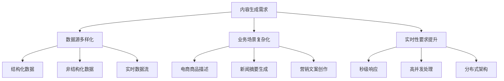
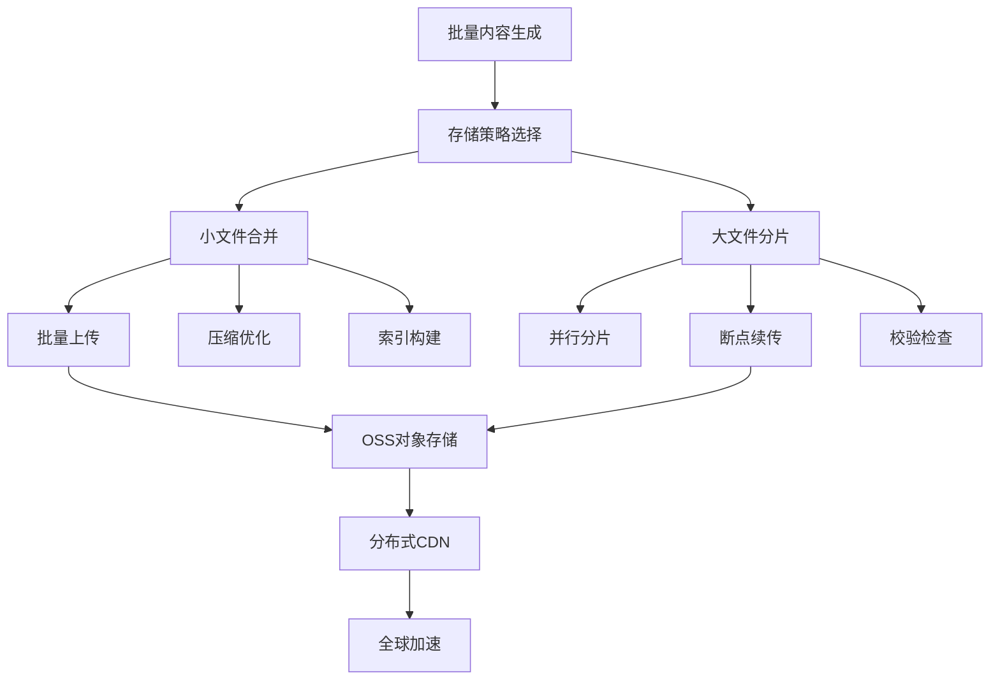
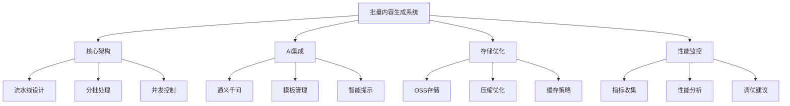

# Golang批量内容生成与阿里云SDK深度实践

## 一、引言：内容生成的时代背景

在数字化转型的浪潮中，批量内容生成已成为企业运营的核心需求。无论是电商平台的商品描述、新闻媒体的摘要生成，还是营销团队的广告创意，都需要高效、智能的内容生成能力。



Golang凭借其卓越的并发性能和高效的执行效率，成为构建批量内容生成系统的理想选择。结合阿里云强大的云服务生态，我们可以构建出企业级的内容生成平台。

## 二、Golang批量内容生成架构设计

### 2.1 核心架构模式

```go
package batchgeneration

import (
    "context"
    "fmt"
    "log"
    "sync"
    "time"
)

// GenerationPipeline 内容生成流水线
type GenerationPipeline struct {
    stages     []PipelineStage
    bufferSize int
    workers    int
}

// PipelineStage 流水线阶段接口
type PipelineStage interface {
    Process(ctx context.Context, input []ContentItem) ([]ContentItem, error)
    Name() string
}

// ContentItem 内容项
type ContentItem struct {
    ID          string                 `json:"id"`
    Source      string                 `json:"source"`
    RawData     interface{}            `json:"raw_data"`
    Processed   bool                   `json:"processed"`
    Generated   string                 `json:"generated"`
    Metadata    map[string]interface{} `json:"metadata"`
    CreatedAt   time.Time              `json:"created_at"`
    ProcessedAt time.Time              `json:"processed_at"`
}

// NewGenerationPipeline 创建生成流水线
func NewGenerationPipeline(stages []PipelineStage, bufferSize, workers int) *GenerationPipeline {
    return &GenerationPipeline{
        stages:     stages,
        bufferSize: bufferSize,
        workers:    workers,
    }
}

// Execute 执行批量生成
func (gp *GenerationPipeline) Execute(ctx context.Context, items []ContentItem) error {
    if len(items) == 0 {
        return fmt.Errorf("输入内容项为空")
    }
    
    // 分批处理，避免内存溢出
    batchSize := gp.bufferSize
    batches := splitIntoBatches(items, batchSize)
    
    var wg sync.WaitGroup
    errorChan := make(chan error, len(batches))
    
    for _, batch := range batches {
        wg.Add(1)
        
        go func(batchItems []ContentItem) {
            defer wg.Done()
            
            if err := gp.processBatch(ctx, batchItems); err != nil {
                errorChan <- fmt.Errorf("批次处理失败: %w", err)
            }
        }(batch)
    }
    
    wg.Wait()
    close(errorChan)
    
    // 收集错误
    var errors []error
    for err := range errorChan {
        errors = append(errors, err)
    }
    
    if len(errors) > 0 {
        return fmt.Errorf("批量处理完成，但有%d个错误: %v", len(errors), errors)
    }
    
    return nil
}

// processBatch 处理单个批次
func (gp *GenerationPipeline) processBatch(ctx context.Context, items []ContentItem) error {
    var result []ContentItem = items
    
    for _, stage := range gp.stages {
        select {
        case <-ctx.Done():
            return ctx.Err()
        default:
            processed, err := stage.Process(ctx, result)
            if err != nil {
                return fmt.Errorf("阶段[%s]处理失败: %w", stage.Name(), err)
            }
            result = processed
        }
    }
    
    return nil
}

// splitIntoBatches 分批处理
func splitIntoBatches(items []ContentItem, batchSize int) [][]ContentItem {
    var batches [][]ContentItem
    
    for i := 0; i < len(items); i += batchSize {
        end := i + batchSize
        if end > len(items) {
            end = len(items)
        }
        batches = append(batches, items[i:end])
    }
    
    return batches
}
```

### 2.2 内容预处理阶段

```go
package preprocessing

import (
    "context"
    "fmt"
    "strings"
    "unicode"
)

// Preprocessor 内容预处理器
type Preprocessor struct {
    name string
}

func NewPreprocessor() *Preprocessor {
    return &Preprocessor{name: "内容预处理器"}
}

func (p *Preprocessor) Process(ctx context.Context, items []ContentItem) ([]ContentItem, error) {
    var processed []ContentItem
    
    for _, item := range items {
        cleaned := p.cleanContent(item)
        enriched := p.enrichMetadata(cleaned)
        normalized := p.normalizeData(enriched)
        
        processed = append(processed, normalized)
    }
    
    return processed, nil
}

func (p *Preprocessor) Name() string {
    return p.name
}

// cleanContent 内容清洗
func (p *Preprocessor) cleanContent(item ContentItem) ContentItem {
    if rawStr, ok := item.RawData.(string); ok {
        // 移除多余空格
        cleaned := strings.Join(strings.Fields(rawStr), " ")
        
        // 移除特殊字符
        cleaned = strings.Map(func(r rune) rune {
            if unicode.IsPrint(r) || unicode.IsSpace(r) {
                return r
            }
            return -1
        }, cleaned)
        
        item.RawData = cleaned
    }
    
    return item
}

// enrichMetadata 元数据丰富
func (p *Preprocessor) enrichMetadata(item ContentItem) ContentItem {
    if item.Metadata == nil {
        item.Metadata = make(map[string]interface{})
    }
    
    // 分析内容特征
    if rawStr, ok := item.RawData.(string); ok {
        item.Metadata["char_count"] = len(rawStr)
        item.Metadata["word_count"] = len(strings.Fields(rawStr))
        item.Metadata["language"] = p.detectLanguage(rawStr)
        item.Metadata["complexity"] = p.analyzeComplexity(rawStr)
    }
    
    return item
}

// normalizeData 数据标准化
func (p *Preprocessor) normalizeData(item ContentItem) ContentItem {
    // 统一数据格式
    item.CreatedAt = time.Now()
    if item.ID == "" {
        item.ID = generateContentID()
    }
    
    return item
}

// 辅助函数
func (p *Preprocessor) detectLanguage(text string) string {
    // 简单的语言检测实现
    // 实际项目中可以使用专门的库如 github.com/pemistahl/lingua-go
    
    chineseChars := 0
    englishChars := 0
    
    for _, char := range text {
        if unicode.In(char, unicode.Han) {
            chineseChars++
        } else if (char >= 'a' && char <= 'z') || (char >= 'A' && char <= 'Z') {
            englishChars++
        }
    }
    
    if chineseChars > englishChars {
        return "zh"
    }
    return "en"
}

func (p *Preprocessor) analyzeComplexity(text string) string {
    words := strings.Fields(text)
    avgWordLen := 0
    
    for _, word := range words {
        avgWordLen += len(word)
    }
    
    if len(words) > 0 {
        avgWordLen /= len(words)
    }
    
    if avgWordLen > 8 {
        return "high"
    } else if avgWordLen > 5 {
        return "medium"
    }
    return "low"
}

func generateContentID() string {
    return fmt.Sprintf("content_%d", time.Now().UnixNano())
}
```

## 三、阿里云AI服务深度集成

### 3.1 通义千问大模型集成

```go
package aliyunai

import (
    "context"
    "encoding/json"
    "fmt"
    "io"
    "net/http"
    "time"
)

// TongyiClient 通义千问客户端
type TongyiClient struct {
    APIKey     string
    BaseURL    string
    HTTPClient *http.Client
}

// NewTongyiClient 创建通义千问客户端
func NewTongyiClient(apiKey string) *TongyiClient {
    return &TongyiClient{
        APIKey:  apiKey,
        BaseURL: "https://dashscope.aliyuncs.com/api/v1/services/aigc/text-generation/generation",
        HTTPClient: &http.Client{
            Timeout: 30 * time.Second,
        },
    }
}

// GenerationRequest 生成请求
type GenerationRequest struct {
    Model      string                 `json:"model"`
    Input      GenerationInput        `json:"input"`
    Parameters GenerationParameters   `json:"parameters"`
}

type GenerationInput struct {
    Messages []Message `json:"messages"`
}

type Message struct {
    Role    string `json:"role"`
    Content string `json:"content"`
}

type GenerationParameters struct {
    ResultFormat string  `json:"result_format"`
    Seed         int64   `json:"seed,omitempty"`
    MaxTokens    int     `json:"max_tokens,omitempty"`
    TopP         float64 `json:"top_p,omitempty"`
    TopK         int     `json:"top_k,omitempty"`
    Temperature  float64 `json:"temperature,omitempty"`
}

// GenerationResponse 生成响应
type GenerationResponse struct {
    Output struct {
        Text         string `json:"text"`
        FinishReason string `json:"finish_reason"`
    } `json:"output"`
    Usage struct {
        InputTokens  int `json:"input_tokens"`
        OutputTokens int `json:"output_tokens"`
    } `json:"usage"`
}

// GenerateContent 生成内容
func (tc *TongyiClient) GenerateContent(ctx context.Context, prompt string) (string, error) {
    request := GenerationRequest{
        Model: "qwen-turbo",
        Input: GenerationInput{
            Messages: []Message{
                {
                    Role:    "user",
                    Content: prompt,
                },
            },
        },
        Parameters: GenerationParameters{
            ResultFormat: "message",
            MaxTokens:    2000,
            Temperature:  0.7,
        },
    }
    
    reqBody, err := json.Marshal(request)
    if err != nil {
        return "", fmt.Errorf("序列化请求失败: %w", err)
    }
    
    httpReq, err := http.NewRequestWithContext(ctx, "POST", tc.BaseURL, reqBody)
    if err != nil {
        return "", fmt.Errorf("创建HTTP请求失败: %w", err)
    }
    
    httpReq.Header.Set("Authorization", "Bearer "+tc.APIKey)
    httpReq.Header.Set("Content-Type", "application/json")
    
    resp, err := tc.HTTPClient.Do(httpReq)
    if err != nil {
        return "", fmt.Errorf("API请求失败: %w", err)
    }
    defer resp.Body.Close()
    
    if resp.StatusCode != http.StatusOK {
        body, _ := io.ReadAll(resp.Body)
        return "", fmt.Errorf("API返回错误状态码: %d, 响应: %s", resp.StatusCode, string(body))
    }
    
    var response GenerationResponse
    if err := json.NewDecoder(resp.Body).Decode(&response); err != nil {
        return "", fmt.Errorf("解析响应失败: %w", err)
    }
    
    return response.Output.Text, nil
}

// BatchGenerate 批量生成
func (tc *TongyiClient) BatchGenerate(ctx context.Context, prompts []string) ([]string, error) {
    var results []string
    var errors []error
    
    for _, prompt := range prompts {
        result, err := tc.GenerateContent(ctx, prompt)
        if err != nil {
            errors = append(errors, fmt.Errorf("提示词[%s]生成失败: %w", prompt[:min(len(prompt), 50)], err))
            continue
        }
        results = append(results, result)
    }
    
    if len(errors) > 0 {
        return results, fmt.Errorf("批量生成完成，但有%d个错误", len(errors))
    }
    
    return results, nil
}
```

### 3.2 AI生成阶段实现

```go
package generation

import (
    "context"
    "fmt"
    "strings"
)

// AIGenerator AI内容生成器
type AIGenerator struct {
    name     string
    client   *TongyiClient
    templates map[string]string
}

func NewAIGenerator(client *TongyiClient) *AIGenerator {
    return &AIGenerator{
        name:     "AI内容生成器",
        client:   client,
        templates: make(map[string]string),
    }
}

// RegisterTemplate 注册生成模板
func (ag *AIGenerator) RegisterTemplate(name, template string) {
    ag.templates[name] = template
}

func (ag *AIGenerator) Process(ctx context.Context, items []ContentItem) ([]ContentItem, error) {
    var processed []ContentItem
    
    for _, item := range items {
        // 检查是否需要生成
        if !item.Processed && ag.shouldGenerate(item) {
            generated, err := ag.generateContent(ctx, item)
            if err != nil {
                // 记录错误但继续处理其他项
                fmt.Printf("生成内容失败 (ID: %s): %v\n", item.ID, err)
                processed = append(processed, item)
                continue
            }
            
            item.Generated = generated
            item.Processed = true
            item.ProcessedAt = time.Now()
        }
        
        processed = append(processed, item)
    }
    
    return processed, nil
}

func (ag *AIGenerator) Name() string {
    return ag.name
}

// shouldGenerate 判断是否需要生成
func (ag *AIGenerator) shouldGenerate(item ContentItem) bool {
    // 基于元数据判断是否需要AI生成
    if complexity, ok := item.Metadata["complexity"].(string); ok {
        return complexity == "high" || complexity == "medium"
    }
    
    // 检查是否已经生成
    return !item.Processed && item.Generated == ""
}

// generateContent 生成内容
func (ag *AIGenerator) generateContent(ctx context.Context, item ContentItem) (string, error) {
    prompt := ag.buildPrompt(item)
    
    generated, err := ag.client.GenerateContent(ctx, prompt)
    if err != nil {
        return "", fmt.Errorf("AI内容生成失败: %w", err)
    }
    
    // 后处理
    generated = ag.postProcess(generated, item)
    
    return generated, nil
}

// buildPrompt 构建提示词
func (ag *AIGenerator) buildPrompt(item ContentItem) string {
    var prompt strings.Builder
    
    // 基础模板
    prompt.WriteString("你是一个专业的内容生成助手。请基于以下信息生成高质量的内容：\n\n")
    
    // 添加源数据
    if rawStr, ok := item.RawData.(string); ok {
        prompt.WriteString("原始内容：\n")
        prompt.WriteString(rawStr)
        prompt.WriteString("\n\n")
    }
    
    // 添加元数据要求
    prompt.WriteString("生成要求：\n")
    
    if language, ok := item.Metadata["language"].(string); ok {
        prompt.WriteString(fmt.Sprintf("- 语言：%s\n", language))
    }
    
    if complexity, ok := item.Metadata["complexity"].(string); ok {
        prompt.WriteString(fmt.Sprintf("- 复杂度：%s\n", complexity))
    }
    
    // 添加特定模板
    if templateName, ok := item.Metadata["template"].(string); ok {
        if template, exists := ag.templates[templateName]; exists {
            prompt.WriteString("\n模板要求：\n")
            prompt.WriteString(template)
        }
    }
    
    return prompt.String()
}

// postProcess 后处理
func (ag *AIGenerator) postProcess(content string, item ContentItem) string {
    // 清理多余的空行
    content = strings.ReplaceAll(content, "\n\n\n", "\n\n")
    
    // 移除可能的标记
    content = strings.ReplaceAll(content, "**", "")
    content = strings.ReplaceAll(content, "*", "")
    
    // 根据语言调整格式
    if language, ok := item.Metadata["language"].(string); ok && language == "zh" {
        // 中文特定的后处理
        content = strings.ReplaceAll(content, "。", "。\n")
    }
    
    return strings.TrimSpace(content)
}
```

## 四、阿里云OSS批量存储优化

### 4.1 高性能存储架构



```go
package ossstorage

import (
    "archive/zip"
    "bytes"
    "context"
    "fmt"
    "io"
    "log"
    "sync"
    "time"
    
    "github.com/aliyun/aliyun-oss-go-sdk/oss"
)

// BatchOSSManager 批量OSS存储管理器
type BatchOSSManager struct {
    client     *oss.Client
    bucket     *oss.Bucket
    batchSize  int
    maxWorkers int
}

// NewBatchOSSManager 创建批量存储管理器
func NewBatchOSSManager(endpoint, accessKeyID, accessKeySecret, bucketName string, batchSize, maxWorkers int) (*BatchOSSManager, error) {
    client, err := oss.New(endpoint, accessKeyID, accessKeySecret)
    if err != nil {
        return nil, fmt.Errorf("创建OSS客户端失败: %w", err)
    }
    
    bucket, err := client.Bucket(bucketName)
    if err != nil {
        return nil, fmt.Errorf("获取Bucket失败: %w", err)
    }
    
    return &BatchOSSManager{
        client:     client,
        bucket:     bucket,
        batchSize:  batchSize,
        maxWorkers: maxWorkers,
    }, nil
}

// ContentBatch 内容批次
type ContentBatch struct {
    ID        string
    Items     []ContentItem
    CreatedAt time.Time
    Size      int64
}

// StoreBatch 存储批次内容
func (bom *BatchOSSManager) StoreBatch(ctx context.Context, batch ContentBatch) error {
    if len(batch.Items) == 0 {
        return fmt.Errorf("批次内容为空")
    }
    
    // 根据内容大小选择存储策略
    if bom.shouldZip(batch) {
        return bom.storeZippedBatch(ctx, batch)
    }
    
    return bom.storeIndividualBatch(ctx, batch)
}

// shouldZip 判断是否需要压缩存储
func (bom *BatchOSSManager) shouldZip(batch ContentBatch) bool {
    totalSize := int64(0)
    
    for _, item := range batch.Items {
        if generated := item.Generated; generated != "" {
            totalSize += int64(len(generated))
        }
    }
    
    // 总大小超过1MB或文件数超过50个时压缩
    return totalSize > 1024*1024 || len(batch.Items) > 50
}

// storeZippedBatch 压缩存储批次
func (bom *BatchOSSManager) storeZippedBatch(ctx context.Context, batch ContentBatch) error {
    var zipBuffer bytes.Buffer
    zipWriter := zip.NewWriter(&zipBuffer)
    
    // 创建批次元数据文件
    metadata := bom.createBatchMetadata(batch)
    if err := bom.addFileToZip(zipWriter, "metadata.json", []byte(metadata)); err != nil {
        return fmt.Errorf("添加元数据文件失败: %w", err)
    }
    
    // 添加内容文件
    for i, item := range batch.Items {
        if item.Generated != "" {
            filename := fmt.Sprintf("content_%d.txt", i)
            if err := bom.addFileToZip(zipWriter, filename, []byte(item.Generated)); err != nil {
                return fmt.Errorf("添加内容文件失败: %w", err)
            }
        }
    }
    
    if err := zipWriter.Close(); err != nil {
        return fmt.Errorf("关闭zip写入器失败: %w", err)
    }
    
    // 上传到OSS
    objectKey := fmt.Sprintf("batches/%s/batch_%s.zip", time.Now().Format("2006/01/02"), batch.ID)
    
    err := bom.bucket.PutObject(objectKey, bytes.NewReader(zipBuffer.Bytes()))
    if err != nil {
        return fmt.Errorf("上传压缩批次失败: %w", err)
    }
    
    log.Printf("批次 %s 压缩存储成功，大小: %d bytes", batch.ID, zipBuffer.Len())
    return nil
}

// storeIndividualBatch 单独存储批次
func (bom *BatchOSSManager) storeIndividualBatch(ctx context.Context, batch ContentBatch) error {
    var wg sync.WaitGroup
    errorChan := make(chan error, len(batch.Items))
    semaphore := make(chan struct{}, bom.maxWorkers)
    
    for i, item := range batch.Items {
        if item.Generated == "" {
            continue
        }
        
        wg.Add(1)
        
        go func(index int, contentItem ContentItem) {
            defer wg.Done()
            
            semaphore <- struct{}{}
            defer func() { <-semaphore }()
            
            objectKey := fmt.Sprintf("contents/%s/%s_%d.txt", 
                time.Now().Format("2006/01/02"), batch.ID, index)
            
            err := bom.bucket.PutObject(objectKey, strings.NewReader(contentItem.Generated))
            if err != nil {
                errorChan <- fmt.Errorf("存储内容项失败: %w", err)
            }
        }(i, item)
    }
    
    wg.Wait()
    close(errorChan)
    
    // 收集错误
    var errors []error
    for err := range errorChan {
        errors = append(errors, err)
    }
    
    if len(errors) > 0 {
        return fmt.Errorf("批次存储完成，但有%d个错误", len(errors))
    }
    
    log.Printf("批次 %s 单独存储成功，共存储 %d 个文件", batch.ID, len(batch.Items))
    return nil
}

// addFileToZip 添加文件到zip
func (bom *BatchOSSManager) addFileToZip(zipWriter *zip.Writer, filename string, content []byte) error {
    writer, err := zipWriter.Create(filename)
    if err != nil {
        return err
    }
    
    _, err = writer.Write(content)
    return err
}

// createBatchMetadata 创建批次元数据
func (bom *BatchOSSManager) createBatchMetadata(batch ContentBatch) string {
    metadata := map[string]interface{}{
        "batch_id":     batch.ID,
        "item_count":   len(batch.Items),
        "created_at":   batch.CreatedAt.Format(time.RFC3339),
        "total_size":   batch.Size,
        "storage_type": bom.getStorageType(batch),
        "items":        bom.createItemMetadata(batch.Items),
    }
    
    jsonData, _ := json.MarshalIndent(metadata, "", "  ")
    return string(jsonData)
}

func (bom *BatchOSSManager) getStorageType(batch ContentBatch) string {
    if bom.shouldZip(batch) {
        return "zipped"
    }
    return "individual"
}

func (bom *BatchOSSManager) createItemMetadata(items []ContentItem) []map[string]interface{} {
    var itemMetadata []map[string]interface{}
    
    for _, item := range items {
        metadata := map[string]interface{}{
            "id":          item.ID,
            "source":      item.Source,
            "generated":   item.Generated != "",
            "created_at":   item.CreatedAt.Format(time.RFC3339),
            "char_count":   len(item.Generated),
        }
        
        if complexity, ok := item.Metadata["complexity"]; ok {
            metadata["complexity"] = complexity
        }
        
        itemMetadata = append(itemMetadata, metadata)
    }
    
    return itemMetadata
}
```

## 五、高级功能与性能优化

### 5.1 缓存与去重策略

```go
package optimization

import (
    "crypto/sha256"
    "encoding/hex"
    "fmt"
    "sync"
    "time"
)

// ContentCache 内容缓存管理器
type ContentCache struct {
    cache     map[string]*CacheEntry
    mu        sync.RWMutex
    maxSize   int
    ttl       time.Duration
}

// CacheEntry 缓存条目
type CacheEntry struct {
    Content   string
    CreatedAt time.Time
    AccessCount int
}

// NewContentCache 创建内容缓存
func NewContentCache(maxSize int, ttl time.Duration) *ContentCache {
    return &ContentCache{
        cache:   make(map[string]*CacheEntry),
        maxSize: maxSize,
        ttl:     ttl,
    }
}

// GenerateHash 生成内容哈希
func (cc *ContentCache) GenerateHash(content string) string {
    hash := sha256.Sum256([]byte(content))
    return hex.EncodeToString(hash[:])
}

// Get 获取缓存内容
func (cc *ContentCache) Get(hash string) (string, bool) {
    cc.mu.RLock()
    defer cc.mu.RUnlock()
    
    entry, exists := cc.cache[hash]
    if !exists {
        return "", false
    }
    
    // 检查是否过期
    if time.Since(entry.CreatedAt) > cc.ttl {
        return "", false
    }
    
    entry.AccessCount++
    return entry.Content, true
}

// Set 设置缓存内容
func (cc *ContentCache) Set(hash, content string) error {
    cc.mu.Lock()
    defer cc.mu.Unlock()
    
    // 清理过期条目
    cc.cleanup()
    
    // 检查缓存大小
    if len(cc.cache) >= cc.maxSize {
        cc.evictLRU()
    }
    
    cc.cache[hash] = &CacheEntry{
        Content:    content,
        CreatedAt:  time.Now(),
        AccessCount: 1,
    }
    
    return nil
}

// cleanup 清理过期条目
func (cc *ContentCache) cleanup() {
    now := time.Now()
    
    for hash, entry := range cc.cache {
        if now.Sub(entry.CreatedAt) > cc.ttl {
            delete(cc.cache, hash)
        }
    }
}

// evictLRU 淘汰最近最少使用的条目
func (cc *ContentCache) evictLRU() {
    var lruHash string
    var minAccessCount = int(^uint(0) >> 1) // 最大int值
    
    for hash, entry := range cc.cache {
        if entry.AccessCount < minAccessCount {
            minAccessCount = entry.AccessCount
            lruHash = hash
        }
    }
    
    if lruHash != "" {
        delete(cc.cache, lruHash)
    }
}

// DuplicateDetector 重复内容检测器
type DuplicateDetector struct {
    cache *ContentCache
}

func NewDuplicateDetector(cache *ContentCache) *DuplicateDetector {
    return &DuplicateDetector{
        cache: cache,
    }
}

// IsDuplicate 检测是否重复内容
func (dd *DuplicateDetector) IsDuplicate(content string) (bool, string) {
    hash := dd.cache.GenerateHash(content)
    
    if cached, exists := dd.cache.Get(hash); exists {
        return true, cached
    }
    
    return false, ""
}

// ProcessWithDeduplication 带去重的处理
func (dd *DuplicateDetector) ProcessWithDeduplication(content string, processor func(string) (string, error)) (string, error) {
    if isDuplicate, cached := dd.IsDuplicate(content); isDuplicate {
        return cached, nil
    }
    
    result, err := processor(content)
    if err != nil {
        return "", err
    }
    
    // 缓存结果
    hash := dd.cache.GenerateHash(content)
    if err := dd.cache.Set(hash, result); err != nil {
        fmt.Printf("缓存设置失败: %v\n", err)
    }
    
    return result, nil
}
```

### 5.2 性能监控与调优

```go
package monitoring

import (
    "context"
    "fmt"
    "runtime"
    "sync"
    "time"
)

// PerformanceMonitor 性能监控器
type PerformanceMonitor struct {
    metrics map[string]*Metric
    mu      sync.RWMutex
}

// Metric 性能指标
type Metric struct {
    Name      string
    Count     int64
    TotalTime time.Duration
    MinTime   time.Duration
    MaxTime   time.Duration
    Errors    int64
}

// NewPerformanceMonitor 创建性能监控器
func NewPerformanceMonitor() *PerformanceMonitor {
    return &PerformanceMonitor{
        metrics: make(map[string]*Metric),
    }
}

// Track 跟踪操作性能
func (pm *PerformanceMonitor) Track(ctx context.Context, name string, operation func() error) error {
    start := time.Now()
    
    // 记录内存使用
    var memStatsStart, memStatsEnd runtime.MemStats
    runtime.ReadMemStats(&memStatsStart)
    
    err := operation()
    
    duration := time.Since(start)
    runtime.ReadMemStats(&memStatsEnd)
    
    pm.mu.Lock()
    defer pm.mu.Unlock()
    
    metric, exists := pm.metrics[name]
    if !exists {
        metric = &Metric{Name: name}
        pm.metrics[name] = metric
    }
    
    metric.Count++
    metric.TotalTime += duration
    
    if duration < metric.MinTime || metric.MinTime == 0 {
        metric.MinTime = duration
    }
    
    if duration > metric.MaxTime {
        metric.MaxTime = duration
    }
    
    if err != nil {
        metric.Errors++
    }
    
    return err
}

// GetMetrics 获取性能指标
func (pm *PerformanceMonitor) GetMetrics() map[string]Metric {
    pm.mu.RLock()
    defer pm.mu.RUnlock()
    
    result := make(map[string]Metric)
    for name, metric := range pm.metrics {
        result[name] = *metric
    }
    
    return result
}

// GenerateReport 生成性能报告
func (pm *PerformanceMonitor) GenerateReport() string {
    metrics := pm.GetMetrics()
    
    var report strings.Builder
    report.WriteString("批量内容生成系统性能报告\n")
    report.WriteString("==========================\n\n")
    
    for name, metric := range metrics {
        avgTime := time.Duration(0)
        if metric.Count > 0 {
            avgTime = metric.TotalTime / time.Duration(metric.Count)
        }
        
        errorRate := float64(0)
        if metric.Count > 0 {
            errorRate = float64(metric.Errors) / float64(metric.Count) * 100
        }
        
        report.WriteString(fmt.Sprintf("操作: %s\n", name))
        report.WriteString(fmt.Sprintf("  执行次数: %d\n", metric.Count))
        report.WriteString(fmt.Sprintf("  平均耗时: %v\n", avgTime))
        report.WriteString(fmt.Sprintf("  最短耗时: %v\n", metric.MinTime))
        report.WriteString(fmt.Sprintf("  最长耗时: %v\n", metric.MaxTime))
        report.WriteString(fmt.Sprintf("  错误率: %.2f%%\n", errorRate))
        report.WriteString("\n")
    }
    
    // 添加系统信息
    var memStats runtime.MemStats
    runtime.ReadMemStats(&memStats)
    
    report.WriteString("系统资源信息\n")
    report.WriteString("=============\n")
    report.WriteString(fmt.Sprintf("内存使用: %.2f MB\n", float64(memStats.Alloc)/1024/1024))
    report.WriteString(fmt.Sprintf("协程数量: %d\n", runtime.NumGoroutine()))
    
    return report.String()
}
```

## 六、实战案例：电商商品描述批量生成

### 6.1 电商内容生成系统

```go
package ecommerce

import (
    "context"
    "encoding/json"
    "fmt"
    "log"
    "strconv"
)

// ProductDescriptionGenerator 商品描述生成器
type ProductDescriptionGenerator struct {
    pipeline *batchgeneration.GenerationPipeline
    cache    *optimization.ContentCache
    monitor  *monitoring.PerformanceMonitor
}

// ProductInfo 商品信息
type ProductInfo struct {
    ID          string            `json:"id"`
    Name        string            `json:"name"`
    Category    string            `json:"category"`
    Price       float64           `json:"price"`
    Attributes  map[string]string `json:"attributes"`
    Features    []string          `json:"features"`
    ImageURL    string            `json:"image_url"`
}

// NewProductDescriptionGenerator 创建商品描述生成器
func NewProductDescriptionGenerator(aiClient *aliyunai.TongyiClient) *ProductDescriptionGenerator {
    // 创建流水线阶段
    stages := []batchgeneration.PipelineStage{
        preprocessing.NewPreprocessor(),
        generation.NewAIGenerator(aiClient),
    }
    
    pipeline := batchgeneration.NewGenerationPipeline(stages, 100, 10)
    cache := optimization.NewContentCache(10000, 24*time.Hour)
    monitor := monitoring.NewPerformanceMonitor()
    
    generator := &ProductDescriptionGenerator{
        pipeline: pipeline,
        cache:    cache,
        monitor:  monitor,
    }
    
    // 注册商品描述模板
    generator.registerTemplates()
    
    return generator
}

func (pdg *ProductDescriptionGenerator) registerTemplates() {
    templates := map[string]string{
        "electronics": `请为电子产品生成吸引人的描述，重点突出：
1. 核心功能和性能参数
2. 用户使用场景和价值
3. 技术亮点和创新点
4. 品质保证和售后服务
描述要求专业、详细、有说服力`,
        
        "clothing": `请为服装产品生成优美的描述，重点突出：
1. 材质特点和穿着感受
2. 设计理念和风格定位
3. 适用场合和搭配建议
4. 尺码准确性和舒适度
描述要生动、感性、有画面感`,
        
        "cosmetics": `请为化妆品生成精致的描述，重点突出：
1. 成分功效和安全性
2. 使用效果和感受
3. 品牌故事和理念
4. 适用肤质和使用方法
描述要专业、温和、有吸引力`,
    }
    
    for name, template := range templates {
        fmt.Printf("注册模板: %s\n", name)
        // 这里需要将模板注册到AI生成器
    }
}

// GenerateBatchProductDescriptions 批量生成商品描述
func (pdg *ProductDescriptionGenerator) GenerateBatchProductDescriptions(ctx context.Context, products []ProductInfo) ([]ContentItem, error) {
    // 转换为内容项
    var items []batchgeneration.ContentItem
    
    for _, product := range products {
        rawData, err := json.Marshal(product)
        if err != nil {
            return nil, fmt.Errorf("序列化商品信息失败: %w", err)
        }
        
        item := batchgeneration.ContentItem{
            ID:        product.ID,
            Source:    "ecommerce",
            RawData:   string(rawData),
            Metadata:  pdg.buildProductMetadata(product),
            CreatedAt: time.Now(),
        }
        
        items = append(items, item)
    }
    
    // 执行批量生成
    err := pdg.monitor.Track(ctx, "batch_product_generation", func() error {
        return pdg.pipeline.Execute(ctx, items)
    })
    
    if err != nil {
        return nil, fmt.Errorf("批量生成失败: %w", err)
    }
    
    // 生成性能报告
    report := pdg.monitor.GenerateReport()
    log.Printf("批量生成完成，性能报告:\n%s", report)
    
    return items, nil
}

// buildProductMetadata 构建商品元数据
func (pdg *ProductDescriptionGenerator) buildProductMetadata(product ProductInfo) map[string]interface{} {
    metadata := map[string]interface{}{
        "category":     product.Category,
        "price":        product.Price,
        "feature_count": len(product.Features),
        "template":     product.Category, // 使用品类作为模板
    }
    
    // 根据价格设置复杂度
    if product.Price > 1000 {
        metadata["complexity"] = "high"
    } else if product.Price > 100 {
        metadata["complexity"] = "medium"
    } else {
        metadata["complexity"] = "low"
    }
    
    return metadata
}

// 使用示例
func main() {
    // 初始化AI客户端
    aiClient := aliyunai.NewTongyiClient("your-api-key")
    
    // 创建生成器
    generator := NewProductDescriptionGenerator(aiClient)
    
    // 模拟商品数据
    products := []ProductInfo{
        {
            ID:       "p001",
            Name:     "iPhone 15 Pro",
            Category: "electronics",
            Price:    8999.00,
            Features: []string{"A17 Pro芯片", "钛合金机身", "4800万像素主摄", "USB-C接口"},
        },
        {
            ID:       "p002", 
            Name:     "纯棉T恤",
            Category: "clothing",
            Price:    89.90,
            Features: []string{"100%纯棉", "舒适透气", "多种颜色", "标准版型"},
        },
    }
    
    // 批量生成描述
    ctx := context.Background()
    items, err := generator.GenerateBatchProductDescriptions(ctx, products)
    if err != nil {
        log.Fatalf("生成失败: %v", err)
    }
    
    // 输出结果
    for _, item := range items {
        if item.Generated != "" {
            log.Printf("商品 %s 描述生成成功:\n%s\n", item.ID, item.Generated)
        }
    }
}
```

### 7.1 技术要点回顾


