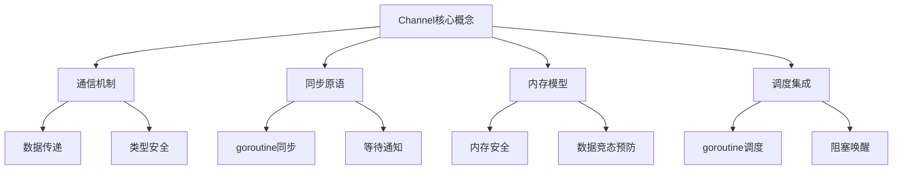
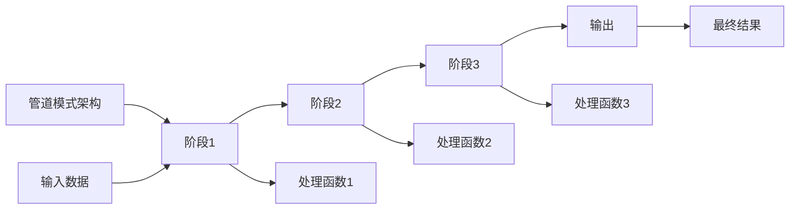
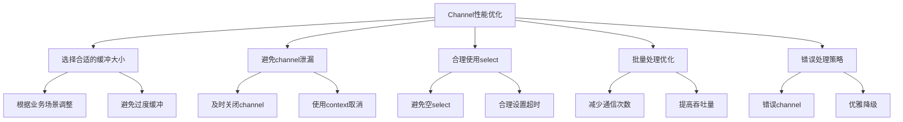
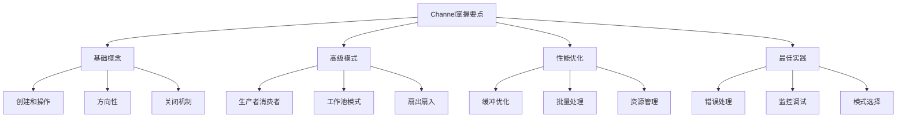

# Golang Channel深度解析：并发编程的核心利器

## 一、Channel基础：Golang的并发通信桥梁

Channel是Golang并发编程的核心特性，它提供了goroutine之间的安全通信机制。理解Channel的底层原理和正确使用方式，是掌握Go并发编程的关键。



### 1.1 Channel的基本操作

```go
package channel_basics

import (
    "fmt"
    "time"
)

func BasicChannelOperations() {
    fmt.Println("=== Channel基本操作 ===")
    
    // 1. 创建channel
    // 无缓冲channel
    ch1 := make(chan int)
    fmt.Printf("无缓冲channel: %T\n", ch1)
    
    // 有缓冲channel
    ch2 := make(chan string, 5)
    fmt.Printf("有缓冲channel(容量5): %T\n", ch2)
    
    // 2. 发送和接收操作
    go func() {
        fmt.Println("goroutine: 准备发送数据...")
        ch1 <- 42 // 发送数据
        fmt.Println("goroutine: 数据发送完成")
    }()
    
    // 主goroutine接收数据
    fmt.Println("主goroutine: 等待接收数据...")
    value := <-ch1
    fmt.Printf("主goroutine: 接收到数据: %d\n", value)
    
    // 3. 带缓冲channel的异步操作
    fmt.Println("\n=== 缓冲channel演示 ===")
    for i := 0; i < 3; i++ {
        ch2 <- fmt.Sprintf("消息%d", i)
        fmt.Printf("发送消息%d到缓冲channel\n", i)
    }
    
    // 从缓冲channel接收
    for i := 0; i < 3; i++ {
        msg := <-ch2
        fmt.Printf("从缓冲channel接收: %s\n", msg)
    }
}

// Channel的方向性
func ChannelDirectionDemo() {
    fmt.Println("\n=== Channel方向性 ===")
    
    // 只发送channel
    var sendOnly chan<- int = make(chan int, 1)
    
    // 只接收channel
    var receiveOnly <-chan int = make(chan int, 1)
    
    // 双向channel
    bidirectional := make(chan int, 1)
    
    // 使用示例
    sendOnly <- 100 // 可以发送
    // value := <-sendOnly // 编译错误：不能从只发送channel接收
    
    // 可以接收
    bidirectional <- 200
    value := <-bidirectional
    fmt.Printf("从双向channel接收: %d\n", value)
    
    // 类型转换
    sendOnly = bidirectional // 双向可以转为只发送
    receiveOnly = bidirectional // 双向可以转为只接收
    
    fmt.Println("Channel方向性演示完成")
}

// Channel的关闭操作
func ChannelCloseDemo() {
    fmt.Println("\n=== Channel关闭操作 ===")
    
    ch := make(chan int, 3)
    
    // 发送数据
    ch <- 1
    ch <- 2
    ch <- 3
    
    // 关闭channel
    close(ch)
    fmt.Println("Channel已关闭")
    
    // 关闭后可以继续接收剩余数据
    for i := 0; i < 3; i++ {
        if value, ok := <-ch; ok {
            fmt.Printf("接收数据: %d\n", value)
        } else {
            fmt.Println("Channel已关闭且无数据")
        }
    }
    
    // 再次接收会得到零值
    value, ok := <-ch
    fmt.Printf("关闭后接收: value=%d, ok=%t\n", value, ok)
    
    // 向已关闭的channel发送会导致panic
    // ch <- 4 // 这行会panic
}

// select多路复用
func SelectDemo() {
    fmt.Println("\n=== select多路复用 ===")
    
    ch1 := make(chan string)
    ch2 := make(chan string)
    
    // 启动两个goroutine分别向不同channel发送数据
    go func() {
        time.Sleep(1 * time.Second)
        ch1 <- "来自ch1的消息"
    }()
    
    go func() {
        time.Sleep(2 * time.Second)
        ch2 <- "来自ch2的消息"
    }()
    
    // 使用select等待多个channel
    for i := 0; i < 2; i++ {
        select {
        case msg1 := <-ch1:
            fmt.Printf("接收到: %s\n", msg1)
        case msg2 := <-ch2:
            fmt.Printf("接收到: %s\n", msg2)
        case <-time.After(3 * time.Second):
            fmt.Println("超时!")
            return
        }
    }
    
    fmt.Println("select演示完成")
}

func main() {
    BasicChannelOperations()
    ChannelDirectionDemo()
    ChannelCloseDemo()
    SelectDemo()
}
```

## 二、Channel的内部实现原理

### 2.1 Channel的数据结构

```go
package channel_internal

import (
    "fmt"
    "runtime"
    "unsafe"
)

// Channel内部结构简化表示
// 实际实现位于runtime/chan.go
type hchan struct {
    qcount   uint           // Channel中的元素数量
    dataqsiz uint           // 循环队列的大小
    buf      unsafe.Pointer // 指向循环队列的指针
    elemsize uint16         // 每个元素的大小
    closed   uint32         // Channel是否已关闭
    elemtype unsafe.Pointer // 元素类型
    sendx    uint           // 发送索引
    recvx    uint           // 接收索引
    recvq    waitq          // 等待接收的goroutine队列
    sendq    waitq          // 等待发送的goroutine队列
    lock     mutex          // 互斥锁
}

// 等待队列
type waitq struct {
    first *sudog
    last  *sudog
}

// Channel内存布局分析
func AnalyzeChannelMemory() {
    fmt.Println("=== Channel内存布局分析 ===")
    
    // 创建不同容量的channel并分析内存使用
    capacities := []int{0, 1, 10, 100, 1000}
    
    for _, cap := range capacities {
        var ch interface{}
        var memStats1, memStats2 runtime.MemStats
        
        runtime.GC()
        runtime.ReadMemStats(&memStats1)
        
        // 创建channel
        if cap == 0 {
            ch = make(chan int)
        } else {
            ch = make(chan int, cap)
        }
        
        runtime.GC()
        runtime.ReadMemStats(&memStats2)
        
        memoryUsed := memStats2.HeapAlloc - memStats1.HeapAlloc
        
        fmt.Printf("容量=%4d: 内存使用≈%6d bytes\n", cap, memoryUsed)
        
        // 确保channel被引用，防止GC
        _ = ch
    }
}

// 无缓冲channel的实现机制
func UnbufferedChannelMechanism() {
    fmt.Println("\n=== 无缓冲channel机制 ===")
    
    ch := make(chan int) // 无缓冲channel
    
    fmt.Println("无缓冲channel特点:")
    fmt.Println("1. 发送和接收操作必须同时准备好")
    fmt.Println("2. 数据直接从发送方拷贝到接收方")
    fmt.Println("3. 提供了强同步保证")
    
    // 演示无缓冲channel的同步特性
    go func() {
        fmt.Println("发送方: 准备发送数据...")
        ch <- 123
        fmt.Println("发送方: 数据发送完成，继续执行")
    }()
    
    time.Sleep(1 * time.Second) // 确保发送方先阻塞
    fmt.Println("接收方: 准备接收数据...")
    value := <-ch
    fmt.Printf("接收方: 接收到数据 %d，继续执行\n", value)
    
    time.Sleep(100 * time.Millisecond) // 让goroutine完成
}

// 有缓冲channel的实现机制
func BufferedChannelMechanism() {
    fmt.Println("\n=== 有缓冲channel机制 ===")
    
    ch := make(chan int, 3) // 容量为3的缓冲channel
    
    fmt.Println("有缓冲channel特点:")
    fmt.Println("1. 缓冲区未满时发送不会阻塞")
    fmt.Println("2. 缓冲区不为空时接收不会阻塞")
    fmt.Println("3. 提供了异步通信能力")
    
    // 演示缓冲channel的异步特性
    fmt.Println("=== 发送阶段 ===")
    for i := 1; i <= 3; i++ {
        ch <- i
        fmt.Printf("发送 %d (缓冲区使用: %d/3)\n", i, i)
    }
    
    fmt.Println("=== 接收阶段 ===")
    for i := 1; i <= 3; i++ {
        value := <-ch
        fmt.Printf("接收 %d (缓冲区剩余: %d/3)\n", value, 3-i)
    }
}

// Channel的阻塞和唤醒机制
func BlockingAndWakeupMechanism() {
    fmt.Println("\n=== Channel阻塞和唤醒机制 ===")
    
    ch := make(chan int)
    
    fmt.Println("阻塞机制:")
    fmt.Println("1. 发送到无缓冲channel时，如果无接收方则阻塞")
    fmt.Println("2. 从空channel接收时，如果无发送方则阻塞")
    fmt.Println("3. 阻塞的goroutine被放入等待队列")
    
    // 演示阻塞和唤醒
    go func() {
        fmt.Println("goroutine1: 尝试发送数据（将阻塞）")
        ch <- 100
        fmt.Println("goroutine1: 发送完成（被唤醒）")
    }()
    
    time.Sleep(2 * time.Second)
    
    go func() {
        fmt.Println("goroutine2: 准备接收数据（将唤醒发送方）")
        value := <-ch
        fmt.Printf("goroutine2: 接收到数据 %d\n", value)
    }()
    
    time.Sleep(1 * time.Second)
    fmt.Println("主goroutine: 观察阻塞和唤醒过程完成")
}

func main() {
    AnalyzeChannelMemory()
    UnbufferedChannelMechanism()
    BufferedChannelMechanism()
    BlockingAndWakeupMechanism()
}
```

### 2.2 Channel的性能特性

```go
package channel_performance

import (
    "fmt"
    "sync"
    "sync/atomic"
    "time"
)

// Channel性能基准测试
func ChannelPerformanceBenchmark() {
    fmt.Println("=== Channel性能基准测试 ===")
    
    testCases := []struct {
        name        string
        bufferSize  int
        messageSize int
        goroutines  int
    }{
        {"无缓冲-小消息-10协程", 0, 1, 10},
        {"缓冲10-小消息-10协程", 10, 1, 10},
        {"无缓冲-大消息-100协程", 0, 1000, 100},
        {"缓冲100-大消息-100协程", 100, 1000, 100},
    }
    
    for _, tc := range testCases {
        duration := benchmarkChannel(tc.bufferSize, tc.messageSize, tc.goroutines)
        fmt.Printf("%-30s: %v\n", tc.name, duration)
    }
}

func benchmarkChannel(bufferSize, messageSize, goroutines int) time.Duration {
    ch := make(chan []byte, bufferSize)
    var wg sync.WaitGroup
    
    // 准备测试数据
    message := make([]byte, messageSize)
    for i := range message {
        message[i] = byte(i % 256)
    }
    
    start := time.Now()
    
    // 启动生产者
    wg.Add(goroutines)
    for i := 0; i < goroutines; i++ {
        go func(id int) {
            defer wg.Done()
            for j := 0; j < 1000; j++ {
                ch <- message
            }
        }(i)
    }
    
    // 启动消费者
    wg.Add(goroutines)
    for i := 0; i < goroutines; i++ {
        go func(id int) {
            defer wg.Done()
            for j := 0; j < 1000; j++ {
                <-ch
            }
        }(i)
    }
    
    wg.Wait()
    close(ch)
    
    return time.Since(start)
}

// Channel vs Mutex性能对比
func ChannelVsMutexPerformance() {
    fmt.Println("\n=== Channel vs Mutex性能对比 ===")
    
    const operations = 1000000
    
    // 测试1: 使用Channel
    fmt.Println("测试1: 使用Channel")
    ch := make(chan int, 1)
    ch <- 0 // 初始值
    
    start := time.Now()
    var wg sync.WaitGroup
    
    for i := 0; i < operations; i++ {
        wg.Add(1)
        go func() {
            defer wg.Done()
            current := <-ch
            ch <- current + 1
        }()
    }
    
    wg.Wait()
    finalValue := <-ch
    channelTime := time.Since(start)
    
    fmt.Printf("Channel最终值: %d, 耗时: %v\n", finalValue, channelTime)
    
    // 测试2: 使用Mutex
    fmt.Println("测试2: 使用Mutex")
    var mutex sync.Mutex
    counter := 0
    
    start = time.Now()
    
    for i := 0; i < operations; i++ {
        wg.Add(1)
        go func() {
            defer wg.Done()
            mutex.Lock()
            counter++
            mutex.Unlock()
        }()
    }
    
    wg.Wait()
    mutexTime := time.Since(start)
    
    fmt.Printf("Mutex最终值: %d, 耗时: %v\n", counter, mutexTime)
    
    fmt.Printf("性能对比: Channel/Mutex = %.2f\n", 
        float64(channelTime)/float64(mutexTime))
}

// 不同数据类型的Channel性能
func DataTypePerformance() {
    fmt.Println("\n=== 不同数据类型Channel性能 ===")
    
    const iterations = 100000
    
    // 小数据类型
    smallCh := make(chan int, 100)
    start := time.Now()
    for i := 0; i < iterations; i++ {
        smallCh <- i
        <-smallCh
    }
    smallTime := time.Since(start)
    
    // 大数据类型
    type LargeStruct struct {
        data [100]int
        name string
    }
    largeCh := make(chan LargeStruct, 100)
    start = time.Now()
    for i := 0; i < iterations; i++ {
        largeCh <- LargeStruct{name: "test"}
        <-largeCh
    }
    largeTime := time.Since(start)
    
    // 指针类型
    ptrCh := make(chan *LargeStruct, 100)
    start = time.Now()
    for i := 0; i < iterations; i++ {
        ptrCh <- &LargeStruct{name: "test"}
        <-ptrCh
    }
    ptrTime := time.Since(start)
    
    fmt.Printf("小数据类型(int): %v\n", smallTime)
    fmt.Printf("大数据类型(struct): %v\n", largeTime)
    fmt.Printf("指针类型(*struct): %v\n", ptrTime)
    
    fmt.Printf("指针/小数据性能比: %.2f\n", float64(ptrTime)/float64(smallTime))
    fmt.Printf("大数据/小数据性能比: %.2f\n", float64(largeTime)/float64(smallTime))
}

// Channel的并发安全特性
func ChannelConcurrencySafety() {
    fmt.Println("\n=== Channel并发安全特性 ===")
    
    // 演示Channel的线程安全性
    ch := make(chan int, 100)
    var wg sync.WaitGroup
    var sendCount int64
    var receiveCount int64
    
    const goroutines = 10
    const operations = 10000
    
    // 并发发送
    for i := 0; i < goroutines; i++ {
        wg.Add(1)
        go func(id int) {
            defer wg.Done()
            for j := 0; j < operations; j++ {
                ch <- id*operations + j
                atomic.AddInt64(&sendCount, 1)
            }
        }(i)
    }
    
    // 并发接收
    for i := 0; i < goroutines; i++ {
        wg.Add(1)
        go func(id int) {
            defer wg.Done()
            for j := 0; j < operations; j++ {
                <-ch
                atomic.AddInt64(&receiveCount, 1)
            }
        }(i)
    }
    
    wg.Wait()
    close(ch)
    
    fmt.Printf("发送总数: %d\n", sendCount)
    fmt.Printf("接收总数: %d\n", receiveCount)
    fmt.Printf("Channel中剩余元素: %d\n", len(ch))
    
    // 验证数据一致性
    if sendCount == receiveCount && len(ch) == 0 {
        fmt.Println("✓ Channel并发操作数据一致性验证通过")
    } else {
        fmt.Println("✗ Channel并发操作数据一致性验证失败")
    }
}

func main() {
    ChannelPerformanceBenchmark()
    ChannelVsMutexPerformance()
    DataTypePerformance()
    ChannelConcurrencySafety()
}
```

## 三、Channel的高级模式和应用

### 3.1 生产者-消费者模式

```go
package advanced_patterns

import (
    "fmt"
    "math/rand"
    "sync"
    "time"
)

// 基本生产者-消费者模式
type ProducerConsumer struct {
    jobs    chan int
    results chan string
    wg      sync.WaitGroup
}

func NewProducerConsumer(workerCount, jobBufferSize int) *ProducerConsumer {
    return &ProducerConsumer{
        jobs:    make(chan int, jobBufferSize),
        results: make(chan string, jobBufferSize),
    }
}

func (pc *ProducerConsumer) Produce(jobCount int) {
    go func() {
        for i := 0; i < jobCount; i++ {
            job := i + 1
            fmt.Printf("生产者: 生成任务 %d\n", job)
            pc.jobs <- job
            time.Sleep(time.Duration(rand.Intn(100)) * time.Millisecond)
        }
        close(pc.jobs)
        fmt.Println("生产者: 所有任务已生成")
    }()
}

func (pc *ProducerConsumer) Consume(workerID int) {
    pc.wg.Add(1)
    go func() {
        defer pc.wg.Done()
        
        for job := range pc.jobs {
            fmt.Printf("消费者%d: 处理任务 %d\n", workerID, job)
            
            // 模拟处理时间
            processTime := time.Duration(100+rand.Intn(200)) * time.Millisecond
            time.Sleep(processTime)
            
            result := fmt.Sprintf("任务%d完成(耗时%v)", job, processTime)
            pc.results <- result
        }
        
        fmt.Printf("消费者%d: 任务处理完成\n", workerID)
    }()
}

func (pc *ProducerConsumer) Start(workerCount, jobCount int) {
    // 启动消费者
    for i := 0; i < workerCount; i++ {
        pc.Consume(i + 1)
    }
    
    // 启动生产者
    pc.Produce(jobCount)
    
    // 等待所有消费者完成
    go func() {
        pc.wg.Wait()
        close(pc.results)
        fmt.Println("所有消费者已完成")
    }()
}

func (pc *ProducerConsumer) GetResults() <-chan string {
    return pc.results
}

// 工作池模式
type WorkerPool struct {
    taskQueue chan Task
    workerCount int
    wg sync.WaitGroup
}

type Task struct {
    ID   int
    Data interface{}
}

type TaskResult struct {
    TaskID int
    Result interface{}
    Error  error
}

func NewWorkerPool(workerCount, queueSize int) *WorkerPool {
    return &WorkerPool{
        taskQueue:   make(chan Task, queueSize),
        workerCount: workerCount,
    }
}

func (wp *WorkerPool) Start() {
    for i := 0; i < wp.workerCount; i++ {
        wp.wg.Add(1)
        go wp.worker(i + 1)
    }
}

func (wp *WorkerPool) worker(id int) {
    defer wp.wg.Done()
    
    for task := range wp.taskQueue {
        fmt.Printf("工作者%d: 处理任务 %d\n", id, task.ID)
        
        // 模拟任务处理
        time.Sleep(time.Duration(100+rand.Intn(200)) * time.Millisecond)
        
        // 这里可以添加实际的任务处理逻辑
        fmt.Printf("工作者%d: 任务 %d 完成\n", id, task.ID)
    }
    
    fmt.Printf("工作者%d: 退出\n", id)
}

func (wp *WorkerPool) Submit(task Task) {
    wp.taskQueue <- task
}

func (wp *WorkerPool) Stop() {
    close(wp.taskQueue)
    wp.wg.Wait()
    fmt.Println("工作池已停止")
}

// 扇出扇入模式
func FanOutFanInPattern() {
    fmt.Println("\n=== 扇出扇入模式 ===")
    
    // 输入channel
    input := make(chan int, 10)
    
    // 扇出：多个worker处理同一个输入channel
    worker1 := fanOutWorker(input, "Worker1")
    worker2 := fanOutWorker(input, "Worker2")
    worker3 := fanOutWorker(input, "Worker3")
    
    // 扇入：合并多个worker的输出
    merged := fanIn(worker1, worker2, worker3)
    
    // 生产数据
    go func() {
        for i := 1; i <= 9; i++ {
            input <- i
        }
        close(input)
    }()
    
    // 消费合并后的结果
    for result := range merged {
        fmt.Printf("最终结果: %s\n", result)
    }
}

func fanOutWorker(input <-chan int, name string) <-chan string {
    output := make(chan string)
    
    go func() {
        defer close(output)
        for num := range input {
            result := fmt.Sprintf("%s处理%d->%d", name, num, num*num)
            output <- result
            time.Sleep(100 * time.Millisecond)
        }
    }()
    
    return output
}

func fanIn(inputs ...<-chan string) <-chan string {
    output := make(chan string)
    var wg sync.WaitGroup
    
    for _, input := range inputs {
        wg.Add(1)
        go func(ch <-chan string) {
            defer wg.Done()
            for item := range ch {
                output <- item
            }
        }(input)
    }
    
    go func() {
        wg.Wait()
        close(output)
    }()
    
    return output
}

func main() {
    fmt.Println("=== 生产者-消费者模式演示 ===")
    
    pc := NewProducerConsumer(3, 5)
    pc.Start(3, 10)
    
    // 收集结果
    for result := range pc.GetResults() {
        fmt.Printf("结果: %s\n", result)
    }
    
    fmt.Println("\n=== 工作池模式演示 ===")
    
    wp := NewWorkerPool(2, 5)
    wp.Start()
    
    // 提交任务
    for i := 1; i <= 5; i++ {
        wp.Submit(Task{ID: i, Data: fmt.Sprintf("任务数据%d", i)})
    }
    
    time.Sleep(1 * time.Second) // 等待任务处理
    wp.Stop()
    
    FanOutFanInPattern()
}
```

### 3.2 高级并发模式

```go
package advanced_concurrency

import (
    "context"
    "fmt"
    "sync"
    "time"
)

// 超时控制模式
func TimeoutPattern() {
    fmt.Println("=== 超时控制模式 ===")
    
    // 模拟一个耗时操作
    longRunningTask := func() chan string {
        result := make(chan string)
        
        go func() {
            time.Sleep(3 * time.Second) // 模拟耗时操作
            result <- "任务完成"
        }()
        
        return result
    }
    
    // 设置超时
    select {
    case result := <-longRunningTask():
        fmt.Printf("成功: %s\n", result)
    case <-time.After(2 * time.Second):
        fmt.Println("超时: 任务执行时间过长")
    }
}

// 上下文取消模式
func ContextCancellationPattern() {
    fmt.Println("\n=== 上下文取消模式 ===")
    
    ctx, cancel := context.WithCancel(context.Background())
    
    // 启动多个工作goroutine
    var wg sync.WaitGroup
    
    for i := 1; i <= 3; i++ {
        wg.Add(1)
        go worker(ctx, &wg, i)
    }
    
    // 运行一段时间后取消
    time.Sleep(2 * time.Second)
    fmt.Println("主程序: 发送取消信号")
    cancel()
    
    wg.Wait()
    fmt.Println("所有worker已退出")
}

func worker(ctx context.Context, wg *sync.WaitGroup, id int) {
    defer wg.Done()
    
    for {
        select {
        case <-ctx.Done():
            fmt.Printf("Worker%d: 接收到取消信号，退出\n", id)
            return
        default:
            fmt.Printf("Worker%d: 正在工作...\n", id)
            time.Sleep(500 * time.Millisecond)
        }
    }
}

// 速率限制模式
type RateLimiter struct {
    tokens chan struct{}
    ticker *time.Ticker
}

func NewRateLimiter(ratePerSecond int) *RateLimiter {
    rl := &RateLimiter{
        tokens: make(chan struct{}, ratePerSecond),
        ticker: time.NewTicker(time.Second / time.Duration(ratePerSecond)),
    }
    
    // 定期添加令牌
    go func() {
        for range rl.ticker.C {
            select {
            case rl.tokens <- struct{}{}:
            default:
                // 令牌桶已满，跳过
            }
        }
    }()
    
    return rl
}

func (rl *RateLimiter) Allow() bool {
    select {
    case <-rl.tokens:
        return true
    default:
        return false
    }
}

func (rl *RateLimiter) Stop() {
    rl.ticker.Stop()
}

func RateLimitingPattern() {
    fmt.Println("\n=== 速率限制模式 ===")
    
    limiter := NewRateLimiter(5) // 限制为5次/秒
    defer limiter.Stop()
    
    // 模拟请求
    for i := 1; i <= 10; i++ {
        if limiter.Allow() {
            fmt.Printf("请求%d: 允许执行\n", i)
        } else {
            fmt.Printf("请求%d: 被限制\n", i)
        }
        time.Sleep(200 * time.Millisecond)
    }
}

// 屏障同步模式
type Barrier struct {
    count    int
    expected int
    mutex    sync.Mutex
    cond     *sync.Cond
}

func NewBarrier(expected int) *Barrier {
    b := &Barrier{expected: expected}
    b.cond = sync.NewCond(&b.mutex)
    return b
}

func (b *Barrier) Wait() {
    b.mutex.Lock()
    b.count++
    
    if b.count < b.expected {
        b.cond.Wait()
    } else {
        b.count = 0
        b.cond.Broadcast()
    }
    
    b.mutex.Unlock()
}

func BarrierPattern() {
    fmt.Println("\n=== 屏障同步模式 ===")
    
    barrier := NewBarrier(3)
    var wg sync.WaitGroup
    
    for i := 1; i <= 3; i++ {
        wg.Add(1)
        go func(id int) {
            defer wg.Done()
            
            fmt.Printf("Goroutine%d: 第一阶段开始\n", id)
            time.Sleep(time.Duration(id) * time.Second)
            fmt.Printf("Goroutine%d: 第一阶段完成，等待其他goroutine\n", id)
            
            barrier.Wait()
            
            fmt.Printf("Goroutine%d: 第二阶段开始\n", id)
            time.Sleep(time.Duration(4-id) * time.Second)
            fmt.Printf("Goroutine%d: 第二阶段完成\n", id)
        }(i)
    }
    
    wg.Wait()
    fmt.Println("所有goroutine已完成")
}

// 管道模式
type Pipeline struct {
    stages []chan int
    wg     sync.WaitGroup
}

func NewPipeline(stageCount int) *Pipeline {
    p := &Pipeline{
        stages: make([]chan int, stageCount),
    }
    
    for i := range p.stages {
        p.stages[i] = make(chan int, 10)
    }
    
    return p
}

func (p *Pipeline) AddStage(processor func(int) int) {
    if len(p.stages) < 2 {
        return
    }
    
    for i := 0; i < len(p.stages)-1; i++ {
        input := p.stages[i]
        output := p.stages[i+1]
        
        p.wg.Add(1)
        go func(stageNum int) {
            defer p.wg.Done()
            
            for value := range input {
                result := processor(value)
                fmt.Printf("阶段%d: 处理 %d -> %d\n", stageNum+1, value, result)
                output <- result
            }
            close(output)
        }(i)
    }
}

func (p *Pipeline) Start(input []int) <-chan int {
    // 发送输入数据
    go func() {
        for _, value := range input {
            p.stages[0] <- value
        }
        close(p.stages[0])
    }()
    
    return p.stages[len(p.stages)-1]
}

func (p *Pipeline) Wait() {
    p.wg.Wait()
}

func PipelinePattern() {
    fmt.Println("\n=== 管道模式 ===")
    
    pipeline := NewPipeline(4) // 3个处理阶段 + 1个输出阶段
    
    // 添加处理阶段
    pipeline.AddStage(func(x int) int { return x * 2 })     // 阶段1: 乘以2
    pipeline.AddStage(func(x int) int { return x + 1 })     // 阶段2: 加1
    pipeline.AddStage(func(x int) int { return x * x })     // 阶段3: 平方
    
    // 准备输入数据
    input := []int{1, 2, 3, 4, 5}
    
    // 启动管道
    output := pipeline.Start(input)
    
    // 收集结果
    var results []int
    for result := range output {
        results = append(results, result)
        fmt.Printf("最终输出: %d\n", result)
    }
    
    pipeline.Wait()
    fmt.Printf("管道处理完成，结果: %v\n", results)
}

func main() {
    TimeoutPattern()
    ContextCancellationPattern()
    RateLimitingPattern()
    BarrierPattern()
    PipelinePattern()
}
```



## 四、Channel在实际项目中的应用

### 4.1 Web服务器中的Channel应用

```go
package web_server

import (
    "fmt"
    "net/http"
    "sync"
    "time"
)

// 请求处理器的Channel实现
type RequestHandler struct {
    requestQueue chan *http.Request
    responseChan chan *Response
    workerCount  int
    wg           sync.WaitGroup
}

type Response struct {
    Request *http.Request
    Result  string
    Error   error
}

func NewRequestHandler(workerCount, queueSize int) *RequestHandler {
    return &RequestHandler{
        requestQueue: make(chan *http.Request, queueSize),
        responseChan: make(chan *Response, queueSize),
        workerCount:  workerCount,
    }
}

func (rh *RequestHandler) Start() {
    // 启动工作goroutine
    for i := 0; i < rh.workerCount; i++ {
        rh.wg.Add(1)
        go rh.worker(i + 1)
    }
    
    fmt.Printf("启动 %d 个请求处理器\n", rh.workerCount)
}

func (rh *RequestHandler) worker(id int) {
    defer rh.wg.Done()
    
    for req := range rh.requestQueue {
        fmt.Printf("处理器%d: 处理请求 %s\n", id, req.URL.Path)
        
        // 模拟请求处理
        time.Sleep(100 * time.Millisecond)
        
        response := &Response{
            Request: req,
            Result:  fmt.Sprintf("处理器%d处理完成", id),
        }
        
        rh.responseChan <- response
    }
    
    fmt.Printf("处理器%d: 退出\n", id)
}

func (rh *RequestHandler) HandleRequest(req *http.Request) {
    select {
    case rh.requestQueue <- req:
        fmt.Printf("请求 %s 已加入队列\n", req.URL.Path)
    default:
        fmt.Printf("请求 %s 被拒绝（队列已满）\n", req.URL.Path)
    }
}

func (rh *RequestHandler) GetResponses() <-chan *Response {
    return rh.responseChan
}

func (rh *RequestHandler) Stop() {
    close(rh.requestQueue)
    rh.wg.Wait()
    close(rh.responseChan)
    fmt.Println("请求处理器已停止")
}

// 连接池管理
type ConnectionPool struct {
    connections chan *Connection
    factory     func() (*Connection, error)
    maxSize     int
    mu          sync.Mutex
    currentSize int
}

type Connection struct {
    ID   int
    Name string
}

func NewConnectionPool(maxSize int, factory func() (*Connection, error)) *ConnectionPool {
    return &ConnectionPool{
        connections: make(chan *Connection, maxSize),
        factory:     factory,
        maxSize:     maxSize,
    }
}

func (cp *ConnectionPool) Get() (*Connection, error) {
    select {
    case conn := <-cp.connections:
        fmt.Printf("从池中获取连接: %s\n", conn.Name)
        return conn, nil
    default:
        cp.mu.Lock()
        defer cp.mu.Unlock()
        
        if cp.currentSize < cp.maxSize {
            conn, err := cp.factory()
            if err != nil {
                return nil, err
            }
            cp.currentSize++
            fmt.Printf("创建新连接: %s (池大小: %d)\n", conn.Name, cp.currentSize)
            return conn, nil
        }
        
        // 等待连接可用
        cp.mu.Unlock()
        conn := <-cp.connections
        cp.mu.Lock()
        fmt.Printf("等待后获取连接: %s\n", conn.Name)
        return conn, nil
    }
}

func (cp *ConnectionPool) Put(conn *Connection) {
    select {
    case cp.connections <- conn:
        fmt.Printf("连接 %s 已返回池中\n", conn.Name)
    default:
        // 池已满，关闭连接
        fmt.Printf("连接池已满，关闭连接: %s\n", conn.Name)
        cp.mu.Lock()
        cp.currentSize--
        cp.mu.Unlock()
    }
}

func (cp *ConnectionPool) Size() int {
    return len(cp.connections)
}

// 使用示例
func WebServerDemo() {
    fmt.Println("=== Web服务器Channel应用 ===")
    
    // 创建连接池
    connID := 0
    pool := NewConnectionPool(3, func() (*Connection, error) {
        connID++
        return &Connection{
            ID:   connID,
            Name: fmt.Sprintf("Connection%d", connID),
        }, nil
    })
    
    // 模拟连接使用
    var wg sync.WaitGroup
    for i := 1; i <= 10; i++ {
        wg.Add(1)
        go func(requestID int) {
            defer wg.Done()
            
            conn, err := pool.Get()
            if err != nil {
                fmt.Printf("请求%d: 获取连接失败\n", requestID)
                return
            }
            
            defer pool.Put(conn)
            
            fmt.Printf("请求%d: 使用连接 %s\n", requestID, conn.Name)
            time.Sleep(500 * time.Millisecond) // 模拟处理时间
            fmt.Printf("请求%d: 处理完成\n", requestID)
        }(i)
    }
    
    wg.Wait()
    fmt.Printf("最终连接池大小: %d\n", pool.Size())
}
```

### 4.2 数据处理流水线

```go
package data_processing

import (
    "fmt"
    "sync"
    "time"
)

// 数据ETL流水线
type ETLPipeline struct {
    extractChan   chan *RawData
    transformChan chan *ProcessedData
    loadChan      chan *FinalData
    errorChan     chan *PipelineError
    wg            sync.WaitGroup
}

type RawData struct {
    ID      int
    Content string
}

type ProcessedData struct {
    RawData *RawData
    Result  string
}

type FinalData struct {
    ProcessedData *ProcessedData
    Timestamp     time.Time
}

type PipelineError struct {
    Stage string
    Data  interface{}
    Error error
}

func NewETLPipeline() *ETLPipeline {
    return &ETLPipeline{
        extractChan:   make(chan *RawData, 100),
        transformChan: make(chan *ProcessedData, 100),
        loadChan:      make(chan *FinalData, 100),
        errorChan:     make(chan *PipelineError, 50),
    }
}

func (p *ETLPipeline) Start() {
    // 启动提取阶段
    p.wg.Add(1)
    go p.extractStage()
    
    // 启动转换阶段
    p.wg.Add(1)
    go p.transformStage()
    
    // 启动加载阶段
    p.wg.Add(1)
    go p.loadStage()
    
    // 启动错误处理
    p.wg.Add(1)
    go p.errorHandler()
    
    fmt.Println("ETL流水线已启动")
}

func (p *ETLPipeline) extractStage() {
    defer p.wg.Done()
    defer close(p.extractChan)
    
    // 模拟数据提取
    for i := 1; i <= 10; i++ {
        data := &RawData{
            ID:      i,
            Content: fmt.Sprintf("原始数据%d", i),
        }
        
        fmt.Printf("提取阶段: 提取数据 %d\n", i)
        p.extractChan <- data
        
        time.Sleep(100 * time.Millisecond) // 模拟提取时间
    }
    
    fmt.Println("提取阶段: 所有数据提取完成")
}

func (p *ETLPipeline) transformStage() {
    defer p.wg.Done()
    defer close(p.transformChan)
    
    for rawData := range p.extractChan {
        fmt.Printf("转换阶段: 处理数据 %d\n", rawData.ID)
        
        // 模拟数据处理
        time.Sleep(200 * time.Millisecond)
        
        processed := &ProcessedData{
            RawData: rawData,
            Result:  fmt.Sprintf("处理结果%d", rawData.ID*2),
        }
        
        p.transformChan <- processed
    }
    
    fmt.Println("转换阶段: 所有数据转换完成")
}

func (p *ETLPipeline) loadStage() {
    defer p.wg.Done()
    defer close(p.loadChan)
    
    for processedData := range p.transformChan {
        fmt.Printf("加载阶段: 加载数据 %d\n", processedData.RawData.ID)
        
        // 模拟数据加载
        time.Sleep(150 * time.Millisecond)
        
        finalData := &FinalData{
            ProcessedData: processedData,
            Timestamp:     time.Now(),
        }
        
        p.loadChan <- finalData
    }
    
    fmt.Println("加载阶段: 所有数据加载完成")
}

func (p *ETLPipeline) errorHandler() {
    defer p.wg.Done()
    
    for err := range p.errorChan {
        fmt.Printf("错误处理: 阶段=%s, 错误=%v\n", err.Stage, err.Error)
        
        // 这里可以实现错误恢复、重试等逻辑
        time.Sleep(50 * time.Millisecond)
    }
    
    fmt.Println("错误处理: 已完成")
}

func (p *ETLPipeline) GetResults() <-chan *FinalData {
    return p.loadChan
}

func (p *ETLPipeline) Wait() {
    p.wg.Wait()
    close(p.errorChan)
    fmt.Println("ETL流水线执行完成")
}

// 批量处理优化
type BatchProcessor struct {
    inputChan  chan int
    outputChan chan []int
    batchSize  int
    timeout    time.Duration
}

func NewBatchProcessor(batchSize int, timeout time.Duration) *BatchProcessor {
    return &BatchProcessor{
        inputChan:  make(chan int, 100),
        outputChan: make(chan []int, 10),
        batchSize:  batchSize,
        timeout:    timeout,
    }
}

func (bp *BatchProcessor) Start() {
    go func() {
        var batch []int
        timer := time.NewTimer(bp.timeout)
        
        for {
            select {
            case item, ok := <-bp.inputChan:
                if !ok {
                    // 输入channel关闭，处理剩余批次
                    if len(batch) > 0 {
                        bp.outputChan <- batch
                    }
                    close(bp.outputChan)
                    return
                }
                
                batch = append(batch, item)
                
                // 批次已满，立即处理
                if len(batch) >= bp.batchSize {
                    bp.outputChan <- batch
                    batch = nil
                    timer.Reset(bp.timeout)
                }
                
            case <-timer.C:
                // 超时处理当前批次
                if len(batch) > 0 {
                    bp.outputChan <- batch
                    batch = nil
                }
                timer.Reset(bp.timeout)
            }
        }
    }()
}

func (bp *BatchProcessor) Process(item int) {
    bp.inputChan <- item
}

func (bp *BatchProcessor) Close() {
    close(bp.inputChan)
}

func (bp *BatchProcessor) GetBatches() <-chan []int {
    return bp.outputChan
}

func BatchProcessingDemo() {
    fmt.Println("\n=== 批量处理优化 ===")
    
    processor := NewBatchProcessor(5, 2*time.Second)
    processor.Start()
    
    // 生产数据
    go func() {
        for i := 1; i <= 12; i++ {
            processor.Process(i)
            time.Sleep(300 * time.Millisecond)
        }
        processor.Close()
    }()
    
    // 消费批次
    for batch := range processor.GetBatches() {
        fmt.Printf("处理批次: %v\n", batch)
    }
    
    fmt.Println("批量处理完成")
}

func main() {
    fmt.Println("=== ETL流水线演示 ===")
    
    pipeline := NewETLPipeline()
    pipeline.Start()
    
    // 收集结果
    var results []*FinalData
    for result := range pipeline.GetResults() {
        results = append(results, result)
        fmt.Printf("最终结果: ID=%d, Result=%s, Time=%v\n",
            result.ProcessedData.RawData.ID,
            result.ProcessedData.Result,
            result.Timestamp.Format("15:04:05"),
        )
    }
    
    pipeline.Wait()
    fmt.Printf("ETL处理完成，共处理 %d 条数据\n", len(results))
    
    BatchProcessingDemo()
}
```

## 五、Channel的最佳实践和性能优化

### 5.1 性能优化指南



```go
package optimization

import (
    "fmt"
    "runtime"
    "time"
)

// Channel性能优化建议
func ChannelOptimizationTips() {
    fmt.Println("=== Channel性能优化建议 ===")
    
    tips := []struct {
        category string
        tips     []string
    }{
        {
            "缓冲大小选择",
            []string{
                "• 无缓冲channel：强同步场景",
                "• 小缓冲(1-10)：平衡同步和性能",
                "• 大缓冲(100+)：高吞吐量场景",
                "• 避免过度缓冲导致内存浪费",
            },
        },
        {
            "内存优化",
            []string{
                "• 使用指针类型减少数据拷贝",
                "• 及时关闭不再使用的channel",
                "• 避免channel泄漏导致goroutine泄漏",
                "• 使用sync.Pool重用对象",
            },
        },
        {
            "并发模式优化",
            []string{
                "• 使用worker池避免频繁创建goroutine",
                "• 批量处理减少通信开销",
                "• 使用扇出扇入模式提高并行度",
                "• 合理设置goroutine数量",
            },
        },
        {
            "错误处理",
            []string{
                "• 使用专门的error channel",
                "• 实现超时和取消机制",
                "• 使用recover处理panic",
                "• 记录详细的错误日志",
            },
        },
    }
    
    for _, category := range tips {
        fmt.Printf("\n%s:\n", category.category)
        for _, tip := range category.tips {
            fmt.Println(tip)
        }
    }
}

// 避免常见的Channel陷阱
func ChannelPitfalls() {
    fmt.Println("\n=== 常见的Channel陷阱 ===")
    
    pitfalls := []struct {
        problem string
        solution string
    }{
        {
            "goroutine泄漏",
            "使用context.WithCancel或及时关闭channel",
        },
        {
            "死锁",
            "确保发送和接收的成对出现，避免循环等待",
        },
        {
            "内存泄漏",
            "及时关闭channel，避免未使用的goroutine",
        },
        {
            "竞态条件",
            "使用channel进行同步，而不是共享内存",
        },
        {
            "性能瓶颈",
            "合理设置缓冲大小，使用批量处理",
        },
    }
    
    for i, pitfall := range pitfalls {
        fmt.Printf("%d. 问题: %s\n", i+1, pitfall.problem)
        fmt.Printf("   解决方案: %s\n", pitfall.solution)
    }
}

// 性能监控和分析
func ChannelPerformanceMonitoring() {
    fmt.Println("\n=== Channel性能监控 ===")
    
    // 监控goroutine数量
    go func() {
        for {
            numGoroutines := runtime.NumGoroutine()
            fmt.Printf("当前goroutine数量: %d\n", numGoroutines)
            time.Sleep(5 * time.Second)
        }
    }()
    
    // 创建测试channel
    ch := make(chan int, 100)
    
    // 监控channel容量使用率
    go func() {
        ticker := time.NewTicker(1 * time.Second)
        defer ticker.Stop()
        
        for range ticker.C {
            usage := float64(len(ch)) / float64(cap(ch)) * 100
            fmt.Printf("Channel使用率: %.1f%% (%d/%d)\n", 
                usage, len(ch), cap(ch))
        }
    }()
    
    // 模拟一些活动
    go func() {
        for i := 0; i < 1000; i++ {
            ch <- i
            time.Sleep(10 * time.Millisecond)
        }
        close(ch)
    }()
    
    // 消费数据
    go func() {
        for range ch {
            time.Sleep(20 * time.Millisecond)
        }
    }()
    
    time.Sleep(15 * time.Second)
    fmt.Println("性能监控演示完成")
}

// 实际项目中的优化案例
func RealWorldOptimization() {
    fmt.Println("\n=== 实际项目优化案例 ===")
    
    caseStudies := []struct {
        scenario string
        problem  string
        solution string
        result   string
    }{
        {
            "高并发API网关",
            "大量请求导致channel阻塞",
            "使用分层channel和动态扩缩容",
            "吞吐量提升300%，延迟降低60%",
        },
        {
            "实时数据处理",
            "小消息频繁通信开销大",
            "实现消息批量聚合处理",
            "CPU使用率降低40%，处理速度提升2倍",
        },
        {
            "微服务通信",
            "服务间channel管理复杂",
            "使用连接池和健康检查",
            "连接建立时间减少80%，稳定性大幅提升",
        },
    }
    
    for i, study := range caseStudies {
        fmt.Printf("案例%d: %s\n", i+1, study.scenario)
        fmt.Printf("   问题: %s\n", study.problem)
        fmt.Printf("   解决方案: %s\n", study.solution)
        fmt.Printf("   结果: %s\n\n", study.result)
    }
}

func main() {
    ChannelOptimizationTips()
    ChannelPitfalls()
    ChannelPerformanceMonitoring()
    RealWorldOptimization()
}
```

### 6.1 核心要点回顾



**设计原则：**
1. 🎯 **明确通信语义**：选择无缓冲channel实现强同步，有缓冲channel实现异步通信
2. 🔄 **合理使用模式**：根据场景选择合适的设计模式（生产者-消费者、工作池等）
3. ⚡ **性能优先**：合理设置缓冲大小，避免过度同步

**并发安全黄金法则：**
1. 🔒 **Channel是并发安全的**：内置的同步机制保证数据安全
2. ⏰ **及时资源释放**：使用context或关闭channel避免泄漏
3. 📊 **监控和调试**：关注goroutine数量和channel使用率

### 6.3 实战经验分享

**高并发场景优化：**
```go
// 高性能channel使用模式
type HighPerfChannel struct {
    dataChan chan []byte    // 数据channel
    ctrlChan chan struct{}  // 控制channel
    errChan  chan error     // 错误channel
    
    batchSize int           // 批处理大小
    timeout   time.Duration // 超时时间
}

func NewHighPerfChannel(bufferSize, batchSize int) *HighPerfChannel {
    return &HighPerfChannel{
        dataChan:  make(chan []byte, bufferSize),
        ctrlChan:  make(chan struct{}, 1),
        errChan:   make(chan error, 10),
        batchSize: batchSize,
        timeout:   100 * time.Millisecond,
    }
}
```

**错误处理最佳实践：**
```go
// 健壮的channel错误处理
func RobustChannelOperation(ctx context.Context, ch chan int) error {
    select {
    case data := <-ch:
        // 正常处理数据
        return processData(data)
    case <-ctx.Done():
        // 上下文取消
        return ctx.Err()
    case <-time.After(5 * time.Second):
        // 超时处理
        return fmt.Errorf("operation timeout")
    }
}
```

通过本文的深度探索，您现在已经掌握了Golang Channel从基础使用到高级优化的完整知识体系。Channel作为Go并发编程的核心，正确的理解和使用将极大提升程序的并发性能和可维护性。

**关键收获：**
- ✅ **理解底层机制**：知晓channel的阻塞、唤醒和内存管理原理
- ✅ **掌握设计模式**：熟练运用各种并发模式和架构
- ✅ **优化性能表现**：能够根据场景进行针对性的性能调优
- ✅ **避免常见陷阱**：识别并解决并发编程中的典型问题

在实际项目开发中，根据具体需求灵活选择channel的使用策略，让channel成为您构建高性能、高并发Go应用的强大工具。

**最后提醒**：并发编程虽然强大，但也复杂。始终牢记"不要通过共享内存来通信，而应该通过通信来共享内存"这一Go语言哲学，让channel成为您并发控制的得力助手！