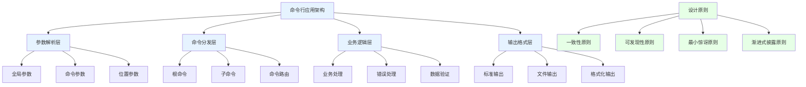
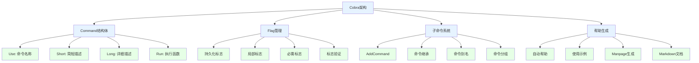
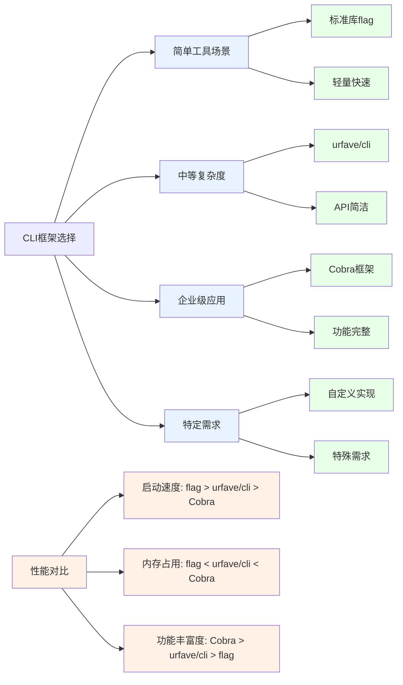
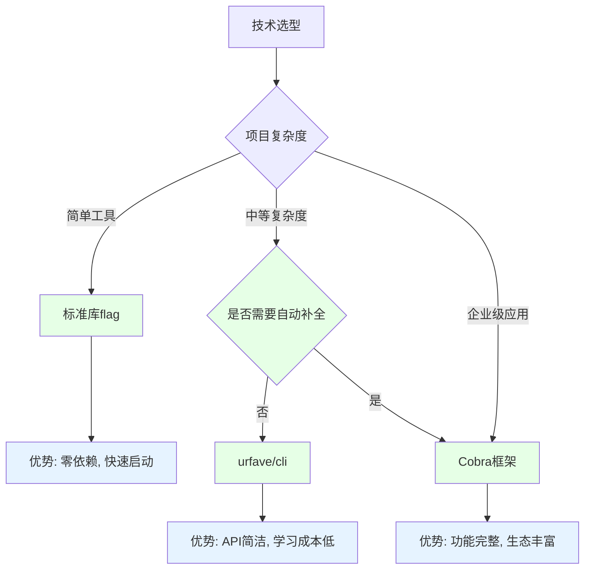

# Golang命令行库完全指南：从标准库flag到Cobra框架

## 引言：命令行工具在现代应用中的重要性

在当今的云原生和DevOps时代，命令行工具(CLI)已成为开发者日常工作中不可或缺的一部分。无论是容器编排工具kubectl、版本控制系统git，还是构建工具docker，它们都通过优雅的命令行界面为用户提供了强大的功能。Golang凭借其出色的性能、跨平台能力和丰富的标准库，成为开发高质量CLI工具的首选语言。

本文将从最基础的flag标准库出发，深入剖析Golang命令行开发的完整技术栈，帮助您构建专业级的命令行应用。

## 一、命令行工具核心概念与设计原则

### 1.1 CLI架构层次模型



### 1.2 命令行工具设计原则

**Unix哲学对CLI设计的影响：**
- **单一职责**：每个工具只做好一件事
- **组合使用**：通过管道连接多个简单工具
- **文本交互**：输入输出使用纯文本格式
- **静默失败**：没有消息就是好消息

**现代CLI工具的核心设计原则：**
- **直观性**：命令和参数命名应该直观易懂
- **一致性**：保持命令结构和参数风格的一致性
- **可发现性**：提供完善的帮助文档和自动补全
- **容错性**：对用户输入错误有良好的提示和恢复机制

## 二、标准库flag深度解析

### 2.1 flag包基础用法

Go语言的标准库`flag`包提供了简单而强大的命令行参数解析功能，是构建小型CLI工具的理想选择。

```go
// 基础flag用法示例
package main

import (
    "flag"
    "fmt"
    "os"
    "time"
)

func main() {
    // 方式1: flag.Type() - 返回指针
    port := flag.Int("port", 8080, "服务器端口号 (默认: 8080)")
    host := flag.String("host", "localhost", "服务器地址 (默认: localhost)")
    debug := flag.Bool("debug", false, "启用调试模式")
    timeout := flag.Duration("timeout", 30*time.Second, "请求超时时间")
    
    // 方式2: flag.TypeVar() - 绑定到现有变量
    var configFile string
    flag.StringVar(&configFile, "config", "config.yaml", "配置文件路径")
    
    // 自定义用法说明
    flag.Usage = func() {
        fmt.Fprintf(os.Stderr, "用法: %s [选项] [命令]\n", os.Args[0])
        fmt.Fprintf(os.Stderr, "选项:\n")
        flag.PrintDefaults()
        fmt.Fprintf(os.Stderr, "\n命令:\n")
        fmt.Fprintf(os.Stderr, "  start    启动服务\n")
        fmt.Fprintf(os.Stderr, "  stop     停止服务\n")
        fmt.Fprintf(os.Stderr, "  status   查看状态\n")
    }
    
    // 解析命令行参数
    flag.Parse()
    
    // 处理位置参数
    args := flag.Args()
    if len(args) == 0 {
        flag.Usage()
        os.Exit(1)
    }
    
    // 根据命令执行相应逻辑
    switch args[0] {
    case "start":
        startServer(*host, *port, *debug, *timeout, configFile)
    case "stop":
        stopServer(*host, *port)
    case "status":
        checkStatus(*host, *port)
    default:
        fmt.Fprintf(os.Stderr, "未知命令: %s\n", args[0])
        flag.Usage()
        os.Exit(1)
    }
}

func startServer(host string, port int, debug bool, timeout time.Duration, config string) {
    fmt.Printf("启动服务器: %s:%d\n", host, port)
    fmt.Printf("调试模式: %t\n", debug)
    fmt.Printf("超时设置: %v\n", timeout)
    fmt.Printf("配置文件: %s\n", config)
    
    // 实际的服务器启动逻辑...
}

func stopServer(host string, port int) {
    fmt.Printf("停止服务器: %s:%d\n", host, port)
    // 停止逻辑...
}

func checkStatus(host string, port int) {
    fmt.Printf("检查服务器状态: %s:%d\n", host, port)
    // 状态检查逻辑...
}
```

### 2.2 flag高级特性与自定义类型

Go 1.16+版本为flag包增加了更多强大功能，特别是自定义类型的支持。

```go
// 高级flag用法：自定义类型和复杂验证
package main

import (
    "errors"
    "flag"
    "fmt"
    "net"
    "os"
    "strings"
)

// 自定义IP地址类型
type IPAddr net.IP

func (ip *IPAddr) String() string {
    return (*net.IP)(ip).String()
}

func (ip *IPAddr) Set(value string) error {
    parsedIP := net.ParseIP(value)
    if parsedIP == nil {
        return errors.New("无效的IP地址格式")
    }
    *ip = IPAddr(parsedIP)
    return nil
}

// 自定义字符串切片类型
type StringSlice []string

func (s *StringSlice) String() string {
    return strings.Join(*s, ",")
}

func (s *StringSlice) Set(value string) error {
    *s = append(*s, value)
    return nil
}

// Go 1.21+的flag.Func用法
func validatePort(value string) error {
    // 这里可以进行复杂的验证逻辑
    if value == "" {
        return errors.New("端口号不能为空")
    }
    
    var port int
    if _, err := fmt.Sscanf(value, "%d", &port); err != nil {
        return fmt.Errorf("无效的端口号: %s", value)
    }
    
    if port < 1 || port > 65535 {
        return errors.New("端口号必须在1-65535范围内")
    }
    
    return nil
}

func main() {
    // 自定义IP地址参数
    var listenIP IPAddr
    flag.Var(&listenIP, "listen-ip", "监听IP地址")
    
    // 自定义字符串切片参数（允许多次使用）
    var domains StringSlice
    flag.Var(&domains, "domain", "支持的域名（可多次使用）")
    
    // 使用flag.Func进行复杂验证
    var port string
    flag.Func("port", "服务器端口号", validatePort)
    
    // 必需参数标记
    required := []string{"port"}
    flag.Parse()
    
    // 检查必需参数
    seen := make(map[string]bool)
    flag.Visit(func(f *flag.Flag) {
        seen[f.Name] = true
    })
    
    for _, req := range required {
        if !seen[req] {
            fmt.Fprintf(os.Stderr, "错误: 必需参数 --%s 未提供\n", req)
            flag.Usage()
            os.Exit(1)
        }
    }
    
    fmt.Printf("监听地址: %s\n", listenIP.String())
    fmt.Printf("支持域名: %v\n", domains)
    fmt.Printf("端口号: %s\n", port)
}
```

### 2.3 FlagSet：多命令支持的高级模式

对于需要支持多个子命令的应用，可以使用`flag.FlagSet`来实现更复杂的命令行结构。

```go
// 使用FlagSet实现子命令系统
package main

import (
    "flag"
    "fmt"
    "os"
)

func main() {
    if len(os.Args) < 2 {
        printUsage()
        os.Exit(1)
    }
    
    // 根据子命令分发处理
    switch os.Args[1] {
    case "server":
        handleServerCommand(os.Args[2:])
    case "client":
        handleClientCommand(os.Args[2:])
    case "config":
        handleConfigCommand(os.Args[2:])
    case "help", "--help", "-h":
        printUsage()
    default:
        fmt.Fprintf(os.Stderr, "未知命令: %s\n", os.Args[1])
        printUsage()
        os.Exit(1)
    }
}

func handleServerCommand(args []string) {
    serverCmd := flag.NewFlagSet("server", flag.ExitOnError)
    
    port := serverCmd.Int("port", 8080, "服务器端口")
    host := serverCmd.String("host", "localhost", "服务器地址")
    daemon := serverCmd.Bool("daemon", false, "以守护进程方式运行")
    
    // 自定义用法
    serverCmd.Usage = func() {
        fmt.Fprintf(os.Stderr, "用法: %s server [选项]\n", os.Args[0])
        fmt.Fprintf(os.Stderr, "启动服务器\n\n")
        fmt.Fprintf(os.Stderr, "选项:\n")
        serverCmd.PrintDefaults()
    }
    
    if err := serverCmd.Parse(args); err != nil {
        fmt.Fprintf(os.Stderr, "参数解析错误: %v\n", err)
        serverCmd.Usage()
        os.Exit(1)
    }
    
    fmt.Printf("启动服务器: %s:%d (daemon: %t)\n", *host, *port, *daemon)
    // 服务器启动逻辑...
}

func handleClientCommand(args []string) {
    clientCmd := flag.NewFlagSet("client", flag.ExitOnError)
    
    server := clientCmd.String("server", "localhost:8080", "服务器地址")
    retries := clientCmd.Int("retries", 3, "重试次数")
    timeout := clientCmd.Duration("timeout", 10*time.Second, "超时时间")
    
    clientCmd.Usage = func() {
        fmt.Fprintf(os.Stderr, "用法: %s client [选项] <命令>\n", os.Args[0])
        fmt.Fprintf(os.Stderr, "客户端操作\n\n")
        fmt.Fprintf(os.Stderr, "选项:\n")
        clientCmd.PrintDefaults()
        fmt.Fprintf(os.Stderr, "\n命令:\n")
        fmt.Fprintf(os.Stderr, "  upload   上传文件\n")
        fmt.Fprintf(os.Stderr, "  download 下载文件\n")
        fmt.Fprintf(os.Stderr, "  list     文件列表\n")
    }
    
    if err := clientCmd.Parse(args); err != nil {
        fmt.Fprintf(os.Stderr, "参数解析错误: %v\n", err)
        clientCmd.Usage()
        os.Exit(1)
    }
    
    // 处理子命令的位置参数
    subArgs := clientCmd.Args()
    if len(subArgs) == 0 {
        fmt.Fprintf(os.Stderr, "错误: 需要指定子命令\n")
        clientCmd.Usage()
        os.Exit(1)
    }
    
    switch subArgs[0] {
    case "upload":
        handleUpload(*server, *retries, *timeout, subArgs[1:])
    case "download":
        handleDownload(*server, *retries, *timeout, subArgs[1:])
    case "list":
        handleList(*server, *retries, *timeout)
    default:
        fmt.Fprintf(os.Stderr, "未知子命令: %s\n", subArgs[0])
        clientCmd.Usage()
        os.Exit(1)
    }
}

func handleConfigCommand(args []string) {
    configCmd := flag.NewFlagSet("config", flag.ExitOnError)
    
    global := configCmd.Bool("global", false, "操作全局配置")
    user := configCmd.Bool("user", false, "操作用户配置")
    
    configCmd.Usage = func() {
        fmt.Fprintf(os.Stderr, "用法: %s config [选项] <get|set|delete> [参数]\n", os.Args[0])
        fmt.Fprintf(os.Stderr, "配置管理\n\n")
        fmt.Fprintf(os.Stderr, "选项:\n")
        configCmd.PrintDefaults()
    }
    
    if err := configCmd.Parse(args); err != nil {
        fmt.Fprintf(os.Stderr, "参数解析错误: %v\n", err)
        configCmd.Usage()
        os.Exit(1)
    }
    
    subArgs := configCmd.Args()
    if len(subArgs) == 0 {
        fmt.Fprintf(os.Stderr, "错误: 需要指定操作类型\n")
        configCmd.Usage()
        os.Exit(1)
    }
    
    fmt.Printf("配置操作: %s (global: %t, user: %t)\n", subArgs[0], *global, *user)
    // 配置管理逻辑...
}

func printUsage() {
    fmt.Fprintf(os.Stderr, `%s - 多功能命令行工具

用法: %s <命令> [选项] [参数]

命令:
  server   启动服务器
  client   客户端操作
  config   配置管理
  help     显示帮助信息

使用 "%s <命令> --help" 查看具体命令的帮助信息
`, os.Args[0], os.Args[0], os.Args[0])
}

// 具体的业务处理函数...
func handleUpload(server string, retries int, timeout time.Duration, files []string) {
    fmt.Printf("上传文件到 %s: %v\n", server, files)
}

func handleDownload(server string, retries int, timeout time.Duration, files []string) {
    fmt.Printf("从 %s 下载文件: %v\n", server, files)
}

func handleList(server string, retries int, timeout time.Duration) {
    fmt.Printf("列出 %s 的文件\n", server)
}
```

## 三、Cobra框架深度解析

### 3.1 Cobra框架架构与核心概念

Cobra是目前Golang生态系统中最流行、功能最完善的CLI框架，被kubectl、Docker、Hugo等著名项目采用。



### 3.2 完整的Cobra应用实现

让我们构建一个完整的CLI工具来展示Cobra框架的强大功能：

```go
// cmd/root.go - 根命令定义
package cmd

import (
    "fmt"
    "os"
    "github.com/spf13/cobra"
    "github.com/spf13/viper"
)

var cfgFile string
var verbose bool

// rootCmd 代表基础命令，当没有子命令时被调用
var rootCmd = &cobra.Command{
    Use:   "myapp",
    Short: "MyApp是一个功能强大的命令行工具",
    Long: `MyApp是一个基于Cobra框架构建的命令行工具，提供了丰富的功能
包括文件管理、配置操作、系统监控等。使用前请确保已正确配置环境。`,
    
    // 持久化预处理函数
    PersistentPreRun: func(cmd *cobra.Command, args []string) {
        // 全局初始化逻辑
        if verbose {
            fmt.Println(" verbose模式已启用")
        }
    },
    
    // 命令执行前的参数验证
    PreRun: func(cmd *cobra.Command, args []string) {
        // 命令特定的预处理
        fmt.Printf("执行命令: %s\n", cmd.Name())
    },
    
    // 如果没有子命令，执行根命令
    Run: func(cmd *cobra.Command, args []string) {
        // 显示版本信息或默认操作
        fmt.Println("MyApp CLI工具")
        fmt.Println("使用 'myapp --help' 查看可用命令")
    },
    
    // 命令执行后的清理工作
    PostRun: func(cmd *cobra.Command, args []string) {
        if verbose {
            fmt.Println("命令执行完成")
        }
    },
    
    // 所有子命令执行后的清理
    PersistentPostRun: func(cmd *cobra.Command, args []string) {
        // 全局清理逻辑
    },
}

// Execute 添加所有子命令到根命令并设置适当的标志
func Execute() {
    if err := rootCmd.Execute(); err != nil {
        fmt.Fprintln(os.Stderr, err)
        os.Exit(1)
    }
}

func init() {
    cobra.OnInitialize(initConfig)
    
    // 全局标志（持久化标志）
    rootCmd.PersistentFlags().StringVar(&cfgFile, "config", "", "配置文件 (默认为 $HOME/.myapp.yaml)")
    rootCmd.PersistentFlags().BoolVarP(&verbose, "verbose", "v", false, "详细输出")
    
    // 局部标志（仅根命令使用）
    rootCmd.Flags().BoolP("version", "V", false, "显示版本信息")
    
    // 标志验证
    rootCmd.PersistentFlags().SetAnnotation("config", cobra.BashCompFilenameExt, []string{"yaml", "yml", "json"})
}

// initConfig 读取配置文件和环境变量
func initConfig() {
    if cfgFile != "" {
        // 使用指定的配置文件
        viper.SetConfigFile(cfgFile)
    } else {
        // 查找home目录
        home, err := os.UserHomeDir()
        cobra.CheckErr(err)
        
        // 在home目录和当前目录搜索配置文件
        viper.AddConfigPath(home)
        viper.AddConfigPath(".")
        viper.SetConfigType("yaml")
        viper.SetConfigName(".myapp")
    }
    
    viper.AutomaticEnv() // 读取匹配的环境变量
    
    // 如果找到配置文件就读取它
    if err := viper.ReadInConfig(); err == nil {
        if verbose {
            fmt.Println("使用配置文件:", viper.ConfigFileUsed())
        }
    }
}
```

```go
// cmd/server.go - 服务器管理子命令
package cmd

import (
    "fmt"
    "github.com/spf13/cobra"
    "github.com/spf13/viper"
    "net"
    "strconv"
)

var (
    serverHost string
    serverPort int
    serverDaemon bool
)

// serverCmd 代表server命令
var serverCmd = &cobra.Command{
    Use:   "server",
    Short: "启动和管理服务器",
    Long: `server命令用于启动、停止和管理应用程序服务器。
支持多种运行模式和配置选项。`,
    
    // 参数验证
    Args: cobra.MaximumNArgs(1), // 最多接受1个位置参数
    
    // 使用示例
    Example: `  myapp server start -p 8080    # 启动服务器在8080端口
  myapp server stop           # 停止服务器
  myapp server status         # 查看服务器状态`,
    
    Run: func(cmd *cobra.Command, args []string) {
        // 如果没有子命令，显示帮助
        if len(args) == 0 {
            cmd.Help()
            return
        }
        
        switch args[0] {
        case "start":
            startServer()
        case "stop":
            stopServer()
        case "status":
            checkServerStatus()
        case "restart":
            restartServer()
        default:
            fmt.Printf("未知操作: %s\n", args[0])
            cmd.Help()
        }
    },
}

func init() {
    rootCmd.AddCommand(serverCmd)
    
    // 服务器命令的局部标志
    serverCmd.Flags().StringVarP(&serverHost, "host", "H", "localhost", "服务器监听地址")
    serverCmd.Flags().IntVarP(&serverPort, "port", "p", 8080, "服务器监听端口")
    serverCmd.Flags().BoolVarP(&serverDaemon, "daemon", "d", false, "以守护进程方式运行")
    
    // 标志验证
    serverCmd.MarkFlagRequired("port")
    
    // 自定义补全
    serverCmd.ValidArgsFunction = func(cmd *cobra.Command, args []string, toComplete string) ([]string, cobra.ShellCompDirective) {
        if len(args) == 0 {
            return []string{"start", "stop", "status", "restart"}, cobra.ShellCompDirectiveDefault
        }
        return nil, cobra.ShellCompDirectiveNoFileComp
    }
}

func startServer() {
    addr := net.JoinHostPort(serverHost, strconv.Itoa(serverPort))
    
    fmt.Printf("启动服务器:\n")
    fmt.Printf("  地址: %s\n", addr)
    fmt.Printf("  守护进程: %t\n", serverDaemon)
    
    // 从配置文件中读取额外配置
    if viper.IsSet("server.max_connections") {
        maxConn := viper.GetInt("server.max_connections")
        fmt.Printf("  最大连接数: %d\n", maxConn)
    }
    
    if verbose {
        fmt.Println("详细调试信息...")
    }
    
    // 实际的服务器启动逻辑...
    fmt.Println("服务器启动完成")
}

func stopServer() {
    fmt.Println("停止服务器...")
    // 停止逻辑...
}

func checkServerStatus() {
    fmt.Println("检查服务器状态...")
    // 状态检查逻辑...
}

func restartServer() {
    fmt.Println("重启服务器...")
    // 重启逻辑...
}
```

```go
// cmd/config.go - 配置管理子命令
package cmd

import (
    "fmt"
    "github.com/spf13/cobra"
    "github.com/spf13/viper"
    "os"
    "path/filepath"
)

var (
    configGlobal bool
    configUser   bool
    configForce  bool
)

// configCmd 代表config命令
var configCmd = &cobra.Command{
    Use:   "config",
    Short: "管理应用程序配置",
    Long: `config命令用于查看、设置和删除应用程序配置。
支持全局配置和用户级配置管理。`,
    
    Args: cobra.MinimumNArgs(1), // 至少需要1个参数
    
    Example: `  myapp config get server.port        # 获取服务器端口配置
  myapp config set server.port 9090   # 设置服务器端口
  myapp config delete server.port     # 删除端口配置
  myapp config list                  # 列出所有配置`,
    
    Run: func(cmd *cobra.Command, args []string) {
        operation := args[0]
        
        switch operation {
        case "get":
            if len(args) < 2 {
                fmt.Println("错误: 需要指定配置键")
                cmd.Help()
                return
            }
            getConfig(args[1])
        case "set":
            if len(args) < 3 {
                fmt.Println("错误: 需要指定配置键和值")
                cmd.Help()
                return
            }
            setConfig(args[1], args[2])
        case "delete":
            if len(args) < 2 {
                fmt.Println("错误: 需要指定配置键")
                cmd.Help()
                return
            }
            deleteConfig(args[1])
        case "list":
            listConfig()
        case "edit":
            editConfig()
        default:
            fmt.Printf("未知操作: %s\n", operation)
            cmd.Help()
        }
    },
}

func init() {
    rootCmd.AddCommand(configCmd)
    
    configCmd.Flags().BoolVar(&configGlobal, "global", false, "操作全局配置")
    configCmd.Flags().BoolVar(&configUser, "user", false, "操作用户配置")
    configCmd.Flags().BoolVarP(&configForce, "force", "f", false, "强制操作")
    
    // 互斥标志验证
    configCmd.MarkFlagsMutuallyExclusive("global", "user")
}

func getConfig(key string) {
    if !viper.IsSet(key) {
        fmt.Printf("配置键 '%s' 未设置\n", key)
        return
    }
    
    value := viper.Get(key)
    fmt.Printf("%s = %v\n", key, value)
}

func setConfig(key, value string) {
    viper.Set(key, value)
    
    configPath := getConfigPath()
    if err := viper.WriteConfigAs(configPath); err != nil {
        fmt.Printf("保存配置失败: %v\n", err)
        return
    }
    
    fmt.Printf("已设置 %s = %s\n", key, value)
}

func deleteConfig(key string) {
    if !viper.IsSet(key) {
        fmt.Printf("配置键 '%s' 不存在\n", key)
        return
    }
    
    // 从viper中删除配置
    settings := viper.AllSettings()
    delete(settings, key)
    
    // 清空并重新设置
    viper.Reset()
    for k, v := range settings {
        viper.Set(k, v)
    }
    
    configPath := getConfigPath()
    if err := viper.WriteConfigAs(configPath); err != nil {
        fmt.Printf("保存配置失败: %v\n", err)
        return
    }
    
    fmt.Printf("已删除配置键: %s\n", key)
}

func listConfig() {
    settings := viper.AllSettings()
    if len(settings) == 0 {
        fmt.Println("暂无配置")
        return
    }
    
    fmt.Println("当前配置:")
    for key, value := range settings {
        fmt.Printf("  %s = %v\n", key, value)
    }
}

func editConfig() {
    configPath := getConfigPath()
    fmt.Printf("编辑配置文件: %s\n", configPath)
    // 打开编辑器逻辑...
}

func getConfigPath() string {
    home, err := os.UserHomeDir()
    if err != nil {
        fmt.Printf("获取用户目录失败: %v\n", err)
        os.Exit(1)
    }
    
    var configName string
    if configGlobal {
        configName = "/etc/myapp/config.yaml"
    } else if configUser {
        configName = filepath.Join(home, ".myapp.yaml")
    } else {
        configName = ".myapp.yaml"
    }
    
    return configName
}
```

```go
// main.go - 应用程序入口
package main

import "myapp/cmd"

func main() {
    cmd.Execute()
}
```

## 四、其他流行CLI框架对比

### 4.1 urfave/cli框架深度分析

urfave/cli（前身为codegangsta/cli）是另一个非常流行的CLI框架，以其简洁的API和易用性著称。

```go
// urfave/cli 使用示例
package main

import (
    "fmt"
    "log"
    "os"
    
    "github.com/urfave/cli/v2"
)

func main() {
    app := &cli.App{
        Name:  "mycli",
        Usage: "一个基于urfave/cli的命令行工具",
        Version: "1.0.0",
        
        // 全局标志
        Flags: []cli.Flag{
            &cli.StringFlag{
                Name:    "config",
                Aliases: []string{"c"},
                Value:   "config.yaml",
                Usage:   "配置文件路径",
                EnvVars: []string{"MYAPP_CONFIG"},
            },
            &cli.BoolFlag{
                Name:    "verbose",
                Aliases: []string{"v"},
                Usage:   "详细输出",
            },
        },
        
        // 命令列表
        Commands: []*cli.Command{
            {
                Name:    "server",
                Aliases: []string{"s"},
                Usage:   "启动服务器",
                Flags: []cli.Flag{
                    &cli.IntFlag{
                        Name:    "port",
                        Aliases: []string{"p"},
                        Value:   8080,
                        Usage:   "服务器端口",
                    },
                },
                Action: func(c *cli.Context) error {
                    fmt.Printf("启动服务器在端口 %d\n", c.Int("port"))
                    if c.Bool("verbose") {
                        fmt.Println("详细模式已启用")
                    }
                    return nil
                },
            },
            {
                Name:    "client",
                Aliases: []string{"c"},
                Usage:   "客户端操作",
                Subcommands: []*cli.Command{
                    {
                        Name:  "upload",
                        Usage: "上传文件",
                        Action: func(c *cli.Context) error {
                            if c.NArg() == 0 {
                                return fmt.Errorf("需要指定文件路径")
                            }
                            fmt.Printf("上传文件: %s\n", c.Args().First())
                            return nil
                        },
                    },
                    {
                        Name:  "download",
                        Usage: "下载文件",
                        Action: func(c *cli.Context) error {
                            fmt.Println("下载文件...")
                            return nil
                        },
                    },
                },
            },
        },
        
        // 默认动作（当没有指定命令时）
        Action: func(c *cli.Context) error {
            fmt.Println("欢迎使用 MyCLI!")
            fmt.Println("使用 '--help' 查看可用命令")
            return nil
        },
        
        // 命令执行前的钩子
        Before: func(c *cli.Context) error {
            if c.Bool("verbose") {
                fmt.Println("应用程序启动...")
            }
            return nil
        },
        
        // 命令执行后的钩子
        After: func(c *cli.Context) error {
            if c.Bool("verbose") {
                fmt.Println("应用程序退出")
            }
            return nil
        },
    }
    
    if err := app.Run(os.Args); err != nil {
        log.Fatal(err)
    }
}
```

### 4.2 各框架特性对比分析



**详细特性对比表：**

| 特性 | flag标准库 | urfave/cli | Cobra | 适用场景 |
|------|-----------|------------|--------|----------|
| **学习曲线** | 最低 | 中等 | 较高 | 快速上手/进阶需求 |
| **子命令支持** | 手动实现 | 原生支持 | 原生支持 | 命令复杂度 |
| **自动补全** | 无 | 有限支持 | 完整支持 | 用户体验 |
| **文档生成** | 基本 | 良好 | 优秀 | 项目文档 |
| **依赖数量** | 零依赖 | 轻量依赖 | 较多依赖 | 部署复杂度 |
| **社区生态** | 标准库 | 活跃 | 非常活跃 | 长期维护 |
| **企业应用** | 不适合 | 适合 | 非常适合 | 生产环境 |

## 五、高级特性与最佳实践

### 5.1 自动补全实现

Cobra框架提供了强大的自动补全功能，可以显著提升用户体验。

```go
// 自定义自动补全实现
package cmd

import (
    "github.com/spf13/cobra"
    "os"
    "path/filepath"
    "strings"
)

// 文件路径补全
func filePathCompletion(cmd *cobra.Command, args []string, toComplete string) ([]string, cobra.ShellCompDirective) {
    if len(args) != 0 {
        return nil, cobra.ShellCompDirectiveNoFileComp
    }
    
    // 获取当前目录的文件列表
    files, err := os.ReadDir(".")
    if err != nil {
        return nil, cobra.ShellCompDirectiveError
    }
    
    var matches []string
    for _, file := range files {
        if strings.HasPrefix(file.Name(), toComplete) {
            if file.IsDir() {
                matches = append(matches, file.Name()+"/")
            } else {
                matches = append(matches, file.Name())
            }
        }
    }
    
    return matches, cobra.ShellCompDirectiveNoSpace | cobra.ShellCompDirectiveNoFileComp
}

// 配置键补全
func configKeyCompletion(cmd *cobra.Command, args []string, toComplete string) ([]string, cobra.ShellCompDirective) {
    // 从viper中获取所有配置键
    settings := viper.AllSettings()
    
    var keys []string
    for key := range settings {
        if strings.HasPrefix(key, toComplete) {
            keys = append(keys, key)
        }
    }
    
    return keys, cobra.ShellCompDirectiveNoFileComp
}

// 在命令中启用自动补全
func init() {
    configCmd.ValidArgsFunction = configKeyCompletion
    
    // 文件上传命令使用文件路径补全
    uploadCmd := &cobra.Command{
        Use:   "upload",
        Short: "上传文件",
        Args:  cobra.ExactArgs(1),
        ValidArgsFunction: filePathCompletion,
        Run: func(cmd *cobra.Command, args []string) {
            fmt.Printf("上传文件: %s\n", args[0])
        },
    }
    
    clientCmd.AddCommand(uploadCmd)
}

// 生成补全脚本的命令
var completionCmd = &cobra.Command{
    Use:   "completion [bash|zsh|fish|powershell]",
    Short: "生成shell补全脚本",
    Long: `为指定的shell生成自动补全脚本。
需要将输出保存到相应的补全目录。`,
    
    Args: cobra.ExactArgs(1),
    ValidArgs: []string{"bash", "zsh", "fish", "powershell"},
    
    Run: func(cmd *cobra.Command, args []string) {
        switch args[0] {
        case "bash":
            cmd.Root().GenBashCompletion(os.Stdout)
        case "zsh":
            cmd.Root().GenZshCompletion(os.Stdout)
        case "fish":
            cmd.Root().GenFishCompletion(os.Stdout, true)
        case "powershell":
            cmd.Root().GenPowerShellCompletion(os.Stdout)
        }
    },
}

func init() {
    rootCmd.AddCommand(completionCmd)
}
```

### 5.2 配置管理与环境集成

现代CLI工具需要良好的配置管理和环境集成能力。

```go
// 高级配置管理实现
package config

import (
    "fmt"
    "os"
    "path/filepath"
    "strings"
    
    "github.com/spf13/viper"
)

// 初始化配置系统
func InitConfig(appName string) error {
    // 设置配置名称和类型
    viper.SetConfigName("config")
    viper.SetConfigType("yaml")
    
    // 添加配置搜索路径
    home, err := os.UserHomeDir()
    if err != nil {
        return fmt.Errorf("获取用户目录失败: %w", err)
    }
    
    configDirs := []string{
        ".",                           // 当前目录
        filepath.Join(home, ".config", appName), // XDG配置目录
        filepath.Join(home, "." + appName),      // 传统配置目录
        "/etc/" + appName,              // 系统配置目录
    }
    
    for _, dir := range configDirs {
        viper.AddConfigPath(dir)
    }
    
    // 设置环境变量前缀
    viper.SetEnvPrefix(strings.ToUpper(appName))
    viper.AutomaticEnv()
    
    // 环境变量替换（支持嵌套配置）
    viper.SetEnvKeyReplacer(strings.NewReplacer(".", "_"))
    
    // 设置默认值
    setDefaults(appName)
    
    // 读取配置文件
    if err := viper.ReadInConfig(); err != nil {
        if _, ok := err.(viper.ConfigFileNotFoundError); !ok {
            return fmt.Errorf("读取配置文件失败: %w", err)
        }
        // 配置文件不存在是正常的
    }
    
    return nil
}

func setDefaults(appName string) {
    // 服务器配置默认值
    viper.SetDefault("server.host", "localhost")
    viper.SetDefault("server.port", 8080)
    viper.SetDefault("server.timeout", 30)
    
    // 日志配置默认值
    viper.SetDefault("log.level", "info")
    viper.SetDefault("log.format", "json")
    viper.SetDefault("log.output", "stdout")
    
    // 缓存配置默认值
    viper.SetDefault("cache.enabled", true)
    viper.SetDefault("cache.size", 1000)
    viper.SetDefault("cache.ttl", 300)
    
    // 安全配置默认值
    viper.SetDefault("security.ssl_verify", true)
    viper.SetDefault("security.timeout", 10)
}

// 配置验证
func ValidateConfig() error {
    // 验证必需配置
    required := []string{"server.host", "server.port"}
    
    for _, key := range required {
        if !viper.IsSet(key) {
            return fmt.Errorf("必需配置缺失: %s", key)
        }
    }
    
    // 验证端口范围
    port := viper.GetInt("server.port")
    if port < 1 || port > 65535 {
        return fmt.Errorf("端口号必须在1-65535范围内: %d", port)
    }
    
    // 验证日志级别
    validLevels := map[string]bool{
        "debug": true, "info": true, "warn": true, "error": true,
    }
    
    logLevel := viper.GetString("log.level")
    if !validLevels[logLevel] {
        return fmt.Errorf("无效的日志级别: %s", logLevel)
    }
    
    return nil
}

// 配置热重载支持
func WatchConfig(changes chan<- bool) error {
    viper.OnConfigChange(func(e fsnotify.Event) {
        fmt.Printf("配置文件已更改: %s\n", e.Name)
        
        // 重新验证配置
        if err := ValidateConfig(); err != nil {
            fmt.Printf("配置验证失败: %v\n", err)
            return
        }
        
        // 通知配置更改
        select {
        case changes <- true:
        default:
            // 通道已满，跳过通知
        }
    })
    
    viper.WatchConfig()
    return nil
}

// 配置导出
func ExportConfig(format string) ([]byte, error) {
    switch strings.ToLower(format) {
    case "json":
        return viper.MarshalJSON()
    case "yaml", "yml":
        return viper.MarshalYAML()
    case "toml":
        return viper.MarshalTOML()
    default:
        return nil, fmt.Errorf("不支持的格式: %s", format)
    }
}
```

### 5.3 错误处理与用户友好提示

良好的错误处理是专业CLI工具的重要特征。

```go
// 统一错误处理机制
package errors

import (
    "fmt"
    "os"
    "github.com/fatih/color"
    "github.com/spf13/cobra"
)

// 错误类型定义
type CLIError struct {
    Code    int
    Message string
    Cause   error
    Hint    string
}

func (e CLIError) Error() string {
    if e.Cause != nil {
        return fmt.Sprintf("%s: %v", e.Message, e.Cause)
    }
    return e.Message
}

// 预定义错误
var (
    ErrConfigNotFound = CLIError{
        Code:    1,
        Message: "配置文件未找到",
        Hint:    "请使用 --config 参数指定配置文件路径，或创建默认配置文件",
    }
    
    ErrInvalidInput = CLIError{
        Code:    2,
        Message: "输入参数无效",
        Hint:    "请检查命令语法和使用 '--help' 查看帮助",
    }
    
    ErrNetworkTimeout = CLIError{
        Code:    3,
        Message: "网络连接超时",
        Hint:    "请检查网络连接或增加超时时间设置",
    }
)

// 错误处理中间件
func ErrorHandler(fn func(cmd *cobra.Command, args []string) error) func(cmd *cobra.Command, args []string) {
    return func(cmd *cobra.Command, args []string) {
        if err := fn(cmd, args); err != nil {
            handleError(err, cmd)
        }
    }
}

func handleError(err error, cmd *cobra.Command) {
    red := color.New(color.FgRed).SprintFunc()
    yellow := color.New(color.FgYellow).SprintFunc()
    
    // 检查错误类型
    if cliErr, ok := err.(CLIError); ok {
        fmt.Fprintf(os.Stderr, "%s %s\n", red("错误:"), cliErr.Message)
        
        if cliErr.Cause != nil {
            fmt.Fprintf(os.Stderr, "%s %v\n", yellow("原因:"), cliErr.Cause)
        }
        
        if cliErr.Hint != "" {
            fmt.Fprintf(os.Stderr, "%s %s\n", yellow("提示:"), cliErr.Hint)
        }
        
        // 显示相关命令帮助
        if cliErr.Code == ErrInvalidInput.Code {
            fmt.Fprintf(os.Stderr, "\n")
            cmd.Help()
        }
        
        os.Exit(cliErr.Code)
    } else {
        // 通用错误处理
        fmt.Fprintf(os.Stderr, "%s %v\n", red("错误:"), err)
        fmt.Fprintf(os.Stderr, "%s 使用 '%s --help' 查看帮助\n", 
            yellow("提示:"), cmd.CommandPath())
        os.Exit(1)
    }
}

// 使用示例
var exampleCmd = &cobra.Command{
    Use:   "example",
    Short: "示例命令",
    Run: ErrorHandler(func(cmd *cobra.Command, args []string) error {
        if len(args) == 0 {
            return ErrInvalidInput
        }
        
        // 业务逻辑...
        return nil
    }),
}

// 静默错误（用于不影响主流程的次要错误）
func SilentError(err error) bool {
    if err == nil {
        return false
    }
    
    // 记录到日志但不显示给用户
    fmt.Printf("注意: %v\n", err)
    return true
}
```

## 六、测试与质量保证

### 6.1 CLI工具测试策略

```go
// CLI命令测试示例
package cmd_test

import (
    "bytes"
    "testing"
    "github.com/spf13/cobra"
    "myapp/cmd"
)

// 测试辅助函数
func executeCommand(root *cobra.Command, args ...string) (string, error) {
    buf := new(bytes.Buffer)
    root.SetOut(buf)
    root.SetErr(buf)
    root.SetArgs(args)
    
    err := root.Execute()
    return buf.String(), err
}

func TestRootCommand(t *testing.T) {
    root := cmd.RootCmd
    
    tests := []struct {
        name     string
        args     []string
        expected string
        wantErr  bool
    }{
        {
            name:     "显示帮助",
            args:     []string{"--help"},
            expected: "用法",
            wantErr:  false,
        },
        {
            name:     "显示版本",
            args:     []string{"--version"},
            expected: "1.0.0",
            wantErr:  false,
        },
        {
            name:     "无效参数",
            args:     []string{"--invalid"},
            wantErr:  true,
        },
    }
    
    for _, tt := range tests {
        t.Run(tt.name, func(t *testing.T) {
            output, err := executeCommand(root, tt.args...)
            
            if (err != nil) != tt.wantErr {
                t.Errorf("executeCommand() error = %v, wantErr %v", err, tt.wantErr)
                return
            }
            
            if !tt.wantErr && tt.expected != "" && !bytes.Contains([]byte(output), []byte(tt.expected)) {
                t.Errorf("executeCommand() output = %v, expected to contain %v", output, tt.expected)
            }
        })
    }
}

func TestServerCommand(t *testing.T) {
    tests := []struct {
        name     string
        args     []string
        contains []string
        wantErr  bool
    }{
        {
            name:     "启动服务器",
            args:     []string{"server", "start", "--port", "9090"},
            contains: []string{"启动服务器", "9090"},
            wantErr:  false,
        },
        {
            name:     "缺少端口参数",
            args:     []string{"server", "start"},
            wantErr:  true,
        },
    }
    
    for _, tt := range tests {
        t.Run(tt.name, func(t *testing.T) {
            output, err := executeCommand(cmd.RootCmd, tt.args...)
            
            if (err != nil) != tt.wantErr {
                t.Errorf("错误不符合预期: error = %v, wantErr %v", err, tt.wantErr)
            }
            
            if !tt.wantErr {
                for _, expected := range tt.contains {
                    if !bytes.Contains([]byte(output), []byte(expected)) {
                        t.Errorf("输出不包含预期内容: %s, 实际输出: %s", expected, output)
                    }
                }
            }
        })
    }
}

// 集成测试
func TestIntegration(t *testing.T) {
    // 设置测试环境
    t.Setenv("MYAPP_CONFIG", "test_config.yaml")
    t.Setenv("MYAPP_VERBOSE", "true")
    
    // 执行完整命令流程
    output, err := executeCommand(cmd.RootCmd, "config", "list")
    if err != nil {
        t.Fatalf("集成测试失败: %v", err)
    }
    
    // 验证输出
    if len(output) == 0 {
        t.Error("期望有输出内容")
    }
}

// 性能测试
func BenchmarkCommandExecution(b *testing.B) {
    root := cmd.RootCmd
    
    b.ResetTimer()
    for i := 0; i < b.N; i++ {
        _, _ = executeCommand(root, "--version")
    }
}
```

## 七、生产环境部署与优化

### 7.1 跨平台构建与分发

```makefile
# Makefile - 构建和分发配置
BINARY_NAME=myapp
VERSION=1.0.0
BUILD_DIR=dist

# 构建目标
build:
	@echo "构建应用程序..."
	go build -o $(BINARY_NAME) -ldflags "-X main.version=$(VERSION)" ./main.go

# 交叉编译
build-all: build-linux build-darwin build-windows

build-linux:
	GOOS=linux GOARCH=amd64 go build -o $(BUILD_DIR)/$(BINARY_NAME)-linux-amd64 \
		-ldflags "-X main.version=$(VERSION)" ./main.go

build-darwin:
	GOOS=darwin GOARCH=amd64 go build -o $(BUILD_DIR)/$(BINARY_NAME)-darwin-amd64 \
		-ldflags "-X main.version=$(VERSION)" ./main.go

build-windows:
	GOOS=windows GOARCH=amd64 go build -o $(BUILD_DIR)/$(BINARY_NAME)-windows-amd64.exe \
		-ldflags "-X main.version=$(VERSION)" ./main.go

# 安装到系统路径
install: build
	@echo "安装到 /usr/local/bin..."
	sudo cp $(BINARY_NAME) /usr/local/bin/

# 清理构建产物
clean:
	@echo "清理构建产物..."
	rm -f $(BINARY_NAME)
	rm -rf $(BUILD_DIR)

# 运行测试
test:
	go test -v ./...

# 代码质量检查
lint:
	golangci-lint run

.PHONY: build build-all install clean test lint
```

### 7.2 Docker容器化部署

```dockerfile
# Dockerfile - 多阶段构建优化
# 构建阶段
FROM golang:1.21-alpine AS builder

WORKDIR /app

# 下载依赖
COPY go.mod go.sum ./
RUN go mod download

# 复制源代码
COPY . .

# 构建应用程序
RUN CGO_ENABLED=0 GOOS=linux go build -a -installsuffix cgo \
    -ldflags "-w -s -X main.version=${VERSION}" \
    -o /go/bin/myapp .

# 运行阶段
FROM alpine:latest

RUN apk --no-cache add ca-certificates

WORKDIR /root/

# 从构建阶段复制二进制文件
COPY --from=builder /go/bin/myapp .

# 创建非root用户
RUN addgroup -S appgroup && adduser -S appuser -G appgroup
USER appuser

# 设置入口点
ENTRYPOINT ["./myapp"]

# 默认命令
CMD ["--help"]
```

### 8.1 技术选型决策矩阵



**架构设计原则：**
- **单一职责**：每个命令专注于一个特定功能
- **一致性**：保持命令命名和参数风格的一致性
- **可发现性**：提供完善的帮助文档和自动补全
- **容错性**：对用户输入错误有良好的提示和恢复机制

**代码组织规范：**
```
myapp/
├── cmd/           # 命令定义
│   ├── root.go    # 根命令
│   ├── server.go  # 服务器命令
│   └── config.go  # 配置命令
├── internal/      # 内部实现
│   ├── config/    # 配置管理
│   └── utils/     # 工具函数
├── pkg/           # 可复用包
│   └── api/       # API客户端
├── main.go        # 程序入口
└── go.mod         # 依赖管理
```

**性能优化要点：**
- 使用`ldflags`嵌入版本信息减少运行时依赖
- 采用多阶段Docker构建减小镜像体积
- 实现延迟加载减少启动时间
- 使用连接池复用资源

**用户体验优化：**
- 实现完整的shell自动补全
- 提供颜色输出和进度指示
- 支持配置文件和环境变量
- 设计友好的错误信息和恢复提示

### 8.3 生产环境检查清单

**功能完整性检查：**
- [ ] 帮助文档完整准确
- [ ] 自动补全功能正常
- [ ] 错误处理覆盖全面
- [ ] 配置管理灵活可靠

**质量保证检查：**
- [ ] 单元测试覆盖核心功能
- [ ] 集成测试验证命令流程
- [ ] 性能测试确保响应速度
- [ ] 安全扫描排除漏洞

**部署就绪检查：**
- [ ] 跨平台构建配置完善
- [ ] 容器化部署准备就绪
- [ ] 版本管理策略明确
- [ ] 回滚方案测试通过

**运维支持检查：**
- [ ] 日志记录配置合理
- [ ] 监控指标暴露完整
- [ ] 健康检查接口就绪
- [ ] 文档维护流程建立
