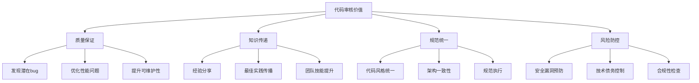
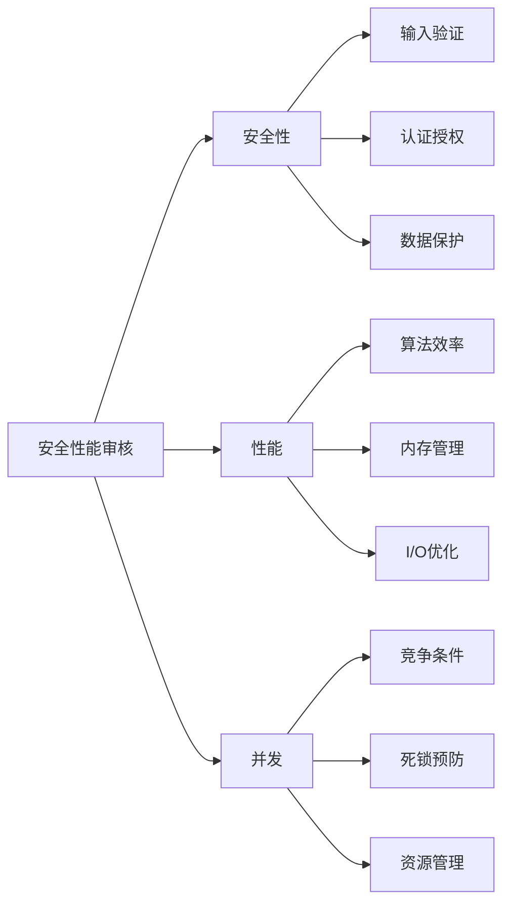
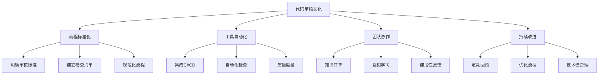

# Golang代码审核深度指南：构建高质量Go代码的必备技能

## 一、Golang代码审核基础：为什么需要专业审核

代码审核是软件开发过程中确保代码质量的关键环节。对于Golang这种强调简洁、高效的语言，专业的代码审核尤为重要。



### 1.1 代码审核的核心目标

```go
package review_foundation

import (
    "fmt"
    "time"
)

// 代码审核的核心检查点
type CodeReviewChecklist struct {
    FunctionalCorrectness []string
    CodeQuality           []string
    Performance           []string
    Security              []string
    Maintainability       []string
}

func CreateGoReviewChecklist() CodeReviewChecklist {
    return CodeReviewChecklist{
        FunctionalCorrectness: []string{
            "业务逻辑是否正确实现",
            "边界条件是否处理得当", 
            "错误处理是否完备",
            "单元测试覆盖关键路径",
            "并发安全性是否保证",
        },
        CodeQuality: []string{
            "代码是否符合Go语言规范",
            "命名是否清晰表达意图",
            "函数是否保持单一职责",
            "代码复杂度是否可控",
            "注释是否准确有用",
        },
        Performance: []string{
            "是否有不必要的内存分配",
            "算法时间复杂度是否最优",
            "I/O操作是否合理优化", 
            "并发模型是否高效",
            "资源释放是否及时",
        },
        Security: []string{
            "输入验证是否完备",
            "SQL注入等漏洞是否防护",
            "敏感信息是否安全处理",
            "权限控制是否严格",
            "日志是否避免敏感信息泄露",
        },
        Maintainability: []string{
            "代码是否易于理解",
            "模块耦合度是否合理",
            "扩展性是否考虑",
            "文档是否齐全",
            "依赖管理是否清晰",
        },
    }
}

// 代码审核流程模型
type ReviewProcess struct {
    Stages []ReviewStage
}

type ReviewStage struct {
    Name        string
    Description string
    Checklist   []string
    Timebox     time.Duration
}

func CreateStandardReviewProcess() ReviewProcess {
    return ReviewProcess{
        Stages: []ReviewStage{
            {
                Name:        "初步扫描",
                Description: "快速浏览代码结构和主要逻辑",
                Checklist: []string{
                    "代码结构是否清晰",
                    "主要函数职责是否明确", 
                    "是否存在明显逻辑错误",
                    "代码风格是否基本符合规范",
                },
                Timebox: 5 * time.Minute,
            },
            {
                Name:        "详细审查", 
                Description: "逐行分析代码实现细节",
                Checklist: []string{
                    "每个函数的实现是否正确",
                    "错误处理是否恰当",
                    "边界条件是否覆盖",
                    "性能优化是否合理",
                },
                Timebox: 15 * time.Minute,
            },
            {
                Name:        "架构评估",
                Description: "评估代码的架构设计和长期影响",
                Checklist: []string{
                    "设计是否符合系统架构",
                    "模块划分是否合理",
                    "扩展性是否满足未来需求",
                    "是否引入技术债务",
                },
                Timebox: 10 * time.Minute,
            },
        },
    }
}

// 审核意见分类
type ReviewCommentType int

const (
    CriticalIssue ReviewCommentType = iota // 严重问题，必须修复
    MajorImprovement                       // 重要改进建议
    MinorSuggestion                       // 优化建议
    Question                              // 疑问或需要澄清
    PositiveFeedback                      // 正面反馈
)

type ReviewComment struct {
    Type        ReviewCommentType
    FilePath    string
    LineNumber  int
    Description string
    Suggestion  string
    Priority    int // 1-5, 5为最高优先级
}

func DemonstrateReviewComments() {
    fmt.Println("=== 代码审核意见示例 ===")
    
    comments := []ReviewComment{
        {
            Type:        CriticalIssue,
            FilePath:    "service/user.go",
            LineNumber:  45,
            Description: "存在SQL注入风险，直接拼接用户输入",
            Suggestion:  "使用参数化查询或预处理语句",
            Priority:    5,
        },
        {
            Type:        MajorImprovement, 
            FilePath:    "pkg/utils/validator.go",
            LineNumber:  23,
            Description: "函数过于复杂，违反了单一职责原则",
            Suggestion:  "拆分为多个小函数，每个负责特定验证",
            Priority:    4,
        },
        {
            Type:        MinorSuggestion,
            FilePath:    "cmd/main.go", 
            LineNumber:  12,
            Description: "变量命名可以更清晰表达意图",
            Suggestion:  "将`x`重命名为`userCount`",
            Priority:    2,
        },
        {
            Type:        PositiveFeedback,
            FilePath:    "internal/auth/middleware.go",
            LineNumber:  67,
            Description: "错误处理很完善，考虑了各种边界情况",
            Suggestion:  "继续保持",
            Priority:    1,
        },
    }
    
    for i, comment := range comments {
        fmt.Printf("\n意见%d [%s]:\n", i+1, getCommentTypeName(comment.Type))
        fmt.Printf("文件: %s:%d\n", comment.FilePath, comment.LineNumber)
        fmt.Printf("描述: %s\n", comment.Description)
        fmt.Printf("建议: %s\n", comment.Suggestion)
        fmt.Printf("优先级: %d/5\n", comment.Priority)
    }
}

func getCommentTypeName(t ReviewCommentType) string {
    switch t {
    case CriticalIssue:
        return "严重问题"
    case MajorImprovement:
        return "重要改进" 
    case MinorSuggestion:
        return "优化建议"
    case Question:
        return "疑问"
    case PositiveFeedback:
        return "正面反馈"
    default:
        return "未知"
    }
}

func main() {
    checklist := CreateGoReviewChecklist()
    fmt.Println("=== Golang代码审核检查清单 ===")
    
    fmt.Println("\n功能性正确性:")
    for _, item := range checklist.FunctionalCorrectness {
        fmt.Printf("• %s\n", item)
    }
    
    fmt.Println("\n代码质量:")
    for _, item := range checklist.CodeQuality {
        fmt.Printf("• %s\n", item)
    }
    
    process := CreateStandardReviewProcess()
    fmt.Println("\n=== 标准审核流程 ===")
    
    for _, stage := range process.Stages {
        fmt.Printf("\n阶段: %s (%v)\n", stage.Name, stage.Timebox)
        fmt.Printf("描述: %s\n", stage.Description)
        fmt.Println("检查项:")
        for _, item := range stage.Checklist {
            fmt.Printf("  • %s\n", item)
        }
    }
    
    DemonstrateReviewComments()
}
```

## 二、Golang特有代码规范审核

### 2.1 Go语言规范检查

```go
package go_specific_review

import (
    "fmt"
    "go/ast"
    "go/parser"
    "go/token"
    "strings"
)

// Go语言特有规范检查器
type GoStyleReviewer struct {
    Issues []StyleIssue
}

type StyleIssue struct {
    Category    string
    Rule        string
    Description string
    Example     string
    Fix         string
    Severity    string // low, medium, high, critical
}

func (r *GoStyleReviewer) CheckNamingConvention(funcDecl *ast.FuncDecl) {
    funcName := funcDecl.Name.Name
    
    // 检查函数命名是否符合Go约定
    if strings.Contains(funcName, "_") && !isTestFunction(funcName) {
        r.Issues = append(r.Issues, StyleIssue{
            Category:    "命名规范",
            Rule:        "使用驼峰命名法",
            Description: fmt.Sprintf("函数名 '%s' 包含下划线", funcName),
            Example:     "get_user_info → getUserInfo",
            Fix:         "将下划线命名改为驼峰命名",
            Severity:    "medium",
        })
    }
    
    // 检查函数名是否以动词开头
    if !startsWithVerb(funcName) {
        r.Issues = append(r.Issues, StyleIssue{
            Category:    "命名规范", 
            Rule:        "函数名应该以动词开头",
            Description: fmt.Sprintf("函数名 '%s' 不以动词开头", funcName),
            Example:     "userCreate → createUser",
            Fix:         "使用动词开头的函数名",
            Severity:    "low",
        })
    }
}

func (r *GoStyleReviewer) CheckFunctionLength(funcDecl *ast.FuncDecl) {
    // 估算函数行数（简化版）
    lineCount := estimateFunctionLines(funcDecl)
    
    if lineCount > 50 {
        r.Issues = append(r.Issues, StyleIssue{
            Category:    "函数设计",
            Rule:        "函数应该短小精悍",
            Description: fmt.Sprintf("函数过长 (%d 行)", lineCount),
            Example:     "超过50行的函数应考虑拆分",
            Fix:         "将函数拆分为多个更小的函数",
            Severity:    "medium",
        })
    }
}

func (r *GoStyleReviewer) CheckErrorHandling(funcDecl *ast.FuncDecl) {
    // 检查错误处理是否恰当
    // 这里可以添加更复杂的错误处理检查逻辑
    hasErrorReturn := false
    
    if funcDecl.Type.Results != nil {
        for _, field := range funcDecl.Type.Results.List {
            if expr, ok := field.Type.(*ast.Ident); ok && expr.Name == "error" {
                hasErrorReturn = true
                break
            }
        }
    }
    
    // 简化版的错误处理检查
    if hasErrorReturn {
        // 检查是否有适当的错误处理逻辑
        r.Issues = append(r.Issues, StyleIssue{
            Category:    "错误处理",
            Rule:        "错误应该被适当处理",
            Description: "函数返回error但错误处理可能不完整",
            Example:     "确保所有错误路径都被正确处理",
            Fix:         "添加适当的错误日志记录和处理逻辑",
            Severity:    "high",
        })
    }
}

// 辅助函数
func isTestFunction(name string) bool {
    return strings.HasPrefix(name, "Test") || 
           strings.HasPrefix(name, "Benchmark") || 
           strings.HasPrefix(name, "Example")
}

func startsWithVerb(name string) bool {
    verbs := []string{"get", "set", "create", "update", "delete", "find", "calculate", "validate"}
    lowerName := strings.ToLower(name)
    
    for _, verb := range verbs {
        if strings.HasPrefix(lowerName, verb) {
            return true
        }
    }
    return false
}

func estimateFunctionLines(funcDecl *ast.FuncDecl) int {
    // 简化的行数估算
    if funcDecl.Body == nil {
        return 0
    }
    return len(funcDecl.Body.List) * 3 // 近似估算
}

// Go语言最佳实践检查
type BestPracticeReviewer struct {
    Practices []BestPractice
}

type BestPractice struct {
    Category    string
    Title       string
    Description string
    GoodExample string
    BadExample  string
    Rationale   string
}

func CreateGoBestPractices() BestPracticeReviewer {
    return BestPracticeReviewer{
        Practices: []BestPractice{
            {
                Category:    "错误处理",
                Title:       "优先返回错误而非panic",
                Description: "在普通业务逻辑中应该返回error而不是panic",
                GoodExample: `if err != nil { return err }`,
                BadExample:  `if err != nil { panic(err) }`,
                Rationale:   "panic应该仅用于不可恢复的程序错误",
            },
            {
                Category:    "接口设计", 
                Title:       "接口应该小巧而专注",
                Description: "遵循接口隔离原则，保持接口简洁",
                GoodExample: `type Reader interface { Read([]byte) (int, error) }`,
                BadExample:  `type FileOperator interface { Read() Write() Close() Seek() ... }`,
                Rationale:   "小巧的接口更容易实现和测试",
            },
            {
                Category:    "并发安全",
                Title:       "明确并发访问控制",
                Description: "对于可能被并发访问的数据结构，需要明确同步机制",
                GoodExample: `type SafeCounter struct { mu sync.Mutex; value int }`,
                BadExample:  `var counter int // 可能被并发访问但无保护`,
                Rationale:   "预防数据竞争和并发bug",
            },
            {
                Category:    "内存管理",
                Title:       "避免不必要的内存分配",
                Description: "在热点路径上避免频繁的内存分配",
                GoodExample: `var buf bytes.Buffer  // 可重用缓冲区`,
                BadExample:  `s := "" + "a" + "b"   // 产生多个临时字符串`,
                Rationale:   "提高性能，减少GC压力",
            },
        },
    }
}

// 常见反模式检测
type AntiPatternDetector struct {
    Patterns []AntiPattern
}

type AntiPattern struct {
    Name        string
    Description string
    Symptoms    []string
    Solution    string
}

func CreateCommonAntiPatterns() AntiPatternDetector {
    return AntiPatternDetector{
        Patterns: []AntiPattern{
            {
                Name:        "上帝函数",
                Description: "单个函数或方法承担过多职责",
                Symptoms:    []string{"函数过长", "参数过多", "嵌套层次过深"},
                Solution:    "根据单一职责原则拆分为多个小函数",
            },
            {
                Name:        "魔法数字",
                Description: "代码中直接使用未解释的数字常量",
                Symptoms:    []string{"代码中出现神秘的数字", "相同数字多次出现"},
                Solution:    "使用有意义的命名常量替代",
            },
            {
                Name:        "重复代码",
                Description: "相同的代码逻辑在多个地方出现",
                Symptoms:    []string{"复制粘贴的代码块", "相似的函数实现"},
                Solution:    "提取公共函数或方法",
            },
            {
                Name:        "过度抽象",
                Description: "在不必要的地方引入复杂抽象",
                Symptoms:    []string{"简单的逻辑被过度设计", "过多的接口和包装器"},
                Solution:    "遵循YAGNI原则，只在必要时抽象",
            },
        },
    }
}

func DemonstrateStyleReview() {
    fmt.Println("=== Go语言规范审核演示 ===")
    
    // 模拟分析一段Go代码
    code := `
package main

import "fmt"

func get_user_info(user_id int) (string, error) {
    // 这是一个过长的函数示例
    if user_id <= 0 {
        return "", fmt.Errorf("invalid user id")
    }
    
    // 模拟一些业务逻辑
    user_name := ""
    for i := 0; i < 100; i++ {
        // 复杂的嵌套逻辑
        if i%2 == 0 {
            user_name += "even"
        } else {
            user_name += "odd"
        }
    }
    
    return user_name, nil
}
`
    
    fset := token.NewFileSet()
    file, err := parser.ParseFile(fset, "demo.go", code, parser.ParseComments)
    if err != nil {
        fmt.Printf("解析错误: %v\n", err)
        return
    }
    
    reviewer := &GoStyleReviewer{}
    
    // 遍历AST检查函数
    ast.Inspect(file, func(n ast.Node) bool {
        if funcDecl, ok := n.(*ast.FuncDecl); ok {
            reviewer.CheckNamingConvention(funcDecl)
            reviewer.CheckFunctionLength(funcDecl) 
            reviewer.CheckErrorHandling(funcDecl)
        }
        return true
    })
    
    fmt.Printf("发现 %d 个代码规范问题:\n", len(reviewer.Issues))
    for _, issue := range reviewer.Issues {
        fmt.Printf("[%s] %s: %s\n", issue.Severity, issue.Category, issue.Description)
    }
    
    // 展示最佳实践
    practices := CreateGoBestPractices()
    fmt.Println("\n=== Go语言最佳实践 ===")
    for _, practice := range practices.Practices {
        fmt.Printf("\n%s - %s\n", practice.Category, practice.Title)
        fmt.Printf("描述: %s\n", practice.Description)
        fmt.Printf("好例子: %s\n", practice.GoodExample)
        fmt.Printf("坏例子: %s\n", practice.BadExample)
        fmt.Printf("理由: %s\n", practice.Rationale)
    }
    
    // 展示反模式
    antipatterns := CreateCommonAntiPatterns()
    fmt.Println("\n=== 常见反模式 ===")
    for _, pattern := range antipatterns.Patterns {
        fmt.Printf("\n%s\n", pattern.Name)
        fmt.Printf("描述: %s\n", pattern.Description)
        fmt.Printf("症状: %v\n", pattern.Symptoms)
        fmt.Printf("解决方案: %s\n", pattern.Solution)
    }
}

func main() {
    DemonstrateStyleReview()
}
```

## 三、安全性与性能审核



### 3.1 安全性审核要点

```go
package security_review

import (
    "fmt"
    "regexp"
    "strings"
)

// 安全性审核检查器
type SecurityReviewer struct {
    Vulnerabilities []SecurityIssue
}

type SecurityIssue struct {
    Type        string   // 漏洞类型
    RiskLevel   string   // 风险等级
    Description string   // 问题描述
    Location    string   // 代码位置
    Impact      string   // 潜在影响
    Remediation string   // 修复建议
    CWE         string   // CWE编号
}

func (r *SecurityReviewer) CheckSQLInjection(code string) {
    // 检查SQL注入漏洞模式
    patterns := []string{
        `fmt\.Sprintf\([^)]*\$?s[^)]*\+.*\+`,      // 字符串拼接
        `strings\.Join\([^)]*\+`,                   // 字符串连接
        `query\s*:?\s*=\s*"[^"]*"\s*\+`,           // 查询字符串拼接
    }
    
    for _, pattern := range patterns {
        re := regexp.MustCompile(pattern)
        if re.MatchString(code) {
            r.Vulnerabilities = append(r.Vulnerabilities, SecurityIssue{
                Type:        "SQL注入",
                RiskLevel:   "高危",
                Description: "发现可能的SQL注入漏洞",
                Location:    "数据库操作相关代码",
                Impact:      "数据泄露、数据篡改",
                Remediation: "使用参数化查询或预处理语句",
                CWE:         "CWE-89",
            })
        }
    }
}

func (r *SecurityReviewer) CheckXSSVulnerability(code string) {
    // 检查XSS漏洞模式
    patterns := []string{
        `\.WriteString\([^)]*\+.*user`,           // 直接输出用户输入
        `fmt\.Fprintf\([^)]*,[^)]*\+.*input`,     // 格式化输出用户输入
        `template\.Execute.*\+`,                   // 模板直接拼接
    }
    
    for _, pattern := range patterns {
        re := regexp.MustCompile(pattern)
        if re.MatchString(code) {
            r.Vulnerabilities = append(r.Vulnerabilities, SecurityIssue{
                Type:        "跨站脚本(XSS)",
                RiskLevel:   "中危", 
                Description: "发现可能的XSS漏洞",
                Location:    "HTML输出相关代码",
                Impact:      "会话劫持、恶意脚本执行",
                Remediation: "对用户输入进行适当的转义处理",
                CWE:         "CWE-79",
            })
        }
    }
}

func (r *SecurityReviewer) CheckInsecureDeserialization(code string) {
    // 检查不安全的反序列化
    if strings.Contains(code, "encoding/gob") && 
       strings.Contains(code, "Decode") &&
       !strings.Contains(code, "验证") &&
       !strings.Contains(code, "validate") {
        r.Vulnerabilities = append(r.Vulnerabilities, SecurityIssue{
            Type:        "不安全的反序列化",
            RiskLevel:   "高危",
            Description: "可能存在不安全的反序列化操作",
            Location:    "反序列化相关代码",
            Impact:      "远程代码执行",
            Remediation: "验证反序列化数据，使用安全的序列化格式",
            CWE:         "CWE-502",
        })
    }
}

func (r *SecurityReviewer) CheckHardcodedSecrets(code string) {
    // 检查硬编码的敏感信息
    secretPatterns := []string{
        `password\s*:?\s*="[^"]+"`,
        `api[Kk]ey\s*:?\s*="[^"]+"`,
        `secret\s*:?\s*="[^"]+"`,
        `token\s*:?\s*="[^"]+"`,
    }
    
    for _, pattern := range secretPatterns {
        re := regexp.MustCompile(pattern)
        if re.MatchString(code) {
            r.Vulnerabilities = append(r.Vulnerabilities, SecurityIssue{
                Type:        "硬编码凭证",
                RiskLevel:   "高危",
                Description: "发现硬编码的敏感信息",
                Location:    "配置或常量定义",
                Impact:      "凭证泄露",
                Remediation: "使用环境变量或安全配置管理",
                CWE:         "CWE-798",
            })
        }
    }
}

// 安全编码最佳实践
type SecurityBestPractice struct {
    Principle string
    Example   string
    Benefit   string
    Rule      string
}

func CreateSecurityBestPractices() []SecurityBestPractice {
    return []SecurityBestPractice{
        {
            Principle: "最小权限原则",
            Example:   "数据库用户只拥有必要权限",
            Benefit:   "限制潜在损害范围",
            Rule:      "每个组件只拥有完成其功能所需的最小权限",
        },
        {
            Principle: "防御性编程",
            Example:   "始终验证输入，即使来自可信源",
            Benefit:   "预防边界条件漏洞",
            Rule:      "不信任任何外部输入，包括内部组件",
        },
        {
            Principle: "深度防御",
            Example:   "多层级安全控制",
            Benefit:   "单点失效不影响整体安全",
            Rule:      "实施多层次的安全保护措施",
        },
        {
            Principle: "安全默认配置",
            Example:   "新用户默认无敏感权限",
            Benefit:   "避免配置错误导致的安全问题",
            Rule:      "默认配置应该是最安全的配置",
        },
    }
}

// 性能审核检查器
type PerformanceReviewer struct {
    Issues []PerformanceIssue
}

type PerformanceIssue struct {
    Category    string
    Problem     string
    Impact      string
    Solution    string
    Priority    string // low, medium, high
}

func (r *PerformanceReviewer) CheckMemoryAllocation(code string) {
    // 检查内存分配问题
    allocationPatterns := []struct {
        pattern string
        problem string
    }{
        {
            `make\(\[\]\w+,\s*0\)\s*append`, // 初始容量为0的切片频繁append
            "切片初始容量不足导致多次扩容",
        },
        {
            `\+\s*\"\"`, // 字符串连接
            "频繁字符串连接产生临时对象",
        },
        {
            `defer\s+[^(]*\([^)]*\)`, // 在循环中使用defer
            "循环中的defer可能导致内存泄漏",
        },
    }
    
    for _, item := range allocationPatterns {
        re := regexp.MustCompile(item.pattern)
        if re.MatchString(code) {
            r.Issues = append(r.Issues, PerformanceIssue{
                Category: "内存分配",
                Problem:  item.problem,
                Impact:   "增加GC压力，降低性能",
                Solution: "优化数据结构使用，避免不必要的分配",
                Priority: "medium",
            })
        }
    }
}

func (r *PerformanceReviewer) CheckAlgorithmEfficiency(code string) {
    // 检查算法效率问题
    inefficientPatterns := []struct {
        pattern string
        problem string
    }{
        {
            `O\(n²\)`, // 嵌套循环可能表示O(n²)算法
            "潜在的低效算法",
        },
        {
            `for[^{]*{[^}]*for[^{]*{`, // 嵌套循环
            "多层嵌套循环可能效率低下",
        },
    }
    
    for _, item := range inefficientPatterns {
        re := regexp.MustCompile(item.pattern)
        if re.MatchString(code) {
            r.Issues = append(r.Issues, PerformanceIssue{
                Category: "算法效率",
                Problem:  item.problem,
                Impact:   "处理大数据量时性能下降",
                Solution: "考虑使用更高效的算法或数据结构",
                Priority: "high",
            })
        }
    }
}

func (r *PerformanceReviewer) CheckConcurrentPatterns(code string) {
    // 检查并发模式问题
    concurrentIssues := []struct {
        pattern string
        problem string
    }{
        {
            `go\s+func[^{]*{.*http\.Get`, // goroutine中直接进行HTTP调用
            "goroutine中没有超时控制",
        },
        {
            `channel\s+[^\s]+\s+chan[^\s]*\s+[^=]*=.*make.*0`, // 无缓冲channel可能阻塞
            "无缓冲channel可能导致死锁",
        },
    }
    
    for _, item := range concurrentIssues {
        re := regexp.MustCompile(item.pattern)
        if re.MatchString(code) {
            r.Issues = append(r.Issues, PerformanceIssue{
                Category: "并发模式",
                Problem:  item.problem,
                Impact:   "可能阻塞或死锁",
                Solution: "添加超时控制，合理使用缓冲",
                Priority: "high",
            })
        }
    }
}

func DemonstrateSecurityPerformanceReview() {
    fmt.Println("=== 安全性与性能审核演示 ===")
    
    // 模拟有安全问题的代码
    vulnerableCode := `
package main

import (
    "database/sql"
    "fmt"
    "net/http"
)

func getUserHandler(w http.ResponseWriter, r *http.Request) {
    userID := r.URL.Query().Get("id")
    
    // 有SQL注入风险的代码
    query := fmt.Sprintf("SELECT * FROM users WHERE id = %s", userID)
    db.Query(query)
    
    // 硬编码密码
    password := "mySecretPassword123"
    
    // 潜在的XSS漏洞
    fmt.Fprintf(w, "<div>%s</div>", userID)
}

func processData(data []string) {
    // 性能问题：频繁字符串连接
    result := ""
    for _, item := range data {
        result += item + ","
    }
    
    // 潜在的死锁问题
    ch := make(chan int)
    go func() {
        ch <- 1
    }()
    <-ch
}
`
    
    // 安全审核
    securityReviewer := &SecurityReviewer{}
    securityReviewer.CheckSQLInjection(vulnerableCode)
    securityReviewer.CheckXSSVulnerability(vulnerableCode) 
    securityReviewer.CheckHardcodedSecrets(vulnerableCode)
    
    fmt.Println("安全性问题发现:")
    for _, vuln := range securityReviewer.Vulnerabilities {
        fmt.Printf("[%s] %s: %s\n", vuln.RiskLevel, vuln.Type, vuln.Description)
        fmt.Printf("  修复建议: %s\n", vuln.Remediation)
    }
    
    // 性能审核
    performanceReviewer := &PerformanceReviewer{}
    performanceReviewer.CheckMemoryAllocation(vulnerableCode)
    performanceReviewer.CheckConcurrentPatterns(vulnerableCode)
    
    fmt.Println("\n性能问题发现:")
    for _, issue := range performanceReviewer.Issues {
        fmt.Printf("[%s] %s: %s\n", issue.Priority, issue.Category, issue.Problem)
        fmt.Printf("  解决方案: %s\n", issue.Solution)
    }
    
    // 展示安全最佳实践
    practices := CreateSecurityBestPractices()
    fmt.Println("\n=== 安全编码最佳实践 ===")
    for _, practice := range practices {
        fmt.Printf("\n%s\n", practice.Principle)
        fmt.Printf("例子: %s\n", practice.Example)
        fmt.Printf("好处: %s\n", practice.Benefit)
        fmt.Printf("规则: %s\n", practice.Rule)
    }
}

func main() {
    DemonstrateSecurityPerformanceReview()
}
```

## 四、架构与设计模式审核

### 4.1 软件架构原则检查

```go
package architecture_review

import (
    "fmt"
    "strings"
)

// 架构质量评估器
type ArchitectureReviewer struct {
    Principles []ArchitecturePrinciple
    Violations []ArchitectureViolation
}

type ArchitecturePrinciple struct {
    Name        string
    Description string
    Benefits    []string
    Indicators  []string // 符合原则的指标
    AntiPatterns []string // 违反原则的模式
}

type ArchitectureViolation struct {
    Principle string
    Issue     string
    Impact    string
    Recommendation string
    Severity  string
}

func CreateArchitecturePrinciples() []ArchitecturePrinciple {
    return []ArchitecturePrinciple{
        {
            Name:        "单一职责原则(SRP)",
            Description: "一个模块或类应该只有一个引起变化的原因",
            Benefits:    []string{"提高可维护性", "降低耦合度", "便于测试"},
            Indicators:  []string{
                "每个函数只做一件事",
                "模块职责明确",
                "变更影响范围小",
            },
            AntiPatterns: []string{
                "上帝类/函数",
                "多功能模块",
                "频繁修改同一模块",
            },
        },
        {
            Name:        "开闭原则(OCP)",
            Description: "软件实体应该对扩展开放，对修改关闭",
            Benefits:    []string{"提高可扩展性", "减少回归测试", "支持增量开发"},
            Indicators:  []string{
                "通过添加新代码实现新功能",
                "接口稳定",
                "使用组合而非继承",
            },
            AntiPatterns: []string{
                "频繁修改现有代码",
                "开关语句处理不同类型",
                "硬编码的业务逻辑",
            },
        },
        {
            Name:        "依赖倒置原则(DIP)",
            Description: "高层模块不应该依赖低层模块，二者都应该依赖抽象",
            Benefits:    []string{"降低耦合", "提高可测试性", "支持插件架构"},
            Indicators:  []string{
                "依赖接口而非具体实现",
                "使用依赖注入",
                "容易替换实现",
            },
            AntiPatterns: []string{
                "直接实例化具体类",
                "高层模块包含低层模块细节",
                "难以进行单元测试",
            },
        },
        {
            Name:        "接口隔离原则(ISP)",
            Description: "不应该强迫客户端依赖它们不使用的接口",
            Benefits:    []string{"减少接口污染", "提高灵活性", "降低依赖"},
            Indicators:  []string{
                "小而专注的接口",
                "客户端只依赖需要的接口",
                "接口方法相关性高",
            },
            AntiPatterns: []string{
                "臃肿的接口",
                "客户端被迫实现不需要的方法",
                "接口方法无关联",
            },
        },
    }
}

// 设计模式识别器
type DesignPatternDetector struct {
    Patterns []DesignPattern
}

type DesignPattern struct {
    Name        string
    Type        string // 创建型、结构型、行为型
    Description string
    GoExample   string
    UseCases    []string
    Benefits    []string
}

func CreateCommonDesignPatterns() DesignPatternDetector {
    return DesignPatternDetector{
        Patterns: []DesignPattern{
            {
                Name:        "工厂模式",
                Type:        "创建型",
                Description: "定义一个创建对象的接口，但让子类决定实例化哪个类",
                GoExample: `type Product interface { Operation() string }

type Creator interface { FactoryMethod() Product }

type ConcreteCreator struct{}

func (c ConcreteCreator) FactoryMethod() Product {
    return &ConcreteProduct{}
}`,
                UseCases: []string{"需要创建对象但不想指定具体类", "类希望其子类指定创建的对象"},
                Benefits:  []string{"解耦创建逻辑", "支持扩展", "统一创建接口"},
            },
            {
                Name:        "单例模式",
                Type:        "创建型", 
                Description: "确保一个类只有一个实例，并提供一个全局访问点",
                GoExample: `type Singleton struct{}

var instance *Singleton
var once sync.Once

func GetInstance() *Singleton {
    once.Do(func() {
        instance = &Singleton{}
    })
    return instance
}`,
                UseCases: []string{"需要严格控制实例数量", "全局访问点"},
                Benefits:  []string{"控制实例数量", "节约资源", "全局访问"},
            },
            {
                Name:        "装饰器模式",
                Type:        "结构型",
                Description: "动态地给一个对象添加一些额外的职责",
                GoExample: `type Component interface { Operation() string }

type Decorator struct { component Component }

func (d *Decorator) Operation() string {
    return "Decorated " + d.component.Operation()
}`,
                UseCases: []string{"需要动态添加功能", "不想使用子类扩展"},
                Benefits:  []string{"灵活的功能扩展", "避免类爆炸", "运行时添加功能"},
            },
            {
                Name:        "观察者模式",
                Type:        "行为型",
                Description: "定义对象间的一对多依赖关系，当一个对象改变状态时，所有依赖者都会收到通知",
                GoExample: `type Observer interface { Update(message string) }

type Subject struct { observers []Observer }

func (s *Subject) Notify(message string) {
    for _, observer := range s.observers {
        observer.Update(message)
    }
}`,
                UseCases: []string{"一个对象状态变化需要通知其他对象", "跨组件通信"},
                Benefits:  []string{"松耦合", "支持广播通信", "易于扩展"},
            },
        },
    }
}

// 代码复杂度分析
type ComplexityAnalyzer struct {
    Metrics []ComplexityMetric
}

type ComplexityMetric struct {
    Name        string
    Description string
    Threshold   int    // 阈值
    Calculation string // 计算方法
    Impact      string // 对维护性的影响
}

func CreateComplexityMetrics() ComplexityAnalyzer {
    return ComplexityAnalyzer{
        Metrics: []ComplexityMetric{
            {
                Name:        "圈复杂度",
                Description: "衡量函数中独立路径的数量",
                Threshold:   10,
                Calculation: "基于控制流图中的决策点数量",
                Impact:      "高圈复杂度难以理解和测试",
            },
            {
                Name:        "认知复杂度", 
                Description: "衡量理解代码所需的认知努力",
                Threshold:   15,
                Calculation: "考虑嵌套、递归、异常等复杂度因素",
                Impact:      "高认知复杂度增加维护成本",
            },
            {
                Name:        "维护性指数",
                Description: "综合评估代码的可维护性",
                Threshold:   65, // 0-100，越高越好
                Calculation: "基于圈复杂度、代码行数、注释密度等",
                Impact:      "低维护性指数预示高维护成本",
            },
        },
    }
}

// 依赖关系分析
type DependencyAnalyzer struct {
    Rules []DependencyRule
}

type DependencyRule struct {
    Rule        string
    Description string
    Example     string
    Violation   string
}

func CreateDependencyRules() DependencyAnalyzer {
    return DependencyAnalyzer{
        Rules: []DependencyRule{
            {
                Rule:        "稳定依赖原则",
                Description: "依赖方向应该指向更稳定的方向",
                Example:     "业务逻辑层依赖数据访问层，而不是反过来",
                Violation:   "底层模块依赖高层模块",
            },
            {
                Rule:        "无环依赖原则", 
                Description: "依赖图中不应该有循环",
                Example:     "A→B→C是好的，A→B→C→A是坏的",
                Violation:   "模块间存在循环依赖",
            },
            {
                Rule:        "共同重用原则",
                Description: "一起被重用的类应该属于同一个包",
                Example:     "相关的工具类放在同一个包中",
                Violation:   "经常一起使用的类分散在不同包",
            },
        },
    }
}

func DemonstrateArchitectureReview() {
    fmt.Println("=== 架构与设计模式审核 ===")
    
    // 展示架构原则
    principles := CreateArchitecturePrinciples()
    fmt.Println("\n=== 软件架构原则 ===")
    for _, principle := range principles {
        fmt.Printf("\n%s\n", principle.Name)
        fmt.Printf("描述: %s\n", principle.Description)
        fmt.Printf("好处: %v\n", principle.Benefits)
        fmt.Printf("符合指标: %v\n", principle.Indicators)
        fmt.Printf("反模式: %v\n", principle.AntiPatterns)
    }
    
    // 展示设计模式
    patterns := CreateCommonDesignPatterns()
    fmt.Println("\n=== 常用设计模式 ===")
    for _, pattern := range patterns.Patterns {
        fmt.Printf("\n%s (%s型)\n", pattern.Name, pattern.Type)
        fmt.Printf("描述: %s\n", pattern.Description)
        fmt.Printf("Go示例:\n%s\n", pattern.GoExample)
        fmt.Printf("使用场景: %v\n", pattern.UseCases)
        fmt.Printf("好处: %v\n", pattern.Benefits)
    }
    
    // 展示复杂度分析
    complexity := CreateComplexityMetrics()
    fmt.Println("\n=== 代码复杂度指标 ===")
    for _, metric := range complexity.Metrics {
        fmt.Printf("\n%s\n", metric.Name)
        fmt.Printf("描述: %s\n", metric.Description)
        fmt.Printf("阈值: %d\n", metric.Threshold)
        fmt.Printf("计算方法: %s\n", metric.Calculation)
        fmt.Printf("影响: %s\n", metric.Impact)
    }
    
    // 展示依赖分析
    dependencies := CreateDependencyRules()
    fmt.Println("\n=== 依赖关系规则 ===")
    for _, rule := range dependencies.Rules {
        fmt.Printf("\n%s\n", rule.Rule)
        fmt.Printf("描述: %s\n", rule.Description)
        fmt.Printf("例子: %s\n", rule.Example)
        fmt.Printf("违规: %s\n", rule.Violation)
    }
    
    // 架构审核示例
    fmt.Println("\n=== 架构问题识别示例 ===")
    
    // 模拟有架构问题的代码描述
    problematicArchitecture := `
项目结构问题:
- service包直接import dao包和model包
- utils包被所有其他包import，形成依赖中心
- 存在循环依赖: A→B→C→A

代码问题:
- UserService包含用户管理、权限验证、日志记录等多个职责
- 配置信息硬编码在多个文件中
- 数据库连接在多个地方直接创建
`
    
    fmt.Println("识别到的架构问题:")
    issues := []string{
        "违反依赖倒置原则: 高层service依赖底层dao",
        "违反单一职责原则: UserService承担过多职责", 
        "存在循环依赖: A→B→C→A",
        "配置信息散落: 硬编码在多个位置",
        "资源管理分散: 数据库连接创建不统一",
    }
    
    for i, issue := range issues {
        fmt.Printf("%d. %s\n", i+1, issue)
    }
    
    fmt.Println("\n改进建议:")
    recommendations := []string{
        "引入接口层，让service依赖接口而非具体dao",
        "拆分UserService为多个专注的服务",
        "打破循环依赖，引入中间层或重构依赖关系",
        "集中配置管理，使用环境变量或配置文件",
        "使用依赖注入统一管理资源创建",
    }
    
    for i, rec := range recommendations {
        fmt.Printf("%d. %s\n", i+1, rec)
    }
}

func main() {
    DemonstrateArchitectureReview()
}
```

## 五、自动化审核工具与流程

### 5.1 自动化审核工具集成

```go
package automation_tools

import (
    "fmt"
    "os/exec"
    "strings"
)

// 自动化代码审核工具管理器
type AutomatedReviewManager struct {
    Tools []ReviewTool
}

type ReviewTool struct {
    Name        string
    Command     string
    Args        []string
    Description string
    OutputType  string // json, text, xml
    Enabled     bool
}

func CreateGoReviewTools() AutomatedReviewManager {
    return AutomatedReviewManager{
        Tools: []ReviewTool{
            {
                Name:        "golangci-lint",
                Command:     "golangci-lint",
                Args:        []string{"run", "--out-format=json"},
                Description: "聚合多种Go语言检查器",
                OutputType:  "json",
                Enabled:     true,
            },
            {
                Name:        "staticcheck",
                Command:     "staticcheck",
                Args:        []string{"-f=json"},
                Description: "静态分析工具，专注于正确性",
                OutputType:  "json", 
                Enabled:     true,
            },
            {
                Name:        "govulncheck",
                Command:     "govulncheck",
                Args:        []string{"-json"},
                Description: "安全检查工具，检测已知漏洞",
                OutputType:  "json",
                Enabled:     true,
            },
            {
                Name:        "gosec",
                Command:     "gosec",
                Args:        []string{"-fmt=json"},
                Description: "安全代码扫描工具",
                OutputType:  "json",
                Enabled:     true,
            },
            {
                Name:        "errcheck",
                Command:     "errcheck",
                Args:        []string{"-abspath"},
                Description: "检查未处理的错误",
                OutputType:  "text",
                Enabled:     true,
            },
        },
    }
}

// 代码质量指标收集器
type CodeQualityCollector struct {
    Metrics []QualityMetric
}

type QualityMetric struct {
    Name         string
    Value        float64
    Target       float64
    Unit         string
    Description  string
    Improvement  string
}

func (c *CodeQualityCollector) CollectMetrics(projectPath string) {
    // 模拟收集各种代码质量指标
    c.Metrics = []QualityMetric{
        {
            Name:        "测试覆盖率",
            Value:       85.5,
            Target:      80.0,
            Unit:        "%",
            Description: "代码被测试覆盖的比例",
            Improvement: "添加更多单元测试，特别是边界情况",
        },
        {
            Name:        "圈复杂度",
            Value:       8.2,
            Target:      10.0,
            Unit:        "平均值",
            Description: "函数复杂度的度量",
            Improvement: "保持当前水平，注意不要超过阈值",
        },
        {
            Name:        "代码重复率",
            Value:       3.1,
            Target:      5.0,
            Unit:        "%",
            Description: "重复代码的比例",
            Improvement: "提取公共函数，消除重复代码",
        },
        {
            Name:        "注释密度",
            Value:       15.8,
            Target:      20.0,
            Unit:        "%",
            Description: "注释行数占总行数的比例",
            Improvement: "为复杂逻辑添加更多文档注释",
        },
        {
            Name:        "依赖数量",
            Value:       23.0,
            Target:      30.0,
            Unit:        "个",
            Description: "外部依赖包的数量",
            Improvement: "控制依赖增长，定期审查无用依赖",
        },
    }
}

// 审核报告生成器
type ReviewReportGenerator struct {
    Report ReviewReport
}

type ReviewReport struct {
    ProjectName    string
    ReviewDate     string
    Summary        ReportSummary
    Issues         []ReportIssue
    Metrics        []QualityMetric
    Recommendations []string
    Score          float64 // 0-100
}

type ReportSummary struct {
    TotalIssues    int
    CriticalIssues int
    FilesReviewed  int
    ReviewDuration string
}

type ReportIssue struct {
    Severity    string
    Category    string
    File        string
    Line        int
    Description string
    Tool        string
    Suggestion  string
}

func (g *ReviewReportGenerator) GenerateReport(projectPath string) {
    // 模拟生成审核报告
    g.Report = ReviewReport{
        ProjectName: "example-project",
        ReviewDate:  "2024-01-15",
        Summary: ReportSummary{
            TotalIssues:    42,
            CriticalIssues: 3,
            FilesReviewed:  156,
            ReviewDuration: "2小时15分钟",
        },
        Issues: []ReportIssue{
            {
                Severity:    "高危",
                Category:    "安全",
                File:        "auth/middleware.go",
                Line:        45,
                Description: "硬编码的JWT密钥",
                Tool:        "gosec",
                Suggestion:  "使用环境变量或配置管理",
            },
            {
                Severity:    "中危", 
                Category:    "性能",
                File:        "service/user.go",
                Line:        78,
                Description: "频繁的字符串拼接",
                Tool:        "staticcheck",
                Suggestion:  "使用strings.Builder或bytes.Buffer",
            },
            {
                Severity:    "低危",
                Category:    "代码风格",
                File:        "utils/helper.go", 
                Line:        23,
                Description: "函数名不符合Go命名规范",
                Tool:        "golangci-lint",
                Suggestion:  "使用驼峰命名法",
            },
        },
        Recommendations: []string{
            "修复3个高危安全问题",
            "优化热点路径的性能问题", 
            "统一代码风格规范",
            "提高测试覆盖率到90%",
            "建立代码审核检查清单",
        },
        Score: 78.5,
    }
    
    // 收集质量指标
    collector := &CodeQualityCollector{}
    collector.CollectMetrics(projectPath)
    g.Report.Metrics = collector.Metrics
}

func (g *ReviewReportGenerator) PrintReport() {
    fmt.Println("=== 代码审核报告 ===")
    fmt.Printf("项目: %s\n", g.Report.ProjectName)
    fmt.Printf("审核日期: %s\n", g.Report.ReviewDate)
    fmt.Printf("综合评分: %.1f/100\n", g.Report.Score)
    
    fmt.Println("\n审核摘要:")
    fmt.Printf("• 总问题数: %d\n", g.Report.Summary.TotalIssues)
    fmt.Printf("• 高危问题: %d\n", g.Report.Summary.CriticalIssues)
    fmt.Printf("• 审核文件: %d\n", g.Report.Summary.FilesReviewed)
    fmt.Printf("• 审核时长: %s\n", g.Report.Summary.ReviewDuration)
    
    fmt.Println("\n重点问题:")
    for i, issue := range g.Report.Issues {
        fmt.Printf("%d. [%s] %s:%d - %s\n", 
            i+1, issue.Severity, issue.File, issue.Line, issue.Description)
        fmt.Printf("   建议: %s (工具: %s)\n", issue.Suggestion, issue.Tool)
    }
    
    fmt.Println("\n代码质量指标:")
    for _, metric := range g.Report.Metrics {
        status := "✅达标"
        if metric.Value > metric.Target {
            status = "⚠️需关注"
        }
        fmt.Printf("• %s: %.1f%s (目标: %.1f%s) %s\n", 
            metric.Name, metric.Value, metric.Unit, metric.Target, metric.Unit, status)
    }
    
    fmt.Println("\n改进建议:")
    for i, rec := range g.Report.Recommendations {
        fmt.Printf("%d. %s\n", i+1, rec)
    }
}

// 持续集成集成示例
type CIIntegration struct {
    Stages []CIStage
}

type CIStage struct {
    Name        string
    Tools       []string
    Conditions  []string
    Timeout     string
}

func CreateCIPipeline() CIIntegration {
    return CIIntegration{
        Stages: []CIStage{
            {
                Name: "代码质量检查",
                Tools: []string{
                    "golangci-lint",
                    "staticcheck", 
                    "errcheck",
                },
                Conditions: []string{"每次提交", "Pull Request"},
                Timeout:    "10分钟",
            },
            {
                Name: "安全扫描",
                Tools: []string{
                    "govulncheck",
                    "gosec",
                    "dependency-check",
                },
                Conditions: []string{"每日构建", "发布前"},
                Timeout:    "15分钟",
            },
            {
                Name: "性能测试",
                Tools: []string{
                    "benchmarks",
                    "load-testing",
                    "memory-profiling",
                },
                Conditions: []string{"主要版本发布前"},
                Timeout:    "30分钟",
            },
        },
    }
}

func DemonstrateAutomation() {
    fmt.Println("=== 自动化代码审核 ===")
    
    // 展示审核工具
    tools := CreateGoReviewTools()
    fmt.Println("\n=== 常用Go代码审核工具 ===")
    for _, tool := range tools.Tools {
        status := "禁用"
        if tool.Enabled {
            status = "启用"
        }
        fmt.Printf("\n%s (%s)\n", tool.Name, status)
        fmt.Printf("描述: %s\n", tool.Description)
        fmt.Printf("命令: %s %s\n", tool.Command, strings.Join(tool.Args, " "))
        fmt.Printf("输出格式: %s\n", tool.OutputType)
    }
    
    // 生成审核报告
    generator := &ReviewReportGenerator{}
    generator.GenerateReport("./example-project")
    generator.PrintReport()
    
    // 展示CI集成
    ci := CreateCIPipeline()
    fmt.Println("\n=== CI/CD流水线集成 ===")
    for _, stage := range ci.Stages {
        fmt.Printf("\n阶段: %s (超时: %s)\n", stage.Name, stage.Timeout)
        fmt.Printf("工具: %v\n", stage.Tools)
        fmt.Printf("触发条件: %v\n", stage.Conditions)
    }
    
    // 自动化审核的最佳实践
    fmt.Println("\n=== 自动化审核最佳实践 ===")
    bestPractices := []struct {
        practice string
        description string
        benefit string
    }{
        {
            "渐进式采用",
            "从最重要的检查开始，逐步增加规则",
            "减少团队阻力，平滑过渡",
        },
        {
            "自定义规则",
            "根据团队规范定制检查规则",
            "确保符合特定项目需求",
        },
        {
            "集成到CI",
            "在CI流水线中自动执行代码审核",
            "早期发现问题，减少修复成本",
        },
        {
            "定期更新",
            "保持审核工具和规则的更新",
            "利用最新的检查能力",
        },
        {
            "团队培训",
            "培训团队理解和使用审核工具",
            "提高审核效果和团队技能",
        },
    }
    
    for i, practice := range bestPractices {
        fmt.Printf("\n%d. %s\n", i+1, practice.practice)
        fmt.Printf("   描述: %s\n", practice.description)
        fmt.Printf("   好处: %s\n", practice.benefit)
    }
}

func main() {
    DemonstrateAutomation()
}
```

### 6.1 代码审核文化建设



**审核流程优化：**
1. 🎯 **分级审核**：根据变更影响范围确定审核深度
2. ⏱️ **时间管理**：控制单次审核时间，避免审阅疲劳
3. 👥 **多人参与**：重要变更邀请多位开发者参与审核

**沟通技巧提升：**
1. 💬 **建设性反馈**：聚焦问题本身，而非代码作者
2. ❓ **提问式审核**：使用问题引导作者思考改进方案
3. 👍 **平衡正负反馈**：既指出问题，也认可优秀实现

### 6.3 长期价值创造

**技术债管理策略：**
```go
// 技术债跟踪和管理
type TechDebtTracker struct {
    Debts []TechnicalDebt
    ReviewCycles []ReviewCycle
}

type TechnicalDebt struct {
    ID          string
    Description string
    Category    string // 代码质量、架构、安全等
    Severity    string // 低、中、高、紧急
    Created     time.Time
    DueDate     time.Time
    Status      string // 待处理、进行中、已完成
    Owner       string
}

type ReviewCycle struct {
    CycleID     string
    StartDate   time.Time
    EndDate     time.Time
    FocusArea   string
    Improvements []string
    Metrics     map[string]float64
}
```

**团队能力提升计划：**
```go
// 团队代码审核能力建设
type TeamCapabilityBuilder struct {
    TrainingPlan   TrainingPlan
    SkillMatrix    SkillMatrix
    ProgressTracker ProgressTracker
}

type TrainingPlan struct {
    Topics       []TrainingTopic
    Schedule     []TrainingSession
    Assessments  []Assessment
}

type SkillMatrix struct {
    TeamMembers []TeamMember
    Skills      map[string]SkillLevel // 代码规范、架构设计、安全审核等
    Gaps        []SkillGap
}

type ProgressTracker struct {
    Metrics      []ImprovementMetric
    SuccessStories []string
    Challenges   []Challenge
}
```