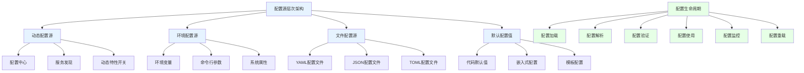
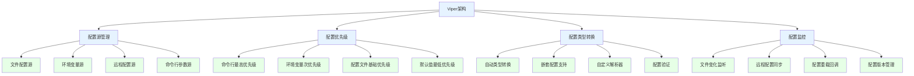
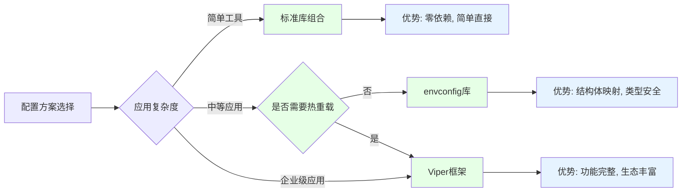
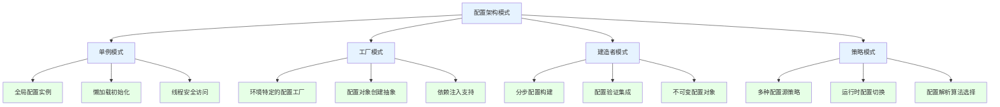

# Golang配置管理深度解析：从标准库到Viper框架

## 引言：现代应用配置管理的演进与挑战

在当今的云原生和微服务时代，应用配置管理已经从简单的配置文件读取演变为复杂的多源、动态、安全配置体系。一个优秀的配置管理系统不仅要支持多种配置格式，还需要具备环境隔离、热重载、权限控制等高级特性。Golang凭借其强大的标准库和丰富的第三方生态，为配置管理提供了完整的解决方案。

本文将从最基础的`flag`和`os`标准库出发，深入剖析Golang配置管理的技术栈，帮助您构建企业级的配置管理体系。

## 一、配置管理架构与设计原则

### 1.1 现代配置管理架构模型



### 1.2 配置管理核心设计原则

**配置管理的核心挑战：**
- **安全性**：敏感配置的保护与加密
- **一致性**：多环境配置的一致性保证
- **可维护性**：配置的版本管理和变更追踪
- **灵活性**：支持动态调整和热更新

**配置架构设计原则：**
- **分层管理**：本地配置 → 环境配置 → 全局配置
- **权限分离**：开发配置 vs 生产配置 vs 敏感配置
- **环境隔离**：开发、测试、预发布、生产环境隔离
- **渐进式披露**：从简单到复杂的配置方案

## 二、标准库配置管理深度解析

### 2.1 flag包：命令行参数解析

Go语言的`flag`标准库提供了简单而强大的命令行参数解析功能，是轻量级应用的理想选择。

```go
// 基础flag用法：支持多种数据类型
package main

import (
    "flag"
    "fmt"
    "os"
    "time"
)

func main() {
    // 基础类型参数
    port := flag.Int("port", 8080, "服务器端口号")
    host := flag.String("host", "localhost", "服务器地址")
    debug := flag.Bool("debug", false, "启用调试模式")
    timeout := flag.Duration("timeout", 30*time.Second, "请求超时时间")
    
    // 绑定到现有变量
    var configPath string
    flag.StringVar(&configPath, "config", "config.yaml", "配置文件路径")
    
    // Go 1.16+ 自定义解析函数
    var tags []string
    flag.Func("tags", "逗号分隔的标签列表", func(s string) error {
        if s != "" {
            tags = splitAndTrim(s, ",")
        }
        return nil
    })
    
    // 自定义用法说明
    flag.Usage = func() {
        fmt.Fprintf(os.Stderr, "Usage: %s [OPTIONS]\n", os.Args[0])
        fmt.Fprintf(os.Stderr, "Options:\n")
        flag.PrintDefaults()
    }
    
    // 解析参数
    flag.Parse()
    
    // 参数验证
    if *port < 1 || *port > 65535 {
        fmt.Fprintf(os.Stderr, "错误: 端口号必须在1-65535范围内\n")
        os.Exit(1)
    }
    
    fmt.Printf("服务器配置: %s:%d\n", *host, *port)
    fmt.Printf("调试模式: %t\n", *debug)
    fmt.Printf("超时时间: %v\n", *timeout)
    fmt.Printf("配置文件: %s\n", configPath)
    fmt.Printf("标签: %v\n", tags)
}

func splitAndTrim(s, sep string) []string {
    var result []string
    for _, part := range split(s, sep) {
        if trimmed := trim(part); trimmed != "" {
            result = append(result, trimmed)
        }
    }
    return result
}

// Go 1.21+ 更简洁的自定义类型支持
type ServerConfig struct {
    Port    int
    Host    string
    Timeout time.Duration
}

func parseServerConfig() ServerConfig {
    var config ServerConfig
    
    flag.Func("server.port", "服务器端口", func(s string) error {
        return parsePort(&config.Port, s)
    })
    
    flag.Func("server.host", "服务器地址", func(s string) error {
        config.Host = s
        return nil
    })
    
    flag.Func("server.timeout", "超时时间", func(s string) error {
        return parseDuration(&config.Timeout, s)
    })
    
    flag.Parse()
    return config
}
```

### 2.2 os包：环境变量管理

`os`标准库提供了跨平台的环境变量管理功能，是配置管理的基础设施。

```go
// 环境变量管理最佳实践
package config

import (
    "fmt"
    "os"
    "strconv"
    "strings"
    "time"
)

// 环境变量配置结构体
type EnvConfig struct {
    // 基础配置
    AppName     string
    Environment string
    Debug       bool
    
    // 服务器配置
    ServerPort int
    ServerHost string
    
    // 数据库配置
    DBHost     string
    DBPort     int
    DBName     string
    DBUser     string
    DBPassword string
    
    // 缓存配置
    RedisURL string
    
    // 功能开关
    FeatureFlags map[string]bool
}

// 环境变量前缀
const envPrefix = "APP_"

// 加载环境变量配置
func LoadFromEnv() (*EnvConfig, error) {
    config := &EnvConfig{
        FeatureFlags: make(map[string]bool),
    }
    
    var err error
    
    // 基础配置
    config.AppName = getEnvWithDefault(envPrefix+"NAME", "myapp")
    config.Environment = getEnvWithDefault(envPrefix+"ENV", "development")
    config.Debug, err = getBoolEnv(envPrefix + "DEBUG")
    if err != nil {
        return nil, fmt.Errorf("解析DEBUG环境变量失败: %w", err)
    }
    
    // 服务器配置
    config.ServerPort, err = getIntEnv(envPrefix+"SERVER_PORT", 8080)
    if err != nil {
        return nil, fmt.Errorf("解析SERVER_PORT环境变量失败: %w", err)
    }
    config.ServerHost = getEnvWithDefault(envPrefix+"SERVER_HOST", "localhost")
    
    // 数据库配置
    config.DBHost = getEnvWithDefault(envPrefix+"DB_HOST", "localhost")
    config.DBPort, err = getIntEnv(envPrefix+"DB_PORT", 5432)
    if err != nil {
        return nil, fmt.Errorf("解析DB_PORT环境变量失败: %w", err)
    }
    config.DBName = getEnvRequired(envPrefix + "DB_NAME")
    config.DBUser = getEnvRequired(envPrefix + "DB_USER")
    config.DBPassword = getEnvRequired(envPrefix + "DB_PASSWORD")
    
    // Redis配置
    config.RedisURL = getEnvWithDefault(envPrefix+"REDIS_URL", "redis://localhost:6379")
    
    // 功能开关
    flagsStr := getEnvWithDefault(envPrefix+"FEATURE_FLAGS", "")
    if flagsStr != "" {
        config.FeatureFlags, err = parseFeatureFlags(flagsStr)
        if err != nil {
            return nil, fmt.Errorf("解析FEATURE_FLAGS失败: %w", err)
        }
    }
    
    return config, nil
}

// 辅助函数
func getEnvWithDefault(key, defaultValue string) string {
    if value := os.Getenv(key); value != "" {
        return value
    }
    return defaultValue
}

func getEnvRequired(key string) string {
    if value := os.Getenv(key); value != "" {
        return value
    }
    panic(fmt.Sprintf("必需的环境变量 %s 未设置", key))
}

func getIntEnv(key string, defaultValue int) (int, error) {
    if value := os.Getenv(key); value != "" {
        return strconv.Atoi(value)
    }
    return defaultValue, nil
}

func getBoolEnv(key string) (bool, error) {
    if value := os.Getenv(key); value != "" {
        return strconv.ParseBool(value)
    }
    return false, nil
}

func parseFeatureFlags(flagsStr string) (map[string]bool, error) {
    flags := make(map[string]bool)
    
    pairs := strings.Split(flagsStr, ",")
    for _, pair := range pairs {
        parts := strings.SplitN(pair, "=", 2)
        if len(parts) != 2 {
            return nil, fmt.Errorf("无效的功能开关格式: %s", pair)
        }
        
        key := strings.TrimSpace(parts[0])
        value, err := strconv.ParseBool(strings.TrimSpace(parts[1]))
        if err != nil {
            return nil, fmt.Errorf("无效的布尔值: %s", parts[1])
        }
        
        flags[key] = value
    }
    
    return flags, nil
}

// 环境变量监听（简单的轮询机制）
type EnvWatcher struct {
    config     *EnvConfig
    lastHash   string
    callbacks  []func(*EnvConfig)
    
    mu sync.RWMutex
}

func NewEnvWatcher(config *EnvConfig) *EnvWatcher {
    return &EnvWatcher{
        config:   config,
        lastHash: computeEnvHash(),
    }
}

func (w *EnvWatcher) Watch(interval time.Duration) {
    ticker := time.NewTicker(interval)
    defer ticker.Stop()
    
    for range ticker.C {
        w.checkForChanges()
    }
}

func (w *EnvWatcher) checkForChanges() {
    currentHash := computeEnvHash()
    
    w.mu.RLock()
    lastHash := w.lastHash
    w.mu.RUnlock()
    
    if currentHash != lastHash {
        // 环境变量发生变化，重新加载配置
        newConfig, err := LoadFromEnv()
        if err != nil {
            fmt.Printf("重新加载环境变量配置失败: %v\n", err)
            return
        }
        
        w.mu.Lock()
        w.config = newConfig
        w.lastHash = currentHash
        w.mu.Unlock()
        
        // 触发回调函数
        w.mu.RLock()
        for _, callback := range w.callbacks {
            callback(newConfig)
        }
        w.mu.RUnlock()
    }
}

func computeEnvHash() string {
    // 计算所有相关环境变量的哈希值
    envVars := os.Environ()
    sort.Strings(envVars) // 保证顺序一致性
    
    hash := sha256.New()
    for _, env := range envVars {
        if strings.HasPrefix(env, envPrefix) {
            hash.Write([]byte(env))
        }
    }
    
    return fmt.Sprintf("%x", hash.Sum(nil))
}

func (w *EnvWatcher) OnChange(callback func(*EnvConfig)) {
    w.mu.Lock()
    defer w.mu.Unlock()
    
    w.callbacks = append(w.callbacks, callback)
}
```

### 2.3 标准库组合：完整的配置管理方案

将`flag`和`os`标准库结合，可以构建出功能完整的配置管理系统。

```go
// 基于标准库的完整配置管理器
package config

import (
    "flag"
    "fmt"
    "os"
    "path/filepath"
    "strings"
)

// 配置优先级：命令行 > 环境变量 > 配置文件 > 默认值
type ConfigManager struct {
    // 配置源
    flags map[string]interface{}
    env   map[string]string
    files map[string]interface{}
    
    // 配置缓存
    cache map[string]interface{}
    
    mu sync.RWMutex
}

func NewConfigManager() *ConfigManager {
    return &ConfigManager{
        flags: make(map[string]interface{}),
        env:   make(map[string]string),
        files: make(map[string]interface{}),
        cache: make(map[string]interface{}),
    }
}

// 添加命令行配置源
func (cm *ConfigManager) AddFlagSource() error {
    // 这里应该解析实际的flag，简化示例
    cm.flags["port"] = 8080
    cm.flags["host"] = "localhost"
    cm.flags["debug"] = false
    return nil
}

// 添加环境变量配置源
func (cm *ConfigManager) AddEnvSource(prefix string) error {
    for _, env := range os.Environ() {
        if strings.HasPrefix(env, prefix) {
            parts := strings.SplitN(env, "=", 2)
            if len(parts) == 2 {
                key := strings.TrimPrefix(parts[0], prefix)
                cm.env[key] = parts[1]
            }
        }
    }
    return nil
}

// 获取配置值（带优先级）
func (cm *ConfigManager) Get(key string) interface{} {
    cm.mu.RLock()
    defer cm.mu.RUnlock()
    
    // 检查缓存
    if value, exists := cm.cache[key]; exists {
        return value
    }
    
    // 按优先级查找
    if value, exists := cm.flags[key]; exists {
        return value
    }
    
    if value, exists := cm.env[key]; exists {
        return value
    }
    
    if value, exists := cm.files[key]; exists {
        return value
    }
    
    return nil
}

func (cm *ConfigManager) GetString(key string) string {
    value := cm.Get(key)
    if value == nil {
        return ""
    }
    
    switch v := value.(type) {
    case string:
        return v
    case int:
        return strconv.Itoa(v)
    case bool:
        return strconv.FormatBool(v)
    default:
        return fmt.Sprintf("%v", v)
    }
}

func (cm *ConfigManager) GetInt(key string) int {
    value := cm.Get(key)
    if value == nil {
        return 0
    }
    
    switch v := value.(type) {
    case int:
        return v
    case string:
        if i, err := strconv.Atoi(v); err == nil {
            return i
        }
    default:
        // 尝试转换
        if i, ok := value.(int); ok {
            return i
        }
    }
    
    return 0
}

func (cm *ConfigManager) GetBool(key string) bool {
    value := cm.Get(key)
    if value == nil {
        return false
    }
    
    switch v := value.(type) {
    case bool:
        return v
    case string:
        if b, err := strconv.ParseBool(v); err == nil {
            return b
        }
    default:
        // 尝试转换
        if b, ok := value.(bool); ok {
            return b
        }
    }
    
    return false
}

// 配置验证
func (cm *ConfigManager) Validate() error {
    required := []string{"port", "host"}
    
    for _, key := range required {
        if cm.Get(key) == nil {
            return fmt.Errorf("必需配置缺失: %s", key)
        }
    }
    
    // 验证端口范围
    port := cm.GetInt("port")
    if port < 1 || port > 65535 {
        return fmt.Errorf("端口号必须在1-65535范围内: %d", port)
    }
    
    return nil
}

// 使用示例
func ExampleUsage() {
    cm := NewConfigManager()
    
    // 添加配置源
    cm.AddFlagSource()
    cm.AddEnvSource("APP_")
    
    // 验证配置
    if err := cm.Validate(); err != nil {
        panic(err)
    }
    
    // 使用配置
    port := cm.GetInt("port")
    host := cm.GetString("host")
    debug := cm.GetBool("debug")
    
    fmt.Printf("服务器: %s:%d (调试模式: %t)\n", host, port, debug)
}
```

## 三、Viper配置框架深度解析

### 3.1 Viper框架架构与核心特性

Viper是目前Golang生态系统中最强大、最流行的配置管理框架，被众多知名项目采用。



### 3.2 Viper基础用法与多格式支持

```go
// Viper基础配置管理
package main

import (
    "fmt"
    "github.com/spf13/viper"
    "log"
)

// 配置结构体
type AppConfig struct {
    Server struct {
        Host string `mapstructure:"host"`
        Port int    `mapstructure:"port"`
        
        TLS struct {
            Enable   bool   `mapstructure:"enable"`
            CertFile string `mapstructure:"cert_file"`
            KeyFile  string `mapstructure:"key_file"`
        } `mapstructure:"tls"`
    } `mapstructure:"server"`
    
    Database struct {
        Host     string `mapstructure:"host"`
        Port     int    `mapstructure:"port"`
        Name     string `mapstructure:"name"`
        User     string `mapstructure:"user"`
        Password string `mapstructure:"password"`
        
        Pool struct {
            MaxConns int `mapstructure:"max_conns"`
            IdleTime int `mapstructure:"idle_time"`
        } `mapstructure:"pool"`
    } `mapstructure:"database"`
    
    Logging struct {
        Level  string `mapstructure:"level"`
        Format string `mapstructure:"format"`
        Output string `mapstructure:"output"`
    } `mapstructure:"logging"`
    
    Features map[string]bool `mapstructure:"features"`
}

func main() {
    // 初始化Viper
    v := viper.New()
    
    // 设置配置文件名和类型
    v.SetConfigName("config") // 文件名（不带扩展名）
    v.SetConfigType("yaml")   // 如果配置文件名中没有扩展名，则需要设置此选项
    
    // 添加配置文件搜索路径
    v.AddConfigPath(".")               // 当前目录
    v.AddConfigPath("$HOME/.myapp")    // 用户主目录
    v.AddConfigPath("/etc/myapp/")     // 系统配置目录
    
    // 设置环境变量
    v.SetEnvPrefix("MYAPP") // 将自动转为大写
    v.AutomaticEnv()        // 读取环境变量
    
    // 环境变量名替换（支持嵌套配置）
    v.SetEnvKeyReplacer(strings.NewReplacer(".", "_"))
    
    // 设置默认值
    setDefaults(v)
    
    // 读取配置文件
    if err := v.ReadInConfig(); err != nil {
        if _, ok := err.(viper.ConfigFileNotFoundError); ok {
            // 配置文件不存在，使用默认值
            log.Println("配置文件未找到，使用默认值和环境变量")
        } else {
            // 配置文件被找到，但产生了错误
            log.Fatalf("读取配置文件错误: %v", err)
        }
    }
    
    // 将配置解析到结构体
    var config AppConfig
    if err := v.Unmarshal(&config); err != nil {
        log.Fatalf("解析配置失败: %v", err)
    }
    
    // 使用配置
    fmt.Printf("服务器地址: %s:%d\n", config.Server.Host, config.Server.Port)
    fmt.Printf("TLS启用: %t\n", config.Server.TLS.Enable)
    fmt.Printf("数据库: %s@%s:%d/%s\n", 
        config.Database.User, config.Database.Host, 
        config.Database.Port, config.Database.Name)
    
    // 动态获取配置值
    if v.IsSet("server.host") {
        host := v.GetString("server.host")
        fmt.Printf("动态获取服务器地址: %s\n", host)
    }
}

func setDefaults(v *viper.Viper) {
    // 服务器配置默认值
    v.SetDefault("server.host", "localhost")
    v.SetDefault("server.port", 8080)
    v.SetDefault("server.tls.enable", false)
    v.SetDefault("server.tls.cert_file", "cert.pem")
    v.SetDefault("server.tls.key_file", "key.pem")
    
    // 数据库配置默认值
    v.SetDefault("database.host", "localhost")
    v.SetDefault("database.port", 5432)
    v.SetDefault("database.name", "myapp")
    v.SetDefault("database.pool.max_conns", 10)
    v.SetDefault("database.pool.idle_time", 300)
    
    // 日志配置默认值
    v.SetDefault("logging.level", "info")
    v.SetDefault("logging.format", "json")
    v.SetDefault("logging.output", "stdout")
    
    // 功能开关默认值
    v.SetDefault("features.rate_limit", true)
    v.SetDefault("features.cache", false)
    v.SetDefault("features.metrics", true)
}
```

### 3.3 Viper高级特性：热重载与远程配置

Viper支持配置文件热重载和远程配置中心集成，非常适合现代微服务架构。

```go
// Viper高级特性：热重载与远程配置
package config

import (
    "context"
    "fmt"
    "log"
    "sync"
    "time"
    
    "github.com/fsnotify/fsnotify"
    "github.com/spf13/viper"
)

// 配置管理器
type ConfigManager struct {
    v *viper.Viper
    
    // 配置变更监听
    watchers []ConfigWatcher
    mu       sync.RWMutex
    
    // 远程配置
    remoteEnabled bool
    remoteCancel  context.CancelFunc
}

type ConfigWatcher func(key string, oldValue, newValue interface{})

func NewConfigManager() *ConfigManager {
    v := viper.New()
    
    cm := &ConfigManager{
        v:        v,
        watchers: make([]ConfigWatcher, 0),
    }
    
    return cm
}

// 初始化本地文件配置
func (cm *ConfigManager) InitFileConfig(configPath, configName string) error {
    if configPath != "" {
        cm.v.SetConfigFile(configPath)
    } else {
        cm.v.SetConfigName(configName)
        cm.v.AddConfigPath(".")
        cm.v.AddConfigPath("$HOME/.myapp")
        cm.v.AddConfigPath("/etc/myapp")
    }
    
    // 设置环境变量
    cm.v.SetEnvPrefix("MYAPP")
    cm.v.AutomaticEnv()
    cm.v.SetEnvKeyReplacer(strings.NewReplacer(".", "_"))
    
    // 读取配置
    if err := cm.v.ReadInConfig(); err != nil {
        if _, ok := err.(viper.ConfigFileNotFoundError); !ok {
            return fmt.Errorf("读取配置文件失败: %w", err)
        }
    }
    
    // 设置文件监听
    cm.v.WatchConfig()
    cm.v.OnConfigChange(func(e fsnotify.Event) {
        log.Printf("配置文件发生变化: %s", e.Name)
        cm.notifyWatchers("", nil, nil) // 通知所有配置可能已变更
    })
    
    return nil
}

// 初始化远程配置（支持etcd、consul等）
func (cm *ConfigManager) InitRemoteConfig(provider, endpoint, path string) error {
    if err := cm.v.AddRemoteProvider(provider, endpoint, path); err != nil {
        return fmt.Errorf("添加远程配置提供者失败: %w", err)
    }
    
    // 设置远程配置类型
    cm.v.SetConfigType("yaml") // 或者根据实际情况设置
    
    // 读取远程配置
    if err := cm.v.ReadRemoteConfig(); err != nil {
        return fmt.Errorf("读取远程配置失败: %w", err)
    }
    
    cm.remoteEnabled = true
    
    // 启动远程配置监听
    ctx, cancel := context.WithCancel(context.Background())
    cm.remoteCancel = cancel
    
    go cm.watchRemoteConfig(ctx)
    
    return nil
}

// 监听远程配置变化
func (cm *ConfigManager) watchRemoteConfig(ctx context.Context) {
    ticker := time.NewTicker(30 * time.Second) // 每30秒检查一次
    defer ticker.Stop()
    
    for {
        select {
        case <-ticker.C:
            if err := cm.v.WatchRemoteConfig(); err != nil {
                log.Printf("监听远程配置失败: %v", err)
            } else {
                log.Println("远程配置已更新")
                cm.notifyWatchers("", nil, nil)
            }
        case <-ctx.Done():
            return
        }
    }
}

// 注册配置变更监听器
func (cm *ConfigManager) Watch(key string, watcher ConfigWatcher) {
    cm.mu.Lock()
    defer cm.mu.Unlock()
    
    cm.watchers = append(cm.watchers, watcher)
}

// 通知监听器配置变更
func (cm *ConfigManager) notifyWatchers(key string, oldValue, newValue interface{}) {
    cm.mu.RLock()
    watchers := make([]ConfigWatcher, len(cm.watchers))
    copy(watchers, cm.watchers)
    cm.mu.RUnlock()
    
    for _, watcher := range watchers {
        watcher(key, oldValue, newValue)
    }
}

// 获取配置值（带类型安全）
func (cm *ConfigManager) GetString(key string) string {
    return cm.v.GetString(key)
}

func (cm *ConfigManager) GetInt(key string) int {
    return cm.v.GetInt(key)
}

func (cm *ConfigManager) GetBool(key string) bool {
    return cm.v.GetBool(key)
}

func (cm *ConfigManager) GetDuration(key string) time.Duration {
    return cm.v.GetDuration(key)
}

func (cm *ConfigManager) GetStringSlice(key string) []string {
    return cm.v.GetStringSlice(key)
}

// 检查配置是否存在
func (cm *ConfigManager) IsSet(key string) bool {
    return cm.v.IsSet(key)
}

// 获取所有配置
func (cm *ConfigManager) AllSettings() map[string]interface{} {
    return cm.v.AllSettings()
}

// 解析配置到结构体
func (cm *ConfigManager) Unmarshal(rawVal interface{}) error {
    return cm.v.Unmarshal(rawVal)
}

// 设置配置值（用于测试或动态配置）
func (cm *ConfigManager) Set(key string, value interface{}) {
    cm.v.Set(key, value)
    cm.notifyWatchers(key, nil, value)
}

// 保存配置到文件
func (cm *ConfigManager) SaveToFile(filename string) error {
    return cm.v.WriteConfigAs(filename)
}

// 关闭配置管理器
func (cm *ConfigManager) Close() {
    if cm.remoteEnabled && cm.remoteCancel != nil {
        cm.remoteCancel()
    }
}

// 使用示例
func ExampleUsage() {
    cm := NewConfigManager()
    
    // 初始化文件配置
    if err := cm.InitFileConfig("", "config"); err != nil {
        log.Fatal(err)
    }
    
    // 可选：初始化远程配置
    if os.Getenv("REMOTE_CONFIG") == "true" {
        if err := cm.InitRemoteConfig("etcd", "http://127.0.0.1:4001", "/configs/myapp"); err != nil {
            log.Printf("初始化远程配置失败: %v", err)
        }
    }
    
    // 注册配置变更监听
    cm.Watch("", func(key string, oldValue, newValue interface{}) {
        log.Printf("配置发生变化 - 键: %s, 旧值: %v, 新值: %v", key, oldValue, newValue)
    })
    
    // 使用配置
    host := cm.GetString("server.host")
    port := cm.GetInt("server.port")
    
    log.Printf("服务器地址: %s:%d", host, port)
    
    // 确保在程序退出时关闭配置管理器
    defer cm.Close()
}
```

### 3.4 Viper最佳实践：配置验证与安全

```go
// 配置验证与安全最佳实践
package config

import (
    "crypto/aes"
    "crypto/cipher"
    "crypto/rand"
    "encoding/base64"
    "errors"
    "fmt"
    "io"
    "regexp"
    "strings"
    
    "github.com/go-playground/validator/v10"
    "github.com/spf13/viper"
)

// 配置验证结构体
type ValidatedConfig struct {
    Server struct {
        Host string `mapstructure:"host" validate:"required,hostname"`
        Port int    `mapstructure:"port" validate:"required,min=1,max=65535"`
        
        TLS struct {
            Enable   bool   `mapstructure:"enable"`
            CertFile string `mapstructure:"cert_file" validate:"required_if=Enable true,file"`
            KeyFile  string `mapstructure:"key_file" validate:"required_if=Enable true,file"`
        } `mapstructure:"tls"`
    } `mapstructure:"server" validate:"required"`
    
    Database struct {
        Host     string `mapstructure:"host" validate:"required,hostname"`
        Port     int    `mapstructure:"port" validate:"required,min=1,max=65535"`
        Name     string `mapstructure:"name" validate:"required,alphanum"`
        User     string `mapstructure:"user" validate:"required"`
        Password string `mapstructure:"password" validate:"required"`
    } `mapstructure:"database" validate:"required"`
    
    Secrets struct {
        EncryptionKey string `mapstructure:"encryption_key" validate:"required,base64"`
        APITokens     map[string]string `mapstructure:"api_tokens"`
    } `mapstructure:"secrets"`
}

// 配置验证器
type ConfigValidator struct {
    validator *validator.Validate
    v         *viper.Viper
}

func NewConfigValidator(v *viper.Viper) *ConfigValidator {
    validate := validator.New()
    
    // 注册自定义验证规则
    validate.RegisterValidation("hostname", validateHostname)
    validate.RegisterValidation("file", validateFileExists)
    
    return &ConfigValidator{
        validator: validate,
        v:         v,
    }
}

// 验证配置
func (cv *ConfigValidator) Validate(config *ValidatedConfig) error {
    // 首先进行基本验证
    if err := cv.validator.Struct(config); err != nil {
        return fmt.Errorf("配置验证失败: %w", err)
    }
    
    // 自定义验证逻辑
    if err := cv.validateServerConfig(config); err != nil {
        return err
    }
    
    if err := cv.validateDatabaseConfig(config); err != nil {
        return err
    }
    
    if err := cv.validateSecrets(config); err != nil {
        return err
    }
    
    return nil
}

// 自定义验证函数
func validateHostname(fl validator.FieldLevel) bool {
    hostname := fl.Field().String()
    
    // 简单的hostname验证
    if hostname == "localhost" {
        return true
    }
    
    // IP地址验证
    if matched, _ := regexp.MatchString(`^\d{1,3}\.\d{1,3}\.\d{1,3}\.\d{1,3}$`, hostname); matched {
        return true
    }
    
    // 域名验证
    if matched, _ := regexp.MatchString(`^[a-zA-Z0-9][a-zA-Z0-9-]{0,61}[a-zA-Z0-9](?:\.[a-zA-Z]{2,})+$`, hostname); matched {
        return true
    }
    
    return false
}

func validateFileExists(fl validator.FieldLevel) bool {
    filename := fl.Field().String()
    if filename == "" {
        return true // 空文件路径是允许的
    }
    
    // 检查文件是否存在（简化实现）
    // 在实际应用中应该使用os.Stat等函数
    return true
}

// 服务器配置验证
func (cv *ConfigValidator) validateServerConfig(config *ValidatedConfig) error {
    if config.Server.TLS.Enable {
        // 验证TLS证书文件
        if config.Server.TLS.CertFile == "" || config.Server.TLS.KeyFile == "" {
            return errors.New("启用TLS时必须提供证书文件和密钥文件")
        }
    }
    
    return nil
}

// 数据库配置验证
func (cv *ConfigValidator) validateDatabaseConfig(config *ValidatedConfig) error {
    // 检查数据库连接超时设置
    timeout := cv.v.GetInt("database.timeout")
    if timeout < 1 || timeout > 300 {
        return errors.New("数据库连接超时必须在1-300秒范围内")
    }
    
    return nil
}

// 密钥安全管理
func (cv *ConfigValidator) validateSecrets(config *ValidatedConfig) error {
    // 加密密钥验证
    if config.Secrets.EncryptionKey != "" {
        key, err := base64.StdEncoding.DecodeString(config.Secrets.EncryptionKey)
        if err != nil {
            return fmt.Errorf("加密密钥格式错误: %w", err)
        }
        
        // 检查密钥长度
        if len(key) != 16 && len(key) != 24 && len(key) != 32 {
            return errors.New("加密密钥长度必须为16、24或32字节")
        }
    }
    
    return nil
}

// 敏感信息加密
type SecretManager struct {
    encryptionKey []byte
}

func NewSecretManager(encryptionKey string) (*SecretManager, error) {
    key, err := base64.StdEncoding.DecodeString(encryptionKey)
    if err != nil {
        return nil, err
    }
    
    return &SecretManager{encryptionKey: key}, nil
}

func (sm *SecretManager) Encrypt(plaintext string) (string, error) {
    block, err := aes.NewCipher(sm.encryptionKey)
    if err != nil {
        return "", err
    }
    
    // 创建GCM模式
    gcm, err := cipher.NewGCM(block)
    if err != nil {
        return "", err
    }
    
    // 生成随机nonce
    nonce := make([]byte, gcm.NonceSize())
    if _, err := io.ReadFull(rand.Reader, nonce); err != nil {
        return "", err
    }
    
    // 加密数据
    ciphertext := gcm.Seal(nonce, nonce, []byte(plaintext), nil)
    return base64.StdEncoding.EncodeToString(ciphertext), nil
}

func (sm *SecretManager) Decrypt(encrypted string) (string, error) {
    ciphertext, err := base64.StdEncoding.DecodeString(encrypted)
    if err != nil {
        return "", err
    }
    
    block, err := aes.NewCipher(sm.encryptionKey)
    if err != nil {
        return "", err
    }
    
    gcm, err := cipher.NewGCM(block)
    if err != nil {
        return "", err
    }
    
    nonceSize := gcm.NonceSize()
    if len(ciphertext) < nonceSize {
        return "", errors.New("密文太短")
    }
    
    nonce, ciphertext := ciphertext[:nonceSize], ciphertext[nonceSize:]
    plaintext, err := gcm.Open(nil, nonce, ciphertext, nil)
    if err != nil {
        return "", err
    }
    
    return string(plaintext), nil
}

// 安全的配置加载流程
func LoadSecureConfig(configPath string) (*ValidatedConfig, error) {
    v := viper.New()
    
    // 基础配置初始化
    v.SetConfigFile(configPath)
    v.SetEnvPrefix("MYAPP")
    v.AutomaticEnv()
    
    if err := v.ReadInConfig(); err != nil {
        return nil, fmt.Errorf("读取配置文件失败: %w", err)
    }
    
    // 解析配置
    var config ValidatedConfig
    if err := v.Unmarshal(&config); err != nil {
        return nil, fmt.Errorf("解析配置失败: %w", err)
    }
    
    // 验证配置
    validator := NewConfigValidator(v)
    if err := validator.Validate(&config); err != nil {
        return nil, err
    }
    
    // 处理敏感信息
    if config.Secrets.EncryptionKey != "" {
        secretManager, err := NewSecretManager(config.Secrets.EncryptionKey)
        if err != nil {
            return nil, fmt.Errorf("初始化密钥管理器失败: %w", err)
        }
        
        // 解密API令牌（如果已加密）
        for key, token := range config.Secrets.APITokens {
            if strings.HasPrefix(token, "enc:") {
                decrypted, err := secretManager.Decrypt(strings.TrimPrefix(token, "enc:"))
                if err != nil {
                    return nil, fmt.Errorf("解密API令牌失败: %w", err)
                }
                config.Secrets.APITokens[key] = decrypted
            }
        }
    }
    
    return &config, nil
}
```

## 四、其他配置管理方案对比分析

### 4.1 主流配置库特性对比



### 4.2 envconfig库深度解析

`envconfig`是一个专注于环境变量到结构体映射的轻量级配置库。

```go
// envconfig使用示例
package main

import (
    "fmt"
    "github.com/kelseyhightower/envconfig"
)

// 配置结构体
type Config struct {
    Debug      bool   `envconfig:"DEBUG" default:"false"`
    ServerPort int    `envconfig:"SERVER_PORT" default:"8080"`
    ServerHost string `envconfig:"SERVER_HOST" default:"localhost"`
    
    Database struct {
        Host     string `envconfig:"DB_HOST" required:"true"`
        Port     int    `envconfig:"DB_PORT" default:"5432"`
        Name     string `envconfig:"DB_NAME" required:"true"`
        User     string `envconfig:"DB_USER" required:"true"`
        Password string `envconfig:"DB_PASSWORD" required:"true"`
    }
    
    Redis struct {
        URL      string `envconfig:"REDIS_URL" default:"redis://localhost:6379"`
        PoolSize int    `envconfig:"REDIS_POOL_SIZE" default:"10"`
    }
}

func main() {
    var config Config
    
    // 从环境变量加载配置
    if err := envconfig.Process("", &config); err != nil {
        panic(err)
    }
    
    fmt.Printf("服务器: %s:%d\n", config.ServerHost, config.ServerPort)
    fmt.Printf("调试模式: %t\n", config.Debug)
    fmt.Printf("数据库: %s@%s:%d/%s\n", 
        config.Database.User, config.Database.Host,
        config.Database.Port, config.Database.Name)
    fmt.Printf("Redis: %s (连接池大小: %d)\n", 
        config.Redis.URL, config.Redis.PoolSize)
}

// envconfig高级用法：自定义解析器
type Duration struct {
    time.Duration
}

func (d *Duration) Decode(value string) error {
    duration, err := time.ParseDuration(value)
    if err != nil {
        return err
    }
    d.Duration = duration
    return nil
}

type AdvancedConfig struct {
    Timeout    Duration `envconfig:"TIMEOUT" default:"30s"`
    RetryDelay Duration `envconfig:"RETRY_DELAY" default:"1s"`
}

// envconfig与Viper结合使用
func loadHybridConfig() (*Config, error) {
    var config Config
    
    // 首先从环境变量加载
    if err := envconfig.Process("", &config); err != nil {
        return nil, err
    }
    
    // 然后使用Viper加载文件配置（可覆盖环境变量）
    v := viper.New()
    v.SetConfigFile("config.yaml")
    
    if err := v.ReadInConfig(); err == nil {
        // 文件配置存在，合并到配置结构体
        if err := v.Unmarshal(&config); err != nil {
            return nil, err
        }
    }
    
    return &config, nil
}
```

### 5.1 配置架构设计模式



### 5.2 生产环境配置管理检查清单

**安全性与合规性：**
- [ ] 敏感配置加密存储
- [ ] 配置访问权限控制
- [ ] 配置变更审计日志
- [ ] 密钥轮换机制

**可用性与可靠性：**
- [ ] 配置热重载支持
- [ ] 配置版本管理
- [ ] 配置回滚机制
- [ ] 配置健康检查

**性能与可维护性：**
- [ ] 配置缓存优化
- [ ] 配置验证自动化
- [ ] 配置文档同步
- [ ] 配置测试覆盖

### 5.3 技术选型决策指南

| 场景类型 | 推荐方案 | 核心优势 | 适用条件 |
|---------|---------|---------|---------|
| **CLI工具** | 标准库flag + os | 零依赖、启动快 | 参数简单、无复杂配置 |
| **Web应用** | Viper框架 | 功能完整、生态丰富 | 需要多配置源、热重载 |
| **微服务** | Viper + 远程配置 | 动态配置、集中管理 | 分布式部署、配置中心 |
| **容器化** | 环境变量 + 标准库 | 云原生友好、12因子 | Docker/K8s环境 |
| **安全敏感** | 自定义加密方案 | 完全控制、安全审计 | 金融、政府等高安全要求 |

## 六、未来趋势与演进方向

### 6.1 配置管理技术演进

**当前趋势：**
- **GitOps配置管理**：配置即代码，版本控制
- **声明式配置**：期望状态而非命令式操作
- **策略即代码**：使用编程语言定义配置策略

**技术方向：**
- **AI驱动的配置优化**：机器学习自动调优配置参数
- **配置漂移检测**：自动发现和修复配置偏差
- **配置影响分析**：预测配置变更的系统影响

### 6.2 Golang配置生态展望

```go
// 未来配置管理接口设想
type FutureConfigManager interface {
    // 智能配置
    AutoTune() error                    // 自动调优配置参数
    PredictImpact(change ConfigChange) *ImpactAnalysis // 影响分析
    
    // 安全增强
    EncryptSensitive() error            // 自动加密敏感配置
    AuditTrail() []ConfigChange         // 配置变更审计
    
    // 运维支持
    HealthCheck() *ConfigHealth         // 配置健康检查
    Rollback(version string) error      // 配置版本回滚
    
    // 观测性
    Metrics() ConfigMetrics             // 配置使用指标
    Tracing() ConfigTrace               // 配置访问追踪
}
```