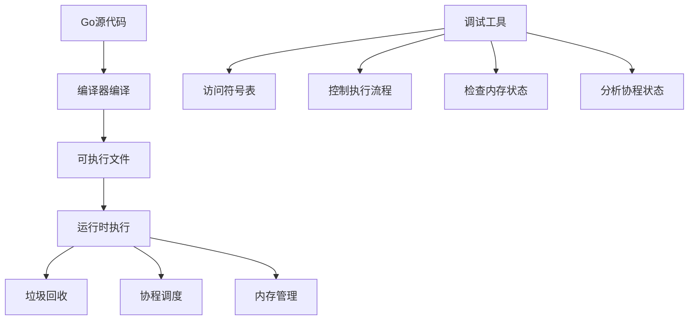
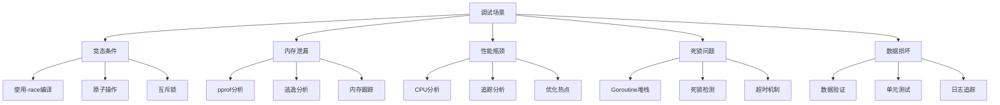
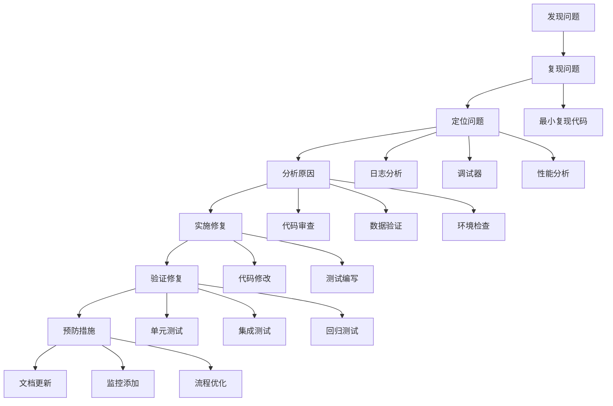

# Golang调试深度指南：从Print到Delve的完整调试艺术

## 一、序言：为什么需要专业的调试技能？

在Go语言开发中，调试技能是区分优秀程序员和普通程序员的关键能力。无论是简单的逻辑错误还是复杂的并发问题，掌握专业的调试技术都能让您：

- **快速定位问题**：减少盲目猜测和试错时间
- **深入理解程序**：通过调试了解程序的真实执行流程
- **提高代码质量**：在调试过程中发现潜在的设计问题
- **增强自信心**：面对复杂问题时保持冷静和专业

本文将带您从最基础的print调试开始，逐步深入到专业的调试器使用、性能分析和并发调试，最终掌握完整的Go调试技能体系。

## 二、调试基础：理解Go程序的执行

### 2.1 Go程序的运行时特性

Go语言作为编译型语言，其运行时特性对调试有重要影响：



**Go调试的关键挑战**：

1. **协程并发**：多个协程同时执行，难以跟踪执行顺序
2. **垃圾回收**：内存自动管理，指针状态可能随时变化
3. **接口动态类型**：运行时类型信息需要特殊处理
4. **内联优化**：编译器优化可能隐藏调用栈信息

### 2.2 调试工具生态概览

Go语言拥有丰富的调试工具生态系统：

```go
// 基础调试示例
package main

import (
    "fmt"
    "runtime"
    "time"
)

func main() {
    // 获取基本的运行时信息
    fmt.Printf("Go版本: %s\n", runtime.Version())
    fmt.Printf("操作系统: %s\n", runtime.GOOS)
    fmt.Printf("架构: %s\n", runtime.GOARCH)
    fmt.Printf("CPU核心数: %d\n", runtime.NumCPU())
    
    // 演示一个简单的竞态条件
    demoRaceCondition()
}

func demoRaceCondition() {
    var counter int
    
    // 启动多个goroutine同时修改counter
    for i := 0; i < 10; i++ {
        go func() {
            for j := 0; j < 1000; j++ {
                counter++ // 这里存在竞态条件
            }
        }()
    }
    
    time.Sleep(1 * time.Second)
    fmt.Printf("Counter值: %d (期望: 10000)\n", counter)
}
```

## 三、初级调试：Print和日志调试

### 3.1 传统的Print调试法

虽然简单，但Print调试在某些场景下仍然非常有效：

```go
package print_debug

import (
    "fmt"
    "runtime"
    "time"
)

// 增强的Print调试函数
func DebugPrint(format string, args ...interface{}) {
    // 获取调用者信息
    pc, file, line, ok := runtime.Caller(1)
    if !ok {
        file = "unknown"
        line = 0
    }
    
    // 获取函数名
    fn := runtime.FuncForPC(pc)
    funcName := "unknown"
    if fn != nil {
        funcName = fn.Name()
    }
    
    timestamp := time.Now().Format("15:04:05.000")
    
    // 输出调试信息
    fmt.Printf("[%s] %s:%d %s: ", timestamp, file, line, funcName)
    fmt.Printf(format, args...)
    fmt.Println()
}

// 条件调试
func ConditionalDebug(condition bool, format string, args ...interface{}) {
    if condition {
        DebugPrint(format, args...)
    }
}

// 示例使用
func ComplexCalculation(a, b int) int {
    DebugPrint("开始计算，a=%d, b=%d", a, b)
    
    result := 0
    for i := 0; i < a; i++ {
        ConditionalDebug(i%100 == 0, "处理第%d次迭代", i)
        
        for j := 0; j < b; j++ {
            result += i * j
            
            // 检查中间结果
            if result < 0 {
                DebugPrint("发现负数结果: %d (i=%d, j=%d)", result, i, j)
            }
        }
    }
    
    DebugPrint("计算完成，结果=%d", result)
    return result
}

func main() {
    DebugPrint("程序启动")
    
    result := ComplexCalculation(100, 50)
    
    DebugPrint("最终结果: %d", result)
}
```

### 3.2 结构化日志调试

使用专业的日志库进行更规范的调试：

```go
package log_debug

import (
    "log"
    "os"
    "runtime"
    
    "github.com/sirupsen/logrus"
    "go.uber.org/zap"
)

// 使用标准库log
func StandardLogDebug() {
    // 配置log输出
    log.SetFlags(log.LstdFlags | log.Lshortfile | log.Lmicroseconds)
    
    log.Println("标准日志: 程序启动")
    
    // 带文件行号的调试
    log.Printf("调试信息: 变量值=%d", 42)
    
    // 错误日志
    if err := someOperation(); err != nil {
        log.Printf("操作失败: %v", err)
    }
}

// 使用logrus（功能丰富）
func LogrusDebug() {
    logger := logrus.New()
    logger.SetLevel(logrus.DebugLevel)
    logger.SetFormatter(&logrus.TextFormatter{
        FullTimestamp: true,
    })
    
    logger.WithFields(logrus.Fields{
        "goroutines": runtime.NumGoroutine(),
        "operation":  "complex_calc",
    }).Debug("开始复杂计算")
    
    // 不同级别的日志
    logger.Info("信息级别日志")
    logger.Warn("警告级别日志")
    logger.Error("错误级别日志")
}

// 使用zap（高性能）
func ZapDebug() {
    logger, _ := zap.NewDevelopment()
    defer logger.Sync()
    
    // 结构化日志
    logger.Info("启动应用",
        zap.Int("goroutines", runtime.NumGoroutine()),
        zap.String("version", "1.0.0"),
    )
    
    // 调试日志（只在开发环境输出）
    logger.Debug("调试信息",
        zap.String("key", "value"),
        zap.Int("count", 100),
    )
    
    // 错误日志带堆栈
    if err := someOperation(); err != nil {
        logger.Error("操作失败",
            zap.Error(err),
            zap.String("operation", "some_operation"),
        )
    }
}

func someOperation() error {
    return fmt.Errorf("模拟错误")
}

// 自定义日志级别控制
type DebugLevel int

const (
    LevelSilent DebugLevel = iota
    LevelError
    LevelWarn
    LevelInfo
    LevelDebug
    LevelTrace
)

var currentLevel = LevelInfo

func SetDebugLevel(level DebugLevel) {
    currentLevel = level
}

func LogDebug(level DebugLevel, msg string, fields ...interface{}) {
    if level <= currentLevel {
        pc, file, line, _ := runtime.Caller(1)
        fn := runtime.FuncForPC(pc)
        
        log.Printf("[%s] %s:%d %s: %s", 
            levelToString(level), 
            file, line, fn.Name(), 
            fmt.Sprintf(msg, fields...))
    }
}

func levelToString(level DebugLevel) string {
    switch level {
    case LevelError: return "ERROR"
    case LevelWarn: return "WARN"
    case LevelInfo: return "INFO"
    case LevelDebug: return "DEBUG"
    case LevelTrace: return "TRACE"
    default: return "UNKNOWN"
    }
}
```

### 3.3 调试标识符和条件编译

利用构建标签控制调试代码：

```go
// +build debug

package debug_build

// 调试版本特有的功能
var debugEnabled = true

func DebugLog(msg string) {
    if debugEnabled {
        log.Printf("[DEBUG] %s", msg)
    }
}

func HeavyDebugOperation() {
    // 只在调试版本执行的重操作
    if debugEnabled {
        // 性能分析、详细检查等
    }
}

// +build !debug

package debug_build

// 生产版本的轻量实现
var debugEnabled = false

func DebugLog(msg string) {
    // 生产环境为空实现
}

func HeavyDebugOperation() {
    // 生产环境为空实现
}

// 使用示例
// 构建调试版本: go build -tags debug
// 构建生产版本: go build
```

## 四、中级调试：Delve调试器深入

### 4.1 Delve安装和基础使用

Delve是Go语言的官方调试器，功能强大：

```bash
# 安装Delve
go install github.com/go-delve/delve/cmd/dlv@latest

# 基础调试命令
dlv debug main.go                    # 调试模式启动
(dlv) break main.main               # 设置断点
(dlv) continue                      # 继续执行
(dlv) next                         # 下一行
(dlv) step                         # 进入函数
(dlv) print variable               # 打印变量
(dlv) goroutines                   # 查看所有goroutine
(dlv) stack                        # 查看调用栈
```

### 4.2 完整的Delve调试会话示例

```go
package delve_example

import (
    "fmt"
    "sync"
    "time"
)

type User struct {
    ID   int
    Name string
    Age  int
}

func processUser(user *User, wg *sync.WaitGroup) {
    defer wg.Done()
    
    // 模拟处理逻辑
    fmt.Printf("处理用户: %s (ID: %d)\n", user.Name, user.ID)
    
    // 复杂计算（这里可以设置断点）
    result := complexCalculation(user.Age)
    
    fmt.Printf("用户 %s 的处理结果: %d\n", user.Name, result)
}

func complexCalculation(age int) int {
    // 这个函数适合进行逐行调试
    result := age * 2
    
    // 条件逻辑
    if age > 30 {
        result += 100
    } else {
        result -= 50
    }
    
    // 循环处理
    for i := 0; i < 5; i++ {
        result += i * age
    }
    
    return result
}

func main() {
    fmt.Println("程序启动...")
    
    users := []*User{
        {ID: 1, Name: "张三", Age: 25},
        {ID: 2, Name: "李四", Age: 35},
        {ID: 3, Name: "王五", Age: 28},
    }
    
    var wg sync.WaitGroup
    
    // 启动多个goroutine处理用户
    for _, user := range users {
        wg.Add(1)
        go processUser(user, &wg)
    }
    
    // 等待所有处理完成
    wg.Wait()
    
    fmt.Println("所有用户处理完成")
    
    // 模拟一个可能出错的操作
    problematicOperation()
}

func problematicOperation() {
    data := make([]int, 0, 10)
    
    // 这里可能存在索引问题
    for i := 0; i < 15; i++ { // 故意超过容量
        if i < cap(data) {
            data = append(data, i)
        } else {
            fmt.Printf("索引 %d 超出容量 %d\n", i, cap(data))
            // 这里可以设置断点观察切片状态
        }
    }
    
    fmt.Printf("最终数据: %v\n", data)
}
```

**对应的Delve调试会话**：

```bash
# 启动调试
dlv debug delve_example.go

# 常用调试命令示例
(dlv) break main.main                    # 在main函数设断点
(dlv) break delve_example.go:35          # 在具体行设断点
(dlv) break complexCalculation           # 在函数入口设断点
(dlv) condition 1 age > 30               # 条件断点
(dlv) continue                           # 运行到断点
(dlv) print user                         # 查看user变量
(dlv) print user.Name                    # 查看具体字段
(dlv) next                               # 执行下一行
(dlv) step                               # 进入函数调用
(dlv) goroutines                         # 查看所有goroutine
(dlv) goroutine 1 stack                  # 查看特定goroutine的栈
(dlv) watch result                       # 监控变量变化
(dlv) trace problematicOperation         # 跟踪函数执行
```

### 4.3 Delve高级功能

**远程调试和IDE集成**：

```bash
# 启动调试服务器
dlv debug --headless --listen=:2345 --api-version=2 --log main.go

# 在另一个终端连接
dlv connect :2345

# 或者在IDE中配置远程调试
```

**核心转储分析**：

```bash
# 生成core dump
dlv core executable core.dump

# 分析转储文件
(dlv) goroutines
(dlv) goroutine 1 stack
(dlv) print globalVariables
```

## 五、高级调试：性能分析和并发调试

### 5.1 性能分析（Profiling）

Go内置了强大的性能分析工具，可以帮助识别性能瓶颈：

```go
package profiling

import (
    "fmt"
    "log"
    "os"
    "runtime"
    "runtime/pprof"
    "runtime/trace"
    "sync"
    "time"
)

// CPU性能分析
func StartCPUProfile() (*os.File, error) {
    f, err := os.Create("cpu.prof")
    if err != nil {
        return nil, err
    }
    
    if err := pprof.StartCPUProfile(f); err != nil {
        f.Close()
        return nil, err
    }
    
    return f, nil
}

func StopCPUProfile(f *os.File) {
    pprof.StopCPUProfile()
    f.Close()
}

// 内存分析
func WriteHeapProfile() error {
    f, err := os.Create("heap.prof")
    if err != nil {
        return err
    }
    defer f.Close()
    
    runtime.GC() // 执行GC获取准确的内存使用
    return pprof.WriteHeapProfile(f)
}

// 追踪分析
func StartTrace() (*os.File, error) {
    f, err := os.Create("trace.out")
    if err != nil {
        return nil, err
    }
    
    if err := trace.Start(f); err != nil {
        f.Close()
        return nil, err
    }
    
    return f, nil
}

func StopTrace(f *os.File) {
    trace.Stop()
    f.Close()
}

// 性能测试函数
func PerformanceHeavyFunction() {
    var wg sync.WaitGroup
    
    // 模拟CPU密集型任务
    for i := 0; i < 10; i++ {
        wg.Add(1)
        go func(id int) {
            defer wg.Done()
            
            sum := 0
            for j := 0; j < 1000000; j++ {
                sum += j * id
            }
            
            fmt.Printf("Goroutine %d 完成，结果: %d\n", id, sum)
        }(i)
    }
    
    wg.Wait()
}

// 内存密集型函数
func MemoryIntensiveFunction() {
    // 模拟内存分配模式
    var slices [][]int
    
    for i := 0; i < 1000; i++ {
        // 分配不同大小的切片
        size := i % 100
        slice := make([]int, size)
        
        for j := 0; j < size; j++ {
            slice[j] = j * i
        }
        
        slices = append(slices, slice)
        
        // 定期释放一些内存
        if i%200 == 0 {
            slices = slices[:len(slices)/2]
            runtime.GC() // 强制GC观察效果
        }
    }
    
    fmt.Printf("最终切片数量: %d\n", len(slices))
}

func main() {
    fmt.Println("=== 性能分析演示 ===")
    
    // 启动CPU分析
    cpuFile, err := StartCPUProfile()
    if err != nil {
        log.Fatal("无法启动CPU分析:", err)
    }
    defer StopCPUProfile(cpuFile)
    
    // 启动追踪
    traceFile, err := StartTrace()
    if err != nil {
        log.Fatal("无法启动追踪:", err)
    }
    defer StopTrace(traceFile)
    
    // 运行性能测试
    fmt.Println("运行CPU密集型任务...")
    PerformanceHeavyFunction()
    
    fmt.Println("运行内存密集型任务...")
    MemoryIntensiveFunction()
    
    // 写入堆分析
    if err := WriteHeapProfile(); err != nil {
        log.Fatal("无法写入堆分析:", err)
    }
    
    fmt.Println("性能分析完成，文件已生成:")
    fmt.Println("- cpu.prof: CPU使用分析")
    fmt.Println("- heap.prof: 内存使用分析") 
    fmt.Println("- trace.out: 执行追踪分析")
    
    fmt.Println("\n使用以下命令查看分析结果:")
    fmt.Println("go tool pprof cpu.prof")
    fmt.Println("go tool pprof -http=:8080 cpu.prof")
    fmt.Println("go tool trace trace.out")
}
```

**性能分析工具使用**：

```bash
# 分析CPU性能
go tool pprof cpu.prof
(pprof) top10                    # 查看最耗时的函数
(pprof) list functionName        # 查看函数详细信息
(pprof) web                      # 生成调用图

# 分析内存使用
go tool pprof heap.prof
(pprof) top10 -alloc_space       # 查看内存分配最多的函数
(pprof) peek functionName        # 查看函数内存分配详情

# 追踪分析
go tool trace trace.out
# 在浏览器中查看详细的执行时间线
```

### 5.2 并发调试技术

Go的并发特性带来了独特的调试挑战：

```go
package concurrency_debug

import (
    "fmt"
    "log"
    "runtime"
    "sync"
    "sync/atomic"
    "time"
)

// 竞态条件检测
func RaceConditionDemo() {
    var counter int32
    var wg sync.WaitGroup
    
    // 启动多个goroutine同时修改counter
    for i := 0; i < 100; i++ {
        wg.Add(1)
        go func(id int) {
            defer wg.Done()
            
            for j := 0; j < 1000; j++ {
                // 不安全的操作 - 存在竞态条件
                // counter++
                
                // 安全的操作
                atomic.AddInt32(&counter, 1)
                
                // 添加一些延迟增加竞态机会
                time.Sleep(time.Microsecond)
            }
            
            fmt.Printf("Goroutine %d 完成\n", id)
        }(i)
    }
    
    wg.Wait()
    fmt.Printf("最终计数器值: %d (期望: 100000)\n", counter)
}

// 死锁检测
func DeadlockDemo() {
    var mu1, mu2 sync.Mutex
    var wg sync.WaitGroup
    
    wg.Add(2)
    
    // Goroutine 1: 先锁mu1，再锁mu2
    go func() {
        defer wg.Done()
        
        mu1.Lock()
        fmt.Println("G1 获取 mu1")
        time.Sleep(100 * time.Millisecond) // 增加死锁概率
        
        mu2.Lock() // 可能在这里死锁
        fmt.Println("G1 获取 mu2")
        
        mu2.Unlock()
        mu1.Unlock()
    }()
    
    // Goroutine 2: 先锁mu2，再锁mu1
    go func() {
        defer wg.Done()
        
        mu2.Lock()
        fmt.Println("G2 获取 mu2")
        time.Sleep(100 * time.Millisecond) // 增加死锁概率
        
        mu1.Lock() // 可能在这里死锁
        fmt.Println("G2 获取 mu1")
        
        mu1.Unlock()
        mu2.Unlock()
    }()
    
    // 设置超时检测死锁
    done := make(chan bool)
    go func() {
        wg.Wait()
        done <- true
    }()
    
    select {
    case <-done:
        fmt.Println("所有goroutine完成，无死锁")
    case <-time.After(1 * time.Second):
        fmt.Println("超时: 检测到可能的死锁")
        
        // 打印当前goroutine状态
        fmt.Println("=== Goroutine状态 ===")
        buf := make([]byte, 1<<16)
        stackSize := runtime.Stack(buf, true)
        fmt.Printf("%s\n", buf[:stackSize])
    }
}

// Goroutine泄漏检测
func GoroutineLeakDemo() {
    fmt.Printf("初始Goroutine数量: %d\n", runtime.NumGoroutine())
    
    // 模拟goroutine泄漏
    for i := 0; i < 10; i++ {
        go func(id int) {
            // 这个goroutine永远不会退出
            select {} // 永久阻塞
        }(i)
    }
    
    time.Sleep(100 * time.Millisecond)
    fmt.Printf("泄漏后Goroutine数量: %d\n", runtime.NumGoroutine())
    
    // 清理（在实际应用中需要确保goroutine正确退出）
    fmt.Println("注意: 这些goroutine会泄漏，程序需要手动终止")
}

// 使用context控制并发
func ContextDebugDemo() {
    import "context"
    
    ctx, cancel := context.WithTimeout(context.Background(), 2*time.Second)
    defer cancel()
    
    resultChan := make(chan string, 1)
    
    go func() {
        // 模拟长时间运行的任务
        time.Sleep(3 * time.Second)
        resultChan <- "任务完成"
    }()
    
    select {
    case result := <-resultChan:
        fmt.Println("结果:", result)
    case <-ctx.Done():
        fmt.Println("操作超时:", ctx.Err())
    }
}

// 高级并发调试工具
type DebugMutex struct {
    mu      sync.Mutex
    holders map[string]time.Time // 记录持有者
    name    string
}

func NewDebugMutex(name string) *DebugMutex {
    return &DebugMutex{
        holders: make(map[string]time.Time),
        name:    name,
    }
}

func (dm *DebugMutex) Lock(holder string) {
    fmt.Printf("[%s] %s 尝试获取锁\n", dm.name, holder)
    
    start := time.Now()
    dm.mu.Lock()
    
    dm.holders[holder] = time.Now()
    fmt.Printf("[%s] %s 获取锁成功，等待时间: %v\n", 
        dm.name, holder, time.Since(start))
}

func (dm *DebugMutex) Unlock(holder string) {
    delete(dm.holders, holder)
    dm.mu.Unlock()
    
    fmt.Printf("[%s] %s 释放锁\n", dm.name, holder)
}

func (dm *DebugMutex) GetHolders() []string {
    var holders []string
    for holder := range dm.holders {
        holders = append(holders, holder)
    }
    return holders
}

func main() {
    fmt.Println("=== 并发调试演示 ===")
    
    fmt.Println("\n1. 竞态条件检测:")
    RaceConditionDemo()
    
    fmt.Println("\n2. 死锁检测:")
    DeadlockDemo()
    
    fmt.Println("\n3. Goroutine泄漏检测:")
    GoroutineLeakDemo()
    
    fmt.Println("\n4. Context超时控制:")
    ContextDebugDemo()
    
    fmt.Println("\n=== 使用Go运行时工具 ===")
    fmt.Println("编译时启用竞态检测: go build -race")
    fmt.Println("运行时分析Goroutine: go tool trace")
    fmt.Println("死锁检测: 使用pprof分析阻塞情况")
}
```

**竞态检测工具使用**：

```bash
# 编译时启用竞态检测
go build -race main.go

# 运行程序，竞态检测器会自动工作
./main

# 如果检测到竞态条件，会输出详细信息
# 包括竞态发生的堆栈跟踪
```

### 5.3 内存调试和分析

```go
package memory_debug

import (
    "fmt"
    "runtime"
    "runtime/debug"
    "time"
    "unsafe"
)

// 内存分配跟踪
type MemoryTracker struct {
    allocations map[uintptr]string
    totalAllocated uint64
}

func NewMemoryTracker() *MemoryTracker {
    return &MemoryTracker{
        allocations: make(map[uintptr]string),
    }
}

func (mt *MemoryTracker) TrackAllocation(ptr interface{}, description string) {
    addr := uintptr(unsafe.Pointer(&ptr))
    mt.allocations[addr] = description
    
    // 估算分配大小（简化版）
    mt.totalAllocated += uint64(unsafe.Sizeof(ptr))
}

func (mt *MemoryTracker) PrintSummary() {
    fmt.Printf("内存跟踪摘要:\n")
    fmt.Printf("总分配次数: %d\n", len(mt.allocations))
    fmt.Printf("估算总大小: %d bytes\n", mt.totalAllocated)
    
    for addr, desc := range mt.allocations {
        fmt.Printf("0x%x: %s\n", addr, desc)
    }
}

// 内存分析函数
func AnalyzeMemoryUsage() {
    var m runtime.MemStats
    
    // 强制GC获取准确数据
    runtime.GC()
    
    runtime.ReadMemStats(&m)
    
    fmt.Printf("=== 内存使用分析 ===\n")
    fmt.Printf("堆内存分配: %v MB\n", m.HeapAlloc/1024/1024)
    fmt.Printf("堆内存使用: %v MB\n", m.HeapInuse/1024/1024)
    fmt.Printf("堆内存空闲: %v MB\n", m.HeapIdle/1024/1024)
    fmt.Printf("堆内存释放: %v MB\n", m.HeapReleased/1024/1024)
    
    fmt.Printf("总分配: %v MB\n", m.TotalAlloc/1024/1024)
    fmt.Printf("系统内存: %v MB\n", m.Sys/1024/1024)
    fmt.Printf("GC次数: %v\n", m.NumGC)
    fmt.Printf("上次GC时间: %v\n", time.Duration(m.LastGC))
    
    // 对象数量统计
    fmt.Printf("小对象数量: %v\n", m.Mallocs)
    fmt.Printf("释放对象数量: %v\n", m.Frees)
    fmt.Printf("存活对象数量: %v\n", m.Mallocs-m.Frees)
}

// 内存泄漏检测
func MemoryLeakDetection() {
    fmt.Println("=== 内存泄漏检测 ===")
    
    tracker := NewMemoryTracker()
    
    // 模拟内存分配
    var data []*int
    
    for i := 0; i < 1000; i++ {
        value := new(int)
        *value = i
        data = append(data, value)
        
        tracker.TrackAllocation(value, fmt.Sprintf("整数 %d", i))
        
        // 模拟内存泄漏：只保留部分引用
        if i%100 == 0 {
            // 每100次释放前面的引用
            data = data[len(data)-10:] // 只保留最后10个
        }
    }
    
    // 打印内存状态
    AnalyzeMemoryUsage()
    
    // 设置内存限制
    debug.SetMemoryLimit(100 * 1024 * 1024) // 100MB限制
    
    fmt.Println("内存分析完成")
}

// 逃逸分析调试
func EscapeAnalysisDemo() {
    fmt.Println("=== 逃逸分析 ===")
    
    // 这个变量会逃逸到堆上
    escaped := createEscapedVariable()
    fmt.Printf("逃逸变量: %p\n", escaped)
    
    // 这个变量不会逃逸
    notEscaped := createNonEscapedVariable()
    fmt.Printf("非逃逸变量: %p\n", ¬Escaped)
}

// 变量会逃逸到堆上（返回指针）
func createEscapedVariable() *int {
    value := 42
    return &value // 逃逸到堆
}

// 变量不会逃逸（栈上分配）
func createNonEscapedVariable() int {
    value := 100
    return value // 栈上分配
}

// 使用编译标志查看逃逸分析
// go build -gcflags="-m" memory_debug.go

func main() {
    fmt.Println("=== 内存调试演示 ===")
    
    EscapeAnalysisDemo()
    MemoryLeakDetection()
    
    fmt.Println("\n=== 内存调试技巧 ===")
    fmt.Println("1. 使用-gcflags=\"-m\" 查看逃逸分析")
    fmt.Println("2. 使用runtime.ReadMemStats()监控内存")
    fmt.Println("3. 使用pprof分析内存分配热点")
    fmt.Println("4. 设置GODEBUG=gctrace=1查看GC详情")
}
```

**内存调试工具**：

```bash
# 查看逃逸分析
go build -gcflags="-m" main.go

# 查看详细逃逸分析
go build -gcflags="-m -m" main.go

# 实时GC跟踪
GODEBUG=gctrace=1 ./main

# 内存分析
go tool pprof -http=:8080 http://localhost:6060/debug/pprof/heap
```

## 六、高级调试技巧与实战

### 6.1 条件编译与调试标识

利用Go的构建标签（build tags）实现调试代码的条件编译：

```go
// +build debug

package main

import "fmt"

// DebugMode 仅在debug构建标签启用时可用
var DebugMode = true

func debugLog(format string, args ...interface{}) {
    if DebugMode {
        fmt.Printf("[DEBUG] "+format+"\n", args...)
    }
}

// 只在调试模式下编译的函数
func debugHelper() {
    debugLog("调试助手被调用")
}
```

```go
// main.go - 主文件
package main

//go:generate go run generate_debug_info.go

import (
    "fmt"
    "runtime/debug"
)

// 版本信息（通过go:generate生成）
var (
    BuildTime  string
    GitCommit  string
    GoVersion  string
)

func init() {
    // 设置panic时打印堆栈
    debug.SetPanicOnFault(true)
}

func main() {
    fmt.Printf("应用启动信息:\n")
    fmt.Printf("构建时间: %s\n", BuildTime)
    fmt.Printf("Git提交: %s\n", GitCommit) 
    fmt.Printf("Go版本: %s\n", GoVersion)
    
    // 生产环境代码
    runProductionLogic()
}

func runProductionLogic() {
    defer func() {
        if r := recover(); r != nil {
            fmt.Printf("程序发生panic: %v\n", r)
            fmt.Printf("堆栈跟踪:\n%s\n", debug.Stack())
        }
    }()
    
    // 正常业务逻辑
    fmt.Println("执行生产环境逻辑...")
}
```

**构建命令**：

```bash
# 调试版本构建
go build -tags debug -o app_debug

# 生产版本构建
go build -o app_prod

# 生成调试信息
go generate
```

### 6.2 自定义调试工具

创建可重用的调试工具库：

```go
package debugtools

import (
    "encoding/json"
    "fmt"
    "log"
    "net/http"
    "net/http/pprof"
    "os"
    "path/filepath"
    "runtime"
    "strconv"
    "strings"
    "sync"
    "time"
)

// DebugServer 调试服务器
type DebugServer struct {
    addr string
    mux  *http.ServeMux
}

func NewDebugServer(addr string) *DebugServer {
    mux := http.NewServeMux()
    
    // 注册pprof端点
    mux.HandleFunc("/debug/pprof/", pprof.Index)
    mux.HandleFunc("/debug/pprof/cmdline", pprof.Cmdline)
    mux.HandleFunc("/debug/pprof/profile", pprof.Profile)
    mux.HandleFunc("/debug/pprof/symbol", pprof.Symbol)
    mux.HandleFunc("/debug/pprof/trace", pprof.Trace)
    
    // 自定义调试端点
    mux.HandleFunc("/debug/health", healthHandler)
    mux.HandleFunc("/debug/metrics", metricsHandler)
    mux.HandleFunc("/debug/goroutines", goroutinesHandler)
    mux.HandleFunc("/debug/memory", memoryHandler)
    
    return &DebugServer{
        addr: addr,
        mux:  mux,
    }
}

func (ds *DebugServer) Start() error {
    log.Printf("调试服务器启动在 %s", ds.addr)
    return http.ListenAndServe(ds.addr, ds.mux)
}

var startTime = time.Now()

// 健康检查处理器
func healthHandler(w http.ResponseWriter, r *http.Request) {
    w.Header().Set("Content-Type", "application/json")
    json.NewEncoder(w).Encode(map[string]interface{}{
        "status":    "healthy",
        "timestamp": time.Now().Unix(),
        "uptime":    time.Since(startTime).String(),
    })
}

// 指标处理器
func metricsHandler(w http.ResponseWriter, r *http.Request) {
    var m runtime.MemStats
    runtime.ReadMemStats(&m)
    
    w.Header().Set("Content-Type", "application/json")
    json.NewEncoder(w).Encode(map[string]interface{}{
        "goroutines":   runtime.NumGoroutine(),
        "memory_alloc": m.Alloc,
        "memory_sys":   m.Sys,
        "gc_count":     m.NumGC,
        "cpu_count":    runtime.NumCPU(),
    })
}

// Goroutine信息处理器
func goroutinesHandler(w http.ResponseWriter, r *http.Request) {
    buf := make([]byte, 1<<20)
    n := runtime.Stack(buf, true)
    
    w.Header().Set("Content-Type", "text/plain")
    w.Write(buf[:n])
}

// 内存信息处理器
func memoryHandler(w http.ResponseWriter, r *http.Request) {
    var m runtime.MemStats
    runtime.ReadMemStats(&m)
    
    w.Header().Set("Content-Type", "text/plain")
    fmt.Fprintf(w, "内存使用统计:\n")
    fmt.Fprintf(w, "分配内存: %v MB\n", m.Alloc/1024/1024)
    fmt.Fprintf(w, "系统内存: %v MB\n", m.Sys/1024/1024)
    fmt.Fprintf(w, "堆内存: %v MB\n", m.HeapAlloc/1024/1024)
    fmt.Fprintf(w, "GC次数: %v\n", m.NumGC)
    fmt.Fprintf(w, "Goroutine数量: %v\n", runtime.NumGoroutine())
}

// 性能追踪器
type PerformanceTracer struct {
    startTime   time.Time
    checkpoints map[string]time.Duration
}

func NewPerformanceTracer() *PerformanceTracer {
    return &PerformanceTracer{
        startTime:   time.Now(),
        checkpoints: make(map[string]time.Duration),
    }
}

func (pt *PerformanceTracer) Checkpoint(name string) {
    pt.checkpoints[name] = time.Since(pt.startTime)
}

func (pt *PerformanceTracer) Report() string {
    var sb strings.Builder
    sb.WriteString("性能追踪报告:\n")
    
    for name, duration := range pt.checkpoints {
        sb.WriteString(fmt.Sprintf("  %s: %v\n", name, duration))
    }
    
    sb.WriteString(fmt.Sprintf("总耗时: %v\n", time.Since(pt.startTime)))
    return sb.String()
}

// 文件调试工具
func WriteDebugFile(filename string, content []byte) error {
    debugDir := "./debug_logs"
    
    if err := os.MkdirAll(debugDir, 0755); err != nil {
        return err
    }
    
    filepath := filepath.Join(debugDir, filename)
    return os.WriteFile(filepath, content, 0644)
}

// 条件调试日志
type ConditionalLogger struct {
    enabled bool
    prefix  string
}

func NewConditionalLogger(prefix string, enabled bool) *ConditionalLogger {
    return &ConditionalLogger{
        enabled: enabled,
        prefix:  prefix,
    }
}

func (cl *ConditionalLogger) Log(format string, args ...interface{}) {
    if cl.enabled {
        log.Printf("[%s] "+format, append([]interface{}{cl.prefix}, args...)...)
    }
}

func (cl *ConditionalLogger) Enable() {
    cl.enabled = true
}

func (cl *ConditionalLogger) Disable() {
    cl.enabled = false
}
```

### 6.3 集成测试中的调试

```go
package integration_test

import (
    "bytes"
    "context"
    "encoding/json"
    "fmt"
    "io"
    "net/http"
    "net/http/httptest"
    "testing"
    "time"
)

// 测试调试助手
type TestDebugHelper struct {
    t           *testing.T
    debugBuffer *bytes.Buffer
    startTime   time.Time
}

func NewTestDebugHelper(t *testing.T) *TestDebugHelper {
    return &TestDebugHelper{
        t:           t,
        debugBuffer: &bytes.Buffer{},
        startTime:   time.Now(),
    }
}

func (tdh *TestDebugHelper) Log(format string, args ...interface{}) {
    timestamp := time.Since(tdh.startTime).String()
    message := fmt.Sprintf("[%s] "+format, append([]interface{}{timestamp}, args...)...)
    
    tdh.t.Log(message)
    fmt.Fprintln(tdh.debugBuffer, message)
}

func (tdh *TestDebugHelper) Assert(condition bool, message string) {
    if !condition {
        tdh.Log("断言失败: %s", message)
        tdh.t.Fatalf("断言失败: %s", message)
    }
}

func (tdh *TestDebugHelper) SaveDebugInfo(filename string) error {
    return WriteDebugFile(filename, tdh.debugBuffer.Bytes())
}

// HTTP测试调试
type HTTPTestDebugger struct {
    server *httptest.Server
    client *http.Client
}

func NewHTTPTestDebugger(handler http.Handler) *HTTPTestDebugger {
    server := httptest.NewServer(handler)
    
    return &HTTPTestDebugger{
        server: server,
        client: &http.Client{
            Timeout: 30 * time.Second,
        },
    }
}

func (htd *HTTPTestDebugger) Close() {
    htd.server.Close()
}

func (htd *HTTPTestDebugger) DoRequest(method, path string, body io.Reader) (*http.Response, error) {
    req, err := http.NewRequest(method, htd.server.URL+path, body)
    if err != nil {
        return nil, err
    }
    
    return htd.client.Do(req)
}

func (htd *HTTPTestDebugger) DoJSONRequest(method, path string, data interface{}) (*http.Response, error) {
    var body io.Reader
    
    if data != nil {
        jsonData, err := json.Marshal(data)
        if err != nil {
            return nil, err
        }
        body = bytes.NewReader(jsonData)
    }
    
    req, err := http.NewRequest(method, htd.server.URL+path, body)
    if err != nil {
        return nil, err
    }
    
    req.Header.Set("Content-Type", "application/json")
    return htd.client.Do(req)
}

// 并发测试调试
func RunConcurrentTest(t *testing.T, concurrency int, testFunc func(id int)) {
    debugHelper := NewTestDebugHelper(t)
    
    debugHelper.Log("开始并发测试，并发数: %d", concurrency)
    
    var wg sync.WaitGroup
    errorChan := make(chan error, concurrency)
    
    for i := 0; i < concurrency; i++ {
        wg.Add(1)
        
        go func(id int) {
            defer wg.Done()
            
            defer func() {
                if r := recover(); r != nil {
                    errorChan <- fmt.Errorf("goroutine %d panic: %v", id, r)
                }
            }()
            
            debugHelper.Log("启动goroutine %d", id)
            testFunc(id)
            debugHelper.Log("完成goroutine %d", id)
        }(i)
    }
    
    // 等待所有goroutine完成
    wg.Wait()
    close(errorChan)
    
    // 检查错误
    var errors []error
    for err := range errorChan {
        errors = append(errors, err)
    }
    
    if len(errors) > 0 {
        debugHelper.Log("发现 %d 个错误", len(errors))
        for _, err := range errors {
            debugHelper.Log("错误: %v", err)
        }
        t.Fatalf("并发测试失败，发现 %d 个错误", len(errors))
    }
    
    debugHelper.Log("并发测试完成，无错误")
}

// 基准测试调试
type BenchmarkDebugger struct {
    startTime   time.Time
    memoryStats map[string]uint64
}

func NewBenchmarkDebugger() *BenchmarkDebugger {
    return &BenchmarkDebugger{
        startTime:   time.Now(),
        memoryStats: make(map[string]uint64),
    }
}

func (bd *BenchmarkDebugger) RecordMemoryUsage(label string) {
    var m runtime.MemStats
    runtime.ReadMemStats(&m)
    bd.memoryStats[label] = m.Alloc
}

func (bd *BenchmarkDebugger) Report() string {
    var sb strings.Builder
    sb.WriteString("基准测试调试报告:\n")
    
    sb.WriteString(fmt.Sprintf("总耗时: %v\n", time.Since(bd.startTime)))
    
    for label, usage := range bd.memoryStats {
        sb.WriteString(fmt.Sprintf("%s 内存使用: %v bytes\n", label, usage))
    }
    
    return sb.String()
}
```

## 七、真实案例分析和工作流优化

### 7.1 常见调试场景与解决方案



**案例1：竞态条件调试**

```go
// 竞态条件示例
func raceConditionExample() {
    var counter int
    var wg sync.WaitGroup
    
    for i := 0; i < 1000; i++ {
        wg.Add(1)
        go func() {
            defer wg.Done()
            counter++ // 竞态条件
        }()
    }
    
    wg.Wait()
    fmt.Printf("Counter: %d (期望: 1000)\n", counter)
}

// 解决方案
func raceConditionFixed() {
    var counter int
    var mu sync.Mutex
    var wg sync.WaitGroup
    
    for i := 0; i < 1000; i++ {
        wg.Add(1)
        go func() {
            defer wg.Done()
            
            mu.Lock()
            defer mu.Unlock()
            counter++
        }()
    }
    
    wg.Wait()
    fmt.Printf("Counter: %d (期望: 1000)\n", counter)
}
```

**案例2：内存泄漏分析**

```go
// 内存泄漏示例
func memoryLeakExample() {
    var data []*big.Int
    
    // 模拟内存泄漏
    for i := 0; i < 10000; i++ {
        num := new(big.Int)
        num.SetInt64(int64(i))
        data = append(data, num) // 保留所有引用
    }
    
    // 即使data不再使用，内存也不会释放
    fmt.Printf("分配了 %d 个大整数\n", len(data))
}

// 内存泄漏检测
func detectMemoryLeak() {
    var m1, m2 runtime.MemStats
    
    // 记录初始内存
    runtime.GC()
    runtime.ReadMemStats(&m1)
    
    // 执行可能泄漏的操作
    memoryLeakExample()
    
    // 强制GC后记录内存
    runtime.GC()
    runtime.ReadMemStats(&m2)
    
    // 比较内存使用
    leaked := m2.HeapInuse - m1.HeapInuse
    if leaked > 1024*1024 { // 1MB阈值
        fmt.Printf("检测到可能的内存泄漏: %d bytes\n", leaked)
    }
}
```

### 7.2 调试工作流优化



**优化调试工作流**：

```go
// 调试工作流管理
type DebugWorkflow struct {
    steps    []DebugStep
    current  int
    findings []string
}

type DebugStep struct {
    name        string
    description string
    action      func() error
    checklist   []string
}

func NewDebugWorkflow() *DebugWorkflow {
    return &DebugWorkflow{
        steps: []DebugStep{
            {
                name:        "问题复现",
                description: "创建最小复现用例",
                checklist: []string{
                    "确认问题确实存在",
                    "创建隔离的测试环境",
                    "编写最小复现代码",
                },
            },
            {
                name:        "问题定位", 
                description: "使用工具定位问题根源",
                checklist: []string{
                    "添加详细日志",
                    "使用调试器单步执行",
                    "分析性能热点",
                    "检查内存使用",
                },
            },
            {
                name:        "原因分析",
                description: "深入分析问题原因",
                checklist: []string{
                    "代码逻辑分析",
                    "数据流追踪",
                    "并发问题检查",
                    "外部依赖验证",
                },
            },
            {
                name:        "修复实施",
                description: "实施并测试修复方案",
                checklist: []string{
                    "编写修复代码",
                    "添加单元测试",
                    "性能影响评估",
                    "向后兼容检查",
                },
            },
        },
    }
}

func (dw *DebugWorkflow) Run() error {
    for i, step := range dw.steps {
        dw.current = i
        fmt.Printf("=== 步骤 %d: %s ===\n", i+1, step.name)
        fmt.Printf("描述: %s\n", step.description)
        
        fmt.Println("检查清单:")
        for _, item := range step.checklist {
            fmt.Printf("  - %s\n", item)
        }
        
        if step.action != nil {
            if err := step.action(); err != nil {
                return fmt.Errorf("步骤 %d 失败: %v", i+1, err)
            }
        }
        
        fmt.Println()
    }
    
    return nil
}

func (dw *DebugWorkflow) AddFinding(finding string) {
    dw.findings = append(dw.findings, finding)
}

func (dw *DebugWorkflow) GenerateReport() string {
    var sb strings.Builder
    sb.WriteString("调试工作流报告\n")
    sb.WriteString("================\n\n")
    
    for i, step := range dw.steps {
        sb.WriteString(fmt.Sprintf("步骤 %d: %s\n", i+1, step.name))
        sb.WriteString(fmt.Sprintf("状态: %s\n", 
            func() string {
                if i < dw.current {
                    return "完成" 
                } else if i == dw.current {
                    return "进行中"
                }
                return "待开始"
            }()))
        sb.WriteString("\n")
    }
    
    if len(dw.findings) > 0 {
        sb.WriteString("发现的问题:\n")
        for _, finding := range dw.findings {
            sb.WriteString(fmt.Sprintf("  - %s\n", finding))
        }
    }
    
    return sb.String()
}
```

### 7.3 团队协作调试最佳实践

```go
// 协作调试工具
package teamdebug

import (
    "encoding/json"
    "fmt"
    "io"
    "net/http"
    "os"
    "path/filepath"
    "time"
)

// BugReport 问题报告
type BugReport struct {
    ID          string    `json:"id"`
    Title       string    `json:"title"`
    Description string    `json:"description"`
    Steps       []string  `json:"steps"`
    Expected    string    `json:"expected"`
    Actual      string    `json:"actual"`
    Environment string    `json:"environment"`
    Severity    string    `json:"severity"` // critical, high, medium, low
    Status      string    `json:"status"`   // open, in_progress, resolved, closed
    CreatedAt   time.Time `json:"created_at"`
    UpdatedAt   time.Time `json:"updated_at"`
    Attachments []string  `json:"attachments"` // 日志文件、截图等
}

func NewBugReport(title, description string) *BugReport {
    return &BugReport{
        ID:          generateID(),
        Title:       title,
        Description: description,
        Status:      "open",
        CreatedAt:   time.Now(),
        UpdatedAt:   time.Now(),
    }
}

func (br *BugReport) AddStep(step string) {
    br.Steps = append(br.Steps, step)
}

func (br *BugReport) AddAttachment(filepath string) {
    br.Attachments = append(br.Attachments, filepath)
}

func (br *BugReport) ToJSON() ([]byte, error) {
    br.UpdatedAt = time.Now()
    return json.MarshalIndent(br, "", "  ")
}

func generateID() string {
    return fmt.Sprintf("BUG-%d", time.Now().Unix())
}

// 调试会话记录
type DebugSession struct {
    ID        string               `json:"id"`
    BugID     string               `json:"bug_id"`
    StartTime time.Time            `json:"start_time"`
    EndTime   time.Time            `json:"end_time"`
    Actions   []DebugAction        `json:"actions"`
    Findings  []string             `json:"findings"`
    Solution  string              `json:"solution"`
}

type DebugAction struct {
    Timestamp time.Time `json:"timestamp"`
    Action    string    `json:"action"`
    Details   string    `json:"details"`
    Result    string    `json:"result"`
}

func NewDebugSession(bugID string) *DebugSession {
    return &DebugSession{
        ID:        fmt.Sprintf("SESSION-%d", time.Now().Unix()),
        BugID:     bugID,
        StartTime: time.Now(),
        Actions:   []DebugAction{},
    }
}

func (ds *DebugSession) RecordAction(action, details, result string) {
    ds.Actions = append(ds.Actions, DebugAction{
        Timestamp: time.Now(),
        Action:    action,
        Details:   details,
        Result:    result,
    })
}

func (ds *DebugSession) AddFinding(finding string) {
    ds.Findings = append(ds.Findings, finding)
}

func (ds *DebugSession) Complete(solution string) {
    ds.EndTime = time.Now()
    ds.Solution = solution
}

// 团队调试协作工具
func CreateDebugWorkspace(bugReport *BugReport) (string, error) {
    workspaceDir := filepath.Join("./debug_workspaces", bugReport.ID)
    
    if err := os.MkdirAll(workspaceDir, 0755); err != nil {
        return "", err
    }
    
    // 创建必要文件
    files := map[string]string{
        "bug_report.json":    func() string { b, _ := bugReport.ToJSON(); return string(b) }(),
        "README.md":          generateReadme(bugReport),
        "reproduction_code.go": generateReproductionCode(),
    }
    
    for filename, content := range files {
        filepath := filepath.Join(workspaceDir, filename)
        if err := os.WriteFile(filepath, []byte(content), 0644); err != nil {
            return "", err
        }
    }
    
    return workspaceDir, nil
}

func generateReadme(br *BugReport) string {
    return fmt.Sprintf(`# 调试工作区: %s

## 问题描述
%s

## 复现步骤
%s

## 环境信息
%s

## 附件
%s`, br.Title, br.Description, 
        func() string {
            var steps string
            for i, step := range br.Steps {
                steps += fmt.Sprintf("%d. %s\n", i+1, step)
            }
            return steps
        }(),
        br.Environment,
        func() string {
            var attachments string
            for _, att := range br.Attachments {
                attachments += fmt.Sprintf("- %s\n", att)
            }
            return attachments
        }())
}

func generateReproductionCode() string {
    return `package main

import "fmt"

// 最小复现代码模板
func main() {
    fmt.Println("问题复现代码")
    
    // 在这里添加复现问题的代码
    // 保持代码最小化，只包含必要部分
}`
}
```

