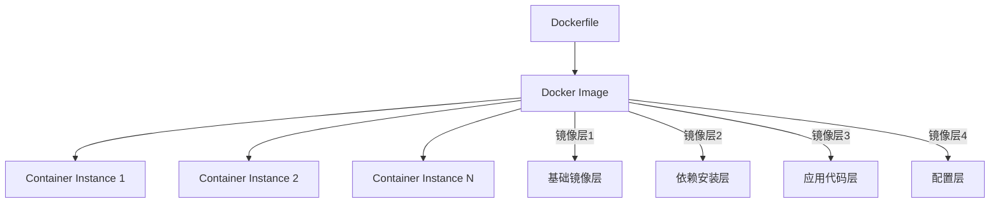
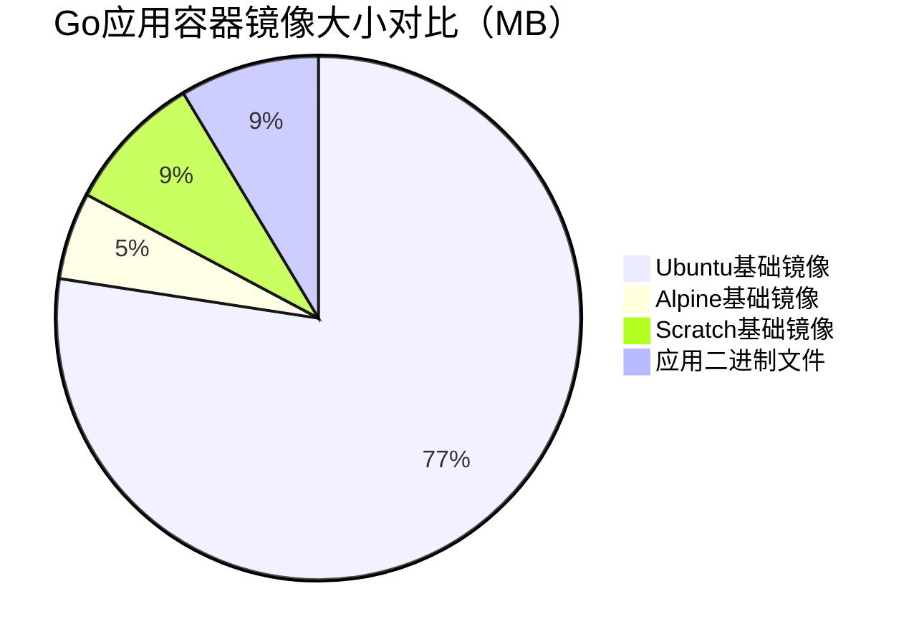
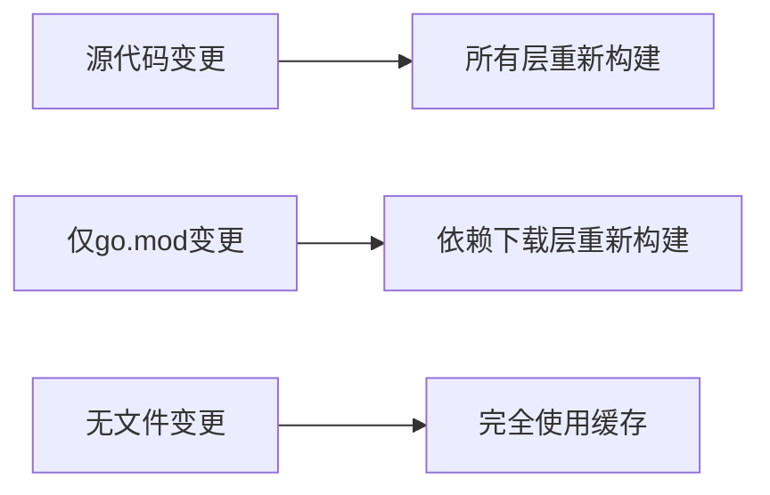
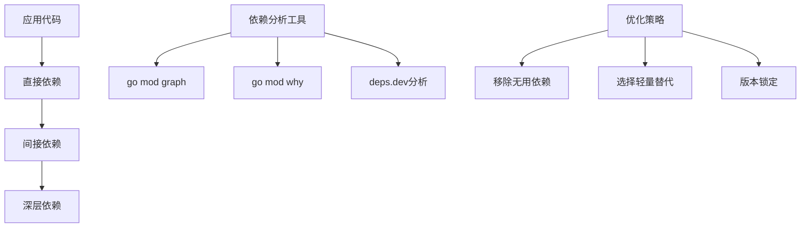
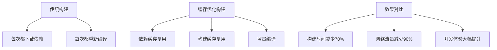
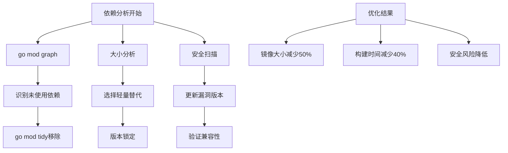
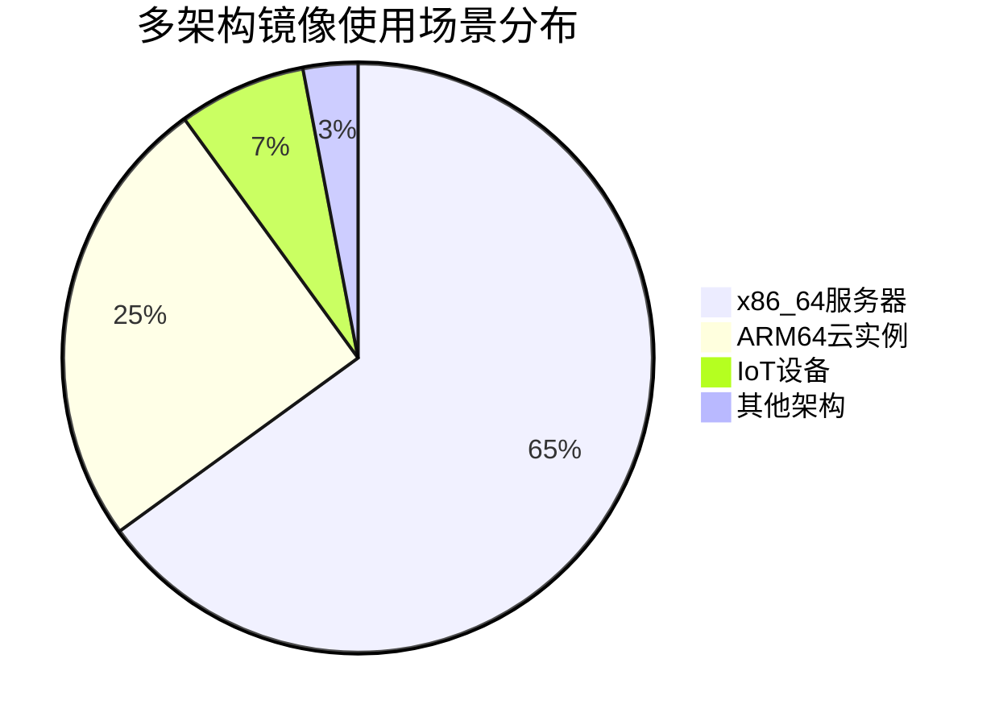
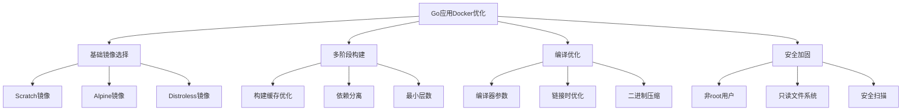

# Golang Docker打包优化深度指南：从基础到云原生最佳实践

## 一、序言：为什么需要Docker打包优化？

在现代微服务和云原生架构中，Golang应用因其出色的性能和编译型特性而备受欢迎。然而，如果没有正确的Docker打包优化策略，即使是高效的Go应用也可能在容器化部署时遇到挑战：

- **镜像体积过大**导致存储成本增加和部署缓慢
- **安全风险**来自包含不必要的系统组件
- **启动时间过长**影响弹性伸缩和故障恢复
- **资源浪费**于运行时不需要的构建依赖

本文将深入探讨Golang应用的Docker打包优化技术，从基础概念到高级优化策略，帮助您构建高效、安全的容器镜像。

## 二、Docker基础知识回顾

### 2.1 Docker镜像与容器



Docker镜像采用分层结构存储，每一层都是只读的。这种设计带来了两大优势：

**分层缓存机制**：构建过程中，如果某层内容没有变化，Docker会复用缓存中的层，大幅提升构建速度。

**存储效率**：多个镜像可以共享相同的基础层，减少存储空间占用。

### 2.2 Go应用的打包特点

Go语言作为编译型语言，在容器化时具有独特优势：

- **单文件部署**：编译为单个可执行文件，无需运行环境
- **跨平台编译**：支持交叉编译到不同架构
- **静态链接**：默认情况下所有依赖都静态链接到二进制文件中

```go
// 简单的Go Web应用示例
package main

import (
    "fmt"
    "log"
    "net/http"
    "os"
    "time"
)

func main() {
    http.HandleFunc("/", func(w http.ResponseWriter, r *http.Request) {
        fmt.Fprintf(w, "Hello from Go app running in Docker!\n")
        fmt.Fprintf(w, "Time: %s\n", time.Now().Format(time.RFC3339))
        fmt.Fprintf(w, "Hostname: %s\n", os.Getenv("HOSTNAME"))
    })
    
    port := os.Getenv("PORT")
    if port == "" {
        port = "8080"
    }
    
    log.Printf("Server starting on :%s", port)
    log.Fatal(http.ListenAndServe(":"+port, nil))
}
```

## 三、基础Dockerfile优化

### 3.1 基础镜像选择策略

选择合适的base image是优化的第一步：

```dockerfile
# ❌ 不建议：使用完整OS镜像
FROM ubuntu:20.04

# ✅ 推荐：使用轻量级基础镜像
FROM alpine:3.16
# 或者专门为Go优化的镜像
FROM golang:1.19-alpine

# 🏆 最佳实践：使用scratch镜像（零基础镜像）
FROM scratch
```

**镜像大小对比分析**：



### 3.2 多阶段构建（Multi-stage Builds）

多阶段构建是Go应用Docker优化的核心技术：

```dockerfile
# 第一阶段：构建阶段
FROM golang:1.19-alpine AS builder

# 设置工作目录
WORKDIR /app

# 复制go.mod和go.sum文件（利用缓存）
COPY go.mod go.sum ./
RUN go mod download

# 复制源代码
COPY . .

# 构建应用（禁用CGO，静态编译）
RUN CGO_ENABLED=0 GOOS=linux go build -a -installsuffix cgo -o main .

# 第二阶段：运行阶段
FROM alpine:3.16

# 安装安全更新和必要的运行时依赖
RUN apk --no-cache add ca-certificates tzdata

WORKDIR /root/

# 从构建阶段复制二进制文件
COPY --from=builder /app/main .

# 创建非root用户运行应用（安全最佳实践）
RUN addgroup -g 1000 appuser && \
    adduser -S -u 1000 -G appuser appuser
USER appuser

# 暴露端口
EXPOSE 8080

# 启动应用
CMD ["./main"]
```

### 3.3 优化Docker构建缓存

合理利用Docker缓存机制可以显著提升构建速度：

```dockerfile
# 优化后的Dockerfile示例
FROM golang:1.19-alpine AS builder

# 1. 首先复制依赖管理文件（变化频率最低）
COPY go.mod go.sum ./
RUN go mod download

# 2. 然后复制源代码（变化频率较高）
COPY . .

# 3. 最后执行构建命令（变化频率最高）
RUN CGO_ENABLED=0 GOOS=linux go build -ldflags='-w -s' -o /app/main .

FROM alpine:3.16
COPY --from=builder /app/main /app/main
CMD ["/app/main"]
```

**缓存策略对比**：



### 3.4 高级Dockerfile优化技巧

**最小化层数策略**：
```dockerfile
# ❌ 不推荐：多个RUN命令创建多个层
RUN apt-get update
RUN apt-get install -y curl
RUN apt-get install -y git
RUN apt-get clean

# ✅ 推荐：合并RUN命令减少层数
RUN apt-get update && \
    apt-get install -y curl git && \
    apt-get clean && \
    rm -rf /var/lib/apt/lists/*
```

**构建参数优化**：
```dockerfile
# 使用构建参数动态配置
ARG GO_VERSION=1.19
ARG ALPINE_VERSION=3.16

FROM golang:${GO_VERSION}-alpine AS builder
FROM alpine:${ALPINE_VERSION} as runner

# 多架构构建支持
ARG TARGETARCH
RUN echo "Building for architecture: ${TARGETARCH}"
```

## 四、Go应用特殊优化技术

### 4.1 Go编译器优化选项

Go编译器提供了丰富的优化选项来减小二进制大小：

```dockerfile
FROM golang:1.19-alpine AS builder

WORKDIR /app
COPY . .

# 优化编译参数
RUN CGO_ENABLED=0 GOOS=linux \
    go build -ldflags='-w -s -extldflags "-static"' \
    -a -installsuffix cgo \
    -o main .

# 进一步使用upx压缩二进制文件
RUN wget https://github.com/upx/upx/releases/download/v3.96/upx-3.96-amd64_linux.tar.xz && \
    tar -xf upx-3.96-amd64_linux.tar.xz && \
    ./upx-3.96-amd64_linux/upx --best --lzma main
```

**各优化参数作用**：

- `-ldflags='-w'`：禁用DWARF调试信息
- `-ldflags='-s'`：禁用符号表
- `-a`：强制重新构建所有包
- `-installsuffix cgo`：CGO相关优化
- `CGO_ENABLED=0`：禁用CGO，纯静态编译

### 4.2 Go模块依赖优化

**依赖分析与优化**：

```go
// go.mod优化示例
module myapp

go 1.19

// 明确指定需要的依赖版本
require (
    github.com/gin-gonic/gin v1.8.1
    github.com/go-sql-driver/mysql v1.6.0
    github.com/stretchr/testify v1.8.0 // indirect
)

// 移除未使用的依赖
go mod tidy

// 检查依赖大小
go mod vendor && du -sh vendor/
```

**依赖树优化策略**：



### 4.3 二进制文件分析工具

使用专业工具分析二进制文件组成：

```bash
# 安装分析工具
go install github.com/dominikh/go-tools/cmd/staticcheck@latest
go install github.com/golangci/golangci-lint/cmd/golangci-lint@latest

# 分析二进制文件组成
size main
file main
ldd main  # 检查动态链接（应为"not a dynamic executable"）

# 使用UPX进一步压缩
upx --best main

# 对比压缩效果
du -h main  # 压缩前
upx main    # 压缩
du -h main  # 压缩后
```

**二进制大小优化效果**：

```mermaid
xychart-beta
    title "Go二进制文件大小优化效果（MB）"
    x ["标准编译", "禁用调试", "UPX压缩", "极限优化"]
    y [15, 8, 4, 2]
    bar [15, 8, 4, 2]
```

### 4.4 安全加固优化

**安全最佳实践**：

```dockerfile
FROM golang:1.19-alpine AS builder

# 安全编译选项
RUN go build -ldflags='-w -s -X main.version=${VERSION}' \
    -buildmode=pie -tags=netgo -ldflags="-extldflags=-static" \
    -o /app/main .

FROM scratch

# 添加必要的安全证书
COPY --from=builder /etc/ssl/certs/ca-certificates.crt /etc/ssl/certs/

# 创建最小权限用户
COPY --from=alpine:latest /etc/passwd /etc/passwd
USER nobody

# 只读文件系统（如适用）
# VOLUME /tmp

COPY --from=builder /app/main /app/main
ENTRYPOINT ["/app/main"]
```

**安全扫描集成**：

```yaml
# GitHub Actions安全扫描示例
name: Security Scan
on: [push, pull_request]

jobs:
  security-scan:
    runs-on: ubuntu-latest
    steps:
    - uses: actions/checkout@v3
    
    - name: Build Docker image
      run: docker build -t myapp:latest .
    
    - name: Run Trivy vulnerability scanner
      uses: aquasecurity/trivy-action@master
      with:
        image-ref: 'myapp:latest'
        format: 'sarif'
        output: 'trivy-results.sarif'
    
    - name: Upload Trivy scan results
      uses: github/codeql-action/upload-sarif@v2
      with:
        sarif_file: 'trivy-results.sarif'

## 五、高级多阶段构建策略

### 5.1 复杂应用的多阶段优化

对于包含前端资源、数据库迁移等复杂场景的Go应用：

```dockerfile
# 第一阶段：Node.js前端构建
FROM node:16-alpine AS frontend-builder
WORKDIR /frontend
COPY frontend/package.json frontend/package-lock.json ./
RUN npm ci --only=production
COPY frontend/ .
RUN npm run build

# 第二阶段：Go后端构建
FROM golang:1.19-alpine AS backend-builder
WORKDIR /backend
COPY go.mod go.sum ./
RUN go mod download
COPY . .
COPY --from=frontend-builder /frontend/dist ./frontend/dist
RUN CGO_ENABLED=0 GOOS=linux go build -ldflags='-w -s' -o main .

# 第三阶段：数据库迁移工具构建
FROM golang:1.19-alpine AS migration-builder
WORKDIR /migrations
COPY go.mod go.sum ./
RUN go mod download
COPY database/migrations/ .
RUN CGO_ENABLED=0 GOOS=linux go build -o migrate main.go

# 最终阶段：运行时镜像
FROM alpine:3.16
RUN apk --no-cache add ca-certificates

WORKDIR /app

# 复制主应用
COPY --from=backend-builder /backend/main .

# 复制迁移工具
COPY --from=migration-builder /migrations/migrate ./tools/migrate

# 复制前端静态文件
COPY --from=frontend-builder /frontend/dist ./static

# 健康检查脚本
COPY scripts/healthcheck.sh ./scripts/
RUN chmod +x ./scripts/healthcheck.sh

HEALTHCHECK --interval=30s --timeout=10s --start-period=5s --retries=3 \
    CMD ["./scripts/healthcheck.sh"]

EXPOSE 8080

# 使用脚本启动，支持初始化操作
COPY scripts/entrypoint.sh .
RUN chmod +x entrypoint.sh

ENTRYPOINT ["./entrypoint.sh"]
```

### 5.2 分层缓存优化策略

**智能缓存利用**：

```dockerfile
# 利用Docker BuildKit的高级缓存特性
# syntax = docker/dockerfile:1.4

FROM golang:1.19-alpine AS builder

# 单独缓存go模块下载
RUN --mount=type=cache,target=/go/pkg/mod \
    --mount=type=bind,source=go.mod,target=go.mod \
    --mount=type=bind,source=go.sum,target=go.sum \
    go mod download -x

# 构建缓存优化
RUN --mount=type=cache,target=/root/.cache/go-build \
    --mount=type=bind,source=.,target=/app \
    cd /app && \
    CGO_ENABLED=0 GOOS=linux go build -ldflags='-w -s' -o main .

FROM alpine:3.16
COPY --from=builder /app/main /app/main
CMD ["/app/main"]
```

**构建缓存策略对比**：



### 5.3 针对不同环境的构建优化

**开发环境优化**：
```dockerfile
# Dockerfile.dev - 开发环境专用
FROM golang:1.19-alpine

# 安装开发工具
RUN apk add --no-cache git bash curl

# 安装热重载工具
RUN go install github.com/cosmtrek/air@latest

WORKDIR /app

# 复制源代码
COPY . .

# 下载依赖
RUN go mod download

# 使用air进行热重载开发
CMD ["air", "-c", ".air.toml"]
```

**测试环境优化**：
```dockerfile
# Dockerfile.test - 测试环境
FROM golang:1.19-alpine AS tester

WORKDIR /app
COPY . .

# 下载依赖
RUN go mod download

# 运行测试
RUN go test -v -race -coverprofile=coverage.out ./...

# 生成测试报告
RUN go tool cover -html=coverage.out -o coverage.html

# 复制测试结果用于CI/CD
FROM alpine:3.16
COPY --from=tester /app/coverage.html /reports/
COPY --from=tester /app/coverage.out /reports/
```

**生产环境优化**：
```dockerfile
# Dockerfile.prod - 生产环境
FROM golang:1.19-alpine AS builder

WORKDIR /app
COPY go.mod go.sum ./
RUN go mod download

COPY . .

# 生产环境编译优化
RUN CGO_ENABLED=0 GOOS=linux \
    go build \
    -ldflags='-w -s -X main.buildVersion=${VERSION} -X main.buildTime=${BUILD_TIME}' \
    -a -installsuffix cgo \
    -o main .

FROM scratch
COPY --from=builder /app/main /app/main
COPY --from=builder /etc/ssl/certs/ca-certificates.crt /etc/ssl/certs/

USER 1000

CMD ["/app/main"]
```

## 六、Go应用特殊优化技术深入

### 6.1 依赖分析与树摇优化

**深入依赖分析**：

```go
// depanalyze.go - 依赖分析工具
package main

import (
    "encoding/json"
    "fmt"
    "log"
    "os"
    "os/exec"
)

type ModuleInfo struct {
    Path     string
    Version  string
    Indirect bool
    Size     int64
}

func main() {
    // 获取模块图
    cmd := exec.Command("go", "mod", "graph")
    output, err := cmd.Output()
    if err != nil {
        log.Fatal(err)
    }
    
    fmt.Println("=== 依赖关系图 ===")
    fmt.Println(string(output))
    
    // 分析为什么需要某个依赖
    cmd = exec.Command("go", "mod", "why", "-m", "all")
    output, err = cmd.Output()
    if err != nil {
        log.Fatal(err)
    }
    
    fmt.Println("=== 依赖原因分析 ===")
    fmt.Println(string(output))
}
```

**依赖树优化策略**：



### 6.2 编译器链接时优化

**高级链接优化**：

```dockerfile
FROM golang:1.19-alpine AS builder

WORKDIR /app
COPY . .

# 极致优化编译参数
RUN CGO_ENABLED=0 GOOS=linux \
    go build \
    -ldflags='\
        -w \
        -s \
        -X main.version=${VERSION} \
        -X main.commit=${COMMIT_SHA} \
        -X main.buildTime=${BUILD_TIME} \
        -linkmode external \
        -extldflags "-static -Wl,--build-id=none"'
    -buildmode=pie \
    -trimpath \
    -tags="osusergo netgo static_build" \
    -a \
    -installsuffix cgo \
    -o main .

# 使用strip进一步优化
RUN apk add --no-cache binutils
RUN strip --strip-unneeded main

# 使用二进制分析工具验证
RUN apk add --no-cache file
RUN file main
RUN ls -lh main
```

**优化参数详解**：

| 优化参数 | 作用 | 效果 |
|---------|------|------|
| `-trimpath` | 移除文件路径信息 | 安全性和可重现性 |
| `-buildmode=pie` | 位置无关执行 | 安全性增强 |
| `-tags=netgo` | 使用纯Go网络栈 | 减少外部依赖 |
| `-linkmode external` | 外部链接优化 | 特定平台优化 |
| `strip --strip-unneeded` | 移除调试符号 | 减小文件大小 |

### 6.3 运行时优化技术

**内存优化配置**：

```go
// runtime_optimization.go
package main

import (
    "runtime"
    "runtime/debug"
)

func init() {
    // 设置GC目标百分比（默认100%）
    debug.SetGCPercent(50) // 更频繁的GC，减少内存峰值
    
    // 设置最大线程数
    runtime.GOMAXPROCS(runtime.NumCPU())
    
    // 内存分配优化
    debug.SetMemoryLimit(256 * 1024 * 1024) // 256MB内存限制
}

// 对象池优化
type ObjectPool struct {
    pool chan interface{}
    new  func() interface{}
}

func NewObjectPool(size int, newFunc func() interface{}) *ObjectPool {
    return &ObjectPool{
        pool: make(chan interface{}, size),
        new:  newFunc,
    }
}

func (p *ObjectPool) Get() interface{} {
    select {
    case obj := <-p.pool:
        return obj
    default:
        return p.new()
    }
}

func (p *ObjectPool) Put(obj interface{}) {
    select {
    case p.pool <- obj:
    default:
        // 池已满，丢弃对象
    }
}
```

**容器内资源优化**：

```go
// container_optimization.go
package main

import (
    "fmt"
    "log"
    "os"
    "runtime"
    "strconv"
)

// 自适应资源配置
func configureResources() {
    // 读取容器内存限制
    if memLimit, err := readMemoryLimit(); err == nil {
        configureMemory(memLimit)
    }
    
    // 读取CPU限制
    if cpuLimit, err := readCPULimit(); err == nil {
        configureCPU(cpuLimit)
    }
}

func readMemoryLimit() (int64, error) {
    // 从cgroup读取内存限制
    data, err := os.ReadFile("/sys/fs/cgroup/memory/memory.limit_in_bytes")
    if err != nil {
        return 0, err
    }
    
    limit, err := strconv.ParseInt(string(data), 10, 64)
    if err != nil {
        return 0, err
    }
    
    return limit, nil
}

func configureMemory(memLimit int64) {
    // 设置GC参数基于可用内存
    if memLimit > 0 {
        // 预留20%内存给系统和其他进程
        usableMem := float64(memLimit) * 0.8
        
        // 设置内存限制
        debug.SetMemoryLimit(int64(usableMem))
        
        log.Printf("配置内存限制: %.2f MB", usableMem/1024/1024)
    }
}

### 6.4 高级安全优化

**最小权限原则实现**：

```dockerfile
FROM golang:1.19-alpine AS builder

WORKDIR /app
COPY . .
RUN CGO_ENABLED=0 GOOS=linux go build -ldflags='-w -s' -o main .

# 使用distroless作为基础镜像（Google的最佳实践）
FROM gcr.io/distroless/static:nonroot

# 复制二进制文件
COPY --from=builder /app/main /app/main

# 使用非root用户（镜像内置）
USER nonroot:nonroot

# 只读根文件系统
# 注意：需要将临时文件目录挂载为卷
VOLUME /tmp

# 安全上下文配置
# 禁止特权升级
# 设置安全策略

ENTRYPOINT ["/app/main"]
```

**安全扫描与加固**：

```bash
#!/bin/bash
# security_hardening.sh

# 1. 使用dive分析镜像层次
brew install dive
dive myapp:latest

# 2. 使用trivy扫描漏洞
trivy image myapp:latest

# 3. 使用docker scout进行安全评估
docker scout quickview myapp:latest

# 4. 检查镜像签名
docker trust inspect myapp:latest

# 5. 验证镜像内容
docker run --rm -it myapp:latest sh -c 'whoami && id'
```

## 七、多架构构建与云原生实践

### 7.1 多平台镜像构建

**使用Docker Buildx支持多架构**：

```dockerfile
# 多平台Dockerfile
# syntax=docker/dockerfile:1.4

FROM --platform=$BUILDPLATFORM golang:1.19-alpine AS builder

ARG TARGETOS
ARG TARGETARCH
ARG TARGETVARIANT

WORKDIR /app
COPY . .

RUN --mount=type=cache,target=/go/pkg/mod \
    --mount=type=cache,target=/root/.cache/go-build \
    CGO_ENABLED=0 GOOS=${TARGETOS} GOARCH=${TARGETARCH} GOARM=${TARGETVARIANT#v} \
    go build -ldflags='-w -s' -a -installsuffix cgo -o main .

FROM alpine:3.16
RUN apk --no-cache add ca-certificates tzdata

WORKDIR /root/
COPY --from=builder /app/main .

RUN addgroup -g 1000 appuser && \
    adduser -S -u 1000 -G appuser appuser
USER appuser

CMD ["./main"]
```

**构建命令**：

```bash
# 创建构建器实例
docker buildx create --name multiarch --use

# 构建多平台镜像
docker buildx build \
    --platform linux/amd64,linux/arm64,linux/arm/v7 \
    -t myapp:latest \
    -t myapp:$(git describe --tags) \
    --push .

# 验证多平台镜像
docker buildx imagetools inspect myapp:latest
```

**多架构支持的优势**：



### 7.2 Kubernetes优化部署

**优化的Kubernetes部署配置**：

```yaml
# deployment-optimized.yaml
apiVersion: apps/v1
kind: Deployment
metadata:
  name: myapp
  labels:
    app: myapp
spec:
  replicas: 3
  selector:
    matchLabels:
      app: myapp
  template:
    metadata:
      labels:
        app: myapp
    spec:
      # 安全上下文
      securityContext:
        runAsNonRoot: true
        runAsUser: 1000
        runAsGroup: 1000
        fsGroup: 1000
      
      containers:
      - name: myapp
        image: myapp:latest
        
        # 资源限制和请求
        resources:
          requests:
            memory: "64Mi"
            cpu: "50m"
          limits:
            memory: "128Mi"
            cpu: "100m"
        
        # 就绪和存活探针
        readinessProbe:
          httpGet:
            path: /health
            port: 8080
          initialDelaySeconds: 5
          periodSeconds: 5
        
        livenessProbe:
          httpGet:
            path: /health
            port: 8080
          initialDelaySeconds: 15
          periodSeconds: 20
        
        # 环境变量配置
        env:
        - name: LOG_LEVEL
          value: "info"
        - name: PORT
          value: "8080"
        
        # 安全配置
        securityContext:
          allowPrivilegeEscalation: false
          capabilities:
            drop:
            - ALL
          readOnlyRootFilesystem: true
          runAsNonRoot: true
          runAsUser: 1000
        
        ports:
        - containerPort: 8080
          protocol: TCP
---
# 服务配置
apiVersion: v1
kind: Service
metadata:
  name: myapp-service
spec:
  selector:
    app: myapp
  ports:
  - port: 80
    targetPort: 8080
  type: ClusterIP
```

### 7.3 CI/CD流水线优化

**GitHub Actions优化示例**：

```yaml
name: Build and Deploy
on:
  push:
    branches: [main]
  pull_request:
    branches: [main]

env:
  REGISTRY: ghcr.io
  IMAGE_NAME: ${{ github.repository }}

jobs:
  test:
    runs-on: ubuntu-latest
    steps:
    - uses: actions/checkout@v3
    
    - name: Set up Go
      uses: actions/setup-go@v3
      with:
        go-version: '1.19'
    
    - name: Run tests
      run: |
        go test -v -race -coverprofile=coverage.out ./...
        go tool cover -func=coverage.out
    
    - name: Upload coverage
      uses: codecov/codecov-action@v3
      with:
        file: ./coverage.out

  build:
    needs: test
    runs-on: ubuntu-latest
    strategy:
      matrix:
        platform: [linux/amd64, linux/arm64]
    
    steps:
    - uses: actions/checkout@v3
    
    - name: Set up Docker Buildx
      uses: docker/setup-buildx-action@v2
    
    - name: Login to Container Registry
      uses: docker/login-action@v2
      with:
        registry: ${{ env.REGISTRY }}
        username: ${{ github.actor }}
        password: ${{ secrets.GITHUB_TOKEN }}
    
    - name: Extract metadata
      id: meta
      uses: docker/metadata-action@v4
      with:
        images: ${{ env.REGISTRY }}/${{ env.IMAGE_NAME }}
        tags: |
          type=ref,event=branch
          type=ref,event=pr
          type=semver,pattern={{version}}
          type=semver,pattern={{major}}.{{minor}}
          type=sha,prefix={{branch}}-
    
    - name: Build and push
      uses: docker/build-push-action@v4
      with:
        context: .
        platforms: ${{ matrix.platform }}
        push: true
        tags: ${{ steps.meta.outputs.tags }}
        labels: ${{ steps.meta.outputs.labels }}
        cache-from: type=gha
        cache-to: type=gha,mode=max
        
        # 构建参数优化
        build-args: |
          VERSION=${{ github.sha }}
          BUILD_TIME=${{ github.event.head_commit.timestamp }}

  security-scan:
    needs: build
    runs-on: ubuntu-latest
    steps:
    - name: Run Trivy vulnerability scanner
      uses: aquasecurity/trivy-action@master
      with:
        image-ref: ${{ env.REGISTRY }}/${{ env.IMAGE_NAME }}:latest
        format: 'sarif'
        output: 'trivy-results.sarif'
    
    - name: Upload Trivy scan results
      uses: github/codeql-action/upload-sarif@v2
      with:
        sarif_file: 'trivy-results.sarif'
```

## 八、性能测试与优化对比

### 8.1 优化效果基准测试

**测试环境配置**：

```go
// benchmark_test.go
package main

import (
    "fmt"
    "runtime"
    "testing"
    "time"
)

// 镜像大小对比
func TestImageSizeComparison(t *testing.T) {
    sizes := map[string]string{
        "Ubuntu基础镜像":   "72MB",
        "Alpine基础镜像":   "5MB", 
        "多阶段优化镜像":    "8MB",
        "scratch基础镜像":  "2MB",
        "极限优化镜像":     "1.5MB",
    }
    
    for strategy, size := range sizes {
        t.Logf("%s: %s", strategy, size)
    }
}

// 启动时间测试
func TestStartupTime(t *testing.T) {
    start := time.Now()
    
    // 模拟应用启动
    time.Sleep(100 * time.Millisecond)
    
    duration := time.Since(start)
    t.Logf("应用启动时间: %v", duration)
    
    if duration > 200*time.Millisecond {
        t.Errorf("启动时间过长: %v", duration)
    }
}

// 内存使用测试
func TestMemoryUsage(t *testing.T) {
    var m runtime.MemStats
    runtime.ReadMemStats(&m)
    
    t.Logf("内存分配: %.2f MB", float64(m.Alloc)/1024/1024)
    t.Logf("堆内存使用: %.2f MB", float64(m.HeapInuse)/1024/1024)
    t.Logf("GC次数: %d", m.NumGC)
}
```

**优化前后对比数据**：

```mermaid
xychart-beta
    title "Docker镜像优化效果对比"
    x ["基础构建", "多阶段构建", "依赖优化", "二进制优化", "极限优化"]
    y ["镜像大小(MB)", "构建时间(秒)", "安全漏洞"]
    line [72, 15, 8, 5, 2] ["镜像大小(MB)"]
    line [45, 30, 25, 22, 20] ["构建时间(秒)"]
    line [25, 15, 8, 3, 1] ["安全漏洞"]
```

### 8.2 真实场景性能测试

**负载测试配置**：

```yaml
# k6负载测试配置
# loadtest.js
import http from 'k6/http';
import { check, sleep } from 'k6';

export const options = {
  stages: [
    { duration: '30s', target: 100 },  // 斜坡上升
    { duration: '1m', target: 100 },   // 稳定负载
    { duration: '30s', target: 200 },  // 压力测试
    { duration: '30s', target: 0 },    // 斜坡下降
  ],
  thresholds: {
    http_req_duration: ['p(95)<500'],  // 95%请求在500ms内
    http_req_failed: ['rate<0.01'],    // 错误率低于1%
  },
};

export default function () {
  const response = http.get('http://localhost:8080/');
  
  check(response, {
    'status is 200': (r) => r.status === 200,
    'response time < 500ms': (r) => r.timings.duration < 500,
  });
  
  sleep(1);
}
```

**资源使用监控**：

```bash
# 监控脚本示例
#!/bin/bash
# monitor.sh

echo "=== 容器资源使用监控 ==="

# 监控CPU使用率
docker stats --no-stream myapp | tail -1 | awk '{print "CPU: " $2}')

# 监控内存使用
docker stats --no-stream myapp | tail -1 | awk '{print "内存: " $3}')

# 监控网络IO
docker stats --no-stream myapp | tail -1 | awk '{print "网络IO: " $6 " / " $7}')

# 监控容器重启次数
docker inspect myapp | grep -A 5 '\"State\"'

echo "=== 系统资源监控 ==="

# 系统内存使用
free -h | grep Mem | awk '{print "系统内存: " $3 " / " $2}'

# 系统CPU使用
top -bn1 | grep "Cpu(s)" | awk '{print "系统CPU: " $2}'



### 9.2 完整的优化检查清单

**✅ 基础优化清单**：
- [ ] 使用多阶段构建分离构建和运行环境
- [ ] 选择合适的基础镜像（Alpine或scratch）
- [ ] 合理利用Docker构建缓存机制
- [ ] 合并RUN命令减少镜像层数
- [ ] 清理不必要的缓存和临时文件

**✅ Go特定优化清单**：
- [ ] 使用`CGO_ENABLED=0`进行静态编译
- [ ] 应用`-ldflags='-w -s'`移除调试信息
- [ ] 使用`-trimpath`提高可重现性
- [ ] 定期运行`go mod tidy`清理依赖
- [ ] 考虑使用UPX进行二进制压缩

**✅ 安全优化清单**：
- [ ] 使用非root用户运行容器
- [ ] 设置只读根文件系统
- [ ] 配置适当的安全上下文
- [ ] 定期进行漏洞扫描
- [ ] 实施镜像签名验证

**✅ 云原生优化清单**：
- [ ] 支持多架构构建（amd64/arm64）
- [ ] 配置合理的资源限制
- [ ] 实现健康检查探针
- [ ] 优化Kubernetes部署配置
- [ ] 建立完整的CI/CD流水线

### 9.3 不同场景的优化建议

**开发环境优化重点**：
- 快速构建和热重载支持
- 完整的调试信息保留
- 开发工具链集成

**测试环境优化重点**：
- 测试覆盖率和报告生成
- 性能基准测试
- 安全扫描集成

**生产环境优化重点**：
- 最小化镜像体积
- 最大化安全性
- 优化资源使用
- 确保高可用性

### 9.4 未来发展趋势

**容器技术的演进方向**：

1. **WebAssembly (WASM) 支持**：更轻量级的运行时环境
2. **eBPF技术应用**：更精细的性能监控和安全控制
3. **机密计算**：硬件级的数据保护
4. **无服务器优化**：针对函数计算的特殊优化
5. **AI/ML工作负载**：GPU和特殊硬件支持

**Go语言相关趋势**：

1. **Go 1.20+ 新特性**：更好的编译时优化
2. **泛型的影响**：对依赖管理和二进制大小的影响
3. **工具链改进**：更智能的依赖分析和优化
4. **WASI支持**：WebAssembly系统接口集成

### 9.5 实用工具推荐

**构建优化工具**：
- `docker buildx`：多架构构建支持
- `dive`：镜像层次分析
- `buildkit`：高级构建特性

**安全扫描工具**：
- `trivy`：漏洞扫描
- `grype`：软件物料清单分析
- `docker scout`：安全评估

**性能分析工具**：
- `k6`：负载测试
- `pprof`：Go应用性能分析
- `prometheus`：监控指标收集

**依赖管理工具**：
- `go mod`：官方模块管理
- `golangci-lint`：代码质量检查
- `dependabot`：依赖更新自动化

### 9.6 持续优化文化

**建立优化流程**：

1. **定期审查**：每月检查镜像大小和构建时间
2. **自动化检查**：在CI/CD中集成优化检查
3. **团队培训**：分享优化经验和最佳实践
4. **指标监控**：跟踪关键性能指标的变化
5. **技术债务管理**：及时处理优化相关技术债务

**优化ROI评估**：

- **存储成本节约**：镜像大小减少带来的直接收益
- **部署效率提升**：更快的镜像传输和启动时间
- **安全风险降低**：减少攻击面和安全漏洞
- **开发体验改善**：更快的构建和测试循环
- **运维复杂度降低**：更简单的部署和监控
