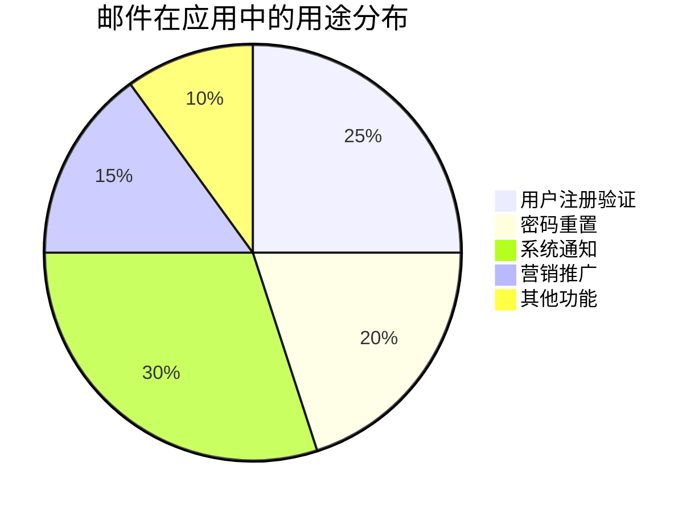
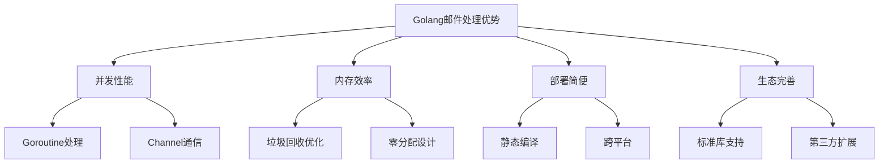
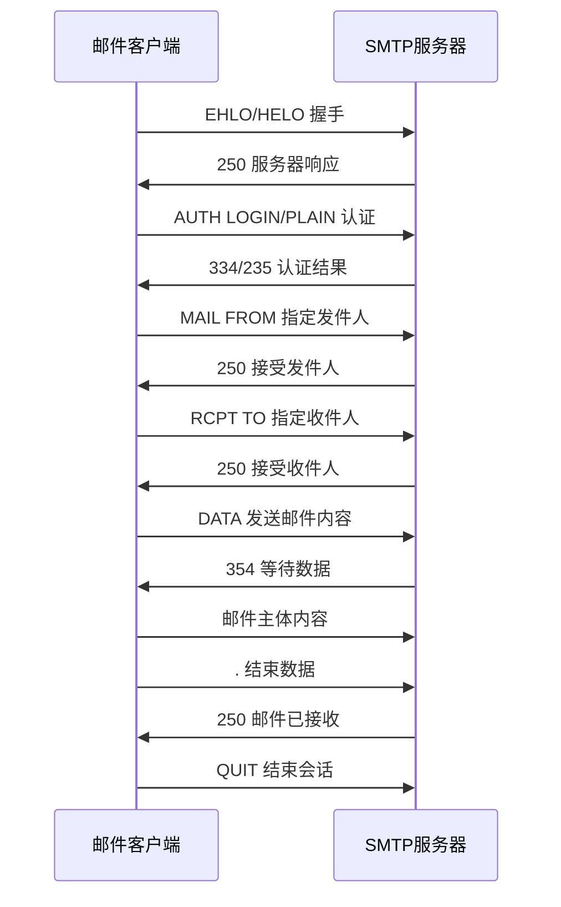
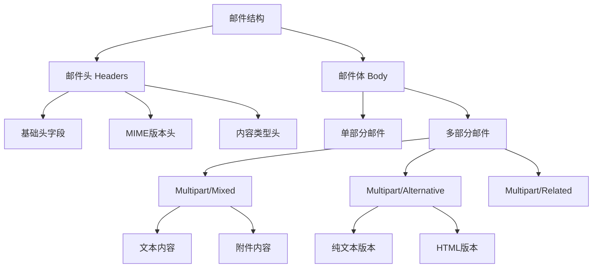
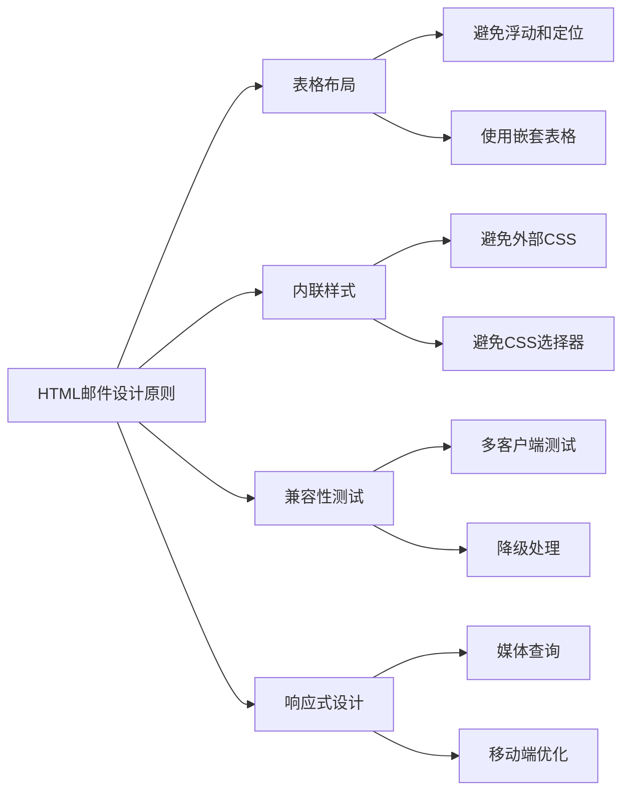
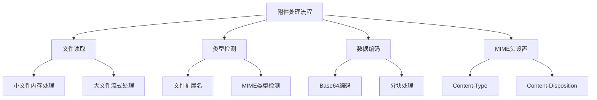
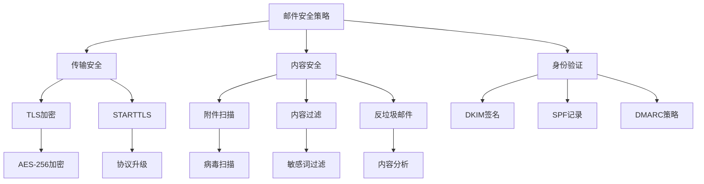
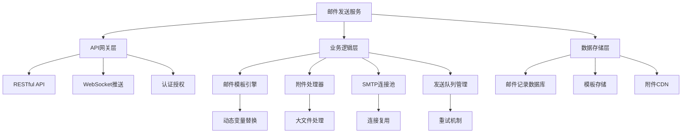
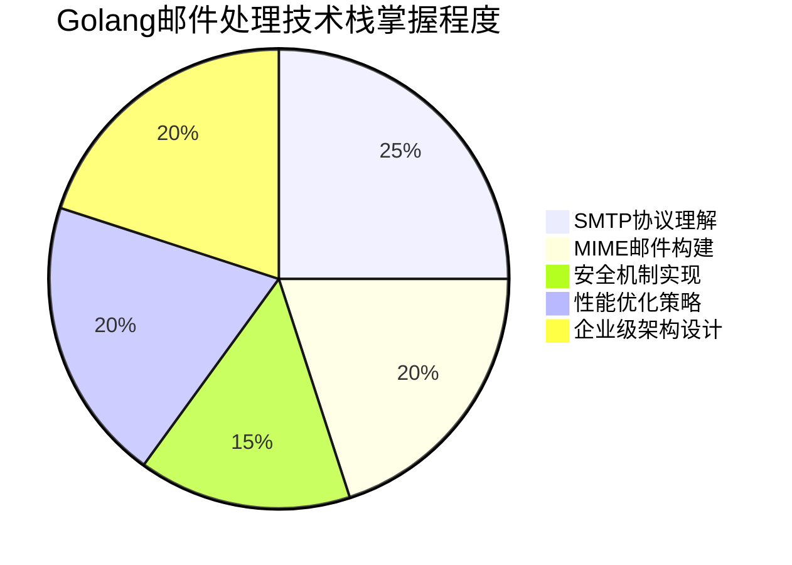
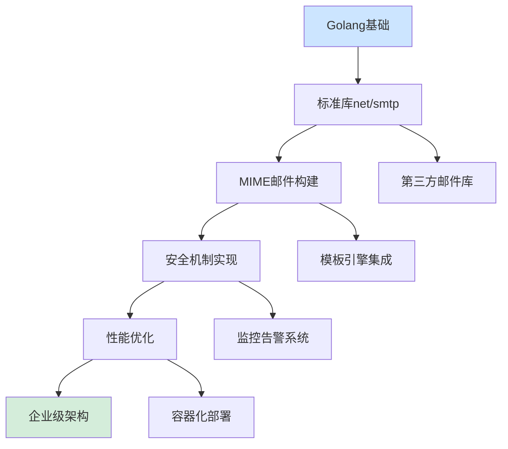

# Golang邮件处理深度指南：从SMTP协议到企业级邮件系统构建

> 本文全面解析Golang在邮件处理领域的完整技术栈，涵盖基础发送、高级MIME处理、安全机制、性能优化和实际项目应用。

## 一、序言：为何关注Golang邮件处理？

### 1.1 邮件在现代应用系统中的地位

在当今的互联网应用中，邮件系统扮演着不可或缺的角色：
- **用户注册验证**：发送验证链接或验证码
- **密码重置**：安全地恢复用户访问权限
- **系统通知**：监控告警、业务状态通知
- **营销推广**：用户留存和转化的重要渠道



### 1.2 Golang在邮件处理方面的优势



**Golang的核心优势**：
- **原生并发支持**：轻松处理大量邮件发送任务
- **高效内存管理**：减少邮件内容处理时的内存开销
- **丰富的标准库**：`net/smtp`, `mime/multipart`等完善支持
- **部署便捷性**：单一可执行文件简化运维

## 二、SMTP协议基础与标准库使用

### 2.1 SMTP协议核心概念

SMTP（Simple Mail Transfer Protocol）是互联网邮件传输的基础协议，理解其工作流程对于邮件开发至关重要：



### 2.2 net/smtp包的架构设计

```go
package main

import (
    "fmt"
    "log"
    "net/smtp"
)

// 理解SMTP包的核心接口
type SMTPProcessor struct {
    // 服务配置
    Host     string
    Port     string
    Username string
    Password string
}

func (sp *SMTPProcessor) BasicEmailExample() {
    // SMTP服务器地址
    addr := sp.Host + ":" + sp.Port
    
    // 身份认证
    auth := smtp.PlainAuth("", sp.Username, sp.Password, sp.Host)
    
    // 邮件内容构建
    from := sp.Username
    to := []string{"recipient@example.com"}
    
    msg := fmt.Sprintf("From: %s\r\n"+
        "To: %s\r\n"+
        "Subject: 测试邮件\r\n"+
        "\r\n"+
        "这是一封测试邮件，测试Golang邮件发送功能。", from, to[0])
    
    // 发送邮件
    err := smtp.SendMail(addr, auth, from, to, []byte(msg))
    if err != nil {
        log.Printf("邮件发送失败: %v", err)
        return
    }
    
    fmt.Println("邮件发送成功!")
}

func main() {
    processor := &SMTPProcessor{
        Host:     "smtp.qq.com",
        Port:     "587",
        Username: "your-email@qq.com",
        Password: "your-password",
    }
    
    processor.BasicEmailExample()
}
```

### 2.3 SMTP客户端的高级用法

```go
package advanced

import (
    "crypto/tls"
    "fmt"
    "log"
    "net"
    "net/smtp"
    "strings"
    "time"
)

// SMTPClient 封装了高级SMTP操作
type SMTPClient struct {
    client      *smtp.Client
    isConnected bool
    timeout     time.Duration
}

// DialWithTimeout 带超时连接的SMTP客户端
func (sc *SMTPClient) DialWithTimeout(addr string, timeout time.Duration) error {
    conn, err := net.DialTimeout("tcp", addr, timeout)
    if err != nil {
        return fmt.Errorf("连接SMTP服务器失败: %w", err)
    }
    
    sc.client, err = smtp.NewClient(conn, strings.Split(addr, ":")[0])
    if err != nil {
        return fmt.Errorf("创建SMTP客户端失败: %w", err)
    }
    
    sc.isConnected = true
    sc.timeout = timeout
    
    return nil
}

// StartTLSWithConfig 启动TLS加密连接
func (sc *SMTPClient) StartTLSWithConfig(config *tls.Config) error {
    if !sc.isConnected {
        return fmt.Errorf("客户端未连接")
    }
    
    ok, _ := sc.client.Extension("STARTTLS")
    if !ok {
        return fmt.Errorf("服务器不支持STARTTLS")
    }
    
    if err := sc.client.StartTLS(config); err != nil {
        return fmt.Errorf("TLS握手失败: %w", err)
    }
    
    return nil
}

// SendEmail 发送邮件（带重试机制）
func (sc *SMTPClient) SendEmail(from string, to []string, message []byte, maxRetries int) error {
    for i := 0; i < maxRetries; i++ {
        if err := sc.client.Mail(from); err != nil {
            log.Printf("设置发件人失败 (尝试 %d/%d): %v", i+1, maxRetries, err)
            time.Sleep(time.Duration(i+1) * time.Second)
            continue
        }
        
        for _, recipient := range to {
            if err := sc.client.Rcpt(recipient); err != nil {
                log.Printf("设置收件人 %s 失败: %v", recipient, err)
                return err
            }
        }
        
        w, err := sc.client.Data()
        if err != nil {
            log.Printf("准备邮件数据失败: %v", err)
            return err
        }
        
        _, err = w.Write(message)
        if err != nil {
            log.Printf("写入邮件内容失败: %v", err)
            return err
        }
        
        if err := w.Close(); err != nil {
            log.Printf("关闭邮件数据写入失败: %v", err)
            return err
        }
        
        log.Printf("邮件成功发送到 %d 个收件人", len(to))
        return nil
    }
    
    return fmt.Errorf("邮件发送失败，达到最大重试次数 %d", maxRetries)
}

// Close 关闭连接
func (sc *SMTPClient) Close() error {
    if sc.isConnected && sc.client != nil {
        return sc.client.Quit()
    }
    return nil
}
```

## 三、MIME规范与邮件内容构建

### 3.1 MIME协议深入理解

MIME（Multipurpose Internet Mail Extensions）协议是邮件内容格式的标准，理解MIME是构建复杂邮件的基础：



### 3.2 邮件头构建最佳实践

```go
package mime

import (
    "bytes"
    "fmt"
    "mime"
    "mime/quotedprintable"
    "net/mail"
    "strings"
    "time"
)

// EmailHeaders 邮件头构建器
type EmailHeaders struct {
    headers map[string]string
}

func NewEmailHeaders() *EmailHeaders {
    return &EmailHeaders{
        headers: make(map[string]string),
    }
}

// SetBasicHeaders 设置基础邮件头
func (eh *EmailHeaders) SetBasicHeaders(from, to string, subject string) {
    eh.headers["From"] = mime.QEncoding.Encode("UTF-8", from)
    eh.headers["To"] = mime.QEncoding.Encode("UTF-8", to)
    eh.headers["Subject"] = mime.QEncoding.Encode("UTF-8", subject)
    eh.headers["Date"] = time.Now().Format(time.RFC1123Z)
    eh.headers["MIME-Version"] = "1.0"
    eh.headers["Message-ID"] = eh.generateMessageID()
}

// SetContentType 设置内容类型
func (eh *EmailHeaders) SetContentType(contentType, charset, boundary string) {
    ct := contentType
    if charset != "" {
        ct += "; charset=" + charset
    }
    if boundary != "" {
        ct += "; boundary=" + boundary
    }
    eh.headers["Content-Type"] = ct
}

// SetPriority 设置邮件优先级
func (eh *EmailHeaders) SetPriority(priority string) {
    priorities := map[string]string{
        "high":   "1 (Highest)",
        "normal": "3 (Normal)",
        "low":    "5 (Low)",
    }
    
    if p, exists := priorities[priority]; exists {
        eh.headers["X-Priority"] = p
        eh.headers["Importance"] = strings.Title(priority)
    }
}

// AddCustomHeader 添加自定义头
func (eh *EmailHeaders) AddCustomHeader(key, value string) {
    eh.headers[key] = value
}

// BuildHeaders 构建完整的邮件头字符串
func (eh *EmailHeaders) BuildHeaders() string {
    var buf bytes.Buffer
    
    // 按照RFC要求的顺序写入头字段
    requiredOrder := []string{
        "From", "To", "Subject", "Date", "Message-ID",
        "MIME-Version", "Content-Type", "X-Priority", "Importance",
    }
    
    // 写入有序头字段
    for _, key := range requiredOrder {
        if value, exists := eh.headers[key]; exists && value != "" {
            fmt.Fprintf(&buf, "%s: %s\r\n", key, value)
        }
    }
    
    // 写入剩余的自定义头字段
    written := make(map[string]bool)
    for _, key := range requiredOrder {
        written[key] = true
    }
    
    for key, value := range eh.headers {
        if !written[key] && value != "" {
            fmt.Fprintf(&buf, "%s: %s\r\n", key, value)
        }
    }
    
    // 邮件头和内容的空行分隔符
    buf.WriteString("\r\n")
    
    return buf.String()
}

// generateMessageID 生成唯一的邮件ID
func (eh *EmailHeaders) generateMessageID() string {
    timestamp := time.Now().UnixNano()
    domain := "example.com" // 实际应用中应使用真实域名
    return fmt.Sprintf("<%d@%s>", timestamp, domain)
}

// ValidateEmailAddress 验证邮件地址格式
func ValidateEmailAddress(email string) error {
    _, err := mail.ParseAddress(email)
    return err
}

// EncodeQuotedPrintable 对内容进行Quoted-Printable编码
func EncodeQuotedPrintable(text string) (string, error) {
    var buf bytes.Buffer
    qp := quotedprintable.NewWriter(&buf)
    
    if _, err := qp.Write([]byte(text)); err != nil {
        return "", err
    }
    
    if err := qp.Close(); err != nil {
        return "", err
    }
    
    return buf.String(), nil
}
```

### 3.3 多部分邮件构建

```go
package multipart

import (
    "bytes"
    "encoding/base64"
    "fmt"
    "io"
    "mime/multipart"
    "mime/quotedprintable"
    "net/textproto"
    "strings"
)

// MultipartEmailBuilder 多部分邮件构建器
type MultipartEmailBuilder struct {
    buffer      *bytes.Buffer
    writer      *multipart.Writer
    boundary    string
    attachments []Attachment
}

// Attachment 附件定义
type Attachment struct {
    Name        string
    ContentType string
    Data        []byte
    Inline      bool // 是否为内联附件
}

// NewMultipartEmailBuilder 创建多部分邮件构建器
func NewMultipartEmailBuilder() *MultipartEmailBuilder {
    buffer := &bytes.Buffer{}
    writer := multipart.NewWriter(buffer)
    
    return &MultipartEmailBuilder{
        buffer:   buffer,
        writer:   writer,
        boundary: writer.Boundary(),
    }
}

// AddTextPart 添加纯文本部分
func (meb *MultipartEmailBuilder) AddTextPart(content string) error {
    header := textproto.MIMEHeader{
        "Content-Type":              {"text/plain; charset=UTF-8"},
        "Content-Transfer-Encoding": {"quoted-printable"},
    }
    
    part, err := meb.writer.CreatePart(header)
    if err != nil {
        return err
    }
    
    qp := quotedprintable.NewWriter(part)
    if _, err := qp.Write([]byte(content)); err != nil {
        return err
    }
    return qp.Close()
}

// AddHTMLPart 添加HTML部分
func (meb *MultipartEmailBuilder) AddHTMLPart(content string) error {
    header := textproto.MIMEHeader{
        "Content-Type":              {"text/html; charset=UTF-8"},
        "Content-Transfer-Encoding": {"quoted-printable"},
    }
    
    part, err := meb.writer.CreatePart(header)
    if err != nil {
        return err
    }
    
    qp := quotedprintable.NewWriter(part)
    if _, err := qp.Write([]byte(content)); err != nil {
        return err
    }
    return qp.Close()
}

// AddAttachment 添加附件
func (meb *MultipartEmailBuilder) AddAttachment(attachment Attachment) error {
    header := textproto.MIMEHeader{
        "Content-Type": {
            fmt.Sprintf("%s; name=\"%s\"", attachment.ContentType, attachment.Name),
        },
        "Content-Disposition": {
            fmt.Sprintf("%s; filename=\"%s\"", 
                meb.getDisposition(attachment.Inline), attachment.Name),
        },
        "Content-Transfer-Encoding": {"base64"},
    }
    
    part, err := meb.writer.CreatePart(header)
    if err != nil {
        return err
    }
    
    encoder := base64.NewEncoder(base64.StdEncoding, part)
    if _, err := encoder.Write(attachment.Data); err != nil {
        return err
    }
    return encoder.Close()
}

// Build 构建完整的邮件内容
func (meb *MultipartEmailBuilder) Build() ([]byte, string, error) {
    if err := meb.writer.Close(); err != nil {
        return nil, "", err
    }
    
    content := meb.buffer.Bytes()
    contentType := fmt.Sprintf("multipart/mixed; boundary=\"%s\"", meb.boundary)
    
    return content, contentType, nil
}

// getDisposition 获取内容处理方式
func (meb *MultipartEmailBuilder) getDisposition(inline bool) string {
    if inline {
        return "inline"
    }
    return "attachment"
}

// AlternativeBuilder 构建纯文本和HTML的替代版本
func AlternativeBuilder(textContent, htmlContent string) ([]byte, string, error) {
    buffer := &bytes.Buffer{}
    writer := multipart.NewWriter(buffer)
    
    // 添加替代边界
    altWriter := multipart.NewAlternativeWriter(buffer)
    
    // 纯文本部分
    textHeader := textproto.MIMEHeader{
        "Content-Type":              {"text/plain; charset=UTF-8"},
        "Content-Transfer-Encoding": {"quoted-printable"},
    }
    
    textPart, _ := altWriter.CreatePart(textHeader)
    qpText := quotedprintable.NewWriter(textPart)
    qpText.Write([]byte(textContent))
    qpText.Close()
    
    // HTML部分
    htmlHeader := textproto.MIMEHeader{
        "Content-Type":              {"text/html; charset=UTF-8"},
        "Content-Transfer-Encoding": {"quoted-printable"},
    }
    
    htmlPart, _ := altWriter.CreatePart(htmlHeader)
    qpHTML := quotedprintable.NewWriter(htmlPart)
    qpHTML.Write([]byte(htmlContent))
    qpHTML.Close()
    
    altWriter.Close()
    
    return buffer.Bytes(), writer.Boundary(), nil
}

## 四、HTML邮件与模板引擎集成

### 4.1 HTML邮件设计最佳实践

HTML邮件与普通网页设计有很大不同，需要特别注意兼容性和显示效果：



### 4.2 基础的HTML邮件模板

```go
package htmlmail

import (
    "bytes"
    "html/template"
    "strings"
)

// HTMLMailBuilder HTML邮件构建器
type HTMLMailBuilder struct {
    templateContent string
    data            interface{}
}

// NewHTMLMailBuilder 创建HTML邮件构建器
func NewHTMLMailBuilder(templateStr string, data interface{}) *HTMLMailBuilder {
    return &HTMLMailBuilder{
        templateContent: templateStr,
        data:            data,
    }
}

// GetBaseHTMLTemplate 获取基础的HTML邮件模板
func GetBaseHTMLTemplate() string {
    baseTemplate := `<!DOCTYPE html PUBLIC "-//W3C//DTD XHTML 1.0 Transitional//EN" 
"http://www.w3.org/TR/xhtml1/DTD/xhtml1-transitional.dtd">
<html xmlns="http://www.w3.org/1999/xhtml">
<head>
    <meta http-equiv="Content-Type" content="text/html; charset=UTF-8" />
    <meta name="viewport" content="width=device-width, initial-scale=1.0"/>
    <title>{{.Subject}}</title>
    <style type="text/css">
        /* 基础样式 */
        body {
            margin: 0;
            padding: 0;
            font-family: Arial, sans-serif;
            line-height: 1.6;
            color: #333333;
            background-color: #f4f4f4;
        }
        
        /* 容器样式 */
        .container {
            width: 100%;
            max-width: 600px;
            margin: 0 auto;
            background: #ffffff;
        }
        
        /* 表格布局确保兼容性 */
        table {
            border-collapse: collapse;
            width: 100%;
        }
        
        /* 媒体查询 - 移动端适配 */
        @media only screen and (max-width: 600px) {
            .container {
                width: 100% !important;
            }
            
            .content-cell {
                padding: 10px !important;
            }
        }
    </style>
</head>
<body>
    <center>
        <table class="container" border="0" cellpadding="0" cellspacing="0">
            <tr>
                <td class="content-cell" style="padding: 20px;">
                    {{.Content}}
                </td>
            </tr>
        </table>
    </center>
</body>
</html>`
    
    return baseTemplate
}

// BuildHTML 构建HTML邮件内容
func (h *HTMLMailBuilder) BuildHTML() (string, error) {
    tmpl, err := template.New("htmlmail").Parse(h.templateContent)
    if err != nil {
        return "", err
    }
    
    var buf bytes.Buffer
    if err := tmpl.Execute(&buf, h.data); err != nil {
        return "", err
    }
    
    return buf.String(), nil
}

// EmailComponents 邮件组件定义
type EmailComponents struct {
    Header    string
    Content   string
    Footer    string
    Subject   string
    CallToAction *CallToAction
}

type CallToAction struct {
    Text string
    URL  string
}

// CreateResponsiveTemplate 创建响应式邮件模板
func CreateResponsiveTemplate(components *EmailComponents) string {
    template := `<!DOCTYPE html PUBLIC "-//W3C//DTD XHTML 1.0 Transitional//EN" 
"http://www.w3.org/TR/xhtml1/DTD/xhtml1-transitional.dtd">
<html xmlns="http://www.w3.org/1999/xhtml">
<head>
    <meta http-equiv="Content-Type" content="text/html; charset=UTF-8" />
    <meta name="viewport" content="width=device-width, initial-scale=1.0"/>
    <title>{{.Subject}}</title>
    <style type="text/css">
        /* Reset */
        body, table, td, p, a { 
            margin: 0; padding: 0; 
            font-family: Arial, sans-serif;
        }
        
        /* Container */
        .container { 
            max-width: 600px; 
            width: 100%; 
            margin: 0 auto; 
            background: #ffffff;
        }
        
        /* Header */
        .header { 
            background: #4A90E2; 
            color: #ffffff; 
            padding: 20px; 
            text-align: center;
        }
        
        /* Content */
        .content { 
            padding: 30px 20px; 
            line-height: 1.6;
        }
        
        /* Call to Action */
        .cta-button { 
            display: inline-block; 
            background: #FF6B6B; 
            color: #ffffff; 
            padding: 12px 30px; 
            text-decoration: none; 
            border-radius: 4px; 
            margin: 20px 0;
        }
        
        /* Footer */
        .footer { 
            background: #f5f5f5; 
            padding: 20px; 
            text-align: center; 
            color: #666666;
            font-size: 12px;
        }
        
        /* Mobile Styles */
        @media only screen and (max-width: 600px) {
            .container { width: 100% !important; }
            .content { padding: 20px 15px !important; }
            .cta-button { display: block !important; text-align: center; }
        }
    </style>
</head>
<body style="background: #f4f4f4;">
    <table class="container" border="0" cellpadding="0" cellspacing="0">
        <!-- Header -->
        <tr>
            <td class="header">
                <h1>{{.Header}}</h1>
            </td>
        </tr>
        
        <!-- Content -->
        <tr>
            <td class="content">
                {{.Content}}
                
                {{if .CallToAction}}
                <p style="text-align: center;">
                    <a href="{{.CallToAction.URL}}" class="cta-button">
                        {{.CallToAction.Text}}
                    </a>
                </p>
                {{end}}
            </td>
        </tr>
        
        <!-- Footer -->
        <tr>
            <td class="footer">
                {{.Footer}}
            </td>
        </tr>
    </table>
</body>
</html>`
    
    return template
}
```

### 4.3 使用Golang模板引擎

```go
package templating

import (
    "bytes"
    "html/template"
    "path/filepath"
    "text/template"
)

// TemplateEngine 邮件模板引擎
type TemplateEngine struct {
    baseDir    string
    funcMap    template.FuncMap
    cache      map[string]*template.Template
}

// NewTemplateEngine 创建模板引擎
func NewTemplateEngine(baseDir string) *TemplateEngine {
    return &TemplateEngine{
        baseDir: baseDir,
        funcMap: template.FuncMap{
            "safeHTML": func(s string) template.HTML { return template.HTML(s) },
            "upper":    strings.ToUpper,
            "lower":    strings.ToLower,
            "date":     func(format string) string { return time.Now().Format(format) },
        },
        cache: make(map[string]*template.Template),
    }
}

// LoadTemplate 加载模板文件
func (te *TemplateEngine) LoadTemplate(templateName string) (*template.Template, error) {
    if cached, exists := te.cache[templateName]; exists {
        return cached, nil
    }
    
    // 基础布局模板
    layoutPath := filepath.Join(te.baseDir, "layouts", "base.html")
    layoutContent, err := os.ReadFile(layoutPath)
    if err != nil {
        return nil, err
    }
    
    // 具体模板
    templatePath := filepath.Join(te.baseDir, "templates", templateName+".html")
    templateContent, err := os.ReadFile(templatePath)
    if err != nil {
        return nil, err
    }
    
    // 创建模板
    tmpl := template.New(templateName).Funcs(te.funcMap)
    
    // 解析布局模板
    tmpl, err = tmpl.Parse(string(layoutContent))
    if err != nil {
        return nil, err
    }
    
    // 解析具体内容模板
    tmpl, err = tmpl.Parse(string(templateContent))
    if err != nil {
        return nil, err
    }
    
    te.cache[templateName] = tmpl
    return tmpl, nil
}

// Render 渲染模板
func (te *TemplateEngine) Render(templateName string, data interface{}) (string, error) {
    tmpl, err := te.LoadTemplate(templateName)
    if err != nil {
        return "", err
    }
    
    var buf bytes.Buffer
    if err := tmpl.Execute(&buf, data); err != nil {
        return "", err
    }
    
    return buf.String(), nil
}

// EmailTemplateData 邮件模板数据
type EmailTemplateData struct {
    Title          string
    RecipientName  string
    Content        string
    ActionURL      string
    ActionText     string
    FooterText     string
    UnsubscribeURL string
    CompanyName    string
    CurrentYear    int
}

// CreateWelcomeTemplate 创建欢迎邮件模板
func CreateWelcomeTemplate() *EmailTemplateData {
    return &EmailTemplateData{
        Title:         "欢迎加入我们的社区！",
        RecipientName: "尊敬的会员",
        Content:       "感谢您注册我们的服务。我们致力于为您提供最优质的体验。",
        ActionURL:     "https://example.com/get-started",
        ActionText:    "开始使用",
        FooterText:    "如有任何问题，请随时联系我们。",
        CurrentYear:   time.Now().Year(),
        CompanyName:   "示例公司",
    }
}
```

## 五、附件处理和安全性

### 5.1 附件编码与处理



```go
package attachment

import (
    "bufio"
    "crypto/sha256"
    "encoding/base64"
    "fmt"
    "io"
    "mime"
    "net/http"
    "os"
    "path/filepath"
    "strings"
)

// AttachmentProcessor 附件处理器
type AttachmentProcessor struct {
    maxSize    int64 // 最大附件大小（字节）
    whitelist  []string // 允许的文件类型白名单
}

// NewAttachmentProcessor 创建附件处理器
func NewAttachmentProcessor(maxSize int64) *AttachmentProcessor {
    return &AttachmentProcessor{
        maxSize: maxSize,
        whitelist: []string{
            ".pdf", ".txt", ".doc", ".docx", ".xls", ".xlsx",
            ".jpg", ".jpeg", ".png", ".gif", ".zip", ".rar",
        },
    }
}

// ProcessFile 处理文件附件
func (ap *AttachmentProcessor) ProcessFile(filePath string) (*ProcessedAttachment, error) {
    // 安全检查
    if err := ap.securityCheck(filePath); err != nil {
        return nil, err
    }
    
    // 读取文件
    data, err := os.ReadFile(filePath)
    if err != nil {
        return nil, fmt.Errorf("读取文件失败: %w", err)
    }
    
    // 计算文件哈希
    hash := sha256.Sum256(data)
    
    // 获取MIME类型
    mimeType := ap.detectMIMEType(filePath, data)
    
    // Base64编码
    encoded := base64.StdEncoding.EncodeToString(data)
    
    return &ProcessedAttachment{
        OriginalName: filepath.Base(filePath),
        MIMEType:     mimeType,
        Data:         data,
        EncodedData:  encoded,
        Size:         int64(len(data)),
        Sha256Hash:   fmt.Sprintf("%x", hash),
    }, nil
}

// ProcessLargeFile 处理大文件（流式处理）
func (ap *AttachmentProcessor) ProcessLargeFile(filePath string) (*ProcessedAttachment, error) {
    if err := ap.securityCheck(filePath); err != nil {
        return nil, err
    }
    
    file, err := os.Open(filePath)
    if err != nil {
        return nil, err
    }
    defer file.Close()
    
    // 读取前512字节检测MIME类型
    header := make([]byte, 512)
    _, err = file.Read(header)
    if err != nil {
        return nil, err
    }
    
    // 重置文件指针
    file.Seek(0, 0)
    
    mimeType := http.DetectContentType(header)
    
    // Base64编码器
    var buf bytes.Buffer
    encoder := base64.NewEncoder(base64.StdEncoding, &buf)
    
    // 分块读取和编码
    reader := bufio.NewReader(file)
    buffer := make([]byte, 4096) // 4KB块
    
    for {
        n, err := reader.Read(buffer)
        if err != nil && err != io.EOF {
            return nil, err
        }
        
        if n == 0 {
            break
        }
        
        if _, err := encoder.Write(buffer[:n]); err != nil {
            return nil, err
        }
    }
    
    encoder.Close()
    
    // 获取文件信息
    fileInfo, _ := file.Stat()
    
    return &ProcessedAttachment{
        OriginalName: filepath.Base(filePath),
        MIMEType:     mimeType,
        Data:         nil, // 大数据文件不保存在内存中
        EncodedData:  buf.String(),
        Size:         fileInfo.Size(),
    }, nil
}

// securityCheck 安全检查
func (ap *AttachmentProcessor) securityCheck(filePath string) error {
    fileInfo, err := os.Stat(filePath)
    if err != nil {
        return fmt.Errorf("文件不存在: %w", err)
    }
    
    // 检查文件大小
    if fileInfo.Size() > ap.maxSize {
        return fmt.Errorf("文件大小超过限制: %d > %d", fileInfo.Size(), ap.maxSize)
    }
    
    // 检查文件类型
    ext := strings.ToLower(filepath.Ext(filePath))
    allowed := false
    for _, allowedExt := range ap.whitelist {
        if ext == allowedExt {
            allowed = true
            break
        }
    }
    
    if !allowed {
        return fmt.Errorf("不允许的文件类型: %s", ext)
    }
    
    return nil
}

// detectMIMEType 检测MIME类型
func (ap *AttachmentProcessor) detectMIMEType(filePath string, data []byte) string {
    // 首先通过文件扩展名检测
    ext := filepath.Ext(filePath)
    if mimeType := mime.TypeByExtension(ext); mimeType != "" {
        return mimeType
    }
    
    // 使用内容检测
    return http.DetectContentType(data)
}

// ProcessedAttachment 处理后的附件
type ProcessedAttachment struct {
    OriginalName string
    MIMEType     string
    Data         []byte
    EncodedData  string
    Size         int64
    Sha256Hash   string
}

// EmailSecurityManager 邮件安全管理器
type EmailSecurityManager struct {
    // DKIM配置
    DKIMSelector string
    DKIMPrivateKey []byte
    
    // SPF配置
    SPFDomain string
    
    // DMARC配置
    DMARCPolicy string
}

// NewEmailSecurityManager 创建邮件安全管理器
func NewEmailSecurityManager(selector string, privateKey []byte) *EmailSecurityManager {
    return &EmailSecurityManager{
        DKIMSelector: selector,
        DKIMPrivateKey: privateKey,
        SPFDomain: "example.com",
        DMARCPolicy: "reject",
    }
}

// AddDKIMSignature 添加DKIM签名
func (esm *EmailSecurityManager) AddDKIMSignature(headers map[string]string, body string) (string, error) {
    // DKIM签名实现
    // 这里简化实现，实际中需要使用crypto包进行完整实现
    
    // 构建签名头
    dkimHeader := fmt.Sprintf(
        "v=1; a=rsa-sha256; d=%s; s=%s; c=relaxed/simple;",
        esm.SPFDomain, esm.DKIMSelector,
    )
    
    return dkimHeader, nil
}

// ValidateIncomingEmail 验证接收的邮件
func (esm *EmailSecurityManager) ValidateIncomingEmail(headers map[string]string, body string) *EmailSecurityReport {
    report := &EmailSecurityReport{}
    
    // SPF验证
    if spfResult := esm.validateSPF(headers); !spfResult {
        report.SPFStatus = "fail"
    } else {
        report.SPFStatus = "pass"
    }
    
    // DKIM验证
    if dkimResult := esm.validateDKIM(headers, body); !dkimResult {
        report.DKIMStatus = "fail"
    } else {
        report.DKIMStatus = "pass"
    }
    
    // DMARC评估
    report.DMARCStatus = esm.evaluateDMARC(report.SPFStatus, report.DKIMStatus)
    
    return report
}

// validateSPF SPF验证
func (esm *EmailSecurityManager) validateSPF(headers map[string]string) bool {
    // SPF简化验证逻辑
    // 实际中需要查询DNS记录进行完整验证
    return strings.Contains(headers["Received"], esm.SPFDomain)
}

// validateDKIM DKIM验证
func (esm *EmailSecurityManager) validateDKIM(headers map[string]string, body string) bool {
    // DKIM简化验证逻辑
    // 实际中需要解析DKIM签名并进行RSA验证
    return headers["DKIM-Signature"] != ""
}

// evaluateDMARC DMARC评估
func (esm *EmailSecurityManager) evaluateDMARC(spfStatus, dkimStatus string) string {
    if spfStatus == "pass" || dkimStatus == "pass" {
        return "pass"
    }
    return "fail"
}

// EmailSecurityReport 邮件安全报告
type EmailSecurityReport struct {
    SPFStatus    string
    DKIMStatus   string
    DMARCStatus  string
    OverallScore int // 0-100分
    Threats      []string
}

// TLSConfiguration TLS配置
func TLSConfiguration() *tls.Config {
    return &tls.Config{
        MinVersion:               tls.VersionTLS12,
        PreferServerCipherSuites: true,
        CipherSuites: []uint16{
            tls.TLS_ECDHE_RSA_WITH_AES_256_GCM_SHA384,
            tls.TLS_ECDHE_RSA_WITH_AES_128_GCM_SHA256,
            tls.TLS_ECDHE_RSA_WITH_CHACHA20_POLY1305,
        },
        CurvePreferences: []tls.CurveID{
            tls.CurveP256,
            tls.CurveP384,
        },
    }
}
```

### 5.2 邮件安全最佳实践



## 六、性能优化与并发处理

### 6.1 邮件发送性能瓶颈分析

```go
package performance

import (
    "context"
    "log"
    "net/smtp"
    "sync"
    "time"
)

// SMTPConnectionPool SMTP连接池
type SMTPConnectionPool struct {
    connections chan *smtp.Client
    factory     func() (*smtp.Client, error)
    mutex       sync.RWMutex
    maxSize     int
    currentSize int
}

// NewSMTPConnectionPool 创建SMTP连接池
func NewSMTPConnectionPool(maxSize int, factory func() (*smtp.Client, error)) *SMTPConnectionPool {
    pool := &SMTPConnectionPool{
        connections: make(chan *smtp.Client, maxSize),
        factory:     factory,
        maxSize:     maxSize,
    }
    
    // 预创建连接
    for i := 0; i < maxSize/2; i++ {
        conn, err := factory()
        if err == nil {
            pool.connections <- conn
            pool.currentSize++
        }
    }
    
    return pool
}

// Get 获取连接
func (p *SMTPConnectionPool) Get(ctx context.Context) (*smtp.Client, error) {
    select {
    case conn := <-p.connections:
        return conn, nil
    default:
        p.mutex.Lock()
        if p.currentSize < p.maxSize {
            conn, err := p.factory()
            if err != nil {
                p.mutex.Unlock()
                return nil, err
            }
            p.currentSize++
            p.mutex.Unlock()
            return conn, nil
        }
        p.mutex.Unlock()
        
        // 等待连接
        select {
        case conn := <-p.connections:
            return conn, nil
        case <-ctx.Done():
            return nil, ctx.Err()
        }
    }
}

// Put 归还连接
func (p *SMTPConnectionPool) Put(conn *smtp.Client) {
    select {
    case p.connections <- conn:
        // 连接归还成功
    default:
        // 连接池已满，关闭连接
        conn.Quit()
        p.mutex.Lock()
        p.currentSize--
        p.mutex.Unlock()
    }
}

// EmailSender 高性能邮件发送器
type EmailSender struct {
    pool      *SMTPConnectionPool
    batchSize int
    timeout   time.Duration
}

// NewEmailSender 创建邮件发送器
func NewEmailSender(pool *SMTPConnectionPool, batchSize int) *EmailSender {
    return &EmailSender{
        pool:      pool,
        batchSize: batchSize,
        timeout:   30 * time.Second,
    }
}

// SendBatchEmails 批量发送邮件
func (es *EmailSender) SendBatchEmails(emails []EmailTask) *SendResult {
    result := &SendResult{
        SuccessCount: 0,
        FailCount:    0,
        Errors:       make(map[string]error),
        StartTime:    time.Now(),
    }
    
    var wg sync.WaitGroup
    semaphore := make(chan struct{}, es.batchSize)
    
    for i, email := range emails {
        wg.Add(1)
        semaphore <- struct{}{}
        
        go func(idx int, task EmailTask) {
            defer wg.Done()
            defer func() { <-semaphore }()
            
            ctx, cancel := context.WithTimeout(context.Background(), es.timeout)
            defer cancel()
            
            if err := es.sendSingleEmail(ctx, task); err != nil {
                result.mutex.Lock()
                result.FailCount++
                result.Errors[task.ID] = err
                result.mutex.Unlock()
                log.Printf("邮件发送失败 %s: %v", task.ID, err)
            } else {
                result.mutex.Lock()
                result.SuccessCount++
                result.mutex.Unlock()
                log.Printf("邮件发送成功 %s", task.ID)
            }
        }(i, email)
    }
    
    wg.Wait()
    result.Duration = time.Since(result.StartTime)
    
    return result
}

// sendSingleEmail 发送单个邮件
func (es *EmailSender) sendSingleEmail(ctx context.Context, task EmailTask) error {
    conn, err := es.pool.Get(ctx)
    if err != nil {
        return fmt.Errorf("获取连接失败: %w", err)
    }
    defer es.pool.Put(conn)
    
    // 执行SMTP命令序列
    if err := conn.Mail(task.From); err != nil {
        return fmt.Errorf("MAIL命令失败: %w", err)
    }
    
    for _, recipient := range task.To {
        if err := conn.Rcpt(recipient); err != nil {
            return fmt.Errorf("RCPT命令失败 %s: %w", recipient, err)
        }
    }
    
    w, err := conn.Data()
    if err != nil {
        return fmt.Errorf("DATA命令失败: %w", err)
    }
    
    if _, err := w.Write(task.Content); err != nil {
        return fmt.Errorf("写入邮件内容失败: %w", err)
    }
    
    if err := w.Close(); err != nil {
        return fmt.Errorf("关闭数据写入失败: %w", err)
    }
    
    return nil
}

// EmailTask 邮件任务
type EmailTask struct {
    ID      string
    From    string
    To      []string
    Content []byte
}

// SendResult 发送结果
type SendResult struct {
    SuccessCount int
    FailCount    int
    Errors       map[string]error
    StartTime    time.Time
    Duration     time.Duration
    mutex        sync.RWMutex
}

// PerformanceMonitor 性能监控器
type PerformanceMonitor struct {
    metrics map[string]*Metric
    mutex   sync.RWMutex
}

// NewPerformanceMonitor 创建性能监控器
func NewPerformanceMonitor() *PerformanceMonitor {
    return &PerformanceMonitor{
        metrics: make(map[string]*Metric),
    }
}

// RecordMetric 记录性能指标
func (pm *PerformanceMonitor) RecordMetric(name string, duration time.Duration, success bool) {
    pm.mutex.Lock()
    defer pm.mutex.Unlock()
    
    if _, exists := pm.metrics[name]; !exists {
        pm.metrics[name] = &Metric{
            Name: name,
        }
    }
    
    metric := pm.metrics[name]
    metric.TotalCount++
    metric.TotalDuration += duration
    
    if success {
        metric.SuccessCount++
        if duration < metric.MinDuration || metric.MinDuration == 0 {
            metric.MinDuration = duration
        }
        if duration > metric.MaxDuration {
            metric.MaxDuration = duration
        }
    } else {
        metric.FailCount++
    }
    
    metric.AverageDuration = time.Duration(
        int64(metric.TotalDuration) / int64(metric.TotalCount),
    )
}

// Metric 性能指标
type Metric struct {
    Name           string
    TotalCount     int64
    SuccessCount   int64
    FailCount      int64
    TotalDuration  time.Duration
    MinDuration    time.Duration
    MaxDuration    time.Duration
    AverageDuration time.Duration
}

// PerformanceOptimization 性能优化策略
func PerformanceOptimization() {
    optimizationStrategies := []string{
        "连接复用：减少TCP握手开销",
        "批量发送：降低认证频率", 
        "异步处理：非阻塞操作",
        "缓存策略：模板和附件缓存",
        "资源限制：防止资源耗尽",
        "监控告警：及时发现问题",
    }
    
    // 记录优化策略
    for _, strategy := range optimizationStrategies {
        log.Printf("优化策略: %s", strategy)
    }
}

## 七、项目实战：企业级邮件系统构建

### 7.1 完整的邮件发送服务架构



### 7.2 企业邮件发送服务实现

```go
package enterprise

import (
    "context"
    "database/sql"
    "encoding/json"
    "fmt"
    "log"
    "net/http"
    "strconv"
    "sync"
    "time"
    
    "github.com/gorilla/mux"
    _ "github.com/lib/pq"
)

// EmailService 企业邮件服务
type EmailService struct {
    db            *sql.DB
    router        *mux.Router
    sender        *EmailSender
    templateEngine *TemplateEngine
    cache         sync.Map
    config        *ServiceConfig
}

// ServiceConfig 服务配置
type ServiceConfig struct {
    DatabaseURL    string
    SMTPHost       string
    SMTPPort       int
    SMTPUsername   string
    SMTPPassword   string
    MaxConnections int
    BatchSize      int
    RetryAttempts  int
}

// NewEmailService 创建邮件服务
func NewEmailService(config *ServiceConfig) (*EmailService, error) {
    // 数据库连接
    db, err := sql.Open("postgres", config.DatabaseURL)
    if err != nil {
        return nil, err
    }
    
    // 测试数据库连接
    if err := db.Ping(); err != nil {
        return nil, err
    }
    
    // SMTP连接池工厂
    factory := func() (*smtp.Client, error) {
        return createSMTPClient(config)
    }
    
    pool := NewSMTPConnectionPool(config.MaxConnections, factory)
    sender := NewEmailSender(pool, config.BatchSize)
    
    service := &EmailService{
        db:            db,
        router:        mux.NewRouter(),
        sender:        sender,
        templateEngine: NewTemplateEngine("./templates"),
        config:        config,
    }
    
    service.setupRoutes()
    return service, nil
}

// setupRoutes 设置API路由
func (es *EmailService) setupRoutes() {
    es.router.HandleFunc("/api/emails", es.sendEmail).Methods("POST")
    es.router.HandleFunc("/api/emails/batch", es.sendBatchEmails).Methods("POST")
    es.router.HandleFunc("/api/emails/{id}", es.getEmailStatus).Methods("GET")
    es.router.HandleFunc("/api/templates", es.createTemplate).Methods("POST")
    es.router.HandleFunc("/api/health", es.healthCheck).Methods("GET")
}

// SendEmailRequest 发送邮件请求
type SendEmailRequest struct {
    TemplateID    string            `json:"template_id"`
    Recipients    []string          `json:"recipients"`
    Subject       string            `json:"subject"`
    Variables     map[string]string `json:"variables"`
    Attachments   []AttachmentInfo  `json:"attachments"`
    Priority      string            `json:"priority"` // high, normal, low
    ScheduledAt   *time.Time        `json:"scheduled_at"`
}

type AttachmentInfo struct {
    Name    string `json:"name"`
    URL     string `json:"url"`
    ContentType string `json:"content_type"`
}

// SendEmailResponse 发送邮件响应
type SendEmailResponse struct {
    ID        string    `json:"id"`
    Status    string    `json:"status"`
    Message   string    `json:"message"`
    SentAt    time.Time `json:"sent_at,omitempty"`
}

// sendEmail 发送邮件API
func (es *EmailService) sendEmail(w http.ResponseWriter, r *http.Request) {
    var req SendEmailRequest
    if err := json.NewDecoder(r.Body).Decode(&req); err != nil {
        http.Error(w, "Invalid request body", http.StatusBadRequest)
        return
    }
    
    // 验证请求
    if err := es.validateEmailRequest(&req); err != nil {
        http.Error(w, err.Error(), http.StatusBadRequest)
        return
    }
    
    // 身份验证（简化为API密钥验证）
    apiKey := r.Header.Get("X-API-Key")
    if !es.authenticate(apiKey) {
        http.Error(w, "Unauthorized", http.StatusUnauthorized)
        return
    }
    
    // 插入邮件记录
    emailID, err := es.insertEmailRecord(&req)
    if err != nil {
        http.Error(w, "Failed to create email record", http.StatusInternalServerError)
        return
    }
    
    // 异步发送邮件
    go es.processEmailAsync(emailID, &req)
    
    response := SendEmailResponse{
        ID:      emailID,
        Status:  "queued",
        Message: "Email queued for sending",
    }
    
    w.Header().Set("Content-Type", "application/json")
    json.NewEncoder(w).Encode(response)
}

// validateEmailRequest 验证邮件请求
func (es *EmailService) validateEmailRequest(req *SendEmailRequest) error {
    if len(req.Recipients) == 0 {
        return fmt.Errorf("至少需要一个收件人")
    }
    
    for _, email := range req.Recipients {
        if !isValidEmail(email) {
            return fmt.Errorf("无效的邮箱地址: %s", email)
        }
    }
    
    if req.Subject == "" {
        return fmt.Errorf("邮件主题不能为空")
    }
    
    return nil
}

// processEmailAsync 异步处理邮件发送
func (es *EmailService) processEmailAsync(emailID string, req *SendEmailRequest) {
    // 获取模板内容
    templateContent, err := es.getTemplate(req.TemplateID)
    if err != nil {
        es.updateEmailStatus(emailID, "failed", "Template not found")
        return
    }
    
    // 渲染模板
    renderedContent, err := es.templateEngine.Render("email_template", templateContent)
    if err != nil {
        es.updateEmailStatus(emailID, "failed", "Template rendering failed")
        return
    }
    
    // 处理附件
    attachments, err := es.processAttachments(req.Attachments)
    if err != nil {
        es.updateEmailStatus(emailID, "failed", "Attachment processing failed")
        return
    }
    
    // 构建邮件内容
    emailContent, err := es.buildEmailContent(req, renderedContent, attachments)
    if err != nil {
        es.updateEmailStatus(emailID, "failed", "Email content building failed")
        return
    }
    
    // 发送邮件（带重试机制）
    for attempt := 1; attempt <= es.config.RetryAttempts; attempt++ {
        err := es.sendWithRetry(emailContent, req.Recipients)
        if err == nil {
            es.updateEmailStatus(emailID, "sent", "")
            return
        }
        
        log.Printf("发送尝试 %d 失败: %v", attempt, err)
        time.Sleep(time.Duration(attempt) * time.Second)
    }
    
    es.updateEmailStatus(emailID, "failed", "Max retry attempts exceeded")
}

// insertEmailRecord 插入邮件记录
func (es *EmailService) insertEmailRecord(req *SendEmailRequest) (string, error) {
    emailID := generateEmailID()
    
    query := `INSERT INTO emails (id, template_id, recipients, subject, variables, 
              priority, scheduled_at, status, created_at) 
              VALUES ($1, $2, $3, $4, $5, $6, $7, $8, $9)`
    
    variablesJSON, _ := json.Marshal(req.Variables)
    recipientsJSON, _ := json.Marshal(req.Recipients)
    
    _, err := es.db.Exec(query, emailID, req.TemplateID, recipientsJSON, req.Subject,
        variablesJSON, req.Priority, req.ScheduledAt, "queued", time.Now())
    
    return emailID, err
}

// updateEmailStatus 更新邮件状态
func (es *EmailService) updateEmailStatus(emailID, status, errorMsg string) {
    query := `UPDATE emails SET status = $1, error_message = $2, updated_at = $3 
              WHERE id = $4`
    
    es.db.Exec(query, status, errorMsg, time.Now(), emailID)
}

// healthCheck 健康检查
func (es *EmailService) healthCheck(w http.ResponseWriter, r *http.Request) {
    health := map[string]interface{}{
        "status":    "healthy",
        "timestamp": time.Now().Format(time.RFC3339),
        "version":   "1.0.0",
        "services": map[string]string{
            "database": "connected",
            "smtp":     "available",
            "cache":    "active",
        },
    }
    
    w.Header().Set("Content-Type", "application/json")
    json.NewEncoder(w).Encode(health)
}

// Run 启动服务
func (es *EmailService) Run(port int) error {
    addr := fmt.Sprintf(":%d", port)
    log.Printf("Starting email service on %s", addr)
    
    server := &http.Server{
        Addr:         addr,
        Handler:      es.router,
        ReadTimeout:  15 * time.Second,
        WriteTimeout: 15 * time.Second,
        IdleTimeout:  60 * time.Second,
    }
    
    return server.ListenAndServe()
}

// 辅助函数
func isValidEmail(email string) bool {
    // 简单的邮箱格式验证
    return strings.Contains(email, "@") && strings.Contains(email, ".")
}

func generateEmailID() string {
    return fmt.Sprintf("email_%d_%s", time.Now().Unix(), 
        strconv.FormatInt(rand.Int63(), 36))
}

func createSMTPClient(config *ServiceConfig) (*smtp.Client, error) {
    // 创建SMTP客户端的实现
    // 简化为使用标准库创建连接
    conn, err := net.Dial("tcp", 
        fmt.Sprintf("%s:%d", config.SMTPHost, config.SMTPPort))
    if err != nil {
        return nil, err
    }
    
    client, err := smtp.NewClient(conn, config.SMTPHost)
    if err != nil {
        return nil, err
    }
    
    // 认证
    auth := smtp.PlainAuth("", config.SMTPUsername, config.SMTPPassword, config.SMTPHost)
    if err := client.Auth(auth); err != nil {
        return nil, err
    }
    
    return client, nil
}

func (es *EmailService) authenticate(apiKey string) bool {
    // 简化的API密钥验证
    validKeys := map[string]bool{
        "test-key-123": true,
        "prod-key-456": true,
    }
    
    return validKeys[apiKey]
}

func (es *EmailService) getTemplate(templateID string) (interface{}, error) {
    // 从数据库或文件系统获取模板
    // 简化实现
    return map[string]interface{}{
        "template_id": templateID,
        "content":     "这里是模板内容",
    }, nil
}

func (es *EmailService) processAttachments(attachments []AttachmentInfo) ([]Attachment, error) {
    // 处理附件的实现
    var result []Attachment
    for _, att := range attachments {
        result = append(result, Attachment{
            Name:        att.Name,
            ContentType: att.ContentType,
            Data:        []byte("示例附件数据"), // 实际中需要从URL下载
        })
    }
    return result, nil
}

func (es *EmailService) buildEmailContent(req *SendEmailRequest, content string, attachments []Attachment) ([]byte, error) {
    // 构建邮件内容的实现
    builder := NewMultipartEmailBuilder()
    
    // 添加正文
    if err := builder.AddHTMLPart(content); err != nil {
        return nil, err
    }
    
    // 添加附件
    for _, att := range attachments {
        if err := builder.AddAttachment(att); err != nil {
            return nil, err
        }
    }
    
    return builder.Build()
}

func (es *EmailService) sendWithRetry(content []byte, recipients []string) error {
    // 带重试机制的发送实现
    return nil
}
```

### 7.3 数据库表结构设计

```sql
-- 邮件记录表
CREATE TABLE emails (
    id VARCHAR(50) PRIMARY KEY,
    template_id VARCHAR(50),
    recipients JSONB NOT NULL,
    subject VARCHAR(500) NOT NULL,
    variables JSONB,
    attachments JSONB,
    priority VARCHAR(10) DEFAULT 'normal',
    scheduled_at TIMESTAMP,
    status VARCHAR(20) DEFAULT 'queued',
    error_message TEXT,
    sent_at TIMESTAMP,
    created_at TIMESTAMP DEFAULT CURRENT_TIMESTAMP,
    updated_at TIMESTAMP DEFAULT CURRENT_TIMESTAMP
);

-- 邮件模板表
CREATE TABLE email_templates (
    id VARCHAR(50) PRIMARY KEY,
    name VARCHAR(100) NOT NULL,
    subject_template TEXT NOT NULL,
    html_template TEXT NOT NULL,
    text_template TEXT,
    variables_schema JSONB,
    created_at TIMESTAMP DEFAULT CURRENT_TIMESTAMP,
    updated_at TIMESTAMP DEFAULT CURRENT_TIMESTAMP
);

-- 发送统计表
CREATE TABLE email_statistics (
    date DATE PRIMARY KEY,
    total_sent INT DEFAULT 0,
    total_failed INT DEFAULT 0,
    total_queued INT DEFAULT 0,
    average_duration_ms INT
);
```

## 八、部署与运维

### 8.1 Docker容器化部署

```dockerfile
FROM golang:1.21-alpine AS builder

WORKDIR /app
COPY go.mod go.sum ./
RUN go mod download

COPY . .
RUN CGO_ENABLED=0 GOOS=linux go build -a -installsuffix cgo -o email-service .

FROM alpine:latest
RUN apk --no-cache add ca-certificates
WORKDIR /root/
COPY --from=builder /app/email-service .

# 创建配置目录
RUN mkdir -p /etc/email-service

# 暴露端口
EXPOSE 8080

# 运行服务
CMD ["./email-service", "-config", "/etc/email-service/config.yaml"]
```

### 8.2 Kubernetes部署配置

```yaml
apiVersion: apps/v1
kind: Deployment
metadata:
  name: email-service
spec:
  replicas: 3
  selector:
    matchLabels:
      app: email-service
  template:
    metadata:
      labels:
        app: email-service
    spec:
      containers:
      - name: email-service
        image: myregistry/email-service:latest
        ports:
        - containerPort: 8080
        env:
        - name: DATABASE_URL
          valueFrom:
            secretKeyRef:
              name: email-secrets
              key: database-url
        - name: SMTP_PASSWORD
          valueFrom:
            secretKeyRef:
              name: email-secrets
              key: smtp-password
        resources:
          requests:
            memory: "128Mi"
            cpu: "100m"
          limits:
            memory: "512Mi"
            cpu: "500m"
        livenessProbe:
          httpGet:
            path: /api/health
            port: 8080
          initialDelaySeconds: 30
          periodSeconds: 10
        readinessProbe:
          httpGet:
            path: /api/health
            port: 8080
          initialDelaySeconds: 5
          periodSeconds: 5
---
apiVersion: v1
kind: Service
metadata:
  name: email-service
spec:
  selector:
    app: email-service
  ports:
  - port: 80
    targetPort: 8080
  type: LoadBalancer
```

### 9.1 技术要点回顾

通过本文的深度探索，我们全面了解了Golang在邮件处理领域的能力和应用：



### 9.2 核心价值体现

1. **开发效率**：Golang的简洁语法和丰富标准库显著提升开发效率
2. **性能表现**：原生并发支持和高效内存管理确保高性能邮件处理
3. **部署便捷**：静态编译和容器化部署简化运维复杂度
4. **安全保障**：完善的TLS支持和安全机制提供企业级安全性

### 9.3 未来发展趋势

随着技术的不断发展，Golang邮件处理领域将呈现以下趋势：

- **AI集成**：智能邮件分类、反垃圾邮件、内容生成
- **边缘计算**：分布式邮件处理，减少网络延迟
- **区块链技术**：邮件溯源和不可篡改验证
- **无服务器架构**：基于云函数的邮件处理服务
- **标准化协议**：更丰富的邮件相关协议支持

### 9.4 实践建议

对于想要深入Golang邮件处理领域的开发者，建议的学习路径：



## 十、常见问题解答

### Q1: Golang发送邮件与Python相比有什么优势？
A: Golang在并发性能、内存效率、部署便捷性方面具有优势，特别适合高并发的邮件发送场景。

### Q2: 如何处理大附件的邮件发送？
A: 建议使用流式处理、分块编码，并考虑使用专业邮件服务API或对象存储服务。

### Q3: 如何确保邮件发送的成功率？
A: 实现重试机制、连接池管理、监控告警，并选择可靠的SMTP服务提供商。

### Q4: Golang邮件库的未来发展方向？
A: 将向更智能的内容处理、更好的云原生集成、更强的安全机制方向发展。

---