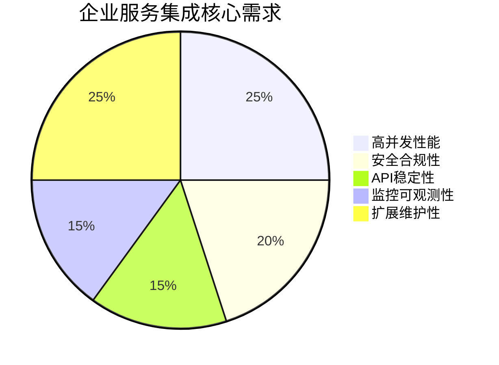
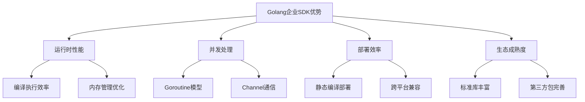
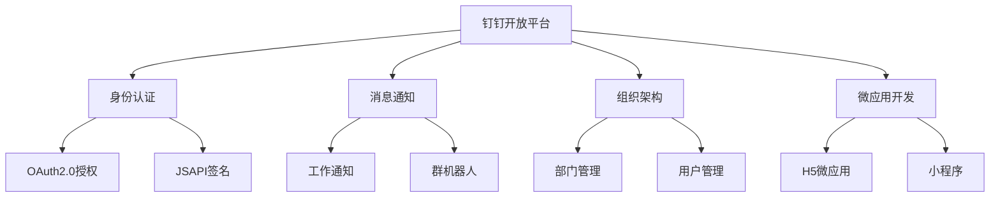
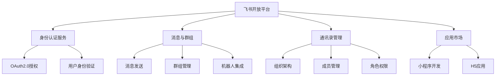
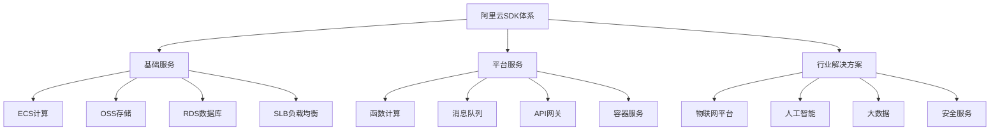
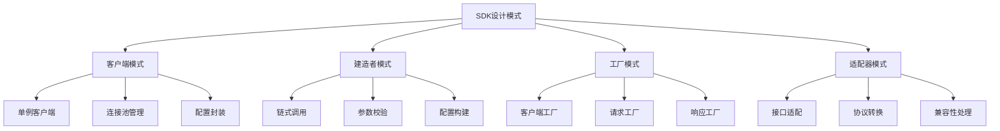
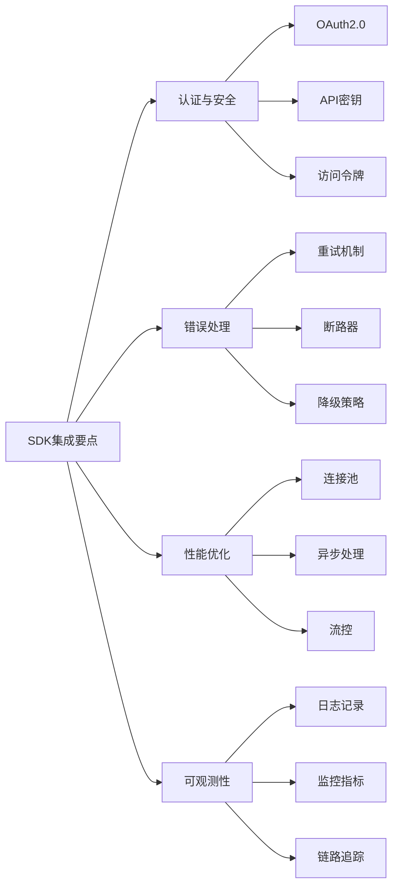

# Golang企业级SDK深度指南：钉钉、飞书、阿里云全解析

> 本文全面剖析Golang在企业级服务集成中的技术实践，涵盖钉钉、飞书、阿里云等主流SDK的深度应用与架构设计。

## 一、序言：企业服务集成的技术挑战与Golang优势

### 1.1 企业级集成的技术需求

在数字化转型浪潮中，企业服务集成面临的核心挑战：



### 1.2 Golang在企业SDK领域的独特价值



**Golang的核心优势**：
- **原生并发模型**：轻松应对企业级API的高并发调用
- **高效资源利用**：协程和通道机制降低服务器资源消耗
- **部署简单性**：单一可执行文件简化运维复杂度
- **类型安全**：静态类型系统减少运行时错误

## 二、钉钉SDK深度解析

### 2.1 钉钉开放平台架构理解

钉钉作为企业级协作平台，提供了完整的开放API体系：



### 2.2 基础钉钉SDK集成

```go
package dingtalk

import (
    "context"
    "encoding/json"
    "fmt"
    "log"
    "net/http"
    "net/url"
    "strings"
    "time"
    
    "github.com/go-resty/resty/v2"
)

// DingTalkClient 钉钉客户端结构体
type DingTalkClient struct {
    AppKey       string
    AppSecret    string
    AccessToken  string
    TokenExpire  time.Time
    HTTPClient   *resty.Client
    BaseURL      string
}

// NewDingTalkClient 创建钉钉客户端
func NewDingTalkClient(appKey, appSecret string) *DingTalkClient {
    return &DingTalkClient{
        AppKey:     appKey,
        AppSecret:  appSecret,
        BaseURL:    "https://oapi.dingtalk.com",
        HTTPClient: resty.New().
            SetTimeout(10*time.Second).
            SetRetryCount(3).
            SetRetryWaitTime(2*time.Second),
    }
}

// GetAccessToken 获取访问令牌
func (dt *DingTalkClient) GetAccessToken() (string, error) {
    // 检查token是否过期
    if dt.AccessToken != "" && time.Now().Before(dt.TokenExpire) {
        return dt.AccessToken, nil
    }
    
    url := fmt.Sprintf("%s/gettoken?appkey=%s&appsecret=%s", 
        dt.BaseURL, dt.AppKey, dt.AppSecret)
    
    resp, err := dt.HTTPClient.R().Get(url)
    if err != nil {
        return "", fmt.Errorf("获取token失败: %w", err)
    }
    
    var result struct {
        ErrCode     int    `json:"errcode"`
        ErrMsg      string `json:"errmsg"`
        AccessToken string `json:"access_token"`
        ExpiresIn   int    `json:"expires_in"`
    }
    
    if err := json.Unmarshal(resp.Body(), &result); err != nil {
        return "", fmt.Errorf("解析token响应失败: %w", err)
    }
    
    if result.ErrCode != 0 {
        return "", fmt.Errorf("钉钉API错误: %s (代码: %d)", 
            result.ErrMsg, result.ErrCode)
    }
    
    // 更新token信息
    dt.AccessToken = result.AccessToken
    dt.TokenExpire = time.Now().Add(time.Duration(result.ExpiresIn-300) * time.Second)
    
    return dt.AccessToken, nil
}

// SendWorkNotification 发送工作通知
func (dt *DingTalkClient) SendWorkNotification(req *WorkNotificationRequest) error {
    token, err := dt.GetAccessToken()
    if err != nil {
        return err
    }
    
    url := fmt.Sprintf("%s/topapi/message/corpconversation/asyncsend_v2?access_token=%s", 
        dt.BaseURL, token)
    
    resp, err := dt.HTTPClient.R().
        SetBody(req).
        Post(url)
    
    if err != nil {
        return fmt.Errorf("发送工作通知失败: %w", err)
    }
    
    var result struct {
        ErrCode int    `json:"errcode"`
        ErrMsg  string `json:"errmsg"`
        TaskID  int64  `json:"task_id"`
    }
    
    if err := json.Unmarshal(resp.Body(), &result); err != nil {
        return fmt.Errorf("解析响应失败: %w", err)
    }
    
    if result.ErrCode != 0 {
        return fmt.Errorf("钉钉API错误: %s (代码: %d)", result.ErrMsg, result.ErrCode)
    }
    
    return nil
}

// WorkNotificationRequest 工作通知请求结构
type WorkNotificationRequest struct {
    AgentID    int64       `json:"agent_id"`
    UserIDList string      `json:"userid_list"`
    DeptIDList string      `json:"dept_id_list"`
    ToAllUser  bool        `json:"to_all_user"`
    Message    interface{} `json:"msg"`
}

// TextMessage 文本消息
type TextMessage struct {
    MsgType string          `json:"msgtype"`
    Text    TextMessageBody `json:"text"`
}

type TextMessageBody struct {
    Content string `json:"content"`
}

// MarkdownMessage Markdown消息
type MarkdownMessage struct {
    MsgType  string              `json:"msgtype"`
    Markdown MarkdownMessageBody `json:"markdown"`
}

type MarkdownMessageBody struct {
    Title string `json:"title"`
    Text  string `json:"text"`
}

// CreateTextMessage 创建文本消息
func CreateTextMessage(content string) *TextMessage {
    return &TextMessage{
        MsgType: "text",
        Text:    TextMessageBody{Content: content},
    }
}

// CreateMarkdownMessage 创建Markdown消息
func CreateMarkdownMessage(title, content string) *MarkdownMessage {
    return &MarkdownMessage{
        MsgType: "markdown",
        Markdown: MarkdownMessageBody{
            Title: title,
            Text:  content,
        },
    }
}
```

### 2.3 高级功能：钉钉机器人集成

```go
package dingtalkrobot

import (
    "crypto/hmac"
    "crypto/sha256"
    "encoding/base64"
    "fmt"
    "net/http"
    "strconv"
    "time"
)

// RobotClient 钉钉机器人客户端
type RobotClient struct {
    WebhookURL string
    Secret     string
    HTTPClient *http.Client
}

// NewRobotClient 创建机器人客户端
func NewRobotClient(webhookURL, secret string) *RobotClient {
    return &RobotClient{
        WebhookURL: webhookURL,
        Secret:     secret,
        HTTPClient: &http.Client{Timeout: 10 * time.Second},
    }
}

// generateSign 生成签名
func (rc *RobotClient) generateSign() string {
    if rc.Secret == "" {
        return ""
    }
    
    timestamp := strconv.FormatInt(time.Now().UnixNano()/1e6, 10)
    stringToSign := timestamp + "\n" + rc.Secret
    
    h := hmac.New(sha256.New, []byte(rc.Secret))
    h.Write([]byte(stringToSign))
    signature := base64.StdEncoding.EncodeToString(h.Sum(nil))
    
    return fmt.Sprintf("&timestamp=%s&sign=%s", timestamp, signature)
}

// SendRobotMessage 发送机器人消息
func (rc *RobotClient) SendRobotMessage(message interface{}) error {
    sign := rc.generateSign()
    url := rc.WebhookURL + sign
    
    jsonData, err := json.Marshal(message)
    if err != nil {
        return fmt.Errorf("序列化消息失败: %w", err)
    }
    
    resp, err := rc.HTTPClient.Post(url, "application/json", strings.NewReader(string(jsonData)))
    if err != nil {
        return fmt.Errorf("发送消息失败: %w", err)
    }
    defer resp.Body.Close()
    
    var result struct {
        ErrCode int    `json:"errcode"`
        ErrMsg  string `json:"errmsg"`
    }
    
    if err := json.NewDecoder(resp.Body).Decode(&result); err != nil {
        return fmt.Errorf("解析响应失败: %w", err)
    }
    
    if result.ErrCode != 0 {
        return fmt.Errorf("机器人API错误: %s (代码: %d)", result.ErrMsg, result.ErrCode)
    }
    
    return nil
}

// ActionCardMessage 卡片消息
type ActionCardMessage struct {
    MsgType    string                     `json:"msgtype"`
    ActionCard ActionCardMessageBody      `json:"actionCard"`
}

type ActionCardMessageBody struct {
    Title          string                    `json:"title"`
    Text           string                    `json:"text"`
    BtnOrientation string                    `json:"btnOrientation"` // 0-垂直，1-水平
    BtnJSONList    []ActionCardButton        `json:"btns"`
    SingleTitle    string                    `json:"singleTitle"`
    SingleURL      string                    `json:"singleURL"`
}

type ActionCardButton struct {
    Title     string `json:"title"`
    ActionURL string `json:"actionURL"`
}

// FeedCardMessage Feed卡片消息
type FeedCardMessage struct {
    MsgType  string                 `json:"msgtype"`
    FeedCard FeedCardMessageBody    `json:"feedCard"`
}

type FeedCardMessageBody struct {
    Links []FeedCardLink `json:"links"`
}

type FeedCardLink struct {
    Title      string `json:"title"`
    MessageURL string `json:"messageURL"`
    PicURL     string `json:"picURL"`
}

// CreateActionCard 创建互动卡片消息
func CreateActionCard(title, text string, buttons []ActionCardButton) *ActionCardMessage {
    return &ActionCardMessage{
        MsgType: "actionCard",
        ActionCard: ActionCardMessageBody{
            Title:          title,
            Text:           text,
            BtnOrientation: "0", // 垂直布局
            BtnJSONList:    buttons,
        },
    }
}

// CreateFeedCard 创建Feed卡片消息
func CreateFeedCard(links []FeedCardLink) *FeedCardMessage {
    return &FeedCardMessage{
        MsgType: "feedCard",
        FeedCard: FeedCardMessageBody{
            Links: links,
        },
    }
}
```

## 三、飞书SDK深度集成

### 3.1 飞书开放平台架构解析

飞书作为字节跳动的企业协作平台，提供了丰富的API能力：



### 3.2 飞书SDK基础集成

```go
package feishu

import (
    "context"
    "encoding/json"
    "fmt"
    "log"
    "net/http"
    "strings"
    "time"
    
    "github.com/go-resty/resty/v2"
)

// FeishuClient 飞书客户端
type FeishuClient struct {
    AppID           string
    AppSecret       string
    TenantAccessToken string
    TokenExpire     time.Time
    HTTPClient      *resty.Client
    BaseURL         string
}

// NewFeishuClient 创建飞书客户端
func NewFeishuClient(appID, appSecret string) *FeishuClient {
    return &FeishuClient{
        AppID:     appID,
        AppSecret: appSecret,
        BaseURL:   "https://open.feishu.cn/open-apis",
        HTTPClient: resty.New().
            SetTimeout(10*time.Second).
            SetRetryCount(3).
            SetRetryWaitTime(2*time.Second),
    }
}

// GetTenantAccessToken 获取企业访问令牌
func (fc *FeishuClient) GetTenantAccessToken() (string, error) {
    if fc.TenantAccessToken != "" && time.Now().Before(fc.TokenExpire) {
        return fc.TenantAccessToken, nil
    }
    
    url := fmt.Sprintf("%s/auth/v3/tenant_access_token/internal", fc.BaseURL)
    
    reqBody := map[string]string{
        "app_id":     fc.AppID,
        "app_secret": fc.AppSecret,
    }
    
    resp, err := fc.HTTPClient.R().
        SetHeader("Content-Type", "application/json").
        SetBody(reqBody).
        Post(url)
    
    if err != nil {
        return "", fmt.Errorf("获取token失败: %w", err)
    }
    
    var result struct {
        Code              int    `json:"code"`
        Msg               string `json:"msg"`
        TenantAccessToken string `json:"tenant_access_token"`
        Expire            int    `json:"expire"`
    }
    
    if err := json.Unmarshal(resp.Body(), &result); err != nil {
        return "", fmt.Errorf("解析token响应失败: %w", err)
    }
    
    if result.Code != 0 {
        return "", fmt.Errorf("飞书API错误: %s (代码: %d)", result.Msg, result.Code)
    }
    
    fc.TenantAccessToken = result.TenantAccessToken
    fc.TokenExpire = time.Now().Add(time.Duration(result.Expire-300) * time.Second)
    
    return fc.TenantAccessToken, nil
}

// SendMessage 发送消息
func (fc *FeishuClient) SendMessage(receiveIDType, receiveID string, message interface{}) error {
    token, err := fc.GetTenantAccessToken()
    if err != nil {
        return err
    }
    
    url := fmt.Sprintf("%s/im/v1/messages?receive_id_type=%s", fc.BaseURL, receiveIDType)
    
    reqBody := map[string]interface{}{
        "receive_id": receiveID,
        "content":    message,
        "msg_type":   getMessageType(message),
    }
    
    resp, err := fc.HTTPClient.R().
        SetHeader("Authorization", "Bearer "+token).
        SetHeader("Content-Type", "application/json").
        SetBody(reqBody).
        Post(url)
    
    if err != nil {
        return fmt.Errorf("发送消息失败: %w", err)
    }
    
    var result struct {
        Code int    `json:"code"`
        Msg  string `json:"msg"`
        Data struct {
            MessageID string `json:"message_id"`
        } `json:"data"`
    }
    
    if err := json.Unmarshal(resp.Body(), &result); err != nil {
        return fmt.Errorf("解析响应失败: %w", err)
    }
    
    if result.Code != 0 {
        return fmt.Errorf("飞书API错误: %s (代码: %d)", result.Msg, result.Code)
    }
    
    log.Printf("消息发送成功，消息ID: %s", result.Data.MessageID)
    return nil
}

// getMessageType 获取消息类型
func getMessageType(message interface{}) string {
    switch message.(type) {
    case *TextMessageContent:
        return "text"
    case *PostMessageContent:
        return "post"
    case *CardMessageContent:
        return "interactive"
    default:
        return "text"
    }
}

// TextMessageContent 文本消息内容
type TextMessageContent struct {
    Text string `json:"text"`
}

// PostMessageContent 富文本消息内容
type PostMessageContent struct {
    Post map[string]interface{} `json:"post"`
}

// CardMessageContent 卡片消息内容
type CardMessageContent struct {
    Config   *CardConfig   `json:"config"`
    Header   *CardHeader   `json:"header"`
    Elements []interface{} `json:"elements"`
}

type CardConfig struct {
    WideScreenMode bool `json:"wide_screen_mode"`
    EnableForward  bool `json:"enable_forward"`
}

type CardHeader struct {
    Title    *CardHeaderTitle `json:"title"`
    Template string           `json:"template"`
}

type CardHeaderTitle struct {
    Content string `json:"content"`
    Tag     string `json:"tag"`
}

// CreateTextMessage 创建文本消息
func CreateTextMessage(text string) *TextMessageContent {
    return &TextMessageContent{
        Text: text,
    }
}

// CreateCardMessage 创建卡片消息
func CreateCardMessage(title string, elements []interface{}) *CardMessageContent {
    return &CardMessageContent{
        Config: &CardConfig{
            WideScreenMode: true,
            EnableForward:  true,
        },
        Header: &CardHeader{
            Title: &CardHeaderTitle{
                Content: title,
                Tag:     "plain_text",
            },
            Template: "blue",
        },
        Elements: elements,
    }
}
```

### 3.3 飞书高级功能：机器人消息和卡片交互

```go
package feishurobot

import (
    "encoding/json"
    "fmt"
    "net/http"
    "time"
)

// FeishuRobot 飞书机器人
type FeishuRobot struct {
    WebhookURL string
    HTTPClient *http.Client
}

// NewFeishuRobot 创建飞书机器人
func NewFeishuRobot(webhookURL string) *FeishuRobot {
    return &FeishuRobot{
        WebhookURL: webhookURL,
        HTTPClient: &http.Client{Timeout: 10 * time.Second},
    }
}

// RobotMessage 机器人消息
type RobotMessage struct {
    MsgType string      `json:"msg_type"`
    Content interface{} `json:"content"`
}

// SendRobotMessage 发送机器人消息
func (fr *FeishuRobot) SendRobotMessage(message *RobotMessage) error {
    jsonData, err := json.Marshal(message)
    if err != nil {
        return fmt.Errorf("序列化消息失败: %w", err)
    }
    
    resp, err := fr.HTTPClient.Post(fr.WebhookURL, "application/json", 
        strings.NewReader(string(jsonData)))
    if err != nil {
        return fmt.Errorf("发送消息失败: %w", err)
    }
    defer resp.Body.Close()
    
    var result struct {
        Code int    `json:"code"`
        Msg  string `json:"msg"`
    }
    
    if err := json.NewDecoder(resp.Body).Decode(&result); err != nil {
        return fmt.Errorf("解析响应失败: %w", err)
    }
    
    if result.Code != 0 {
        return fmt.Errorf("飞书机器人API错误: %s (代码: %d)", result.Msg, result.Code)
    }
    
    return nil
}

// InteractiveCard 交互卡片
type InteractiveCard struct {
    Config   *CardConfig   `json:"config"`
    Header   *CardHeader   `json:"header"`
    Elements []interface{} `json:"elements"`
}

// CreateInteractiveCard 创建交互卡片
func CreateInteractiveCard(title string, elements []interface{}) *InteractiveCard {
    return &InteractiveCard{
        Config: &CardConfig{
            WideScreenMode: true,
        },
        Header: &CardHeader{
            Title: &CardHeaderTitle{
                Content: title,
                Tag:     "plain_text",
            },
        },
        Elements: elements,
    }
}

// CardElement 卡片元素接口
type CardElement struct {
    Tag     string                 `json:"tag"`
    Text    *CardElementText       `json:"text,omitempty"`
    Actions []*CardElementAction   `json:"actions,omitempty"`
    Fields  []*CardElementField    `json:"fields,omitempty"`
}

type CardElementText struct {
    Content string `json:"content"`
    Tag     string `json:"tag"`
}

type CardElementAction struct {
    Tag   string            `json:"tag"`
    Text  *CardElementText  `json:"text"`
    URL   string            `json:"url"`
    Type  string            `json:"type"`
}

type CardElementField struct {
    IsShort bool             `json:"is_short"`
    Text    *CardElementText `json:"text"`
}

// AddTextElement 添加文本元素
func AddTextElement(content string) *CardElement {
    return &CardElement{
        Tag: "div",
        Text: &CardElementText{
            Content: content,
            Tag:     "lark_md",
        },
    }
}

// AddButtonElement 添加按钮元素
func AddButtonElement(text, url string) *CardElement {
    return &CardElement{
        Tag: "action",
        Actions: []*CardElementAction{
            {
                Tag:  "button",
                Text: &CardElementText{Content: text, Tag: "plain_text"},
                URL:  url,
                Type: "default",
            },
        },
    }
}

// AddFieldElement 添加字段元素
func AddFieldElement(fields []*CardElementField) *CardElement {
    return &CardElement{
        Tag:    "div",
        Fields: fields,
    }
}
```

## 四、阿里云SDK全面解析

### 4.1 阿里云服务架构概览

阿里云提供了覆盖基础设施、平台服务、应用服务的完整SDK体系：



### 4.2 OSS对象存储SDK深度使用

```go
package aliyunoss

import (
    "fmt"
    "io"
    "log"
    "net/http"
    "os"
    "time"
    
    "github.com/aliyun/aliyun-oss-go-sdk/oss"
)

// OSSClient 阿里云OSS客户端封装
type OSSClient struct {
    Client      *oss.Client
    Bucket      *oss.Bucket
    Endpoint    string
    BucketName  string
}

// NewOSSClient 创建OSS客户端
func NewOSSClient(endpoint, accessKeyID, accessKeySecret, bucketName string) (*OSSClient, error) {
    client, err := oss.New(endpoint, accessKeyID, accessKeySecret)
    if err != nil {
        return nil, fmt.Errorf("创建OSS客户端失败: %w", err)
    }
    
    bucket, err := client.Bucket(bucketName)
    if err != nil {
        return nil, fmt.Errorf("获取Bucket失败: %w", err)
    }
    
    return &OSSClient{
        Client:     client,
        Bucket:     bucket,
        Endpoint:   endpoint,
        BucketName: bucketName,
    }, nil
}

// UploadFile 上传文件
func (oc *OSSClient) UploadFile(objectKey, filePath string) error {
    file, err := os.Open(filePath)
    if err != nil {
        return fmt.Errorf("打开文件失败: %w", err)
    }
    defer file.Close()
    
    err = oc.Bucket.PutObject(objectKey, file)
    if err != nil {
        return fmt.Errorf("上传文件失败: %w", err)
    }
    
    log.Printf("文件上传成功: %s -> %s", filePath, objectKey)
    return nil
}

// UploadFromReader 从Reader上传
func (oc *OSSClient) UploadFromReader(objectKey string, reader io.Reader) error {
    err := oc.Bucket.PutObject(objectKey, reader)
    if err != nil {
        return fmt.Errorf("上传数据失败: %w", err)
    }
    
    return nil
}

// DownloadFile 下载文件
func (oc *OSSClient) DownloadFile(objectKey, localFilePath string) error {
    err := oc.Bucket.GetObjectToFile(objectKey, localFilePath)
    if err != nil {
        return fmt.Errorf("下载文件失败: %w", err)
    }
    
    return nil
}

// GeneratePresignedURL 生成预签名URL
func (oc *OSSClient) GeneratePresignedURL(objectKey string, expiredInSec int64) (string, error) {
    signedURL, err := oc.Bucket.SignURL(objectKey, oss.HTTPGet, expiredInSec)
    if err != nil {
        return "", fmt.Errorf("生成签名URL失败: %w", err)
    }
    
    return signedURL, nil
}

// ListObjects 列出对象
func (oc *OSSClient) ListObjects(prefix string, maxKeys int) ([]oss.ObjectProperties, error) {
    marker := ""
    var objects []oss.ObjectProperties
    
    for {
        lsRes, err := oc.Bucket.ListObjects(oss.Marker(marker), oss.Prefix(prefix), 
            oss.MaxKeys(maxKeys))
        if err != nil {
            return nil, fmt.Errorf("列出对象失败: %w", err)
        }
        
        objects = append(objects, lsRes.Objects...)
        
        if lsRes.IsTruncated {
            marker = lsRes.NextMarker
        } else {
            break
        }
    }
    
    return objects, nil
}

// ObjectMetadata 对象元数据
type ObjectMetadata struct {
    Key          string
    Size         int64
    LastModified time.Time
    ETag         string
    StorageClass string
}

// GetObjectMetadata 获取对象元数据
func (oc *OSSClient) GetObjectMetadata(objectKey string) (*ObjectMetadata, error) {
    headers, err := oc.Bucket.GetObjectMeta(objectKey)
    if err != nil {
        return nil, fmt.Errorf("获取对象元数据失败: %w", err)
    }
    
    lastModified, _ := time.Parse(http.TimeFormat, headers.Get("Last-Modified"))
    
    return &ObjectMetadata{
        Key:          objectKey,
        Size:         headers.ContentLength,
        LastModified: lastModified,
        ETag:         headers.Get("ETag"),
        StorageClass: headers.Get("x-oss-storage-class"),
    }, nil
}
```

### 4.3 函数计算FC SDK集成

```go
package aliyunfc

import (
    "context"
    "encoding/json"
    "fmt"
    "log"
    "time"
    
    "github.com/aliyun/fc-go-sdk"
)

// FCClient 函数计算客户端
type FCClient struct {
    Client *fc.Client
    Region string
}

// NewFCClient 创建函数计算客户端
func NewFCClient(region, accessKeyID, accessKeySecret string) (*FCClient, error) {
    client, err := fc.NewClient(fmt.Sprintf("https://%s.fc.aliyuncs.com", region), 
        "2016-08-15", accessKeyID, accessKeySecret)
    if err != nil {
        return nil, fmt.Errorf("创建FC客户端失败: %w", err)
    }
    
    return &FCClient{
        Client: client,
        Region: region,
    }, nil
}

// InvokeFunction 调用函数
func (fc *FCClient) InvokeFunction(serviceName, functionName string, payload interface{}) ([]byte, error) {
    payloadBytes, err := json.Marshal(payload)
    if err != nil {
        return nil, fmt.Errorf("序列化负载失败: %w", err)
    }
    
    resp, err := fc.Client.InvokeFunction(&fc.InvokeFunctionInput{
        ServiceName:  &serviceName,
        FunctionName: &functionName,
        Payload:      payloadBytes,
    })
    
    if err != nil {
        return nil, fmt.Errorf("调用函数失败: %w", err)
    }
    
    return resp.Payload, nil
}

// AsyncInvokeFunction 异步调用函数
func (fc *FCClient) AsyncInvokeFunction(serviceName, functionName string, payload interface{}) error {
    payloadBytes, err := json.Marshal(payload)
    if err != nil {
        return fmt.Errorf("序列化负载失败: %w", err)
    }
    
    _, err = fc.Client.InvokeFunction(&fc.InvokeFunctionInput{
        ServiceName:  &serviceName,
        FunctionName: &functionName,
        Payload:      payloadBytes,
        Async:        fc.Bool(true),
    })
    
    if err != nil {
        return fmt.Errorf("异步调用函数失败: %w", err)
    }
    
    return nil
}

// CreateFunction 创建函数
func (fc *FCClient) CreateFunction(serviceName string, function *fc.CreateFunctionInput) error {
    _, err := fc.Client.CreateFunction(function)
    if err != nil {
        return fmt.Errorf("创建函数失败: %w", err)
    }
    
    return nil
}

// GetFunction 获取函数信息
func (fc *FCClient) GetFunction(serviceName, functionName string) (*fc.GetFunctionOutput, error) {
    return fc.Client.GetFunction(&fc.GetFunctionInput{
        ServiceName:  &serviceName,
        FunctionName: &functionName,
    })
}

// FunctionConfig 函数配置结构
type FunctionConfig struct {
    FunctionName  string
    Runtime       string
    Handler       string
    MemorySize    int32
    Timeout       int32
    Description   string
    Environment   map[string]*string
}

// CreateFunctionConfig 创建函数配置
func CreateFunctionConfig(name, runtime, handler string) *fc.CreateFunctionInput {
    return &fc.CreateFunctionInput{
        FunctionName: &name,
        Runtime:      &runtime,
        Handler:      &handler,
        MemorySize:   fc.Int32(128),
        Timeout:      fc.Int32(60),
        Code: &fc.Code{
            ZipFile: []byte("base64 encoded function code"),
        },
    }
}
```

## 五、SDK设计模式与最佳实践

### 5.1 Golang SDK通用设计模式

在企业级SDK开发中，遵循良好的设计模式至关重要：



### 5.2 高级功能：连接池和重试机制

```go
package sdkcore

import (
    "context"
    "fmt"
    "net/http"
    "sync"
    "time"
    
    "github.com/cenkalti/backoff/v4"
)

// ConnectionPool 连接池管理
type ConnectionPool struct {
    connections chan *http.Client
    maxConns    int
    idleTimeout time.Duration
    mu          sync.Mutex
}

// NewConnectionPool 创建连接池
func NewConnectionPool(maxConns int, idleTimeout time.Duration) *ConnectionPool {
    pool := &ConnectionPool{
        connections: make(chan *http.Client, maxConns),
        maxConns:    maxConns,
        idleTimeout: idleTimeout,
    }
    
    // 初始化连接
    for i := 0; i < maxConns/2; i++ {
        pool.connections <- pool.createClient()
    }
    
    return pool
}

// Get 获取连接
func (cp *ConnectionPool) Get() (*http.Client, error) {
    select {
    case client := <-cp.connections:
        return client, nil
    default:
        cp.mu.Lock()
        defer cp.mu.Unlock()
        
        // 检查是否达到最大连接数
        if len(cp.connections) >= cp.maxConns {
            return nil, fmt.Errorf("连接池已满")
        }
        
        return cp.createClient(), nil
    }
}

// Put 归还连接
func (cp *ConnectionPool) Put(client *http.Client) {
    select {
    case cp.connections <- client:
        // 成功归还
    default:
        // 连接池已满，关闭连接
        if client != nil && client.Transport != nil {
            if transport, ok := client.Transport.(*http.Transport); ok {
                transport.CloseIdleConnections()
            }
        }
    }
}

// createClient 创建HTTP客户端
func (cp *ConnectionPool) createClient() *http.Client {
    return &http.Client{
        Timeout: 30 * time.Second,
        Transport: &http.Transport{
            MaxIdleConns:        100,
            MaxIdleConnsPerHost: 10,
            IdleConnTimeout:     90 * time.Second,
        },
    }
}

// RetryConfig 重试配置
type RetryConfig struct {
    MaxRetries  int
    InitialWait time.Duration
    MaxWait     time.Duration
    Factor      float64
}

// DefaultRetryConfig 默认重试配置
func DefaultRetryConfig() *RetryConfig {
    return &RetryConfig{
        MaxRetries:  3,
        InitialWait: 1 * time.Second,
        MaxWait:     30 * time.Second,
        Factor:      2.0,
    }
}

// RetryableRequest 可重试请求封装
type RetryableRequest struct {
    client *http.Client
    config *RetryConfig
}

// NewRetryableRequest 创建可重试请求
func NewRetryableRequest(client *http.Client, config *RetryConfig) *RetryableRequest {
    if config == nil {
        config = DefaultRetryConfig()
    }
    
    return &RetryableRequest{
        client: client,
        config: config,
    }
}

// ExecuteWithRetry 执行带重试的HTTP请求
func (rr *RetryableRequest) ExecuteWithRetry(req *http.Request) (*http.Response, error) {
    var resp *http.Response
    var err error
    
    backoff := backoff.NewExponentialBackOff()
    backoff.InitialInterval = rr.config.InitialWait
    backoff.MaxInterval = rr.config.MaxWait
    backoff.Multiplier = rr.config.Factor
    backoff.MaxElapsedTime = 0 // 无限重试周期
    
    operation := func() error {
        resp, err = rr.client.Do(req)
        if err != nil {
            return err
        }
        
        // 检查响应状态码，500以上重试
        if resp.StatusCode >= 500 {
            return fmt.Errorf("服务器错误状态码: %d", resp.StatusCode)
        }
        
        return nil
    }
    
    retryCount := 0
    retryOperation := func() error {
        err := operation()
        if err != nil && retryCount < rr.config.MaxRetries {
            retryCount++
            return err
        }
        return err
    }
    
    err = backoff.Retry(retryOperation, backoff)
    return resp, err
}
```

## 六、实战案例与企业级应用

### 6.1 统一消息推送平台实战

```go
package unifiedmessage

import (
    "context"
    "fmt"
    "log"
    "sync"
    "time"
)

// UnifiedMessagePlatform 统一消息推送平台
type UnifiedMessagePlatform struct {
    dingTalk *DingTalkClient
    feishu   *FeishuClient
    senders  map[string]MessageSender
    mu       sync.RWMutex
}

// MessageType 消息类型枚举
type MessageType string

const (
    TextType     MessageType = "text"
    MarkdownType MessageType = "markdown"
    CardType     MessageType = "card"
)

// UnifiedMessage 统一消息格式
type UnifiedMessage struct {
    ID        string                 `json:"id"`
    Platform  string                 `json:"platform"` // dingtalk, feishu, wechat
    Type      MessageType            `json:"type"`
    Title     string                 `json:"title"`
    Content   string                 `json:"content"`
    ToUsers   []string               `json:"to_users"`
    ToGroups  []string               `json:"to_groups"`
    Metadata  map[string]interface{} `json:"metadata"`
    Priority  int                    `json:"priority"`
    CreatedAt time.Time              `json:"created_at"`
}

// MessageSender 消息发送器接口
type MessageSender interface {
    SendMessage(msg *UnifiedMessage) error
    ValidateMessage(msg *UnifiedMessage) error
    HealthCheck() error
}

// NewUnifiedMessagePlatform 创建统一消息平台
func NewUnifiedMessagePlatform(dingTalkKey, dingTalkSecret, feishuAppID, feishuSecret string) *UnifiedMessagePlatform {
    platform := &UnifiedMessagePlatform{
        senders: make(map[string]MessageSender),
    }
    
    // 初始化钉钉发送器
    if dingTalkKey != "" && dingTalkSecret != "" {
        platform.dingTalk = NewDingTalkClient(dingTalkKey, dingTalkSecret)
        platform.senders["dingtalk"] = &DingTalkSender{client: platform.dingTalk}
    }
    
    // 初始化飞书发送器
    if feishuAppID != "" && feishuSecret != "" {
        platform.feishu = NewFeishuClient(feishuAppID, feishuSecret)
        platform.senders["feishu"] = &FeishuSender{client: platform.feishu}
    }
    
    return platform
}

// SendMessage 发送消息
func (ump *UnifiedMessagePlatform) SendMessage(msg *UnifiedMessage) error {
    sender, exists := ump.senders[msg.Platform]
    if !exists {
        return fmt.Errorf("不支持的平台: %s", msg.Platform)
    }
    
    if err := sender.ValidateMessage(msg); err != nil {
        return fmt.Errorf("消息验证失败: %w", err)
    }
    
    return sender.SendMessage(msg)
}

// DingTalkSender 钉钉消息发送器
type DingTalkSender struct {
    client *DingTalkClient
}

func (ds *DingTalkSender) SendMessage(msg *UnifiedMessage) error {
    switch msg.Type {
    case TextType:
        return ds.sendTextMessage(msg)
    case MarkdownType:
        return ds.sendMarkdownMessage(msg)
    default:
        return fmt.Errorf("钉钉不支持的消息类型: %s", msg.Type)
    }
}

func (ds *DingTalkSender) sendTextMessage(msg *UnifiedMessage) error {
    textMsg := CreateTextMessage(msg.Content)
    
    for _, userID := range msg.ToUsers {
        if err := ds.client.SendToUser(userID, textMsg); err != nil {
            return fmt.Errorf("发送给用户失败: %w", err)
        }
    }
    
    for _, chatID := range msg.ToGroups {
        if err := ds.client.SendToChat(chatID, textMsg); err != nil {
            return fmt.Errorf("发送给群组失败: %w", err)
        }
    }
    
    return nil
}

func (ds *DingTalkSender) sendMarkdownMessage(msg *UnifiedMessage) error {
    markdownMsg := CreateMarkdownMessage(msg.Title, msg.Content)
    
    for _, userID := range msg.ToUsers {
        if err := ds.client.SendToUser(userID, markdownMsg); err != nil {
            return fmt.Errorf("发送Markdown给用户失败: %w", err)
        }
    }
    
    for _, chatID := range msg.ToGroups {
        if err := ds.client.SendToChat(chatID, markdownMsg); err != nil {
            return fmt.Errorf("发送Markdown给群组失败: %w", err)
        }
    }
    
    return nil
}

func (ds *DingTalkSender) ValidateMessage(msg *UnifiedMessage) error {
    if msg.Content == "" {
        return fmt.Errorf("消息内容不能为空")
    }
    return nil
}

func (ds *DingTalkSender) HealthCheck() error {
    _, err := ds.client.GetAccessToken()
    return err
}

// FeishuSender 飞书消息发送器
type FeishuSender struct {
    client *FeishuClient
}

func (fs *FeishuSender) SendMessage(msg *UnifiedMessage) error {
    if msg.Type != TextType {
        return fmt.Errorf("飞书仅支持文本消息")
    }
    
    textMsg := CreateTextMessage(msg.Content)
    
    for _, userID := range msg.ToUsers {
        if err := fs.client.SendMessage("user_id", userID, textMsg); err != nil {
            return fmt.Errorf("发送给用户失败: %w", err)
        }
    }
    
    for _, chatID := range msg.ToGroups {
        if err := fs.client.SendMessage("chat_id", chatID, textMsg); err != nil {
            return fmt.Errorf("发送给群组失败: %w", err)
        }
    }
    
    return nil
}

func (fs *FeishuSender) ValidateMessage(msg *UnifiedMessage) error {
    return nil
}

func (fs *FeishuSender) HealthCheck() error {
    _, err := fs.client.GetTenantAccessToken()
    return err
}
```



### 7.2 推荐的SDK最佳实践

1. **统一错误处理机制**
   - 实现分层次的错误分类
   - 提供详细的错误上下文信息
   - 支持错误重试和熔断

2. **高性能连接管理**
   - 使用连接池避免频繁建立连接
   - 实现连接复用和健康检查
   - 支持连接超时和自动重连

3. **完善的日志系统**
   - 结构化日志输出
   - 敏感信息脱敏处理
   - 支持日志级别动态调整

4. **灵活的配置管理**
   - 支持多种配置源（文件、环境变量、配置中心）
   - 实现配置热更新
   - 提供配置验证机制

5. **可观测性增强**
   - 集成指标监控（Prometheus）
   - 支持分布式追踪（OpenTelemetry）
   - 提供健康检查端点

### 7.3 未来发展趋势

随着企业数字化转型的深入，SDK在企业应用中的重要性将进一步提升：

- **云原生SDK**：更好地支持Kubernetes、服务网格等云原生技术
- **AI增强SDK**：集成机器学习能力，实现智能路由和优化
- **边缘计算SDK**：适应边缘计算场景的低延迟、高可用性需求
- **标准化协议**：推动更多厂商采用OpenAPI等标准化协议

通过本文的学习，您应该能够：

1. 深入理解钉钉、飞书、阿里云等主流企业SDK的架构设计
2. 掌握企业级SDK集成的最佳实践和常见模式
3. 实现高性能、高可用的SDK客户端封装
4. 构建统一的消息推送和API调用平台
5. 应对各种企业级场景下的SDK使用挑战

Golang在企业级SDK开发领域具有独特的优势，其并发性能、内存效率以及丰富的生态系统，使得它成为企业服务集成的理想选择。希望本文能为您的企业服务集成之路提供有价值的参考！

## 八、完整示例代码

### 8.1 企业监控告警平台实现

```go
package monitor

import (
    "context"
    "encoding/json"
    "fmt"
    "log"
    "time"
    
    unifiedmsg "./unifiedmessage"
)

// MonitorAlert 监控告警系统
type MonitorAlert struct {
    messagePlatform *unifiedmsg.UnifiedMessagePlatform
}

// AlertLevel 告警级别
type AlertLevel string

const (
    LevelInfo    AlertLevel = "info"
    LevelWarning AlertLevel = "warning"
    LevelError   AlertLevel = "error"
    LevelCritical AlertLevel = "critical"
)

// AlertType 告警类型
type AlertType string

const (
    TypeSystem       AlertType = "system"
    TypeApplication  AlertType = "application"
    TypeInfrastructure AlertType = "infrastructure"
    TypeBusiness     AlertType = "business"
)

// Alert 告警信息
type Alert struct {
    ID          string                 `json:"id"`
    Title       string                 `json:"title"`
    Message     string                 `json:"message"`
    Level       AlertLevel             `json:"level"`
    Type        AlertType              `json:"type"`
    Source      string                 `json:"source"`
    MetricName  string                 `json:"metric_name"`
    MetricValue float64                `json:"metric_value"`
    Threshold   float64                `json:"threshold"`
    Timestamp   time.Time              `json:"timestamp"`
    Metadata    map[string]interface{} `json:"metadata"`
}

// NewMonitorAlert 创建监控告警系统
func NewMonitorAlert(dingTalkKey, dingTalkSecret, feishuAppID, feishuSecret string) *MonitorAlert {
    return &MonitorAlert{
        messagePlatform: unifiedmsg.NewUnifiedMessagePlatform(
            dingTalkKey, dingTalkSecret, feishuAppID, feishuSecret,
        ),
    }
}

// SendAlert 发送告警消息
func (ma *MonitorAlert) SendAlert(alert Alert, platform string, userIDs, groupIDs []string) error {
    messageType := ma.getPlatformMessageType(platform)
    
    // 格式化告警消息
    title, content := ma.formatAlertMessage(alert)
    
    message := &unifiedmsg.UnifiedMessage{
        ID:        alert.ID,
        Platform:  platform,
        Type:      messageType,
        Title:     title,
        Content:   content,
        ToUsers:   userIDs,
        ToGroups:  groupIDs,
        Priority:  ma.getPriorityFromLevel(alert.Level),
        CreatedAt: time.Now(),
    }
    
    return ma.messagePlatform.SendMessage(message)
}

// formatAlertMessage 格式化告警消息
func (ma *MonitorAlert) formatAlertMessage(alert Alert) (string, string) {
    title := fmt.Sprintf("[%s] %s", string(alert.Level), alert.Title)
    
    var content string
    if alert.Message != "" {
        content = alert.Message
    } else {
        content = fmt.Sprintf("""
**告警详情**
- 类型: %s
- 来源: %s
- 指标: %s = %.2f (阈值: %.2f)
- 时间: %s
""", 
            alert.Type, alert.Source, alert.MetricName, 
            alert.MetricValue, alert.Threshold, alert.Timestamp.Format("2006-01-02 15:04:05"),
        )
    }
    
    return title, content
}

// getPlatformMessageType 获取平台消息类型
func (ma *MonitorAlert) getPlatformMessageType(platform string) unifiedmsg.MessageType {
    // 钉钉支持Markdown，飞书使用文本
    if platform == "dingtalk" {
        return unifiedmsg.MarkdownType
    }
    return unifiedmsg.TextType
}

// getPriorityFromLevel 根据告警级别获取优先级
func (ma *MonitorAlert) getPriorityFromLevel(level AlertLevel) int {
    switch level {
    case LevelCritical:
        return 5
    case LevelError:
        return 4
    case LevelWarning:
        return 3
    default:
        return 2
    }
}

// 使用示例
func main() {
    // 初始化监控告警系统
    monitor := NewMonitorAlert(
        "your-dingtalk-appkey",
        "your-dingtalk-secret",
        "your-feishu-appid",
        "your-feishu-secret",
    )
    
    // 创建一个告警
    alert := Alert{
        ID:          "alert-001",
        Title:       "CPU使用率过高",
        Level:       LevelError,
        Type:        TypeInfrastructure,
        Source:      "server-001",
        MetricName:  "cpu_usage",
        MetricValue: 95.5,
        Threshold:   80.0,
        Timestamp:   time.Now(),
    }
    
    // 发送告警到钉钉
    err := monitor.SendAlert(alert, "dingtalk", 
        []string{"user001"}, // 用户ID列表
        []string{"chat001"}, // 群组ID列表
    )
    
    if err != nil {
        log.Printf("发送告警失败: %v", err)
    } else {
        log.Println("告警发送成功")
    }
}
```

### 8.2 配置文件管理

```yaml
# config.yaml
app:
  name: "enterprise-sdk-platform"
  version: "1.0.0"
  environment: "production"

dingtalk:
  app_key: "your-app-key"
  app_secret: "your-app-secret"
  robot_webhooks:
    - name: "monitoring"
      url: "https://oapi.dingtalk.com/robot/send?access_token=xxx"
    - name: "operations"
      url: "https://oapi.dingtalk.com/robot/send?access_token=yyy"

feishu:
  app_id: "your-app-id"
  app_secret: "your-app-secret"
  webhooks:
    - name: "alert-channel"
      url: "https://open.feishu.cn/open-apis/bot/v2/hook/xxx"

oss:
  endpoint: "oss-cn-hangzhou.aliyuncs.com"
  access_key_id: "your-access-key"
  access_key_secret: "your-secret"
  bucket: "your-bucket"

fc:
  region: "cn-hangzhou"
  access_key_id: "your-access-key"
  access_key_secret: "your-secret"
  services:
    - name: "notification-service"
      functions:
        - name: "send-alert"
        - name: "process-attachment"

monitoring:
  alert_thresholds:
    cpu_usage: 80.0
    memory_usage: 85.0
    disk_usage: 90.0
  notification:
    platforms: ["dingtalk", "feishu"]
    recipients:
      dingtalk:
        users: ["user001", "user002"]
        groups: ["chat001"]
      feishu:
        users: ["user003"]
        groups: ["chat002"]

logging:
  level: "info"
  format: "json"
  output: "stdout"
  file:
    path: "/var/log/enterprise-sdk-platform.log"
    max_size: 100  # MB
    max_backups: 10
    max_age: 30    # days

retry:
  max_attempts: 3
  initial_delay: 1s
  max_delay: 30s
  multiplier: 2.0

circuit_breaker:
  failure_threshold: 5
  open_timeout: 60s
  half_open_max_attempts: 3
```