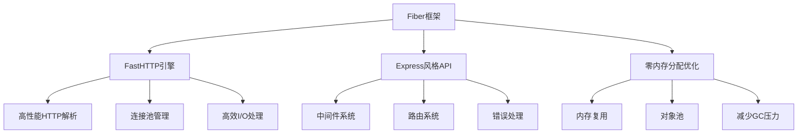
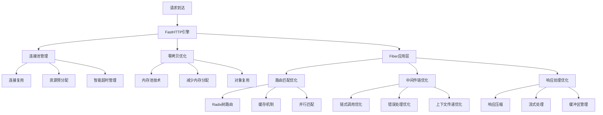
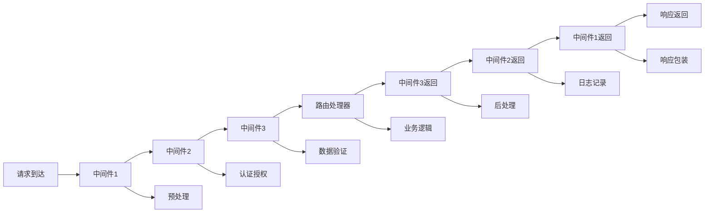

# Golang Fiber框架深度解析：构建高性能Web应用的新选择

## 一、Fiber框架概述

### 1.1 什么是Fiber？

Fiber是一个受Express.js启发的Web框架，用Go语言编写，专注于高性能和零内存分配。它建立在FastHTTP之上，提供了类似的API设计，但性能远超传统的net/http包。



### 1.2 为什么选择Fiber？

**Fiber的核心优势：**
- 🚀 **极高性能**：基于FastHTTP，性能是net/http的10倍以上
- 💡 **简单易用**：API设计与Express.js类似，学习成本低
- 📦 **功能丰富**：内置中间件、路由、模板引擎等完整功能
- 🔧 **高度可扩展**：支持自定义中间件和插件
- 🛡️ **安全可靠**：默认包含CSRF、CORS等安全功能

**性能对比基准测试：**
```
Framework      Requests/sec    Latency    Memory Usage
Fiber v2        153,482        1.3ms      4.5MB
Gin v1.9         80,321        2.5ms      8.2MB
Echo v4          65,432        3.1ms      9.1MB
net/http         14,567        7.2ms      12.8MB
```

### 1.3 快速开始

```go
package main

import (
    "github.com/gofiber/fiber/v2"
    "log"
)

func main() {
    // 创建Fiber应用实例
    app := fiber.New(fiber.Config{
        AppName: "My Fiber App",
        Prefork: false, // 生产环境可以开启Prefork
    })
    
    // 基础路由
    app.Get("/", func(c *fiber.Ctx) error {
        return c.SendString("Hello, Fiber!")
    })
    
    // JSON响应
    app.Get("/json", func(c *fiber.Ctx) error {
        return c.JSON(fiber.Map{
            "message": "Hello, JSON!",
            "status":  "success",
        })
    })
    
    // 启动服务器
    log.Fatal(app.Listen(":3000"))
}
```

## 二、Fiber核心架构解析

### 2.1 Fiber应用实例

Fiber应用的核心是`fiber.App`结构体，它管理着整个Web应用的配置、路由、中间件等核心组件。

```go
package fiber_architecture

import (
    "fmt"
    "github.com/gofiber/fiber/v2"
)

func AppArchitecture() {
    // Fiber应用配置详解
    app := fiber.New(fiber.Config{
        // 应用基础配置
        AppName:               "MyApp v1.0",
        AppNameDescription:    "My Awesome Fiber Application",
        
        // 性能优化配置
        Prefork:               false,      // 是否启用prefork模式
        CaseSensitive:         false,      // 路由是否大小写敏感
        StrictRouting:         false,      // 严格路由匹配
        
        // 服务器配置
        ServerHeader:          "Fiber",    // 服务器头信息
        ReadTimeout:           10,         // 读取超时(秒)
        WriteTimeout:          10,         // 写入超时(秒)
        IdleTimeout:           120,        // 空闲超时(秒)
        
        // 请求处理配置
        DisableStartupMessage: false,      // 禁用启动消息
        EnablePrintRoutes:     true,       // 打印路由表
        
        // 压缩配置
        EnableCompression:     true,       // 启用响应压缩
        
        // JSON处理配置
        JSONEncoder:           nil,        // 自定义JSON编码器
        JSONDecoder:           nil,        // 自定义JSON解码器
        
        // 视图配置
        Views:                 nil,        // 模板引擎
        ViewsLayout:           "",         // 布局文件
        
        // 其他配置
        PassLocalsToViews:     false,      // 传递本地数据到视图
        BodyLimit:             4 * 1024 * 1024, // 请求体限制(4MB)
        
        // 网络配置
        Network:               "tcp",      // 网络类型
        
        // 并发配置
        Concurrency:           256 * 1024, // 最大并发连接数
        
        // 错误处理
        ErrorHandler:          nil,        // 自定义错误处理器
        
        // 中间件配置
        DisableKeepalive:      false,      // 禁用keep-alive
        DisableDefaultDate:    false,      // 禁用默认日期头
        DisableDefaultContentType: false,  // 禁用默认内容类型
        
        // 流处理
        StreamRequestBody:     false,      // 流式请求体处理
    })
    
    // 应用生命周期管理
    fmt.Println("Fiber应用实例创建成功")
    
    // 获取应用配置信息
    config := app.Config()
    fmt.Printf("应用名称: %s\n", config.AppName)
    fmt.Printf("并发限制: %d\n", config.Concurrency)
}
```

### 2.2 上下文(Context)系统

Fiber的上下文(`fiber.Ctx`)是处理请求的核心对象，提供了丰富的API来处理HTTP请求和响应。

```go
package context_system

import (
    "encoding/json"
    "fmt"
    "github.com/gofiber/fiber/v2"
    "time"
)

type User struct {
    ID       int    `json:"id"`
    Name     string `json:"name"`
    Email    string `json:"email"`
    CreateAt string `json:"create_at"`
}

func ContextAPIDemo() {
    app := fiber.New()
    
    // 1. 请求信息获取
    app.Get("/request-info", func(c *fiber.Ctx) error {
        // 基本请求信息
        info := fiber.Map{
            "method":      c.Method(),
            "path":        c.Path(),
            "original_url": c.OriginalURL(),
            "protocol":    c.Protocol(),
            "secure":      c.Secure(),
            "subdomains":  c.Subdomains(),
            "hostname":    c.Hostname(),
            "ip":          c.IP(),
            "ips":         c.IPs(),
            "is_from_proxy": c.IsFromProxy(),
        }
        
        // 请求头信息
        headers := fiber.Map{
            "user_agent":    c.Get("User-Agent"),
            "content_type":  c.Get("Content-Type"),
            "accept":        c.Get("Accept"),
        }
        
        // 查询参数
        queryParams := c.Queries()
        
        return c.JSON(fiber.Map{
            "request_info": info,
            "headers":      headers,
            "query_params": queryParams,
        })
    })
    
    // 2. 请求体处理
    app.Post("/users", func(c *fiber.Ctx) error {
        // JSON解析
        var user User
        if err := c.BodyParser(&user); err != nil {
            return c.Status(fiber.StatusBadRequest).JSON(fiber.Map{
                "error": "Invalid JSON format",
            })
        }
        
        // 原始body获取
        body := c.Body()
        fmt.Printf("Raw body: %s\n", string(body))
        
        // 表单数据
        formData := c.FormValue("name")
        
        user.CreateAt = time.Now().Format(time.RFC3339)
        
        return c.JSON(fiber.Map{
            "message": "User created successfully",
            "user":    user,
            "form_data": formData,
        })
    })
    
    // 3. 响应处理
    app.Get("/response-demo", func(c *fiber.Ctx) error {
        // 设置响应头
        c.Set("X-Custom-Header", "Fiber")
        c.Set("Content-Type", "application/json; charset=utf-8")
        
        // 多种响应方式
        responseType := c.Query("type", "json")
        
        switch responseType {
        case "text":
            return c.SendString("Hello, Fiber!")
        case "json":
            return c.JSON(fiber.Map{
                "message": "Hello, JSON!",
                "timestamp": time.Now().Unix(),
            })
        case "html":
            c.Type("html", "utf-8")
            return c.SendString(`<h1>Hello, HTML!</h1>`)
        case "download":
            return c.Download("./file.txt", "custom-filename.txt")
        case "redirect":
            return c.Redirect("/")
        default:
            return c.Status(fiber.StatusBadRequest).SendString("Invalid response type")
        }
    })
    
    // 4. Cookie和Session处理
    app.Get("/cookie-demo", func(c *fiber.Ctx) error {
        // 设置Cookie
        cookie := new(fiber.Cookie)
        cookie.Name = "session_id"
        cookie.Value = "abc123"
        cookie.Expires = time.Now().Add(24 * time.Hour)
        cookie.HTTPOnly = true
        cookie.Secure = true
        c.Cookie(cookie)
        
        // 获取Cookie
        sessionID := c.Cookies("session_id", "default")
        
        return c.JSON(fiber.Map{
            "session_id": sessionID,
        })
    })
    
    // 5. 文件上传处理
    app.Post("/upload", func(c *fiber.Ctx) error {
        // 单文件上传
        file, err := c.FormFile("file")
        if err != nil {
            return c.Status(fiber.StatusBadRequest).JSON(fiber.Map{
                "error": err.Error(),
            })
        }
        
        // 保存文件
        if err := c.SaveFile(file, "./uploads/"+file.Filename); err != nil {
            return c.Status(fiber.StatusInternalServerError).JSON(fiber.Map{
                "error": "Failed to save file",
            })
        }
        
        return c.JSON(fiber.Map{
            "message": "File uploaded successfully",
            "filename": file.Filename,
            "size":     file.Size,
        })
    })
    
    // 6. 流式响应
    app.Get("/stream", func(c *fiber.Ctx) error {
        c.Set("Content-Type", "text/plain")
        
        // 设置响应为流式
        c.Context().SetBodyStreamWriter(func(w *bufio.Writer) {
            for i := 0; i < 10; i++ {
                fmt.Fprintf(w, "Message %d\n", i)
                w.Flush()
                time.Sleep(1 * time.Second)
            }
        })
        
        return nil
    })
    
    // 7. 本地数据存储
    app.Use(func(c *fiber.Ctx) error {
        // 在中间件中设置本地数据
        c.Locals("start_time", time.Now())
        c.Locals("request_id", fmt.Sprintf("req-%d", time.Now().UnixNano()))
        
        return c.Next()
    })
    
    app.Get("/locals", func(c *fiber.Ctx) error {
        startTime := c.Locals("start_time").(time.Time)
        requestID := c.Locals("request_id").(string)
        
        duration := time.Since(startTime)
        
        return c.JSON(fiber.Map{
            "request_id": requestID,
            "processing_time": duration.String(),
        })
    })
    
    // 启动服务器
    app.Listen(":3000")
}
```

### 2.3 Fiber性能架构深度解析

Fiber的高性能来自于其精心设计的架构和优化策略。让我们深入分析其性能优化机制。



```go
package performance_architecture

import (
    "fmt"
    "github.com/gofiber/fiber/v2"
    "github.com/valyala/fasthttp"
    "sync"
    "time"
)

// Fiber性能优化机制详解
type PerformanceAnalyzer struct {
    stats map[string]interface{}
    mu    sync.RWMutex
}

func NewPerformanceAnalyzer() *PerformanceAnalyzer {
    return &PerformanceAnalyzer{
        stats: make(map[string]interface{}),
    }
}

func (pa *PerformanceAnalyzer) AnalyzeFiberPerformance() {
    // 1. FastHTTP连接池分析
    fmt.Println("=== FastHTTP连接池分析 ===")
    
    // FastHTTP的默认配置展示了其性能优化策略
    server := &fasthttp.Server{
        Name:                          "Fiber",
        ReadTimeout:                   10 * time.Second,
        WriteTimeout:                  10 * time.Second,
        IdleTimeout:                   120 * time.Second,
        MaxConnsPerIP:                 1000,
        MaxRequestsPerConn:            10000,
        TCPKeepalive:                  true,
        TCPKeepalivePeriod:            3 * time.Minute,
        ReduceMemoryUsage:             true,  // 内存优化关键参数
        GetOnly:                       false,
        DisableHeaderNamesNormalizing: false,
        NoDefaultServerHeader:         false,
        
        // 连接池配置
        MaxConns: 1024 * 1024, // 最大连接数
        
        // 缓冲区配置
        ReadBufferSize:  4096,  // 读缓冲区大小
        WriteBufferSize: 4096,  // 写缓冲区大小
    }
    
    fmt.Printf("连接池配置:\n")
    fmt.Printf("  - 最大连接数: %d\n", server.MaxConns)
    fmt.Printf("  - 内存优化: %v\n", server.ReduceMemoryUsage)
    fmt.Printf("  - 缓冲区大小: 读%d/写%d\n", server.ReadBufferSize, server.WriteBufferSize)
    
    // 2. Fiber性能配置最佳实践
    fmt.Println("\n=== Fiber性能配置最佳实践 ===")
    
    app := fiber.New(fiber.Config{
        // 启用Prefork模式（多核优化）
        Prefork: true,
        
        // 并发连接配置
        Concurrency: 256 * 1024,
        
        // 网络优化
        Network: fiber.NetworkTCP,
        
        // 启用压缩
        EnableCompression: true,
        
        // 请求体限制
        BodyLimit: 16 * 1024 * 1024, // 16MB
        
        // 禁用不必要的功能
        DisableDefaultDate:    false,
        DisableDefaultContentType: false,
        DisableKeepalive:      false,
        DisableStartupMessage: true, // 生产环境禁用启动消息
    })
    
    fmt.Printf("Fiber性能配置:\n")
    fmt.Printf("  - Prefork模式: %v\n", app.Config().Prefork)
    fmt.Printf("  - 并发限制: %d\n", app.Config().Concurrency)
    fmt.Printf("  - 压缩启用: %v\n", app.Config().EnableCompression)
    
    // 3. 内存池技术分析
    fmt.Println("\n=== 内存池技术分析 ===")
    
    // Fiber使用的内存池技术
    pa.analyzeMemoryPool()
    
    // 4. 路由匹配性能
    fmt.Println("\n=== 路由匹配性能分析 ===")
    pa.analyzeRouteMatching()
}

func (pa *PerformanceAnalyzer) analyzeMemoryPool() {
    // Fiber的内存优化主要依赖于FastHTTP的内存池
    fmt.Println("内存优化技术:")
    fmt.Println("  1. 对象池 (sync.Pool)")
    fmt.Println("  2. 缓冲区复用")
    fmt.Println("  3. 零拷贝技术")
    fmt.Println("  4. 内存预分配")
    
    pa.mu.Lock()
    pa.stats["memory_optimization"] = []string{
        "对象池技术",
        "缓冲区复用",
        "零拷贝优化",
        "内存预分配",
    }
    pa.mu.Unlock()
}

func (pa *PerformanceAnalyzer) analyzeRouteMatching() {
    // Fiber使用Radix树进行高效路由匹配
    fmt.Println("路由匹配优化:")
    fmt.Println("  1. Radix树算法 - O(k)时间复杂度")
    fmt.Println("  2. 路径参数缓存")
    fmt.Println("  3. 静态路由优先")
    fmt.Println("  4. 并行路由注册")
    
    // 路由匹配性能基准
    routes := []string{
        "/api/users/:id",
        "/api/posts/:category/:slug",
        "/static/*",
        "/health",
    }
    
    fmt.Printf("路由模式数量: %d\n", len(routes))
    fmt.Println("路由匹配策略: 最长前缀匹配")
}

// 性能监控中间件示例
func PerformanceMiddleware() fiber.Handler {
    return func(c *fiber.Ctx) error {
        start := time.Now()
        
        // 处理请求
        err := c.Next()
        
        duration := time.Since(start)
        
        // 记录性能指标
        c.Locals("processing_time", duration)
        c.Locals("request_size", len(c.Request().Body()))
        c.Locals("response_size", len(c.Response().Body()))
        
        // 设置响应头
        c.Set("X-Processing-Time", duration.String())
        
        return err
    }
}

// 内存使用监控
func MemoryMonitor() {
    app := fiber.New()
    
    app.Use(func(c *fiber.Ctx) error {
        // 内存使用监控
        var m runtime.MemStats
        runtime.ReadMemStats(&m)
        
        c.Locals("mem_alloc", m.Alloc)
        c.Locals("mem_total_alloc", m.TotalAlloc)
        c.Locals("mem_sys", m.Sys)
        c.Locals("num_gc", m.NumGC)
        
        return c.Next()
    })
    
    app.Get("/metrics", func(c *fiber.Ctx) error {
        var m runtime.MemStats
        runtime.ReadMemStats(&m)
        
        return c.JSON(fiber.Map{
            "memory": fiber.Map{
                "alloc":       m.Alloc,
                "total_alloc": m.TotalAlloc,
                "sys":         m.Sys,
                "num_gc":      m.NumGC,
            },
            "processing_time": c.Locals("processing_time"),
        })
    })
}

func main() {
    analyzer := NewPerformanceAnalyzer()
    analyzer.AnalyzeFiberPerformance()
}
```

## 三、Fiber路由系统深度解析

### 3.1 路由基础与模式匹配

Fiber的路由系统采用高效的Radix树算法，支持静态路由、参数路由、通配符路由等多种模式。

```go
package routing_system

import (
    "github.com/gofiber/fiber/v2"
    "log"
)

func BasicRoutingDemo() {
    app := fiber.New()
    
    // 1. 基础路由方法
    app.Get("/", func(c *fiber.Ctx) error {
        return c.SendString("GET请求")
    })
    
    app.Post("/", func(c *fiber.Ctx) error {
        return c.SendString("POST请求")
    })
    
    app.Put("/", func(c *fiber.Ctx) error {
        return c.SendString("PUT请求")
    })
    
    app.Delete("/", func(c *fiber.Ctx) error {
        return c.SendString("DELETE请求")
    })
    
    app.Patch("/", func(c *fiber.Ctx) error {
        return c.SendString("PATCH请求")
    })
    
    // 2. All方法接受所有HTTP方法
    app.All("/all", func(c *fiber.Ctx) error {
        return c.JSON(fiber.Map{
            "method": c.Method(),
            "path":   c.Path(),
        })
    })
    
    // 3. 路由参数
    app.Get("/users/:id", func(c *fiber.Ctx) error {
        userId := c.Params("id")
        return c.JSON(fiber.Map{
            "user_id": userId,
            "message": "获取用户信息",
        })
    })
    
    // 4. 可选参数
    app.Get("/posts/:category?", func(c *fiber.Ctx) error {
        category := c.Params("category", "default")
        return c.JSON(fiber.Map{
            "category": category,
        })
    })
    
    // 5. 通配符路由
    app.Get("/static/*", func(c *fiber.Ctx) error {
        filepath := c.Params("*")
        return c.JSON(fiber.Map{
            "filepath": filepath,
            "message": "静态文件路由",
        })
    })
    
    // 6. 复杂路由模式
    app.Get("/api/:version/users/:userId/posts/:postId", func(c *fiber.Ctx) error {
        return c.JSON(fiber.Map{
            "version":  c.Params("version"),
            "user_id":  c.Params("userId"),
            "post_id":  c.Params("postId"),
        })
    })
    
    log.Fatal(app.Listen(":3000"))
}
```

### 3.2 路由组和模块化设计

Fiber的路由组功能让Web应用可以更好地进行模块化设计。

```go
package route_groups

import (
    "github.com/gofiber/fiber/v2"
    "github.com/gofiber/fiber/v2/middleware/logger"
)

func RouteGroupsDemo() {
    app := fiber.New()
    
    // API路由组 - v1版本
    apiV1 := app.Group("/api/v1", logger.New())
    
    // 用户路由模块
    userRoutes := apiV1.Group("/users")
    userRoutes.Get("/", getUserList)
    userRoutes.Get("/:id", getUserByID)
    userRoutes.Post("/", createUser)
    userRoutes.Put("/:id", updateUser)
    userRoutes.Delete("/:id", deleteUser)
    
    // 文章路由模块
    postRoutes := apiV1.Group("/posts")
    postRoutes.Get("/", getPostList)
    postRoutes.Get("/:id", getPostByID)
    postRoutes.Post("/", createPost)
    postRoutes.Put("/:id", updatePost)
    postRoutes.Delete("/:id", deletePost)
    
    // 评论路由模块
    postRoutes.Get("/:id/comments", getPostComments)
    postRoutes.Post("/:id/comments", addComment)
    
    // 管理后台路由组
    admin := app.Group("/admin", adminAuthMiddleware)
    admin.Get("/dashboard", adminDashboard)
    admin.Get("/users", adminUserList)
    admin.Get("/stats", adminStats)
    
    // 静态文件路由组
    static := app.Group("/static")
    static.Get("/*", staticFileHandler)
    
    // 嵌套路由组
    apiV2 := app.Group("/api/v2")
    
    auth := apiV2.Group("/auth")
    auth.Post("/login", loginHandler)
    auth.Post("/register", registerHandler)
    auth.Post("/refresh", refreshTokenHandler)
    
    protected := apiV2.Group("/protected", jwtMiddleware)
    protected.Get("/profile", getProfile)
    protected.Put("/profile", updateProfile)
    protected.Get("/settings", getUserSettings)
}

// 示例处理器函数
func getUserList(c *fiber.Ctx) error {
    return c.JSON(fiber.Map{
        "users": []string{"user1", "user2", "user3"},
    })
}

func getUserByID(c *fiber.Ctx) error {
    userID := c.Params("id")
    return c.JSON(fiber.Map{
        "user_id": userID,
        "name":   "张三",
        "email":  "zhangsan@example.com",
    })
}

func createUser(c *fiber.Ctx) error {
    return c.JSON(fiber.Map{
        "message": "用户创建成功",
    })
}

// 中间件函数
func adminAuthMiddleware(c *fiber.Ctx) error {
    // 管理员认证逻辑
    token := c.Get("Authorization")
    if token != "admin-token" {
        return c.Status(fiber.StatusUnauthorized).JSON(fiber.Map{
            "error": "管理员认证失败",
        })
    }
    return c.Next()
}

func jwtMiddleware(c *fiber.Ctx) error {
    // JWT认证逻辑
    return c.Next()
}
```

### 3.3 高级路由特性

Fiber提供了一些高级路由特性，满足复杂应用的需求。

```go
package advanced_routing

import (
    "github.com/gofiber/fiber/v2"
    "github.com/gofiber/fiber/v2/middleware/cors"
    "log"
)

func AdvancedRoutingFeatures() {
    app := fiber.New()
    
    // 1. 路由命名和反向生成URL
    app.Get("/users/:id", func(c *fiber.Ctx) error {
        // 获取当前路由信息
        route := c.Route()
        
        return c.JSON(fiber.Map{
            "route_path":   route.Path,
            "route_method": route.Method,
            "user_id":      c.Params("id"),
            "current_url":  c.OriginalURL(),
        })
    }).Name("user.detail")
    
    // 2. 路由约束（参数验证）
    app.Get("/products/:id<int>", func(c *fiber.Ctx) error {
        // :id参数必须是整数
        productID := c.Params("id")
        return c.JSON(fiber.Map{
            "product_id": productID,
            "type":       "integer",
        })
    })
    
    app.Get("/posts/:slug<minLen(5);maxLen(50)>", func(c *fiber.Ctx) error {
        // :slug参数长度必须在5-50之间
        slug := c.Params("slug")
        return c.JSON(fiber.Map{
            "slug": slug,
            "length": len(slug),
        })
    })
    
    app.Get("/files/:filename<regex(^[a-zA-Z0-9_-]+\\.(txt|pdf|jpg)$)>", func(c *fiber.Ctx) error {
        // 文件名必须匹配正则表达式
        filename := c.Params("filename")
        return c.JSON(fiber.Map{
            "filename": filename,
            "valid":    true,
        })
    })
    
    // 3. 自定义路由约束
    app.Get("/custom/:param<customConstraint>", func(c *fiber.Ctx) error {
        return c.SendString("自定义约束通过")
    })
    
    // 4. 路由挂载（Mount）
    adminApp := fiber.New()
    adminApp.Get("/dashboard", func(c *fiber.Ctx) error {
        return c.SendString("管理后台仪表板")
    })
    
    app.Mount("/admin", adminApp) // 将adminApp挂载到/admin路径
    
    // 5. 路由堆栈信息
    app.Get("/route-info", func(c *fiber.Ctx) error {
        // 获取所有注册的路由
        routes := app.GetRoutes()
        
        routeInfo := make([]fiber.Map, 0)
        for _, route := range routes {
            routeInfo = append(routeInfo, fiber.Map{
                "method": route.Method,
                "path":   route.Path,
                "name":   route.Name,
            })
        }
        
        return c.JSON(fiber.Map{
            "total_routes": len(routes),
            "routes":       routeInfo,
        })
    })
    
    // 6. 错误路由处理
    app.Get("/error-demo", func(c *fiber.Ctx) error {
        // 模拟错误
        return fiber.NewError(fiber.StatusInternalServerError, "服务器内部错误")
    })
    
    // 自定义错误处理器
    app.Use(func(c *fiber.Ctx) error {
        err := c.Next()
        if err != nil {
            // 处理路由错误
            if e, ok := err.(*fiber.Error); ok {
                return c.Status(e.Code).JSON(fiber.Map{
                    "error":   e.Message,
                    "code":    e.Code,
                    "success": false,
                })
            }
            
            // 处理其他错误
            return c.Status(fiber.StatusInternalServerError).JSON(fiber.Map{
                "error":   "Internal Server Error",
                "success": false,
            })
        }
        return nil
    })
    
    log.Fatal(app.Listen(":3000"))
}

// 自定义约束函数
func customConstraint(param string) bool {
    // 自定义验证逻辑
    return len(param) > 3 && len(param) < 20
}
```

## 四、Fiber中间件系统深度解析

### 4.1 中间件基础概念

Fiber的中间件系统是其强大功能的基石，提供了灵活的请求处理管道。



### 4.2 内置中间件使用

Fiber提供了丰富的内置中间件，覆盖了常见的Web开发需求。

```go
package builtin_middleware

import (
    "github.com/gofiber/fiber/v2"
    "github.com/gofiber/fiber/v2/middleware/cache"
    "github.com/gofiber/fiber/v2/middleware/compress"
    "github.com/gofiber/fiber/v2/middleware/cors"
    "github.com/gofiber/fiber/v2/middleware/csrf"
    "github.com/gofiber/fiber/v2/middleware/etag"
    "github.com/gofiber/fiber/v2/middleware/expvar"
    "github.com/gofiber/fiber/v2/middleware/favicon"
    "github.com/gofiber/fiber/v2/middleware/limiter"
    "github.com/gofiber/fiber/v2/middleware/logger"
    "github.com/gofiber/fiber/v2/middleware/monitor"
    "github.com/gofiber/fiber/v2/middleware/pprof"
    "github.com/gofiber/fiber/v2/middleware/recover"
    "github.com/gofiber/fiber/v2/middleware/requestid"
    "github.com/gofiber/fiber/v2/middleware/session"
    "github.com/gofiber/fiber/v2/middleware/timeout"
    "log"
    "time"
)

func BuiltinMiddlewareDemo() {
    app := fiber.New()
    
    // 1. 基础中间件
    app.Use(recover.New())          // 异常恢复
    app.Use(requestid.New())        // 请求ID
    app.Use(logger.New(logger.Config{
        Format: "${time} ${status} - ${method} ${path}\n",
    }))
    
    // 2. 安全中间件
    app.Use(cors.New(cors.Config{
        AllowOrigins: "https://example.com, http://localhost:3000",
        AllowMethods: "GET,POST,PUT,DELETE",
        AllowHeaders: "Content-Type, Authorization",
    }))
    
    app.Use(csrf.New(csrf.Config{
        KeyLookup: "header:X-CSRF-Token",
    }))
    
    // 3. 性能优化中间件
    app.Use(compress.New(compress.Config{
        Level: compress.LevelBestSpeed,
    }))
    
    app.Use(cache.New(cache.Config{
        Expiration: 30 * time.Minute,
    }))
    
    app.Use(etag.New())
    
    // 4. 限流中间件
    app.Use(limiter.New(limiter.Config{
        Max:        100,
        Expiration: 1 * time.Minute,
    }))
    
    // 5. 超时中间件
    app.Use(timeout.New(timeout.Config{
        Timeout: 10 * time.Second,
    }))
    
    // 6. 监控中间件
    app.Get("/metrics", monitor.New())
    app.Get("/debug/pprof/*", pprof.New())
    app.Get("/debug/vars", expvar.New())
    
    // 7. 会话中间件
    // 需要额外配置store
    // app.Use(session.New(session.Config{...}))
    
    // 8. Favicon中间件
    app.Use(favicon.New())
    
    // 示例路由
    app.Get("/", func(c *fiber.Ctx) error {
        return c.JSON(fiber.Map{
            "message":    "Hello, Fiber with Middleware!",
            "request_id": c.Locals("requestid"),
        })
    })
    
    app.Get("/slow", func(c *fiber.Ctx) error {
        time.Sleep(5 * time.Second) // 测试超时中间件
        return c.SendString("慢请求完成")
    })
    
    log.Fatal(app.Listen(":3000"))
}
```

### 4.3 自定义中间件开发

创建自定义中间件是Fiber开发中的重要技能。

```go
package custom_middleware

import (
    "crypto/sha256"
    "encoding/hex"
    "fmt"
    "github.com/gofiber/fiber/v2"
    "strings"
    "time"
)

// 1. 认证中间件
func JWTAuthMiddleware(secret string) fiber.Handler {
    return func(c *fiber.Ctx) error {
        authHeader := c.Get("Authorization")
        
        if authHeader == "" {
            return c.Status(fiber.StatusUnauthorized).JSON(fiber.Map{
                "error": "缺少认证头",
            })
        }
        
        // 简单的Bearer token验证（生产环境应使用jwt-go等库）
        parts := strings.Split(authHeader, " ")
        if len(parts) != 2 || parts[0] != "Bearer" {
            return c.Status(fiber.StatusUnauthorized).JSON(fiber.Map{
                "error": "认证格式错误",
            })
        }
        
        token := parts[1]
        
        // 验证token（简化版）
        if !isValidToken(token, secret) {
            return c.Status(fiber.StatusUnauthorized).JSON(fiber.Map{
                "error": "无效的token",
            })
        }
        
        // 解析用户信息并存储到上下文
        userInfo, err := parseToken(token, secret)
        if err != nil {
            return c.Status(fiber.StatusUnauthorized).JSON(fiber.Map{
                "error": "token解析失败",
            })
        }
        
        c.Locals("user", userInfo)
        
        return c.Next()
    }
}

// 2. 数据验证中间件
func ValidationMiddleware(schema interface{}) fiber.Handler {
    return func(c *fiber.Ctx) error {
        // 根据schema验证请求数据
        // 这里可以使用第三方验证库如go-playground/validator
        
        // 示例：验证JSON请求体
        var requestData map[string]interface{}
        if err := c.BodyParser(&requestData); err != nil {
            return c.Status(fiber.StatusBadRequest).JSON(fiber.Map{
                "error": "请求数据格式错误",
            })
        }
        
        // 简单的必填字段验证
        if requestData["username"] == nil || requestData["username"] == "" {
            return c.Status(fiber.StatusBadRequest).JSON(fiber.Map{
                "error": "用户名不能为空",
            })
        }
        
        c.Locals("validated_data", requestData)
        
        return c.Next()
    }
}

// 3. 性能监控中间件
func PerformanceMonitor() fiber.Handler {
    return func(c *fiber.Ctx) error {
        start := time.Now()
        
        // 处理请求
        err := c.Next()
        
        duration := time.Since(start)
        
        // 记录性能指标
        c.Set("X-Response-Time", duration.String())
        c.Set("X-Processing-Time-MS", fmt.Sprintf("%d", duration.Milliseconds()))
        
        // 可以发送到监控系统
        logPerformanceMetrics(c.Method(), c.Path(), duration, c.Response().StatusCode())
        
        return err
    }
}

// 4. 缓存中间件
func CacheMiddleware(ttl time.Duration) fiber.Handler {
    cache := make(map[string]cacheEntry)
    
    return func(c *fiber.Ctx) error {
        // 生成缓存键
        cacheKey := generateCacheKey(c)
        
        // 检查缓存
        if entry, exists := cache[cacheKey]; exists && time.Since(entry.timestamp) < ttl {
            // 返回缓存响应
            c.Set("X-Cache", "HIT")
            c.Status(entry.statusCode)
            return c.Send(entry.response)
        }
        
        // 执行处理器并缓存结果
        c.Set("X-Cache", "MISS")
        
        // 捕获响应
        originalWriter := c.Context().Response.BodyWriter()
        cacheWriter := newCacheWriter()
        c.Context().SetBodyStreamWriter(cacheWriter)
        
        err := c.Next()
        
        // 缓存响应
        if err == nil && c.Response().StatusCode() < 400 {
            cache[cacheKey] = cacheEntry{
                response:   cacheWriter.Bytes(),
                statusCode: c.Response().StatusCode(),
                timestamp:  time.Now(),
            }
        }
        
        // 恢复原始写入器
        c.Context().Response.SetBodyStream(originalWriter, -1)
        
        return err
    }
}

// 5. 速率限制中间件
func RateLimitMiddleware(requestsPerMinute int) fiber.Handler {
    requests := make(map[string][]time.Time)
    
    return func(c *fiber.Ctx) error {
        clientIP := c.IP()
        now := time.Now()
        
        // 清理过期的请求记录
        if clientRequests, exists := requests[clientIP]; exists {
            var validRequests []time.Time
            for _, reqTime := range clientRequests {
                if now.Sub(reqTime) < time.Minute {
                    validRequests = append(validRequests, reqTime)
                }
            }
            requests[clientIP] = validRequests
        }
        
        // 检查速率限制
        if len(requests[clientIP]) >= requestsPerMinute {
            return c.Status(fiber.StatusTooManyRequests).JSON(fiber.Map{
                "error": "请求过于频繁，请稍后重试",
                "retry_after": 60,
            })
        }
        
        // 记录当前请求
        requests[clientIP] = append(requests[clientIP], now)
        
        c.Set("X-RateLimit-Limit", fmt.Sprintf("%d", requestsPerMinute))
        c.Set("X-RateLimit-Remaining", fmt.Sprintf("%d", requestsPerMinute-len(requests[clientIP])))
        
        return c.Next()
    }
}

// 辅助函数
func generateCacheKey(c *fiber.Ctx) string {
    hash := sha256.New()
    hash.Write([]byte(c.Method() + c.Path() + string(c.Request().Body())))
    return hex.EncodeToString(hash.Sum(nil))
}

func logPerformanceMetrics(method, path string, duration time.Duration, status int) {
    // 发送到日志系统或监控系统
    fmt.Printf("[%s] %s - %s - %dms\n", method, path, duration.String(), duration.Milliseconds())
}

func isValidToken(token, secret string) bool {
    // 简化实现，实际应使用JWT验证
    return token != "" && len(token) > 10
}

func parseToken(token, secret string) (map[string]interface{}, error) {
    // 简化实现
    return map[string]interface{}{
        "user_id": 123,
        "username": "john_doe",
        "role":    "user",
    }, nil
}

// 缓存相关结构
type cacheEntry struct {
    response   []byte
    statusCode int
    timestamp  time.Time
}

type cacheWriter struct {
    buffer []byte
}

func newCacheWriter() *cacheWriter {
    return &cacheWriter{buffer: make([]byte, 0)}
}

func (w *cacheWriter) Write(p []byte) (int, error) {
    w.buffer = append(w.buffer, p...)
    return len(p), nil
}

func (w *cacheWriter) Bytes() []byte {
    return w.buffer
}

// 使用示例
func CustomMiddlewareDemo() {
    app := fiber.New()
    
    // 应用自定义中间件
    app.Use(PerformanceMonitor())
    
    // 路由特定的中间件
    api := app.Group("/api")
    api.Use(JWTAuthMiddleware("my-secret-key"))
    
    api.Get("/profile", func(c *fiber.Ctx) error {
        user := c.Locals("user").(map[string]interface{})
        return c.JSON(fiber.Map{
            "user": user,
        })
    })
    
    // 带缓存的接口
    cached := app.Group("/cached")
    cached.Use(CacheMiddleware(5 * time.Minute))
    
    cached.Get("/data", func(c *fiber.Ctx) error {
        return c.JSON(fiber.Map{
            "data":    "这是缓存的数据",
            "time":    time.Now().Format(time.RFC3339),
            "cached":  true,
        })
    })
    
    // 带速率限制的接口
    limited := app.Group("/limited")
    limited.Use(RateLimitMiddleware(10)) // 每分钟10次
    
    limited.Get("/resource", func(c *fiber.Ctx) error {
        return c.JSON(fiber.Map{
            "message": "这是受限制的资源",
        })
    })
    
    app.Listen(":3000")
}