# Go 文件监听神器 fsnotify：从入门到实战，让你的程序"感知"一切变化

> 你有没有遇到过这样的需求：配置文件改了，服务要自动重启？日志目录来了新文件，要立刻处理？某个关键文件被篡改，要实时报警？
>
> 轮询？太蠢了。每秒扫一遍目录，CPU 和磁盘都不答应。
>
> 今天介绍的 fsnotify 库，让操作系统主动告诉你文件变了——零轮询、低延迟、跨平台。

---

## 一、为什么需要文件监听？

先看一个场景：你写了一个 Web 服务，配置写在 YAML 文件里。产品经理说"改配置不能重启服务"，你怎么做？

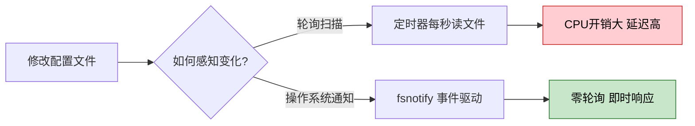

两种思路，高下立判：

| 对比项 | 定时轮询 | fsnotify 事件驱动 |
|--------|----------|-------------------|
| CPU 开销 | 持续占用 | 几乎为零 |
| 响应延迟 | 取决于轮询间隔 | 毫秒级 |
| 代码复杂度 | 需要对比文件状态 | 注册 + 监听即可 |
| 适用场景 | 无奈之举 | 生产首选 |

**fsnotify** 的核心思路：利用操作系统底层的文件系统通知机制（Linux 的 inotify、macOS 的 kqueue、Windows 的 ReadDirectoryChangesW），让内核在文件变化时主动推送事件给你的程序。

不需要你主动去问，系统会"通知"你。

---

## 二、fsnotify 是什么？

[fsnotify](https://github.com/fsnotify/fsnotify) 是 Go 语言生态中最流行的跨平台文件系统监听库，截至 2025 年 4 月最新版本为 **v1.9.0**。

一句话概括：

> **fsnotify = 跨平台 + 事件驱动 + 零轮询的文件监听方案**

它底层对接了各操作系统的原生 API：

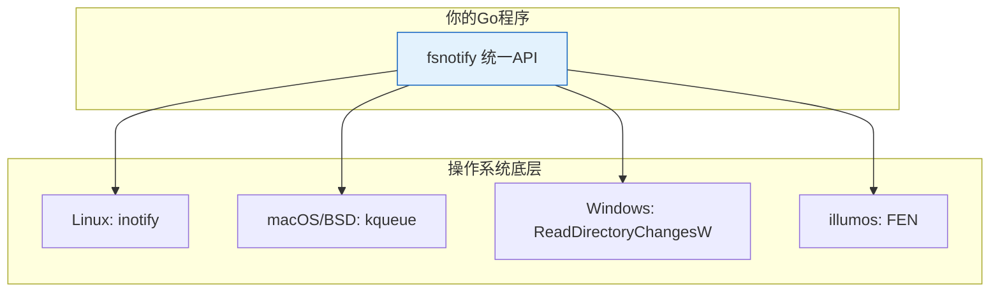

你只需要写一套代码，fsnotify 帮你在不同平台上调用对应的系统 API。

---

## 三、5 分钟上手：第一个文件监听程序

### 3.1 安装

```bash
go get github.com/fsnotify/fsnotify@latest
```

当前最新版本 v1.9.0，需要 Go 1.17 及以上。

### 3.2 最小可运行示例

创建 `main.go`：

```go
package main

import (
    "log"
    "github.com/fsnotify/fsnotify"
)

func main() {
    // 第一步：创建 Watcher
    watcher, err := fsnotify.NewWatcher()
    if err != nil {
        log.Fatal("创建监听器失败:", err)
    }
    defer watcher.Close()

    // 第二步：启动事件处理协程
    go func() {
        for {
            select {
            case event, ok := <-watcher.Events:
                if !ok {
                    return
                }
                log.Println("收到事件:", event)

            case err, ok := <-watcher.Errors:
                if !ok {
                    return
                }
                log.Println("发生错误:", err)
            }
        }
    }()

    // 第三步：添加监听路径
    err = watcher.Add("/tmp")
    if err != nil {
        log.Fatal("添加监听路径失败:", err)
    }

    // 第四步：阻塞主协程
    <-make(chan struct{})
}
```

运行它：

```bash
go run main.go
```

然后打开另一个终端，在 `/tmp` 下操作文件：

```bash
echo "hello" > /tmp/test.txt      # 触发 Create + Write
echo "world" >> /tmp/test.txt     # 触发 Write
mv /tmp/test.txt /tmp/test2.txt   # 触发 Rename + Create
rm /tmp/test2.txt                 # 触发 Remove
```

你会看到类似这样的输出：

```
2026/04/23 10:00:01 收到事件: "/tmp/test.txt": CREATE
2026/04/23 10:00:01 收到事件: "/tmp/test.txt": WRITE
2026/04/23 10:00:05 收到事件: "/tmp/test.txt": RENAME
2026/04/23 10:00:05 收到事件: "/tmp/test2.txt": CREATE
2026/04/23 10:00:08 收到事件: "/tmp/test2.txt": REMOVE
```

看到了吗？文件的创建、写入、重命名、删除，全部被实时捕获了。

整个流程可以用下面这张图来理解：

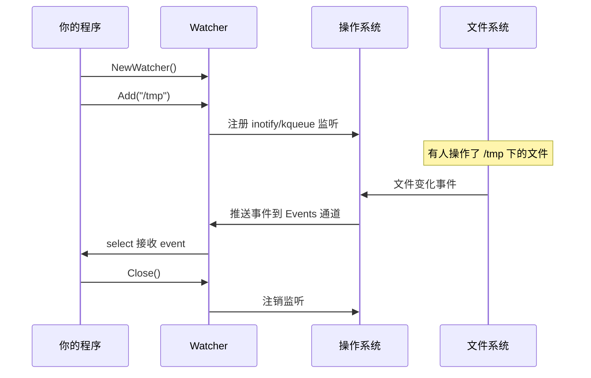

---

## 四、核心 API 详解

上手之后，我们来系统梳理 fsnotify 的 API。不多，但每个都很重要。

### 4.1 Watcher：监听器

`Watcher` 是 fsnotify 的核心对象，它持有两个通道：

```go
type Watcher struct {
    Events chan Event   // 文件变化事件通道
    Errors chan error   // 错误通道
}
```

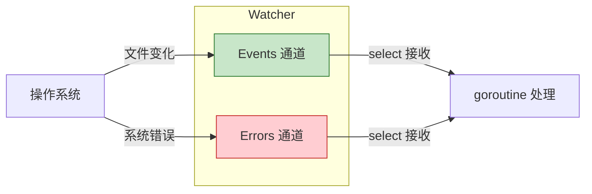

**关键方法一览：**

| 方法 | 作用 | 说明 |
|------|------|------|
| `NewWatcher()` | 创建监听器 | 返回 `*Watcher` 和 `error` |
| `NewBufferedWatcher(sz uint)` | 创建带缓冲的监听器 | 事件通道带缓冲，防丢失 |
| `Add(path string)` | 添加监听路径 | 目录或文件，目录不递归 |
| `Remove(path string)` | 移除监听路径 | 停止监听指定路径 |
| `WatchList() []string` | 获取所有监听路径 | 返回当前监听列表 |
| `Close()` | 关闭监听器 | 关闭所有监听和通道 |

### 4.2 Event：事件

每个文件变化都会产生一个 `Event`：

```go
type Event struct {
    Name string   // 文件路径
    Op   Op       // 操作类型（位掩码）
}
```

`Event` 有一个重要方法 `Has(op Op) bool`，用来判断事件是否包含某种操作。

### 4.3 Op：操作类型

fsnotify 定义了 5 种操作类型：

```go
const (
    Create Op = 1 << iota  // 文件/目录被创建
    Write                   // 文件被写入
    Remove                  // 文件/目录被删除
    Rename                  // 文件/目录被重命名
    Chmod                   // 文件权限被修改
)
```

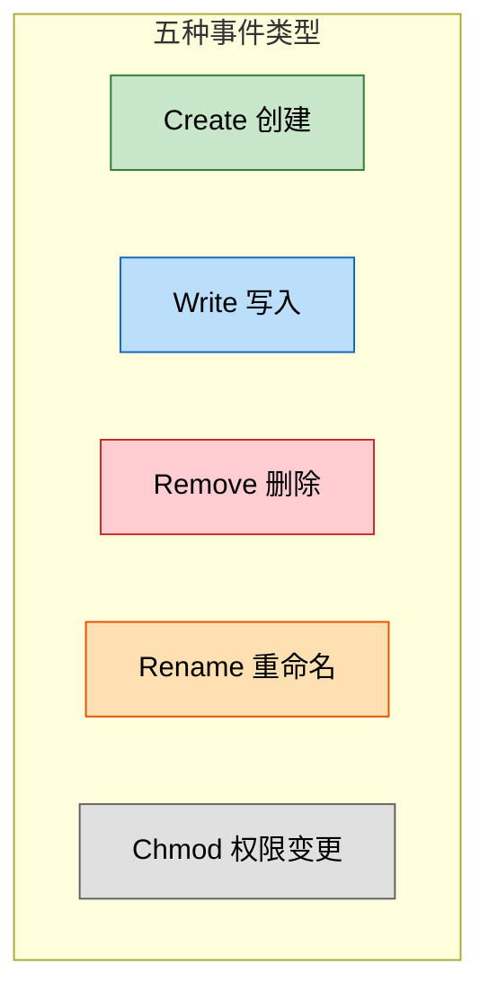

**一个容易踩的坑：Op 是位掩码，不要用 `==` 比较！**

```go
// ❌ 错误写法：Op 是位掩码，一个事件可能包含多个操作
if event.Op == fsnotify.Write {
    // 可能漏掉同时包含 Write 和其他操作的事件
}

// ✅ 正确写法：用 Has() 方法
if event.Has(fsnotify.Write) {
    log.Println("文件被修改:", event.Name)
}
```

这一点官方文档反复强调。为什么？因为底层操作系统可能在一次通知中合并多个操作，比如一个文件被创建的同时也写入了内容，`Op` 可能是 `Create|Write`。

### 4.4 完整的事件处理模板

```go
go func() {
    for {
        select {
        case event, ok := <-watcher.Events:
            if !ok {  // 通道已关闭
                return
            }

            switch {
            case event.Has(fsnotify.Create):
                log.Printf("创建: %s", event.Name)
            case event.Has(fsnotify.Write):
                log.Printf("修改: %s", event.Name)
            case event.Has(fsnotify.Remove):
                log.Printf("删除: %s", event.Name)
            case event.Has(fsnotify.Rename):
                log.Printf("重命名: %s", event.Name)
            case event.Has(fsnotify.Chmod):
                log.Printf("权限变更: %s", event.Name)
            }

        case err, ok := <-watcher.Errors:
            if !ok {  // 通道已关闭
                return
            }
            log.Printf("监听错误: %v", err)
        }
    }
}()
```

注意两个 `ok` 检查——当 `Close()` 被调用后，通道会被关闭，此时必须退出循环，否则会无限收到零值。

---

## 五、六个你必须知道的"坑"

fsnotify 看起来简单，但实际用起来有不少细节。以下是我踩过的和社区反复提到的 6 个坑，提前了解可以少走很多弯路。

### 坑 1：监听目录，不要监听文件

这是 fsnotify 最重要的最佳实践。

为什么？因为大多数文本编辑器（Vim、VS Code 等）保存文件的方式不是"原地覆盖"，而是：


这个过程叫**原子写入**（atomic save）。如果你监听的是文件本身，步骤 3 一执行，你的 Watcher 就失效了——因为原文件已经不存在了，inotify 会自动移除对它的监听。

**正确做法**：监听文件所在的目录，然后在事件中过滤出你关心的文件。

```go
// ❌ 监听文件——原子保存后监听会丢失
watcher.Add("/etc/app/config.yaml")

// ✅ 监听目录——不管编辑器怎么折腾都能收到事件
watcher.Add("/etc/app/")

// 然后在事件处理中过滤
if event.Name == "/etc/app/config.yaml" && event.Has(fsnotify.Write) {
    // 重新加载配置
}
```

### 坑 2：目录监听是不递归的

`watcher.Add("/home/user")` 只监听 `/home/user` 这一层目录，子目录的变化不会收到通知。

如果你需要递归监听，必须手动遍历并添加所有子目录：

```go
func addWatchRecursively(watcher *fsnotify.Watcher, root string) error {
    return filepath.Walk(root, func(path string, info os.FileInfo, err error) error {
        if err != nil {
            return err
        }
        if info.IsDir() {
            if err := watcher.Add(path); err != nil {
                return fmt.Errorf("监听目录 %s 失败: %w", path, err)
            }
        }
        return nil
    })
}
```

**进阶**：如果你还想监听运行时新建的子目录，需要在 Create 事件中判断新目录并动态添加：

```go
case event.Has(fsnotify.Create):
    info, err := os.Stat(event.Name)
    if err == nil && info.IsDir() {
        watcher.Add(event.Name)  // 新目录也要监听
    }
```

整个递归监听的流程如下：

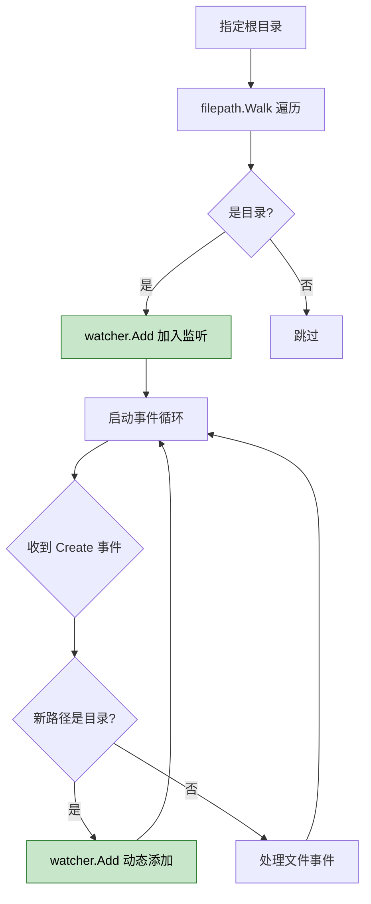

### 坑 3：一次写入可能触发多次 Write 事件

这是最常见的问题之一。当你往文件写一行内容时，可能收到 2 次、3 次甚至更多次 Write 事件。

为什么？因为操作系统的 inotify/kqueue 是在内核层面通知的。一个 `write()` 系统调用可能触发一次通知，而很多程序写入文件时会多次调用 `write()`，每次都会产生事件。

**解决方案：防抖（Debounce）**

```go
func debounceWatcher(watcher *fsnotify.Watcher, delay time.Duration, fn func(event fsnotify.Event)) {
    var timer *time.Timer
    lastEvent := make(map[string]time.Time)

    for {
        select {
        case event, ok := <-watcher.Events:
            if !ok {
                return
            }
            if !event.Has(fsnotify.Write) {
                fn(event)  // 非 Write 事件直接处理
                continue
            }

            // Write 事件做防抖
            now := time.Now()
            if last, ok := lastEvent[event.Name]; ok && now.Sub(last) < delay {
                continue  // 距上次事件太近，跳过
            }
            lastEvent[event.Name] = now

            if timer != nil {
                timer.Stop()
            }
            evt := event
            timer = time.AfterFunc(delay, func() {
                fn(evt)
            })

        case _, ok := <-watcher.Errors:
            if !ok {
                return
            }
        }
    }
}
```

使用方式：

```go
debounceWatcher(watcher, 500*time.Millisecond, func(event fsnotify.Event) {
    log.Println("防抖后处理:", event.Name, event.Op)
})
```

### 坑 4：Chmod 事件往往是噪音

很多程序会频繁修改文件权限（备份工具、杀毒软件、macOS 的 Spotlight 索引），如果你不关心权限变化，建议直接忽略：

```go
case event.Has(fsnotify.Chmod):
    // 大多数场景下忽略 Chmod 事件
    continue
```

### 坑 5：Linux 下的 inotify 限制

Linux 使用 inotify 实现文件监听，系统默认限制了可监听的数量。如果你要监听大量目录（比如整个项目源码树），很容易撞到上限。

查看当前限制：

```bash
cat /proc/sys/fs/inotify/max_user_watches
```

通常默认值是 8192 或 524287，不够用时调大它：

```bash
# 临时调整
sudo sysctl fs.inotify.max_user_watches=524288

# 永久生效，写入 /etc/sysctl.conf
echo "fs.inotify.max_user_watches=524288" | sudo tee -a /etc/sysctl.conf
sudo sysctl -p
```

macOS/BSD 也有类似限制，涉及 `kern.maxfiles` 和 `kern.maxfilesperproc`：

```bash
sysctl kern.maxfiles
sysctl kern.maxfilesperproc
```

### 坑 6：NFS/SMB/FUSE 等网络文件系统不支持

fsnotify 依赖操作系统的本地文件通知机制，网络文件系统（NFS、SMB/CIFS）和虚拟文件系统（`/proc`、`/sys`）通常不支持。如果你的监听路径在这些文件系统上，事件不会触发。

对于网络文件系统，只能退回到轮询方案。

---

## 六、实战场景一：配置文件热重载

这是 fsnotify 最经典的应用场景——修改配置文件后，服务自动重新加载，无需重启。


完整代码：

```go
package main

import (
    "log"
    "os"
    "sync"
    "time"

    "gopkg.in/yaml.v3"
    "github.com/fsnotify/fsnotify"
)

type Config struct {
    Port    int    `yaml:"port"`
    Debug   bool   `yaml:"debug"`
    LogPath string `yaml:"log_path"`
}

var (
    config     Config
    configLock sync.RWMutex
)

func loadConfig(path string) error {
    data, err := os.ReadFile(path)
    if err != nil {
        return err
    }
    var newConfig Config
    if err := yaml.Unmarshal(data, &newConfig); err != nil {
        return err
    }

    configLock.Lock()
    config = newConfig
    configLock.Unlock()

    log.Printf("配置已加载: %+v", newConfig)
    return nil
}

func GetConfig() Config {
    configLock.RLock()
    defer configLock.RUnlock()
    return config
}

func watchConfig(configPath string) error {
    watcher, err := fsnotify.NewWatcher()
    if err != nil {
        return err
    }
    defer watcher.Close()

    // 监听配置文件所在目录（而不是文件本身）
    configDir := "."
    watcher.Add(configDir)

    log.Println("开始监听配置文件变化...")

    // 防抖计时器
    var debounceTimer *time.Timer

    for {
        select {
        case event, ok := <-watcher.Events:
            if !ok {
                return nil
            }

            // 只关心目标配置文件的 Write 和 Create 事件
            if event.Name != configPath {
                continue
            }
            if !event.Has(fsnotify.Write) && !event.Has(fsnotify.Create) {
                continue
            }

            // 防抖：避免多次 Write 事件导致重复加载
            if debounceTimer != nil {
                debounceTimer.Stop()
            }
            debounceTimer = time.AfterFunc(500*time.Millisecond, func() {
                log.Println("检测到配置文件变化，重新加载...")
                if err := loadConfig(configPath); err != nil {
                    log.Printf("加载配置失败: %v", err)
                }
            })

        case err, ok := <-watcher.Errors:
            if !ok {
                return nil
            }
            log.Printf("监听错误: %v", err)
        }
    }
}

func main() {
    const configPath = "config.yaml"

    // 初始加载配置
    if err := loadConfig(configPath); err != nil {
        log.Fatalf("初始加载配置失败: %v", err)
    }

    // 启动配置监听
    go func() {
        if err := watchConfig(configPath); err != nil {
            log.Printf("配置监听异常: %v", err)
        }
    }()

    // 模拟业务运行
    select {}
}
```

**要点解析**：

1. **监听目录而非文件** — 避免编辑器原子保存导致监听丢失
2. **防抖处理** — 500ms 内的多次 Write 只触发一次重新加载
3. **读写锁保护** — `sync.RWMutex` 确保配置更新时的并发安全
4. **错误不退出** — 配置解析失败只打日志，不影响正在运行的服务

---

## 七、实战场景二：日志文件实时采集

另一个常见场景：监听日志目录，新日志文件出现时自动开始采集。

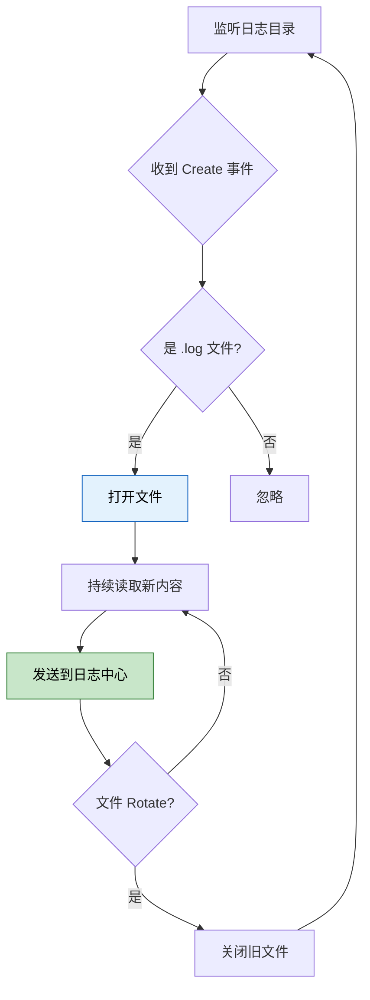

核心代码：

```go
package main

import (
    "bufio"
    "log"
    "os"
    "path/filepath"
    "strings"

    "github.com/fsnotify/fsnotify"
)

func watchLogDir(dir string) error {
    watcher, err := fsnotify.NewWatcher()
    if err != nil {
        return err
    }
    defer watcher.Close()

    // 递归添加目录监听
    filepath.Walk(dir, func(path string, info os.FileInfo, err error) error {
        if err == nil && info.IsDir() {
            watcher.Add(path)
        }
        return nil
    })

    // 记录正在采集的文件
    activeFiles := make(map[string]*bufio.Reader)

    for {
        select {
        case event, ok := <-watcher.Events:
            if !ok {
                return nil
            }

            switch {
            case event.Has(fsnotify.Create):
                // 新文件出现
                if strings.HasSuffix(event.Name, ".log") {
                    f, err := os.Open(event.Name)
                    if err != nil {
                        log.Printf("打开文件失败 %s: %v", event.Name, err)
                        continue
                    }
                    activeFiles[event.Name] = bufio.NewReader(f)
                    log.Printf("开始采集日志: %s", event.Name)

                    // 如果是目录，也要监听
                    if info, _ := os.Stat(event.Name); info != nil && info.IsDir() {
                        watcher.Add(event.Name)
                    }
                }

            case event.Has(fsnotify.Write):
                // 文件有新内容
                if reader, ok := activeFiles[event.Name]; ok {
                    for {
                        line, err := reader.ReadString('\n')
                        if err != nil {
                            break
                        }
                        // 处理日志行（这里简化为打印）
                        log.Printf("[日志] %s", strings.TrimSpace(line))
                    }
                }

            case event.Has(fsnotify.Remove), event.Has(fsnotify.Rename):
                // 文件被删除或 Rotate
                if _, ok := activeFiles[event.Name]; ok {
                    delete(activeFiles, event.Name)
                    log.Printf("停止采集日志: %s", event.Name)
                }
            }

        case err, ok := <-watcher.Errors:
            if !ok {
                return nil
            }
            log.Printf("监听错误: %v", err)
        }
    }
}

func main() {
    if err := watchLogDir("/var/log/myapp"); err != nil {
        log.Fatal(err)
    }
}
```

---

## 八、实战场景三：静态文件服务器自动刷新

开发前端时，修改了 CSS/JS 文件总得手动刷新浏览器？用 fsnotify 可以做一个简单的自动刷新通知：

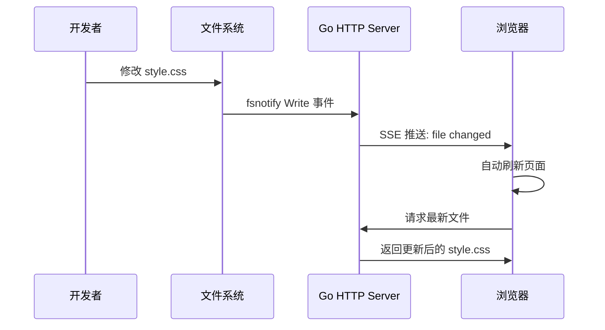

```go
package main

import (
    "log"
    "net/http"
    "path/filepath"

    "github.com/fsnotify/fsnotify"
)

var (
    clients []chan string
)

func watchStaticDir(dir string) {
    watcher, err := fsnotify.NewWatcher()
    if err != nil {
        log.Fatal(err)
    }
    defer watcher.Close()

    // 监听静态文件目录
    filepath.Walk(dir, func(path string, info os.FileInfo, err error) error {
        if err == nil && info.IsDir() {
            watcher.Add(path)
        }
        return nil
    })

    for {
        select {
        case event, ok := <-watcher.Events:
            if !ok {
                return
            }
            if event.Has(fsnotify.Write) || event.Has(fsnotify.Create) {
                // 通知所有连接的浏览器
                for _, ch := range clients {
                    ch <- event.Name
                }
            }
        case _, ok := <-watcher.Errors:
            if !ok {
                return
            }
        }
    }
}

func sseHandler(w http.ResponseWriter, r *http.Request) {
    flusher, ok := w.(http.Flusher)
    if !ok {
        http.Error(w, "不支持 SSE", http.StatusInternalServerError)
        return
    }

    w.Header().Set("Content-Type", "text/event-stream")
    w.Header().Set("Cache-Control", "no-cache")
    w.Header().Set("Connection", "keep-alive")

    ch := make(chan string, 1)
    clients = append(clients, ch)

    for {
        select {
        case filename := <-ch:
            log.Printf("通知浏览器: %s 已更新", filename)
            w.Write([]byte("data: " + filename + "\n\n"))
            flusher.Flush()
        case <-r.Context().Done():
            return
        }
    }
}

func main() {
    go watchStaticDir("./static")

    http.Handle("/", http.FileServer(http.Dir("./static")))
    http.HandleFunc("/events", sseHandler)

    log.Println("服务启动在 :8080")
    log.Fatal(http.ListenAndServe(":8080", nil))
}
```

前端页面加上一小段 JS：

```html
<script>
const es = new EventSource('/events');
es.onmessage = function(e) {
    console.log('文件变化:', e.data);
    location.reload();  // 自动刷新
};
</script>
```

这样每次修改静态文件，浏览器就会自动刷新——一个简易版的 LiveReload 就出来了。

---

## 九、NewBufferedWatcher：防止事件丢失

在高频写入场景下，`NewWatcher()` 的事件通道是无缓冲的。如果你的事件处理协程来不及消费，操作系统的内核缓冲区也可能溢出，导致事件丢失。

fsnotify 提供了 `NewBufferedWatcher(sz uint)`，给 Events 通道加上缓冲：

```go
// 无缓冲——消费慢时可能丢失事件
watcher, _ := fsnotify.NewWatcher()

// 带缓冲——给消费留出余地
watcher, _ := fsnotify.NewBufferedWatcher(1024)
```

**但要注意**：缓冲只是缓解，不是根治。如果你的消费速度持续跟不上生产速度，缓冲区迟早也会满。根本解决方案还是优化事件处理逻辑，或者减少监听范围。

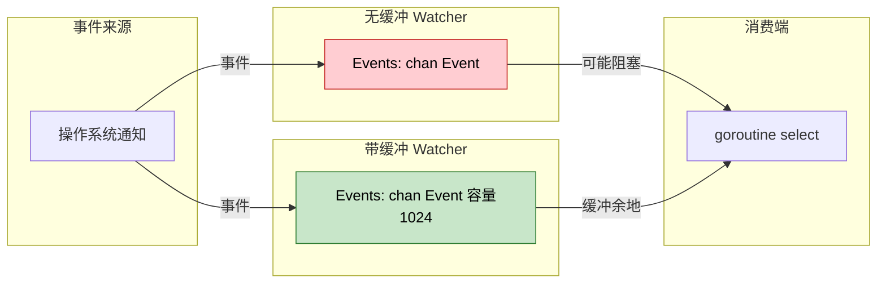

另外，Windows 平台还有一个特殊选项 `WithBufferSize`：

```go
// Windows 下增大系统缓冲区（默认 64KB）
watcher.Add(`C:\data`, fsnotify.WithBufferSize(65536*2))
```

这在 Windows 下监听大量文件时很有用。在其他平台上这个选项无效。

---

## 十、完整的最佳实践模板

把前面所有的经验整合在一起，给你一个可以直接用在生产环境的模板：

```go
package fswatch

import (
    "fmt"
    "log"
    "os"
    "path/filepath"
    "sync"
    "time"

    "github.com/fsnotify/fsnotify"
)

type FileWatcher struct {
    watcher   *fsnotify.Watcher
    mu        sync.Mutex
    watched   map[string]bool
    callbacks map[fsnotify.Op]func(path string)
    debounce  time.Duration
    done      chan struct{}
}

func NewFileWatcher(debounce time.Duration) (*FileWatcher, error) {
    watcher, err := fsnotify.NewBufferedWatcher(256)
    if err != nil {
        return nil, fmt.Errorf("创建 Watcher 失败: %w", err)
    }

    fw := &FileWatcher{
        watcher:   watcher,
        watched:   make(map[string]bool),
        callbacks: make(map[fsnotify.Op]func(path string)),
        debounce:  debounce,
        done:      make(chan struct{}),
    }

    go fw.loop()
    return fw, nil
}

// AddRecursive 递归添加目录监听
func (fw *FileWatcher) AddRecursive(root string) error {
    return filepath.Walk(root, func(path string, info os.FileInfo, err error) error {
        if err != nil {
            return err
        }
        if !info.IsDir() {
            return nil
        }
        fw.mu.Lock()
        if !fw.watched[path] {
            if err := fw.watcher.Add(path); err != nil {
                fw.mu.Unlock()
                return fmt.Errorf("监听 %s 失败: %w", path, err)
            }
            fw.watched[path] = true
        }
        fw.mu.Unlock()
        return nil
    })
}

// On 注册事件回调
func (fw *FileWatcher) On(op fsnotify.Op, callback func(path string)) {
    fw.callbacks[op] = callback
}

// Close 关闭监听器
func (fw *FileWatcher) Close() error {
    close(fw.done)
    return fw.watcher.Close()
}

func (fw *FileWatcher) loop() {
    // 防抖：相同文件的连续事件只处理最后一次
    timers := make(map[string]*time.Timer)

    for {
        select {
        case <-fw.done:
            return

        case event, ok := <-fw.watcher.Events:
            if !ok {
                return
            }

            // 忽略 Chmod 事件
            if event.Has(fsnotify.Chmod) {
                continue
            }

            // 新目录出现时动态添加监听
            if event.Has(fsnotify.Create) {
                if info, err := os.Stat(event.Name); err == nil && info.IsDir() {
                    fw.mu.Lock()
                    if !fw.watched[event.Name] {
                        fw.watcher.Add(event.Name)
                        fw.watched[event.Name] = true
                    }
                    fw.mu.Unlock()
                }
            }

            // 删除/重命名时移除监听
            if event.Has(fsnotify.Remove) || event.Has(fsnotify.Rename) {
                fw.mu.Lock()
                if fw.watched[event.Name] {
                    fw.watcher.Remove(event.Name)
                    delete(fw.watched, event.Name)
                }
                fw.mu.Unlock()
            }

            // 防抖处理
            if t, ok := timers[event.Name]; ok {
                t.Stop()
            }
            evt := event
            timers[event.Name] = time.AfterFunc(fw.debounce, func() {
                fw.dispatchEvent(evt)
                delete(timers, evt.Name)
            })

        case err, ok := <-fw.watcher.Errors:
            if !ok {
                return
            }
            log.Printf("[fsnotify] 错误: %v", err)
        }
    }
}

func (fw *FileWatcher) dispatchEvent(event fsnotify.Event) {
    for op, callback := range fw.callbacks {
        if event.Has(op) {
            callback(event.Name)
        }
    }
}
```

使用方式：

```go
func main() {
    fw, err := NewFileWatcher(300 * time.Millisecond)
    if err != nil {
        log.Fatal(err)
    }
    defer fw.Close()

    // 注册回调
    fw.On(fsnotify.Write, func(path string) {
        log.Printf("文件修改: %s", path)
    })
    fw.On(fsnotify.Create, func(path string) {
        log.Printf("文件创建: %s", path)
    })
    fw.On(fsnotify.Remove, func(path string) {
        log.Printf("文件删除: %s", path)
    })

    // 递归监听项目目录
    if err := fw.AddRecursive("./project"); err != nil {
        log.Fatal(err)
    }

    log.Println("文件监听已启动...")
    select {}
}
```

这个模板整合了：
- 递归目录监听 + 动态添加新子目录
- 防抖机制
- 忽略 Chmod 噪音
- 新目录自动监听
- 删除目录自动清理
- 回调式 API，业务代码更清爽

---

## 十一、平台差异速查表

fsnotify 虽然提供了跨平台的统一 API，但底层行为在不同系统上有所差异。开发跨平台应用时，这些差异你需要知道：

| 特性 | Linux | macOS / BSD | Windows | illumos |
|------|-------|-------------|---------|---------|
| 底层实现 | inotify | kqueue | ReadDirectoryChangesW | FEN |
| 默认监听上限 | 8192（可调） | 受 kern.maxfiles 限制 | 64KB 缓冲区 | 系统默认 |
| 资源消耗 | 每个监听占 1 watch | 每个监听占 1 fd | 缓冲区共享 | 系统默认 |
| Remove 事件时机 | 所有 fd 关闭后 | 即时 | 即时 | 即时 |
| 递归监听 | 需手动 | 需手动 | 需手动 | 需手动 |
| 网络文件系统 | 不支持 NFS | 不支持 NFS | 不支持 SMB | 不支持 |
| WithBufferSize | 无效 | 无效 | 有效 | 无效 |

**特别提醒**：

- Linux 上 `Remove` 事件可能会延迟：只有当所有打开该文件的文件描述符都关闭后，才会触发
- macOS 上每个监听都消耗一个文件描述符，监听大量文件时可能撞到 `kern.maxfiles` 上限
- Windows 上默认缓冲区 64KB，高频场景可能溢出，用 `WithBufferSize` 调大

---

## 十二、常见错误与排错

### 错误 1：ErrEventOverflow

```
fsnotify: queue or buffer overflow
```

**原因**：事件生产速度超过消费速度，内核或通道缓冲区溢出。

**解决**：
1. 用 `NewBufferedWatcher` 增大通道缓冲
2. Windows 下用 `WithBufferSize` 增大系统缓冲区
3. 优化事件处理逻辑，减少回调中的耗时操作

### 错误 2：监听突然失效，收不到任何事件

**常见原因**：

1. 编辑器原子保存导致对文件的监听丢失 → **改为监听目录**
2. 文件被移走后移回（某些编辑器的保存行为）→ **监听目录 + 处理 Create 事件**
3. 超出系统监听上限 → **调大 max_user_watches / maxfiles**
4. 通道阻塞导致 goroutine 卡死 → **检查 select 分支是否都能正常执行**

### 错误 3：too many open files

```
socket: too many open files
```

**原因**：macOS/BSD 上每个监听消耗一个文件描述符。

**解决**：

```bash
# 查看当前限制
ulimit -n

# 临时调大
ulimit -n 65535

# 永久生效（macOS）
sudo sysctl -w kern.maxfiles=65535
sudo sysctl -w kern.maxfilesperproc=65535
```

---

## 十三、fsnotify 生态：还有谁在用？

fsnotify 是 Go 生态中文件监听的事实标准，很多知名项目都依赖它：

- **Air** — Go 应用的热重载工具，监听源码变化自动编译重启
- **Hugo** — 静态网站生成器，开发模式下监听内容变化自动重建
- **Esbuild** — 超快 JS 打包器，watch 模式基于 fsnotify
- **Compose** — Docker Compose 的文件监听功能
- **各种配置热加载框架** — Viper、beego 等

如果你用过 `air` 或 `hugo server`，你就已经间接用过 fsnotify 了。

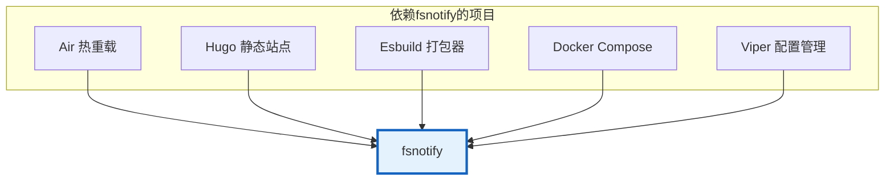

---

最后，用一张图回顾我们今天学到的所有内容：

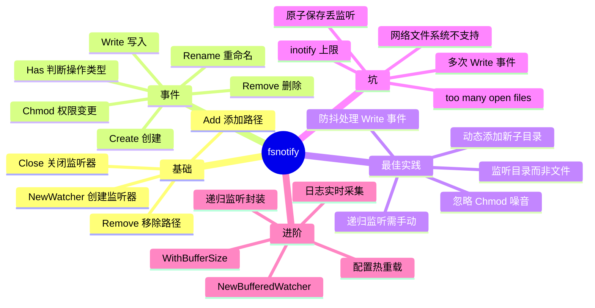

fsnotify 的 API 不多，但背后的细节不少。掌握了这些细节，你就能在实际项目中避坑省时，写出可靠的文件监听逻辑。

---