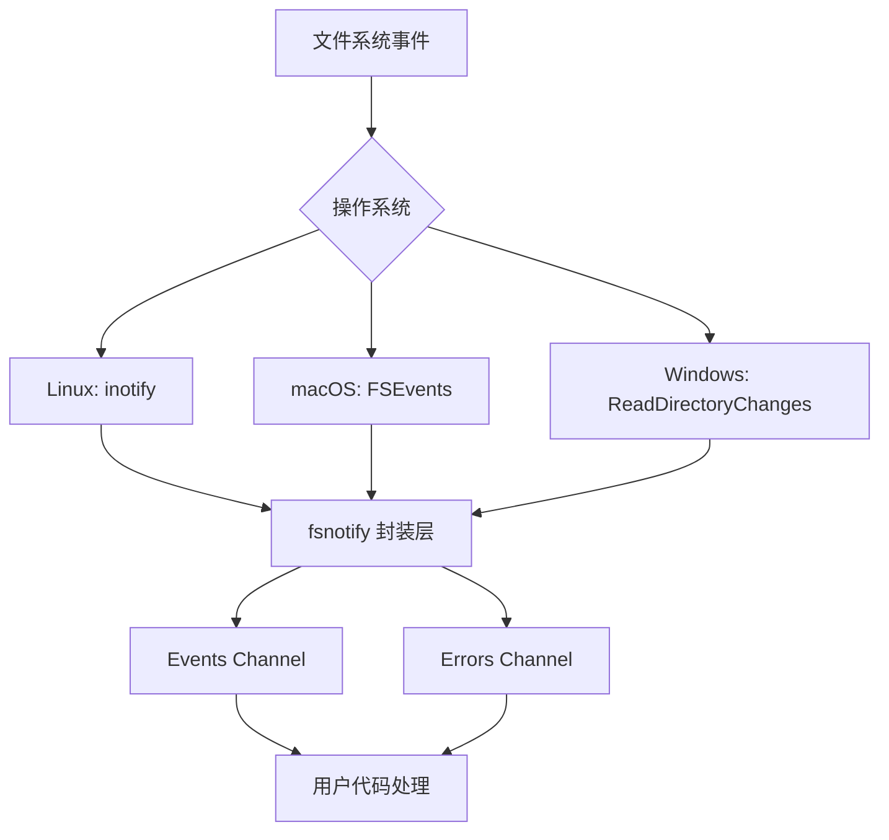

# Go 语言 fsnotify 库入门：一步步教你玩转文件监控

## 前言

你好，我是老朋友 CodeFarmer。

在日常开发中，你有没有遇到过这样的场景：

- 配置热更新：修改了配置文件后，程序能够自动重新加载，而不需要重启
- 文件同步：某个目录有新文件或文件被修改时，自动触发同步操作
- 实时构建：源代码文件发生变化时，自动触发重新编译
- 监控日志：日志文件有新的内容写入时，实时处理

这些场景都有一个共同的特点：**需要监听文件系统的变化**。

在 Go 语言中，如何优雅地实现文件监控呢？今天我要给你介绍的，就是 Go 语言中最流行的文件系统监控库——**fsnotify**。

这篇文章，我会用最通俗易懂的方式，一步步带你入门 fsnotify。不用担心内容太长，我会把每个概念都讲清楚，保证你看完就能上手使用。

---

## 第一章：初识 fsnotify

### 1.1 什么是 fsnotify？

fsnotify 是 Go 语言的一个跨平台文件系统监控库。它的核心功能是：**监控文件或目录的变化，然后把这些变化通知给你**。

你可以把它想象成一个"文件系统哨兵"，它会24小时不眠不休地盯住你指定的文件或目录，一旦有任何风吹草动，就会立刻跑过来告诉你："老板，文件有变化了！"

### 1.2 fsnotify 能监听到哪些变化？

fsnotify 可以监听以下几种文件系统事件：

| 事件类型 | 含义 | 实际场景 |
|---------|------|---------|
| Create | 创建 | 新建了一个文件 |
| Write | 写入 | 文件内容被修改 |
| Remove | 删除 | 文件被删除 |
| Rename | 重命名 | 文件被重命名 |
| Chmod | 权限改变 | 文件权限被修改 |

### 1.3 为什么选择 fsnotify？

在 Go 语言中，其实有多种方式可以实现文件监控：

1. **自己轮询**：用 time.Ticker 定期检查文件状态——简单但笨重
2. **系统原生 API**：Linux 的 inotify、macOS 的 FSEvents、Windows 的 ReadDirectoryChangesW——功能强大但跨平台写法差异大
3. **fsnotify 库**：封装了各平台原生 API，提供统一的 Go 语言接口——**推荐使用**

fsnotify 的优点：
- **跨平台**：一套代码，Windows、Linux、macOS 都能跑
- **API 简洁**：学习成本低，上手快
- **社区活跃**：Star 数高，持续维护

---

## 第二章：环境准备

### 2.1 安装 fsnotify

fsnotify 的安装非常简单，只需要一行 Go 命令：

```bash
go get github.com/fsnotify/fsnotify
```

如果你用的是 Go Modules（推荐），在你的项目目录下执行：

```bash
go mod init myproject
go get github.com/fsnotify/fsindex
```

> ⚠️ 注意：包名是 `github.com/fsnotify/fsnotify`，不是 `fsnotify` 哦！

### 2.2 导入 fsnotify

在你的 Go 代码中，这样导入：

```go
import (
    "github.com/fsnotify/fsnotify"
)
```

### 2.3 最低版本要求

fsnotify 对 Go 版本的最低要求是 **Go 1.17**。如果你还在用更老的版本，需要升级一下 Go 环境。

---

## 第三章：第一个示例：监控单个文件

让我们从最简单的例子开始：监控一个文件的变化。

### 3.1 完整代码

```go
package main

import (
    "fmt"
    "log"

    "github.com/fsnotify/fsnotify"
)

func main() {
    // 1. 创建一个监控器实例
    watcher, err := fsnotify.NewWatcher()
    if err != nil {
        log.Fatal("创建监控器失败:", err)
    }
    defer watcher.Close()

    // 2. 定义一个通道，用于接收事件
    done := make(chan bool)

    // 3. 启动一个 goroutine 处理事件
    go func() {
        for {
            select {
            case event, ok := <-watcher.Events:
                if !ok {
                    return
                }
                // 打印事件信息
                fmt.Printf("监听到事件: %s, 文件: %s\n", event.Op.String(), event.Name)
            case err, ok := <-watcher.Errors:
                if !ok {
                    return
                }
                log.Println("监控错误:", err)
            }
        }
    }()

    // 4. 添加要监控的文件（或目录）
    err = watcher.Add("/Users/junjunyi/test.txt")
    if err != nil {
        log.Fatal("添加监控失败:", err)
    }

    fmt.Println("开始监控文件: /Users/junjunyi/test.txt")
    fmt.Println("请尝试修改这个文件，然后查看输出")
    fmt.Println("按 Ctrl+C 退出")

    // 5. 等待
    <-done
}
```

### 3.2 运行效果

当你运行这个程序，然后尝试修改 `/Users/junjunyi/test.txt` 文件（比如用文本编辑器打开并保存），你会看到类似这样的输出：

```
开始监控文件: /Users/junjunyi/test.txt
请尝试修改这个文件，然后查看输出
按 Ctrl+C 退出
监听到事件: WRITE, 文件: /Users/junjunyi/test.txt
监听到事件: WRITE, 文件: /Users/junjunyi/test.txt
```

### 3.3 代码解析

让我一步步拆解这个程序：

```go
watcher, err := fsnotify.NewWatcher()
```

**第一步：创建监控器**。这就像雇佣了一个保安，需要先给他发一个工作证。

```go
err = watcher.Add("/Users/junjunyi/test.txt")
```

**第二步：指定监控目标**。告诉保安你要他盯住哪个文件。

```go
case event, ok := <-watcher.Events:
```

**第三步：接收事件**。这是核心部分。`watcher.Events` 是一个 channel，文件有任何变化时，事件就会从这个 channel 里流出来。

```go
event.Op.String()
```

**第四步：解析事件类型**。`event.Op` 是 fsnotify 的事件操作，它有这些可能值：
- `fsnotify.Create` - 创建
- `fsnotify.Write` - 写入
- `fsnotify.Remove` - 删除
- `fsnotify.Rename` - 重命名
- `fsnotify.Chmod` - 权限修改

---

## 第四章：进阶：监控整个目录

监控单个文件很实用，但更多时候，我们需要监控一个**目录**。比如监控整个配置目录，当目录下任何文件发生变化时都能感知到。

### 4.1 完整代码

```go
package main

import (
    "fmt"
    "log"

    "github.com/fsnotify/fsnotify"
)

func main() {
    watcher, err := fsnotify.NewWatcher()
    if err != nil {
        log.Fatal("创建监控器失败:", err)
    }
    defer watcher.Close()

    // 处理事件
    go func() {
        for {
            select {
            case event, ok := <-watcher.Events:
                if !ok {
                    return
                }
                // 判断事件类型并打印
                if event.Has(fsnotify.Create) {
                    fmt.Printf("📄 新建文件: %s\n", event.Name)
                }
                if event.Has(fsnotify.Write) {
                    fmt.Printf("✏️  修改文件: %s\n", event.Name)
                }
                if event.Has(fsnotify.Remove) {
                    fmt.Printf("🗑️  删除文件: %s\n", event.Name)
                }
                if event.Has(fsnotify.Rename) {
                    fmt.Printf("📝 重命名文件: %s\n", event.Name)
                }
                if event.Has(fsnotify.Chmod) {
                    fmt.Printf("🔐 修改权限: %s\n", event.Name)
                }
            case err, ok := <-watcher.Errors:
                if !ok {
                    return
                }
                log.Println("监控错误:", err)
            }
        }
    }()

    // 监控整个目录
    err = watcher.Add("/Users/junjunyi/config")
    if err != nil {
        log.Fatal("添加监控失败:", err)
    }

    fmt.Println("开始监控目录: /Users/junjunyi/config")
    fmt.Println("请在目录中创建、修改或删除文件...")
    fmt.Println("按 Ctrl+C 退出")

    // 阻塞主线程
    select {}
}
```

### 4.2 核心改进：使用 Has 方法

注意这里的新写法：

```go
if event.Has(fsnotify.Create) {
    fmt.Printf("📄 新建文件: %s\n", event.Name)
}
```

`event.Has()` 方法用于检查事件是否包含特定操作。这很有用，因为**一个事件可能包含多个操作**。

比如，当你把文件移动到另一个位置时，可能会同时触发 `Remove` 和 `Create` 事件。

### 4.3 事件可能组合的情况

```go
// 事件 Op 是一个位掩码，可以是多个操作的组合
event.Op & fsnotify.Write != 0  // 另一种检查方式
event.Op | fsnotify.Remove      // 组合多个操作
```

---

## 第五章：实战案例

光说不练假把式。接下来，我给你展示几个真实项目中常见的应用场景。

### 5.1 案例一：配置文件热更新

这是最经典的使用场景。想象你有一个服务器程序，运行时需要读取配置。通常修改配置后需要重启服务，但有了 fsnotify，我们可以实现**热更新**。

```go
package main

import (
    "fmt"
    "log"
    "os"
    "time"

    "github.com/fsnotify/fsnotify"
)

// 模拟配置结构
type Config struct {
    Port    int
    Host    string
    MaxConn int
}

var currentConfig *Config

func main() {
    watcher, err := fsnotify.NewWatcher()
    if err != nil {
        log.Fatal(err)
    }
    defer watcher.Close()

    // 加载初始配置
    reloadConfig("/Users/junjunyi/config/app.yaml")

    // 开始监控配置文件
    err = watcher.Add("/Users/junjunyi/config/app.yaml")
    if err != nil {
        log.Fatal(err)
    }

    // 启动一个 goroutine 处理事件
    go func() {
        for {
            select {
            case event, ok := <-watcher.Events:
                if !ok {
                    return
                }
                // 只关心写入事件
                if event.Has(fsnotify.Write) {
                    fmt.Println("检测到配置文件修改，尝试重新加载...")
                    
                    // 简单的防抖：等待文件写完
                    time.Sleep(100 * time.Millisecond)
                    
                    if err := reloadConfig(event.Name); err != nil {
                        fmt.Printf("重新加载配置失败: %v\n", err)
                    } else {
                        fmt.Println("配置已更新")
                        fmt.Printf("新配置: %+v\n", currentConfig)
                    }
                }
            case err, ok := <-watcher.Errors:
                if !ok {
                    return
                }
                log.Println("监控错误:", err)
            }
        }
    }()

    fmt.Println("服务运行中，监控配置文件变化...")
    fmt.Println("按 Ctrl+C 退出")
    select {}
}

// 模拟加载配置
func reloadConfig(path string) error {
    // 这里是读取配置的逻辑
    // 实际项目中可能是 yaml、json、toml 等格式
    currentConfig = &Config{
        Port:    8080,
        Host:    "localhost",
        MaxConn: 100,
    }
    return nil
}
```

**运行效果**：

```
服务运行中，监控配置文件变化...
按 Ctrl+C 退出
检测到配置文件修改，尝试重新加载...
配置已更新
新配置: {Port:8080 Host:localhost MaxConn:100}
```

**为什么要加 `time.Sleep(100 * time.Millisecond)`？**

这是为了处理**文件写入未完成**的情况。当你保存文件时，编辑器可能会分多次写入（先写入临时文件，再重命名）。如果没有这个延迟，可能会读到不完整的文件。

### 5.2 案例二：自动编译 Go 项目

这是另一个经典场景：监听 `.go` 文件变化，自动运行 `go build`。

```go
package main

import (
    "fmt"
    "log"
    "os/exec"
    "path/filepath"
    "strings"
    "time"

    "github.com/fsnotify/fsnotify"
)

func main() {
    watcher, err := fsnotify.NewWatcher()
    if err != nil {
        log.Fatal(err)
    }
    defer watcher.Close()

    // 监控当前目录及其子目录
    err = watcher.Add(".")
    if err != nil {
        log.Fatal(err)
    }

    var lastBuildTime time.Time
    
    // 处理事件
    go func() {
        for {
            select {
            case event, ok := <-watcher.Events:
                if !ok {
                    return
                }
                
                // 只关心 .go 文件
                if !strings.HasSuffix(event.Name, ".go") {
                    continue
                }
                
                // 忽略测试文件和生成文件
                if strings.HasSuffix(event.Name, "_test.go") {
                    continue
                }
                
                // 防抖：1秒内不重复构建
                if time.Since(lastBuildTime) < time.Second {
                    continue
                }
                
                // 过滤掉临时文件
                if filepath.Ext(event.Name) == "" {
                    continue
                }
                
                fmt.Printf("检测到 Go 文件变化: %s\n", event.Name)
                
                // 执行构建
                fmt.Println("开始构建...")
                build()
                lastBuildTime = time.Now()
                
            case err, ok := <-watcher.Errors:
                if !ok {
                    return
                }
                log.Println("监控错误:", err)
            }
        }
    }()

    fmt.Println("监听 .go 文件变化，自动编译...")
    fmt.Println("按 Ctrl+C 退出")
    select {}
}

func build() {
    cmd := exec.Command("go", "build", "-o", "app", ".")
    output, err := cmd.CombinedOutput()
    if err != nil {
        fmt.Printf("构建失败: %v\n%s\n", err, output)
        return
    }
    fmt.Println("构建成功!")
}
```

### 5.3 案例三：文件同步服务

监听一个目录，将变化同步到另一个目录。

```go
package main

import (
    "fmt"
    "io"
    "log"
    "os"
    "path/filepath"

    "github.com/fsnotify/fsnotify"
)

func main() {
    srcDir := "/Users/junjunyi/source"
    dstDir := "/Users/junjunyi/destination"

    // 确保目标目录存在
    os.MkdirAll(dstDir, 0755)

    watcher, err := fsnotify.NewWatcher()
    if err != nil {
        log.Fatal(err)
    }
    defer watcher.Close()

    // 监控源目录
    err = watcher.Add(srcDir)
    if err != nil {
        log.Fatal(err)
    }

    go func() {
        for {
            select {
            case event, ok := <-watcher.Events:
                if !ok {
                    return
                }

                // 计算目标文件路径
                relPath, err := filepath.Rel(srcDir, event.Name)
                if err != nil {
                    continue
                }
                dstPath := filepath.Join(dstDir, relPath)

                switch {
                case event.Has(fsnotify.Create):
                    // 文件创建：复制到目标目录
                    fmt.Printf("复制文件: %s -> %s\n", event.Name, dstPath)
                    copyFile(event.Name, dstPath)

                case event.Has(fsnotify.Write):
                    // 文件修改：重新复制
                    fmt.Printf("更新文件: %s -> %s\n", event.Name, dstPath)
                    copyFile(event.Name, dstPath)

                case event.Has(fsnotify.Remove):
                    // 文件删除：删除目标文件
                    fmt.Printf("删除文件: %s\n", dstPath)
                    os.RemoveAll(dstPath)

                case event.Has(fsnotify.Rename):
                    // 重命名：移动目标文件
                    fmt.Printf("重命名: %s -> %s\n", event.Name, dstPath)
                    os.Rename(dstPath, dstPath+".bak") // 简化处理
                }

            case err, ok := <-watcher.Errors:
                if !ok {
                    return
                }
                log.Println("错误:", err)
            }
        }
    }()

    fmt.Println("文件同步服务运行中...")
    fmt.Printf("源目录: %s\n", srcDir)
    fmt.Printf("目标目录: %s\n", dstDir)
    fmt.Println("按 Ctrl+C 退出")
    select {}
}

func copyFile(src, dst string) error {
    // 确保目标目录存在
    dstDir := filepath.Dir(dst)
    os.MkdirAll(dstDir, 0755)

    // 打开源文件
    srcFile, err := os.Open(src)
    if err != nil {
        return err
    }
    defer srcFile.Close()

    // 创建目标文件
    dstFile, err := os.Create(dst)
    if err != nil {
        return err
    }
    defer dstFile.Close()

    // 复制内容
    _, err = io.Copy(dstFile, srcFile)
    return err
}
```

---

## 第六章：高级技巧

### 6.1 递归监控子目录

上面的例子只监控了指定目录，不会监控子目录。如果你想监控整个目录树（包括子目录），有几种方案：

**方案一：手动递归添加**

```go
func watchDir(watcher *fsnotify.Watcher, dir string) error {
    return filepath.Walk(dir, func(path string, info os.FileInfo, err error) error {
        if err != nil {
            return err
        }
        if info.IsDir() {
            return watcher.Add(path)
        }
        return nil
    })
}
```

**方案二：监听 Create 事件，动态添加新目录**

```go
go func() {
    for {
        select {
        case event, ok := <-watcher.Events:
            if !ok {
                return
            }
            // 如果创建了新目录，添加到监控
            if event.Has(fsnotify.Create) {
                info, err := os.Stat(event.Name)
                if err == nil && info.IsDir() {
                    fmt.Printf("发现新目录，添加到监控: %s\n", event.Name)
                    watcher.Add(event.Name)
                }
            }
        // ...
        }
    }
}()
```

### 6.2 防抖处理

文件监控可能会收到大量事件（比如你用编辑器保存时）。为了避免处理过于频繁，可以使用**防抖（Debounce）**技术：

```go
type Debouncer struct {
    timer    *time.Timer
    duration time.Duration
    callback func()
}

func NewDebouncer(duration time.Duration, callback func()) *Debouncer {
    return &Debouncer{
        duration: duration,
        callback: callback,
    }
}

func (d *Debouncer) Trigger() {
    if d.timer != nil {
        d.timer.Stop()
    }
    d.timer = time.AfterFunc(d.duration, d.callback)
}

// 使用示例
debouncer := NewDebouncer(300*time.Millisecond, func() {
    fmt.Println("执行实际处理...")
})

go func() {
    for {
        select {
        case event, ok := <-watcher.Events:
            if !ok {
                return
            }
            // 收到事件后，300ms 内没有新事件才处理
            debouncer.Trigger()
        // ...
        }
    }
}()
```

### 6.3 同时监控多个路径

一个 watcher 可以同时监控多个路径：

```go
watcher, _ := fsnotify.NewWatcher()
watcher.Add("/path/to/config")
watcher.Add("/path/to/logs")
watcher.Add("/path/to/data")
```

### 6.4 错误处理最佳实践

fsnotify 的错误处理有几个要点：

1. **永远不要忽略 watcher.Errors channel**

```go
// ❌ 错误做法
go func() {
    for event := range watcher.Events {
        // 处理事件
    }
}()

// ✅ 正确做法
go func() {
    for {
        select {
        case event, ok := <-watcher.Events:
            if !ok {
                return
            }
            // 处理事件
        case err, ok := <-watcher.Errors:
            if !ok {
                return
            }
            log.Println("监控错误:", err)  // 一定要处理错误
        }
    }
}()
```

2. **监控失败时要有后备方案**

```go
err = watcher.Add("/some/path")
if err != nil {
    // 可以尝试轮询作为后备方案
    go pollFile("/some/path")
}
```

---

## 第七章：原理浅析

如果你对 fsnotify 的实现原理感兴趣，这里有个简要的介绍。

### 7.1 各平台底层实现

fsnotify 之所以能跨平台，是因为它封装了各操作系统的原生文件监控 API：

| 操作系统 | 底层 API | 特点 |
|---------|---------|------|
| Linux | inotify | 高效，资源占用少 |
| macOS | FSEvents | 苹果官方推荐，性能好 |
| Windows | ReadDirectoryChangesW | Windows 原生机制 |
| BSD | kqueue | BSD 系列通用 |

### 7.2 工作原理图示



### 7.3 性能特点

- **资源占用低**：基于事件通知，不需要轮询
- **实时性好**：事件几乎是即时触发的
- **跨平台**：统一 API，不同平台透明切换

---

## 第八章：常见问题与解决方案

### 8.1 为什么收不到事件？

**问题**：创建了 watcher，添加了监控，但文件变化时收不到事件。

**可能原因**：

1. **路径不存在**
   ```go
   // 检查路径是否存在
   if _, err := os.Stat(path); os.IsNotExist(err) {
       log.Fatal("路径不存在:", path)
   }
   ```

2. **没有足够的权限**
   ```bash
   # Linux 下可能需要更高权限
   sudo ./your-program
   ```

3. **在容器中运行**
   某些容器环境可能不支持 inotify，需要配置：

   ```bash
   # 增加 inotify 限制
   echo 65536 | sudo tee /proc/sys/fs/inotify/max_user_watches
   ```

### 8.2 事件重复触发

**问题**：修改一次文件，收到多个相同事件。

**解决方案**：使用前面提到的防抖技术，或者判断事件间隔：

```go
// 简单防抖
time.Sleep(50 * time.Millisecond)
```

### 8.3 监控大目录很慢

**问题**：监控包含大量文件的目录时，性能很差。

**解决方案**：
- 只监控需要的子目录
- 使用 `.gitignore` 类似的过滤规则
- 考虑使用更细粒度的监控

### 8.4 在 Windows 上路径问题

**问题**：Windows 路径分隔符不同。

**解决方案**：使用 `filepath` 包而不是手动拼接路径：

```go
// ❌ 错误
path := "/tmp" + "/" + filename

// ✅ 正确
path := filepath.Join("/tmp", filename)
```

---

好了，今天我们一起学习了 Go 语言 fsnotify 库的全部内容。让我来回顾一下今天学到的知识点：

### 核心知识点

1. **fsnotify 是什么**：Go 语言的跨平台文件系统监控库
2. **如何安装**：`go get github.com/fsnotify/fsnotify`
3. **基本用法**：创建 watcher → 添加监控路径 → 读取 Events channel
4. **事件类型**：Create、Write、Remove、Rename、Chmod
5. **进阶技巧**：防抖、递归监控、多路径监控

### 实战场景

- 配置文件热更新
- 自动编译工具
- 文件同步服务
- 实时日志处理

### 最佳实践

- 永远处理 Errors channel
- 使用防抖处理频繁事件
- 路径使用 filepath 包处理
- 做好权限检查

fsnotify 是一个非常实用的库，掌握它可以让你的程序更加智能和灵活。希望这篇文章能帮你快速上手！

---
