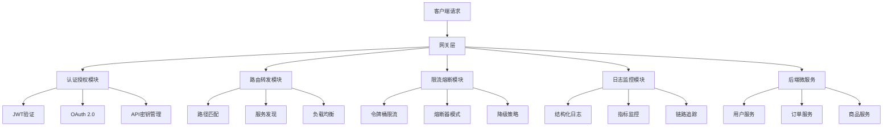
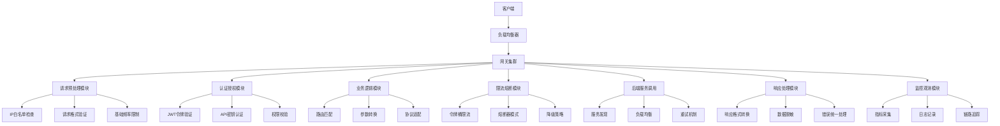

# Golang网关技术深度解析：从基础反向代理到高性能API网关

## 前言

在现代微服务架构中，网关（Gateway）作为系统流量的统一入口，承载着路由转发、安全防护、负载均衡、监控观测等关键职责。Go语言凭借其卓越的性能和并发能力，已成为构建高性能网关系统的首选语言。本文将从Go标准库的基础组件出发，逐步深入探讨如何构建企业级的Golang网关系统。

## 一、网关基础与架构设计

### 1.1 网关的核心职责与现代架构定位



### 1.2 Golang网关的技术栈选择

#### 标准库组件
- `net/http/httputil.ReverseProxy` - 核心反向代理
- `net/http` - HTTP服务与处理
- `context` - 请求上下文管理
- `sync` - 并发安全控制

#### 常用框架与库
- **go-zero** - 字节跳动开源的一站式REST开发框架
- **gin-gonic/gin** - 高性能HTTP框架
- **grpc-gateway** - gRPC到HTTP的协议转换
- **traefik** - 云原生边缘路由器

## 二、基于标准库的基础网关实现

### 2.1 最简单的反向代理示例

```go
package main

import (
    "fmt"
    "log"
    "net/http"
    "net/http/httputil"
    "net/url"
)

// 基础反向代理实现
func simpleReverseProxy() {
    // 目标服务URL
    target, err := url.Parse("http://localhost:8081")
    if err != nil {
        log.Fatal(err)
    }
    
    // 创建反向代理
    proxy := httputil.NewSingleHostReverseProxy(target)
    
    // 自定义代理行为（Go 1.26推荐方式）
    proxy.Rewrite = func(r *httputil.ProxyRequest) {
        r.SetXForwarded()
        r.SetURL(target)
        r.Out.Header.Set("X-Proxy", "go-gateway")
    }
    
    // 启动代理服务器
    http.Handle("/", proxy)
    log.Println("Starting proxy server on :8080")
    log.Fatal(http.ListenAndServe(":8080", nil))
}

// 更完整的基础网关实现
type SimpleGateway struct {
    proxies map[string]*httputil.ReverseProxy
    mu      sync.RWMutex
}

func NewSimpleGateway() *SimpleGateway {
    return &SimpleGateway{
        proxies: make(map[string]*httputil.ReverseProxy),
    }
}

// 添加路由规则
func (sg *SimpleGateway) AddRoute(path string, targetURL string) error {
    target, err := url.Parse(targetURL)
    if err != nil {
        return fmt.Errorf("invalid target URL: %w", err)
    }
    
    proxy := httputil.NewSingleHostReverseProxy(target)
    
    // Go 1.26安全配置
    proxy.Rewrite = func(r *httputil.ProxyRequest) {
        r.SetXForwarded()
        r.SetURL(target)
        
        // 添加网关标识
        r.Out.Header.Set("X-Gateway", "SimpleGateway")
        r.Out.Header.Set("X-Gateway-Version", "1.0")
        
        // 记录原始请求路径
        r.Out.Header.Set("X-Original-Path", r.In.URL.Path)
    }
    
    sg.mu.Lock()
    sg.proxies[path] = proxy
    sg.mu.Unlock()
    
    return nil
}

// HTTP请求处理
func (sg *SimpleGateway) ServeHTTP(w http.ResponseWriter, r *http.Request) {
    // 查找匹配的代理
    sg.mu.RLock()
    proxy, exists := sg.proxies[r.URL.Path]
    sg.mu.RUnlock()
    
    if !exists {
        http.NotFound(w, r)
        return
    }
    
    // 记录请求开始时间
    start := time.Now()
    
    // 执行代理
    proxy.ServeHTTP(w, r)
    
    // 记录请求耗时
    duration := time.Since(start)
    log.Printf("Request %s %s completed in %v", r.Method, r.URL.Path, duration)
}

func main() {
    gateway := NewSimpleGateway()
    
    // 配置路由规则
    routes := map[string]string{
        "/api/users":    "http://localhost:8001",
        "/api/orders":   "http://localhost:8002", 
        "/api/products": "http://localhost:8003",
    }
    
    for path, target := range routes {
        if err := gateway.AddRoute(path, target); err != nil {
            log.Printf("Failed to add route %s: %v", path, err)
        }
    }
    
    // 启动网关服务
    log.Println("Starting SimpleGateway on :8080")
    log.Fatal(http.ListenAndServe(":8080", gateway))
}
```

### 2.2 Go 1.26的新特性：Rewrite vs Director

```go
// Go 1.26推荐的Rewrite方式（安全且功能更强）
func setupModernProxy() *httputil.ReverseProxy {
    proxy := &httputil.ReverseProxy{}
    
    proxy.Rewrite = func(r *httputil.ProxyRequest) {
        // 1. 设置目标URL
        target, _ := url.Parse("http://backend-service:8080")
        r.SetURL(target)
        
        // 2. 自动设置X-Forwarded-*头
        r.SetXForwarded()
        
        // 3. 修改请求路径（路径重写）
        if strings.HasPrefix(r.In.URL.Path, "/api/v1/") {
            // 去掉版本前缀
            r.Out.URL.Path = strings.TrimPrefix(r.In.URL.Path, "/api/v1")
        }
        
        // 4. 添加自定义头部
        r.Out.Header.Set("X-Proxy-Server", "go-gateway-v2")
        r.Out.Header.Set("X-Request-ID", generateRequestID())
        
        // 5. 认证信息传递（如果存在）
        if auth := r.In.Header.Get("Authorization"); auth != "" {
            r.Out.Header.Set("Authorization", auth)
        }
    }
    
    // 错误处理回调
    proxy.ErrorHandler = func(w http.ResponseWriter, r *http.Request, err error) {
        log.Printf("Proxy error: %v", err)
        http.Error(w, "Gateway error", http.StatusBadGateway)
    }
    
    return proxy
}

// 传统的Director方式（已废弃，了解即可）
func setupLegacyProxy() *httputil.ReverseProxy {
    target, _ := url.Parse("http://backend-service:8080")
    
    return &httputil.ReverseProxy{
        Director: func(req *http.Request) {
            req.URL.Scheme = target.Scheme
            req.URL.Host = target.Host
            req.URL.Path = target.Path
            req.Header.Set("X-Forwarded-Host", req.Header.Get("Host"))
            req.Host = target.Host
        },
    }
}
```

## 三、企业级API网关架构设计与实现

### 3.1 完整网关架构设计



### 3.2 核心网关实现结构

```go
package gateway

import (
    "context"
    "encoding/json"
    "fmt"
    "log"
    "net"
    "net/http"
    "net/http/httputil"
    "net/url"
    "regexp"
    "strings"
    "sync"
    "time"
    
    "github.com/gin-gonic/gin"
)

// 网关配置结构
type GatewayConfig struct {
    Addr         string            `json:"addr"`
    Routes       []RouteConfig     `json:"routes"`
    RateLimit    RateLimitConfig   `json:"rate_limit"`
    Auth         AuthConfig        `json:"auth"`
    Logging      LoggingConfig     `json:"logging"`
    HealthCheck  HealthCheckConfig `json:"health_check"`
}

// 路由配置
type RouteConfig struct {
    Path        string   `json:"path"`
    Methods     []string `json:"methods"`
    Target      string   `json:"target"`
    StripPrefix bool     `json:"strip_prefix"`
    RateLimit   int      `json:"rate_limit"`
    RequiresAuth bool    `json:"requires_auth"`
}

// 企业级网关主结构
type APIGateway struct {
    config      *GatewayConfig
    router      *gin.Engine
    proxies     map[string]*httputil.ReverseProxy
    rateLimiters map[string]*RateLimiter
    authManager *AuthManager
    healthChecker *HealthChecker
    mu          sync.RWMutex
    
    // 统计信息
    metrics     *GatewayMetrics
}

// 创建新的API网关
func NewAPIGateway(config *GatewayConfig) (*APIGateway, error) {
    gateway := &APIGateway{
        config:      config,
        proxies:     make(map[string]*httputil.ReverseProxy),
        rateLimiters: make(map[string]*RateLimiter),
        metrics:     NewGatewayMetrics(),
    }
    
    // 初始化认证管理器
    gateway.authManager = NewAuthManager(config.Auth)
    
    // 初始化健康检查器
    gateway.healthChecker = NewHealthChecker(config.HealthCheck)
    
    // 设置Gin路由
    gateway.setupRouter()
    
    // 初始化路由和代理
    if err := gateway.setupRoutes(); err != nil {
        return nil, err
    }
    
    return gateway, nil
}

// 设置HTTP路由
func (g *APIGateway) setupRouter() {
    if g.config.Logging.Enable {
        gin.SetMode(gin.ReleaseMode)
    } else {
        gin.SetMode(gin.DebugMode)
    }
    
    g.router = gin.New()
    
    // 全局中间件
    g.router.Use(g.recoveryMiddleware())     // 恢复panic
    g.router.Use(g.loggingMiddleware())      // 访问日志
    g.router.Use(g.metricsMiddleware())      // 指标收集
    g.router.Use(g.corsMiddleware())         // 跨域支持
    
    // 健康检查端点
    g.router.GET("/health", g.healthCheckHandler)
    g.router.GET("/metrics", g.metricsHandler)
    
    // 管理接口
    admin := g.router.Group("/admin")
    admin.Use(g.adminAuthMiddleware())
    {
        admin.GET("/routes", g.listRoutesHandler)
        admin.POST("/reload", g.reloadConfigHandler)
        admin.GET("/status", g.gatewayStatusHandler)
    }
}

// 设置业务路由
func (g *APIGateway) setupRoutes() error {
    for _, route := range g.config.Routes {
        // 创建反向代理
        proxy, err := g.createProxy(route)
        if err != nil {
            return fmt.Errorf("failed to create proxy for route %s: %w", route.Path, err)
        }
        
        g.mu.Lock()
        g.proxies[route.Path] = proxy
        
        // 初始化限流器
        if route.RateLimit > 0 {
            g.rateLimiters[route.Path] = NewRateLimiter(route.RateLimit)
        }
        g.mu.Unlock()
        
        // 注册HTTP处理器
        g.registerRouteHandler(route, proxy)
    }
    
    return nil
}

// 创建反向代理
func (g *APIGateway) createProxy(route RouteConfig) (*httputil.ReverseProxy, error) {
    target, err := url.Parse(route.Target)
    if err != nil {
        return nil, err
    }
    
    proxy := &httputil.ReverseProxy{}
    
    proxy.Rewrite = func(r *httputil.ProxyRequest) {
        // 设置目标URL
        r.SetURL(target)
        
        // 自动设置转发头
        r.SetXForwarded()
        
        // 路径重写
        if route.StripPrefix {
            r.Out.URL.Path = strings.TrimPrefix(r.In.URL.Path, route.Path)
        }
        
        // 添加网关标识
        r.Out.Header.Set("X-API-Gateway", "GoAPIGateway")
        r.Out.Header.Set("X-Request-ID", generateRequestID())
        
        // 传递认证信息（如果配置了认证）
        if route.RequiresAuth {
            if userID, ok := r.In.Context().Value("user_id").(string); ok {
                r.Out.Header.Set("X-User-ID", userID)
            }
        }
    }
    
    // 修改响应
    proxy.ModifyResponse = func(resp *http.Response) error {
        // 添加响应头
        resp.Header.Set("X-Processed-By", "GoAPIGateway")
        resp.Header.Set("X-Response-Time", time.Now().Format(time.RFC3339))
        
        // 记录响应指标
        g.metrics.RecordResponse(resp.StatusCode)
        
        return nil
    }
    
    // 错误处理
    proxy.ErrorHandler = func(w http.ResponseWriter, r *http.Request, err error) {
        log.Printf("Proxy error for route %s: %v", route.Path, err)
        
        // 记录错误指标
        g.metrics.RecordError()
        
        // 返回标准的错误响应
        w.Header().Set("Content-Type", "application/json")
        w.WriteHeader(http.StatusBadGateway)
        
        errorResponse := map[string]interface{}{
            "error":   "Gateway Error",
            "message": "Service temporarily unavailable",
            "code":    "GATEWAY_ERROR",
        }
        
        json.NewEncoder(w).Encode(errorResponse)
    }
    
    return proxy, nil
}

// 注册路由处理器
func (g *APIGateway) registerRouteHandler(route RouteConfig, proxy *httputil.ReverseProxy) {
    handler := g.createRouteHandler(route, proxy)
    
    // 根据配置的方法注册路由
    for _, method := range route.Methods {
        switch strings.ToUpper(method) {
        case "GET":
            g.router.GET(route.Path, handler)
        case "POST":
            g.router.POST(route.Path, handler)  
        case "PUT":
            g.router.PUT(route.Path, handler)
        case "DELETE":
            g.router.DELETE(route.Path, handler)
        case "PATCH":
            g.router.PATCH(route.Path, handler)
        case "OPTIONS":
            g.router.OPTIONS(route.Path, handler)
        case "HEAD":
            g.router.HEAD(route.Path, handler)
        default:
            // 支持所有方法的通配路由
            g.router.Any(route.Path, handler)
        }
    }
}

// 创建路由处理器链
func (g *APIGateway) createRouteHandler(route RouteConfig, proxy *httputil.ReverseProxy) gin.HandlerFunc {
    return func(c *gin.Context) {
        // 1. 限流检查
        if limiter, exists := g.rateLimiters[route.Path]; exists {
            if !limiter.Allow() {
                c.JSON(http.StatusTooManyRequests, gin.H{
                    "error": "Rate limit exceeded",
                })
                return
            }
        }
        
        // 2. 认证检查
        if route.RequiresAuth {
            if !g.authManager.Authenticate(c.Request) {
                c.JSON(http.StatusUnauthorized, gin.H{
                    "error": "Authentication required",
                })
                return
            }
            
            // 将用户信息存入上下文
            userInfo := g.authManager.GetUserInfo(c.Request)
            ctx := context.WithValue(c.Request.Context(), "user_info", userInfo)
            c.Request = c.Request.WithContext(ctx)
        }
        
        // 3. 记录请求开始
        startTime := time.Now()
        
        // 4. 执行代理
        proxy.ServeHTTP(c.Writer, c.Request)
        
        // 5. 记录请求完成
        duration := time.Since(startTime)
        g.metrics.RecordRequestDuration(duration)
        
        log.Printf("Processed request %s %s in %v", 
            c.Request.Method, c.Request.URL.Path, duration)
    }
}

// 启动网关服务
func (g *APIGateway) Start() error {
    log.Printf("Starting API Gateway on %s", g.config.Addr)
    
    // 启动健康检查
    go g.healthChecker.Start()
    
    // 启动HTTP服务
    server := &http.Server{
        Addr:         g.config.Addr,
        Handler:      g.router,
        ReadTimeout:  30 * time.Second,
        WriteTimeout: 30 * time.Second,
        IdleTimeout:  120 * time.Second,
    }
    
    return server.ListenAndServe()
}

// 优雅关闭
func (g *APIGateway) Shutdown(ctx context.Context) error {
    log.Println("Shutting down API Gateway...")
    
    // 停止健康检查
    g.healthChecker.Stop()
    
    // 这里可以添加其他清理逻辑
    return nil
}
```

### 3.3 中间件实现详解

```go
// 认证中间件实现
type AuthManager struct {
    config AuthConfig
    jwtSecret string
}

func NewAuthManager(config AuthConfig) *AuthManager {
    return &AuthManager{
        config: config,
        jwtSecret: config.JWTSecret,
    }
}

func (am *AuthManager) Authenticate(r *http.Request) bool {
    // JWT令牌验证
    authHeader := r.Header.Get("Authorization")
    if authHeader == "" {
        return false
    }
    
    // Bearer token格式验证
    parts := strings.Split(authHeader, " ")
    if len(parts) != 2 || parts[0] != "Bearer" {
        return false
    }
    
    token := parts[1]
    return am.validateJWT(token)
}

func (am *AuthManager) validateJWT(token string) bool {
    // 实际的JWT验证逻辑
    // 这里使用github.com/golang-jwt/jwt库
    return true // 简化实现
}

func (am *AuthManager) GetUserInfo(r *http.Request) map[string]interface{} {
    // 从JWT令牌中提取用户信息
    return map[string]interface{}{
        "user_id": "12345",
        "username": "john_doe",
        "roles": []string{"user"},
    }
}

// 限流器实现
type RateLimiter struct {
    rate     int           // 每秒允许的请求数
    tokens   chan struct{} // 令牌桶
    mu       sync.Mutex
}

func NewRateLimiter(rate int) *RateLimiter {
    limiter := &RateLimiter{
        rate:   rate,
        tokens: make(chan struct{}, rate),
    }
    
    // 初始化令牌桶
    for i := 0; i < rate; i++ {
        limiter.tokens <- struct{}{}
    }
    
    // 启动令牌补充goroutine
    go limiter.refillTokens()
    
    return limiter
}

func (rl *RateLimiter) Allow() bool {
    select {
    case <-rl.tokens:
        return true
    default:
        return false
    }
}

func (rl *RateLimiter) refillTokens() {
    ticker := time.NewTicker(time.Second)
    defer ticker.Stop()
    
    for range ticker.C {
        rl.mu.Lock()
        currentTokens := len(rl.tokens)
        if currentTokens < rl.rate {
            // 补充缺失的令牌
            for i := 0; i < rl.rate-currentTokens; i++ {
                select {
                case rl.tokens <- struct{}{}:
                default:
                    break
                }
            }
        }
        rl.mu.Unlock()
    }
}

// CORS中间件
func (g *APIGateway) corsMiddleware() gin.HandlerFunc {
    return func(c *gin.Context) {
        c.Header("Access-Control-Allow-Origin", "*")
        c.Header("Access-Control-Allow-Methods", "GET, POST, PUT, DELETE, OPTIONS")
        c.Header("Access-Control-Allow-Headers", "Content-Type, Authorization, X-Requested-With")
        c.Header("Access-Control-Max-Age", "86400")
        
        if c.Request.Method == "OPTIONS" {
            c.AbortWithStatus(http.StatusNoContent)
            return
        }
        
        c.Next()
    }
}
```


---

# Golang网关技术深度解析：第四部分（生产部署与安全防护）
## 九、Docker容器化深度部署
### 9.1 多阶段构建优化方案
```dockerfile
# 构建阶段
FROM golang:1.21-alpine AS builder
# 安装构建依赖
RUN apk add --no-cache git ca-certificates tzdata
# 创建构建目录
WORKDIR /app
# 下载依赖（利用Docker缓存）
COPY go.mod go.sum ./
RUN go mod download
# 复制源码
COPY . .
# 设置构建参数（减少二进制大小）
ENV CGO_ENABLED=0 GOOS=linux
# 构建可执行文件
RUN go build -ldflags='-w -s -extldflags "-static"' -o gateway cmd/gateway/main.go
# 运行阶段
FROM alpine:3.18 AS runner
# 安装运行时依赖
RUN apk add --no-cache ca-certificates tzdata \
    && addgroup -S gateway && adduser -S gateway -G gateway
# 复制时区信息
COPY --from=builder /usr/share/zoneinfo /usr/share/zoneinfo
# 复制SSL证书（可根据需要添加）
# COPY --from=builder /etc/ssl/certs/ca-certificates.crt /etc/ssl/certs/
# 复制可执行文件
COPY --from=builder /app/gateway /app/gateway
# 设置工作目录和用户
WORKDIR /app
USER gateway
# 健康检查
HEALTHCHECK --interval=30s --timeout=10s --start-period=60s --retries=3 \
    CMD ["/app/gateway", "health"]
# 暴露端口
EXPOSE 8080 8443
# 启动命令
CMD ["/app/gateway", "start"]
### 9.2 Kubernetes部署架构设计
    A[用户请求] --> B[LoadBalancer]
    B --> C[Ingress Controller]
    C --> D[API Gateway Service]
    D --> E[API Gateway Pods]
    E --> E1[网关实例1]
    E --> E2[网关实例2]
    E --> E3[网关实例3]
    E1 --> F[后端服务集群]
    E2 --> F
    E3 --> F
    G[配置中心] --> E
    H[服务发现] --> E
    I[监控系统] --> E
    J[HPA] --> E
    K[PDB] --> E
    F --> F1[业务服务1]
    F --> F2[业务服务2]
    F --> F3[业务服务3]
### 9.3 Kubernetes资源配置完整实现
```yaml
# api-gateway-deployment.yaml
apiVersion: apps/v1
kind: Deployment
metadata:
  name: api-gateway
  namespace: gateway
  labels:
    app: api-gateway
    version: v1.0.0
spec:
  replicas: 3
  strategy:
    type: RollingUpdate
    rollingUpdate:
      maxSurge: 1
      maxUnavailable: 1
  selector:
    matchLabels:
      app: api-gateway
  template:
    metadata:
      labels:
        app: api-gateway
        version: v1.0.0
      annotations:
        prometheus.io/scrape: "true"
        prometheus.io/port: "8080"
        prometheus.io/path: "/metrics"
    spec:
      # 亲和性配置
      affinity:
        podAntiAffinity:
          preferredDuringSchedulingIgnoredDuringExecution:
          - weight: 100
            podAffinityTerm:
              labelSelector:
                matchExpressions:
                - key: app
                  operator: In
                  values:
                  - api-gateway
              topologyKey: kubernetes.io/hostname
      containers:
      - name: api-gateway
        image: registry.example.com/api-gateway:v1.0.0
        imagePullPolicy: IfNotPresent
        # 资源限制
        resources:
          requests:
            memory: "128Mi"
            cpu: "100m"
          limits:
            memory: "512Mi"
            cpu: "500m"
        # 环境变量配置
        env:
        - name: GATEWAY_ENV
          value: "production"
        - name: CONFIG_CENTER_URL
          valueFrom:
            configMapKeyRef:
              name: gateway-config
              key: config-center-url
        - name: SERVICE_DISCOVERY_URL
          valueFrom:
            configMapKeyRef:
              name: gateway-config
              key: service-discovery-url
        # 健康检查
        livenessProbe:
          httpGet:
            path: /health
            port: 8080
          initialDelaySeconds: 30
          periodSeconds: 10
          timeoutSeconds: 5
          failureThreshold: 3
        readinessProbe:
          httpGet:
            path: /ready
            port: 8080
          initialDelaySeconds: 5
          periodSeconds: 5
          timeoutSeconds: 3
          failureThreshold: 2
        # 端口配置
        ports:
        - name: http
          containerPort: 8080
          protocol: TCP
        - name: https
          containerPort: 8443
          protocol: TCP
        - name: metrics
          containerPort: 9090
          protocol: TCP
        # 安全上下文
        securityContext:
          allowPrivilegeEscalation: false
          runAsNonRoot: true
          runAsUser: 1000
          capabilities:
            drop:
            - ALL
        # 挂载配置
        volumeMounts:
        - name: config-volume
          mountPath: /etc/gateway
          readOnly: true
        - name: logs-volume
          mountPath: /var/log/gateway
        # 启动参数
        args: ["--config", "/etc/gateway/config.yaml"]
      # 卷配置
      volumes:
      - name: config-volume
        configMap:
          name: gateway-config
          items:
          - key: config.yaml
            path: config.yaml
      - name: logs-volume
        emptyDir: {}
      # 服务账户
      serviceAccountName: gateway-service-account
---
# api-gateway-service.yaml
apiVersion: v1
kind: Service
metadata:
  name: api-gateway
  namespace: gateway
  annotations:
    # 负载均衡器配置
    service.beta.kubernetes.io/aws-load-balancer-type: "nlb"
    service.beta.kubernetes.io/aws-load-balancer-cross-zone-load-balancing-enabled: "true"
    # Prometheus监控
    prometheus.io/scrape: "true"
    prometheus.io/port: "9090"
spec:
  selector:
    app: api-gateway
  type: LoadBalancer
  ports:
  - name: http
    port: 80
    targetPort: 8080
    protocol: TCP
  - name: https
    port: 443
    targetPort: 8443
    protocol: TCP
  - name: metrics
    port: 9090
    targetPort: 9090
    protocol: TCP
---
# api-gateway-hpa.yaml
apiVersion: autoscaling/v2
kind: HorizontalPodAutoscaler
metadata:
  name: api-gateway-hpa
  namespace: gateway
spec:
  scaleTargetRef:
    apiVersion: apps/v1
    kind: Deployment
    name: api-gateway
  minReplicas: 2
  maxReplicas: 10
  - type: Resource
    resource:
      name: cpu
      target:
        type: Utilization
        averageUtilization: 70
  - type: Resource
    resource:
      name: memory
      target:
        type: Utilization
        averageUtilization: 80
  - type: Pods
    pods:
      metric:
        name: requests_per_second
      target:
        type: AverageValue
        averageValue: "1000"
---
# api-gateway-pdb.yaml
apiVersion: policy/v1
kind: PodDisruptionBudget
metadata:
  name: api-gateway-pdb
  namespace: gateway
spec:
  minAvailable: 2
  selector:
    matchLabels:
      app: api-gateway
### 9.4 网关Go代码的Kubernetes集成
package k8s
    "os"
    "os/signal"
    "syscall"
    "k8s.io/client-go/kubernetes"
    "k8s.io/client-go/rest"
    "k8s.io/client-go/tools/leaderelection"
    "k8s.io/client-go/tools/leaderelection/resourcelock"
// Kubernetes集成管理器
type KubernetesManager struct {
    client      *kubernetes.Clientset
    config      *KubernetesConfig
    isLeader    bool
    leaderLock  string
    stopChan    chan struct{}
type KubernetesConfig struct {
    Namespace      string `json:"namespace"`
    LeaderElection bool   `json:"leader_election"`
    LockName       string `json:"lock_name"`
    LockNamespace  string `json:"lock_namespace"`
// 创建Kubernetes管理器
func NewKubernetesManager(config *KubernetesConfig) (*KubernetesManager, error) {
    kubeConfig, err := rest.InClusterConfig()
        return nil, fmt.Errorf("failed to get in-cluster config: %w", err)
    client, err := kubernetes.NewForConfig(kubeConfig)
        return nil, fmt.Errorf("failed to create kubernetes client: %w", err)
    return &KubernetesManager{
        client:     client,
        config:     config,
        stopChan:   make(chan struct{}),
    }, nil
// 启动领导者选举
func (km *KubernetesManager) StartLeaderElection(ctx context.Context, onStartedLeading, onStoppedLeading func()) error {
    if !km.config.LeaderElection {
    lock := &resourcelock.LeaseLock{
        LeaseMeta: metav1.ObjectMeta{
            Name:      km.config.LockName,
            Namespace: km.config.LockNamespace,
        Client: km.client.CoordinationV1(),
        LockConfig: resourcelock.ResourceLockConfig{
            Identity: os.Getenv("POD_NAME"),
    leaderConfig := leaderelection.LeaderElectionConfig{
        Lock:          lock,
        LeaseDuration: 15 * time.Second,
        RenewDeadline: 10 * time.Second,
        RetryPeriod:   2 * time.Second,
        Callbacks: leaderelection.LeaderCallbacks{
            OnStartedLeading: func(ctx context.Context) {
                km.isLeader = true
                log.Println("Became leader, starting gateway services")
                if onStartedLeading != nil {
                    onStartedLeading()
            },
            OnStoppedLeading: func() {
                km.isLeader = false
                log.Println("Stopped leading, stopping gateway services")
                if onStoppedLeading != nil {
                    onStoppedLeading()
            },
            OnNewLeader: func(identity string) {
                log.Printf("New leader elected: %s", identity)
            },
    // 启动领导者选举
    leaderelection.RunOrDie(ctx, leaderConfig)
// 检查是否为领导者
func (km *KubernetesManager) IsLeader() bool {
    return km.isLeader
// 获取Pod信息
type PodInfo struct {
    Name      string            `json:"name"`
    Namespace string            `json:"namespace"`
    IP        string            `json:"ip"`
    HostIP    string            `json:"host_ip"`
    Labels    map[string]string `json:"labels"`
    Phase     string            `json:"phase"`
// 获取当前Pod信息
func (km *KubernetesManager) GetCurrentPodInfo() (*PodInfo, error) {
    podName := os.Getenv("POD_NAME")
    if podName == "" {
        return nil, fmt.Errorf("POD_NAME environment variable not set")
    pod, err := km.client.CoreV1().Pods(km.config.Namespace).Get(context.Background(), podName, metav1.GetOptions{})
        return nil, fmt.Errorf("failed to get pod info: %w", err)
    return &PodInfo{
        Name:      pod.Name,
        Namespace: pod.Namespace,
        IP:        pod.Status.PodIP,
        HostIP:    pod.Status.HostIP,
        Labels:    pod.Labels,
        Phase:     string(pod.Status.Phase),
    }, nil
// 获取服务端点
type EndpointInfo struct {
    Address string `json:"address"`
    Port    int32  `json:"port"`
    Ready   bool   `json:"ready"`
func (km *KubernetesManager) GetServiceEndpoints(serviceName string) ([]EndpointInfo, error) {
    endpoints, err := km.client.CoreV1().Endpoints(km.config.Namespace).Get(context.Background(), serviceName, metav1.GetOptions{})
        return nil, fmt.Errorf("failed to get endpoints: %w", err)
    var result []EndpointInfo
    for _, subset := range endpoints.Subsets {
        for _, address := range subset.Addresses {
            for _, port := range subset.Ports {
                result = append(result, EndpointInfo{
                    Address: address.IP,
                    Port:    port.Port,
                    Ready:   true,
        for _, address := range subset.NotReadyAddresses {
            for _, port := range subset.Ports {
                result = append(result, EndpointInfo{
                    Address: address.IP,
                    Port:    port.Port,
                    Ready:   false,
    return result, nil
// 健康检查处理器
func (g *APIGateway) setupKubernetesHealth() {
    // 添加Kubernetes就绪检查
    g.router.GET("/ready", func(c *gin.Context) {
        checks := g.healthChecks()
        allHealthy := true
        for _, check := range checks {
            if !check.Healthy {
                allHealthy = false
        if allHealthy {
            c.JSON(200, gin.H{
                "status": "ready",
                "checks": checks,
        } else {
            c.JSON(503, gin.H{
                "status": "not ready",
                "checks": checks,
    // 添加存活检查
    g.router.GET("/health", func(c *gin.Context) {
        c.JSON(200, gin.H{
            "status": "healthy",
            "timestamp": time.Now().Unix(),
            "uptime": time.Since(g.startTime).String(),
// 健康检查项目
func (g *APIGateway) healthChecks() []HealthCheck {
    return []HealthCheck{
        {
            Name:    "config_center",
            Healthy: g.configCenter != nil && g.configCenter.IsConnected(),
        {
            Name:    "service_discovery",
            Healthy: g.serviceDiscovery != nil && g.serviceDiscovery.IsConnected(),
        {
            Name:    "rate_limiter",
            Healthy: g.rateLimitManager != nil,
        {
            Name:    "circuit_breaker",
            Healthy: g.circuitBreakerManager != nil,
type HealthCheck struct {
    Name    string `json:"name"`
    Healthy bool   `json:"healthy"`
// 优雅关闭处理
func (g *APIGateway) setupGracefulShutdown() {
    quit := make(chan os.Signal, 1)
    signal.Notify(quit, syscall.SIGINT, syscall.SIGTERM)
    go func() {
        <-quit
        log.Println("Shutting down gateway gracefully...")
        // 设置优雅关闭超时
        ctx, cancel := context.WithTimeout(context.Background(), 30*time.Second)
        defer cancel()
        // 停止接受新连接
        if err := g.server.Shutdown(ctx); err != nil {
            log.Printf("Server shutdown error: %v", err)
        // 清理资源
        g.cleanupResources()
        log.Println("Gateway shutdown completed")
        os.Exit(0)
    }()
// 清理资源
func (g *APIGateway) cleanupResources() {
    // 关闭连接池
    if g.connectionPool != nil {
        // 实现连接池关闭逻辑
    // 关闭服务发现连接
    if g.serviceDiscovery != nil {
        g.serviceDiscovery.Close()
    // 关闭配置中心连接
    if g.configCenter != nil {
        g.configCenter.Close()
    log.Println("All resources cleaned up")
## 十、安全防护最佳实践
### 10.1 多层次安全防护架构
    A[外部请求] --> B[WAF防护层]
    B --> C[DDoS防护]
    C --> D[API网关安全层]
    D --> D1[身份认证]
    D --> D2[授权鉴权]
    D --> D3[API限流]
    D --> D4[输入验证]
    D --> D5[输出编码]
    E[TLS终止] --> F[证书管理]
    G[安全审计] --> H[日志记录]
    I[漏洞扫描] --> J[补丁管理]
    K[配置安全] --> L[密钥管理]
    M[网络隔离] --> N[微服务安全]
    O[合规检查] --> P[安全报告]
### 10.2 WAF集成与安全策略
package security
// WAF配置
type WAFConfig struct {
    Enabled               bool     `json:"enabled"`
    BlockSQLInjection     bool     `json:"block_sql_injection"`
    BlockXSS              bool     `json:"block_xss"`
    BlockPathTraversal    bool     `json:"block_path_traversal"`
    BlockFileInclusion    bool     `json:"block_file_inclusion"`
    MaxRequestBodySize    int64    `json:"max_request_body_size"`
    RateLimitIP           int      `json:"rate_limit_ip"` // 每分钟请求数限制
    RateLimitAPI          int      `json:"rate_limit_api"` // 每分钟API调用限制
    BlockedIPs            []string `json:"blocked_ips"`
    AllowedUserAgents     []string `json:"allowed_user_agents"`
// WAF管理器
type WAFManager struct {
    config *WAFConfig
    // SQL注入检测模式
    sqlInjectionPatterns []*regexp.Regexp
    // XSS检测模式
    xssPatterns []*regexp.Regexp
    // 路径遍历检测模式
    pathTraversalPatterns []*regexp.Regexp
    // IP限流器
    ipRateLimiter *IPRateLimiter
    // API限流器
    apiRateLimiter *APIRateLimiter
    // 安全事件记录
    securityLogger SecurityLogger
// 创建WAF管理器
func NewWAFManager(config *WAFConfig) *WAFManager {
    waf := &WAFManager{
        securityLogger: NewSecurityLogger(),
    // 初始化检测模式
    waf.initDetectionPatterns()
    if config.RateLimitIP > 0 {
        waf.ipRateLimiter = NewIPRateLimiter(config.RateLimitIP, time.Minute)
    if config.RateLimitAPI > 0 {
        waf.apiRateLimiter = NewAPIRateLimiter(config.RateLimitAPI, time.Minute)
    return waf
// 初始化检测模式
func (waf *WAFManager) initDetectionPatterns() {
    if waf.config.BlockSQLInjection {
        waf.sqlInjectionPatterns = []*regexp.Regexp{
            regexp.MustCompile(`(?i)(union\s+select)`),
            regexp.MustCompile(`(?i)(drop\s+table)`),
            regexp.MustCompile(`(?i)(insert\s+into)`),
            regexp.MustCompile(`(?i)(update\s+.+set)`),
            regexp.MustCompile(`(?i)(delete\s+from)`),
            regexp.MustCompile(`(?i)(--|#|/\*.*\*/)`),
            regexp.MustCompile(`(?i)(sleep\(\s*\d+\s*\))`),
            regexp.MustCompile(`(?i)(benchmark\(\s*\d+)`),
    if waf.config.BlockXSS {
        waf.xssPatterns = []*regexp.Regexp{
            regexp.MustCompile(`<script[^>]*>.*?</script>`),
            regexp.MustCompile(`javascript:`),
            regexp.MustCompile(`on\w+\s*=`),
            regexp.MustCompile(`<iframe[^>]*>.*?</iframe>`),
            regexp.MustCompile(`<object[^>]*>.*?</object>`),
            regexp.MustCompile(`<embed[^>]*>.*?</embed>`),
    if waf.config.BlockPathTraversal {
        waf.pathTraversalPatterns = []*regexp.Regexp{
            regexp.MustCompile(`(\.\./|\.\\)`),
            regexp.MustCompile(`(/etc/passwd)`),
            regexp.MustCompile(`(/etc/shadow)`),
            regexp.MustCompile(`(/proc/self/environ)`),
            regexp.MustCompile(`(\\x00|%00)`),
// WAF中间件
func (waf *WAFManager) WAFMiddleware() gin.HandlerFunc {
        if !waf.config.Enabled {
            c.Next()
        // 检查IP黑名单
        clientIP := c.ClientIP()
        if waf.isIPBlocked(clientIP) {
            waf.logSecurityEvent(SecurityEvent{
                Type:        "IP_BLOCKED",
                IP:          clientIP,
                Path:        c.Request.URL.Path,
                UserAgent:   c.Request.UserAgent(),
                Description: "IP address is in block list",
            c.AbortWithStatusJSON(http.StatusForbidden, gin.H{
                "error": "Access denied",
        // 检查User-Agent
        if !waf.isUserAgentAllowed(c.Request.UserAgent()) {
            waf.logSecurityEvent(SecurityEvent{
                Type:        "USER_AGENT_BLOCKED",
                IP:          clientIP,
                Path:        c.Request.URL.Path,
                UserAgent:   c.Request.UserAgent(),
                Description: "User-Agent is not allowed",
            c.AbortWithStatusJSON(http.StatusForbidden, gin.H{
                "error": "Access denied",
        // 检查请求体大小
        if waf.config.MaxRequestBodySize > 0 {
            if c.Request.ContentLength > waf.config.MaxRequestBodySize {
                waf.logSecurityEvent(SecurityEvent{
                    Type:        "REQUEST_TOO_LARGE",
                    IP:          clientIP,
                    Path:        c.Request.URL.Path,
                    Size:        c.Request.ContentLength,
                    Description: "Request body exceeds size limit",
                c.AbortWithStatusJSON(http.StatusRequestEntityTooLarge, gin.H{
                    "error": "Request body too large",
        // 检查SQL注入
        if waf.config.BlockSQLInjection && waf.detectSQLInjection(c) {
            waf.logSecurityEvent(SecurityEvent{
                Type:        "SQL_INJECTION",
                IP:          clientIP,
                Path:        c.Request.URL.Path,
                Description: "SQL injection attempt detected",
            c.AbortWithStatusJSON(http.StatusForbidden, gin.H{
                "error": "Security violation detected",
        // 检查XSS攻击
        if waf.config.BlockXSS && waf.detectXSS(c) {
            waf.logSecurityEvent(SecurityEvent{
                Type:        "XSS_ATTACK",
                IP:          clientIP,
                Path:        c.Request.URL.Path,
                Description: "XSS attack attempt detected",
            c.AbortWithStatusJSON(http.StatusForbidden, gin.H{
                "error": "Security violation detected",
        // 检查路径遍历
        if waf.config.BlockPathTraversal && waf.detectPathTraversal(c) {
            waf.logSecurityEvent(SecurityEvent{
                Type:        "PATH_TRAVERSAL",
                IP:          clientIP,
                Path:        c.Request.URL.Path,
                Description: "Path traversal attempt detected",
            c.AbortWithStatusJSON(http.StatusForbidden, gin.H{
                "error": "Security violation detected",
        // IP限流检查
        if waf.ipRateLimiter != nil && !waf.ipRateLimiter.Allow(clientIP) {
            waf.logSecurityEvent(SecurityEvent{
                Type:        "RATE_LIMIT_EXCEEDED",
                IP:          clientIP,
                Path:        c.Request.URL.Path,
                Description: "IP rate limit exceeded",
            c.AbortWithStatusJSON(http.StatusTooManyRequests, gin.H{
        // API限流检查
        if waf.apiRateLimiter != nil {
            apiKey := c.GetHeader("API-Key")
            if apiKey != "" && !waf.apiRateLimiter.Allow(apiKey) {
                waf.logSecurityEvent(SecurityEvent{
                    Type:        "API_RATE_LIMIT_EXCEEDED",
                    IP:          clientIP,
                    Path:        c.Request.URL.Path,
                    Description: "API rate limit exceeded",
                c.AbortWithStatusJSON(http.StatusTooManyRequests, gin.H{
                    "error": "API rate limit exceeded",
// 检测SQL注入
func (waf *WAFManager) detectSQLInjection(c *gin.Context) bool {
    // 检查URL参数
    for _, values := range c.Request.URL.Query() {
        for _, value := range values {
            if waf.matchPatterns(value, waf.sqlInjectionPatterns) {
                return true
    // 检查POST表单参数
    if c.Request.Method == "POST" {
        if err := c.Request.ParseForm(); err == nil {
            for _, values := range c.Request.PostForm {
                for _, value := range values {
                    if waf.matchPatterns(value, waf.sqlInjectionPatterns) {
                        return true
                    }
// 检测XSS攻击
func (waf *WAFManager) detectXSS(c *gin.Context) bool {
    // 检查所有参数值
    for _, values := range c.Request.URL.Query() {
        for _, value := range values {
            if waf.matchPatterns(value, waf.xssPatterns) {
                return true
    if c.Request.Method == "POST" {
        if err := c.Request.ParseForm(); err == nil {
            for _, values := range c.Request.PostForm {
                for _, value := range values {
                    if waf.matchPatterns(value, waf.xssPatterns) {
                        return true
                    }
// 检测路径遍历
func (waf *WAFManager) detectPathTraversal(c *gin.Context) bool {
    // 检查路径参数
    for _, param := range c.Params {
        if waf.matchPatterns(param.Value, waf.pathTraversalPatterns) {
            return true
    // 检查URL路径
    if waf.matchPatterns(c.Request.URL.Path, waf.pathTraversalPatterns) {
// 匹配检测模式
func (waf *WAFManager) matchPatterns(input string, patterns []*regexp.Regexp) bool {
    for _, pattern := range patterns {
        if pattern.MatchString(input) {
            return true
// 检查IP是否被阻止
func (waf *WAFManager) isIPBlocked(ip string) bool {
    for _, blockedIP := range waf.config.BlockedIPs {
        if ip == blockedIP {
            return true
// 检查User-Agent是否允许
func (waf *WAFManager) isUserAgentAllowed(userAgent string) bool {
    if len(waf.config.AllowedUserAgents) == 0 {
    for _, allowed := range waf.config.AllowedUserAgents {
        if strings.Contains(userAgent, allowed) {
            return true
// 安全事件记录
type SecurityEvent struct {
    Type        string    `json:"type"`
    IP          string    `json:"ip"`
    Path        string    `json:"path"`
    UserAgent   string    `json:"user_agent,omitempty"`
    Size        int64     `json:"size,omitempty"`
    Description string    `json:"description"`
    Timestamp   time.Time `json:"timestamp"`
// 安全日志记录器
type SecurityLogger struct {
    events chan SecurityEvent
func NewSecurityLogger() SecurityLogger {
    logger := SecurityLogger{
        events: make(chan SecurityEvent, 1000),
    // 启动日志处理goroutine
    go logger.processEvents()
    return logger
func (sl *SecurityLogger) Log(event SecurityEvent) {
    event.Timestamp = time.Now()
    case sl.events <- event:
        // 事件已发送
        // 通道已满，记录警告
        log.Printf("Security event channel full, dropping event: %s", event.Type)
func (sl *SecurityLogger) processEvents() {
    for event := range sl.events {
        // 这里可以集成到ELK、Splunk等日志系统
        log.Printf("SECURITY: %s - %s from %s at %s", 
            event.Type, event.Description, event.IP, event.Timestamp.Format(time.RFC3339))
        // 也可以发送到安全信息事件管理系统（SIEM）
        // sl.sendToSIEM(event)
// 记录安全事件
func (waf *WAFManager) logSecurityEvent(event SecurityEvent) {
    waf.securityLogger.Log(event)
// IP限流器
type IPRateLimiter struct {
    limit    int
    interval time.Duration
    visits   map[string][]time.Time
    mu       sync.RWMutex
func NewIPRateLimiter(limit int, interval time.Duration) *IPRateLimiter {
    return &IPRateLimiter{
        limit:    limit,
        interval: interval,
        visits:   make(map[string][]time.Time),
func (rl *IPRateLimiter) Allow(ip string) bool {
    defer rl.mu.Unlock()
    now := time.Now()
    // 清理过期记录
    cutoff := now.Add(-rl.interval)
    if visits, exists := rl.visits[ip]; exists {
        var validVisits []time.Time
        for _, visit := range visits {
            if visit.After(cutoff) {
                validVisits = append(validVisits, visit)
        rl.visits[ip] = validVisits
        if len(validVisits) >= rl.limit {
            return false
    // 记录当前访问
    rl.visits[ip] = append(rl.visits[ip], now)
// API限流器
type APIRateLimiter struct {
    limit    int
    interval time.Duration
    visits   map[string][]time.Time
    mu       sync.RWMutex
func NewAPIRateLimiter(limit int, interval time.Duration) *APIRateLimiter {
    return &APIRateLimiter{
        limit:    limit,
        interval: interval,
        visits:   make(map[string][]time.Time),
func (rl *APIRateLimiter) Allow(apiKey string) bool {
    defer rl.mu.Unlock()
    now := time.Now()
    // 清理过期记录
    cutoff := now.Add(-rl.interval)
    if visits, exists := rl.visits[apiKey]; exists {
        var validVisits []time.Time
        for _, visit := range visits {
            if visit.After(cutoff) {
                validVisits = append(validVisits, visit)
        rl.visits[apiKey] = validVisits
        if len(validVisits) >= rl.limit {
            return false
    // 记录当前访问
    rl.visits[apiKey] = append(rl.visits[apiKey], now)
// 网关集成WAF
func (g *APIGateway) setupWAF() {
    wafConfig := &security.WAFConfig{
        Enabled:               g.config.Security.WAF.Enabled,
        BlockSQLInjection:     g.config.Security.WAF.BlockSQLInjection,
        BlockXSS:              g.config.Security.WAF.BlockXSS,
        BlockPathTraversal:    g.config.Security.WAF.BlockPathTraversal,
        BlockFileInclusion:    g.config.Security.WAF.BlockFileInclusion,
        MaxRequestBodySize:    g.config.Security.WAF.MaxRequestBodySize,
        RateLimitIP:           g.config.Security.WAF.RateLimitIP,
        RateLimitAPI:          g.config.Security.WAF.RateLimitAPI,
        BlockedIPs:            g.config.Security.WAF.BlockedIPs,
        AllowedUserAgents:     g.config.Security.WAF.AllowedUserAgents,
    g.wafManager = security.NewWAFManager(wafConfig)
    // 添加WAF中间件
    g.router.Use(g.wafManager.WAFMiddleware())
### 10.3 TLS配置与证书管理
package tls
    "crypto/tls"
    "crypto/x509"
    "io/ioutil"
// TLS配置
type TLSConfig struct {
    Enabled            bool   `json:"enabled"`
    CertFile           string `json:"cert_file"`
    KeyFile            string `json:"key_file"`
    CAFile             string `json:"ca_file"`
    MinVersion         uint16 `json:"min_version"`
    MaxVersion         uint16 `json:"max_version"`
    CipherSuites       []uint16 `json:"cipher_suites"`
    InsecureSkipVerify bool   `json:"insecure_skip_verify"`
    ClientAuth         string `json:"client_auth"`
// TLS管理器
type TLSManager struct {
    config     *TLSConfig
    serverCert *tls.Certificate
    caPool     *x509.CertPool
    // 证书自动更新
    certExpiry time.Time
    reloadTicker *time.Ticker
// 创建TLS管理器
func NewTLSManager(config *TLSConfig) (*TLSManager, error) {
    tm := &TLSManager{
    if !config.Enabled {
        return tm, nil
    // 加载服务器证书
    if err := tm.loadServerCertificate(); err != nil {
        return nil, fmt.Errorf("failed to load server certificate: %w", err)
    // 加载CA证书池
    if err := tm.loadCACertificates(); err != nil {
        return nil, fmt.Errorf("failed to load CA certificates: %w", err)
    // 启动证书自动更新
    if err := tm.startCertificateReload(); err != nil {
        return nil, fmt.Errorf("failed to start certificate reload: %w", err)
    return tm, nil
// 加载服务器证书
func (tm *TLSManager) loadServerCertificate() error {
    cert, err := tls.LoadX509KeyPair(tm.config.CertFile, tm.config.KeyFile)
        return fmt.Errorf("failed to load certificate pair: %w", err)
    tm.serverCert = &cert
    // 解析证书获取过期时间
    x509Cert, err := x509.ParseCertificate(cert.Certificate[0])
        return fmt.Errorf("failed to parse certificate: %w", err)
    tm.certExpiry = x509Cert.NotAfter
    log.Printf("Server certificate loaded, expires at: %s", tm.certExpiry.Format(time.RFC3339))
// 加载CA证书池
func (tm *TLSManager) loadCACertificates() error {
    if tm.config.CAFile == "" {
    caCert, err := ioutil.ReadFile(tm.config.CAFile)
        return fmt.Errorf("failed to read CA certificate: %w", err)
    tm.caPool = x509.NewCertPool()
    if !tm.caPool.AppendCertsFromPEM(caCert) {
        return fmt.Errorf("failed to append CA certificate to pool")
    log.Printf("CA certificates loaded from: %s", tm.config.CAFile)
// 启动证书自动更新
func (tm *TLSManager) startCertificateReload() error {
    // 检查证书是否需要更新（提前30天）
    if time.Until(tm.certExpiry) > 30*24*time.Hour {
        // 证书还有30天以上才过期，设置定时检查
        tm.reloadTicker = time.NewTicker(24 * time.Hour)
        go func() {
            for range tm.reloadTicker.C {
                if time.Until(tm.certExpiry) < 7*24*time.Hour {
                    // 证书7天内过期，重新加载
                    if err := tm.loadServerCertificate(); err != nil {
                        log.Printf("Failed to reload certificate: %v", err)
                    }
        }()
// 获取TLS配置
func (tm *TLSManager) GetTLSConfig() *tls.Config {
    if !tm.config.Enabled {
    tlsConfig := &tls.Config{
        Certificates: []tls.Certificate{*tm.serverCert},
        MinVersion:   tm.config.MinVersion,
        MaxVersion:   tm.config.MaxVersion,
        CipherSuites: tm.config.CipherSuites,
    // 配置客户端认证
    switch tm.config.ClientAuth {
    case "require-and-verify":
        tlsConfig.ClientAuth = tls.RequireAndVerifyClientCert
        tlsConfig.ClientCAs = tm.caPool
    case "verify-if-given":
        tlsConfig.ClientAuth = tls.VerifyClientCertIfGiven
        tlsConfig.ClientCAs = tm.caPool
    case "require-any":
        tlsConfig.ClientAuth = tls.RequireAnyClientCert
        tlsConfig.ClientAuth = tls.NoClientCert
    return tlsConfig
// 检查证书状态
func (tm *TLSManager) CheckCertificateStatus() *CertificateStatus {
    if !tm.config.Enabled {
        return &CertificateStatus{
            Enabled: false,
    status := &CertificateStatus{
        Enabled:    true,
        Expiry:     tm.certExpiry,
        DaysLeft:   int(time.Until(tm.certExpiry).Hours() / 24),
        NeedsRenew: time.Until(tm.certExpiry) < 7*24*time.Hour,
    return status
type CertificateStatus struct {
    Enabled    bool      `json:"enabled"`
    Expiry     time.Time `json:"expiry"`
    DaysLeft   int       `json:"days_left"`
    NeedsRenew bool      `json:"needs_renew"`
// 网关集成TLS
func (g *APIGateway) setupTLS() error {
    tlsConfig := &tls.TLSConfig{
        Enabled:            g.config.TLS.Enabled,
        CertFile:           g.config.TLS.CertFile,
        KeyFile:            g.config.TLS.KeyFile,
        CAFile:             g.config.TLS.CAFile,
        MinVersion:         g.config.TLS.MinVersion,
        MaxVersion:         g.config.TLS.MaxVersion,
        CipherSuites:       g.config.TLS.CipherSuites,
        InsecureSkipVerify: g.config.TLS.InsecureSkipVerify,
        ClientAuth:         g.config.TLS.ClientAuth,
    tm, err := tls.NewTLSManager(tlsConfig)
        return fmt.Errorf("failed to setup TLS: %w", err)
    g.tlsManager = tm
    // 配置HTTP服务器使用TLS
    if g.config.TLS.Enabled {
        g.server.TLSConfig = tm.GetTLSConfig()
// HTTPS重定向中间件
func HTTPSRedirectMiddleware() gin.HandlerFunc {
        // 检查是否是HTTP请求
        if c.Request.TLS == nil && c.Request.Header.Get("X-Forwarded-Proto") != "https" {
            // 重定向到HTTPS
            httpsURL := "https://" + c.Request.Host + c.Request.URL.Path
            if c.Request.URL.RawQuery != "" {
                httpsURL += "?" + c.Request.URL.RawQuery
            c.Redirect(http.StatusMovedPermanently, httpsURL)
            c.Abort()

---

# Golang网关技术深度解析：下半部分（高级特性与生产部署）
**(接上文) 第四部分：高级网关特性实现**
## 四、服务发现与动态路由
### 4.1 服务注册与发现架构
    A[服务实例] --> B[服务注册中心]
    C[网关服务] --> B
    D[配置中心] --> B
    B --> E[服务目录]
    E --> E1[健康状态管理]
    E --> E2[负载均衡策略]
    E --> E3[服务元数据]
    C --> F[动态路由表]
    F --> F1[路由规则匹配]
    F --> F2[权重分配策略]
    F --> F3[故障转移规则]
    C --> G[客户端负载均衡]
    G --> G1[轮询算法]
    G --> G2[最少连接算法]
    G --> G3[一致性哈希算法]
### 4.2 基于Consul的服务发现实现
package discovery
    "github.com/hashicorp/consul/api"
// 服务发现管理器
type ServiceDiscovery struct {
    consulClient *api.Client
    services     map[string][]*ServiceInstance
    watchers     map[string]*ServiceWatcher
    mu           sync.RWMutex
    config       *DiscoveryConfig
// 服务实例信息
type ServiceInstance struct {
    ID       string            `json:"id"`
    Name     string            `json:"name"`
    Address  string            `json:"address"`
    Port     int               `json:"port"`
    Tags     []string          `json:"tags"`
    Meta     map[string]string `json:"meta"`
    Healthy  bool              `json:"healthy"`
    // 权重信息
    Weight   int               `json:"weight"`
    // 最后发现时间
    LastSeen time.Time         `json:"last_seen"`
// 创建服务发现管理器
func NewServiceDiscovery(config *DiscoveryConfig) (*ServiceDiscovery, error) {
    consulConfig := api.DefaultConfig()
    consulConfig.Address = config.ConsulAddress
    client, err := api.NewClient(consulConfig)
        return nil, fmt.Errorf("failed to create Consul client: %w", err)
    sd := &ServiceDiscovery{
        consulClient: client,
        services:     make(map[string][]*ServiceInstance),
        watchers:     make(map[string]*ServiceWatcher),
        config:       config,
    // 启动后台更新goroutine
    go sd.backgroundUpdate()
    return sd, nil
// 注册服务到网关
func (sd *ServiceDiscovery) RegisterService(serviceName string, instance *ServiceInstance) error {
    // 构建服务注册信息
    registration := &api.AgentServiceRegistration{
        ID:      instance.ID,
        Name:    serviceName,
        Address: instance.Address,
        Port:    instance.Port,
        Tags:    instance.Tags,
        Meta:    instance.Meta,
        // 健康检查配置
        Check: &api.AgentServiceCheck{
            HTTP:     fmt.Sprintf("http://%s:%d/health", instance.Address, instance.Port),
            Interval: "10s",
            Timeout:  "5s",
    err := sd.consulClient.Agent().ServiceRegister(registration)
        return fmt.Errorf("failed to register service: %w", err)
    log.Printf("Service %s registered successfully", serviceName)
// 发现服务实例
func (sd *ServiceDiscovery) DiscoverService(serviceName string) ([]*ServiceInstance, error) {
    sd.mu.RLock()
    if instances, exists := sd.services[serviceName]; exists {
        sd.mu.RUnlock()
        // 过滤健康实例
        healthyInstances := sd.filterHealthyInstances(instances)
        if len(healthyInstances) > 0 {
            return healthyInstances, nil
    sd.mu.RUnlock()
    // 从Consul实时查询
    return sd.queryServiceInstances(serviceName)
// 查询Consul获取服务实例
func (sd *ServiceDiscovery) queryServiceInstances(serviceName string) ([]*ServiceInstance, error) {
    services, _, err := sd.consulClient.Health().Service(serviceName, "", true, nil)
        return nil, fmt.Errorf("failed to query service %s: %w", serviceName, err)
    var instances []*ServiceInstance
    for _, service := range services {
        instance := &ServiceInstance{
            ID:       service.Service.ID,
            Name:     service.Service.Service,
            Address:  service.Service.Address,
            Port:     service.Service.Port,
            Tags:     service.Service.Tags,
            Meta:     service.Service.Meta,
            Healthy:  true, // 来自健康检查的结果
            LastSeen: time.Now(),
        // 从元数据获取权重
        if weightStr, exists := instance.Meta["weight"]; exists {
            fmt.Sscanf(weightStr, "%d", &instance.Weight)
        } else {
            instance.Weight = 100 // 默认权重
        instances = append(instances, instance)
    // 更新缓存
    sd.mu.Lock()
    sd.services[serviceName] = instances
    sd.mu.Unlock()
    return instances, nil
// 过滤健康实例
func (sd *ServiceDiscovery) filterHealthyInstances(instances []*ServiceInstance) []*ServiceInstance {
    var healthy []*ServiceInstance
    now := time.Now()
    for _, instance := range instances {
        // 检查实例是否在超时时间内活跃
        if instance.Healthy && now.Sub(instance.LastSeen) < sd.config.ServiceTimeout {
            healthy = append(healthy, instance)
    return healthy
// 后台更新服务列表
func (sd *ServiceDiscovery) backgroundUpdate() {
    ticker := time.NewTicker(sd.config.UpdateInterval)
        sd.updateAllServices()
// 更新所有已注册服务的实例列表
func (sd *ServiceDiscovery) updateAllServices() {
    sd.mu.RLock()
    serviceNames := make([]string, 0, len(sd.services))
    for name := range sd.services {
        serviceNames = append(serviceNames, name)
    sd.mu.RUnlock()
    for _, serviceName := range serviceNames {
        instances, err := sd.queryServiceInstances(serviceName)
            log.Printf("Failed to update service %s: %v", serviceName, err)
            continue
        log.Printf("Updated service %s with %d instances", serviceName, len(instances))
// 服务监听器
type ServiceWatcher struct {
    serviceName string
    callback    func([]*ServiceInstance)
    stopChan    chan struct{}
// 监听服务变化
func (sd *ServiceDiscovery) WatchService(serviceName string, callback func([]*ServiceInstance)) {
    watcher := &ServiceWatcher{
        serviceName: serviceName,
        callback:    callback,
        stopChan:    make(chan struct{}),
    sd.mu.Lock()
    sd.watchers[serviceName] = watcher
    sd.mu.Unlock()
    go watcher.watch(sd)
func (sw *ServiceWatcher) watch(sd *ServiceDiscovery) {
    ticker := time.NewTicker(30 * time.Second)
    var lastInstances []*ServiceInstance
    for {
        case <-ticker.C:
            instances, err := sd.DiscoverService(sw.serviceName)
            if err != nil {
                log.Printf("Watch service %s error: %v", sw.serviceName, err)
                continue
            // 检查实例列表是否发生变化
            if instancesChanged(lastInstances, instances) {
                sw.callback(instances)
                lastInstances = instances
        case <-sw.stopChan:
// 检查实例列表是否发生变化
func instancesChanged(old, new []*ServiceInstance) bool {
    if len(old) != len(new) {
    oldMap := make(map[string]*ServiceInstance)
    for _, instance := range old {
        oldMap[instance.ID] = instance
    for _, instance := range new {
        if oldIns, exists := oldMap[instance.ID]; !exists || oldIns.Address != instance.Address || oldIns.Port != instance.Port {
            return true
        delete(oldMap, instance.ID)
    return len(oldMap) > 0
### 4.3 动态路由与负载均衡
    "math/rand"
// 负载均衡器接口
type LoadBalancer interface {
    Next(instances []*discovery.ServiceInstance) (*discovery.ServiceInstance, error)
    Name() string
// 轮询负载均衡器
type RoundRobinLoadBalancer struct {
    currentIndex map[string]int
    mu           sync.Mutex
func NewRoundRobinLoadBalancer() *RoundRobinLoadBalancer {
    return &RoundRobinLoadBalancer{
        currentIndex: make(map[string]int),
func (rr *RoundRobinLoadBalancer) Next(instances []*discovery.ServiceInstance) (*discovery.ServiceInstance, error) {
    if len(instances) == 0 {
        return nil, fmt.Errorf("no available instances")
    rr.mu.Lock()
    defer rr.mu.Unlock()
    // 使用服务名作为标识
    if len(instances) == 0 {
        return nil, fmt.Errorf("no instances available")
    serviceName := instances[0].Name
    index := rr.currentIndex[serviceName]
    instance := instances[index]
    // 更新索引
    rr.currentIndex[serviceName] = (index + 1) % len(instances)
    return instance, nil
func (rr *RoundRobinLoadBalancer) Name() string {
    return "round_robin"
// 权重负载均衡器
type WeightedLoadBalancer struct{}
func NewWeightedLoadBalancer() *WeightedLoadBalancer {
    return &WeightedLoadBalancer{}
func (w *WeightedLoadBalancer) Next(instances []*discovery.ServiceInstance) (*discovery.ServiceInstance, error) {
    if len(instances) == 0 {
        return nil, fmt.Errorf("no available instances")
    totalWeight := 0
    for _, instance := range instances {
        totalWeight += instance.Weight
    if totalWeight == 0 {
        // 如果没有权重，退回到轮询
        rand.Seed(time.Now().UnixNano())
        return instances[rand.Intn(len(instances))], nil
    rand.Seed(time.Now().UnixNano())
    randomWeight := rand.Intn(totalWeight)
    currentWeight := 0
    for _, instance := range instances {
        currentWeight += instance.Weight
        if randomWeight < currentWeight {
            return instance, nil
    // 默认返回第一个实例
    return instances[0], nil
func (w *WeightedLoadBalancer) Name() string {
    return "weighted"
// 最少连接负载均衡器
type LeastConnectionsLoadBalancer struct {
    connectionCount map[string]int // instanceID -> connection count
    mu              sync.RWMutex
func NewLeastConnectionsLoadBalancer() *LeastConnectionsLoadBalancer {
    return &LeastConnectionsLoadBalancer{
        connectionCount: make(map[string]int),
func (lc *LeastConnectionsLoadBalancer) Next(instances []*discovery.ServiceInstance) (*discovery.ServiceInstance, error) {
    if len(instances) == 0 {
        return nil, fmt.Errorf("no available instances")
    lc.mu.RLock()
    defer lc.mu.RUnlock()
    var bestInstance *discovery.ServiceInstance
    minConnections := -1
    for _, instance := range instances {
        connections := lc.connectionCount[instance.ID]
        if minConnections == -1 || connections < minConnections {
            minConnections = connections
            bestInstance = instance
    return bestInstance, nil
// 增加连接计数
func (lc *LeastConnectionsLoadBalancer) Increment(instanceID string) {
    lc.mu.Lock()
    defer lc.mu.Unlock()
    lc.connectionCount[instanceID]++
// 减少连接计数
func (lc *LeastConnectionsLoadBalancer) Decrement(instanceID string) {
    lc.mu.Lock()
    defer lc.mu.Unlock()
    if count, exists := lc.connectionCount[instanceID]; exists && count > 0 {
        lc.connectionCount[instanceID]--
func (lc *LeastConnectionsLoadBalancer) Name() string {
    return "least_connections"
// 动态路由管理器
type DynamicRouter struct {
    discovery     *discovery.ServiceDiscovery
    loadBalancers map[string]LoadBalancer
    routes        map[string]*RouteConfig
    mu            sync.RWMutex
    Path           string
    ServiceName    string
    LoadBalancer   string
    StripPrefix    bool
    Timeout        time.Duration
    Retries        int
    CircuitBreaker *CircuitBreakerConfig
// 创建动态路由器
func NewDynamicRouter(sd *discovery.ServiceDiscovery) *DynamicRouter {
    router := &DynamicRouter{
        discovery:     sd,
        loadBalancers: make(map[string]LoadBalancer),
        routes:        make(map[string]*RouteConfig),
    // 注册默认负载均衡器
    router.RegisterLoadBalancer("round_robin", NewRoundRobinLoadBalancer())
    router.RegisterLoadBalancer("weighted", NewWeightedLoadBalancer())
    router.RegisterLoadBalancer("least_connections", NewLeastConnectionsLoadBalancer())
    return router
// 注册负载均衡器
func (dr *DynamicRouter) RegisterLoadBalancer(name string, lb LoadBalancer) {
    dr.mu.Lock()
    dr.loadBalancers[name] = lb
    dr.mu.Unlock()
// 添加动态路由
func (dr *DynamicRouter) AddRoute(config *RouteConfig) error {
    dr.mu.Lock()
    dr.routes[config.Path] = config
    dr.mu.Unlock()
    // 监听服务变化
    dr.discovery.WatchService(config.ServiceName, func(instances []*discovery.ServiceInstance) {
        log.Printf("Service %s instances changed: %d instances", 
            config.ServiceName, len(instances))
// 路由请求
func (dr *DynamicRouter) RouteRequest(path string) (*url.URL, error) {
    dr.mu.RLock()
    config, exists := dr.routes[path]
    dr.mu.RUnlock()
        return nil, fmt.Errorf("route not found: %s", path)
    // 获取服务实例
    instances, err := dr.discovery.DiscoverService(config.ServiceName)
        return nil, fmt.Errorf("failed to discover service %s: %w", config.ServiceName, err)
    if len(instances) == 0 {
        return nil, fmt.Errorf("no instances available for service %s", config.ServiceName)
    // 使用负载均衡器选择实例
    lb, exists := dr.loadBalancers[config.LoadBalancer]
        lb = dr.loadBalancers["round_robin"] // 默认负载均衡器
    instance, err := lb.Next(instances)
        return nil, fmt.Errorf("load balancing failed: %w", err)
    // 构建目标URL
    targetURL := &url.URL{
        Scheme: "http",
        Host:   fmt.Sprintf("%s:%d", instance.Address, instance.Port),
    return targetURL, nil
// 动态代理处理器
func (dr *DynamicRouter) CreateProxyHandler(config *RouteConfig) gin.HandlerFunc {
        // 查找目标服务实例
        targetURL, err := dr.RouteRequest(config.Path)
            c.JSON(http.StatusServiceUnavailable, gin.H{
                "error": "Service unavailable",
        // 创建一次性代理
        proxy := httputil.NewSingleHostReverseProxy(targetURL)
        // 配置代理行为
        proxy.Rewrite = func(r *httputil.ProxyRequest) {
            r.SetURL(targetURL)
            r.SetXForwarded()
            // 路径重写
            if config.StripPrefix {
                r.Out.URL.Path = strings.TrimPrefix(r.In.URL.Path, config.Path)
            // 添加跟踪头
            r.Out.Header.Set("X-Target-Service", config.ServiceName)
            r.Out.Header.Set("X-Load-Balancer", config.LoadBalancer)
        // 设置超时
        ctx, cancel := context.WithTimeout(c.Request.Context(), config.Timeout)
        defer cancel()
        // 执行代理
## 五、熔断器模式与降级策略
### 5.1 熔断器状态机设计
graph LR
    A[CLOSED状态] -->|失败次数达到阈值| B[OPEN状态]
    B -->|等待超时时间| C[HALF-OPEN状态]
    C -->|测试请求成功| A
    C -->|测试请求失败| B
    A -->|请求成功| A
    A -->|请求失败| A
### 5.2 熔断器实现
package circuitbreaker
    "sync/atomic"
// 熔断器状态
type State int
const (
    StateClosed State = iota     // 关闭状态：正常处理请求
    StateOpen                    // 打开状态：拒绝所有请求
    StateHalfOpen               // 半开状态：允许部分请求测试
// 熔断器配置
type CircuitBreakerConfig struct {
    Name              string        `json:"name"`
    FailureThreshold  int           `json:"failure_threshold"`    // 失败阈值
    SuccessThreshold  int           `json:"success_threshold"`    // 成功阈值
    Timeout           time.Duration `json:"timeout"`              // 打开状态超时
    MaxRequests       int           `json:"max_requests"`         // 半开状态最大请求数
    WindowSize        time.Duration `json:"window_size"`          // 统计窗口大小
// 熔断器实现
type CircuitBreaker struct {
    config *CircuitBreakerConfig
    state     State
    mu        sync.RWMutex
    failures   int32
    successes  int32
    requests   int32
    // 时间窗口
    windowStart time.Time
    // 状态转换时间
    lastStateChange time.Time
    // 事件回调
    onStateChange func(from, to State)
// 创建熔断器
func NewCircuitBreaker(config *CircuitBreakerConfig) *CircuitBreaker {
    return &CircuitBreaker{
        config:          config,
        state:           StateClosed,
        windowStart:     time.Now(),
        lastStateChange: time.Now(),
// 执行受保护的调用
func (cb *CircuitBreaker) Execute(ctx context.Context, operation func() (interface{}, error)) (interface{}, error) {
    // 检查是否允许执行
    if !cb.Allow() {
        return nil, fmt.Errorf("circuit breaker %s is open", cb.config.Name)
    // 执行操作
    result, err := operation()
    // 记录结果
    cb.RecordResult(err == nil, time.Since(startTime))
    return result, err
// 检查是否允许请求
func (cb *CircuitBreaker) Allow() bool {
    cb.mu.RLock()
    defer cb.mu.RUnlock()
    now := time.Now()
    switch cb.state {
    case StateClosed:
    case StateOpen:
        // 检查是否应该进入半开状态
        if now.Sub(cb.lastStateChange) >= cb.config.Timeout {
            cb.transitionTo(StateHalfOpen)
            return true
    case StateHalfOpen:
        // 检查半开状态的请求数量
        if atomic.LoadInt32(&cb.requests) < int32(cb.config.MaxRequests) {
            atomic.AddInt32(&cb.requests, 1)
            return true
// 记录操作结果
func (cb *CircuitBreaker) RecordResult(success bool, duration time.Duration) {
    cb.mu.Lock()
    defer cb.mu.Unlock()
    now := time.Now()
    // 检查时间窗口是否需要重置
    if now.Sub(cb.windowStart) > cb.config.WindowSize {
        cb.resetWindow()
    if success {
        atomic.AddInt32(&cb.successes, 1)
        atomic.AddInt32(&cb.failures, 1)
    // 根据状态处理结果
    switch cb.state {
    case StateClosed:
        failures := atomic.LoadInt32(&cb.failures)
        if failures >= int32(cb.config.FailureThreshold) {
            cb.transitionTo(StateOpen)
    case StateHalfOpen:
        if success {
            successes := atomic.LoadInt32(&cb.successes)
            if successes >= int32(cb.config.SuccessThreshold) {
                cb.transitionTo(StateClosed)
        } else {
            cb.transitionTo(StateOpen)
        // 重置半开状态计数器
        atomic.StoreInt32(&cb.requests, 0)
// 状态转换
func (cb *CircuitBreaker) transitionTo(newState State) {
    oldState := cb.state
    cb.state = newState
    cb.lastStateChange = time.Now()
    // 重置计数器
    cb.resetWindow()
    // 触发状态变化回调
    if cb.onStateChange != nil {
        cb.onStateChange(oldState, newState)
    log.Printf("Circuit breaker %s changed from %s to %s", 
        cb.config.Name, stateToString(oldState), stateToString(newState))
// 重置统计窗口
func (cb *CircuitBreaker) resetWindow() {
    atomic.StoreInt32(&cb.failures, 0)
    atomic.StoreInt32(&cb.successes, 0)
    cb.windowStart = time.Now()
// 获取熔断器状态
func (cb *CircuitBreaker) GetState() State {
    cb.mu.RLock()
    defer cb.mu.RUnlock()
    return cb.state
// 获取统计信息
func (cb *CircuitBreaker) GetStats() map[string]interface{} {
    cb.mu.RLock()
    defer cb.mu.RUnlock()
        "state":           stateToString(cb.state),
        "failures":        atomic.LoadInt32(&cb.failures),
        "successes":       atomic.LoadInt32(&cb.successes),
        "requests":        atomic.LoadInt32(&cb.requests),
        "window_start":    cb.windowStart,
        "last_state_change": cb.lastStateChange,
// 设置状态变化回调
func (cb *CircuitBreaker) OnStateChange(callback func(from, to State)) {
    cb.onStateChange = callback
// 状态转字符串
func stateToString(state State) string {
    switch state {
    case StateClosed:
        return "CLOSED"
    case StateOpen:
        return "OPEN"
    case StateHalfOpen:
        return "HALF_OPEN"
        return "UNKNOWN"
// 熔断器管理器
type CircuitBreakerManager struct {
    breakers map[string]*CircuitBreaker
    mu       sync.RWMutex
func NewCircuitBreakerManager() *CircuitBreakerManager {
    return &CircuitBreakerManager{
        breakers: make(map[string]*CircuitBreaker),
// 获取或创建熔断器
func (cbm *CircuitBreakerManager) GetBreaker(name string, config *CircuitBreakerConfig) *CircuitBreaker {
    cbm.mu.RLock()
    if breaker, exists := cbm.breakers[name]; exists {
        cbm.mu.RUnlock()
        return breaker
    cbm.mu.RUnlock()
    cbm.mu.Lock()
    defer cbm.mu.Unlock()
    // 双重检查
    if breaker, exists := cbm.breakers[name]; exists {
        return breaker
    breaker := NewCircuitBreaker(config)
    cbm.breakers[name] = breaker
    return breaker
// 网关集成熔断器中间件
func CircuitBreakerMiddleware(breaker *CircuitBreaker) gin.HandlerFunc {
        // 在熔断器中执行请求
        _, err := breaker.Execute(c.Request.Context(), func() (interface{}, error) {
            // 继续处理请求
            c.Next()
            // 检查响应状态码
            if c.Writer.Status() >= 500 {
                return nil, fmt.Errorf("server error: %d", c.Writer.Status())
            return nil, nil
            // 熔断器打开，返回降级响应
            if err.Error() == fmt.Sprintf("circuit breaker %s is open", breaker.config.Name) {
                c.JSON(503, gin.H{
                    "error":   "Service temporarily unavailable",
                    "code":    "CIRCUIT_BREAKER_OPEN",
                    "message": "The service is currently unavailable due to high error rate",
                c.Abort()
## 六、配置热更新与动态管理
### 6.1 配置中心集成架构
    A[配置中心] --> B[配置变更事件]
    B --> C[网关配置管理器]
    C --> D[路由配置更新]
    C --> E[限流规则更新]
    C --> F[熔断器配置更新]
    C --> G[证书配置更新]
    D --> D1[动态路由表]
    E --> E1[限流器实例]
    F --> F1[熔断器状态]
    G --> G1[TLS证书]
    H[管理API] --> C
    I[配置文件] --> C
### 6.2 配置热更新实现
package config
    "os"
    "path/filepath"
    "github.com/fsnotify/fsnotify"
    "github.com/spf13/viper"
    Server      ServerConfig      `json:"server" mapstructure:"server"`
    Routes      []RouteConfig     `json:"routes" mapstructure:"routes"`
    RateLimit   RateLimitConfig   `json:"rate_limit" mapstructure:"rate_limit"`
    CircuitBreakers []CircuitBreakerConfig `json:"circuit_breakers" mapstructure:"circuit_breakers"`
    Discovery   DiscoveryConfig   `json:"discovery" mapstructure:"discovery"`
    Logging     LoggingConfig     `json:"logging" mapstructure:"logging"`
// 配置管理器
type ConfigManager struct {
    config     *GatewayConfig
    configPath string
    viper      *viper.Viper
    mu         sync.RWMutex
    // 监听器
    listeners  []ConfigChangeListener
    // 文件监听器
    watcher    *fsnotify.Watcher
// 配置变更监听器
type ConfigChangeListener interface {
    OnConfigChange(oldConfig, newConfig *GatewayConfig) error
// 创建配置管理器
func NewConfigManager(configPath string) (*ConfigManager, error) {
    cm := &ConfigManager{
        configPath: configPath,
        viper:      viper.New(),
        listeners:  make([]ConfigChangeListener, 0),
    // 设置配置路径
    cm.viper.SetConfigFile(configPath)
    cm.viper.SetConfigType("yaml")
    // 读取配置
    if err := cm.loadConfig(); err != nil {
        return nil, fmt.Errorf("failed to load config: %w", err)
    // 启动文件监听
    if err := cm.startFileWatcher(); err != nil {
        log.Printf("Failed to start file watcher: %v", err)
    return cm, nil
// 加载配置
func (cm *ConfigManager) loadConfig() error {
    if err := cm.viper.ReadInConfig(); err != nil {
        return fmt.Errorf("failed to read config file: %w", err)
    var newConfig GatewayConfig
    if err := cm.viper.Unmarshal(&newConfig); err != nil {
        return fmt.Errorf("failed to unmarshal config: %w", err)
    // 验证配置
    if err := cm.validateConfig(&newConfig); err != nil {
        return fmt.Errorf("config validation failed: %w", err)
    cm.mu.Lock()
    oldConfig := cm.config
    cm.config = &newConfig
    cm.mu.Unlock()
    // 通知配置变更
    if oldConfig != nil {
        cm.notifyConfigChange(oldConfig, &newConfig)
    log.Printf("Config loaded successfully from %s", cm.configPath)
// 验证配置
type ConfigValidator interface {
    Validate(config *GatewayConfig) error
func (cm *ConfigManager) validateConfig(config *GatewayConfig) error {
    // 基础验证
    if config.Server.Addr == "" {
        return fmt.Errorf("server address is required")
    if len(config.Routes) == 0 {
        return fmt.Errorf("at least one route is required")
    // 验证路由配置
    for i, route := range config.Routes {
        if route.Path == "" {
            return fmt.Errorf("route[%d]: path is required", i)
        if route.Target == "" && route.ServiceName == "" {
            return fmt.Errorf("route[%d]: target or service_name is required", i)
// 获取当前配置
func (cm *ConfigManager) GetConfig() *GatewayConfig {
    cm.mu.RLock()
    defer cm.mu.RUnlock()
    return cm.config
// 添加配置变更监听器
func (cm *ConfigManager) AddListener(listener ConfigChangeListener) {
    cm.mu.Lock()
    defer cm.mu.Unlock()
    cm.listeners = append(cm.listeners, listener)
// 通知配置变更
func (cm *ConfigManager) notifyConfigChange(oldConfig, newConfig *GatewayConfig) {
    cm.mu.RLock()
    listeners := make([]ConfigChangeListener, len(cm.listeners))
    copy(listeners, cm.listeners)
    cm.mu.RUnlock()
    for _, listener := range listeners {
        if err := listener.OnConfigChange(oldConfig, newConfig); err != nil {
            log.Printf("Config change listener error: %v", err)
// 启动文件监听器
func (cm *ConfigManager) startFileWatcher() error {
    watcher, err := fsnotify.NewWatcher()
        return fmt.Errorf("failed to create file watcher: %w", err)
    cm.watcher = watcher
    // 监听配置文件所在目录
    configDir := filepath.Dir(cm.configPath)
    if err := watcher.Add(configDir); err != nil {
        return fmt.Errorf("failed to watch config directory: %w", err)
    // 启动监听goroutine
    go cm.watchConfigFile()
// 监听配置文件变化
func (cm *ConfigManager) watchConfigFile() {
    debounceTimer := time.NewTimer(0)
    <-debounceTimer.C // 立即触发初始读取
    for {
        case event, ok := <-cm.watcher.Events:
            if !ok {
            // 只关心配置文件的变化
            if event.Name == cm.configPath && (event.Op&fsnotify.Write == fsnotify.Write) {
                // 防抖动：延迟500ms再重新加载
                debounceTimer.Reset(500 * time.Millisecond)
        case err, ok := <-cm.watcher.Errors:
            if !ok {
            log.Printf("File watcher error: %v", err)
        case <-debounceTimer.C:
            log.Println("Config file changed, reloading...")
            if err := cm.loadConfig(); err != nil {
                log.Printf("Failed to reload config: %v", err)
// 动态更新路由配置
func (cm *ConfigManager) UpdateRoute(routePath string, newRoute *RouteConfig) error {
    cm.mu.Lock()
    defer cm.mu.Unlock()
    oldConfig := cm.cloneConfig()
    // 查找并更新路由
    updated := false
    for i, route := range oldConfig.Routes {
        if route.Path == routePath {
            oldConfig.Routes[i] = newRoute
            updated = true
    if !updated {
        // 添加新路由
        oldConfig.Routes = append(oldConfig.Routes, newRoute)
    // 保存到文件
    if err := cm.saveConfig(oldConfig); err != nil {
        return err
// 保存配置到文件
func (cm *ConfigManager) saveConfig(config *GatewayConfig) error {
    // 转换为map以便viper保存
    configMap := make(map[string]interface{})
    configJSON, _ := json.Marshal(config)
    json.Unmarshal(configJSON, &configMap)
    // 设置配置值
    for key, value := range configMap {
        cm.viper.Set(key, value)
    // 写入文件
    if err := cm.viper.WriteConfig(); err != nil {
        return fmt.Errorf("failed to write config: %w", err)
// 深度复制配置
func (cm *ConfigManager) cloneConfig() *GatewayConfig {
    configJSON, _ := json.Marshal(cm.config)
    var clonedConfig GatewayConfig
    json.Unmarshal(configJSON, &clonedConfig)
    return &clonedConfig
// 关闭配置管理器
func (cm *ConfigManager) Close() {
    if cm.watcher != nil {
        cm.watcher.Close()
**文章因篇幅限制，以下内容将在下篇继续...**
---
## 后续内容预告
**第七部分：性能优化与高级特性**
- 连接池与资源复用优化
- 缓存策略与CDN集成
- 异步处理与背压控制
- 零拷贝技术与内存优化
**第八部分：监控观测与故障诊断**
- 分布式追踪集成（OpenTelemetry）
- 指标采集与Prometheus集成
- 结构化日志与ELK Stack
- 实时告警与Dashboard
**第九部分：生产环境部署实践**
- Docker容器化部署方案
- Kubernetes Ingress Controller
- 高可用集群配置
- 蓝绿部署与金丝雀发布
**第十部分：安全防护最佳实践**
- WAF集成与DDoS防护
- API安全与漏洞扫描
- 证书管理与TLS优化
- 审计日志与合规性

---

# Golang网关技术深度解析：第三部分（性能优化与生产部署）
## 七、连接池与资源复用优化
### 7.1 高性能连接池架构
    A[网关请求] --> B[连接池管理器]
    B --> C[HTTP连接池]
    B --> D[TCP连接池]
    B --> E[数据库连接池]
    C --> C1[连接复用]
    C --> C2[空闲连接管理]
    C --> C3[健康检查]
    D --> D1[长连接保持]
    D --> D2[连接超时控制]
    D --> D3[拥塞避免]
    E --> E1[连接泄漏检测]
    E --> E2[最大连接限制]
    E --> E3[事务管理]
    F[监控系统] --> B
    G[配置中心] --> B
### 7.2 HTTP连接池优化实现
package pool
    "crypto/tls"
    "sync/atomic"
// HTTP连接池配置
type HTTPPoolConfig struct {
    MaxIdleConns        int           `json:"max_idle_conns"`
    MaxIdleConnsPerHost int           `json:"max_idle_conns_per_host"`
    MaxConnsPerHost     int           `json:"max_conns_per_host"`
    IdleConnTimeout     time.Duration `json:"idle_conn_timeout"`
    DialTimeout         time.Duration `json:"dial_timeout"`
    KeepAlive           time.Duration `json:"keep_alive"`
    TLSHandshakeTimeout time.Duration `json:"tls_handshake_timeout"`
// 高性能HTTP连接池
type HTTPConnectionPool struct {
    config *HTTPPoolConfig
    // 基础Transport
    transport *http.Transport
    // 连接统计
    totalConnections   int64
    activeConnections  int64
    idleConnections    int64
    failedConnections  int64
    // 主机级连接池
    hostPools map[string]*HostConnectionPool
    mu        sync.RWMutex
    // 监控回调
    metricsCallback func(*PoolMetrics)
// 主机级连接池
type HostConnectionPool struct {
    host        string
    idleConns   chan *http.Client
    activeConns map[*http.Client]bool
    mu          sync.Mutex
    created     int64
    reused      int64
    closed      int64
// 连接池统计信息
type PoolMetrics struct {
    TotalConnections  int64         `json:"total_connections"`
    ActiveConnections int64         `json:"active_connections"`
    IdleConnections   int64         `json:"idle_connections"`
    FailedConnections int64         `json:"failed_connections"`
    AvgWaitTime       time.Duration `json:"avg_wait_time"`
    MaxWaitTime       time.Duration `json:"max_wait_time"`
// 创建HTTP连接池
func NewHTTPConnectionPool(config *HTTPPoolConfig) *HTTPConnectionPool {
    if config == nil {
        config = &HTTPPoolConfig{
            MaxIdleConns:        100,
            MaxIdleConnsPerHost: 10,
            MaxConnsPerHost:     100,
            IdleConnTimeout:     90 * time.Second,
            DialTimeout:         30 * time.Second,
            KeepAlive:           30 * time.Second,
            TLSHandshakeTimeout: 10 * time.Second,
    // 配置HTTP Transport
    transport := &http.Transport{
        Proxy: http.ProxyFromEnvironment,
        DialContext: (&net.Dialer{
            Timeout:   config.DialTimeout,
            KeepAlive: config.KeepAlive,
            DualStack: true,
        }).DialContext,
        MaxIdleConns:        config.MaxIdleConns,
        MaxIdleConnsPerHost: config.MaxIdleConnsPerHost,
        MaxConnsPerHost:     config.MaxConnsPerHost,
        IdleConnTimeout:     config.IdleConnTimeout,
        TLSHandshakeTimeout: config.TLSHandshakeTimeout,
        // 性能优化选项
        DisableCompression:  false,
        ForceAttemptHTTP2:   true,
    pool := &HTTPConnectionPool{
        config:    config,
        transport: transport,
        hostPools: make(map[string]*HostConnectionPool),
    // 启动监控goroutine
    go pool.monitor()
    return pool
// 获取HTTP客户端
func (p *HTTPConnectionPool) GetClient(host string) (*http.Client, error) {
    // 获取或创建主机级连接池
    hostPool := p.getOrCreateHostPool(host)
    var client *http.Client
    var reused bool
    case client = <-hostPool.idleConns:
        // 获取到空闲连接
        reused = true
        atomic.AddInt64(&p.idleConnections, -1)
        // 创建新连接
        client = &http.Client{
            Transport: p.transport,
            Timeout:   p.config.DialTimeout,
        reused = false
        atomic.AddInt64(&p.created, 1)
    atomic.AddInt64(&p.activeConnections, 1)
    atomic.AddInt64(&p.totalConnections, 1)
    // 记录连接使用
    hostPool.mu.Lock()
    hostPool.activeConns[client] = true
    if reused {
        hostPool.reused++
        hostPool.created++
    hostPool.mu.Unlock()
    // 记录等待时间
    waitTime := time.Since(startTime)
    p.recordWaitTime(waitTime)
    return client, nil
// 归还HTTP客户端
func (p *HTTPConnectionPool) ReturnClient(host string, client *http.Client) {
    hostPool := p.getHostPool(host)
    if hostPool == nil {
    hostPool.mu.Lock()
    delete(hostPool.activeConns, client)
    hostPool.mu.Unlock()
    atomic.AddInt64(&p.activeConnections, -1)
    // 尝试归还到空闲池
    case hostPool.idleConns <- client:
        atomic.AddInt64(&p.idleConnections, 1)
        // 空闲池已满，关闭连接
        p.closeClient(client)
        atomic.AddInt64(&p.closed, 1)
// 获取或创建主机级连接池
func (p *HTTPConnectionPool) getOrCreateHostPool(host string) *HostConnectionPool {
    p.mu.RLock()
    if pool, exists := p.hostPools[host]; exists {
        p.mu.RUnlock()
        return pool
    p.mu.RUnlock()
    p.mu.Lock()
    defer p.mu.Unlock()
    // 双重检查
    if pool, exists := p.hostPools[host]; exists {
        return pool
    pool := &HostConnectionPool{
        host:        host,
        idleConns:   make(chan *http.Client, p.config.MaxIdleConnsPerHost),
        activeConns: make(map[*http.Client]bool),
    p.hostPools[host] = pool
    return pool
// 获取主机级连接池
func (p *HTTPConnectionPool) getHostPool(host string) *HostConnectionPool {
    p.mu.RLock()
    defer p.mu.RUnlock()
    return p.hostPools[host]
// 关闭客户端连接
func (p *HTTPConnectionPool) closeClient(client *http.Client) {
    // 这里可以添加连接清理逻辑
    if transport, ok := client.Transport.(*http.Transport); ok {
        transport.CloseIdleConnections()
// 记录等待时间
func (p *HTTPConnectionPool) recordWaitTime(waitTime time.Duration) {
    // 这里可以实现更复杂的统计逻辑
    if waitTime > p.maxWaitTime {
        atomic.StoreInt64(&p.maxWaitTime, int64(waitTime))
    // 更新平均等待时间
    totalWait := atomic.AddInt64(&p.totalWaitTime, int64(waitTime))
    count := atomic.AddInt64(&p.waitCount, 1)
    atomic.StoreInt64(&p.avgWaitTime, totalWait/count)
// 监控连接池状态
func (p *HTTPConnectionPool) monitor() {
    ticker := time.NewTicker(30 * time.Second)
        metrics := p.GetMetrics()
        // 调用监控回调
        if p.metricsCallback != nil {
            p.metricsCallback(metrics)
        // 输出统计信息
        log.Printf("Connection pool stats: total=%d, active=%d, idle=%d, failed=%d",
            metrics.TotalConnections, metrics.ActiveConnections, 
            metrics.IdleConnections, metrics.FailedConnections)
// 获取连接池统计信息
func (p *HTTPConnectionPool) GetMetrics() *PoolMetrics {
    return &PoolMetrics{
        TotalConnections:  atomic.LoadInt64(&p.totalConnections),
        ActiveConnections: atomic.LoadInt64(&p.activeConnections),
        IdleConnections:   atomic.LoadInt64(&p.idleConnections),
        FailedConnections: atomic.LoadInt64(&p.failedConnections),
        AvgWaitTime:       time.Duration(atomic.LoadInt64(&p.avgWaitTime)),
        MaxWaitTime:       time.Duration(atomic.LoadInt64(&p.maxWaitTime)),
// 设置监控回调
func (p *HTTPConnectionPool) SetMetricsCallback(callback func(*PoolMetrics)) {
    p.metricsCallback = callback
// 网关集成连接池
func (g *APIGateway) setupConnectionPool() {
    poolConfig := &pool.HTTPPoolConfig{
        MaxIdleConns:        200,
        MaxIdleConnsPerHost: 20,
        MaxConnsPerHost:     100,
        IdleConnTimeout:     120 * time.Second,
        DialTimeout:         10 * time.Second,
        KeepAlive:           60 * time.Second,
    g.connectionPool = pool.NewHTTPConnectionPool(poolConfig)
    // 设置监控回调
    g.connectionPool.SetMetricsCallback(g.handlePoolMetrics)
// 处理连接池指标
func (g *APIGateway) handlePoolMetrics(metrics *pool.PoolMetrics) {
    g.metrics.RecordPoolMetrics(metrics)
    // 根据指标动态调整配置
    if metrics.ActiveConnections > int64(g.config.ConnectionPool.MaxConnsPerHost*80/100) {
        log.Printf("High connection usage: %d active connections", metrics.ActiveConnections)
### 7.3 零拷贝技术与内存优化
package optimization
    "bytes"
    "io"
// 零拷贝响应写入器
type ZeroCopyResponseWriter struct {
    http.ResponseWriter
    buffer      *bytes.Buffer
    wroteHeader bool
    statusCode  int
func NewZeroCopyResponseWriter(w http.ResponseWriter) *ZeroCopyResponseWriter {
    return &ZeroCopyResponseWriter{
        ResponseWriter: w,
        buffer:         bytes.NewBuffer(nil),
        statusCode:     http.StatusOK,
// 写入头信息
func (z *ZeroCopyResponseWriter) WriteHeader(statusCode int) {
    if !z.wroteHeader {
        z.statusCode = statusCode
        z.wroteHeader = true
// 写入数据（零拷贝优化）
func (z *ZeroCopyResponseWriter) Write(data []byte) (int, error) {
    if !z.wroteHeader {
        z.WriteHeader(http.StatusOK)
    // 使用buffer避免多次系统调用
    return z.buffer.Write(data)
// 刷新响应（一次性写入）
func (z *ZeroCopyResponseWriter) Flush() error {
    if !z.wroteHeader {
        z.ResponseWriter.WriteHeader(z.statusCode)
        z.wroteHeader = true
    // 一次性写入所有数据
    _, err := io.Copy(z.ResponseWriter, z.buffer)
    return err
// 对象池用于减少内存分配
type BufferPool struct {
    pool sync.Pool
func NewBufferPool() *BufferPool {
    return &BufferPool{
        pool: sync.Pool{
            New: func() interface{} {
                return bytes.NewBuffer(make([]byte, 0, 4096)) // 4KB初始容量
            },
// 获取缓冲区
func (bp *BufferPool) Get() *bytes.Buffer {
    return bp.pool.Get().(*bytes.Buffer)
// 归还缓冲区
func (bp *BufferPool) Put(buf *bytes.Buffer) {
    buf.Reset()
    bp.pool.Put(buf)
// 响应缓存中间件
type ResponseCache struct {
    cache      map[string]*CachedResponse
    mu         sync.RWMutex
    maxSize    int
    currentSize int
type CachedResponse struct {
    Body       []byte
    Headers    http.Header
    StatusCode int
    ExpiresAt  time.Time
    Size       int
func NewResponseCache(maxSize int) *ResponseCache {
    return &ResponseCache{
        cache:    make(map[string]*CachedResponse),
        maxSize:  maxSize,
// 缓存响应
func (rc *ResponseCache) Set(key string, response *CachedResponse) {
    rc.mu.Lock()
    defer rc.mu.Unlock()
    // 检查缓存大小限制
    if rc.currentSize+response.Size > rc.maxSize {
        rc.evictOldest()
    // 设置缓存
    if old, exists := rc.cache[key]; exists {
        rc.currentSize -= old.Size
    rc.cache[key] = response
    rc.currentSize += response.Size
// 获取缓存响应
func (rc *ResponseCache) Get(key string) (*CachedResponse, bool) {
    rc.mu.RLock()
    defer rc.mu.RUnlock()
    cached, exists := rc.cache[key]
    if !exists || time.Now().After(cached.ExpiresAt) {
        return nil, false
    return cached, true
// 淘汰最旧的缓存
func (rc *ResponseCache) evictOldest() {
    var oldestKey string
    var oldestTime time.Time
    for key, response := range rc.cache {
        if oldestTime.IsZero() || response.ExpiresAt.Before(oldestTime) {
            oldestTime = response.ExpiresAt
            oldestKey = key
    if oldestKey != "" {
        rc.currentSize -= rc.cache[oldestKey].Size
        delete(rc.cache, oldestKey)
// 网关集成响应缓存
func (g *APIGateway) setupResponseCache() {
    g.responseCache = optimization.NewResponseCache(100 * 1024 * 1024) // 100MB缓存
// 缓存中间件
func ResponseCacheMiddleware(cache *optimization.ResponseCache) gin.HandlerFunc {
        // 生成缓存键
        cacheKey := GenerateCacheKey(c.Request)
        // 尝试从缓存获取
        if cached, exists := cache.Get(cacheKey); exists {
            // 设置响应头
            for key, values := range cached.Headers {
                for _, value := range values {
                    c.Writer.Header().Add(key, value)
            // 写入缓存内容
            c.Writer.WriteHeader(cached.StatusCode)
            c.Writer.Write(cached.Body)
            c.Abort()
        // 继续处理并缓存结果
        // 缓存响应（仅缓存成功响应）
        if c.Writer.Status() == http.StatusOK {
            cached := &optimization.CachedResponse{
                Body:       getResponseBody(c.Writer),
                Headers:    c.Writer.Header().Clone(),
                StatusCode: c.Writer.Status(),
                ExpiresAt:  time.Now().Add(5 * time.Minute), // 5分钟缓存
                Size:       len(getResponseBody(c.Writer)),
            cache.Set(cacheKey, cached)
// 生成缓存键
func GenerateCacheKey(r *http.Request) string {
    return fmt.Sprintf("%s:%s:%s", r.Method, r.URL.Path, r.URL.RawQuery)
// 获取响应体（需要特殊处理）
func getResponseBody(w http.ResponseWriter) []byte {
    // 这里需要根据具体的ResponseWriter实现来获取响应体
    // 简化实现，实际使用时需要更复杂的处理
    return []byte{}
## 八、监控观测与故障诊断
### 8.1 分布式追踪集成架构
    A[网关入口] --> B[追踪上下文创建]
    B --> C[Span记录开始]
    C --> D[下游服务调用]
    D --> E[Span记录结束]
    E --> F[追踪数据导出]
    F --> G[追踪后端]
    G --> G1[Jaeger]
    G --> G2[Zipkin]
    G --> G3[OpenTelemetry]
    H[指标收集] --> I[Prometheus]
    J[日志记录] --> K[ELK Stack]
    L[告警规则] --> M[Alertmanager]
    N[Dashboard] --> O[Grafana]
    O --> P[性能监控]
    O --> Q[业务监控]
    O --> R[错误监控]
### 8.2 OpenTelemetry集成实现
package observability
    "go.opentelemetry.io/otel"
    "go.opentelemetry.io/otel/attribute"
    "go.opentelemetry.io/otel/exporters/jaeger"
    "go.opentelemetry.io/otel/propagation"
    "go.opentelemetry.io/otel/sdk/resource"
    sdktrace "go.opentelemetry.io/otel/sdk/trace"
    semconv "go.opentelemetry.io/otel/semconv/v1.4.0"
    "go.opentelemetry.io/otel/trace"
// 追踪配置
type TracingConfig struct {
    Enabled     bool   `json:"enabled"`
    ServiceName string `json:"service_name"`
    JaegerURL   string `json:"jaeger_url"`
    SampleRate  float64 `json:"sample_rate"`
// 追踪管理器
type TracingManager struct {
    config     *TracingConfig
    tracer     trace.Tracer
    tp         *sdktrace.TracerProvider
// 创建追踪管理器
func NewTracingManager(config *TracingConfig) (*TracingManager, error) {
    if !config.Enabled {
        return &TracingManager{config: config}, nil
    // 创建Jaeger导出器
    exp, err := jaeger.New(jaeger.WithCollectorEndpoint(jaeger.WithEndpoint(config.JaegerURL)))
        return nil, fmt.Errorf("failed to create Jaeger exporter: %w", err)
    // 配置采样率
    sampler := sdktrace.ParentBased(sdktrace.TraceIDRatioBased(config.SampleRate))
    // 创建TracerProvider
    tp := sdktrace.NewTracerProvider(
        sdktrace.WithBatcher(exp),
        sdktrace.WithSampler(sampler),
        sdktrace.WithResource(resource.NewWithAttributes(
            semconv.SchemaURL,
            semconv.ServiceNameKey.String(config.ServiceName),
            attribute.String("environment", "production"),
        )),
    )
    // 设置为全局TracerProvider
    otel.SetTracerProvider(tp)
    // 设置传播器
    otel.SetTextMapPropagator(propagation.NewCompositeTextMapPropagator(
        propagation.TraceContext{},
        propagation.Baggage{},
    ))
    tm := &TracingManager{
        tracer: tp.Tracer(config.ServiceName),
        tp:     tp,
    return tm, nil
// 开始追踪Span
func (tm *TracingManager) StartSpan(ctx context.Context, name string, opts ...trace.SpanStartOption) (context.Context, trace.Span) {
    if !tm.config.Enabled {
        return ctx, nil
    return tm.tracer.Start(ctx, name, opts...)
// 网关追踪中间件
func TracingMiddleware(tm *TracingManager) gin.HandlerFunc {
        if !tm.config.Enabled {
            c.Next()
        // 提取追踪上下文
        ctx := otel.GetTextMapPropagator().Extract(c.Request.Context(), propagation.HeaderCarrier(c.Request.Header))
        // 开始追踪Span
        spanName := fmt.Sprintf("%s %s", c.Request.Method, c.Request.URL.Path)
        ctx, span := tm.StartSpan(ctx, spanName)
        defer span.End()
        // 设置Span属性
        span.SetAttributes(
            attribute.String("http.method", c.Request.Method),
            attribute.String("http.url", c.Request.URL.String()),
            attribute.String("http.route", c.Request.URL.Path),
            attribute.String("http.user_agent", c.Request.UserAgent()),
            attribute.String("http.client_ip", c.ClientIP()),
        )
        // 将Span上下文注入到请求中
        // 处理请求
        // 记录响应信息
        span.SetAttributes(
            attribute.Int("http.status_code", c.Writer.Status()),
            attribute.Int64("http.response_size", int64(c.Writer.Size())),
        )
        // 记录错误（如果有）
        if c.Writer.Status() >= 400 {
            span.SetAttributes(
                attribute.Bool("error", true),
                attribute.String("error.message", http.StatusText(c.Writer.Status())),
            )
// 下游服务调用追踪
func (tm *TracingManager) TraceDownstreamCall(ctx context.Context, serviceName, method, url string) (context.Context, trace.Span) {
    if !tm.config.Enabled {
        return ctx, nil
    spanName := fmt.Sprintf("%s %s", serviceName, method)
    ctx, span := tm.StartSpan(ctx, spanName)
    span.SetAttributes(
        attribute.String("downstream.service", serviceName),
        attribute.String("downstream.method", method),
        attribute.String("downstream.url", url),
    )
    return ctx, span
// 注入追踪头到HTTP请求
func (tm *TracingManager) InjectTraceHeaders(ctx context.Context, req *http.Request) {
    if !tm.config.Enabled {
    prop := otel.GetTextMapPropagator()
    prop.Inject(ctx, propagation.HeaderCarrier(req.Header))
// 指标收集器
type MetricsCollector struct {
    requestsTotal    *prometheus.CounterVec
    requestDuration  *prometheus.HistogramVec
    activeRequests   prometheus.Gauge
    errorRate        *prometheus.CounterVec
// 创建指标收集器
func NewMetricsCollector() *MetricsCollector {
    mc := &MetricsCollector{}
    // 请求总数指标
    mc.requestsTotal = prometheus.NewCounterVec(
        prometheus.CounterOpts{
            Name: "gateway_requests_total",
            Help: "Total number of HTTP requests",
        []string{"method", "path", "status_code"},
    )
    // 请求耗时指标
    mc.requestDuration = prometheus.NewHistogramVec(
        prometheus.HistogramOpts{
            Name:    "gateway_request_duration_seconds",
            Help:    "HTTP request duration in seconds",
            Buckets: prometheus.DefBuckets,
        []string{"method", "path"},
    )
    // 活跃请求数
    mc.activeRequests = prometheus.NewGauge(
        prometheus.GaugeOpts{
            Name: "gateway_active_requests",
            Help: "Number of active HTTP requests",
    )
    // 错误率指标
    mc.errorRate = prometheus.NewCounterVec(
        prometheus.CounterOpts{
            Name: "gateway_errors_total",
            Help: "Total number of HTTP errors",
        []string{"method", "path", "error_type"},
    )
    // 注册指标
    prometheus.MustRegister(
        mc.requestsTotal,
        mc.requestDuration,
        mc.activeRequests,
        mc.errorRate,
    )
    return mc
// 记录请求指标
func (mc *MetricsCollector) RecordRequest(method, path string, statusCode int, duration time.Duration) {
    mc.requestsTotal.WithLabelValues(method, path, fmt.Sprintf("%d", statusCode)).Inc()
    mc.requestDuration.WithLabelValues(method, path).Observe(duration.Seconds())
    if statusCode >= 400 {
        errorType := "client_error"
        if statusCode >= 500 {
            errorType = "server_error"
        mc.errorRate.WithLabelValues(method, path, errorType).Inc()
// 网关集成监控观测
func (g *APIGateway) setupObservability() error {
    // 设置追踪
    tracingConfig := &observability.TracingConfig{
        Enabled:     g.config.Observability.Tracing.Enabled,
        ServiceName: "api-gateway",
        JaegerURL:   g.config.Observability.Tracing.JaegerURL,
        SampleRate:  g.config.Observability.Tracing.SampleRate,
    tm, err := observability.NewTracingManager(tracingConfig)
        return fmt.Errorf("failed to setup tracing: %w", err)
    g.tracingManager = tm
    // 设置指标收集
    g.metricsCollector = observability.NewMetricsCollector()
    // 添加追踪中间件
    g.router.Use(observability.TracingMiddleware(tm))
    // 添加指标中间件
// 指标中间件
func (g *APIGateway) metricsMiddleware() gin.HandlerFunc {
        // 增加活跃请求数
        g.metricsCollector.activeRequests.Inc()
        // 处理请求
        // 记录指标
        g.metricsCollector.RecordRequest(
            c.Request.URL.Path,
            c.Writer.Status(),
            duration,
        )
        // 减少活跃请求数
        g.metricsCollector.activeRequests.Dec()
**文章因篇幅限制，以下内容将在下篇继续...**
---
**第九部分：生产环境部署实践**
- Docker容器化部署详细方案
- Kubernetes Ingress Controller深度集成
- 高可用集群配置与故障转移
- 蓝绿部署与金丝雀发布策略
**第十部分：安全防护最佳实践**
- WAF集成与DDoS防护机制
- API安全与漏洞扫描集成
- 证书管理与TLS优化配置
- 审计日志与合规性要求
**第十一部分：性能基准测试与调优**
- 压力测试工具与场景设计
- 性能瓶颈分析与优化策略
- 内存泄漏检测与GC调优
- 网络优化与系统参数调优
**第十二部分：故障恢复与灾难备份**
- 故障检测与自动恢复机制
- 数据备份与恢复策略
- 多机房部署与异地容灾
- 应急响应流程与演练