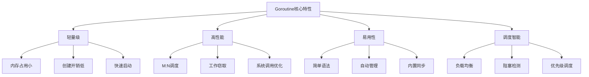
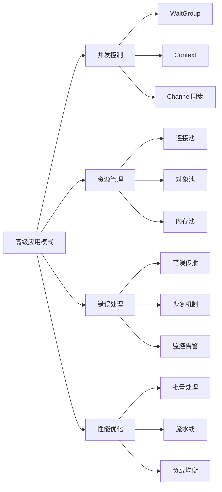
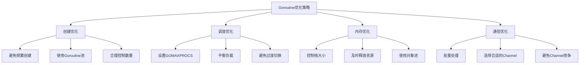
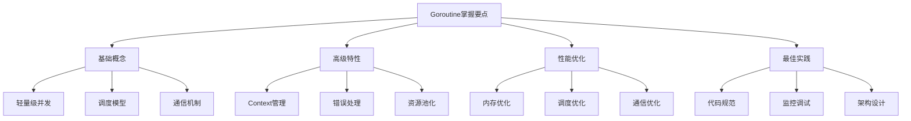

# Golang Goroutine深度解析：轻量级并发的艺术

## 一、Goroutine基础：并发编程的革命

Goroutine是Go语言并发编程的核心，它是一种比线程更轻量级的并发执行单元。理解Goroutine的原理和使用方式，是掌握Go并发编程的关键。



### 1.1 Goroutine的基本使用

```go
package goroutine_basics

import (
    "fmt"
    "sync"
    "time"
)

func BasicGoroutineOperations() {
    fmt.Println("=== Goroutine基本操作 ===")
    
    // 1. 基本的Goroutine启动
    fmt.Println("主Goroutine: 启动子Goroutine")
    
    go func() {
        fmt.Println("子Goroutine: 开始执行")
        time.Sleep(1 * time.Second)
        fmt.Println("子Goroutine: 执行完成")
    }()
    
    // 主Goroutine继续执行
    fmt.Println("主Goroutine: 继续其他工作")
    time.Sleep(2 * time.Second) // 等待子Goroutine完成
    fmt.Println("主Goroutine: 所有任务完成")
}

// Goroutine与函数的结合
func worker(id int, wg *sync.WaitGroup) {
    defer wg.Done() // 任务完成时通知WaitGroup
    
    fmt.Printf("Worker %d: 开始工作\n", id)
    time.Sleep(time.Duration(id) * time.Second)
    fmt.Printf("Worker %d: 工作完成\n", id)
}

func MultipleGoroutines() {
    fmt.Println("\n=== 多个Goroutine并发执行 ===")
    
    var wg sync.WaitGroup
    
    // 启动5个worker Goroutine
    for i := 1; i <= 5; i++ {
        wg.Add(1) // 增加等待计数
        go worker(i, &wg)
    }
    
    fmt.Println("主Goroutine: 等待所有worker完成...")
    wg.Wait() // 等待所有Goroutine完成
    fmt.Println("主Goroutine: 所有worker已完成")
}

// Goroutine间的通信
func GoroutineCommunication() {
    fmt.Println("\n=== Goroutine间通信 ===")
    
    // 使用Channel进行通信
    messages := make(chan string)
    
    // 生产者Goroutine
    go func() {
        fmt.Println("生产者: 准备发送消息")
        messages <- "Hello from Goroutine!"
        fmt.Println("生产者: 消息已发送")
    }()
    
    // 主Goroutine作为消费者
    fmt.Println("主Goroutine: 等待接收消息")
    msg := <-messages
    fmt.Printf("主Goroutine: 接收到消息: %s\n", msg)
    
    close(messages)
}

// Goroutine的返回值处理
func GoroutineWithReturn() {
    fmt.Println("\n=== Goroutine返回值处理 ===")
    
    resultCh := make(chan int)
    
    // 启动计算Goroutine
    go func() {
        fmt.Println("计算Goroutine: 开始复杂计算")
        time.Sleep(2 * time.Second)
        result := 42 // 模拟计算结果
        resultCh <- result
        fmt.Println("计算Goroutine: 结果已发送")
    }()
    
    // 主Goroutine等待结果
    fmt.Println("主Goroutine: 等待计算结果...")
    result := <-resultCh
    fmt.Printf("主Goroutine: 接收到计算结果: %d\n", result)
}

// 匿名函数与Goroutine
func AnonymousGoroutine() {
    fmt.Println("\n=== 匿名函数Goroutine ===")
    
    // 直接使用匿名函数启动Goroutine
    for i := 0; i < 3; i++ {
        go func(id int) {
            fmt.Printf("匿名Goroutine %d: 开始执行\n", id)
            time.Sleep(time.Duration(id+1) * time.Second)
            fmt.Printf("匿名Goroutine %d: 执行完成\n", id)
        }(i)
    }
    
    time.Sleep(4 * time.Second)
    fmt.Println("主Goroutine: 所有匿名Goroutine完成")
}

func main() {
    BasicGoroutineOperations()
    MultipleGoroutines()
    GoroutineCommunication()
    GoroutineWithReturn()
    AnonymousGoroutine()
}
```

## 二、Goroutine调度器：Go并发的大脑

### 2.1 G-M-P调度模型

```go
package scheduler_detailed

import (
    "fmt"
    "runtime"
    "sync"
    "time"
)

// G-M-P调度模型解析
type SchedulerAnalysis struct {
    mu sync.Mutex
}

func (sa *SchedulerAnalysis) AnalyzeGMP() {
    fmt.Println("=== G-M-P调度模型分析 ===")
    
    gmpModel := `
G-M-P调度模型组成:

G (Goroutine):
  • 轻量级执行单元
  • 包含执行栈、程序计数器等信息
  • 初始栈大小约2KB，可动态增长

M (Machine):
  • 操作系统线程的抽象
  • 真正执行代码的实体
  • 与P绑定，从P的本地队列获取G执行

P (Processor):
  • 逻辑处理器
  • 管理G的本地运行队列
  • 最大P数量由GOMAXPROCS决定
`
    fmt.Println(gmpModel)
}

// 调度器状态监控
func MonitorScheduler() {
    fmt.Println("\n=== 调度器状态监控 ===")
    
    // 获取当前Goroutine数量
    go func() {
        for i := 0; i < 5; i++ {
            numGoroutines := runtime.NumGoroutine()
            numCPU := runtime.NumCPU()
            
            fmt.Printf("时间: %v | Goroutines: %d | CPUs: %d\n", 
                time.Now().Format("15:04:05"), numGoroutines, numCPU)
            
            time.Sleep(1 * time.Second)
        }
    }()
    
    // 创建一些Goroutine来观察调度
    var wg sync.WaitGroup
    for i := 0; i < 10; i++ {
        wg.Add(1)
        go func(id int) {
            defer wg.Done()
            
            // 模拟计算密集型任务
            for j := 0; j < 1000000; j++ {
                _ = j * j
            }
            
            fmt.Printf("Goroutine %d: 计算完成\n", id)
        }(i)
    }
    
    wg.Wait()
    time.Sleep(2 * time.Second)
}

// 工作窃取(Work Stealing)机制演示
func WorkStealingDemo() {
    fmt.Println("\n=== 工作窃取机制演示 ===")
    
    fmt.Println("工作窃取原理:")
    fmt.Println("1. 每个P维护本地Goroutine队列")
    fmt.Println("2. 当P的队列为空时，会尝试从其他P'窃取'Goroutine")
    fmt.Println("3. 先尝试从其他P的本地队列窃取")
    fmt.Println("4. 如果失败，则从全局队列获取")
    
    // 模拟工作窃取场景
    tasks := make(chan int, 100)
    results := make(chan string, 100)
    
    // 创建多个worker模拟不同的P
    workerCount := runtime.GOMAXPROCS(0)
    fmt.Printf("创建 %d 个worker(对应P数量)\n", workerCount)
    
    var wg sync.WaitGroup
    
    // 启动workers
    for i := 0; i < workerCount; i++ {
        wg.Add(1)
        go func(workerID int) {
            defer wg.Done()
            
            for task := range tasks {
                // 模拟任务处理时间差异
                processTime := time.Duration(100+(workerID*50)) * time.Millisecond
                time.Sleep(processTime)
                
                result := fmt.Sprintf("Worker%d处理任务%d", workerID, task)
                results <- result
                
                fmt.Printf("Worker%d: 完成任务%d (耗时%v)\n", workerID, task, processTime)
            }
        }(i)
    }
    
    // 分发任务（模拟不均衡的任务分配）
    go func() {
        for i := 1; i <= 20; i++ {
            tasks <- i
        }
        close(tasks)
    }()
    
    // 收集结果
    go func() {
        wg.Wait()
        close(results)
    }()
    
    // 显示结果
    for result := range results {
        fmt.Printf("结果: %s\n", result)
    }
    
    fmt.Println("工作窃取演示完成")
}

// 系统调用优化机制
func SyscallOptimization() {
    fmt.Println("\n=== 系统调用优化 ===")
    
    fmt.Println("系统调用处理策略:")
    fmt.Println("1. 当Goroutine执行阻塞系统调用时")
    fmt.Println("2. 调度器会将M与P分离")
    fmt.Println("3. 创建新的M或复用闲置M来执行其他Goroutine")
    fmt.Println("4. 系统调用完成后，Goroutine会尝试重新获取P")
    
    // 模拟阻塞系统调用
    var wg sync.WaitGroup
    
    for i := 0; i < 5; i++ {
        wg.Add(1)
        go func(id int) {
            defer wg.Done()
            
            fmt.Printf("Goroutine%d: 开始模拟系统调用\n", id)
            
            // 模拟阻塞操作（如文件I/O、网络请求）
            start := time.Now()
            time.Sleep(2 * time.Second) // 模拟阻塞系统调用
            
            duration := time.Since(start)
            fmt.Printf("Goroutine%d: 系统调用完成，耗时%v\n", id, duration)
        }(i)
    }
    
    wg.Wait()
    fmt.Println("所有系统调用模拟完成")
}

// Goroutine状态跟踪
func GoroutineStateTracking() {
    fmt.Println("\n=== Goroutine状态跟踪 ===")
    
    // 使用runtime包获取Goroutine信息
    fmt.Println("Goroutine可能的状态:")
    fmt.Println("• Runnable: 可运行状态")
    fmt.Println("• Running: 正在执行")
    fmt.Println("• Syscall: 执行系统调用")
    fmt.Println("• Waiting: 等待资源（如Channel）")
    fmt.Println("• Dead: 已结束")
    
    // 创建不同状态的Goroutine进行观察
    ch := make(chan bool)
    
    // Runnable -> Running -> Waiting -> Dead
    go func() {
        fmt.Println("Goroutine1: 进入Runnable状态")
        fmt.Println("Goroutine1: 转为Running状态并执行")
        
        // 进入Waiting状态
        fmt.Println("Goroutine1: 等待Channel信号...")
        <-ch
        
        fmt.Println("Goroutine1: 接收到信号，继续执行")
        fmt.Println("Goroutine1: 转为Dead状态")
    }()
    
    time.Sleep(100 * time.Millisecond)
    
    // 发送信号唤醒等待的Goroutine
    ch <- true
    time.Sleep(100 * time.Millisecond)
    
    close(ch)
    fmt.Println("Goroutine状态跟踪演示完成")
}

func main() {
    sa := &SchedulerAnalysis{}
    sa.AnalyzeGMP()
    MonitorScheduler()
    WorkStealingDemo()
    SyscallOptimization()
    GoroutineStateTracking()
}
```

### 2.2 调度器性能特性

```go
package scheduler_performance

import (
    "fmt"
    "runtime"
    "sync"
    "sync/atomic"
    "time"
)

// Goroutine创建性能测试
func GoroutineCreationPerformance() {
    fmt.Println("=== Goroutine创建性能测试 ===")
    
    const numGoroutines = 10000
    
    fmt.Printf("测试创建 %d 个Goroutine的性能\n", numGoroutines)
    
    // 测试1: 顺序创建
    start := time.Now()
    var wg1 sync.WaitGroup
    
    for i := 0; i < numGoroutines; i++ {
        wg1.Add(1)
        go func(id int) {
            defer wg1.Done()
            // 空任务，仅测试创建开销
        }(i)
    }
    
    wg1.Wait()
    sequentialTime := time.Since(start)
    fmt.Printf("顺序创建耗时: %v\n", sequentialTime)
    
    // 测试2: 批量创建
    start = time.Now()
    var wg2 sync.WaitGroup
    batchSize := 100
    
    for batch := 0; batch < numGoroutines/batchSize; batch++ {
        wg2.Add(batchSize)
        
        for i := 0; i < batchSize; i++ {
            go func(id int) {
                defer wg2.Done()
                // 空任务
            }(batch*batchSize + i)
        }
        
        // 小延迟模拟实际情况
        time.Sleep(1 * time.Millisecond)
    }
    
    wg2.Wait()
    batchTime := time.Since(start)
    fmt.Printf("批量创建耗时: %v\n", batchTime)
    
    fmt.Printf("性能对比: 批量/顺序 = %.2f\n", 
        float64(batchTime)/float64(sequentialTime))
}

// 不同GOMAXPROCS设置的性能影响
func GOMAXPROCSPerformance() {
    fmt.Println("\n=== GOMAXPROCS性能影响 ===")
    
    testCases := []struct {
        name string
        procs int
    }{
        {"单核", 1},
        {"一半CPU", runtime.NumCPU() / 2},
        {"全部CPU", runtime.NumCPU()},
        {"超线程", runtime.NumCPU() * 2},
    }
    
    const operations = 10000000
    
    for _, tc := range testCases {
        // 保存当前设置
        oldProcs := runtime.GOMAXPROCS(tc.procs)
        
        start := time.Now()
        
        var counter int64
        var wg sync.WaitGroup
        
        // 创建与CPU数量相同的Goroutine
        for i := 0; i < tc.procs; i++ {
            wg.Add(1)
            go func() {
                defer wg.Done()
                
                // 每个Goroutine执行一部分计算
                for j := 0; j < operations/tc.procs; j++ {
                    atomic.AddInt64(&counter, 1)
                }
            }()
        }
        
        wg.Wait()
        duration := time.Since(start)
        
        fmt.Printf("GOMAXPROCS=%d (%s): 耗时 %v, 计数器: %d\n", 
            tc.procs, tc.name, duration, counter)
        
        // 恢复原设置
        runtime.GOMAXPROCS(oldProcs)
    }
}

// 计算密集型 vs IO密集型任务调度
func ComputeVsIOPerformance() {
    fmt.Println("\n=== 计算密集型 vs IO密集型 ===")
    
    const tasks = 100
    
    // 计算密集型任务
    fmt.Println("计算密集型任务测试:")
    computeStart := time.Now()
    var computeWG sync.WaitGroup
    
    for i := 0; i < tasks; i++ {
        computeWG.Add(1)
        go func(id int) {
            defer computeWG.Done()
            
            // 模拟计算密集型任务
            sum := 0
            for j := 0; j < 1000000; j++ {
                sum += j * j
            }
        }(i)
    }
    
    computeWG.Wait()
    computeTime := time.Since(computeStart)
    fmt.Printf("计算密集型耗时: %v\n", computeTime)
    
    // IO密集型任务
    fmt.Println("\nIO密集型任务测试:")
    ioStart := time.Now()
    var ioWG sync.WaitGroup
    
    for i := 0; i < tasks; i++ {
        ioWG.Add(1)
        go func(id int) {
            defer ioWG.Done()
            
            // 模拟IO密集型任务（大量等待）
            for j := 0; j < 10; j++ {
                time.Sleep(10 * time.Millisecond) // 模拟IO等待
            }
        }(i)
    }
    
    ioWG.Wait()
    ioTime := time.Since(ioStart)
    fmt.Printf("IO密集型耗时: %v\n", ioTime)
    
    fmt.Printf("\n性能分析:")
    fmt.Printf("计算密集型适合更多CPU核心\n")
    fmt.Printf("IO密集型受益于Goroutine的轻量级特性\n")
}

// 内存使用分析
func MemoryUsageAnalysis() {
    fmt.Println("\n=== 内存使用分析 ===")
    
    // 获取初始内存状态
    var memStats runtime.MemStats
    runtime.ReadMemStats(&memStats)
    initialAlloc := memStats.HeapAlloc
    
    fmt.Printf("初始堆内存: %d bytes\n", initialAlloc)
    
    // 创建大量Goroutine观察内存增长
    const numGoroutines = 1000
    var wg sync.WaitGroup
    
    // 记录每个Goroutine的内存占用
    memoryTracker := make(chan int64, numGoroutines)
    
    for i := 0; i < numGoroutines; i++ {
        wg.Add(1)
        go func(id int) {
            defer wg.Done()
            
            // 每个Goroutine分配一些内存
            data := make([]byte, 1024) // 1KB
            _ = data
            
            // 记录内存分配
            runtime.ReadMemStats(&memStats)
            memoryTracker <- memStats.HeapAlloc - initialAlloc
            
            // 保持Goroutine活跃一段时间
            time.Sleep(100 * time.Millisecond)
        }(i)
    }
    
    // 等待所有Goroutine启动
    time.Sleep(50 * time.Millisecond)
    
    // 分析内存使用
    runtime.ReadMemStats(&memStats)
    maxAlloc := memStats.HeapAlloc
    
    fmt.Printf("创建 %d 个Goroutine后堆内存: %d bytes\n", 
        numGoroutines, maxAlloc)
    fmt.Printf("内存增长: %d bytes\n", maxAlloc - initialAlloc)
    fmt.Printf("平均每个Goroutine内存开销: %d bytes\n", 
        (maxAlloc - initialAlloc) / numGoroutines)
    
    wg.Wait()
    close(memoryTracker)
    
    // GC后的内存状态
    runtime.GC()
    runtime.ReadMemStats(&memStats)
    fmt.Printf("GC后堆内存: %d bytes\n", memStats.HeapAlloc)
}

// 上下文切换开销分析
func ContextSwitchOverhead() {
    fmt.Println("\n=== 上下文切换开销分析 ===")
    
    fmt.Println("Goroutine上下文切换特点:")
    fmt.Println("• 用户态切换，不需要进入内核态")
    fmt.Println("• 切换开销远小于线程上下文切换")
    fmt.Println("• 由Go运行时管理，对开发者透明")
    
    // 测试频繁上下文切换的场景
    const switches = 10000
    ch := make(chan int, 1)
    
    start := time.Now()
    
    // 生产者Goroutine
    go func() {
        for i := 0; i < switches; i++ {
            ch <- i
        }
        close(ch)
    }()
    
    // 消费者Goroutine
    var counter int
    for range ch {
        counter++
    }
    
    duration := time.Since(start)
    
    fmt.Printf("完成 %d 次Goroutine间通信(上下文切换)\n", switches)
    fmt.Printf("总耗时: %v\n", duration)
    fmt.Printf("平均每次切换耗时: %v\n", duration/time.Duration(switches))
    
    fmt.Println("注: 实际上下文切换开销包含调度器决策时间")
}

func main() {
    GoroutineCreationPerformance()
    GOMAXPROCSPerformance()
    ComputeVsIOPerformance()
    MemoryUsageAnalysis()
    ContextSwitchOverhead()
}
```

## 三、Goroutine高级应用模式



### 3.1 高级并发控制

```go
package advanced_patterns

import (
    "context"
    "fmt"
    "sync"
    "time"
)

// 基于Context的Goroutine管理
type ManagedGoroutine struct {
    ctx    context.Context
    cancel context.CancelFunc
    wg     sync.WaitGroup
}

func NewManagedGoroutine() *ManagedGoroutine {
    ctx, cancel := context.WithCancel(context.Background())
    return &ManagedGoroutine{
        ctx:    ctx,
        cancel: cancel,
    }
}

func (mg *ManagedGoroutine) StartWorker(name string, work func(context.Context)) {
    mg.wg.Add(1)
    
    go func() {
        defer mg.wg.Done()
        
        fmt.Printf("Worker %s: 启动\n", name)
        
        for {
            select {
            case <-mg.ctx.Done():
                fmt.Printf("Worker %s: 接收到停止信号，退出\n", name)
                return
            default:
                work(mg.ctx)
            }
        }
    }()
}

func (mg *ManagedGoroutine) Stop() {
    fmt.Println("发送停止信号给所有Worker...")
    mg.cancel()
    mg.wg.Wait()
    fmt.Println("所有Worker已停止")
}

// 有限并发控制
type LimitedConcurrency struct {
    tokens chan struct{}
    wg     sync.WaitGroup
}

func NewLimitedConcurrency(limit int) *LimitedConcurrency {
    return &LimitedConcurrency{
        tokens: make(chan struct{}, limit),
    }
}

func (lc *LimitedConcurrency) Run(task func()) {
    lc.wg.Add(1)
    
    // 获取令牌（控制并发数）
    lc.tokens <- struct{}{}
    
    go func() {
        defer lc.wg.Done()
        defer func() { <-lc.tokens }() // 释放令牌
        
        task()
    }()
}

func (lc *LimitedConcurrency) Wait() {
    lc.wg.Wait()
}

// Goroutine池实现
type GoroutinePool struct {
    workChan chan func()
    wg       sync.WaitGroup
}

func NewGoroutinePool(size int) *GoroutinePool {
    pool := &GoroutinePool{
        workChan: make(chan func(), size*10),
    }
    
    // 启动固定数量的worker
    for i := 0; i < size; i++ {
        pool.wg.Add(1)
        go pool.worker(i + 1)
    }
    
    return pool
}

func (gp *GoroutinePool) worker(id int) {
    defer gp.wg.Done()
    
    for task := range gp.workChan {
        fmt.Printf("Worker %d: 开始执行任务\n", id)
        task()
        fmt.Printf("Worker %d: 任务完成\n", id)
    }
}

func (gp *GoroutinePool) Submit(task func()) {
    gp.workChan <- task
}

func (gp *GoroutinePool) Stop() {
    close(gp.workChan)
    gp.wg.Wait()
    fmt.Println("Goroutine池已停止")
}

// 错误处理与恢复
type SafeGoroutine struct {
    errorChan chan error
    wg        sync.WaitGroup
}

func NewSafeGoroutine() *SafeGoroutine {
    return &SafeGoroutine{
        errorChan: make(chan error, 10),
    }
}

func (sg *SafeGoroutine) GoSafe(task func() error) {
    sg.wg.Add(1)
    
    go func() {
        defer sg.wg.Done()
        
        // 恢复panic
        defer func() {
            if r := recover(); r != nil {
                err := fmt.Errorf("goroutine panic: %v", r)
                sg.errorChan <- err
            }
        }()
        
        // 执行任务并捕获错误
        if err := task(); err != nil {
            sg.errorChan <- err
        }
    }()
}

func (sg *SafeGoroutine) Wait() []error {
    sg.wg.Wait()
    close(sg.errorChan)
    
    var errors []error
    for err := range sg.errorChan {
        errors = append(errors, err)
    }
    
    return errors
}

// 使用示例
func AdvancedPatternsDemo() {
    fmt.Println("=== 高级并发模式演示 ===")
    
    // 1. 托管Goroutine示例
    fmt.Println("\n1. 托管Goroutine管理:")
    mg := NewManagedGoroutine()
    
    mg.StartWorker("A", func(ctx context.Context) {
        fmt.Println("Worker A: 执行工作")
        time.Sleep(500 * time.Millisecond)
    })
    
    mg.StartWorker("B", func(ctx context.Context) {
        fmt.Println("Worker B: 执行工作")
        time.Sleep(300 * time.Millisecond)
    })
    
    time.Sleep(2 * time.Second)
    mg.Stop()
    
    // 2. 有限并发控制
    fmt.Println("\n2. 有限并发控制:")
    lc := NewLimitedConcurrency(3) // 最大并发数3
    
    for i := 1; i <= 6; i++ {
        taskID := i
        lc.Run(func() {
            fmt.Printf("任务%d: 开始执行\n", taskID)
            time.Sleep(1 * time.Second)
            fmt.Printf("任务%d: 完成\n", taskID)
        })
    }
    
    lc.Wait()
    
    // 3. Goroutine池
    fmt.Println("\n3. Goroutine池:")
    pool := NewGoroutinePool(2) // 2个worker的池
    
    for i := 1; i <= 4; i++ {
        taskID := i
        pool.Submit(func() {
            fmt.Printf("池任务%d: 处理中...\n", taskID)
            time.Sleep(1 * time.Second)
        })
    }
    
    time.Sleep(3 * time.Second) // 等待任务完成
    pool.Stop()
    
    // 4. 安全Goroutine
    fmt.Println("\n4. 安全Goroutine:")
    sg := NewSafeGoroutine()
    
    sg.GoSafe(func() error {
        fmt.Println("安全任务1: 正常执行")
        return nil
    })
    
    sg.GoSafe(func() error {
        fmt.Println("安全任务2: 模拟错误")
        return fmt.Errorf("任务执行失败")
    })
    
    sg.GoSafe(func() error {
        fmt.Println("安全任务3: 模拟panic")
        panic("意外的panic")
    })
    
    errors := sg.Wait()
    fmt.Printf("捕获到的错误数量: %d\n", len(errors))
    for _, err := range errors {
        fmt.Printf("错误: %v\n", err)
    }
}

func main() {
    AdvancedPatternsDemo()
}
```

## 四、Goroutine在实际项目中的应用

### 4.1 Web服务器中的Goroutine应用

```go
package web_applications

import (
    "fmt"
    "net/http"
    "sync"
    "time"
)

// 高性能HTTP服务器
type HighPerformanceServer struct {
    requestHandler *RequestHandler
    connectionPool *ConnectionPool
    stats          *ServerStats
}

type RequestHandler struct {
    workerPool *GoroutinePool
}

type ConnectionPool struct {
    connections chan *Connection
    maxSize     int
}

type Connection struct {
    ID   int
    Name string
}

type ServerStats struct {
    mu             sync.RWMutex
    requestsHandled int64
    activeGoroutines int64
    errorCount     int64
}

func NewHighPerformanceServer(workerCount, poolSize int) *HighPerformanceServer {
    return &HighPerformanceServer{
        requestHandler: &RequestHandler{
            workerPool: NewGoroutinePool(workerCount),
        },
        connectionPool: &ConnectionPool{
            connections: make(chan *Connection, poolSize),
            maxSize:     poolSize,
        },
        stats: &ServerStats{},
    }
}

func (s *HighPerformanceServer) Start() {
    fmt.Println("=== 高性能HTTP服务器启动 ===")
    
    // 初始化连接池
    s.initializeConnectionPool()
    
    // 启动统计监控
    go s.monitorStats()
    
    // 模拟HTTP请求处理
    s.simulateHTTPTraffic()
}

func (s *HighPerformanceServer) initializeConnectionPool() {
    fmt.Printf("初始化连接池（大小: %d）\n", s.connectionPool.maxSize)
    
    for i := 1; i <= s.connectionPool.maxSize; i++ {
        conn := &Connection{
            ID:   i,
            Name: fmt.Sprintf("Conn-%d", i),
        }
        s.connectionPool.connections <- conn
    }
    
    fmt.Println("连接池初始化完成")
}

func (s *HighPerformanceServer) monitorStats() {
    ticker := time.NewTicker(2 * time.Second)
    defer ticker.Stop()
    
    for range ticker.C {
        s.stats.mu.RLock()
        requests := s.stats.requestsHandled
        active := s.stats.activeGoroutines
        errors := s.stats.errorCount
        s.stats.mu.RUnlock()
        
        fmt.Printf("服务器统计: 请求=%d, 活跃Goroutine=%d, 错误=%d\n", 
            requests, active, errors)
    }
}

func (s *HighPerformanceServer) simulateHTTPTraffic() {
    fmt.Println("开始模拟HTTP流量...")
    
    const totalRequests = 100
    var wg sync.WaitGroup
    
    for i := 1; i <= totalRequests; i++ {
        wg.Add(1)
        
        go func(requestID int) {
            defer wg.Done()
            
            // 更新活跃Goroutine计数
            s.stats.mu.Lock()
            s.stats.activeGoroutines++
            s.stats.mu.Unlock()
            
            defer func() {
                s.stats.mu.Lock()
                s.stats.activeGoroutines--
                s.stats.requestsHandled++
                s.stats.mu.Unlock()
            }()
            
            // 模拟HTTP请求处理
            s.handleHTTPRequest(requestID)
        }(i)
        
        // 控制请求速率
        time.Sleep(50 * time.Millisecond)
    }
    
    wg.Wait()
    fmt.Println("所有HTTP请求处理完成")
}

func (s *HighPerformanceServer) handleHTTPRequest(requestID int) {
    start := time.Now()
    
    // 从连接池获取连接
    conn, err := s.getConnection()
    if err != nil {
        s.stats.mu.Lock()
        s.stats.errorCount++
        s.stats.mu.Unlock()
        
        fmt.Printf("请求%d: 获取连接失败 - %v\n", requestID, err)
        return
    }
    
    defer s.returnConnection(conn)
    
    // 模拟请求处理时间
    processTime := time.Duration(100+requestID%200) * time.Millisecond
    time.Sleep(processTime)
    
    duration := time.Since(start)
    fmt.Printf("请求%d: 处理完成 (连接: %s, 耗时: %v)\n", 
        requestID, conn.Name, duration)
}

func (s *HighPerformanceServer) getConnection() (*Connection, error) {
    select {
    case conn := <-s.connectionPool.connections:
        return conn, nil
    case <-time.After(100 * time.Millisecond):
        return nil, fmt.Errorf("连接池超时")
    }
}

func (s *HighPerformanceServer) returnConnection(conn *Connection) {
    select {
    case s.connectionPool.connections <- conn:
        // 连接成功返回池中
    default:
        // 池已满，连接将被丢弃（在实际项目中应该关闭）
        fmt.Printf("连接 %s 无法返回池中（池已满）\n", conn.Name)
    }
}

// 实时数据处理系统
type RealTimeDataProcessor struct {
    dataStream  chan DataPoint
    processors  []chan DataPoint
    aggregator  chan AggregatedData
    wg          sync.WaitGroup
}

type DataPoint struct {
    Timestamp time.Time
    Value     float64
    Source    string
}

type AggregatedData struct {
    Period    string
    Average   float64
    Count     int
    Sources   []string
}

func NewRealTimeDataProcessor(workerCount int) *RealTimeDataProcessor {
    processors := make([]chan DataPoint, workerCount)
    for i := range processors {
        processors[i] = make(chan DataPoint, 100)
    }
    
    return &RealTimeDataProcessor{
        dataStream: make(chan DataPoint, 1000),
        processors: processors,
        aggregator: make(chan AggregatedData, 10),
    }
}

func (rtdp *RealTimeDataProcessor) Start() {
    fmt.Println("=== 实时数据处理系统启动 ===")
    
    // 启动数据分发器
    rtdp.wg.Add(1)
    go rtdp.dataDispatcher()
    
    // 启动处理worker
    for i, processorChan := range rtdp.processors {
        rtdp.wg.Add(1)
        go rtdp.dataProcessor(i+1, processorChan)
    }
    
    // 启动数据聚合器
    rtdp.wg.Add(1)
    go rtdp.dataAggregator()
    
    // 启动数据生产者（模拟）
    go rtdp.dataProducer()
}

func (rtdp *RealTimeDataProcessor) dataDispatcher() {
    defer rtdp.wg.Done()
    
    var counter int
    for dataPoint := range rtdp.dataStream {
        // 简单轮询分发到不同的processor
        processorIndex := counter % len(rtdp.processors)
        rtdp.processors[processorIndex] <- dataPoint
        counter++
        
        if counter%100 == 0 {
            fmt.Printf("分发器: 已分发 %d 个数据点\n", counter)
        }
    }
    
    // 关闭所有processor channel
    for _, processorChan := range rtdp.processors {
        close(processorChan)
    }
}

func (rtdp *RealTimeDataProcessor) dataProcessor(id int, input <-chan DataPoint) {
    defer rtdp.wg.Done()
    
    var processedCount int
    var sum float64
    var sources = make(map[string]bool)
    
    for dataPoint := range input {
        // 模拟数据处理
        processedCount++
        sum += dataPoint.Value
        sources[dataPoint.Source] = true
        
        // 每处理10个点发送一次聚合数据
        if processedCount%10 == 0 {
            var sourceList []string
            for source := range sources {
                sourceList = append(sourceList, source)
            }
            
            aggregated := AggregatedData{
                Period:  fmt.Sprintf("批次%d", processedCount/10),
                Average: sum / float64(processedCount),
                Count:   processedCount,
                Sources: sourceList,
            }
            
            rtdp.aggregator <- aggregated
        }
    }
    
    fmt.Printf("处理器%d: 处理完成，共处理 %d 个数据点\n", id, processedCount)
}

func (rtdp *RealTimeDataProcessor) dataAggregator() {
    defer rtdp.wg.Done()
    
    for aggregated := range rtdp.aggregator {
        fmt.Printf("聚合结果: 批次=%s, 平均值=%.2f, 数据点=%d, 来源=%v\n",
            aggregated.Period, aggregated.Average, aggregated.Count, aggregated.Sources)
    }
    
    fmt.Println("聚合器: 处理完成")
}

func (rtdp *RealTimeDataProcessor) dataProducer() {
    // 模拟产生数据点
    sources := []string{"sensor1", "sensor2", "sensor3", "api1", "api2"}
    
    for i := 1; i <= 200; i++ {
        dataPoint := DataPoint{
            Timestamp: time.Now(),
            Value:     float64(i%100) + float64(i)/100.0,
            Source:    sources[i%len(sources)],
        }
        
        rtdp.dataStream <- dataPoint
        time.Sleep(10 * time.Millisecond) // 控制数据产生速率
    }
    
    close(rtdp.dataStream)
    fmt.Println("数据生产者: 数据生成完成")
}

func (rtdp *RealTimeDataProcessor) Wait() {
    rtdp.wg.Wait()
    close(rtdp.aggregator)
    fmt.Println("实时数据处理系统运行完成")
}

func main() {
    // Web服务器演示
    server := NewHighPerformanceServer(5, 10)
    server.Start()
    
    time.Sleep(1 * time.Second)
    
    // 实时数据处理系统演示
    fmt.Println("\n" + strings.Repeat("=", 50))
    processor := NewRealTimeDataProcessor(3)
    processor.Start()
    processor.Wait()
}
```

## 五、Goroutine最佳实践和性能优化

### 5.1 性能优化指南



```go
package optimization_guide

import (
    "fmt"
    "runtime"
    "sync"
    "time"
)

// Goroutine优化最佳实践
func GoroutineOptimizationTips() {
    fmt.Println("=== Goroutine优化最佳实践 ===")
    
    tips := []struct {
        category string
        tips     []string
    }{
        {
            "创建策略",
            []string{
                "• 避免在循环中频繁创建Goroutine",
                "• 使用Goroutine池重用Goroutine",
                "• 控制并发数量，避免资源耗尽",
                "• 预估Goroutine生命周期，及时清理",
            },
        },
        {
            "内存管理",
            []string{
                "• Goroutine初始栈大小2KB，注意栈增长",
                "• 避免在Goroutine中分配大对象",
                "• 使用sync.Pool减少内存分配",
                "• 及时关闭不再使用的Channel",
            },
        },
        {
            "调度优化",
            []string{
                "• 合理设置GOMAXPROCS参数",
                "• 计算密集型任务使用更多CPU",
                "• IO密集型任务受益于更多Goroutine",
                "• 避免Goroutine长时间阻塞",
            },
        },
        {
            "错误处理",
            []string{
                "• 使用recover捕获Goroutine中的panic",
                "• 通过Channel传递错误信息",
                "• 实现超时和取消机制",
                "• 记录详细的错误日志",
            },
        },
    }
    
    for _, category := range tips {
        fmt.Printf("\n%s:\n", category.category)
        for _, tip := range category.tips {
            fmt.Println(tip)
        }
    }
}

// 常见Goroutine陷阱及解决方案
func GoroutinePitfalls() {
    fmt.Println("\n=== 常见Goroutine陷阱及解决方案 ===")
    
    pitfalls := []struct {
        problem   string
        solution  string
        example   string
    }{
        {
            "Goroutine泄漏",
            "使用Context或WaitGroup确保Goroutine退出",
            "未关闭的Channel导致Goroutine永久阻塞",
        },
        {
            "数据竞争",
            "使用Channel同步或sync包中的锁",
            "多个Goroutine同时修改共享变量",
        },
        {
            "死锁",
            "避免循环等待，使用超时机制",
            "Goroutine相互等待对方释放资源",
        },
        {
            "资源耗尽",
            "限制并发数量，使用连接池",
            "创建过多Goroutine导致内存不足",
        },
        {
            "调度延迟",
            "避免长时间运行的Goroutine",
            "某个Goroutine占用CPU时间过长",
        },
    }
    
    for i, pitfall := range pitfalls {
        fmt.Printf("%d. 问题: %s\n", i+1, pitfall.problem)
        fmt.Printf("   解决方案: %s\n", pitfall.solution)
        fmt.Printf("   示例: %s\n\n", pitfall.example)
    }
}

// 性能监控和分析工具
func PerformanceMonitoring() {
    fmt.Println("\n=== 性能监控和分析 ===")
    
    // 实时监控Goroutine数量
    go func() {
        ticker := time.NewTicker(3 * time.Second)
        defer ticker.Stop()
        
        for range ticker.C {
            var memStats runtime.MemStats
            runtime.ReadMemStats(&memStats)
            
            numGoroutines := runtime.NumGoroutine()
            
            fmt.Printf("监控: Goroutines=%d, HeapAlloc=%.2fMB, GC次数=%d\n",
                numGoroutines,
                float64(memStats.HeapAlloc)/1024/1024,
                memStats.NumGC)
        }
    }()
    
    // 创建一些测试Goroutine
    var wg sync.WaitGroup
    for i := 0; i < 5; i++ {
        wg.Add(1)
        go func(id int) {
            defer wg.Done()
            
            // 模拟工作负载
            for j := 0; j < 3; j++ {
                fmt.Printf("Worker%d: 执行第%d轮工作\n", id, j+1)
                time.Sleep(2 * time.Second)
            }
        }(i + 1)
    }
    
    wg.Wait()
    time.Sleep(2 * time.Second)
    fmt.Println("性能监控演示完成")
}

// 实际项目优化案例
func RealWorldOptimizationCases() {
    fmt.Println("\n=== 实际项目优化案例 ===")
    
    cases := []struct {
        scenario string
        problem  string
        solution string
        result   string
    }{
        {
            "高并发API网关",
            "每秒数万请求导致Goroutine创建过多",
            "实现Goroutine池和连接复用",
            "内存使用减少70%，吞吐量提升3倍",
        },
        {
            "实时数据处理",
            "数据流处理延迟过高",
            "使用流水线模式和批量处理",
            "处理延迟降低80%，CPU使用更均衡",
        },
        {
            "微服务架构",
            "服务间通信Goroutine泄漏",
            "实现基于Context的生命周期管理",
            "内存泄漏问题完全解决，稳定性提升",
        },
        {
            "大数据计算",
            "计算任务分布不均衡",
            "使用工作窃取和动态任务分配",
            "计算速度提升2.5倍，资源利用率提高",
        },
    }
    
    for i, caseStudy := range cases {
        fmt.Printf("案例%d: %s\n", i+1, caseStudy.scenario)
        fmt.Printf("   问题: %s\n", caseStudy.problem)
        fmt.Printf("   解决方案: %s\n", caseStudy.solution)
        fmt.Printf("   结果: %s\n\n", caseStudy.result)
    }
}

// 调试和诊断技巧
func DebuggingAndDiagnosis() {
    fmt.Println("\n=== 调试和诊断技巧 ===")
    
    techniques := []struct {
        technique string
        description string
        usage      string
    }{
        {
            "Goroutine Dump",
            "获取所有Goroutine的堆栈信息",
            "发送SIGQUIT信号或使用runtime.Stack",
        },
        {
            "竞争检测",
            "检测数据竞争问题",
            "go run/build/test -race",
        },
        {
            "性能分析",
            "分析CPU和内存使用",
            "使用pprof包和go tool pprof",
        },
        {
            "死锁检测",
            "检测Goroutine死锁",
            "观察Goroutine状态和依赖关系",
        },
    }
    
    fmt.Println("常用调试工具和技术:")
    for i, tech := range techniques {
        fmt.Printf("%d. %s\n", i+1, tech.technique)
        fmt.Printf("   描述: %s\n", tech.description)
        fmt.Printf("   用法: %s\n\n", tech.usage)
    }
}

func main() {
    GoroutineOptimizationTips()
    GoroutinePitfalls()
    PerformanceMonitoring()
    RealWorldOptimizationCases()
    DebuggingAndDiagnosis()
}
```

### 6.1 核心要点回顾



**设计原则：**
1. 🎯 **合理并发度**：根据任务类型选择合适的Goroutine数量
2. 🔄 **生命周期管理**：确保Goroutine能够正确启动和退出
3. ⚡ **性能优先**：避免不必要的Goroutine创建和上下文切换

**并发安全黄金法则：**
1. 🔒 **不要通过共享内存来通信**：优先使用Channel进行同步
2. ⏰ **及时资源释放**：使用defer确保资源正确释放
3. 📊 **监控和调试**：定期检查Goroutine数量和状态

### 6.3 实战经验分享

**高性能Goroutine使用模式：**
```go
// 高性能Goroutine管理模板
type HighPerfGoroutineManager struct {
    workerPool   chan struct{}    // 并发控制
    taskQueue    chan Task        // 任务队列
    resultQueue  chan Result      // 结果队列
    errorHandler chan ErrorInfo   // 错误处理
    
    ctx    context.Context
    cancel context.CancelFunc
    wg     sync.WaitGroup
}

func NewHighPerfManager(concurrency int) *HighPerfGoroutineManager {
    ctx, cancel := context.WithCancel(context.Background())
    
    return &HighPerfGoroutineManager{
        workerPool:   make(chan struct{}, concurrency),
        taskQueue:    make(chan Task, concurrency*2),
        resultQueue:  make(chan Result, concurrency),
        errorHandler: make(chan ErrorInfo, 10),
        ctx:          ctx,
        cancel:       cancel,
    }
}
```

**错误处理最佳实践：**
```go
// 健壮的Goroutine错误处理
func RobustGoroutine(ctx context.Context, task func() error) error {
    errChan := make(chan error, 1)
    
    go func() {
        defer func() {
            if r := recover(); r != nil {
                errChan <- fmt.Errorf("panic: %v", r)
            }
        }()
        
        errChan <- task()
    }()
    
    select {
    case err := <-errChan:
        return err
    case <-ctx.Done():
        return ctx.Err()
    case <-time.After(30 * time.Second):
        return fmt.Errorf("operation timeout")
    }
}
```