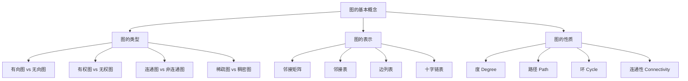
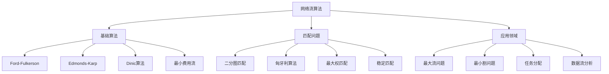
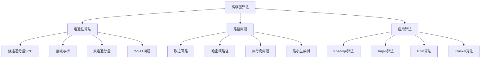

# Golang图算法深度解析：从基础到高级实战

## 一、图论基础与Go语言实现

### 1.1 图的基本概念与术语



### 1.2 Graph接口设计与基础实现

```go
package graph

import (
	"fmt"
	"math"
)

// Graph 接口定义
type Graph interface {
	// 顶点操作
	AddVertex(v int) error
	RemoveVertex(v int) error
	HasVertex(v int) bool
	Vertices() []int
	
	// 边操作
	AddEdge(u, v int, weight float64) error
	RemoveEdge(u, v int) error
	HasEdge(u, v int) bool
	Weight(u, v int) (float64, error)
	
	// 图信息
	Order() int                    // 顶点数
	Size() int                     // 边数
	Degree(v int) int              // 顶点度数
	Neighbors(v int) []int         // 邻居顶点
}

// 基础图结构
type BaseGraph struct {
	vertices map[int]bool
	edges    map[int]map[int]float64
	directed bool
}

// 新建图实例
func NewBaseGraph(directed bool) *BaseGraph {
	return &BaseGraph{
		vertices: make(map[int]bool),
		edges:    make(map[int]map[int]float64),
		directed: directed,
	}
}

func (g *BaseGraph) AddVertex(v int) error {
	if g.vertices[v] {
		return fmt.Errorf("vertex %d already exists", v)
	}
	g.vertices[v] = true
	g.edges[v] = make(map[int]float64)
	return nil
}

func (g *BaseGraph) RemoveVertex(v int) error {
	if !g.vertices[v] {
		return fmt.Errorf("vertex %d does not exist", v)
	}
	
	// 移除所有与该顶点相关的边
	delete(g.edges, v)
	for u := range g.vertices {
		delete(g.edges[u], v)
	}
	
	delete(g.vertices, v)
	return nil
}

func (g *BaseGraph) AddEdge(u, v int, weight float64) error {
	if !g.vertices[u] || !g.vertices[v] {
		return fmt.Errorf("vertex does not exist")
	}
	
	g.edges[u][v] = weight
	
	// 如果是无向图，添加反向边
	if !g.directed && u != v {
		g.edges[v][u] = weight
	}
	
	return nil
}

func (g *BaseGraph) Weight(u, v int) (float64, error) {
	if !g.HasEdge(u, v) {
		return math.Inf(1), fmt.Errorf("edge (%d, %d) does not exist", u, v)
	}
	return g.edges[u][v], nil
}

func (g *BaseGraph) Neighbors(v int) []int {
	neighbors := make([]int, 0, len(g.edges[v]))
	for u := range g.edges[v] {
		neighbors = append(neighbors, u)
	}
	return neighbors
}

func (g *BaseGraph) Order() int {
	return len(g.vertices)
}

func (g *BaseGraph) Size() int {
	count := 0
	for _, edges := range g.edges {
		count += len(edges)
	}
	
	// 无向图需要除以2
	if !g.directed {
		count /= 2
	}
	
	return count
}

// 邻接表图的实现
type AdjacencyListGraph struct {
	*BaseGraph
	vertexData map[int]interface{}
}

func NewAdjacencyListGraph(directed bool) *AdjacencyListGraph {
	return &AdjacencyListGraph{
		BaseGraph:  NewBaseGraph(directed),
		vertexData: make(map[int]interface{}),
	}
}

// 设置顶点数据
func (alg *AdjacencyListGraph) SetVertexData(v int, data interface{}) error {
	if !alg.HasVertex(v) {
		return fmt.Errorf("vertex %d does not exist", v)
	}
	alg.vertexData[v] = data
	return nil
}

func (alg *AdjacencyListGraph) GetVertexData(v int) (interface{}, error) {
	if !alg.HasVertex(v) {
		return nil, fmt.Errorf("vertex %d does not exist", v)
	}
	return alg.vertexData[v], nil
}
```

### 1.3 图的遍历算法实现

```go
package traversal

import (
	"container/list"
	"fmt"
)

// DFS 深度优先搜索
type DFS struct {
	graph     Graph
	visited   map[int]bool
	parent    map[int]int
	discovery map[int]int
	finish    map[int]int
	time      int
}

func NewDFS(graph Graph) *DFS {
	return &DFS{
		graph:     graph,
		visited:   make(map[int]bool),
		parent:    make(map[int]int),
		discovery: make(map[int]int),
		finish:    make(map[int]int),
	}
}

func (dfs *DFS) Traverse(start int) []int {
	order := make([]int, 0)
	dfs.time = 0
	
	// 重置访问状态
	for v := range dfs.graph.Vertices() {
		dfs.visited[v] = false
		dfs.parent[v] = -1
	}
	
	dfs.dfsVisit(start, &order)
	
	// 处理非连通图
	for v := range dfs.graph.Vertices() {
		if !dfs.visited[v] {
			dfs.dfsVisit(v, &order)
		}
	}
	
	return order
}

func (dfs *DFS) dfsVisit(u int, order *[]int) {
	dfs.visited[u] = true
	dfs.time++
	dfs.discovery[u] = dfs.time
	
	*order = append(*order, u)
	
	// 访问所有邻居
	for _, v := range dfs.graph.Neighbors(u) {
		if !dfs.visited[v] {
			dfs.parent[v] = u
			dfs.dfsVisit(v, order)
		}
	}
	
	dfs.time++
	dfs.finish[u] = dfs.time
}

// 检测环路
func (dfs *DFS) HasCycle() bool {
	for u := range dfs.graph.Vertices() {
		for _, v := range dfs.graph.Neighbors(u) {
			if dfs.discovery[v] < dfs.discovery[u] && dfs.finish[v] > dfs.finish[u] {
				return true // 存在后向边
			}
		}
	}
	return false
}

// BFS 广度优先搜索
type BFS struct {
	graph   Graph
	visited map[int]bool
	parent  map[int]int
	distance map[int]int
}

func NewBFS(graph Graph) *BFS {
	return &BFS{
		graph:    graph,
		visited:  make(map[int]bool),
		parent:   make(map[int]int),
		distance: make(map[int]int),
	}
}

func (bfs *BFS) Traverse(start int) []int {
	order := make([]int, 0)
	
	// 初始化
	for v := range bfs.graph.Vertices() {
		bfs.visited[v] = false
		bfs.parent[v] = -1
		bfs.distance[v] = -1
	}
	
	queue := list.New()
	bfs.visited[start] = true
	bfs.distance[start] = 0
	queue.PushBack(start)
	
	for queue.Len() > 0 {
		front := queue.Front()
		queue.Remove(front)
		
		u := front.Value.(int)
		order = append(order, u)
		
		// 访问所有未访问的邻居
		for _, v := range bfs.graph.Neighbors(u) {
			if !bfs.visited[v] {
				bfs.visited[v] = true
				bfs.distance[v] = bfs.distance[u] + 1
				bfs.parent[v] = u
				queue.PushBack(v)
			}
		}
	}
	
	return order
}

// 获取最短路径
func (bfs *BFS) ShortestPath(start, target int) ([]int, error) {
	if !bfs.visited[target] {
		return nil, fmt.Errorf("target vertex %d is unreachable from start %d", target, start)
	}
	
	path := make([]int, 0)
	current := target
	
	// 反向追溯路径
	for current != -1 {
		path = append([]int{current}, path...)
		current = bfs.parent[current]
	}
	
	return path, nil
}

// 拓扑排序（针对有向无环图）
type TopologicalSort struct {
	graph   Graph
	visited map[int]bool
	result  []int
}

func NewTopologicalSort(graph Graph) *TopologicalSort {
	return &TopologicalSort{
		graph:   graph,
		visited: make(map[int]bool),
		result:  make([]int, 0),
	}
}

func (ts *TopologicalSort) Sort() ([]int, error) {
	// 检查是否存在环路
	dfs := NewDFS(ts.graph)
	dfs.Traverse(ts.graph.Vertices()[0])
	
	if dfs.HasCycle() {
		return nil, fmt.Errorf("graph contains cycle, cannot perform topological sort")
	}
	
	// 初始化访问状态
	for v := range ts.graph.Vertices() {
		ts.visited[v] = false
	}
	
	// 对每个未访问的顶点进行DFS
	for v := range ts.graph.Vertices() {
		if !ts.visited[v] {
			ts.dfsTopological(v)
		}
	}
	
	// 反转结果得到拓扑顺序
	reversed := make([]int, len(ts.result))
	for i := 0; i < len(ts.result); i++ {
		reversed[i] = ts.result[len(ts.result)-1-i]
	}
	
	return reversed, nil
}

func (ts *TopologicalSort) dfsTopological(u int) {
	ts.visited[u] = true
	
	for _, v := range ts.graph.Neighbors(u) {
		if !ts.visited[v] {
			ts.dfsTopological(v)
		}
	}
	
	ts.result = append(ts.result, u)
}
```

## 二、最短路径算法深度实现

### 2.1 最短路径问题概述

```mermaid
graph TB
    A[最短路径问题] --> B[算法选择]
    A --> C[应用场景]
    A --> D[复杂度分析]
    
    B --> B1[无权图最短路径:BFS]
    B --> B2[正权图:Dijkstra]
    B --> B3[负权图:Bellman-Ford]
    B --> B4[多源:Floyd-Warshall]
    
    C --> C1[网络路由]
    C --> C2[地图导航]
    C --> C3[社交网络]
    C --> C4[物流规划]
    
    D --> D1[Dijkstra:O((V+E)logV)]
    D --> D2[Bellman-Ford:O(VE)]
    D --> D3[Floyd-Warshall:O(V³)]
```

### 2.2 Dijkstra算法实现

Dijkstra算法是解决单源最短路径问题的经典算法，特别适合处理正权图。

```go
package pathfinding

import (
	"container/heap"
	"fmt"
	"math"
	"time"
)

// 优先队列项
type PriorityQueueItem struct {
	vertex   int
	distance float64
	index    int // 堆中的索引
}

// 优先队列实现
type PriorityQueue []*PriorityQueueItem

func (pq PriorityQueue) Len() int { return len(pq) }

func (pq PriorityQueue) Less(i, j int) bool {
	return pq[i].distance < pq[j].distance
}

func (pq PriorityQueue) Swap(i, j int) {
	pq[i], pq[j] = pq[j], pq[i]
	pq[i].index = i
	pq[j].index = j
}

func (pq *PriorityQueue) Push(x interface{}) {
	n := len(*pq)
	item := x.(*PriorityQueueItem)
	item.index = n
	*pq = append(*pq, item)
}

func (pq *PriorityQueue) Pop() interface{} {
	old := *pq
	n := len(old)
	item := old[n-1]
	old[n-1] = nil
	item.index = -1
	*pq = old[0 : n-1]
	return item
}

// Dijkstra最短路径算法
type Dijkstra struct {
	graph   Graph
	dist    map[int]float64
	prev    map[int]int
	settled map[int]bool
	pq      PriorityQueue
}

func NewDijkstra(graph Graph) *Dijkstra {
	return &Dijkstra{
		graph:   graph,
		dist:    make(map[int]float64),
		prev:    make(map[int]int),
		settled: make(map[int]bool),
	}
}

// 计算从源点到所有顶点的最短路径
func (d *Dijkstra) ComputeShortestPaths(source int) error {
	// 初始化距离和前驱
	for _, v := range d.graph.Vertices() {
		d.dist[v] = math.Inf(1)
		d.prev[v] = -1
		d.settled[v] = false
	}
	
	// 设置源点距离为0
	d.dist[source] = 0
	d.pq = make(PriorityQueue, 0)
	heap.Push(&d.pq, &PriorityQueueItem{vertex: source, distance: 0})
	
	for d.pq.Len() > 0 {
		// 提取当前最小距离顶点
		item := heap.Pop(&d.pq).(*PriorityQueueItem)
		u := item.vertex
		
		if d.settled[u] {
			continue
		}
		
		d.settled[u] = true
		
		// 检查所有邻居
		for _, v := range d.graph.Neighbors(u) {
			if d.settled[v] {
				continue
			}
			
			// 获取边的权重
			weight, err := d.graph.Weight(u, v)
			if err != nil {
				return err
			}
			
			if weight < 0 {
				return fmt.Errorf("Dijkstra算法不支持负权边(%d,%d): %f", u, v, weight)
			}
			
			// 松弛操作
			newDist := d.dist[u] + weight
			if newDist < d.dist[v] {
				d.dist[v] = newDist
				d.prev[v] = u
				heap.Push(&d.pq, &PriorityQueueItem{vertex: v, distance: newDist})
			}
		}
	}
	
	return nil
}

// 获取到目标顶点的最短路径
func (d *Dijkstra) GetPath(target int) ([]int, float64, error) {
	if d.dist[target] == math.Inf(1) {
		return nil, math.Inf(1), fmt.Errorf("目标顶点 %d 无法到达", target)
	}
	
	path := make([]int, 0)
	current := target
	
	// 反向追踪路径
	for current != -1 {
		path = append([]int{current}, path...)
		current = d.prev[current]
	}
	
	return path, d.dist[target], nil
}

// 获取所有顶点的最短距离
func (d *Dijkstra) GetAllDistances() map[int]float64 {
	distances := make(map[int]float64)
	for v, dist := range d.dist {
		distances[v] = dist
	}
	return distances
}

// 支持路径重建的Dijkstra算法
type DijkstraPathFinder struct {
	*Dijkstra
}

// 查找两点间的最短路径
func (dpf *DijkstraPathFinder) FindPath(source, target int) ([]int, float64, error) {
	if err := dpf.ComputeShortestPaths(source); err != nil {
		return nil, math.Inf(1), err
	}
	
	return dpf.GetPath(target)
}
```

### 2.3 Bellman-Ford算法实现

Bellman-Ford算法支持负权边，并能检测负权环。

```go
// Bellman-Ford算法实现
type BellmanFord struct {
	graph Graph
	dist  map[int]float64
	prev  map[int]int
}

func NewBellmanFord(graph Graph) *BellmanFord {
	return &BellmanFord{
		graph: graph,
		dist:  make(map[int]float64),
		prev:  make(map[int]int),
	}
}

// 计算最短路径，支持负权图
func (bf *BellmanFord) ComputeShortestPaths(source int) (bool, error) {
	// 初始化距离
	vertices := bf.graph.Vertices()
	
	for _, v := range vertices {
		bf.dist[v] = math.Inf(1)
		bf.prev[v] = -1
	}
	
	bf.dist[source] = 0
	
	// 进行V-1次松弛操作
	for i := 0; i < bf.graph.Order()-1; i++ {
		for _, u := range vertices {
			if bf.dist[u] == math.Inf(1) {
				continue
			}
			
			for _, v := range bf.graph.Neighbors(u) {
				weight, err := bf.graph.Weight(u, v)
				if err != nil {
					return false, err
				}
				
				// 松弛操作
				if newDist := bf.dist[u] + weight; newDist < bf.dist[v] {
					bf.dist[v] = newDist
					bf.prev[v] = u
				}
			}
		}
	}
	
	// 检查是否存在负权环
	for _, u := range vertices {
		if bf.dist[u] == math.Inf(1) {
			continue
		}
		
		for _, v := range bf.graph.Neighbors(u) {
			weight, err := bf.graph.Weight(u, v)
			if err != nil {
				return false, err
			}
			
			if bf.dist[u] + weight < bf.dist[v] {
				return false, fmt.Errorf("检测到负权环，最短路径不存在")
			}
		}
	}
	
	return true, nil
}

// SPFA算法（Bellman-Ford的队列优化）
type SPFA struct {
	graph        Graph
	dist         map[int]float64
	prev         map[int]int
	inQueue      map[int]bool
	enqueueCount map[int]int
}

func NewSPFA(graph Graph) *SPFA {
	return &SPFA{
		graph:        graph,
		dist:         make(map[int]float64),
		prev:         make(map[int]int),
		inQueue:      make(map[int]bool),
		enqueueCount: make(map[int]int),
	}
}

func (spfa *SPFA) ComputeShortestPaths(source int) (bool, error) {
	vertices := spfa.graph.Vertices()
	
	// 初始化
	for _, v := range vertices {
		spfa.dist[v] = math.Inf(1)
		spfa.prev[v] = -1
		spfa.inQueue[v] = false
		spfa.enqueueCount[v] = 0
	}
	
	spfa.dist[source] = 0
	spfa.inQueue[source] = true
	spfa.enqueueCount[source] = 1
	
	queue := make([]int, 0)
	queue = append(queue, source)
	
	for len(queue) > 0 {
		u := queue[0]
		queue = queue[1:]
		spfa.inQueue[u] = false
		
		for _, v := range spfa.graph.Neighbors(u) {
			weight, err := spfa.graph.Weight(u, v)
			if err != nil {
				return false, err
			}
			
			// 松弛操作
			if newDist := spfa.dist[u] + weight; newDist < spfa.dist[v] {
				spfa.dist[v] = newDist
				spfa.prev[v] = u
				
				// 如果v不在队列中，则加入队列
				if !spfa.inQueue[v] {
					queue = append(queue, v)
					spfa.inQueue[v] = true
					spfa.enqueueCount[v]++
					
					// 检查负权环
					if spfa.enqueueCount[v] > spfa.graph.Order() {
						return false, fmt.Errorf("检测到负权环")
					}
				}
			}
		}
	}
	
	return true, nil
}
```

### 2.4 Floyd-Warshall算法实现

Floyd-Warshall算法用于解决多源最短路径问题，通过动态规划实现。

```go
// Floyd-Warshall算法实现
type FloydWarshall struct {
	graph  Graph
	dist   [][]float64
	next   [][]int
	vertex []int
}

func NewFloydWarshall(graph Graph) *FloydWarshall {
	vertices := graph.Vertices()
	n := len(vertices)
	
	// 构建顶点索引映射
	vertexMap := make(map[int]int)
	vertexList := make([]int, n)
	
	for i, v := range vertices {
		vertexMap[v] = i
		vertexList[i] = v
	}
	
	// 初始化距离和next矩阵
	dist := make([][]float64, n)
	next := make([][]int, n)
	
	for i := 0; i < n; i++ {
		dist[i] = make([]float64, n)
		next[i] = make([]int, n)
		
		for j := 0; j < n; j++ {
			if i == j {
				dist[i][j] = 0
				next[i][j] = j
			} else {
				dist[i][j] = math.Inf(1)
				next[i][j] = -1
			}
		}
	}
	
	return &FloydWarshall{
		graph:  graph,
		dist:   dist,
		next:   next,
		vertex: vertexList,
	}
}

func (fw *FloydWarshall) ComputeAllPairsShortestPaths() error {
	n := len(fw.vertex)
	
	// 初始化边权重
	for i := 0; i < n; i++ {
		u := fw.vertex[i]
		for j := 0; j < n; j++ {
			v := fw.vertex[j]
			
			if weight, err := fw.graph.Weight(u, v); err == nil {
				fw.dist[i][j] = weight
				fw.next[i][j] = j
			}
		}
	}
	
	// Floyd-Warshall主算法
	for k := 0; k < n; k++ {
		for i := 0; i < n; i++ {
			for j := 0; j < n; j++ {
				if fw.dist[i][k] + fw.dist[k][j] < fw.dist[i][j] {
					fw.dist[i][j] = fw.dist[i][k] + fw.dist[k][j]
					fw.next[i][j] = fw.next[i][k]
				}
			}
		}
	}
	
	// 检查负权环
	for i := 0; i < n; i++ {
		if fw.dist[i][i] < 0 {
			return fmt.Errorf("检测到负权环")
		}
	}
	
	return nil
}

// 获取任意两点间的最短路径
func (fw *FloydWarshall) GetPath(source, target int) ([]int, float64, error) {
	n := len(fw.vertex)
	
	// 查找顶点索引
	sourceIdx, targetIdx := -1, -1
	for i, v := range fw.vertex {
		if v == source {
			sourceIdx = i
		}
		if v == target {
			targetIdx = i
		}
	}
	
	if sourceIdx == -1 || targetIdx == -1 {
		return nil, math.Inf(1), fmt.Errorf("顶点不存在")
	}
	
	if fw.dist[sourceIdx][targetIdx] == math.Inf(1) {
		return nil, math.Inf(1), fmt.Errorf("路径不存在")
	}
	
	// 构建路径
	path := []int{source}
	current := sourceIdx
	
	for current != targetIdx {
		current = fw.next[current][targetIdx]
		path = append(path, fw.vertex[current])
	}
	
	return path, fw.dist[sourceIdx][targetIdx], nil
}

// 获取所有点对的最短距离矩阵
func (fw *FloydWarshall) GetAllDistances() map[int]map[int]float64 {
	n := len(fw.vertex)
	distances := make(map[int]map[int]float64)
	
	for i := 0; i < n; i++ {
		u := fw.vertex[i]
		distances[u] = make(map[int]float64)
		
		for j := 0; j < n; j++ {
			v := fw.vertex[j]
			distances[u][v] = fw.dist[i][j]
		}
	}
	
	return distances
}

// 最短路径算法性能对比测试
type PathFinderBenchmark struct {
	graph Graph
	source int
}

func NewPathFinderBenchmark(graph Graph, source int) *PathFinderBenchmark {
	return &PathFinderBenchmark{
		graph: graph,
		source: source,
	}
}

func (pfb *PathFinderBenchmark) RunBenchmark() map[string]string {
	results := make(map[string]string)
	
	// Dijkstra算法测试
	dijkstra := NewDijkstra(pfb.graph)
	start := time.Now()
	dijkstra.ComputeShortestPaths(pfb.source)
	dijkstraTime := time.Since(start)
	
	// Bellman-Ford算法测试
	bellmanford := NewBellmanFord(pfb.graph)
	start = time.Now()
	bellmanford.ComputeShortestPaths(pfb.source)
	bellmanfordTime := time.Since(start)
	
	// Floyd-Warshall算法测试
	floydwarshall := NewFloydWarshall(pfb.graph)
	start = time.Now()
	floydwarshall.ComputeAllPairsShortestPaths()
	floydwarshallTime := time.Since(start)
	
	results["Dijkstra"] = dijkstraTime.String()
	results["Bellman-Ford"] = bellmanfordTime.String()
	results["Floyd-Warshall"] = floydwarshallTime.String()
	
	return results
}
```

### 2.5 最短路径算法应用示例

```go
// 路径规划应用示例
type PathPlanner struct {
	graph      Graph
	algorithm  string // "dijkstra", "bellman-ford", "floyd-warshall"
}

func NewPathPlanner(graph Graph, algorithm string) *PathPlanner {
	return &PathPlanner{
		graph:     graph,
		algorithm: algorithm,
	}
}

func (pp *PathPlanner) FindShortestPath(source, target int) ([]int, float64, error) {
	switch pp.algorithm {
	case "dijkstra":
		dijkstra := NewDijkstra(pp.graph)
		dijkstraPathFinder := &DijkstraPathFinder{Dijkstra: dijkstra}
		return dijkstraPathFinder.FindPath(source, target)
		
	case "bellman-ford":
		bellmanford := NewBellmanFord(pp.graph)
		if ok, err := bellmanford.ComputeShortestPaths(source); err != nil {
			return nil, math.Inf(1), err
		} else if !ok {
			return nil, math.Inf(1), fmt.Errorf("存在负权环")
		}
		
		// 获取路径
		path := []int{target}
		current := target
		for current != source {
			prev := bellmanford.prev[current]
			if prev == -1 {
				return nil, math.Inf(1), fmt.Errorf("路径不存在")
			}
			path = append([]int{prev}, path...)
			current = prev
		}
		
		return path, bellmanford.dist[target], nil
		
	case "floyd-warshall":
		floydwarshall := NewFloydWarshall(pp.graph)
		if err := floydwarshall.ComputeAllPairsShortestPaths(); err != nil {
			return nil, math.Inf(1), err
		}
		return floydwarshall.GetPath(source, target)
		
	default:
		return nil, math.Inf(1), fmt.Errorf("未知算法: %s", pp.algorithm)
	}
}

// 多目标路径规划
type MultiDestinationRouter struct {
	graph      Graph
	source     int
	destinations []int
}

func NewMultiDestinationRouter(graph Graph, source int, destinations []int) *MultiDestinationRouter {
	return &MultiDestinationRouter{
		graph:        graph,
		source:       source,
		destinations: destinations,
	}
}

func (mdr *MultiDestinationRouter) ComputeOptimalRoute() ([]int, float64, error) {
	// 使用Dijkstra计算到所有目标点的距离
	dijkstra := NewDijkstra(mdr.graph)
	if err := dijkstra.ComputeShortestPaths(mdr.source); err != nil {
		return nil, math.Inf(1), err
	}
	
	// 找出最近的三个目标点
	maxDestinations := 3
	if len(mdr.destinations) < maxDestinations {
		maxDestinations = len(mdr.destinations)
	}
	
	// 选择最近的目标点进行路由
	closestDest := mdr.destinations[0]
	minDist := dijkstra.dist[closestDest]
	
	for _, dest := range mdr.destinations[1:] {
		if dist := dijkstra.dist[dest]; dist < minDist {
			minDist = dist
			closestDest = dest
		}
	}
	
	path, distance, err := dijkstra.GetPath(closestDest)
	if err != nil {
		return nil, math.Inf(1), err
	}
	
	return path, distance, nil
}
```

## 三、网络流与匹配算法

### 3.1 网络流基础概念



### 3.2 最大流算法实现

网络流的核心问题是在容量网络中寻找从源点s到汇点t的最大流量。

```go
package flow

import (
	"fmt"
	"math"
)

// 流网络结构
type FlowNetwork struct {
	capacity    [][]int  // 容量矩阵
	flow        [][]int  // 流量矩阵
	parent      []int    // 用于BFS的父节点数组
	source      int      // 源点
	sink        int      // 汇点
	vertices    int      // 顶点数
}

func NewFlowNetwork(vertices int, source, sink int) *FlowNetwork {
	capacity := make([][]int, vertices)
	flow := make([][]int, vertices)
	
	for i := range capacity {
		capacity[i] = make([]int, vertices)
		flow[i] = make([]int, vertices)
	}
	
	return &FlowNetwork{
		capacity: capacity,
		flow:     flow,
		parent:   make([]int, vertices),
		source:   source,
		sink:     sink,
		vertices: vertices,
	}
}

func (fn *FlowNetwork) AddEdge(u, v, cap int) {
	fn.capacity[u][v] = cap
}

// Ford-Fulkerson最大流算法
type FordFulkerson struct {
	network *FlowNetwork
}

func NewFordFulkerson(network *FlowNetwork) *FordFulkerson {
	return &FordFulkerson{
		network: network,
	}
}

// 使用DFS寻找增广路径
func (ff *FordFulkerson) dfs(u int, visited []bool, minCap int) int {
	if u == ff.network.sink {
		return minCap
	}
	
	visited[u] = true
	
	for v := 0; v < ff.network.vertices; v++ {
		if !visited[v] && ff.network.capacity[u][v] > ff.network.flow[u][v] {
			delta := ff.dfs(v, visited, min(minCap, ff.network.capacity[u][v]-ff.network.flow[u][v]))
			if delta > 0 {
				// 更新流量
				ff.network.flow[u][v] += delta
				ff.network.flow[v][u] -= delta // 反向边
				return delta
			}
		}
	}
	
	return 0
}

func (ff *FordFulkerson) ComputeMaxFlow() int {
	maxFlow := 0
	
	for {
		visited := make([]bool, ff.network.vertices)
		delta := ff.dfs(ff.network.source, visited, math.MaxInt)
		
		if delta == 0 {
			break
		}
		
		maxFlow += delta
	}
	
	return maxFlow
}

// Edmonds-Karp算法（基于BFS的Ford-Fulkerson）
type EdmondsKarp struct {
	network *FlowNetwork
}

func NewEdmondsKarp(network *FlowNetwork) *EdmondsKarp {
	return &EdmondsKarp{
		network: network,
	}
}

// BFS寻找最短增广路径
func (ek *EdmondsKarp) bfs(parent []int) bool {
	visited := make([]bool, ek.network.vertices)
	queue := make([]int, 0)
	
	queue = append(queue, ek.network.source)
	visited[ek.network.source] = true
	parent[ek.network.source] = -1
	
	for len(queue) > 0 {
		u := queue[0]
		queue = queue[1:]
		
		for v := 0; v < ek.network.vertices; v++ {
			if !visited[v] && ek.network.capacity[u][v] > ek.network.flow[u][v] {
				parent[v] = u
				visited[v] = true
				queue = append(queue, v)
			}
		}
	}
	
	return visited[ek.network.sink]
}

func (ek *EdmondsKarp) ComputeMaxFlow() int {
	maxFlow := 0
	parent := make([]int, ek.network.vertices)
	
	for ek.bfs(parent) {
		// 计算路径上的最小容量
		pathFlow := math.MaxInt
		for v := ek.network.sink; v != ek.network.source; v = parent[v] {
			u := parent[v]
			if ek.network.capacity[u][v]-ek.network.flow[u][v] < pathFlow {
				pathFlow = ek.network.capacity[u][v] - ek.network.flow[u][v]
			}
		}
		
		// 更新流量
		for v := ek.network.sink; v != ek.network.source; v = parent[v] {
			u := parent[v]
			ek.network.flow[u][v] += pathFlow
			ek.network.flow[v][u] -= pathFlow
		}
		
		maxFlow += pathFlow
	}
	
	return maxFlow
}

// Dinic算法（更高效的最大流算法）
type Dinic struct {
	network *FlowNetwork
	level   []int
	ptr     []int
}

func NewDinic(network *FlowNetwork) *Dinic {
	return &Dinic{
		network: network,
		level:   make([]int, network.vertices),
		ptr:     make([]int, network.vertices),
	}
}

// BFS构建层次图
func (d *Dinic) bfs() bool {
	for i := range d.level {
		d.level[i] = -1
	}
	
	d.level[d.network.source] = 0
	queue := make([]int, 0)
	queue = append(queue, d.network.source)
	
	for len(queue) > 0 {
		u := queue[0]
		queue = queue[1:]
		
		for v := 0; v < d.network.vertices; v++ {
			if d.level[v] < 0 && d.network.flow[u][v] < d.network.capacity[u][v] {
				d.level[v] = d.level[u] + 1
				queue = append(queue, v)
			}
		}
	}
	
	return d.level[d.network.sink] == -1
}

// DFS在层次图中寻找阻塞流
func (d *Dinic) dfs(u int, flow int) int {
	if u == d.network.sink {
		return flow
	}
	
	for v := d.ptr[u]; v < d.network.vertices; v++ {
		if d.level[v] == d.level[u]+1 && d.network.flow[u][v] < d.network.capacity[u][v] {
			delta := d.dfs(v, min(flow, d.network.capacity[u][v]-d.network.flow[u][v]))
			
			if delta > 0 {
				d.network.flow[u][v] += delta
				d.network.flow[v][u] -= delta
				return delta
			}
		}
		d.ptr[u]++
	}
	
	return 0
}

func (d *Dinic) ComputeMaxFlow() int {
	maxFlow := 0
	
	for !d.bfs() {
		for i := range d.ptr {
			d.ptr[i] = 0
		}
		
		for {
			delta := d.dfs(d.network.source, math.MaxInt)
			if delta == 0 {
				break
			}
			maxFlow += delta
		}
	}
	
	return maxFlow
}

func min(a, b int) int {
	if a < b {
		return a
	}
	return b
}
```

### 3.3 二分图匹配算法

二分图匹配是图论中的重要应用，广泛应用于任务分配等问题。

```go
package matching

import "fmt"

// 二分图结构
type BipartiteGraph struct {
	leftVertices  int                   // 左侧顶点数
	rightVertices int                   // 右侧顶点数
	edges         [][]int               // 邻接表
	matchLeft     []int                 // 左侧顶点匹配的右侧顶点
	matchRight    []int                 // 右侧顶点匹配的左侧顶点
	visited       []bool                // 访问标记
}

func NewBipartiteGraph(left, right int) *BipartiteGraph {
	edges := make([][]int, left)
	for i := range edges {
		edges[i] = make([]int, 0)
	}
	
	return &BipartiteGraph{
		leftVertices:  left,
		rightVertices: right,
		edges:         edges,
		matchLeft:     make([]int, left),
		matchRight:    make([]int, right),
		visited:       make([]bool, left),
	}
}

func (bg *BipartiteGraph) AddEdge(u, v int) {
	if u >= 0 && u < bg.leftVertices && v >= 0 && v < bg.rightVertices {
		bg.edges[u] = append(bg.edges[u], v)
	}
}

// 匈牙利算法实现
type Hungarian struct {
	graph *BipartiteGraph
}

func NewHungarian(graph *BipartiteGraph) *Hungarian {
	return &Hungarian{
		graph: graph,
	}
}

// 深度优先搜索寻找增广路径
func (h *Hungarian) dfs(u int) bool {
	for i := 0; i < len(h.graph.visited); i++ {
		h.graph.visited[i] = false
	}
	
	return h.dfsInternal(u)
}

func (h *Hungarian) dfsInternal(u int) bool {
	for _, v := range h.graph.edges[u] {
		if !h.graph.visited[v] {
			h.graph.visited[v] = true
			
			// 如果右侧顶点v尚未匹配，或者已匹配但可以重新匹配
			if h.graph.matchRight[v] == -1 || h.dfsInternal(h.graph.matchRight[v]) {
				h.graph.matchLeft[u] = v
				h.graph.matchRight[v] = u
				return true
			}
		}
	}
	
	return false
}

// 计算最大匹配
func (h *Hungarian) FindMaximumMatching() int {
	// 初始化匹配
	for i := 0; i < h.graph.leftVertices; i++ {
		h.graph.matchLeft[i] = -1
	}
	for i := 0; i < h.graph.rightVertices; i++ {
		h.graph.matchRight[i] = -1
	}
	
	matchingCount := 0
	
	for u := 0; u < h.graph.leftVertices; u++ {
		if h.dfs(u) {
			matchingCount++
		}
	}
	
	return matchingCount
}

// Hopcroft-Karp算法（更高效的二分图匹配）
type HopcroftKarp struct {
	graph        *BipartiteGraph
	distance     []int
	matching     []int
}

func NewHopcroftKarp(graph *BipartiteGraph) *HopcroftKarp {
	return &HopcroftKarp{
		graph:    graph,
		distance: make([]int, graph.leftVertices+1),
		matching: make([]int, graph.rightVertices),
	}
}

// BFS构建层次图
func (hk *HopcroftKarp) bfs() bool {
	queue := make([]int, 0)
	
	for u := 0; u < hk.graph.leftVertices; u++ {
		if hk.graph.matchLeft[u] == -1 {
			hk.distance[u] = 0
			queue = append(queue, u)
		} else {
			hk.distance[u] = math.MaxInt
		}
	}
	
	hk.distance[hk.graph.leftVertices] = math.MaxInt
	
	for len(queue) > 0 {
		u := queue[0]
		queue = queue[1:]
		
		if hk.distance[u] < hk.distance[hk.graph.leftVertices] {
			for _, v := range hk.graph.edges[u] {
				w := hk.matching[v]
				if hk.distance[w] == math.MaxInt {
					hk.distance[w] = hk.distance[u] + 1
					queue = append(queue, w)
				}
			}
		}
	}
	
	return hk.distance[hk.graph.leftVertices] != math.MaxInt
}

// DFS寻找增广路径
func (hk *HopcroftKarp) dfs(u int) bool {
	if u != hk.graph.leftVertices {
		for _, v := range hk.graph.edges[u] {
			w := hk.matching[v]
			if hk.distance[w] == hk.distance[u]+1 && hk.dfs(w) {
				hk.matching[v] = u
				hk.graph.matchLeft[u] = v
				return true
			}
		}
		
		hk.distance[u] = math.MaxInt
		return false
	}
	
	return true
}

func (hk *HopcroftKarp) FindMaximumMatching() int {
	// 初始化匹配
	for i := 0; i < hk.graph.leftVertices; i++ {
		hk.graph.matchLeft[i] = -1
	}
	for i := 0; i < hk.graph.rightVertices; i++ {
		hk.matching[i] = hk.graph.leftVertices
	}
	
	matchingCount := 0
	
	for hk.bfs() {
		for u := 0; u < hk.graph.leftVertices; u++ {
			if hk.graph.matchLeft[u] == -1 && hk.dfs(u) {
				matchingCount++
			}
		}
	}
	
	return matchingCount
}

// 稳定匹配（Gale-Shapley算法）
type StableMatching struct {
	men           int
	women         int
	menPrefs      [][]int    // 男士偏好列表
	womenPrefs    [][]int    // 女士偏好列表
	womenRank     [][]int    // 女士对男士的排名
	menMatches    []int      // 男士的匹配对象
	womenMatches  []int      // 女士的匹配对象
}

func NewStableMatching(men, women int, menPrefs, womenPrefs [][]int) *StableMatching {
	womenRank := make([][]int, women)
	
	for w := 0; w < women; w++ {
		womenRank[w] = make([]int, men)
		for rank, m := range womenPrefs[w] {
			womenRank[w][m] = rank
		}
	}
	
	return &StableMatching{
		men:          men,
		women:        women,
		menPrefs:     menPrefs,
		womenPrefs:   womenPrefs,
		womenRank:    womenRank,
		menMatches:   make([]int, men),
		womenMatches: make([]int, women),
	}
}

func (sm *StableMatching) ComputeStableMatching() {
	// 初始化：所有男士和女士都未匹配
	for i := range sm.menMatches {
		sm.menMatches[i] = -1
	}
	for i := range sm.womenMatches {
		sm.womenMatches[i] = -1
	}
	
	freeMen := make([]int, sm.men)
	menNext := make([]int, sm.men)
	
	for i := 0; i < sm.men; i++ {
		freeMen[i] = i
		menNext[i] = 0
	}
	
	for len(freeMen) > 0 {
		m := freeMen[0]
		freeMen = freeMen[1:]
		
		w := sm.menPrefs[m][menNext[m]]
		menNext[m]++
		
		if sm.womenMatches[w] == -1 {
			// 女士w当前未匹配
			sm.menMatches[m] = w
			sm.womenMatches[w] = m
		} else {
			// 女士w已有匹配对象m1
			m1 := sm.womenMatches[w]
			
			// 如果w更偏好m而非m1
			if sm.womenRank[w][m] < sm.womenRank[w][m1] {
				sm.menMatches[m] = w
				sm.womenMatches[w] = m
				sm.menMatches[m1] = -1
				freeMen = append(freeMen, m1)
			} else {
				// w更偏好当前匹配对象，m保持自由
				freeMen = append(freeMen, m)
			}
		}
	}
}
```

### 3.4 最小费用最大流算法

在实际应用中，经常需要在满足流量要求的同时最小化成本。

```go
// 最小费用最大流算法
type MinCostMaxFlow struct {
	capacity    [][]int
	cost        [][]int
	flow        [][]int
	dist        []int
	parent      []int
	inQueue     []bool
	source      int
	sink        int
	vertices    int
}

func NewMinCostMaxFlow(vertices int, source, sink int) *MinCostMaxFlow {
	capacity := make([][]int, vertices)
	cost := make([][]int, vertices)
	flow := make([][]int, vertices)
	
	for i := range capacity {
		capacity[i] = make([]int, vertices)
		cost[i] = make([]int, vertices)
		flow[i] = make([]int, vertices)
	}
	
	return &MinCostMaxFlow{
		capacity: capacity,
		cost:     cost,
		flow:     flow,
		dist:     make([]int, vertices),
		parent:   make([]int, vertices),
		inQueue:  make([]bool, vertices),
		source:   source,
		sink:     sink,
		vertices: vertices,
	}
}

func (mcmf *MinCostMaxFlow) AddEdge(u, v, cap, cost int) {
	mcmf.capacity[u][v] = cap
	mcmf.cost[u][v] = cost
	mcmf.cost[v][u] = -cost // 反向边费用取负
}

// Modified Dijkstra算法（处理负边）
func (mcmf *MinCostMaxFlow) dijkstra() bool {
	for i := range mcmf.dist {
		mcmf.dist[i] = math.MaxInt
		mcmf.inQueue[i] = false
	}
	
	mcmf.dist[mcmf.source] = 0
	queue := make([]int, 0)
	queue = append(queue, mcmf.source)
	
	for len(queue) > 0 {
		u := queue[0]
		queue = queue[1:]
		mcmf.inQueue[u] = false
		
		for v := 0; v < mcmf.vertices; v++ {
			if mcmf.flow[u][v] < mcmf.capacity[u][v] {
				if mcmf.dist[v] > mcmf.dist[u]+mcmf.cost[u][v] {
					mcmf.dist[v] = mcmf.dist[u] + mcmf.cost[u][v]
					mcmf.parent[v] = u
					
					if !mcmf.inQueue[v] {
						mcmf.inQueue[v] = true
						queue = append(queue, v)
					}
				}
			}
		}
	}
	
	return mcmf.dist[mcmf.sink] < math.MaxInt
}

// 成功路径算法实现
func (mcmf *MinCostMaxFlow) ComputeMinCostMaxFlow() (int, int) {
	totalFlow := 0
	totalCost := 0
	
	for mcmf.dijkstra() {
		// 计算路径上的最小容量
		cur := mcmf.sink
		minFlow := math.MaxInt
		
		for cur != mcmf.source {
			prev := mcmf.parent[cur]
			if mcmf.capacity[prev][cur]-mcmf.flow[prev][cur] < minFlow {
				minFlow = mcmf.capacity[prev][cur] - mcmf.flow[prev][cur]
			}
			cur = prev
		}
		
		// 更新流量和费用
		cur = mcmf.sink
		for cur != mcmf.source {
			prev := mcmf.parent[cur]
			mcmf.flow[prev][cur] += minFlow
			mcmf.flow[cur][prev] -= minFlow
			totalCost += minFlow * mcmf.cost[prev][cur]
			cur = prev
		}
		
		totalFlow += minFlow
	}
	
	return totalFlow, totalCost
}

// 网络流应用示例：任务分配
type TaskAssignment struct {
	tasks      []int // 任务时长
	workers    []int // 工人能力
	costMatrix [][]int
}

func NewTaskAssignment(tasks, workers []int) *TaskAssignment {
	nTasks := len(tasks)
	nWorkers := len(workers)
	costMatrix := make([][]int, nTasks)
	
	for i := range costMatrix {
		costMatrix[i] = make([]int, nWorkers)
		for j := range costMatrix[i] {
			// 成本 = 任务时长 / 工人能力的平方（表示对能力的敏感性）
			if workers[j] > 0 {
				costMatrix[i][j] = (tasks[i] * tasks[i]) / (workers[j] * workers[j])
			}
		}
	}
	
	return &TaskAssignment{
		tasks:      tasks,
		workers:    workers,
		costMatrix: costMatrix,
	}
}

func (ta *TaskAssignment) FindOptimalAssignment() []int {
	nTasks := len(ta.tasks)
	nWorkers := len(ta.workers)
	totalVertices := nTasks + nWorkers + 2 // +2用于源点和汇点
	source := totalVertices - 2
	sink := totalVertices - 1
	
	mcmf := NewMinCostMaxFlow(totalVertices, source, sink)
	
	// 源点到任务
	for i := 0; i < nTasks; i++ {
		mcmf.AddEdge(source, i, 1, 0)
	}
	
	// 任务到工人
	for i := 0; i < nTasks; i++ {
		for j := 0; j < nWorkers; j++ {
			mcmf.AddEdge(i, nTasks+j, 1, ta.costMatrix[i][j])
		}
	}
	
	// 工人到汇点
	for j := 0; j < nWorkers; j++ {
		mcmf.AddEdge(nTasks+j, sink, 1, 0)
	}
	
	flow, cost := mcmf.ComputeMinCostMaxFlow()
	
	fmt.Printf("最大流: %d, 最小成本: %d\n", flow, cost)
	
	// 构建分配结果
	assignment := make([]int, nTasks)
	for i := 0; i < nTasks; i++ {
		for j := 0; j < nWorkers; j++ {
			if mcmf.flow[i][nTasks+j] > 0 {
				assignment[i] = j
				break
			}
		}
	}
	
	return assignment
}
```

## 四、高级图算法实战

### 4.1 连通性与强连通分量



### 4.2 强连通分量算法

强连通分量是有向图中非常重要的概念，指任意两个顶点相互可达的极大子图。

```go
package connectivity

import (
	"fmt"
)

// Kosaraju算法实现
type Kosaraju struct {
	graph     Graph
	visited   []bool
	order     []int
	component []int
	sccCount  int
}

func NewKosaraju(graph Graph) *Kosaraju {
	vertices := graph.Vertices()
	return &Kosaraju{
		graph:     graph,
		visited:   make([]bool, len(vertices)),
		order:     make([]int, 0),
		component: make([]int, len(vertices)),
		sccCount:  0,
	}
}

// 第一次DFS：计算完成时间
type OrderGraph struct {
	vertices []int
	adjacent map[int][]int
}

func NewOrderGraph(vertices []int) *OrderGraph {
	return &OrderGraph{
		vertices: vertices,
		adjacent: make(map[int][]int),
	}
}

func (og *OrderGraph) AddEdge(u, v int) {
	og.adjacent[u] = append(og.adjacent[u], v)
}

func (k *Kosaraju) firstDFS(u int, visited []bool, order *[]int) {
	visited[u] = true
	
	for _, v := range k.graph.Neighbors(u) {
		if !visited[v] {
			k.firstDFS(v, visited, order)
		}
	}
	
	*order = append(*order, u)
}

// 第二次DFS：在转置图上遍历
type TransposeGraph struct {
	original Graph
}

func NewTransposeGraph(graph Graph) *TransposeGraph {
	return &TransposeGraph{
		original: graph,
	}
}

func (tg *TransposeGraph) Neighbors(v int) []int {
	// 返回所有指向v的顶点
	neighbors := make([]int, 0)
	
	for u := range tg.original.Vertices() {
		edges := tg.original.Neighbors(u)
		for _, w := range edges {
			if w == v && tg.original.HasEdge(u, w) {
				neighbors = append(neighbors, u)
			}
		}
	}
	
	return neighbors
}

func (tg *TransposeGraph) Vertices() []int {
	return tg.original.Vertices()
}

func (tg *TransposeGraph) HasEdge(u, v int) bool {
	return tg.original.HasEdge(v, u)
}

func (k *Kosaraju) secondDFS(u int, component []int, sccID int) {
	component[u] = sccID
	
	transpose := NewTransposeGraph(k.graph)
	
	for _, v := range transpose.Neighbors(u) {
		if component[v] == -1 {
			k.secondDFS(v, component, sccID)
		}
	}
}

func (k *Kosaraju) FindSCCs() [][]int {
	vertices := k.graph.Vertices()
	n := len(vertices)
	
	// 第一次DFS：计算完成顺序
	visited := make([]bool, n)
	order := make([]int, 0)
	
	for i := 0; i < n; i++ {
		if !visited[i] {
			k.firstDFS(i, visited, &order)
		}
	}
	
	// 第二次DFS：在转置图上按逆序访问
	component := make([]int, n)
	for i := range component {
		component[i] = -1
	}
	
	sccCount := 0
	sccList := make([][]int, 0)
	
	for i := len(order) - 1; i >= 0; i-- {
		u := order[i]
		if component[u] == -1 {
			sccMembers := make([]int, 0)
			k.secondDFSTranspose(u, component, sccCount, &sccMembers)
			sccList = append(sccList, sccMembers)
			sccCount++
		}
	}
	
	return sccList
}

func (k *Kosaraju) secondDFSTranspose(u int, component []int, sccID int, members *[]int) {
	component[u] = sccID
	*members = append(*members, u)
	
	transpose := NewTransposeGraph(k.graph)
	
	for _, v := range transpose.Neighbors(u) {
		if component[v] == -1 {
			k.secondDFSTranspose(v, component, sccID, members)
		}
	}
}

// Tarjan算法（更高效的SCC算法）
type Tarjan struct {
	graph       Graph
	index       int
	indices     map[int]int
	lowlink     map[int]int
	onStack     map[int]bool
	stack       []int
	sccs        [][]int
}

func NewTarjan(graph Graph) *Tarjan {
	return &Tarjan{
		graph:   graph,
		indices: make(map[int]int),
		lowlink: make(map[int]int),
		onStack: make(map[int]bool),
		stack:   make([]int, 0),
		sccs:    make([][]int, 0),
	}
}

func (t *Tarjan) tarjanDFS(u int) {
	t.indices[u] = t.index
	t.lowlink[u] = t.index
	t.index++
	t.stack = append(t.stack, u)
	t.onStack[u] = true
	
	for _, v := range t.graph.Neighbors(u) {
		if _, exists := t.indices[v]; !exists {
			// v尚未访问
			t.tarjanDFS(v)
			t.lowlink[u] = min(t.lowlink[u], t.lowlink[v])
		} else if t.onStack[v] {
			// v在栈中，更新lowlink
			t.lowlink[u] = min(t.lowlink[u], t.indices[v])
		}
	}
	
	// 如果u是强连通分量的根
	if t.lowlink[u] == t.indices[u] {
		scc := make([]int, 0)
		for {
			v := t.stack[len(t.stack)-1]
			t.stack = t.stack[:len(t.stack)-1]
			t.onStack[v] = false
			scc = append(scc, v)
			if v == u {
				break
			}
		}
		t.sccs = append(t.sccs, scc)
	}
}

func (t *Tarjan) FindSCCs() [][]int {
	for _, u := range t.graph.Vertices() {
		if _, exists := t.indices[u]; !exists {
			t.tarjanDFS(u)
		}
	}
	return t.sccs
}

func min(a, b int) int {
	if a < b {
		return a
	}
	return b
}
```

### 4.3 最小生成树算法

最小生成树用于在带权连通图中找到连接所有顶点的最小权重子图。

```go
package spanningtree

import (
	"container/heap"
	"fmt"
	"sort"
)

// Edge结构表示图中的边
type Edge struct {
	U      int
	V      int
	Weight float64
}

// Prim算法实现
type Prim struct {
	graph Graph
	dist  map[int]float64
	parent map[int]int
	inMST map[int]bool
}

func NewPrim(graph Graph) *Prim {
	return &Prim{
		graph:  graph,
		dist:   make(map[int]float64),
		parent: make(map[int]int),
		inMST:  make(map[int]bool),
	}
}

func (p *Prim) ComputeMST() ([]Edge, float64) {
	vertices := p.graph.Vertices()
	mstEdges := make([]Edge, 0)
	totalWeight := 0.0
	
	// 初始化距离
	for _, v := range vertices {
		p.dist[v] = math.Inf(1)
		p.inMST[v] = false
	}
	
	// 从第一个顶点开始
	start := vertices[0]
	p.dist[start] = 0
	
	// 优先队列
type PrimItem struct {
	vertex   int
	distance float64
	index    int
}

type PrimQueue []*PrimItem

func (pq PrimQueue) Len() int { return len(pq) }
func (pq PrimQueue) Less(i, j int) bool { return pq[i].distance < pq[j].distance }
func (pq PrimQueue) Swap(i, j int) {
	pq[i], pq[j] = pq[j], pq[i]
	pq[i].index = i
	pq[j].index = j
}
func (pq *PrimQueue) Push(x interface{}) {
	item := x.(*PrimItem)
	item.index = len(*pq)
	*pq = append(*pq, item)
}
func (pq *PrimQueue) Pop() interface{} {
	old := *pq
	n := len(old)
	item := old[n-1]
	*pq = old[0 : n-1]
	return item
}

	pq := make(PrimQueue, 0)
	heap.Push(&pq, &PrimItem{vertex: start, distance: 0})
	
	for pq.Len() > 0 {
		item := heap.Pop(&pq).(*PrimItem)
		u := item.vertex
		
		if p.inMST[u] {
			continue
		}
		
		p.inMST[u] = true
		totalWeight += p.dist[u]
		
		// 添加边到MST（除了根节点）
		if u != start {
			mstEdges = append(mstEdges, Edge{U: p.parent[u], V: u, Weight: p.dist[u]})
		}
		
		// 更新邻居顶点的距离
		for _, v := range p.graph.Neighbors(u) {
			if !p.inMST[v] {
				weight, _ := p.graph.Weight(u, v)
				
				if weight < p.dist[v] {
					p.dist[v] = weight
					p.parent[v] = u
					heap.Push(&pq, &PrimItem{vertex: v, distance: weight})
				}
			}
		}
	}
	
	return mstEdges, totalWeight
}

// Kruskal算法实现
type Kruskal struct {
	graph Graph
}

func NewKruskal(graph Graph) *Kruskal {
	return &Kruskal{
		graph: graph,
	}
}

// 并查集用于检测环路
type UnionFind struct {
	parent map[int]int
	rank   map[int]int
}

func NewUnionFind(vertices []int) *UnionFind {
	uf := &UnionFind{
		parent: make(map[int]int),
		rank:   make(map[int]int),
	}
	
	for _, v := range vertices {
		uf.parent[v] = v
		uf.rank[v] = 0
	}
	
	return uf
}

func (uf *UnionFind) Find(x int) int {
	if uf.parent[x] != x {
		uf.parent[x] = uf.Find(uf.parent[x]) // 路径压缩
	}
	return uf.parent[x]
}

func (uf *UnionFind) Union(x, y int) {
	rootX := uf.Find(x)
	rootY := uf.Find(y)
	
	if rootX == rootY {
		return
	}
	
	// 按秩合并
	if uf.rank[rootX] < uf.rank[rootY] {
		uf.parent[rootX] = rootY
	} else if uf.rank[rootX] > uf.rank[rootY] {
		uf.parent[rootY] = rootX
	} else {
		uf.parent[rootY] = rootX
		uf.rank[rootX]++
	}
}

func (k *Kruskal) ComputeMST() ([]Edge, float64) {
	edges := make([]Edge, 0)
	vertices := k.graph.Vertices()
	
	// 收集所有边
	for _, u := range vertices {
		for _, v := range k.graph.Neighbors(u) {
			if u < v { // 避免重复边
				weight, _ := k.graph.Weight(u, v)
				edges = append(edges, Edge{U: u, V: v, Weight: weight})
			}
		}
	}
	
	// 按权重排序
	sort.Slice(edges, func(i, j int) bool {
		return edges[i].Weight < edges[j].Weight
	})
	
	// 使用并查集检测环路
	uf := NewUnionFind(vertices)
	mstEdges := make([]Edge, 0)
	totalWeight := 0.0
	
	for _, edge := range edges {
		if uf.Find(edge.U) != uf.Find(edge.V) {
			uf.Union(edge.U, edge.V)
			mstEdges = append(mstEdges, edge)
			totalWeight += edge.Weight
		}
	}
	
	return mstEdges, totalWeight
}
```

### 4.4 欧拉回路与哈密顿路径

```go
package advanced

// 欧拉回路相关算法
type Eulerian struct {
	graph Graph
}

func NewEulerian(graph Graph) *Eulerian {
	return &Eulerian{
		graph: graph,
	}
}

// 判断图是否有欧拉回路
func (e *Eulerian) HasEulerianCircuit() bool {
	// 对于无向图：所有顶点度数为偶数
	// 对于有向图：所有顶点入度等于出度
	
	if !e.graph.IsConnected() {
		return false
	}
	
	vertices := e.graph.Vertices()
	
	if e.isUndirected() {
		// 无向图
		for _, v := range vertices {
			if e.graph.Degree(v)%2 != 0 {
				return false
			}
		}
	} else {
		// 有向图
		for _, v := range vertices {
			inDegree := 0
			outDegree := len(e.graph.Neighbors(v))
			
			// 计算入度
			for _, u := range vertices {
				if e.graph.HasEdge(u, v) {
					inDegree++
				}
			}
			
			if inDegree != outDegree {
				return false
			}
		}
	}
	
	return true
}

// Hierholzer算法寻找欧拉回路
func (e *Eulerian) FindEulerianCircuit() ([]int, error) {
	if !e.HasEulerianCircuit() {
		return nil, fmt.Errorf("图不包含欧拉回路")
	}
	
	// 复制图的副本用于删除边
	graphCopy := e.copyGraph()
	circuit := make([]int, 0)
	
	// 从任意顶点开始
	start := e.graph.Vertices()[0]
	current := start
	stack := []int{current}
	
	for len(stack) > 0 {
		if len(graphCopy.Neighbors(current)) > 0 {
			// 有未访问的边
			next := graphCopy.Neighbors(current)[0]
			stack = append(stack, current)
			
			// 删除边
			graphCopy.RemoveEdge(current, next)
			if !graphCopy.IsDirected() {
				graphCopy.RemoveEdge(next, current)
			}
			
			current = next
		} else {
			// 回溯
			circuit = append(circuit, current)
			current = stack[len(stack)-1]
			stack = stack[:len(stack)-1]
		}
	}
	
	// 反转路径
	for i, j := 0, len(circuit)-1; i < j; i, j = i+1, j-1 {
		circuit[i], circuit[j] = circuit[j], circuit[i]
	}
	
	return circuit, nil
}

// 哈密顿路径查找
type Hamiltonian struct {
	graph Graph
}

func NewHamiltonian(graph Graph) *Hamiltonian {
	return &Hamiltonian{
		graph: graph,
	}
}

// 使用回溯法寻找哈密顿路径
func (h *Hamiltonian) FindHamiltonianPath(start int) ([]int, error) {
	vertices := h.graph.Vertices()
	path := make([]int, 0)
	visited := make(map[int]bool)
	
	// 初始化访问状态
	for _, v := range vertices {
		visited[v] = false
	}
	
	path = append(path, start)
	visited[start] = true
	
	if h.hamiltonianPathUtil(path, visited) {
		return path, nil
	}
	
	return nil, fmt.Errorf("哈密顿路径不存在")
}

func (h *Hamiltonian) hamiltonianPathUtil(path []int, visited map[int]bool) bool {
	if len(path) == len(h.graph.Vertices()) {
		return true
	}
	
	current := path[len(path)-1]
	
	for _, neighbor := range h.graph.Neighbors(current) {
		if !visited[neighbor] {
			path = append(path, neighbor)
			visited[neighbor] = true
			
			if h.hamiltonianPathUtil(path, visited) {
				return true
			}
			
			// 回溯
			path = path[:len(path)-1]
			visited[neighbor] = false
		}
	}
	
	return false
}

// 哈密顿回路（所有顶点恰好访问一次并回到起点）
func (h *Hamiltonian) FindHamiltonianCircuit() ([]int, error) {
	vertices := h.graph.Vertices()
	
	if len(vertices) < 2 {
		return vertices, nil
	}
	
	for _, start := range vertices {
		path, err := h.FindHamiltonianPath(start)
		if err == nil {
			// 检查是否能回到起点
			last := path[len(path)-1]
			if h.graph.HasEdge(last, start) {
				return append(path, start), nil
			}
		}
	}
	
	return nil, fmt.Errorf("哈密顿回路不存在")
}
```

### 4.5 图算法在实际问题中的应用

```go
// 社交网络分析
type SocialNetworkAnalyzer struct {
	graph Graph
}

func NewSocialNetworkAnalyzer(graph Graph) *SocialNetworkAnalyzer {
	return &SocialNetworkAnalyzer{
		graph: graph,
	}
}

// 计算网络中心性指标
func (sna *SocialNetworkAnalyzer) AnalyzeNetwork() map[string]interface{} {
	results := make(map[string]interface{})
	
	// 1. 连通性分析
	sccs := NewTarjan(sna.graph).FindSCCs()
	results["强连通分量数"] = len(sccs)
	
	// 2. 中心性分析
	betweenness := sna.CalculateBetweennessCentrality()
	results["中介中心性"] = betweenness
	
	// 3. 社区检测
	communities := sna.DetectCommunities()
	results["社区数量"] = len(communities)
	
	// 4. 关键节点识别
	criticalNodes := sna.IdentifyCriticalNodes()
	results["关键节点"] = criticalNodes
	
	return results
}

// 物流路径规划
type LogisticsPlanner struct {
	warehouses []int
	stores     []int
	transportCosts [][]float64
	demands        []int
	capacities     []int
}

func NewLogisticsPlanner(warehouses, stores []int, costs [][]float64, demands, capacities []int) *LogisticsPlanner {
	return &LogisticsPlanner{
		warehouses:     warehouses,
		stores:         stores,
		transportCosts: costs,
		demands:        demands,
		capacities:     capacities,
	}
}

func (lp *LogisticsPlanner) PlanOptimalRoutes() (map[int][]int, float64) {
	totalVertices := len(lp.warehouses) + len(lp.stores) + 2 // +2用于超级源点和汇点
	source := totalVertices - 2
	sink := totalVertices - 1
	
	mcmf := NewMinCostMaxFlow(totalVertices, source, sink)
	
	// 构建运输网络
	for i, warehouse := range lp.warehouses {
		// 源点到仓库
		mcmf.AddEdge(source, warehouse, lp.capacities[i], 0)
		
		// 仓库到商店
		for j, store := range lp.stores {
			if lp.transportCosts[i][j] > 0 {
				mcmf.AddEdge(warehouse, store, lp.capacities[i], int(1000*lp.transportCosts[i][j]))
			}
		}
	}
	
	// 商店到汇点
	for j, store := range lp.stores {
		mcmf.AddEdge(store, sink, lp.demands[j], 0)
	}
	
	flow, cost := mcmf.ComputeMinCostMaxFlow()
	fmt.Printf("总流量: %d, 总成本: %.2f\n", flow, float64(cost)/1000)
	
	// 解析运输方案
	routes := make(map[int][]int)
	
	for i, warehouse := range lp.warehouses {
		routes[warehouse] = make([]int, 0)
		for j, store := range lp.stores {
			if mcmf.flow[warehouse][store] > 0 {
				routes[warehouse] = append(routes[warehouse], store)
			}
		}
	}
	
	return routes, float64(cost) / 1000
}

// 网络可靠性分析
type NetworkReliability struct {
	graph Graph
}

func NewNetworkReliability(graph Graph) *NetworkReliability {
	return &NetworkReliability{
		graph: graph,
	}
}

// 识别网络中的关键链路
type BridgeFinder struct {
	graph   Graph
	time    int
	disc    map[int]int
	low     map[int]int
	parent  map[int]int
	bridges []Edge
}

func NewBridgeFinder(graph Graph) *BridgeFinder {
	return &BridgeFinder{
		graph:   graph,
		disc:    make(map[int]int),
		low:     make(map[int]int),
		parent:  make(map[int]int),
		bridges: make([]Edge, 0),
	}
}

func (bf *BridgeFinder) findBridgesUtil(u int) {
	bf.disc[u] = bf.time
	bf.low[u] = bf.time
	bf.time++
	
	for _, v := range bf.graph.Neighbors(u) {
		if _, exists := bf.disc[v]; !exists {
			bf.parent[v] = u
			bf.findBridgesUtil(v)
			
			bf.low[u] = min(bf.low[u], bf.low[v])
			
			// 如果v的最低可达节点的时间戳大于u的发现时间
			// 那么(u,v)是桥
			if bf.low[v] > bf.disc[u] {
				weight, _ := bf.graph.Weight(u, v)
				bf.bridges = append(bf.bridges, Edge{U: u, V: v, Weight: weight})
			}
		} else if v != bf.parent[u] {
			bf.low[u] = min(bf.low[u], bf.disc[v])
		}
	}
}

func (bf *BridgeFinder) FindBridges() []Edge {
	for _, u := range bf.graph.Vertices() {
		if _, exists := bf.disc[u]; !exists {
			bf.findBridgesUtil(u)
		}
	}
	return bf.bridges
}

// 网络分割脆弱性分析
func (nr *NetworkReliability) AnalyzeVulnerability() map[string]interface{} {
	results := make(map[string]interface{})
	
	// 1. 查找桥
	bf := NewBridgeFinder(nr.graph)
	bridges := bf.FindBridges()
	results["桥的数量"] = len(bridges)
	
	// 2. 割点分析
	articulationPoints := nr.FindArticulationPoints()
	results["割点数量"] = len(articulationPoints)
	
	// 3. 连通度分析
	connectivity := nr.CalculateConnectivity()
	results["边连通度"] = connectivity.edgeConnectivity
	results["点连通度"] = connectivity.vertexConnectivity
	
	return results
}
```

### 技术要点回顾

1. **基础数据结构**：完善的Graph接口设计，支持多种图表示方法
2. **遍历算法**：DFS、BFS的递归和迭代实现，包含完整的时间戳跟踪
3. **最短路径**：Dijkstra、Bellman-Ford、Floyd-Warshall三种核心算法
4. **网络流**：最大流、最小费用流、任务分配等实际应用
5. **匹配算法**：二分图匹配、稳定匹配等组合优化问题
6. **高级算法**：强连通分量、最小生成树、欧拉回路等

### 性能分析与优化

- **时间复杂度**：从O(V+E)到O(V³)的不同复杂度算法
- **空间复杂度**：邻接表vs邻接矩阵的空间权衡
- **算法选择**：根据图特点选择最适合的算法

### 实际应用场景

图算法在以下领域有广泛应用：
- **社交网络**：社区发现、影响力分析
- **物流规划**：最优路径、资源分配
- **网络安全**：脆弱性分析、关键节点识别
- **生物信息**：基因网络、蛋白质相互作用
- **推荐系统**：用户行为图分析

### 未来发展方向

1. **分布式图计算**：处理超大规模图数据
2. **动态图算法**：支持图的实时更新
3. **量子图算法**：利用量子计算加速
4. **机器学习结合**：图神经网络等新兴技术