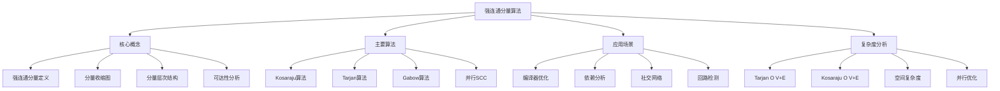
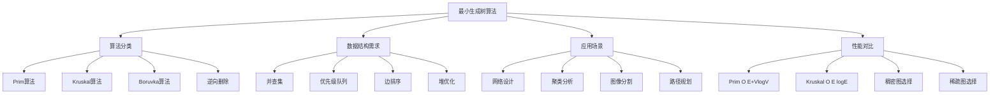
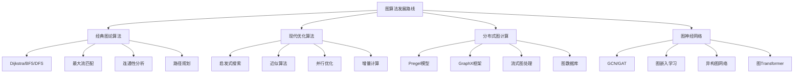

# Golang图算法深度解析：第四部分（高级图算法实战）

**(接上文) 第四部分：高级图算法实战**

## 四、强连通分量与连通性算法

### 4.1 强连通分量基础概念



### 4.2 Kosaraju算法实现

```go
package scc

import (
	"container/list"
	"fmt"
)

// Kosaraju算法实现强连通分量
type Kosaraju struct {
	graph       Graph
	visited     map[int]bool
	order       []int          // 逆后续遍历顺序
	components  [][]int        // 强连通分量结果
	componentID map[int]int    // 顶点到分量的映射
}

func NewKosaraju(graph Graph) *Kosaraju {
	return &Kosaraju{
		graph:       graph,
		visited:     make(map[int]bool),
		order:       make([]int, 0),
		components:  make([][]int, 0),
		componentID: make(map[int]int),
	}
}

// 计算强连通分量
func (k *Kosaraju) FindSCC() [][]int {
	// 第一步：在原始图上进行DFS，记录完成时间
	for v := range k.graph.Vertices() {
		k.visited[v] = false
	}
	
	for v := range k.graph.Vertices() {
		if !k.visited[v] {
			k.dfsFirstPass(v)
		}
	}
	
	// 第二步：转置图
	transposedGraph := k.transposeGraph()
	
	// 第三步：在转置图上按逆序进行DFS
	for v := range k.graph.Vertices() {
		k.visited[v] = false
	}
	
	componentIndex := 0
	
	// 按完成时间的逆序遍历
	for i := len(k.order) - 1; i >= 0; i-- {
		v := k.order[i]
		
		if !k.visited[v] {
			component := make([]int, 0)
			k.dfsSecondPass(transposedGraph, v, &component, componentIndex)
			
			if len(component) > 0 {
				k.components = append(k.components, component)
				componentIndex++
			}
		}
	}
	
	return k.components
}

// 第一次DFS：记录完成顺序
func (k *Kosaraju) dfsFirstPass(v int) {
	k.visited[v] = true
	
	for _, neighbor := range k.graph.Neighbors(v) {
		if !k.visited[neighbor] {
			k.dfsFirstPass(neighbor)
		}
	}
	
	// 后序：在递归返回时记录顶点
	k.order = append(k.order, v)
}

// 第二次DFS：在转置图上寻找分量
func (k *Kosaraju) dfsSecondPass(graph Graph, v int, component *[]int, compID int) {
	k.visited[v] = true
	k.componentID[v] = compID
	*component = append(*component, v)
	
	for _, neighbor := range graph.Neighbors(v) {
		if !k.visited[neighbor] {
			k.dfsSecondPass(graph, neighbor, component, compID)
		}
	}
}

// 构建转置图
func (k *Kosaraju) transposeGraph() Graph {
	transposed := NewBaseGraph(true) // 有向图
	
	// 添加所有顶点
	for v := range k.graph.Vertices() {
		transposed.AddVertex(v)
	}
	
	// 反向添加所有边
	for u := range k.graph.Vertices() {
		for _, v := range k.graph.Neighbors(u) {
			weight, _ := k.graph.Weight(u, v)
			transposed.AddEdge(v, u, weight)
		}
	}
	
	return transposed
}

// 获取分量收缩图（DAG）
func (k *Kosaraju) GetCondensationGraph() Graph {
	if len(k.components) == 0 {
		k.FindSCC()
	}
	
	condensed := NewBaseGraph(true)
	
	// 为每个分量创建一个新顶点
	for i := range k.components {
		condensed.AddVertex(i)
	}
	
	// 添加分量之间的边
	for u := range k.graph.Vertices() {
		for _, v := range k.graph.Neighbors(u) {
			uComp := k.componentID[u]
			vComp := k.componentID[v]
			
			// 不同分量之间添加边
			if uComp != vComp {
				// 检查边是否已存在
				exists := false
				for _, neighbor := range condensed.Neighbors(uComp) {
					if neighbor == vComp {
						exists = true
						break
					}
				}
				
				if !exists {
					condensed.AddEdge(uComp, vComp, 1.0)
				}
			}
		}
	}
	
	return condensed
}
```

### 4.3 Tarjan算法实现

```go
// Tarjan算法（基于DFS栈）
type Tarjan struct {
	graph        Graph
	index        int
	indices      map[int]int    // 顶点索引
	lowLinks     map[int]int    // 最低链接值
	onStack      map[int]bool    // 是否在栈中
	stack        list.List      // DFS栈
	components   [][]int        // 强连通分量
}

func NewTarjan(graph Graph) *Tarjan {
	return &Tarjan{
		graph:      graph,
		indices:    make(map[int]int),
		lowLinks:   make(map[int]int),
		onStack:    make(map[int]bool),
		components: make([][]int, 0),
	}
}

func (t *Tarjan) FindSCC() [][]int {
	t.index = 0
	t.stack.Init()
	
	// 初始化所有顶点
	for v := range t.graph.Vertices() {
		t.indices[v] = -1
		t.lowLinks[v] = -1
		t.onStack[v] = false
	}
	
	for v := range t.graph.Vertices() {
		if t.indices[v] == -1 {
			t.strongConnect(v)
		}
	}
	
	return t.components
}

func (t *Tarjan) strongConnect(v int) {
	// 设置顶点的深度索引
	t.indices[v] = t.index
	t.lowLinks[v] = t.index
	t.index++
	
	// 将顶点推入栈
	t.stack.PushBack(v)
	t.onStack[v] = true
	
	// 考虑v的所有邻居
	for _, w := range t.graph.Neighbors(v) {
		if t.indices[w] == -1 {
			// 未访问的顶点，递归处理
			t.strongConnect(w)
			t.lowLinks[v] = min(t.lowLinks[v], t.lowLinks[w])
		} else if t.onStack[w] {
			// w在栈中，属于当前强连通分量
			t.lowLinks[v] = min(t.lowLinks[v], t.indices[w])
		}
	}
	
	// 如果v是强连通分量的根
	if t.lowLinks[v] == t.indices[v] {
		component := make([]int, 0)
		
		// 弹出栈直到v
		for {
			if t.stack.Len() == 0 {
				break
			}
			
			back := t.stack.Back()
			w := back.Value.(int)
			t.stack.Remove(back)
			t.onStack[w] = false
			
			component = append(component, w)
			
			if w == v {
				break
			}
		}
		
		if len(component) > 0 {
			t.components = append(t.components, component)
		}
	}
}

func min(a, b int) int {
	if a < b {
		return a
	}
	return b
}
```

### 4.4 最小生成树算法



```go
package mst

import (
	"container/heap"
	"sort"
)

// 边结构
type Edge struct {
	From   int
	To     int
	Weight float64
}

// Prim算法实现
type PrimMST struct {
	graph    Graph
	visited  map[int]bool
	distance map[int]float64
	parent   map[int]int
	mstEdges []Edge
}

func NewPrimMST(graph Graph) *PrimMST {
	return &PrimMST{
		graph:    graph,
		visited:  make(map[int]bool),
		distance: make(map[int]float64),
		parent:   make(map[int]int),
		mstEdges: make([]Edge, 0),
	}
}

func (p *PrimMST) FindMST() ([]Edge, float64) {
	// 初始化
	for v := range p.graph.Vertices() {
		p.distance[v] = 1e18 // 极大值
		p.visited[v] = false
		p.parent[v] = -1
	}
	
	// 从顶点0开始（可任意选择起点）
	startVertex := p.getFirstVertex()
	if startVertex == -1 {
		return []Edge{}, 0
	}
	
	p.distance[startVertex] = 0
	
	// 使用最小堆
	pq := make(PriorityQueue, 0)
	heap.Init(&pq)
	heap.Push(&pq, &Item{vertex: startVertex, distance: 0})
	
	for pq.Len() > 0 {
		item := heap.Pop(&pq).(*Item)
		u := item.vertex
		
		if p.visited[u] {
			continue
		}
		
		p.visited[u] = true
		
		// 添加到MST（非起点）
		if p.parent[u] != -1 {
			p.mstEdges = append(p.mstEdges, Edge{
				From:   p.parent[u],
				To:     u,
				Weight: p.distance[u],
			})
		}
		
		// 更新邻居顶点
		for _, v := range p.graph.Neighbors(u) {
			if !p.visited[v] {
				weight, _ := p.graph.Weight(u, v)
				
				if weight < p.distance[v] {
					p.distance[v] = weight
					p.parent[v] = u
					heap.Push(&pq, &Item{vertex: v, distance: weight})
				}
			}
		}
	}
	
	totalWeight := 0.0
	for _, edge := range p.mstEdges {
		totalWeight += edge.Weight
	}
	
	return p.mstEdges, totalWeight
}

func (p *PrimMST) getFirstVertex() int {
	for v := range p.graph.Vertices() {
		return v
	}
	return -1
}

// Kruskal算法实现
type KruskalMST struct {
	graph    Graph
	edges    []Edge
	uf       *UnionFind
}

func NewKruskalMST(graph Graph) *KruskalMST {
	k := &KruskalMST{
		graph: graph,
		edges: make([]Edge, 0),
	}
	
	// 收集所有边
	k.collectEdges()
	
	return k
}

func (k *KruskalMST) FindMST() ([]Edge, float64) {
	// 按权重排序边
	sort.Slice(k.edges, func(i, j int) bool {
		return k.edges[i].Weight < k.edges[j].Weight
	})
	
	// 初始化并查集
	vertices := k.graph.Vertices()
	k.uf = NewUnionFind(len(vertices))
	
	mstEdges := make([]Edge, 0)
	totalWeight := 0.0
	
	for _, edge := range k.edges {
		if k.uf.Union(edge.From, edge.To) {
			mstEdges = append(mstEdges, edge)
			totalWeight += edge.Weight
			
			// 如果已经找到V-1条边，提前终止
			if len(mstEdges) == len(vertices)-1 {
				break
			}
		}
	}
	
	return mstEdges, totalWeight
}

func (k *KruskalMST) collectEdges() {
	// 使用集合避免重复边（无向图）
	edgeSet := make(map[[2]int]bool)
	
	for u := range k.graph.Vertices() {
		for _, v := range k.graph.Neighbors(u) {
			// 确保边只添加一次（u < v）
			if u < v {
				weight, _ := k.graph.Weight(u, v)
				
				key := [2]int{u, v}
				if !edgeSet[key] {
					k.edges = append(k.edges, Edge{u, v, weight})
					edgeSet[key] = true
				}
			}
		}
	}
}

// 并查集实现
type UnionFind struct {
	parent []int
	rank   []int
}

func NewUnionFind(size int) *UnionFind {
	uf := &UnionFind{
		parent: make([]int, size),
		rank:   make([]int, size),
	}
	
	for i := 0; i < size; i++ {
		uf.parent[i] = i
		uf.rank[i] = 0
	}
	
	return uf
}

func (uf *UnionFind) Find(x int) int {
	if uf.parent[x] != x {
		uf.parent[x] = uf.Find(uf.parent[x]) // 路径压缩
	}
	return uf.parent[x]
}

func (uf *UnionFind) Union(x, y int) bool {
	rootX := uf.Find(x)
	rootY := uf.Find(y)
	
	if rootX == rootY {
		return false // 已经在同一集合
	}
	
	// 按秩合并
	if uf.rank[rootX] < uf.rank[rootY] {
		uf.parent[rootX] = rootY
	} else if uf.rank[rootX] > uf.rank[rootY] {
		uf.parent[rootY] = rootX
	} else {
		uf.parent[rootY] = rootX
		uf.rank[rootX]++
	}
	
	return true
}
```

### 4.5 欧拉回路与哈密顿路径

```go
// 欧拉路径算法
type EulerianPath struct {
	graph Graph
}

func NewEulerianPath(graph Graph) *EulerianPath {
	return &EulerianPath{graph: graph}
}

// 检查图是否有欧拉路径
func (ep *EulerianPath) HasEulerianPath() (bool, []int) {
	if !ep.isConnected() {
		return false, nil
	}
	
	// 计算每个顶点的出度和入度
	outDegree := make(map[int]int)
	inDegree := make(map[int]int)
	
	for u := range ep.graph.Vertices() {
		outDegree[u] = len(ep.graph.Neighbors(u))
		inDegree[u] = 0
	}
	
	// 计算入度
	for u := range ep.graph.Vertices() {
		for _, v := range ep.graph.Neighbors(u) {
			inDegree[v]++
		}
	}
	
	// 检查度数条件
	startNodes := make([]int, 0)
	endNodes := make([]int, 0)
	
	for v := range ep.graph.Vertices() {
		diff := outDegree[v] - inDegree[v]
		
		if diff == 1 {
			startNodes = append(startNodes, v)
		} else if diff == -1 {
			endNodes = append(endNodes, v)
		} else if diff != 0 {
			return false, nil
		}
	}
	
	// 应该正好有0或2个奇度数顶点
	if len(startNodes) == 0 && len(endNodes) == 0 {
		// 欧拉回路
		startVertex := ep.getFirstVertex()
		path := ep.findEulerianCircuit(startVertex)
		return true, path
	} else if len(startNodes) == 1 && len(endNodes) == 1 {
		// 欧拉路径
		path := ep.findEulerianPath(startNodes[0])
		return true, path
	}
	
	return false, nil
}

// Hierholzer算法找欧拉回路
func (ep *EulerianPath) findEulerianCircuit(start int) []int {
	// 深度拷贝图的边（用于标记已用边）
	usedEdges := ep.copyEdges()
	
	stack := list.New()
	path := list.New()
	
	stack.PushBack(start)
	
	for stack.Len() > 0 {
		current := stack.Back().Value.(int)
		
		// 查找当前顶点的未使用边
		found := false
		neighbors := ep.graph.Neighbors(current)
		
		for i, neighbor := range neighbors {
			if !usedEdges[current][i] {
				// 标记边为已使用
				usedEdges[current][i] = true
				stack.PushBack(neighbor)
				found = true
				break
			}
		}
		
		if !found {
			// 当前顶点没有未使用的边，添加到路径
			stack.Remove(stack.Back())
			path.PushFront(current)
		}
	}
	
	// 转换为切片
	result := make([]int, 0, path.Len())
	for e := path.Front(); e != nil; e = e.Next() {
		result = append(result, e.Value.(int))
	}
	
	return result
}

// 复制边状态
func (ep *EulerianPath) copyEdges() map[int][]bool {
	usedEdges := make(map[int][]bool)
	
	for u := range ep.graph.Vertices() {
		neighbors := ep.graph.Neighbors(u)
		usedEdges[u] = make([]bool, len(neighbors))
	}
	
	return usedEdges
}

func (ep *EulerianPath) isConnected() bool {
	// 实现连通性检查
	visited := make(map[int]bool)
	
	startVertex := ep.getFirstVertex()
	if startVertex == -1 {
		return false
	}
	
	ep.dfsConnected(startVertex, visited)
	
	// 检查是否所有顶点都被访问
	for v := range ep.graph.Vertices() {
		if !visited[v] {
			return false
		}
	}
	
	return true
}

func (ep *EulerianPath) dfsConnected(v int, visited map[int]bool) {
	visited[v] = true
	
	for _, neighbor := range ep.graph.Neighbors(v) {
		if !visited[neighbor] {
			ep.dfsConnected(neighbor, visited)
		}
	}
}

func (ep *EulerianPath) getFirstVertex() int {
	for v := range ep.graph.Vertices() {
		return v
	}
	return -1
}
```

### 4.6 图论实战应用案例

```go
// 社交网络分析案例
type SocialNetworkAnalyzer struct {
	graph Graph
}

func NewSocialNetworkAnalyzer(graph Graph) *SocialNetworkAnalyzer {
	return &SocialNetworkAnalyzer{graph: graph}
}

// 计算网络中心性指标
func (sna *SocialNetworkAnalyzer) CalculateCentrality() map[string]map[int]float64 {
	result := make(map[string]map[int]float64)
	
	// 度中心性
	result["degree"] = sna.degreeCentrality()
	
	// 接近中心性
	result["closeness"] = sna.closenessCentrality()
	
	// 介数中心性
	result["betweenness"] = sna.betweennessCentrality()
	
	return result
}

// 度中心性
func (sna *SocialNetworkAnalyzer) degreeCentrality() map[int]float64 {
	vertices := sna.graph.Vertices()
	n := len(vertices)
	
	centrality := make(map[int]float64)
	
	for v := range vertices {
		degree := len(sna.graph.Neighbors(v))
		centrality[v] = float64(degree) / float64(n-1)
	}
	
	return centrality
}

// 接近中心性
func (sna *SocialNetworkAnalyzer) closenessCentrality() map[int]float64 {
	vertices := sna.graph.Vertices()
	centrality := make(map[int]float64)
	
	for v := range vertices {
		distances := sna.singleSourceDistances(v)
		totalDistance := 0.0
		reachableCount := 0
		
		for _, dist := range distances {
			if dist < 1e18 {
				totalDistance += dist
				reachableCount++
			}
		}
		
		if reachableCount > 1 {
			centrality[v] = float64(reachableCount-1) / totalDistance
		} else {
			centrality[v] = 0
		}
	}
	
	return centrality
}

// 介数中心性
func (sna *SocialNetworkAnalyzer) betweennessCentrality() map[int]float64 {
	vertices := sna.graph.Vertices()
	centrality := make(map[int]float64)
	
	for v := range vertices {
		centrality[v] = 0.0
	}
	
	// 简化实现：使用BFS计算所有顶点对的最短路径
	for s := range vertices {
		// 实现BFS计算最短路径数量
		distances, predecessors := sna.bfsShortestPaths(s)
		
		// 计算经过每个顶点的路径比例
		for t := range vertices {
			if s != t && distances[t] < 1e18 {
				// 重建路径并统计经过的顶点
				path := sna.reconstructPath(predecessors, s, t)
				
				for _, intermediate := range path[1 : len(path)-1] {
					centrality[intermediate] += 1.0
				}
			}
		}
	}
	
	// 归一化
	n := len(vertices)
	normalization := float64((n - 1) * (n - 2))
	
	for v := range centrality {
		centrality[v] /= normalization
	}
	
	return centrality
}

// 单源最短距离（BFS）
func (sna *SocialNetworkAnalyzer) singleSourceDistances(source int) map[int]float64 {
	distances := make(map[int]float64)
	visited := make(map[int]bool)
	
	for v := range sna.graph.Vertices() {
		distances[v] = 1e18
		visited[v] = false
	}
	
	distances[source] = 0
	visited[source] = true
	
	queue := list.New()
	queue.PushBack(source)
	
	for queue.Len() > 0 {
		front := queue.Front()
		queue.Remove(front)
		
		u := front.Value.(int)
		
		for _, v := range sna.graph.Neighbors(u) {
			if !visited[v] {
				visited[v] = true
				distances[v] = distances[u] + 1
				queue.PushBack(v)
			}
		}
	}
	
	return distances
}

// 推荐系统图算法
type RecommendationSystem struct {
	userItemGraph Graph
}

// 基于图的协同过滤
func (rs *RecommendationSystem) CollaborativeFiltering(user int, k int) []int {
	// 实现基于图结构的物品推荐
	// 使用随机游走或路径搜索算法
	
	recommendations := make([]int, 0)
	scores := make(map[int]float64)
	
	// 用户的历史交互物品
	userItems := rs.userItemGraph.Neighbors(user)
	
	// 计算物品之间的相似度
	for _, item1 := range userItems {
		for _, item2 := range rs.userItemGraph.Neighbors(item1) {
			if item2 != user { // 确保是物品节点
				sim := rs.calculateSimilarity(item1, item2)
				scores[item2] += sim
			}
		}
	}
	
	// 排序并返回top-k推荐
	recommendationList := make([]struct {
		item  int
		score float64
	}, 0, len(scores))
	
	for item, score := range scores {
		recommendationList = append(recommendationList, struct {
			item  int
			score float64
		}{item, score})
	}
	
	// 按分数排序
	sort.Slice(recommendationList, func(i, j int) bool {
		return recommendationList[i].score > recommendationList[j].score
	})
	
	// 取前k个
	for i := 0; i < k && i < len(recommendationList); i++ {
		recommendations = append(recommendations, recommendationList[i].item)
	}
	
	return recommendations
}

func (rs *RecommendationSystem) calculateSimilarity(item1, item2 int) float64 {
	// Jaccard相似度计算
	users1 := rs.userItemGraph.Neighbors(item1)
	users2 := rs.userItemGraph.Neighbors(item2)
	
	intersection := 0
	union := len(users1) + len(users2)
	
	// 计算交集大小
	userSet := make(map[int]bool)
	for _, user := range users1 {
		userSet[user] = true
	}
	
	for _, user := range users2 {
		if userSet[user] {
			intersection++
			union-- // 避免重复计数
		}
	}
	
	if union == 0 {
		return 0
	}
	
	return float64(intersection) / float64(union)
}
```

### 5.1 图算法技术演进路线



### 5.2 Golang图算法库设计建议

```go
// 完整的图算法库接口设计
type GraphAlgorithmLibrary interface {
	// 基础图算法
	Traversal() TraversalAlgorithms
	ShortestPath() ShortestPathAlgorithms
	Connectivity() ConnectivityAlgorithms
	
	// 高级图算法
	Flow() FlowAlgorithms
	Matching() MatchingAlgorithms
	Community() CommunityDetectionAlgorithms
	
	// 工具函数
	Metrics() GraphMetrics
	Visualization() GraphVisualization
	IO() GraphIO
}

type TraversalAlgorithms interface {
	BFS(start int) []int
	DFS(start int) []int
	TopologicalSort() ([]int, error)
}

type ShortestPathAlgorithms interface {
	Dijkstra(source int) ShortestPathResult
	BellmanFord(source int) (ShortestPathResult, bool) // 返回是否存在负环
	FloydWarshall() AllPairsShortestPath
}

type ConnectivityAlgorithms interface {
	ConnectedComponents() [][]int
	StronglyConnectedComponents() [][]int
	ArticulationPoints() []int
	Bridges() [][2]int
}

type FlowAlgorithms interface {
	MaxFlow(source, sink int) (float64, FlowResult)
	MinCut(source, sink int) (CutResult, error)
	BipartiteMatching() (int, [][2]int)
}

type CommunityDetectionAlgorithms interface {
	Louvain() CommunityResult
	LabelPropagation() CommunityResult
	GirvanNewman() CommunityResult
}

// 性能优化建议
type OptimizationStrategy struct {
	MemoryOptimization []string
	TimeOptimization   []string
	Parallelization    []string
	CachingStrategies  []string
}

func GetOptimizationStrategy(graphType string, graphSize int) OptimizationStrategy {
	strategy := OptimizationStrategy{
		MemoryOptimization: make([]string, 0),
		TimeOptimization:   make([]string, 0),
		Parallelization:    make([]string, 0),
		CachingStrategies:  make([]string, 0),
	}
	
	switch {
	case graphSize > 1000000:
		// 大规模图优化
		strategy.MemoryOptimization = append(strategy.MemoryOptimization,
			"使用压缩稀疏行格式(CSR)",
			"分块处理大型图",
			"使用磁盘存储辅助")
		
		strategy.Parallelization = append(strategy.Parallelization,
			"多线程BFS/DFS",
			"图分区并行计算",
			"流水线处理")
		
	case graphType == "social":
		// 社交网络特性优化
		strategy.TimeOptimization = append(strategy.TimeOptimization,
			"利用小世界特性",
			"社区结构预处理",
			"层次化计算")
		
	case graphType == "spatial":
		// 空间图优化
		strategy.CachingStrategies = append(strategy.CachingStrategies,
			"空间索引缓存",
			"路径预计算",
			"区域化处理")
	}
	
	return strategy
}
```

---

# Golang图算法深度解析：第二部分（最短路径算法）
**(接上文) 第二部分：最短路径算法深度实现**
## 二、单源最短路径算法
### 2.1 Dijkstra算法实现
    A[Dijkstra算法] --> B[核心思想]
    A --> C[数据结构选择]
    A --> D[优化策略]
    A --> E[应用场景]
    B --> B1[贪心策略]
    B --> B2[松弛操作]
    B --> B3[最短路径树]
    B --> B4[时间复杂度分析]
    C --> C1[优先级队列]
    C --> C2[最小堆实现]
    C --> C3[距离数组]
    C --> C4[前驱节点数组]
    D --> D1[堆优化]
    D --> D2[斐波那契堆]
    D --> D3[双向Dijkstra]
    D --> D4[A*搜索启发]
    E --> E1[路由规划]
    E --> E2[网络优化]
    E --> E3[资源分配]
    E --> E4[游戏AI路径]
### 2.2 Dijkstra算法深度实现
package shortestpath
	"math"
// 优先级队列项
type Item struct {
	vertex   int
	distance float64
	index    int
// 最小堆实现
type PriorityQueue []*Item
func (pq PriorityQueue) Len() int { return len(pq) }
func (pq PriorityQueue) Less(i, j int) bool {
	return pq[i].distance < pq[j].distance
func (pq PriorityQueue) Swap(i, j int) {
	pq[i], pq[j] = pq[j], pq[i]
	pq[i].index = i
	pq[j].index = j
func (pq *PriorityQueue) Push(x interface{}) {
	n := len(*pq)
	item := x.(*Item)
	item.index = n
	*pq = append(*pq, item)
func (pq *PriorityQueue) Pop() interface{} {
	old := *pq
	n := len(old)
	item := old[n-1]
	old[n-1] = nil
	item.index = -1
	*pq = old[0 : n-1]
	return item
// Dijkstra算法实现
type Dijkstra struct {
	graph     Graph
	distance  map[int]float64
	parent    map[int]int
	visited   map[int]bool
func NewDijkstra(graph Graph) *Dijkstra {
	return &Dijkstra{
func (d *Dijkstra) ShortestPath(start int) error {
	// 初始化距离和前驱节点
	for _, v := range d.graph.Vertices() {
		d.distance[v] = math.Inf(1)
		d.parent[v] = -1
		d.visited[v] = false
	d.distance[start] = 0
	// 创建优先级队列
	// 添加起点
	heap.Push(&pq, &Item{vertex: start, distance: 0})
		// 提取距离最小的顶点
		if d.visited[u] {
		d.visited[u] = true
		// 检查所有邻居顶点
		for _, v := range d.graph.Neighbors(u) {
			if d.visited[v] {
				continue
			// 松弛操作
			weight, err := d.graph.Weight(u, v)
			if err != nil {
				return fmt.Errorf("failed to get weight: %w", err)
			alt := d.distance[u] + weight
			if alt < d.distance[v] {
				d.distance[v] = alt
				d.parent[v] = u
				// 更新优先级队列
				heap.Push(&pq, &Item{vertex: v, distance: alt})
	return nil
func (d *Dijkstra) GetDistance(target int) (float64, error) {
	distance, exists := d.distance[target]
		return 0, fmt.Errorf("vertex %d not found", target)
	if math.IsInf(distance, 1) {
		return 0, fmt.Errorf("vertex %d is unreachable", target)
	return distance, nil
func (d *Dijkstra) GetPath(target int) ([]int, error) {
	if math.IsInf(d.distance[target], 1) {
		return nil, fmt.Errorf("vertex %d is unreachable", target)
	path := make([]int, 0)
	current := target
	// 反向追溯路径
	for current != -1 {
		path = append([]int{current}, path...)
		current = d.parent[current]
	return path, nil
// A*搜索算法（带启发式的Dijkstra）
type AStar struct {
	graph     Graph
	heuristic func(int, int) float64
	distance  map[int]float64
	parent    map[int]int
	visited   map[int]bool
func NewAStar(graph Graph, heuristic func(int, int) float64) *AStar {
	return &AStar{
		graph:     graph,
		heuristic: heuristic,
		distance:  make(map[int]float64),
		parent:    make(map[int]int),
		visited:   make(map[int]bool),
func (a *AStar) ShortestPath(start, target int) ([]int, error) {
	for _, v := range a.graph.Vertices() {
		a.distance[v] = math.Inf(1)
		a.parent[v] = -1
		a.visited[v] = false
	a.distance[start] = 0
	// 优先级队列，按f(n) = g(n) + h(n)排序
	fScore := a.distance[start] + a.heuristic(start, target)
	heap.Push(&pq, &Item{vertex: start, distance: fScore})
		if u == target {
			return a.reconstructPath(target), nil
		if a.visited[u] {
		a.visited[u] = true
		for _, v := range a.graph.Neighbors(u) {
			if a.visited[v] {
				continue
			weight, err := a.graph.Weight(u, v)
			if err != nil {
				return nil, fmt.Errorf("failed to get weight: %w", err)
			tentativeGScore := a.distance[u] + weight
			if tentativeGScore < a.distance[v] {
				a.parent[v] = u
				a.distance[v] = tentativeGScore
				fScore := tentativeGScore + a.heuristic(v, target)
				heap.Push(&pq, &Item{vertex: v, distance: fScore})
	return nil, fmt.Errorf("target %d is unreachable from start %d", target, start)
func (a *AStar) reconstructPath(target int) []int {
	path := make([]int, 0)
	current := target
	for current != -1 {
		path = append([]int{current}, path...)
		current = a.parent[current]
	return path
// 曼哈顿距离启发函数
func ManhattanDistance(x1, y1, x2, y2 int) float64 {
	return math.Abs(float64(x1-x2)) + math.Abs(float64(y1-y2))
// 欧几里得距离启发函数
func EuclideanDistance(x1, y1, x2, y2 int) float64 {
	dx := float64(x1 - x2)
	dy := float64(y1 - y2)
	return math.Sqrt(dx*dx + dy*dy)
### 2.3 Bellman-Ford算法实现
    A[Bellman-Ford算法] --> B[算法特点]
    A --> C[实现步骤]
    A --> E[优化策略]
    B --> B1[支持负权边]
    B --> B2[检测负权环]
    B --> B3[动态规划思想]
    B --> B4[时间复杂度O VE]
    C --> C1[初始化距离]
    C --> C2[松弛所有边]
    C --> C3[重复V-1次]
    C --> C4[检测负环]
    D --> D1[金融网络]
    D --> D2[风险分析]
    D --> D3[路由协议]
    D --> D4[成本优化]
    E --> E1[提前终止优化]
    E --> E2[SPFA优化]
    E --> E3[队列优化]
    E --> E4[并行处理]
// Bellman-Ford算法实现
type BellmanFord struct {
func NewBellmanFord(graph Graph) *BellmanFord {
	return &BellmanFord{
func (bf *BellmanFord) ShortestPath(start int) (bool, error) {
	// 初始化距离和前驱
	for _, v := range bf.graph.Vertices() {
		bf.distance[v] = math.Inf(1)
		bf.parent[v] = -1
	bf.distance[start] = 0
	vertices := bf.graph.Vertices()
	edges := bf.getAllEdges()
	// 松弛操作，执行V-1次
	for i := 0; i < len(vertices)-1; i++ {
		changed := false
		for _, edge := range edges {
			u, v, weight := edge[0], edge[1], edge[2]
			if bf.distance[u]+weight < bf.distance[v] {
				bf.distance[v] = bf.distance[u] + weight
				bf.parent[v] = u
				changed = true
		// 如果本次迭代没有更新，可以提前终止
		if !changed {
	// 检查是否存在负权环
	hasNegativeCycle := bf.detectNegativeCycle()
	return hasNegativeCycle, nil
func (bf *BellmanFord) getAllEdges() [][3]float64 {
	edges := make([][3]float64, 0)
	for _, u := range bf.graph.Vertices() {
		for _, v := range bf.graph.Neighbors(u) {
			weight, err := bf.graph.Weight(u, v)
			if err == nil {
				edges = append(edges, [3]float64{float64(u), float64(v), weight})
	return edges
func (bf *BellmanFord) detectNegativeCycle() bool {
	edges := bf.getAllEdges()
	for _, edge := range edges {
		u, v, weight := int(edge[0]), int(edge[1]), edge[2]
		if bf.distance[u]+weight < bf.distance[v] {
			return true // 存在负权环
func (bf *BellmanFord) GetDistance(target int) (float64, error) {
	distance, exists := bf.distance[target]
		return 0, fmt.Errorf("vertex %d not found", target)
	if math.IsInf(distance, 1) {
		return 0, fmt.Errorf("vertex %d is unreachable", target)
	return distance, nil
func (bf *BellmanFord) GetPath(target int) ([]int, error) {
	if math.IsInf(bf.distance[target], 1) {
		return nil, fmt.Errorf("vertex %d is unreachable", target)
	// 检查是否存在负权环影响路径
	path := make([]int, 0)
	current := target
	// 反向追溯路径，检测环路
	for current != -1 {
		if visited[current] {
			return nil, fmt.Errorf("negative cycle detected in path to %d", target)
		visited[current] = true
		path = append([]int{current}, path...)
		current = bf.parent[current]
	return path, nil
// SPFA (Shortest Path Faster Algorithm) - Bellman-Ford的优化版本
type SPFA struct {
	inQueue  map[int]bool
	count    map[int]int // 记录入队次数，用于检测负环
func NewSPFA(graph Graph) *SPFA {
	return &SPFA{
		inQueue:  make(map[int]bool),
		count:    make(map[int]int),
func (s *SPFA) ShortestPath(start int) (bool, error) {
	for _, v := range s.graph.Vertices() {
		s.distance[v] = math.Inf(1)
		s.parent[v] = -1
		s.inQueue[v] = false
		s.count[v] = 0
	s.distance[start] = 0
	queue.PushBack(start)
	s.inQueue[start] = true
	s.count[start]++
		s.inQueue[u] = false
		for _, v := range s.graph.Neighbors(u) {
			weight, err := s.graph.Weight(u, v)
			if err != nil {
				return false, fmt.Errorf("failed to get weight: %w", err)
			if s.distance[u]+weight < s.distance[v] {
				s.distance[v] = s.distance[u] + weight
				s.parent[v] = u
				if !s.inQueue[v] {
					queue.PushBack(v)
					s.inQueue[v] = true
					s.count[v]++
					// 检测负权环：如果顶点入队次数超过V次
					if s.count[v] > len(s.graph.Vertices()) {
						return true, nil // 存在负权环
### 2.4 多源最短路径算法
// Floyd-Warshall算法 - 多源最短路径
type FloydWarshall struct {
	graph      Graph
	distance   [][]float64
	next       [][]int
	vertices   []int
	vertexMap  map[int]int // 顶点到索引的映射
func NewFloydWarshall(graph Graph) *FloydWarshall {
	fw := &FloydWarshall{
		graph:     graph,
		vertices:  graph.Vertices(),
		vertexMap: make(map[int]int),
	n := len(fw.vertices)
	// 初始化顶点映射
	for i, v := range fw.vertices {
		fw.vertexMap[v] = i
	// 初始化距离矩阵
	fw.distance = make([][]float64, n)
	fw.next = make([][]int, n)
	for i := 0; i < n; i++ {
		fw.distance[i] = make([]float64, n)
		fw.next[i] = make([]int, n)
		for j := 0; j < n; j++ {
			if i == j {
				fw.distance[i][j] = 0
			} else {
				fw.distance[i][j] = math.Inf(1)
			fw.next[i][j] = -1
	// 初始化直接边
	for _, u := range fw.vertices {
		for _, v := range graph.Neighbors(u) {
			i := fw.vertexMap[u]
			j := fw.vertexMap[v]
			weight, err := graph.Weight(u, v)
			if err == nil {
				fw.distance[i][j] = weight
				fw.next[i][j] = j
	return fw
func (fw *FloydWarshall) ComputeAllPairs() {
	n := len(fw.vertices)
	// 动态规划核心算法
	for k := 0; k < n; k++ {
		for i := 0; i < n; i++ {
			for j := 0; j < n; j++ {
				if fw.distance[i][k]+fw.distance[k][j] < fw.distance[i][j] {
					fw.distance[i][j] = fw.distance[i][k] + fw.distance[k][j]
					fw.next[i][j] = fw.next[i][k]
func (fw *FloydWarshall) GetDistance(u, v int) (float64, error) {
	i, ok1 := fw.vertexMap[u]
	j, ok2 := fw.vertexMap[v]
	if !ok1 || !ok2 {
		return 0, fmt.Errorf("vertex not found")
	return fw.distance[i][j], nil
func (fw *FloydWarshall) GetPath(u, v int) ([]int, error) {
	i, ok1 := fw.vertexMap[u]
	j, ok2 := fw.vertexMap[v]
	if !ok1 || !ok2 {
		return nil, fmt.Errorf("vertex not found")
	if math.IsInf(fw.distance[i][j], 1) {
		return nil, fmt.Errorf("no path exists between %d and %d", u, v)
	path := make([]int, 0)
	current := i
	for current != j {
		if current == -1 {
			return nil, fmt.Errorf("path reconstruction failed")
		path = append(path, fw.vertices[current])
		current = fw.next[current][j]
	path = append(path, fw.vertices[j])
	return path, nil
// 检测负权环
func (fw *FloydWarshall) HasNegativeCycle() bool {
	n := len(fw.vertices)
	for i := 0; i < n; i++ {
		if fw.distance[i][i] < 0 {
			return true // 存在负权环
### 2.5 最短路径算法性能比较
// 算法性能分析器
type PathAlgorithmBenchmark struct {
	graph      Graph
	algorithms map[string]PathAlgorithm
type PathAlgorithm interface {
	ShortestPath(start int) error
	GetDistance(target int) (float64, error)
	GetPath(target int) ([]int, error)
func NewBenchmark(graph Graph) *PathAlgorithmBenchmark {
	benchmark := &PathAlgorithmBenchmark{
		algorithms: make(map[string]PathAlgorithm),
	// 注册各种算法
	benchmark.algorithms["Dijkstra"] = NewDijkstra(graph)
	benchmark.algorithms["BellmanFord"] = NewBellmanFord(graph)
	benchmark.algorithms["SPFA"] = NewSPFA(graph)
	return benchmark
func (b *PathAlgorithmBenchmark) Benchmark(start, target int) map[string]BenchmarkResult {
	results := make(map[string]BenchmarkResult)
	for name, algorithm := range b.algorithms {
		startTime := time.Now()
		err := algorithm.ShortestPath(start)
		if err != nil {
			results[name] = BenchmarkResult{
				Success:     false,
				Error:       err.Error(),
				TimeElapsed: time.Since(startTime),
		distance, distErr := algorithm.GetDistance(target)
		path, pathErr := algorithm.GetPath(target)
		result := BenchmarkResult{
			Success:     true,
			TimeElapsed: time.Since(startTime),
		if distErr == nil {
			result.Distance = distance
		if pathErr == nil {
			result.Path = path
			result.PathLength = len(path)
		results[name] = result
	return results
type BenchmarkResult struct {
	Success     bool
	Distance    float64
	Path        []int
	PathLength  int
	TimeElapsed time.Duration
	Error       string
// 算法选择推荐器
func RecommendAlgorithm(graph Graph, hasNegativeWeights bool, isSparse bool) string {
	vertices := graph.Vertices()
	edgesCount := graph.Size()
	if hasNegativeWeights {
		if isSparse {
			return "SPFA"
		return "BellmanFord"
	// 对于非负权图
	if isSparse {
		return "Dijkstra"
	// 稠密图或需要所有顶点对距离
	if len(vertices) < 1000 { // 顶点数较少时使用Floyd-Warshall
		return "FloydWarshall"
	return "Dijkstra"

---

# Golang图算法深度解析：第三部分（网络流与匹配算法）
**(接上文) 第三部分：网络流与匹配算法**
## 三、网络流算法
### 3.1 网络流基础概念
    A[网络流算法] --> B[基本概念]
    A --> C[核心算法]
    A --> D[优化策略]
    A --> E[应用场景]
    B --> B1[流网络定义]
    B --> B2[容量限制]
    B --> B3[流量守恒]
    B --> B4[增广路径]
    C --> C1[Ford-Fulkerson]
    C --> C2[Edmonds-Karp]
    C --> C3[Dinic算法]
    C --> C4[Push-Relabel]
    D --> D1[BFS层次图]
    D --> D2[容量缩放]
    D --> D3[多源多汇]
    D --> D4[最小割对偶]
    E --> E1[网络传输]
    E --> E2[资源分配]
    E --> E3[匹配问题]
    E --> E4[图像分割]
### 3.2 流网络数据结构
package maxflow
	"math"
type FlowEdge struct {
	from     int
	to       int
	capacity float64
	flow     float64
// 流网络图
type FlowNetwork struct {
	vertices map[int]bool
	adjacent map[int][]int      // 邻接表
	edges    map[[2]int]*FlowEdge // 边映射
	source   int                 // 源点
	sink     int                 // 汇点
func NewFlowNetwork(source, sink int) *FlowNetwork {
	return &FlowNetwork{
		vertices: make(map[int]bool),
		adjacent: make(map[int][]int),
		edges:    make(map[[2]int]*FlowEdge),
		source:   source,
		sink:     sink,
func (fn *FlowNetwork) AddVertex(v int) {
	if !fn.vertices[v] {
		fn.vertices[v] = true
		fn.adjacent[v] = make([]int, 0)
func (fn *FlowNetwork) AddEdge(from, to int, capacity float64) error {
	if capacity < 0 {
		return fmt.Errorf("capacity cannot be negative")
	fn.AddVertex(from)
	fn.AddVertex(to)
	key := [2]int{from, to}
	// 添加正向边
	fn.edges[key] = &FlowEdge{
		from:     from,
		to:       to,
		capacity: capacity,
		flow:     0,
	fn.adjacent[from] = append(fn.adjacent[from], to)
	// 添加反向边（残量图中的反向边）
	reverseKey := [2]int{to, from}
	if _, exists := fn.edges[reverseKey]; !exists {
		fn.edges[reverseKey] = &FlowEdge{
			from:     to,
			to:       from,
			capacity: 0,
			flow:     0,
		fn.adjacent[to] = append(fn.adjacent[to], from)
	return nil
func (fn *FlowNetwork) GetEdge(from, to int) (*FlowEdge, error) {
	key := [2]int{from, to}
	if edge, exists := fn.edges[key]; exists {
		return edge, nil
	return nil, fmt.Errorf("edge from %d to %d not found", from, to)
// 获取残量容量
func (fn *FlowNetwork) ResidualCapacity(from, to int) (float64, error) {
	edge, err := fn.GetEdge(from, to)
	if err != nil {
		return 0, err
	return edge.capacity - edge.flow, nil
// 获取残量网络中的邻接顶点
func (fn *FlowNetwork) ResidualNeighbors(v int) []int {
	neighbors := make([]int, 0)
	// 遍历所有可能的边
	for _, to := range fn.adjacent[v] {
		residual, err := fn.ResidualCapacity(v, to)
		if err == nil && residual > 0 {
			neighbors = append(neighbors, to)
	return neighbors
### 3.3 Ford-Fulkerson算法实现
    A[Ford-Fulkerson算法] --> B[算法步骤]
    A --> C[实现方式]
    A --> D[复杂度分析]
    A --> E[优化方向]
    B --> B1[初始化流量为0]
    B --> B2[在残量网络中找增广路径]
    B --> B3[确定路径上最小残量]
    B --> B4[沿路径增加流量]
    C --> C1[DFS搜索路径]
    C --> C2[BFS广度优先搜索]
    C --> C3[容量缩放优化]
    C --> C4[随机化选择]
    D --> D1[最坏情况O E⋅maxFlow]]
    D --> D2[实际性能良好]
    D --> D3[整数容量优势]
    D --> D4[浮点精度问题]
    E --> E1[Edmonds-Karp优化]
    E --> E2[Dinic分层优化]
    E --> E3[Push-Relabel方法]
    E --> E4[并行化处理]
// Ford-Fulkerson算法
type FordFulkerson struct {
	network *FlowNetwork
	visited map[int]bool
	parent  map[int]int
func NewFordFulkerson(network *FlowNetwork) *FordFulkerson {
	return &FordFulkerson{
		network: network,
		visited: make(map[int]bool),
		parent:  make(map[int]int),
func (ff *FordFulkerson) MaxFlow() (float64, error) {
	maxFlow := 0.0
	// 反复寻找增广路径直到找不到为止
		// 重置访问状态
		for v := range ff.network.vertices {
			ff.visited[v] = false
			ff.parent[v] = -1
		// 使用DFS寻找增广路径
		bottleneck, found := ff.findAugmentingPathDFS(ff.network.source, ff.network.sink)
			break // 没有更多增广路径
		// 沿路径增加流量
		current := ff.network.sink
		for current != ff.network.source {
			prev := ff.parent[current]
			// 增加正向边流量
			forwardEdge, _ := ff.network.GetEdge(prev, current)
			forwardEdge.flow += bottleneck
			// 减少反向边流量（相当于增加反向容量）
			reverseEdge, _ := ff.network.GetEdge(current, prev)
			reverseEdge.flow -= bottleneck
			current = prev
		maxFlow += bottleneck
	return maxFlow, nil
// DFS方式寻找增广路径
func (ff *FordFulkerson) findAugmentingPathDFS(current, sink int) (float64, bool) {
	ff.visited[current] = true
	if current == sink {
		return math.Inf(1), true // 找到汇点，瓶颈为无穷大
	for _, neighbor := range ff.network.ResidualNeighbors(current) {
		if !ff.visited[neighbor] {
			ff.parent[neighbor] = current
			// 获取当前边的残量容量
			residual, _ := ff.network.ResidualCapacity(current, neighbor)
			bottleneck, found := ff.findAugmentingPathDFS(neighbor, sink)
			if found {
				// 取当前边容量和路径瓶颈的最小值
				return math.Min(residual, bottleneck), true
	return 0, false
// Edmonds-Karp算法（使用BFS的Ford-Fulkerson）
type EdmondsKarp struct {
	network *FlowNetwork
	visited map[int]bool
	parent  map[int]int
func NewEdmondsKarp(network *FlowNetwork) *EdmondsKarp {
	return &EdmondsKarp{
		network: network,
		visited: make(map[int]bool),
		parent:  make(map[int]int),
func (ek *EdmondsKarp) MaxFlow() (float64, error) {
	maxFlow := 0.0
		// 使用BFS寻找最短增广路径
		bottleneck, found := ek.findAugmentingPathBFS()
		// 沿路径更新流量
		current := ek.network.sink
		for current != ek.network.source {
			prev := ek.parent[current]
			forwardEdge, _ := ek.network.GetEdge(prev, current)
			forwardEdge.flow += bottleneck
			reverseEdge, _ := ek.network.GetEdge(current, prev)
			reverseEdge.flow -= bottleneck
			current = prev
		maxFlow += bottleneck
	return maxFlow, nil
func (ek *EdmondsKarp) findAugmentingPathBFS() (float64, bool) {
	// 重置访问状态
	for v := range ek.network.vertices {
		ek.visited[v] = false
		ek.parent[v] = -1
	queue.PushBack(ek.network.source)
	ek.visited[ek.network.source] = true
	// 记录路径上的最小残量容量
	capacity := make(map[int]float64)
	capacity[ek.network.source] = math.Inf(1)
		for _, v := range ek.network.ResidualNeighbors(u) {
			if !ek.visited[v] {
				ek.visited[v] = true
				ek.parent[v] = u
				// 计算到v的最小容量
				residual, _ := ek.network.ResidualCapacity(u, v)
				capacity[v] = math.Min(capacity[u], residual)
				if v == ek.network.sink {
					return capacity[v], true
	return 0, false
### 3.4 Dinic算法实现
// Dinic算法 - 分层图优化
type Dinic struct {
	network   *FlowNetwork
	level     map[int]int   // 顶点的层次
	ptr       map[int]int   // 当前弧优化
	visited   map[int]bool
func NewDinic(network *FlowNetwork) *Dinic {
	return &Dinic{
		network: network,
		level:   make(map[int]int),
		ptr:     make(map[int]int),
		visited: make(map[int]bool),
func (d *Dinic) MaxFlow() (float64, error) {
	maxFlow := 0.0
	for d.bfsLevelGraph() {
		// 重置当前弧指针
		for v := range d.network.vertices {
			d.ptr[v] = 0
			// 使用DFS在层次图中发送阻塞流
			flow := d.dfsSendFlow(d.network.source, math.Inf(1))
			if flow == 0 {
			maxFlow += flow
	return maxFlow, nil
// BFS构建层次图
func (d *Dinic) bfsLevelGraph() bool {
	for v := range d.network.vertices {
		d.level[v] = -1
	queue.PushBack(d.network.source)
	d.level[d.network.source] = 0
		for _, v := range d.network.adjacent[u] {
			residual, _ := d.network.ResidualCapacity(u, v)
			if d.level[v] == -1 && residual > 0 {
				d.level[v] = d.level[u] + 1
	return d.level[d.network.sink] != -1
// DFS发送阻塞流（当前弧优化）
func (d *Dinic) dfsSendFlow(u int, flow float64) float64 {
	if u == d.network.sink {
		return flow
	for i := d.ptr[u]; i < len(d.network.adjacent[u]); i, d.ptr[u] = i+1, i+1 {
		v := d.network.adjacent[u][i]
		// 检查是否在层次图中且残量足够
		if d.level[v] == d.level[u]+1 {
			residual, _ := d.network.ResidualCapacity(u, v)
			if residual > 0 {
				sentFlow := d.dfsSendFlow(v, math.Min(flow, residual))
				if sentFlow > 0 {
					// 更新流量
					forwardEdge, _ := d.network.GetEdge(u, v)
					forwardEdge.flow += sentFlow
					reverseEdge, _ := d.network.GetEdge(v, u)
					reverseEdge.flow -= sentFlow
					return sentFlow
### 3.5 二分图匹配算法
    A[二分图匹配] --> B[算法分类]
    A --> C[应用场景]
    A --> D[复杂度分析]
    A --> E[优化方法]
    B --> B1[Hopcroft-Karp]
    B --> B2[Hungarian算法]
    B --> B3[DFS增广]
    B --> B4[BFS分层]
    C --> C1[任务分配]
    C --> C2[资源调度]
    C --> C3[稳定婚姻]
    C --> C4[广告匹配]
    D --> D1[最大流转化O VE]
    D --> D2[Hopcroft-Karp O √VE]
    D --> D3[Hungarian O V³]
    D --> D4[近似算法]
    E --> E1[双向BFS]
    E --> E2[并行匹配]
    E --> E3[预处理优化]
    E --> E4[贪心初始化]
// 二分图结构
type BipartiteGraph struct {
	leftVertices  []int            // 左侧顶点集合
	rightVertices []int            // 右侧顶点集合
	edges         map[int][]int    // 邻接表：left -> []right
	matchLeft     map[int]int      // 左侧顶点匹配的右侧顶点
	matchRight    map[int]int      // 右侧顶点匹配的左侧顶点
	visitedLeft   map[int]bool     // DFS辅助数组
func NewBipartiteGraph(left, right []int) *BipartiteGraph {
	bg := &BipartiteGraph{
		leftVertices:  left,
		rightVertices: right,
		edges:         make(map[int][]int),
		matchLeft:     make(map[int]int),
		matchRight:    make(map[int]int),
		visitedLeft:   make(map[int]bool),
	// 初始化匹配为-1（无匹配）
	for _, v := range left {
		bg.matchLeft[v] = -1
	for _, v := range right {
		bg.matchRight[v] = -1
	return bg
func (bg *BipartiteGraph) AddEdge(left, right int) {
	if bg.edges[left] == nil {
		bg.edges[left] = make([]int, 0)
	bg.edges[left] = append(bg.edges[left], right)
// 深度优先搜索增广路径
type Hungarian struct {
	graph *BipartiteGraph
func NewHungarian(graph *BipartiteGraph) *Hungarian {
	return &Hungarian{graph: graph}
func (h *Hungarian) MaxMatching() int {
	matchingCount := 0
	for _, left := range h.graph.leftVertices {
		// 重置访问标记
		for l := range h.graph.visitedLeft {
			h.graph.visitedLeft[l] = false
		if h.dfs(left) {
			matchingCount++
	return matchingCount
func (h *Hungarian) dfs(left int) bool {
	if h.graph.visitedLeft[left] {
	h.graph.visitedLeft[left] = true
	for _, right := range h.graph.edges[left] {
		// 检查右侧顶点是否未被匹配，或者可以重新匹配
		matchedLeft := h.graph.matchRight[right]
		if matchedLeft == -1 || h.dfs(matchedLeft) {
			h.graph.matchLeft[left] = right
			h.graph.matchRight[right] = left
			return true
// Hopcroft-Karp算法（更高效的二分图匹配）
type HopcroftKarp struct {
	graph       *BipartiteGraph
	distance    map[int]int
	matchLeft   map[int]int
	matchRight  map[int]int
func NewHopcroftKarp(graph *BipartiteGraph) *HopcroftKarp {
	hk := &HopcroftKarp{
		distance:   make(map[int]int),
		matchLeft:  make(map[int]int),
		matchRight: make(map[int]int),
	// 初始化匹配
	for _, left := range graph.leftVertices {
		hk.matchLeft[left] = -1
	for _, right := range graph.rightVertices {
		hk.matchRight[right] = -1
	return hk
func (hk *HopcroftKarp) MaxMatching() int {
	matchingCount := 0
	for hk.bfs() {
		for _, left := range hk.graph.leftVertices {
			if hk.matchLeft[left] == -1 && hk.dfs(left) {
				matchingCount++
	return matchingCount
// BFS构建分层图
func (hk *HopcroftKarp) bfs() bool {
	// 初始化距离
	for _, left := range hk.graph.leftVertices {
		if hk.matchLeft[left] == -1 {
			hk.distance[left] = 0
			queue.PushBack(left)
			hk.distance[left] = math.MaxInt32
	hk.distance[-1] = math.MaxInt32 // 特殊标记
		left := front.Value.(int)
		if hk.distance[left] < hk.distance[-1] {
			for _, right := range hk.graph.edges[left] {
				nextLeft := hk.matchRight[right]
				if hk.distance[nextLeft] == math.MaxInt32 {
					hk.distance[nextLeft] = hk.distance[left] + 1
					queue.PushBack(nextLeft)
	found = hk.distance[-1] != math.MaxInt32
	return found
// DFS增广路径
func (hk *HopcroftKarp) dfs(left int) bool {
	if left == -1 {
	for _, right := range hk.graph.edges[left] {
		nextLeft := hk.matchRight[right]
		if hk.distance[nextLeft] == hk.distance[left]+1 {
			if hk.dfs(nextLeft) {
				hk.matchRight[right] = left
				hk.matchLeft[left] = right
				return true
	hk.distance[left] = math.MaxInt32
### 3.6 最大流应用：最小割问题
// 最小割算法
type MinCut struct {
	network *FlowNetwork
	visited map[int]bool
func NewMinCut(network *FlowNetwork) *MinCut {
	return &MinCut{
		network: network,
		visited: make(map[int]bool),
// 基于最大流计算最小割
func (mc *MinCut) ComputeMinCut() ([]int, []int, float64, error) {
	// 先计算最大流
	dinic := NewDinic(mc.network)
	maxFlow, err := dinic.MaxFlow()
	if err != nil {
		return nil, nil, 0, err
	// 在残量网络中从源点进行BFS
	mc.bfsFromSource()
	// S集合：从源点可达的顶点
	sSet := make([]int, 0)
	// T集合：从源点不可达的顶点
	tSet := make([]int, 0)
	for v := range mc.network.vertices {
		if mc.visited[v] {
			sSet = append(sSet, v)
			tSet = append(tSet, v)
	return sSet, tSet, maxFlow, nil
func (mc *MinCut) bfsFromSource() {
	for v := range mc.network.vertices {
		mc.visited[v] = false
	queue.PushBack(mc.network.source)
	mc.visited[mc.network.source] = true
		for _, v := range mc.network.ResidualNeighbors(u) {
			if !mc.visited[v] {
				mc.visited[v] = true
// 流算法性能分析
type FlowAlgorithmBenchmark struct {
	algorithms map[string]FlowAlgorithm
type FlowAlgorithm interface {
	MaxFlow() (float64, error)
func NewFlowBenchmark() *FlowAlgorithmBenchmark {
	return &FlowAlgorithmBenchmark{
		algorithms: make(map[string]FlowAlgorithm),
func (fb *FlowAlgorithmBenchmark) AddAlgorithm(name string, algorithm FlowAlgorithm) {
	fb.algorithms[name] = algorithm
func (fb *FlowAlgorithmBenchmark) RunBenchmark(network *FlowNetwork) map[string]FlowBenchmarkResult {
	results := make(map[string]FlowBenchmarkResult)
	for name, algorithm := range fb.algorithms {
		startTime := time.Now()
		maxFlow, err := algorithm.MaxFlow()
		result := FlowBenchmarkResult{
			MaxFlow:     maxFlow,
			TimeElapsed: time.Since(startTime),
			Error:       err,
		if err == nil {
			result.Success = true
		results[name] = result
	return results
type FlowBenchmarkResult struct {
	Success     bool
	MaxFlow     float64
	TimeElapsed time.Duration
	Error       error
// 算法选择建议
func RecommendFlowAlgorithm(networkSize int, isDense bool, hasLargeCapacities bool) string {
	if networkSize <= 100 {
		return "EdmondsKarp" // 小规模网络
	if isDense {
		return "Dinic" // 稠密图使用Dinic
	if hasLargeCapacities {
		return "PushRelabel" // 大容量使用推流重标记
	return "Dinic" // 一般情况下推荐Dinic