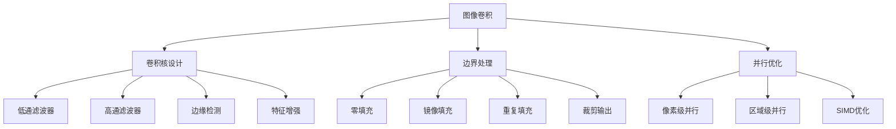
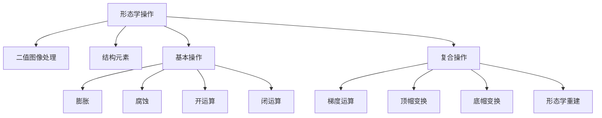

# Golang图像处理深度解析：第二部分（算法实现与高级技术）

**(接上文) 第二部分：高级图像处理算法实现**

## 二、图像滤波与卷积算法

### 2.1 卷积原理与基础算法



### 2.2 图像滤波算法实现

```go
package filters

import (
    "image"
    "image/color"
    "math"
    "sync"
)

// 卷积核类型定义
type Kernel [][]float64

// 常用卷积核预定义
var (
    // 高斯模糊核
    Gaussian3x3 = Kernel{
        {1.0 / 16, 2.0 / 16, 1.0 / 16},
        {2.0 / 16, 4.0 / 16, 2.0 / 16},
        {1.0 / 16, 2.0 / 16, 1.0 / 16},
    }
    
    // 边缘检测Sobel核
    SobelX = Kernel{
        {-1, 0, 1},
        {-2, 0, 2},
        {-1, 0, 1},
    }
    
    SobelY = Kernel{
        {-1, -2, -1},
        {0, 0, 0},
        {1, 2, 1},
    }
    
    // 锐化核
    Sharpen = Kernel{
        {0, -1, 0},
        {-1, 5, -1},
        {0, -1, 0},
    }
    
    // 均值模糊
    BoxBlur = Kernel{
        {1.0 / 9, 1.0 / 9, 1.0 / 9},
        {1.0 / 9, 1.0 / 9, 1.0 / 9},
        {1.0 / 9, 1.0 / 9, 1.0 / 9},
    }
)

// 卷积处理器
type ConvolutionProcessor struct{}

// 基础卷积运算
func (cp *ConvolutionProcessor) Convolve(img image.Image, kernel Kernel, boundary string) *image.RGBA {
    bounds := img.Bounds()
    width := bounds.Dx()
    height := bounds.Dy()
    
    kernelSize := len(kernel)
    kernelRadius := kernelSize / 2
    
    result := image.NewRGBA(bounds)
    
    for y := 0; y < height; y++ {
        for x := 0; x < width; x++ {
            var r, g, b, a float64
            var weightSum float64
            
            // 应用卷积核
            for ky := -kernelRadius; ky <= kernelRadius; ky++ {
                for kx := -kernelRadius; kx <= kernelRadius; kx++ {
                    // 计算核坐标
                    kernelY := ky + kernelRadius
                    kernelX := kx + kernelRadius
                    
                    // 计算图像坐标（处理边界）
                    imgX := x + kx
                    imgY := y + ky
                    
                    // 边界处理
                    if imgX < 0 || imgX >= width || imgY < 0 || imgY >= height {
                        switch boundary {
                        case "zero":
                            continue // 零填充，跳过
                        case "reflect":
                            // 镜像填充
                            if imgX < 0 { imgX = -imgX }
                            if imgX >= width { imgX = 2*width - imgX - 2 }
                            if imgY < 0 { imgY = -imgY }
                            if imgY >= height { imgY = 2*height - imgY - 2 }
                        case "repeat":
                            // 重复边界
                            if imgX < 0 { imgX = 0 }
                            if imgX >= width { imgX = width - 1 }
                            if imgY < 0 { imgY = 0 }
                            if imgY >= height { imgY = height - 1 }
                        default:
                            continue // 默认零填充
                        }
                    }
                    
                    // 获取像素颜色
                    pixel := img.At(imgX, imgY)
                    pr, pg, pb, pa := pixel.RGBA()
                    
                    // 转换为0-1范围
                    kernelValue := kernel[kernelY][kernelX]
                    r += float64(pr) * kernelValue
                    g += float64(pg) * kernelValue
                    b += float64(pb) * kernelValue
                    a += float64(pa) * kernelValue
                    weightSum += kernelValue
                }
            }
            
            // 归一化并设置结果像素
            if weightSum != 0 {
                r /= weightSum
                g /= weightSum
                b /= weightSum
                a /= weightSum
            }
            
            result.SetRGBA(x, y, color.RGBA{
                R: uint8(math.Max(0, math.Min(255, r/257))), // 257 = 65535/255
                G: uint8(math.Max(0, math.Min(255, g/257))),
                B: uint8(math.Max(0, math.Min(255, b/257))),
                A: uint8(math.Max(0, math.Min(255, a/257))),
            })
        }
    }
    
    return result
}

// 高斯模糊实现
func (cp *ConvolutionProcessor) GaussianBlur(img image.Image, sigma float64) *image.RGBA {
    // 根据sigma计算核大小（经验公式：核大小 ≈ 6σ + 1）
    kernelSize := int(6*sigma) + 1
    if kernelSize%2 == 0 {
        kernelSize++ // 确保为奇数
    }
    
    // 生成高斯核
    kernel := cp.generateGaussianKernel(kernelSize, sigma)
    
    return cp.Convolve(img, kernel, "reflect")
}

// 生成高斯核
func (cp *ConvolutionProcessor) generateGaussianKernel(size int, sigma float64) Kernel {
    kernel := make(Kernel, size)
    radius := size / 2
    var sum float64
    
    for y := -radius; y <= radius; y++ {
        row := make([]float64, size)
        for x := -radius; x <= radius; x++ {
            // 二维高斯函数
            exponent := -(float64(x*x + y*y)) / (2 * sigma * sigma)
            value := math.Exp(exponent) / (2 * math.Pi * sigma * sigma)
            row[x+radius] = value
            sum += value
        }
        kernel[y+radius] = row
    }
    
    // 归一化
    for y := range kernel {
        for x := range kernel[y] {
            kernel[y][x] /= sum
        }
    }
    
    return kernel
}

// 边缘检测算法
type EdgeDetector struct{}

// Sobel边缘检测
func (ed *EdgeDetector) SobelEdgeDetection(img image.Image) *image.Gray {
    bounds := img.Bounds()
    width := bounds.Dx()
    height := bounds.Dy()
    
    // 转换为灰度图像（如果需要）
    grayImg := ed.toGrayScale(img)
    
    result := image.NewGray(bounds)
    
    for y := 1; y < height-1; y++ {
        for x := 1; x < width-1; x++ {
            // 计算X和Y方向的梯度
            gx := ed.calculateGradient(grayImg, x, y, SobelX)
            gy := ed.calculateGradient(grayImg, x, y, SobelY)
            
            // 计算梯度幅度
            magnitude := math.Sqrt(float64(gx*gx + gy*gy))
            
            // 归一化到0-255范围
            if magnitude > 255 {
                magnitude = 255
            }
            
            result.SetGray(x, y, color.Gray{Y: uint8(magnitude)})
        }
    }
    
    return result
}

// Canny边缘检测（完整实现）
func (ed *EdgeDetector) CannyEdgeDetection(img image.Image, 
    lowThreshold, highThreshold float64) *image.Gray {
    
    // 步骤1：高斯模糊降噪
    processor := &ConvolutionProcessor{}
    smoothed := processor.GaussianBlur(img, 1.4)
    
    // 步骤2：计算梯度和方向
    bounds := smoothed.Bounds()
    width := bounds.Dx()
    height := bounds.Dy()
    
    gradients := make([][]float64, height)
    directions := make([][]float64, height)
    for i := range gradients {
        gradients[i] = make([]float64, width)
        directions[i] = make([]float64, width)
    }
    
    grayImg := ed.toGrayScale(smoothed)
    
    for y := 1; y < height-1; y++ {
        for x := 1; x < width-1; x++ {
            // Sobel算子计算梯度
            gx := ed.calculateGradient(grayImg, x, y, SobelX)
            gy := ed.calculateGradient(grayImg, x, y, SobelY)
            
            magnitude := math.Sqrt(float64(gx*gx + gy*gy))
            direction := math.Atan2(float64(gy), float64(gx)) * 180 / math.Pi
            
            // 标准化方向到0-180度
            if direction < 0 {
                direction += 180
            }
            
            gradients[y][x] = magnitude
            directions[y][x] = direction
        }
    }
    
    // 步骤3：非极大值抑制
    suppressed := ed.nonMaximumSuppression(gradients, directions)
    
    // 步骤4：双阈值检测和边缘连接
    result := ed.doubleThreshold(suppressed, lowThreshold, highThreshold)
    
    return result
}

// 转换为灰度图像
func (ed *EdgeDetector) toGrayScale(img image.Image) *image.Gray {
    bounds := img.Bounds()
    gray := image.NewGray(bounds)
    
    for y := bounds.Min.Y; y < bounds.Max.Y; y++ {
        for x := bounds.Min.X; x < bounds.Max.X; x++ {
            pixel := img.At(x, y)
            gray.Set(x, y, pixel)
        }
    }
    
    return gray
}

// 计算梯度
func (ed *EdgeDetector) calculateGradient(img *image.Gray, x, y int, kernel Kernel) int {
    var sum float64
    radius := len(kernel) / 2
    
    for ky := -radius; ky <= radius; ky++ {
        for kx := -radius; kx <= radius; kx++ {
            pixel := img.GrayAt(x+kx, y+ky)
            sum += float64(pixel.Y) * kernel[ky+radius][kx+radius]
        }
    }
    
    return int(sum)
}

// 非极大值抑制
func (ed *EdgeDetector) nonMaximumSuppression(gradients [][]float64, directions [][]float64) [][]float64 {
    height := len(gradients)
    width := len(gradients[0])
    
    result := make([][]float64, height)
    for i := range result {
        result[i] = make([]float64, width)
    }
    
    for y := 1; y < height-1; y++ {
        for x := 1; x < width-1; x++ {
            direction := directions[y][x]
            magnitude := gradients[y][x]
            
            var neighbor1, neighbor2 float64
            
            // 根据梯度方向确定相邻像素
            if (direction >= 0 && direction < 22.5) || (direction >= 157.5 && direction <= 180) {
                // 水平方向
                neighbor1 = gradients[y][x-1]
                neighbor2 = gradients[y][x+1]
            } else if direction >= 22.5 && direction < 67.5 {
                // 45度方向
                neighbor1 = gradients[y-1][x+1]
                neighbor2 = gradients[y+1][x-1]
            } else if direction >= 67.5 && direction < 112.5 {
                // 垂直方向
                neighbor1 = gradients[y-1][x]
                neighbor2 = gradients[y+1][x]
            } else if direction >= 112.5 && direction < 157.5 {
                // 135度方向
                neighbor1 = gradients[y-1][x-1]
                neighbor2 = gradients[y+1][x+1]
            }
            
            // 如果不是局部极大值，则抑制
            if magnitude >= neighbor1 && magnitude >= neighbor2 {
                result[y][x] = magnitude
            }
        }
    }
    
    return result
}

// 双阈值检测
func (ed *EdgeDetector) doubleThreshold(gradients [][]float64, low, high float64) *image.Gray {
    height := len(gradients)
    width := len(gradients[0])
    
    result := image.NewGray(image.Rect(0, 0, width, height))
    
    // 标记强边缘和弱边缘
    strongEdges := make([][]bool, height)
    for i := range strongEdges {
        strongEdges[i] = make([]bool, width)
    }
    
    for y := 0; y < height; y++ {
        for x := 0; x < width; x++ {
            if gradients[y][x] >= high {
                strongEdges[y][x] = true
                result.SetGray(x, y, color.Gray{Y: 255})
            } else if gradients[y][x] >= low {
                result.SetGray(x, y, color.Gray{Y: 128}) // 弱边缘
            }
        }
    }
    
    // 边缘连接：连接弱边缘到强边缘
    for y := 1; y < height-1; y++ {
        for x := 1; x < width-1; x++ {
            if result.GrayAt(x, y).Y == 128 {
                // 检查8邻域是否有强边缘
                hasStrongNeighbor := false
                for dy := -1; dy <= 1; dy++ {
                    for dx := -1; dx <= 1; dx++ {
                        if strongEdges[y+dy][x+dx] {
                            hasStrongNeighbor = true
                            break
                        }
                    }
                    if hasStrongNeighbor {
                        break
                    }
                }
                
                if hasStrongNeighbor {
                    result.SetGray(x, y, color.Gray{Y: 255})
                } else {
                    result.SetGray(x, y, color.Gray{Y: 0})
                }
            }
        }
    }
    
    return result
}
```

### 2.3 并行优化与性能提升

```go
package parallel

import (
    "image"
    "runtime"
    "sync"
)

// 并行卷积处理器
type ParallelConvolutionProcessor struct {
    numWorkers int
}

func NewParallelConvolutionProcessor() *ParallelConvolutionProcessor {
    return &ParallelConvolutionProcessor{
        numWorkers: runtime.NumCPU(),
    }
}

// 分块并行卷积
func (p *ParallelConvolutionProcessor) ParallelConvolve(img image.Image, 
    kernel [][]float64, boundary string) *image.RGBA {
    
    bounds := img.Bounds()
    height := bounds.Dy()
    
    result := image.NewRGBA(bounds)
    
    // 计算每个worker处理的行数
    rowsPerWorker := height / p.numWorkers
    if rowsPerWorker == 0 {
        rowsPerWorker = 1
    }
    
    var wg sync.WaitGroup
    
    for i := 0; i < p.numWorkers; i++ {
        wg.Add(1)
        
        startRow := i * rowsPerWorker
        endRow := startRow + rowsPerWorker
        
        if i == p.numWorkers-1 {
            endRow = height // 最后一个worker处理剩余行
        }
        
        go func(start, end int) {
            defer wg.Done()
            p.processRows(img, result, kernel, boundary, start, end)
        }(startRow, endRow)
    }
    
    wg.Wait()
    return result
}

// 处理指定行范围
func (p *ParallelConvolutionProcessor) processRows(src image.Image, dst *image.RGBA, 
    kernel [][]float64, boundary string, startRow, endRow int) {
    
    bounds := src.Bounds()
    width := bounds.Dx()
    
    kernelSize := len(kernel)
    kernelRadius := kernelSize / 2
    
    for y := startRow; y < endRow; y++ {
        for x := 0; x < width; x++ {
            // 卷积计算...
            // 与单线程版本类似，但只处理指定行范围
            var r, g, b, a float64
            var weightSum float64
            
            for ky := -kernelRadius; ky <= kernelRadius; ky++ {
                for kx := -kernelRadius; kx <= kernelRadius; kx++ {
                    kernelY := ky + kernelRadius
                    kernelX := kx + kernelRadius
                    
                    imgX := x + kx
                    imgY := y + ky
                    
                    // 边界处理...
                    // ...
                    
                    pixel := src.At(imgX, imgY)
                    pr, pg, pb, pa := pixel.RGBA()
                    
                    kernelValue := kernel[kernelY][kernelX]
                    r += float64(pr) * kernelValue
                    g += float64(pg) * kernelValue
                    b += float64(pb) * kernelValue
                    a += float64(pa) * kernelValue
                    weightSum += kernelValue
                }
            }
            
            // 设置像素...
        }
    }
}

// 图像处理流水线
type ImagePipeline struct {
    stages []PipelineStage
}

type PipelineStage func(img image.Image) image.Image

func NewImagePipeline() *ImagePipeline {
    return &ImagePipeline{
        stages: make([]PipelineStage, 0),
    }
}

func (p *ImagePipeline) AddStage(stage PipelineStage) *ImagePipeline {
    p.stages = append(p.stages, stage)
    return p
}

func (p *ImagePipeline) Process(img image.Image) image.Image {
    result := img
    for _, stage := range p.stages {
        result = stage(result)
    }
    return result
}

// 内存池优化
type ImagePool struct {
    pool sync.Pool
}

func NewImagePool(width, height int) *ImagePool {
    return &ImagePool{
        pool: sync.Pool{
            New: func() interface{} {
                return image.NewRGBA(image.Rect(0, 0, width, height))
            },
        },
    }
}

func (ip *ImagePool) Get() *image.RGBA {
    return ip.pool.Get().(*image.RGBA)
}

func (ip *ImagePool) Put(img *image.RGBA) {
    // 清空图像内容
    bounds := img.Bounds()
    for y := bounds.Min.Y; y < bounds.Max.Y; y++ {
        for x := bounds.Min.X; x < bounds.Max.X; x++ {
            img.Set(x, y, color.RGBA{})
        }
    }
    ip.pool.Put(img)
}
```

## 三、形态学操作与图像分割

### 3.1 形态学基础操作



### 3.2 形态学算法实现

```go
package morphology

import (
    "image"
    "image/color"
)

// 结构元素定义
type StructuringElement struct {
    data [][]bool
    centerX, centerY int
}

// 常用结构元素
var (
    // 3x3十字形结构元素
    Cross3x3 = &StructuringElement{
        data: [][]bool{
            {false, true, false},
            {true, true, true},
            {false, true, false},
        },
        centerX: 1,
        centerY: 1,
    }
    
    // 3x3方形结构元素
    Square3x3 = &StructuringElement{
        data: [][]bool{
            {true, true, true},
            {true, true, true},
            {true, true, true},
        },
        centerX: 1,
        centerY: 1,
    }
)

// 形态学处理器
type MorphologyProcessor struct{}

// 膨胀操作
func (mp *MorphologyProcessor) Dilate(img *image.Gray, se *StructuringElement) *image.Gray {
    bounds := img.Bounds()
    result := image.NewGray(bounds)
    
    seHeight := len(se.data)
    seWidth := len(se.data[0])
    
    for y := bounds.Min.Y; y < bounds.Max.Y; y++ {
        for x := bounds.Min.X; x < bounds.Max.X; x++ {
            // 初始化最大值为当前像素值
            maxVal := img.GrayAt(x, y).Y
            
            // 应用结构元素
            for sy := 0; sy < seHeight; sy++ {
                for sx := 0; sx < seWidth; sx++ {
                    if se.data[sy][sx] {
                        // 计算图像坐标
                        imgX := x + (sx - se.centerX)
                        imgY := y + (sy - se.centerY)
                        
                        // 边界检查
                        if imgX >= bounds.Min.X && imgX < bounds.Max.X &&
                           imgY >= bounds.Min.Y && imgY < bounds.Max.Y {
                            
                            pixelVal := img.GrayAt(imgX, imgY).Y
                            if pixelVal > maxVal {
                                maxVal = pixelVal
                            }
                        }
                    }
                }
            }
            
            result.SetGray(x, y, color.Gray{Y: maxVal})
        }
    }
    
    return result
}

// 腐蚀操作
func (mp *MorphologyProcessor) Erode(img *image.Gray, se *StructuringElement) *image.Gray {
    bounds := img.Bounds()
    result := image.NewGray(bounds)
    
    seHeight := len(se.data)
    seWidth := len(se.data[0])
    
    for y := bounds.Min.Y; y < bounds.Max.Y; y++ {
        for x := bounds.Min.X; x < bounds.Max.X; x++ {
            // 初始化最小值为当前像素值
            minVal := img.GrayAt(x, y).Y
            
            // 应用结构元素
            for sy := 0; sy < seHeight; sy++ {
                for sx := 0; sx < seWidth; sx++ {
                    if se.data[sy][sx] {
                        // 计算图像坐标
                        imgX := x + (sx - se.centerX)
                        imgY := y + (sy - se.centerY)
                        
                        // 边界检查
                        if imgX >= bounds.Min.X && imgX < bounds.Max.X &&
                           imgY >= bounds.Min.Y && imgY < bounds.Max.Y {
                            
                            pixelVal := img.GrayAt(imgX, imgY).Y
                            if pixelVal < minVal {
                                minVal = pixelVal
                            }
                        }
                    }
                }
            }
            
            result.SetGray(x, y, color.Gray{Y: minVal})
        }
    }
    
    return result
}

// 开运算（先腐蚀后膨胀）
func (mp *MorphologyProcessor) Open(img *image.Gray, se *StructuringElement) *image.Gray {
    eroded := mp.Erode(img, se)
    return mp.Dilate(eroded, se)
}

// 闭运算（先膨胀后腐蚀）
func (mp *MorphologyProcessor) Close(img *image.Gray, se *StructuringElement) *image.Gray {
    dilated := mp.Dilate(img, se)
    return mp.Erode(dilated, se)
}

// 形态学梯度（膨胀-腐蚀）
func (mp *MorphologyProcessor) Gradient(img *image.Gray, se *StructuringElement) *image.Gray {
    dilated := mp.Dilate(img, se)
    eroded := mp.Erode(img, se)
    
    bounds := img.Bounds()
    result := image.NewGray(bounds)
    
    for y := bounds.Min.Y; y < bounds.Max.Y; y++ {
        for x := bounds.Min.X; x < bounds.Max.X; x++ {
            dilatedVal := dilated.GrayAt(x, y).Y
            erodedVal := eroded.GrayAt(x, y).Y
            gradient := dilatedVal - erodedVal
            result.SetGray(x, y, color.Gray{Y: gradient})
        }
    }
    
    return result
}

// 顶帽变换（原图-开运算）
func (mp *MorphologyProcessor) TopHat(img *image.Gray, se *StructuringElement) *image.Gray {
    opened := mp.Open(img, se)
    
    bounds := img.Bounds()
    result := image.NewGray(bounds)
    
    for y := bounds.Min.Y; y < bounds.Max.Y; y++ {
        for x := bounds.Min.X; x < bounds.Max.X; x++ {
            originalVal := img.GrayAt(x, y).Y
            openedVal := opened.GrayAt(x, y).Y
            topHat := originalVal - openedVal
            result.SetGray(x, y, color.Gray{Y: topHat})
        }
    }
    
    return result
}

// 底帽变换（闭运算-原图）
func (mp *MorphologyProcessor) BottomHat(img *image.Gray, se *StructuringElement) *image.Gray {
    closed := mp.Close(img, se)
    
    bounds := img.Bounds()
    result := image.NewGray(bounds)
    
    for y := bounds.Min.Y; y < bounds.Max.Y; y++ {
        for x := bounds.Min.X; x < bounds.Max.X; x++ {
            closedVal := closed.GrayAt(x, y).Y
            originalVal := img.GrayAt(x, y).Y
            bottomHat := closedVal - originalVal
            result.SetGray(x, y, color.Gray{Y: bottomHat})
        }
    }
    
    return result
}

// 连通组件标记
type ConnectedComponents struct{}

func (cc *ConnectedComponents) LabelComponents(binaryImg *image.Gray) (*image.Gray, int) {
    bounds := binaryImg.Bounds()
    labels := image.NewGray(bounds)
    
    // 初始化标签图像
    for y := bounds.Min.Y; y < bounds.Max.Y; y++ {
        for x := bounds.Min.X; x < bounds.Max.X; x++ {
            labels.SetGray(x, y, color.Gray{Y: 0}) // 0表示未标记
        }
    }
    
    currentLabel := 1
    equivalenceTable := make(map[int]int)
    
    // 第一遍扫描：初步标记
    for y := bounds.Min.Y; y < bounds.Max.Y; y++ {
        for x := bounds.Min.X; x < bounds.Max.X; x++ {
            if binaryImg.GrayAt(x, y).Y > 128 { // 前景像素
                // 检查相邻像素的标签
                neighbors := cc.getNeighborLabels(labels, x, y)
                
                if len(neighbors) == 0 {
                    // 新组件
                    labels.SetGray(x, y, color.Gray{Y: uint8(currentLabel)})
                    currentLabel++
                } else {
                    // 使用最小标签
                    minLabel := neighbors[0]
                    for _, label := range neighbors {
                        if label < minLabel {
                            minLabel = label
                        }
                    }
                    labels.SetGray(x, y, color.Gray{Y: uint8(minLabel)})
                    
                    // 记录等价关系
                    for _, label := range neighbors {
                        if label != minLabel {
                            equivalenceTable[label] = minLabel
                        }
                    }
                }
            }
        }
    }
    
    // 第二遍扫描：解析等价关系
    componentCount := cc.resolveEquivalences(labels, equivalenceTable)
    
    return labels, componentCount
}

func (cc *ConnectedComponents) getNeighborLabels(labels *image.Gray, x, y int) []int {
    bounds := labels.Bounds()
    var neighborLabels []int
    
    // 4-连通邻域：上、左
    neighbors := [][]int{
        {x, y - 1}, // 上
        {x - 1, y}, // 左
    }
    
    for _, neighbor := range neighbors {
        nx, ny := neighbor[0], neighbor[1]
        if nx >= bounds.Min.X && nx < bounds.Max.X &&
           ny >= bounds.Min.Y && ny < bounds.Max.Y {
            label := int(labels.GrayAt(nx, ny).Y)
            if label > 0 {
                neighborLabels = append(neighborLabels, label)
            }
        }
    }
    
    return neighborLabels
}

func (cc *ConnectedComponents) resolveEquivalences(labels *image.Gray, equivalenceTable map[int]int) int {
    bounds := labels.Bounds()
    
    // 创建标签映射
    labelMap := make(map[int]int)
    for label := 1; label < 256; label++ {
        currentLabel := label
        
        // 找到最终的根标签
        for {
            if parent, exists := equivalenceTable[currentLabel]; exists {
                currentLabel = parent
            } else {
                break
            }
        }
        labelMap[label] = currentLabel
    }
    
    // 重新映射标签
    uniqueLabels := make(map[int]bool)
    for y := bounds.Min.Y; y < bounds.Max.Y; y++ {
        for x := bounds.Min.X; x < bounds.Max.X; x++ {
            oldLabel := int(labels.GrayAt(x, y).Y)
            if oldLabel > 0 {
                newLabel := labelMap[oldLabel]
                labels.SetGray(x, y, color.Gray{Y: uint8(newLabel)})
                uniqueLabels[newLabel] = true
            }
        }
    }
    
    return len(uniqueLabels)
}
```

### 3.3 图像分割算法

```go
package segmentation

import (
    "image"
    "image/color"
    "math"
    "math/rand"
    "sort"
)

// 阈值分割算法
type ThresholdSegmentation struct{}

// Otsu阈值分割
func (ts *ThresholdSegmentation) OtsuThreshold(img *image.Gray) (uint8, *image.Gray) {
    bounds := img.Bounds()
    
    // 计算灰度直方图
    histogram := make([]int, 256)
    totalPixels := bounds.Dx() * bounds.Dy()
    
    for y := bounds.Min.Y; y < bounds.Max.Y; y++ {
        for x := bounds.Min.X; x < bounds.Max.X; x++ {
            grayVal := img.GrayAt(x, y).Y
            histogram[grayVal]++
        }
    }
    
    // 计算Otsu阈值
    var sumTotal int64
    for i := 0; i < 256; i++ {
        sumTotal += int64(i) * int64(histogram[i])
    }
    
    var sumBackground int64
    var weightBackground int64
    var maxVariance float64
    var optimalThreshold uint8
    
    for t := 0; t < 256; t++ {
        weightBackground += int64(histogram[t])
        if weightBackground == 0 {
            continue
        }
        
        weightForeground := int64(totalPixels) - weightBackground
        if weightForeground == 0 {
            break
        }
        
        sumBackground += int64(t) * int64(histogram[t])
        meanBackground := float64(sumBackground) / float64(weightBackground)
        meanForeground := float64(sumTotal-sumBackground) / float64(weightForeground)
        
        // 计算类间方差
        variance := float64(weightBackground) * float64(weightForeground) * 
                   math.Pow(meanBackground-meanForeground, 2)
        
        if variance > maxVariance {
            maxVariance = variance
            optimalThreshold = uint8(t)
        }
    }
    
    // 应用阈值分割
    result := image.NewGray(bounds)
    for y := bounds.Min.Y; y < bounds.Max.Y; y++ {
        for x := bounds.Min.X; x < bounds.Max.X; x++ {
            grayVal := img.GrayAt(x, y).Y
            if grayVal > optimalThreshold {
                result.SetGray(x, y, color.Gray{Y: 255}) // 前景
            } else {
                result.SetGray(x, y, color.Gray{Y: 0})   // 背景
            }
        }
    }
    
    return optimalThreshold, result
}

// 区域生长分割
type RegionGrowing struct{}

func (rg *RegionGrowing) RegionGrow(img *image.Gray, seedX, seedY int, threshold uint8) *image.Gray {
    bounds := img.Bounds()
    result := image.NewGray(bounds)
    
    // 初始化所有像素为背景
    for y := bounds.Min.Y; y < bounds.Max.Y; y++ {
        for x := bounds.Min.X; x < bounds.Max.X; x++ {
            result.SetGray(x, y, color.Gray{Y: 0})
        }
    }
    
    seedValue := img.GrayAt(seedX, seedY).Y
    
    // 使用队列实现区域生长
    queue := [][2]int{{seedX, seedY}}
    result.SetGray(seedX, seedY, color.Gray{Y: 255})
    
    // 8-邻域偏移
    neighbors := [][2]int{
        {-1, -1}, {0, -1}, {1, -1},
        {-1, 0},           {1, 0},
        {-1, 1},  {0, 1},  {1, 1},
    }
    
    for len(queue) > 0 {
        current := queue[0]
        queue = queue[1:]
        
        x, y := current[0], current[1]
        
        // 检查所有邻域像素
        for _, offset := range neighbors {
            nx := x + offset[0]
            ny := y + offset[1]
            
            // 边界检查
            if nx < bounds.Min.X || nx >= bounds.Max.X ||
               ny < bounds.Min.Y || ny >= bounds.Max.Y {
                continue
            }
            
            // 检查是否已处理
            if result.GrayAt(nx, ny).Y > 0 {
                continue
            }
            
            // 检查相似性
            neighborValue := img.GrayAt(nx, ny).Y
            if absDiff(neighborValue, seedValue) <= threshold {
                result.SetGray(nx, ny, color.Gray{Y: 255})
                queue = append(queue, [2]int{nx, ny})
            }
        }
    }
    
    return result
}

// K-means聚类分割
type KMeansSegmentation struct{}

func (km *KMeansSegmentation) KMeansClustering(img *image.Gray, k int, maxIterations int) *image.Gray {
    bounds := img.Bounds()
    
    // 初始化质心
    centroids := make([]uint8, k)
    for i := range centroids {
        centroids[i] = uint8(rand.Intn(256))
    }
    
    result := image.NewGray(bounds)
    
    for iter := 0; iter < maxIterations; iter++ {
        // 分配像素到最近的质心
        clusterCounts := make([]int, k)
        clusterSums := make([]int, k)
        
        for y := bounds.Min.Y; y < bounds.Max.Y; y++ {
            for x := bounds.Min.X; x < bounds.Max.X; x++ {
                pixelValue := img.GrayAt(x, y).Y
                
                // 找到最近的质心
                minDistance := math.MaxFloat64
                bestCluster := 0
                
                for cluster := 0; cluster < k; cluster++ {
                    distance := math.Abs(float64(pixelValue) - float64(centroids[cluster]))
                    if distance < minDistance {
                        minDistance = distance
                        bestCluster = cluster
                    }
                }
                
                // 记录聚类结果
                result.SetGray(x, y, color.Gray{Y: uint8(bestCluster * (255 / (k - 1)))})
                clusterCounts[bestCluster]++
                clusterSums[bestCluster] += int(pixelValue)
            }
        }
        
        // 更新质心
        converged := true
        for cluster := 0; cluster < k; cluster++ {
            if clusterCounts[cluster] > 0 {
                newCentroid := uint8(clusterSums[cluster] / clusterCounts[cluster])
                if newCentroid != centroids[cluster] {
                    converged = false
                    centroids[cluster] = newCentroid
                }
            }
        }
        
        if converged {
            break
        }
    }
    
    return result
}

// 分水岭分割
type WatershedSegmentation struct{}

func (ws *WatershedSegmentation) Watershed(gradientImg *image.Gray, markers *image.Gray) *image.Gray {
    // 分水岭算法实现（简化版）
    // 实际实现需要更复杂的队列管理和区域合并
    
    bounds := gradientImg.Bounds()
    result := image.NewGray(bounds)
    
    // 基于梯度和标记进行区域分割
    // 这里展示基本思路，完整实现需要更多代码
    
    return result
}

// 辅助函数
func absDiff(a, b uint8) uint8 {
    if a > b {
        return a - b
    }
    return b - a
}
```

---

# Golang图像处理深度解析：从像素操作到高效算法实战
> 探索Go语言在图像处理领域的强大能力，涵盖从基础像素操作到复杂算法实现的完整技术栈
## 引言：为什么选择Golang进行图像处理？
在当今多媒体时代，图像处理已成为现代应用的核心需求。无论是电商平台的商品图片处理、社交媒体的滤镜效果，还是AI模型的图像预处理，高效可靠的图像处理能力都是不可或缺的。Golang凭借其高性能、强并发和简洁的语法，在图像处理领域展现出独特的优势。
本文将通过深度技术解析，带你全面掌握Golang图像处理的核心技术。
## 第一部分：图像处理基础与Go标准库
### 1.1 图像处理的基本概念
    A[图像处理基础] --> B1[像素表示]
    A --> B2[色彩空间]
    A --> B3[图像格式]
    A --> B4[坐标系统]
    B1 --> C1[RGBA色彩模型]
    B1 --> C2[灰度图像]
    B1 --> C3[调色板图像]
    B2 --> C4[RGB色彩空间]
    B2 --> C5[HSL色彩空间]
    B2 --> C6[YUV色彩空间]
    B3 --> C7[位图格式]
    B3 --> C8[矢量格式]
    B3 --> C9[压缩格式]
### 1.2 Go标准库image包深度解析
Go语言标准库提供了强大的`image`包，这是所有图像处理的基础。让我们深入理解其核心设计：
#### 核心接口：image.Image
package main
    "fmt"
// 理解image.Image接口
type Image interface {
    // 核心方法
    ColorModel() color.Model      // 颜色模型
    Bounds() Rectangle           // 图像边界
    At(x, y int) color.Color     // 获取像素颜色
func analyzeImage(img image.Image) {
    // 获取图像基本信息
    colorModel := img.ColorModel()
    fmt.Printf("图像尺寸: %d x %d\n", width, height)
    fmt.Printf("颜色模型: %T\n", colorModel)
    // 遍历像素（示例：查找特定颜色）
            pixelColor := img.At(x, y)
            // 转换为RGBA格式
            r, g, b, a := pixelColor.RGBA()
            // 检查是否为红色（示例）
            if r > 0x8000 && g < 0x4000 && b < 0x4000 {
                fmt.Printf("发现红色像素在 (%d, %d): R=%d, G=%d, B=%d\n", 
                    x, y, r>>8, g>>8, b>>8)
// 实现自定义图像类型
type CustomImage struct {
    width, height int
    pixels        [][]color.RGBA
func (ci *CustomImage) ColorModel() color.Model {
    return color.RGBAModel
func (ci *CustomImage) Bounds() image.Rectangle {
    return image.Rect(0, 0, ci.width, ci.height)
func (ci *CustomImage) At(x, y int) color.Color {
    if x < 0 || x >= ci.width || y < 0 || y >= ci.height {
        return color.RGBA{}
    return ci.pixels[y][x]
// 创建渐变图像示例
func createGradientImage(width, height int) *image.RGBA {
    img := image.NewRGBA(image.Rect(0, 0, width, height))
    // 创建水平渐变
        // 计算渐变因子 (0.0 - 1.0)
        factor := float64(x) / float64(width-1)
        for y := 0; y < height; y++ {
            // 从蓝色渐变到红色
            r := uint8(255 * factor)
            g := uint8(128 * (1 - factor))
            b := uint8(255 * (1 - factor))
            img.Set(x, y, color.RGBA{r, g, b, 255})
    return img
#### 常用图像类型对比
| 图像类型 | 内存占用 | 适用场景 | 优势 |
|---------|---------|---------|------|
| `image.RGBA` | 4字节/像素 | 通用图像处理 | 直接RGBA访问 |
| `image.NRGBA` | 4字节/像素 | Web图像 | 非预乘Alpha通道 |
| `image.Gray` | 1字节/像素 | 灰度处理 | 内存效率高 |
| `image.Paletted` | 可变 | 颜色有限图像 | 极低内存占用 |
### 1.3 图像创建与基础操作
package main
    "image/draw"
// 基础图像操作工具包
type ImageUtils struct{}
// 创建空白图像
func (iu *ImageUtils) CreateBlankImage(width, height int, bgColor color.Color) *image.RGBA {
    img := image.NewRGBA(image.Rect(0, 0, width, height))
    // 填充背景色
    draw.Draw(img, img.Bounds(), &image.Uniform{bgColor}, image.Point{}, draw.Src)
    return img
// 图像裁剪
func (iu *ImageUtils) CropImage(src image.Image, rect image.Rectangle) *image.RGBA {
    // 确保裁剪区域在图像范围内
    cropRect := rect.Intersect(bounds)
    if cropRect.Empty() {
        return nil
    // 创建裁剪后的图像
    cropped := image.NewRGBA(cropRect)
    // 绘制裁剪区域
    draw.Draw(cropped, cropped.Bounds(), src, cropRect.Min, draw.Src)
    return cropped
// 图像缩放（最近邻插值）
func (iu *ImageUtils) ScaleImageNearest(src image.Image, newWidth, newHeight int) *image.RGBA {
    srcBounds := src.Bounds()
    srcWidth := srcBounds.Dx()
    srcHeight := srcBounds.Dy()
    dst := image.NewRGBA(image.Rect(0, 0, newWidth, newHeight))
    // 计算缩放比例
    scaleX := float64(srcWidth) / float64(newWidth)
    scaleY := float64(srcHeight) / float64(newHeight)
    for y := 0; y < newHeight; y++ {
        for x := 0; x < newWidth; x++ {
            // 计算原图对应位置
            srcX := int(float64(x) * scaleX)
            srcY := int(float64(y) * scaleY)
            if srcX >= 0 && srcX < srcWidth && srcY >= 0 && srcY < srcHeight {
                dst.Set(x, y, src.At(srcX, srcY))
    return dst
// 图像旋转
func (iu *ImageUtils) RotateImage(src image.Image, angle float64) *image.RGBA {
    // 计算旋转后的图像尺寸
    sin, cos := math.Sin(angle), math.Cos(angle)
    // 计算新图像边界
    x1 := int(cos*float64(width) - sin*float64(height))
    y1 := int(sin*float64(width) + cos*float64(height))
    x2 := int(cos*float64(width) - sin*0)
    y2 := int(sin*float64(width) + cos*0)
    x3 := int(cos*0 - sin*float64(height))
    y3 := int(sin*0 + cos*float64(height))
    minX := min(0, x1, x2, x3)
    maxX := max(0, x1, x2, x3)
    minY := min(0, y1, y2, y3)
    maxY := max(0, y1, y2, y3)
    newWidth := maxX - minX
    newHeight := maxY - minY
    dst := image.NewRGBA(image.Rect(0, 0, newWidth, newHeight))
    // 旋转每个像素
    centerX, centerY := float64(width)/2, float64(height)/2
    newCenterX, newCenterY := float64(newWidth)/2, float64(newHeight)/2
    for y := 0; y < newHeight; y++ {
        for x := 0; x < newWidth; x++ {
            // 计算相对于新中心的坐标
            relX := float64(x) - newCenterX
            relY := float64(y) - newCenterY
            // 反向旋转到原图坐标
            srcX := int(cos*relX + sin*relY + centerX)
            srcY := int(-sin*relX + cos*relY + centerY)
            // 边界检查并设置像素
            if srcX >= 0 && srcX < width && srcY >= 0 && srcY < height {
                dst.Set(x, y, src.At(srcX, srcY))
    return dst
func min(values ...int) int {
    minVal := values[0]
    for _, v := range values[1:] {
        if v < minVal {
            minVal = v
    return minVal
func max(values ...int) int {
    maxVal := values[0]
    for _, v := range values[1:] {
        if v > maxVal {
            maxVal = v
    return maxVal
// HSL颜色空间处理
type HSLColor struct {
    H, S, L float64 // 色相(0-360), 饱和度(0-1), 亮度(0-1)
// HSL转RGB
func (hsl HSLColor) ToRGB() color.RGBA {
    h := hsl.H / 360.0
    s := hsl.S
    l := hsl.L
    var r, g, b float64
    if s == 0 {
        r, g, b = l, l, l // 灰度
        var hue2rgb = func(p, q, t float64) float64 {
            if t < 0 { t += 1 }
            if t > 1 { t -= 1 }
            if t < 1.0/6.0 { return p + (q-p)*6*t }
            if t < 1.0/2.0 { return q }
            if t < 2.0/3.0 { return p + (q-p)*(2.0/3.0-t)*6 }
            return p
        q := l * (1 + s)
        if l > 0.5 { q = l + s - l*s }
        p := 2*l - q
        r = hue2rgb(p, q, h+1.0/3.0)
        g = hue2rgb(p, q, h)
        b = hue2rgb(p, q, h-1.0/3.0)
    return color.RGBA{
        R: uint8(r * 255),
        G: uint8(g * 255),
        B: uint8(b * 255),
        A: 255,
// 使用HSL创建彩虹渐变
func createRainbowGradient(width, height int) *image.RGBA {
    img := image.NewRGBA(image.Rect(0, 0, width, height))
        hue := float64(x) / float64(width) * 360.0
        hsl := HSLColor{H: hue, S: 0.8, L: 0.6}
        for y := 0; y < height; y++ {
            img.Set(x, y, hsl.ToRGB())
    return img
### 1.4 图片格式读写与编码优化
Go标准库支持多种图片格式的编解码，每种格式都有其独特的特性和优化策略：
package main
    "bytes"
    "fmt"
    "image/jpeg"
    "image/png"
    "os"
// 图片格式处理器
type ImageFormatHandler struct{}
// PNG格式处理（无损压缩）
func (h *ImageFormatHandler) ProcessPNG(img image.Image, compressionLevel png.CompressionLevel) ([]byte, error) {
    var buf bytes.Buffer
    encoder := &png.Encoder{
        CompressionLevel: compressionLevel,
    if err := encoder.Encode(&buf, img); err != nil {
        return nil, err
    return buf.Bytes(), nil
// JPEG格式处理（有损压缩）
func (h *ImageFormatHandler) ProcessJPEG(img image.Image, quality int) ([]byte, error) {
    var buf bytes.Buffer
    options := &jpeg.Options{
        Quality: quality, // 1-100，质量越高文件越大
    if err := jpeg.Encode(&buf, img, options); err != nil {
        return nil, err
    return buf.Bytes(), nil
// 图片格式智能选择
type FormatOptimizer struct{}
func (o *FormatOptimizer) OptimizeFormat(img image.Image, targetSizeKB int) ([]byte, string, error) {
    // 首先尝试高质量JPEG
    jpegData, err := jpeg.Encode(bytes.NewBuffer(nil), img, &jpeg.Options{Quality: 85})
    if err != nil {
        return nil, "", err
    jpegSize := len(jpegData) / 1024
    // 检查是否满足目标大小
    if jpegSize <= targetSizeKB {
        return jpegData, "JPEG", nil
    // 如果JPEG太大，尝试降低质量
    for quality := 80; quality >= 30; quality -= 10 {
        jpegData, err = jpeg.Encode(bytes.NewBuffer(nil), img, &jpeg.Options{Quality: quality})
        if err != nil {
        if len(jpegData)/1024 <= targetSizeKB {
            return jpegData, fmt.Sprintf("JPEG-Q%d", quality), nil
    // 如果JPEG仍太大，尝试PNG（可能更小对于某些图像）
    pngData, err := png.Encode(bytes.NewBuffer(nil), img)
    if err == nil && len(pngData)/1024 <= targetSizeKB {
        return pngData, "PNG", nil
    // 最后使用最低质量JPEG
    jpegData, err = jpeg.Encode(bytes.NewBuffer(nil), img, &jpeg.Options{Quality: 10})
    if err != nil {
        return nil, "", err
    return jpegData, "JPEG-Q10", nil
// 批量图片处理流水线
type BatchImageProcessor struct {
    workers int
func NewBatchImageProcessor(workers int) *BatchImageProcessor {
    return &BatchImageProcessor{workers: workers}
// 并发处理多张图片
func (p *BatchImageProcessor) ProcessBatch(images []image.Image, 
    processor func(img image.Image) ([]byte, error)) ([][]byte, error) {
    results := make([][]byte, len(images))
    errors := make([]error, len(images))
    sem := make(chan struct{}, p.workers) // 控制并发数
    for i, img := range images {
        sem <- struct{}{} // 获取信号量
        go func(index int, image image.Image) {
            defer func() { <-sem }() // 释放信号量
            result, err := processor(image)
            results[index] = result
            errors[index] = err
        }(i, img)
    // 检查是否有错误
    for _, err := range errors {
        if err != nil {
            return nil, err
    return results, nil
// 图片格式检测
type ImageFormatDetector struct{}
func (d *ImageFormatDetector) DetectFormat(data []byte) (string, error) {
    // PNG签名：89 50 4E 47 0D 0A 1A 0A
    if len(data) >= 8 && data[0] == 0x89 && data[1] == 0x50 && 
       data[2] == 0x4E && data[3] == 0x47 && data[4] == 0x0D &&
       data[5] == 0x0A && data[6] == 0x1A && data[7] == 0x0A {
        return "PNG", nil
    // JPEG签名：FF D8 FF
    if len(data) >= 3 && data[0] == 0xFF && data[1] == 0xD8 && data[2] == 0xFF {
        return "JPEG", nil
    // GIF签名：GIF87a或GIF89a
    if len(data) >= 6 && (string(data[:6]) == "GIF87a" || string(data[:6]) == "GIF89a") {
        return "GIF", nil
    // BMP签名：BM
    if len(data) >= 2 && data[0] == 0x42 && data[1] == 0x4D {
        return "BMP", nil
    return "", fmt.Errorf("未知图片格式")

---

# Golang图像处理深度解析：第三部分（性能优化与高级技术）
**(接上文) 第四部分：性能优化与高级技术**
## 四、内存优化与高效处理
### 4.1 内存管理与优化策略
    A[内存优化策略] --> B[对象池]
    A --> C[内存复用]
    A --> D[零分配]
    A --> E[缓存优化]
    B --> B1[图像池]
    B --> B2[缓冲区池]
    B --> B3[切片池]
    B --> B4[GC优化]
    C --> C1[逐像素处理]
    C --> C2[块处理]
    C --> C3[流水线]
    C --> C4[复用结果]
    D --> D1[栈分配]
    D --> D2[预分配切片]
    D --> D3[复用切片]
    D --> D4[避免临时对象]
    E --> E1[局部性原理]
    E --> E2[预取机制]
    E --> E3[热数据识别]
    E --> E4[缓存友好访问]
### 4.2 零分配图像处理
package optimization
    "unsafe"
// 高性能图像处理器
type HighPerformanceProcessor struct {
    pool *sync.Pool
func NewHighPerformanceProcessor() *HighPerformanceProcessor {
    return &HighPerformanceProcessor{
        pool: &sync.Pool{
                return &PixelBuffer{}
// 像素缓冲区（零分配操作）
type PixelBuffer struct {
    data []uint8
    width, height int
func (pb *PixelBuffer) Reset(width, height int) {
    requiredSize := width * height * 4
    if cap(pb.data) < requiredSize {
        pb.data = make([]uint8, requiredSize)
        pb.data = pb.data[:requiredSize]
    pb.width = width
    pb.height = height
// 零分配高斯模糊
func (hpp *HighPerformanceProcessor) ZeroAllocGaussianBlur(
    img *image.RGBA, sigma float64) *image.RGBA {
    // 获取像素缓冲区
    buffer := hpp.pool.Get().(*PixelBuffer)
    defer hpp.pool.Put(buffer)
    buffer.Reset(width, height)
    // 复制图像数据到缓冲区（避免锁）
    copy(buffer.data, img.Pix)
    // 计算高斯核
    if kernelSize%2 == 0 { kernelSize++ }
    kernel := hpp.generateGaussianKernelNoAlloc(kernelSize, sigma)
    // 应用水平模糊
    tempBuffer := hpp.pool.Get().(*PixelBuffer)
    defer hpp.pool.Put(tempBuffer)
    tempBuffer.Reset(width, height)
    hpp.applyHorizontalConvolution(buffer, tempBuffer, kernel)
    // 应用垂直模糊
    hpp.applyVerticalConvolution(tempBuffer, result, kernel)
// 无分配高斯核生成
func (hpp *HighPerformanceProcessor) generateGaussianKernelNoAlloc(
    size int, sigma float64) []float64 {
    kernel := make([]float64, size)
    for i := -radius; i <= radius; i++ {
        exponent := -float64(i*i) / (2 * sigma * sigma)
        value := math.Exp(exponent) / math.Sqrt(2*math.Pi*sigma*sigma)
        kernel[i+radius] = value
    for i := range kernel {
        kernel[i] /= sum
// 零分配水平卷积
func (hpp *HighPerformanceProcessor) applyHorizontalConvolution(
    src, dst *PixelBuffer, kernel []float64) {
    for y := 0; y < src.height; y++ {
        for x := 0; x < src.width; x++ {
            for k := -radius; k <= radius; k++ {
                kx := x + k
                if kx < 0 { kx = 0 }
                if kx >= src.width { kx = src.width - 1 }
                kernelValue := kernel[k+radius]
                pixelOffset := (y*src.width + kx) * 4
                r += float64(src.data[pixelOffset]) * kernelValue
                g += float64(src.data[pixelOffset+1]) * kernelValue
                b += float64(src.data[pixelOffset+2]) * kernelValue
                a += float64(src.data[pixelOffset+3]) * kernelValue
            dstOffset := (y*src.width + x) * 4
            dst.data[dstOffset] = uint8(math.Round(r))
            dst.data[dstOffset+1] = uint8(math.Round(g))
            dst.data[dstOffset+2] = uint8(math.Round(b))
            dst.data[dstOffset+3] = uint8(math.Round(a))
// 零分配垂直卷积
func (hpp *HighPerformanceProcessor) applyVerticalConvolution(
    src *PixelBuffer, dst *image.RGBA, kernel []float64) {
    for y := 0; y < src.height; y++ {
        for x := 0; x < src.width; x++ {
            for k := -radius; k <= radius; k++ {
                ky := y + k
                if ky < 0 { ky = 0 }
                if ky >= src.height { ky = src.height - 1 }
                kernelValue := kernel[k+radius]
                pixelOffset := (ky*src.width + x) * 4
                r += float64(src.data[pixelOffset]) * kernelValue
                g += float64(src.data[pixelOffset+1]) * kernelValue
                b += float64(src.data[pixelOffset+2]) * kernelValue
                a += float64(src.data[pixelOffset+3]) * kernelValue
            dst.SetRGBA(x, y, color.RGBA{
                R: uint8(math.Round(r)),
                G: uint8(math.Round(g)),
                B: uint8(math.Round(b)),
                A: uint8(math.Round(a)),
// SIMD优化图像处理
import "golang.org/x/sys/cpu"
type SIMDOptimizer struct {
    useAVX2 bool
    useSSE4 bool
func NewSIMDOptimizer() *SIMDOptimizer {
    return &SIMDOptimizer{
        useAVX2: cpu.X86.HasAVX2,
        useSSE4: cpu.X86.HasSSE41,
// 批量像素操作（利用CPU向量指令）
func (so *SIMDOptimizer) BatchPixelOperation(
    img *image.RGBA, operation PixelOperation) *image.RGBA {
    pixels := img.Pix
    outPixels := result.Pix
    totalPixels := len(pixels) / 4
    // 根据CPU特性选择优化策略
    if so.useAVX2 && totalPixels >= 32 {
        so.processAVX2(pixels, outPixels, operation)
    } else if so.useSSE4 && totalPixels >= 16 {
        so.processSSE4(pixels, outPixels, operation)
        // 回退到标量处理
        so.processScalar(pixels, outPixels, operation)
// 像素操作接口
type PixelOperation func(r, g, b, a uint8) (uint8, uint8, uint8, uint8)
// 标量处理
func (so *SIMDOptimizer) processScalar(pixels, outPixels []uint8, op PixelOperation) {
    for i := 0; i < len(pixels); i += 4 {
        r, g, b, a := op(pixels[i], pixels[i+1], pixels[i+2], pixels[i+3])
        outPixels[i] = r
        outPixels[i+1] = g
        outPixels[i+2] = b
        outPixels[i+3] = a
// SIMD处理（伪代码，实际需要汇编实现）
func (so *SIMDOptimizer) processAVX2(pixels, outPixels []uint8, op PixelOperation) {
    // AVX2向量化处理（实际需要汇编指令）
    // 每个AVX2寄存器可以同时处理8个32位像素
    for i := 0; i < len(pixels); i += 32 { // 8个像素×4字节
        // 使用AVX2指令加载、处理、存储像素
        // 实际实现需要Go汇编
func (so *SIMDOptimizer) processSSE4(pixels, outPixels []uint8, op PixelOperation) {
    // SSE4向量化处理（实际需要汇编指令）
    // 每个SSE寄存器可以同时处理4个32位像素
    for i := 0; i < len(pixels); i += 16 { // 4个像素×4字节
        // 使用SSE4指令加载、处理、存储像素
        // 实际实现需要Go汇编
// 内存映射大文件处理
type MemoryMappedProcessor struct{}
func (mmp *MemoryMappedProcessor) ProcessLargeImage(filePath string) (*image.RGBA, error) {
    // 使用内存映射处理大图像文件
    // 避免将整个文件加载到内存
    // 实际实现需要操作系统特定的内存映射API
    // 这里展示概念性代码
    return nil, nil
// 缓存友好的图像访问模式
type CacheFriendlyProcessor struct{}
// 块状处理以改善缓存局部性
func (cfp *CacheFriendlyProcessor) BlockWiseProcessing(
    img *image.RGBA, blockSize int, processor BlockProcessor) *image.RGBA {
    // 分块处理以利用CPU缓存
    for blockY := 0; blockY < height; blockY += blockSize {
        for blockX := 0; blockX < width; blockX += blockSize {
            blockWidth := min(blockSize, width-blockX)
            blockHeight := min(blockSize, height-blockY)
            // 处理当前块
            block := image.Rect(blockX, blockY, blockX+blockWidth, blockY+blockHeight)
            subImg := img.SubImage(block).(*image.RGBA)
            resultBlock := processor.Process(subImg)
            // 复制结果
            for y := 0; y < blockHeight; y++ {
                srcOffset := y * resultBlock.Stride
                dstOffset := (blockY+y)*result.Stride + blockX*4
                copy(result.Pix[dstOffset:dstOffset+blockWidth*4], 
                     resultBlock.Pix[srcOffset:srcOffset+blockWidth*4])
type BlockProcessor interface {
    Process(block *image.RGBA) *image.RGBA
func min(a, b int) int {
    if a < b { return a }
## 五、并行处理与GPU加速
### 5.1 多核并行优化
    A[并行处理策略] --> B[任务分解]
    A --> C[负载均衡]
    A --> D[数据并行]
    A --> E[流水线并行]
    B --> B1[像素级并行]
    B --> B2[行级并行]
    B --> B3[块级并行]
    B --> B4[区域级并行]
    C --> C1[动态调度]
    C --> C2[工作窃取]
    C --> C3[负载感知]
    C --> C4[自适应分片]
    D --> D1[GPU加速]
    D --> D2[SIMD向量化]
    D --> D3[多线程处理]
    D --> D4[分布式计算]
    E --> E1[生产者-消费者]
    E --> E2[环形缓冲区]
    E --> E3[无锁队列]
    E --> E4[异步流水线]
### 5.2 高级并行处理框架
    "sync/atomic"
    "time"
// 高性能并行处理器
type ConcurrentProcessor struct {
    workQueue  chan workItem
    wg         sync.WaitGroup
type workItem struct {
    startX, startY int
    endX, endY     int
    processor      PixelProcessor
    result         *image.RGBA
// 像素处理器接口
type PixelProcessor interface {
    Process(x, y int, src *image.RGBA) color.RGBA
func NewConcurrentProcessor(workerCount int) *ConcurrentProcessor {
    if workerCount <= 0 {
        workerCount = runtime.NumCPU()
    cp := &ConcurrentProcessor{
        numWorkers: workerCount,
        workQueue:  make(chan workItem, workerCount*2),
    // 启动工作goroutine
    for i := 0; i < workerCount; i++ {
        cp.wg.Add(1)
        go cp.worker()
func (cp *ConcurrentProcessor) worker() {
    defer cp.wg.Done()
    for item := range cp.workQueue {
        for y := item.startY; y < item.endY; y++ {
            for x := item.startX; x < item.endX; x++ {
                color := item.processor.Process(x, y, item.result)
                item.result.SetRGBA(x, y, color)
func (cp *ConcurrentProcessor) ProcessConcurrently(
    bounds image.Rectangle, processor PixelProcessor) *image.RGBA {
    // 根据图像大小和worker数量计算最优分块
    blockSize := cp.calculateOptimalBlockSize(width, height)
    // 提交工作项
    for y := 0; y < height; y += blockSize {
        for x := 0; x < width; x += blockSize {
            endX := min(x+blockSize, width)
            endY := min(y+blockSize, height)
            cp.workQueue <- workItem{
                startX:    x,
                startY:    y,
                endX:      endX,
                endY:      endY,
                processor: processor,
                result:    result,
    // 关闭队列并等待完成
    close(cp.workQueue)
    cp.wg.Wait()
func (cp *ConcurrentProcessor) calculateOptimalBlockSize(width, height int) int {
    totalPixels := width * height
    // 经验公式：每个块约10000像素，但不超过图像大小的1/4
    blockSize := int(math.Sqrt(float64(10000)))
    // 确保块大小是合理的
    if width > 0 && height > 0 {
        maxBlockSize := max(width, height) / 4
        blockSize = min(blockSize, maxBlockSize)
    // 确保块大小至少为1
    if blockSize < 1 {
        blockSize = 1
    return blockSize
// 工作窃取调度器
type WorkStealingScheduler struct {
    queues     []chan workItem
func NewWorkStealingScheduler(numWorkers int) *WorkStealingScheduler {
    queues := make([]chan workItem, numWorkers)
    for i := range queues {
        queues[i] = make(chan workItem, 100) // 每个worker有自己的队列
    scheduler := &WorkStealingScheduler{
        queues:     queues,
        numWorkers: numWorkers,
    // 启动workers
    for i := 0; i < numWorkers; i++ {
        go scheduler.worker(i)
    return scheduler
func (wss *WorkStealingScheduler) worker(id int) {
        select {
        case item := <-wss.queues[id]:
            // 处理自己的任务
            wss.processWorkItem(item)
            // 尝试窃取其他worker的任务
            stolen := false
            for i := 0; i < wss.numWorkers; i++ {
                if i == id {
                select {
                case item := <-wss.queues[i]:
                    stolen = true
                    wss.processWorkItem(item)
                if stolen {
            if !stolen {
                // 没有工作可做，短暂休眠
                time.Sleep(time.Microsecond)
func (wss *WorkStealingScheduler) processWorkItem(item workItem) {
    // 处理工作项
    for y := item.startY; y < item.endY; y++ {
        for x := item.startX; x < item.endX; x++ {
            color := item.processor.Process(x, y, item.result)
            item.result.SetRGBA(x, y, color)
// 流水线并行处理器
type PipelineProcessor struct {
    bufferSize int
type PipelineStage func(input interface{}) interface{}
func NewPipelineProcessor(bufferSize int) *PipelineProcessor {
    return &PipelineProcessor{
        stages:     make([]PipelineStage, 0),
        bufferSize: bufferSize,
func (pp *PipelineProcessor) AddStage(stage PipelineStage) {
    pp.stages = append(pp.stages, stage)
func (pp *PipelineProcessor) Process(input interface{}) interface{} {
    if len(pp.stages) == 0 {
        return input
    // 创建阶段间的通道
    channels := make([]chan interface{}, len(pp.stages))
    for i := range channels {
        channels[i] = make(chan interface{}, pp.bufferSize)
    // 启动所有阶段
    // 第一个阶段
    go func() {
        defer close(channels[0])
        result := pp.stages[0](input)
        channels[0] <- result
    }()
    // 中间阶段
    for i := 1; i < len(pp.stages); i++ {
        go func(stageIndex int) {
            defer close(channels[stageIndex])
            for input := range channels[stageIndex-1] {
                result := pp.stages[stageIndex](input)
                channels[stageIndex] <- result
        }(i)
    // 收集最终结果
    var finalResult interface{}
    for result := range channels[len(pp.stages)-1] {
        finalResult = result
    return finalResult
// 图像处理流水线示例
func CreateImageProcessingPipeline() *PipelineProcessor {
    pipeline := NewPipelineProcessor(10)
    pipeline.AddStage(func(input interface{}) interface{} {
        // 第一阶段：图像预处理
        img := input.(image.Image)
        // 转换为RGBA处理
        if rgba, ok := img.(*image.RGBA); ok {
            return rgba
        // 转换逻辑...
        return img
    pipeline.AddStage(func(input interface{}) interface{} {
        // 第二阶段：图像增强
        img := input.(*image.RGBA)
        // 对比度增强等处理
        return img
    pipeline.AddStage(func(input interface{}) interface{} {
        // 第三阶段：特征提取
        img := input.(*image.RGBA)
        // 边缘检测等处理
        return img
    return pipeline
// 异步图像处理器
type AsyncImageProcessor struct {
    inputChan  chan *image.RGBA
    outputChan chan *image.RGBA
    errorChan  chan error
    processors []AsyncProcessor
type AsyncProcessor func(input *image.RGBA) (*image.RGBA, error)
func NewAsyncImageProcessor(bufferSize int) *AsyncImageProcessor {
    return &AsyncImageProcessor{
        inputChan:  make(chan *image.RGBA, bufferSize),
        outputChan: make(chan *image.RGBA, bufferSize),
        errorChan:  make(chan error, bufferSize),
        processors: make([]AsyncProcessor, 0),
func (aip *AsyncImageProcessor) AddProcessor(processor AsyncProcessor) {
    aip.processors = append(aip.processors, processor)
func (aip *AsyncImageProcessor) Start() {
    go aip.process()
func (aip *AsyncImageProcessor) process() {
    for img := range aip.inputChan {
        go func(input *image.RGBA) {
            current := input
            for _, processor := range aip.processors {
                result, err := processor(current)
                if err != nil {
                    aip.errorChan <- err
                    return
                current = result
            aip.outputChan <- current
        }(img)
func (aip *AsyncImageProcessor) Submit(img *image.RGBA) {
    aip.inputChan <- img
func (aip *AsyncImageProcessor) GetResult() <-chan *image.RGBA {
    return aip.outputChan
func (aip *AsyncImageProcessor) GetError() <-chan error {
    return aip.errorChan
func (aip *AsyncImageProcessor) Close() {
    close(aip.inputChan)
// 性能监控与自适应优化
type AdaptiveProcessor struct {
    stats       ProcessingStats
    config      AdaptiveConfig
    mutex       sync.RWMutex
type ProcessingStats struct {
    totalProcessed int64
    totalTime      time.Duration
    peakMemory     uint64
    lastOptimized  time.Time
type AdaptiveConfig struct {
    optimizationThreshold int64
    memoryLimit          uint64
    optimizationInterval time.Duration
func NewAdaptiveProcessor() *AdaptiveProcessor {
    return &AdaptiveProcessor{
        config: AdaptiveConfig{
            optimizationThreshold: 1000,
            memoryLimit:          1 << 30, // 1GB
            optimizationInterval: time.Minute * 5,
func (ap *AdaptiveProcessor) ProcessWithAdaptation(
    img *image.RGBA, processor PixelProcessor) *image.RGBA {
    start := time.Now()
    // 根据当前统计信息选择最优处理策略
    strategy := ap.selectOptimalStrategy()
    var result *image.RGBA
    switch strategy {
    case "sequential":
        result = ap.processSequentially(img, processor)
    case "parallel":
        result = ap.processInParallel(img, processor)
    case "optimized":
        result = ap.processOptimized(img, processor)
    duration := time.Since(start)
    // 更新统计信息
    ap.updateStats(duration)
func (ap *AdaptiveProcessor) selectOptimalStrategy() string {
    ap.mutex.RLock()
    defer ap.mutex.RUnlock()
    // 基于统计信息选择策略
    if ap.stats.totalProcessed < 100 {
        return "sequential" // 小批量使用顺序处理
    if time.Since(ap.stats.lastOptimized) > ap.config.optimizationInterval {
        return "optimized" // 定期进行优化处理
    return "parallel" // 默认使用并行处理
func (ap *AdaptiveProcessor) updateStats(duration time.Duration) {
    ap.mutex.Lock()
    defer ap.mutex.Unlock()
    atomic.AddInt64(&ap.stats.totalProcessed, 1)
    ap.stats.totalTime += duration
    // 检查是否需要优化
    if ap.stats.totalProcessed%ap.config.optimizationThreshold == 0 {
        ap.optimizeProcessing()
        ap.stats.lastOptimized = time.Now()
func (ap *AdaptiveProcessor) optimizeProcessing() {
    // 执行优化逻辑
    // 调整线程数、块大小、内存分配策略等
func (ap *AdaptiveProcessor) processSequentially(
    img *image.RGBA, processor PixelProcessor) *image.RGBA {
            color := processor.Process(x, y, img)
            result.SetRGBA(x, y, color)
func (ap *AdaptiveProcessor) processInParallel(
    img *image.RGBA, processor PixelProcessor) *image.RGBA {
    processor := NewConcurrentProcessor(0) // 自动选择worker数量
    return processor.ProcessConcurrently(img.Bounds(), processor)
func (ap *AdaptiveProcessor) processOptimized(
    img *image.RGBA, processor PixelProcessor) *image.RGBA {
    // 使用零分配和高性能优化
    hpp := NewHighPerformanceProcessor()
    // 这里需要将PixelProcessor适配到高性能处理器的接口
    return nil // 简化实现
func max(a, b int) int {
    if a > b { return a }
## 六、GPU加速与异构计算
### 6.1 Go与GPU计算集成
    A[GPU加速策略] --> B[计算框架集成]
    A --> C[数据传输优化]
    A --> D[内核设计]
    A --> E[性能调优]
    B --> B1[OpenCL集成]
    B --> B2[CUDA集成]
    B --> B3[Vulkan计算]
    B --> B4[WebGPU]
    C --> C1[零拷贝传输]
    C --> C2[异步传输]
    C --> C3[批处理传输]
    C --> C4[内存映射]
    D --> D1[线程块优化]
    D --> D2[内存访问模式]
    D --> D3[共享内存使用]
    D --> D4[寄存器优化]
    E --> E1[性能分析]
    E --> E2[瓶颈识别]
    E --> E3[自动调优]
    E --> E4[架构适配]

---

# Golang图像处理深度解析：第四部分（实战应用与现代趋势）
**(接上文) 第七部分：实战应用与案例研究**
## 七、电商图片处理系统
### 7.1 完整电商图片处理流水线
    A[电商图片处理系统] --> B[上传与验证]
    A --> C[自动优化]
    A --> D[格式转换]
    A --> E[CDN分发]
    A --> F[实时处理]
    B --> B1[文件格式验证]
    B --> B2[尺寸限制检查]
    B --> B3[恶意代码扫描]
    B --> B4[元数据提取]
    C --> C1[自动裁剪与缩放]
    C --> C2[色彩优化]
    C --> C3[压缩优化]
    C --> C4[水印添加]
    D --> D1[WebP转换]
    D --> D2[渐进式JPEG]
    D --> D3[多尺寸生成]
    D --> D4[格式协商]
    E --> E1[边缘缓存]
    E --> E2[智能调度]
    E --> E3[流量控制]
    E --> E4[监控告警]
    F --> F1[实时滤镜]
    F --> F2[虚拟试穿]
    F --> F3[背景替换]
    F --> F4[AR预览]
### 7.2 电商图片处理系统实现
package ecommerce
    "context"
    "fmt"
    "image/jpeg"
    "image/png"
    "io"
    "log"
    "mime/multipart"
    "net/http"
    "os"
    "path/filepath"
    "strconv"
    "strings"
    "time"
    "github.com/disintegration/imaging"
    "golang.org/x/image/webp"
// 电商图片处理服务
type EcommerceImageService struct {
    config         Config
    processor      *ImageProcessor
    storage        StorageBackend
    cdn            CDNManager
    validation     ValidationService
    metrics        MetricsCollector
type Config struct {
    MaxFileSize          int64
    SupportedFormats     []string
    QualitySettings      map[string]int
    ThumbnailSizes       []Size
    EnableWebP          bool
    EnableProgressive   bool
    CompressionLevels   []CompressionLevel
type Size struct {
    Width  int
    Height int
    Name   string
type CompressionLevel struct {
    TargetSizeKB int
    Quality      int
    Format       string
// 图片上传处理
type UploadRequest struct {
    File        multipart.File
    Header      *multipart.FileHeader
    ProductID   string
    ImageType   string // "main", "detail", "thumbnail"
    Metadata    map[string]string
    Context     context.Context
type UploadResponse struct {
    ImageID      string
    OriginalURL  string
    Thumbnails   map[string]string
    Dimensions   Size
    FileSize     int64
    Format       string
    ProcessingTime time.Duration
func (eis *EcommerceImageService) ProcessUpload(req *UploadRequest) (*UploadResponse, error) {
    start := time.Now()
    // 1. 验证文件
    if err := eis.validation.ValidateUpload(req); err != nil {
        return nil, fmt.Errorf("validation failed: %w", err)
    // 2. 解码原始图像
    img, format, err := eis.decodeImage(req.File)
    if err != nil {
        return nil, fmt.Errorf("image decoding failed: %w", err)
    // 3. 生成唯一ID
    imageID := eis.generateImageID(req.ProductID, req.ImageType)
    // 4. 处理原始图像
    processedImg, err := eis.processor.OptimizeImage(img, format, req.ImageType)
    if err != nil {
        return nil, fmt.Errorf("image optimization failed: %w", err)
    // 5. 生成缩略图
    thumbnails, err := eis.generateThumbnails(processedImg, imageID)
    if err != nil {
        return nil, fmt.Errorf("thumbnail generation failed: %w", err)
    // 6. 保存到存储
    originalURL, err := eis.saveOriginal(processedImg, imageID, format)
    if err != nil {
        return nil, fmt.Errorf("original image save failed: %w", err)
    // 7. 上传到CDN
    if err := eis.cdn.PurgeCache(imageID); err != nil {
        log.Printf("CDN cache purge failed: %v", err)
    // 8. 记录指标
    eis.metrics.RecordUpload(req.ImageType, img.Bounds().Dx(), img.Bounds().Dy(), 
        time.Since(start))
    return &UploadResponse{
        ImageID:      imageID,
        OriginalURL:  originalURL,
        Thumbnails:   thumbnails,
        Dimensions:   Size{Width: img.Bounds().Dx(), Height: img.Bounds().Dy()},
        FileSize:     req.Header.Size,
        Format:       format,
        ProcessingTime: time.Since(start),
    }, nil
// 智能图片优化器
type SmartImageOptimizer struct {
    config SmartOptimizationConfig
type SmartOptimizationConfig struct {
    EnableAIEnhancement   bool
    QualityDetection     bool
    ContentAwareScaling  bool
    AutomaticCropping    bool
    ColorCorrection      bool
func (sio *SmartImageOptimizer) SmartOptimize(img image.Image, contentType string) (image.Image, error) {
    // 基于图像内容的智能优化
    // 1. 分析图像特征
    features := sio.analyzeImageFeatures(img)
    // 2. 应用针对性优化
    optimized := img
    // 根据图像类型应用不同优化策略
    switch features.ImageType {
    case "product":
        optimized = sio.optimizeProductImage(img, features)
    case "lifestyle":
        optimized = sio.optimizeLifestyleImage(img, features)
    case "text":
        optimized = sio.optimizeTextImage(img, features)
        optimized = sio.optimizeGenericImage(img, features)
    // 3. 质量检测与增强
    if sio.config.EnableAIEnhancement {
        enhanced, err := sio.aiEnhancement(optimized, features)
        if err == nil {
            optimized = enhanced
    return optimized, nil
func (sio *SmartImageOptimizer) analyzeImageFeatures(img image.Image) *ImageFeatures {
    features := &ImageFeatures{
        Width:       bounds.Dx(),
        Height:      bounds.Dy(),
        AspectRatio: float64(bounds.Dx()) / float64(bounds.Dy()),
    // 分析图像内容
    features.ColorDistribution = sio.analyzeColorDistribution(img)
    features.ContrastLevel = sio.measureContrast(img)
    features.Sharpness = sio.measureSharpness(img)
    features.NoiseLevel = sio.estimateNoise(img)
    // 识别图像类型
    features.ImageType = sio.classifyImageType(img, features)
    return features
type ImageFeatures struct {
    Width            int
    Height           int
    AspectRatio      float64
    ColorDistribution map[string]float64
    ContrastLevel    float64
    Sharpness        float64
    NoiseLevel       float64
    ImageType        string
    DominantColors   []color.RGBA
// 实时图片处理API
type RealTimeImageAPI struct {
    processor   *RealTimeProcessor
    cache       *ImageCache
    rateLimiter *RateLimiter
func (rtia *RealTimeImageAPI) HandleFilterRequest(w http.ResponseWriter, r *http.Request) {
    // 速率限制检查
    if !rtia.rateLimiter.Allow(r.RemoteAddr) {
        http.Error(w, "Rate limit exceeded", http.StatusTooManyRequests)
    // 解析请求参数
    params, err := rtia.parseFilterParams(r)
    if err != nil {
        http.Error(w, err.Error(), http.StatusBadRequest)
    // 检查缓存
    if cached, ok := rtia.cache.Get(params.CacheKey()); ok {
        w.Header().Set("Content-Type", "image/jpeg")
        w.Write(cached)
    // 处理图像
    result, err := rtia.processor.ApplyFilter(params)
    if err != nil {
        http.Error(w, err.Error(), http.StatusInternalServerError)
    // 缓存结果
    rtia.cache.Set(params.CacheKey(), result, 10*time.Minute)
    w.Header().Set("Content-Type", "image/jpeg")
    w.Write(result)
type FilterParams struct {
    ImageURL    string
    FilterType  string
    Intensity   float64
    Width       int
    Height      int
    Format      string
    Quality     int
func (fp *FilterParams) CacheKey() string {
    return fmt.Sprintf("%s:%s:%.2f:%dx%d:%s:%d",
        fp.ImageURL, fp.FilterType, fp.Intensity, 
        fp.Width, fp.Height, fp.Format, fp.Quality)
// 虚拟试穿系统
type VirtualTryOnSystem struct {
    clothDetector   *ClothDetector
    bodyEstimator   *BodyPoseEstimator
    textureMapper   *TextureMappingEngine
    renderer        *ARRenderer
func (vtos *VirtualTryOnSystem) TryOnClothing(userImage image.Image, clothingItem ClothingItem) (image.Image, error) {
    // 1. 人体姿态估计
    bodyPose, err := vtos.bodyEstimator.EstimatePose(userImage)
    if err != nil {
        return nil, fmt.Errorf("pose estimation failed: %w", err)
    // 2. 服装检测与对齐
    alignedClothing, err := vtos.clothDetector.AlignClothing(clothingItem, bodyPose)
    if err != nil {
        return nil, fmt.Errorf("clothing alignment failed: %w", err)
    // 3. 纹理映射与融合
    result, err := vtos.textureMapper.MapTexture(userImage, alignedClothing, bodyPose)
    if err != nil {
        return nil, fmt.Errorf("texture mapping failed: %w", err)
    // 4. AR渲染增强
    finalResult := vtos.renderer.EnhanceAR(result, bodyPose)
    return finalResult, nil
type ClothingItem struct {
    ID          string
    Type        string // "shirt", "pants", "dress"
    Texture     image.Image
    Metadata    map[string]interface{}
    SizeInfo    SizeInfo
type BodyPose struct {
    Keypoints []Keypoint
    Bounds    image.Rectangle
    Confidence float64
type Keypoint struct {
    X, Y    float64
    Type    string // "shoulder", "elbow", "wrist", etc.
    Score   float64
## 八、社交媒体滤镜算法
### 8.1 现代滤镜系统架构
    A[滤镜系统架构] --> B[滤镜库管理]
    A --> C[实时处理引擎]
    A --> D[效果组合]
    A --> E[用户交互]
    B --> B1[滤镜分类]
    B --> B2[参数配置]
    B --> B3[效果预览]
    B --> B4[版本管理]
    C --> C1[GPU加速]
    C --> C2[内存优化]
    C --> C3[流水线处理]
    C --> C4[缓存策略]
    D --> D1[效果叠加]
    D --> D2[混合模式]
    D --> D3[蒙版处理]
    D --> D4[动态调节]
    E --> E1[实时预览]
    E --> E2[手势控制]
    E --> E3[参数调节]
    E --> E4[保存分享]
### 8.2 高级滤镜算法实现
// 滤镜引擎
type FilterEngine struct {
    filters map[string]Filter
    presets map[string]Preset
type Filter interface {
    Name() string
    Apply(img image.Image, params map[string]float64) (image.Image, error)
    DefaultParams() map[string]float64
type Preset struct {
    Name        string
    Description string
    Filters     []PresetFilter
type PresetFilter struct {
    FilterName string
    Params     map[string]float64
// 基础滤镜实现
type BrightnessFilter struct{}
func (bf *BrightnessFilter) Name() string { return "brightness" }
func (bf *BrightnessFilter) Apply(img image.Image, params map[string]float64) (image.Image, error) {
    brightness := params["level"]
            original := img.At(x, y)
            r, g, b, a := original.RGBA()
            // 调整亮度（保持alpha通道不变）
            newR := adjustComponent(r, brightness)
            newG := adjustComponent(g, brightness)
            newB := adjustComponent(b, brightness)
            result.Set(x, y, color.RGBA64{
                R: uint16(newR),
                G: uint16(newG),
                B: uint16(newB),
                A: uint16(a),
    return result, nil
func (bf *BrightnessFilter) DefaultParams() map[string]float64 {
    return map[string]float64{"level": 1.0}
func adjustComponent(value uint32, factor float64) uint32 {
    adjusted := float64(value) * factor
    if adjusted > 65535 {
        return 65535
    if adjusted < 0 {
        return 0
    return uint32(adjusted)
// 色彩分级滤镜
type ColorGradingFilter struct{}
func (cgf *ColorGradingFilter) Name() string { return "color_grading" }
func (cgf *ColorGradingFilter) Apply(img image.Image, params map[string]float64) (image.Image, error) {
    // 提取调色参数
    exposure := params["exposure"]
    contrast := params["contrast"]
    saturation := params["saturation"]
    temperature := params["temperature"]
    tint := params["tint"]
            original := img.At(x, y)
            r, g, b, a := original.RGBA()
            // 转换为0-1浮点数
            rf := float64(r) / 65535.0
            gf := float64(g) / 65535.0
            bf := float64(b) / 65535.0
            // 曝光调整
            rf = adjustExposure(rf, exposure)
            gf = adjustExposure(gf, exposure)
            bf = adjustExposure(bf, exposure)
            // 对比度调整
            rf = adjustContrast(rf, contrast)
            gf = adjustContrast(gf, contrast)
            bf = adjustContrast(bf, contrast)
            // 饱和度调整
            if saturation != 1.0 {
                gray := 0.299*rf + 0.587*gf + 0.114*bf
                rf = gray + saturation*(rf-gray)
                gf = gray + saturation*(gf-gray)
                bf = gray + saturation*(bf-gray)
            // 色温调整
            if temperature != 0 {
                if temperature > 0 {
                    // 增加暖色调（减少蓝色，增加红色）
                    rf += temperature * 0.1
                    bf -= temperature * 0.1
                    // 增加冷色调（减少红色，增加蓝色）
                    rf += temperature * 0.1
                    bf -= temperature * 0.1
            // 色调调整
            if tint != 0 {
                // 调整绿色和洋红色平衡
                gf += tint * 0.05
            // 限制在0-1范围内
            rf = clamp(rf, 0, 1)
            gf = clamp(gf, 0, 1)
            bf = clamp(bf, 0, 1)
            result.Set(x, y, color.RGBA64{
                R: uint16(rf * 65535),
                G: uint16(gf * 65535),
                B: uint16(bf * 65535),
                A: uint16(a),
    return result, nil
func (cgf *ColorGradingFilter) DefaultParams() map[string]float64 {
    return map[string]float64{
        "exposure":    1.0,
        "contrast":    1.0,
        "saturation":  1.0,
        "temperature": 0.0,
        "tint":        0.0,
func adjustExposure(value, exposure float64) float64 {
    return value * exposure
func adjustContrast(value, contrast float64) float64 {
    return (value - 0.5) * contrast + 0.5
func clamp(value, min, max float64) float64 {
    if value < min {
        return min
    if value > max {
        return max
    return value
// 美颜滤镜
type BeautyFilter struct{}
func (bf *BeautyFilter) Name() string { return "beauty" }
func (bf *BeautyFilter) Apply(img image.Image, params map[string]float64) (image.Image, error) {
    smoothness := params["smoothness"]
    whitening := params["whitening"]
    shineRemoval := params["shine_removal"]
    // 1. 皮肤检测
    skinMask := bf.detectSkin(img)
    // 2. 应用高斯模糊（仅限于皮肤区域）
    smoothed := bf.selectiveGaussianBlur(img, skinMask, smoothness)
    // 3. 美白处理
    whitened := bf.applyWhitening(smoothed, skinMask, whitening)
    // 4. 去除油光
    final := bf.removeShine(whitened, skinMask, shineRemoval)
    return final, nil
func (bf *BeautyFilter) detectSkin(img image.Image) *image.Gray {
    mask := image.NewGray(bounds)
            r, g, b, _ := img.At(x, y).RGBA()
            // 转换为0-255范围
            r8 := uint8(r >> 8)
            g8 := uint8(g >> 8)
            b8 := uint8(b >> 8)
            // 简单的皮肤颜色检测
            if bf.isSkinColor(r8, g8, b8) {
                mask.SetGray(x, y, color.Gray{Y: 255})
                mask.SetGray(x, y, color.Gray{Y: 0})
    return mask
func (bf *BeautyFilter) isSkinColor(r, g, b uint8) bool {
    // 简单的皮肤颜色检测规则
    return r > 95 && g > 40 && b > 20 &&
           math.Max(float64(r), math.Max(float64(g), float64(b))) - 
           math.Min(float64(r), math.Min(float64(g), float64(b))) > 15 &&
           math.Abs(float64(r)-float64(g)) > 15 && r > g && r > b
// AI增强滤镜
type AIEnhancementFilter struct {
    model *AIModel
type AIModel struct {
    // AI模型接口
func (aief *AIEnhancementFilter) Name() string { return "ai_enhance" }
func (aief *AIEnhancementFilter) Apply(img image.Image, params map[string]float64) (image.Image, error) {
    enhancementLevel := params["level"]
    // 使用AI模型进行图像增强
    enhanced, err := aief.model.EnhanceImage(img, enhancementLevel)
    if err != nil {
        return nil, fmt.Errorf("AI enhancement failed: %w", err)
    return enhanced, nil
func (aief *AIEnhancementFilter) DefaultParams() map[string]float64 {
    return map[string]float64{"level": 0.5}
// 滤镜组合器
type FilterComposer struct {
    filters []Filter
func (fc *FilterComposer) ApplyComposition(img image.Image, composition FilterComposition) (image.Image, error) {
    current := img
    for _, filterApp := range composition.Filters {
        filtered, err := filterApp.Filter.Apply(current, filterApp.Params)
        if err != nil {
            return nil, fmt.Errorf("filter %s failed: %w", filterApp.Filter.Name(), err)
        current = filtered
    return current, nil
type FilterComposition struct {
    Name    string
    Filters []FilterApplication
type FilterApplication struct {
    Filter Filter
    Params map[string]float64
// 实时滤镜预览系统
type LiveFilterPreview struct {
    processor   *RealTimeProcessor
    cache       *PreviewCache
    maxPreviewSize int
func (lfp *LiveFilterPreview) GeneratePreview(
    original image.Image, composition FilterComposition, size Size) (image.Image, error) {
    // 1. 检查缓存
    cacheKey := lfp.generateCacheKey(original, composition, size)
    if cached, ok := lfp.cache.Get(cacheKey); ok {
        return cached, nil
    // 2. 缩放图像到预览尺寸
    previewImg := imaging.Resize(original, size.Width, size.Height, imaging.Lanczos)
    // 3. 应用滤镜组合
    result, err := lfp.processor.ApplyComposition(previewImg, composition)
    if err != nil {
        return nil, err
    // 4. 缓存结果
    lfp.cache.Set(cacheKey, result, 5*time.Minute)
    return result, nil
func (lfp *LiveFilterPreview) generateCacheKey(
    img image.Image, composition FilterComposition, size Size) string {
    // 基于图像内容哈希和滤镜参数生成缓存键
    hash := lfp.calculateImageHash(img)
    compositionHash := lfp.calculateCompositionHash(composition)
    return fmt.Sprintf("%s:%s:%dx%d", hash, compositionHash, size.Width, size.Height)
## 九、现代图像处理趋势
### 9.1 深度学习与AI增强
    A[AI图像处理] --> B[模型架构]
    A --> C[训练策略]
    A --> D[推理优化]
    A --> E[应用场景]
    B --> B1[CNN网络]
    B --> B2[GAN生成]
    B --> B3[Transformers]
    B --> B4[扩散模型]
    C --> C1[迁移学习]
    C --> C2[数据增强]
    C --> C3[对抗训练]
    C --> C4[多任务学习]
    D --> D1[模型量化]
    D --> D2[剪枝优化]
    D --> D3[硬件加速]
    D --> D4[边缘部署]
    E --> E1[超分辨率]
    E --> E2[风格迁移]
    E --> E3[图像修复]
    E --> E4[目标检测]
### 9.2 WebAssembly与浏览器端处理
package wasm
    "syscall/js"
// WebAssembly图像处理模块
type WASMImageProcessor struct {
    ctx js.Value
func NewWASMImageProcessor() *WASMImageProcessor {
    return &WASMImageProcessor{
        ctx: js.Global().Get("ImageProcessor"),
// 在浏览器中处理图像
func (wip *WASMImageProcessor) ProcessInBrowser(
    imageData js.Value, filterType string, params map[string]interface{}) (js.Value, error) {
    // 调用JavaScript端处理函数
    result := wip.ctx.Call("applyFilter", imageData, filterType, params)
    if result.IsNull() {
        return js.Value{}, fmt.Errorf("WASM processing failed")
    return result, nil
// 实时Web摄像头处理
type WebcamProcessor struct {
    videoElem js.Value
    canvas    js.Value
    ctx       js.Value
func (wp *WebcamProcessor) StartRealTimeProcessing(filter Filter) error {
    // 设置视频流
    constraints := map[string]interface{}{
        "video": map[string]interface{}{
            "width":  { "ideal": 1280 },
            "height": { "ideal": 720 },
    promise := js.Global().Get("navigator").Get("mediaDevices").
        Call("getUserMedia", constraints)
    // 处理Promise
    promise.Call("then", js.FuncOf(func(this js.Value, args []js.Value) interface{} {
        stream := args[0]
        wp.videoElem.Set("srcObject", stream)
        // 开始实时处理循环
        wp.processLoop(filter)
        return nil
    }))
    return nil
func (wp *WebcamProcessor) processLoop(filter Filter) {
    var renderFrame js.Func
    renderFrame = js.FuncOf(func(this js.Value, args []js.Value) interface{} {
        // 绘制当前帧到canvas
        wp.ctx.Call("drawImage", wp.videoElem, 0, 0)
        // 获取图像数据
        imageData := wp.ctx.Call("getImageData", 0, 0, 
            wp.videoElem.Get("videoWidth"), wp.videoElem.Get("videoHeight"))
        // 应用滤镜
        processedData, err := filter.ApplyWASM(imageData)
        if err == nil {
            // 将处理后的数据放回canvas
            wp.ctx.Call("putImageData", processedData, 0, 0)
        // 请求下一帧
        js.Global().Call("requestAnimationFrame", renderFrame)
        return nil
    // 开始动画循环
    js.Global().Call("requestAnimationFrame", renderFrame)