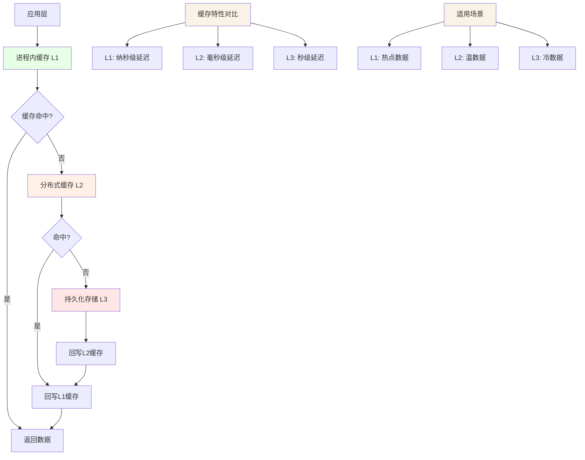
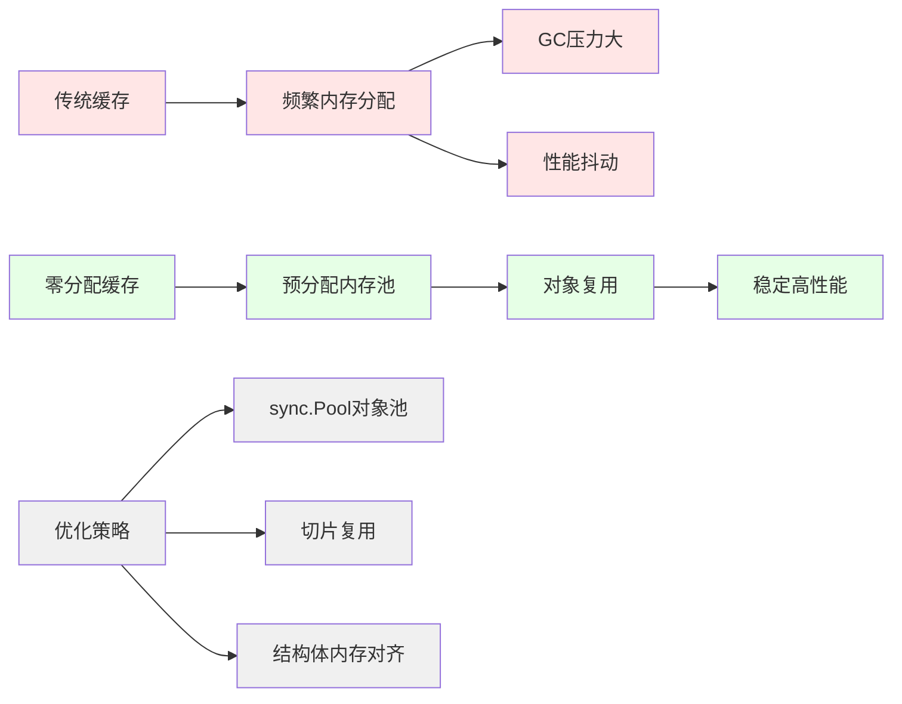
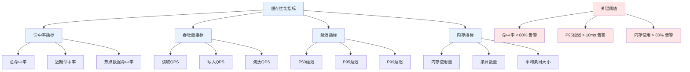
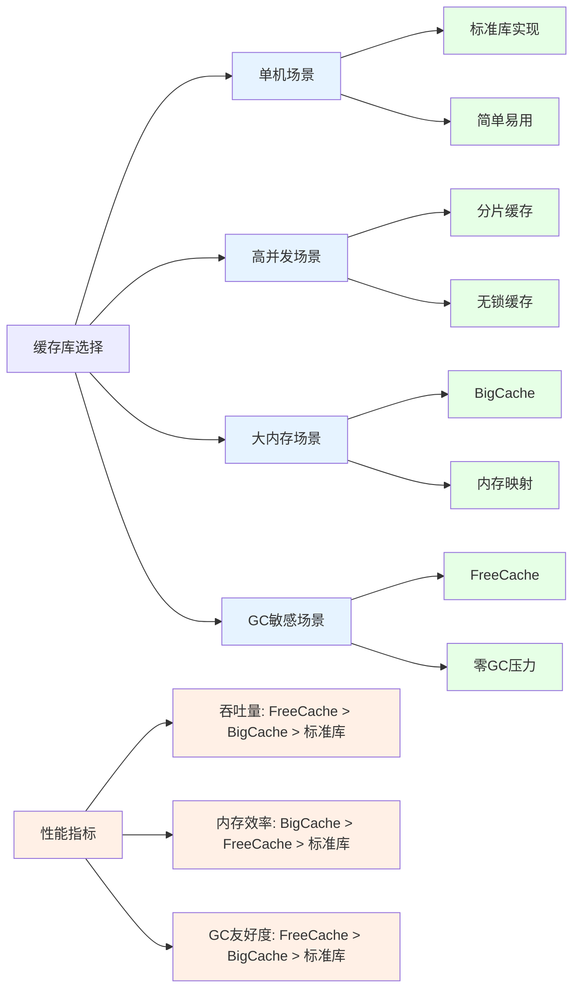
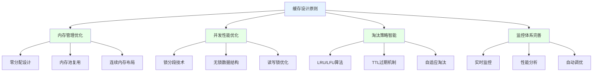

# Golang进程内缓存深度解析：从标准库到高性能实现

## 引言：为什么需要进程内缓存？

在现代应用架构中，进程内缓存（In-Process Cache）作为最接近计算单元的缓存层级，承担着减轻下游存储压力、提升系统响应速度的关键作用。与Redis等分布式缓存相比，进程内缓存具有零网络延迟、极低开销的天然优势，特别适用于热点数据、配置信息、计算结果等高频访问场景。

本文将从Go标准库的基础实现出发，深入剖析进程内缓存的核心架构、优化策略和高阶应用，帮助您构建高性能、高可用的缓存系统。

## 一、进程内缓存基础架构与核心设计原则

### 1.1 缓存架构层次模型



### 1.2 核心设计原则

**CAP理论在缓存中的应用**：
- **一致性(Consistency)**：缓存与数据源的一致性保证
- **可用性(Availability)**：缓存服务的高可用性设计  
- **分区容错性(Partition tolerance)**：分布式环境下的容错能力

**进程内缓存的特殊考量**：
- **内存管理**：GC压力控制与内存泄露预防
- **并发安全**：高并发环境下的线程安全保证
- **性能优化**：零分配、无锁编程等技术应用

## 二、基于标准库的基础缓存实现

### 2.1 使用sync.Map实现简单缓存

```go
// 基于sync.Map的线程安全缓存
type SimpleCache struct {
    store sync.Map
    stats *CacheStats
    
    // 配置参数
    maxSize     int
    currentSize int
    
    mu sync.RWMutex
}

type CacheStats struct {
    Hits   int64
    Misses int64
    Puts   int64
    Evicts int64
}

func NewSimpleCache(maxSize int) *SimpleCache {
    return &SimpleCache{
        store:   sync.Map{},
        stats:   &CacheStats{},
        maxSize: maxSize,
    }
}

func (c *SimpleCache) Get(key string) (interface{}, bool) {
    value, exists := c.store.Load(key)
    if exists {
        atomic.AddInt64(&c.stats.Hits, 1)
        return value, true
    }
    
    atomic.AddInt64(&c.stats.Misses, 1)
    return nil, false
}

func (c *SimpleCache) Set(key string, value interface{}) {
    c.mu.Lock()
    defer c.mu.Unlock()
    
    // 检查容量限制
    if c.currentSize >= c.maxSize {
        // 简单的LRU淘汰策略（实际需要更复杂的实现）
        c.evictOldest()
    }
    
    c.store.Store(key, value)
    atomic.AddInt64(&c.stats.Puts, 1)
    c.currentSize++
}

// 淘汰最老的条目（简化实现）
func (c *SimpleCache) evictOldest() {
    // 这里需要维护访问顺序，实际实现会更复杂
    // 可以使用container/list或自定义双向链表
    atomic.AddInt64(&c.stats.Evicts, 1)
    c.currentSize--
}

// 批量操作优化
func (c *SimpleCache) MGet(keys []string) map[string]interface{} {
    results := make(map[string]interface{})
    
    for _, key := range keys {
        if value, exists := c.store.Load(key); exists {
            results[key] = value
            atomic.AddInt64(&c.stats.Hits, 1)
        } else {
            atomic.AddInt64(&c.stats.Misses, 1)
        }
    }
    
    return results
}
```

### 2.2 使用container/list实现LRU缓存

```go
// 完整的LRU缓存实现
type LRUCache struct {
    capacity int
    cache    map[string]*list.Element
    order    *list.List // 双向链表，头部是最近使用的
    
    stats *LRUStats
    mu    sync.RWMutex
}

type cacheItem struct {
    key   string
    value interface{}
    
    // 访问统计
    accessCount int
    lastAccess  time.Time
}

type LRUStats struct {
    Hits        int64
    Misses      int64
    Evictions   int64
    AccessCount int64
}

func NewLRUCache(capacity int) *LRUCache {
    if capacity <= 0 {
        panic("缓存容量必须大于0")
    }
    
    return &LRUCache{
        capacity: capacity,
        cache:    make(map[string]*list.Element),
        order:    list.New(),
        stats:    &LRUStats{},
    }
}

func (lru *LRUCache) Get(key string) (interface{}, bool) {
    lru.mu.RLock()
    elem, exists := lru.cache[key]
    lru.mu.RUnlock()
    
    if !exists {
        atomic.AddInt64(&lru.stats.Misses, 1)
        return nil, false
    }
    
    // 移动到链表头部（最近使用）
    lru.mu.Lock()
    lru.order.MoveToFront(elem)
    
    item := elem.Value.(*cacheItem)
    item.accessCount++
    item.lastAccess = time.Now()
    lru.mu.Unlock()
    
    atomic.AddInt64(&lru.stats.Hits, 1)
    atomic.AddInt64(&lru.stats.AccessCount, 1)
    
    return item.value, true
}

func (lru *LRUCache) Set(key string, value interface{}) {
    lru.mu.Lock()
    defer lru.mu.Unlock()
    
    // 检查是否已存在
    if elem, exists := lru.cache[key]; exists {
        // 更新现有值
        item := elem.Value.(*cacheItem)
        item.value = value
        item.lastAccess = time.Now()
        lru.order.MoveToFront(elem)
        return
    }
    
    // 检查容量，必要时淘汰
    if len(lru.cache) >= lru.capacity {
        lru.evict()
    }
    
    // 创建新条目
    item := &cacheItem{
        key:        key,
        value:      value,
        lastAccess: time.Now(),
    }
    
    // 添加到链表头部和缓存映射
    elem := lru.order.PushFront(item)
    lru.cache[key] = elem
}

// 淘汰最近最少使用的条目
func (lru *LRUCache) evict() {
    // 获取链表尾部元素（最久未使用）
    elem := lru.order.Back()
    if elem == nil {
        return
    }
    
    // 从链表中移除
    lru.order.Remove(elem)
    
    // 从缓存映射中移除
    item := elem.Value.(*cacheItem)
    delete(lru.cache, item.key)
    
    atomic.AddInt64(&lru.stats.Evictions, 1)
}

// 获取缓存统计信息
func (lru *LRUCache) Stats() LRUStats {
    return *lru.stats // 返回副本
}

// 获取缓存命中率
func (lru *LRUCache) HitRate() float64 {
    hits := atomic.LoadInt64(&lru.stats.Hits)
    misses := atomic.LoadInt64(&lru.stats.Misses)
    
    total := hits + misses
    if total == 0 {
        return 0.0
    }
    
    return float64(hits) / float64(total)
}

// 清空缓存
func (lru *LRUCache) Clear() {
    lru.mu.Lock()
    defer lru.mu.Unlock()
    
    lru.cache = make(map[string]*list.Element)
    lru.order.Init()
}
```

## 三、高性能缓存优化策略

### 3.1 内存分配优化技术

**零分配缓存设计原理：**



**零分配缓存实现：**

```go
// 基于sync.Pool的零分配缓存
type ZeroAllocCache struct {
    store map[string]*cacheEntry
    pool  *sync.Pool
    
    mu sync.RWMutex
}

type cacheEntry struct {
    value    interface{}
    lastUsed int64 // 原子时间戳
}

func NewZeroAllocCache() *ZeroAllocCache {
    return &ZeroAllocCache{
        store: make(map[string]*cacheEntry),
        pool: &sync.Pool{
            New: func() interface{} {
                return &cacheEntry{}
            },
        },
    }
}

func (c *ZeroAllocCache) Get(key string) (interface{}, bool) {
    c.mu.RLock()
    entry, exists := c.store[key]
    c.mu.RUnlock()
    
    if !exists {
        return nil, false
    }
    
    // 原子更新最后使用时间
    atomic.StoreInt64(&entry.lastUsed, time.Now().UnixNano())
    
    return entry.value, true
}

func (c *ZeroAllocCache) Set(key string, value interface{}) {
    c.mu.Lock()
    defer c.mu.Unlock()
    
    // 从对象池获取entry
    entry := c.pool.Get().(*cacheEntry)
    entry.value = value
    entry.lastUsed = time.Now().UnixNano()
    
    // 如果key已存在，归还旧entry到对象池
    if oldEntry, exists := c.store[key]; exists {
        c.pool.Put(oldEntry)
    }
    
    c.store[key] = entry
}

// 定期清理过期条目
func (c *ZeroAllocCache) Cleanup(expiredBefore time.Time) {
    c.mu.Lock()
    defer c.mu.Unlock()
    
    threshold := expiredBefore.UnixNano()
    
    for key, entry := range c.store {
        if atomic.LoadInt64(&entry.lastUsed) < threshold {
            // 归还到对象池
            c.pool.Put(entry)
            delete(c.store, key)
        }
    }
}
```

### 3.2 并发优化与锁粒度控制

**锁分段技术实现：**

```go
// 分段锁缓存实现
type ShardedCache struct {
    shards []*cacheShard
    shardCount int
    
    // 哈希函数
    hashFunc func(string) uint32
}

type cacheShard struct {
    store map[string]*cacheEntry
    mu    sync.RWMutex
    
    stats *ShardStats
}

func NewShardedCache(shardCount int) *ShardedCache {
    if shardCount <= 0 {
        shardCount = 32 // 默认分片数
    }
    
    cache := &ShardedCache{
        shards:     make([]*cacheShard, shardCount),
        shardCount: shardCount,
        hashFunc:   fnvHash, // 使用FNV哈希算法
    }
    
    // 初始化各个分片
    for i := 0; i < shardCount; i++ {
        cache.shards[i] = &cacheShard{
            store: make(map[string]*cacheEntry),
            stats: &ShardStats{},
        }
    }
    
    return cache
}

// FNV哈希函数
func fnvHash(key string) uint32 {
    hash := uint32(2166136261)
    const prime = 16777619
    
    for i := 0; i < len(key); i++ {
        hash ^= uint32(key[i])
        hash *= prime
    }
    
    return hash
}

// 获取key对应的分片
func (c *ShardedCache) getShard(key string) *cacheShard {
    hash := c.hashFunc(key)
    shardIndex := hash % uint32(c.shardCount)
    return c.shards[shardIndex]
}

func (c *ShardedCache) Get(key string) (interface{}, bool) {
    shard := c.getShard(key)
    
    shard.mu.RLock()
    entry, exists := shard.store[key]
    shard.mu.RUnlock()
    
    if !exists {
        atomic.AddInt64(&shard.stats.Misses, 1)
        return nil, false
    }
    
    atomic.AddInt64(&shard.stats.Hits, 1)
    return entry.value, true
}

func (c *ShardedCache) Set(key string, value interface{}) {
    shard := c.getShard(key)
    
    shard.mu.Lock()
    defer shard.mu.Unlock()
    
    shard.store[key] = &cacheEntry{
        value:    value,
        lastUsed: time.Now().UnixNano(),
    }
    
    atomic.AddInt64(&shard.stats.Puts, 1)
}

// 批量操作：减少锁竞争
func (c *ShardedCache) BatchSet(items map[string]interface{}) {
    // 按分片分组
    shardGroups := make(map[int]map[string]interface{})
    
    for key, value := range items {
        shardIndex := int(c.hashFunc(key) % uint32(c.shardCount))
        
        if shardGroups[shardIndex] == nil {
            shardGroups[shardIndex] = make(map[string]interface{})
        }
        
        shardGroups[shardIndex][key] = value
    }
    
    // 并行处理各个分片
    var wg sync.WaitGroup
    
    for shardIndex, group := range shardGroups {
        wg.Add(1)
        
        go func(idx int, data map[string]interface{}) {
            defer wg.Done()
            
            shard := c.shards[idx]
            shard.mu.Lock()
            defer shard.mu.Unlock()
            
            for key, value := range data {
                shard.store[key] = &cacheEntry{
                    value:    value,
                    lastUsed: time.Now().UnixNano(),
                }
                atomic.AddInt64(&shard.stats.Puts, 1)
            }
        }(shardIndex, group)
    }
    
    wg.Wait()
}
```

### 3.3 基于CAS的无锁缓存实现

```go
// 基于CAS的无锁缓存（适用于读多写少场景）
type LockFreeCache struct {
    store atomic.Value // 存储map的原子引用
    
    // 写时复制计数器
    version uint64
    
    stats *LockFreeStats
}

func NewLockFreeCache() *LockFreeCache {
    cache := &LockFreeCache{
        stats: &LockFreeStats{},
    }
    
    // 初始化空map
    cache.store.Store(make(map[string]interface{}))
    
    return cache
}

func (c *LockFreeCache) Get(key string) (interface{}, bool) {
    store := c.store.Load().(map[string]interface{})
    
    value, exists := store[key]
    if exists {
        atomic.AddInt64(&c.stats.Hits, 1)
    } else {
        atomic.AddInt64(&c.stats.Misses, 1)
    }
    
    return value, exists
}

func (c *LockFreeCache) Set(key string, value interface{}) {
    // 使用循环保证CAS成功
    for {
        oldStore := c.store.Load().(map[string]interface{})
        
        // 创建新map（写时复制）
        newStore := make(map[string]interface{}, len(oldStore)+1)
        
        // 复制旧数据
        for k, v := range oldStore {
            newStore[k] = v
        }
        
        // 添加新数据
        newStore[key] = value
        
        // CAS操作
        if c.store.CompareAndSwap(oldStore, newStore) {
            atomic.AddInt64(&c.stats.Puts, 1)
            atomic.AddUint64(&c.version, 1)
            break
        }
        
        // CAS失败，重试
    }
}

// 批量设置优化
func (c *LockFreeCache) BatchSet(items map[string]interface{}) {
    for {
        oldStore := c.store.Load().(map[string]interface{})
        
        newStore := make(map[string]interface{}, len(oldStore)+len(items))
        
        // 复制旧数据
        for k, v := range oldStore {
            newStore[k] = v
        }
        
        // 添加新数据
        for k, v := range items {
            newStore[k] = v
        }
        
        if c.store.CompareAndSwap(oldStore, newStore) {
            atomic.AddInt64(&c.stats.Puts, int64(len(items)))
            atomic.AddUint64(&c.version, 1)
            break
        }
    }
}
```

## 四、高级缓存特性实现

### 4.1 TTL过期机制

```go
// 带TTL的缓存实现
type TTLCache struct {
    store      map[string]*ttlEntry
    expiration *MinHeap // 最小堆用于快速找到最早过期的条目
    
    mu sync.RWMutex
    
    // 清理goroutine控制
    cleanerStop chan struct{}
    cleanerWG   sync.WaitGroup
}

type ttlEntry struct {
    value      interface{}
    expireTime time.Time
    heapIndex  int // 在堆中的索引
}

// 最小堆实现
type MinHeap []*ttlEntry

func (h MinHeap) Len() int { return len(h) }
func (h MinHeap) Less(i, j int) bool { 
    return h[i].expireTime.Before(h[j].expireTime) 
}
func (h MinHeap) Swap(i, j int) { 
    h[i], h[j] = h[j], h[i] 
    h[i].heapIndex = i
    h[j].heapIndex = j
}

func (h *MinHeap) Push(x interface{}) {
    n := len(*h)
    entry := x.(*ttlEntry)
    entry.heapIndex = n
    *h = append(*h, entry)
}

func (h *MinHeap) Pop() interface{} {
    old := *h
    n := len(old)
    entry := old[n-1]
    entry.heapIndex = -1
    *h = old[0 : n-1]
    return entry
}

func NewTTLCache(cleanupInterval time.Duration) *TTLCache {
    cache := &TTLCache{
        store:       make(map[string]*ttlEntry),
        expiration:  &MinHeap{},
        cleanerStop: make(chan struct{}),
    }
    
    // 启动清理goroutine
    cache.cleanerWG.Add(1)
    go cache.cleanupWorker(cleanupInterval)
    
    return cache
}

func (c *TTLCache) Set(key string, value interface{}, ttl time.Duration) {
    c.mu.Lock()
    defer c.mu.Unlock()
    
    expireTime := time.Now().Add(ttl)
    
    entry := &ttlEntry{
        value:      value,
        expireTime: expireTime,
    }
    
    // 如果key已存在，从堆中移除旧条目
    if oldEntry, exists := c.store[key]; exists {
        heap.Remove(c.expiration, oldEntry.heapIndex)
    }
    
    // 添加到存储和堆
    c.store[key] = entry
    heap.Push(c.expiration, entry)
}

func (c *TTLCache) Get(key string) (interface{}, bool) {
    c.mu.RLock()
    entry, exists := c.store[key]
    c.mu.RUnlock()
    
    if !exists {
        return nil, false
    }
    
    // 检查是否过期
    if time.Now().After(entry.expireTime) {
        c.mu.Lock()
        // 双重检查
        if entry, exists := c.store[key]; exists && time.Now().After(entry.expireTime) {
            delete(c.store, key)
            heap.Remove(c.expiration, entry.heapIndex)
        }
        c.mu.Unlock()
        return nil, false
    }
    
    return entry.value, true
}

// 定期清理过期条目
func (c *TTLCache) cleanupWorker(interval time.Duration) {
    defer c.cleanerWG.Done()
    
    ticker := time.NewTicker(interval)
    defer ticker.Stop()
    
    for {
        select {
        case <-ticker.C:
            c.cleanupExpired()
        case <-c.cleanerStop:
            return
        }
    }
}

func (c *TTLCache) cleanupExpired() {
    c.mu.Lock()
    defer c.mu.Unlock()
    
    now := time.Now()
    
    for c.expiration.Len() > 0 {
        // 检查堆顶元素是否过期
        entry := (*c.expiration)[0]
        if now.Before(entry.expireTime) {
            break // 没有更多过期条目
        }
        
        // 移除过期条目
        heap.Pop(c.expiration)
        delete(c.store, entry.value.(string)) // 这里需要根据实际key类型调整
    }
}

func (c *TTLCache) Close() {
    close(c.cleanerStop)
    c.cleanerWG.Wait()
}
```

### 4.2 缓存预热与预加载

```go
// 缓存预热管理器
type CacheWarmUpManager struct {
    cache      CacheInterface
    dataLoader DataLoader
    
    // 预热配置
    config WarmUpConfig
    
    stats *WarmUpStats
}

type WarmUpConfig struct {
    BatchSize     int
    Parallelism   int
    ThrottleDelay time.Duration
}

type DataLoader interface {
    LoadKeys() ([]string, error)
    LoadData(keys []string) (map[string]interface{}, error)
}

func (m *CacheWarmUpManager) WarmUp() error {
    // 加载所有需要预热的key
    keys, err := m.dataLoader.LoadKeys()
    if err != nil {
        return fmt.Errorf("加载key列表失败: %w", err)
    }
    
    // 分批预热
    total := len(keys)
    batches := (total + m.config.BatchSize - 1) / m.config.BatchSize
    
    var wg sync.WaitGroup
    errCh := make(chan error, batches)
    
    semaphore := make(chan struct{}, m.config.Parallelism)
    
    for i := 0; i < batches; i++ {
        start := i * m.config.BatchSize
        end := start + m.config.BatchSize
        if end > total {
            end = total
        }
        
        batchKeys := keys[start:end]
        
        wg.Add(1)
        
        go func(batchIndex int, keys []string) {
            defer wg.Done()
            
            semaphore <- struct{}{}
            defer func() { <-semaphore }()
            
            // 加载数据
            data, err := m.dataLoader.LoadData(keys)
            if err != nil {
                errCh <- fmt.Errorf("批次 %d 加载失败: %w", batchIndex, err)
                return
            }
            
            // 写入缓存
            m.cache.BatchSet(data)
            
            atomic.AddInt64(&m.stats.BatchesCompleted, 1)
            atomic.AddInt64(&m.stats.ItemsWarmed, int64(len(data)))
            
            // 限流控制
            if m.config.ThrottleDelay > 0 {
                time.Sleep(m.config.ThrottleDelay)
            }
        }(i, batchKeys)
    }
    
    wg.Wait()
    close(errCh)
    
    // 收集错误
    var errors []string
    for err := range errCh {
        errors = append(errors, err.Error())
    }
    
    if len(errors) > 0 {
        return fmt.Errorf("预热过程中发生错误: %s", strings.Join(errors, "; "))
    }
    
    return nil
}
```

## 五、性能监控与诊断

### 5.1 缓存性能指标体系



### 5.2 性能监控实现

```go
// 缓存性能监控器
type CacheMonitor struct {
    cache     CacheInterface
    exporters []MetricsExporter
    
    // 统计收集
    statsCollector *StatsCollector
    
    // 监控配置
    config MonitorConfig
}

type MetricsExporter interface {
    Export(metrics CacheMetrics) error
}

// Prometheus导出器
type PrometheusExporter struct {
    hitCounter   prometheus.Counter
    missCounter  prometheus.Counter
    latencyHisto prometheus.Histogram
}

// 统计数据收集器
type StatsCollector struct {
    hitCount    int64
    missCount   int64
    totalOps    int64
    latencySum  time.Duration
    
    // 滑动窗口统计
    windowStats *SlidingWindowStats
    
    mu sync.RWMutex
}

// 滑动窗口统计
type SlidingWindowStats struct {
    windows []*TimeWindow
    current int
    size    int
    
    windowDuration time.Duration
}

type TimeWindow struct {
    startTime time.Time
    hitCount  int64
    missCount int64
    
    mu sync.RWMutex
}

func (m *CacheMonitor) Start() {
    ticker := time.NewTicker(m.config.CollectionInterval)
    
    go func() {
        for range ticker.C {
            metrics := m.collectMetrics()
            m.exportMetrics(metrics)
        }
    }()
}

func (m *CacheMonitor) collectMetrics() CacheMetrics {
    metrics := CacheMetrics{
        Timestamp: time.Now(),
    }
    
    // 基础统计
    metrics.HitRate = m.calculateHitRate()
    metrics.Throughput = m.calculateThroughput()
    
    // 延迟统计
    metrics.AverageLatency = m.calculateAverageLatency()
    metrics.P95Latency = m.calculatePercentileLatency(95)
    
    // 内存统计
    if sizeAware, ok := m.cache.(SizeAwareCache); ok {
        metrics.MemoryUsage = sizeAware.MemoryUsage()
        metrics.ItemCount = sizeAware.ItemCount()
    }
    
    return metrics
}

func (m *CacheMonitor) calculateHitRate() float64 {
    total := atomic.LoadInt64(&m.statsCollector.hitCount) + 
             atomic.LoadInt64(&m.statsCollector.missCount)
    
    if total == 0 {
        return 0.0
    }
    
    return float64(atomic.LoadInt64(&m.statsCollector.hitCount)) / float64(total)
}

// 记录操作性能
func (m *CacheMonitor) RecordOperation(hit bool, latency time.Duration) {
    if hit {
        atomic.AddInt64(&m.statsCollector.hitCount, 1)
    } else {
        atomic.AddInt64(&m.statsCollector.missCount, 1)
    }
    
    atomic.AddInt64(&m.statsCollector.totalOps, 1)
    
    // 原子添加延迟（使用time.Duration的原子操作需要转换）
    for {
        old := atomic.LoadInt64((*int64)(&m.statsCollector.latencySum))
        new := old + int64(latency)
        if atomic.CompareAndSwapInt64((*int64)(&m.statsCollector.latencySum), old, new) {
            break
        }
    }
    
    // 更新滑动窗口统计
    m.updateWindowStats(hit)
}
```

## 六、生产环境最佳实践

### 6.1 缓存配置模板

```yaml
# cache-config.yaml

cache:
  # 基础配置
  type: "lru"           # 缓存类型: lru, ttl, sharded
  capacity: 10000       # 最大容量
  
  # 性能优化配置
  shard_count: 32       # 分片数量（分片缓存）
  zero_alloc: true      # 是否启用零分配优化
  
  # TTL配置
  ttl:
    default: "5m"       # 默认过期时间
    cleanup_interval: "1m"  # 清理间隔
    
  # 内存管理
  memory:
    max_size: "100MB"   # 最大内存限制
    eviction_policy: "lru"  # 淘汰策略
    
  # 监控配置
  monitoring:
    enabled: true
    export_interval: "30s"
    metrics:
      - "hit_rate"
      - "latency"
      - "memory_usage"
      
  # 预热配置
  warm_up:
    enabled: true
    batch_size: 100
    parallelism: 4
    throttle_delay: "100ms"
```

### 6.2 缓存使用模式

**缓存穿透防护模式：**

```go
// 缓存穿透防护装饰器
type CachePenetrationProtector struct {
    cache      CacheInterface
    bloomFilter *BloomFilter
    
    // 空值缓存
    nullCache map[string]struct{}
    nullTTL   time.Duration
    
    mu sync.RWMutex
}

func (p *CachePenetrationProtector) Get(key string) (interface{}, bool) {
    // 1. 检查布隆过滤器
    if !p.bloomFilter.MightContain(key) {
        return nil, false
    }
    
    // 2. 检查空值缓存
    p.mu.RLock()
    _, isNull := p.nullCache[key]
    p.mu.RUnlock()
    
    if isNull {
        return nil, false
    }
    
    // 3. 正常缓存查询
    return p.cache.Get(key)
}

func (p *CachePenetrationProtector) Set(key string, value interface{}) {
    // 添加到布隆过滤器
    p.bloomFilter.Add(key)
    
    if value == nil {
        // 缓存空值
        p.mu.Lock()
        p.nullCache[key] = struct{}{}
        p.mu.Unlock()
        
        // 设置空值过期
        time.AfterFunc(p.nullTTL, func() {
            p.mu.Lock()
            delete(p.nullCache, key)
            p.mu.Unlock()
        })
    } else {
        p.cache.Set(key, value)
    }
}
```

**缓存雪崩防护模式：**

```go
// 缓存雪崩防护装饰器
type CacheAvalancheProtector struct {
    cache       CacheInterface
    jitterRange time.Duration // 抖动范围
    
    // 热点数据保护
    hotKeys map[string]*HotKeyProtection
    
    mu sync.RWMutex
}

type HotKeyProtection struct {
    accessCount int64
    lastAccess  time.Time
    mutex       sync.Mutex
    
    // 单flight保护
    singleFlight singleflight.Group
}

func (p *CacheAvalancheProtector) Get(key string) (interface{}, bool) {
    // 添加随机抖动避免同时过期
    jitter := time.Duration(rand.Int63n(int64(p.jitterRange)))
    
    value, exists := p.cache.Get(key)
    if exists {
        return value, true
    }
    
    // 热点key保护
    if p.isHotKey(key) {
        return p.protectedGet(key)
    }
    
    return nil, false
}

func (p *CacheAvalancheProtector) protectedGet(key string) (interface{}, bool) {
    p.mu.RLock()
    protection, exists := p.hotKeys[key]
    p.mu.RUnlock()
    
    if !exists {
        p.mu.Lock()
        protection = &HotKeyProtection{}
        p.hotKeys[key] = protection
        p.mu.Unlock()
    }
    
    // 使用singleflight防止缓存击穿
    result, err, _ := protection.singleFlight.Do(key, func() (interface{}, error) {
        // 这里应该从数据源加载数据
        value, err := p.loadFromSource(key)
        if err != nil {
            return nil, err
        }
        
        // 回写缓存（带随机过期时间）
        ttl := p.calculateTTLWithJitter()
        p.cache.Set(key, value)
        
        return value, nil
    })
    
    if err != nil {
        return nil, false
    }
    
    return result, true
}

func (p *CacheAvalancheProtector) calculateTTLWithJitter() time.Duration {
    baseTTL := 5 * time.Minute // 基础TTL
    jitter := time.Duration(rand.Int63n(int64(p.jitterRange)))
    return baseTTL + jitter
}
```

## 七、第三方缓存库深度分析

### 7.1 主流缓存库对比



### 7.2 BigCache深度解析

**BigCache核心架构：**

```go
// BigCache启发式实现（简化版）
type BigCacheStyle struct {
    shards     []*cacheShard
    shardMask  uint64
    hashFunc   func(string) uint64
    
    // 内存管理
    allocator  *MemoryAllocator
    
    config BigCacheConfig
}

type cacheShard struct {
    hashmap     map[uint64]uint32 // hash -> offset
    data        []byte           // 连续内存块
    tail        uint32           // 当前写入位置
    
    // 淘汰统计
    evictions   uint32
    
    mutex       sync.RWMutex
}

// 内存分配器
type MemoryAllocator struct {
    blocks []*memoryBlock
    
    // 内存池复用
    pool sync.Pool
}

type memoryBlock struct {
    data   []byte
    offset uint32
    size   uint32
}

func (bc *BigCacheStyle) Set(key string, value []byte) error {
    hash := bc.hashFunc(key)
    shard := bc.getShard(hash)
    
    // 序列化条目
    entry := bc.serializeEntry(key, value)
    
    shard.mutex.Lock()
    defer shard.mutex.Unlock()
    
    // 检查是否已存在
    if offset, exists := shard.hashmap[hash]; exists {
        // 更新现有条目（可能需要处理碎片）
        bc.updateEntry(shard, offset, entry)
    } else {
        // 添加新条目
        bc.addNewEntry(shard, hash, entry)
    }
    
    return nil
}

func (bc *BigCacheStyle) serializeEntry(key string, value []byte) []byte {
    // 条目格式: [timestamp][keyLen][key][valueLen][value]
    timestamp := make([]byte, 8)
    binary.LittleEndian.PutUint64(timestamp, uint64(time.Now().Unix()))
    
    keyLen := make([]byte, 4)
    binary.LittleEndian.PutUint32(keyLen, uint32(len(key)))
    
    valueLen := make([]byte, 4)
    binary.LittleEndian.PutUint32(valueLen, uint32(len(value)))
    
    // 拼接所有部分
    entry := make([]byte, 0, 8+4+len(key)+4+len(value))
    entry = append(entry, timestamp...)
    entry = append(entry, keyLen...)
    entry = append(entry, key...)
    entry = append(entry, valueLen...)
    entry = append(entry, value...)
    
    return entry
}
```



### 8.2 性能优化关键指标

| 优化维度 | 关键指标 | 优化目标 | 监控阈值 |
|---------|---------|---------|---------|
| 内存效率 | 内存碎片率 | < 5% | > 10%告警 |
| 并发性能 | 锁竞争率 | < 1% | > 5%告警 |
| 命中率 | 缓存命中率 | > 90% | < 80%告警 |
| 延迟性能 | P99延迟 | < 1ms | > 10ms告警 |
| GC影响 | GC暂停时间 | < 1ms | > 10ms告警 |

### 8.3 生产环境部署检查清单

**缓存配置检查：**
- [ ] 容量限制设置合理
- [ ] 淘汰策略符合业务需求
- [ ] TTL配置避免雪崩效应
- [ ] 分片数量匹配CPU核心数

**性能优化检查：**
- [ ] 启用零分配优化
- [ ] 配置合理的锁粒度
- [ ] 实现热点数据保护
- [ ] 设置内存使用阈值

**监控告警检查：**
- [ ] 命中率监控告警
- [ ] 延迟性能监控
- [ ] 内存使用监控
- [ ] GC压力监控

**容错机制检查：**
- [ ] 缓存穿透防护
- [ ] 缓存雪崩防护
- [ ] 降级策略准备
- [ ] 数据一致性保证

### 8.4 场景化选型建议

**单机小数据量场景：**
- 推荐：标准库`sync.Map` + `container/list`
- 优势：简单可靠，维护成本低

**高并发中等数据量：**
- 推荐：分片缓存 + LRU淘汰
- 优势：良好的并发性能，可控的内存使用

**大内存低GC需求：**
- 推荐：`BigCache`或`FreeCache`
- 优势：优异的内存效率，几乎无GC压力

**极致性能场景：**
- 推荐：无锁缓存 + 内存映射
- 优势：纳秒级访问延迟，超高吞吐量