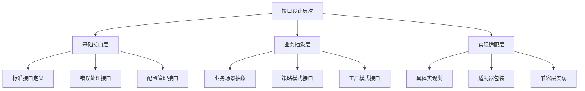
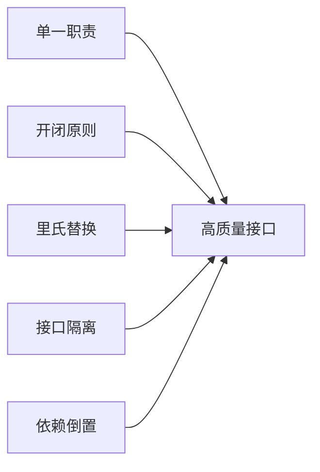

# Golang接口设计与阿里云SDK深度集成实践

## 一、接口设计哲学：从抽象到具体

在Golang的世界中，接口是实现多态和抽象的核心机制。优秀的企业级SDK设计建立在良好的接口设计基础之上。



### 1.1 接口设计的SOLID原则

```go
package interface_design

import (
    "context"
    "fmt"
    "io"
    "time"
)

// Single Responsibility Principle - 单一职责原则
// 每个接口只关注一个特定的功能领域

type Storage interface {
    Save(ctx context.Context, data []byte, key string) error
    Load(ctx context.Context, key string) ([]byte, error)
    Delete(ctx context.Context, key string) error
}

type Compression interface {
    Compress(data []byte) ([]byte, error)
    Decompress(data []byte) ([]byte, error)
}

// Open/Closed Principle - 开闭原则
// 对扩展开放，对修改关闭

type MessageSender interface {
    Send(message Message) error
}

// 可以通过实现新类型来扩展，而不需要修改现有代码
type EmailSender struct{}
type SMSSender struct{}
type WeChatSender struct{}

// Liskov Substitution Principle - 里氏替换原则
// 子类型必须能够替换它们的基类型

type Reader interface {
    Read(p []byte) (n int, err error)
}

// 所有实现Reader的类型都应该能够替换io.Reader

type BufferedFileReader struct {
    file io.Reader
}

func (bfr *BufferedFileReader) Read(p []byte) (int, error) {
    // 实现缓冲读取逻辑
    return bfr.file.Read(p)
}

// Interface Segregation Principle - 接口隔离原则
// 客户端不应该被迫依赖它们不使用的接口

// 不好的设计：一个庞大的接口
// type MonsterInterface interface {
//     Read() error
//     Write() error
//     Delete() error
//     Update() error
//     Search() error
//     Validate() error
// }

// 好的设计：细粒度的接口
type Reader interface {
    Read() error
}

type Writer interface {
    Write() error
}

type Deleter interface {
    Delete() error
}

// Dependency Inversion Principle - 依赖倒置原则
// 高层模块不应该依赖低层模块，两者都应该依赖抽象

type NotificationService struct {
    sender MessageSender // 依赖抽象，而不是具体实现
}

func NewNotificationService(sender MessageSender) *NotificationService {
    return &NotificationService{sender: sender}
}
```

## 二、阿里云SDK接口架构深度解析

### 2.1 阿里云SDK的接口层次结构

```go
package aliyunsdk

import (
    "context"
    "fmt"
    "net/http"
    "time"
)

// ClientInterface 客户端基础接口
type ClientInterface interface {
    DoRequest(ctx context.Context, request *Request) (*Response, error)
    GetEndpoint() string
    GetCredentials() Credentials
}

// ServiceInterface 服务级别接口
type ServiceInterface interface {
    ClientInterface
    GetServiceName() string
    GetAPIVersion() string
}

// OperationInterface 操作级别接口
type OperationInterface interface {
    Execute(ctx context.Context) (interface{}, error)
    Validate() error
    GetOperationName() string
}

// 具体实现示例：OSS服务接口

type OSSService interface {
    ServiceInterface
    
    // Bucket操作
    CreateBucket(ctx context.Context, bucketName string, options *CreateBucketOptions) error
    DeleteBucket(ctx context.Context, bucketName string) error
    ListBuckets(ctx context.Context, options *ListBucketsOptions) (*ListBucketsResult, error)
    
    // Object操作
    PutObject(ctx context.Context, bucketName, objectName string, reader io.Reader, options *PutObjectOptions) error
    GetObject(ctx context.Context, bucketName, objectName string, options *GetObjectOptions) (io.ReadCloser, error)
    DeleteObject(ctx context.Context, bucketName, objectName string) error
    
    // 高级功能
    GeneratePresignedURL(ctx context.Context, bucketName, objectName string, method string, expired time.Duration) (string, error)
    CopyObject(ctx context.Context, srcBucket, srcObject, destBucket, destObject string, options *CopyObjectOptions) error
}

// Request/Response 结构定义
type Request struct {
    Method      string
    URL         string
    Headers     map[string]string
    Body        io.Reader
    QueryParams map[string]string
}

type Response struct {
    StatusCode int
    Headers    map[string]string
    Body       []byte
}

type Credentials struct {
    AccessKeyID     string
    AccessKeySecret string
    SecurityToken   string
}

type CreateBucketOptions struct {
    StorageClass    string
    ACL             string
    DataRedundancy  string
}

type ListBucketsOptions struct {
    Prefix    string
    Marker    string
    MaxKeys   int
}

type ListBucketsResult struct {
    Buckets []BucketInfo
    IsTruncated bool
    NextMarker string
}

type BucketInfo struct {
    Name         string
    CreationDate time.Time
    Location     string
}

type PutObjectOptions struct {
    ContentType   string
    ContentLength int64
    ACL          string
    Metadata     map[string]string
}

type GetObjectOptions struct {
    Range        string
    IfModifiedSince time.Time
}

type CopyObjectOptions struct {
    MetadataDirective string
    ACL               string
}
```

### 2.2 接口的实现与适配器模式

```go
package implementation

import (
    "context"
    "crypto/hmac"
    "crypto/sha1"
    "encoding/base64"
    "fmt"
    "io"
    "net/http"
    "net/url"
    "sort"
    "strings"
    "time"
)

// OSSClient OSS客户端实现
type OSSClient struct {
    endpoint    string
    credentials Credentials
    httpClient  *http.Client
    serviceName string
    apiVersion  string
}

// NewOSSClient 创建OSS客户端
func NewOSSClient(endpoint, accessKeyID, accessKeySecret string) *OSSClient {
    return &OSSClient{
        endpoint: endpoint,
        credentials: Credentials{
            AccessKeyID:     accessKeyID,
            AccessKeySecret: accessKeySecret,
        },
        httpClient: &http.Client{
            Timeout: 30 * time.Second,
        },
        serviceName: "oss",
        apiVersion:  "2013-10-15",
    }
}

// 实现ServiceInterface接口
func (oc *OSSClient) GetServiceName() string {
    return oc.serviceName
}

func (oc *OSSClient) GetAPIVersion() string {
    return oc.apiVersion
}

func (oc *OSSClient) GetEndpoint() string {
    return oc.endpoint
}

func (oc *OSSClient) GetCredentials() Credentials {
    return oc.credentials
}

// 实现ClientInterface接口
func (oc *OSSClient) DoRequest(ctx context.Context, req *Request) (*Response, error) {
    // 构建HTTP请求
    httpReq, err := http.NewRequestWithContext(ctx, req.Method, req.URL, req.Body)
    if err != nil {
        return nil, fmt.Errorf("创建HTTP请求失败: %w", err)
    }
    
    // 添加头部
    for key, value := range req.Headers {
        httpReq.Header.Set(key, value)
    }
    
    // 添加查询参数
    if req.QueryParams != nil {
        query := httpReq.URL.Query()
        for key, value := range req.QueryParams {
            query.Add(key, value)
        }
        httpReq.URL.RawQuery = query.Encode()
    }
    
    // 执行请求
    resp, err := oc.httpClient.Do(httpReq)
    if err != nil {
        return nil, fmt.Errorf("HTTP请求失败: %w", err)
    }
    defer resp.Body.Close()
    
    // 读取响应体
    body, err := io.ReadAll(resp.Body)
    if err != nil {
        return nil, fmt.Errorf("读取响应体失败: %w", err)
    }
    
    // 转换响应头
    headers := make(map[string]string)
    for key, values := range resp.Header {
        if len(values) > 0 {
            headers[key] = values[0]
        }
    }
    
    return &Response{
        StatusCode: resp.StatusCode,
        Headers:    headers,
        Body:       body,
    }, nil
}

// PutObject 实现PutObject操作
func (oc *OSSClient) PutObject(ctx context.Context, bucketName, objectName string, reader io.Reader, options *PutObjectOptions) error {
    url := fmt.Sprintf("https://%s.%s/%s", bucketName, oc.endpoint, objectName)
    
    // 构建请求
    req := &Request{
        Method: "PUT",
        URL:    url,
        Body:   reader,
        Headers: map[string]string{
            "Date": time.Now().UTC().Format(http.TimeFormat),
        },
    }
    
    // 设置内容类型
    if options != nil && options.ContentType != "" {
        req.Headers["Content-Type"] = options.ContentType
    } else {
        req.Headers["Content-Type"] = "application/octet-stream"
    }
    
    // 设置内容长度
    if options != nil && options.ContentLength > 0 {
        req.Headers["Content-Length"] = fmt.Sprintf("%d", options.ContentLength)
    }
    
    // 设置ACL
    if options != nil && options.ACL != "" {
        req.Headers["x-oss-object-acl"] = options.ACL
    }
    
    // 设置元数据
    if options != nil && options.Metadata != nil {
        for key, value := range options.Metadata {
            req.Headers["x-oss-meta-"+key] = value
        }
    }
    
    // 签名请求
    oc.signRequest(req)
    
    // 执行请求
    resp, err := oc.DoRequest(ctx, req)
    if err != nil {
        return fmt.Errorf("上传对象失败: %w", err)
    }
    
    if resp.StatusCode != http.StatusOK {
        return fmt.Errorf("上传对象失败，状态码: %d, 响应: %s", resp.StatusCode, string(resp.Body))
    }
    
    return nil
}

// signRequest 签名请求
func (oc *OSSClient) signRequest(req *Request) {
    // 构建签名字符串
    canonicalString := oc.buildCanonicalString(req)
    
    // 使用HMAC-SHA1签名
    h := hmac.New(sha1.New, []byte(oc.credentials.AccessKeySecret))
    h.Write([]byte(canonicalString))
    signature := base64.StdEncoding.EncodeToString(h.Sum(nil))
    
    // 添加Authorization头部
    req.Headers["Authorization"] = fmt.Sprintf("OSS %s:%s", 
        oc.credentials.AccessKeyID, signature)
}

// buildCanonicalString 构建规范化字符串
func (oc *OSSClient) buildCanonicalString(req *Request) string {
    var builder strings.Builder
    
    // HTTP方法
    builder.WriteString(req.Method)
    builder.WriteString("\n")
    
    // Content-MD5 (可选)
    if md5, exists := req.Headers["Content-MD5"]; exists {
        builder.WriteString(md5)
    }
    builder.WriteString("\n")
    
    // Content-Type
    if contentType, exists := req.Headers["Content-Type"]; exists {
        builder.WriteString(contentType)
    }
    builder.WriteString("\n")
    
    // Date
    if date, exists := req.Headers["Date"]; exists {
        builder.WriteString(date)
    }
    builder.WriteString("\n")
    
    // 规范化头部
    canonicalHeaders := oc.buildCanonicalHeaders(req.Headers)
    builder.WriteString(canonicalHeaders)
    
    // 规范化资源
    canonicalResource := oc.buildCanonicalResource(req.URL)
    builder.WriteString(canonicalResource)
    
    return builder.String()
}

// buildCanonicalHeaders 构建规范化头部
func (oc *OSSClient) buildCanonicalHeaders(headers map[string]string) string {
    var ossHeaders []string
    
    for key, value := range headers {
        lowerKey := strings.ToLower(key)
        if strings.HasPrefix(lowerKey, "x-oss-") {
            ossHeaders = append(ossHeaders, fmt.Sprintf("%s:%s", lowerKey, strings.TrimSpace(value)))
        }
    }
    
    sort.Strings(ossHeaders)
    
    if len(ossHeaders) > 0 {
        return strings.Join(ossHeaders, "\n") + "\n"
    }
    
    return ""
}

// buildCanonicalResource 构建规范化资源
func (oc *OSSClient) buildCanonicalResource(requestURL string) string {
    parsedURL, err := url.Parse(requestURL)
    if err != nil {
        return ""
    }
    
    // 提取bucket和object路径
    path := parsedURL.Path
    if path == "" {
        path = "/"
    }
    
    // 处理子资源
    var subResources []string
    query := parsedURL.Query()
    
    for key := range query {
        // OSS特定的子资源参数
        if isOSSSubResource(key) {
            values := query[key]
            if len(values) > 0 {
                subResources = append(subResources, fmt.Sprintf("%s=%s", key, values[0]))
            } else {
                subResources = append(subResources, key)
            }
        }
    }
    
    sort.Strings(subResources)
    
    if len(subResources) > 0 {
        return path + "?" + strings.Join(subResources, "&")
    }
    
    return path
}

// isOSSSubResource 判断是否为OSS子资源
func isOSSSubResource(param string) bool {
    ossSubResources := map[string]bool{
        "acl": true, "uploads": true, "location": true,
        "cors": true, "logging": true, "website": true,
        "referer": true, "lifecycle": true, "delete": true,
        "append": true, "tagging": true, "objectMeta": true,
        "uploadId": true, "partNumber": true, "security-token": true,
        "position": true, "img": true, "style": true,
        "styleName": true, "replication": true, "replicationProgress": true,
        "replicationLocation": true, "cname": true, "bucketInfo": true,
        "comp": true, "qos": true, "live": true,
        "status": true, "vod": true, "startTime": true,
        "endTime": true, "symlink": true, "x-oss-process": true,
        "response-content-type": true, "response-content-language": true,
        "response-expires": true, "response-cache-control": true,
        "response-content-disposition": true, "response-content-encoding": true,
    }
    
    return ossSubResources[param]
}
```

## 三、接口组合与装饰器模式

### 3.1 功能增强装饰器

```go
package decorators

import (
    "context"
    "fmt"
    "log"
    "time"
)

// LoggingDecorator 日志装饰器
type LoggingDecorator struct {
    decorated OSSService
}

func NewLoggingDecorator(service OSSService) *LoggingDecorator {
    return &LoggingDecorator{decorated: service}
}

func (ld *LoggingDecorator) PutObject(ctx context.Context, bucketName, objectName string, reader io.Reader, options *PutObjectOptions) error {
    start := time.Now()
    
    log.Printf("开始上传对象: bucket=%s, object=%s", bucketName, objectName)
    
    err := ld.decorated.PutObject(ctx, bucketName, objectName, reader, options)
    
    duration := time.Since(start)
    if err != nil {
        log.Printf("上传对象失败: bucket=%s, object=%s, 耗时=%v, 错误=%v", 
            bucketName, objectName, duration, err)
    } else {
        log.Printf("上传对象成功: bucket=%s, object=%s, 耗时=%v", 
            bucketName, objectName, duration)
    }
    
    return err
}

// RetryDecorator 重试装饰器
type RetryDecorator struct {
    decorated    OSSService
    maxAttempts int
    baseDelay   time.Duration
}

func NewRetryDecorator(service OSSService, maxAttempts int, baseDelay time.Duration) *RetryDecorator {
    return &RetryDecorator{
        decorated:    service,
        maxAttempts: maxAttempts,
        baseDelay:   baseDelay,
    }
}

func (rd *RetryDecorator) PutObject(ctx context.Context, bucketName, objectName string, reader io.Reader, options *PutObjectOptions) error {
    var lastErr error
    
    for attempt := 1; attempt <= rd.maxAttempts; attempt++ {
        err := rd.decorated.PutObject(ctx, bucketName, objectName, reader, options)
        if err == nil {
            return nil
        }
        
        lastErr = err
        
        // 检查是否可重试的错误
        if !rd.isRetryableError(err) {
            return err
        }
        
        if attempt < rd.maxAttempts {
            delay := rd.calculateDelay(attempt)
            log.Printf("操作失败，尝试重试 (第%d次): %v，等待 %v 后重试", 
                attempt, err, delay)
            
            select {
            case <-time.After(delay):
                continue
            case <-ctx.Done():
                return ctx.Err()
            }
        }
    }
    
    return fmt.Errorf("操作失败，重试 %d 次后仍然失败: %w", rd.maxAttempts, lastErr)
}

func (rd *RetryDecorator) isRetryableError(err error) bool {
    // 网络错误、服务器错误等可以重试
    errorStr := err.Error()
    retryablePatterns := []string{
        "timeout", "network", "connection",
        "5[0-9][0-9]", "server error", "temporary",
    }
    
    for _, pattern := range retryablePatterns {
        if strings.Contains(strings.ToLower(errorStr), pattern) {
            return true
        }
    }
    
    return false
}

func (rd *RetryDecorator) calculateDelay(attempt int) time.Duration {
    // 指数退避算法
    delay := rd.baseDelay * time.Duration(1<<(attempt-1))
    
    // 添加随机抖动
    jitter := time.Duration(float64(delay) * 0.1)
    delay += jitter
    
    return delay
}

// MetricsDecorator 指标装饰器
type MetricsDecorator struct {
    decorated OSSService
    metrics   map[string]*OperationMetrics
}

type OperationMetrics struct {
    Count        int64
    TotalLatency time.Duration
    Errors       int64
}

func NewMetricsDecorator(service OSSService) *MetricsDecorator {
    return &MetricsDecorator{
        decorated: service,
        metrics:   make(map[string]*OperationMetrics),
    }
}

func (md *MetricsDecorator) PutObject(ctx context.Context, bucketName, objectName string, reader io.Reader, options *PutObjectOptions) error {
    start := time.Now()
    
    err := md.decorated.PutObject(ctx, bucketName, objectName, reader, options)
    
    duration := time.Since(start)
    md.recordMetrics("PutObject", duration, err)
    
    return err
}

func (md *MetricsDecorator) recordMetrics(operation string, latency time.Duration, err error) {
    metrics, exists := md.metrics[operation]
    if !exists {
        metrics = &OperationMetrics{}
        md.metrics[operation] = metrics
    }
    
    metrics.Count++
    metrics.TotalLatency += latency
    
    if err != nil {
        metrics.Errors++
    }
}

func (md *MetricsDecorator) GetMetrics() map[string]OperationMetrics {
    result := make(map[string]OperationMetrics)
    
    for op, metrics := range md.metrics {
        result[op] = *metrics
    }
    
    return result
}
```

### 3.2 组合装饰器的使用

```go
package composite

import (
    "context"
    "fmt"
    "strings"
)

// CompositeOSSClient 组合的OSS客户端
type CompositeOSSClient struct {
    service OSSService
}

func NewCompositeOSSClient(baseService OSSService) *CompositeOSSClient {
    // 应用装饰器链
    var service OSSService = baseService
    
    // 添加指标监控
    service = NewMetricsDecorator(service)
    
    // 添加重试机制
    service = NewRetryDecorator(service, 3, time.Second)
    
    // 添加日志记录
    service = NewLoggingDecorator(service)
    
    return &CompositeOSSClient{service: service}
}

func (coc *CompositeOSSClient) PutObject(ctx context.Context, bucketName, objectName string, reader io.Reader, options *PutObjectOptions) error {
    return coc.service.PutObject(ctx, bucketName, objectName, reader, options)
}

// 其他方法委托给装饰后的服务
func (coc *CompositeOSSClient) GetObject(ctx context.Context, bucketName, objectName string, options *GetObjectOptions) (io.ReadCloser, error) {
    return coc.service.GetObject(ctx, bucketName, objectName, options)
}

// 获取指标数据
func (coc *CompositeOSSClient) GetMetrics() map[string]OperationMetrics {
    if metricsDecorator, ok := coc.service.(*MetricsDecorator); ok {
        return metricsDecorator.GetMetrics()
    }
    return nil
}

// 使用示例
func main() {
    // 创建基础客户端
    baseClient := implementation.NewOSSClient("oss-cn-hangzhou.aliyuncs.com", 
        "your-access-key", "your-secret-key")
    
    // 创建组合客户端
    compositeClient := NewCompositeOSSClient(baseClient)
    
    // 使用组合客户端
    ctx := context.Background()
    data := strings.NewReader("Hello, OSS!")
    
    err := compositeClient.PutObject(ctx, "my-bucket", "test.txt", data, nil)
    if err != nil {
        fmt.Printf("上传失败: %v\n", err)
        return
    }
    
    fmt.Println("上传成功")
    
    // 查看指标
    metrics := compositeClient.GetMetrics()
    for op, metric := range metrics {
        avgLatency := time.Duration(0)
        if metric.Count > 0 {
            avgLatency = metric.TotalLatency / time.Duration(metric.Count)
        }
        
        fmt.Printf("操作 %s: 调用次数=%d, 平均延迟=%v, 错误次数=%d\n", 
            op, metric.Count, avgLatency, metric.Errors)
    }
}
```

## 四、接口测试与Mock实现

### 4.1 接口的单元测试

```go
package testing

import (
    "context"
    "errors"
    "io"
    "strings"
    "testing"
    "time"
)

// MockOSSService OSS服务Mock实现
type MockOSSService struct {
    buckets map[string]*MockBucket
    calls   []MethodCall
}

type MockBucket struct {
    name    string
    objects map[string][]byte
}

type MethodCall struct {
    Method string
    Args   []interface{}
    Result interface{}
    Error  error
}

func NewMockOSSService() *MockOSSService {
    return &MockOSSService{
        buckets: make(map[string]*MockBucket),
        calls:   make([]MethodCall, 0),
    }
}

func (mos *MockOSSService) PutObject(ctx context.Context, bucketName, objectName string, reader io.Reader, options *PutObjectOptions) error {
    mos.recordCall("PutObject", bucketName, objectName, options)
    
    // 确保bucket存在
    if _, exists := mos.buckets[bucketName]; !exists {
        return errors.New("bucket不存在")
    }
    
    // 读取数据
    data, err := io.ReadAll(reader)
    if err != nil {
        return err
    }
    
    mos.buckets[bucketName].objects[objectName] = data
    return nil
}

func (mos *MockOSSService) GetObject(ctx context.Context, bucketName, objectName string, options *GetObjectOptions) (io.ReadCloser, error) {
    mos.recordCall("GetObject", bucketName, objectName, options)
    
    bucket, exists := mos.buckets[bucketName]
    if !exists {
        return nil, errors.New("bucket不存在")
    }
    
    data, exists := bucket.objects[objectName]
    if !exists {
        return nil, errors.New("object不存在")
    }
    
    return io.NopCloser(strings.NewReader(string(data))), nil
}

func (mos *MockOSSService) CreateBucket(ctx context.Context, bucketName string, options *CreateBucketOptions) error {
    mos.recordCall("CreateBucket", bucketName, options)
    
    if _, exists := mos.buckets[bucketName]; exists {
        return errors.New("bucket已存在")
    }
    
    mos.buckets[bucketName] = &MockBucket{
        name:    bucketName,
        objects: make(map[string][]byte),
    }
    
    return nil
}

func (mos *MockOSSService) recordCall(method string, args ...interface{}) {
    mos.calls = append(mos.calls, MethodCall{
        Method: method,
        Args:   args,
    })
}

func (mos *MockOSSService) GetCalls() []MethodCall {
    return mos.calls
}

// 测试用例
func TestOSSIntegration(t *testing.T) {
    mockService := NewMockOSSService()
    compositeClient := composite.NewCompositeOSSClient(mockService)
    
    ctx := context.Background()
    
    // 测试创建bucket
    err := mockService.CreateBucket(ctx, "test-bucket", nil)
    if err != nil {
        t.Errorf("创建bucket失败: %v", err)
    }
    
    // 测试上传对象
    testData := "Hello, Mock OSS!"
    reader := strings.NewReader(testData)
    
    err = compositeClient.PutObject(ctx, "test-bucket", "test.txt", reader, nil)
    if err != nil {
        t.Errorf("上传对象失败: %v", err)
    }
    
    // 测试下载对象
    objectReader, err := compositeClient.GetObject(ctx, "test-bucket", "test.txt", nil)
    if err != nil {
        t.Errorf("下载对象失败: %v", err)
        return
    }
    defer objectReader.Close()
    
    downloadedData, err := io.ReadAll(objectReader)
    if err != nil {
        t.Errorf("读取对象数据失败: %v", err)
        return
    }
    
    if string(downloadedData) != testData {
        t.Errorf("下载的数据不匹配，期望: %s, 实际: %s", testData, string(downloadedData))
    }
    
    // 验证方法调用
    calls := mockService.GetCalls()
    expectedCalls := []string{"CreateBucket", "PutObject", "GetObject"}
    
    if len(calls) != len(expectedCalls) {
        t.Errorf("期望调用 %d 次方法，实际调用 %d 次", len(expectedCalls), len(calls))
    }
    
    for i, expectedCall := range expectedCalls {
        if i >= len(calls) {
            break
        }
        if calls[i].Method != expectedCall {
            t.Errorf("第 %d 次方法调用不匹配，期望: %s, 实际: %s", 
                i+1, expectedCall, calls[i].Method)
        }
    }
}
```

## 五、企业级接口设计模式

### 5.1 工厂模式与依赖注入

```go
package factory

import (
    "fmt"
    "sync"
)

// ServiceFactory 服务工厂接口
type ServiceFactory interface {
    CreateOSSClient(config *OSSConfig) (OSSService, error)
    CreateFCClient(config *FCConfig) (FCService, error)
    CreateSLBClient(config *SLBConfig) (SLBService, error)
}

// OSSConfig OSS配置
type OSSConfig struct {
    Endpoint        string
    AccessKeyID     string
    AccessKeySecret string
    SecurityToken   string
}

// FCConfig 函数计算配置
type FCConfig struct {
    Region          string
    AccessKeyID     string
    AccessKeySecret string
}

// SLBConfig 负载均衡配置
type SLBConfig struct {
    Region          string
    AccessKeyID     string
    AccessKeySecret string
}

// DefaultServiceFactory 默认服务工厂
type DefaultServiceFactory struct {
    clients sync.Map // 客户端缓存
}

func NewDefaultServiceFactory() *DefaultServiceFactory {
    return &DefaultServiceFactory{}
}

func (dsf *DefaultServiceFactory) CreateOSSClient(config *OSSConfig) (OSSService, error) {
    cacheKey := fmt.Sprintf("oss:%s:%s", config.Endpoint, config.AccessKeyID)
    
    // 检查缓存
    if client, exists := dsf.clients.Load(cacheKey); exists {
        return client.(OSSService), nil
    }
    
    // 创建新客户端
    client := implementation.NewOSSClient(config.Endpoint, 
        config.AccessKeyID, config.AccessKeySecret)
    
    // 缓存客户端
    dsf.clients.Store(cacheKey, client)
    
    return client, nil
}

// 依赖注入容器
type DIContainer struct {
    services map[string]interface{}
    mu       sync.RWMutex
}

func NewDIContainer() *DIContainer {
    return &DIContainer{
        services: make(map[string]interface{}),
    }
}

func (dic *DIContainer) Register(name string, service interface{}) {
    dic.mu.Lock()
    defer dic.mu.Unlock()
    
    dic.services[name] = service
}

func (dic *DIContainer) Resolve(name string) (interface{}, bool) {
    dic.mu.RLock()
    defer dic.mu.RUnlock()
    
    service, exists := dic.services[name]
    return service, exists
}

// Application 应用层
type Application struct {
    ossClient OSSService
    fcClient  FCService
    container *DIContainer
}

func NewApplication(container *DIContainer) (*Application, error) {
    app := &Application{
        container: container,
    }
    
    // 解析依赖
    if ossClient, exists := container.Resolve("oss"); exists {
        app.ossClient = ossClient.(OSSService)
    } else {
        return nil, fmt.Errorf("OSS服务未注册")
    }
    
    if fcClient, exists := container.Resolve("fc"); exists {
        app.fcClient = fcClient.(FCService)
    }
    
    return app, nil
}

func (app *Application) ProcessFileUpload(ctx context.Context, bucketName, objectName string, data []byte) error {
    reader := strings.NewReader(string(data))
    
    // 使用注入的OSS客户端
    err := app.ossClient.PutObject(ctx, bucketName, objectName, reader, nil)
    if err != nil {
        return fmt.Errorf("文件上传失败: %w", err)
    }
    
    // 如果配置了函数计算，触发处理函数
    if app.fcClient != nil {
        // 触发函数计算处理
        // app.fcClient.InvokeFunction(...)
    }
    
    return nil
}
```

### 6.1 接口设计的核心原则



### 6.2 阿里云SDK接口集成要点

**架构设计要点：**
1. **分层抽象**：客户端→服务→操作的三层接口架构
2. **装饰器模式**：可组合的功能增强
3. **依赖注入**：灵活的依赖管理
4. **Mock测试**：可靠的单元测试保障

**性能优化策略：**
1. **连接复用**：HTTP客户端连接池
2. **请求签名**：高效的HMAC-SHA1签名
3. **错误重试**：智能的重试机制
4. **指标监控**：全面的性能监控

### 6.3 生产环境建议

```go
// 配置管理示例
type ProductionConfig struct {
    OSS struct {
        Endpoint    string `yaml:"endpoint"`
        AccessKeyID string `yaml:"access_key_id"`
        Secret      string `yaml:"secret"`
        Timeout     int    `yaml:"timeout"`
        Retries     int    `yaml:"retries"`
    } `yaml:"oss"`
    
    Monitoring struct {
        Enabled bool   `yaml:"enabled"`
        Address string `yaml:"address"`
    } `yaml:"monitoring"`
    
    Logging struct {
        Level  string `yaml:"level"`
        Format string `yaml:"format"`
    } `yaml:"logging"`
}

// 生产环境初始化
func InitializeProductionEnvironment(config *ProductionConfig) (*Application, error) {
    container := NewDIContainer()
    
    // 创建基础客户端
    baseOSSClient := implementation.NewOSSClient(
        config.OSS.Endpoint,
        config.OSS.AccessKeyID,
        config.OSS.Secret,
    )
    
    // 应用生产环境装饰器
    var ossClient OSSService = baseOSSClient
    
    // 添加指标监控
    if config.Monitoring.Enabled {
        ossClient = decorators.NewMetricsDecorator(ossClient)
    }
    
    // 添加重试机制
    ossClient = decorators.NewRetryDecorator(ossClient, 
        config.OSS.Retries, time.Duration(config.OSS.Timeout)*time.Second)
    
    // 添加日志记录
    ossClient = decorators.NewLoggingDecorator(ossClient)
    
    // 注册到容器
    container.Register("oss", ossClient)
    
    // 创建应用
    app, err := NewApplication(container)
    if err != nil {
        return nil, fmt.Errorf("创建应用失败: %w", err)
    }
    
    return app, nil
}
```