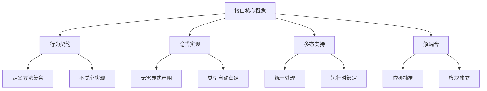
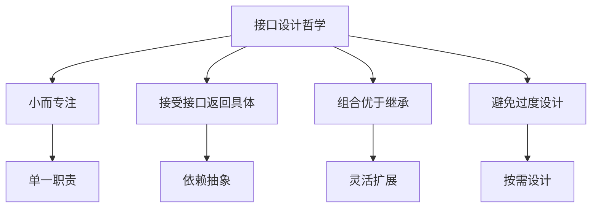

# Golang接口深度解析：从入门到精通的设计哲学

## 一、接口的本质：Golang的灵魂之窗

在Golang的世界中，接口不仅仅是语法特性，更是一种设计哲学。它体现了"鸭子类型"（Duck Typing）的核心思想：**如果它走起来像鸭子，叫起来像鸭子，那么它就是鸭子。**



### 1.1 基础接口定义

```go
package main

import (
    "fmt"
    "math"
)

// Shape 图形接口 - 定义行为契约
type Shape interface {
    Area() float64
    Perimeter() float64
    Name() string
}

// Circle 圆形实现
type Circle struct {
    Radius float64
}

// 隐式实现接口：只要实现了接口的所有方法，就是接口的实现
func (c Circle) Area() float64 {
    return math.Pi * c.Radius * c.Radius
}

func (c Circle) Perimeter() float64 {
    return 2 * math.Pi * c.Radius
}

func (c Circle) Name() string {
    return "圆形"
}

// Rectangle 矩形实现
type Rectangle struct {
    Width  float64
    Height float64
}

func (r Rectangle) Area() float64 {
    return r.Width * r.Height
}

func (r Rectangle) Perimeter() float64 {
    return 2 * (r.Width + r.Height)
}

func (r Rectangle) Name() string {
    return "矩形"
}

// Triangle 三角形实现
type Triangle struct {
    A, B, C float64
}

func (t Triangle) Area() float64 {
    // 海伦公式
    s := t.Perimeter() / 2
    return math.Sqrt(s * (s - t.A) * (s - t.B) * (s - t.C))
}

func (t Triangle) Perimeter() float64 {
    return t.A + t.B + t.C
}

func (t Triangle) Name() string {
    return "三角形"
}

// 多态展示：统一处理不同类型的图形
func PrintShapeInfo(s Shape) {
    fmt.Printf("形状: %s\n", s.Name())
    fmt.Printf("面积: %.2f\n", s.Area())
    fmt.Printf("周长: %.2f\n", s.Perimeter())
    fmt.Println("---")
}

func main() {
    shapes := []Shape{
        Circle{Radius: 5},
        Rectangle{Width: 4, Height: 6},
        Triangle{A: 3, B: 4, C: 5},
    }
    
    for _, shape := range shapes {
        PrintShapeInfo(shape)
    }
}
```

## 二、接口的高级特性

### 2.1 空接口：Go的泛型基石

空接口`interface{}`可以表示任何类型，是Go语言实现泛型编程的基础。

```go
package advanced

import (
    "fmt"
    "reflect"
    "strconv"
)

// 空接口的威力
func ProcessAnything(value interface{}) {
    fmt.Printf("值: %v, 类型: %T\n", value, value)
    
    // 类型断言：安全的类型检测
    switch v := value.(type) {
    case int:
        fmt.Printf("这是整数: %d\n", v)
    case string:
        fmt.Printf("这是字符串，长度: %d\n", len(v))
    case bool:
        fmt.Printf("这是布尔值: %t\n", v)
    case []interface{}:
        fmt.Printf("这是切片，长度: %d\n", len(v))
    default:
        fmt.Printf("未知类型: %T\n", v)
    }
}

// 类型安全的泛型函数
type Converter func(interface{}) (interface{}, error)

var converters = map[string]Converter{
    "string_to_int": func(v interface{}) (interface{}, error) {
        str, ok := v.(string)
        if !ok {
            return nil, fmt.Errorf("期望字符串类型")
        }
        return strconv.Atoi(str)
    },
    "int_to_string": func(v interface{}) (interface{}, error) {
        i, ok := v.(int)
        if !ok {
            return nil, fmt.Errorf("期望整数类型")
        }
        return strconv.Itoa(i), nil
    },
    "float_to_string": func(v interface{}) (interface{}, error) {
        f, ok := v.(float64)
        if !ok {
            return nil, fmt.Errorf("期望浮点数类型")
        }
        return fmt.Sprintf("%.2f", f), nil
    },
}

// 反射与接口的深度结合
func DeepInspect(value interface{}) {
    v := reflect.ValueOf(value)
    t := v.Type()
    
    fmt.Printf("类型: %s\n", t.Name())
    fmt.Printf("种类: %s\n", t.Kind())
    
    switch t.Kind() {
    case reflect.Struct:
        fmt.Println("字段信息:")
        for i := 0; i < t.NumField(); i++ {
            field := t.Field(i)
            fieldValue := v.Field(i)
            fmt.Printf("  %s: %v\n", field.Name, fieldValue.Interface())
        }
    case reflect.Slice, reflect.Array:
        fmt.Printf("长度: %d\n", v.Len())
        if v.Len() > 0 {
            fmt.Printf("第一个元素: %v\n", v.Index(0).Interface())
        }
    case reflect.Map:
        fmt.Printf("键数量: %d\n", v.Len())
    }
}

func main() {
    // 测试空接口
    ProcessAnything(42)
    ProcessAnything("Hello, Go!")
    ProcessAnything(true)
    ProcessAnything([]interface{}{1, "two", 3.0})
    
    // 测试类型转换
    if result, err := converters["string_to_int"]("123"); err == nil {
        fmt.Printf("转换结果: %v\n", result)
    }
    
    // 深度检查
    type Person struct {
        Name string
        Age  int
    }
    
    DeepInspect(Person{Name: "Alice", Age: 30})
    DeepInspect([]int{1, 2, 3})
}
```

### 2.2 接口组合：构建复杂契约体系

```go
package composition

import (
    "fmt"
    "io"
    "time"
)

// 基础接口定义
type Reader interface {
    Read(p []byte) (n int, err error)
}

type Writer interface {
    Write(p []byte) (n int, err error)
}

type Closer interface {
    Close() error
}

// 接口组合：构建更复杂的接口
type ReadWriter interface {
    Reader
    Writer
}

type ReadWriteCloser interface {
    Reader
    Writer
    Closer
}

// 带超时功能的读写器
type TimeoutReader interface {
    Reader
    SetTimeout(duration time.Duration) error
    GetTimeout() time.Duration
}

// 带缓冲的读写器
type BufferedReadWriter interface {
    ReadWriter
    Buffered() int
    Flush() error
}

// 具体实现：带超时的缓冲读写器
type TimeoutBufferedRW struct {
    buffer    []byte
    timeout   time.Duration
    pos       int
}

func NewTimeoutBufferedRW() *TimeoutBufferedRW {
    return &TimeoutBufferedRW{
        buffer: make([]byte, 4096),
        timeout: 30 * time.Second,
    }
}

func (tb *TimeoutBufferedRW) Read(p []byte) (int, error) {
    if tb.pos >= len(tb.buffer) {
        return 0, io.EOF
    }
    
    n := copy(p, tb.buffer[tb.pos:])
    tb.pos += n
    return n, nil
}

func (tb *TimeoutBufferedRW) Write(p []byte) (int, error) {
    if tb.pos+len(p) > len(tb.buffer) {
        return 0, fmt.Errorf("缓冲区已满")
    }
    
    n := copy(tb.buffer[tb.pos:], p)
    tb.pos += n
    return n, nil
}

func (tb *TimeoutBufferedRW) SetTimeout(duration time.Duration) error {
    tb.timeout = duration
    return nil
}

func (tb *TimeoutBufferedRW) GetTimeout() time.Duration {
    return tb.timeout
}

func (tb *TimeoutBufferedRW) Buffered() int {
    return len(tb.buffer) - tb.pos
}

func (tb *TimeoutBufferedRW) Flush() error {
    tb.pos = 0
    return nil
}

// 接口验证函数
func ValidateInterface(obj interface{}) {
    fmt.Printf("验证对象: %T\n", obj)
    
    if rw, ok := obj.(ReadWriter); ok {
        fmt.Println("✓ 实现了 ReadWriter 接口")
        
        // 测试读写功能
        testData := []byte("Hello, Interface!")
        if _, err := rw.Write(testData); err == nil {
            fmt.Println("✓ 写入测试成功")
        }
    }
    
    if tr, ok := obj.(TimeoutReader); ok {
        fmt.Println("✓ 实现了 TimeoutReader 接口")
        fmt.Printf("当前超时: %v\n", tr.GetTimeout())
    }
    
    if brw, ok := obj.(BufferedReadWriter); ok {
        fmt.Println("✓ 实现了 BufferedReadWriter 接口")
        fmt.Printf("缓冲区大小: %d\n", brw.Buffered())
    }
}

func main() {
    rw := NewTimeoutBufferedRW()
    ValidateInterface(rw)
}
```

## 三、接口设计模式实战

### 3.1 策略模式：灵活的算法替换

```go
package strategy

import (
    "fmt"
    "sort"
    "strings"
)

// SortingStrategy 排序策略接口
type SortingStrategy interface {
    Sort(data []int) []int
    Name() string
    Complexity() string
}

// BubbleSort 冒泡排序实现
type BubbleSort struct{}

func (bs BubbleSort) Sort(data []int) []int {
    n := len(data)
    sorted := make([]int, n)
    copy(sorted, data)
    
    for i := 0; i < n-1; i++ {
        for j := 0; j < n-i-1; j++ {
            if sorted[j] > sorted[j+1] {
                sorted[j], sorted[j+1] = sorted[j+1], sorted[j]
            }
        }
    }
    return sorted
}

func (bs BubbleSort) Name() string {
    return "冒泡排序"
}

func (bs BubbleSort) Complexity() string {
    return "O(n²)"
}

// QuickSort 快速排序实现
type QuickSort struct{}

func (qs QuickSort) Sort(data []int) []int {
    if len(data) <= 1 {
        return data
    }
    
    sorted := make([]int, len(data))
    copy(sorted, data)
    
    qs.quickSort(sorted, 0, len(sorted)-1)
    return sorted
}

func (qs QuickSort) quickSort(data []int, low, high int) {
    if low < high {
        pi := qs.partition(data, low, high)
        qs.quickSort(data, low, pi-1)
        qs.quickSort(data, pi+1, high)
    }
}

func (qs QuickSort) partition(data []int, low, high int) int {
    pivot := data[high]
    i := low - 1
    
    for j := low; j < high; j++ {
        if data[j] <= pivot {
            i++
            data[i], data[j] = data[j], data[i]
        }
    }
    
    data[i+1], data[high] = data[high], data[i+1]
    return i + 1
}

func (qs QuickSort) Name() string {
    return "快速排序"
}

func (qs QuickSort) Complexity() string {
    return "O(n log n)"
}

// BuiltInSort Go内置排序
type BuiltInSort struct{}

func (bis BuiltInSort) Sort(data []int) []int {
    sorted := make([]int, len(data))
    copy(sorted, data)
    sort.Ints(sorted)
    return sorted
}

func (bis BuiltInSort) Name() string {
    return "Go内置排序"
}

func (bis BuiltInSort) Complexity() string {
    return "O(n log n)"
}

// SortContext 排序上下文
type SortContext struct {
    strategy SortingStrategy
    data     []int
}

func NewSortContext(strategy SortingStrategy, data []int) *SortContext {
    return &SortContext{
        strategy: strategy,
        data:     data,
    }
}

func (sc *SortContext) SetStrategy(strategy SortingStrategy) {
    sc.strategy = strategy
}

func (sc *SortContext) ExecuteSort() []int {
    return sc.strategy.Sort(sc.data)
}

func (sc *SortContext) PrintSortInfo() {
    fmt.Printf("排序算法: %s\n", sc.strategy.Name())
    fmt.Printf("时间复杂度: %s\n", sc.strategy.Complexity())
    fmt.Printf("原始数据: %v\n", sc.data)
    
    sorted := sc.ExecuteSort()
    fmt.Printf("排序结果: %v\n", sorted)
    fmt.Println("---")
}

func main() {
    testData := []int{64, 34, 25, 12, 22, 11, 90}
    
    strategies := []SortingStrategy{
        BubbleSort{},
        QuickSort{},
        BuiltInSort{},
    }
    
    for _, strategy := range strategies {
        context := NewSortContext(strategy, testData)
        context.PrintSortInfo()
    }
}
```

```mermaid
graph LR
    A[排序上下文] --> B[策略接口]
    B --> C[冒泡排序]
    B --> D[快速排序]
    B --> E[内置排序]
    
    C --> C1[O(n²)]
    D --> D1[O(n log n)]
    E --> E1[O(n log n)]
```

### 3.2 观察者模式：事件驱动的接口设计

```go
package observer

import (
    "fmt"
    "sync"
    "time"
)

// Event 事件接口
type Event interface {
    Name() string
    Timestamp() time.Time
    Data() interface{}
}

// Observer 观察者接口
type Observer interface {
    Notify(event Event)
    ID() string
}

// Subject 主题接口
type Subject interface {
    Register(observer Observer)
    Unregister(observer Observer)
    NotifyObservers(event Event)
}

// 具体事件实现
type MessageEvent struct {
    name      string
    timestamp time.Time
    data      interface{}
}

func NewMessageEvent(name string, data interface{}) *MessageEvent {
    return &MessageEvent{
        name:      name,
        timestamp: time.Now(),
        data:      data,
    }
}

func (me *MessageEvent) Name() string {
    return me.name
}

func (me *MessageEvent) Timestamp() time.Time {
    return me.timestamp
}

func (me *MessageEvent) Data() interface{} {
    return me.data
}

// 具体观察者实现
type LogObserver struct {
    id string
}

func NewLogObserver(id string) *LogObserver {
    return &LogObserver{id: id}
}

func (lo *LogObserver) Notify(event Event) {
    fmt.Printf("[%s] 日志观察者收到事件: %s, 数据: %v, 时间: %s\n",
        lo.id, event.Name(), event.Data(), event.Timestamp().Format("15:04:05"))
}

func (lo *LogObserver) ID() string {
    return lo.id
}

// 邮件观察者
type EmailObserver struct {
    id     string
    email  string
}

func NewEmailObserver(id, email string) *EmailObserver {
    return &EmailObserver{
        id:    id,
        email: email,
    }
}

func (eo *EmailObserver) Notify(event Event) {
    fmt.Printf("[%s] 邮件观察者发送邮件到 %s: 事件 %s 发生\n",
        eo.id, eo.email, event.Name())
}

func (eo *EmailObserver) ID() string {
    return eo.id
}

// 具体主题实现
type EventManager struct {
    observers map[string]Observer
    mutex     sync.RWMutex
}

func NewEventManager() *EventManager {
    return &EventManager{
        observers: make(map[string]Observer),
    }
}

func (em *EventManager) Register(observer Observer) {
    em.mutex.Lock()
    defer em.mutex.Unlock()
    
    em.observers[observer.ID()] = observer
    fmt.Printf("注册观察者: %s\n", observer.ID())
}

func (em *EventManager) Unregister(observer Observer) {
    em.mutex.Lock()
    defer em.mutex.Unlock()
    
    delete(em.observers, observer.ID())
    fmt.Printf("注销观察者: %s\n", observer.ID())
}

func (em *EventManager) NotifyObservers(event Event) {
    em.mutex.RLock()
    defer em.mutex.RUnlock()
    
    fmt.Printf("\n通知所有观察者事件: %s\n", event.Name())
    
    for _, observer := range em.observers {
        observer.Notify(event)
    }
}

// 使用示例
func main() {
    eventManager := NewEventManager()
    
    // 创建观察者
    logObserver := NewLogObserver("log-01")
    emailObserver := NewEmailObserver("email-01", "admin@example.com")
    
    // 注册观察者
    eventManager.Register(logObserver)
    eventManager.Register(emailObserver)
    
    // 发布事件
    events := []Event{
        NewMessageEvent("user_login", map[string]interface{}{
            "user_id": "123",
            "ip":      "192.168.1.1",
        }),
        NewMessageEvent("payment_success", map[string]interface{}{
            "order_id": "ORD-001",
            "amount":   99.99,
        }),
        NewMessageEvent("system_error", map[string]interface{}{
            "module": "database",
            "error":  "connection timeout",
        }),
    }
    
    for _, event := range events {
        eventManager.NotifyObservers(event)
        time.Sleep(1 * time.Second)
    }
    
    // 注销观察者
    eventManager.Unregister(emailObserver)
    
    // 再次发布事件
    finalEvent := NewMessageEvent("shutdown", "系统即将关闭")
    eventManager.NotifyObservers(finalEvent)
}
```

## 四、接口的最佳实践与陷阱

### 4.1 接口设计的黄金法则

```go
package bestpractices

import (
    "errors"
    "fmt"
    "io"
)

// 1. 小而专注的接口
type Reader interface {
    Read(p []byte) (n int, err error)
}

type Writer interface {
    Write(p []byte) (n int, err error)
}

// 而不是一个庞大的接口
// type ReadWriterCloserSeeker interface {
//     Read(p []byte) (n int, err error)
//     Write(p []byte) (n int, err error)
//     Close() error
//     Seek(offset int64, whence int) (int64, error)
// }

// 2. 接受接口，返回具体类型
func NewBufferedReader(reader Reader) *BufferedReader {
    return &BufferedReader{reader: reader}
}

type BufferedReader struct {
    reader Reader
    buffer []byte
    pos    int
}

// 3. 使用接口组合而不是继承
type ReadWriter interface {
    Reader
    Writer
}

// 4. 避免不必要的接口
type ConcreteService struct {
    // 具体实现
}

// 只有当需要多态时才定义接口
// type Service interface {
//     Process() error
// }

// 5. 接口命名的艺术
// 好的命名：以 -er 结尾
// 不好的命名：过于抽象

type Logger interface { // 好的命名
    Log(message string)
}

type Storage interface { // 好的命名
    Save(data []byte) error
    Load() ([]byte, error)
}

// 6. 错误处理的最佳实践
type Temporary interface {
    Temporary() bool
}

type Timeout interface {
    Timeout() bool
}

// 自定义错误类型
type NetworkError struct {
    message   string
    temporary bool
    timeout   bool
}

func (ne NetworkError) Error() string {
    return ne.message
}

func (ne NetworkError) Temporary() bool {
    return ne.temporary
}

func (ne NetworkError) Timeout() bool {
    return ne.timeout
}

// 智能错误处理
func HandleError(err error) {
    if err == nil {
        return
    }
    
    // 检查是否为临时错误
    if tempErr, ok := err.(Temporary); ok && tempErr.Temporary() {
        fmt.Println("临时错误，将重试:", err)
        return
    }
    
    // 检查是否为超时错误
    if timeoutErr, ok := err.(Timeout); ok && timeoutErr.Timeout() {
        fmt.Println("超时错误:", err)
        return
    }
    
    // 普通错误
    fmt.Println("严重错误:", err)
}

// 7. 接口的文档和示例
type Calculator interface {
    // Add 计算两个数的和
    // 示例：Add(1, 2) 返回 3
    Add(a, b int) int
    
    // Subtract 计算两个数的差
    // 示例：Subtract(5, 3) 返回 2
    Subtract(a, b int) int
    
    // Multiply 计算两个数的积
    Multiply(a, b int) int
    
    // Divide 计算两个数的商
    // 如果除数为0，返回错误
    Divide(a, b int) (int, error)
}

// 具体实现
type SimpleCalculator struct{}

func (sc SimpleCalculator) Add(a, b int) int {
    return a + b
}

func (sc SimpleCalculator) Subtract(a, b int) int {
    return a - b
}

func (sc SimpleCalculator) Multiply(a, b int) int {
    return a * b
}

func (sc SimpleCalculator) Divide(a, b int) (int, error) {
    if b == 0 {
        return 0, errors.New("除数不能为0")
    }
    return a / b, nil
}

// 8. 性能考虑：接口 vs 具体类型
func ProcessWithInterface(reader Reader) {
    // 接口调用有轻微的性能开销
    data := make([]byte, 1024)
    reader.Read(data)
}

func ProcessWithConcrete(reader *BufferedReader) {
    // 具体类型调用更高效
    data := make([]byte, 1024)
    reader.Read(data)
}

// 在性能敏感的场景，考虑使用具体类型
```

### 4.2 常见陷阱与避免方法

```go
package pitfalls

import "fmt"

// 陷阱1：过度设计接口
type OverEngineeredService interface {
    Start() error
    Stop() error
    Pause() error
    Resume() error
    Status() string
    Metrics() map[string]interface{}
    HealthCheck() bool
    // ... 更多不必要的方法
}

// 解决方案：按需设计
type SimpleService interface {
    Run() error
    Stop() error
}

// 陷阱2：接口污染
type FileProcessor struct {
    // 业务逻辑
}

// 不要为不需要多态的类型定义接口
// type Processor interface {
//     Process() error
// }

// 陷阱3：接收者为指针的方法
type Config struct {
    settings map[string]string
}

// 如果接口方法需要修改接收者，应该使用指针接收者
func (c *Config) Set(key, value string) {
    if c.settings == nil {
        c.settings = make(map[string]string)
    }
    c.settings[key] = value
}

// 但是这样会导致值类型无法实现接口
// var config Config
// var configInterface SomeInterface = config // 编译错误
// var configInterface SomeInterface = &config // 正确

// 陷阱4：nil接口值
func DangerousFunction(reader io.Reader) {
    // 如果传入nil，将导致panic
    data := make([]byte, 10)
    reader.Read(data) // reader为nil时panic
}

// 解决方案：检查nil
func SafeFunction(reader io.Reader) error {
    if reader == nil {
        return fmt.Errorf("reader不能为nil")
    }
    
    data := make([]byte, 10)
    _, err := reader.Read(data)
    return err
}

// 陷阱5：接口方法签名不一致
type Writer interface {
    Write([]byte) (int, error)
}

// 错误的实现：签名不匹配
type BadWriter struct{}

// 编译错误：方法签名不匹配
// func (bw BadWriter) Write(data []byte) error {
//     return nil
// }

// 正确的实现
type GoodWriter struct{}

func (gw GoodWriter) Write(data []byte) (int, error) {
    return len(data), nil
}
```

## 五、接口在现代Go开发中的应用

### 5.1 泛型与接口的结合

```go
package generics

import (
    "fmt"
    "golang.org/x/exp/constraints"
)

// 类型约束接口
type Number interface {
    constraints.Integer | constraints.Float
}

// 泛型函数使用接口约束
func Sum[T Number](numbers []T) T {
    var total T
    for _, num := range numbers {
        total += num
    }
    return total
}

// 可比较约束
type Comparable interface {
    comparable
}

func FindIndex[T Comparable](slice []T, target T) int {
    for i, item := range slice {
        if item == target {
            return i
        }
    }
    return -1
}

// 自定义类型约束
type Stringer interface {
    String() string
}

func PrintAll[T Stringer](items []T) {
    for _, item := range items {
        fmt.Println(item.String())
    }
}

// 接口与泛型的完美结合
type Container[T any] interface {
    Add(item T)
    Remove() T
    Size() int
    IsEmpty() bool
}

// 具体实现
type Stack[T any] struct {
    items []T
}

func NewStack[T any]() *Stack[T] {
    return &Stack[T]{
        items: make([]T, 0),
    }
}

func (s *Stack[T]) Add(item T) {
    s.items = append(s.items, item)
}

func (s *Stack[T]) Remove() T {
    if s.IsEmpty() {
        var zero T
        return zero
    }
    
    item := s.items[len(s.items)-1]
    s.items = s.items[:len(s.items)-1]
    return item
}

func (s *Stack[T]) Size() int {
    return len(s.items)
}

func (s *Stack[T]) IsEmpty() bool {
    return len(s.items) == 0
}

func main() {
    // 使用泛型接口
    intStack := NewStack[int]()
    intStack.Add(1)
    intStack.Add(2)
    fmt.Printf("栈大小: %d\n", intStack.Size())
    
    stringStack := NewStack[string]()
    stringStack.Add("hello")
    stringStack.Add("world")
    
    // 泛型函数应用
    numbers := []int{1, 2, 3, 4, 5}
    fmt.Printf("总和: %d\n", Sum(numbers))
    
    strings := []string{"a", "b", "c"}
    fmt.Printf("索引: %d\n", FindIndex(strings, "b"))
}
```

### 6.1 核心要点回顾

