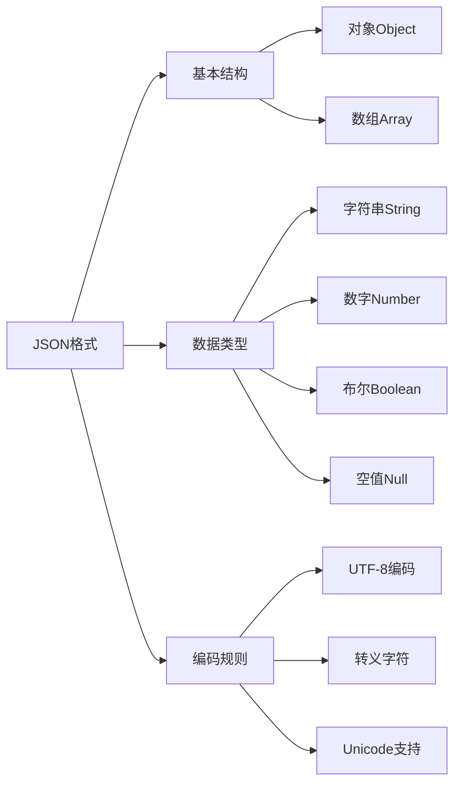
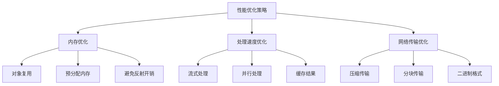
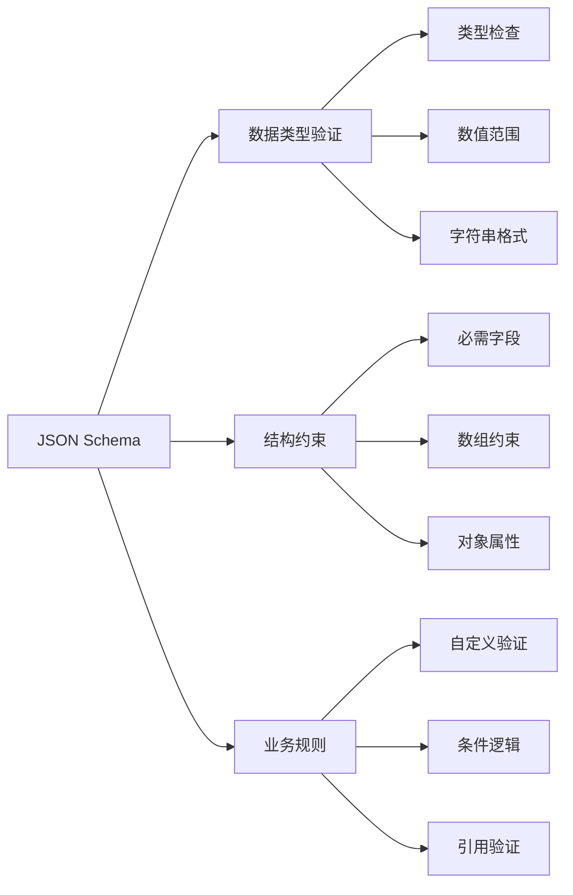
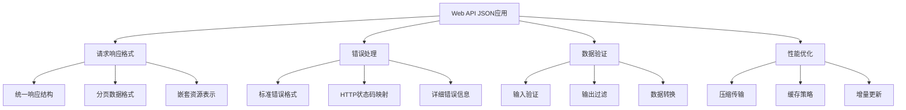
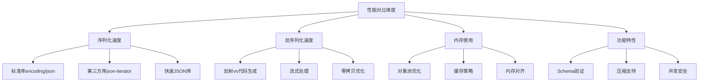
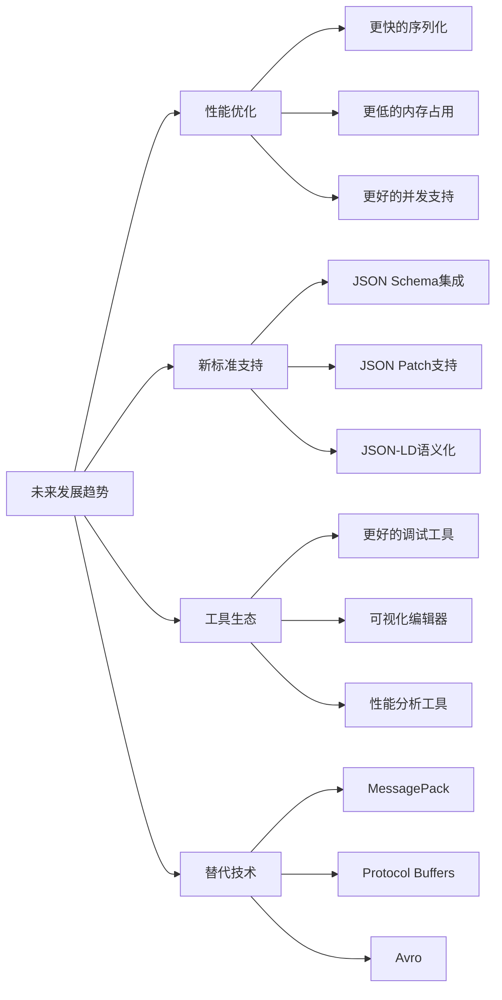

# Golang JSON深度解析：从基础到高级技巧

## 一、JSON基础与Go标准库

### 1.1 JSON数据格式简介

JSON（JavaScript Object Notation）是一种轻量级的数据交换格式，在Web开发、API设计、配置文件等领域广泛应用。



### 1.2 Go标准库encoding/json

Go语言内置了强大的JSON处理能力，主要通过`encoding/json`包实现。

```go
package main

import (
    "encoding/json"
    "fmt"
    "log"
)

// 基础结构体映射
type User struct {
    ID       int    `json:"id"`
    Name     string `json:"name"`
    Email    string `json:"email,omitempty"`
    Active   bool   `json:"active"`
    CreateAt string `json:"create_at,omitempty"`
}

func main() {
    // 基础JSON编码
    user := User{
        ID:     1,
        Name:   "张三",
        Email:  "zhangsan@example.com",
        Active: true,
    }
    
    // 编码为JSON
    jsonData, err := json.Marshal(user)
    if err != nil {
        log.Fatal(err)
    }
    
    fmt.Println(string(jsonData))
    
    // 解码JSON
    var decodedUser User
    err = json.Unmarshal(jsonData, &decodedUser)
    if err != nil {
        log.Fatal(err)
    }
    
    fmt.Printf("解码结果: %+v\n", decodedUser)
}
```

### 1.3 JSON标签详解

结构体标签是Go JSON处理的核心特性，提供了丰富的控制选项：

```go
package main

import (
    "encoding/json"
    "fmt"
)

// 详细的结构体标签示例
type DetailedStruct struct {
    // 基础字段名映射
    FieldName string `json:"field_name"`
    
    // 忽略空值
    OptionalField string `json:"optional_field,omitempty"`
    
    // 字段忽略（不参与序列化）
    InternalField string `json:"-"`
    
    // 字符串格式的数字
    StringNumber string `json:"string_number,string"`
    
    // 忽略空值和字段名
    CompactField *string `json:",omitempty"`
    
    // 嵌套结构体
    Nested *NestedStruct `json:"nested"`
}

type NestedStruct struct {
    InnerField string `json:"inner_field"`
}

func main() {
    data := DetailedStruct{
        FieldName:     "value",
        OptionalField: "", // 空值会被忽略
        InternalField: "hidden", // 不会出现在JSON中
        StringNumber:  "123",
        CompactField:  nil, // 空指针会被忽略
    }
    
    jsonData, _ := json.Marshal(data)
    fmt.Println("标签效果:", string(jsonData))
}
```

## 二、高级序列化与反序列化技巧

### 2.1 自定义序列化器

通过实现`json.Marshaler`和`json.Unmarshaler`接口，可以完全控制序列化过程：

```go
package advanced

import (
    "encoding/json"
    "fmt"
    "time"
)

// 自定义时间格式
type CustomTime struct {
    time.Time
}

const customTimeLayout = "2006-01-02 15:04:05"

func (ct CustomTime) MarshalJSON() ([]byte, error) {
    if ct.IsZero() {
        return []byte(`""`), nil
    }
    return []byte(fmt.Sprintf(`"%s"`, ct.Format(customTimeLayout))), nil
}

func (ct *CustomTime) UnmarshalJSON(data []byte) error {
    var timeStr string
    if err := json.Unmarshal(data, &timeStr); err != nil {
        return err
    }
    
    if timeStr == "" {
        ct.Time = time.Time{}
        return nil
    }
    
    parsedTime, err := time.Parse(customTimeLayout, timeStr)
    if err != nil {
        return err
    }
    
    ct.Time = parsedTime
    return nil
}

// 使用自定义序列化器的结构体
type CustomEntity struct {
    ID        int        `json:"id"`
    Name      string     `json:"name"`
    CreatedAt CustomTime `json:"created_at"`
    UpdatedAt CustomTime `json:"updated_at"`
}

func ExampleCustomMarshaler() {
    entity := CustomEntity{
        ID:        1,
        Name:      "示例实体",
        CreatedAt: CustomTime{time.Now()},
        UpdatedAt: CustomTime{time.Time{}}, // 零值时间
    }
    
    jsonData, _ := json.Marshal(entity)
    fmt.Println("自定义序列化:", string(jsonData))
}
```

### 2.2 动态JSON处理

处理未知结构的JSON数据时，可以使用`interface{}`或`map[string]interface{}`：

```go
package advanced

import (
    "encoding/json"
    "fmt"
)

func DynamicJSONProcessing() {
    // 未知结构的JSON数据
    jsonStr := `{
        "name": "张三",
        "age": 30,
        "metadata": {
            "department": "技术部",
            "role": "工程师"
        },
        "tags": ["go", "backend", "devops"]
    }`
    
    // 使用interface{}解析
    var data interface{}
    json.Unmarshal([]byte(jsonStr), &data)
    
    // 类型断言处理
    if obj, ok := data.(map[string]interface{}); ok {
        fmt.Println("姓名:", obj["name"])
        fmt.Println("年龄:", obj["age"])
        
        if metadata, ok := obj["metadata"].(map[string]interface{}); ok {
            fmt.Println("部门:", metadata["department"])
        }
        
        if tags, ok := obj["tags"].([]interface{}); ok {
            fmt.Println("标签:", tags)
        }
    }
}

// 更安全的方式：使用json.RawMessage
func RawMessageProcessing() {
    type FlexibleStruct struct {
        Name     string          `json:"name"`
        Age      int             `json:"age"`
        Metadata json.RawMessage `json:"metadata"` // 延迟解析
    }
    
    jsonStr := `{
        "name": "李四",
        "age": 25,
        "metadata": {
            "level": "senior",
            "skills": ["go", "python", "docker"]
        }
    }`
    
    var flexible FlexibleStruct
    json.Unmarshal([]byte(jsonStr), &flexible)
    
    // 按需解析metadata
    var metadata map[string]interface{}
    json.Unmarshal(flexible.Metadata, &metadata)
    
    fmt.Println("姓名:", flexible.Name)
    fmt.Println("级别:", metadata["level"])
}
```

### 2.3 流式JSON处理

对于大文件或网络流，使用流式处理可以节省内存：

```go
package advanced

import (
    "encoding/json"
    "fmt"
    "strings"
)

func StreamJSONProcessing() {
    // 模拟JSON流数据
    jsonStream := `{"name": "用户1", "age": 25}
{"name": "用户2", "age": 30}
{"name": "用户3", "age": 35}`
    
    decoder := json.NewDecoder(strings.NewReader(jsonStream))
    
    for {
        var user map[string]interface{}
        
        // 解码单个JSON对象
        if err := decoder.Decode(&user); err != nil {
            break // 流结束或错误
        }
        
        fmt.Printf("处理用户: %v\n", user)
    }
}

// 分块处理大JSON数组
func ChunkedArrayProcessing() {
    // 模拟大JSON数组
    jsonArray := `[
        {"id": 1, "value": "数据1"},
        {"id": 2, "value": "数据2"},
        {"id": 3, "value": "数据3"},
        {"id": 4, "value": "数据4"}
    ]`
    
    decoder := json.NewDecoder(strings.NewReader(jsonArray))
    
    // 读取开始数组标记
    token, err := decoder.Token()
    if err != nil || token != json.Delim('[') {
        fmt.Println("不是有效的JSON数组")
        return
    }
    
    // 逐个处理数组元素
    for decoder.More() {
        var item map[string]interface{}
        if err := decoder.Decode(&item); err != nil {
            break
        }
        fmt.Printf("处理数组项: %v\n", item)
    }
    
    // 读取结束数组标记
    token, err = decoder.Token()
    if err != nil || token != json.Delim(']') {
        fmt.Println("JSON数组格式错误")
    }
}
```

## 三、性能优化与高级技巧

### 3.1 JSON性能优化策略



```go
package optimization

import (
    "encoding/json"
    "sync"
)

// 对象池减少GC压力
type ObjectPool struct {
    pool sync.Pool
}

func NewObjectPool(example interface{}) *ObjectPool {
    return &ObjectPool{
        pool: sync.Pool{
            New: func() interface{} {
                // 返回新对象的副本
                return example
            },
        },
    }
}

func (op *ObjectPool) Get() interface{} {
    return op.pool.Get()
}

func (op *ObjectPool) Put(obj interface{}) {
    op.pool.Put(obj)
}

// 高性能JSON处理结构体
type HighPerfJSON struct {
    bufferPool sync.Pool
}

func NewHighPerfJSON() *HighPerfJSON {
    return &HighPerfJSON{
        bufferPool: sync.Pool{
            New: func() interface{} {
                return make([]byte, 0, 1024) // 预分配缓冲区
            },
        },
    }
}

func (hpj *HighPerfJSON) Marshal(v interface{}) ([]byte, error) {
    buffer := hpj.bufferPool.Get().([]byte)
    buffer = buffer[:0] // 重用缓冲区
    
    // 使用json.Encoder提高性能
    // 实际实现需要使用bytes.Buffer
    
    result, err := json.Marshal(v)
    
    // 返还缓冲区到池中
    hpj.bufferPool.Put(buffer)
    
    return result, err
}

// 避免反射的快速序列化
func FastMarshal(user struct {
    ID   int    `json:"id"`
    Name string `json:"name"`
}) []byte {
    // 手动构建JSON字符串，避免反射开销
    // 注意：这种方法牺牲了灵活性，换取性能
    return []byte(fmt.Sprintf(`{"id":%d,"name":"%s"}`, user.ID, user.Name))
}
```

### 3.2 自定义编码器优化

实现高性能的自定义JSON编码器：

```go
package optimization

import (
    "encoding/json"
    "fmt"
    "strings"
)

// 快速JSON编码器
type FastJSONEncoder struct {
    builder strings.Builder
}

func NewFastJSONEncoder() *FastJSONEncoder {
    return &FastJSONEncoder{}
}

func (fje *FastJSONEncoder) WriteString(key, value string) {
    if fje.builder.Len() > 0 {
        fje.builder.WriteByte(',')
    }
    fmt.Fprintf(&fje.builder, `"%s":"%s"`, key, value)
}

func (fje *FastJSONEncoder) WriteInt(key string, value int) {
    if fje.builder.Len() > 0 {
        fje.builder.WriteByte(',')
    }
    fmt.Fprintf(&fje.builder, `"%s":%d`, key, value)
}

func (fje *FastJSONEncoder) WriteBool(key string, value bool) {
    if fje.builder.Len() > 0 {
        fje.builder.WriteByte(',')
    }
    fmt.Fprintf(&fje.builder, `"%s":%t`, key, value)
}

func (fje *FastJSONEncoder) BeginObject(key string) {
    if fje.builder.Len() > 0 {
        fje.builder.WriteByte(',')
    }
    if key != "" {
        fmt.Fprintf(&fje.builder, `"%s":{`, key)
    } else {
        fje.builder.WriteByte('{')
    }
}

func (fje *FastJSONEncoder) EndObject() {
    fje.builder.WriteByte('}')
}

func (fje *FastJSONEncoder) String() string {
    return fje.builder.String()
}

func (fje *FastJSONEncoder) Bytes() []byte {
    return []byte(fje.builder.String())
}

func (fje *FastJSONEncoder) Reset() {
    fje.builder.Reset()
}

// 使用示例
func ExampleFastEncoder() {
    encoder := NewFastJSONEncoder()
    encoder.BeginObject("")
    encoder.WriteString("name", "张三")
    encoder.WriteInt("age", 30)
    encoder.WriteBool("active", true)
    
    encoder.BeginObject("address")
    encoder.WriteString("city", "北京")
    encoder.WriteString("street", "朝阳区")
    encoder.EndObject() // 结束address对象
    
    encoder.EndObject() // 结束根对象
    
    fmt.Println("快速编码结果:", encoder.String())
}

### 3.3 并发安全的JSON处理

在并发环境中安全处理JSON数据：

```go
package optimization

import (
    "encoding/json"
    "sync"
)

// 线程安全的JSON缓存
type JSONCache struct {
    cache map[string][]byte
    mutex sync.RWMutex
}

func NewJSONCache() *JSONCache {
    return &JSONCache{
        cache: make(map[string][]byte),
    }
}

func (jc *JSONCache) Get(key string) ([]byte, bool) {
    jc.mutex.RLock()
    defer jc.mutex.RUnlock()
    
    value, exists := jc.cache[key]
    return value, exists
}

func (jc *JSONCache) Set(key string, value interface{}) error {
    jsonData, err := json.Marshal(value)
    if err != nil {
        return err
    }
    
    jc.mutex.Lock()
    defer jc.mutex.Unlock()
    
    jc.cache[key] = jsonData
    return nil
}

func (jc *JSONCache) Delete(key string) {
    jc.mutex.Lock()
    defer jc.mutex.Unlock()
    
    delete(jc.cache, key)
}

// 并发JSON编码器
type ConcurrentJSONEncoder struct {
    encoderPool sync.Pool
}

func NewConcurrentJSONEncoder() *ConcurrentJSONEncoder {
    return &ConcurrentJSONEncoder{
        encoderPool: sync.Pool{
            New: func() interface{} {
                return json.NewEncoder(nil)
            },
        },
    }
}

func (cje *ConcurrentJSONEncoder) Encode(v interface{}) ([]byte, error) {
    // 从池中获取编码器
    // 实际实现需要使用bytes.Buffer
    return json.Marshal(v)
}
```

## 四、JSON Schema验证与数据校验

### 4.1 JSON Schema基础

JSON Schema用于描述和验证JSON数据的结构：



```go
package validation

import (
    "encoding/json"
    "fmt"
    "regexp"
    "strconv"
)

// 基础的JSON Schema验证器
type JSONSchema struct {
    Type                 string            `json:"type,omitempty"`
    Properties          map[string]Schema `json:"properties,omitempty"`
    Required            []string          `json:"required,omitempty"`
    Pattern             string            `json:"pattern,omitempty"`
    Minimum             *float64          `json:"minimum,omitempty"`
    Maximum             *float64          `json:"maximum,omitempty"`
    MinLength           *int              `json:"minLength,omitempty"`
    MaxLength           *int              `json:"maxLength,omitempty"`
    Enum                []interface{}     `json:"enum,omitempty"`
    Items               *Schema           `json:"items,omitempty"`
    AdditionalProperties bool             `json:"additionalProperties,omitempty"`
}

type Schema JSONSchema

// 验证结果
type ValidationResult struct {
    Valid  bool
    Errors []ValidationError
}

type ValidationError struct {
    Field   string
    Message string
}

func (js *JSONSchema) Validate(data interface{}) ValidationResult {
    result := ValidationResult{Valid: true}
    
    // 类型验证
    if js.Type != "" {
        if !js.validateType(data, js.Type) {
            result.Valid = false
            result.Errors = append(result.Errors, ValidationError{
                Field:   "root",
                Message: fmt.Sprintf("期望类型 %s", js.Type),
            })
        }
    }
    
    // 对象属性验证
    if obj, ok := data.(map[string]interface{}); ok && js.Properties != nil {
        // 必需字段检查
        for _, requiredField := range js.Required {
            if _, exists := obj[requiredField]; !exists {
                result.Valid = false
                result.Errors = append(result.Errors, ValidationError{
                    Field:   requiredField,
                    Message: "字段是必需的",
                })
            }
        }
        
        // 属性验证
        for fieldName, fieldSchema := range js.Properties {
            if fieldValue, exists := obj[fieldName]; exists {
                fieldResult := fieldSchema.Validate(fieldValue)
                if !fieldResult.Valid {
                    result.Valid = false
                    for _, err := range fieldResult.Errors {
                        result.Errors = append(result.Errors, ValidationError{
                            Field:   fieldName + "." + err.Field,
                            Message: err.Message,
                        })
                    }
                }
            }
        }
    }
    
    // 字符串验证
    if str, ok := data.(string); ok {
        if js.Pattern != "" {
            matched, _ := regexp.MatchString(js.Pattern, str)
            if !matched {
                result.Valid = false
                result.Errors = append(result.Errors, ValidationError{
                    Field:   "root",
                    Message: "字符串格式不匹配",
                })
            }
        }
        
        if js.MinLength != nil && len(str) < *js.MinLength {
            result.Valid = false
            result.Errors = append(result.Errors, ValidationError{
                Field:   "root",
                Message: "字符串长度过短",
            })
        }
        
        if js.MaxLength != nil && len(str) > *js.MaxLength {
            result.Valid = false
            result.Errors = append(result.Errors, ValidationError{
                Field:   "root",
                Message: "字符串长度过长",
            })
        }
    }
    
    // 数值验证
    if num, ok := data.(float64); ok {
        if js.Minimum != nil && num < *js.Minimum {
            result.Valid = false
            result.Errors = append(result.Errors, ValidationError{
                Field:   "root",
                Message: "数值太小",
            })
        }
        
        if js.Maximum != nil && num > *js.Maximum {
            result.Valid = false
            result.Errors = append(result.Errors, ValidationError{
                Field:   "root",
                Message: "数值太大",
            })
        }
    }
    
    // 枚举验证
    if len(js.Enum) > 0 {
        found := false
        for _, enumValue := range js.Enum {
            if fmt.Sprintf("%v", enumValue) == fmt.Sprintf("%v", data) {
                found = true
                break
            }
        }
        if !found {
            result.Valid = false
            result.Errors = append(result.Errors, ValidationError{
                Field:   "root",
                Message: "值不在枚举范围内",
            })
        }
    }
    
    return result
}

func (js *JSONSchema) validateType(data interface{}, expectedType string) bool {
    switch expectedType {
    case "string":
        _, ok := data.(string)
        return ok
    case "number":
        _, ok := data.(float64)
        return ok
    case "integer":
        if num, ok := data.(float64); ok {
            return num == float64(int(num))
        }
        return false
    case "boolean":
        _, ok := data.(bool)
        return ok
    case "object":
        _, ok := data.(map[string]interface{})
        return ok
    case "array":
        _, ok := data.([]interface{})
        return ok
    case "null":
        return data == nil
    default:
        return false
    }
}

func ExampleJSONSchema() {
    // 定义用户数据Schema
    userSchema := JSONSchema{
        Type: "object",
        Required: []string{"name", "age"},
        Properties: map[string]Schema{
            "name": {
                Type:      "string",
                MinLength: intPtr(1),
                MaxLength: intPtr(50),
            },
            "age": {
                Type:    "integer",
                Minimum: float64Ptr(0),
                Maximum: float64Ptr(150),
            },
            "email": {
                Type:    "string",
                Pattern: `^[a-zA-Z0-9._%+-]+@[a-zA-Z0-9.-]+\.[a-zA-Z]{2,}$`,
            },
        },
    }
    
    // 测试数据
    testData := map[string]interface{}{
        "name":  "李四",
        "age":   25,
        "email": "lisi@example.com",
    }
    
    result := userSchema.Validate(testData)
    fmt.Printf("验证结果: %v\n", result.Valid)
    if !result.Valid {
        for _, err := range result.Errors {
            fmt.Printf("错误: %s - %s\n", err.Field, err.Message)
        }
    }
}

func intPtr(i int) *int {
    return &i
}

func float64Ptr(f float64) *float64 {
    return &f
}
```

### 4.2 高级验证技巧

```go
package validation

import (
    "reflect"
    "regexp"
    "strings"
)

// 自定义验证规则
type Validator interface {
    Validate(value interface{}) error
}

// 邮箱验证器
type EmailValidator struct{}

func (ev EmailValidator) Validate(value interface{}) error {
    str, ok := value.(string)
    if !ok {
        return fmt.Errorf("邮箱必须是字符串")
    }
    
    emailRegex := `^[a-zA-Z0-9._%+-]+@[a-zA-Z0-9.-]+\.[a-zA-Z]{2,}$`
    matched, _ := regexp.MatchString(emailRegex, str)
    if !matched {
        return fmt.Errorf("邮箱格式无效")
    }
    
    return nil
}

// 手机号验证器
type PhoneValidator struct{}

func (pv PhoneValidator) Validate(value interface{}) error {
    str, ok := value.(string)
    if !ok {
        return fmt.Errorf("手机号必须是字符串")
    }
    
    phoneRegex := `^1[3-9]\d{9}$`
    matched, _ := regexp.MatchString(phoneRegex, str)
    if !matched {
        return fmt.Errorf("手机号格式无效")
    }
    
    return nil
}

// 验证管理器
type ValidationManager struct {
    validators map[string]Validator
}

func NewValidationManager() *ValidationManager {
    vm := &ValidationManager{
        validators: make(map[string]Validator),
    }
    
    // 注册内置验证器
    vm.RegisterValidator("email", EmailValidator{})
    vm.RegisterValidator("phone", PhoneValidator{})
    
    return vm
}

func (vm *ValidationManager) RegisterValidator(name string, validator Validator) {
    vm.validators[name] = validator
}

func (vm *ValidationManager) ValidateField(name string, value interface{}, rules []string) []error {
    var errors []error
    
    for _, rule := range rules {
        if validator, exists := vm.validators[rule]; exists {
            if err := validator.Validate(value); err != nil {
                errors = append(errors, fmt.Errorf("%s: %s", name, err.Error()))
            }
        }
    }
    
    return errors
}

## 五、实战应用与最佳实践

### 5.1 Web API开发中的JSON应用

在现代Web开发中，JSON是API通信的主要格式：



```go
package webapi

import (
    "encoding/json"
    "net/http"
    "strconv"
)

// 统一API响应格式
type APIResponse struct {
    Success bool        `json:"success"`
    Data    interface{} `json:"data,omitempty"`
    Error   *APIError   `json:"error,omitempty"`
    Meta    *APIMeta    `json:"meta,omitempty"`
}

type APIError struct {
    Code    string `json:"code"`
    Message string `json:"message"`
    Details string `json:"details,omitempty"`
}

type APIMeta struct {
    Page       int `json:"page,omitempty"`
    PageSize   int `json:"page_size,omitempty"`
    TotalCount int `json:"total_count,omitempty"`
    TotalPages int `json:"total_pages,omitempty"`
}

// 成功的API响应
func SuccessResponse(data interface{}) APIResponse {
    return APIResponse{
        Success: true,
        Data:    data,
    }
}

// 分页数据响应
func PaginatedResponse(data interface{}, page, pageSize, totalCount int) APIResponse {
    totalPages := (totalCount + pageSize - 1) / pageSize
    
    return APIResponse{
        Success: true,
        Data:    data,
        Meta: &APIMeta{
            Page:       page,
            PageSize:   pageSize,
            TotalCount: totalCount,
            TotalPages: totalPages,
        },
    }
}

// 错误响应
func ErrorResponse(code, message, details string) APIResponse {
    return APIResponse{
        Success: false,
        Error: &APIError{
            Code:    code,
            Message: message,
            Details: details,
        },
    }
}

// JSON API处理器
type JSONAPIHandler struct {
    validationManager *validation.ValidationManager
}

func NewJSONAPIHandler() *JSONAPIHandler {
    return &JSONAPIHandler{
        validationManager: validation.NewValidationManager(),
    }
}

func (jah *JSONAPIHandler) WriteJSON(w http.ResponseWriter, status int, data interface{}) {
    w.Header().Set("Content-Type", "application/json")
    w.WriteHeader(status)
    
    if err := json.NewEncoder(w).Encode(data); err != nil {
        http.Error(w, "JSON编码错误", http.StatusInternalServerError)
    }
}

func (jah *JSONAPIHandler) ReadJSON(r *http.Request, v interface{}) error {
    if r.Header.Get("Content-Type") != "application/json" {
        return fmt.Errorf("不支持的Content-Type")
    }
    
    decoder := json.NewDecoder(r.Body)
    decoder.DisallowUnknownFields() // 禁止未知字段
    
    if err := decoder.Decode(v); err != nil {
        return fmt.Errorf("JSON解码错误: %v", err)
    }
    
    return nil
}

// 用户API处理器示例
func (jah *JSONAPIHandler) HandleCreateUser(w http.ResponseWriter, r *http.Request) {
    var user struct {
        Name  string `json:"name"`
        Email string `json:"email"`
        Age   int    `json:"age"`
    }
    
    // 读取和验证JSON输入
    if err := jah.ReadJSON(r, &user); err != nil {
        jah.WriteJSON(w, http.StatusBadRequest, 
            ErrorResponse("INVALID_JSON", "无效的JSON格式", err.Error()))
        return
    }
    
    // 业务逻辑验证
    if user.Age < 18 {
        jah.WriteJSON(w, http.StatusBadRequest,
            ErrorResponse("INVALID_AGE", "年龄必须大于18岁", ""))
        return
    }
    
    // 创建用户逻辑...
    
    // 返回成功响应
    jah.WriteJSON(w, http.StatusCreated, SuccessResponse(user))
}

func (jah *JSONAPIHandler) HandleGetUsers(w http.ResponseWriter, r *http.Request) {
    // 解析查询参数
    page, _ := strconv.Atoi(r.URL.Query().Get("page"))
    if page <= 0 {
        page = 1
    }
    
    pageSize, _ := strconv.Atoi(r.URL.Query().Get("page_size"))
    if pageSize <= 0 || pageSize > 100 {
        pageSize = 20
    }
    
    // 获取用户数据逻辑...
    users := []interface{}{
        map[string]interface{}{"id": 1, "name": "用户1"},
        map[string]interface{}{"id": 2, "name": "用户2"},
    }
    totalCount := 100
    
    jah.WriteJSON(w, http.StatusOK, PaginatedResponse(users, page, pageSize, totalCount))
}
```

### 5.2 配置文件管理与JSON

使用JSON作为配置文件格式的实践：

```go
package config

import (
    "encoding/json"
    "fmt"
    "io/ioutil"
    "os"
    "path/filepath"
)

// 应用配置结构
type AppConfig struct {
    Server   ServerConfig   `json:"server"`
    Database DatabaseConfig `json:"database"`
    Logging  LoggingConfig  `json:"logging"`
    Features FeaturesConfig `json:"features"`
}

type ServerConfig struct {
    Host string `json:"host"`
    Port int    `json:"port"`
    Env  string `json:"env"`
}

type DatabaseConfig struct {
    Host     string `json:"host"`
    Port     int    `json:"port"`
    Username string `json:"username"`
    Password string `json:"password"`
    Database string `json:"database"`
}

type LoggingConfig struct {
    Level    string `json:"level"`
    FilePath string `json:"file_path"`
}

type FeaturesConfig struct {
    CacheEnabled    bool `json:"cache_enabled"`
    APIRateLimit    int  `json:"api_rate_limit"`
    FeatureFlagNewUI bool `json:"feature_flag_new_ui"`
}

// JSON配置管理器
type JSONConfigManager struct {
    configPath string
    config     *AppConfig
}

func NewJSONConfigManager(configPath string) *JSONConfigManager {
    return &JSONConfigManager{
        configPath: configPath,
    }
}

func (jcm *JSONConfigManager) Load() error {
    data, err := ioutil.ReadFile(jcm.configPath)
    if err != nil {
        return fmt.Errorf("读取配置文件失败: %v", err)
    }
    
    var config AppConfig
    if err := json.Unmarshal(data, &config); err != nil {
        return fmt.Errorf("解析JSON配置失败: %v", err)
    }
    
    // 验证配置
    if err := jcm.ValidateConfig(&config); err != nil {
        return fmt.Errorf("配置验证失败: %v", err)
    }
    
    jcm.config = &config
    return nil
}

func (jcm *JSONConfigManager) ValidateConfig(config *AppConfig) error {
    if config.Server.Port <= 0 || config.Server.Port > 65535 {
        return fmt.Errorf("服务器端口无效")
    }
    
    if config.Database.Host == "" {
        return fmt.Errorf("数据库主机不能为空")
    }
    
    if config.Features.APIRateLimit < 0 {
        return fmt.Errorf("API速率限制不能为负数")
    }
    
    return nil
}

func (jcm *JSONConfigManager) GetConfig() *AppConfig {
    return jcm.config
}

func (jcm *JSONConfigManager) Update(config *AppConfig) error {
    data, err := json.MarshalIndent(config, "", "  ")
    if err != nil {
        return fmt.Errorf("序列化配置失败: %v", err)
    }
    
    // 创建备份
    if err := jcm.createBackup(); err != nil {
        return fmt.Errorf("创建备份失败: %v", err)
    }
    
    if err := ioutil.WriteFile(jcm.configPath, data, 0644); err != nil {
        // 恢复备份
        jcm.restoreBackup()
        return fmt.Errorf("写入配置文件失败: %v", err)
    }
    
    jcm.config = config
    return nil
}

func (jcm *JSONConfigManager) createBackup() error {
    backupPath := jcm.configPath + ".bak"
    return os.Link(jcm.configPath, backupPath)
}

func (jcm *JSONConfigManager) restoreBackup() {
    backupPath := jcm.configPath + ".bak"
    if _, err := os.Stat(backupPath); err == nil {
        os.Rename(backupPath, jcm.configPath)
    }
}

// 环境特定的配置加载
func LoadConfigForEnv(env string) (*AppConfig, error) {
    configFile := fmt.Sprintf("config.%s.json", env)
    
    manager := NewJSONConfigManager(configFile)
    if err := manager.Load(); err != nil {
        return nil, err
    }
    
    return manager.GetConfig(), nil
}

// 配置热重载监控
func WatchConfigChanges(configPath string, callback func(*AppConfig)) {
    // 实现文件监控逻辑
    // 当配置文件变化时调用回调函数
}
```

### 5.3 数据序列化与存储

JSON在数据持久化和交换中的应用：

```go
package storage

import (
    "encoding/json"
    "fmt"
    "time"
)

// JSON数据仓库
type JSONRepository struct {
    storage map[string][]byte
}

func NewJSONRepository() *JSONRepository {
    return &JSONRepository{
        storage: make(map[string][]byte),
    }
}

func (jr *JSONRepository) Save(key string, value interface{}) error {
    jsonData, err := json.Marshal(value)
    if err != nil {
        return fmt.Errorf("序列化失败: %v", err)
    }
    
    jr.storage[key] = jsonData
    return nil
}

func (jr *JSONRepository) Load(key string, value interface{}) error {
    jsonData, exists := jr.storage[key]
    if !exists {
        return fmt.Errorf("键不存在: %s", key)
    }
    
    if err := json.Unmarshal(jsonData, value); err != nil {
        return fmt.Errorf("反序列化失败: %v", err)
    }
    
    return nil
}

// 版本化的JSON存储
type VersionedJSONStorage struct {
    repository *JSONRepository
}

func NewVersionedJSONStorage() *VersionedJSONStorage {
    return &VersionedJSONStorage{
        repository: NewJSONRepository(),
    }
}

func (vjs *VersionedJSONStorage) SaveWithVersion(key string, value interface{}) (int, error) {
    versionKey := fmt.Sprintf("%s_version", key)
    
    // 获取当前版本
    var currentVersion int
    vjs.repository.Load(versionKey, &currentVersion)
    
    newVersion := currentVersion + 1
    
    // 保存新版本数据
    versionedKey := fmt.Sprintf("%s_v%d", key, newVersion)
    if err := vjs.repository.Save(versionedKey, value); err != nil {
        return 0, err
    }
    
    // 更新版本号
    if err := vjs.repository.Save(versionKey, newVersion); err != nil {
        return 0, err
    }
    
    return newVersion, nil
}

func (vjs *VersionedJSONStorage) LoadVersion(key string, version int, value interface{}) error {
    versionedKey := fmt.Sprintf("%s_v%d", key, version)
    return vjs.repository.Load(versionedKey, value)
}

// JSON数据压缩存储
type CompressedJSONStorage struct {
    repository *JSONRepository
    compress   bool
}

func NewCompressedJSONStorage(compress bool) *CompressedJSONStorage {
    return &CompressedJSONStorage{
        repository: NewJSONRepository(),
        compress:   compress,
    }
}

func (cjs *CompressedJSONStorage) SaveCompressed(key string, value interface{}) error {
    jsonData, err := json.Marshal(value)
    if err != nil {
        return err
    }
    
    if cjs.compress {
        // 实现压缩逻辑
        // jsonData = compress(jsonData)
    }
    
    // 添加压缩标记
    metadata := map[string]interface{}{
        "compressed": cjs.compress,
        "timestamp":  time.Now().Unix(),
        "data":       jsonData,
    }
    
    metadataJSON, _ := json.Marshal(metadata)
    return cjs.repository.Save(key, metadataJSON)
}

func (cjs *CompressedJSONStorage) LoadCompressed(key string, value interface{}) error {
    var metadata map[string]interface{}
    if err := cjs.repository.Load(key, &metadata); err != nil {
        return err
    }
    
    data, ok := metadata["data"].([]byte)
    if !ok {
        return fmt.Errorf("无效的数据格式")
    }
    
    if compressed, ok := metadata["compressed"].(bool); ok && compressed {
        // 实现解压逻辑
        // data = decompress(data)
    }
    
    return json.Unmarshal(data, value)
}

### 6.1 不同JSON库性能对比



```go
package benchmark

import (
    "encoding/json"
    "fmt"
    "testing"
    "time"
)

// 基准测试结构体
type BenchmarkStruct struct {
    ID      int               `json:"id"`
    Name    string            `json:"name"`
    Tags    []string          `json:"tags"`
    Metadata map[string]interface{} `json:"metadata"`
    Created time.Time         `json:"created"`
}

func BenchmarkStandardJSON(b *testing.B) {
    data := BenchmarkStruct{
        ID:   1,
        Name: "测试数据",
        Tags: []string{"go", "json", "benchmark"},
        Metadata: map[string]interface{}{
            "version": "1.0",
            "active":  true,
        },
        Created: time.Now(),
    }
    
    b.ResetTimer()
    
    for i := 0; i < b.N; i++ {
        json.Marshal(data)
    }
}

func BenchmarkCustomEncoder(b *testing.B) {
    data := BenchmarkStruct{
        ID:   1,
        Name: "测试数据",
        Tags: []string{"go", "json", "benchmark"},
        Metadata: map[string]interface{}{
            "version": "1.0",
            "active":  true,
        },
        Created: time.Now(),
    }
    
    b.ResetTimer()
    
    for i := 0; i < b.N; i++ {
        // 使用自定义编码器
        encoder := optimization.NewFastJSONEncoder()
        encoder.BeginObject("")
        encoder.WriteInt("id", data.ID)
        encoder.WriteString("name", data.Name)
        // 省略其他字段序列化
        encoder.EndObject()
        _ = encoder.Bytes()
    }
}

// 性能分析结果
type PerformanceStats struct {
    Library       string
    MarshalTime   time.Duration
    UnmarshalTime time.Duration
    MemoryUsage   int64
    Features      []string
}

func CompareJSONLibraries() {
    libraries := []PerformanceStats{
        {
            Library:     "encoding/json",
            Features:    []string{"标准库", "稳定", "功能完整"},
        },
        {
            Library:     "json-iterator",
            Features:    []string{"高性能", "API兼容", "代码生成"},
        },
        {
            Library:     "fastjson",
            Features:    []string{"极速", "零分配", "API差异"},
        },
    }
    
    fmt.Println("JSON库性能对比:")
    fmt.Println("================")
    
    for _, lib := range libraries {
        fmt.Printf("库: %s\n", lib.Library)
        fmt.Printf("特性: %v\n", lib.Features)
        fmt.Println("---")
    }
}
```

#### 6.2.1 编码最佳实践

```go
package bestpractices

import (
    "encoding/json"
    "fmt"
)

// 最佳实践示例
type BestPracticeUser struct {
    // 1. 使用明确的JSON标签
    ID        int    `json:"id"`
    FirstName string `json:"first_name"`
    LastName  string `json:"last_name"`
    
    // 2. 合理使用omitempty
    Email     string `json:"email,omitempty"`
    Phone     string `json:"phone,omitempty"`
    
    // 3. 避免循环引用
    // Manager *BestPracticeUser `json:"manager,omitempty"` // 危险！
    ManagerID *int `json:"manager_id,omitempty"` // 安全
    
    // 4. 使用指针表示可选字段
    MiddleName *string `json:"middle_name,omitempty"`
    
    // 5. 合理设计嵌套结构
    Address *Address `json:"address,omitempty"`
}

type Address struct {
    Street  string `json:"street"`
    City    string `json:"city"`
    Country string `json:"country"`
}

// 安全序列化函数
func SafeMarshal(v interface{}) ([]byte, error) {
    // 1. 使用HTMLEscape防止XSS
    data, err := json.Marshal(v)
    if err != nil {
        return nil, err
    }
    
    // 2. 可以在这里添加额外的安全检查
    return data, nil
}

// 防御性反序列化
func SafeUnmarshal(data []byte, v interface{}) error {
    // 1. 验证JSON语法
    if !json.Valid(data) {
        return fmt.Errorf("无效的JSON格式")
    }
    
    // 2. 使用decoder进行更安全的解析
    decoder := json.NewDecoder(bytes.NewReader(data))
    decoder.DisallowUnknownFields() // 禁止未知字段
    
    return decoder.Decode(v)
}
```

#### 6.2.2 错误处理最佳实践

```go
package bestpractices

import (
    "encoding/json"
    "fmt"
)

// 增强的错误处理
type JSONError struct {
    Operation string
    Input     string
    Err       error
}

func (je JSONError) Error() string {
    return fmt.Sprintf("JSON %s错误: %v (输入: %s)", 
        je.Operation, je.Err, je.Input)
}

func EnhancedMarshal(v interface{}) ([]byte, error) {
    data, err := json.Marshal(v)
    if err != nil {
        return nil, JSONError{
            Operation: "序列化",
            Input:     fmt.Sprintf("%T", v),
            Err:       err,
        }
    }
    return data, nil
}

func EnhancedUnmarshal(data []byte, v interface{}) error {
    err := json.Unmarshal(data, v)
    if err != nil {
        return JSONError{
            Operation: "反序列化",
            Input:     string(data),
            Err:       err,
        }
    }
    return nil
}

// 带重试的JSON操作
func RetryJSONOperation(operation func() error, maxRetries int) error {
    var lastErr error
    
    for i := 0; i < maxRetries; i++ {
        if err := operation(); err != nil {
            lastErr = err
            
            // 可以根据错误类型决定是否重试
            if isTemporaryError(err) {
                continue
            }
            return err
        }
        return nil
    }
    
    return fmt.Errorf("操作失败，重试%d次后放弃: %v", maxRetries, lastErr)
}

func isTemporaryError(err error) bool {
    // 实现临时错误判断逻辑
    return false
}
```

### 7.1 JSON技术发展趋势

