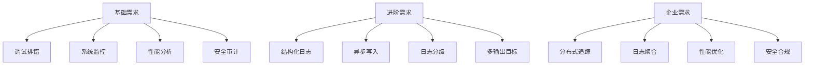
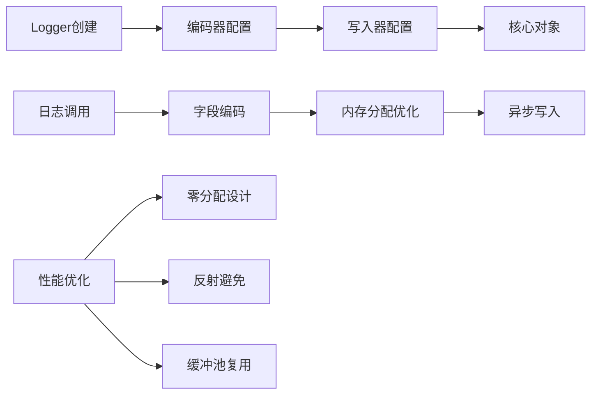

# Golang日志库深度解析：从标准库到企业级实践

## 一、日志的重要性与Golang日志生态

在现代软件架构中，日志系统是应用程序的"黑匣子"。它不仅是问题排查的利器，更是系统监控、性能分析、安全审计的重要数据来源。Golang作为云原生时代的核心语言，其日志库生态尤为丰富和成熟。

### 1.1 为什么要使用专门的日志库？



标准库的`log`包虽然简单易用，但在企业级应用中存在明显不足：
- **缺乏日志级别**：无法按重要性过滤日志
- **性能较差**：同步写入，高并发下成为瓶颈
- **功能单一**：不支持JSON格式化、异步写入等高级特性

## 二、Golang日志库全景概览

### 2.1 主要日志库对比

| 日志库 | 特点 | 适用场景 | 性能 | 易用性 |
|--------|------|----------|------|--------|
| **标准库log** | 内置、简单 | 小型项目、原型开发 | ★★☆☆☆ | ★★★★★ |
| **logrus** | 功能丰富、生态成熟 | 企业应用、K8s生态 | ★★★☆☆ | ★★★★☆ |
| **zap** | 高性能、零分配 | 高并发、性能敏感 | ★★★★★ | ★★★☆☆ |
| **zerolog** | 极致性能、API简洁 | 极致性能要求 | ★★★★★ | ★★★★☆ |
| **slog** | 官方标准、结构化 | Go 1.21+ 新项目 | ★★★★☆ | ★★★★☆ |

### 2.2 性能基准测试对比

```go
// 性能测试代码示例
package main

import (
    "log"
    "testing"
    
    "github.com/sirupsen/logrus"
    "go.uber.org/zap"
    "github.com/rs/zerolog"
)

func BenchmarkStdLog(b *testing.B) {
    for i := 0; i < b.N; i++ {
        log.Printf("test message: %d", i)
    }
}

func BenchmarkLogrus(b *testing.B) {
    logger := logrus.New()
    for i := 0; i < b.N; i++ {
        logger.Info("test message: ", i)
    }
}

func BenchmarkZap(b *testing.B) {
    logger, _ := zap.NewProduction()
    for i := 0; i < b.N; i++ {
        logger.Info("test message", zap.Int("count", i))
    }
}

func BenchmarkZerolog(b *testing.B) {
    logger := zerolog.New(os.Stdout)
    for i := 0; i < b.N; i++ {
        logger.Info().Int("count", i).Msg("test message")
    }
}
```

**测试结果概览**：
- zerolog: 最快，零内存分配设计
- zap: 次之，性能优异且功能全面
- slog: 接近zap性能，API更简洁
- logrus: 功能丰富但性能相对较低
- 标准库: 最慢，适合简单场景

## 三、标准库log：基础但不可忽视

### 3.1 基本使用与配置

```go
package main

import (
    "log"
    "os"
)

func main() {
    // 基础使用
    log.Println("这是一条普通日志")
    
    // 配置日志前缀
    log.SetPrefix("MYAPP: ")
    
    // 配置日志标志
    log.SetFlags(log.Ldate | log.Ltime | log.Lshortfile)
    
    // 输出到文件
    file, err := os.OpenFile("app.log", os.O_CREATE|os.O_WRONLY|os.O_APPEND, 0666)
    if err == nil {
        log.SetOutput(file)
        defer file.Close()
    }
    
    // 自定义logger
    customLogger := log.New(os.Stdout, "CUSTOM: ", log.LstdFlags)
    customLogger.Println("自定义logger的日志")
}
```

### 3.2 标准库的局限性

```go
// 问题1：缺乏日志级别
func processUser(userID string) error {
    // 无法区分调试信息和错误信息
    log.Printf("开始处理用户 %s", userID)  // 这应该是Debug级别
    
    err := doSomething(userID)
    if err != nil {
        log.Printf("处理用户失败: %v", err)  // 这应该是Error级别
        return err
    }
    
    log.Printf("用户处理完成: %s", userID)  // 这应该是Info级别
    return nil
}

// 问题2：性能瓶颈
func highConcurrencyOperation() {
    for i := 0; i < 10000; i++ {
        // 每次调用都涉及系统调用，性能开销大
        log.Printf("处理请求 %d", i)
    }
}
```

## 四、logrus：功能丰富的企业级选择

logrus是目前Golang生态中最受欢迎的日志库之一，被Docker、Kubernetes等知名项目采用。

### 4.1 基础配置与使用

```go
package main

import (
    "github.com/sirupsen/logrus"
    "os"
)

func setupLogrus() *logrus.Logger {
    logger := logrus.New()
    
    // 设置日志级别
    logger.SetLevel(logrus.DebugLevel)
    
    // 设置输出格式
    logger.SetFormatter(&logrus.TextFormatter{
        FullTimestamp:   true,
        TimestampFormat: "2006-01-02 15:04:05",
        ForceColors:     true,
    })
    
    // 设置输出目标
    file, err := os.OpenFile("app.log", os.O_CREATE|os.O_WRONLY|os.O_APPEND, 0666)
    if err == nil {
        logger.SetOutput(file)
    }
    
    return logger
}

func main() {
    logger := setupLogrus()
    
    // 不同级别的日志
    logger.Debug("这是一条调试信息")
    logger.Info("这是一条信息日志")
    logger.Warn("这是一条警告日志")
    logger.Error("这是一条错误日志")
    
    // 结构化日志
    logger.WithFields(logrus.Fields{
        "user_id": "12345",
        "ip":      "192.168.1.1",
        "action":  "login",
    }).Info("用户登录")
}
```

### 4.2 高级特性：钩子(Hook)机制

```go
// 自定义钩子：发送错误日志到Slack
type SlackHook struct {
    webhookURL string
}

func (hook *SlackHook) Levels() []logrus.Level {
    return []logrus.Level{logrus.ErrorLevel, logrus.FatalLevel, logrus.PanicLevel}
}

func (hook *SlackHook) Fire(entry *logrus.Entry) error {
    // 实现发送到Slack的逻辑
    // 这里简化实现
    log.Printf("发送到Slack: %s", entry.Message)
    return nil
}

// 自定义钩子：日志文件切割
type RotateHook struct {
    maxSize int64
    currentSize int64
    file *os.File
    filename string
}

func (hook *RotateHook) Levels() []logrus.Level {
    return logrus.AllLevels
}

func (hook *RotateHook) Fire(entry *logrus.Entry) error {
    // 检查文件大小，需要时进行轮转
    if hook.currentSize > hook.maxSize {
        hook.rotateFile()
    }
    
    // 记录日志大小
    logData, _ := entry.String()
    hook.currentSize += int64(len(logData))
    
    return nil
}

func (hook *RotateHook) rotateFile() {
    // 实现文件轮转逻辑
    if hook.file != nil {
        hook.file.Close()
    }
    
    // 重命名旧文件，创建新文件
    // ...
}

func setupAdvancedLogrus() *logrus.Logger {
    logger := logrus.New()
    
    // 添加钩子
    logger.AddHook(&SlackHook{webhookURL: "https://hooks.slack.com/..."})
    logger.AddHook(&RotateHook{maxSize: 10 * 1024 * 1024}) // 10MB
    
    return logger
}
```

## 五、zap：极致性能的工业级选择

Uber开源的zap日志库以极高的性能著称，特别适合高并发场景。

### 5.1 核心架构与性能原理



### 5.2 详细使用示例

```go
package main

import (
    "go.uber.org/zap"
    "go.uber.org/zap/zapcore"
    "gopkg.in/natefinch/lumberjack.v2"
    "os"
    "time"
)

// 生产环境配置
func setupProductionLogger() *zap.Logger {
    encoderConfig := zapcore.EncoderConfig{
        TimeKey:        "ts",
        LevelKey:       "level",
        NameKey:        "logger",
        CallerKey:      "caller",
        FunctionKey:    zapcore.OmitKey,
        MessageKey:     "msg",
        StacktraceKey:  "stacktrace",
        LineEnding:     zapcore.DefaultLineEnding,
        EncodeLevel:    zapcore.LowercaseLevelEncoder,
        EncodeTime:     zapcore.ISO8601TimeEncoder,
        EncodeDuration: zapcore.SecondsDurationEncoder,
        EncodeCaller:   zapcore.ShortCallerEncoder,
    }
    
    // 文件输出配置
    fileWriter := zapcore.AddSync(&lumberjack.Logger{
        Filename:   "./logs/app.log",
        MaxSize:    100, // MB
        MaxBackups: 5,
        MaxAge:     30, // days
        Compress:   true,
    })
    
    // 控制台输出配置
    consoleEncoder := zapcore.NewConsoleEncoder(encoderConfig)
    
    // 核心配置
    core := zapcore.NewTee(
        zapcore.NewCore(
            zapcore.NewJSONEncoder(encoderConfig),
            fileWriter,
            zap.InfoLevel,
        ),
        zapcore.NewCore(
            consoleEncoder,
            zapcore.AddSync(os.Stdout),
            zap.DebugLevel,
        ),
    )
    
    logger := zap.New(core, zap.AddCaller())
    return logger
}

// 开发环境配置（更详细的输出）
func setupDevelopmentLogger() *zap.Logger {
    config := zap.NewDevelopmentConfig()
    config.EncoderConfig.EncodeLevel = zapcore.CapitalColorLevelEncoder
    
    logger, _ := config.Build()
    return logger
}

func main() {
    // 使用生产配置
    logger := setupProductionLogger()
    defer logger.Sync() // 确保所有缓冲日志都写入
    
    // 基础日志
    logger.Info("应用启动",
        zap.String("version", "1.0.0"),
        zap.Time("start_time", time.Now()),
    )
    
    // 结构化日志示例
    userID := "12345"
    operation := "purchase"
    
    logger.Info("用户操作",
        zap.String("user_id", userID),
        zap.String("operation", operation),
        zap.Int("amount", 100),
        zap.Duration("processing_time", 150*time.Millisecond),
    )
    
    // 错误处理
    if err := doSomething(); err != nil {
        logger.Error("操作失败",
            zap.String("operation", "doSomething"),
            zap.Error(err), // 专门的错误字段
            zap.Stack("stack"), // 堆栈跟踪
        )
    }
    
    // 性能敏感的日志（避免不必要分配）
    if ce := logger.Check(zap.DebugLevel, "性能敏感路径"); ce != nil {
        ce.Write(
            zap.String("key", "value"),
            zap.Int("count", 42),
        )
    }
}

type SugaredLoggerExample struct {
    logger *zap.SugaredLogger
}

func (e *SugaredLoggerExample) ProcessRequest(requestID string, data interface{}) {
    // SugaredLogger提供更简洁的API，性能稍低但易用性更好
    e.logger.Infow("处理请求",
        "request_id", requestID,
        "data", data,
        "timestamp", time.Now(),
    )
    
    // 性能敏感时使用原生日志器
    if ce := e.logger.Desugar().Check(zap.InfoLevel, "关键路径"); ce != nil {
        ce.Write(zap.String("request_id", requestID))
    }
}

func doSomething() error {
    return nil // 示例函数
}
```

### 5.3 zap性能优化技巧

```go
// 技巧1：复用Logger实例
var globalLogger *zap.Logger

func init() {
    globalLogger, _ = zap.NewProduction()
}

// 技巧2：使用Check方法避免不必要的日志构建
func expensiveOperation() {
    // 不好的写法：总是构建日志条目
    // globalLogger.Debug("状态", zap.Int("value", calculateValue()))
    
    // 好的写法：先检查级别
    if ce := globalLogger.Check(zap.DebugLevel, "状态"); ce != nil {
        ce.Write(zap.Int("value", calculateValue()))
    }
}

func calculateValue() int {
    // 模拟昂贵的计算
    time.Sleep(10 * time.Millisecond)
    return 42
}

// 技巧3：批量日志操作
func batchLoggingExample() {
    logger, _ := zap.NewProduction()
    
    // 批量添加字段
    logger = logger.With(
        zap.String("service", "user-service"),
        zap.String("version", "1.0.0"),
    )
    
    // 使用派生Logger（性能更好）
    requestLogger := logger.With(zap.String("request_id", "req-123"))
    requestLogger.Info("请求开始")
    requestLogger.Info("处理中")
    requestLogger.Info("请求完成")
}
```

## 六、zerolog：零分配的性能王者

zerolog专注于极致性能，通过零内存分配设计实现惊人的日志性能。

### 6.1 核心设计与使用

```go
package main

import (
    "github.com/rs/zerolog"
    "github.com/rs/zerolog/log"
    "os"
    "time"
)

func setupZerolog() {
    // 配置全局Logger
    zerolog.TimeFieldFormat = time.RFC3339Nano
    
    // 多输出目标
    consoleWriter := zerolog.ConsoleWriter{
        Out:        os.Stdout,
        TimeFormat: "2006-01-02 15:04:05",
    }
    
    file, _ := os.OpenFile("app.log", os.O_CREATE|os.O_WRONLY|os.O_APPEND, 0666)
    
    multi := zerolog.MultiLevelWriter(consoleWriter, file)
    
    logger := zerolog.New(multi).With().Timestamp().Logger()
    log.Logger = logger
}

func main() {
    setupZerolog()
    
    // 不同级别的日志
    log.Debug().Msg("调试信息")
    log.Info().Msg("普通信息")
    log.Warn().Msg("警告信息")
    log.Error().Msg("错误信息")
    
    // 结构化日志（链式调用）
    log.Info().
        Str("user_id", "12345").
        Str("action", "login").
        Int("login_count", 5).
        Dur("duration", 150*time.Millisecond).
        Msg("用户登录成功")
    
    // 错误处理
    if err := doOperation(); err != nil {
        log.Error().
            Err(err).
            Str("operation", "doOperation").
            Msg("操作失败")
    }
    
    // 性能优化的日志调用
    if log.Debug().Enabled() {
        // 只在需要时执行昂贵操作
        value := expensiveCalculation()
        log.Debug().Int("value", value).Msg("计算结果")
    }
}

func doOperation() error {
    return nil
}

func expensiveCalculation() int {
    return 42
}

// 上下文日志（请求级别）
type RequestContext struct {
    logger zerolog.Logger
    UserID string
    RequestID string
}

func NewRequestContext(userID, requestID string) *RequestContext {
    logger := log.With().
        Str("user_id", userID).
        Str("request_id", requestID).
        Logger()
        
    return &RequestContext{
        logger: logger,
        UserID: userID,
        RequestID: requestID,
    }
}

func (ctx *RequestContext) Process() {
    ctx.logger.Info().Msg("开始处理请求")
    
    // 处理逻辑...
    
    ctx.logger.Info().Msg("请求处理完成")
}
```

### 6.2 zerolog性能特性解析

```go
// 性能特性1：零分配设计
func zeroAllocationExample() {
    // zerolog通过预分配和复用避免内存分配
    logger := zerolog.New(os.Stdout)
    
    // 这些调用几乎不产生内存分配
    for i := 0; i < 10000; i++ {
        logger.Info().
            Int("index", i).
            Str("message", "performance test").
            Msg("高并发日志")
    }
}

// 性能特性2：采样日志（减少高频日志开销）
func sampledLoggingExample() {
    logger := zerolog.New(os.Stdout).Sample(&zerolog.BasicSampler{N: 10}) // 每10条采样1条
    
    for i := 0; i < 1000; i++ {
        logger.Info().Int("i", i).Msg("采样日志")
    }
}

// 性能特性3：异步日志
func asyncLoggingExample() {
    // 使用异步写入器减少I/O阻塞
    asyncWriter := zerolog.NewConsoleWriter(
        zerolog.ConsoleWriter{Out: os.Stdout},
    )
    
    logger := zerolog.New(asyncWriter)
    
    // 高并发场景下的性能优势明显
    for i := 0; i < 10000; i++ {
        go func(i int) {
            logger.Info().Int("goroutine", i).Msg("并发日志")
        }(i)
    }
}
```

---

# Golang日志库深度解析：第三部分（性能优化与生产实战）
**(接上文) 第九部分：性能优化与生产实践**
## 九、极致性能：优化技巧与实战经验
### 9.1 高性能日志记录的核心原则
    A[性能优化目标] --> A1[减少内存分配]
    A --> A2[最小化锁竞争]
    A --> A3[优化I/O操作]
    A --> A4[降低CPU消耗]
    B[优化策略] --> B1[预分配资源]
    B --> B2[异步处理]
    B --> B3[批量写入]
    B --> B4[条件日志]
    C[性能监控] --> C1[内存分配监控]
    C --> C2[响应时间分析]
    C --> C3[并发压力测试]
    C --> C4[瓶颈识别]
### 9.2 内存分配优化策略
package optimization
    "log/slog"
    "sync"
// 对象池模式：减少内存分配
type LogEntryPool struct {
    pool sync.Pool
func NewLogEntryPool() *LogEntryPool {
    return &LogEntryPool{
        pool: sync.Pool{
            New: func() interface{} {
                return &LogEntry{
                    Fields: make(map[string]interface{}, 10),
                }
            },
        },
func (p *LogEntryPool) Get() *LogEntry {
    entry := p.pool.Get().(*LogEntry)
    entry.reset()
    return entry
func (p *LogEntryPool) Put(entry *LogEntry) {
    p.pool.Put(entry)
type LogEntry struct {
    Message   string
    Level     slog.Level
    Timestamp time.Time
    Fields    map[string]interface{}
func (e *LogEntry) reset() {
    e.Message = ""
    e.Level = slog.LevelInfo
    e.Timestamp = time.Time{}
    for k := range e.Fields {
        delete(e.Fields, k)
// 高性能日志记录器
type HighPerfLogger struct {
    pool   *LogEntryPool
    writer LogWriter
    mu     sync.Mutex
func NewHighPerfLogger(writer LogWriter) *HighPerfLogger {
    return &HighPerfLogger{
        pool:   NewLogEntryPool(),
        writer: writer,
func (l *HighPerfLogger) Log(level slog.Level, msg string, fields map[string]interface{}) {
    entry := l.pool.Get()
    entry.Level = level
    entry.Message = msg
    entry.Timestamp = time.Now()
    for k, v := range fields {
        entry.Fields[k] = v
    // 异步写入
    go l.writeAsync(entry)
func (l *HighPerfLogger) writeAsync(entry *LogEntry) {
    l.mu.Lock()
    defer l.mu.Unlock()
    l.writer.Write(entry)
    l.pool.Put(entry)
// 零分配日志记录
type ZeroAllocLogger struct {
    bufferPool *sync.Pool
func NewZeroAllocLogger() *ZeroAllocLogger {
    return &ZeroAllocLogger{
        bufferPool: &sync.Pool{
            New: func() interface{} {
                return make([]byte, 0, 1024) // 预分配缓冲区
            },
        },
func (z *ZeroAllocLogger) Log(msg string, args ...interface{}) {
    buf := z.bufferPool.Get().([]byte)
    buf = buf[:0] // 重置缓冲区
    // 手动构建JSON，避免分配
    buf = append(buf, '{"')
    buf = append(buf, "message"...)
    buf = append(buf, "":""...)
    buf = strconv.AppendQuote(buf, msg)
    // 添加字段
    for i := 0; i < len(args); i += 2 {
        if i+1 < len(args) {
            buf = append(buf, ',"')
            buf = append(buf, args[i].(string)...)
            buf = append(buf, "":""...)
            switch v := args[i+1].(type) {
            case string:
                buf = strconv.AppendQuote(buf, v)
            case int:
                buf = strconv.AppendInt(buf, int64(v), 10)
            case bool:
                buf = strconv.AppendBool(buf, v)
            default:
                // 使用反射处理其他类型
            }
    buf = append(buf, '}')
    // 写入日志（这里简化处理）
    os.Stdout.Write(buf)
    // 归还缓冲区
    z.bufferPool.Put(buf)
### 9.3 I/O优化与异步处理
package ioooptimization
    "bytes"
    "log/slog"
    "sync"
// 批量写入处理器
type BatchWriter struct {
    buffer     *bytes.Buffer
    bufferSize int
    maxSize    int
    flushInterval time.Duration
    mu         sync.Mutex
    stopChan   chan struct{}
func NewBatchWriter(maxSize int, flushInterval time.Duration) *BatchWriter {
    writer := &BatchWriter{
        buffer:        bytes.NewBuffer(make([]byte, 0, maxSize)),
        bufferSize:    0,
        maxSize:       maxSize,
        flushInterval: flushInterval,
        stopChan:      make(chan struct{}),
    // 启动定时刷新
    go writer.startFlushTicker()
    return writer
func (bw *BatchWriter) Write(data []byte) (int, error) {
    bw.mu.Lock()
    defer bw.mu.Unlock()
    if bw.bufferSize+len(data) > bw.maxSize {
        if err := bw.flush(); err != nil {
            return 0, err
    n, err := bw.buffer.Write(data)
    bw.bufferSize += n
    return n, err
func (bw *BatchWriter) flush() error {
    if bw.bufferSize == 0 {
        return nil
    // 写入文件（这里简化，实际可能写入网络或磁盘）
    _, err := os.Stdout.Write(bw.buffer.Bytes())
    bw.buffer.Reset()
    bw.bufferSize = 0
func (bw *BatchWriter) startFlushTicker() {
    ticker := time.NewTicker(bw.flushInterval)
    defer ticker.Stop()
    for {
        select {
        case <-ticker.C:
            bw.mu.Lock()
            bw.flush()
            bw.mu.Unlock()
        case <-bw.stopChan:
            return
func (bw *BatchWriter) Stop() {
    close(bw.stopChan)
    bw.mu.Lock()
    bw.flush()
    bw.mu.Unlock()
// 异步日志处理器
type AsyncHandler struct {
    queue      chan slog.Record
    baseHandler slog.Handler
    wg         sync.WaitGroup
    stopChan   chan struct{}
func NewAsyncHandler(baseHandler slog.Handler, queueSize int) *AsyncHandler {
    handler := &AsyncHandler{
        queue:       make(chan slog.Record, queueSize),
        baseHandler: baseHandler,
        stopChan:    make(chan struct{}),
    // 启动处理goroutine
    handler.wg.Add(1)
    go handler.processQueue()
    return handler
func (ah *AsyncHandler) Enabled(ctx context.Context, level slog.Level) bool {
    return ah.baseHandler.Enabled(ctx, level)
func (ah *AsyncHandler) Handle(ctx context.Context, r slog.Record) error {
    select {
    case ah.queue <- r:
        return nil
    default:
        // 队列满了，同步处理
        return ah.baseHandler.Handle(ctx, r)
func (ah *AsyncHandler) processQueue() {
    defer ah.wg.Done()
    for {
        select {
        case record := <-ah.queue:
            ah.baseHandler.Handle(context.Background(), record)
        case <-ah.stopChan:
            // 处理剩余队列
            for len(ah.queue) > 0 {
                record := <-ah.queue
                ah.baseHandler.Handle(context.Background(), record)
            }
            return
func (ah *AsyncHandler) WithAttrs(attrs []slog.Attr) slog.Handler {
    return &AsyncHandler{
        baseHandler: ah.baseHandler.WithAttrs(attrs),
        queue:       ah.queue,
        stopChan:    ah.stopChan,
func (ah *AsyncHandler) WithGroup(name string) slog.Handler {
    return &AsyncHandler{
        baseHandler: ah.baseHandler.WithGroup(name),
        queue:       ah.queue,
        stopChan:    ah.stopChan,
func (ah *AsyncHandler) Stop() {
    close(ah.stopChan)
    ah.wg.Wait()
### 9.4 缓存与缓冲区策略
package caching
    "bytes"
    "fmt"
    "log/slog"
    "sync"
// 环形缓冲区日志记录器
type RingBufferLogger struct {
    buffer    []string
    size      int
    head      int
    tail      int
    count     int
    mu        sync.RWMutex
    maxSize   int
func NewRingBufferLogger(size int) *RingBufferLogger {
    return &RingBufferLogger{
        buffer:  make([]string, size),
        size:    size,
        maxSize: size,
func (rbl *RingBufferLogger) Write(log string) {
    rbl.mu.Lock()
    defer rbl.mu.Unlock()
    rbl.buffer[rbl.head] = log
    rbl.head = (rbl.head + 1) % rbl.size
    if rbl.count < rbl.size {
        rbl.count++
    } else {
        rbl.tail = (rbl.tail + 1) % rbl.size
func (rbl *RingBufferLogger) GetRecentLogs(count int) []string {
    rbl.mu.RLock()
    defer rbl.mu.RUnlock()
    if count > rbl.count {
        count = rbl.count
    logs := make([]string, count)
    for i := 0; i < count; i++ {
        idx := (rbl.head - 1 - i + rbl.size) % rbl.size
        logs[count-1-i] = rbl.buffer[idx]
    return logs
// 多级缓存日志系统
type MultiLevelCacheLogger struct {
    memoryBuffer *RingBufferLogger
    diskWriter   *os.File
    remoteWriter RemoteLogWriter
    levels       []LogLevel
func NewMultiLevelCacheLogger(memorySize int, diskPath string) (*MultiLevelCacheLogger, error) {
    diskFile, err := os.OpenFile(diskPath, os.O_APPEND|os.O_CREATE|os.O_WRONLY, 0644)
        return nil, err
    return &MultiLevelCacheLogger{
        memoryBuffer: NewRingBufferLogger(memorySize),
        diskWriter:   diskFile,
        levels: []LogLevel{
            {Level: slog.LevelDebug, Writer: "memory"},
            {Level: slog.LevelInfo, Writer: "disk"},
            {Level: slog.LevelError, Writer: "remote"},
        },
    }, nil
func (mlcl *MultiLevelCacheLogger) Log(level slog.Level, msg string) {
    var targetWriter string
    // 根据级别选择写入目标
    for _, lvl := range mlcl.levels {
        if level >= lvl.Level {
            targetWriter = lvl.Writer
            break
    logEntry := fmt.Sprintf("[%s] %s: %s\n", time.Now().Format(time.RFC3339), level.String(), msg)
    switch targetWriter {
    case "memory":
        mlcl.memoryBuffer.Write(logEntry)
    case "disk":
        mlcl.diskWriter.WriteString(logEntry)
    case "remote":
        mlcl.remoteWriter.Write(logEntry)
type LogLevel struct {
    Level  slog.Level
    Writer string
type RemoteLogWriter struct{}
func (rlw *RemoteLogWriter) Write(log string) error {
    // 实现远程日志写入
### 9.5 监控与性能分析
package monitoring
    "context"
    "log/slog"
    "runtime"
// 日志性能监控器
type LogPerformanceMonitor struct {
    totalLogs     int64
    totalDuration time.Duration
    errorCount    int64
    maxLatency    time.Duration
    mu            sync.RWMutex
func NewLogPerformanceMonitor() *LogPerformanceMonitor {
    return &LogPerformanceMonitor{}
func (lpm *LogPerformanceMonitor) RecordLog(start time.Time, level slog.Level) {
    duration := time.Since(start)
    lpm.mu.Lock()
    defer lpm.mu.Unlock()
    lpm.totalLogs++
    lpm.totalDuration += duration
    if level == slog.LevelError {
        lpm.errorCount++
    if duration > lpm.maxLatency {
        lpm.maxLatency = duration
func (lpm *LogPerformanceMonitor) GetMetrics() LogMetrics {
    lpm.mu.RLock()
    defer lpm.mu.RUnlock()
    var avgLatency time.Duration
    if lpm.totalLogs > 0 {
        avgLatency = lpm.totalDuration / time.Duration(lpm.totalLogs)
    return LogMetrics{
        TotalLogs:      lpm.totalLogs,
        AverageLatency: avgLatency,
        ErrorCount:     lpm.errorCount,
        MaxLatency:     lpm.maxLatency,
type LogMetrics struct {
    TotalLogs      int64
    AverageLatency time.Duration
    ErrorCount     int64
    MaxLatency     time.Duration
// 监控日志处理器
type MonitoredHandler struct {
    baseHandler slog.Handler
    monitor     *LogPerformanceMonitor
func NewMonitoredHandler(baseHandler slog.Handler, monitor *LogPerformanceMonitor) *MonitoredHandler {
    return &MonitoredHandler{
        baseHandler: baseHandler,
        monitor:     monitor,
func (mh *MonitoredHandler) Enabled(ctx context.Context, level slog.Level) bool {
    return mh.baseHandler.Enabled(ctx, level)
func (mh *MonitoredHandler) Handle(ctx context.Context, r slog.Record) error {
    start := time.Now()
    defer func() {
        mh.monitor.RecordLog(start, r.Level)
    }()
    return mh.baseHandler.Handle(ctx, r)
func (mh *MonitoredHandler) WithAttrs(attrs []slog.Attr) slog.Handler {
    return &MonitoredHandler{
        baseHandler: mh.baseHandler.WithAttrs(attrs),
        monitor:     mh.monitor,
func (mh *MonitoredHandler) WithGroup(name string) slog.Handler {
    return &MonitoredHandler{
        baseHandler: mh.baseHandler.WithGroup(name),
        monitor:     mh.monitor,
// 系统资源监控集成
func logSystemMetrics(logger *slog.Logger) {
    // 定期记录系统指标
    ticker := time.NewTicker(30 * time.Second)
    defer ticker.Stop()
    for range ticker.C {
        var m runtime.MemStats
        runtime.ReadMemStats(&m)
        logger.Info("系统资源监控",
            "goroutines", runtime.NumGoroutine(),
            "memory_alloc", m.Alloc,
            "memory_total_alloc", m.TotalAlloc,
            "memory_sys", m.Sys,
            "gc_count", m.NumGC,
            "cpu_cores", runtime.NumCPU(),
## 第十部分：实际项目案例分析
### 10.1 电商系统日志架构实战
    A[前端应用] --> B[API网关]
    B --> C[用户服务]
    B --> D[商品服务]
    B --> E[订单服务]
    B --> F[支付服务]
    C --> G[用户行为日志]
    D --> H[商品访问日志]
    E --> I[订单状态日志]
    F --> J[支付流程日志]
    G --> K[用户行为分析]
    H --> L[商品推荐]
    I --> M[订单监控]
    J --> N[支付风控]
    O[统一日志收集] --> P[大数据分析]
    O --> Q[实时监控]
    O --> R[故障排查]
    G --> O
    H --> O
    I --> O
    J --> O
package ecommerce
    "context"
    "log/slog"
// 电商系统日志管理器
type EcommerceLogger struct {
    logger *slog.Logger
func NewEcommerceLogger(serviceName string) *EcommerceLogger {
    // 电商系统特殊配置
    handler := slog.NewJSONHandler(os.Stdout, &slog.HandlerOptions{
        Level: slog.LevelInfo,
        ReplaceAttr: func(groups []string, a slog.Attr) slog.Attr {
            // 电商特定的属性处理
            if a.Key == slog.TimeKey {
                if t, ok := a.Value.Any().(time.Time); ok {
                    a.Value = slog.StringValue(t.Format("2006-01-02 15:04:05.000"))
                }
            }
            return a
        },
    logger := slog.New(handler).With(
        "service", serviceName,
        "environment", getEnvironment(),
        "version", getVersion(),
    return &EcommerceLogger{logger: logger}
// 用户行为日志
func (el *EcommerceLogger) LogUserAction(ctx context.Context, userID, action, page string, metadata map[string]interface{}) {
    attrs := []slog.Attr{
        slog.String("log_type", "user_action"),
        slog.String("user_id", userID),
        slog.String("action", action),
        slog.String("page", page),
    for k, v := range metadata {
        attrs = append(attrs, slog.Any(k, v))
    el.logger.LogAttrs(ctx, slog.LevelInfo, "用户行为", attrs...)
// 订单流程日志
func (el *EcommerceLogger) LogOrderFlow(ctx context.Context, orderID, stage string, status OrderStatus, details map[string]interface{}) {
    attrs := []slog.Attr{
        slog.String("log_type", "order_flow"),
        slog.String("order_id", orderID),
        slog.String("stage", stage),
        slog.String("status", string(status)),
    for k, v := range details {
        attrs = append(attrs, slog.Any(k, v))
    el.logger.LogAttrs(ctx, slog.LevelInfo, "订单流程", attrs...)
// 支付相关日志
func (el *EcommerceLogger) LogPayment(ctx context.Context, paymentID, method string, amount float64, status PaymentStatus) {
    el.logger.InfoContext(ctx, "支付处理",
        "log_type", "payment",
        "payment_id", paymentID,
        "method", method,
        "amount", amount,
        "status", string(status),
// 库存变更日志
func (el *EcommerceLogger) LogInventoryChange(ctx context.Context, productID string, change int, reason string) {
    el.logger.InfoContext(ctx, "库存变更",
        "log_type", "inventory",
        "product_id", productID,
        "change", change,
        "reason", reason,
        "remaining", getCurrentStock(productID),
type OrderStatus string
const (
    OrderCreated    OrderStatus = "created"
    OrderPaid       OrderStatus = "paid"
    OrderShipped    OrderStatus = "shipped"
    OrderDelivered  OrderStatus = "delivered"
    OrderCancelled  OrderStatus = "cancelled"
type PaymentStatus string
const (
    PaymentPending PaymentStatus = "pending"
    PaymentSuccess PaymentStatus = "success"
    PaymentFailed  PaymentStatus = "failed"
func getEnvironment() string {
    // 实现获取环境信息
    return "production"
func getVersion() string {
    // 实现获取版本信息
    return "1.0.0"
func getCurrentStock(productID string) int {
    // 实现获取当前库存
    return 0
### 10.2 金融系统合规日志实践
package finance
    "log/slog"
// 金融合规日志系统
type ComplianceLogger struct {
    logger *slog.Logger
func NewComplianceLogger() *ComplianceLogger {
    // 金融系统需要不可篡改的日志
    handler := slog.NewJSONHandler(
        &lumberjack.Logger{
            Filename:   "/var/log/compliance/audit.log",
            MaxSize:    50, // MB
            MaxBackups: 365, // 保留一年
            MaxAge:     365,
            Compress:   true,
            LocalTime:  true,
        },
        &slog.HandlerOptions{
            Level: slog.LevelInfo,
        },
    logger := slog.New(handler).With(
        "system", "financial_compliance",
        "regulated", true,
        "retention_period", "1y",
    return &ComplianceLogger{logger: logger}
// 资金交易审计
func (cl *ComplianceLogger) LogTransaction(from, to string, amount float64, currency string, metadata map[string]interface{}) {
    attrs := []slog.Attr{
        slog.String("audit_type", "transaction"),
        slog.String("from_account", from),
        slog.String("to_account", to),
        slog.Float64("amount", amount),
        slog.String("currency", currency),
        slog.Time("timestamp", time.Now()),
    for k, v := range metadata {
        attrs = append(attrs, slog.Any(k, v))
    cl.logger.LogAttrs(nil, slog.LevelInfo, "资金交易", attrs...)
// 账户操作审计
func (cl *ComplianceLogger) LogAccountAction(userID, action string, changes map[string]interface{}) {
    cl.logger.Info("账户操作",
        "audit_type", "account_action",
        "user_id", userID,
        "action", action,
        "changes", changes,
        "ip_address", getClientIP(),
        "user_agent", getUserAgent(),
// 风险评估日志
func (cl *ComplianceLogger) LogRiskAssessment(transactionID string, riskLevel RiskLevel, factors []string, score float64) {
    cl.logger.Warn("风险评估",
        "audit_type", "risk_assessment",
        "transaction_id", transactionID,
        "risk_level", string(riskLevel),
        "factors", factors,
        "risk_score", score,
        "assessment_time", time.Now(),
// 合规检查结果
func (cl *ComplianceLogger) LogComplianceCheck(checkType string, passed bool, details map[string]interface{}) {
    level := slog.LevelInfo
    if !passed {
        level = slog.LevelError
    cl.logger.Log(context.Background(), level, "合规检查",
        slog.String("audit_type", "compliance_check"),
        slog.String("check_type", checkType),
        slog.Bool("passed", passed),
        slog.Any("details", details),
type RiskLevel string
const (
    RiskLow    RiskLevel = "low"
    RiskMedium RiskLevel = "medium"
    RiskHigh   RiskLevel = "high"
func getClientIP() string {
    // 实现获取客户端IP
    return "192.168.1.100"
func getUserAgent() string {
    // 实现获取用户代理
    return "Mozilla/5.0..."
### 10.3 故障排查实战案例
package troubleshooting
    "context"
    "log/slog"
// 故障排查日志增强器
type DebugLogger struct {
    baseLogger *slog.Logger
    debugMode  bool
func NewDebugLogger(baseLogger *slog.Logger) *DebugLogger {
    return &DebugLogger{
        baseLogger: baseLogger,
        debugMode:  false, // 默认关闭调试模式
func (dl *DebugLogger) EnableDebug() {
    dl.debugMode = true
func (dl *DebugLogger) DisableDebug() {
    dl.debugMode = false
func (dl *DebugLogger) Debug(ctx context.Context, msg string, args ...interface{}) {
    if !dl.debugMode {
    // 添加调试信息
    enhancedArgs := append([]interface{}{
        "debug_timestamp", time.Now().UnixNano(),
        "goroutine_id", getGoroutineID(),
    }, args...)
    dl.baseLogger.DebugContext(ctx, msg, enhancedArgs...)
func (dl *DebugLogger) LogRequestFlow(ctx context.Context, requestID, stage string, data map[string]interface{}) {
    attrs := []slog.Attr{
        slog.String("request_id", requestID),
        slog.String("stage", stage),
        slog.Time("stage_start", time.Now()),
    for k, v := range data {
        attrs = append(attrs, slog.Any(k, v))
    dl.baseLogger.LogAttrs(ctx, slog.LevelInfo, "请求流程", attrs...)
// 性能瓶颈诊断
func diagnosePerformanceBottleneck(logger *slog.Logger) {
    logger.Info("开始性能瓶颈诊断")
    // 检查内存使用
    var memStats runtime.MemStats
    runtime.ReadMemStats(&memStats)
    logger.Info("内存使用情况",
        "alloc", memStats.Alloc,
        "total_alloc", memStats.TotalAlloc,
        "sys", memStats.Sys,
        "num_gc", memStats.NumGC,
    // 检查goroutine数量
    logger.Info("Goroutine统计",
        "count", runtime.NumGoroutine(),
    // 检查文件描述符
    logger.Info("系统资源",
        "cpu_cores", runtime.NumCPU(),
        "cgo_calls", runtime.NumCgoCall(),
// 分布式追踪集成
func logWithTraceContext(ctx context.Context, logger *slog.Logger, msg string, args ...interface{}) {
    // 从上下文中提取追踪信息
    traceID := getTraceIDFromContext(ctx)
    spanID := getSpanIDFromContext(ctx)
    if traceID != "" {
        args = append(args, "trace_id", traceID)
    if spanID != "" {
        args = append(args, "span_id", spanID)
    logger.InfoContext(ctx, msg, args...)
func getTraceIDFromContext(ctx context.Context) string {
    // 实现从上下文中提取trace ID
    return ""
func getSpanIDFromContext(ctx context.Context) string {
    // 实现从上下文中提取span ID
    return ""
func getGoroutineID() int {
    // 简化实现，实际需要更复杂的处理
    return 0

---

# Golang日志库深度解析：第二部分（官方slog与企业级实践）
**(接上文) 第七部分：Go 1.21 slog - 官方结构化日志**
## 七、slog：官方标准的未来选择
Go 1.21引入了官方的结构化日志库`slog`，旨在统一Golang的日志生态系统。作为标准库的一部分，slog结合了性能、易用性和标准化。
### 7.1 slog的设计哲学
    A[slog设计目标] --> A1[标准化接口]
    A --> A2[良好性能]
    A --> A3[易于迁移]
    A --> A4[向后兼容]
    B[核心组件] --> B1[Logger主接口]
    B --> B2[Handler处理层]
    B --> B3[Value值系统]
    B --> B4[Attr属性封装]
    C[生态系统] --> C1[标准库集成]
    C --> C2[第三方适配器]
    C --> C3[工具链支持]
    C --> C4[文档和示例]
### 7.2 slog基础使用
    "log/slog"
func basicSlogUsage() {
    // 1. 使用默认logger（输出到stderr）
    slog.Info("这是一条信息日志")
    slog.Debug("调试信息", "user_id", "12345")
    slog.Warn("警告信息", "reason", "资源不足")
    slog.Error("错误信息", "error", "连接超时")
    // 2. 创建自定义logger
    logger := slog.New(slog.NewTextHandler(os.Stdout, nil))
    logger.Info("自定义logger", "service", "user-service")
    // 3. JSON格式输出
    jsonLogger := slog.New(slog.NewJSONHandler(os.Stdout, nil))
    jsonLogger.Info("用户操作", 
        "user_id", "12345",
        "action", "login", 
        "success", true,
        "duration", 150*time.Millisecond,
// 高级配置示例
func setupAdvancedSlog() *slog.Logger {
    // 配置选项
    opts := &slog.HandlerOptions{
        // 设置日志级别
        Level: slog.LevelDebug,
        // 添加调用者信息
        AddSource: true,
        // 替换默认属性值（如时间格式）
        ReplaceAttr: func(groups []string, a slog.Attr) slog.Attr {
            // 自定义时间格式
            if a.Key == slog.TimeKey {
                if t, ok := a.Value.Any().(time.Time); ok {
                    a.Value = slog.StringValue(t.Format("2006-01-02 15:04:05.000"))
                }
            }
            return a
        },
    // 创建JSON格式的handler
    handler := slog.NewJSONHandler(os.Stdout, opts)
    // 创建logger
    logger := slog.New(handler)
    // 添加全局属性
        "service", "api-gateway",
        "version", "1.0.0",
        "environment", "production",
    logger := setupAdvancedSlog()
    // 结构化日志记录
    logger.Info("请求开始",
        "request_id", "req-123456",
        "method", "POST",
        "path", "/api/users",
        "client_ip", "192.168.1.100",
    // 处理业务逻辑
    processUserLogin(logger, "user-789", "192.168.1.100")
    if err := riskyOperation(); err != nil {
        logger.Error("操作失败", 
            "operation", "riskyOperation",
            "error", err,
            "attempt", 3,
func processUserLogin(logger *slog.Logger, userID, ip string) {
    // 为特定操作创建子logger
    opLogger := logger.With(
        "operation", "user_login",
        "user_id", userID,
        "ip", ip,
    opLogger.Info("开始用户登录验证")
    // 模拟验证过程
    time.Sleep(100 * time.Millisecond)
    opLogger.Info("登录验证成功",
        "duration", 100*time.Millisecond,
        "result", "success",
func riskyOperation() error {
### 7.3 slog性能特性与优化
    "log/slog"
    "runtime"
// 性能优化：复用Attr对象
var (
    serviceAttr = slog.String("service", "user-service")
    versionAttr = slog.String("version", "1.0.0")
// 高性能日志记录器
type HighPerfLogger struct {
    logger *slog.Logger
    enabledLevel slog.Level
func NewHighPerfLogger() *HighPerfLogger {
    handler := slog.NewJSONHandler(os.Stdout, &slog.HandlerOptions{
        Level: slog.LevelInfo,
    return &HighPerfLogger{
        logger: slog.New(handler),
        enabledLevel: slog.LevelInfo,
// 条件日志记录（避免不必要的计算）
func (l *HighPerfLogger) Debug(msg string, attrs ...slog.Attr) {
    if l.enabledLevel <= slog.LevelDebug {
        l.logger.Debug(msg, attrs...)
// 批量属性添加
func (l *HighPerfLogger) LogRequest(requestID, method, path string, status int, duration time.Duration) {
    l.logger.Info("HTTP请求",
        serviceAttr,
        versionAttr,
        slog.String("request_id", requestID),
        slog.String("method", method),
        slog.String("path", path),
        slog.Int("status", status),
        slog.Duration("duration", duration),
// 内存分配优化示例
func memoryOptimizedLogging() {
    logger := slog.New(slog.NewJSONHandler(os.Stdout, nil))
    // 不好的写法：每次创建新字符串
    // for i := 0; i < 1000; i++ {
    //     logger.Info("处理项目", "index", fmt.Sprintf("%d", i))
    // }
    // 好的写法：复用属性
        logger.Info("处理项目", slog.Int("index", i))
// 上下文感知日志记录
func contextAwareLogging() {
    logger := slog.New(slog.NewJSONHandler(os.Stdout, nil))
    // 添加上下文信息
        slog.Group("runtime",
            slog.Int("goroutines", runtime.NumGoroutine()),
            slog.Int("cpu_cores", runtime.NumCPU()),
    logger.Info("系统状态")
### 7.4 从其他库迁移到slog
    "log/slog"
// logrus迁移助手
type LogrusToSlogAdapter struct {
    logger *slog.Logger
func NewLogrusToSlogAdapter() *LogrusToSlogAdapter {
    return &LogrusToSlogAdapter{
        logger: slog.New(slog.NewJSONHandler(os.Stdout, nil)),
func (a *LogrusToSlogAdapter) WithField(key string, value interface{}) *LogrusToSlogAdapter {
    a.logger = a.logger.With(slog.Any(key, value))
    return a
func (a *LogrusToSlogAdapter) Info(msg string) {
    a.logger.Info(msg)
// zap迁移示例
func migrateFromZap() {
    // 原有的zap代码
    // logger, _ := zap.NewProduction()
    // logger.Info("zap日志", zap.String("key", "value"))
    // 迁移后的slog代码
    logger := slog.New(slog.NewJSONHandler(os.Stdout, nil))
    logger.Info("slog日志", slog.String("key", "value"))
// zerolog迁移示例
func migrateFromZerolog() {
    // 原有的zerolog代码
    // logger := zerolog.New(os.Stdout)
    // logger.Info().Str("key", "value").Msg("zerolog日志")
    // 迁移后的slog代码
    logger := slog.New(slog.NewJSONHandler(os.Stdout, nil))
    logger.Info("slog日志", slog.String("key", "value"))
// 渐进式迁移策略
func gradualMigration() {
    // 阶段1：并行运行两个日志系统
    logrusLogger := logrus.New()
    slogLogger := slog.New(slog.NewJSONHandler(os.Stdout, nil))
    // 阶段2：新功能使用slog，旧功能保持logrus
    func newFeature() {
        slogLogger.Info("新功能使用slog", "feature", "user-registration")
    func oldFeature() {
        logrusLogger.Info("旧功能保持logrus")
    // 阶段3：逐步迁移旧功能到slog
## 八、企业级日志架构设计
### 8.1 分布式系统日志管理架构
    A[应用服务] --> A1[本地日志文件]
    A --> A2[日志代理Agent]
    B[微服务集群] --> B1[服务A日志]
    B --> B2[服务B日志]
    B --> B3[服务C日志]
    C[日志代理层] --> C1[Filebeat]
    C --> C2[Fluentd]
    C --> C3[Logstash]
    D[消息队列] --> D1[Kafka]
    D --> D2[RabbitMQ]
    D --> D3[Redis]
    E[日志存储] --> E1[Elasticsearch]
    E --> E2[ClickHouse]
    E --> E3[S3存储]
    F[可视化分析] --> F1[Kibana]
    F --> F2[Grafana]
    F --> F3[自研Dashboard]
    A2 --> C
    B1 --> C
    B2 --> C
    B3 --> C
    D --> E
    E --> F
### 8.2 生产环境日志配置
package logging
    "context"
    "log/slog"
    "path/filepath"
// 生产环境日志配置
type ProductionLoggerConfig struct {
    LogLevel      string `json:"log_level"`
    LogDir        string `json:"log_dir"`
    FileName      string `json:"file_name"`
    MaxSize       int    `json:"max_size"`    // MB
    MaxBackups    int    `json:"max_backups"`
    MaxAge        int    `json:"max_age"`     // days
    EnableConsole bool   `json:"enable_console"`
    EnableJSON    bool   `json:"enable_json"`
// 生产日志管理器
type ProductionLogger struct {
    logger *slog.Logger
    config *ProductionLoggerConfig
func NewProductionLogger(config *ProductionLoggerConfig) (*ProductionLogger, error) {
    // 确保日志目录存在
    if err := os.MkdirAll(config.LogDir, 0755); err != nil {
        return nil, err
    // 创建文件写入器（带轮转）
    fileWriter := &lumberjack.Logger{
        Filename:   filepath.Join(config.LogDir, config.FileName),
        MaxSize:    config.MaxSize,
        MaxBackups: config.MaxBackups,
        MaxAge:     config.MaxAge,
    // 创建handler
    var handlers []slog.Handler
    // JSON文件handler
    if config.EnableJSON {
        jsonHandler := slog.NewJSONHandler(fileWriter, &slog.HandlerOptions{
            Level: parseLogLevel(config.LogLevel),
        })
        handlers = append(handlers, jsonHandler)
    // 控制台handler（开发环境）
    if config.EnableConsole {
        consoleHandler := slog.NewTextHandler(os.Stdout, &slog.HandlerOptions{
            Level: parseLogLevel(config.LogLevel),
        })
        handlers = append(handlers, consoleHandler)
    // 合并handler
    var finalHandler slog.Handler
    if len(handlers) == 1 {
        finalHandler = handlers[0]
    } else {
        finalHandler = newMultiHandler(handlers...)
    logger := slog.New(finalHandler)
    return &ProductionLogger{
        config: config,
    }, nil
// 多handler支持
type multiHandler struct {
    handlers []slog.Handler
func newMultiHandler(handlers ...slog.Handler) slog.Handler {
    return &multiHandler{handlers: handlers}
func (m *multiHandler) Enabled(ctx context.Context, level slog.Level) bool {
    for _, h := range m.handlers {
        if h.Enabled(ctx, level) {
            return true
    return false
func (m *multiHandler) Handle(ctx context.Context, r slog.Record) error {
    for _, h := range m.handlers {
        if h.Enabled(ctx, r.Level) {
            if err := h.Handle(ctx, r); err != nil {
                return err
            }
func (m *multiHandler) WithAttrs(attrs []slog.Attr) slog.Handler {
    var newHandlers []slog.Handler
    for _, h := range m.handlers {
        newHandlers = append(newHandlers, h.WithAttrs(attrs))
    return newMultiHandler(newHandlers...)
func (m *multiHandler) WithGroup(name string) slog.Handler {
    var newHandlers []slog.Handler
    for _, h := range m.handlers {
        newHandlers = append(newHandlers, h.WithGroup(name))
    return newMultiHandler(newHandlers...)
// 解析日志级别
func parseLogLevel(level string) slog.Level {
    switch level {
    case "debug":
        return slog.LevelDebug
    case "info":
        return slog.LevelInfo
    case "warn":
        return slog.LevelWarn
    case "error":
        return slog.LevelError
    default:
        return slog.LevelInfo
// 使用示例
func setupEnterpriseLogging() {
    config := &ProductionLoggerConfig{
        LogLevel:      "info",
        LogDir:        "./logs",
        FileName:      "app.log",
        MaxSize:       100, // 100MB
        MaxBackups:    10,
        MaxAge:        30,  // 30天
        EnableConsole: true,
        EnableJSON:    true,
    logger, err := NewProductionLogger(config)
        panic(err)
    // 设置全局logger
    slog.SetDefault(logger.logger)
### 8.3 日志聚合与ELK栈集成
package logging
    "context"
    "encoding/json"
    "log/slog"
    "net/http"
    "github.com/elastic/go-elasticsearch/v8"
// Elasticsearch日志handler
type ElasticsearchHandler struct {
    client *elasticsearch.Client
    index  string
func NewElasticsearchHandler(client *elasticsearch.Client, index string) *ElasticsearchHandler {
    return &ElasticsearchHandler{
        client: client,
        index:  index,
func (h *ElasticsearchHandler) Enabled(ctx context.Context, level slog.Level) bool {
    return level >= slog.LevelInfo // 只记录info及以上级别
func (h *ElasticsearchHandler) Handle(ctx context.Context, r slog.Record) error {
    // 构建日志文档
    doc := map[string]interface{}{
        "@timestamp": r.Time.Format(time.RFC3339),
        "level":      r.Level.String(),
        "message":    r.Message,
    // 添加属性
    r.Attrs(func(attr slog.Attr) bool {
        doc[attr.Key] = attr.Value.Any()
        return true
    // 序列化文档
    jsonDoc, err := json.Marshal(doc)
    // 异步发送到Elasticsearch
    go h.sendToES(jsonDoc)
func (h *ElasticsearchHandler) sendToES(doc []byte) {
    _, err := h.client.Index(
        h.index,
        bytes.NewReader(doc),
        h.client.Index.WithContext(context.Background()),
        // 记录发送失败，可以fallback到文件
        slog.Error("Failed to send log to Elasticsearch", "error", err)
func (h *ElasticsearchHandler) WithAttrs(attrs []slog.Attr) slog.Handler {
    // 实现属性添加
    return h
func (h *ElasticsearchHandler) WithGroup(name string) slog.Handler {
    // 实现分组
    return h
// 分布式追踪集成
type TracingLogger struct {
    baseLogger *slog.Logger
func NewTracingLogger(logger *slog.Logger) *TracingLogger {
    return &TracingLogger{baseLogger: logger}
func (tl *TracingLogger) LogWithTrace(ctx context.Context, level slog.Level, msg string, attrs ...slog.Attr) {
    // 从上下文中提取追踪信息
    if traceID := extractTraceID(ctx); traceID != "" {
        attrs = append(attrs, slog.String("trace_id", traceID))
    if spanID := extractSpanID(ctx); spanID != "" {
        attrs = append(attrs, slog.String("span_id", spanID))
    tl.baseLogger.LogAttrs(ctx, level, msg, attrs...)
func extractTraceID(ctx context.Context) string {
    // 实现从上下文中提取trace ID
    return ""
func extractSpanID(ctx context.Context) string {
    // 实现从上下文中提取span ID
    return ""
// 使用示例
func setupDistributedLogging() {
    // 配置Elasticsearch客户端
    esConfig := elasticsearch.Config{
        Addresses: []string{"http://localhost:9200"},
    esClient, err := elasticsearch.NewClient(esConfig)
        panic(err)
    // 创建Elasticsearch handler
    esHandler := NewElasticsearchHandler(esClient, "app-logs")
    // 创建文件handler
    fileHandler := slog.NewJSONHandler(
        &lumberjack.Logger{
            Filename: "./logs/app.log",
            MaxSize:  100,
        },
        nil,
    // 合并handler
    multiHandler := newMultiHandler(esHandler, fileHandler)
    logger := slog.New(multiHandler)
    slog.SetDefault(logger)
### 8.4 安全合规与审计日志
package auditing
    "log/slog"
// 审计日志记录器
type AuditLogger struct {
    logger *slog.Logger
func NewAuditLogger() *AuditLogger {
    // 审计日志使用独立的文件
    handler := slog.NewJSONHandler(
        &lumberjack.Logger{
            Filename: "./audit/audit.log",
            MaxSize:  50, // 审计日志较小
        },
        &slog.HandlerOptions{
            Level: slog.LevelInfo,
        },
    return &AuditLogger{
        logger: slog.New(handler),
// 用户操作审计
func (al *AuditLogger) LogUserAction(userID, action, resource, result string, details map[string]interface{}) {
    attrs := []slog.Attr{
        slog.String("audit_type", "user_action"),
        slog.String("user_id", userID),
        slog.String("action", action),
        slog.String("resource", resource),
        slog.String("result", result),
        slog.Time("timestamp", time.Now()),
    // 添加详细信息
    for key, value := range details {
        attrs = append(attrs, slog.Any(key, value))
    al.logger.LogAttrs(nil, slog.LevelInfo, "用户操作审计", attrs...)
// 安全事件审计
func (al *AuditLogger) LogSecurityEvent(eventType, severity, description string, metadata map[string]interface{}) {
    attrs := []slog.Attr{
        slog.String("audit_type", "security_event"),
        slog.String("event_type", eventType),
        slog.String("severity", severity),
        slog.String("description", description),
        slog.Time("timestamp", time.Now()),
    for key, value := range metadata {
        attrs = append(attrs, slog.Any(key, value))
    al.logger.LogAttrs(nil, slog.LevelWarn, "安全事件", attrs...)
// 数据访问审计
func (al *AuditLogger) LogDataAccess(userID, operation, dataType string, filters map[string]interface{}) {
    attrs := []slog.Attr{
        slog.String("audit_type", "data_access"),
        slog.String("user_id", userID),
        slog.String("operation", operation),
        slog.String("data_type", dataType),
        slog.Time("timestamp", time.Now()),
    if len(filters) > 0 {
        attrs = append(attrs, slog.Any("filters", filters))
    al.logger.LogAttrs(nil, slog.LevelInfo, "数据访问审计", attrs...)
// 合规性检查
func (al *AuditLogger) CheckCompliance() {
    // 检查审计日志配置是否符合合规要求
    // 1. 日志是否不可篡改
    // 2. 是否包含必要的审计字段
    // 3. 存储期限是否符合要求
    // 4. 访问控制是否到位
    al.logger.Info("合规性检查完成", 
        "check_type", "compliance",
        "status", "passed",
// 使用示例
func auditExample() {
    auditLogger := NewAuditLogger()
    // 记录用户登录
    auditLogger.LogUserAction("user-123", "login", "system", "success", map[string]interface{}{
        "ip_address": "192.168.1.100",
        "user_agent": "Mozilla/5.0...",
        "login_method": "password",
    // 记录数据导出
    auditLogger.LogDataAccess("user-123", "export", "user_data", map[string]interface{}{
        "format": "csv",
        "record_count": 1000,
        "sensitive_fields": []string{"email", "phone"},
    // 记录安全事件
    auditLogger.LogSecurityEvent("failed_login", "high", "连续登录失败", map[string]interface{}{
        "attempt_count": 5,
        "lockout_duration": "30m",
        "suspected_attack": true,