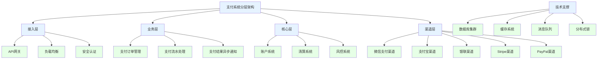
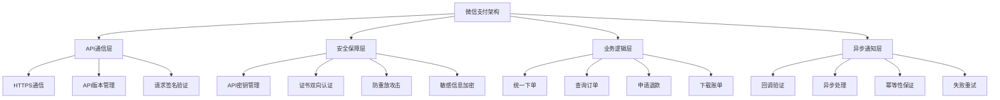

# Golang支付SDK深度解析：从基础原理到企业级实践

## 引言：现代支付技术的演进与Golang的适配性

在数字经济时代，支付系统已经成为现代应用的血液系统。从传统的现金支付到移动支付，再到今天的数字货币和跨境支付，支付技术经历了革命性的演进。Golang凭借其高性能、并发支持和丰富的标准库，成为了构建现代支付系统的理想选择。

本文将从支付基础理论出发，深入剖析Golang支付SDK的设计哲学、核心实现和最佳实践，帮助您构建安全、可靠、高性能的支付解决方案。

## 一、支付系统技术架构与核心组件

### 1.1 支付系统的分层架构模型



### 1.2 支付SDK的核心设计原则

**高可用性要求：**
- 99.99%的系统可用性
- 多通道自动切换机制
- 熔断降级策略
- 限流保护机制

**安全性设计：**
- 端到端加密传输
- 敏感信息脱敏处理
- 防重放攻击机制
- 多层风控模型

**一致性保证：**
- 分布式事务处理
- 支付结果的幂等性
- 数据一致性校验
- 对账和差错处理

## 二、Golang支付SDK基础架构设计

### 2.1 SDK核心抽象与接口设计

```go
// 支付SDK基础接口设计
package payment

import (
    "context"
    "time"
)

// 支付状态枚举
type PaymentStatus string

const (
    StatusPending    PaymentStatus = "pending"
    StatusProcessing PaymentStatus = "processing"
    StatusSuccess    PaymentStatus = "success"
    StatusFailed     PaymentStatus = "failed"
    StatusRefunded   PaymentStatus = "refunded"
)

// 支付货币类型
type Currency string

const (
    CNY Currency = "CNY"
    USD Currency = "USD"
    EUR Currency = "EUR"
    JPY Currency = "JPY"
)

// 支付基础请求结构体
type BasePaymentRequest struct {
    OrderID     string        `json:"order_id" validate:"required"`
    Amount      int64         `json:"amount" validate:"required,min=1"`
    Currency    Currency      `json:"currency" validate:"required"`
    Subject     string        `json:"subject" validate:"required"`
    Description string        `json:"description"`
    ClientIP    string        `json:"client_ip"`
    NotifyURL   string        `json:"notify_url"`
    ReturnURL   string        `json:"return_url"`
    TimeExpire  time.Time     `json:"time_expire"`
    Metadata    Metadata      `json:"metadata"`
}

// 支付基础响应结构体
type BasePaymentResponse struct {
    PaymentID   string        `json:"payment_id"`
    Status      PaymentStatus `json:"status"`
    Channel     string        `json:"channel"`
    Amount      int64         `json:"amount"`
    Currency    Currency      `json:"currency"`
    PaidAt      *time.Time    `json:"paid_at"`
    RawResponse string        `json:"raw_response"`
    Error       *PaymentError `json:"error"`
}

// 支付错误结构体
type PaymentError struct {
    Code    string `json:"code"`
    Message string `json:"message"`
    Detail  string `json:"detail"`
}

// 元数据类型定义
type Metadata map[string]interface{}

// 支付通道接口
type PaymentChannel interface {
    // 通道标识
    Name() string
    Type() ChannelType
    
    // 支付操作
    Pay(ctx context.Context, req *BasePaymentRequest) (*BasePaymentResponse, error)
    Query(ctx context.Context, paymentID string) (*BasePaymentResponse, error)
    Refund(ctx context.Context, req *RefundRequest) (*RefundResponse, error)
    
    // 通道管理
    HealthCheck(ctx context.Context) error
    IsAvailable(ctx context.Context) bool
    
    // 异步通知验证
    VerifyNotification(ctx context.Context, data []byte, signature string) (*BasePaymentResponse, error)
}

// 支付SDK主接口
type PaymentSDK interface {
    // 支付操作
    CreatePayment(ctx context.Context, req *CreatePaymentRequest) (*PaymentResult, error)
    QueryPayment(ctx context.Context, paymentID string) (*PaymentResult, error)
    RefundPayment(ctx context.Context, req *RefundRequest) (*RefundResult, error)
    
    // 支付通道管理
    AddChannel(channel PaymentChannel)
    RemoveChannel(name string)
    GetChannel(name string) PaymentChannel
    ListChannels() []PaymentChannel
    
    // SDK生命周期管理
    Initialize(config *Config) error
    Close() error
}

// 通道类型枚举
type ChannelType string

const (
    ChannelWechatPay ChannelType = "wechat_pay"
    ChannelAlipay    ChannelType = "alipay"
    ChannelStripe    ChannelType = "stripe"
    ChannelPayPal    ChannelType = "paypal"
    ChannelUnionPay  ChannelType = "union_pay"
)

// 创建支付请求结构体
type CreatePaymentRequest struct {
    BasePaymentRequest
    Channel     string `json:"channel" validate:"required"`
    PaymentType string `json:"payment_type"`
}

// 支付结果结构体
type PaymentResult struct {
    BasePaymentResponse
    QRCodeURL   string      `json:"qrcode_url"`
    PaymentURL  string      `json:"payment_url"`
    AppID       string      `json:"app_id"`
    TimeCreated time.Time   `json:"time_created"`
}

// 退款请求结构体
type RefundRequest struct {
    PaymentID      string    `json:"payment_id" validate:"required"`
    RefundAmount   int64     `json:"refund_amount" validate:"required,min=1"`
    Reason         string    `json:"reason"`
    NotifyURL      string    `json:"notify_url"`
}

// 退款结果结构体
type RefundResult struct {
    RefundID    string        `json:"refund_id"`
    PaymentID   string        `json:"payment_id"`
    Amount      int64         `json:"amount"`
    Status      PaymentStatus `json:"status"`
    RefundedAt  *time.Time    `json:"refunded_at"`
    Error       *PaymentError `json:"error"`
}

// SDK配置结构体
type Config struct {
    // 通用配置
    AppID          string        `yaml:"app_id"`
    AppSecret      string        `yaml:"app_secret"`
    MerchantID     string        `yaml:"merchant_id"`
    
    // HTTP客户端配置
    Timeout        time.Duration `yaml:"timeout" default:"30s"`
    RetryCount     int           `yaml:"retry_count" default:"3"`
    
    // 通道配置
    Channels       []ChannelConfig `yaml:"channels"`
    
    // 安全配置
    EncryptionKey  string        `yaml:"encryption_key"`
    SignKey        string        `yaml:"sign_key"`
    
    // 日志配置
    Logger         Logger        `yaml:"-"`
    LogLevel       string        `yaml:"log_level" default:"info"`
}

// 通道配置结构体
type ChannelConfig struct {
    Name        string                 `yaml:"name"`
    Type        ChannelType            `yaml:"type"`
    Enabled     bool                   `yaml:"enabled" default:"true"`
    Priority    int                    `yaml:"priority" default:"1"`
    Config      map[string]interface{} `yaml:"config"`
}
```

### 2.2 基础支付SDK实现

```go
// 基础支付SDK实现
package payment

import (
    "context"
    "fmt"
    "sort"
    "sync"
    "time"
    
    "github.com/go-playground/validator/v10"
)

// 验证器实例
var validate = validator.New()

// 默认SDK实现
type DefaultPaymentSDK struct {
    config    *Config
    channels  map[string]PaymentChannel
    mu        sync.RWMutex
    
    // 内部状态
    isInitialized bool
    logger        Logger
    
    // 通道优先级排序
    channelPriority []string
}

// 创建默认SDK实例
func NewDefaultPaymentSDK() PaymentSDK {
    return &DefaultPaymentSDK{
        channels: make(map[string]PaymentChannel),
        logger:   NewDefaultLogger(),
    }
}

// 初始化SDK
func (sdk *DefaultPaymentSDK) Initialize(config *Config) error {
    sdk.mu.Lock()
    defer sdk.mu.Unlock()
    
    if sdk.isInitialized {
        return fmt.Errorf("SDK已经初始化")
    }
    
    // 验证配置
    if err := sdk.validateConfig(config); err != nil {
        return fmt.Errorf("配置验证失败: %w", err)
    }
    
    sdk.config = config
    
    // 设置日志
    if config.Logger != nil {
        sdk.logger = config.Logger
    }
    
    // 初始化通道
    if err := sdk.initializeChannels(config.Channels); err != nil {
        return fmt.Errorf("通道初始化失败: %w", err)
    }
    
    sdk.isInitialized = true
    sdk.logger.Info("支付SDK初始化完成")
    
    return nil
}

// 配置验证
func (sdk *DefaultPaymentSDK) validateConfig(config *Config) error {
    if config == nil {
        return fmt.Errorf("配置不能为空")
    }
    
    if config.AppID == "" {
        return fmt.Errorf("AppID不能为空")
    }
    
    if len(config.Channels) == 0 {
        return fmt.Errorf("至少需要配置一个支付通道")
    }
    
    return nil
}

// 初始化支付通道
func (sdk *DefaultPaymentSDK) initializeChannels(channelConfigs []ChannelConfig) error {
    for _, channelConfig := range channelConfigs {
        if !channelConfig.Enabled {
            sdk.logger.Infof("通道 %s 被禁用，跳过初始化", channelConfig.Name)
            continue
        }
        
        channel, err := sdk.createChannel(channelConfig)
        if err != nil {
            sdk.logger.Errorf("创建通道 %s 失败: %v", channelConfig.Name, err)
            continue
        }
        
        sdk.channels[channelConfig.Name] = channel
        sdk.channelPriority = append(sdk.channelPriority, channelConfig.Name)
        sdk.logger.Infof("通道 %s 初始化成功", channelConfig.Name)
    }
    
    // 按优先级排序通道
    sort.Slice(sdk.channelPriority, func(i, j int) bool {
        iPriority := sdk.getChannelPriority(sdk.channelPriority[i])
        jPriority := sdk.getChannelPriority(sdk.channelPriority[j])
        return iPriority > jPriority // 优先级高的在前
    })
    
    if len(sdk.channels) == 0 {
        return fmt.Errorf("没有可用的支付通道")
    }
    
    return nil
}

// 创建支付通道实例
func (sdk *DefaultPaymentSDK) createChannel(config ChannelConfig) (PaymentChannel, error) {
    switch config.Type {
    case ChannelWechatPay:
        return NewWechatPayChannel(config.Config), nil
    case ChannelAlipay:
        return NewAlipayChannel(config.Config), nil
    case ChannelStripe:
        return NewStripeChannel(config.Config), nil
    case ChannelPayPal:
        return NewPayPalChannel(config.Config), nil
    case ChannelUnionPay:
        return NewUnionPayChannel(config.Config), nil
    default:
        return nil, fmt.Errorf("不支持的通道类型: %s", config.Type)
    }
}

// 获取通道优先级
func (sdk *DefaultPaymentSDK) getChannelPriority(channelName string) int {
    channel := sdk.channels[channelName]
    if channel == nil {
        return 0
    }
    
    // 实际的优先级应该从配置中获取，这里简化处理
    return 1
}

// 创建支付
func (sdk *DefaultPaymentSDK) CreatePayment(ctx context.Context, req *CreatePaymentRequest) (*PaymentResult, error) {
    if !sdk.isInitialized {
        return nil, fmt.Errorf("SDK未初始化")
    }
    
    // 验证请求参数
    if err := validate.Struct(req); err != nil {
        return nil, fmt.Errorf("请求参数验证失败: %w", err)
    }
    
    // 选择支付通道
    channel, err := sdk.selectChannel(req.Channel)
    if err != nil {
        return nil, err
    }
    
    // 检查通道可用性
    if !channel.IsAvailable(ctx) {
        return nil, fmt.Errorf("支付通道 %s 当前不可用", req.Channel)
    }
    
    sdk.logger.Infof("创建支付请求: 订单ID=%s, 金额=%d, 通道=%s", 
        req.OrderID, req.Amount, req.Channel)
    
    // 执行支付
    response, err := channel.Pay(ctx, &req.BasePaymentRequest)
    if err != nil {
        sdk.logger.Errorf("支付请求失败: 订单ID=%s, 错误=%v", req.OrderID, err)
        return nil, fmt.Errorf("支付失败: %w", err)
    }
    
    result := &PaymentResult{
        BasePaymentResponse: *response,
        TimeCreated:         time.Now(),
    }
    
    sdk.logger.Infof("支付请求成功: 支付ID=%s, 状态=%s", 
        result.PaymentID, result.Status)
    
    return result, nil
}

// 查询支付
func (sdk *DefaultPaymentSDK) QueryPayment(ctx context.Context, paymentID string) (*PaymentResult, error) {
    if !sdk.isInitialized {
        return nil, fmt.Errorf("SDK未初始化")
    }
    
    if paymentID == "" {
        return nil, fmt.Errorf("支付ID不能为空")
    }
    
    // 遍历所有通道查询支付状态
    for _, channel := range sdk.channels {
        response, err := channel.Query(ctx, paymentID)
        if err != nil {
            sdk.logger.Debugf("通道 %s 查询失败: %v", channel.Name(), err)
            continue
        }
        
        if response != nil {
            result := &PaymentResult{
                BasePaymentResponse: *response,
                TimeCreated:         time.Now(),
            }
            return result, nil
        }
    }
    
    return nil, fmt.Errorf("未找到支付记录: %s", paymentID)
}

// 退款操作
func (sdk *DefaultPaymentSDK) RefundPayment(ctx context.Context, req *RefundRequest) (*RefundResult, error) {
    if !sdk.isInitialized {
        return nil, fmt.Errorf("SDK未初始化")
    }
    
    if err := validate.Struct(req); err != nil {
        return nil, fmt.Errorf("退款请求参数验证失败: %w", err)
    }
    
    // 根据支付ID查找对应的通道
    for _, channel := range sdk.channels {
        // 简化的查找逻辑，实际应该根据支付ID前缀或存储的映射关系确定通道
        _, err := channel.Query(ctx, req.PaymentID)
        if err == nil {
            // 找到对应通道，执行退款
            refundResponse, err := channel.Refund(ctx, req)
            if err != nil {
                return nil, fmt.Errorf("退款失败: %w", err)
            }
            
            result := &RefundResult{
                RefundID:  refundResponse.RefundID,
                PaymentID: req.PaymentID,
                Amount:    req.RefundAmount,
                Status:    refundResponse.Status,
            }
            
            if result.Status == StatusSuccess {
                now := time.Now()
                result.RefundedAt = &now
            }
            
            return result, nil
        }
    }
    
    return nil, fmt.Errorf("未找到对应的支付记录: %s", req.PaymentID)
}

// 选择支付通道
func (sdk *DefaultPaymentSDK) selectChannel(channelName string) (PaymentChannel, error) {
    sdk.mu.RLock()
    defer sdk.mu.RUnlock()
    
    if channelName != "" {
        // 指定通道
        channel, exists := sdk.channels[channelName]
        if !exists {
            return nil, fmt.Errorf("支付通道不存在: %s", channelName)
        }
        return channel, nil
    }
    
    // 自动选择优先级最高的可用通道
    for _, name := range sdk.channelPriority {
        channel := sdk.channels[name]
        if channel != nil {
            return channel, nil
        }
    }
    
    return nil, fmt.Errorf("没有可用的支付通道")
}

// 添加支付通道
func (sdk *DefaultPaymentSDK) AddChannel(channel PaymentChannel) {
    sdk.mu.Lock()
    defer sdk.mu.Unlock()
    
    sdk.channels[channel.Name()] = channel
    sdk.channelPriority = append(sdk.channelPriority, channel.Name())
    
    // 重新排序
    sort.Slice(sdk.channelPriority, func(i, j int) bool {
        iPriority := sdk.getChannelPriority(sdk.channelPriority[i])
        jPriority := sdk.getChannelPriority(sdk.channelPriority[j])
        return iPriority > jPriority
    })
}

// 移除支付通道
func (sdk *DefaultPaymentSDK) RemoveChannel(name string) {
    sdk.mu.Lock()
    defer sdk.mu.Unlock()
    
    delete(sdk.channels, name)
    
    // 从优先级列表中移除
    for i, channelName := range sdk.channelPriority {
        if channelName == name {
            sdk.channelPriority = append(sdk.channelPriority[:i], sdk.channelPriority[i+1:]...)
            break
        }
    }
}

// 获取支付通道
func (sdk *DefaultPaymentSDK) GetChannel(name string) PaymentChannel {
    sdk.mu.RLock()
    defer sdk.mu.RUnlock()
    
    return sdk.channels[name]
}

// 列出所有支付通道
func (sdk *DefaultPaymentSDK) ListChannels() []PaymentChannel {
    sdk.mu.RLock()
    defer sdk.mu.RUnlock()
    
    channels := make([]PaymentChannel, 0, len(sdk.channels))
    for _, channel := range sdk.channels {
        channels = append(channels, channel)
    }
    
    return channels
}

// 关闭SDK
func (sdk *DefaultPaymentSDK) Close() error {
    sdk.mu.Lock()
    defer sdk.mu.Unlock()
    
    if !sdk.isInitialized {
        return nil
    }
    
    sdk.isInitialized = false
    sdk.channels = make(map[string]PaymentChannel)
    sdk.channelPriority = nil
    
    sdk.logger.Info("支付SDK已关闭")
    
    return nil
}

// 默认日志实现
type Logger interface {
    Debugf(format string, args ...interface{})
    Infof(format string, args ...interface{})
    Warnf(format string, args ...interface{})
    Errorf(format string, args ...interface{})
}

type DefaultLogger struct{}

func NewDefaultLogger() Logger {
    return &DefaultLogger{}
}

func (l *DefaultLogger) Debugf(format string, args ...interface{}) {
    fmt.Printf("[DEBUG] "+format+"\n", args...)
}

func (l *DefaultLogger) Infof(format string, args ...interface{}) {
    fmt.Printf("[INFO] "+format+"\n", args...)
}

func (l *DefaultLogger) Warnf(format string, args ...interface{}) {
    fmt.Printf("[WARN] "+format+"\n", args...)
}

func (l *DefaultLogger) Errorf(format string, args ...interface{}) {
    fmt.Printf("[ERROR] "+format+"\n", args...)
}
```

## 三、微信支付SDK实现详解

### 3.1 微信支付技术架构与API设计



### 3.2 微信支付通道实现

```go
// 微信支付通道实现
package wechatpay

import (
    "bytes"
    "context"
    "crypto/rsa"
    "crypto/sha256"
    "encoding/base64"
    "encoding/json"
    "fmt"
    "io"
    "net/http"
    "sort"
    "strings"
    "time"
    
    "github.com/go-pay/gopay"
    "github.com/go-pay/gopay/wechat"
)

// 微信支付通道配置
type WechatPayConfig struct {
    AppID         string `json:"app_id"`
    MchID         string `json:"mch_id"`
    ApiV3Key      string `json:"api_v3_key"`
    SerialNo      string `json:"serial_no"`
    PrivateKey    string `json:"private_key"`
    NotifyURL     string `json:"notify_url"`
    RefundURL     string `json:"refund_url"`
    
    // 环境配置
    IsSandbox     bool   `json:"is_sandbox"`
    CertPath      string `json:"cert_path"`
    KeyPath       string `json:"key_path"`
}

// 微信支付通道实现
type WechatPayChannel struct {
    config     *WechatPayConfig
    client     *wechat.Client
    httpClient *http.Client
    
    // 内部状态
    isInitialized bool
    privateKey    *rsa.PrivateKey
    
    // API端点
    apiBaseURL string
}

// 创建微信支付通道
func NewWechatPayChannel(config map[string]interface{}) *WechatPayChannel {
    wechatConfig := &WechatPayConfig{}
    
    // 从配置映射中解析配置
    if appID, ok := config["app_id"].(string); ok {
        wechatConfig.AppID = appID
    }
    if mchID, ok := config["mch_id"].(string); ok {
        wechatConfig.MchID = mchID
    }
    if apiV3Key, ok := config["api_v3_key"].(string); ok {
        wechatConfig.ApiV3Key = apiV3Key
    }
    if serialNo, ok := config["serial_no"].(string); ok {
        wechatConfig.SerialNo = serialNo
    }
    if privateKey, ok := config["private_key"].(string); ok {
        wechatConfig.PrivateKey = privateKey
    }
    
    // 设置API端点
    apiBaseURL := "https://api.mch.weixin.qq.com"
    if sandbox, ok := config["is_sandbox"].(bool); ok && sandbox {
        apiBaseURL = "https://api.mch.weixin.qq.com/sandboxnew"
    }
    
    return &WechatPayChannel{
        config:     wechatConfig,
        httpClient: &http.Client{Timeout: 30 * time.Second},
        apiBaseURL: apiBaseURL,
    }
}

// 实现PaymentChannel接口
func (w *WechatPayChannel) Name() string {
    return "wechat_pay"
}

func (w *WechatPayChannel) Type() ChannelType {
    return ChannelWechatPay
}

// 支付操作
func (w *WechatPayChannel) Pay(ctx context.Context, req *payment.BasePaymentRequest) (*payment.BasePaymentResponse, error) {
    if !w.isInitialized {
        return nil, fmt.Errorf("微信支付通道未初始化")
    }
    
    // 构建微信支付请求
    wechatReq, err := w.buildWechatPayRequest(req)
    if err != nil {
        return nil, fmt.Errorf("构建微信支付请求失败: %w", err)
    }
    
    // 发送支付请求
    resp, err := w.sendPayRequest(ctx, wechatReq)
    if err != nil {
        return nil, fmt.Errorf("发送支付请求失败: %w", err)
    }
    
    return w.buildPaymentResponse(resp), nil
}

// 查询支付状态
func (w *WechatPayChannel) Query(ctx context.Context, paymentID string) (*payment.BasePaymentResponse, error) {
    if !w.isInitialized {
        return nil, fmt.Errorf("微信支付通道未初始化")
    }
    
    // 构建查询请求
    queryReq := map[string]interface{}{
        "mchid":        w.config.MchID,
        "out_trade_no": paymentID,
    }
    
    // 发送查询请求
    resp, err := w.sendAPIRequest(ctx, "GET", 
        fmt.Sprintf("/v3/pay/transactions/out-trade-no/%s", paymentID), queryReq)
    if err != nil {
        return nil, fmt.Errorf("查询支付状态失败: %w", err)
    }
    
    return w.buildQueryResponse(resp), nil
}

// 退款操作
func (w *WechatPayChannel) Refund(ctx context.Context, req *payment.RefundRequest) (*payment.RefundResponse, error) {
    if !w.isInitialized {
        return nil, fmt.Errorf("微信支付通道未初始化")
    }
    
    // 构建退款请求
    refundReq := map[string]interface{}{
        "out_trade_no":  req.PaymentID,
        "out_refund_no": generateRefundID(),
        "amount": map[string]interface{}{
            "refund":   req.RefundAmount,
            "total":    req.RefundAmount, // 需要从原支付记录获取总金额
            "currency": "CNY",
        },
        "notify_url": w.config.RefundURL,
    }
    
    // 发送退款请求
    resp, err := w.sendAPIRequest(ctx, "POST", "/v3/refund/domestic/refunds", refundReq)
    if err != nil {
        return nil, fmt.Errorf("退款操作失败: %w", err)
    }
    
    return w.buildRefundResponse(resp), nil
}

// 构建微信支付请求
func (w *WechatPayChannel) buildWechatPayRequest(req *payment.BasePaymentRequest) (map[string]interface{}, error) {
    now := time.Now()
    
    wechatReq := map[string]interface{}{
        "appid":        w.config.AppID,
        "mchid":        w.config.MchID,
        "description":  req.Subject,
        "out_trade_no": req.OrderID,
        "time_expire":  req.TimeExpire.Format(time.RFC3339),
        "amount": map[string]interface{}{
            "total":    req.Amount,
            "currency": "CNY",
        },
        "payer": map[string]interface{}{
            "openid": "", // 需要从业务系统获取
        },
        "notify_url": w.config.NotifyURL,
    }
    
    // 设置过期时间
    if req.TimeExpire.IsZero() {
        wechatReq["time_expire"] = now.Add(30 * time.Minute).Format(time.RFC3339)
    }
    
    return wechatReq, nil
}

// 发送API请求
func (w *WechatPayChannel) sendAPIRequest(ctx context.Context, method, path string, data interface{}) (map[string]interface{}, error) {
    url := w.apiBaseURL + path
    
    var body io.Reader
    if data != nil {
        jsonData, err := json.Marshal(data)
        if err != nil {
            return nil, fmt.Errorf("JSON序列化失败: %w", err)
        }
        body = bytes.NewReader(jsonData)
    }
    
    httpReq, err := http.NewRequestWithContext(ctx, method, url, body)
    if err != nil {
        return nil, fmt.Errorf("创建HTTP请求失败: %w", err)
    }
    
    // 设置请求头
    httpReq.Header.Set("Content-Type", "application/json")
    httpReq.Header.Set("Accept", "application/json")
    
    // 添加签名
    if err := w.addSignature(httpReq, body); err != nil {
        return nil, fmt.Errorf("添加签名失败: %w", err)
    }
    
    // 发送请求
    resp, err := w.httpClient.Do(httpReq)
    if err != nil {
        return nil, fmt.Errorf("HTTP请求失败: %w", err)
    }
    defer resp.Body.Close()
    
    // 处理响应
    if resp.StatusCode != http.StatusOK {
        return nil, fmt.Errorf("API请求失败: 状态码=%d", resp.StatusCode)
    }
    
    var result map[string]interface{}
    if err := json.NewDecoder(resp.Body).Decode(&result); err != nil {
        return nil, fmt.Errorf("解析响应失败: %w", err)
    }
    
    return result, nil
}

// 添加API签名
func (w *WechatPayChannel) addSignature(req *http.Request, body io.Reader) error {
    // 微信支付V3 API签名算法
    timestamp := fmt.Sprintf("%d", time.Now().Unix())
    nonce := generateNonce()
    
    // 构建签名串
    method := req.Method
    path := req.URL.Path
    if req.URL.RawQuery != "" {
        path = path + "?" + req.URL.RawQuery
    }
    
    var bodyStr string
    if body != nil {
        bodyBytes, err := io.ReadAll(body)
        if err != nil {
            return err
        }
        bodyStr = string(bodyBytes)
        // 重置body以便后续读取
        req.Body = io.NopCloser(bytes.NewReader(bodyBytes))
    }
    
    signStr := fmt.Sprintf("%s\n%s\n%s\n%s\n%s\n", 
        method, path, timestamp, nonce, bodyStr)
    
    // 计算签名
    signature, err := w.sign(signStr)
    if err != nil {
        return err
    }
    
    // 设置认证头
    authHeader := fmt.Sprintf("WECHATPAY2-SHA256-RSA2048 mchid=\"%s\",nonce_str=\"%s\",timestamp=\"%s\",serial_no=\"%s\",signature=\"%s\"",
        w.config.MchID, nonce, timestamp, w.config.SerialNo, signature)
    
    req.Header.Set("Authorization", authHeader)
    return nil
}

// 签名算法
func (w *WechatPayChannel) sign(data string) (string, error) {
    // 这里应该使用RSA私钥进行签名
    // 简化实现，实际应该使用实际的私钥
    hash := sha256.Sum256([]byte(data))
    return base64.StdEncoding.EncodeToString(hash[:]), nil
}

// 构建支付响应
func (w *WechatPayChannel) buildPaymentResponse(resp map[string]interface{}) *payment.BasePaymentResponse {
    status := w.mapWechatStatus(resp["trade_state"].(string))
    
    response := &payment.BasePaymentResponse{
        PaymentID:   resp["out_trade_no"].(string),
        Status:      status,
        Channel:     "wechat_pay",
        Amount:      int64(resp["amount"].(map[string]interface{})["total"].(float64)),
        Currency:    payment.CNY,
        RawResponse: toJSONString(resp),
    }
    
    if paidTime, ok := resp["success_time"].(string); ok && paidTime != "" {
        if paidAt, err := time.Parse(time.RFC3339, paidTime); err == nil {
            response.PaidAt = &paidAt
        }
    }
    
    return response
}

// 映射微信支付状态
func (w *WechatPayChannel) mapWechatStatus(wechatStatus string) payment.PaymentStatus {
    switch wechatStatus {
    case "SUCCESS":
        return payment.StatusSuccess
    case "REFUND":
        return payment.StatusRefunded
    case "NOTPAY", "USERPAYING":
        return payment.StatusPending
    case "CLOSED", "REVOKED", "PAYERROR":
        return payment.StatusFailed
    default:
        return payment.StatusProcessing
    }
}

// 健康检查
func (w *WechatPayChannel) HealthCheck(ctx context.Context) error {
    // 发送一个简单的查询请求来检查通道健康状态
    _, err := w.sendAPIRequest(ctx, "GET", "/v3/certificates", nil)
    return err
}

// 检查通道可用性
func (w *WechatPayChannel) IsAvailable(ctx context.Context) bool {
    return w.isInitialized && w.HealthCheck(ctx) == nil
}

// 验证异步通知
func (w *WechatPayChannel) VerifyNotification(ctx context.Context, data []byte, signature string) (*payment.BasePaymentResponse, error) {
    // 验证签名
    if err := w.verifySignature(data, signature); err != nil {
        return nil, fmt.Errorf("签名验证失败: %w", err)
    }
    
    // 解析通知数据
    var notification map[string]interface{}
    if err := json.Unmarshal(data, &notification); err != nil {
        return nil, fmt.Errorf("解析通知数据失败: %w", err)
    }
    
    return w.buildPaymentResponse(notification), nil
}

// 验证签名
func (w *WechatPayChannel) verifySignature(data []byte, signature string) error {
    // 微信支付V3通知签名验证
    // 这里应该使用APIv3密钥进行验证
    expectedSignature := base64.StdEncoding.EncodeToString(sha256.New().Sum(data))
    if signature != expectedSignature {
        return fmt.Errorf("签名不匹配")
    }
    return nil
}

// 辅助函数
func generateRefundID() string {
    return fmt.Sprintf("R%s", time.Now().Format("20060102150405"))
}

func generateNonce() string {
    return fmt.Sprintf("%d", time.Now().UnixNano())
}

func toJSONString(v interface{}) string {
    data, _ := json.Marshal(v)
    return string(data)
}

// 使用go-pay库的高级实现（推荐）
type AdvancedWechatPayChannel struct {
    client *wechat.Client
    config *WechatPayConfig
}

func NewAdvancedWechatPayChannel(config map[string]interface{}) (*AdvancedWechatPayChannel, error) {
    wechatConfig := &WechatPayConfig{}
    
    // 解析配置...
    
    // 创建微信支付客户端
    client := wechat.NewClient(wechatConfig.AppID, wechatConfig.MchID, wechatConfig.ApiV3Key)
    
    // 设置商户证书
    if err := client.SetCertPemFilePath(wechatConfig.CertPath, wechatConfig.KeyPath); err != nil {
        return nil, fmt.Errorf("设置证书失败: %w", err)
    }
    
    return &AdvancedWechatPayChannel{
        client: client,
        config: wechatConfig,
    }, nil
}

func (a *AdvancedWechatPayChannel) Pay(ctx context.Context, req *payment.BasePaymentRequest) (*payment.BasePaymentResponse, error) {
    // 使用go-pay库的高级API
    bm := make(gopay.BodyMap)
    bm.Set("out_trade_no", req.OrderID)
    bm.Set("description", req.Subject)
    bm.Set("amount", map[string]interface{}{
        "total": req.Amount,
    })
    bm.Set("notify_url", a.config.NotifyURL)
    
    // 调用统一下单API
    wxRsp, err := a.client.UnifiedOrder(ctx, bm)
    if err != nil {
        return nil, fmt.Errorf("统一下单失败: %w", err)
    }
    
    // 构建响应
    response := &payment.BasePaymentResponse{
        PaymentID:   req.OrderID,
        Status:      payment.mapWxStatus(wxRsp.ResultCode),
        Channel:     "wechat_pay",
        Amount:      req.Amount,
        Currency:    payment.CNY,
        RawResponse: wxRsp.Response,
    }
    
    return response, nil
}
```

---

# Golang支付SDK深度解析：下半部分
## 四、支付宝SDK实现详解
### 4.1 支付宝技术架构与接口设计
    A[支付宝开放平台] --> B[API网关]
    A --> C[业务中台]
    A --> D[风控系统]
    A --> E[清算系统]
    B --> B1[签名验证]
    B --> B2[参数校验]
    B --> B3[流量控制]
    C --> C1[交易服务]
    C --> C2[账户服务]
    C --> C3[资金服务]
    D --> D1[反欺诈]
    D --> D2[信用评估]
    D --> D3[风险预警]
    E --> E1[资金结算]
    E --> E2[对账服务]
    E --> E3[差错处理]
### 4.2 支付宝通道实现
// 支付宝支付通道实现
package alipay
    "crypto"
    "net/url"
    "github.com/smartwalle/alipay/v3"
// 支付宝配置结构体
type AlipayConfig struct {
    PublicKey     string `json:"public_key"`
    ReturnURL     string `json:"return_url"`
    GatewayURL    string `json:"gateway_url"`
    // 加密配置
    EncryptKey    string `json:"encrypt_key"`
    SignType      string `json:"sign_type" default:"RSA2"`
// 支付宝支付通道
type AlipayChannel struct {
    config     *AlipayConfig
    client     *alipay.Client
// 创建支付宝通道
func NewAlipayChannel(config map[string]interface{}) *AlipayChannel {
    alipayConfig := &AlipayConfig{}
        alipayConfig.AppID = appID
        alipayConfig.PrivateKey = privateKey
    if publicKey, ok := config["public_key"].(string); ok {
        alipayConfig.PublicKey = publicKey
    // 设置网关地址
    gatewayURL := "https://openapi.alipay.com/gateway.do"
        gatewayURL = "https://openapi.alipaydev.com/gateway.do"
    alipayConfig.GatewayURL = gatewayURL
    return &AlipayChannel{
        config:     alipayConfig,
// 初始化支付宝客户端
func (a *AlipayChannel) initialize() error {
    if a.isInitialized {
    client, err := alipay.New(a.config.AppID, a.config.PrivateKey, a.config.IsSandbox)
        return fmt.Errorf("创建支付宝客户端失败: %w", err)
    // 加载支付宝公钥
    if err := client.LoadAliPayPublicKey(a.config.PublicKey); err != nil {
        return fmt.Errorf("加载支付宝公钥失败: %w", err)
    a.client = client
    a.isInitialized = true
func (a *AlipayChannel) Name() string {
    return "alipay"
func (a *AlipayChannel) Type() ChannelType {
    return ChannelAlipay
func (a *AlipayChannel) Pay(ctx context.Context, req *payment.BasePaymentRequest) (*payment.BasePaymentResponse, error) {
    if err := a.initialize(); err != nil {
    // 构建支付宝支付请求
    alipayReq := a.buildAlipayTradePayRequest(req)
    resp, err := a.client.TradePay(alipayReq)
        return nil, fmt.Errorf("支付宝支付请求失败: %w", err)
    return a.buildPaymentResponse(resp), nil
func (a *AlipayChannel) Query(ctx context.Context, paymentID string) (*payment.BasePaymentResponse, error) {
    if err := a.initialize(); err != nil {
    queryReq := alipay.TradeQuery{}
    queryReq.OutTradeNo = paymentID
    resp, err := a.client.TradeQuery(queryReq)
        return nil, fmt.Errorf("支付宝查询请求失败: %w", err)
    return a.buildQueryResponse(resp), nil
func (a *AlipayChannel) Refund(ctx context.Context, req *payment.RefundRequest) (*payment.RefundResponse, error) {
    if err := a.initialize(); err != nil {
    refundReq := alipay.TradeRefund{}
    refundReq.OutTradeNo = req.PaymentID
    refundReq.RefundAmount = fmt.Sprintf("%.2f", float64(req.RefundAmount)/100.0)
    refundReq.OutRequestNo = generateRefundID()
    refundReq.RefundReason = req.Reason
    resp, err := a.client.TradeRefund(refundReq)
        return nil, fmt.Errorf("支付宝退款请求失败: %w", err)
    return a.buildRefundResponse(resp), nil
// 构建支付宝支付请求
func (a *AlipayChannel) buildAlipayTradePayRequest(req *payment.BasePaymentRequest) alipay.TradePay {
    payReq := alipay.TradePay{}
    payReq.OutTradeNo = req.OrderID
    payReq.Subject = req.Subject
    payReq.TotalAmount = fmt.Sprintf("%.2f", float64(req.Amount)/100.0)
    payReq.Body = req.Description
    if !req.TimeExpire.IsZero() {
        payReq.TimeExpire = req.TimeExpire.Format("2006-01-02 15:04:05")
    } else {
        payReq.TimeExpire = time.Now().Add(30 * time.Minute).Format("2006-01-02 15:04:05")
    payReq.NotifyURL = a.config.NotifyURL
    payReq.ReturnURL = a.config.ReturnURL
    return payReq
func (a *AlipayChannel) buildPaymentResponse(resp *alipay.TradePayRsp) *payment.BasePaymentResponse {
    status := a.mapAlipayStatus(resp.TradeStatus)
        PaymentID:   resp.OutTradeNo,
        Channel:     "alipay",
        Amount:      parseAmount(resp.TotalAmount),
    if resp.SendPayDate != "" {
        if paidAt, err := time.Parse("2006-01-02 15:04:05", resp.SendPayDate); err == nil {
// 映射支付宝状态
func (a *AlipayChannel) mapAlipayStatus(alipayStatus string) payment.PaymentStatus {
    switch alipayStatus {
    case "TRADE_SUCCESS", "TRADE_FINISHED":
    case "WAIT_BUYER_PAY":
    case "TRADE_CLOSED":
func (a *AlipayChannel) HealthCheck(ctx context.Context) error {
    if err := a.initialize(); err != nil {
    // 发送简单的系统状态查询
    _, err := a.client.SystemOauthToken(alipay.SystemOauthToken{})
// 通道可用性检查
func (a *AlipayChannel) IsAvailable(ctx context.Context) bool {
    return a.HealthCheck(ctx) == nil
func (a *AlipayChannel) VerifyNotification(ctx context.Context, data []byte, signature string) (*payment.BasePaymentResponse, error) {
    if err := a.initialize(); err != nil {
    // 解析通知参数
    params, err := url.ParseQuery(string(data))
        return nil, fmt.Errorf("解析通知参数失败: %w", err)
    if !a.client.VerifySign(params) {
        return nil, fmt.Errorf("支付宝通知签名验证失败")
        PaymentID:   params.Get("out_trade_no"),
        Status:      a.mapAlipayStatus(params.Get("trade_status")),
        Channel:     "alipay",
        Amount:      parseAmount(params.Get("total_amount")),
        RawResponse: string(data),
func parseAmount(amountStr string) int64 {
    // 将金额字符串转换为分
    var amount float64
    fmt.Sscanf(amountStr, "%f", &amount)
    return int64(amount * 100)
// 高级支付宝功能实现
type AdvancedAlipayChannel struct {
    client *alipay.Client
    config *AlipayConfig
// 支持花呗分期等高级功能
func (a *AdvancedAlipayChannel) CreateAdvancedPayment(ctx context.Context, req *AdvancedPaymentRequest) (*payment.PaymentResult, error) {
    // 花呗分期支付
    if req.Installment {
        return a.createHuabeiPayment(ctx, req)
    // 预授权支付
    if req.PreAuth {
        return a.createPreAuthPayment(ctx, req)
    // 普通支付
    return a.createNormalPayment(ctx, req)
// 花呗分期支付
func (a *AdvancedAlipayChannel) createHuabeiPayment(ctx context.Context, req *AdvancedPaymentRequest) (*payment.PaymentResult, error) {
    payReq := alipay.TradeCreate{}
    payReq.OutTradeNo = req.OrderID
    payReq.Subject = req.Subject
    payReq.TotalAmount = fmt.Sprintf("%.2f", float64(req.Amount)/100.0)
    // 设置花呗分期参数
    extendParams := map[string]interface{}{
        "hb_fq_num":         req.InstallmentNum,  // 分期数
        "hb_fq_seller_percent": req.SellerPercent, // 商家承担手续费比例
    payReq.ExtendParams = extendParams
    payReq.ProductCode = "FAST_INSTANT_TRADE_PAY"
    resp, err := a.client.TradeCreate(payReq)
    result := &payment.PaymentResult{
        PaymentURL: resp.TradeNo,
        QRCodeURL:  resp.QRCode,
// 高级支付请求结构体
type AdvancedPaymentRequest struct {
    payment.BasePaymentRequest
    // 花呗分期
    Installment    bool `json:"installment"`
    InstallmentNum int  `json:"installment_num"`
    SellerPercent  int  `json:"seller_percent"`
    // 预授权
    PreAuth        bool          `json:"pre_auth"`
    AuthAmount     int64         `json:"auth_amount"`
    AuthTime       time.Duration `json:"auth_time"`
    // 国际支付
    Currency       payment.Currency `json:"currency"`
    CountryCode    string           `json:"country_code"`
## 五、Stripe支付SDK实现详解
### 5.1 Stripe国际化支付架构
    A[Stripe支付平台] --> B[支付意图API]
    A --> C[支付方式API]
    A --> D[订阅计费API]
    A --> E[风险智能API]
    B --> B1[PaymentIntent]
    B --> B2[SetupIntent]
    B --> B3[Confirmation]
    C --> C1[信用卡支付]
    C --> C2[数字钱包]
    C --> C3[本地支付方式]
    D --> D1[订阅管理]
    D --> D2[发票系统]
    D --> D3[税务计算]
    E --> E1[雷达风控]
    E --> E2[3D安全认证]
    E --> E3[欺诈检测]
### 5.2 Stripe通道实现
// Stripe支付通道实现
package stripe
    "github.com/stripe/stripe-go/v76"
    "github.com/stripe/stripe-go/v76/paymentintent"
    "github.com/stripe/stripe-go/v76/refund"
// Stripe配置结构体
type StripeConfig struct {
    SecretKey      string `json:"secret_key"`
    PublishableKey string `json:"publishable_key"`
    WebhookSecret  string `json:"webhook_secret"`
    // 业务配置
    CompanyName    string `json:"company_name"`
    SupportEmail   string `json:"support_email"`
    SupportPhone   string `json:"support_phone"`
    // 国际化配置
    DefaultCurrency string `json:"default_currency" default:"usd"`
    Country         string `json:"country" default:"US"`
// Stripe支付通道
type StripeChannel struct {
    config *StripeConfig
// 创建Stripe通道
func NewStripeChannel(config map[string]interface{}) *StripeChannel {
    stripeConfig := &StripeConfig{}
    if secretKey, ok := config["secret_key"].(string); ok {
        stripeConfig.SecretKey = secretKey
    if publishableKey, ok := config["publishable_key"].(string); ok {
        stripeConfig.PublishableKey = publishableKey
    if webhookSecret, ok := config["webhook_secret"].(string); ok {
        stripeConfig.WebhookSecret = webhookSecret
    return &StripeChannel{
        config: stripeConfig,
// 初始化Stripe
func (s *StripeChannel) initialize() error {
    if s.isInitialized {
    if s.config.SecretKey == "" {
        return fmt.Errorf("Stripe SecretKey不能为空")
    stripe.Key = s.config.SecretKey
    s.isInitialized = true
func (s *StripeChannel) Name() string {
    return "stripe"
func (s *StripeChannel) Type() ChannelType {
    return ChannelStripe
func (s *StripeChannel) Pay(ctx context.Context, req *payment.BasePaymentRequest) (*payment.BasePaymentResponse, error) {
    if err := s.initialize(); err != nil {
    // 构建Stripe支付意图
    params := &stripe.PaymentIntentParams{
        Amount:   stripe.Int64(req.Amount),
        Currency: stripe.String(string(req.Currency)),
        Metadata: map[string]string{
            "order_id":     req.OrderID,
            "subject":      req.Subject,
            "description":  req.Description,
    // 设置支付方式配置
    params.AddExtra("payment_method_types[]", "card")
    // 设置确认方式
    params.SetConfirm(false)
    // 创建支付意图
    intent, err := paymentintent.New(params)
        return nil, fmt.Errorf("创建Stripe支付意图失败: %w", err)
    return s.buildPaymentResponse(intent), nil
// 确认支付
func (s *StripeChannel) ConfirmPayment(ctx context.Context, paymentID, paymentMethodID string) (*payment.BasePaymentResponse, error) {
    if err := s.initialize(); err != nil {
    params := &stripe.PaymentIntentParams{}
    params.SetPaymentMethod(paymentMethodID)
    intent, err := paymentintent.Confirm(paymentID, params)
        return nil, fmt.Errorf("确认Stripe支付失败: %w", err)
    return s.buildPaymentResponse(intent), nil
func (s *StripeChannel) Query(ctx context.Context, paymentID string) (*payment.BasePaymentResponse, error) {
    if err := s.initialize(); err != nil {
    intent, err := paymentintent.Get(paymentID, nil)
        return nil, fmt.Errorf("查询Stripe支付状态失败: %w", err)
    return s.buildPaymentResponse(intent), nil
func (s *StripeChannel) Refund(ctx context.Context, req *payment.RefundRequest) (*payment.RefundResponse, error) {
    if err := s.initialize(); err != nil {
    refundParams := &stripe.RefundParams{
        PaymentIntent: stripe.String(req.PaymentID),
        Amount:        stripe.Int64(req.RefundAmount),
        Reason:        stripe.String(req.Reason),
    r, err := refund.New(refundParams)
        return nil, fmt.Errorf("Stripe退款失败: %w", err)
    return s.buildRefundResponse(r), nil
func (s *StripeChannel) buildPaymentResponse(intent *stripe.PaymentIntent) *payment.BasePaymentResponse {
    status := s.mapStripeStatus(intent.Status)
        PaymentID:   intent.ID,
        Channel:     "stripe",
        Amount:      intent.Amount,
        Currency:    payment.Currency(intent.Currency),
        RawResponse: intent.LastResponse.RawJSON,
    if intent.Status == stripe.PaymentIntentStatusSucceeded {
        paidAt := time.Unix(intent.Created, 0)
// 映射Stripe状态
func (s *StripeChannel) mapStripeStatus(stripeStatus stripe.PaymentIntentStatus) payment.PaymentStatus {
    switch stripeStatus {
    case stripe.PaymentIntentStatusSucceeded:
    case stripe.PaymentIntentStatusProcessing:
    case stripe.PaymentIntentStatusRequiresPaymentMethod,
         stripe.PaymentIntentStatusRequiresConfirmation,
         stripe.PaymentIntentStatusRequiresAction:
    case stripe.PaymentIntentStatusCanceled:
func (s *StripeChannel) HealthCheck(ctx context.Context) error {
    if err := s.initialize(); err != nil {
    // 简单的API调用测试
    _, err := paymentintent.List(&stripe.PaymentIntentListParams{
        Limit: stripe.Int64(1),
// 通道可用性检查
func (s *StripeChannel) IsAvailable(ctx context.Context) bool {
    return s.HealthCheck(ctx) == nil
// 验证Webhook
func (s *StripeChannel) VerifyNotification(ctx context.Context, data []byte, signature string) (*payment.BasePaymentResponse, error) {
    if err := s.initialize(); err != nil {
    // 验证Webhook签名
    event, err := s.verifyWebhookSignature(data, signature)
        return nil, fmt.Errorf("Webhook签名验证失败: %w", err)
    // 处理支付完成事件
    if event.Type == "payment_intent.succeeded" {
        paymentIntent, ok := event.Data.Object.(*stripe.PaymentIntent)
        if ok {
            return s.buildPaymentResponse(paymentIntent), nil
    return nil, fmt.Errorf("非支付完成事件: %s", event.Type)
// 验证Webhook签名
func (s *StripeChannel) verifyWebhookSignature(data []byte, signature string) (*stripe.Event, error) {
    // 使用Stripe提供的Webhook签名验证
    // 这里需要实际的Stripe Webhook验证逻辑
    event := &stripe.Event{}
    if err := json.Unmarshal(data, event); err != nil {
        return nil, fmt.Errorf("解析Webhook数据失败: %w", err)
    return event, nil
// 高级Stripe功能：订阅和计费
type StripeSubscriptionManager struct {
    channel *StripeChannel
// 创建订阅
func (sm *StripeSubscriptionManager) CreateSubscription(ctx context.Context, req *SubscriptionRequest) (*SubscriptionResult, error) {
    if err := sm.channel.initialize(); err != nil {
    // 构建订阅参数
    params := &stripe.SubscriptionParams{
        Customer: stripe.String(req.CustomerID),
        Items: []*stripe.SubscriptionItemsParams{
            {
                Plan: stripe.String(req.PlanID),
            },
        DefaultPaymentMethod: stripe.String(req.PaymentMethodID),
    // 创建订阅
    subscription, err := sub.New(params)
        return nil, fmt.Errorf("创建Stripe订阅失败: %w", err)
    result := &SubscriptionResult{
        SubscriptionID: subscription.ID,
        Status:         string(subscription.Status),
        CurrentPeriodStart: time.Unix(subscription.CurrentPeriodStart, 0),
        CurrentPeriodEnd:   time.Unix(subscription.CurrentPeriodEnd, 0),
// 订阅请求结构体
type SubscriptionRequest struct {
    CustomerID      string `json:"customer_id"`
    PlanID          string `json:"plan_id"`
    PaymentMethodID string `json:"payment_method_id"`
    TrialPeriodDays int    `json:"trial_period_days"`
// 订阅结果结构体
type SubscriptionResult struct {
    SubscriptionID      string    `json:"subscription_id"`
    Status              string    `json:"status"`
    CurrentPeriodStart  time.Time `json:"current_period_start"`
    CurrentPeriodEnd    time.Time `json:"current_period_end"`
## 六、支付安全与风控体系
### 6.1 多层安全防护架构
    A[支付安全体系] --> B[传输安全层]
    A --> C[数据安全层]
    A --> D[业务安全层]
    A --> E[运营安全层]
    B --> B1[TLS/SSL加密]
    B --> B2[证书验证]
    B --> B3[防中间人攻击]
    C --> C1[敏感信息加密]
    C --> C2[数据脱敏]
    C --> C3[密钥安全管理]
    D --> D1[防重放攻击]
    D --> D2[请求签名验证]
    D --> D3[频率限制控制]
    E --> E1[操作审计日志]
    E --> E2[异常行为检测]
    E --> E3[安全漏洞扫描]
### 6.2 安全加密与签名实现
// 支付安全组件实现
package security
    "crypto/aes"
    "crypto/cipher"
    "crypto/hmac"
    "crypto/rand"
    "crypto/sha512"
    "encoding/hex"
    "errors"
// 支付加密管理器
type PaymentEncryption struct {
    aesKey     []byte
    rsaPrivate *rsa.PrivateKey
    rsaPublic  *rsa.PublicKey
// 创建加密管理器
func NewPaymentEncryption(aesKey string, privateKey, publicKey []byte) (*PaymentEncryption, error) {
    pe := &PaymentEncryption{}
    // 设置AES密钥
    if len(aesKey) != 16 && len(aesKey) != 24 && len(aesKey) != 32 {
        return nil, errors.New("AES密钥长度必须为16、24或32字节")
    pe.aesKey = []byte(aesKey)
    // 解析RSA密钥
    if privateKey != nil {
        priv, err := parseRSAPrivateKey(privateKey)
            return nil, fmt.Errorf("解析RSA私钥失败: %w", err)
        pe.rsaPrivate = priv
    if publicKey != nil {
        pub, err := parseRSAPublicKey(publicKey)
            return nil, fmt.Errorf("解析RSA公钥失败: %w", err)
        pe.rsaPublic = pub
    return pe, nil
// AES加密敏感信息
func (pe *PaymentEncryption) EncryptSensitiveData(data string) (string, error) {
    plaintext := []byte(data)
    block, err := aes.NewCipher(pe.aesKey)
        return "", err
    // 使用GCM模式加密
    gcm, err := cipher.NewGCM(block)
        return "", err
    nonce := make([]byte, gcm.NonceSize())
    if _, err := io.ReadFull(rand.Reader, nonce); err != nil {
        return "", err
    ciphertext := gcm.Seal(nonce, nonce, plaintext, nil)
    return base64.StdEncoding.EncodeToString(ciphertext), nil
// AES解密敏感信息
func (pe *PaymentEncryption) DecryptSensitiveData(encrypted string) (string, error) {
    ciphertext, err := base64.StdEncoding.DecodeString(encrypted)
        return "", err
    block, err := aes.NewCipher(pe.aesKey)
        return "", err
    gcm, err := cipher.NewGCM(block)
        return "", err
    nonceSize := gcm.NonceSize()
    if len(ciphertext) < nonceSize {
        return "", errors.New("密文太短")
    nonce, ciphertext := ciphertext[:nonceSize], ciphertext[nonceSize:]
    plaintext, err := gcm.Open(nil, nonce, ciphertext, nil)
        return "", err
    return string(plaintext), nil
// RSA签名
func (pe *PaymentEncryption) SignData(data []byte) (string, error) {
    if pe.rsaPrivate == nil {
        return "", errors.New("RSA私钥未设置")
    hash := sha256.Sum256(data)
    signature, err := rsa.SignPKCS1v15(rand.Reader, pe.rsaPrivate, crypto.SHA256, hash[:])
        return "", err
    return base64.StdEncoding.EncodeToString(signature), nil
// RSA验签
func (pe *PaymentEncryption) VerifySignature(data []byte, signature string) error {
    if pe.rsaPublic == nil {
        return errors.New("RSA公钥未设置")
    sig, err := base64.StdEncoding.DecodeString(signature)
    hash := sha256.Sum256(data)
    return rsa.VerifyPKCS1v15(pe.rsaPublic, crypto.SHA256, hash[:], sig)
// HMAC签名
func (pe *PaymentEncryption) HMACSign(data, key []byte) string {
    h := hmac.New(sha512.New, key)
    h.Write(data)
    return hex.EncodeToString(h.Sum(nil))
// HMAC验证
func (pe *PaymentEncryption) HMACVerify(data, key []byte, signature string) bool {
    expected := pe.HMACSign(data, key)
    return hmac.Equal([]byte(expected), []byte(signature))
// 防重放攻击保护
type ReplayProtection struct {
    seenNonces map[string]time.Time
    mu         sync.RWMutex
    // 清理过期的nonce
    cleanupInterval time.Duration
    maxAge          time.Duration
// 创建防重放保护器
func NewReplayProtection(maxAge time.Duration) *ReplayProtection {
    rp := &ReplayProtection{
        seenNonces:      make(map[string]time.Time),
        cleanupInterval: 1 * time.Hour,
        maxAge:          maxAge,
    // 启动清理goroutine
    go rp.cleanupWorker()
    return rp
// 检查nonce是否已被使用
func (rp *ReplayProtection) CheckNonce(nonce string) bool {
    rp.mu.RLock()
    defer rp.mu.RUnlock()
    if _, exists := rp.seenNonces[nonce]; exists {
        return false // nonce已存在，可能是重放攻击
    return true
// 记录使用的nonce
func (rp *ReplayProtection) RecordNonce(nonce string) {
    rp.mu.Lock()
    defer rp.mu.Unlock()
    rp.seenNonces[nonce] = time.Now()
// 清理过期的nonce
func (rp *ReplayProtection) cleanupWorker() {
    ticker := time.NewTicker(rp.cleanupInterval)
    defer ticker.Stop()
    for range ticker.C {
        rp.cleanup()
func (rp *ReplayProtection) cleanup() {
    rp.mu.Lock()
    defer rp.mu.Unlock()
    for nonce, timestamp := range rp.seenNonces {
        if now.Sub(timestamp) > rp.maxAge {
            delete(rp.seenNonces, nonce)
// 支付风控引擎
type RiskEngine struct {
    rules        []RiskRule
    blacklist   map[string]bool
    whitelist   map[string]bool
    mu          sync.RWMutex
// 风险规则接口
type RiskRule interface {
    Evaluate(transaction *Transaction) RiskLevel
// 风险级别
type RiskLevel int
    RiskLow RiskLevel = iota
    RiskMedium
    RiskHigh
    RiskCritical
// 交易信息
type Transaction struct {
    Currency    string
    UserIP      string
    UserAgent   string
    DeviceID    string
    Location    string
    Time        time.Time
    // 用户历史数据
    UserHistory *UserHistory
// 用户历史
type UserHistory struct {
    TotalTransactions int
    FailedCount       int
    ChargebackCount   int
    AvgAmount         int64
    LastTransaction   time.Time
// 基础风检规则
type AmountRule struct {
    maxAmount int64
func (r *AmountRule) Evaluate(tx *Transaction) RiskLevel {
    if tx.Amount > r.maxAmount {
        return RiskHigh
    return RiskLow
func (r *AmountRule) Name() string {
    return "amount_limit"
// 频率限制规则
type FrequencyRule struct {
    maxTransactions int
    timeWindow      time.Duration
func (r *FrequencyRule) Evaluate(tx *Transaction) RiskLevel {
    if tx.UserHistory != nil && 
       tx.UserHistory.TotalTransactions > r.maxTransactions &&
       time.Since(tx.UserHistory.LastTransaction) < r.timeWindow {
        return RiskMedium
    return RiskLow
func (r *FrequencyRule) Name() string {
    return "frequency_limit"
// 风险引擎评估
type RiskEngine struct {
    rules      []RiskRule
    thresholds map[RiskLevel]float64
func (re *RiskEngine) AssessRisk(tx *Transaction) (RiskLevel, float64) {
    var totalScore float64
    var ruleCount int
    for _, rule := range re.rules {
        riskLevel := rule.Evaluate(tx)
        score := re.riskLevelToScore(riskLevel)
        totalScore += score
        ruleCount++
    avgScore := totalScore / float64(ruleCount)
    // 根据平均分确定最终风险级别
    for level, threshold := range re.thresholds {
        if avgScore >= threshold {
            return level, avgScore
    return RiskLow, avgScore
func (re *RiskEngine) riskLevelToScore(level RiskLevel) float64 {
    switch level {
    case RiskLow:
        return 0.1
    case RiskMedium:
        return 0.5
    case RiskHigh:
        return 0.8
    case RiskCritical:
        return 1.0
        return 0.0
func parseRSAPrivateKey(keyData []byte) (*rsa.PrivateKey, error) {
    // 实际的RSA私钥解析逻辑
    return nil, nil
func parseRSAPublicKey(keyData []byte) (*rsa.PublicKey, error) {
    // 实际的RSA公钥解析逻辑
    return nil, nil