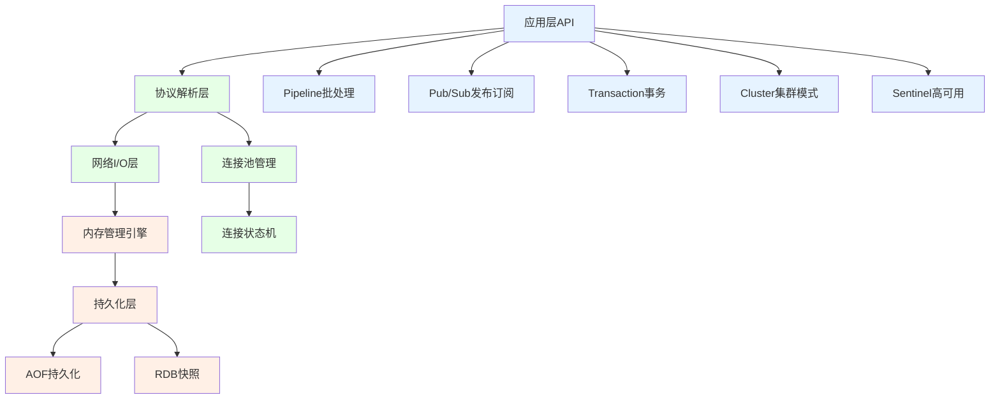
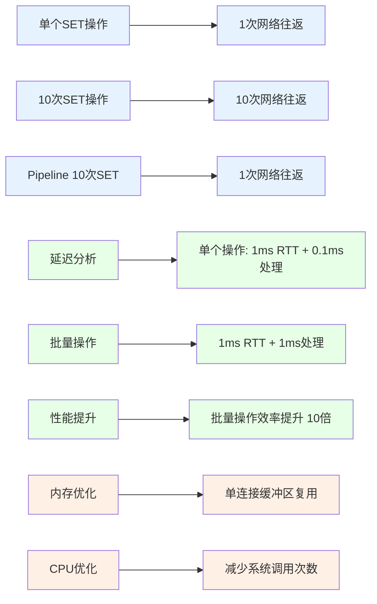
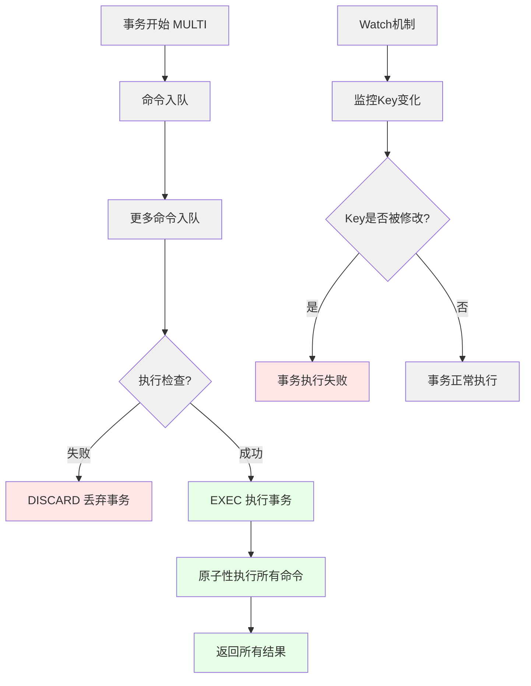
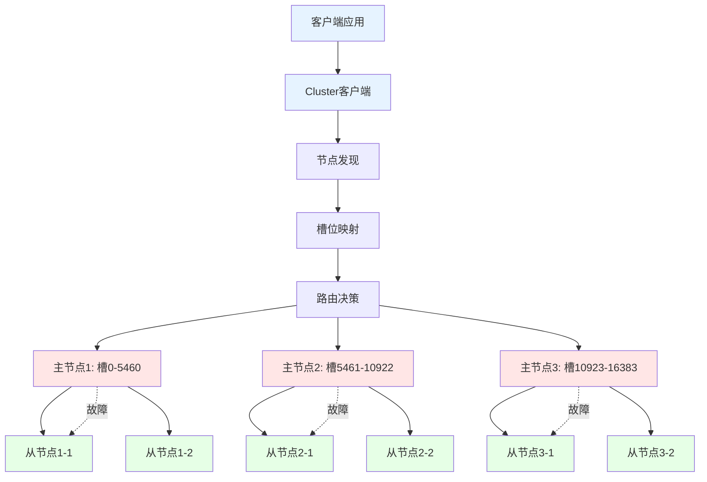
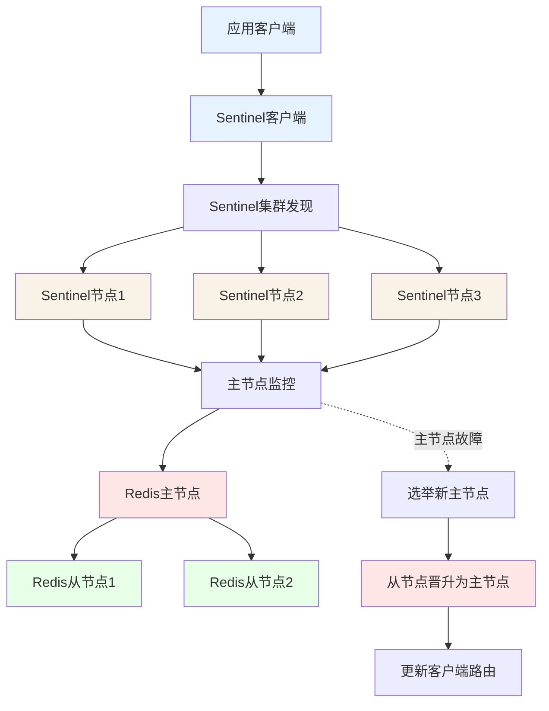
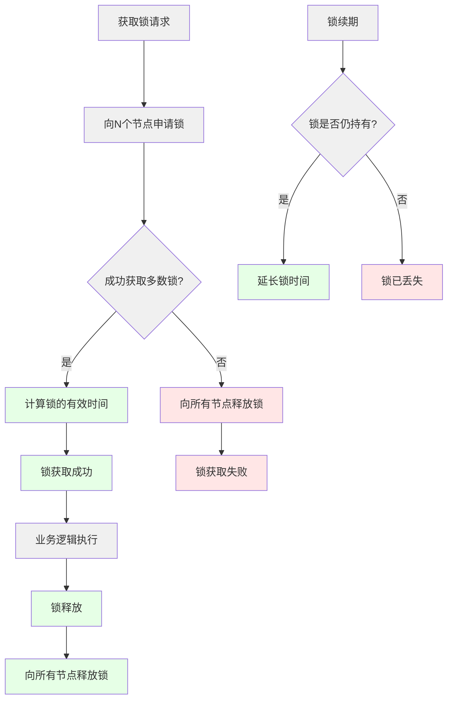
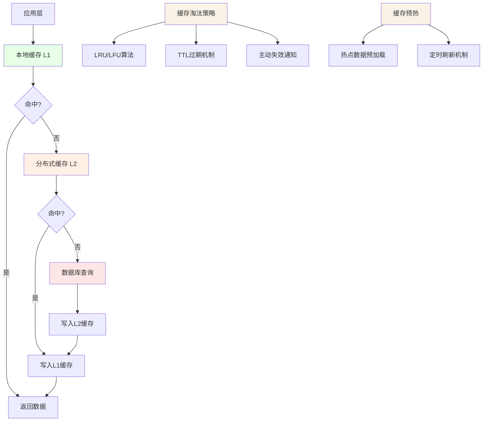
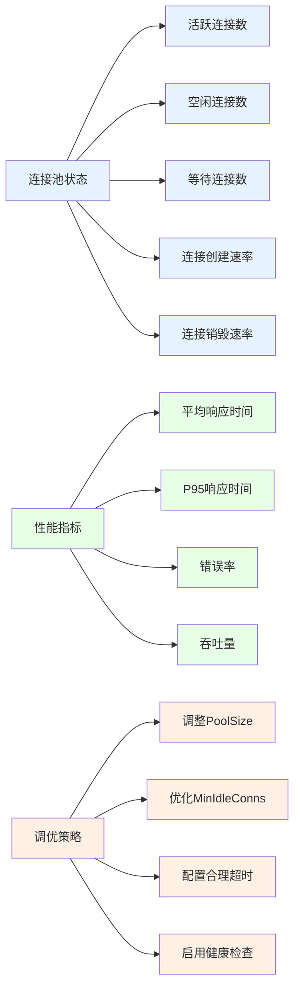

# Golang操作Redis深度解析：从基础驱动到企业级架构

## 引言：为什么选择Golang与Redis的黄金组合？

在现代微服务架构中，Golang凭借其出色的并发性能和简洁的语法，Redis凭借其卓越的内存处理速度和丰富的数据结构，已成为构建高性能应用的首选组合。本文将从底层架构到企业级实践，深度解析Golang操作Redis的完整技术栈。

## 一、Redis核心架构与Go驱动的实现原理

### 1.1 Redis分层架构总览



### 1.2 Go-Redis驱动核心设计

Go-Redis驱动采用了高度优化的架构设计，确保在Golang环境中提供最佳的Redis访问性能：

```go
// 驱动核心架构
type Client struct {
    opt *Options
    
    // 连接池：线程安全的连接管理
    connPool *connPool
    
    // 命令处理器：协议编解码
    // 状态管理器：连接健康检查
    // 错误处理器：重试机制
    
    // 集群支持：分布式拓扑发现
    // 哨兵支持：自动故障转移
    // Pipeline优化：批量操作
}

// 连接池内部实现
type connPool struct {
    opt *Options
    
    // 连接复用器
    reuse chan *conn
    
    // 健康检查器
    checkConn func(*conn) error
    
    // 统计指标
    stats *poolStats
    
    // 状态锁
    mu sync.RWMutex
}
```

## 二、数据操作：深入理解Redis数据结构的最佳实践

### 2.1 String类型：不仅仅是字符串

**基本操作示例：**

```go
// 高性能字符串操作
type CacheService struct {
    client *redis.Client
    
    // 带过期时间的缓存
    func (s *CacheService) SetWithExpire(key string, value interface{}, expire time.Duration) error {
        return s.client.Set(context.Background(), key, value, expire).Err()
    }
    
    // 原子性操作：自增/自减
    func (s *CacheService) AtomicIncr(key string) (int64, error) {
        return s.client.Incr(context.Background(), key).Result()
    }
    
    // 位操作：适用于海量标识存储
    func (s *CacheService) SetBit(key string, offset int64, value int) error {
        return s.client.SetBit(context.Background(), key, offset, value).Err()
    }
    
    // 批量操作：减少网络开销
    func (s *CacheService) MSet(pairs map[string]interface{}) error {
        return s.client.MSet(context.Background(), pairs).Err()
    }
}
```

**性能优化策略：**

- **批量操作优化**：使用MSET替代多个SET减少网络往返
- **内存优化**：对于数值型数据，使用Redis原生数值类型存储
- **过期策略**：合理设置TTL避免内存泄漏

### 2.2 Hash类型：结构化数据的最佳选择

```go
// Hash操作最佳实践
type UserSessionService struct {
    client *redis.Client
    
    // 用户会话存储：使用Hash避免序列化开销
    func (s *UserSessionService) SaveSession(session *UserSession) error {
        fields := map[string]interface{}{
            "user_id":    session.UserID,
            "username":   session.Username,
            "login_time": session.LoginTime.Unix(),
            "expires_in": session.ExpiresIn,
            "metadata":   session.Metadata,
        }
        
        return s.client.HSet(context.Background(), 
            fmt.Sprintf("session:%s", session.SessionID), 
            fields).Err()
    }
    
    // 增量更新：只修改需要变更的字段
    func (s *UserSessionService) UpdateSessionMeta(sessionID string, meta map[string]interface{}) error {
        return s.client.HSet(context.Background(), 
            fmt.Sprintf("session:%s", sessionID), meta).Err()
    }
    
    // 部分读取：避免传输整个对象
    func (s *UserSessionService) GetSessionFields(sessionID string, fields ...string) (map[string]string, error) {
        return s.client.HMGet(context.Background(), 
            fmt.Sprintf("session:%s", sessionID), fields...).Result()
    }
}
```

### 2.3 List与Set：队列与集合的高级应用

**消息队列实现：**

```go
// 基于List的消息队列
type RedisQueue struct {
    client *redis.Client
    queueName string
    
    // 生产者：LPUSH添加消息
    func (q *RedisQueue) Produce(message []byte) error {
        return q.client.LPush(context.Background(), q.queueName, message).Err()
    }
    
    // 消费者：BRPOP阻塞消费
    func (q *RedisQueue) Consume(timeout time.Duration) ([]byte, error) {
        result, err := q.client.BRPop(context.Background(), timeout, q.queueName).Result()
        if err != nil {
            return nil, err
        }
        
        if len(result) >= 2 {
            return []byte(result[1]), nil
        }
        
        return nil, fmt.Errorf("invalid queue result")
    }
    
    // 延迟队列实现：使用ZSet + 定时轮询
    func (q *RedisQueue) ProduceDelayed(message []byte, delay time.Duration) error {
        deliverTime := time.Now().Add(delay).Unix()
        
        return q.client.ZAdd(context.Background(), 
            fmt.Sprintf("%s:delayed", q.queueName), 
            redis.Z{
                Score:  float64(deliverTime),
                Member: message,
            }).Err()
    }
}
```

**Set操作应用场景：**

```go
// 基于Set的社交关系系统
type SocialGraphService struct {
    client *redis.Client
    
    // 关注关系：使用Set存储
    func (s *SocialGraphService) Follow(userID, targetID string) error {
        // 添加关注关系
        followerKey := fmt.Sprintf("user:%s:following", userID)
        followingKey := fmt.Sprintf("user:%s:followers", targetID)
        
        pipe := s.client.Pipeline()
        pipe.SAdd(context.Background(), followerKey, targetID)
        pipe.SAdd(context.Background(), followingKey, userID)
        
        _, err := pipe.Exec(context.Background())
        return err
    }
    
    // 共同关注计算
    func (s *SocialGraphService) GetMutualFollowing(user1, user2 string) ([]string, error) {
        key1 := fmt.Sprintf("user:%s:following", user1)
        key2 := fmt.Sprintf("user:%s:following", user2)
        
        return s.client.SInter(context.Background(), key1, key2).Result()
    }
    
    // 推荐系统：基于交集和差集
    func (s *SocialGraphService) GetRecommendations(userID string, limit int) ([]string, error) {
        userFollowingKey := fmt.Sprintf("user:%s:following", userID)
        
        // 获取二级关系：关注的人关注的人
        following, err := s.client.SMembers(context.Background(), userFollowingKey).Result()
        if err != nil {
            return nil, err
        }
        
        var keys []string
        for _, fid := range following {
            keys = append(keys, fmt.Sprintf("user:%s:following", fid))
        }
        
        // 计算并集，然后排除已关注的人
        if len(keys) > 0 {
            unionKey := fmt.Sprintf("temp:union:%s", userID)
            
            pipe := s.client.Pipeline()
            pipe.SUnionStore(context.Background(), unionKey, keys...)
            pipe.SDiff(context.Background(), unionKey, userFollowingKey)
            pipe.Del(context.Background(), unionKey)
            
            results, err := pipe.Exec(context.Background())
            if err != nil {
                return nil, err
            }
            
            if diffCmd, ok := results[1].(*redis.StringSliceCmd); ok {
                recommendations := diffCmd.Val()
                if len(recommendations) > limit {
                    return recommendations[:limit], nil
                }
                return recommendations, nil
            }
        }
        
        return []string{}, nil
    }
}
```

## 三、性能优化：连接池与Pipeline深度解析

### 3.1 高性能连接池设计

```go
// 自定义连接池配置
type OptimizedRedisClient struct {
    client *redis.Client
    
    // 连接池统计
    stats *ConnectionStats
    
    func NewOptimizedClient() (*OptimizedRedisClient, error) {
        // 基于CPU核心数的优化配置
        poolSize := runtime.NumCPU() * 2
        
        client := redis.NewClient(&redis.Options{
            Addr:     "localhost:6379",
            Password: "",
            DB:       0,
            
            // 连接池优化配置
            PoolSize:     poolSize,           // 基于CPU核心数
            MinIdleConns: poolSize / 2,       // 最小空闲连接
            MaxRetries:   3,                  // 最大重试次数
            
            // 超时配置
            DialTimeout:  5 * time.Second,
            ReadTimeout:  3 * time.Second,
            WriteTimeout: 3 * time.Second,
            PoolTimeout:  4 * time.Second,
            
            // 连接生命周期
            IdleTimeout:  5 * time.Minute,
            MaxConnAge:   30 * time.Minute,
            
            // 健康检查
            OnConnect: func(ctx context.Context, cn *redis.Conn) error {
                log.Printf("Redis连接建立: %v", cn)
                return nil
            },
        })
        
        // 验证连接
        if err := client.Ping(context.Background()).Err(); err != nil {
            return nil, fmt.Errorf("Redis连接失败: %w", err)
        }
        
        return &OptimizedRedisClient{
            client: client,
            stats:  &ConnectionStats{},
        }, nil
    }
}

// 连接池状态监控
type ConnectionStats struct {
    TotalConns    int64
    IdleConns     int64
    StaleConns    int64
    Hits          int64
    Misses        int64
    Timeouts      int64
    
    mu sync.RWMutex
}

func (s *ConnectionStats) RecordHit() {
    atomic.AddInt64(&s.Hits, 1)
}

func (s *ConnectionStats) RecordMiss() {
    atomic.AddInt64(&s.Misses, 1)
}
```

### 3.2 Pipeline批量操作优化

**Pipeline性能对比分析：**



**Pipeline最佳实践代码：**

```go
// 高性能批量操作
type BatchOperator struct {
    client *redis.Client
    
    // 批量设置缓存
    func (b *BatchOperator) BatchSet(cacheItems []CacheItem) error {
        pipe := b.client.Pipeline()
        
        for _, item := range cacheItems {
            pipe.Set(context.Background(), item.Key, item.Value, item.Expire)
        }
        
        _, err := pipe.Exec(context.Background())
        return err
    }
    
    // 批量获取：减少网络往返
    func (b *BatchOperator) BatchGet(keys []string) (map[string]string, error) {
        pipe := b.client.Pipeline()
        
        cmds := make([]*redis.StringCmd, len(keys))
        for i, key := range keys {
            cmds[i] = pipe.Get(context.Background(), key)
        }
        
        _, err := pipe.Exec(context.Background())
        if err != nil && err != redis.Nil {
            return nil, err
        }
        
        results := make(map[string]string)
        for i, cmd := range cmds {
            if val, err := cmd.Result(); err == nil {
                results[keys[i]] = val
            }
        }
        
        return results, nil
    }
    
    // 混合操作Pipeline
    func (b *BatchOperator) ComplexOperation(ops []Operation) error {
        pipe := b.client.Pipeline()
        
        for _, op := range ops {
            switch op.Type {
            case OperationSet:
                pipe.Set(context.Background(), op.Key, op.Value, op.Expire)
            case OperationIncr:
                pipe.Incr(context.Background(), op.Key)
            case OperationHSet:
                pipe.HSet(context.Background(), op.Key, op.Field, op.Value)
            case OperationDel:
                pipe.Del(context.Background(), op.Key)
            }
        }
        
        _, err := pipe.Exec(context.Background())
        return err
    }
}

// 智能Pipeline：自适应批处理大小
type SmartPipeline struct {
    client      *redis.Client
    maxBatchSize int
    
    // 批量操作队列
    batchQueue []PipelineOperation
    
    func (s *SmartPipeline) AddOperation(op PipelineOperation) error {
        s.batchQueue = append(s.batchQueue, op)
        
        // 达到阈值时自动执行
        if len(s.batchQueue) >= s.maxBatchSize {
            return s.Flush()
        }
        
        return nil
    }
    
    func (s *SmartPipeline) Flush() error {
        if len(s.batchQueue) == 0 {
            return nil
        }
        
        pipe := s.client.Pipeline()
        
        for _, op := range s.batchQueue {
            op.Execute(pipe)
        }
        
        _, err := pipe.Exec(context.Background())
        
        // 清空队列
        s.batchQueue = s.batchQueue[:0]
        
        return err
    }
}
```

## 四、高级特性：事务、Lua脚本与发布订阅

### 4.1 Redis事务深度解析

**事务执行流程图：**



**事务实现代码：**

```go
// Redis事务封装
type RedisTransaction struct {
    client *redis.Client
    
    // 乐观锁事务：基于Watch
    func (t *RedisTransaction) OptimisticTransfer(fromAccount, toAccount string, amount int) error {
        // 重试机制
        for retries := 0; retries < 3; retries++ {
            err := t.client.Watch(context.Background(), func(tx *redis.Tx) error {
                // 获取当前余额
                fromBalance, err := tx.Get(context.Background(), fromAccount).Int()
                if err != nil && err != redis.Nil {
                    return err
                }
                
                toBalance, err := tx.Get(context.Background(), toAccount).Int()
                if err != nil && err != redis.Nil {
                    return err
                }
                
                // 检查余额是否充足
                if fromBalance < amount {
                    return fmt.Errorf("余额不足")
                }
                
                // 执行转账事务
                _, err = tx.TxPipelined(context.Background(), func(pipe redis.Pipeliner) error {
                    pipe.Set(context.Background(), fromAccount, fromBalance-amount, 0)
                    pipe.Set(context.Background(), toAccount, toBalance+amount, 0)
                    return nil
                })
                
                return err
            }, fromAccount, toAccount)
            
            if err == nil {
                // 事务成功
                return nil
            }
            
            if err == redis.TxFailedErr {
                // 乐观锁冲突，重试
                continue
            }
            
            // 其他错误
            return err
        }
        
        return fmt.Errorf("转账失败，重试次数已用完")
    }
    
    // 批量事务操作
    func (t *RedisTransaction) BatchTransaction(operations []TxOperation) error {
        _, err := t.client.TxPipelined(context.Background(), func(pipe redis.Pipeliner) error {
            for _, op := range operations {
                switch op.Type {
                case OpSet:
                    pipe.Set(context.Background(), op.Key, op.Value, op.Expire)
                case OpIncr:
                    pipe.Incr(context.Background(), op.Key)
                case OpHSet:
                    pipe.HSet(context.Background(), op.Key, op.Field, op.Value)
                case OpDel:
                    pipe.Del(context.Background(), op.Key)
                }
            }
            return nil
        })
        
        return err
    }
}
```

### 4.2 Lua脚本：原子性与性能的完美平衡

**Lua脚本的优势：**

- **原子性保证**：脚本执行期间不会被其他命令打断
- **减少网络开销**：复杂逻辑在服务器端执行
- **性能优化**：避免多次网络往返
- **事务简化**：比MULTI/EXEC更简洁

**Lua脚本实现示例：**

```go
// Lua脚本管理器
type LuaScriptManager struct {
    client *redis.Client
    scripts map[string]*redis.Script
    
    func NewLuaScriptManager(client *redis.Client) *LuaScriptManager {
        return &LuaScriptManager{
            client:  client,
            scripts: make(map[string]*redis.Script),
        }
    }
    
    // 注册Lua脚本
    func (m *LuaScriptManager) RegisterScript(name, script string) {
        m.scripts[name] = redis.NewScript(script)
    }
    
    // 速率限制脚本
    func (m *LuaScriptManager) RateLimitScript() string {
        return `
local key = KEYS[1]
local limit = tonumber(ARGV[1])
local window = tonumber(ARGV[2])
local current = redis.call('TIME')[1]

-- 清除过期计数器
redis.call('ZREMRANGEBYSCORE', key, 0, current - window)

-- 获取当前计数
local count = redis.call('ZCARD', key)

if count < limit then
    -- 添加新记录
    redis.call('ZADD', key, current, current)
    redis.call('EXPIRE', key, window)
    return 1  -- 允许访问
else
    return 0  -- 拒绝访问
end
`
    }
    
    // 分布式锁脚本
    func (m *LuaScriptManager) DistributedLockScript() string {
        return `
local key = KEYS[1]
local value = ARGV[1]
local ttl = tonumber(ARGV[2])

-- 尝试获取锁
local result = redis.call('SET', key, value, 'NX', 'PX', ttl)

if result then
    return 1  -- 获取锁成功
else
    -- 检查是否是当前持有者（用于锁续期）
    local current = redis.call('GET', key)
    if current == value then
        redis.call('PEXPIRE', key, ttl)
        return 1  -- 续期成功
    else
        return 0  -- 获取锁失败
    end
end
`
    }
    
    // 执行Lua脚本
    func (m *LuaScriptManager) ExecuteScript(name string, keys []string, args ...interface{}) (interface{}, error) {
        script, exists := m.scripts[name]
        if !exists {
            return nil, fmt.Errorf("script %s not found", name)
        }
        
        return script.Run(context.Background(), m.client, keys, args...).Result()
    }
}

// Lua脚本应用：分布式限流器
type DistributedRateLimiter struct {
    client  *redis.Client
    script  *redis.Script
    
    func NewDistributedRateLimiter(client *redis.Client) *DistributedRateLimiter {
        script := redis.NewScript(`
local key = KEYS[1]
local limit = tonumber(ARGV[1])
local window = tonumber(ARGV[2])
local current = redis.call('TIME')[1]

redis.call('ZREMRANGEBYSCORE', key, 0, current - window)
local count = redis.call('ZCARD', key)

if count < limit then
    redis.call('ZADD', key, current, current)
    redis.call('EXPIRE', key, window)
    return 1
else
    return 0
end
`)
        
        return &DistributedRateLimiter{
            client: client,
            script: script,
        }
    }
    
    func (l *DistributedRateLimiter) Allow(key string, limit int, window time.Duration) (bool, error) {
        result, err := l.script.Run(context.Background(), l.client, 
            []string{key}, limit, int(window.Seconds())).Int()
        
        if err != nil {
            return false, err
        }
        
        return result == 1, nil
    }
}
```

## 五、集群与高可用：生产环境部署架构

### 5.1 Redis Cluster深度解析

**Cluster架构图：**



**Cluster客户端配置：**

```go
// Redis Cluster客户端
type ClusterManager struct {
    clusterClient *redis.ClusterClient
    
    func NewClusterManager(addrs []string) (*ClusterManager, error) {
        clusterClient := redis.NewClusterClient(&redis.ClusterOptions{
            Addrs: addrs,
            
            // 集群特定配置
            MaxRedirects: 8,              // 最大重定向次数
            ReadOnly:     false,          // 是否允许读从节点
            RouteByLatency: false,        // 是否按延迟路由
            RouteRandomly: false,         // 是否随机路由
            
            // 连接池配置
            PoolSize:     100,
            MinIdleConns: 10,
            
            // 超时配置
            DialTimeout:  5 * time.Second,
            ReadTimeout:  3 * time.Second,
            WriteTimeout: 3 * time.Second,
            
            // 集群事件处理
            ClusterSlots: func(ctx context.Context) ([]redis.ClusterSlot, error) {
                // 自定义槽位发现逻辑
                return nil, nil
            },
        })
        
        // 验证集群状态
        if err := clusterClient.Ping(context.Background()).Err(); err != nil {
            return nil, fmt.Errorf("集群连接失败: %w", err)
        }
        
        return &ClusterManager{
            clusterClient: clusterClient,
        }, nil
    }
    
    // 跨槽位操作处理
    func (m *ClusterManager) MultiSlotOperation(operations []ClusterOperation) error {
        // 按槽位分组操作
        slotGroups := make(map[int][]ClusterOperation)
        
        for _, op := range operations {
            slot := m.getSlot(op.Key)
            slotGroups[slot] = append(slotGroups[slot], op)
        }
        
        // 为每个槽位执行操作
        var wg sync.WaitGroup
        errCh := make(chan error, len(slotGroups))
        
        for slot, ops := range slotGroups {
            wg.Add(1)
            
            go func(slot int, operations []ClusterOperation) {
                defer wg.Done()
                
                if err := m.executeSlotOperations(slot, operations); err != nil {
                    errCh <- fmt.Errorf("slot %d: %w", slot, err)
                }
            }(slot, ops)
        }
        
        wg.Wait()
        close(errCh)
        
        // 收集错误
        var errors []string
        for err := range errCh {
            errors = append(errors, err.Error())
        }
        
        if len(errors) > 0 {
            return fmt.Errorf("跨槽位操作失败: %s", strings.Join(errors, "; "))
        }
        
        return nil
    }
    
    // 计算Key对应的槽位
    func (m *ClusterManager) getSlot(key string) int {
        // Redis Cluster的槽位计算算法
        const CLUSTER_SLOTS = 16384
        
        // 提取Key中的{}部分
        start := strings.Index(key, "{")
        if start != -1 {
            end := strings.Index(key[start+1:], "}")
            if end != -1 {
                key = key[start+1 : start+1+end]
            }
        }
        
        // CRC16算法计算槽位
        return int(crc16.Checksum([]byte(key))) % CLUSTER_SLOTS
    }
}
```

### 5.2 Sentinel高可用架构

**Sentinel部署架构：**



**Sentinel客户端实现：**

```go
// Sentinel高可用客户端
type SentinelManager struct {
    failoverClient *redis.FailoverClient
    sentinelAddrs  []string
    masterName     string
    
    func NewSentinelManager(sentinelAddrs []string, masterName string) (*SentinelManager, error) {
        failoverClient := redis.NewFailoverClient(&redis.FailoverOptions{
            MasterName:    masterName,
            SentinelAddrs: sentinelAddrs,
            
            // 连接配置
            DialTimeout:  5 * time.Second,
            ReadTimeout:  3 * time.Second,
            WriteTimeout: 3 * time.Second,
            
            // 连接池配置
            PoolSize:     50,
            MinIdleConns: 5,
            
            // Sentinel特定配置
            SentinelPassword: "",
            
            // 故障转移回调
            OnFailover: func(ctx context.Context) {
                log.Printf("检测到故障转移，正在重新连接")
            },
            
            OnNewMaster: func(ctx context.Context, name string, client *redis.Client) {
                log.Printf("连接到新的主节点: %s", name)
            },
        })
        
        // 验证连接
        if err := failoverClient.Ping(context.Background()).Err(); err != nil {
            return nil, fmt.Errorf("Sentinel连接失败: %w", err)
        }
        
        return &SentinelManager{
            failoverClient: failoverClient,
            sentinelAddrs:  sentinelAddrs,
            masterName:     masterName,
        }, nil
    }
    
    // 获取Sentinel状态信息
    func (m *SentinelManager) GetSentinelInfo() (*SentinelInfo, error) {
        info := &SentinelInfo{}
        
        for _, addr := range m.sentinelAddrs {
            client := redis.NewClient(&redis.Options{
                Addr: addr,
            })
            
            // 获取Sentinel监控的主节点信息
            masters, err := client.SentinelMasters(context.Background()).Result()
            if err != nil {
                client.Close()
                continue
            }
            
            for _, master := range masters {
                if master["name"].(string) == m.masterName {
                    info.MasterName = master["name"].(string)
                    info.MasterIP = master["ip"].(string)
                    info.MasterPort = master["port"].(string)
                    info.NumSlaves = master["num-slaves"].(string)
                    break
                }
            }
            
            client.Close()
        }
        
        return info, nil
    }
    
    // 手动触发故障转移（用于测试）
    func (m *SentinelManager) ManualFailover() error {
        for _, addr := range m.sentinelAddrs {
            client := redis.NewClient(&redis.Options{
                Addr: addr,
            })
            
            // 执行故障转移命令
            err := client.SentinelFailover(context.Background(), m.masterName).Err()
            client.Close()
            
            if err == nil {
                log.Printf("在Sentinel %s 上成功触发故障转移", addr)
                return nil
            }
        }
        
        return fmt.Errorf("在所有Sentinel节点上触发故障转移失败")
    }
}
```

## 六、企业级应用：分布式锁与缓存架构

### 6.1 分布式锁深度实现

**RedLock算法流程图：**



**分布式锁实现：**

```go
// 基于RedLock的分布式锁
type DistributedLock struct {
    mutex      *redsync.Mutex
    lockName   string
    
    // 锁状态
    isHeld     bool
    heldUntil  time.Time
    
    mu sync.RWMutex
    
    func NewDistributedLock(redisPools []redsync.Pool, lockName string, ttl time.Duration) *DistributedLock {
        rs := redsync.New(redisPools)
        
        mutex := rs.NewMutex(lockName,
            redsync.WithExpiry(ttl),
            redsync.WithTries(3),
            redsync.WithRetryDelay(500*time.Millisecond),
            redsync.WithDriftFactor(0.01),
        )
        
        return &DistributedLock{
            mutex:    mutex,
            lockName: lockName,
        }
    }
    
    // 获取锁
    func (dl *DistributedLock) Acquire(ctx context.Context) error {
        dl.mu.Lock()
        defer dl.mu.Unlock()
        
        if dl.isHeld {
            return fmt.Errorf("锁已被持有")
        }
        
        if err := dl.mutex.LockContext(ctx); err != nil {
            return fmt.Errorf("获取锁失败: %w", err)
        }
        
        dl.isHeld = true
        dl.heldUntil = time.Now().Add(dl.mutex.Options().Expiry)
        
        // 启动锁续期协程
        go dl.startRefresh()
        
        return nil
    }
    
    // 释放锁
    func (dl *DistributedLock) Release() error {
        dl.mu.Lock()
        defer dl.mu.Unlock()
        
        if !dl.isHeld {
            return fmt.Errorf("锁未被持有")
        }
        
        if _, err := dl.mutex.Unlock(); err != nil {
            return fmt.Errorf("释放锁失败: %w", err)
        }
        
        dl.isHeld = false
        dl.heldUntil = time.Time{}
        
        return nil
    }
    
    // 锁续期
    func (dl *DistributedLock) startRefresh() {
        refreshInterval := dl.mutex.Options().Expiry / 3
        ticker := time.NewTicker(refreshInterval)
        defer ticker.Stop()
        
        for range ticker.C {
            dl.mu.RLock()
            if !dl.isHeld {
                dl.mu.RUnlock()
                return
            }
            dl.mu.RUnlock()
            
            // 续期锁
            if ok, err := dl.mutex.Extend(); err != nil || !ok {
                log.Printf("锁续期失败: %v", err)
                return
            }
            
            dl.mu.Lock()
            dl.heldUntil = time.Now().Add(dl.mutex.Options().Expiry)
            dl.mu.Unlock()
        }
    }
    
    // 尝试获取锁（非阻塞）
    func (dl *DistributedLock) TryAcquire(ctx context.Context, timeout time.Duration) error {
        ctx, cancel := context.WithTimeout(ctx, timeout)
        defer cancel()
        
        return dl.Acquire(ctx)
    }
}

// 锁管理器：管理多个分布式锁
type LockManager struct {
    redisPools []redsync.Pool
    locks      map[string]*DistributedLock
    
    mu sync.RWMutex
    
    func NewLockManager(redisPools []redsync.Pool) *LockManager {
        return &LockManager{
            redisPools: redisPools,
            locks:      make(map[string]*DistributedLock),
        }
    }
    
    // 获取指定名称的锁
    func (lm *LockManager) GetLock(lockName string, ttl time.Duration) *DistributedLock {
        lm.mu.Lock()
        defer lm.mu.Unlock()
        
        if lock, exists := lm.locks[lockName]; exists {
            return lock
        }
        
        lock := NewDistributedLock(lm.redisPools, lockName, ttl)
        lm.locks[lockName] = lock
        
        return lock
    }
    
    // 批量获取锁（避免死锁）
    func (lm *LockManager) AcquireLocks(ctx context.Context, lockNames []string, ttl time.Duration) error {
        // 按名称排序，避免死锁
        sortedNames := make([]string, len(lockNames))
        copy(sortedNames, lockNames)
        sort.Strings(sortedNames)
        
        acquiredLocks := make([]*DistributedLock, 0, len(sortedNames))
        
        // 依次获取锁
        for _, name := range sortedNames {
            lock := lm.GetLock(name, ttl)
            
            if err := lock.Acquire(ctx); err != nil {
                // 获取失败，释放已获取的锁
                lm.releaseLocks(acquiredLocks)
                return fmt.Errorf("获取锁 %s 失败: %w", name, err)
            }
            
            acquiredLocks = append(acquiredLocks, lock)
        }
        
        return nil
    }
    
    // 批量释放锁
    func (lm *LockManager) releaseLocks(locks []*DistributedLock) {
        var errors []string
        
        for _, lock := range locks {
            if err := lock.Release(); err != nil {
                errors = append(errors, err.Error())
            }
        }
        
        if len(errors) > 0 {
            log.Printf("批量释放锁时发生错误: %s", strings.Join(errors, "; "))
        }
    }
}
```

### 6.2 多层缓存架构设计

**缓存架构层次图：**



**多层缓存实现：**

```go
// 多层缓存管理器
type MultiLevelCache struct {
    localCache  LocalCache        // L1: 本地缓存
    redisCache  *redis.Client     // L2: Redis分布式缓存
    
    // 统计指标
    stats       *CacheStats
    
    // 配置
    config      CacheConfig
    
    mu sync.RWMutex
}

type CacheStats struct {
    L1Hits      int64
    L1Misses    int64
    L2Hits      int64
    L2Misses    int64
    DBQueries   int64
    
    TotalTime   time.Duration
}

func (mlc *MultiLevelCache) Get(key string) (interface{}, error) {
    start := time.Now()
    defer func() {
        mlc.stats.TotalTime += time.Since(start)
    }()
    
    // 1. 尝试从L1缓存获取
    if value, found := mlc.localCache.Get(key); found {
        atomic.AddInt64(&mlc.stats.L1Hits, 1)
        return value, nil
    }
    atomic.AddInt64(&mlc.stats.L1Misses, 1)
    
    // 2. 尝试从L2缓存获取
    value, err := mlc.redisCache.Get(context.Background(), key).Result()
    if err == nil {
        atomic.AddInt64(&mlc.stats.L2Hits, 1)
        
        // 回写到L1缓存
        mlc.localCache.Set(key, value, mlc.config.L1TTL)
        
        return value, nil
    }
    
    if err != redis.Nil {
        return nil, err
    }
    
    atomic.AddInt64(&mlc.stats.L2Misses, 1)
    atomic.AddInt64(&mlc.stats.DBQueries, 1)
    
    // 3. 从数据库获取
    dbValue, err := mlc.loadFromDB(key)
    if err != nil {
        return nil, err
    }
    
    // 4. 写入两级缓存
    mlc.localCache.Set(key, dbValue, mlc.config.L1TTL)
    
    if err := mlc.redisCache.Set(context.Background(), key, dbValue, mlc.config.L2TTL).Err(); err != nil {
        log.Printf("写入Redis缓存失败: %v", err)
    }
    
    return dbValue, nil
}

// 批量获取优化
func (mlc *MultiLevelCache) MGet(keys []string) (map[string]interface{}, error) {
    results := make(map[string]interface{})
    missingKeys := make([]string, 0, len(keys))
    
    // 1. 从L1缓存批量获取
    for _, key := range keys {
        if value, found := mlc.localCache.Get(key); found {
            results[key] = value
            atomic.AddInt64(&mlc.stats.L1Hits, 1)
        } else {
            missingKeys = append(missingKeys, key)
            atomic.AddInt64(&mlc.stats.L1Misses, 1)
        }
    }
    
    if len(missingKeys) == 0 {
        return results, nil
    }
    
    // 2. 从L2缓存批量获取
    l2Results, err := mlc.redisCache.MGet(context.Background(), missingKeys...).Result()
    if err != nil {
        return nil, err
    }
    
    dbQueryKeys := make([]string, 0, len(missingKeys))
    
    for i, key := range missingKeys {
        if l2Results[i] != nil {
            results[key] = l2Results[i]
            atomic.AddInt64(&mlc.stats.L2Hits, 1)
            
            // 回写到L1缓存
            mlc.localCache.Set(key, l2Results[i], mlc.config.L1TTL)
        } else {
            dbQueryKeys = append(dbQueryKeys, key)
            atomic.AddInt64(&mlc.stats.L2Misses, 1)
        }
    }
    
    if len(dbQueryKeys) > 0 {
        // 3. 从数据库批量获取
        dbResults, err := mlc.batchLoadFromDB(dbQueryKeys)
        if err != nil {
            return nil, err
        }
        
        atomic.AddInt64(&mlc.stats.DBQueries, int64(len(dbQueryKeys)))
        
        // 批量写入缓存
        mlc.batchSetToCache(dbResults)
        
        for key, value := range dbResults {
            results[key] = value
        }
    }
    
    return results, nil
}

// 缓存预热机制
func (mlc *MultiLevelCache) WarmUp(keys []string) error {
    // 分批预热，避免对数据库造成压力
    batchSize := 100
    
    for i := 0; i < len(keys); i += batchSize {
        end := i + batchSize
        if end > len(keys) {
            end = len(keys)
        }
        
        batch := keys[i:end]
        
        // 批量从数据库加载
        results, err := mlc.batchLoadFromDB(batch)
        if err != nil {
            return err
        }
        
        // 批量写入Redis
        if err := mlc.batchSetToRedis(results); err != nil {
            log.Printf("批量预热Redis失败: %v", err)
        }
        
        log.Printf("预热进度: %d/%d", end, len(keys))
        
        // 控制预热速度
        time.Sleep(100 * time.Millisecond)
    }
    
    return nil
}
```

## 七、监控、诊断与性能调优

### 7.1 全面监控指标体系

```go
// Redis监控指标收集器
type RedisMetricsCollector struct {
    client *redis.Client
    
    // Prometheus指标
    commandDuration *prometheus.HistogramVec
    commandCount    *prometheus.CounterVec
    connectionStats *prometheus.GaugeVec
    memoryUsage     prometheus.Gauge
    
    func (rmc *RedisMetricsCollector) Start() {
        ticker := time.NewTicker(30 * time.Second)
        go func() {
            for range ticker.C {
                rmc.collectMetrics()
            }
        }()
    }
    
    func (rmc *RedisMetricsCollector) collectMetrics() {
        ctx, cancel := context.WithTimeout(context.Background(), 5*time.Second)
        defer cancel()
        
        // 获取Redis信息
        info, err := rmc.client.Info(ctx).Result()
        if err != nil {
            log.Printf("获取Redis信息失败: %v", err)
            return
        }
        
        // 解析监控指标
        rmc.parseMetrics(info)
    }
    
    func (rmc *RedisMetricsCollector) parseMetrics(info string) {
        lines := strings.Split(info, "\r\n")
        
        for _, line := range lines {
            if strings.HasPrefix(line, "used_memory:") {
                memory, _ := strconv.ParseFloat(strings.Split(line, ":")[1], 64)
                rmc.memoryUsage.Set(memory)
            }
            
            // 解析更多指标...
        }
    }
}

// 性能诊断工具
type RedisDiagnoser struct {
    client *redis.Client
    
    func (rd *RedisDiagnoser) DiagnoseSlowQueries(threshold time.Duration) ([]SlowQuery, error) {
        // 获取慢查询日志
        slowLogs, err := rd.client.SlowLogGet(context.Background(), 100).Result()
        if err != nil {
            return nil, err
        }
        
        var slowQueries []SlowQuery
        
        for _, log := range slowLogs {
            if log.Duration > threshold {
                slowQueries = append(slowQueries, SlowQuery{
                    Command:   strings.Join(log.Args, " "),
                    Duration:  log.Duration,
                    Timestamp: log.Time,
                })
            }
        }
        
        return slowQueries, nil
    }
    
    func (rd *RedisDiagnoser) AnalyzeMemoryUsage() (*MemoryAnalysis, error) {
        info, err := rd.client.Info(context.Background(), "memory").Result()
        if err != nil {
            return nil, err
        }
        
        analysis := &MemoryAnalysis{}
        
        // 解析内存使用情况
        lines := strings.Split(info, "\r\n")
        for _, line := range lines {
            if strings.HasPrefix(line, "used_memory:") {
                analysis.UsedMemory, _ = strconv.ParseInt(strings.Split(line, ":")[1], 10, 64)
            } else if strings.HasPrefix(line, "used_memory_peak:") {
                analysis.PeakMemory, _ = strconv.ParseInt(strings.Split(line, ":")[1], 10, 64)
            } else if strings.HasPrefix(line, "mem_fragmentation_ratio:") {
                analysis.FragmentationRatio, _ = strconv.ParseFloat(strings.Split(line, ":")[1], 64)
            }
        }
        
        return analysis, nil
    }
}
```

### 7.2 连接池性能调优

**连接池状态监控图：**



**连接池调优代码：**

```go
// 动态连接池调优器
type DynamicPoolOptimizer struct {
    client *redis.Client
    
    // 性能指标收集
    metrics *PoolMetrics
    
    // 调优配置
    config PoolOptimizationConfig
    
    func (dpo *DynamicPoolOptimizer) Start() {
        ticker := time.NewTicker(dpo.config.CheckInterval)
        go func() {
            for range ticker.C {
                dpo.optimize()
            }
        }()
    }
    
    func (dpo *DynamicPoolOptimizer) optimize() {
        // 收集当前性能指标
        currentMetrics := dpo.collectMetrics()
        
        // 分析是否需要调整
        adjustments := dpo.analyzeAdjustments(currentMetrics)
        
        // 应用调整
        if err := dpo.applyAdjustments(adjustments); err != nil {
            log.Printf("应用连接池调整失败: %v", err)
        }
    }
    
    func (dpo *DynamicPoolOptimizer) analyzeAdjustments(metrics *PoolMetrics) *PoolAdjustments {
        adjustments := &PoolAdjustments{}
        
        // 分析活跃连接使用率
        activeUsage := float64(metrics.ActiveConns) / float64(metrics.PoolSize)
        
        if activeUsage > dpo.config.HighWatermark {
            // 连接池使用率过高，需要扩容
            adjustments.PoolSize = min(metrics.PoolSize*2, dpo.config.MaxPoolSize)
        } else if activeUsage < dpo.config.LowWatermark {
            // 连接池使用率过低，可以缩容
            adjustments.PoolSize = max(metrics.PoolSize/2, dpo.config.MinPoolSize)
        }
        
        // 分析等待队列长度
        if metrics.WaitCount > 0 && metrics.WaitDuration > dpo.config.MaxWaitThreshold {
            // 等待时间过长，需要优化
            adjustments.MinIdleConns = min(adjustments.PoolSize/2, dpo.config.MaxIdleConns)
        }
        
        return adjustments
    }
}
```

## 八、安全最佳实践与生产环境配置

### 8.1 安全配置指南

```go
// 安全Redis客户端配置
type SecureRedisConfig struct {
    // 网络安全
    EnableTLS      bool
    TLSCertFile    string
    TLSKeyFile     string
    TLSCAFile      string
    
    // 认证安全
    RequirePass    string
    RenameCommands map[string]string  // 重命名危险命令
    
    // 访问控制
    BindIP         []string           // 绑定IP限制
    ProtectedMode  bool               // 保护模式
    
    // 安全审计
    EnableSlowLog  bool
    SlowLogThreshold int64            // 慢查询阈值(微秒)
    
    func (src *SecureRedisConfig) ApplySecurity() error {
        // 应用TLS配置
        if src.EnableTLS {
            if err := src.configureTLS(); err != nil {
                return err
            }
        }
        
        // 应用认证配置
        if src.RequirePass != "" {
            if err := src.configureAuthentication(); err != nil {
                return err
            }
        }
        
        // 重命名危险命令
        if len(src.RenameCommands) > 0 {
            if err := src.renameDangerousCommands(); err != nil {
                return err
            }
        }
        
        return nil
    }
    
    func (src *SecureRedisConfig) configureTLS() error {
        // 加载TLS证书
        cert, err := tls.LoadX509KeyPair(src.TLSCertFile, src.TLSKeyFile)
        if err != nil {
            return fmt.Errorf("加载TLS证书失败: %w", err)
        }
        
        // 配置TLS
        tlsConfig := &tls.Config{
            Certificates: []tls.Certificate{cert},
            MinVersion:   tls.VersionTLS12,
        }
        
        // 如果有CA文件，配置客户端证书验证
        if src.TLSCAFile != "" {
            caCert, err := os.ReadFile(src.TLSCAFile)
            if err != nil {
                return fmt.Errorf("读取CA文件失败: %w", err)
            }
            
            caCertPool := x509.NewCertPool()
            caCertPool.AppendCertsFromPEM(caCert)
            
            tlsConfig.ClientCAs = caCertPool
            tlsConfig.ClientAuth = tls.RequireAndVerifyClientCert
        }
        
        return nil
    }
}
```

### 8.2 生产环境配置模板

```yaml
# redis-production-config.yaml

# 基本配置
redis:
  # 连接配置
  addr: "redis-cluster.example.com:6379"
  password: "${REDIS_PASSWORD}"
  db: 0
  
  # 连接池配置
  pool:
    size: 100
    min_idle_conns: 20
    max_retries: 3
    
  # 超时配置
  timeout:
    dial: "5s"
    read: "3s" 
    write: "3s"
    pool: "4s"
    
  # 连接生命周期
  lifecycle:
    idle_timeout: "5m"
    max_conn_age: "30m"

# 集群配置（如果使用集群模式）
cluster:
  enabled: true
  nodes:
    - "redis-node1:6379"
    - "redis-node2:6379"
    - "redis-node3:6379"
  
  # 集群特定配置
  max_redirects: 8
  read_only: false
  route_by_latency: false

# 监控配置
monitoring:
  # Prometheus指标
  enabled: true
  
  # 健康检查
  health_check:
    interval: "30s"
    timeout: "5s"
    
  # 性能监控
  performance:
    slow_query_threshold: "100ms"
    enable_slow_log: true

# 安全配置
security:
  # TLS配置
  tls:
    enabled: true
    cert_file: "/etc/redis/tls/redis.crt"
    key_file: "/etc/redis/tls/redis.key"
    ca_file: "/etc/redis/tls/ca.crt"
    
  # 访问控制
  acl:
    enabled: true
    users:
      - name: "app-user"
        password: "${APP_USER_PASSWORD}"
        categories:
          - "@write"
          - "@read"
          - "@fast"
```

1. **连接池优化**：基于CPU核心数动态配置连接池大小，实现智能连接管理
2. **数据模型设计**：合理选择数据结构，避免大Key和序列化开销
3. **批处理优化**：充分利用Pipeline减少网络往返，提升性能
4. **事务与原子性**：合理使用事务和Lua脚本保证操作原子性
5. **高可用架构**：根据业务需求选择Cluster或Sentinel模式
6. **监控与诊断**：建立完善的监控体系，及时发现性能瓶颈
