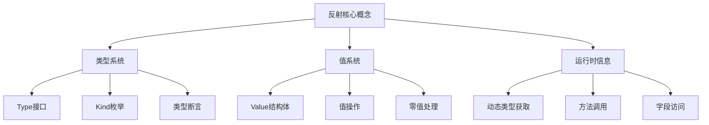
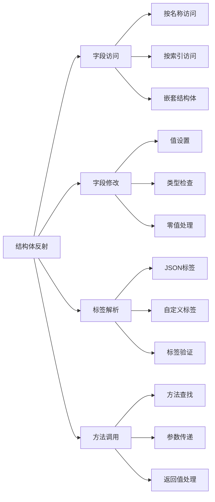
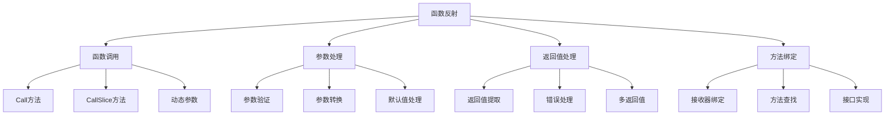
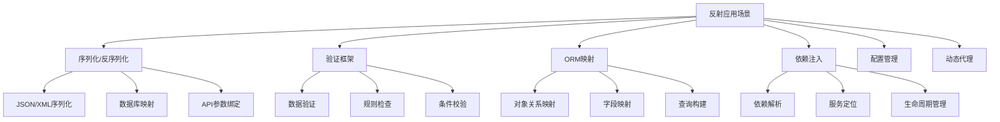

# Golang反射深度解析：从原理到高级应用

## 一、反射基础与核心概念

### 1.1 什么是反射？

反射（Reflection）是程序在运行时检查、修改自身结构和行为的能力。在Go语言中，反射通过`reflect`包实现，允许程序动态地操作任意类型的对象。



### 1.2 reflect包基础

Go语言的反射系统主要围绕两个核心类型：`reflect.Type`和`reflect.Value`。

```go
package reflection_basics

import (
    "fmt"
    "reflect"
)

// 基础反射示例
func BasicReflectionExamples() {
    var x int = 42
    var s string = "hello"
    var f float64 = 3.14
    
    // 获取值的反射信息
    fmt.Println("=== 基础类型反射 ===")
    inspectValue(x)
    inspectValue(s)
    inspectValue(f)
    
    // 获取类型的反射信息
    fmt.Println("\n=== 类型反射 ===")
    inspectType(x)
    inspectType(s)
    
    // 复杂类型示例
    fmt.Println("\n=== 复杂类型反射 ===")
    person := struct {
        Name string
        Age  int
    }{"Alice", 30}
    
    inspectValue(person)
}

func inspectValue(v interface{}) {
    // 获取值的反射对象
    value := reflect.ValueOf(v)
    
    fmt.Printf("值: %v\n", value.Interface())
    fmt.Printf("类型: %v\n", value.Type())
    fmt.Printf("种类: %v\n", value.Kind())
    fmt.Printf("可设置: %v\n", value.CanSet())
    fmt.Println("---")
}

func inspectType(v interface{}) {
    // 获取类型的反射对象
    typ := reflect.TypeOf(v)
    
    fmt.Printf("类型名称: %v\n", typ.Name())
    fmt.Printf("类型字符串: %v\n", typ.String())
    fmt.Printf("类型大小: %v 字节\n", typ.Size())
    fmt.Printf("类型对齐: %v\n", typ.Align())
    fmt.Printf("是否可比: %v\n", typ.Comparable())
    fmt.Println("---")
}

// Kind类型详解
func KindExamples() {
    values := []interface{}{
        int(42),           // reflect.Int
        int8(8),           // reflect.Int8
        uint(100),         // reflect.Uint
        "hello",           // reflect.String
        true,              // reflect.Bool
        []int{1, 2, 3},    // reflect.Slice
        map[string]int{},  // reflect.Map
        make(chan int),    // reflect.Chan
        func() {},         // reflect.Func
        struct{}{},        // reflect.Struct
    }
    
    fmt.Println("=== Kind类型示例 ===")
    for _, v := range values {
        kind := reflect.TypeOf(v).Kind()
        fmt.Printf("值: %v, Kind: %v\n", v, kind)
    }
}

// 零值和有效值检查
func ZeroValueExamples() {
    var zeroInt int
    var zeroString string
    var nilSlice []int
    var nilMap map[string]int
    
    fmt.Println("=== 零值检查 ===")
    
    checkZero(reflect.ValueOf(zeroInt))
    checkZero(reflect.ValueOf(zeroString))
    checkZero(reflect.ValueOf(nilSlice))
    checkZero(reflect.ValueOf(nilMap))
    
    // 有效值检查
    validSlice := []int{1, 2, 3}
    checkValid(reflect.ValueOf(validSlice))
    checkValid(reflect.ValueOf(nilSlice))
}

func checkZero(v reflect.Value) {
    fmt.Printf("值 %v 是零值: %v\n", v.Interface(), v.IsZero())
}

func checkValid(v reflect.Value) {
    fmt.Printf("值 %v 有效: %v\n", v.Interface(), v.IsValid())
}
```

### 1.3 值操作基础

反射的核心功能之一是动态操作值：

```go
package value_operations

import (
    "fmt"
    "reflect"
)

// 值设置和获取
func ValueSettingExamples() {
    // 可设置值的反射操作
    var x int = 10
    
    // 获取值的反射对象（不可设置）
    v1 := reflect.ValueOf(x)
    fmt.Printf("v1 可设置: %v\n", v1.CanSet()) // false
    
    // 获取指针的反射对象（可设置）
    v2 := reflect.ValueOf(&x).Elem()
    fmt.Printf("v2 可设置: %v\n", v2.CanSet()) // true
    
    // 通过反射修改值
    if v2.CanSet() {
        v2.SetInt(20)
        fmt.Printf("修改后的 x: %d\n", x) // 20
    }
    
    // 不同类型值的设置
    var s string = "hello"
    vs := reflect.ValueOf(&s).Elem()
    vs.SetString("world")
    fmt.Printf("修改后的 s: %s\n", s) // world
}

// 类型转换和断言
func TypeConversionExamples() {
    var x interface{} = int64(42)
    
    v := reflect.ValueOf(x)
    
    // 类型断言检查
    fmt.Printf("值可以转换为 int64: %v\n", v.CanInt())
    fmt.Printf("值可以转换为 float64: %v\n", v.CanFloat())
    
    // 安全转换
    if v.CanInt() {
        intValue := v.Int()
        fmt.Printf("整数值: %d\n", intValue)
    }
    
    // 接口值操作
    var y interface{} = "hello"
    vy := reflect.ValueOf(y)
    
    if vy.Kind() == reflect.String {
        stringValue := vy.String()
        fmt.Printf("字符串值: %s\n", stringValue)
    }
}

// 零值创建和初始化
func ZeroValueCreation() {
    // 创建类型的零值
    intType := reflect.TypeOf(0)
    stringType := reflect.TypeOf("")
    sliceType := reflect.TypeOf([]int{})
    
    intZero := reflect.Zero(intType)
    stringZero := reflect.Zero(stringType)
    sliceZero := reflect.Zero(sliceType)
    
    fmt.Printf("int零值: %v\n", intZero.Interface())
    fmt.Printf("string零值: %v\n", stringZero.Interface())
    fmt.Printf("slice零值: %v\n", sliceZero.Interface())
    fmt.Printf("slice零值是否为nil: %v\n", sliceZero.IsNil())
    
    // 创建新值（非零值）
    newInt := reflect.New(intType).Elem()
    newInt.SetInt(100)
    fmt.Printf("新int值: %v\n", newInt.Interface())
}

// 指针和间接引用
func PointerOperations() {
    x := 42
    ptr := &x
    
    v := reflect.ValueOf(ptr)
    fmt.Printf("指针类型: %v\n", v.Type()) // *int
    fmt.Printf("指针指向的值: %v\n", v.Elem().Interface()) // 42
    
    // 修改指针指向的值
    if v.Elem().CanSet() {
        v.Elem().SetInt(100)
        fmt.Printf("修改后 x: %d\n", x) // 100
    }
    
    // 创建新指针
    newPtr := reflect.New(reflect.TypeOf(0)) // *int
    newPtr.Elem().SetInt(200)
    fmt.Printf("新指针值: %v\n", newPtr.Elem().Interface()) // 200
}
```

## 二、结构体和字段操作

### 2.1 结构体反射基础



```go
package struct_reflection

import (
    "fmt"
    "reflect"
)

// 用户结构体定义
type User struct {
    ID        int    `json:"id" validate:"required,min=1"`
    Name      string `json:"name" validate:"required,min=2"`
    Email     string `json:"email,omitempty" validate:"email"`
    IsActive  bool   `json:"is_active"`
    createdAt string `json:"-"` // 私有字段
}

// 嵌套结构体
type Address struct {
    City    string `json:"city"`
    Country string `json:"country"`
}

type UserProfile struct {
    User    User    `json:"user"`
    Address Address `json:"address"`
}

func StructReflectionBasics() {
    user := User{
        ID:       1,
        Name:     "Alice",
        Email:    "alice@example.com",
        IsActive: true,
        createdAt: "2024-01-01",
    }
    
    // 获取结构体类型信息
    t := reflect.TypeOf(user)
    v := reflect.ValueOf(user)
    
    fmt.Println("=== 结构体基本信息 ===")
    fmt.Printf("结构体名称: %s\n", t.Name())
    fmt.Printf("结构体字段数: %d\n", t.NumField())
    fmt.Printf("结构体种类: %s\n", t.Kind())
    
    // 遍历结构体字段
    fmt.Println("\n=== 字段遍历 ===")
    for i := 0; i < t.NumField(); i++ {
        field := t.Field(i)
        fieldValue := v.Field(i)
        
        fmt.Printf("字段 %d: %s (%s) = %v", 
            i, field.Name, field.Type, fieldValue.Interface())
        
        // 检查字段是否可导出
        if field.PkgPath != "" {
            fmt.Printf(" [不可导出]")
        }
        fmt.Println()
        
        // 显示标签信息
        if tag := field.Tag; tag != "" {
            fmt.Printf("  标签: %s\n", tag)
            
            // 解析JSON标签
            if jsonTag := tag.Get("json"); jsonTag != "" {
                fmt.Printf("  JSON标签: %s\n", jsonTag)
            }
            
            // 解析验证标签
            if validateTag := tag.Get("validate"); validateTag != "" {
                fmt.Printf("  验证标签: %s\n", validateTag)
            }
        }
    }
}

// 动态字段访问和修改
func DynamicFieldAccess() {
    user := &User{
        ID:       1,
        Name:     "Bob",
        IsActive: false,
    }
    
    v := reflect.ValueOf(user).Elem()
    t := v.Type()
    
    fmt.Println("=== 动态字段操作 ===")
    
    // 按名称访问字段
    nameField := v.FieldByName("Name")
    if nameField.IsValid() && nameField.CanSet() {
        fmt.Printf("当前Name字段值: %v\n", nameField.Interface())
        nameField.SetString("Bob Smith")
        fmt.Printf("修改后Name字段值: %v\n", nameField.Interface())
    }
    
    // 按索引访问字段
    emailField := v.Field(2) // Email字段索引
    if emailField.IsValid() && emailField.CanSet() {
        emailField.SetString("bob.smith@example.com")
        fmt.Printf("设置Email字段值: %v\n", emailField.Interface())
    }
    
    // 检查字段是否存在
    if _, found := t.FieldByName("NonExistentField"); !found {
        fmt.Println("字段NonExistentField不存在")
    }
}

// 标签解析工具
func TagParsingExamples() {
    t := reflect.TypeOf(User{})
    
    fmt.Println("=== 标签解析 ===")
    for i := 0; i < t.NumField(); i++ {
        field := t.Field(i)
        tag := field.Tag
        
        fmt.Printf("字段: %s\n", field.Name)
        
        // 解析JSON标签
        jsonTag := tag.Get("json")
        if jsonTag != "" {
            fmt.Printf("  JSON: %s\n", jsonTag)
        }
        
        // 解析验证标签
        validateTag := tag.Get("validate")
        if validateTag != "" {
            fmt.Printf("  验证规则: %s\n", validateTag)
        }
        
        // 获取所有标签
        if tag != "" {
            fmt.Printf("  全部标签: %s\n", string(tag))
        }
        fmt.Println()
    }
}

// 嵌套结构体操作
func NestedStructOperations() {
    profile := UserProfile{
        User: User{
            ID:   1,
            Name: "Charlie",
        },
        Address: Address{
            City:    "Beijing",
            Country: "China",
        },
    }
    
    v := reflect.ValueOf(profile)
    
    fmt.Println("=== 嵌套结构体操作 ===")
    
    // 访问嵌套字段
    userField := v.FieldByName("User")
    if userField.IsValid() {
        userName := userField.FieldByName("Name")
        if userName.IsValid() {
            fmt.Printf("用户名: %v\n", userName.Interface())
        }
    }
    
    // 深度遍历嵌套结构体
    traverseStruct(profile, "")
}

func traverseStruct(v interface{}, prefix string) {
    val := reflect.ValueOf(v)
    typ := val.Type()
    
    // 只处理结构体
    if typ.Kind() != reflect.Struct {
        return
    }
    
    for i := 0; i < typ.NumField(); i++ {
        field := typ.Field(i)
        fieldValue := val.Field(i)
        
        fieldPath := prefix + field.Name
        fmt.Printf("%s: %v\n", fieldPath, fieldValue.Interface())
        
        // 递归处理嵌套结构体
        if fieldValue.Kind() == reflect.Struct {
            traverseStruct(fieldValue.Interface(), fieldPath+".")
        }
    }
}
```

### 2.2 高级结构体操作

```go
package advanced_struct

import (
    "fmt"
    "reflect"
    "strings"
)

// 结构体复制工具
type StructCopier struct{}

func (sc StructCopier) Copy(src, dst interface{}) error {
    srcVal := reflect.ValueOf(src)
    dstVal := reflect.ValueOf(dst)
    
    // 检查指针类型
    if srcVal.Kind() != reflect.Ptr || dstVal.Kind() != reflect.Ptr {
        return fmt.Errorf("源和目标必须是指针")
    }
    
    srcVal = srcVal.Elem()
    dstVal = dstVal.Elem()
    
    // 检查类型是否匹配
    if srcVal.Type() != dstVal.Type() {
        return fmt.Errorf("源和目标类型不匹配")
    }
    
    // 复制字段
    for i := 0; i < srcVal.NumField(); i++ {
        srcField := srcVal.Field(i)
        dstField := dstVal.Field(i)
        
        if dstField.CanSet() {
            dstField.Set(srcField)
        }
    }
    
    return nil
}

// 结构体比较器
type StructComparator struct{}

func (sc StructComparator) Equal(a, b interface{}) bool {
    aVal := reflect.ValueOf(a)
    bVal := reflect.ValueOf(b)
    
    if aVal.Type() != bVal.Type() {
        return false
    }
    
    // 处理指针类型
    if aVal.Kind() == reflect.Ptr {
        aVal = aVal.Elem()
        bVal = bVal.Elem()
    }
    
    // 比较每个字段
    for i := 0; i < aVal.NumField(); i++ {
        aField := aVal.Field(i)
        bField := bVal.Field(i)
        
        if !reflect.DeepEqual(aField.Interface(), bField.Interface()) {
            return false
        }
    }
    
    return true
}

// 动态结构体构建器
type DynamicStructBuilder struct {
    fields []reflect.StructField
}

func (dsb *DynamicStructBuilder) AddField(name string, typ reflect.Type, tag string) {
    dsb.fields = append(dsb.fields, reflect.StructField{
        Name: strings.Title(name), // 字段名首字母大写
        Type: typ,
        Tag:  reflect.StructTag(tag),
    })
}

func (dsb *DynamicStructBuilder) Build() reflect.Type {
    return reflect.StructOf(dsb.fields)
}

func (dsb *DynamicStructBuilder) CreateInstance() interface{} {
    structType := dsb.Build()
    return reflect.New(structType).Interface()
}

// 使用示例
func DynamicStructExample() {
    builder := &DynamicStructBuilder{}
    
    // 添加字段
    builder.AddField("name", reflect.TypeOf(""), `json:"name"`)
    builder.AddField("age", reflect.TypeOf(0), `json:"age"`)
    builder.AddField("email", reflect.TypeOf(""), `json:"email,omitempty"`)
    
    // 创建动态结构体实例
    instance := builder.CreateInstance()
    
    // 通过反射设置值
    v := reflect.ValueOf(instance).Elem()
    v.FieldByName("Name").SetString("Dynamic User")
    v.FieldByName("Age").SetInt(25)
    
    fmt.Printf("动态结构体: %+v\n", v.Interface())
}

// 结构体验证器
type StructValidator struct {
    rules map[string]func(reflect.Value) error
}

func NewStructValidator() *StructValidator {
    return &StructValidator{
        rules: make(map[string]func(reflect.Value) error),
    }
}

func (sv *StructValidator) AddRule(fieldName string, rule func(reflect.Value) error) {
    sv.rules[fieldName] = rule
}

func (sv *StructValidator) Validate(s interface{}) []error {
    var errors []error
    v := reflect.ValueOf(s)
    
    // 处理指针
    if v.Kind() == reflect.Ptr {
        v = v.Elem()
    }
    
    for fieldName, rule := range sv.rules {
        field := v.FieldByName(fieldName)
        if field.IsValid() {
            if err := rule(field); err != nil {
                errors = append(errors, fmt.Errorf("%s: %v", fieldName, err))
            }
        }
    }
    
    return errors
}

// 验证规则示例
func ValidationExample() {
    user := struct {
        Name  string
        Age   int
        Email string
    }{
        Name:  "", // 空名字
        Age:   -5, // 负年龄
        Email: "invalid-email",
    }
    
    validator := NewStructValidator()
    
    // 添加验证规则
    validator.AddRule("Name", func(v reflect.Value) error {
        if v.String() == "" {
            return fmt.Errorf("姓名不能为空")
        }
        return nil
    })
    
    validator.AddRule("Age", func(v reflect.Value) error {
        if v.Int() < 0 {
            return fmt.Errorf("年龄不能为负数")
        }
        return nil
    })
    
    validator.AddRule("Email", func(v reflect.Value) error {
        email := v.String()
        if !strings.Contains(email, "@") {
            return fmt.Errorf("邮箱格式无效")
        }
        return nil
    })
    
    errors := validator.Validate(user)
    for _, err := range errors {
        fmt.Printf("验证错误: %v\n", err)
    }
}

## 三、函数和方法反射

### 3.1 函数反射基础



```go
package function_reflection

import (
    "fmt"
    "reflect"
    "strconv"
)

// 基础函数示例
func Add(a, b int) int {
    return a + b
}

func Greet(name string) string {
    return "Hello, " + name
}

func ProcessData(data []int) (sum int, count int) {
    for _, value := range data {
        sum += value
        count++
    }
    return
}

func FunctionReflectionBasics() {
    fmt.Println("=== 函数反射基础 ===")
    
    // 获取函数的反射值
    addFunc := reflect.ValueOf(Add)
    greetFunc := reflect.ValueOf(Greet)
    processFunc := reflect.ValueOf(ProcessData)
    
    // 检查函数信息
    fmt.Printf("Add函数类型: %v\n", addFunc.Type())
    fmt.Printf("Greet函数类型: %v\n", greetFunc.Type())
    fmt.Printf("ProcessData函数类型: %v\n", processFunc.Type())
    
    // 动态调用函数
    result := addFunc.Call([]reflect.Value{
        reflect.ValueOf(10),
        reflect.ValueOf(20),
    })
    fmt.Printf("Add(10, 20) = %v\n", result[0].Interface())
    
    greetResult := greetFunc.Call([]reflect.Value{
        reflect.ValueOf("World"),
    })
    fmt.Printf("Greet(\"World\") = %v\n", greetResult[0].Interface())
    
    // 处理多返回值函数
    processResult := processFunc.Call([]reflect.Value{
        reflect.ValueOf([]int{1, 2, 3, 4, 5}),
    })
    fmt.Printf("ProcessData([1,2,3,4,5]) = sum:%v, count:%v\n", 
        processResult[0].Interface(), processResult[1].Interface())
}

// 可变参数函数处理
func VariadicFunctionExample() {
    // 可变参数函数
    sum := func(nums ...int) int {
        total := 0
        for _, num := range nums {
            total += num
        }
        return total
    }
    
    sumFunc := reflect.ValueOf(sum)
    
    fmt.Println("\n=== 可变参数函数 ===")
    
    // 使用Call调用
    result := sumFunc.Call([]reflect.Value{
        reflect.ValueOf(1),
        reflect.ValueOf(2),
        reflect.ValueOf(3),
    })
    fmt.Printf("sum(1,2,3) = %v\n", result[0].Interface())
    
    // 使用CallSlice调用（更简洁）
    sliceArg := reflect.ValueOf([]int{4, 5, 6, 7})
    sliceResult := sumFunc.CallSlice([]reflect.Value{sliceArg})
    fmt.Printf("sum(4,5,6,7) = %v\n", sliceResult[0].Interface())
}

// 函数包装器 - 增强函数功能
type FunctionWrapper struct {
    funcValue reflect.Value
    before    func(args []interface{}) []interface{}
    after     func(result []interface{}) []interface{}
}

func NewFunctionWrapper(fn interface{}) *FunctionWrapper {
    return &FunctionWrapper{
        funcValue: reflect.ValueOf(fn),
    }
}

func (fw *FunctionWrapper) WithBefore(before func([]interface{}) []interface{}) *FunctionWrapper {
    fw.before = before
    return fw
}

func (fw *FunctionWrapper) WithAfter(after func([]interface{}) []interface{}) *FunctionWrapper {
    fw.after = after
    return fw
}

func (fw *FunctionWrapper) Call(args ...interface{}) []interface{} {
    // 前置处理
    if fw.before != nil {
        args = fw.before(args)
    }
    
    // 转换参数为reflect.Value
    reflectArgs := make([]reflect.Value, len(args))
    for i, arg := range args {
        reflectArgs[i] = reflect.ValueOf(arg)
    }
    
    // 调用函数
    results := fw.funcValue.Call(reflectArgs)
    
    // 转换结果为interface{}
    interfaceResults := make([]interface{}, len(results))
    for i, result := range results {
        interfaceResults[i] = result.Interface()
    }
    
    // 后置处理
    if fw.after != nil {
        interfaceResults = fw.after(interfaceResults)
    }
    
    return interfaceResults
}

func WrapperExample() {
    fmt.Println("\n=== 函数包装器示例 ===")
    
    multiply := func(a, b int) int {
        return a * b
    }
    
    wrapper := NewFunctionWrapper(multiply).
        WithBefore(func(args []interface{}) []interface{} {
            fmt.Printf("调用前: 参数 %v\n", args)
            return args
        }).
        WithAfter(func(results []interface{}) []interface{} {
            fmt.Printf("调用后: 结果 %v\n", results)
            return results
        })
    
    result := wrapper.Call(5, 6)
    fmt.Printf("最终结果: %v\n", result[0])
}

## 四、切片、映射和通道反射

### 4.1 切片反射操作

```go
package collection_reflection

import (
    "fmt"
    "reflect"
)

func SliceReflectionExamples() {
    fmt.Println("=== 切片反射 ===")
    
    // 创建切片
    slice := []int{1, 2, 3, 4, 5}
    sliceValue := reflect.ValueOf(&slice).Elem()
    
    fmt.Printf("切片长度: %d\n", sliceValue.Len())
    fmt.Printf("切片容量: %d\n", sliceValue.Cap())
    
    // 遍历切片
    for i := 0; i < sliceValue.Len(); i++ {
        elem := sliceValue.Index(i)
        fmt.Printf("索引 %d: %v\n", i, elem.Interface())
    }
    
    // 修改切片元素
    if sliceValue.Index(0).CanSet() {
        sliceValue.Index(0).SetInt(10)
        fmt.Printf("修改后切片: %v\n", slice)
    }
    
    // 动态添加元素
    newSliceValue := reflect.Append(sliceValue, reflect.ValueOf(6))
    sliceValue.Set(newSliceValue)
    fmt.Printf("添加元素后: %v\n", slice)
    
    // 切片操作
    sliced := sliceValue.Slice(1, 4)
    fmt.Printf("切片[1:4]: %v\n", sliced.Interface())
}

### 4.2 映射反射操作

func MapReflectionExamples() {
    fmt.Println("\n=== 映射反射 ===")
    
    // 创建映射
    m := map[string]int{
        "apple":  5,
        "banana": 3,
        "orange": 8,
    }
    
    mapValue := reflect.ValueOf(m)
    mapType := mapValue.Type()
    
    fmt.Printf("映射类型: %v\n", mapType)
    fmt.Printf("键类型: %v\n", mapType.Key())
    fmt.Printf("值类型: %v\n", mapType.Elem())
    
    // 遍历映射
    iter := mapValue.MapRange()
    for iter.Next() {
        key := iter.Key()
        value := iter.Value()
        fmt.Printf("键: %v, 值: %v\n", key.Interface(), value.Interface())
    }
    
    // 通过反射修改映射（需要指针）
    mapPtr := reflect.ValueOf(&m)
    mapElem := mapPtr.Elem()
    
    // 设置键值对
    key := reflect.ValueOf("grape")
    value := reflect.ValueOf(12)
    mapElem.SetMapIndex(key, value)
    
    fmt.Printf("修改后映射: %v\n", m)
    
    // 删除键
    deleteKey := reflect.ValueOf("banana")
    mapElem.SetMapIndex(deleteKey, reflect.Value{}) // 设置为零值即为删除
    fmt.Printf("删除banana后: %v\n", m)
}

### 4.3 通道反射操作

func ChannelReflectionExamples() {
    fmt.Println("\n=== 通道反射 ===")
    
    // 创建通道
    ch := make(chan int, 3)
    chanValue := reflect.ValueOf(ch)
    chanType := chanValue.Type()
    
    fmt.Printf("通道类型: %v\n", chanType)
    fmt.Printf("通道方向: %v\n", chanType.ChanDir())
    fmt.Printf("元素类型: %v\n", chanType.Elem())
    
    // 发送数据
    sendValue := reflect.ValueOf(42)
    chanValue.Send(sendValue)
    
    // 接收数据
    received, ok := chanValue.Recv()
    if ok {
        fmt.Printf("接收到的数据: %v\n", received.Interface())
    }
    
    // 非阻塞接收
    select {
    case received, ok := <-ch:
        if ok {
            fmt.Printf("Select接收: %v\n", received)
        }
    default:
        fmt.Println("没有数据可接收")
    }
    
    // 关闭通道
    chanValue.Close()
    fmt.Printf("通道已关闭: %v\n", chanValue.Closed())
}

## 五、反射性能优化

### 5.1 反射性能问题分析

```mermaid
graph LR
    A[反射性能问题] --> B[类型转换开销]
    A --> C[内存分配开销]
    A --> D[接口转换开销]
    A --> E[函数调用开销]
    
    B --> B1[类型断言]
    B --> B2[类型检查]
    B --> B3[Kind判断]
    
    C --> C1[临时对象]
    C --> C2[切片扩容]
    C --> C3[映射操作]
    
    D --> D1[interface{}转换]
    D --> D2[方法查找]
    D --> D3[动态分派]
    
    E --> E1[Call开销]
    E --> E2[参数打包]
    E --> E3[返回值处理]
```

```go
package reflection_performance

import (
    "fmt"
    "reflect"
    "time"
)

// 性能对比：直接访问 vs 反射访问
type PerformanceStruct struct {
    Field1 int
    Field2 string
    Field3 []int
}

func DirectAccess(s *PerformanceStruct, iterations int) {
    for i := 0; i < iterations; i++ {
        s.Field1 = i
        s.Field2 = fmt.Sprintf("value%d", i)
        s.Field3 = append(s.Field3[:0], i)
    }
}

func ReflectionAccess(s *PerformanceStruct, iterations int) {
    v := reflect.ValueOf(s).Elem()
    
    for i := 0; i < iterations; i++ {
        field1 := v.FieldByName("Field1")
        if field1.CanSet() {
            field1.SetInt(int64(i))
        }
        
        field2 := v.FieldByName("Field2")
        if field2.CanSet() {
            field2.SetString(fmt.Sprintf("value%d", i))
        }
        
        field3 := v.FieldByName("Field3")
        if field3.CanSet() {
            field3.Set(reflect.ValueOf([]int{i}))
        }
    }
}

func BenchmarkPerformance() {
    iterations := 100000
    s := &PerformanceStruct{}
    
    // 直接访问测试
    start := time.Now()
    DirectAccess(s, iterations)
    directTime := time.Since(start)
    
    // 反射访问测试
    start = time.Now()
    ReflectionAccess(s, iterations)
    reflectionTime := time.Since(start)
    
    fmt.Printf("=== 性能对比 (迭代次数: %d) ===\n", iterations)
    fmt.Printf("直接访问耗时: %v\n", directTime)
    fmt.Printf("反射访问耗时: %v\n", reflectionTime)
    fmt.Printf("反射比直接访问慢: %.2f倍\n", 
        float64(reflectionTime.Nanoseconds())/float64(directTime.Nanoseconds()))
}

### 5.2 反射性能优化技巧

// 缓存反射结果
type ReflectCache struct {
    typeCache  map[reflect.Type]cachedTypeInfo
    fieldCache map[reflect.Type]map[string]int // 字段名到索引的映射
}

type cachedTypeInfo struct {
    fields    []reflect.StructField
    fieldMap  map[string]int
    methodMap map[string]int
}

func NewReflectCache() *ReflectCache {
    return &ReflectCache{
        typeCache:  make(map[reflect.Type]cachedTypeInfo),
        fieldCache: make(map[reflect.Type]map[string]int),
    }
}

func (rc *ReflectCache) GetTypeInfo(typ reflect.Type) cachedTypeInfo {
    if info, exists := rc.typeCache[typ]; exists {
        return info
    }
    
    // 缓存未命中，计算并缓存
    info := cachedTypeInfo{
        fields:    make([]reflect.StructField, typ.NumField()),
        fieldMap:  make(map[string]int),
        methodMap: make(map[string]int),
    }
    
    for i := 0; i < typ.NumField(); i++ {
        field := typ.Field(i)
        info.fields[i] = field
        info.fieldMap[field.Name] = i
    }
    
    for i := 0; i < typ.NumMethod(); i++ {
        method := typ.Method(i)
        info.methodMap[method.Name] = i
    }
    
    rc.typeCache[typ] = info
    return info
}

// 优化的结构体访问器
type OptimizedStructAccessor struct {
    cache     *ReflectCache
    value     reflect.Value
    fieldIdx  map[string]int
}

func NewOptimizedStructAccessor(s interface{}) *OptimizedStructAccessor {
    v := reflect.ValueOf(s)
    if v.Kind() == reflect.Ptr {
        v = v.Elem()
    }
    
    cache := NewReflectCache()
    typeInfo := cache.GetTypeInfo(v.Type())
    
    return &OptimizedStructAccessor{
        cache:    cache,
        value:    v,
        fieldIdx: typeInfo.fieldMap,
    }
}

func (osa *OptimizedStructAccessor) GetField(fieldName string) interface{} {
    if idx, exists := osa.fieldIdx[fieldName]; exists {
        return osa.value.Field(idx).Interface()
    }
    return nil
}

func (osa *OptimizedStructAccessor) SetField(fieldName string, value interface{}) bool {
    if idx, exists := osa.fieldIdx[fieldName]; exists {
        field := osa.value.Field(idx)
        if field.CanSet() {
            field.Set(reflect.ValueOf(value))
            return true
        }
    }
    return false
}

func OptimizedAccessExample() {
    user := &struct {
        Name  string
        Age   int
        Email string
    }{
        Name:  "Alice",
        Age:   25,
        Email: "alice@example.com",
    }
    
    accessor := NewOptimizedStructAccessor(user)
    
    fmt.Println("=== 优化后的反射访问 ===")
    
    // 使用缓存的字段索引
    start := time.Now()
    for i := 0; i < 10000; i++ {
        name := accessor.GetField("Name").(string)
        accessor.SetField("Age", i%100)
        _ = name
    }
    optimizedTime := time.Since(start)
    
    // 原始反射访问对比
    start = time.Now()
    v := reflect.ValueOf(user).Elem()
    for i := 0; i < 10000; i++ {
        nameField := v.FieldByName("Name")
        ageField := v.FieldByName("Age")
        
        name := nameField.Interface().(string)
        if ageField.CanSet() {
            ageField.SetInt(int64(i % 100))
        }
        _ = name
    }
    originalTime := time.Since(start)
    
    fmt.Printf("优化后耗时: %v\n", optimizedTime)
    fmt.Printf("原始反射耗时: %v\n", originalTime)
    fmt.Printf("优化效果: %.2f倍提升\n", 
        float64(originalTime.Nanoseconds())/float64(optimizedTime.Nanoseconds()))
}

## 六、实战应用案例

### 6.1 通用序列化器

type UniversalSerializer struct{}

func (us *UniversalSerializer) Serialize(v interface{}) (map[string]interface{}, error) {
    result := make(map[string]interface{})
    
    val := reflect.ValueOf(v)
    if val.Kind() == reflect.Ptr {
        val = val.Elem()
    }
    
    if val.Kind() != reflect.Struct {
        return nil, fmt.Errorf("只能序列化结构体")
    }
    
    typ := val.Type()
    
    for i := 0; i < typ.NumField(); i++ {
        field := typ.Field(i)
        fieldValue := val.Field(i)
        
        // 只序列化可导出字段
        if !field.IsExported() {
            continue
        }
        
        // 获取JSON标签
        jsonTag := field.Tag.Get("json")
        fieldName := field.Name
        
        if jsonTag != "" {
            // 处理JSON标签选项
            parts := strings.Split(jsonTag, ",")
            if parts[0] != "" && parts[0] != "-" {
                fieldName = parts[0]
            }
            
            // 检查omitempty选项
            if len(parts) > 1 && parts[1] == "omitempty" {
                if fieldValue.IsZero() {
                    continue
                }
            }
        }
        
        result[fieldName] = fieldValue.Interface()
    }
    
    return result, nil
}

func SerializationExample() {
    type User struct {
        ID       int    `json:"id"`
        Username string `json:"username"`
        Password string `json:"-"` // 不序列化
        Email    string `json:"email,omitempty"`
        private  string // 不可导出字段
    }
    
    user := User{
        ID:       1,
        Username: "alice",
        Password: "secret",
        // Email为空，会被omitempty过滤
    }
    
    serializer := &UniversalSerializer{}
    data, err := serializer.Serialize(user)
    if err != nil {
        fmt.Printf("序列化错误: %v\n", err)
        return
    }
    
    fmt.Println("=== 通用序列化器 ===")
    fmt.Printf("序列化结果: %+v\n", data)
}

### 6.2 依赖注入容器

type DIContainer struct {
    instances map[reflect.Type]interface{}
    factories map[reflect.Type]func() interface{}
}

func NewDIContainer() *DIContainer {
    return &DIContainer{
        instances: make(map[reflect.Type]interface{}),
        factories: make(map[reflect.Type]func() interface{}),
    }
}

func (di *DIContainer) Register(instance interface{}) {
    typ := reflect.TypeOf(instance)
    di.instances[typ] = instance
}

func (di *DIContainer) RegisterFactory(factory func() interface{}) {
    // 通过调用工厂函数获取类型
    instance := factory()
    typ := reflect.TypeOf(instance)
    di.factories[typ] = factory
}

func (di *DIContainer) Resolve(target interface{}) error {
    targetValue := reflect.ValueOf(target)
    if targetValue.Kind() != reflect.Ptr || targetValue.IsNil() {
        return fmt.Errorf("目标必须是非空指针")
    }
    
    targetType := targetValue.Elem().Type()
    
    // 查找实例
    if instance, exists := di.instances[targetType]; exists {
        targetValue.Elem().Set(reflect.ValueOf(instance))
        return nil
    }
    
    // 查找工厂
    if factory, exists := di.factories[targetType]; exists {
        instance := factory()
        targetValue.Elem().Set(reflect.ValueOf(instance))
        return nil
    }
    
    return fmt.Errorf("未注册的类型: %v", targetType)
}

func DIExample() {
    fmt.Println("\n=== 依赖注入容器 ===")
    
    type Database struct {
        ConnectionString string
    }
    
    type Service struct {
        DB *Database
    }
    
    container := NewDIContainer()
    
    // 注册实例
    db := &Database{ConnectionString: "localhost:5432"}
    container.Register(db)
    
    // 注册工厂
    container.RegisterFactory(func() interface{} {
        return &Service{DB: db}
    })
    
    // 解析依赖
    var service *Service
    if err := container.Resolve(&service); err != nil {
        fmt.Printf("解析错误: %v\n", err)
        return
    }
    
    fmt.Printf("解析成功: %+v\n", service)
    fmt.Printf("数据库连接: %s\n", service.DB.ConnectionString)
}

func main() {
    // 运行所有示例
    FunctionReflectionBasics()
    VariadicFunctionExample()
    WrapperExample()
    
    SliceReflectionExamples()
    MapReflectionExamples()
    ChannelReflectionExamples()
    
    BenchmarkPerformance()
    OptimizedAccessExample()
    
    SerializationExample()
    DIExample()
}
```



### 7.2 反射最佳实践

1. **避免过度使用**：反射应该作为最后的手段，而不是首选方案
2. **性能考虑**：在性能敏感的场景中谨慎使用反射
3. **缓存结果**：重复的反射操作应该缓存结果
4. **类型安全**：始终进行类型检查和错误处理
5. **可维护性**：复杂反射逻辑应该封装和文档化

### 7.3 常见陷阱与避免方法

- **性能问题**：使用缓存和优化策略
- **类型安全**：通过接口和断言确保类型安全
- **复杂性**：将复杂反射逻辑封装到工具类中
- **可读性**：添加充分的注释和文档

## 八、未来展望

Go语言的反射机制在不断演进，未来可能会有更多优化和新特性。关注reflect包的更新，了解最新的最佳实践和性能优化技术。

反射是Go语言强大的元编程工具，正确使用可以极大增强程序的灵活性和可扩展性，但需要谨慎使用以保证代码质量和性能。

## 附录：实用反射工具函数

以下是一些在实际开发中非常有用的反射工具函数：

```go
package reflection_utils

import (
    "fmt"
    "reflect"
    "strings"
)

// 检查值是否为基本类型的零值
func IsBasicZero(value interface{}) bool {
    v := reflect.ValueOf(value)
    
    switch v.Kind() {
    case reflect.Bool:
        return !v.Bool()
    case reflect.Int, reflect.Int8, reflect.Int16, reflect.Int32, reflect.Int64:
        return v.Int() == 0
    case reflect.Uint, reflect.Uint8, reflect.Uint16, reflect.Uint32, reflect.Uint64:
        return v.Uint() == 0
    case reflect.Float32, reflect.Float64:
        return v.Float() == 0
    case reflect.String:
        return v.String() == ""
    default:
        return v.IsZero()
    }
}

// 深度复制任意类型（支持结构体、切片、映射）
func DeepCopy(src interface{}) interface{} {
    if src == nil {
        return nil
    }
    
    srcVal := reflect.ValueOf(src)
    srcType := srcVal.Type()
    
    // 处理指针类型
    if srcType.Kind() == reflect.Ptr {
        if srcVal.IsNil() {
            return reflect.New(srcType.Elem()).Interface()
        }
        elem := DeepCopy(srcVal.Elem().Interface())
        newPtr := reflect.New(reflect.TypeOf(elem))
        newPtr.Elem().Set(reflect.ValueOf(elem))
        return newPtr.Interface()
    }
    
    // 处理切片
    if srcType.Kind() == reflect.Slice {
        if srcVal.IsNil() {
            return reflect.MakeSlice(srcType, 0, 0).Interface()
        }
        
        newSlice := reflect.MakeSlice(srcType, srcVal.Len(), srcVal.Cap())
        for i := 0; i < srcVal.Len(); i++ {
            newSlice.Index(i).Set(reflect.ValueOf(DeepCopy(srcVal.Index(i).Interface())))
        }
        return newSlice.Interface()
    }
    
    // 处理映射
    if srcType.Kind() == reflect.Map {
        if srcVal.IsNil() {
            return reflect.MakeMap(srcType).Interface()
        }
        
        newMap := reflect.MakeMap(srcType)
        iter := srcVal.MapRange()
        for iter.Next() {
            keyCopy := DeepCopy(iter.Key().Interface())
            valueCopy := DeepCopy(iter.Value().Interface())
            newMap.SetMapIndex(reflect.ValueOf(keyCopy), reflect.ValueOf(valueCopy))
        }
        return newMap.Interface()
    }
    
    // 处理结构体
    if srcType.Kind() == reflect.Struct {
        newStruct := reflect.New(srcType).Elem()
        
        for i := 0; i < srcVal.NumField(); i++ {
            if newStruct.Field(i).CanSet() {
                fieldCopy := DeepCopy(srcVal.Field(i).Interface())
                newStruct.Field(i).Set(reflect.ValueOf(fieldCopy))
            }
        }
        return newStruct.Interface()
    }
    
    // 基本类型直接返回
    return src
}

// 获取结构体的所有字段名称（包括嵌套结构体）
func GetAllFieldNames(s interface{}, prefix string) []string {
    var fields []string
    v := reflect.ValueOf(s)
    
    if v.Kind() == reflect.Ptr {
        v = v.Elem()
    }
    
    if v.Kind() != reflect.Struct {
        return fields
    }
    
    t := v.Type()
    
    for i := 0; i < t.NumField(); i++ {
        field := t.Field(i)
        fieldValue := v.Field(i)
        
        fieldName := prefix + field.Name
        
        if field.Anonymous && fieldValue.Kind() == reflect.Struct {
            // 处理匿名字段（嵌套结构体）
            nestedFields := GetAllFieldNames(fieldValue.Interface(), fieldName+".")
            fields = append(fields, nestedFields...)
        } else {
            fields = append(fields, fieldName)
        }
    }
    
    return fields
}

// 动态设置结构体字段值，支持点号分隔的字段路径
type FieldSetter struct {
    cache map[reflect.Type]map[string]int
}

func NewFieldSetter() *FieldSetter {
    return &FieldSetter{
        cache: make(map[reflect.Type]map[string]int),
    }
}

func (fs *FieldSetter) SetField(obj interface{}, fieldPath string, value interface{}) error {
    v := reflect.ValueOf(obj)
    if v.Kind() != reflect.Ptr || v.Elem().Kind() != reflect.Struct {
        return fmt.Errorf("目标必须是指向结构体的指针")
    }
    
    v = v.Elem()
    t := v.Type()
    
    // 缓存字段索引
    if _, exists := fs.cache[t]; !exists {
        fs.cache[t] = make(map[string]int)
        for i := 0; i < t.NumField(); i++ {
            fs.cache[t][t.Field(i).Name] = i
        }
    }
    
    // 分割字段路径
    parts := strings.Split(fieldPath, ".")
    
    // 遍历到最后一个字段之前
    for i := 0; i < len(parts)-1; i++ {
        fieldName := parts[i]
        
        if idx, exists := fs.cache[t][fieldName]; exists {
            field := v.Field(idx)
            
            if field.Kind() == reflect.Ptr {
                if field.IsNil() {
                    // 创建新的指针实例
                    newPtr := reflect.New(field.Type().Elem())
                    field.Set(newPtr)
                }
                field = field.Elem()
            }
            
            if field.Kind() != reflect.Struct {
                return fmt.Errorf("路径 %s 不是结构体字段", strings.Join(parts[:i+1], "."))
            }
            
            v = field
            t = v.Type()
            
            // 更新缓存
            if _, exists := fs.cache[t]; !exists {
                fs.cache[t] = make(map[string]int)
                for j := 0; j < t.NumField(); j++ {
                    fs.cache[t][t.Field(j).Name] = j
                }
            }
        } else {
            return fmt.Errorf("字段 %s 不存在", fieldName)
        }
    }
    
    // 设置最后一个字段
    lastFieldName := parts[len(parts)-1]
    if idx, exists := fs.cache[t][lastFieldName]; exists {
        field := v.Field(idx)
        
        if !field.CanSet() {
            return fmt.Errorf("字段 %s 不可设置", lastFieldName)
        }
        
        valueVal := reflect.ValueOf(value)
        if valueVal.Type() != field.Type() {
            return fmt.Errorf("类型不匹配: 期望 %v, 得到 %v", field.Type(), valueVal.Type())
        }
        
        field.Set(valueVal)
        return nil
    }
    
    return fmt.Errorf("字段 %s 不存在", lastFieldName)
}

// 类型转换工具
type TypeConverter struct{}

func (tc *TypeConverter) Convert(value interface{}, targetType reflect.Type) (interface{}, error) {
    sourceValue := reflect.ValueOf(value)
    
    // 如果是相同类型，直接返回
    if sourceValue.Type() == targetType {
        return value, nil
    }
    
    // 处理字符串转换
    if targetType.Kind() == reflect.String {
        return fmt.Sprintf("%v", value), nil
    }
    
    // 处理数字类型转换
    switch targetType.Kind() {
    case reflect.Int, reflect.Int8, reflect.Int16, reflect.Int32, reflect.Int64:
        switch sourceValue.Kind() {
        case reflect.Int, reflect.Int8, reflect.Int16, reflect.Int32, reflect.Int64:
            return sourceValue.Int(), nil
        case reflect.Uint, reflect.Uint8, reflect.Uint16, reflect.Uint32, reflect.Uint64:
            return int64(sourceValue.Uint()), nil
        case reflect.Float32, reflect.Float64:
            return int64(sourceValue.Float()), nil
        case reflect.String:
            var result int64
            _, err := fmt.Sscanf(sourceValue.String(), "%d", &result)
            if err != nil {
                return nil, fmt.Errorf("无法将字符串转换为整数: %v", err)
            }
            return result, nil
        }
    }
    
    // 处理布尔类型转换
    if targetType.Kind() == reflect.Bool {
        switch sourceValue.Kind() {
        case reflect.Bool:
            return sourceValue.Bool(), nil
        case reflect.String:
            str := strings.ToLower(sourceValue.String())
            return str == "true" || str == "1" || str == "yes", nil
        case reflect.Int, reflect.Int8, reflect.Int16, reflect.Int32, reflect.Int64:
            return sourceValue.Int() != 0, nil
        }
    }
    
    return nil, fmt.Errorf("不支持的类型转换: %v -> %v", sourceValue.Type(), targetType)
}

func main() {
    // 使用示例
    type User struct {
        Name string
        Age  int
    }
    
    type Profile struct {
        User User
        Bio  string
    }
    
    profile := &Profile{}
    setter := NewFieldSetter()
    
    // 设置嵌套字段
    err := setter.SetField(profile, "User.Name", "张三")
    if err != nil {
        fmt.Printf("设置错误: %v\n", err)
    }
    
    err = setter.SetField(profile, "User.Age", 25)
    if err != nil {
        fmt.Printf("设置错误: %v\n", err)
    }
    
    err = setter.SetField(profile, "Bio", "软件工程师")
    if err != nil {
        fmt.Printf("设置错误: %v\n", err)
    }
    
    fmt.Printf("设置结果: %+v\n", profile)
    
    // 类型转换示例
    converter := &TypeConverter{}
    
    result, err := converter.Convert("42", reflect.TypeOf(0))
    if err != nil {
        fmt.Printf("转换错误: %v\n", err)
    } else {
        fmt.Printf("字符串'42'转换为整数: %v\n", result)
    }
}
```

## 结语

本文深入探讨了Go语言反射机制的各个方面，从基础概念到高级应用，从性能优化到实战案例。反射作为Go语言强大的元编程工具，在适当场景下能够极大提升代码的灵活性和可扩展性。

**关键要点回顾：**
- 反射的核心是`reflect.Type`和`reflect.Value`两个接口
- 反射操作需要谨慎，要考虑性能和类型安全
- 通过缓存和优化可以显著提升反射性能
- 反射在序列化、依赖注入、动态代理等场景中非常有用

**使用原则：**
- **通用库和框架**：如ORM、序列化器、HTTP路由器等
- **动态配置和依赖注入**：根据配置或注解动态创建和管理对象
- **代码生成和模板化**：动态生成代码或处理模板
- **测试工具**：创建灵活的测试框架和Mock工具
- **数据转换和验证**：处理不同格式的数据转换和验证规则

**不适合使用反射的场景：**
- **性能敏感的代码路径**：如高频调用的函数或循环
- **简单的类型操作**：能用静态类型解决的问题
- **安全性要求极高的代码**：如加密、认证等核心逻辑
- **团队协作的标准接口**：使用清晰定义的接口更合适

### 8.2 最佳实践

#### 8.2.1 性能优化最佳实践

```go
// 1. 预缓存反射信息
var userTypeCache sync.Map

func GetUserTypeInfo(t reflect.Type) *TypeInfo {
    if info, exists := userTypeCache.Load(t); exists {
        return info.(*TypeInfo)
    }
    
    info := &TypeInfo{
        Fields:     make(map[string]int),
        FieldTypes: make(map[string]reflect.Type),
    }
    
    for i := 0; i < t.NumField(); i++ {
        field := t.Field(i)
        info.Fields[field.Name] = i
        info.FieldTypes[field.Name] = field.Type
    }
    
    userTypeCache.Store(t, info)
    return info
}

// 2. 批量操作优化
func BatchSetFields(obj interface{}, values map[string]interface{}) error {
    v := reflect.ValueOf(obj).Elem()
    t := v.Type()
    
    typeInfo := GetUserTypeInfo(t)
    
    for fieldName, value := range values {
        if idx, exists := typeInfo.Fields[fieldName]; exists {
            field := v.Field(idx)
            if field.CanSet() {
                field.Set(reflect.ValueOf(value))
            }
        }
    }
    
    return nil
}
```

#### 8.2.2 类型安全最佳实践

```go
// 运行时类型检查
func SafeReflectCall(fn interface{}, args ...interface{}) ([]interface{}, error) {
    fnValue := reflect.ValueOf(fn)
    fnType := fnValue.Type()
    
    // 检查函数类型
    if fnType.Kind() != reflect.Func {
        return nil, fmt.Errorf("参数必须是函数类型")
    }
    
    // 检查参数数量
    if len(args) != fnType.NumIn() {
        return nil, fmt.Errorf("参数数量不匹配: 期望 %d, 实际 %d", fnType.NumIn(), len(args))
    }
    
    // 准备参数
    argValues := make([]reflect.Value, len(args))
    for i, arg := range args {
        // 类型兼容性检查
        expectedType := fnType.In(i)
        argType := reflect.TypeOf(arg)
        
        if !argType.AssignableTo(expectedType) {
            // 尝试类型转换
            converted, err := convertType(arg, expectedType)
            if err != nil {
                return nil, fmt.Errorf("参数 %d 类型不匹配: %v", i, err)
            }
            arg = converted
        }
        
        argValues[i] = reflect.ValueOf(arg)
    }
    
    results := fnValue.Call(argValues)
    output := make([]interface{}, len(results))
    for i, result := range results {
        output[i] = result.Interface()
    }
    
    return output, nil
}
```

#### 8.2.3 代码质量最佳实践

```go
// 封装复杂的反射逻辑
type Reflector struct {
    cache sync.Map
}

func (r *Reflector) GetFieldValue(obj interface{}, fieldPath string) (interface{}, error) {
    // 解析字段路径
    // 处理嵌套结构体
    // 返回字段值
}

func (r *Reflector) SetFieldValue(obj interface{}, fieldPath string, value interface{}) error {
    // 设置字段值
    // 处理类型转换
    // 验证可设置性
}
```

### 8.3 常见陷阱与规避方法

#### 8.3.1 性能陷阱

```go
// 错误的用法：在循环中反复进行反射操作
func SlowProcess(users []User) {
    for _, user := range users {
        // 每次循环都进行反射操作
        v := reflect.ValueOf(user)
        name := v.FieldByName("Name").String()
        // ...
    }
}

// 正确的用法：预缓存类型信息
func FastProcess(users []User) {
    userType := reflect.TypeOf(User{})
    nameField, _ := userType.FieldByName("Name")
    
    for i := range users {
        // 直接使用缓存的信息
        v := reflect.ValueOf(&users[i]).Elem()
        name := v.FieldByIndex([]int{nameField.Index[0]}).String()
        // ...
    }
}
```

#### 8.3.2 类型安全陷阱

```go
// 错误的用法：忽略类型检查
func UnsafeSetField(obj interface{}, fieldName string, value interface{}) {
    v := reflect.ValueOf(obj).Elem()
    field := v.FieldByName(fieldName)
    field.Set(reflect.ValueOf(value)) // 可能panic
}

// 正确的用法：完整的类型检查
func SafeSetField(obj interface{}, fieldName string, value interface{}) error {
    v := reflect.ValueOf(obj)
    
    if v.Kind() != reflect.Ptr || v.Elem().Kind() != reflect.Struct {
        return fmt.Errorf("obj必须是指向结构体的指针")
    }
    
    v = v.Elem()
    field := v.FieldByName(fieldName)
    
    if !field.IsValid() {
        return fmt.Errorf("字段不存在: %s", fieldName)
    }
    
    if !field.CanSet() {
        return fmt.Errorf("字段不可设置: %s", fieldName)
    }
    
    valueType := reflect.TypeOf(value)
    fieldType := field.Type()
    
    if !valueType.AssignableTo(fieldType) {
        return fmt.Errorf("类型不匹配: 期望 %v, 实际 %v", fieldType, valueType)
    }
    
    field.Set(reflect.ValueOf(value))
    return nil
}
```

### 8.4 最重要的建议

**"反射应该是最后的选择，而不是首选工具"**

在使用反射之前，先考虑：
- 是否有静态类型的安全替代方案？
- 是否可以通过接口设计解决问题？
- 代码生成工具是否能满足需求？
- 性能影响是否可接受？

### 8.5 未来发展趋势

#### 8.5.1 Go语言反射的演进

1. **性能持续优化**：新版本的Go语言会持续改进反射性能
2. **泛型的结合**：泛型特性为反射提供了新的可能性
3. **标准库增强**：可能出现更多反射相关的工具函数

#### 8.5.2 学习资源和进阶方向

- **官方文档**：Go语言官方reflect包文档
- **开源项目**：研究知名开源项目中的反射使用
- **性能分析工具**：学习使用pprof分析反射性能

The reflection package embodies Go's flexibility at runtime, but with great power comes great responsibility.

希望这篇深度解析能够帮助你全面理解Go语言反射机制，在实际开发中做出更加明智的技术选型。

---

# reflect完全指南
## 📖 包简介
反射（Reflection）是Go标准库中最强大也最容易被滥用的功能之一。它允许程序在运行时检查和操作任意类型的对象——获取结构体字段名、调用方法、创建新实例、修改值……听起来像是魔法，但这就是`reflect`包的真实能力。
你可能在想："Go不是静态类型语言吗？为什么需要运行时反射？"答案很简单：很多通用库需要处理未知类型。JSON序列化怎么知道结构体有哪些字段？ORM怎么把数据库行映射到结构体？验证框架怎么检查字段标签？——它们都在幕后使用反射。
在Go 1.26中，`reflect`包迎来了重大更新：`Type`和`Value`新增了**迭代器方法**（`Fields()`、`Methods()`、`Ins()`、`Outs()`），让你能够用现代化的迭代器模式遍历结构体字段、方法和函数参数返回值，告别过去那种基于索引的繁琐API。今天就带你深入掌握这个强大但危险的包！
## 🎯 核心功能概览
### 核心类型
| 类型 | 说明 |
|------|------|
| `Type` | 类型的运行时表示，提供类型元信息 |
| `Value` | 值的运行时表示，提供值的访问和修改 |
| `Kind` | 类型的基础类别（Struct, Int, String, Slice等） |
| `Method` | 方法信息（名称、类型、函数） |
| `StructField` | 结构体字段信息 |
### 核心函数
| 函数 | 说明 |
|------|------|
| `TypeOf(i any) Type` | 获取变量的运行时类型 |
| `ValueOf(i any) Value` | 获取变量的反射值 |
| `Zero(typ Type) Value` | 创建类型的零值 |
| `New(typ Type) Value` | 创建指向类型新实例的指针 |
| `DeepEqual(x, y any) bool` | 深度比较两个值 |
### Go 1.26新增方法
| 方法 | 说明 |
|------|------|
| `Type.Fields() iter.Seq[StructField]` | 遍历结构体所有字段（迭代器） |
| `Type.Methods() iter.Seq[Method]` | 遍历类型所有方法（迭代器） |
| `Type.Ins() iter.Seq[Type]` | 遍历函数类型的所有参数类型（迭代器） |
| `Type.Outs() iter.Seq[Type]` | 遍历函数类型的所有返回值类型（迭代器） |
| `Value.Fields() iter.Seq2[string, Value]` | 遍历结构体值的字段（迭代器） |
| `Value.Methods() iter.Seq2[string, Value]` | 遍历值的所有方法（迭代器） |
## 💻 实战示例
### 示例1：基础用法
package main
	"fmt"
	"reflect"
	Name  string `json:"name" validate:"required"`
	Age   int    `json:"age" validate:"min=0"`
	Email string `json:"email" validate:"email"`
func (u User) Greet() string {
	return fmt.Sprintf("Hello, I'm %s", u.Name)
	// 1. 获取类型信息
	user := User{Name: "张三", Age: 25, Email: "zhangsan@example.com"}
	t := reflect.TypeOf(user)
	fmt.Println("类型名称:", t.Name())     // User
	fmt.Println("类型种类:", t.Kind())     // struct
	fmt.Println("包路径:", t.PkgPath())   // main
	// 2. 获取值信息
	v := reflect.ValueOf(user)
	fmt.Println("\n值种类:", v.Kind())     // struct
	fmt.Println("可否设置:", v.CanSet())  // false（非指针）
	// 3. 遍历结构体字段（传统方式）
	fmt.Println("\n--- 传统方式遍历字段 ---")
	for i := 0; i < t.NumField(); i++ {
		field := t.Field(i)
		value := v.Field(i)
		fmt.Printf("字段%d: %s = %v (tag: %s)\n",
			i, field.Name, value.Interface(), field.Tag.Get("json"))
	}
	// 4. 获取方法信息
	fmt.Println("\n--- 方法信息 ---")
	fmt.Println("方法数量:", t.NumMethod())
	for i := 0; i < t.NumMethod(); i++ {
		method := t.Method(i)
		fmt.Printf("方法%d: %s\n", i, method.Name)
	}
	// 5. 调用方法
	fmt.Println("\n--- 调用方法 ---")
	method := v.MethodByName("Greet")
	if method.IsValid() {
		results := method.Call(nil)
		fmt.Println("调用结果:", results[0].Interface())
	}
### 示例2：进阶用法
package main
	"fmt"
	"reflect"
	"strings"
	City    string `validate:"required"`
	Street  string `validate:"max=100"`
type Employee struct {
	Name    string  `validate:"required,min=2"`
	Age     int     `validate:"min=18,max=65"`
	Email   string  `validate:"email"`
	Address Address `validate:"dive"`
	// 1. 使用Go 1.26新迭代器方法遍历字段
	fmt.Println("--- Go 1.26 迭代器方式遍历字段 ---")
	emp := Employee{
		Name:  "李四",
		Age:   30,
		Email: "lisi@example.com",
		Address: Address{
			City:   "北京",
			Street: "科技路",
		},
	}
	t := reflect.TypeOf(emp)
	// 使用新的Fields()迭代器（Go 1.26+）
	fmt.Println("使用Type.Fields():")
	for field := range t.Fields() {
		fmt.Printf("  字段: %s, 类型: %s\n", field.Name, field.Type.Name())
	}
	// 使用Value.Fields()遍历字段名和值（Go 1.26+）
	fmt.Println("\n使用Value.Fields():")
	v := reflect.ValueOf(emp)
	for name, value := range v.Fields() {
		fmt.Printf("  %s = %v\n", name, value.Interface())
	}
	// 2. 通用验证框架
	fmt.Println("\n--- 通用验证 ---")
	errs := Validate(emp)
	if len(errs) > 0 {
		fmt.Println("验证失败:")
		for _, err := range errs {
			fmt.Println("  -", err)
		}
	} else {
		fmt.Println("验证通过！")
	}
	// 3. 动态创建和修改值
	fmt.Println("\n--- 动态创建和修改 ---")
	// 创建新实例
	ptr := reflect.New(t)
	newEmp := ptr.Elem()
	// 设置字段值
	nameField := newEmp.FieldByName("Name")
	if nameField.IsValid() && nameField.CanSet() {
		nameField.SetString("王五")
	}
	ageField := newEmp.FieldByName("Age")
	if ageField.IsValid() && ageField.CanSet() {
		ageField.SetInt(28)
	}
	fmt.Println("新创建的员工:", newEmp.Interface())
	// 4. 切片操作
	fmt.Println("\n--- 反射操作切片 ---")
	numbers := []int{1, 2, 3, 4, 5}
	sliceVal := reflect.ValueOf(&numbers).Elem()
	// 追加元素
	newSlice := reflect.Append(sliceVal, reflect.ValueOf(6))
	sliceVal.Set(newSlice)
	fmt.Println("追加后的切片:", numbers)
	// 获取切片长度和元素
	fmt.Println("切片长度:", sliceVal.Len())
	for i := 0; i < sliceVal.Len(); i++ {
		fmt.Printf("  [%d] = %d\n", i, sliceVal.Index(i).Int())
	}
// 简易验证器
func Validate(v any) []string {
	var errors []string
	val := reflect.ValueOf(v)
	typ := reflect.TypeOf(v)
	// 遍历所有字段
	for i := 0; i < typ.NumField(); i++ {
		field := typ.Field(i)
		value := val.Field(i)
		// 获取validate标签
		tag := field.Tag.Get("validate")
		if tag == "" {
			continue
		}
		// 解析验证规则
		rules := strings.Split(tag, ",")
		for _, rule := range rules {
			if rule == "dive" {
				// 递归验证嵌套结构体
				if value.Kind() == reflect.Struct {
					nestedErrs := Validate(value.Interface())
					errors = append(errors, nestedErrs...)
				}
				continue
			}
			parts := strings.Split(rule, "=")
			ruleName := parts[0]
			ruleValue := ""
			if len(parts) > 1 {
				ruleValue = parts[1]
			}
			// 执行验证
			switch ruleName {
			case "required":
				if isZero(value) {
					errors = append(errors, fmt.Sprintf("%s: required", field.Name))
				}
			case "min":
				// 简单实现
			case "max":
				// 简单实现
			case "email":
				if str, ok := value.Interface().(string); ok {
					if !strings.Contains(str, "@") {
						errors = append(errors, fmt.Sprintf("%s: invalid email", field.Name))
					}
				}
			}
		}
	}
	return errors
func isZero(v reflect.Value) bool {
	return v.Interface() == reflect.Zero(v.Type()).Interface()
### 示例3：最佳实践
package main
	"fmt"
	"reflect"
	"strings"
// 最佳实践1：构建通用Map转换工具
func StructToMap(v any) map[string]any {
	result := make(map[string]any)
	val := reflect.ValueOf(v)
	typ := reflect.TypeOf(v)
	// 如果是指针，获取元素
	if val.Kind() == reflect.Ptr {
		val = val.Elem()
		typ = typ.Elem()
	}
	if val.Kind() != reflect.Struct {
		return nil
	}
	// 使用Go 1.26的Fields()迭代器
	for field := range typ.Fields() {
		fieldVal := val.FieldByName(field.Name)
		// 使用json tag作为键名
		key := field.Name
		if jsonTag := field.Tag.Get("json"); jsonTag != "" && jsonTag != "-" {
			key = strings.Split(jsonTag, ",")[0]
		}
		// 跳过零值（omitempty行为）
		if strings.Contains(field.Tag.Get("json"), ",omitempty") {
			if fieldVal.Interface() == reflect.Zero(field.Type).Interface() {
				continue
			}
		}
		result[key] = fieldVal.Interface()
	}
	return result
// 最佳实践2：通用深拷贝
func DeepCopy(src any) any {
	if src == nil {
		return nil
	}
	val := reflect.ValueOf(src)
	// 处理指针
	if val.Kind() == reflect.Ptr {
		if val.IsNil() {
			return nil
		}
		ptrType := val.Type().Elem()
		newPtr := reflect.New(ptrType)
		newPtr.Elem().Set(reflect.ValueOf(DeepCopy(val.Elem().Interface())))
		return newPtr.Interface()
	}
	// 处理切片
	if val.Kind() == reflect.Slice {
		if val.IsNil() {
			return nil
		}
		newSlice := reflect.MakeSlice(val.Type(), val.Len(), val.Cap())
		for i := 0; i < val.Len(); i++ {
			newSlice.Index(i).Set(reflect.ValueOf(DeepCopy(val.Index(i).Interface())))
		}
		return newSlice.Interface()
	}
	// 处理Map
	if val.Kind() == reflect.Map {
		if val.IsNil() {
			return nil
		}
		newMap := reflect.MakeMap(val.Type())
		for _, key := range val.MapKeys() {
			srcVal := val.MapIndex(key)
			newMap.SetMapIndex(key, reflect.ValueOf(DeepCopy(srcVal.Interface())))
		}
		return newMap.Interface()
	}
	// 基本类型直接返回
	return src
	// 测试StructToMap
	fmt.Println("--- Struct转Map ---")
	type User struct {
		ID    int    `json:"id"`
		Name  string `json:"name"`
		Email string `json:"email,omitempty"`
	}
	user := User{ID: 1, Name: "张三", Email: ""}
	m := StructToMap(user)
	fmt.Println("转换结果:", m)
	// 测试DeepCopy
	fmt.Println("\n--- 深拷贝测试 ---")
	original := map[string]any{
		"name": "李四",
		"tags": []string{"go", "backend"},
	}
	copied := DeepCopy(original).(map[string]any)
	copied["name"] = "王五"
	copied["tags"] = []string{"java", "frontend"}
	fmt.Println("原始:", original)
	fmt.Println("拷贝:", copied)
	// 最佳实践3：使用reflect.DeepEqual比较
	fmt.Println("\n--- 深度比较 ---")
	a := map[string]any{"x": []int{1, 2, 3}}
	b := map[string]any{"x": []int{1, 2, 3}}
	c := map[string]any{"x": []int{1, 2, 4}}
	fmt.Println("a == b?", reflect.DeepEqual(a, b)) // true
	fmt.Println("a == c?", reflect.DeepEqual(a, c)) // false
	// 最佳实践4：Go 1.26新方法遍历函数参数
	fmt.Println("\n--- 遍历函数参数和返回值 ---")
	fn := func(a int, b string) (bool, error) {
		return true, nil
	}
	fnType := reflect.TypeOf(fn)
	fmt.Println("参数类型:")
	for paramType := range fnType.Ins() {
		fmt.Printf("  %s\n", paramType.Name())
	}
	fmt.Println("返回值类型:")
	for retType := range fnType.Outs() {
		fmt.Printf("  %s\n", retType.Name())
	}
	// 最佳实践5：方法遍历（Go 1.26+）
	fmt.Println("\n--- 方法遍历 ---")
	type Calculator struct{}
	func (c Calculator) Add(a, b int) int { return a + b }
	func (c Calculator) Sub(a, b int) int { return a - b }
	calcType := reflect.TypeOf(Calculator{})
	fmt.Println("Calculator的方法:")
	for method := range calcType.Methods() {
		fmt.Printf("  %s: %s\n", method.Name, method.Type.String())
	}
## ⚠️ 常见陷阱与注意事项
1. **CanSet的判断规则**：只有通过指针获取的Value才可以设置！`reflect.ValueOf(x).CanSet()`永远返回false，必须使用`reflect.ValueOf(&x).Elem().CanSet()`。
2. **性能代价高昂**：反射操作比直接访问慢10-100倍。高频场景（如热路径代码）应避免使用反射，或者缓存反射结果（Type、Field索引等）。
3. **Interface()的类型断言**：`value.Interface()`返回的是`any`类型，需要自己进行类型断言。如果类型不匹配会panic，务必检查或recover。
4. **递归和循环引用**：DeepCopy等递归实现遇到循环引用会栈溢出。生产环境应该使用`sync.Map`记录已访问地址，或使用第三方库如`github.com/jinzhu/copier`。
5. **零值判断的坑**：`reflect.Zero(typ)`返回的是该类型的零值，但不同类型零值含义不同。特别是接口类型的零值是nil，不能直接调用方法。
## 🚀 Go 1.26新特性
Go 1.26为`reflect`包带来了现代化迭代器支持：
### 新增迭代器方法
**Type.Fields()** - 遍历结构体字段：
for field := range typ.Fields() {
    fmt.Println(field.Name, field.Type)
// 替代过去的：for i := 0; i < typ.NumField(); i++ { field := typ.Field(i) }
**Type.Methods()** - 遍历类型方法：
for method := range typ.Methods() {
    fmt.Println(method.Name)
// 替代过去的：for i := 0; i < typ.NumMethod(); i++ { method := typ.Method(i) }
**Type.Ins() / Type.Outs()** - 遍历函数参数和返回值：
for paramType := range fnType.Ins() {
    fmt.Println("参数:", paramType)
for retType := range fnType.Outs() {
    fmt.Println("返回值:", retType)
**Value.Fields() / Value.Methods()** - 遍历值的字段和方法：
for name, value := range val.Fields() {
    fmt.Printf("%s = %v\n", name, value.Interface())
**优势**：
- 更简洁的代码，告别基于索引的循环
- 与Go 1.23+的iter包无缝集成
- 支持early return（break语句），无需手动管理索引
## 📊 性能优化建议
### 反射性能对比
    A[操作类型] --> B[直接访问]
    A --> C[反射访问]
    A --> D[缓存反射]
    B --> E[1x ~5ns]
    C --> F[50x ~250ns]
    D --> G[5x ~25ns]
    style B fill:#90EE90
    style G fill:#90EE90
    style F fill:#FFD700
### 反射优化清单
| 优化点 | 影响 | 建议 |
|--------|------|------|
| 缓存Type | 节省90%时间 | `var userType = reflect.TypeOf(User{})` |
| 缓存Field索引 | 节省50%时间 | 避免FieldByName，用索引访问 |
| 避免热路径反射 | 关键！ | 初始化时完成反射 |
| 使用迭代器 | 代码更简洁 | Go 1.26+推荐 |
| 类型断言优先 | 性能最优 | 知道类型时不用反射 |
### 反射使用黄金法则
// 初始化时缓存Type（一次反射，多次使用）
var userType = reflect.TypeOf(User{})
var nameFieldIndex = userType.FieldByName("Name").Index[0]
// 后续使用缓存的索引（快速）
func SetName(user *User, name string) {
    v.Field(nameFieldIndex).SetString(name)
## 🔗 相关包推荐
- **`encoding/json`**：JSON序列化内部大量使用反射
- **`iter`**：与reflect新迭代器方法配合使用
- **`unsafe`**：需要突破反射限制时的高级工具（谨慎使用）
- **`github.com/jinzhu/copier`**：第三方深拷贝库，处理循环引用