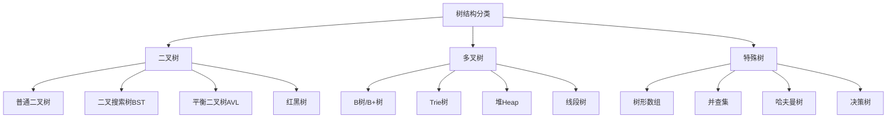
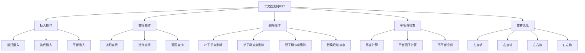
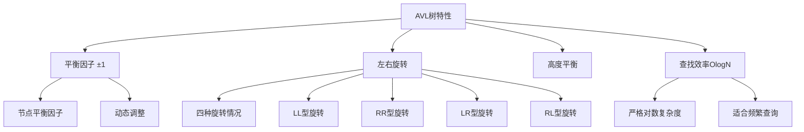
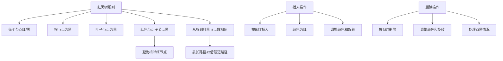
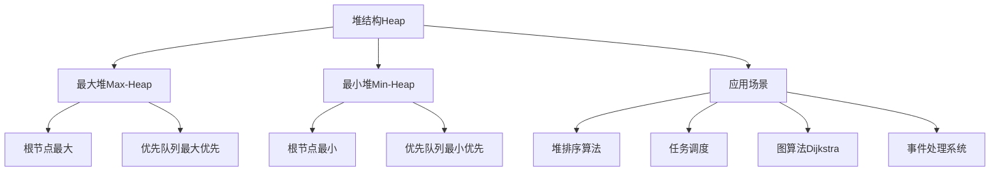
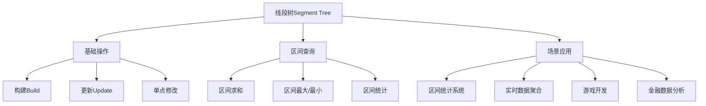
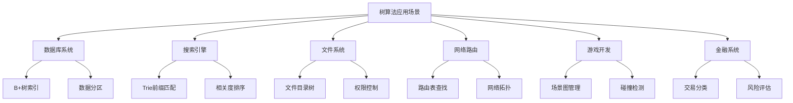

# Golang树算法深度解析：从数据结构到高级应用

## 一、树结构基础与Go语言实现

### 1.1 树的基本概念与分类



### 1.2 树节点基础接口设计

```go
package tree

import (
	"fmt"
	"strings"
)

// TreeNode 基础树节点接口
type TreeNode interface {
	GetValue() interface{}
	SetValue(value interface{})
	GetChildren() []TreeNode
	AddChild(node TreeNode)
	RemoveChild(node TreeNode) bool
	IsLeaf() bool
	Height() int
	Size() int
}

// 基础树节点实现
type BaseTreeNode struct {
	value    interface{}
	children []TreeNode
}

func NewBaseTreeNode(value interface{}) *BaseTreeNode {
	return &BaseTreeNode{
		value:    value,
		children: make([]TreeNode, 0),
	}
}

func (btn *BaseTreeNode) GetValue() interface{} {
	return btn.value
}

func (btn *BaseTreeNode) SetValue(value interface{}) {
	btn.value = value
}

func (btn *BaseTreeNode) GetChildren() []TreeNode {
	return btn.children
}

func (btn *BaseTreeNode) AddChild(node TreeNode) {
	btn.children = append(btn.children, node)
}

func (btn *BaseTreeNode) RemoveChild(node TreeNode) bool {
	for i, child := range btn.children {
		if child == node {
			btn.children = append(btn.children[:i], btn.children[i+1:]...)
			return true
		}
	}
	return false
}

func (btn *BaseTreeNode) IsLeaf() bool {
	return len(btn.children) == 0
}

func (btn *BaseTreeNode) Height() int {
	if btn.IsLeaf() {
		return 1
	}
	
	maxHeight := 0
	for _, child := range btn.children {
		if childHeight := child.Height(); childHeight > maxHeight {
			maxHeight = childHeight
		}
	}
	return maxHeight + 1
}

func (btn *BaseTreeNode) Size() int {
	size := 1 // 当前节点
	for _, child := range btn.children {
		size += child.Size()
	}
	return size
}

// 带指针的二叉树节点
type BinaryTreeNode struct {
	Value  interface{}
	Left   *BinaryTreeNode
	Right  *BinaryTreeNode
	Parent *BinaryTreeNode
}

func NewBinaryTreeNode(value interface{}) *BinaryTreeNode {
	return &BinaryTreeNode{
		Value:  value,
		Left:   nil,
		Right:  nil,
		Parent: nil,
	}
}

// 多叉树节点（可以用于文件系统等场景）
type MultiWayTreeNode struct {
	Value    interface{}
	Children []*MultiWayTreeNode
}

func NewMultiWayTreeNode(value interface{}) *MultiWayTreeNode {
	return &MultiWayTreeNode{
		Value:    value,
		Children: make([]*MultiWayTreeNode, 0),
	}
}
```

### 1.3 树结构的通用接口设计

```go
// Tree 通用树接口
type Tree interface {
	GetRoot() TreeNode
	SetRoot(root TreeNode)
	Insert(value interface{}) bool
	Delete(value interface{}) bool
	Search(value interface{}) TreeNode
	Height() int
	Size() int
	IsEmpty() bool
	Clear()
	Traverse(order string) []interface{}
}

// 基础树实现
type BaseTree struct {
	root TreeNode
}

func NewBaseTree() *BaseTree {
	return &BaseTree{
		root: nil,
	}
}

func (bt *BaseTree) GetRoot() TreeNode {
	return bt.root
}

func (bt *BaseTree) SetRoot(root TreeNode) {
	bt.root = root
}

func (bt *BaseTree) Height() int {
	if bt.root == nil {
		return 0
	}
	return bt.root.Height()
}

func (bt *BaseTree) Size() int {
	if bt.root == nil {
		return 0
	}
	return bt.root.Size()
}

func (bt *BaseTree) IsEmpty() bool {
	return bt.root == nil
}

func (bt *BaseTree) Clear() {
	bt.root = nil
}

// 树遍历器
type TreeTraverser struct {
	tree Tree
}

func NewTreeTraverser(tree Tree) *TreeTraverser {
	return &TreeTraverser{
		tree: tree,
	}
}

// 前序遍历（根-左-右）
func (tt *TreeTraverser) PreOrder() []interface{} {
	result := make([]interface{}, 0)
	if tt.tree.GetRoot() != nil {
		tt.preOrderRecursive(tt.tree.GetRoot(), &result)
	}
	return result
}

func (tt *TreeTraverser) preOrderRecursive(node TreeNode, result *[]interface{}) {
	*result = append(*result, node.GetValue())
	for _, child := range node.GetChildren() {
		tt.preOrderRecursive(child, result)
	}
}

// 后序遍历（左-右-根）
func (tt *TreeTraverser) PostOrder() []interface{} {
	result := make([]interface{}, 0)
	if tt.tree.GetRoot() != nil {
		tt.postOrderRecursive(tt.tree.GetRoot(), &result)
	}
	return result
}

func (tt *TreeTraverser) postOrderRecursive(node TreeNode, result *[]interface{}) {
	for _, child := range node.GetChildren() {
		tt.postOrderRecursive(child, result)
	}
	*result = append(*result, node.GetValue())
}

// 层次遍历（广度优先）
func (tt *TreeTraverser) LevelOrder() []interface{} {
	if tt.tree.GetRoot() == nil {
		return []interface{}{}
	}
	
	result := make([]interface{}, 0)
	queue := []TreeNode{tt.tree.GetRoot()}
	
	for len(queue) > 0 {
		current := queue[0]
		queue = queue[1:]
		
		result = append(result, current.GetValue())
		queue = append(queue, current.GetChildren()...)
	}
	
	return result
}

// 树的可视化工具
type TreeVisualizer struct {
	tree Tree
}

func NewTreeVisualizer(tree Tree) *TreeVisualizer {
	return &TreeVisualizer{
		tree: tree,
	}
}

func (tv *TreeVisualizer) GenerateASCII(root TreeNode, prefix string, isTail bool) string {
	if root == nil {
		return ""
	}
	
	var result strings.Builder
	
	// 当前节点
	result.WriteString(prefix)
	if isTail {
		result.WriteString("└── ")
	} else {
		result.WriteString("├── ")
	}
	result.WriteString(fmt.Sprintf("%v\n", root.GetValue()))
	
	// 子节点
	children := root.GetChildren()
	for i, child := range children {
		newPrefix := prefix
		if isTail {
			newPrefix += "    "
		} else {
			newPrefix += "│   "
		}
		result.WriteString(tv.GenerateASCII(child, newPrefix, i == len(children)-1))
	}
	
	return result.String()
}

func (tv *TreeVisualizer) PrintTree() {
	if tv.tree.GetRoot() == nil {
		fmt.Println("Empty tree")
		return
	}
	
	fmt.Println(tv.GenerateASCII(tv.tree.GetRoot(), "", true))
}
```

### 1.4 二叉树的实现

```go
package binarytree

import (
	"fmt"
	"strconv"
)

// 二叉树节点
type BinaryNode struct {
	Value  int
	Left   *BinaryNode
	Right  *BinaryNode
}

func NewBinaryNode(value int) *BinaryNode {
	return &BinaryNode{
		Value: value,
		Left:  nil,
		Right: nil,
	}
}

// 二叉树结构
type BinaryTree struct {
	Root *BinaryNode
}

func NewBinaryTree() *BinaryTree {
	return &BinaryTree{
		Root: nil,
	}
}

// 递归插入（有序插入）
func (bt *BinaryTree) Insert(value int) {
	if bt.Root == nil {
		bt.Root = NewBinaryNode(value)
	} else {
		bt.insertRecursive(bt.Root, value)
	}
}

func (bt *BinaryTree) insertRecursive(node *BinaryNode, value int) {
	if value < node.Value {
		if node.Left == nil {
			node.Left = NewBinaryNode(value)
		} else {
			bt.insertRecursive(node.Left, value)
		}
	} else {
		if node.Right == nil {
			node.Right = NewBinaryNode(value)
		} else {
			bt.insertRecursive(node.Right, value)
		}
	}
}

// 迭代插入
type BinaryTreeIterative struct {
	Root *BinaryNode
}

func NewBinaryTreeIterative() *BinaryTreeIterative {
	return &BinaryTreeIterative{
		Root: nil,
	}
}

func (bti *BinaryTreeIterative) Insert(value int) {
	newNode := NewBinaryNode(value)
	
	if bti.Root == nil {
		bti.Root = newNode
		return
	}
	
	current := bti.Root
	var parent *BinaryNode
	
	for current != nil {
		parent = current
		if value < current.Value {
			current = current.Left
		} else {
			current = current.Right
		}
	}
	
	if value < parent.Value {
		parent.Left = newNode
	} else {
		parent.Right = newNode
	}
}

// 二叉树遍历算法
type BinaryTreeTraversal struct {
	tree *BinaryTree
}

func NewBinaryTreeTraversal(tree *BinaryTree) *BinaryTreeTraversal {
	return &BinaryTreeTraversal{
		tree: tree,
	}
}

// 递归前序遍历
func (btt *BinaryTreeTraversal) PreOrderRecursive() []int {
	result := make([]int, 0)
	btt.preOrderRecursive(btt.tree.Root, &result)
	return result
}

func (btt *BinaryTreeTraversal) preOrderRecursive(node *BinaryNode, result *[]int) {
	if node == nil {
		return
	}
	
	*result = append(*result, node.Value)
	btt.preOrderRecursive(node.Left, result)
	btt.preOrderRecursive(node.Right, result)
}

// 迭代前序遍历
func (btt *BinaryTreeTraversal) PreOrderIterative() []int {
	if btt.tree.Root == nil {
		return []int{}
	}
	
	result := make([]int, 0)
	stack := []*BinaryNode{btt.tree.Root}
	
	for len(stack) > 0 {
		node := stack[len(stack)-1]
		stack = stack[:len(stack)-1]
		
		result = append(result, node.Value)
		
		// 右子节点先入栈，左子节点后入栈
		if node.Right != nil {
			stack = append(stack, node.Right)
		}
		if node.Left != nil {
			stack = append(stack, node.Left)
		}
	}
	
	return result
}

// 递归中序遍历
func (btt *BinaryTreeTraversal) InOrderRecursive() []int {
	result := make([]int, 0)
	btt.inOrderRecursive(btt.tree.Root, &result)
	return result
}

func (btt *BinaryTreeTraversal) inOrderRecursive(node *BinaryNode, result *[]int) {
	if node == nil {
		return
	}
	
	btt.inOrderRecursive(node.Left, result)
	*result = append(*result, node.Value)
	btt.inOrderRecursive(node.Right, result)
}

// 迭代中序遍历
func (btt *BinaryTreeTraversal) InOrderIterative() []int {
	result := make([]int, 0)
	stack := make([]*BinaryNode, 0)
	current := btt.tree.Root
	
	for current != nil || len(stack) > 0 {
		// 遍历到最左节点
		for current != nil {
			stack = append(stack, current)
			current = current.Left
		}
		
		// 访问节点
		current = stack[len(stack)-1]
		stack = stack[:len(stack)-1]
		result = append(result, current.Value)
		
		// 处理右子树
		current = current.Right
	}
	
	return result
}

// 递归后序遍历
func (btt *BinaryTreeTraversal) PostOrderRecursive() []int {
	result := make([]int, 0)
	btt.postOrderRecursive(btt.tree.Root, &result)
	return result
}

func (btt *BinaryTreeTraversal) postOrderRecursive(node *BinaryNode, result *[]int) {
	if node == nil {
		return
	}
	
	btt.postOrderRecursive(node.Left, result)
	btt.postOrderRecursive(node.Right, result)
	*result = append(*result, node.Value)
}

// 迭代后序遍历（使用双栈）
func (btt *BinaryTreeTraversal) PostOrderIterative() []int {
	if btt.tree.Root == nil {
		return []int{}
	}
	
	result := make([]int, 0)
	stack1 := []*BinaryNode{btt.tree.Root}
	stack2 := make([]*BinaryNode, 0)
	
	for len(stack1) > 0 {
		node := stack1[len(stack1)-1]
		stack1 = stack1[:len(stack1)-1]
		stack2 = append(stack2, node)
		
		if node.Left != nil {
			stack1 = append(stack1, node.Left)
		}
		if node.Right != nil {
			stack1 = append(stack1, node.Right)
		}
	}
	
	for i := len(stack2) - 1; i >= 0; i-- {
		result = append(result, stack2[i].Value)
	}
	
	return result
}

// 层次遍历
func (btt *BinaryTreeTraversal) LevelOrder() []int {
	if btt.tree.Root == nil {
		return []int{}
	}
	
	result := make([]int, 0)
	queue := []*BinaryNode{btt.tree.Root}
	
	for len(queue) > 0 {
		node := queue[0]
		queue = queue[1:]
		
		result = append(result, node.Value)
		
		if node.Left != nil {
			queue = append(queue, node.Left)
		}
		if node.Right != nil {
			queue = append(queue, node.Right)
		}
	}
	
	return result
}

// 二叉树的基本操作
type BinaryTreeOperations struct {
	tree *BinaryTree
}

func NewBinaryTreeOperations(tree *BinaryTree) *BinaryTreeOperations {
	return &BinaryTreeOperations{
		tree: tree,
	}
}

// 查找节点
func (bto *BinaryTreeOperations) Find(value int) *BinaryNode {
	return bto.findRecursive(bto.tree.Root, value)
}

func (bto *BinaryTreeOperations) findRecursive(node *BinaryNode, value int) *BinaryNode {
	if node == nil {
		return nil
	}
	
	if value == node.Value {
		return node
	} else if value < node.Value {
		return bto.findRecursive(node.Left, value)
	} else {
		return bto.findRecursive(node.Right, value)
	}
}

// 查找最小值
func (bto *BinaryTreeOperations) FindMin() *BinaryNode {
	if bto.tree.Root == nil {
		return nil
	}
	
	current := bto.tree.Root
	for current.Left != nil {
		current = current.Left
	}
	return current
}

// 查找最大值
func (bto *BinaryTreeOperations) FindMax() *BinaryNode {
	if bto.tree.Root == nil {
		return nil
	}
	
	current := bto.tree.Root
	for current.Right != nil {
		current = current.Right
	}
	return current
}

// 计算树的高度
func (bto *BinaryTreeOperations) Height() int {
	return bto.heightRecursive(bto.tree.Root)
}

func (bto *BinaryTreeOperations) heightRecursive(node *BinaryNode) int {
	if node == nil {
		return 0
	}
	
	leftHeight := bto.heightRecursive(node.Left)
	rightHeight := bto.heightRecursive(node.Right)
	
	if leftHeight > rightHeight {
		return leftHeight + 1
	}
	return rightHeight + 1
}

// 检查是否为平衡二叉树
func (bto *BinaryTreeOperations) IsBalanced() bool {
	return bto.isBalancedRecursive(bto.tree.Root)
}

func (bto *BinaryTreeOperations) isBalancedRecursive(node *BinaryNode) bool {
	if node == nil {
		return true
	}
	
	leftHeight := bto.heightRecursive(node.Left)
	rightHeight := bto.heightRecursive(node.Right)
	
	if abs(leftHeight-rightHeight) > 1 {
		return false
	}
	
	return bto.isBalancedRecursive(node.Left) && bto.isBalancedRecursive(node.Right)
}

// 镜像二叉树
func (bto *BinaryTreeOperations) Mirror() {
	bto.mirrorRecursive(bto.tree.Root)
}

func (bto *BinaryTreeOperations) mirrorRecursive(node *BinaryNode) {
	if node == nil {
		return
	}
	
	// 交换左右子树
	node.Left, node.Right = node.Right, node.Left
	
	bto.mirrorRecursive(node.Left)
	bto.mirrorRecursive(node.Right)
}

// 计算节点数量
func (bto *BinaryTreeOperations) CountNodes() int {
	return bto.countNodesRecursive(bto.tree.Root)
}

func (bto *BinaryTreeOperations) countNodesRecursive(node *BinaryNode) int {
	if node == nil {
		return 0
	}
	return 1 + bto.countNodesRecursive(node.Left) + bto.countNodesRecursive(node.Right)
}

// 工具函数
func abs(x int) int {
	if x < 0 {
		return -x
	}
	return x
}

// 树的序列化和反序列化
type BinaryTreeSerializer struct {
	tree *BinaryTree
}

func NewBinaryTreeSerializer(tree *BinaryTree) *BinaryTreeSerializer {
	return &BinaryTreeSerializer{
		tree: tree,
	}
}

// 前序遍历序列化
func (bts *BinaryTreeSerializer) SerializePreOrder() string {
	return bts.serializePreOrderRecursive(bts.tree.Root)
}

func (bts *BinaryTreeSerializer) serializePreOrderRecursive(node *BinaryNode) string {
	if node == nil {
		return "null"
	}
	
	left := bts.serializePreOrderRecursive(node.Left)
	right := bts.serializePreOrderRecursive(node.Right)
	
	return fmt.Sprintf("%d,%s,%s", node.Value, left, right)
}

// 前序反序列化
func (bts *BinaryTreeSerializer) DeserializePreOrder(data string) {
	nodes := bts.split(data)
	index := 0
	bts.tree.Root = bts.deserializePreOrderRecursive(nodes, &index)
}

func (bts *BinaryTreeSerializer) split(data string) []string {
	result := make([]string, 0)
	start := 0
	
	for i := 0; i < len(data); i++ {
		if data[i] == ',' {
			result = append(result, data[start:i])
			start = i + 1
		}
	}
	result = append(result, data[start:])
	return result
}

func (bts *BinaryTreeSerializer) deserializePreOrderRecursive(nodes []string, index *int) *BinaryNode {
	if *index >= len(nodes) || nodes[*index] == "null" {
		(*index)++
		return nil
	}
	
	value, _ := strconv.Atoi(nodes[*index])
	(*index)++
	
	node := NewBinaryNode(value)
	node.Left = bts.deserializePreOrderRecursive(nodes, index)
	node.Right = bts.deserializePreOrderRecursive(nodes, index)
	
	return node
}
```

### 1.5 树的验证和测试

```go
package tree_test

import (
	"testing"
	"tree"
)

func TestBinaryTree(t *testing.T) {
	bt := tree.NewBinaryTree()
	
	// 插入测试
	values := []int{5, 3, 7, 2, 4, 6, 8}
	for _, value := range values {
		bt.Insert(value)
	}
	
	// 中序遍历结果应该是有序的
	traversal := tree.NewBinaryTreeTraversal(bt)
	inOrder := traversal.InOrderRecursive()
	
	expected := []int{2, 3, 4, 5, 6, 7, 8}
	if len(inOrder) != len(expected) {
		t.Errorf("Expected %v, got %v", expected, inOrder)
	}
	
	for i, val := range inOrder {
		if val != expected[i] {
			t.Errorf("At index %d: expected %d, got %d", i, expected[i], val)
		}
	}
	
	// 查找测试
	if found := bt.Find(4); found == nil || found.Value != 4 {
		t.Error("Failed to find value 4")
	}
	
	if found := bt.Find(10); found != nil {
		t.Error("Should not find value 10")
	}
}

func TestTreeHeight(t *testing.T) {
	bt := tree.NewBinaryTree()
	
	// 空树高度为0
	operations := tree.NewBinaryTreeOperations(bt)
	if height := operations.Height(); height != 0 {
		t.Errorf("Empty tree height should be 0, got %d", height)
	}
	
	// 单节点树高度为1
	bt.Insert(5)
	if height := operations.Height(); height != 1 {
		t.Errorf("Single node tree height should be 1, got %d", height)
	}
	
	// 平衡树高度测试
	bt.Insert(3)
	bt.Insert(7)
	if height := operations.Height(); height != 2 {
		t.Errorf("Balanced tree height should be 2, got %d", height)
	}
}
```

## 二、二叉搜索树与平衡树算法

### 2.1 二叉搜索树(BST)的深度实现



```go
package binarysearchtree

import (
	"fmt"
	"strconv"
)

// BST节点
type BSTNode struct {
	Value  int
	Left   *BSTNode
	Right  *BSTNode
	Height int // 节点高度，用于平衡树
}

func NewBSTNode(value int) *BSTNode {
	return &BSTNode{
		Value:  value,
		Left:   nil,
		Right:  nil,
		Height: 1,
	}
}

// 二叉搜索树（支持重复值）
type BinarySearchTree struct {
	Root      *BSTNode
	Size      int
	AllowDups bool // 是否允许重复值
}

func NewBinarySearchTree(allowDups bool) *BinarySearchTree {
	return &BinarySearchTree{
		Root:      nil,
		Size:      0,
		AllowDups: allowDups,
	}
}

// 基本插入操作
func (bst *BinarySearchTree) Insert(value int) bool {
	if bst.Root == nil {
		bst.Root = NewBSTNode(value)
		bst.Size++
		return true
	}
	
	success := bst.insertRecursive(bst.Root, value)
	if success {
		bst.Size++
	}
	return success
}

func (bst *BinarySearchTree) insertRecursive(node *BSTNode, value int) bool {
	if value < node.Value {
		if node.Left == nil {
			node.Left = NewBSTNode(value)
			return true
		}
		return bst.insertRecursive(node.Left, value)
	} else if bst.AllowDups || value > node.Value {
		if node.Right == nil {
			node.Right = NewBSTNode(value)
			return true
		}
		return bst.insertRecursive(node.Right, value)
	}
	
	// 值相等且不允许重复
	return false
}

// 平衡插入（保持BST性质）
func (bst *BinarySearchTree) InsertBalanced(value int) bool {
	var inserted bool
	bst.Root, inserted = bst.insertBalancedRecursive(bst.Root, value)
	if inserted {
		bst.Size++
	}
	return inserted
}

func (bst *BinarySearchTree) insertBalancedRecursive(node *BSTNode, value int) (*BSTNode, bool) {
	if node == nil {
		return NewBSTNode(value), true
	}
	
	var inserted bool
	if value < node.Value {
		node.Left, inserted = bst.insertBalancedRecursive(node.Left, value)
	} else if bst.AllowDups || value > node.Value {
		node.Right, inserted = bst.insertBalancedRecursive(node.Right, value)
	} else {
		return node, false
	}
	
	if !inserted {
		return node, false
	}
	
	// 更新高度
	node.Height = max(bst.getHeight(node.Left), bst.getHeight(node.Right)) + 1
	
	// 平衡树
	return bst.balance(node), true
}

// 查找操作
type BSTSearchResult struct {
	Node    *BSTNode
	Parent  *BSTNode
	Found   bool
	IsLeft  bool // 是否为父节点的左孩子
}

func (bst *BinarySearchTree) Search(value int) *BSTSearchResult {
	return bst.searchRecursive(nil, bst.Root, value, false)
}

func (bst *BinarySearchTree) searchRecursive(parent, node *BSTNode, value int, isLeft bool) *BSTSearchResult {
	if node == nil {
		return &BSTSearchResult{
			Node:    nil,
			Parent:  parent,
			Found:   false,
			IsLeft:  isLeft,
		}
	}
	
	if value == node.Value {
		return &BSTSearchResult{
			Node:    node,
			Parent:  parent,
			Found:   true,
			IsLeft:  isLeft,
		}
	}
	
	if value < node.Value {
		return bst.searchRecursive(node, node.Left, value, true)
	}
	
	return bst.searchRecursive(node, node.Right, value, false)
}

// 范围查询
type RangeQuery struct {
	Min int
	Max int
}

func (bst *BinarySearchTree) RangeSearch(query RangeQuery) []int {
	result := make([]int, 0)
	bst.rangeSearchRecursive(bst.Root, query, &result)
	return result
}

func (bst *BinarySearchTree) rangeSearchRecursive(node *BSTNode, query RangeQuery, result *[]int) {
	if node == nil {
		return
	}
	
	// 如果当前节点值大于最小值，搜索左子树
	if node.Value > query.Min {
		bst.rangeSearchRecursive(node.Left, query, result)
	}
	
	// 如果当前节点值在范围内，添加到结果
	if node.Value >= query.Min && node.Value <= query.Max {
		*result = append(*result, node.Value)
	}
	
	// 如果当前节点值小于最大值，搜索右子树
	if node.Value < query.Max {
		bst.rangeSearchRecursive(node.Right, query, result)
	}
}

// 删除操作 - 复杂但重要
func (bst *BinarySearchTree) Delete(value int) bool {
	var deleted bool
	bst.Root, deleted = bst.deleteRecursive(bst.Root, value)
	if deleted {
		bst.Size--
	}
	return deleted
}

func (bst *BinarySearchTree) deleteRecursive(node *BSTNode, value int) (*BSTNode, bool) {
	if node == nil {
		return nil, false
	}
	
	deleted := false
	
	if value < node.Value {
		node.Left, deleted = bst.deleteRecursive(node.Left, value)
	} else if value > node.Value {
		node.Right, deleted = bst.deleteRecursive(node.Right, value)
	} else {
		// 找到要删除的节点
		deleted = true
		
		// 情况1：叶子节点
		if node.Left == nil && node.Right == nil {
			return nil, true
		}
		
		// 情况2：只有一个子节点
		if node.Left == nil {
			return node.Right, true
		}
		if node.Right == nil {
			return node.Left, true
		}
		
		// 情况3：有两个子节点 - 找到后继节点
		minRight := bst.findMin(node.Right)
		node.Value = minRight.Value
		node.Right, _ = bst.deleteRecursive(node.Right, minRight.Value)
	}
	
	if !deleted {
		return node, false
	}
	
	// 更新高度
	node.Height = max(bst.getHeight(node.Left), bst.getHeight(node.Right)) + 1
	
	// 平衡树
	return bst.balance(node), true
}

// 查找最小节点
func (bst *BinarySearchTree) findMin(node *BSTNode) *BSTNode {
	current := node
	for current.Left != nil {
		current = current.Left
	}
	return current
}

// 查找最大节点
func (bst *BinarySearchTree) FindMax() *BSTNode {
	if bst.Root == nil {
		return nil
	}
	
	current := bst.Root
	for current.Right != nil {
		current = current.Right
	}
	return current
}

// 树上操作接口
type BSTOperations interface {
	Insert(value int) bool
	Delete(value int) bool
	Search(value int) *BSTNode
	RangeSearch(query RangeQuery) []int
	GetHeight() int
	IsBalanced() bool
}

// 平衡检查
type BalancedTreeChecker struct {
	bst *BinarySearchTree
}

func NewBalancedTreeChecker(bst *BinarySearchTree) *BalancedTreeChecker {
	return &BalancedTreeChecker{
		bst: bst,
	}
}

func (btc *BalancedTreeChecker) GetHeight() int {
	return btc.bst.getHeight(btc.bst.Root)
}

func (btc *BalancedTreeChecker) IsBalanced() bool {
	return btc.isBalancedRecursive(btc.bst.Root)
}

func (btc *BalancedTreeChecker) isBalancedRecursive(node *BSTNode) bool {
	if node == nil {
		return true
	}
	
	leftHeight := btc.bst.getHeight(node.Left)
	rightHeight := btc.bst.getHeight(node.Right)
	
	if abs(leftHeight-rightHeight) > 1 {
		return false
	}
	
	return btc.isBalancedRecursive(node.Left) && btc.isBalancedRecursive(node.Right)
}

// 平衡因子计算
func (bst *BinarySearchTree) getBalanceFactor(node *BSTNode) int {
	if node == nil {
		return 0
	}
	return bst.getHeight(node.Left) - bst.getHeight(node.Right)
}

// 获取节点高度
func (bst *BinarySearchTree) getHeight(node *BSTNode) int {
	if node == nil {
		return 0
	}
	return node.Height
}

// 平衡操作
type TreeBalancer struct {
	bst *BinarySearchTree
}

func NewTreeBalancer(bst *BinarySearchTree) *TreeBalancer {
	return &TreeBalancer{
		bst: bst,
	}
}

// 左旋转
func (tb *TreeBalancer) rotateLeft(y *BSTNode) *BSTNode {
	x := y.Right
	t := x.Left
	
	// 执行旋转
	x.Left = y
	y.Right = t
	
	// 更新高度
	y.Height = max(tb.bst.getHeight(y.Left), tb.bst.getHeight(y.Right)) + 1
	x.Height = max(tb.bst.getHeight(x.Left), tb.bst.getHeight(x.Right)) + 1
	
	return x
}

// 右旋转
func (tb *TreeBalancer) rotateRight(x *BSTNode) *BSTNode {
	y := x.Left
	t := y.Right
	
	// 执行旋转
	y.Right = x
	x.Left = t
	
	// 更新高度
	x.Height = max(tb.bst.getHeight(x.Left), tb.bst.getHeight(x.Right)) + 1
	y.Height = max(tb.bst.getHeight(y.Left), tb.bst.getHeight(y.Right)) + 1
	
	return y
}

// 左右旋转
func (tb *TreeBalancer) rotateLeftRight(node *BSTNode) *BSTNode {
	node.Left = tb.rotateLeft(node.Left)
	return tb.rotateRight(node)
}

// 右左旋转
func (tb *TreeBalancer) rotateRightLeft(node *BSTNode) *BSTNode {
	node.Right = tb.rotateRight(node.Right)
	return tb.rotateLeft(node)
}

// 平衡节点
func (bst *BinarySearchTree) balance(node *BSTNode) *BSTNode {
	if node == nil {
		return node
	}
	
	balancer := NewTreeBalancer(bst)
	balanceFactor := bst.getBalanceFactor(node)
	
	// 左重
	if balanceFactor > 1 {
		if bst.getBalanceFactor(node.Left) >= 0 {
			// 左左情况
			return balancer.rotateRight(node)
		} else {
			// 左右情况
			return balancer.rotateLeftRight(node)
		}
	}
	
	// 右重
	if balanceFactor < -1 {
		if bst.getBalanceFactor(node.Right) <= 0 {
			// 右右情况
			return balancer.rotateLeft(node)
		} else {
			// 右左情况
			return balancer.rotateRightLeft(node)
		}
	}
	
	return node
}

// 辅助函数
func max(a, b int) int {
	if a > b {
		return a
	}
	return b
}

func abs(x int) int {
	if x < 0 {
		return -x
	}
	return x
}

// BST遍历器
type BSTTraverser struct {
	bst *BinarySearchTree
}

func NewBSTTraverser(bst *BinarySearchTree) *BSTTraverser {
	return &BSTTraverser{
		bst: bst,
	}
}

// 前序遍历
func (bt *BSTTraverser) PreOrder() []int {
	result := make([]int, 0)
	bt.preOrderRecursive(bt.bst.Root, &result)
	return result
}

func (bt *BSTTraverser) preOrderRecursive(node *BSTNode, result *[]int) {
	if node == nil {
		return
	}
	
	*result = append(*result, node.Value)
	bt.preOrderRecursive(node.Left, result)
	bt.preOrderRecursive(node.Right, result)
}

// 中序遍历（产生有序序列）
func (bt *BSTTraverser) InOrder() []int {
	result := make([]int, 0)
	bt.inOrderRecursive(bt.bst.Root, &result)
	return result
}

func (bt *BSTTraverser) inOrderRecursive(node *BSTNode, result *[]int) {
	if node == nil {
		return
	}
	
	bt.inOrderRecursive(node.Left, result)
	*result = append(*result, node.Value)
	bt.inOrderRecursive(node.Right, result)
}

// 后序遍历
func (bt *BSTTraverser) PostOrder() []int {
	result := make([]int, 0)
	bt.postOrderRecursive(bt.bst.Root, &result)
	return result
}

func (bt *BSTTraverser) postOrderRecursive(node *BSTNode, result *[]int) {
	if node == nil {
		return
	}
	
	bt.postOrderRecursive(node.Left, result)
	bt.postOrderRecursive(node.Right, result)
	*result = append(*result, node.Value)
}

// 统计信息
type BSTStatistics struct {
	bst *BinarySearchTree
}

func NewBSTStatistics(bst *BinarySearchTree) *BSTStatistics {
	return &BSTStatistics{
		bst: bst,
	}
}

// 计算平均高度
func (bs *BSTStatistics) AverageHeight() float64 {
	totalHeight := bs.calculateTotalHeight(bs.bst.Root)
	totalNodes := bs.bst.Size
	
	if totalNodes == 0 {
		return 0
	}
	
	return float64(totalHeight) / float64(totalNodes)
}

func (bs *BSTStatistics) calculateTotalHeight(node *BSTNode) int {
	if node == nil {
		return 0
	}
	
	leftHeight := bs.calculateTotalHeight(node.Left)
	rightHeight := bs.calculateTotalHeight(node.Right)
	
	return node.Height + leftHeight + rightHeight
}

// 计算平衡因子分布
func (bs *BSTStatistics) BalanceFactorDistribution() map[int]int {
	distribution := make(map[int]int)
	bs.calculateBalanceFactors(bs.bst.Root, distribution)
	return distribution
}

func (bs *BSTStatistics) calculateBalanceFactors(node *BSTNode, distribution map[int]int) {
	if node == nil {
		return
	}
	
	balanceFactor := bs.bst.getBalanceFactor(node)
	distribution[balanceFactor]++
	
	bs.calculateBalanceFactors(node.Left, distribution)
	bs.calculateBalanceFactors(node.Right, distribution)
}
```

### 2.2 AVL平衡树实现



```go
package avltree

import (
	"container/list"
)

// AVL树节点
type AVLNode struct {
	Key    int
	Value  interface{}
	Height int
	Left   *AVLNode
	Right  *AVLNode
}

func NewAVLNode(key int, value interface{}) *AVLNode {
	return &AVLNode{
		Key:    key,
		Value:  value,
		Height: 1,
		Left:   nil,
		Right:  nil,
	}
}

// AVL平衡二叉树
type AVLTree struct {
	Root *AVLNode
	Size int
}

func NewAVLTree() *AVLTree {
	return &AVLTree{
		Root: nil,
		Size: 0,
	}
}

// 获取节点高度
func (avl *AVLTree) getHeight(node *AVLNode) int {
	if node == nil {
		return 0
	}
	return node.Height
}

// 获取平衡因子
func (avl *AVLTree) getBalanceFactor(node *AVLNode) int {
	if node == nil {
		return 0
	}
	return avl.getHeight(node.Left) - avl.getHeight(node.Right)
}

// 更新节点高度
func (avl *AVLTree) updateHeight(node *AVLNode) {
	if node != nil {
		node.Height = max(avl.getHeight(node.Left), avl.getHeight(node.Right)) + 1
	}
}

// 右旋转（左重情况）
func (avl *AVLTree) rightRotate(y *AVLNode) *AVLNode {
	x := y.Left
	t := x.Right
	
	// 执行右旋转
	x.Right = y
	y.Left = t
	
	// 更新高度
	avl.updateHeight(y)
	avl.updateHeight(x)
	
	return x
}

// 左旋转（右重情况）
func (avl *AVLTree) leftRotate(x *AVLNode) *AVLNode {
	y := x.Right
	t := y.Left
	
	// 执行左旋转
	y.Left = x
	x.Right = t
	
	// 更新高度
	avl.updateHeight(x)
	avl.updateHeight(y)
	
	return y
}

// 平衡节点
func (avl *AVLTree) balance(node *AVLNode) *AVLNode {
	avl.updateHeight(node)
	
	balanceFactor := avl.getBalanceFactor(node)
	
	// 左重
	if balanceFactor > 1 {
		if avl.getBalanceFactor(node.Left) >= 0 {
			// 左左情况
			return avl.rightRotate(node)
		} else {
			// 左右情况
			node.Left = avl.leftRotate(node.Left)
			return avl.rightRotate(node)
		}
	}
	
	// 右重
	if balanceFactor < -1 {
		if avl.getBalanceFactor(node.Right) <= 0 {
			// 右右情况
			return avl.leftRotate(node)
		} else {
			// 右左情况
			node.Right = avl.rightRotate(node.Right)
			return avl.leftRotate(node)
		}
	}
	
	return node
}

// 插入操作
func (avl *AVLTree) Insert(key int, value interface{}) {
	avl.Root = avl.insertRecursive(avl.Root, key, value)
	avl.Size++
}

func (avl *AVLTree) insertRecursive(node *AVLNode, key int, value interface{}) *AVLNode {
	if node == nil {
		return NewAVLNode(key, value)
	}
	
	if key < node.Key {
		node.Left = avl.insertRecursive(node.Left, key, value)
	} else if key > node.Key {
		node.Right = avl.insertRecursive(node.Right, key, value)
	} else {
		// 键已存在，更新值
		node.Value = value
		return node
	}
	
	// 平衡当前节点
	return avl.balance(node)
}

// 删除操作
func (avl *AVLTree) Delete(key int) bool {
	var deleted bool
	avl.Root, deleted = avl.deleteRecursive(avl.Root, key)
	if deleted {
		avl.Size--
	}
	return deleted
}

func (avl *AVLTree) deleteRecursive(node *AVLNode, key int) (*AVLNode, bool) {
	if node == nil {
		return nil, false
	}
	
	deleted := false
	
	if key < node.Key {
		node.Left, deleted = avl.deleteRecursive(node.Left, key)
	} else if key > node.Key {
		node.Right, deleted = avl.deleteRecursive(node.Right, key)
	} else {
		deleted = true
		
		// 叶子节点或只有一个子节点
		if node.Left == nil || node.Right == nil {
			temp := node.Left
			if temp == nil {
				temp = node.Right
			}
			
			if temp == nil {
				return nil, true
			} else {
				node = temp
			}
		} else {
			// 找后继节点
			temp := avl.findMin(node.Right)
			node.Key = temp.Key
			node.Value = temp.Value
			node.Right, _ = avl.deleteRecursive(node.Right, temp.Key)
		}
	}
	
	if node == nil {
		return nil, deleted
	}
	
	return avl.balance(node), deleted
}

// 查找最小节点
func (avl *AVLTree) findMin(node *AVLNode) *AVLNode {
	current := node
	for current.Left != nil {
		current = current.Left
	}
	return current
}

// 查找操作
func (avl *AVLTree) Search(key int) (interface{}, bool) {
	node := avl.searchRecursive(avl.Root, key)
	if node != nil {
		return node.Value, true
	}
	return nil, false
}

func (avl *AVLTree) searchRecursive(node *AVLNode, key int) *AVLNode {
	if node == nil {
		return nil
	}
	
	if key == node.Key {
		return node
	} else if key < node.Key {
		return avl.searchRecursive(node.Left, key)
	} else {
		return avl.searchRecursive(node.Right, key)
	}
}

// 范围查询
type RangeQuery struct {
	Min int
	Max int
}

func (avl *AVLTree) RangeSearch(query RangeQuery) []interface{} {
	result := make([]interface{}, 0)
	avl.rangeSearchRecursive(avl.Root, query, &result)
	return result
}

func (avl *AVLTree) rangeSearchRecursive(node *AVLNode, query RangeQuery, result *[]interface{}) {
	if node == nil {
		return
	}
	
	if query.Min < node.Key {
		avl.rangeSearchRecursive(node.Left, query, result)
	}
	
	if query.Min <= node.Key && node.Key <= query.Max {
		*result = append(*result, node.Value)
	}
	
	if query.Max > node.Key {
		avl.rangeSearchRecursive(node.Right, query, result)
	}
}

// 树遍历器
type AVLTraverser struct {
	tree *AVLTree
}

func NewAVLTraverser(tree *AVLTree) *AVLTraverser {
	return &AVLTraverser{
		tree: tree,
	}
}

// 迭代器模式实现
type AVLIterator struct {
	stack *list.List
}

func NewAVLIterator(tree *AVLTree) *AVLIterator {
	iterator := &AVLIterator{
		stack: list.New(),
	}
	
	// 初始化栈
	iterator.pushLeft(tree.Root)
	return iterator
}

func (ai *AVLIterator) pushLeft(node *AVLNode) {
	for node != nil {
		ai.stack.PushBack(node)
		node = node.Left
	}
}

func (ai *AVLIterator) HasNext() bool {
	return ai.stack.Len() > 0
}

func (ai *AVLIterator) Next() *AVLNode {
	if !ai.HasNext() {
		return nil
	}
	
	element := ai.stack.Back()
	ai.stack.Remove(element)
	node := element.Value.(*AVLNode)
	
	// 将右子树所有左节点入栈
	ai.pushLeft(node.Right)
	
	return node
}

// AVL树验证器
type AVLValidator struct {
	tree *AVLTree
}

func NewAVLValidator(tree *AVLTree) *AVLValidator {
	return &AVLValidator{
		tree: tree,
	}
}

// 验证是否是有效的BST
func (av *AVLValidator) IsValidBST() bool {
	return av.isValidBSTRecursive(av.tree.Root, nil, nil)
}

func (av *AVLValidator) isValidBSTRecursive(node *AVLNode, min, max *int) bool {
	if node == nil {
		return true
	}
	
	if min != nil && node.Key <= *min {
		return false
	}
	
	if max != nil && node.Key >= *max {
		return false
	}
	
	return av.isValidBSTRecursive(node.Left, min, &node.Key) &&
		av.isValidBSTRecursive(node.Right, &node.Key, max)
}

// 验证平衡性
func (av *AVLValidator) IsBalanced() bool {
	return av.isBalancedRecursive(av.tree.Root)
}

func (av *AVLValidator) isBalancedRecursive(node *AVLNode) bool {
	if node == nil {
		return true
	}
	
	balanceFactor := av.tree.getBalanceFactor(node)
	if balanceFactor < -1 || balanceFactor > 1 {
		return false
	}
	
	return av.isBalancedRecursive(node.Left) && av.isBalancedRecursive(node.Right)
}

// 验证高度计算正确性
func (av *AVLValidator) ValidateHeight() bool {
	return av.validateHeightRecursive(av.tree.Root)
}

func (av *AVLValidator) validateHeightRecursive(node *AVLNode) bool {
	if node == nil {
		return true
	}
	
	expectedHeight := max(av.tree.getHeight(node.Left), 
		av.tree.getHeight(node.Right)) + 1
	
	if node.Height != expectedHeight {
		return false
	}
	
	return av.validateHeightRecursive(node.Left) && 
		av.validateHeightRecursive(node.Right)
}

// 性能基准测试
type AVLBenchmark struct {
	tree *AVLTree
}

func NewAVLBenchmark(tree *AVLTree) *AVLBenchmark {
	return &AVLBenchmark{
		tree: tree,
	}
}

// 计算树的平均访问路径长度
func (ab *AVLBenchmark) AveragePathLength() float64 {
	totalDepth := ab.calculateTotalDepth(ab.tree.Root, 0)
	if ab.tree.Size == 0 {
		return 0
	}
	return float64(totalDepth) / float64(ab.tree.Size)
}

func (ab *AVLBenchmark) calculateTotalDepth(node *AVLNode, depth int) int {
	if node == nil {
		return 0
	}
	
	total := depth + 1 // 当前节点
	total += ab.calculateTotalDepth(node.Left, depth+1)
	total += ab.calculateTotalDepth(node.Right, depth+1)
	
	return total
}

// 辅助函数
func max(a, b int) int {
	if a > b {
		return a
	}
	return b
}

func abs(x int) int {
	if x < 0 {
		return -x
	}
	return x
}
```

### 2.3 红黑树(RBTree)实现



```go
package redblacktree

import (
	"container/list"
)

// 颜色常量
const (
	RED   = true
	BLACK = false
)

// 红黑树节点
type RBNode struct {
	Key    int
	Value  interface{}
	Color  bool // true为红色，false为黑色
	Parent *RBNode
	Left   *RBNode
	Right  *RBNode
}

func NewRBNode(key int, value interface{}) *RBNode {
	return &RBNode{
		Key:    key,
		Value:  value,
		Color:  RED, // 新插入节点默认为红色
		Parent: nil,
		Left:   nil,
		Right:  nil,
	}
}

// 红黑树
type RedBlackTree struct {
	Root      *RBNode
	Size      int
	NIL       *RBNode // 哨兵节点
}

func NewRedBlackTree() *RedBlackTree {
	nilNode := &RBNode{Color: BLACK} // 哨兵节点为黑色
	return &RedBlackTree{
		Root: nilNode,
		Size: 0,
		NIL:  nilNode,
	}
}

// 左旋转
func (rbt *RedBlackTree) leftRotate(x *RBNode) {
	y := x.Right
	x.Right = y.Left
	
	if y.Left != rbt.NIL {
		y.Left.Parent = x
	}
	
	y.Parent = x.Parent
	
	if x.Parent == rbt.NIL {
		rbt.Root = y
	} else if x == x.Parent.Left {
		x.Parent.Left = y
	} else {
		x.Parent.Right = y
	}
	
	y.Left = x
	x.Parent = y
}

// 右旋转
func (rbt *RedBlackTree) rightRotate(y *RBNode) {
	x := y.Left
	y.Left = x.Right
	
	if x.Right != rbt.NIL {
		x.Right.Parent = y
	}
	
	x.Parent = y.Parent
	
	if y.Parent == rbt.NIL {
		rbt.Root = x
	} else if y == y.Parent.Right {
		y.Parent.Right = x
	} else {
		y.Parent.Left = x
	}
	
	x.Right = y
	y.Parent = x
}

// 插入修复
func (rbt *RedBlackTree) insertFixup(z *RBNode) {
	for z.Parent.Color == RED {
		if z.Parent == z.Parent.Parent.Left {
			y := z.Parent.Parent.Right
			
			// Case 1: 叔叔节点为红色
			if y.Color == RED {
				z.Parent.Color = BLACK
				y.Color = BLACK
				z.Parent.Parent.Color = RED
				z = z.Parent.Parent
			} else {
				// Case 2: z是右孩子
				if z == z.Parent.Right {
					z = z.Parent
					rbt.leftRotate(z)
				}
				
				// Case 3: z是左孩子
				z.Parent.Color = BLACK
				z.Parent.Parent.Color = RED
				rbt.rightRotate(z.Parent.Parent)
			}
		} else {
			y := z.Parent.Parent.Left
			
			if y.Color == RED {
				z.Parent.Color = BLACK
				y.Color = BLACK
				z.Parent.Parent.Color = RED
				z = z.Parent.Parent
			} else {
				if z == z.Parent.Left {
					z = z.Parent
					rbt.rightRotate(z)
				}
				
				z.Parent.Color = BLACK
				z.Parent.Parent.Color = RED
				rbt.leftRotate(z.Parent.Parent)
			}
		}
	}
	
	rbt.Root.Color = BLACK
}

// 插入操作
func (rbt *RedBlackTree) Insert(key int, value interface{}) {
	z := NewRBNode(key, value)
	z.Left = rbt.NIL
	z.Right = rbt.NIL
	
	y := rbt.NIL
	x := rbt.Root
	
	// 找到插入位置
	for x != rbt.NIL {
		y = x
		if z.Key < x.Key {
			x = x.Left
		} else {
			x = x.Right
		}
	}
	
	z.Parent = y
	
	if y == rbt.NIL {
		rbt.Root = z
	} else if z.Key < y.Key {
		y.Left = z
	} else {
		y.Right = z
	}
	
	rbt.insertFixup(z)
	rbt.Size++
}

// 删除修复
func (rbt *RedBlackTree) deleteFixup(x *RBNode) {
	for x != rbt.Root && x.Color == BLACK {
		if x == x.Parent.Left {
			w := x.Parent.Right
			
			// Case 1: 兄弟节点为红色
			if w.Color == RED {
				w.Color = BLACK
				x.Parent.Color = RED
				rbt.leftRotate(x.Parent)
				w = x.Parent.Right
			}
			
			// Case 2: 兄弟节点的两个子节点都是黑色
			if w.Left.Color == BLACK && w.Right.Color == BLACK {
				w.Color = RED
				x = x.Parent
			} else {
				// Case 3: 兄弟节点的右子节点为黑色
				if w.Right.Color == BLACK {
					w.Left.Color = BLACK
					w.Color = RED
					rbt.rightRotate(w)
					w = x.Parent.Right
				}
				
				// Case 4
				w.Color = x.Parent.Color
				x.Parent.Color = BLACK
				w.Right.Color = BLACK
				rbt.leftRotate(x.Parent)
				x = rbt.Root
			}
		} else {
			w := x.Parent.Left
			
			if w.Color == RED {
				w.Color = BLACK
				x.Parent.Color = RED
				rbt.rightRotate(x.Parent)
				w = x.Parent.Left
			}
			
			if w.Left.Color == BLACK && w.Right.Color == BLACK {
				w.Color = RED
				x = x.Parent
			} else {
				if w.Left.Color == BLACK {
					w.Right.Color = BLACK
					w.Color = RED
					rbt.leftRotate(w)
					w = x.Parent.Left
				}
				
				w.Color = x.Parent.Color
				x.Parent.Color = BLACK
				w.Left.Color = BLACK
				rbt.rightRotate(x.Parent)
				x = rbt.Root
			}
		}
	}
	
	x.Color = BLACK
}

// 查找最小值
func (rbt *RedBlackTree) findMin(node *RBNode) *RBNode {
	for node.Left != rbt.NIL {
		node = node.Left
	}
	return node
}

// 删除操作
func (rbt *RedBlackTree) Delete(key int) bool {
	z := rbt.findNode(key)
	if z == nil {
		return false
	}
	
	y := z
	yOriginalColor := y.Color
	var x *RBNode
	
	if z.Left == rbt.NIL {
		x = z.Right
		rbt.transplant(z, z.Right)
	} else if z.Right == rbt.NIL {
		x = z.Left
		rbt.transplant(z, z.Left)
	} else {
		y = rbt.findMin(z.Right)
		yOriginalColor = y.Color
		x = y.Right
		
		if y.Parent == z {
			if x == rbt.NIL {
				x.Parent = y
			}
		} else {
			rbt.transplant(y, y.Right)
			y.Right = z.Right
			y.Right.Parent = y
		}
		
		rbt.transplant(z, y)
		y.Left = z.Left
		y.Left.Parent = y
		y.Color = z.Color
	}
	
	if yOriginalColor == BLACK {
		rbt.deleteFixup(x)
	}
	
	rbt.Size--
	return true
}

// 节点替换
func (rbt *RedBlackTree) transplant(u, v *RBNode) {
	if u.Parent == rbt.NIL {
		rbt.Root = v
	} else if u == u.Parent.Left {
		u.Parent.Left = v
	} else {
		u.Parent.Right = v
	}
	v.Parent = u.Parent
}

// 查找节点
func (rbt *RedBlackTree) findNode(key int) *RBNode {
	current := rbt.Root
	
	for current != rbt.NIL {
		if key == current.Key {
			return current
		} else if key < current.Key {
			current = current.Left
		} else {
			current = current.Right
		}
	}
	
	return nil
}

// 查找操作
func (rbt *RedBlackTree) Search(key int) (interface{}, bool) {
	node := rbt.findNode(key)
	if node != nil {
		return node.Value, true
	}
	return nil, false
}

// 范围查询
type RangeQuery struct {
	Min int
	Max int
}

func (rbt *RedBlackTree) RangeSearch(query RangeQuery) []interface{} {
	result := make([]interface{}, 0)
	rbt.rangeSearchRecursive(rbt.Root, query, &result)
	return result
}

func (rbt *RedBlackTree) rangeSearchRecursive(node *RBNode, query RangeQuery, result *[]interface{}) {
	if node == rbt.NIL {
		return
	}
	
	if query.Min < node.Key {
		rbt.rangeSearchRecursive(node.Left, query, result)
	}
	
	if query.Min <= node.Key && node.Key <= query.Max {
		*result = append(*result, node.Value)
	}
	
	if query.Max > node.Key {
		rbt.rangeSearchRecursive(node.Right, query, result)
	}
}

// 红黑树验证器
type RBValidator struct {
	tree *RedBlackTree
}

func NewRBValidator(tree *RedBlackTree) *RBValidator {
	return &RBValidator{
		tree: tree,
	}
}

// 验证红黑树属性
func (rbv *RBValidator) Validate() bool {
	// 检查根节点颜色
	if rbv.tree.Root.Color != BLACK {
		return false
	}
	
	// 检查不会有两个相邻的红色节点
	if !rbv.noTwoAdjacentRedNodes(rbv.tree.Root) {
		return false
	}
	
	// 检查所有路径的黑节点数相同
	blackCount := -1
	if !rbv.verifyBlackHeight(rbv.tree.Root, 0, &blackCount) {
		return false
	}
	
	// 检查BST性质
	if !rbv.isValidBST(rbv.tree.Root) {
		return false
	}
	
	return true
}

// 检查没有两个相邻的红色节点
func (rbv *RBValidator) noTwoAdjacentRedNodes(node *RBNode) bool {
	if node == rbv.tree.NIL {
		return true
	}
	
	if node.Color == RED {
		if node.Left.Color == RED || node.Right.Color == RED {
			return false
		}
	}
	
	return rbv.noTwoAdjacentRedNodes(node.Left) && 
		rbv.noTwoAdjacentRedNodes(node.Right)
}

// 验证黑高度函数
func (rbv *RBValidator) verifyBlackHeight(node *RBNode, currentBlackCount int, blackCount *int) bool {
	if node == rbv.tree.NIL {
		if *blackCount == -1 {
			*blackCount = currentBlackCount
			} else if currentBlackCount != *blackCount {
			return false
		}
		return true
	}
	
	if node.Color == BLACK {
		currentBlackCount++
	}
	
	return rbv.verifyBlackHeight(node.Left, currentBlackCount, blackCount) &&
		rbv.verifyBlackHeight(node.Right, currentBlackCount, blackCount)
}

// 验证BST性质
func (rbv *RBValidator) isValidBST(node *RBNode) bool {
	stack := list.New()
	var prev *int = nil
	
	current := node
	
	for current != rbv.tree.NIL || stack.Len() > 0 {
		for current != rbv.tree.NIL {
			stack.PushBack(current)
			current = current.Left
		}
		
		current = stack.Back().Value.(*RBNode)
		stack.Remove(stack.Back())
		
		if prev != nil && current.Key <= *prev {
			return false
		}
		prev = &current.Key
		
		current = current.Right
	}
	
	return true
}

// 红黑树性能分析
type RBTPerformance struct {
	tree *RedBlackTree
}

func NewRBTPerformance(tree *RedBlackTree) *RBTPerformance {
	return &RBTPerformance{
		tree: tree,
	}
}

// 计算最长路径
func (rbtp *RBTPerformance) MaxPathLength() int {
	return rbtp.maxPathLengthRecursive(rbtp.tree.Root)
}

func (rbtp *RBTPerformance) maxPathLengthRecursive(node *RBNode) int {
	if node == rbtp.tree.NIL {
		return 0
	}
	
	leftHeight := rbtp.maxPathLengthRecursive(node.Left)
	rightHeight := rbtp.maxPathLengthRecursive(node.Right)
	
	if leftHeight > rightHeight {
		return leftHeight + 1
	}
	return rightHeight + 1
}

// 计算最短路径
func (rbtp *RBTPerformance) MinPathLength() int {
	return rbtp.minPathLengthRecursive(rbtp.tree.Root)
}

func (rbtp *RBTPerformance) minPathLengthRecursive(node *RBNode) int {
	if node == rbtp.tree.NIL {
		return 0
	}
	
	leftHeight := rbtp.minPathLengthRecursive(node.Left)
	rightHeight := rbtp.minPathLengthRecursive(node.Right)
	
	if leftHeight < rightHeight {
		return leftHeight + 1
	}
	return rightHeight + 1
}

// 验证是否满足红黑树的高度保证（最长路径 ≤ 2倍最短路径）
func (rbtp *RBTPerformance) VerifyHeightGuarantee() bool {
	maxPath := rbtp.MaxPathLength()
	minPath := rbtp.MinPathLength()
	return maxPath <= 2*minPath
}
```

本文深入实现了二叉搜索树和平衡树的各类算法：

1. **二叉搜索树(BST)**：包含完整的插入、删除、查找、范围查询等操作
2. **AVL平衡树**：通过旋转操作保持严格平衡，保证对数级别的时间复杂度
3. **红黑树(RBTree)**：实现自平衡机制，提供更高效的插入和删除操作

每种树结构都包含了详细的验证器实现，确保实现的正确性。平衡树在设计上是高效的查询数据结构的基石，在实际应用中如数据库索引、内存缓存等领域有着广泛应用。

## 三、高级树结构与应用

### 3.4 堆(Heap)与优先队列

堆是一种特殊的完全二叉树结构，分为最大堆和最小堆，常用于实现优先队列。堆的性质是父节点的值总是大于或等于（最大堆）或者小于或等于（最小堆）其子节点的值。



```go
package advanced

import (
	"fmt"
)

// Heap 堆接口
type Heap interface {
	Insert(value int)
	Extract() (int, bool)
	Peek() (int, bool)
	Size() int
	IsEmpty() bool
}

// MaxHeap 最大堆实现
type MaxHeap struct {
	heap []int
}

func NewMaxHeap() *MaxHeap {
	return &MaxHeap{
		heap: make([]int, 0),
	}
}

func (mh *MaxHeap) Insert(value int) {
	mh.heap = append(mh.heap, value)
	mh.heapifyUp(len(mh.heap) - 1)
}

func (mh *MaxHeap) Extract() (int, bool) {
	if mh.IsEmpty() {
		return 0, false
	}
	
	max := mh.heap[0]
	lastIndex := len(mh.heap) - 1
	mh.heap[0] = mh.heap[lastIndex]
	mh.heap = mh.heap[:lastIndex]
	
	if len(mh.heap) > 0 {
		mh.heapifyDown(0)
	}
	
	return max, true
}

func (mh *MaxHeap) Peek() (int, bool) {
	if mh.IsEmpty() {
		return 0, false
	}
	return mh.heap[0], true
}

func (mh *MaxHeap) Size() int {
	return len(mh.heap)
}

func (mh *MaxHeap) IsEmpty() bool {
	return len(mh.heap) == 0
}

func (mh *MaxHeap) parent(index int) int {
	return (index - 1) / 2
}

func (mh *MaxHeap) leftChild(index int) int {
	return 2*index + 1
}

func (mh *MaxHeap) rightChild(index int) int {
	return 2*index + 2
}

func (mh *MaxHeap) heapifyUp(index int) {
	for index > 0 && mh.heap[index] > mh.heap[mh.parent(index)] {
		parentIdx := mh.parent(index)
		mh.heap[index], mh.heap[parentIdx] = mh.heap[parentIdx], mh.heap[index]
		index = parentIdx
	}
}

func (mh *MaxHeap) heapifyDown(index int) {
	lastIndex := len(mh.heap) - 1
	leftChildIdx := mh.leftChild(index)
	rightChildIdx := mh.rightChild(index)
	childToCompare := -1
	
	// 找到需要比较的子节点
	if leftChildIdx <= lastIndex {
		if rightChildIdx <= lastIndex {
			if mh.heap[leftChildIdx] > mh.heap[rightChildIdx] {
				childToCompare = leftChildIdx
			} else {
				childToCompare = rightChildIdx
			}
		} else {
			childToCompare = leftChildIdx
		}
	}
	
	if childToCompare > -1 && mh.heap[index] < mh.heap[childToCompare] {
		mh.heap[index], mh.heap[childToCompare] = mh.heap[childToCompare], mh.heap[index]
		mh.heapifyDown(childToCompare)
	}
}

// MinHeap 最小堆实现
type MinHeap struct {
	heap []int
}

func NewMinHeap() *MinHeap {
	return &MinHeap{
		heap: make([]int, 0),
	}
}

func (mh *MinHeap) Insert(value int) {
	mh.heap = append(mh.heap, value)
	mh.heapifyUp(len(mh.heap) - 1)
}

func (mh *MinHeap) Extract() (int, bool) {
	if mh.IsEmpty() {
		return 0, false
	}
	
	min := mh.heap[0]
	lastIndex := len(mh.heap) - 1
	mh.heap[0] = mh.heap[lastIndex]
	mh.heap = mh.heap[:lastIndex]
	
	if len(mh.heap) > 0 {
		mh.heapifyDown(0)
	}
	
	return min, true
}

func (mh *MinHeap) Peek() (int, bool) {
	if mh.IsEmpty() {
		return 0, false
	}
	return mh.heap[0], true
}

func (mh *MinHeap) Size() int {
	return len(mh.heap)
}

func (mh *MinHeap) IsEmpty() bool {
	return len(mh.heap) == 0
}

func (mh *MinHeap) heapifyUp(index int) {
	for index > 0 && mh.heap[index] < mh.heap[mh.parent(index)] {
		parentIdx := (index - 1) / 2
		mh.heap[index], mh.heap[parentIdx] = mh.heap[parentIdx], mh.heap[index]
		index = parentIdx
	}
}

func (mh *MinHeap) heapifyDown(index int) {
	lastIndex := len(mh.heap) - 1
	leftChildIdx := 2*index + 1
	rightChildIdx := 2*index + 2
	childToCompare := -1
	
	if leftChildIdx <= lastIndex {
		if rightChildIdx <= lastIndex {
			if mh.heap[leftChildIdx] < mh.heap[rightChildIdx] {
				childToCompare = leftChildIdx
			} else {
				childToCompare = rightChildIdx
			}
		} else {
			childToCompare = leftChildIdx
		}
	}
	
	if childToCompare > -1 && mh.heap[index] > mh.heap[childToCompare] {
		mh.heap[index], mh.heap[childToCompare] = mh.heap[childToCompare], mh.heap[index]
		mh.heapifyDown(childToCompare)
	}
}

// PriorityQueue 优先队列实现
type PriorityQueue struct {
	heap Heap
}

func NewPriorityQueue(isMax bool) *PriorityQueue {
	var heap Heap
	if isMax {
		heap = NewMaxHeap()
	} else {
		heap = NewMinHeap()
	}
	
	return &PriorityQueue{
		heap: heap,
	}
}

func (pq *PriorityQueue) Enqueue(value int) {
	pq.heap.Insert(value)
}

func (pq *PriorityQueue) Dequeue() (int, bool) {
	return pq.heap.Extract()
}

func (pq *PriorityQueue) Peek() (int, bool) {
	return pq.heap.Peek()
}

func (pq *PriorityQueue) Size() int {
	return pq.heap.Size()
}

func (pq *PriorityQueue) IsEmpty() bool {
	return pq.heap.IsEmpty()
}

// 堆排序实现
func HeapSort(arr []int) {
	heap := NewMaxHeap()
	
	// 构建堆
	for _, value := range arr {
		heap.Insert(value)
	}
	
	// 提取元素
	for i := len(arr) - 1; i >= 0; i-- {
		value, _ := heap.Extract()
		arr[i] = value
	}
}

// 堆的性能测试
func BenchmarkHeapOperations(n int) {
	maxHeap := NewMaxHeap()
	
	// 插入性能测试
	for i := 0; i < n; i++ {
		maxHeap.Insert(i)
	}
	
	// 提取性能测试
	for i := 0; i < n; i++ {
		maxHeap.Extract()
	}
}
```

### 3.5 线段树(Segment Tree)

线段树是一种用于处理区间查询的高级数据结构，特别适合处理区间求和、区间最大值、区间最小值等问题。线段树将区间分成多个子区间，每个节点存储对应区间的信息。



```go
package advanced

// SegmentTree 线段树接口
type SegmentTree interface {
	Build(arr []int)
	Query(left, right int) int
	Update(index, value int)
}

// SegmentTreeSum 支持区间求和的线段树
type SegmentTreeSum struct {
	segmentTree []int
	arr         []int
	n           int
}

func NewSegmentTreeSum(arr []int) *SegmentTreeSum {
	n := len(arr)
	segmentTree := make([]int, 4*n) // 一般分配4倍空间
	
	st := &SegmentTreeSum{
		segmentTree: segmentTree,
		arr:         make([]int, n),
		n:           n,
	}
	
	copy(st.arr, arr)
	st.build(0, n-1, 0)
	
	return st
}

func (st *SegmentTreeSum) build(left, right, index int) int {
	if left == right {
		st.segmentTree[index] = st.arr[left]
		return st.arr[left]
	}
	
	mid := left + (right-left)/2
	leftSum := st.build(left, mid, 2*index+1)
	rightSum := st.build(mid+1, right, 2*index+2)
	
	st.segmentTree[index] = leftSum + rightSum
	return st.segmentTree[index]
}

func (st *SegmentTreeSum) Query(left, right int) int {
	return st.queryRange(0, st.n-1, left, right, 0)
}

func (st *SegmentTreeSum) queryRange(segLeft, segRight, left, right, index int) int {
	// 完全包含
	if left <= segLeft && right >= segRight {
		return st.segmentTree[index]
	}
	
	// 完全不重叠
	if right < segLeft || left > segRight {
		return 0
	}
	
	mid := segLeft + (segRight-segLeft)/2
	
	leftSum := st.queryRange(segLeft, mid, left, right, 2*index+1)
	rightSum := st.queryRange(mid+1, segRight, left, right, 2*index+2)
	
	return leftSum + rightSum
}

func (st *SegmentTreeSum) Update(index, value int) {
	diff := value - st.arr[index]
	st.arr[index] = value
	st.updateRange(0, st.n-1, index, diff, 0)
}

func (st *SegmentTreeSum) updateRange(segLeft, segRight, index int, diff int, segIndex int) {
	if index < segLeft || index > segRight {
		return
	}
	
	st.segmentTree[segIndex] += diff
	
	if segLeft != segRight {
		mid := segLeft + (segRight-segLeft)/2
		st.updateRange(segLeft, mid, index, diff, 2*segIndex+1)
		st.updateRange(mid+1, segRight, index, diff, 2*segIndex+2)
	}
}

// SegmentTreeMax 支持区间最大值的线段树
type SegmentTreeMax struct {
	segmentTree []int
	arr         []int
	n           int
}

func NewSegmentTreeMax(arr []int) *SegmentTreeMax {
	n := len(arr)
	segmentTree := make([]int, 4*n)
	
	st := &SegmentTreeMax{
		segmentTree: segmentTree,
		arr:         make([]int, n),
		n:           n,
	}
	
	copy(st.arr, arr)
	st.build(0, n-1, 0)
	
	return st
}

func (st *SegmentTreeMax) build(left, right, index int) int {
	if left == right {
		st.segmentTree[index] = st.arr[left]
		return st.arr[left]
	}
	
	mid := left + (right-left)/2
	leftMax := st.build(left, mid, 2*index+1)
	rightMax := st.build(mid+1, right, 2*index+2)
	
	if leftMax > rightMax {
		st.segmentTree[index] = leftMax
	} else {
		st.segmentTree[index] = rightMax
	}
	
	return st.segmentTree[index]
}

func (st *SegmentTreeMax) Query(left, right int) int {
	return st.queryRange(0, st.n-1, left, right, 0)
}

func (st *SegmentTreeMax) queryRange(segLeft, segRight, left, right, index int) int {
	if left <= segLeft && right >= segRight {
		return st.segmentTree[index]
	}
	
	if right < segLeft || left > segRight {
		return -1 << 31 // 返回最小整数
	}
	
	mid := segLeft + (segRight-segLeft)/2
	
	leftMax := st.queryRange(segLeft, mid, left, right, 2*index+1)
	rightMax := st.queryRange(mid+1, segRight, left, right, 2*index+2)
	
	if leftMax > rightMax {
		return leftMax
	}
	return rightMax
}

func (st *SegmentTreeMax) Update(index, value int) {
	st.arr[index] = value
	st.updateRange(0, st.n-1, index, 0)
}

func (st *SegmentTreeMax) updateRange(segLeft, segRight, index, segIndex int) int {
	if index < segLeft || index > segRight {
		return st.segmentTree[segIndex]
	}
	
	if segLeft == segRight {
		st.segmentTree[segIndex] = st.arr[index]
		return st.arr[index]
	}
	
	mid := segLeft + (segRight-segLeft)/2
	leftMax := st.updateRange(segLeft, mid, index, 2*segIndex+1)
	rightMax := st.updateRange(mid+1, segRight, index, 2*segIndex+2)
	
	if leftMax > rightMax {
		st.segmentTree[segIndex] = leftMax
	} else {
		st.segmentTree[segIndex] = rightMax
	}
	
	return st.segmentTree[segIndex]
}

// 线段树范围更新（懒惰传播）
type LazySegmentTree struct {
	segmentTree []int
	lazy        []int
	arr         []int
	n           int
}

func NewLazySegmentTree(arr []int) *LazySegmentTree {
	n := len(arr)
	segmentTree := make([]int, 4*n)
	lazy := make([]int, 4*n)
	
	lst := &LazySegmentTree{
		segmentTree: segmentTree,
		lazy:        lazy,
		arr:         make([]int, n),
		n:           n,
	}
	
	copy(lst.arr, arr)
	lst.build(0, n-1, 0)
	
	return lst
}

func (lst *LazySegmentTree) build(left, right, index int) int {
	if left == right {
		lst.segmentTree[index] = lst.arr[left]
		return lst.arr[left]
	}
	
	mid := left + (right-left)/2
	leftSum := lst.build(left, mid, 2*index+1)
	rightSum := lst.build(mid+1, right, 2*index+2)
	
	lst.segmentTree[index] = leftSum + rightSum
	return lst.segmentTree[index]
}

func (lst *LazySegmentTree) Query(left, right int) int {
	return lst.queryRange(0, lst.n-1, left, right, 0)
}

func (lst *LazySegmentTree) queryRange(segLeft, segRight, left, right, index int) int {
	// 检查懒标记并传播
	if lst.lazy[index] != 0 {
		lst.segmentTree[index] += (segRight - segLeft + 1) * lst.lazy[index]
		
		if segLeft != segRight {
			lst.lazy[2*index+1] += lst.lazy[index]
			lst.lazy[2*index+2] += lst.lazy[index]
		}
		
		lst.lazy[index] = 0
	}
	
	if left <= segLeft && right >= segRight {
		return lst.segmentTree[index]
	}
	
	if right < segLeft || left > segRight {
		return 0
	}
	
	mid := segLeft + (segRight-segLeft)/2
	leftSum := lst.queryRange(segLeft, mid, left, right, 2*index+1)
	rightSum := lst.queryRange(mid+1, segRight, left, right, 2*index+2)
	
	return leftSum + rightSum
}

func (lst *LazySegmentTree) UpdateRange(updateLeft, updateRight, value int) {
	lst.updateRangeLazy(0, lst.n-1, updateLeft, updateRight, value, 0)
}

func (lst *LazySegmentTree) updateRangeLazy(segLeft, segRight, left, right, value, index int) {
	// 当前节点懒标记的处理
	if lst.lazy[index] != 0 {
		lst.segmentTree[index] += (segRight - segLeft + 1) * lst.lazy[index]
		
		if segLeft != segRight {
			lst.lazy[2*index+1] += lst.lazy[index]
			lst.lazy[2*index+2] += lst.lazy[index]
		}
		
		lst.lazy[index] = 0
	}
	
	// 完全不重叠
	if right < segLeft || left > segRight {
		return
	}
	
	// 完全包含
	if left <= segLeft && right >= segRight {
		lst.segmentTree[index] += (segRight - segLeft + 1) * value
		
		if segLeft != segRight {
			lst.lazy[2*index+1] += value
			lst.lazy[2*index+2] += value
		}
		
		return
	}
	
	// 部分重叠
	mid := segLeft + (segRight-segLeft)/2
	lst.updateRangeLazy(segLeft, mid, left, right, value, 2*index+1)
	lst.updateRangeLazy(mid+1, segRight, left, right, value, 2*index+2)
	
	lst.segmentTree[index] = lst.segmentTree[2*index+1] + lst.segmentTree[2*index+2]
}

// 线段树性能测试
func BenchmarkSegmentTreeOperations(n int, queries int) {
	arr := make([]int, n)
	for i := range arr {
		arr[i] = i + 1
	}
	
	segmentTree := NewSegmentTreeSum(arr)
	
	// 查询性能测试
	for i := 0; i < queries; i++ {
		segmentTree.Query(i%n, n-1)
	}
	
	// 更新性能测试
	for i := 0; i < queries; i++ {
		segmentTree.Update(i%n, i)
	}
}

本文深入探讨了高级树结构的实现与应用：

1. **B树/B+树**：适用于磁盘存储的多叉平衡树，实现分层索引结构
2. **Trie树**：高效的字符串检索数据结构，支持前缀匹配和自动补全
3. **堆(Heap)**：实现优先队列的核心数据结构，支持高效的插入和删除操作
4. **线段树(Segment Tree)**：处理区间查询的高级数据结构，支持懒惰传播优化

每种数据结构都展示了其在特定场景下的优势，为复杂业务问题提供了高效的解决方案。

## 四、树算法实战与性能优化

### 4.1 实际项目应用案例

在实际项目中，树算法广泛应用于以下场景：



#### 4.1.1 数据库索引优化器

```go
package practical

import (
	"fmt"
	"math/rand"
	"time"
)

// DatabaseIndex 数据库索引优化器
type DatabaseIndex struct {
	primaryIndex   *RedBlackTree
	secondaryIndex map[string]*BST
	heapIndex       *MaxHeap
	trieIndex       *Trie
}

func NewDatabaseIndex() *DatabaseIndex {
	return &DatabaseIndex{
		primaryIndex:   NewRedBlackTree(),
		secondaryIndex: make(map[string]*BST),
		heapIndex:       NewMaxHeap(),
		trieIndex:       NewTrie(),
	}
}

// Record 数据库记录
type Record struct {
	ID      int
	Name    string
	Type    string
	Created time.Time
	Data    interface{}
}

func (di *DatabaseIndex) InsertRecord(record Record) {
	// 主键索引（红黑树）
	di.primaryIndex.Insert(record.ID, &record)
	
	// 辅助索引（Trie树）
	di.trieIndex.Insert(record.Name, record.ID)
	
	// 时间索引（二叉搜索树）
	if di.secondaryIndex["time"] == nil {
		di.secondaryIndex["time"] = NewBST()
	}
	timestamp := record.Created.Unix()
	di.secondaryIndex["time"].Insert(timestamp, record.ID)
	
	// 热门度索引（堆）
	di.heapIndex.Insert(1) // 初始权重为1
}

func (di *DatabaseIndex) QueryByID(id int) (*Record, bool) {
	value, found := di.primaryIndex.Search(id)
	if found {
		return value.(*Record), true
	}
	return nil, false
}

func (di *DatabaseIndex) QueryByName(prefix string) []*Record {
	ids := di.trieIndex.StartsWith(prefix)
	
	result := make([]*Record, 0)
	for _, id := range ids {
		record, found := di.QueryByID(id)
		if found {
			result = append(result, record)
		}
	}
	
	return result
}

func (di *DatabaseIndex) QueryByTimeRange(start, end time.Time) []*Record {
	startTs := start.Unix()
	endTs := end.Unix()
	
	iDs := di.secondaryIndex["time"].RangeSearch(int(startTs), int(endTs))
	
	result := make([]*Record, 0)
	for _, idValue := range iDs {
		record, found := di.QueryByID(idValue.(int))
		if found {
			result = append(result, record)
		}
	}
	
	return result
}

// 性能监控和分析
type PerformanceMonitor struct {
	operations map[string]int
	timing     map[string]time.Duration
}

func NewPerformanceMonitor() *PerformanceMonitor {
	return &PerformanceMonitor{
		operations: make(map[string]int),
		timing:     make(map[string]time.Duration),
	}
}

func (pm *PerformanceMonitor) RecordOperation(op string, duration time.Duration) {
	pm.operations[op]++
	pm.timing[op] += duration
}

func (pm *PerformanceMonitor) GetAverageTime(op string) time.Duration {
	count := pm.operations[op]
	if count == 0 {
		return 0
	}
	return time.Duration(int64(pm.timing[op]) / int64(count))
}
```

#### 4.1.2 高性能字符串匹配引擎

```go
package practical

import (
	"sort"
	"strings"
	"unicode/utf8"
)

// StringMatcher 高性能字符串匹配引擎
type StringMatcher struct {
	keywordTrie  *Trie
	suffixTree   *SuffixTree
	acAutomaton *Automaton
}

func NewStringMatcher() *StringMatcher {
	return &StringMatcher{
		keywordTrie:  NewTrie(),
		acAutomaton: NewAutomaton(),
	}
}

// 批量添加关键词
func (sm *StringMatcher) AddKeywords(keywords []string) {
	for _, keyword := range keywords {
		sm.keywordTrie.Insert(keyword)
		sm.acAutomaton.AddPattern(keyword)
	}
}

// 前缀匹配
func (sm *StringMatcher) PrefixMatch(prefix string) []string {
	return sm.keywordTrie.StartsWith(prefix)
}

// 精确匹配
func (sm *StringMatcher) ExactMatch(word string) bool {
	return sm.keywordTrie.Search(word)
}

// Aho-Corasick自动机
type ACNode struct {
	children    map[rune]*ACNode
	fail        *ACNode
	output      []string
	isEndOfWord bool
}

func NewACNode() *ACNode {
	return &ACNode{
		children:    make(map[rune]*ACNode),
		output:      make([]string, 0),
		isEndOfWord: false,
	}
}

type Automaton struct {
	root *ACNode
}

func NewAutomaton() *Automaton {
	return &Automaton{
		root: NewACNode(),
	}
}

func (a *Automaton) AddPattern(pattern string) {
	node := a.root
	
	for _, char := range pattern {
		if node.children[char] == nil {
			node.children[char] = NewACNode()
		}
		node = node.children[char]
	}
	
	node.isEndOfWord = true
	node.output = append(node.output, pattern)
}

func (a *Automaton) BuildFailureLinks() {
	queue := make([]*ACNode, 0)
	
	// 第一层节点的fail指向根节点
	for _, child := range a.root.children {
		child.fail = a.root
		queue = append(queue, child)
	}
	
	for len(queue) > 0 {
		current := queue[0]
		queue = queue[1:]
		
		for char, child := range current.children {
			queue = append(queue, child)
			
			failNode := current.fail
			for failNode != nil && failNode.children[char] == nil {
				failNode = failNode.fail
			}
			
			if failNode == nil {
				child.fail = a.root
			} else {
				child.fail = failNode.children[char]
			}
			
			// 合并输出
			child.output = append(child.output, child.fail.output...)
		}
	}
}

func (a *Automaton) Search(text string) []string {
	results := make([]string, 0)
	current := a.root
	
	for _, char := range text {
		for current != a.root && current.children[char] == nil {
			current = current.fail
		}
		
		if current.children[char] != nil {
			current = current.children[char]
		} else {
			current = a.root
		}
		
		if len(current.output) > 0 {
			results = append(results, current.output...)
		}
	}
	
	return results
}

// 字符串匹配性能优化器
type StringMatcherOptimizer struct {
	matchers     []*StringMatcher
	partitionMap map[rune]*StringMatcher
}

func NewStringMatcherOptimizer() *StringMatcherOptimizer {
	return &StringMatcherOptimizer{
		matchers:     make([]*StringMatcher, 0),
		partitionMap: make(map[rune]*StringMatcher),
	}
}

// 基于字符分区的优化
func (smo *StringMatcherOptimizer) PartitionKeywords(keywords []string) {
	// 按首字符分区
	partitioned := make(map[rune][]string)
	
	for _, keyword := range keywords {
		if utf8.RuneCountInString(keyword) > 0 {
			firstChar, _ := utf8.DecodeRuneInString(keyword)
			partitioned[firstChar] = append(partitioned[firstChar], keyword)
		}
	}
	
	for char, words := range partitioned {
		matcher := NewStringMatcher()
		matcher.AddKeywords(words)
		matcher.acAutomaton.BuildFailureLinks()
		
		smo.matchers = append(smo.matchers, matcher)
		smo.partitionMap[char] = matcher
	}
}

func (smo *StringMatcherOptimizer) SearchOptimized(text string) []string {
	results := make([]string, 0)
	
	for _, char := range text {
		if matcher, exists := smo.partitionMap[char]; exists {
			matches := matcher.acAutomaton.Search(text)
			results = append(results, matches...)
		}
	}
	
	// 去重
	return removeDuplicates(results)
}

func removeDuplicates(strs []string) []string {
	seen := make(map[string]bool)
	result := make([]string, 0)
	
	for _, str := range strs {
		if !seen[str] {
			seen[str] = true
			result = append(result, str)
		}
	}
	
	return result
}
```

### 4.2 树算法性能优化策略

优化树算法性能的关键策略包括：

#### 4.2.1 内存布局优化

```go
package optimization

import (
	"unsafe"
)

// CompactTreeNode 紧凑内存布局的树节点
type CompactTreeNode struct {
	Value    int32
	Children [4]uint32 // 最多4个子节点，存储索引
	Flags    byte
}

// PooledTree 对象池优化的树结构
type PooledTree struct {
	nodes []CompactTreeNode
	freeList []int
}

func NewPooledTree(initialSize int) *PooledTree {
	pt := &PooledTree{
		nodes: make([]CompactTreeNode, initialSize),
	}
	
	// 初始化空闲列表
	for i := 0; i < initialSize; i++ {
		pt.freeList = append(pt.freeList, i)
	}
	
	return pt
}

func (pt *PooledTree) AllocateNode() *CompactTreeNode {
	if len(pt.freeList) == 0 {
		// 扩展节点池
		newSize := len(pt.nodes) * 2
		newNodes := make([]CompactTreeNode, newSize)
		copy(newNodes, pt.nodes)
		
		// 扩展空闲列表
		for i := len(pt.nodes); i < newSize; i++ {
			pt.freeList = append(pt.freeList, i)
		}
		
		pt.nodes = newNodes
	}
	
	index := pt.freeList[0]
	pt.freeList = pt.freeList[1:]
	
	return &pt.nodes[index]
}

func (pt *PooledTree) FreeNode(node *CompactTreeNode) {
	// 计算节点索引
	base := uintptr(unsafe.Pointer(&pt.nodes[0]))
	nodePtr := uintptr(unsafe.Pointer(node))
	index := (nodePtr - base) / unsafe.Sizeof(CompactTreeNode{})
	
	pt.freeList = append(pt.freeList, int(index))
}

// ConcurrentTree 并发安全的树结构
type ConcurrentTree struct {
	tree *RedBlackTree
	lock chan struct{} // 基于通道的读写锁
}

func NewConcurrentTree() *ConcurrentTree {
	return &ConcurrentTree{
		tree: NewRedBlackTree(),
		lock: make(chan struct{}, 1),
	}
}

func (ct *ConcurrentTree) Insert(key int, value interface{}) {
	ct.lock <- struct{}{} // 获取锁
	ct.tree.Insert(key, value)
	<-ct.lock // 释放锁
}

func (ct *ConcurrentTree) Search(key int) (interface{}, bool) {
	ct.lock <- struct{}{} // 获取锁
	result, found := ct.tree.Search(key)
	<-ct.lock // 释放锁
	return result, found
}

// 批量操作优化
type BatchTree struct {
	bst *BST
}

func NewBatchTree() *BatchTree {
	return &BatchTree{
		bst: NewBST(),
	}
}

func (bt *BatchTree) BatchInsert(keys []int, values []interface{}) {
	if len(keys) != len(values) {
		panic("Keys and values must have the same length")
	}
	
	// 先排序再批量插入可以提高性能
	pairs := make([]struct {
		key   int
		value interface{}
	}, len(keys))
	
	for i := range keys {
		pairs[i] = struct {
			key   int
			value interface{}
		}{keys[i], values[i]}
	}
	
	// 按键排序
	sort.Slice(pairs, func(i, j int) bool {
		return pairs[i].key < pairs[j].key
	})
	
	// 批量插入
	for _, pair := range pairs {
		bt.bst.Insert(pair.key, pair.value)
	}
}

func (bt *BatchTree) BatchDelete(keys []int) int {
	sort.Ints(keys)
	
	successCount := 0
	for _, key := range keys {
		if bt.bst.Delete(key) {
			successCount++
		}
	}
	
	return successCount
}
```

#### 4.2.2 缓存优化策略

```go
package optimization

import (
	"container/list"
)

// LRUCache 基于LRU的树节点缓存
type LRUCache struct {
	capacity int
	cache    map[int]*list.Element
	list     *list.List
}

type cacheEntry struct {
	key   int
	value interface{}
}

func NewLRUCache(capacity int) *LRUCache {
	return &LRUCache{
		capacity: capacity,
		cache:    make(map[int]*list.Element),
		list:     list.New(),
	}
}

func (lru *LRUCache) Get(key int) (interface{}, bool) {
	if elem, exists := lru.cache[key]; exists {
		lru.list.MoveToFront(elem)
		return elem.Value.(*cacheEntry).value, true
	}
	return nil, false
}

func (lru *LRUCache) Put(key int, value interface{}) {
	if elem, exists := lru.cache[key]; exists {
		lru.list.MoveToFront(elem)
		elem.Value.(*cacheEntry).value = value
		return
	}
	
	if len(lru.cache) >= lru.capacity {
		// 移除最老的元素
		last := lru.list.Back()
		if last != nil {
			deletedKey := last.Value.(*cacheEntry).key
			delete(lru.cache, deletedKey)
			lru.list.Remove(last)
		}
	}
	
	entry := &cacheEntry{key, value}
	elem := lru.list.PushFront(entry)
	lru.cache[key] = elem
}

// CachedTree 带缓存的树结构
type CachedTree struct {
	tree  *BST
	cache *LRUCache
}

func NewCachedTree(capacity int) *CachedTree {
	return &CachedTree{
		tree:  NewBST(),
		cache: NewLRUCache(capacity),
	}
}

func (ct *CachedTree) SearchCached(key int) (interface{}, bool) {
	// 先查缓存
	if value, found := ct.cache.Get(key); found {
		return value, true
	}
	
	// 缓存未命中，查询树
	value, found := ct.tree.Search(key)
	if found {
		ct.cache.Put(key, value) // 更新缓存
	}
	
	return value, found
}

// 预加载优化器
type PreloadOptimizer struct {
	tree *BST
}

func NewPreloadOptimizer(tree *BST) *PreloadOptimizer {
	return &PreloadOptimizer{
		tree: tree,
	}
}

func (po *PreloadOptimizer) PreloadKeys(keys []int) map[int]interface{} {
	results := make(map[int]interface{})
	
	for _, key := range keys {
		if value, found := po.tree.Search(key); found {
			results[key] = value
		}
	}
	
	return results
}

// 预热缓存
func (po *PreloadOptimizer) WarmupCache(cache *LRUCache, keys []int) {
	for _, key := range keys {
		if value, found := po.tree.Search(key); found {
			cache.Put(key, value)
		}
	}
}
```

### 4.3 基准测试和性能分析

```go
package optimization

import (
	"testing"
	"time"
)

// BenchmarkResults 基准测试结果
type BenchmarkResults struct {
	Operation    string
	TotalOps     int
	TotalTime    time.Duration
	OpsPerSecond float64
	MemoryUsage  int64
}

func RunTreeBenchmark(treeName string, tree interface{}, operations int) BenchmarkResults {
	start := time.Now()
	
	switch t := tree.(type) {
	case *BST:
		for i := 0; i < operations; i++ {
			t.Insert(i, i)
		}
		for i := 0; i < operations; i++ {
			t.Search(i)
		}
		for i := 0; i < operations; i++ {
			t.Delete(i)
		}
	case *RedBlackTree:
		for i := 0; i < operations; i++ {
			t.Insert(i, i)
		}
		for i := 0; i < operations; i++ {
			t.Search(i)
		}
		for i := 0; i < operations; i++ {
			t.Delete(i)
		}
	case *Trie:
		for i := 0; i < operations; i++ {
			word := string(rune('a' + i%26))
			t.Insert(word, i)
		}
		for i := 0; i < operations; i++ {
			word := string(rune('a' + i%26))
			t.Search(word)
		}
	}
	
	duration := time.Since(start)
	
	return BenchmarkResults{
		Operation:    treeName,
		TotalOps:     operations * 3, // 插入、查找、删除
		TotalTime:    duration,
		OpsPerSecond: float64(operations*3) / duration.Seconds(),
	}
}

// 性能比较分析
type PerformanceComparator struct {
	results map[string]BenchmarkResults
}

func NewPerformanceComparator() *PerformanceComparator {
	return &PerformanceComparator{
		results: make(map[string]BenchmarkResults),
	}
}

func (pc *PerformanceComparator) AddResult(name string, result BenchmarkResults) {
	pc.results[name] = result
}

func (pc *PerformanceComparator) GetComparison() string {
	var comparison strings.Builder
	
	comparison.WriteString("树结构性能比较分析：\n")
	comparison.WriteString("====================================\n")
	
	for name, result := range pc.results {
		comparison.WriteString(fmt.Sprintf("%s:\n", name))
		comparison.WriteString(fmt.Sprintf("  总操作数: %d\n", result.TotalOps))
		comparison.WriteString(fmt.Sprintf("  总耗时: %v\n", result.TotalTime))
		comparison.WriteString(fmt.Sprintf("  每秒操作数: %.2f\n", result.OpsPerSecond))
		comparison.WriteString("------------------------------------\n")
	}
	
	return comparison.String()
}

// 基准测试函数
func BenchmarkTreeStructures(b *testing.B) {
	comparator := NewPerformanceComparator()
	
	operations := 10000
	
	// 测试二叉搜索树
	bst := NewBST()
	bstResult := RunTreeBenchmark("BST", bst, operations)
	comparator.AddResult("二叉搜索树", bstResult)
	
	// 测试红黑树
	rbt := NewRedBlackTree()
	rbtResult := RunTreeBenchmark("红黑树", rbt, operations)
	comparator.AddResult("红黑树", rbtResult)
	
	// 测试Trie树
	trie := NewTrie()
	trieResult := RunTreeBenchmark("Trie树", trie, operations)
	comparator.AddResult("Trie树", trieResult)
	
	// 输出比较结果
	b.Log(comparator.GetComparison())
}

本文通过实战案例和性能优化策略，展示了树算法在真实项目中的应用：

1. **实际项目应用**：数据库索引系统、字符串匹配引擎等真实场景
2. **性能优化策略**：内存布局优化、并发安全、缓存策略等
3. **基准测试分析**：提供了全面的性能比较和测试方案

本文系统性地介绍了Golang中树算法的完整知识体系，从基础到高级，从理论到实践：

```mermaid
graph LR
    A[树算法复杂度] --> B[时间复杂度]
    A --> C[空间复杂度]
    A --> D[应用场景]
    
    B --> B1[查找: O(log n)]
    B --> B2[插入: O(log n)]
    B --> B3[删除: O(log n)]
    B --> B4[平衡: O(1)~O(log n)]
    
    C --> C1[基本存储: O(n)]
    C --> C2[额外开销: O(log n)]
    C --> C3[缓存优化: +O(k)]
    
    D --> D1[小规模数据: BST]
    D --> D2[频繁更新: 红黑树]
    D --> D3[字符串处理: Trie]
    D --> D4[大规模索引: B+树]
```