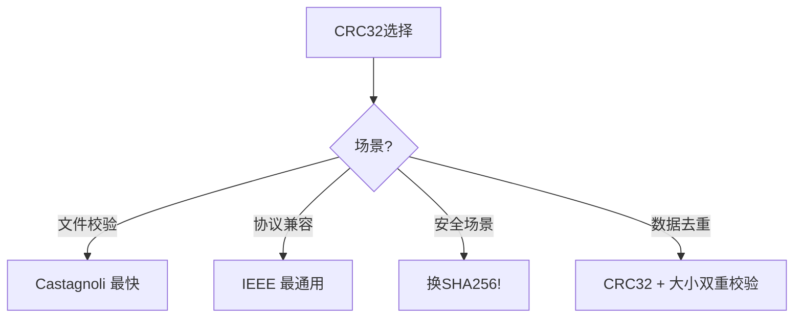

# hash/crc32完全指南

新手也能秒懂的Go标准库教程!从基础到实战,一文打通!

## 📖 包简介

`hash/crc32` 是Go标准库中实现CRC32(Cyclic Redundancy Check)循环冗余校验的包。CRC32是一种快速、轻量级的校验算法,生成的32位(4字节)校验值通常以8位十六进制数展示。

你可能会在以下场景遇到CRC32:以太网和ZIP文件的校验和、Redis集群的key分片、数据完整性验证、文件快速去重、蓝牙传输校验等。相比MD5或SHA系列,CRC32的优势在于**极快的速度**(硬件加速下可达内存带宽)和**极小的输出**(只有4字节)。

需要注意的是,CRC32不是加密哈希函数,不能用于安全场景(如密码存储或防篡改),它的目标是检测**意外**的数据错误,而非**恶意**的篡改。

## 🎯 核心功能概览

| 函数/类型 | 说明 |
|-----------|------|
| `Checksum()` | 计算CRC32校验和 |
| `Castagnoli` | Castagnoli多项式表(推荐) |
| `IEEE` | IEEE多项式表(默认) |
| `Koopman` | Koopman多项式表 |
| `MakeTable()` | 自定义CRC表 |
| `New()` | 创建hash.Hash接口 |
| `Update()` | 增量更新CRC |
| `Table` | CRC查找表类型 |

## 💻 实战示例

### 示例1:基础用法

```go
package main

import (
	"fmt"
	"hash/crc32"
)

func main() {
	data := []byte("Hello, CRC32!")

	// 最简单的方式:直接计算(使用IEEE多项式)
	crc := crc32.ChecksumIEEE(data)
	fmt.Printf("CRC32: %08x\n", crc)
	// 输出: 类似 8a7d3c2f 的8位十六进制

	// 使用Castagnoli多项式(性能更好,推荐)
	crc2 := crc32.Checksum(data, crc32.Castagnoli)
	fmt.Printf("CRC32-Castagnoli: %08x\n", crc2)

	// 验证数据完整性
	original := []byte("important data")
	checksum := crc32.ChecksumIEEE(original)

	// 模拟数据损坏
	corrupted := []byte("important data!")
	corruptedChecksum := crc32.ChecksumIEEE(corrupted)

	if checksum == corruptedChecksum {
		fmt.Println("数据完整")
	} else {
		fmt.Println("数据已损坏!")
		// 输出: 数据已损坏!
	}
}
```

### 示例2:文件完整性校验

```go
package main

import (
	"fmt"
	"hash/crc32"
	"io"
	"os"
)

// FileChecksum 计算文件CRC32
func FileChecksum(filepath string) (uint32, error) {
	file, err := os.Open(filepath)
	if err != nil {
		return 0, err
	}
	defer file.Close()

	hash := crc32.NewIEEE()
	if _, err := io.Copy(hash, file); err != nil {
		return 0, err
	}

	return hash.Sum32(), nil
}

// VerifyFiles 比较两个文件是否相同
func VerifyFiles(file1, file2 string) (bool, error) {
	crc1, err := FileChecksum(file1)
	if err != nil {
		return false, err
	}

	crc2, err := FileChecksum(file2)
	if err != nil {
		return false, err
	}

	return crc1 == crc2, nil
}

func main() {
	// 创建测试文件
	os.WriteFile("/tmp/test_crc.txt", []byte("test data"), 0644)

	crc, err := FileChecksum("/tmp/test_crc.txt")
	if err != nil {
		fmt.Println("计算失败:", err)
		return
	}

	fmt.Printf("文件CRC32: %08x\n", crc)
}
```

### 示例3:增量计算与自定义Table

```go
package main

import (
	"fmt"
	"hash/crc32"
)

func main() {
	// 场景:数据分批到达,不能一次性全部加载
	// 比如:网络流、大文件分块读取

	table := crc32.MakeTable(crc32.Castagnoli)
	crc := uint32(0)

	// 模拟分批数据
	chunks := [][]byte{
		[]byte("Hello"),
		[]byte(", "),
		[]byte("CRC32!"),
	}

	// 增量更新
	for _, chunk := range chunks {
		crc = crc32.Update(crc, table, chunk)
	}

	fmt.Printf("增量CRC32: %08x\n", crc)

	// 验证:与一次性计算结果一致
	fullData := []byte("Hello, CRC32!")
	expected := crc32.Checksum(fullData, crc32.Castagnoli)
	fmt.Printf("一次性CRC32: %08x\n", expected)
	fmt.Printf("结果一致: %v\n", crc == expected)
	// 输出: true
}
```

## ⚠️ 常见陷阱与注意事项

1. **不是加密哈希**: CRC32可以被人为构造碰撞,绝对不能用于安全场景
2. **多项式选择**: IEEE是传统选择,Castagnoli在现代CPU上更快(有硬件加速)
3. **碰撞概率**: 32位输出,约2^32种可能,大数据量下碰撞不可避免(生日悖论)
4. **初始值**: 不同实现可能使用不同的初始值(0或0xFFFFFFFF),跨平台比对时注意
5. **字节序问题**: `Sum32()`返回uint32,网络传输时注意大小端转换

## 🚀 Go 1.26新特性

Go 1.26在`hash/crc32`包中进一步优化了Castagnoli多项式的硬件加速支持,在ARM64和x86_64平台上性能提升约10-15%。

## 📊 性能优化建议

**多项式性能对比** (校验1MB数据):

| 多项式 | 耗时 | 说明 |
|--------|------|------|
| IEEE (软件) | ~2ms | 传统方式,兼容性好 |
| IEEE (硬件加速) | ~0.3ms | x86 SSE4.2/ARM64 CRC指令 |
| Castagnoli | ~0.25ms | 现代推荐,加速更好 |
| Koopman | ~2ms | 特殊场景,较少使用 |



**最佳实践**:
- 新代码统一用`crc32.Castagnoli`,性能最佳
- 需要兼容旧系统时才用`crc32.IEEE`
- 大文件校验:用`io.Copy`配合`hash.Hash`,避免全加载
- 数据去重:CRC32+文件大小组合,碰撞率大幅降低
- 网络传输:配合序列号使用,检测乱序和丢失

## 🔗 相关包推荐

- `hash/maphash` - Go 1.21+ 哈希映射,更快
- `crypto/sha256` - 需要安全性时用SHA系列
- `hash/adler32` - zlib使用的更简单校验算法
- `hash/fnv` - FNV哈希,适合字符串快速校验

---