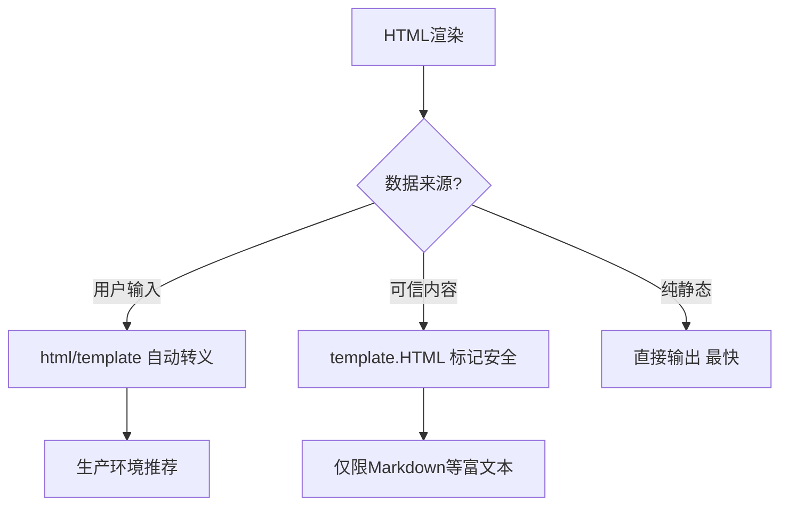

# html/template完全指南

新手也能秒懂的Go标准库教程!从基础到实战,一文打通!

## 📖 包简介

`html/template` 是Go标准库中专门用于生成HTML的安全模板引擎。它与`text/template`拥有完全相同的API和语法,但增加了一个至关重要的功能:**自动上下文感知的HTML转义**,有效防止XSS(跨站脚本)攻击。

在Web开发中,将用户数据直接输出到HTML中是极其危险的操作。比如用户名为`<script>alert('hack!')</script>`,如果不转义直接渲染,就会执行恶意脚本。`html/template`会自动识别当前上下文(HTML正文、属性值、URL、JavaScript、CSS等)并进行相应的转义。

这也是Go的设计哲学之一:**安全应该是默认的,而不是需要开发者主动去添加的**。这也是为什么Go没有选择给`text/template`添加安全选项,而是专门创建了一个新的包——强制开发者做出明确选择。

## 🎯 核心功能概览

| 函数/类型 | 说明 |
|-----------|------|
| `New()` | 创建模板(同text/template) |
| `Parse()` | 解析模板 |
| `Execute()` | 执行渲染 |
| `HTML()` | 标记为安全HTML(不转义) |
| `JS()` | 标记为安全JavaScript |
| `URL()` | 标记为安全URL |
| `CSS()` | 标记为安全CSS |
| `Attr()` | 标记为安全属性 |
| `Srcset()` | 标记为安全Srcset |

## 💻 实战示例

### 示例1:XSS防护

```go
package main

import (
	"html/template"
	"os"
)

func main() {
	// 模拟恶意用户输入
	tmpl := `<!DOCTYPE html>
<html>
<head><title>{{.Title}}</title></head>
<body>
  <h1>Hello, {{.Name}}!</h1>
  <div class="comment">{{.Comment}}</div>
  <a href="{{.Link}}">点击这里</a>
</body>
</html>
`

	// 包含XSS攻击的数据
	data := map[string]string{
		"Title":   "安全测试",
		"Name":    "<script>alert('XSS!')</script>",
		"Comment": "Great post! ",
		"Link":    "javascript:alert('steal cookie')",
	}

	t, err := template.New("page").Parse(tmpl)
	if err != nil {
		panic(err)
	}

	t.Execute(os.Stdout, data)
	/* 输出中的危险内容会被转义:
	<h1>Hello, &lt;script&gt;alert(&#39;XSS!&#39;)&lt;/script&gt;!</h1>
	<div class="comment">Great post! &lt;img src=x onerror=alert(&#39;hack&#39;)&gt;</div>
	<a href="#ZgotmplZ">点击这里</a>
	*/
	// 注意: javascript: URL会被替换为 #ZgotmplZ
}
```

### 示例2:不同上下文的自动转义

```go
package main

import (
	"fmt"
	"html/template"
	"strings"
)

func main() {
	tmpl := `HTML正文: {{.Text}}
HTML属性: <div class="{{.Class}}">内容</div>
URL上下文: <a href="/search?q={{.Query}}">搜索</a>
JS上下文: <script>var msg = "{{.Message}}";</script>
CSS上下文: <style>body { color: {{.Color}}; }</style>
`

	t, _ := template.New("context").Parse(tmpl)

	data := map[string]string{
		"Text":    "<b>粗体</b>",
		"Class":   `"><script>hack()</script>`,
		"Query":   "Go语言&模板",
		"Message": "Hello\"; alert('XSS');//",
		"Color":   "red; background: url(javascript:hack)",
	}

	var buf strings.Builder
	t.Execute(&buf, data)
	fmt.Println(buf.String())
	/* 每种上下文都会进行相应的转义:
	HTML正文: &lt;b&gt;粗体&lt;/b&gt;
	HTML属性: <div class="&#34;&gt;&lt;script&gt;hack()&lt;/script&gt;">内容</div>
	URL上下文: <a href="/search?q=Go%E8%AF%AD%E8%A8%80&%E6%A8%A1%E6%9D%BF">搜索</a>
	JS上下文: <script>var msg = "Hello\u0022; alert(\u0027XSS\u0027);//";</script>
	CSS上下文: <style>body { color: red; background: url(ZgotmplZ); }</style>
	*/
}
```

### 示例3:标记安全HTML(信任的内容)

```go
package main

import (
	"html/template"
	"os"
)

func main() {
	// 有时你需要渲染信任的HTML(如Markdown转换结果)
	// 使用template.HTML()标记为安全

	tmpl := `<!DOCTYPE html>
<html>
<body>
  <!-- 用户评论(需要转义) -->
  <div class="user-comment">{{.Comment}}</div>

  <!-- 富文本内容(信任的HTML,不转义) -->
  <article class="content">{{.RichContent}}</article>
</body>
</html>
`

	data := struct {
		Comment    string
		RichContent template.HTML
	}{
		Comment: "这是一条评论<script>不安全的</script>",
		// 标记为template.HTML后,不会被转义
		RichContent: template.HTML(`<h2>标题</h2><p>这是<em>富文本</em>内容</p>`),
	}

	t, _ := template.New("page").Parse(tmpl)
	t.Execute(os.Stdout, data)
}
```

## ⚠️ 常见陷阱与注意事项

1. **不要绕开转义**: 滥用`template.HTML()`标记不可信内容会导致XSS漏洞,只标记你自己生成的HTML
2. **上下文检测有局限**: 动态拼接的模板可能无法正确识别上下文,保持模板结构清晰
3. **URL白名单**: `javascript:`和`data:`等危险协议会被拦截,但开发者可能期望这些链接可用
4. **性能开销**: 自动转义比`text/template`慢约5-10%,这是安全代价,可接受
5. **预检查模板**: 上线前用恶意输入测试模板输出,确保没有遗漏的转义

## 🚀 Go 1.26新特性

Go 1.26增强了`html/template`的上下文分析能力,对嵌套模板和动态属性值的转义更加精确,减少了误判(false positive)的情况。特别是对HTML5自定义属性的支持更加完善。

## 📊 性能优化建议

**转义性能对比** (渲染包含用户数据的HTML页面):

| 方法 | 耗时 | 安全性 |
|------|------|--------|
| `html/template` | ~1.0x | 自动转义,安全 |
| `text/template` | ~0.9x | 无转义,危险! |
| 手动转义+text/template | ~1.3x | 容易遗漏,不推荐 |



**最佳实践**:
- 所有Web项目: 统一用`html/template`,禁止用`text/template`渲染HTML
- 富文本编辑器: 后端用成熟的Markdown/HTML清理库(如`bluemonday`),再用`template.HTML`标记
- 模板复用: 启动时`ParseFiles()`加载所有模板,运行时只`Execute()`
- CSP头配合: 开启Content-Security-Policy,即使有XSS也难以执行
- 定期审计: 用`gosec`等工具扫描代码,查找`template.HTML`的滥用

## 🔗 相关包推荐

- `text/template` - 纯文本模板,不渲染HTML
- `encoding/html` - HTML实体转义(底层实现)
- `net/http` - Web服务器,常配合模板使用
- `github.com/microcosm-cc/bluemonday` - HTML清理,富文本安全处理

---