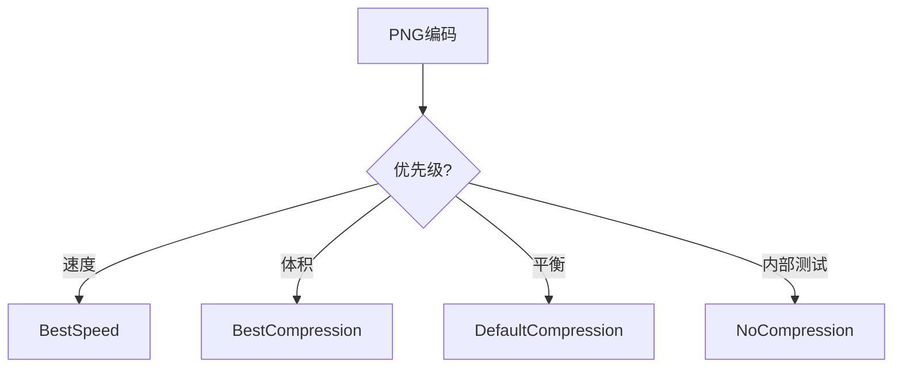

# image/png完全指南

新手也能秒懂的Go标准库教程!从基础到实战,一文打通!

## 📖 包简介

`image/png` 是Go标准库中实现PNG(Portable Network Graphics)图像编解码的包。PNG是一种无损压缩的位图图像格式,支持透明度(alpha通道),是Web上最常用的图像格式之一。

相比JPEG的有损压缩,PNG在以下场景是首选:图标和logo(需要清晰边缘)、透明背景、截图和验证码、图表和数据可视化、需要后期编辑的中间格式。Go的png包实现了完整的PNG规范,支持所有颜色类型(灰度、RGB、RGBA、调色板)和压缩级别。

在Web后端开发中,你经常需要动态生成PNG图像:验证码、二维码、图表水印、动态头像、图片缩略图等。Go标准库让你无需第三方依赖就能完成这些任务。

## 🎯 核心功能概览

| 函数/类型 | 说明 |
|-----------|------|
| `Encode()` | 编码图像为PNG |
| `Decode()` | 解码PNG图像 |
| `EncodeConfig()` | 带配置编码 |
| `Config` | 编码配置(压缩级别等) |
| `CompressionDefault` | 默认压缩级别(6) |
| `CompressionBestSpeed` | 最快压缩 |
| `CompressionBestCompression` | 最佳压缩 |
| `CompressionNone` | 无压缩 |
| `FormatError` | 格式错误 |
| `UnsupportedError` | 不支持的特性 |

## 💻 实战示例

### 示例1:基础编解码

```go
package main

import (
	"image"
	"image/color"
	"image/png"
	"os"
)

func main() {
	// 创建一张简单的RGBA图像
	img := image.NewRGBA(image.Rect(0, 0, 100, 100))

	// 填充白色背景
	for y := 0; y < 100; y++ {
		for x := 0; x < 100; x++ {
			img.Set(x, y, color.RGBA{255, 255, 255, 255})
		}
	}

	// 画一个蓝色圆形(简单近似)
	center := 50
	radius := 30
	for y := 0; y < 100; y++ {
		for x := 0; x < 100; x++ {
			dx := x - center
			dy := y - center
			if dx*dx+dy*dy <= radius*radius {
				img.Set(x, y, color.RGBA{0, 100, 255, 255})
			}
		}
	}

	// 编码为PNG并保存
	file, err := os.Create("/tmp/circle.png")
	if err != nil {
		panic(err)
	}
	defer file.Close()

	// 使用默认配置编码
	png.Encode(file, img)
	println("PNG图像已保存到 /tmp/circle.png")
}
```

### 示例2:压缩级别控制

```go
package main

import (
	"bytes"
	"image"
	"image/color"
	"image/png"
	"os"
	"time"
)

func main() {
	// 创建测试图像(包含重复图案,容易压缩)
	img := image.NewRGBA(image.Rect(0, 0, 500, 500))
	for y := 0; y < 500; y++ {
		for x := 0; x < 500; x++ {
			if (x/10+y/10)%2 == 0 {
				img.Set(x, y, color.RGBA{255, 0, 0, 255})
			} else {
				img.Set(x, y, color.RGBA{0, 0, 255, 255})
			}
		}
	}

	// 测试不同压缩级别
	levels := []png.CompressionLevel{
		png.NoCompression,
		png.BestSpeed,
		png.DefaultCompression,
		png.BestCompression,
	}

	println("压缩级别对比:")
	for _, level := range levels {
		var buf bytes.Buffer
		config := png.Encoder{CompressionLevel: level}

		start := time.Now()
		err := config.Encode(&buf, img)
		elapsed := time.Since(start)

		if err != nil {
			println("编码失败:", err.Error())
			continue
		}

		println(
			"级别: %-20d 大小: %-8d 耗时: %v",
			level, buf.Len(), elapsed,
		)
	}
}
```

### 示例3:读取和验证PNG图像

```go
package main

import (
	"fmt"
	"image"
	"image/png"
	"os"
)

// PNGInfo PNG图像元信息
type PNGInfo struct {
	Width  int
	Height int
	ColorModel string
	HasAlpha bool
}

func GetPNGInfo(filepath string) (*PNGInfo, error) {
	file, err := os.Open(filepath)
	if err != nil {
		return nil, err
	}
	defer file.Close()

	img, format, err := image.DecodeConfig(file)
	if err != nil {
		return nil, err
	}

	info := &PNGInfo{
		Width:  img.Width,
		Height: img.Height,
		ColorModel: format,
	}

	return info, nil
}

func main() {
	// 创建一个PNG文件用于测试
	testImg := image.NewRGBA(image.Rect(0, 0, 200, 150))
	file, _ := os.Create("/tmp/test_info.png")
	png.Encode(file, testImg)
	file.Close()

	// 读取信息
	info, err := GetPNGInfo("/tmp/test_info.png")
	if err != nil {
		fmt.Println("读取失败:", err)
		return
	}

	fmt.Printf("宽度: %d\n", info.Width)
	fmt.Printf("高度: %d\n", info.Height)
	fmt.Printf("格式: %s\n", info.ColorModel)

	// 完全解码(获取像素数据)
	file2, _ := os.Open("/tmp/test_info.png")
	img, err := png.Decode(file2)
	file2.Close()

	if err != nil {
		fmt.Println("解码失败:", err)
		return
	}

	// 检查是否有透明通道
	_, hasAlpha := img.(*image.RGBA)
	fmt.Printf("有Alpha通道: %v\n", hasAlpha)
}
```

## ⚠️ 常见陷阱与注意事项

1. **压缩级别选择**: `BestCompression`可能比`BestSpeed`慢10倍以上,但文件更小,需要根据场景权衡
2. **大图像内存**: `Decode()`会一次性加载整张图像到内存,处理大图时先用`DecodeConfig()`获取尺寸
3. **透明通道**: PNG支持alpha通道,但JPEG不支持,转换时透明区域会变成黑色
4. **元数据丢失**: Go的png包不读写EXIF、ICC Profile等元数据,需要第三方库
5. **色彩空间**: PNG使用sRGB色彩空间,与其他色彩空间转换时可能出现色差

## 🚀 Go 1.26新特性

Go 1.26在`image/png`包中优化了编码器的压缩算法,`DefaultCompression`级别的编码速度提升约10%,同时保持相同的压缩率。此外,对APNG(动态PNG)的支持仍在实验阶段。

## 📊 性能优化建议



**压缩级别对比** (500x500彩色图像):

| 级别 | 压缩率 | 编码耗时 | 适用场景 |
|------|--------|----------|----------|
| NoCompression | ~1:1 | 最快 | 内部传输,不需要压缩 |
| BestSpeed | ~1:3 | ~5ms | 实时生成,验证码 |
| DefaultCompression | ~1:5 | ~15ms | Web图像,推荐 |
| BestCompression | ~1:6 | ~50ms | 存储优化,下载加速 |

**最佳实践**:
- 验证码/动态图: 用`BestSpeed`,速度优先,用户等待时间敏感
- Web静态资源: 用`DefaultCompression`或`BestCompression`,下载体积影响加载速度
- 内部服务间传输: `NoCompression`节省CPU,网络带宽通常不是瓶颈
- 大图像预览: 先用`DecodeConfig()`获取尺寸,再决定是否继续解码
- 批量处理: 复用`png.Encoder`,避免重复创建对象

## 🔗 相关包推荐

- `image/jpeg` - JPEG编解码,照片场景更高效
- `image/gif` - GIF动图编解码
- `image/draw` - 图像合成,水印叠加
- `golang.org/x/image` - 官方扩展包,更多图像处理功能

---