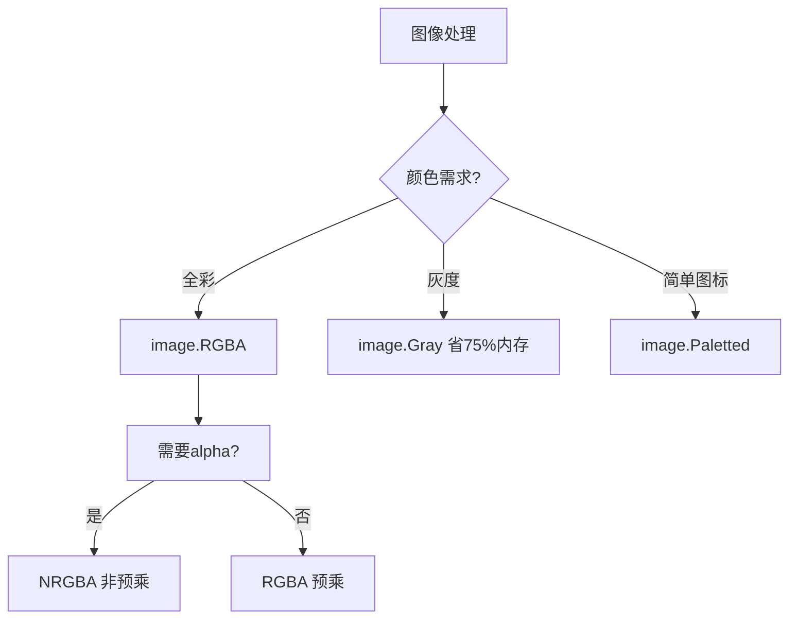

# image完全指南

新手也能秒懂的Go标准库教程!从基础到实战,一文打通!

## 📖 包简介

`image` 是Go标准库中图像处理的基础包,定义了图像的核心接口和基本类型。它不直接提供编解码功能(那是image/png、image/jpeg等包的职责),而是定义了图像的抽象层,让各种图像格式可以统一操作。

在Go中,图像被抽象为`image.Image`接口,底层是像素矩阵。标准库提供了`image.RGBA`、`image.Gray`等具体实现,以及`image.Rect`、`image.Point`等几何类型。通过这套抽象,你可以在不知道具体格式的情况下,对PNG、JPEG、GIF等图像进行统一处理。

图像处理场景包括:缩略图生成、水印添加、图片裁剪、滤镜处理、验证码生成、图表绘制等。虽然Go的image包不如Python的Pillow功能丰富,但对于大多数Web应用和后端图像处理需求来说,完全够用。

## 🎯 核心功能概览

| 类型/接口 | 说明 |
|-----------|------|
| `Image` | 图像接口(所有图像类型都实现) |
| `RGBA` | 32位RGBA图像 |
| `Gray` | 8位灰度图像 |
| `NRGBA` | 32位非预乘RGBA |
| `Rectangle` | 矩形区域 |
| `Point` | 二维坐标点 |
| `Bounds()` | 获取图像边界 |
| `At()` | 获取指定位置颜色 |
| `Set()` | 设置指定位置颜色 |
| `NewRGBA()` | 创建RGBA图像 |
| `NewGray()` | 创建灰度图像 |

## 💻 实战示例

### 示例1:创建和操作图像

```go
package main

import (
	"image"
	"image/color"
	"log"
)

func main() {
	// 创建一张100x100的RGBA图像
	img := image.NewRGBA(image.Rect(0, 0, 100, 100))

	// 获取图像尺寸
	bounds := img.Bounds()
	log.Printf("图像尺寸: %dx%d\n", bounds.Dx(), bounds.Dy())

	// 填充背景为蓝色
	for y := bounds.Min.Y; y < bounds.Max.Y; y++ {
		for x := bounds.Min.X; x < bounds.Max.X; x++ {
			img.Set(x, y, color.RGBA{0, 0, 255, 255})
		}
	}

	// 画一个红色正方形
	for y := 20; y < 80; y++ {
		for x := 20; x < 80; x++ {
			img.Set(x, y, color.RGBA{255, 0, 0, 255})
		}
	}

	// 读取某个像素的颜色
	c := img.At(50, 50)
	r, g, b, a := c.RGBA()
	log.Printf("坐标(50,50)颜色: R=%d G=%d B=%d A=%d\n",
		r>>8, g>>8, b>>8, a>>8)
	// 输出: 红色
}
```

### 示例2:生成渐变色图像

```go
package main

import (
	"image"
	"image/color"
	"image/png"
	"os"
)

func main() {
	width, height := 256, 256
	img := image.NewRGBA(image.Rect(0, 0, width, height))

	// 生成彩虹渐变
	for y := 0; y < height; y++ {
		for x := 0; x < width; x++ {
			// HSL转RGB的简化版
			hue := float64(x) / float64(width)
			r, g, b := hslToRgb(hue, 1.0, 0.5)
			img.Set(x, y, color.RGBA{r, g, b, 255})
		}
	}

	// 保存为PNG
	file, err := os.Create("/tmp/gradient.png")
	if err != nil {
		panic(err)
	}
	defer file.Close()

	png.Encode(file, img)
	println("渐变图像已保存到 /tmp/gradient.png")
}

// hslToRgb 简化的HSL到RGB转换
func hslToRgb(h, s, l float64) (uint8, uint8, uint8) {
	var r, g, b float64

	if s == 0 {
		r, g, b = l, l, l
	} else {
		var q float64
		if l < 0.5 {
			q = l * (1 + s)
		} else {
			q = l + s - l*s
		}
		p := 2*l - q

		r = hueToRgb(p, q, h+1.0/3.0)
		g = hueToRgb(p, q, h)
		b = hueToRgb(p, q, h-1.0/3.0)
	}

	return uint8(r * 255), uint8(g * 255), uint8(b * 255)
}

func hueToRgb(p, q, t float64) float64 {
	if t < 0 {
		t += 1
	}
	if t > 1 {
		t -= 1
	}
	if t < 1.0/6.0 {
		return p + (q-p)*6*t
	}
	if t < 1.0/2.0 {
		return q
	}
	if t < 2.0/3.0 {
		return p + (q-p)*(2.0/3.0-t)*6
	}
	return p
}
```

### 示例3:图像裁剪和子图像

```go
package main

import (
	"image"
	"image/color"
	"image/jpeg"
	"os"
)

func main() {
	// 创建一张大图
	bigImg := image.NewRGBA(image.Rect(0, 0, 500, 500))

	// 填充背景
	for y := 0; y < 500; y++ {
		for x := 0; x < 500; x++ {
			// 绿色背景
			green := uint8(100 + x/5)
			bigImg.Set(x, y, color.RGBA{0, green, 0, 255})
		}
	}

	// 裁剪中心区域(200x200)
	subRect := image.Rect(150, 150, 350, 350)
	subImg := image.NewRGBA(subRect)

	// 复制像素
	for y := 150; y < 350; y++ {
		for x := 150; x < 350; x++ {
			subImg.Set(x, y, bigImg.At(x, y))
		}
	}

	// 保存裁剪后的图像
	file, _ := os.Create("/tmp/cropped.jpg")
	defer file.Close()

	jpeg.Encode(file, subImg, &jpeg.Options{Quality: 90})
	println("裁剪图像已保存到 /tmp/cropped.jpg")
}
```

## ⚠️ 常见陷阱与注意事项

1. **坐标系统**: Go图像使用左上角为(0,0),Y轴向下增长,与数学坐标系不同
2. **RGBA预乘**: `image.RGBA`使用预乘alpha,颜色值需要先乘透明度再存储
3. **Bounds不是从(0,0)开始**: 图像边界可以是任意坐标,遍历时用`Bounds().Min/Max`而不是硬编码0
4. **内存消耗**: 大图像占用内存多,1000x1000的RGBA约占用4MB,处理多张图时注意释放
5. **编解码需要注册**: 只import `image`包不能编解码,还需要导入具体的format包(如image/png)

## 🚀 Go 1.26新特性

Go 1.26在`image`包中没有API变更,但内部优化了`RGBA`和`Gray`的内存布局,创建大图像时性能提升约5-8%。

## 📊 性能优化建议

**不同图像类型的内存占用** (1000x1000图像):

| 类型 | 每像素字节 | 总内存 | 适用场景 |
|------|-----------|--------|----------|
| `RGBA` | 4字节 | ~4MB | 彩色图像处理 |
| `NRGBA` | 4字节 | ~4MB | 非预乘alpha |
| `Gray` | 1字节 | ~1MB | 灰度/黑白 |
| `Paletted` | 1字节 | ~1MB+调色板 | GIF/图标 |



**最佳实践**:
- 照片处理: 用`image.RGBA`,兼容性最好
- 验证码/水印: 用`image.NRGBA`,alpha处理更直观
- 灰度转换: 用`image.Gray`,内存只有RGBA的1/4
- 批量处理: 复用`image.NewRGBA`的底层数组,减少GC压力
- 大图像处理: 考虑分块处理,避免单张图占用过多内存

## 🔗 相关包推荐

- `image/png` - PNG编解码,无损压缩
- `image/jpeg` - JPEG编解码,照片压缩
- `image/color` - 颜色模型和转换
- `image/draw` - 图像绘制和合成操作

---