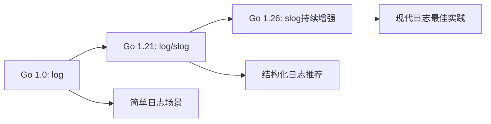

#  log完全指南

新手也能秒懂的Go标准库教程!从基础到实战,一文打通!

## 📖 包简介

`log` 包是Go标准库中简单而实用的日志工具。它提供了基本的日志记录功能,包括时间戳、文件位置和日志级别的输出。虽然它不像zap、logrus或slog那样功能丰富,但对于小型脚本、快速原型或简单的服务来说,`log` 包已经足够胜任基本的日志需求。

需要特别说明的是,Go 1.21引入了全新的 `log/slog` 包作为官方的结构化日志解决方案,推荐在新项目中优先使用 `slog`。但理解 `log` 包仍然重要——它是Go日志的基础,很多第三方日志库都在它的基础上构建,而且在一些简单的场景中,它的简洁性反而是优势。

适用场景:简单脚本日志、快速原型开发、基础错误记录、学习Go日志概念、第三方日志库的底层封装。

## 🎯 核心功能概览

### 核心类型

| 类型 | 用途 | 说明 |
|------|------|------|
| `log.Logger` | 日志对象 | 独立的日志实例,可自定义输出 |
| `log.LstdFlags` 等常量 | 日志标志 | 控制输出格式(时间戳、文件位置等) |

### 包级别函数(全局logger)

| 函数 | 用途 | 说明 |
|------|------|------|
| `log.Print(v...)` | 普通日志 | 打印到标准错误输出 |
| `log.Println(v...)` | 普通日志+换行 | 自动添加换行符 |
| `log.Printf(format, v...)` | 格式化日志 | 支持fmt.Printf格式 |
| `log.Fatal(v...)` | 致命错误 | 打印后调用os.Exit(1) |
| `log.Fatalf(format, v...)` | 格式化致命错误 | Fatal的格式化版本 |
| `log.Panic(v...)` | 恐慌日志 | 打印后调用panic() |
| `log.Panicf(format, v...)` | 格式化恐慌日志 | Panic的格式化版本 |
| `log.SetFlags(flags)` | 设置标志 | 控制输出格式 |
| `log.SetPrefix(prefix)` | 设置前缀 | 添加日志前缀 |
| `log.SetOutput(w)` | 设置输出目标 | 默认os.Stderr |
| `log.SetReportCaller(b)` | 报告调用者 | Go 1.21+,显示文件名和行号 |

### 输出格式标志

| 常量 | 含义 | 示例输出 |
|------|------|---------|
| `Ldate` | 日期 | `2026/04/06` |
| `Ltime` | 时间 | `15:04:05` |
| `Lmicroseconds` | 微秒 | `15:04:05.000000` |
| `Llongfile` | 完整文件路径 | `/path/to/main.go:10` |
| `Lshortfile` | 短文件路径 | `main.go:10` |
| `LUTC` | UTC时区 | 使用UTC代替本地时区 |
| `Lmsgprefix` | 消息前缀 | 前缀在消息前而非行首 |
| `LstdFlags` | 默认组合 | `Ldate \| Ltime` |

## 💻 实战示例

### 示例1: 基础用法 - 快速上手

```go
package main

import (
	"log"
)

func main() {
	// 最基本的日志输出(默认输出到os.Stderr)
	log.Println("程序启动")
	log.Println("处理用户请求...")

	// 格式化输出
	name := "Alice"
	age := 30
	log.Printf("用户信息: 姓名=%s, 年龄=%d\n", name, age)

	// 带时间戳和文件位置的输出(默认已包含日期和时间)
	log.Println("这是一条带时间戳的日志")

	// Fatal会在打印后调用os.Exit(1)
	// 取消注释会终止程序:
	// log.Fatal("发生致命错误!")

	// Panic会在打印后调用panic()
	// 取消注释会触发panic:
	// log.Panic("发生恐慌!")
}
```

### 示例2: 进阶用法 - 自定义Logger和输出格式

```go
package main

import (
	"bytes"
	"fmt"
	"log"
	"os"
)

func main() {
	// ===== 自定义全局logger的输出格式 =====

	// 设置输出标志: 日期 + 时间 + 微秒 + 短文件名 + 行号
	log.SetFlags(log.Ldate | log.Ltime | log.Lmicroseconds | log.Lshortfile)

	// 设置前缀
	log.SetPrefix("[MyApp] ")

	// 报告调用者信息(Go 1.21+)
	log.SetReportCaller(true)

	log.Println("自定义格式的日志")
	// 输出: [MyApp] 2026/04/06 10:30:45.123456 main.go:25: 自定义格式的日志

	// ===== 创建独立的Logger实例 =====

	// 创建写入文件的logger
	file, err := os.OpenFile("app.log", os.O_CREATE|os.O_WRONLY|os.O_APPEND, 0644)
	if err != nil {
		log.Fatalf("打开日志文件失败: %v", err)
	}
	defer file.Close()

	fileLogger := log.New(file, "[FileLog] ", log.LstdFlags|log.Lshortfile)

	fileLogger.Println("这条日志写入文件")
	fileLogger.Printf("用户 %s 执行了操作 %s\n", "Alice", "login")

	// ===== 创建多个不同级别的logger =====

	// 错误logger(输出到stderr)
	errorLogger := log.New(os.Stderr, "[ERROR] ", log.LstdFlags|log.Lshortfile)

	// 信息 logger(输出到stdout)
	infoLogger := log.New(os.Stdout, "[INFO] ", log.LstdFlags)

	// 审计 logger(输出到单独的审计文件)
	auditBuffer := &bytes.Buffer{}
	auditLogger := log.New(auditBuffer, "[AUDIT] ", log.LstdFlags)

	errorLogger.Println("数据库连接失败")
	infoLogger.Println("服务器启动成功")
	auditLogger.Println("用户 Alice 登录系统")

	fmt.Printf("\n审计日志内容:\n%s\n", auditBuffer.String())
}
```

### 示例3: 最佳实践 - 简易日志中间件

```go
package main

import (
	"fmt"
	"log"
	"net/http"
	"os"
	"time"
)

// RequestLogger 请求日志中间件
type RequestLogger struct {
	logger *log.Logger
}

// NewRequestLogger 创建请求日志器
func NewRequestLogger() *RequestLogger {
	return &RequestLogger{
		logger: log.New(os.Stdout, "[HTTP] ", log.LstdFlags|log.Lmicroseconds),
	}
}

// Middleware HTTP中间件
func (rl *RequestLogger) Middleware(next http.Handler) http.Handler {
	return http.HandlerFunc(func(w http.ResponseWriter, r *http.Request) {
		start := time.Now()

		// 包装 ResponseWriter 来捕获状态码
		rw := &responseWriter{ResponseWriter: w, statusCode: http.StatusOK}

		// 执行下一个处理器
		next.ServeHTTP(rw, r)

		// 记录请求日志
		duration := time.Since(start)
		rl.logger.Printf(
			"%s %s %d %s",
			r.Method,
			r.URL.Path,
			rw.statusCode,
			duration,
		)
	})
}

// responseWriter 包装器
type responseWriter struct {
	http.ResponseWriter
	statusCode int
}

func (rw *responseWriter) WriteHeader(code int) {
	rw.statusCode = code
	rw.ResponseWriter.WriteHeader(code)
}

// 模拟业务处理器
func helloHandler(w http.ResponseWriter, r *http.Request) {
	fmt.Fprintf(w, "Hello, World!\n")
}

func errorHandler(w http.ResponseWriter, r *http.Request) {
	http.Error(w, "内部错误", http.StatusInternalServerError)
}

func main() {
	// 配置全局日志
	log.SetFlags(log.LstdFlags | log.Lshortfile)
	log.SetPrefix("[Main] ")
	log.Println("服务启动中...")

	// 创建路由
	mux := http.NewServeMux()
	mux.HandleFunc("/", helloHandler)
	mux.HandleFunc("/error", errorHandler)

	// 应用日志中间件
	requestLogger := NewRequestLogger()
	handler := requestLogger.Middleware(mux)

	log.Println("HTTP服务监听 :8080")
	if err := http.ListenAndServe(":8080", handler); err != nil {
		log.Fatalf("服务启动失败: %v", err)
	}
}
```

## ⚠️ 常见陷阱与注意事项

1. **`log.Fatal` 和 `log.Panic` 会终止程序**: 这两个函数不仅仅是"更严重的日志级别",它们会真正终止程序!`log.Fatal` 调用 `os.Exit(1)`,`log.Panic` 调用 `panic()`。如果你只是想记录一条严重的错误信息但不想退出,用 `log.Printf` 或 `log.Println` 代替。

2. **没有真正的日志级别概念**: `log` 包本身没有DEBUG、INFO、WARN、ERROR等级别。它只有 `Print`、`Fatal`、`Panic` 三种行为不同的函数。如果你需要级别过滤,要么自己封装,要么使用 `log/slog` 或第三方库。

3. **并发安全但要小心输出目标**: `log.Logger` 本身是并发安全的(内部有互斥锁),但如果你通过 `SetOutput` 设置了一个非线程安全的 `io.Writer`,并发写入仍然可能出问题。

4. **`SetReportCaller` 的性能开销**: 启用 `SetReportCaller(true)` 会在每次日志调用时获取调用栈信息,带来一定的性能开销。高并发场景下建议关闭此选项或使用第三方高性能日志库。

5. **不适合作为生产级日志方案**: 虽然 `log` 包简单易用,但它缺少级别过滤、结构化输出、JSON格式化等生产环境必需的功能。新项目建议使用 Go 1.21+ 的 `log/slog` 包。

## 🚀 Go 1.26新特性

Go 1.26对 `log` 包没有重大变更。需要关注的是:

- **`log/slog` 的持续演进**: Go 1.26继续增强了 `log/slog` 包(结构化日志),这是官方推荐的现代日志方案。`log` 包本身保持稳定,但新功能和新优化都集中在 `slog` 中。
- **向后兼容**: `log` 包作为标准库中最稳定的包之一,API已经多年没有变化,Go 1.26继续保持这一传统。

### Go日志演进路线图



## 📊 性能优化建议

### 日志方案选择指南

| 方案 | 性能 | 功能 | 学习成本 | 推荐场景 |
|-----|------|------|---------|---------|
| `log` | 中 | 基础 | 极低 | 脚本、原型、简单服务 |
| `log/slog` | 高 | 结构化 | 低 | 新项目、生产环境 |
| `zap` | 极高 | 丰富 | 中 | 高性能需求、大规模服务 |
| `logrus` | 中 | 丰富 | 低 | 生态集成、已有项目 |

### 优化log包使用的技巧

```go
// 技巧1: 减少不必要的调用者信息获取
// 坏的实践: 每条日志都获取调用栈
log.SetReportCaller(true) // 有性能开销

// 好的实践: 只在需要时启用
if debugMode {
    log.SetReportCaller(true)
}

// 技巧2: 使用独立的Logger实例减少全局竞争
// 坏的实践: 所有模块共享全局logger
// 高并发下可能成为瓶颈

// 好的实践: 为不同模块创建独立logger
var (
    httpLogger  = log.New(os.Stdout, "[HTTP] ", log.LstdFlags)
    dbLogger    = log.New(os.Stdout, "[DB] ", log.LstdFlags)
    cacheLogger = log.New(os.Stdout, "[CACHE] ", log.LstdFlags)
)

// 技巧3: 预分配缓冲区减少内存分配
// 对于高频日志,可以复用bytes.Buffer
var logBuf bytes.Buffer
func logWithBuffer(logger *log.Logger, msg string) {
    logBuf.Reset()
    logBuf.WriteString(msg)
    logger.Println(logBuf.String())
}
```

### 简单的日志级别过滤实现

```go
package main

import (
	"io"
	"log"
	"os"
)

// Level 日志级别
type Level int

const (
	DEBUG Level = iota
	INFO
	WARN
	ERROR
	FATAL
)

// LevelLogger 带级别的日志记录器
type LevelLogger struct {
	logger *log.Logger
	level  Level
}

// NewLevelLogger 创建级别日志记录器
func NewLevelLogger(w io.Writer, prefix string, level Level) *LevelLogger {
	return &LevelLogger{
		logger: log.New(w, prefix, log.LstdFlags),
		level:  level,
	}
}

// Debug 调试级别
func (l *LevelLogger) Debug(v ...interface{}) {
	if l.level <= DEBUG {
		l.logger.Print("[DEBUG] ", v)
	}
}

// Info 信息级别
func (l *LevelLogger) Info(v ...interface{}) {
	if l.level <= INFO {
		l.logger.Print("[INFO] ", v)
	}
}

// Warn 警告级别
func (l *LevelLogger) Warn(v ...interface{}) {
	if l.level <= WARN {
		l.logger.Print("[WARN] ", v)
	}
}

// Error 错误级别
func (l *LevelLogger) Error(v ...interface{}) {
	if l.level <= ERROR {
		l.logger.Print("[ERROR] ", v)
	}
}

func main() {
	// 创建INFO级别的logger
	logger := NewLevelLogger(os.Stdout, "[App] ", INFO)

	logger.Debug("这条不会显示")    // 被过滤掉
	logger.Info("服务器启动")       // 会显示
	logger.Warn("内存使用率过高")   // 会显示
	logger.Error("数据库连接失败")  // 会显示
}
```

## 🔗 相关包推荐

- **`log/slog`** - Go 1.21+官方结构化日志包(新项目推荐!)
- **`log/syslog`** - Unix系统日志(仅Linux/macOS)
- **`fmt`** - 格式化输出(配合日志)
- **`go.uber.org/zap`** - Uber高性能日志库
- **`github.com/sirupsen/logrus`** - 流行的结构化日志库
- **`github.com/rs/zerolog`** - 零分配JSON日志库

---