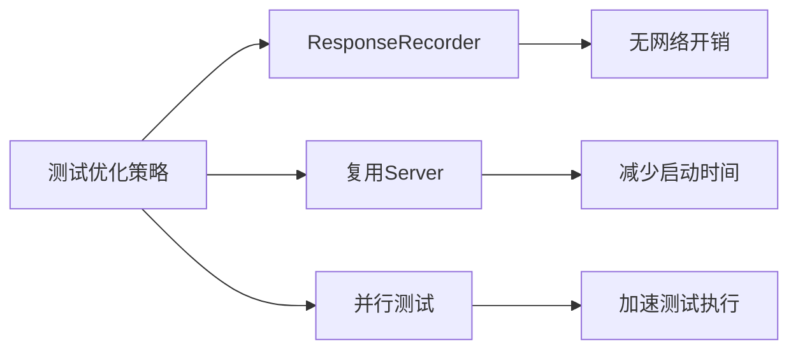

# net/http/httptest完全指南

## 📖 包简介

`net/http/httptest` 是Go测试生态中的"瑞士军刀"，专门为HTTP处理程序和客户端测试而设计。在Web开发中，测试HTTP处理器一直是个头疼的问题——难道每次都要启动真实服务器、发送真实请求吗？显然不现实。`httptest`就是来解决这个痛点的。

这个包提供了两种测试利器：**ResponseRecorder**（响应录制器）和**Server**（测试服务器）。前者可以在内存中模拟HTTP响应，后者可以启动一个真实但临时的HTTP服务器，让你的客户端代码与它交互，而无需任何外部依赖。

Go 1.26为`Server.Client`带来了一个重要更新：当测试服务器处理重定向时，`example.com`及其子域名的请求会被自动重定向到测试服务器本身。这大幅简化了涉及重定向场景的测试代码，让你不再需要手动处理跨域重定向的复杂逻辑。

## 🎯 核心功能概览

| 类型/函数 | 用途 | 说明 |
|-----------|------|------|
| `httptest.NewRecorder` | 创建响应录制器 | 模拟ResponseWriter |
| `httptest.ResponseRecorder` | 响应录制器 | 捕获HTTP响应以便断言 |
| `httptest.NewServer` | 创建测试服务器 | 启动临时HTTP服务器 |
| `httptest.NewTLSServer` | 创建TLS测试服务器 | 启动临时HTTPS服务器 |
| `httptest.Server` | 测试服务器实例 | 提供URL、Client等方法 |

## 💻 实战示例

### 示例1：使用ResponseRecorder测试Handler

```go
package main

import (
	"encoding/json"
	"fmt"
	"net/http"
	"net/http/httptest"
	"strings"
)

// UserHandler 用户API处理器
type UserHandler struct{}

func (h *UserHandler) ServeHTTP(w http.ResponseWriter, r *http.Request) {
	// 路由分发
	switch {
	case r.URL.Path == "/api/users" && r.Method == http.MethodGet:
		h.listUsers(w, r)
	case r.URL.Path == "/api/users" && r.Method == http.MethodPost:
		h.createUser(w, r)
	case strings.HasPrefix(r.URL.Path, "/api/users/") && r.Method == http.MethodGet:
		h.getUser(w, r)
	default:
		http.Error(w, "Not Found", http.StatusNotFound)
	}
}

func (h *UserHandler) listUsers(w http.ResponseWriter, r *http.Request) {
	users := []map[string]interface{}{
		{"id": 1, "name": "Alice"},
		{"id": 2, "name": "Bob"},
	}
	w.Header().Set("Content-Type", "application/json")
	json.NewEncoder(w).Encode(users)
}

func (h *UserHandler) createUser(w http.ResponseWriter, r *http.Request) {
	var user map[string]interface{}
	if err := json.NewDecoder(r.Body).Decode(&user); err != nil {
		http.Error(w, "Invalid JSON", http.StatusBadRequest)
		return
	}
	w.WriteHeader(http.StatusCreated)
	w.Header().Set("Content-Type", "application/json")
	json.NewEncoder(w).Encode(map[string]interface{}{
		"id":      3,
		"name":    user["name"],
		"message": "User created",
	})
}

func (h *UserHandler) getUser(w http.ResponseWriter, r *http.Request) {
	id := strings.TrimPrefix(r.URL.Path, "/api/users/")
	w.Header().Set("Content-Type", "application/json")
	json.NewEncoder(w).Encode(map[string]interface{}{
		"id":   id,
		"name": "User " + id,
	})
}

func main() {
	handler := &UserHandler{}

	// ========== 测试1: GET /api/users ==========
	fmt.Println("=== 测试1: 获取用户列表 ===")
	req := httptest.NewRequest(http.MethodGet, "/api/users", nil)
	w := httptest.NewRecorder()

	handler.ServeHTTP(w, req)

	resp := w.Result()
	fmt.Printf("Status: %d\n", resp.StatusCode)
	fmt.Printf("Content-Type: %s\n", resp.Header.Get("Content-Type"))

	var users []map[string]interface{}
	json.NewDecoder(w.Body).Decode(&users)
	for _, u := range users {
		fmt.Printf("  User: %+v\n", u)
	}

	// ========== 测试2: POST /api/users ==========
	fmt.Println("\n=== 测试2: 创建用户 ===")
	body := strings.NewReader(`{"name": "Charlie"}`)
	req = httptest.NewRequest(http.MethodPost, "/api/users", body)
	w = httptest.NewRecorder()

	handler.ServeHTTP(w, req)

	resp = w.Result()
	fmt.Printf("Status: %d\n", resp.StatusCode)

	var result map[string]interface{}
	json.NewDecoder(w.Body).Decode(&result)
	fmt.Printf("Result: %+v\n", result)

	// ========== 测试3: GET /api/users/123 ==========
	fmt.Println("\n=== 测试3: 获取单个用户 ===")
	req = httptest.NewRequest(http.MethodGet, "/api/users/123", nil)
	w = httptest.NewRecorder()

	handler.ServeHTTP(w, req)

	resp = w.Result()
	fmt.Printf("Status: %d\n", resp.StatusCode)

	var user map[string]interface{}
	json.NewDecoder(w.Body).Decode(&user)
	fmt.Printf("User: %+v\n", user)

	// ========== 测试4: 404 Not Found ==========
	fmt.Println("\n=== 测试4: 404 Not Found ===")
	req = httptest.NewRequest(http.MethodGet, "/api/unknown", nil)
	w = httptest.NewRecorder()

	handler.ServeHTTP(w, req)

	resp = w.Result()
	fmt.Printf("Status: %d\n", resp.StatusCode)
	fmt.Printf("Body: %s", w.Body.String())
}
```

### 示例2：使用测试服务器进行集成测试

```go
package main

import (
	"encoding/json"
	"fmt"
	"io"
	"log"
	"net/http"
	"net/http/httptest"
	"strings"
)

// 模拟真实的API处理器
func createAPIHandler() http.Handler {
	mux := http.NewServeMux()

	users := map[string]string{
		"1": "Alice",
		"2": "Bob",
	}

	mux.HandleFunc("GET /api/users", func(w http.ResponseWriter, r *http.Request) {
		var result []map[string]string
		for id, name := range users {
			result = append(result, map[string]string{"id": id, "name": name})
		}
		json.NewEncoder(w).Encode(result)
	})

	mux.HandleFunc("POST /api/users", func(w http.ResponseWriter, r *http.Request) {
		var data struct {
			Name string `json:"name"`
		}
		if err := json.NewDecoder(r.Body).Decode(&data); err != nil {
			http.Error(w, "Bad Request", http.StatusBadRequest)
			return
		}
		users["3"] = data.Name
		w.WriteHeader(http.StatusCreated)
		json.NewEncoder(w).Encode(map[string]string{
			"id":   "3",
			"name": data.Name,
		})
	})

	mux.HandleFunc("GET /api/users/{id}", func(w http.ResponseWriter, r *http.Request) {
		id := r.PathValue("id")
		name, ok := users[id]
		if !ok {
			http.Error(w, "Not Found", http.StatusNotFound)
			return
		}
		json.NewEncoder(w).Encode(map[string]string{
			"id":   id,
			"name": name,
		})
	})

	return mux
}

func main() {
	// 创建测试服务器
	server := httptest.NewServer(createAPIHandler())
	defer server.Close() // 测试结束后自动清理

	fmt.Printf("测试服务器地址: %s\n", server.URL)

	// ========== 测试1: 使用Server.Client() ==========
	// Go 1.26: Client会自动处理example.com重定向到测试服务器
	client := server.Client()

	fmt.Println("\n=== 集成测试: 获取用户列表 ===")
	resp, err := client.Get(server.URL + "/api/users")
	if err != nil {
		log.Fatal(err)
	}
	defer resp.Body.Close()

	body, _ := io.ReadAll(resp.Body)
	fmt.Printf("Status: %d\n", resp.StatusCode)
	fmt.Printf("Body: %s\n", body)

	// ========== 测试2: POST请求 ==========
	fmt.Println("\n=== 集成测试: 创建用户 ===")
	postData := strings.NewReader(`{"name":"Charlie"}`)
	resp, err = client.Post(server.URL+"/api/users", "application/json", postData)
	if err != nil {
		log.Fatal(err)
	}
	defer resp.Body.Close()

	body, _ = io.ReadAll(resp.Body)
	fmt.Printf("Status: %d\n", resp.StatusCode)
	fmt.Printf("Body: %s\n", body)

	// ========== 测试3: 使用真实HTTP客户端 ==========
	fmt.Println("\n=== 真实客户端测试 ===")
	realClient := &http.Client{}
	resp, err = realClient.Get(server.URL + "/api/users/1")
	if err != nil {
		log.Fatal(err)
	}
	defer resp.Body.Close()

	body, _ = io.ReadAll(resp.Body)
	fmt.Printf("Status: %d\n", resp.StatusCode)
	fmt.Printf("Body: %s\n", body)

	// ========== TLS测试 ==========
	fmt.Println("\n=== TLS测试服务器 ===")
	tlsServer := httptest.NewTLSServer(createAPIHandler())
	defer tlsServer.Close()

	fmt.Printf("TLS服务器地址: %s\n", tlsServer.URL)

	// 使用TLS服务器的Client（已配置跳过证书验证）
	tlsClient := tlsServer.Client()
	resp, err = tlsClient.Get(tlsServer.URL + "/api/users")
	if err != nil {
		log.Fatal(err)
	}
	defer resp.Body.Close()

	body, _ = io.ReadAll(resp.Body)
	fmt.Printf("TLS Status: %d\n", resp.StatusCode)
	fmt.Printf("TLS Body: %s\n", body)
}
```

### 示例3：Go 1.26重定向测试新特性

```go
package main

import (
	"fmt"
	"io"
	"net/http"
	"net/http/httptest"
)

func main() {
	// 创建一个涉及example.com重定向的处理器
	handler := http.HandlerFunc(func(w http.ResponseWriter, r *http.Request) {
		switch r.URL.Path {
		case "/redirect":
			// 重定向到example.com
			http.Redirect(w, r, "http://example.com/target", http.StatusFound)
		case "/target":
			// Go 1.26: Server.Client会将example.com重定向回测试服务器
			w.Write([]byte("Target reached! Host: " + r.Host))
		default:
			http.Error(w, "Not Found", http.StatusNotFound)
		}
	})

	server := httptest.NewServer(handler)
	defer server.Close()

	fmt.Printf("Server URL: %s\n", server.URL)

	// 使用Server.Client() - 1.26改进的重定向处理
	client := server.Client()

	fmt.Println("\n=== 测试重定向到example.com ===")
	resp, err := client.Get(server.URL + "/redirect")
	if err != nil {
		fmt.Printf("Error: %v\n", err)
		return
	}
	defer resp.Body.Close()

	body, _ := io.ReadAll(resp.Body)
	fmt.Printf("Final URL: %s\n", resp.Request.URL)
	fmt.Printf("Status: %d\n", resp.StatusCode)
	fmt.Printf("Body: %s\n", body)

	// 对比：不使用Server.Client()的行为
	fmt.Println("\n=== 使用普通客户端（对比） ===")
	normalClient := &http.Client{}
	resp, err = normalClient.Get(server.URL + "/redirect")
	if err != nil {
		fmt.Printf("Expected error (trying to reach example.com): %v\n", err)
	} else {
		defer resp.Body.Close()
		body, _ := io.ReadAll(resp.Body)
		fmt.Printf("Status: %d\n", resp.StatusCode)
		fmt.Printf("Body: %s\n", body)
	}
}
```

## ⚠️ 常见陷阱与注意事项

### 1. 忘记关闭Server
`httptest.NewServer`会启动真实的HTTP服务器监听临时端口，**必须**在测试结束后调用`server.Close()`，否则会导致端口泄漏：
```go
server := httptest.NewServer(handler)
defer server.Close() // 立即defer！
```

### 2. 使用错误的Client
测试服务器的`server.Client()`返回的`http.Client`已经配置为**跳过TLS证书验证**（对TLSServer特别重要）。如果使用默认的`http.Client`访问TLSServer，会因为证书验证失败而报错：
```go
// TLSServer必须使用server.Client()
tlsServer := httptest.NewTLSServer(handler)
client := tlsServer.Client() // 正确
// client := &http.Client{} // 错误 - 证书验证失败
```

### 3. ResponseRecorder与真实ResponseWriter的区别
`ResponseRecorder`捕获了响应数据，但有些真实场景的特性无法模拟：
- 网络连接断开（Hijack）
- 流式响应（Streaming）
- WebSocket升级
- 实时推送（SSE）

对于这些场景，应使用`httptest.NewServer`进行真实网络测试。

### 4. 并发测试中的竞争条件
`ResponseRecorder`不是并发安全的，在并发测试中需要额外保护：
```go
// 错误 - 并发不安全
go handler.ServeHTTP(w1, req1)
go handler.ServeHTTP(w2, req2) // 可能竞争

// 正确 - 每个goroutine使用独立的Recorder
```

### 5. 请求体的重复读取
在测试中构造请求时，确保请求体可以重复读取或使用`httptest.NewRequest`：
```go
// 错误 - bytes.Reader只能读一次
req, _ := http.NewRequest("POST", url, body)
handler.ServeHTTP(w, req)
handler.ServeHTTP(w, req) // 第二次Body为空

// 正确 - 每次创建新请求
```

## 🚀 Go 1.26新特性

### Server.Client重定向行为改进

Go 1.26中，`Server.Client()`返回的HTTP客户端现在会将`example.com`及其子域名的请求**自动重定向到测试服务器**。这意味着：

**之前的行为**:
```go
// 测试代码中重定向到example.com会尝试访问真实的example.com
handler := http.HandlerFunc(func(w http.ResponseWriter, r *http.Request) {
    http.Redirect(w, r, "http://example.com/callback", http.StatusFound)
})
// 测试会失败，因为example.com不是测试服务器
```

**Go 1.26的行为**:
```go
// example.com被自动重定向回测试服务器
server := httptest.NewServer(handler)
client := server.Client()
client.Get(server.URL + "/redirect") // 正常工作
```

这一变更大幅简化了OAuth回调、SSO集成等需要重定向到特定域名的测试场景。

## 📊 性能优化建议



**测试性能对比**:

| 测试方式 | 速度 | 真实度 | 适用场景 |
|---------|------|--------|---------|
| ResponseRecorder | 最快 | 中 | Handler单元测试 |
| httptest.Server | 快 | 高 | 集成测试 |
| httptest.TLSServer | 较快 | 最高 | HTTPS测试 |
| 真实服务器 | 慢 | 最高 | E2E测试 |

**优化建议**:
1. **优先使用ResponseRecorder**：无网络开销，速度最快
2. **复用测试服务器**：在多个测试间共享Server实例（注意并发安全）
3. **使用`t.Parallel()`**：多个测试可并行执行
4. **避免在生产代码中使用httptest**：这个包仅用于测试

## 🔗 相关包推荐

- `net/http` - HTTP客户端和服务器
- `testing` - Go测试框架
- `net/http/httputil` - HTTP工具（反向代理等）
- `io` - I/O操作
- `encoding/json` - JSON编码解码
- `context` - 请求上下文

---