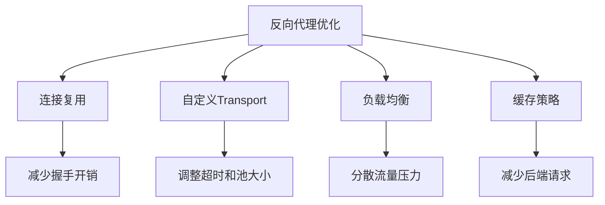

# net/http/httputil完全指南

## 📖 包简介

`net/http/httputil` 是Go标准库中的"HTTP瑞士军刀"，提供了一系列HTTP调试和代理工具。如果说`net/http`是建造房屋的砖瓦，那`httputil`就是装修工具——它不负责构建核心功能，但能让你的HTTP应用更加完善。

这个包最出名的当属`ReverseProxy`（反向代理），它是构建API网关、负载均衡器、微服务代理的基石。此外，`DumpRequest`和`DumpResponse`函数是调试HTTP问题的利器，能完整捕获请求/响应的每一个字节。

Go 1.26对这个包做了一个重要更新：`ReverseProxy.Director`字段被标记为**废弃**，官方强烈推荐使用更安全的`ReverseProxy.Rewrite`字段来替代。这个变更背后是安全考量——`Rewrite`提供了更可控的请求修改方式，避免了`Director`可能引发的安全漏洞。如果你还在用`Director`，是时候升级你的代码了。

## 🎯 核心功能概览

| 类型/函数 | 用途 | 说明 |
|-----------|------|------|
| `httputil.ReverseProxy` | 反向代理 | 转发请求到后端服务 |
| `httputil.NewSingleHostReverseProxy` | 创建单目标代理 | 一行代码创建反向代理 |
| `httputil.DumpRequest` | 转储请求 | 捕获完整HTTP请求 |
| `httputil.DumpResponse` | 转储响应 | 捕获完整HTTP响应 |
| `httputil.DumpRequestOut` | 转储发出的请求 | 捕获客户端发出的请求 |

## 💻 实战示例

### 示例1：基础反向代理

```go
package main

import (
	"log"
	"net/http"
	"net/http/httputil"
	"net/url"
)

func main() {
	// 创建反向代理
	// 目标：将所有请求转发到后端服务
	target, err := url.Parse("http://localhost:8081")
	if err != nil {
		log.Fatal(err)
	}

	proxy := httputil.NewSingleHostReverseProxy(target)

	// 自定义错误处理
	proxy.ErrorHandler = func(w http.ResponseWriter, r *http.Request, err error) {
		log.Printf("Proxy error: %v", err)
		http.Error(w, "Backend service unavailable", http.StatusBadGateway)
	}

	// 启动代理服务器
	log.Println("Reverse proxy listening on :8080")
	log.Fatal(http.ListenAndServe(":8080", proxy))
}
```

### 示例2：使用Rewrite替代Director（Go 1.26推荐）

```go
package main

import (
	"fmt"
	"log"
	"net/http"
	"net/http/httputil"
	"net/url"
	"strings"
	"time"
)

func main() {
	// 创建多目标反向代理
	proxy := &httputil.ReverseProxy{
		// Go 1.26: 推荐使用Rewrite而非Director
		Rewrite: func(r *httputil.ProxyRequest) {
			// r.In 是进入代理服务器的原始请求
			// r.Out 是将发送到后端的请求

			// 修改目标URL
			target := &url.URL{
				Scheme: "http",
				Host:   "backend:8081",
			}

			// 保留原始路径，但添加前缀
			r.Out.URL.Scheme = target.Scheme
			r.Out.URL.Host = target.Host

			// 修改Host头
			r.Out.Host = target.Host

			// 添加自定义头
			r.Out.Header.Set("X-Forwarded-By", "my-proxy")
			r.Out.Header.Set("X-Request-ID", generateRequestID())
			r.Out.Header.Set("X-Real-IP", r.In.RemoteAddr)

			// 移除敏感头
			r.Out.Header.Del("Cookie")

			// 添加时间戳
			r.Out.Header.Set("X-Proxy-Timestamp", time.Now().Format(time.RFC3339))

			// 记录调试信息
			log.Printf("Proxying %s %s -> %s",
				r.In.Method,
				r.In.URL.Path,
				r.Out.URL.String())
		},
	}

	// 自定义响应修改
	proxy.ModifyResponse = func(resp *http.Response) error {
		// 修改响应头
		resp.Header.Set("X-Proxied-By", "my-proxy")
		resp.Header.Set("X-Response-Time", time.Since(resp.Request.Context().Value("startTime").(time.Time)).String())
		return nil
	}

	// 错误处理
	proxy.ErrorHandler = func(w http.ResponseWriter, r *http.Request, err error) {
		log.Printf("Proxy error: %v", err)
		http.Error(w, fmt.Sprintf("Proxy error: %v", err), http.StatusBadGateway)
	}

	log.Println("Advanced proxy listening on :8080")
	log.Fatal(http.ListenAndServe(":8080", proxy))
}

func generateRequestID() string {
	return fmt.Sprintf("req-%d", time.Now().UnixNano())
}
```

### 示例3：完整的API网关

```go
package main

import (
	"encoding/json"
	"fmt"
	"log"
	"net/http"
	"net/http/httputil"
	"net/url"
	"strings"
	"sync"
	"time"
)

// APIGateway API网关
type APIGateway struct {
	proxies map[string]*httputil.ReverseProxy
	mu      sync.RWMutex
}

// NewAPIGateway 创建API网关
func NewAPIGateway() *APIGateway {
	return &APIGateway{
		proxies: make(map[string]*httputil.ReverseProxy),
	}
}

// AddService 添加后端服务
func (g *APIGateway) AddService(prefix, targetURL string) error {
	target, err := url.Parse(targetURL)
	if err != nil {
		return fmt.Errorf("parse target URL: %w", err)
	}

	proxy := &httputil.ReverseProxy{
		Rewrite: func(r *httputil.ProxyRequest) {
			// 移除前缀路径
			path := strings.TrimPrefix(r.Out.URL.Path, prefix)
			if !strings.HasPrefix(path, "/") {
				path = "/" + path
			}

			// 设置新的目标
			r.Out.URL.Scheme = target.Scheme
			r.Out.URL.Host = target.Host
			r.Out.URL.Path = path

			// 添加网关头
			r.Out.Header.Set("X-Gateway-Host", r.In.Host)
			r.Out.Header.Set("X-Forwarded-Proto", r.In.URL.Scheme)
			r.Out.Header.Set("X-Request-Start", time.Now().Format(time.RFC3339Nano))
		},
	}

	proxy.ModifyResponse = func(resp *http.Response) error {
		// 添加响应头
		resp.Header.Set("X-Gateway", "api-gateway")
		return nil
	}

	proxy.ErrorHandler = func(w http.ResponseWriter, r *http.Request, err error) {
		log.Printf("Gateway error for %s: %v", prefix, err)
		w.Header().Set("Content-Type", "application/json")
		w.WriteHeader(http.StatusBadGateway)
		json.NewEncoder(w).Encode(map[string]string{
			"error":   "backend_unavailable",
			"message": "Backend service is not available",
		})
	}

	g.mu.Lock()
	g.proxies[prefix] = proxy
	g.mu.Unlock()

	log.Printf("Registered service: %s -> %s", prefix, targetURL)
	return nil
}

// ServeHTTP 实现http.Handler
func (g *APIGateway) ServeHTTP(w http.ResponseWriter, r *http.Request) {
	// 健康检查
	if r.URL.Path == "/health" {
		w.Header().Set("Content-Type", "application/json")
		json.NewEncoder(w).Encode(map[string]interface{}{
			"status":    "healthy",
			"timestamp": time.Now().Format(time.RFC3339),
			"services":  len(g.proxies),
		})
		return
	}

	// 路由分发
	g.mu.RLock()
	for prefix, proxy := range g.proxies {
		if strings.HasPrefix(r.URL.Path, prefix) {
			g.mu.RUnlock()
			proxy.ServeHTTP(w, r)
			return
		}
	}
	g.mu.RUnlock()

	// 未找到匹配的服务
	http.Error(w, "Service not found", http.StatusNotFound)
}

// HTTPDump 演示请求/响应转储
func HTTPDump() {
	// 创建示例请求
	req := httptest.NewRequest(http.MethodGet, "https://api.example.com/v1/users?page=1", nil)
	req.Header.Set("Authorization", "Bearer token123")
	req.Header.Set("Accept", "application/json")

	// 转储请求（用于调试）
	dump, err := httputil.DumpRequest(req, true)
	if err != nil {
		log.Printf("Dump error: %v", err)
		return
	}

	fmt.Println("=== 请求转储 ===")
	fmt.Println(string(dump))
}

func main() {
	gateway := NewAPIGateway()

	// 注册后端服务
	gateway.AddService("/api/users", "http://user-service:8081")
	gateway.AddService("/api/orders", "http://order-service:8082")
	gateway.AddService("/api/products", "http://product-service:8083")

	// 演示HTTP Dump
	HTTPDump()

	// 启动网关
	log.Println("API Gateway starting on :8080")
	log.Fatal(http.ListenAndServe(":8080", gateway))
}
```

## ⚠️ 常见陷阱与注意事项

### 1. Director已废弃，使用Rewrite
Go 1.26明确将`Director`标记为废弃。`Director`的问题在于它直接修改`*http.Request`，容易导致安全漏洞（如Host头注入）。`Rewrite`使用`*ProxyRequest`结构，明确区分输入和输出请求，更安全：

```go
// 旧方式（已废弃）
proxy := &httputil.ReverseProxy{
    Director: func(req *http.Request) {
        req.URL.Scheme = "http"
        req.URL.Host = "backend:8081"
    },
}

// 新方式（推荐）
proxy := &httputil.ReverseProxy{
    Rewrite: func(r *httputil.ProxyRequest) {
        r.Out.URL.Scheme = "http"
        r.Out.URL.Host = "backend:8081"
    },
}
```

### 2. 转发WebSocket需要特殊处理
反向代理默认不处理WebSocket升级。需要自定义`DialContext`和`Dial`方法：
```go
proxy := &httputil.ReverseProxy{
    Director: func(req *http.Request) {
        // ...
    },
    Transport: &http.Transport{
        DialContext: func(ctx context.Context, network, addr string) (net.Conn, error) {
            // 自定义WebSocket连接
        },
    },
}
```

### 3. 请求体只能读一次
在`Rewrite`中如果需要读取请求体进行验证，必须保存后再放回：
```go
Rewrite: func(r *httputil.ProxyRequest) {
    // 读取body（会清空原始body）
    bodyBytes, _ := io.ReadAll(r.In.Body)
    // 验证...
    // 恢复body
    r.Out.Body = io.NopCloser(bytes.NewBuffer(bodyBytes))
}
```

### 4. 响应修改的陷阱
`ModifyResponse`在响应体发送前调用，如果在这里修改了响应头或状态码，要确保不破坏后续处理：
```go
ModifyResponse: func(resp *http.Response) error {
    // 可以修改状态码
    if resp.StatusCode == 404 {
        resp.StatusCode = 200
        // 注意：Content-Length可能需要重新计算
    }
    return nil
}
```

### 5. NewSingleHostReverseProxy的局限性
`NewSingleHostReverseProxy`是一个便捷函数，但功能有限：
- 不支持路径前缀剥离
- 不自动添加`X-Forwarded-For`
- 错误处理是默认的`http.Error`

生产环境建议自定义`Rewrite`和`ErrorHandler`。

## 🚀 Go 1.26新特性

### Director废弃，Rewrite成为推荐方式

Go 1.26正式将`ReverseProxy.Director`标记为**Deprecated**，原因如下：

**Director的问题**:
```go
// Director直接修改*http.Request，容易遗漏安全处理
Director: func(req *http.Request) {
    req.URL.Host = target  // 可能不验证Host头
    // 原始请求的其他字段可能被意外传递
}
```

**Rewrite的优势**:
```go
// Rewrite使用ProxyRequest结构，明确区分输入和输出
Rewrite: func(r *httputil.ProxyRequest) {
    // r.In  - 原始请求（只读）
    // r.Out - 转发请求（可修改）
    // 清晰的安全边界
}
```

**迁移指南**:
```go
// 旧代码
proxy := httputil.NewSingleHostReverseProxy(target)
proxy.Director = func(req *http.Request) {
    req.URL.Scheme = target.Scheme
    req.URL.Host = target.Host
    req.Host = target.Host
}

// 新代码
proxy := &httputil.ReverseProxy{
    Rewrite: func(r *httputil.ProxyRequest) {
        r.SetURL(target)           // 一行搞定
        r.Out.Host = target.Host   // 明确设置Host
    },
}
```

## 📊 性能优化建议



**性能优化清单**:

1. **复用Transport**：多个代理共享同一个`http.Transport`实例
2. **调整连接池**：根据后端服务数量调整`MaxIdleConnsPerHost`
3. **设置合理超时**：避免代理长时间挂起
4. **启用压缩**：如果后端支持，代理层解压后再压缩可能浪费资源

```go
// 推荐的Transport配置
transport := &http.Transport{
    MaxIdleConns:        100,
    MaxIdleConnsPerHost: 20,
    IdleConnTimeout:     90 * time.Second,
}

// 多个代理共享Transport
proxy1 := &httputil.ReverseProxy{
    Rewrite:   ...,
    Transport: transport,
}
proxy2 := &httputil.ReverseProxy{
    Rewrite:   ...,
    Transport: transport, // 复用
}
```

## 🔗 相关包推荐

- `net/http` - HTTP基础
- `net/http/httptest` - HTTP测试
- `net/url` - URL解析
- `context` - 请求上下文
- `io` - I/O操作
- `encoding/json` - JSON处理

---