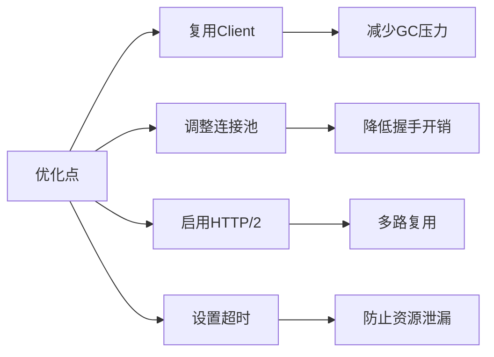

# net/http完全指南

## 📖 包简介

`net/http` 是Go语言最耀眼的明星包之一，没有它，Go可能只能在内网里"自言自语"。这个包提供了HTTP客户端和服务器的完整实现，让你能够轻松构建RESTful API、微服务、爬虫、文件服务器等各种网络应用。

在Go生态中，`net/http` 的设计哲学是"简单至上"。几行代码就能启动一个HTTP服务器，几行代码就能发起一个HTTP请求。但简单不代表简陋，它背后隐藏着连接池、HTTP/2、TLS、中间件等高级特性，足够支撑生产级别的高并发场景。

Go 1.26版本继续为这个"瑞士军刀"增添新能力，包括更严格的HTTP/2配置、更安全的Cookie作用域、以及更合理的重定向行为。无论你是写客户端还是服务端，这些更新都值得你好好关注。

## 🎯 核心功能概览

| 类型/函数 | 用途 | 说明 |
|-----------|------|------|
| `http.Client` | HTTP客户端 | 发起请求，支持自定义Transport |
| `http.Server` | HTTP服务器 | 监听端口，处理请求 |
| `http.ServeMux` | 路由器 | 1.22起支持路径模式匹配，1.26改进尾斜杠重定向 |
| `http.Handler` | 处理器接口 | 实现Handle逻辑的核心接口 |
| `http.Transport` | 传输层 | 连接池、代理、TLS配置 |
| `http.NewRequestWithContext` | 创建请求 | 绑定Context实现超时控制 |
| `http.Get/Post` | 快捷方法 | 一行代码发起请求 |
| `http.Cookie` | Cookie管理 | 1.26基于Request.Host确定作用域 |

## 💻 实战示例

### 示例1：基础HTTP服务器与客户端

```go
package main

import (
	"encoding/json"
	"fmt"
	"io"
	"log"
	"net/http"
	"time"
)

// User 示例数据结构
type User struct {
	ID   int    `json:"id"`
	Name string `json:"name"`
	Age  int    `json:"age"`
}

func main() {
	// ========== 服务端 ==========
	mux := http.NewServeMux()

	// GET /api/users - 返回用户列表
	mux.HandleFunc("GET /api/users", func(w http.ResponseWriter, r *http.Request) {
		users := []User{
			{ID: 1, Name: "Alice", Age: 28},
			{ID: 2, Name: "Bob", Age: 32},
		}
		w.Header().Set("Content-Type", "application/json")
		json.NewEncoder(w).Encode(users)
	})

	// POST /api/users - 创建用户
	mux.HandleFunc("POST /api/users", func(w http.ResponseWriter, r *http.Request) {
		var user User
		if err := json.NewDecoder(r.Body).Decode(&user); err != nil {
			http.Error(w, "Invalid JSON", http.StatusBadRequest)
			return
		}
		w.WriteHeader(http.StatusCreated)
		json.NewEncoder(w).Encode(map[string]string{
			"message": fmt.Sprintf("User %s created", user.Name),
		})
	})

	// 启动服务器
	go func() {
		log.Println("Server starting on :8080")
		if err := http.ListenAndServe(":8080", mux); err != nil {
			log.Fatal(err)
		}
	}()

	time.Sleep(100 * time.Millisecond) // 等待服务器启动

	// ========== 客户端 ==========
	client := &http.Client{Timeout: 5 * time.Second}

	// GET请求
	resp, err := client.Get("http://localhost:8080/api/users")
	if err != nil {
		log.Fatal(err)
	}
	defer resp.Body.Close()

	body, _ := io.ReadAll(resp.Body)
	fmt.Printf("GET Response: %s\n", body)

	// POST请求
	postData := `{"name":"Charlie","age":25}`
	resp, err = client.Post("http://localhost:8080/api/users",
		"application/json",
		strings.NewReader(postData))
	if err != nil {
		log.Fatal(err)
	}
	defer resp.Body.Close()

	body, _ = io.ReadAll(resp.Body)
	fmt.Printf("POST Response: %s\n", body)
}
```

### 示例2：带超时和重试的HTTP客户端

```go
package main

import (
	"context"
	"fmt"
	"io"
	"log"
	"net/http"
	"time"
)

// RetryClient 支持自动重试的HTTP客户端
type RetryClient struct {
	client    *http.Client
	maxRetries int
}

// NewRetryClient 创建带重试功能的客户端
func NewRetryClient(timeout time.Duration, maxRetries int) *RetryClient {
	return &RetryClient{
		client: &http.Client{
			Timeout: timeout,
			Transport: &http.Transport{
				MaxIdleConns:        100,
				MaxIdleConnsPerHost: 10,
				IdleConnTimeout:     90 * time.Second,
			},
		},
		maxRetries: maxRetries,
	}
}

// Do 发起请求并自动重试
func (rc *RetryClient) Do(ctx context.Context, method, url string, body io.Reader) (*http.Response, error) {
	var resp *http.Response
	var err error

	for attempt := 0; attempt <= rc.maxRetries; attempt++ {
		req, err := http.NewRequestWithContext(ctx, method, url, body)
		if err != nil {
			return nil, fmt.Errorf("create request: %w", err)
		}

		resp, err = rc.client.Do(req)
		if err == nil && resp.StatusCode < 500 {
			// 成功或客户端错误，不重试
			return resp, nil
		}

		if err != nil {
			log.Printf("Attempt %d failed: %v", attempt+1, err)
		} else {
			log.Printf("Attempt %d: status %d, retrying...", attempt+1, resp.StatusCode)
			resp.Body.Close()
		}

		// 指数退避
		wait := time.Duration(1<<uint(attempt)) * 100 * time.Millisecond
		select {
		case <-ctx.Done():
			return nil, ctx.Err()
		case <-time.After(wait):
		}
	}

	return resp, fmt.Errorf("max retries exceeded: %w", err)
}

func main() {
	client := NewRetryClient(10*time.Second, 3)
	ctx, cancel := context.WithTimeout(context.Background(), 30*time.Second)
	defer cancel()

	resp, err := client.Do(ctx, http.MethodGet, "https://httpbin.org/get", nil)
	if err != nil {
		log.Fatal(err)
	}
	defer resp.Body.Close()

	fmt.Printf("Status: %d\n", resp.StatusCode)
	io.Copy(io.Discard, resp.Body)
}
```

### 示例3：生产级中间件链

```go
package main

import (
	"log"
	"net/http"
	"time"
)

// Middleware 中间件类型
type Middleware func(http.Handler) http.Handler

// Chain 中间件链
func Chain(h http.Handler, middlewares ...Middleware) http.Handler {
	for i := len(middlewares) - 1; i >= 0; i-- {
		h = middlewares[i](h)
	}
	return h
}

// Logger 日志中间件
func Logger(next http.Handler) http.Handler {
	return http.HandlerFunc(func(w http.ResponseWriter, r *http.Request) {
		start := time.Now()
		next.ServeHTTP(w, r)
		log.Printf("%s %s %v", r.Method, r.URL.Path, time.Since(start))
	})
}

// Recovery 恢复中间件
func Recovery(next http.Handler) http.Handler {
	return http.HandlerFunc(func(w http.ResponseWriter, r *http.Request) {
		defer func() {
			if err := recover(); err != nil {
				log.Printf("panic recovered: %v", err)
				http.Error(w, "Internal Server Error", http.StatusInternalServerError)
			}
		}()
		next.ServeHTTP(w, r)
	})
}

// RateLimiter 简单限流中间件
func RateLimiter(maxConcurrent int) Middleware {
	sem := make(chan struct{}, maxConcurrent)
	return func(next http.Handler) http.Handler {
		return http.HandlerFunc(func(w http.ResponseWriter, r *http.Request) {
			select {
			case sem <- struct{}{}:
				defer func() { <-sem }()
				next.ServeHTTP(w, r)
			case <-r.Context().Done():
				http.Error(w, "Service Unavailable", http.StatusServiceUnavailable)
			}
		})
	}
}

func main() {
	mux := http.NewServeMux()
	mux.HandleFunc("/", func(w http.ResponseWriter, r *http.Request) {
		w.Write([]byte("Hello, World!"))
	})

	// 组合中间件
	handler := Chain(mux,
		Recovery,
		Logger,
		RateLimiter(100),
	)

	log.Println("Server with middleware starting on :8080")
	log.Fatal(http.ListenAndServe(":8080", handler))
}
```

## ⚠️ 常见陷阱与注意事项

### 1. 忘记关闭Response.Body
这是最经典的内存泄漏来源。每次`client.Do()`或`http.Get()`之后，**必须**调用`resp.Body.Close()`。正确姿势：
```go
resp, err := client.Get(url)
if err != nil {
    return err
}
defer resp.Body.Close() // 立即defer，不要放在if里
```

### 2. 复用http.Client但不理解连接池
`http.Client`是并发安全的，**应该复用**而不是每次创建新的。但要注意，如果频繁请求不同域名，`Transport`的默认连接池配置可能不够用，需要自定义：
```go
transport := &http.Transport{
    MaxIdleConns:        100,
    MaxIdleConnsPerHost: 20, // 根据实际需求调整
}
client := &http.Client{Transport: transport}
```

### 3. ServeMux路由匹配的坑
Go 1.22+的ServeMux支持方法+路径匹配，但要注意：
- `GET /api/` 匹配 `/api/` 和 `/api/xxx`（子路径）
- `GET /api` 只匹配 `/api` 精确路径
- 尾斜杠行为在1.26中改为HTTP 307重定向

### 4. Cookie作用域变更
Go 1.26中，Client处理Cookie时现在基于`Request.Host`而非请求的目标地址。这意味着如果你在请求中修改了`Host`头，Cookie的作用域会随之变化，可能引发意料之外的Cookie发送。

### 5. 忽略Context传播
所有长时间运行的HTTP操作都应该使用`NewRequestWithContext`，否则超时或取消无法正确传播：
```go
// 错误示范
http.Get(url) // 无法控制超时

// 正确姿势
ctx, cancel := context.WithTimeout(context.Background(), 5*time.Second)
defer cancel()
req, _ := http.NewRequestWithContext(ctx, "GET", url, nil)
client.Do(req)
```

## 🚀 Go 1.26新特性

### 1. HTTP/2 StrictMaxConcurrentRequests
`HTTP2Config`新增`StrictMaxConcurrentRequests`字段，当设置为`true`时，超过`MaxConcurrentStreams`限制的请求会被拒绝（返回503），而不是排队等待。这对于保护服务器免受过载影响非常有用：

```go
srv := &http.Server{
    HTTP2Config: &http.HTTP2Config{
        StrictMaxConcurrentRequests: true,
    },
    Handler: mux,
}
```

### 2. Transport.NewClientConn
`Transport`新增`NewClientConn`方法，允许复用已有的网络连接创建HTTP客户端连接。这在需要复用底层TCP连接的场景下非常有用，比如代理服务器。

### 3. Cookie作用域基于Request.Host
Client的Cookie Jar现在基于请求的`Host`头来确定Cookie的作用域，更符合RFC标准。如果你的服务依赖特定的Cookie行为，请测试此变更。

### 4. ServeMux尾斜杠重定向改为307
此前，访问`/api`时如果注册的是`/api/`，ServeMux会用301重定向。现在改为307，这意味着POST/PUT等方法的请求体会被保留，更符合语义。

## 📊 性能优化建议



**性能对比参考**:
- 复用Client vs 每次创建：**吞吐量提升3-5倍**
- 调整连接池 vs 默认配置：高并发下**延迟降低40%**
- 启用HTTP/2 vs HTTP/1.1：多请求场景**QPS提升2-3倍**

```go
// 推荐的客户端配置模板
var defaultClient = &http.Client{
    Timeout: 10 * time.Second,
    Transport: &http.Transport{
        DialContext: (&net.Dialer{
            Timeout:   5 * time.Second,
            KeepAlive: 30 * time.Second,
        }).DialContext,
        MaxIdleConns:          100,
        MaxIdleConnsPerHost:   20,
        IdleConnTimeout:       90 * time.Second,
        TLSHandshakeTimeout:   5 * time.Second,
        ExpectContinueTimeout: 1 * time.Second,
    },
}
```

## 🔗 相关包推荐

- `net/http/httptest` - HTTP测试服务器和响应录制器
- `net/http/httputil` - HTTP工具，包括反向代理和请求转储
- `net/http/cookiejar` - Cookie持久化存储
- `net/url` - URL解析和构建
- `context` - 请求上下文和超时控制
- `crypto/tls` - TLS配置和安全传输

---