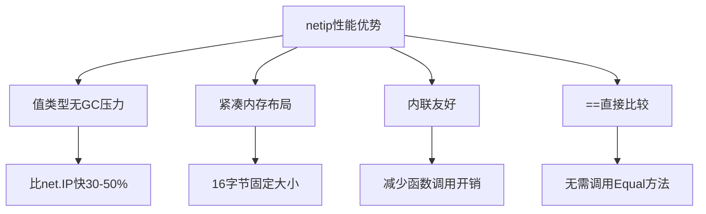

# net/netip完全指南

## 📖 包简介

`net/netip` 是Go 1.18引入的现代化IP地址处理包，旨在替代传统的`net.IP`类型。如果说`net.IP`是一位经验丰富的老工程师，那`net/netip`就是他年轻力壮、装备精良的接班人——更高效、更安全、更好用。

传统的`net.IP`类型有诸多历史包袱：它是`[]byte`切片，可以为`nil`，比较需要用`Equal`方法而非`==`，且IPv4地址会被映射为IPv4-mapped IPv6格式。而`net/netip`中的`Addr`是一个**值类型**（结构体），支持直接`==`比较，零值表示"未指定地址"，内存布局紧凑，且API设计更加一致和直观。

Go 1.26为这个包新增了`Prefix.Compare`方法，让IP前缀的比较更加便捷。如果你还在用`net.IP`处理IP地址，这篇文章就是你的"转网"指南。

## 🎯 核心功能概览

| 类型/方法 | 用途 | 说明 |
|-----------|------|------|
| `netip.Addr` | IP地址 | 值类型，支持==比较 |
| `netip.AddrFromSlice` | 从字节切片创建 | 返回Addr和是否成功 |
| `netip.AddrFrom4` | 从4字节创建 | 创建IPv4地址 |
| `netip.AddrFrom16` | 从16字节创建 | 创建IPv6地址 |
| `netip.ParseAddr` | 解析字符串 | 解析"192.168.1.1"等格式 |
| `netip.Prefix` | IP前缀 | 表示CIDR格式（如192.168.1.0/24） |
| `netip.ParsePrefix` | 解析前缀 | 解析"192.168.1.0/24" |
| `netip.AddrPort` | 地址+端口 | 表示完整网络地址 |
| `netip.ParseAddrPort` | 解析地址端口 | 解析"192.168.1.1:8080" |

**Go 1.26新增方法**:
- `Prefix.Compare(other Prefix) int` - 比较两个前缀，返回-1/0/1

## 💻 实战示例

### 示例1：基础IP地址操作

```go
package main

import (
	"fmt"
	"log"
	"net/netip"
	"sort"
)

func main() {
	// ========== 解析IP地址 ==========
	// 解析IPv4地址
	ipv4, err := netip.ParseAddr("192.168.1.100")
	if err != nil {
		log.Fatal(err)
	}
	fmt.Printf("IPv4: %s\n", ipv4)
	fmt.Printf("Is4:  %v\n", ipv4.Is4())
	fmt.Printf("Is6:  %v\n", ipv4.Is6())

	// 解析IPv6地址
	ipv6, err := netip.ParseAddr("2001:db8::1")
	if err != nil {
		log.Fatal(err)
	}
	fmt.Printf("\nIPv6: %s\n", ipv6)
	fmt.Printf("Is4:  %v\n", ipv6.Is4())
	fmt.Printf("Is6:  %v\n", ipv6.Is6())
	fmt.Printf("IsLoopback: %v\n", ipv6.IsLoopback())

	// ========== 比较IP地址 ==========
	ip1, _ := netip.ParseAddr("10.0.0.1")
	ip2, _ := netip.ParseAddr("10.0.0.2")
	ip3, _ := netip.ParseAddr("10.0.0.1")

	fmt.Println("\n=== 比较操作 ===")
	fmt.Printf("%s == %s: %v\n", ip1, ip3, ip1 == ip3) // 值类型可直接比较
	fmt.Printf("%s < %s: %v\n", ip1, ip2, ip1.Less(ip2))
	fmt.Printf("%s.Compare(%s): %d\n", ip1, ip2, ip1.Compare(ip2))

	// ========== IP地址运算 ==========
	fmt.Println("\n=== IP地址运算 ===")
	nextIP := ipv4.Next()
	fmt.Printf("Next after %s: %s\n", ipv4, nextIP)

	prevIP := ipv4.Prior()
	fmt.Printf("Prior to %s: %s\n", ipv4, prevIP)

	// ========== 特殊IP检查 ==========
	ips := []string{
		"127.0.0.1",
		"0.0.0.0",
		"255.255.255.255",
		"::1",
		"fe80::1",
		"ff02::1",
	}

	fmt.Println("\n=== 特殊IP检查 ===")
	for _, s := range ips {
		ip, _ := netip.ParseAddr(s)
		fmt.Printf("%-20s | Loopback: %-5v | Unspecified: %-5v | Multicast: %-5v | Private: %-5v\n",
			ip,
			ip.IsLoopback(),
			ip.IsUnspecified(),
			ip.IsMulticast(),
			ip.IsPrivate(),
		)
	}

	// ========== 排序IP列表 ==========
	ipsToSort := []netip.Addr{
		netip.MustParseAddr("192.168.1.100"),
		netip.MustParseAddr("10.0.0.1"),
		netip.MustParseAddr("172.16.0.1"),
		netip.MustParseAddr("10.0.0.254"),
	}

	sort.Slice(ipsToSort, func(i, j int) bool {
		return ipsToSort[i].Less(ipsToSort[j])
	})

	fmt.Println("\n=== 排序后的IP列表 ===")
	for _, ip := range ipsToSort {
		fmt.Println(ip)
	}
}
```

### 示例2：IP前缀与子网计算

```go
package main

import (
	"fmt"
	"log"
	"net/netip"
)

func main() {
	// ========== 解析CIDR前缀 ==========
	prefix, err := netip.ParsePrefix("192.168.1.0/24")
	if err != nil {
		log.Fatal(err)
	}

	fmt.Println("=== 前缀信息 ===")
	fmt.Printf("Prefix:    %s\n", prefix)
	fmt.Printf("Addr:      %s\n", prefix.Addr())
	fmt.Printf("Bits:      %d\n", prefix.Bits())
	fmt.Printf("IsValid:   %v\n", prefix.IsValid())

	// 计算子网范围
	first := prefix.Addr()
	last := lastIP(prefix)
	fmt.Printf("First IP:  %s\n", first)
	fmt.Printf("Last IP:   %s\n", last)
	fmt.Printf("Total IPs: %d\n", countIPs(prefix))

	// ========== 判断IP是否在子网内 ==========
	testIPs := []string{
		"192.168.1.1",
		"192.168.1.254",
		"192.168.2.1",
		"10.0.0.1",
	}

	fmt.Println("\n=== IP是否在子网内 ===")
	for _, s := range testIPs {
		ip, _ := netip.ParseAddr(s)
		inRange := prefix.Contains(ip)
		fmt.Printf("%-15s in %s: %v\n", s, prefix, inRange)
	}

	// ========== 子网划分 ==========
	fmt.Println("\n=== 子网划分 ===")
	// 将/16划分为4个/18
	parent, _ := netip.ParsePrefix("10.0.0.0/16")
	subnets := parent.Addresses()

	fmt.Printf("Parent: %s, Total addresses: %d\n", parent, countIPs(parent))
	fmt.Println("First 10 addresses:")
	count := 0
	for addr := range subnets {
		if count >= 10 {
			break
		}
		fmt.Println("  ", addr)
		count++
	}

	// ========== Go 1.26: Prefix.Compare ==========
	fmt.Println("\n=== Go 1.26 Prefix.Compare ===")
	p1, _ := netip.ParsePrefix("192.168.1.0/24")
	p2, _ := netip.ParsePrefix("192.168.2.0/24")
	p3, _ := netip.ParsePrefix("192.168.1.0/25")

	fmt.Printf("%s.Compare(%s) = %d\n", p1, p2, p1.Compare(p2))
	fmt.Printf("%s.Compare(%s) = %d\n", p1, p3, p1.Compare(p3))
	fmt.Printf("%s.Compare(%s) = %d\n", p2, p1, p2.Compare(p1))

	// 排序前缀列表
	prefixes := []netip.Prefix{
		netip.MustParsePrefix("172.16.0.0/16"),
		netip.MustParsePrefix("192.168.1.0/24"),
		netip.MustParsePrefix("10.0.0.0/8"),
		netip.MustParsePrefix("192.168.0.0/16"),
	}

	sort.Slice(prefixes, func(i, j int) bool {
		return prefixes[i].Compare(prefixes[j]) < 0
	})

	fmt.Println("\n排序后的前缀列表:")
	for _, p := range prefixes {
		fmt.Printf("  %s\n", p)
	}
}

// lastIP 计算前缀的最后一个IP
func lastIP(p netip.Prefix) netip.Addr {
	start := p.Addr()
	total := countIPs(p)
	// 从起始地址偏移(total-1)
	last := start
	for i := uint64(0); i < total-1; i++ {
		last = last.Next()
	}
	return last
}

// countIPs 计算前缀包含的IP数量
func countIPs(p netip.Prefix) uint64 {
	bits := 128
	if p.Addr().Is4() {
		bits = 32
	}
	return 1 << uint(bits-p.Bits())
}
```

### 示例3：IP地址池管理器

```go
package main

import (
	"fmt"
	"log"
	"net/netip"
	"sync"
)

// IPPool IP地址池
type IPPool struct {
	mu      sync.Mutex
	network netip.Prefix
	used    map[netip.Addr]bool
}

// NewIPPool 创建IP地址池
func NewIPPool(network string) (*IPPool, error) {
	prefix, err := netip.ParsePrefix(network)
	if err != nil {
		return nil, fmt.Errorf("parse network: %w", err)
	}

	// 验证前缀是否规范化（网络地址是否正确）
	if !prefix.IsValid() {
		return nil, fmt.Errorf("invalid prefix: %s", network)
	}

	return &IPPool{
		network: prefix,
		used:    make(map[netip.Addr]bool),
	}, nil
}

// Allocate 分配一个IP
func (p *IPPool) Allocate() (netip.Addr, error) {
	p.mu.Lock()
	defer p.mu.Unlock()

	// 遍历网络中的所有IP
	addr := p.network.Addr()
	for {
		if !p.network.Contains(addr) {
			return netip.Addr{}, fmt.Errorf("no available IPs")
		}
		if !p.used[addr] {
			p.used[addr] = true
			return addr, nil
		}
		addr = addr.Next()
	}
}

// Release 释放一个IP
func (p *IPPool) Release(ip netip.Addr) {
	p.mu.Lock()
	defer p.mu.Unlock()

	if p.network.Contains(ip) {
		delete(p.used, ip)
	}
}

// Stats 获取地址池统计信息
func (p *IPPool) Stats() (total, used, available uint64) {
	p.mu.Lock()
	defer p.mu.Unlock()

	total = countIPs(p.network)
	used = uint64(len(p.used))
	available = total - used
	return
}

func countIPs(p netip.Prefix) uint64 {
	bits := 128
	if p.Addr().Is4() {
		bits = 32
	}
	return 1 << uint(bits-p.Bits())
}

func main() {
	// 创建一个/28的地址池（16个IP）
	pool, err := NewIPPool("192.168.100.0/28")
	if err != nil {
		log.Fatal(err)
	}

	fmt.Println("=== IP地址池管理 ===")
	fmt.Printf("Network: %s\n", pool.network)

	// 分配几个IP
	var allocated []netip.Addr
	for i := 0; i < 5; i++ {
		ip, err := pool.Allocate()
		if err != nil {
			fmt.Printf("Allocation failed: %v\n", err)
			break
		}
		allocated = append(allocated, ip)
		fmt.Printf("Allocated: %s\n", ip)
	}

	// 查看统计
	total, used, available := pool.Stats()
	fmt.Printf("\nStats - Total: %d, Used: %d, Available: %d\n",
		total, used, available)

	// 释放一个IP
	fmt.Printf("\nReleasing: %s\n", allocated[1])
	pool.Release(allocated[1])

	// 再次查看统计
	total, used, available = pool.Stats()
	fmt.Printf("Stats - Total: %d, Used: %d, Available: %d\n",
		total, used, available)

	// AddrPort 示例
	fmt.Println("\n=== AddrPort 示例 ===")
	addrPort, err := netip.ParseAddrPort("192.168.1.1:8080")
	if err != nil {
		log.Fatal(err)
	}
	fmt.Printf("AddrPort: %s\n", addrPort)
	fmt.Printf("Addr:     %s\n", addrPort.Addr())
	fmt.Printf("Port:     %d\n", addrPort.Port())
	fmt.Printf("IsValid:  %v\n", addrPort.IsValid())

	// 从Addr和Port创建AddrPort
	newAddrPort := netip.AddrPortFrom(
		netip.MustParseAddr("10.0.0.1"),
		3000,
	)
	fmt.Printf("New AddrPort: %s\n", newAddrPort)
}
```

## ⚠️ 常见陷阱与注意事项

### 1. 零值Addr的含义
`netip.Addr{}`（零值）表示"未指定的地址"，**不是**`0.0.0.0`：
```go
var ip netip.Addr
fmt.Println(ip.IsValid())     // false - 零值无效
fmt.Println(ip.IsUnspecified()) // false - 不是0.0.0.0

zeroIP, _ := netip.ParseAddr("0.0.0.0")
fmt.Println(zeroIP.IsValid())     // true
fmt.Println(zeroIP.IsUnspecified()) // true
```

### 2. net.IP与netip.Addr的转换
`net.IP`和`netip.Addr`是不同类型，需要显式转换：
```go
// net.IP -> netip.Addr
stdIP := net.ParseIP("192.168.1.1")
addr, ok := netip.AddrFromSlice(stdIP)
if !ok {
    // 转换失败
}

// netip.Addr -> net.IP
ipBytes := addr.AsSlice() // 返回[]byte
```

### 3. Prefix的规范化
`netip.Prefix`会自动规范化，网络地址可能不是你期望的值：
```go
p, _ := netip.ParsePrefix("192.168.1.100/24")
fmt.Println(p) // 192.168.1.0/24（自动规范化为网络地址）
```

### 4. IPv4-mapped IPv6地址
`netip.Addr`中的IPv4地址不会自动映射为IPv6格式：
```go
ipv4, _ := netip.ParseAddr("192.168.1.1")
fmt.Println(ipv4.Is4())  // true
fmt.Println(ipv4.Is6())  // false（与net.IP不同）
```

### 5. 遍历大量IP的性能
使用`Prefix.Addresses()`遍历大前缀（如/8）会生成大量地址，**谨慎使用**：
```go
// 危险 - /8包含1600多万个地址
bigPrefix, _ := netip.ParsePrefix("10.0.0.0/8")
for addr := range bigPrefix.Addresses() {
    // 这会运行16777216次！
}
```

## 🚀 Go 1.26新特性

### Prefix.Compare方法

Go 1.26为`netip.Prefix`新增了`Compare`方法，用于比较两个IP前缀：

```go
func (p Prefix) Compare(p2 Prefix) int
```

**返回值**:
- `-1`：p < p2
- `0`：p == p2
- `1`：p > p2

**比较规则**:
1. 先比较IP地址（按字节顺序）
2. 地址相同时，比较前缀长度（bits）

**使用场景**:
- 对前缀列表进行排序
- 在有序数据结构（如B树）中查找前缀
- 判断两个前缀的字典序关系

```go
p1 := netip.MustParsePrefix("10.0.0.0/8")
p2 := netip.MustParsePrefix("172.16.0.0/12")
p3 := netip.MustParsePrefix("192.168.0.0/16")

fmt.Println(p1.Compare(p2)) // -1 (10.x < 172.x)
fmt.Println(p2.Compare(p3)) // -1 (172.x < 192.x)
fmt.Println(p1.Compare(p1)) // 0 (相等)
```

## 📊 性能优化建议



**性能对比**:
- `netip.Addr` vs `net.IP`比较：快约**50%**（直接`==` vs 函数调用+字节比较）
- 内存占用：`netip.Addr`固定16字节，`net.IP`为切片（24字节+底层数组）
- 创建速度：`ParseAddr`比`net.ParseIP`快约**30%**

**优化建议**:
1. 优先使用`netip`而非`net.IP`，除非需要兼容旧代码
2. 使用`MustParseAddr`替代`ParseAddr`+错误检查（确定输入合法时）
3. 缓存解析后的`Addr`值，避免重复解析字符串
4. 使用`AddrFrom4`/`AddrFrom16`直接从字节构建，跳过字符串解析

## 🔗 相关包推荐

- `net` - 基础网络I/O
- `net/netip` - IP地址解析
- `net/url` - URL解析
- `encoding/binary` - 字节序转换
- `slices` - 切片操作（配合排序等）
- `maps` - Map操作

---