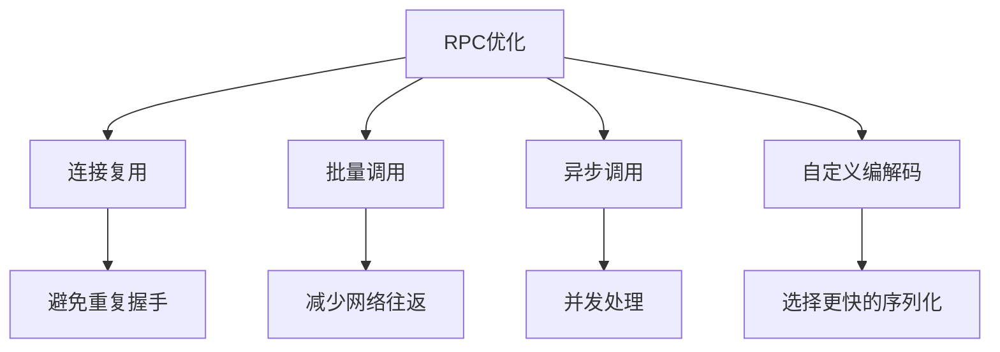

# net/rpc完全指南

## 📖 包简介

`net/rpc` 是Go标准库中提供的RPC（Remote Procedure Call，远程过程调用）实现。它允许一个程序像调用本地函数一样调用另一个程序（可能在另一台机器上）的方法，而无需关心底层的网络通信细节。

RPC的核心理念是"透明远程调用"——你写一个本地函数签名，RPC框架负责序列化参数、网络传输、反序列化响应，让你在调用远程服务时就像调用本地方法一样自然。`net/rpc` 使用Go特有的反射机制来注册和调用方法，支持TCP、HTTP等多种传输协议。

不过，在开始使用之前，有一个**重要声明**必须告诉你：Go官方已将`net/rpc`标记为**冻结状态**（frozen），意味着不再新增功能，仅维持安全和bug修复。Go团队推荐使用gRPC、Connect-RPC等现代RPC框架。但理解`net/rpc`仍然有价值——它设计简洁、代码量小，是学习RPC原理的绝佳教材，也适合快速原型开发。

## 🎯 核心功能概览

| 类型/函数 | 用途 | 说明 |
|-----------|------|------|
| `rpc.Register` | 注册服务 | 将结构体注册为RPC服务 |
| `rpc.RegisterName` | 注册命名服务 | 自定义服务名称 |
| `rpc.ServeConn` | 服务单个连接 | 处理一个RPC连接 |
| `rpc.ServeCodec` | 服务自定义编解码 | 使用自定义编解码器 |
| `rpc.Dial` | 客户端连接 | 建立RPC客户端连接 |
| `rpc.DialHTTP` | HTTP方式连接 | 通过HTTP建立连接 |
| `rpc.Client` | RPC客户端 | 调用远程方法 |
| `rpc.Server` | RPC服务器 | 管理服务和连接 |

## 💻 实战示例

### 示例1：基础RPC服务器与客户端

```go
package main

import (
	"fmt"
	"log"
	"net"
	"net/rpc"
)

// Arithmetic 算术服务
type Arithmetic struct{}

// Args 加法参数
type Args struct {
	A, B int
}

// Add 加法运算（导出方法，首字母大写）
func (a *Arithmetic) Add(args Args, reply *int) error {
	*reply = args.A + args.B
	return nil
}

// Multiply 乘法运算
func (a *Arithmetic) Multiply(args Args, reply *int) error {
	*reply = args.A * args.B
	return nil
}

// Quotient 除法运算
type Quotient struct {
	Quo, Rem int
}

func (a *Arithmetic) Divide(args Args, quo *Quotient) error {
	if args.B == 0 {
		return fmt.Errorf("division by zero")
	}
	quo.Quo = args.A / args.B
	quo.Rem = args.A % args.B
	return nil
}

func main() {
	// ========== 服务端 ==========
	arith := new(Arithmetic)

	// 注册服务
	err := rpc.Register(arith)
	if err != nil {
		log.Fatal("Register error:", err)
	}

	// 启动TCP监听
	listener, err := net.Listen("tcp", ":1234")
	if err != nil {
		log.Fatal("Listen error:", err)
	}
	defer listener.Close()

	log.Println("RPC Server starting on :1234")

	// 接受连接并处理RPC请求
	go func() {
		for {
			conn, err := listener.Accept()
			if err != nil {
				log.Println("Accept error:", err)
				continue
			}
			go rpc.ServeConn(conn)
		}
	}()

	// ========== 客户端 ==========
	// 等待服务器启动
	time.Sleep(100 * time.Millisecond)

	client, err := rpc.Dial("tcp", "localhost:1234")
	if err != nil {
		log.Fatal("Dial error:", err)
	}
	defer client.Close()

	// 同步调用
	var reply int
	err = client.Call("Arithmetic.Add", Args{10, 5}, &reply)
	if err != nil {
		log.Fatal("Add error:", err)
	}
	fmt.Printf("10 + 5 = %d\n", reply)

	// 乘法
	err = client.Call("Arithmetic.Multiply", Args{10, 5}, &reply)
	if err != nil {
		log.Fatal("Multiply error:", err)
	}
	fmt.Printf("10 * 5 = %d\n", reply)

	// 除法
	var quo Quotient
	err = client.Call("Arithmetic.Divide", Args{10, 3}, &quo)
	if err != nil {
		log.Fatal("Divide error:", err)
	}
	fmt.Printf("10 / 3 = %d remainder %d\n", quo.Quo, quo.Rem)
}
```

### 示例2：异步调用与HTTP传输

```go
package main

import (
	"fmt"
	"log"
	"net/http"
	"net/rpc"
	"time"
)

// UserService 用户服务
type UserService struct {
	users map[int]string
}

func NewUserService() *UserService {
	return &UserService{
		users: map[int]string{
			1: "Alice",
			2: "Bob",
			3: "Charlie",
		},
	}
}

// GetUserArgs 获取用户参数
type GetUserArgs struct {
	ID int
}

// GetUser 获取用户名称
func (s *UserService) GetUser(args GetUserArgs, reply *string) error {
	name, ok := s.users[args.ID]
	if !ok {
		return fmt.Errorf("user %d not found", args.ID)
	}
	*reply = name
	return nil
}

// ListUsersArgs 列出用户参数
type ListUsersArgs struct {
	Limit int
}

// ListUsers 列出所有用户
func (s *UserService) ListUsers(args ListUsersArgs, reply *[]string) error {
	users := make([]string, 0, len(s.users))
	for _, name := range s.users {
		users = append(users, name)
		if args.Limit > 0 && len(users) >= args.Limit {
			break
		}
	}
	*reply = users
	return nil
}

func main() {
	// ========== HTTP RPC 服务端 ==========
	userService := NewUserService()
	rpc.Register(userService)
	rpc.HandleHTTP() // 注册HTTP处理器

	listener, err := net.Listen("tcp", ":8080")
	if err != nil {
		log.Fatal(err)
	}
	defer listener.Close()

	go func() {
		log.Fatal(http.Serve(listener, nil))
	}()

	time.Sleep(100 * time.Millisecond)

	// ========== 客户端 ==========
	// 同步调用
	client, err := rpc.DialHTTP("tcp", "localhost:8080")
	if err != nil {
		log.Fatal(err)
	}
	defer client.Close()

	fmt.Println("=== 同步调用 ===")
	var name string
	err = client.Call("UserService.GetUser", GetUserArgs{ID: 1}, &name)
	if err != nil {
		log.Fatal(err)
	}
	fmt.Printf("User 1: %s\n", name)

	// 异步调用
	fmt.Println("\n=== 异步调用 ===")
	var users []string
	call := client.Go("UserService.ListUsers", ListUsersArgs{Limit: 2}, &users, nil)

	// 做其他事情...
	fmt.Println("Doing other work while waiting for response...")
	time.Sleep(50 * time.Millisecond)

	// 等待异步结果
	<-call.Done
	if call.Error != nil {
		log.Fatal(call.Error)
	}
	fmt.Printf("Users: %v\n", users)

	// 批量并发调用
	fmt.Println("\n=== 批量并发调用 ===")
	var calls []*rpc.Call
	for i := 1; i <= 3; i++ {
		var n string
		args := GetUserArgs{ID: i}
		call := client.Go("UserService.GetUser", args, &n, nil)
		calls = append(calls, call)
	}

	// 等待所有调用完成
	for _, call := range calls {
		<-call.Done
		if call.Error != nil {
			log.Printf("Call error: %v", call.Error)
		} else {
			fmt.Printf("Result: %s\n", *call.Reply.(*string))
		}
	}
}
```

### 示例3：自定义编解码器

```go
package main

import (
	"encoding/gob"
	"encoding/json"
	"fmt"
	"io"
	"log"
	"net"
	"net/rpc"
	"sync"
)

// JSONCodec JSON编解码器
type JSONCodec struct {
	conn io.ReadWriteCloser
	enc  *json.Encoder
	dec  *json.Decoder
}

func NewJSONCodec(conn io.ReadWriteCloser) rpc.ServerCodec {
	return &JSONCodec{
		conn: conn,
		enc:  json.NewEncoder(conn),
		dec:  json.NewDecoder(conn),
	}
}

func (c *JSONCodec) ReadRequestHeader(req *rpc.Request) error {
	return c.dec.Decode(req)
}

func (c *JSONCodec) ReadRequestBody(args interface{}) error {
	return c.dec.Decode(args)
}

func (c *JSONCodec) WriteResponse(resp *rpc.Response, reply interface{}) error {
	if err := c.enc.Encode(resp); err != nil {
		return err
	}
	return c.enc.Encode(reply)
}

func (c *JSONCodec) Close() error {
	return c.conn.Close()
}

// MathService 数学服务
type MathService struct{}

func (m *MathService) Square(n int, result *int) error {
	*result = n * n
	return nil
}

func (m *MathService) Factorial(n int, result *int) error {
	*result = 1
	for i := 2; i <= n; i++ {
		*result *= i
	}
	return nil
}

func main() {
	// 注册服务
	rpc.Register(new(MathService))

	listener, err := net.Listen("tcp", ":9090")
	if err != nil {
		log.Fatal(err)
	}
	defer listener.Close()

	log.Println("RPC Server with custom codec on :9090")

	var wg sync.WaitGroup
	for {
		conn, err := listener.Accept()
		if err != nil {
			log.Println("Accept error:", err)
			continue
		}

		wg.Add(1)
		go func(c net.Conn) {
			defer wg.Done()
			// 使用自定义JSON编解码器
			serverCodec := NewJSONCodec(c)
			rpc.ServeCodec(serverCodec)
		}(conn)
	}
}
```

## ⚠️ 常见陷阱与注意事项

### 1. 方法签名必须符合要求
RPC导出的方法必须满足以下签名：
```go
func (t *T) MethodName(args ArgsType, reply *ReplyType) error
```
- 方法必须是**导出**的（首字母大写）
- 必须有**两个参数**：args和reply
- reply必须是**指针**类型
- 必须返回**error**

### 2. 结构体字段必须导出
参数和返回值结构体中的字段必须是**导出**的（首字母大写），否则反射无法序列化：
```go
// 错误
type Args struct {
    a, b int // 小写，无法序列化
}

// 正确
type Args struct {
    A, B int // 大写，可以序列化
}
```

### 3. net/rpc已冻结
Go官方已宣布`net/rpc`处于**冻结状态**，不再新增功能。新项目应考虑：
- **gRPC**（Google出品，功能最全面）
- **Connect-RPC**（Buf出品，现代化设计）
- **Twirp**（Twitch出品，简单高效）

### 4. 默认使用gob编码
`net/rpc`默认使用Go特有的`gob`编码格式。这意味着客户端和服务器**都必须是Go语言**，跨语言场景需要使用自定义编解码器或改用gRPC。

### 5. 错误处理不完整
`rpc.Call`返回的错误只表示RPC调用本身是否成功。远程方法内部返回的error会通过`reply`传递，需要额外检查：
```go
err := client.Call("Service.Method", args, &reply)
if err != nil {
    // RPC调用失败（网络、编解码等）
}
// 远程方法内部的error需要看reply中的状态
```

## 🚀 Go 1.26新特性

Go 1.26对`net/rpc`包**没有任何变更**。该包自Go 1.0以来基本保持不变，处于冻结状态。

**重要提醒**:
- `net/rpc`不再接收新功能
- 仅接受安全修复和关键bug修复
- 新项目推荐使用`google.golang.org/grpc`或`connectrpc.com/connect`

## 📊 性能优化建议



**性能建议**:

1. **复用Client连接**：每次Dial都会建立新连接，开销大
2. **使用异步调用**：`client.Go`可以并发执行多个RPC调用
3. **选择合适的编解码器**：JSON通用但慢，gob快但只适合Go
4. **连接池**：高并发场景下维护Client池

```go
// RPC客户端池
type RPCPool struct {
	clients chan *rpc.Client
	factory func() (*rpc.Client, error)
}

func NewRPCPool(size int, factory func() (*rpc.Client, error)) *RPCPool {
	return &RPCPool{
		clients: make(chan *rpc.Client, size),
		factory: factory,
	}
}

func (p *RPCPool) Get() (*rpc.Client, error) {
	select {
	case client := <-p.clients:
		return client, nil
	default:
		return p.factory()
	}
}

func (p *RPCPool) Put(client *rpc.Client) {
	select {
	case p.clients <- client:
	default:
		client.Close()
	}
}
```

## 🔗 相关包推荐

- `net/rpc` - RPC远程过程调用
- `net/rpc/jsonrpc` - JSON-RPC编解码器
- `encoding/gob` - Go二进制序列化
- `encoding/json` - JSON序列化
- `google.golang.org/grpc` - 现代RPC框架（推荐替代）
- `connectrpc.com/connect` - 现代化RPC框架

---