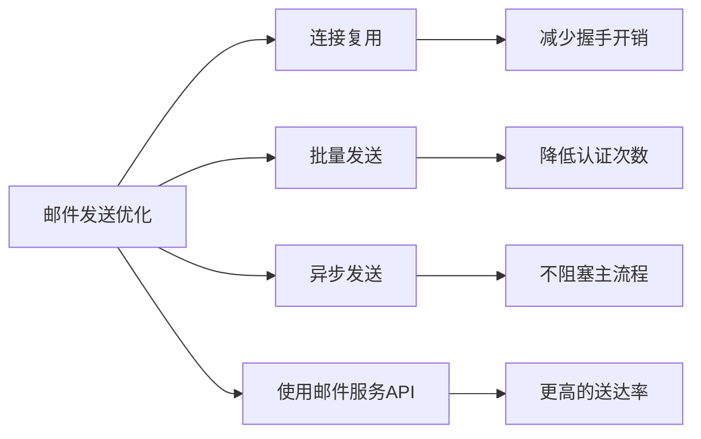

# net/smtp完全指南

## 📖 包简介

`net/smtp` 是Go标准库中负责SMTP（Simple Mail Transfer Protocol）协议实现的包。SMTP是互联网邮件传输的事实标准协议，你每天收到的每一封电子邮件，背后都离不开SMTP协议的运作。

这个包提供了发送电子邮件的底层能力，包括连接到SMTP服务器、身份认证、发送邮件头和邮件内容等功能。虽然它不如`net/http`那样广为人知，但在需要发送邮件的应用中（如注册验证、密码重置、通知告警等），它是绕不开的一环。

需要说明的是，`net/smtp`是一个**底层包**，它只负责SMTP协议层面的通信，不帮你构建MIME格式的邮件内容。如果你需要发送带附件、HTML格式的邮件，还需要配合其他库（如`mime/multipart`）或使用第三方邮件库。但对于简单的纯文本邮件发送，`net/smtp`完全胜任。

## 🎯 核心功能概览

| 类型/函数 | 用途 | 说明 |
|-----------|------|------|
| `smtp.SendMail` | 发送邮件 | 一行代码发送邮件的便捷函数 |
| `smtp.Dial` | 连接SMTP服务器 | 建立SMTP连接 |
| `smtp.NewClient` | 创建SMTP客户端 | 从已有连接创建客户端 |
| `smtp.PlainAuth` | PLAIN认证 | 用户名密码认证方式 |
| `smtp.CRAMMD5Auth` | CRAM-MD5认证 | 更安全的认证方式 |
| `smtp.Auth` | 认证接口 | 自定义认证方式 |
| `smtp.Client` | SMTP客户端 | 执行SMTP命令 |

## 💻 实战示例

### 示例1：基础邮件发送

```go
package main

import (
	"fmt"
	"log"
	"net/smtp"
)

func main() {
	// SMTP服务器配置
	smtpHost := "smtp.example.com"
	smtpPort := "587"
	smtpAddr := smtpHost + ":" + smtpPort

	// 认证信息
	username := "your-email@example.com"
	password := "your-password"

	// 邮件内容
	from := "your-email@example.com"
	to := []string{"recipient@example.com"}
	subject := "Go SMTP测试邮件"
	body := "你好！这是一封由Go net/smtp包发送的测试邮件。"

	// 构建邮件内容（RFC 822格式）
	msg := fmt.Sprintf("From: %s\r\n"+
		"To: %s\r\n"+
		"Subject: %s\r\n"+
		"Content-Type: text/plain; charset=UTF-8\r\n"+
		"\r\n"+
		"%s", from, to[0], subject, body)

	// 身份认证
	auth := smtp.PlainAuth("", username, password, smtpHost)

	// 发送邮件
	err := smtp.SendMail(smtpAddr, auth, from, to, []byte(msg))
	if err != nil {
		log.Fatalf("Failed to send email: %v", err)
	}

	fmt.Println("Email sent successfully!")
}
```

### 示例2：发送HTML邮件和带附件的邮件

```go
package main

import (
	"bytes"
	"encoding/base64"
	"fmt"
	"io"
	"log"
	"mime/multipart"
	"mime/quotedprintable"
	"net/smtp"
	"net/textproto"
	"os"
	"path/filepath"
	"strings"
	"time"
)

// Email 邮件结构体
type Email struct {
	From        string
	To          []string
	Subject     string
	HTMLBody    string
	TextBody    string
	Attachments []Attachment
}

// Attachment 附件
type Attachment struct {
	Filename    string
	ContentType string
	Data        []byte
}

// Send 发送邮件
func (e *Email) Send(smtpAddr string, auth smtp.Auth) error {
	var buf bytes.Buffer
	writer := multipart.NewWriter(&buf)

	// 邮件头
	header := make(map[string]string)
	header["From"] = e.From
	header["To"] = strings.Join(e.To, ", ")
	header["Subject"] = e.Subject
	header["MIME-Version"] = "1.0"
	header["Content-Type"] = fmt.Sprintf("multipart/mixed; boundary=%s", writer.Boundary())

	// 写入邮件头
	for k, v := range header {
		fmt.Fprintf(&buf, "%s: %s\r\n", k, v)
	}
	fmt.Fprintf(&buf, "\r\n")

	// 邮件正文部分
	bodyWriter := multipart.NewAlternative(writer)

	// 纯文本正文
	if e.TextBody != "" {
		part, _ := bodyWriter.CreatePart(textproto.MIMEHeader{
			"Content-Type":              {"text/plain; charset=UTF-8"},
			"Content-Transfer-Encoding": {"quoted-printable"},
		})
		qp := quotedprintable.NewWriter(part)
		qp.Write([]byte(e.TextBody))
		qp.Close()
	}

	// HTML正文
	if e.HTMLBody != "" {
		part, _ := bodyWriter.CreatePart(textproto.MIMEHeader{
			"Content-Type":              {"text/html; charset=UTF-8"},
			"Content-Transfer-Encoding": {"quoted-printable"},
		})
		qp := quotedprintable.NewWriter(part)
		qp.Write([]byte(e.HTMLBody))
		qp.Close()
	}

	bodyWriter.Close()

	// 附件
	for _, att := range e.Attachments {
		part, _ := writer.CreatePart(textproto.MIMEHeader{
			"Content-Type":              {fmt.Sprintf("%s; name=%q", att.ContentType, att.Filename)},
			"Content-Disposition":       {fmt.Sprintf("attachment; filename=%q", att.Filename)},
			"Content-Transfer-Encoding": {"base64"},
		})

		encoder := base64.NewEncoder(base64.StdEncoding, part)
		encoder.Write(att.Data)
		encoder.Close()
	}

	writer.Close()

	// 发送邮件
	return smtp.SendMail(smtpAddr, auth, e.From, e.To, buf.Bytes())
}

func main() {
	// 配置
	smtpAddr := "smtp.example.com:587"
	auth := smtp.PlainAuth("", "user@example.com", "password", "smtp.example.com")

	// 读取附件（示例）
	attachData, err := os.ReadFile("report.pdf")
	if err != nil {
		// 如果文件不存在，使用示例数据
		attachData = []byte("This is a sample attachment content")
	}

	// 构建邮件
	email := &Email{
		From:    "sender@example.com",
		To:      []string{"recipient@example.com"},
		Subject: "Go生成的月度报告",
		TextBody: "您好！\n\n请查看附件获取详细信息。\n\n此致\n系统自动发送",
		HTMLBody: `
			<html>
			<body style="font-family: Arial, sans-serif;">
				<h2 style="color: #333;">月度报告</h2>
				<p>您好！</p>
				<p>请查看附件获取详细信息。</p>
				<table style="border-collapse: collapse; width: 100%;">
					<tr style="background: #f5f5f5;">
						<th style="border: 1px solid #ddd; padding: 8px;">指标</th>
						<th style="border: 1px solid #ddd; padding: 8px;">数值</th>
					</tr>
					<tr>
						<td style="border: 1px solid #ddd; padding: 8px;">用户数</td>
						<td style="border: 1px solid #ddd; padding: 8px;">1,234</td>
					</tr>
				</table>
				<p style="color: #888; margin-top: 20px;">此致<br/>系统自动发送</p>
			</body>
			</html>
		`,
		Attachments: []Attachment{
			{
				Filename:    "report.pdf",
				ContentType: "application/pdf",
				Data:        attachData,
			},
		},
	}

	// 发送邮件
	if err := email.Send(smtpAddr, auth); err != nil {
		log.Fatal(err)
	}

	fmt.Println("Email with HTML and attachment sent!")
}
```

### 示例3：使用底层Client自定义SMTP操作

```go
package main

import (
	"crypto/tls"
	"fmt"
	"log"
	"net"
	"net/smtp"
)

func main() {
	// 连接SMTP服务器
	conn, err := net.Dial("tcp", "smtp.example.com:587")
	if err != nil {
		log.Fatal(err)
	}
	defer conn.Close()

	// 创建SMTP客户端
	client, err := smtp.NewClient(conn, "smtp.example.com")
	if err != nil {
		log.Fatal(err)
	}
	defer client.Quit()

	// 开始TLS（如果服务器支持）
	if ok, _ := client.Extension("STARTTLS"); ok {
		config := &tls.Config{
			ServerName: "smtp.example.com",
		}
		if err = client.StartTLS(config); err != nil {
			log.Fatal(err)
		}
	}

	// 身份认证
	auth := smtp.PlainAuth("", "user@example.com", "password", "smtp.example.com")
	if err = client.Auth(auth); err != nil {
		log.Fatal(err)
	}

	// 设置发件人
	if err = client.Mail("sender@example.com"); err != nil {
		log.Fatal(err)
	}

	// 设置收件人（可以有多个）
	if err = client.Rcpt("recipient1@example.com"); err != nil {
		log.Fatal(err)
	}
	if err = client.Rcpt("recipient2@example.com"); err != nil {
		log.Fatal(err)
	}

	// 发送邮件内容
	w, err := client.Data()
	if err != nil {
		log.Fatal(err)
	}

	// 写入邮件内容
	emailContent := "From: sender@example.com\r\n" +
		"To: recipient1@example.com, recipient2@example.com\r\n" +
		"Subject: Custom SMTP Email\r\n" +
		"Content-Type: text/plain; charset=UTF-8\r\n" +
		"\r\n" +
		"This is a test email sent using low-level SMTP client.\r\n"

	_, err = w.Write([]byte(emailContent))
	if err != nil {
		log.Fatal(err)
	}

	err = w.Close()
	if err != nil {
		log.Fatal(err)
	}

	fmt.Println("Email sent via low-level SMTP client!")
}
```

## ⚠️ 常见陷阱与注意事项

### 1. 邮件格式必须符合RFC 822
SMTP只负责传输字节流，邮件格式（发件人、收件人、主题等）必须你自己按照RFC 822规范构建：
```go
// 正确 - 包含必要的头
msg := "From: sender@example.com\r\n" +
    "To: recipient@example.com\r\n" +
    "Subject: Test\r\n" +
    "\r\n" + // 头和体之间必须有空行
    "Email body"
```

### 2. SendMail不自动处理TLS
`smtp.SendMail`默认**不启用TLS**。如果SMTP服务器要求TLS（大多数都是），你需要：
- 使用587端口配合STARTTLS（底层Client方式）
- 或者使用465端口（SMTPS）并手动建立TLS连接

### 3. 认证信息泄露风险
不要在代码中硬编码密码！使用环境变量或配置管理：
```go
// 错误
auth := smtp.PlainAuth("", "user", "password123", host)

// 正确
password := os.Getenv("SMTP_PASSWORD")
auth := smtp.PlainAuth("", "user", password, host)
```

### 4. 收件人列表与邮件头的To不同
`smtp.SendMail`的`to`参数是SMTP协议的`RCPT TO`命令，而邮件内容中的`To:`头只是显示用的。两者可以不同，但为了用户体验应该保持一致。

### 5. 大附件的内存问题
当前实现将整个邮件内容加载到内存中再发送。对于大附件（>10MB），应该使用底层`Client`并分块写入，或者考虑使用专门的邮件服务API（如SendGrid、AWS SES等）。

## 🚀 Go 1.26新特性

Go 1.26对`net/smtp`包**没有直接的功能变更**。但需要注意的是，Go团队在邮件相关的安全建议上更加严格：

**安全建议更新**:
1. **强制TLS**：建议所有生产环境的邮件发送都使用TLS加密
2. **认证方式**：PLAIN认证仅在TLS连接下使用，否则密码会被明文传输
3. **GODEBUG**：无相关GODEBUG配置变更

如果你使用第三方邮件库，请留意它们是否已适配Go 1.26的安全策略变化。

## 📊 性能优化建议



**优化建议**:

1. **连接池**：频繁发送邮件时复用SMTP连接
2. **批量发送**：一次连接发送多封邮件
3. **异步处理**：邮件发送放在后台goroutine
4. **第三方服务**：生产环境推荐使用SendGrid、Mailgun、AWS SES等专业邮件服务

```go
// 批量发送邮件的示例
func sendBatchEmails(client *smtp.Client, emails []Email) error {
	for _, email := range emails {
		if err := client.Mail(email.From); err != nil {
			return err
		}
		for _, to := range email.To {
			if err := client.Rcpt(to); err != nil {
				return err
			}
		}
		w, _ := client.Data()
		w.Write([]byte(email.Body))
		w.Close()
	}
	return nil
}
```

## 🔗 相关包推荐

- `net/smtp` - SMTP协议实现
- `mime/multipart` - MIME多部分邮件构建
- `mime/quotedprintable` - 邮件编码
- `crypto/tls` - TLS加密
- `net/textproto` - 文本协议解析
- `encoding/base64` - Base64编码（附件）

---