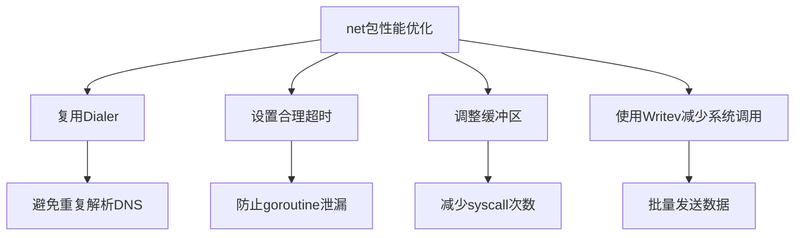

# net完全指南

## 📖 包简介

`net` 包是Go网络编程的基石，提供了网络I/O的底层抽象。如果说`net/http`是装修精美的餐厅，那`net`就是厨房里的煤气灶和菜刀——更原始、更底层，但也更灵活。

这个包封装了TCP、UDP、IP、Unix Domain Socket等各种网络协议的连接和监听能力。当你需要绕过HTTP协议直接操作Socket时（比如实现自定义协议、游戏服务器、DNS解析器），`net`包就是你的不二之选。

Go 1.26为`Dialer`家族新增了支持Context的`DialIP`、`DialTCP`、`DialUDP`、`DialUnix`方法，让底层网络编程也能享受Context带来的超时控制和取消传播能力。这次更新虽不张扬，但对需要精细控制网络连接生命周期的场景来说，是一剂强心针。

## 🎯 核心功能概览

| 类型/函数 | 用途 | 说明 |
|-----------|------|------|
| `net.Dial` | 快捷拨号 | 一行代码建立TCP/UDP连接 |
| `net.Listen` | 监听端口 | 创建TCP/Unix监听器 |
| `net.Dialer` | 拨号器 | 支持超时、KeepAlive等高级配置 |
| `net.Conn` | 连接接口 | 读写网络数据的核心接口 |
| `net.Listener` | 监听器接口 | 接受新连接 |
| `net.ResolveTCPAddr` | 地址解析 | 解析TCP地址 |
| `net.PacketConn` | 数据包接口 | UDP等无协议连接 |
| `net.IP` | IP地址 | IP地址表示和操作 |

**Go 1.26新增方法**:
- `Dialer.DialIP(ctx, network, laddr, raddr)` - TCP连接支持Context
- `Dialer.DialTCP(ctx, network, laddr, raddr)` - TCP连接支持Context
- `Dialer.DialUDP(ctx, network, laddr, raddr)` - UDP连接支持Context
- `Dialer.DialUnix(ctx, network, laddr, raddr)` - Unix域套接字支持Context

## 💻 实战示例

### 示例1：基础TCP服务器与客户端

```go
package main

import (
	"bufio"
	"fmt"
	"log"
	"net"
	"os"
	"sync"
)

func main() {
	// ========== 服务端 ==========
	listener, err := net.Listen("tcp", "127.0.0.1:9999")
	if err != nil {
		log.Fatal(err)
	}
	defer listener.Close()

	log.Println("TCP Server listening on :9999")

	var wg sync.WaitGroup
	for {
		conn, err := listener.Accept()
		if err != nil {
			log.Println("Accept error:", err)
			continue
		}

		wg.Add(1)
		go handleConnection(conn, &wg)
	}
}

func handleConnection(conn net.Conn, wg *sync.WaitGroup) {
	defer wg.Done()
	defer conn.Close()

	log.Printf("New connection from %s", conn.RemoteAddr())

	reader := bufio.NewReader(conn)
	for {
		message, err := reader.ReadString('\n')
		if err != nil {
			log.Printf("Connection closed: %s", conn.RemoteAddr())
			return
		}

		fmt.Printf("Received: %s", message)

		// 回复客户端
		reply := fmt.Sprintf("Echo: %s", message)
		conn.Write([]byte(reply))

		if message == "quit\n" {
			conn.Write([]byte("Bye!\n"))
			return
		}
	}
}
```

客户端代码：
```go
package main

import (
	"bufio"
	"fmt"
	"log"
	"net"
	"os"
)

func main() {
	// 建立TCP连接
	conn, err := net.Dial("tcp", "127.0.0.1:9999")
	if err != nil {
		log.Fatal("Connection failed:", err)
	}
	defer conn.Close()

	reader := bufio.NewReader(os.Stdin)

	for {
		fmt.Print("Enter message: ")
		message, _ := reader.ReadString('\n')

		// 发送数据
		conn.Write([]byte(message))

		// 接收回复
		reply, err := bufio.NewReader(conn).ReadString('\n')
		if err != nil {
			log.Println("Server closed connection")
			return
		}

		fmt.Printf("Server: %s", reply)

		if message == "quit\n" {
			break
		}
	}
}
```

### 示例2：Go 1.26新特性 - 带Context的DialTCP

```go
package main

import (
	"context"
	"fmt"
	"log"
	"net"
	"time"
)

func main() {
	// 解析远程地址
	raddr, err := net.ResolveTCPAddr("tcp", "127.0.0.1:9999")
	if err != nil {
		log.Fatal(err)
	}

	// 本地地址（nil表示由系统分配）
	var laddr *net.TCPAddr

	// Go 1.26: Dialer.DialTCP支持Context
	dialer := net.Dialer{
		Timeout: 5 * time.Second,
	}

	// 创建带超时的Context
	ctx, cancel := context.WithTimeout(context.Background(), 10*time.Second)
	defer cancel()

	// 使用新的DialTCP方法
	conn, err := dialer.DialTCP(ctx, "tcp", laddr, raddr)
	if err != nil {
		log.Printf("DialTCP failed: %v", err)
		return
	}
	defer conn.Close()

	fmt.Printf("Connected! Local: %s, Remote: %s\n",
		conn.LocalAddr(), conn.RemoteAddr())

	// 读写操作
	conn.Write([]byte("Hello from DialTCP!\n"))

	// 设置读取超时
	conn.SetReadDeadline(time.Now().Add(5 * time.Second))
	buf := make([]byte, 1024)
	n, err := conn.Read(buf)
	if err != nil {
		log.Printf("Read error: %v", err)
	} else {
		fmt.Printf("Received: %s", buf[:n])
	}
}
```

### 示例3：UDP广播与多播

```go
package main

import (
	"context"
	"fmt"
	"log"
	"net"
	"time"
)

// UDPServer UDP服务器
type UDPServer struct {
	conn *net.UDPConn
	addr *net.UDPAddr
}

// NewUDPServer 创建UDP服务器
func NewUDPServer(port int) (*UDPServer, error) {
	addr := &net.UDPAddr{
		IP:   net.ParseIP("0.0.0.0"),
		Port: port,
	}

	conn, err := net.ListenUDP("udp", addr)
	if err != nil {
		return nil, fmt.Errorf("listen udp: %w", err)
	}

	return &UDPServer{conn: conn, addr: addr}, nil
}

// Handle 处理UDP请求
func (s *UDPServer) Handle(ctx context.Context) error {
	buf := make([]byte, 4096)
	for {
		select {
		case <-ctx.Done():
			return ctx.Err()
		default:
		}

		// 设置读取超时，避免永久阻塞
		s.conn.SetReadDeadline(time.Now().Add(1 * time.Second))

		n, remoteAddr, err := s.conn.ReadFromUDP(buf)
		if err != nil {
			if netErr, ok := err.(net.Error); ok && netErr.Timeout() {
				continue
			}
			return fmt.Errorf("read udp: %w", err)
		}

		message := string(buf[:n])
		log.Printf("Received from %s: %s", remoteAddr, message)

		// 回复
		reply := fmt.Sprintf("ACK: %s", message)
		s.conn.WriteToUDP([]byte(reply), remoteAddr)
	}
}

// SendUDPBroadcast 发送UDP广播（客户端）
func SendUDPBroadcast(port int, message string) error {
	// Go 1.26: 使用Dialer.DialUDP支持Context
	dialer := net.Dialer{
		Timeout: 5 * time.Second,
	}

	ctx, cancel := context.WithTimeout(context.Background(), 5*time.Second)
	defer cancel()

	raddr := &net.UDPAddr{
		IP:   net.ParseIP("255.255.255.255"),
		Port: port,
	}

	conn, err := dialer.DialUDP(ctx, "udp", nil, raddr)
	if err != nil {
		return fmt.Errorf("dial udp: %w", err)
	}
	defer conn.Close()

	_, err = conn.Write([]byte(message))
	if err != nil {
		return fmt.Errorf("write udp: %w", err)
	}

	log.Printf("Broadcast sent: %s", message)

	// 接收回复
	conn.SetReadDeadline(time.Now().Add(3 * time.Second))
	buf := make([]byte, 4096)
	n, _, err := conn.Read(buf)
	if err != nil {
		return fmt.Errorf("read reply: %w", err)
	}

	log.Printf("Reply: %s", string(buf[:n]))
	return nil
}

func main() {
	// 启动服务器
	server, err := NewUDPServer(10086)
	if err != nil {
		log.Fatal(err)
	}
	defer server.conn.Close()

	ctx, cancel := context.WithCancel(context.Background())
	defer cancel()

	go func() {
		if err := server.Handle(ctx); err != nil {
			log.Printf("Server error: %v", err)
		}
	}()

	time.Sleep(100 * time.Millisecond)

	// 发送广播
	if err := SendUDPBroadcast(10086, "Hello UDP!"); err != nil {
		log.Printf("Broadcast error: %v", err)
	}
}
```

## ⚠️ 常见陷阱与注意事项

### 1. 忘记关闭连接导致文件描述符泄漏
每次`Dial`或`Accept`得到的`Conn`都**必须**关闭。使用`defer`是最佳实践：
```go
conn, err := net.Dial("tcp", "host:port")
if err != nil {
    return err
}
defer conn.Close() // 立即defer！
```

### 2. Read返回0和EOF的处理
`Read`可能返回`n > 0`和`err == io.EOF`同时出现。这意味着读到了部分数据但也到达末尾。**先处理数据，再处理错误**：
```go
n, err := conn.Read(buf)
if n > 0 {
    processData(buf[:n]) // 先处理数据
}
if err != nil {
    handleError(err) // 再处理错误
}
```

### 3. 没有设置超时导致永久阻塞
不设置超时的`Read`或`Accept`可能永远阻塞。使用`SetDeadline`、`SetReadDeadline`或`SetWriteDeadline`：
```go
conn.SetReadDeadline(time.Now().Add(5 * time.Second))
conn.SetWriteDeadline(time.Now().Add(5 * time.Second))
```

### 4. 忽略半关闭场景
TCP连接可以单独关闭读或写。调用`conn.(*net.TCPConn).CloseWrite()`发送FIN，但连接仍然可以读取对方的数据。这在请求-响应模式中非常有用。

### 5. 地址解析的坑
`net.ResolveTCPAddr`不会验证IP是否可达，它只是解析字符串。实际连通性要靠`Dial`来验证。另外，`"0.0.0.0"`表示监听所有接口，而`"127.0.0.1"`仅监听本地回环。

## 🚀 Go 1.26新特性

### Dialer新增Context方法

Go 1.26为`net.Dialer`新增了四个支持Context的专用拨号方法：

| 方法 | 对应旧方法 | 新增能力 |
|------|-----------|----------|
| `DialTCP(ctx, ...)` | `Dial("tcp", ...)` | 超时取消传播 |
| `DialUDP(ctx, ...)` | `Dial("udp", ...)` | 超时取消传播 |
| `DialIP(ctx, ...)` | `Dial("ip:proto", ...)` | 超时取消传播 |
| `DialUnix(ctx, ...)` | `Dial("unix", ...)` | 超时取消传播 |

这些方法与原有的`DialContext`不同，它们直接返回具体类型的连接（`*TCPConn`、``UDPConn`等），省去了类型断言的麻烦：

```go
// 旧方式：需要类型断言
conn, err := dialer.DialContext(ctx, "tcp", "host:port")
tcpConn := conn.(*net.TCPConn)

// Go 1.26新方式：直接返回具体类型
tcpConn, err := dialer.DialTCP(ctx, "tcp", nil, raddr)
```

## 📊 性能优化建议



**关键优化技巧**:

1. **复用Dialer**：`Dialer`内部缓存DNS解析结果，复用可以避免重复查询
2. **KeepAlive配置**：长连接场景开启KeepAlive，减少握手开销
3. **批量写入**：小数据包合并后一次性写入，减少系统调用
4. **读取缓冲区**：使用适当大小的缓冲区（4KB-64KB），避免过小或过大

```go
// 推荐的高性能Dialer配置
dialer := &net.Dialer{
    Timeout:   30 * time.Second,
    KeepAlive: 30 * time.Second,
}
```

## 🔗 相关包推荐

- `net/http` - HTTP协议实现
- `net/url` - URL解析
- `net/netip` - IP地址解析（Go 1.18+推荐）
- `context` - 超时和取消控制
- `io` - I/O操作基础接口
- `crypto/tls` - TLS加密连接

---