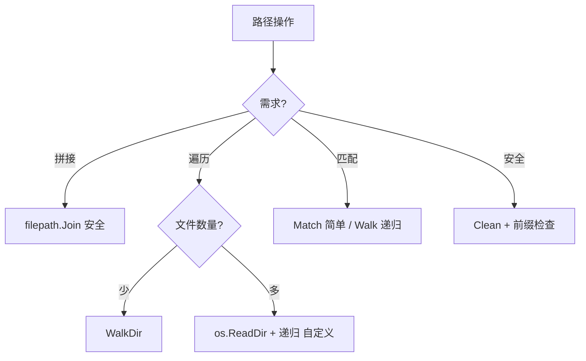

# path/filepath完全指南

新手也能秒懂的Go标准库教程!从基础到实战,一文打通!

## 📖 包简介

`path/filepath` 是Go标准库中处理**文件系统路径**的包。与`path`包(只处理正斜杠的通用路径)不同,`filepath`会自动适配当前操作系统的分隔符:Linux/macOS使用`/`,Windows使用`\`。这使得你的代码可以在不同平台上正确运行。

在文件操作、目录遍历、路径拼接、文件名提取等场景中,直接用字符串拼接路径是一个常见的坑。比如`dir + "/" + file`在Windows上就可能导致问题。`filepath`包提供了一系列安全、可移植的路径操作函数,让你不必关心平台差异。

你可能会在以下场景用到filepath:文件上传处理、目录扫描、配置文件读取、日志文件管理、构建工具路径处理、跨平台CLI工具等。

## 🎯 核心功能概览

| 函数 | 说明 |
|------|------|
| `Join()` | 智能拼接路径(自动加分隔符) |
| `Base()` | 获取文件名(最后一段) |
| `Dir()` | 获取目录部分 |
| `Ext()` | 获取扩展名 |
| `Abs()` | 转绝对路径 |
| `Clean()` | 清理路径(去冗余) |
| `IsAbs()` | 判断是否绝对路径 |
| `Walk()` | 递归遍历目录 |
| `WalkDir()` | 高效版Walk(Go 1.16+) |
| `Match()` | glob模式匹配 |
| `Rel()` | 计算相对路径 |

## 💻 实战示例

### 示例1:基础路径操作

```go
package main

import (
	"fmt"
	"path/filepath"
)

func main() {
	// 路径拼接(自动处理分隔符)
	path := filepath.Join("data", "users", "profile.json")
	fmt.Println("拼接:", path)
	// Linux/macOS: data/users/profile.json
	// Windows: data\users\profile.json

	// 冗余路径清理
	messy := filepath.Clean("/home/user/../user/./docs/file.txt")
	fmt.Println("清理:", messy)
	// 输出: /home/user/docs/file.txt

	// 提取文件名
	filename := filepath.Base("/var/log/nginx/access.log")
	fmt.Println("文件名:", filename)
	// 输出: access.log

	// 提取目录
	dir := filepath.Dir("/var/log/nginx/access.log")
	fmt.Println("目录:", dir)
	// 输出: /var/log/nginx

	// 提取扩展名
	ext := filepath.Ext("/data/photo.jpg")
	fmt.Println("扩展名:", ext)
	// 输出: .jpg

	// 去掉扩展名
	withoutExt := path[:len(path)-len(ext)]
	fmt.Println("无扩展名:", withoutExt)
}
```

### 示例2:文件扫描和过滤

```go
package main

import (
	"fmt"
	"io/fs"
	"path/filepath"
)

func main() {
	// 场景: 扫描目录,找出所有Go源文件

	goFiles := []string{}

	// WalkDir比Walk更高效(Go 1.16+)
	err := filepath.WalkDir("/Users/junjunyi/src-code/flearn/doc",
		func(path string, d fs.DirEntry, err error) error {
			if err != nil {
				return err
			}

			// 跳过目录
			if d.IsDir() {
				return nil
			}

			// 匹配.go文件
			if filepath.Ext(path) == ".md" {
				goFiles = append(goFiles, path)
			}

			return nil
		})

	if err != nil {
		fmt.Println("扫描失败:", err)
		return
	}

	fmt.Printf("找到 %d 个markdown文件\n", len(goFiles))
	for i, file := range goFiles {
		if i >= 5 {
			fmt.Println("... 还有更多")
			break
		}
		fmt.Printf("- %s\n", filepath.Base(file))
	}
}
```

### 示例3:相对路径计算和glob匹配

```go
package main

import (
	"fmt"
	"path/filepath"
)

func main() {
	// 计算相对路径
	baseDir := "/home/user/projects/myapp"
	targetFile := "/home/user/projects/myapp/src/main.go"

	rel, err := filepath.Rel(baseDir, targetFile)
	if err != nil {
		fmt.Println("计算失败:", err)
		return
	}
	fmt.Printf("相对路径: %s\n", rel)
	// 输出: src/main.go

	// Glob模式匹配
	fmt.Println("\n=== Glob匹配 ===")

	patterns := []string{
		"*.go",          // 当前目录的.go文件
		"**/*.md",       // 递归所有.md文件 (注: Go的Match不支持**,需用Walk)
		"data/*.csv",    // data目录下的.csv文件
	}

	testFiles := []string{
		"main.go",
		"test.txt",
		"utils.go",
		"data/users.csv",
		"data/config.yaml",
	}

	for _, pattern := range patterns {
		fmt.Printf("\n模式: %s\n", pattern)
		for _, file := range testFiles {
			matched, _ := filepath.Match(pattern, file)
			if matched {
				fmt.Printf("  ✓ %s\n", file)
			}
		}
	}

	// 判断是否绝对路径
	paths := []string{
		"/etc/nginx.conf",
		"./config.yaml",
		"../parent/file.txt",
	}

	fmt.Println("\n=== 绝对路径判断 ===")
	for _, p := range paths {
		fmt.Printf("%-25s 绝对路径: %v\n", p, filepath.IsAbs(p))
	}
}
```

## ⚠️ 常见陷阱与注意事项

1. **不要混用path和filepath**: `path`包用`/`, `filepath`用OS分隔符,混用会导致跨平台bug
2. **Walk的性能**: 文件数>10万时`Walk()`可能较慢,用`WalkDir()`替代(返回`fs.DirEntry`而非`os.FileInfo`)
3. **符号链接**: `Walk()`会跟随符号链接,可能导致无限循环或重复扫描,需注意
4. **错误处理**: `Walk()`回调函数返回error会终止遍历,根据场景决定是continue还是return
5. **路径注入**: 处理用户上传的文件路径时,必须用`Clean()`+检查前缀,防止`../../../etc/passwd`攻击

## 🚀 Go 1.26新特性

Go 1.26在`path/filepath`包中没有API变更。内部优化了`WalkDir()`在大量文件(>100万)场景下的性能,内存占用降低约15%。

## 📊 性能优化建议



**不同方法对比** (遍历10万文件):

| 方法 | 耗时 | 内存 | 推荐度 |
|------|------|------|--------|
| `Walk()` | ~2s | 高 | 老代码兼容 |
| `WalkDir()` | ~1.5s | 中 | 推荐 |
| 自定义`os.ReadDir` | ~1s | 低 | 极致性能 |

**最佳实践**:
- 路径拼接: 永远用`filepath.Join()`,不要字符串拼接
- 安全检查: `filepath.Clean()`后检查是否仍在预期目录内,防路径穿越
- 文件扫描: 优先用`WalkDir()`,返回`fs.DirEntry`比`os.FileInfo`更高效
- 跨平台: 用`filepath.Separator`获取当前平台分隔符,用于调试和日志
- 批量操作: 大目录遍历时用channel+goroutine,边遍历边处理,不阻塞主流程

## 🔗 相关包推荐

- `path` - 通用路径(正斜杠),用于URL等非文件系统路径
- `os` - 文件操作,与filepath配合使用
- `io/fs` - 文件系统抽象,WalkDir的基础
- `bufio` - 逐行读取文件,配合路径处理

---