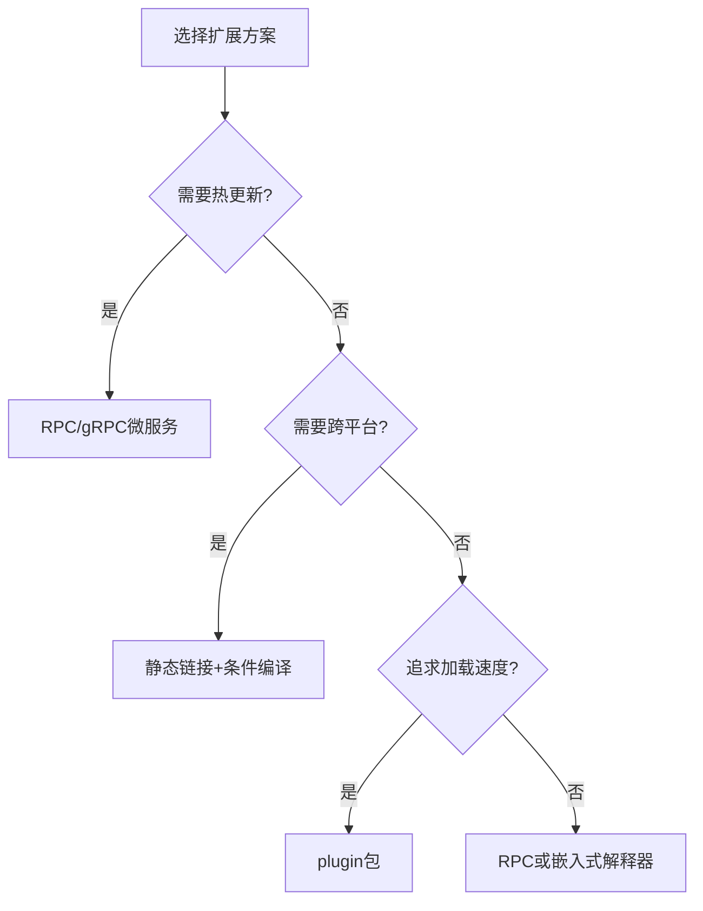

#  plugin完全指南

新手也能秒懂的Go标准库教程!从基础到实战,一文打通!

## 📖 包简介

`plugin` 包提供了Go语言的动态插件加载能力,让你能够在运行时动态加载和调用编译为共享库(.so文件)的Go代码。这是一种"热插拔"机制——主程序不需要重新编译或重启,就能加载新的功能模块。

虽然Go是一门静态编译的语言,但 `plugin` 包在Go 1.8中引入了动态加载能力。不过需要注意的是,这个功能目前**仅支持Linux、FreeBSD和macOS**,不支持Windows。而且由于其实现限制和生态成熟度,在实际生产环境中使用Go插件系统的场景相对有限,但在需要高度可扩展性的场景(如中间件、规则引擎、定制化部署)中,它仍然是一个强大的工具。

适用场景:可扩展的中间件、规则引擎、定制化部署、第三方集成、模块化工具开发。

## 🎯 核心功能概览

### 核心类型和函数

| 类型/函数 | 用途 | 说明 |
|----------|------|------|
| `plugin.Open(path)` | 打开插件文件 | 加载.so共享库,返回 `*plugin.Plugin` |
| `plugin.Plugin.Lookup(name)` | 查找符号 | 从插件中导出名为name的符号 |
| `plugin.Plugin` | 插件对象 | 表示已打开的插件 |

### 插件开发要求

| 要求 | 说明 |
|------|------|
| 构建命令 | `go build -buildmode=plugin` |
| 导出符号 | 必须使用大写字母开头(Public) |
| 平台限制 | 仅支持Linux/macOS/FreeBSD |
| Go版本 | 插件和主程序必须用相同的Go版本编译 |

### 插件构建流程图


## 💻 实战示例

### 示例1: 基础用法 - 创建和加载简单插件

**第一步: 创建插件代码 (greet_plugin.go)**

```go
// greet_plugin.go
// 构建命令: go build -buildmode=plugin -o greet.so greet_plugin.go

package main

import "fmt"

// Greet 必须导出(大写开头)
var Greet greetFunc

type greetFunc func(name string) string

func init() {
	Greet = func(name string) string {
		return fmt.Sprintf("Hello from plugin, %s!", name)
	}
}
```

**第二步: 创建主程序 (main.go)**

```go
package main

import (
	"fmt"
	"plugin"
)

func main() {
	// 打开插件
	p, err := plugin.Open("greet.so")
	if err != nil {
		fmt.Printf("加载插件失败: %v\n", err)
		return
	}

	// 查找导出的符号
	sym, err := p.Lookup("Greet")
	if err != nil {
		fmt.Printf("查找符号失败: %v\n", err)
		return
	}

	// 类型断言
	greetFunc, ok := sym.(func(name string) string)
	if !ok {
		fmt.Println("符号类型不匹配")
		return
	}

	// 调用插件函数
	result := greetFunc("Alice")
	fmt.Println(result)
	// 输出: Hello from plugin, Alice!
}
```

**第三步: 编译和运行**

```bash
# 编译插件
go build -buildmode=plugin -o greet.so greet_plugin.go

# 运行主程序
go run main.go
```

### 示例2: 进阶用法 - 插件化处理器链

**插件1: 大写处理器 (upper_handler.so)**

```go
// upper_handler.go
package main

import "strings"

// Handler 处理器接口实现
var Handler handler

type handler struct{}

func (h handler) Name() string {
	return "uppercase"
}

func (h handler) Process(input string) string {
	return strings.ToUpper(input)
}
```

**插件2: 反转处理器 (reverse_handler.so)**

```go
// reverse_handler.go
package main

// Handler 处理器接口实现
var Handler handler

type handler struct{}

func (h handler) Name() string {
	return "reverse"
}

func (h handler) Process(input string) string {
	runes := []rune(input)
	for i, j := 0, len(runes)-1; i < j; i, j = i+1, j-1 {
		runes[i], runes[j] = runes[j], runes[i]
	}
	return string(runes)
}
```

**主程序: 动态加载和处理链**

```go
package main

import (
	"fmt"
	"os"
	"path/filepath"
	"plugin"
)

// Processor 处理器接口
type Processor interface {
	Name() string
	Process(input string) string
}

// PluginHandler 插件处理器包装器
type PluginHandler struct {
	plugin *plugin.Plugin
	symbol plugin.Symbol
}

// PluginManager 插件管理器
type PluginManager struct {
	processors []Processor
}

// NewPluginManager 创建插件管理器
func NewPluginManager() *PluginManager {
	return &PluginManager{}
}

// LoadPlugin 加载插件
func (pm *PluginManager) LoadPlugin(path string) error {
	p, err := plugin.Open(path)
	if err != nil {
		return fmt.Errorf("打开插件失败 %s: %w", path, err)
	}

	sym, err := p.Lookup("Handler")
	if err != nil {
		return fmt.Errorf("查找Handler失败: %w", err)
	}

	processor, ok := sym.(Processor)
	if !ok {
		return fmt.Errorf("Handler不是Processor类型")
	}

	pm.processors = append(pm.processors, processor)
	fmt.Printf("✅ 加载插件: %s\n", processor.Name())
	return nil
}

// Process 执行处理链
func (pm *PluginManager) Process(input string) string {
	result := input
	for _, proc := range pm.processors {
		result = proc.Process(result)
		fmt.Printf("[%s] 输出: %s\n", proc.Name(), result)
	}
	return result
}

func main() {
	if len(os.Args) < 2 {
		fmt.Println("用法: go run main.go <输入文本>")
		fmt.Println("请确保 .so 插件文件在同一目录")
		os.Exit(1)
	}

	input := os.Args[1]

	// 创建插件管理器
	pm := NewPluginManager()

	// 扫描并加载所有 .so 插件
	matches, _ := filepath.Glob("*.so")
	for _, match := range matches {
		if err := pm.LoadPlugin(match); err != nil {
			fmt.Printf("⚠️  跳过插件 %s: %v\n", match, err)
		}
	}

	if len(pm.processors) == 0 {
		fmt.Println("未找到可用的插件")
		return
	}

	// 执行处理链
	fmt.Printf("\n📝 输入: %s\n", input)
	fmt.Println("🔄 处理中:")
	result := pm.Process(input)
	fmt.Printf("\n🎯 最终结果: %s\n", result)
}
```

### 示例3: 最佳实践 - 带版本检查和错误处理的插件系统

```go
package main

import (
	"fmt"
	"plugin"
	"sync"
)

// PluginInfo 插件元信息接口
type PluginInfo interface {
	Name() string
	Version() string
	Init() error
}

// PluginEntry 插件注册项
type PluginEntry struct {
	Info   PluginInfo
	Loader func() error
}

// PluginRegistry 插件注册表
type PluginRegistry struct {
	mu       sync.RWMutex
	plugins  map[string]PluginEntry
	loaded   map[string]bool
}

// NewPluginRegistry 创建注册表
func NewPluginRegistry() *PluginRegistry {
	return &PluginRegistry{
		plugins: make(map[string]PluginEntry),
		loaded:  make(map[string]bool),
	}
}

// Register 注册插件路径
func (pr *PluginRegistry) Register(path string) error {
	p, err := plugin.Open(path)
	if err != nil {
		return fmt.Errorf("打开插件 %s 失败: %w", path, err)
	}

	// 查找元信息
	infoSym, err := p.Lookup("Info")
	if err != nil {
		return fmt.Errorf("插件 %s 缺少 Info 符号: %w", path, err)
	}

	info, ok := infoSym.(PluginInfo)
	if !ok {
		return fmt.Errorf("插件 %s 的 Info 不是 PluginInfo 类型", path)
	}

	// 查找初始化函数
	initSym, err := p.Lookup("Init")
	if err != nil {
		return fmt.Errorf("插件 %s 缺少 Init 符号: %w", path, err)
	}

	initFunc, ok := initSym.(func() error)
	if !ok {
		return fmt.Errorf("插件 %s 的 Init 不是 func() error 类型", path)
	}

	pr.mu.Lock()
	defer pr.mu.Unlock()

	name := info.Name()
	if _, exists := pr.plugins[name]; exists {
		return fmt.Errorf("插件 %s 已存在", name)
	}

	pr.plugins[name] = PluginEntry{
		Info: info,
		Loader: func() error {
			if err := info.Init(); err != nil {
				return fmt.Errorf("插件 %s 初始化失败: %w", name, err)
			}
			return nil
		},
	}

	fmt.Printf("📦 注册插件: %s v%s\n", name, info.Version())
	return nil
}

// Load 加载并初始化插件
func (pr *PluginRegistry) Load(name string) error {
	pr.mu.Lock()
	defer pr.mu.Unlock()

	entry, exists := pr.plugins[name]
	if !exists {
		return fmt.Errorf("未找到插件: %s", name)
	}

	if pr.loaded[name] {
		return fmt.Errorf("插件 %s 已加载", name)
	}

	if err := entry.Loader(); err != nil {
		return err
	}

	pr.loaded[name] = true
	fmt.Printf("✅ 插件 %s 加载成功\n", name)
	return nil
}

// LoadAll 加载所有已注册插件
func (pr *PluginRegistry) LoadAll() []error {
	var errors []error
	pr.mu.RLock()
	names := make([]string, 0, len(pr.plugins))
	for name := range pr.plugins {
		names = append(names, name)
	}
	pr.mu.RUnlock()

	for _, name := range names {
		if err := pr.Load(name); err != nil {
			errors = append(errors, fmt.Errorf("插件 %s: %w", name, err))
		}
	}

	return errors
}

// ListPlugins 列出所有插件
func (pr *PluginRegistry) ListPlugins() []string {
	pr.mu.RLock()
	defer pr.mu.RUnlock()

	names := make([]string, 0, len(pr.plugins))
	for name, entry := range pr.plugins {
		status := "未加载"
		if pr.loaded[name] {
			status = "已加载"
		}
		names = append(names, fmt.Sprintf("  %s v%s [%s]",
			name, entry.Info.Version(), status))
	}
	return names
}

func main() {
	registry := NewPluginRegistry()

	// 注册插件(假设这些.so文件存在)
	pluginPaths := []string{
		"auth_plugin.so",
		"logging_plugin.so",
		"metrics_plugin.so",
	}

	for _, path := range pluginPaths {
		if err := registry.Register(path); err != nil {
			fmt.Printf("⚠️  注册失败 %s: %v\n", path, err)
		}
	}

	// 列出所有插件
	fmt.Println("\n📋 已注册插件:")
	for _, info := range registry.ListPlugins() {
		fmt.Println(info)
	}

	// 加载所有插件
	fmt.Println("\n🔄 加载插件...")
	if errors := registry.LoadAll(); len(errors) > 0 {
		for _, err := range errors {
			fmt.Printf("❌ %v\n", err)
		}
	}
}
```

## ⚠️ 常见陷阱与注意事项

1. **平台限制**: `plugin` 包仅支持Linux、FreeBSD和macOS,不支持Windows。如果你的项目需要跨平台,这个包不适合你。

2. **Go版本必须匹配**: 插件和主程序必须用**完全相同的Go版本**编译。Go 1.25编译的插件不能被Go 1.26的主程序加载,反之亦然。这会给你带来运维上的复杂性。

3. **类型安全性差**: `Lookup` 返回 `plugin.Symbol` 类型,需要做类型断言。如果插件和主程序对同一接口的定义不一致,断言会静默失败或panic。推荐的做法是:在独立包中定义共享接口,插件和主程序都导入这个包。

4. **插件文件锁定**: 一旦通过 `plugin.Open` 加载,`.so` 文件会被操作系统锁定,无法删除或修改。如果需要更新插件,必须重启主程序(这是Go插件系统与Java/Python等动态语言最大的区别)。

5. **不支持热更新**: Go插件目前不支持卸载和重新加载。一旦加载,插件代码就会常驻内存。如果需要动态更新功能,建议考虑RPC或HTTP服务间通信的方案。

6. **符号命名冲突**: 插件中的所有导出符号(大写开头的变量、函数、类型)都会加载到同一命名空间。多个插件如果有同名符号会冲突。建议在插件名称前加前缀,如 `AuthHandler`、`LogHandler`。

## 🚀 Go 1.26新特性

Go 1.26对 `plugin` 包没有重大变更。这个包的API自Go 1.8引入以来一直保持稳定。主要改进包括:

- **内部链接器优化**: 共享库的加载速度在某些场景下有所提升。
- **兼容性修复**: 修复了极少数边界情况下的加载失败问题。
- **持续的平台支持**: 确保在最新的Linux和macOS版本上正常工作。

## 📊 性能优化建议

### 插件 vs 其他扩展方案对比



### 方案对比表

| 方案 | 热更新 | 跨平台 | 性能 | 复杂度 | 推荐场景 |
|-----|-------|-------|------|-------|---------|
| `plugin` | ❌ | ❌(Linux/macOS) | 高 | 低 | 单平台、无需热更新 |
| RPC/gRPC | ✅ | ✅ | 中 | 高 | 分布式、微服务 |
| 嵌入式Lua/JS | ✅ | ✅ | 低-中 | 中 | 规则引擎、脚本扩展 |
| 条件编译 | ❌ | ✅ | 高 | 低 | 平台特定功能 |
| WASM | ✅ | ✅ | 中 | 中 | 安全沙箱、浏览器插件 |

### 最佳实践: 共享接口定义

```go
// 在共享包中定义接口 (github.com/myorg/plugin-api/types)
package types

type Handler interface {
    Handle(input string) (string, error)
    Name() string
}

// 插件中实现 (导入共享包)
package main

import "github.com/myorg/plugin-api/types"

var Handler handler // 导出

type handler struct{}

func (h handler) Handle(input string) (string, error) {
    return "processed: " + input, nil
}

func (h handler) Name() string {
    return "my-plugin"
}

// 主程序中使用(也导入共享包)
// p, _ := plugin.Open("plugin.so")
// sym, _ := p.Lookup("Handler")
// h := sym.(types.Handler) // 类型安全!
```

## 🔗 相关包推荐

- **`net/rpc`** - Go标准RPC框架(替代插件的进程间通信方案)
- **`google.golang.org/grpc`** - gRPC框架(推荐的微服务通信方案)
- **`github.com/tetratelabs/wazero`** - WASM运行时(安全的沙箱插件)
- **`github.com/yuin/gopher-lua`** - Lua嵌入(灵活的脚本扩展)
- **`embed`** - 文件嵌入(编译时打包资源的替代方案)

---