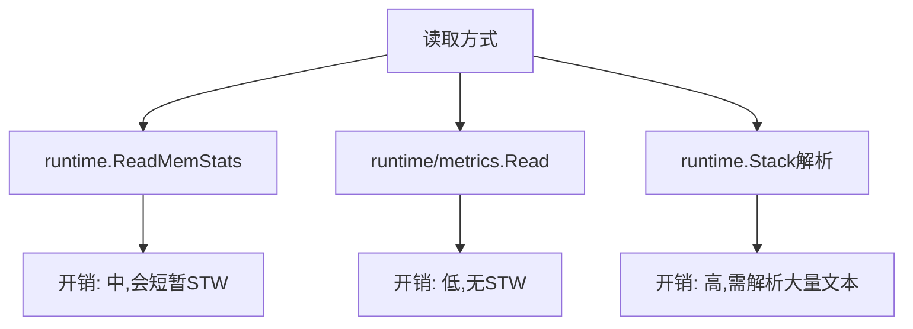

#  runtime/metrics完全指南

新手也能秒懂的Go标准库教程!从基础到实战,一文打通!

## 📖 包简介

`runtime/metrics` 是Go 1.16引入的实验性包,在Go 1.26中迎来了重大更新,新增了调度器相关的关键指标。它是Go运行时系统的"仪表盘",让你能够实时观察到垃圾回收、内存分配、goroutine调度等核心组件的工作状态。

如果你曾经在生产环境中被"神秘的内存泄漏"或"诡异的性能下降"折磨过,那么这个包就是你的"破案工具"。与 `runtime.ReadMemStats` 不同,`runtime/metrics` 提供了更细粒度的指标,并且不需要暂停程序就能读取。

适用场景:生产环境监控、性能调优、容量规划、异常排查、Prometheus/Grafana集成。

## 🎯 核心功能概览

### Go 1.26新增调度器指标

| 指标名称 | 类型 | 说明 |
|---------|------|------|
| `/sched/goroutines:goroutines` | uint64 | 当前活跃的goroutine数量 |
| `/sched/goroutines:running` | uint64 | 运行中的goroutine数量 |
| `/sched/goroutines:runnable` | uint64 | 可运行但未调度的goroutine数量 |
| `/sched/goroutines:waiting` | uint64 | 等待中的goroutine数量(网络、sleep等) |
| `/sched/goroutines:syscall` | uint64 | 系统调用中的goroutine数量 |
| `/sched/threads:thread` | uint64 | OS线程总数 |
| `/sched/goroutines:total_created` | uint64 | 程序生命周期内创建的goroutine总数 |

### 经典指标(延续支持)

| 指标名称 | 类型 | 说明 |
|---------|------|------|
| `/gc/cycles:automatic` | uint64 | 自动GC次数 |
| `/gc/cycles:forced` | uint64 | 强制GC次数 |
| `/gc/heap/allocs:bytes` | uint64 | 堆分配总字节数 |
| `/gc/heap/objects:objects` | uint64 | 堆对象数量 |
| `/memory/classes/heap/free:bytes` | uint64 | 空闲堆内存 |
| `/memory/classes/heap/stacks:bytes` | uint64 | 栈使用内存 |

## 💻 实战示例

### 示例1: 基础用法 - 读取所有可用指标

```go
package main

import (
	"fmt"
	"runtime/metrics"
)

func main() {
	// 获取所有可用的指标描述
	descs := metrics.All()
	fmt.Printf("可用指标数量: %d\n", len(descs))

	// 选择我们关心的指标
	descriptions := []string{
		"/gc/cycles:automatic",
		"/gc/cycles:forced",
		"/gc/heap/allocs:bytes",
		"/sched/goroutines:goroutines",
		"/sched/threads:thread",
	}

	// 创建样本
	samples := make([]metrics.Sample, len(descriptions))
	for i, desc := range descriptions {
		samples[i].Name = desc
	}

	// 读取指标值
	metrics.Read(samples)

	// 打印结果
	for _, s := range samples {
		if s.Value.Kind() == metrics.KindBad {
			fmt.Printf("%s: 不可用\n", s.Name)
			continue
		}
		fmt.Printf("%s: %v\n", s.Name, s.Value)
	}
}
```

### 示例2: 进阶用法 - 构建Prometheus指标收集器

```go
package main

import (
	"fmt"
	"net/http"
	"runtime/metrics"
	"strings"
)

// MetricsCollector Prometheus指标收集器
type MetricsCollector struct {
	samples []metrics.Sample
	names   []string
}

// NewMetricsCollector 创建收集器
func NewMetricsCollector() *MetricsCollector {
	// 定义要收集的指标
	metricNames := []string{
		// GC相关
		"/gc/cycles:automatic",
		"/gc/cycles:forced",
		"/gc/pause:seconds",
		// 堆内存
		"/gc/heap/allocs:bytes",
		"/gc/heap/frees:bytes",
		"/gc/heap/objects:objects",
		// 内存分类
		"/memory/classes/heap/stacks:bytes",
		"/memory/classes/heap/objects:bytes",
		"/memory/classes/os-stacks:bytes",
		// Go 1.26新增调度器指标
		"/sched/goroutines:goroutines",
		"/sched/goroutines:running",
		"/sched/goroutines:runnable",
		"/sched/goroutines:waiting",
		"/sched/goroutines:syscall",
		"/sched/threads:thread",
		"/sched/goroutines:total_created",
	}

	mc := &MetricsCollector{
		samples: make([]metrics.Sample, len(metricNames)),
		names:   metricNames,
	}

	for i, name := range metricNames {
		mc.samples[i].Name = name
	}

	return mc
}

// Collect 收集当前指标
func (mc *MetricsCollector) Collect() {
	metrics.Read(mc.samples)
}

// ExportToPrometheus 导出为Prometheus格式
func (mc *MetricsCollector) ExportToPrometheus() string {
	var sb strings.Builder

	for _, s := range mc.samples {
		if s.Value.Kind() == metrics.KindBad {
			continue
		}

		// 转换指标名称格式
		name := strings.TrimPrefix(s.Name, "/")
		name = strings.ReplaceAll(name, "/", "_")
		name = strings.ReplaceAll(name, ":", "_")
		name = "go_" + name

		// 获取数值
		var value float64
		switch s.Value.Kind() {
		case metrics.KindUint64:
			value = float64(s.Value.Uint64())
		case metrics.KindFloat64:
			value = s.Value.Float64()
		}

		sb.WriteString(fmt.Sprintf("# HELP %s Go runtime metric\n", name))
		sb.WriteString(fmt.Sprintf("# TYPE %s gauge\n", name))
		sb.WriteString(fmt.Sprintf("%s %v\n", name, value))
	}

	return sb.String()
}

func metricsHandler(w http.ResponseWriter, r *http.Request) {
	collector := NewMetricsCollector()
	collector.Collect()
	w.Header().Set("Content-Type", "text/plain")
	fmt.Fprint(w, collector.ExportToPrometheus())
}

func main() {
	http.HandleFunc("/metrics", metricsHandler)
	fmt.Println("Prometheus metrics endpoint: http://localhost:9090/metrics")
	http.ListenAndServe(":9090", nil)
}
```

### 示例3: 最佳实践 - 生产环境调度器监控

```go
package main

import (
	"fmt"
	"log"
	"os"
	"os/signal"
	"runtime/metrics"
	"syscall"
	"time"
)

// SchedulerMonitor 调度器监控器
type SchedulerMonitor struct {
	logger   *log.Logger
	samples  []metrics.Sample
	interval time.Duration
	stopCh   chan struct{}
}

// NewSchedulerMonitor 创建调度器监控器(Go 1.26专用)
func NewSchedulerMonitor(interval time.Duration) *SchedulerMonitor {
	logger := log.New(os.Stdout, "[调度器监控] ", log.LstdFlags)

	// Go 1.26新增的调度器指标
	metricNames := []string{
		"/sched/goroutines:goroutines",
		"/sched/goroutines:running",
		"/sched/goroutines:runnable",
		"/sched/goroutines:waiting",
		"/sched/goroutines:syscall",
		"/sched/threads:thread",
		"/sched/goroutines:total_created",
	}

	samples := make([]metrics.Sample, len(metricNames))
	for i, name := range metricNames {
		samples[i].Name = name
	}

	return &SchedulerMonitor{
		logger:   logger,
		samples:  samples,
		interval: interval,
		stopCh:   make(chan struct{}),
	}
}

// Start 启动监控
func (m *SchedulerMonitor) Start() {
	m.logger.Println("开始监控调度器指标...")
	ticker := time.NewTicker(m.interval)
	defer ticker.Stop()

	var prevTotal uint64

	for {
		select {
		case <-ticker.C:
			metrics.Read(m.samples)

			// 解析各项指标
			stats := make(map[string]uint64)
			for _, s := range m.samples {
				if s.Value.Kind() == metrics.KindUint64 {
					stats[s.Name] = s.Value.Uint64()
				}
			}

			// 打印关键指标
			m.logStats(stats)

			// 检测异常: goroutine增长速度过快
			if total, ok := stats["/sched/goroutines:total_created"]; ok {
				if prevTotal > 0 {
					growth := total - prevTotal
					if growth > 1000 { // 阈值根据业务调整
						m.logger.Printf("⚠️ 告警: goroutine创建速度异常! 本次新增 %d 个\n", growth)
					}
				}
				prevTotal = total
			}

		case <-m.stopCh:
			m.logger.Println("监控已停止")
			return
		}
	}
}

func (m *SchedulerMonitor) logStats(stats map[string]uint64) {
	total := stats["/sched/goroutines:goroutines"]
	running := stats["/sched/goroutines:running"]
	waiting := stats["/sched/goroutines:waiting"]
	syscall := stats["/sched/goroutines:syscall"]
	threads := stats["/sched/threads:thread"]

	m.logger.Printf("Goroutine总数=%d, 运行中=%d, 等待中=%d, 系统调用=%d, OS线程=%d\n",
		total, running, waiting, syscall, threads)
}

// Stop 停止监控
func (m *SchedulerMonitor) Stop() {
	close(m.stopCh)
}

func main() {
	monitor := NewSchedulerMonitor(5 * time.Second)
	go monitor.Start()

	// 模拟一些工作负载
	for i := 0; i < 100; i++ {
		go func(id int) {
			time.Sleep(time.Duration(id%10) * time.Second)
		}(i)
	}

	// 等待信号退出
	sigCh := make(chan os.Signal, 1)
	signal.Notify(sigCh, syscall.SIGINT, syscall.SIGTERM)
	<-sigCh

	monitor.Stop()
}
```

## ⚠️ 常见陷阱与注意事项

1. **不是所有指标在所有平台都可用**: 使用 `metrics.Read` 后检查 `Value.Kind()` 是否为 `KindBad`,避免读取到无效值。

2. **指标名称可能随Go版本变化**: 虽然Go团队尽量保持向后兼容,但不要硬编码指标名称,建议在程序启动时通过 `metrics.All()` 动态发现可用指标。

3. **`/sched/goroutines:total_created` 只增不减**: 这个值是整个程序生命周期内创建的goroutine累计数,不是当前活跃数。用它来计算增长率时要记录上次的值。

4. **读取频率影响性能**: 虽然 `metrics.Read` 不会触发STW,但高频率调用(如每毫秒)仍然会带来一定开销。建议生产环境采样间隔不低于1秒。

5. **指标单位要搞清楚**: 有些指标是字节,有些是纳秒,有些是个数。读取后务必确认单位,否则监控面板上的数字会让人误解。

## 🚀 Go 1.26新特性

Go 1.26为 `runtime/metrics` 包带来了重大更新:

### 新增调度器指标

这是Go 1.26最大的亮点!现在你可以直接通过metrics API获取:

- **各状态Goroutine数量**: 不再需要解析 `runtime.Stack` 的文本来统计goroutine状态,直接读取即可。
- **OS线程数**: 监控底层线程资源使用情况。
- **总创建Goroutine数**: 用于检测goroutine泄漏的累计指标。

```go
// Go 1.26之前: 只能获取总数
fmt.Println(runtime.NumGoroutine())

// Go 1.26: 可以获取各状态的详细信息
samples := []metrics.Sample{
	{Name: "/sched/goroutines:running"},
	{Name: "/sched/goroutines:waiting"},
	{Name: "/sched/goroutines:syscall"},
}
metrics.Read(samples)
```

## 📊 性能优化建议

### 指标读取开销对比



### 推荐监控架构

| 层级 | 方案 | 采集间隔 |
|-----|------|---------|
| 应用内 | `runtime/metrics` + 本地缓存 | 1-5秒 |
| 指标暴露 | Prometheus `/metrics` 端点 | 按需拉取 |
| 存储 | Prometheus/VictoriaMetrics | 持久化 |
| 可视化 | Grafana仪表板 | 实时 |
| 告警 | Alertmanager | 基于阈值 |

### 优化示例: 批量读取减少开销

```go
package main

import (
	"runtime/metrics"
)

// 好的做法: 一次性批量读取
func BatchReadMetrics() {
	names := []string{
		"/gc/cycles:automatic",
		"/gc/heap/allocs:bytes",
		"/sched/goroutines:goroutines",
		"/sched/threads:thread",
	}

	samples := make([]metrics.Sample, len(names))
	for i, name := range names {
		samples[i].Name = name
	}

	// 一次调用读取所有指标
	metrics.Read(samples)

	// 处理结果...
}

// 坏的做法: 逐个读取(开销更大)
func BadReadMetrics() {
	var s1 metrics.Sample
	s1.Name = "/gc/cycles:automatic"
	metrics.Read([]metrics.Sample{s1})

	var s2 metrics.Sample
	s2.Name = "/gc/heap/allocs:bytes"
	metrics.Read([]metrics.Sample{s2})
	// ... 多次调用,开销显著增加
}
```

## 🔗 相关包推荐

- **`runtime`** - 基础运行时接口,与metrics配合使用
- **`runtime/debug`** - 高级调试和GC调优
- **`runtime/pprof`** - 性能分析profiling
- **`net/http/pprof`** - HTTP暴露的profiling端点
- **`expvar`** - 导出自定义应用指标

---