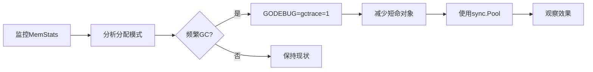

#  runtime完全指南

新手也能秒懂的Go标准库教程!从基础到实战,一文打通!

## 📖 包简介

`runtime` 包是Go语言最底层的核心包之一,它提供了与Go运行时系统交互的接口。你可以把它想象成Go程序的"神经系统"——虽然平时感觉不到它的存在,但一旦需要深入调优或排查问题时,它就是你的救命稻草。

这个包包含了垃圾回收器、goroutine调度器、内存分配器等核心组件的控制接口。虽然官方文档建议"大多数程序不需要直接使用runtime包",但了解它的工作原理,绝对能让你从"会写Go"进阶到"精通Go"。

适用场景:性能调优、内存泄漏排查、goroutine泄漏检测、GC调优、系统级监控等。

## 🎯 核心功能概览

| 函数/变量 | 用途 | 说明 |
|----------|------|------|
| `runtime.NumGoroutine()` | 获取当前goroutine数量 | 排查goroutine泄漏必备 |
| `runtime.NumCPU()` | 获取CPU核心数 | 设置GOMAXPROCS参考值 |
| `runtime.GC()` | 手动触发垃圾回收 | 测试和特殊场景使用 |
| `runtime.GOMAXPROCS(n)` | 设置最大CPU核心数 | Go 1.5后默认等于CPU核心数 |
| `runtime.MemStats` | 内存统计信息 | 详细内存使用指标 |
| `runtime.GCStats` | GC统计信息 | 暂停时间、回收次数等 |
| `runtime.SetFinalizer()` | 设置对象终结器 | 资源清理(慎用!) |
| `runtime.Stack()` | 获取goroutine栈信息 | 调试和监控利器 |
| `runtime.KeepAlive()` | 阻止GC回收对象 | 防止 premature GC |

## 💻 实战示例

### 示例1: 基础用法 - 获取运行时信息

```go
package main

import (
	"fmt"
	"runtime"
)

func main() {
	// 获取CPU核心数
	numCPU := runtime.NumCPU()
	fmt.Printf("CPU核心数: %d\n", numCPU)

	// 获取当前GOMAXPROCS
	maxProcs := runtime.GOMAXPROCS(0) // 传0只获取不设置
	fmt.Printf("GOMAXPROCS: %d\n", maxProcs)

	// 获取goroutine数量
	numG := runtime.NumGoroutine()
	fmt.Printf("当前goroutine数: %d\n", numG)

	// 获取Go版本
	fmt.Printf("Go版本: %s\n", runtime.Version())

	// 获取操作系统和架构
	fmt.Printf("操作系统: %s, 架构: %s\n", runtime.GOOS, runtime.GOARCH)
}
```

### 示例2: 进阶用法 - 内存监控工具

```go
package main

import (
	"fmt"
	"runtime"
	"time"
)

// MemMonitor 内存监控器
type MemMonitor struct {
	interval time.Duration
	stop     chan struct{}
}

// NewMemMonitor 创建内存监控器
func NewMemMonitor(interval time.Duration) *MemMonitor {
	return &MemMonitor{
		interval: interval,
		stop:     make(chan struct{}),
	}
}

// Start 开始监控
func (m *MemMonitor) Start() {
	ticker := time.NewTicker(m.interval)
	defer ticker.Stop()

	for {
		select {
		case <-ticker.C:
			m.printMemStats()
		case <-m.stop:
			fmt.Println("内存监控已停止")
			return
		}
	}
}

// Stop 停止监控
func (m *MemMonitor) Stop() {
	close(m.stop)
}

func (m *MemMonitor) printMemStats() {
	var ms runtime.MemStats
	runtime.ReadMemStats(&ms)

	fmt.Printf("[内存监控] ===\n")
	fmt.Printf("  分配内存: %.2f MB\n", float64(ms.Alloc)/1024/1024)
	fmt.Printf("  总分配: %.2f MB\n", float64(ms.TotalAlloc)/1024/1024)
	fmt.Printf("  系统内存: %.2f MB\n", float64(ms.Sys)/1024/1024)
	fmt.Printf("  GC次数: %d\n", ms.NumGC)
	fmt.Printf("  Goroutine数: %d\n", runtime.NumGoroutine())
	fmt.Printf("  下次GC触发阈值: %.2f MB\n", float64(ms.NextGC)/1024/1024)
	fmt.Println()
}

func main() {
	monitor := NewMemMonitor(2 * time.Second)
	go monitor.Start()

	// 模拟一些内存分配
	data := make([][]byte, 0)
	for i := 0; i < 5; i++ {
		data = append(data, make([]byte, 1024*1024)) // 每次1MB
		time.Sleep(1 * time.Second)
	}

	// 手动触发GC观察效果
	fmt.Println("手动触发GC...")
	runtime.GC()
	time.Sleep(3 * time.Second)

	monitor.Stop()
}
```

### 示例3: 最佳实践 - Goroutine泄漏检测器

```go
package main

import (
	"fmt"
	"runtime"
	"time"
)

// GoroutineLeakDetector goroutine泄漏检测器
type GoroutineLeakDetector struct {
	threshold int
	baseLine  int
}

// NewGoroutineLeakDetector 创建检测器
func NewGoroutineLeakDetector(threshold int) *GoroutineLeakDetector {
	return &GoroutineLeakDetector{
		threshold: threshold,
		baseLine:  runtime.NumGoroutine(),
	}
}

// Check 检查是否存在泄漏
func (d *GoroutineLeakDetector) Check() error {
	current := runtime.NumGoroutine()
	growth := current - d.baseLine

	if growth > d.threshold {
		return fmt.Errorf("可能的goroutine泄漏: 当前%d, 基准%d, 增长%d",
			current, d.baseLine, growth)
	}
	return nil
}

// PrintStack 打印所有goroutine栈(用于调试)
func PrintStack() {
	buf := make([]byte, 1<<16)
	n := runtime.Stack(buf, true)
	fmt.Printf("%s\n", buf[:n])
}

// 模拟泄漏场景
func leakyFunction() {
	ch := make(chan struct{})
	go func() {
		// 这个goroutine永远不会退出!
		<-ch
	}()
}

func healthyFunction() {
	ch := make(chan struct{})
	go func() {
		defer close(ch)
		// 正常完成的工作
		time.Sleep(100 * time.Millisecond)
	}()
	<-ch // 等待完成
}

func main() {
	detector := NewGoroutineLeakDetector(5)

	// 创建一些泄漏的goroutine
	for i := 0; i < 3; i++ {
		leakyFunction()
	}

	// 创建健康的goroutine
	for i := 0; i < 2; i++ {
		healthyFunction()
	}

	time.Sleep(200 * time.Millisecond)

	// 检查泄漏
	if err := detector.Check(); err != nil {
		fmt.Printf("⚠️ 检测警告: %v\n", err)
	} else {
		fmt.Println("✅ 未检测到goroutine泄漏")
	}

	fmt.Printf("\n当前goroutine总数: %d\n", runtime.NumGoroutine())
}
```

## ⚠️ 常见陷阱与注意事项

1. **不要在热路径上调用 `runtime.GC()`**: 手动触发GC会阻塞所有goroutine,除非有特殊需求,否则让GC自己决定何时运行。

2. **`runtime.SetFinalizer` 不是析构函数**: 终结器的调用时机不确定,不能用于释放关键资源(如文件描述符、网络连接)。始终使用 `defer` 来清理资源。

3. **`runtime.MemStats.Alloc` 是瞬时值**: 这个值在下一次GC后会大幅下降,不要用它来判断内存泄漏,应该关注 `TotalAlloc` 的增长趋势。

4. **`runtime.Stack` 可能产生大量数据**: 在goroutine数量很多时,栈信息可能达到几MB,生产环境使用时注意控制频率和存储。

5. **不要随意修改 `GOMAXPROCS`**: Go 1.5之后默认使用所有CPU核心,手动降低这个值通常不会带来性能提升,反而可能导致性能下降。

## 🚀 Go 1.26新特性

Go 1.26在 `runtime` 包中继续优化了内部调度器和GC性能:

- **调度器指标增强**: 配合 `runtime/metrics` 包,新增了对各状态Goroutine数量、OS线程数、总创建Goroutine数的监控支持。
- **内存分配优化**: 进一步减少了小对象分配的开销,提升了高并发场景下的吞吐量。
- **GC暂停时间继续降低**: 在Go 1.25的基础上,1.26版本进一步优化了并发标记和清扫阶段,使得STW时间更短。

## 📊 性能优化建议

### GC调优三板斧



### 关键性能指标对比

| 优化策略 | GC暂停时间 | 吞吐量影响 | 适用场景 |
|---------|-----------|----------|---------|
| 默认设置 | 基准 | 基准 | 大多数应用 |
| `GOGC=200` | 降低50%+ | 内存使用+100% | 内存充足,追求低延迟 |
| `GOGC=50` | 增加30%+ | 内存使用-50% | 内存受限环境 |
| `sync.Pool`复用 | 降低40%+ | 几乎无影响 | 频繁分配同类对象 |

### 实用优化代码

```go
package main

import (
	"bytes"
	"runtime"
	"sync"
)

// 使用sync.Pool复用bytes.Buffer
var bufferPool = sync.Pool{
	New: func() interface{} {
		return &bytes.Buffer{}
	},
}

func ProcessData(data []byte) string {
	buf := bufferPool.Get().(*bytes.Buffer)
	defer func() {
		buf.Reset()
		bufferPool.Put(buf)
	}()

	buf.Write(data)
	// ... 处理数据
	return buf.String()
}

func main() {
	// 根据工作负载调整GC目标
	// 默认GOGC=100,设为200可以减少GC频率
	// 但会占用更多内存
	runtime.GC() // 仅在必要时手动触发
}
```

## 🔗 相关包推荐

- **`runtime/metrics`** - 更强大的运行时指标收集,支持Prometheus等监控系统
- **`runtime/debug`** - 高级调试功能,包括GC调优和panic恢复
- **`runtime/pprof`** - 性能分析工具,支持CPU、内存、goroutine等profiling
- **`runtime/trace`** - 执行跟踪器,用于分析程序的并发行为

---