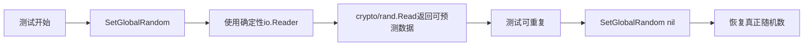
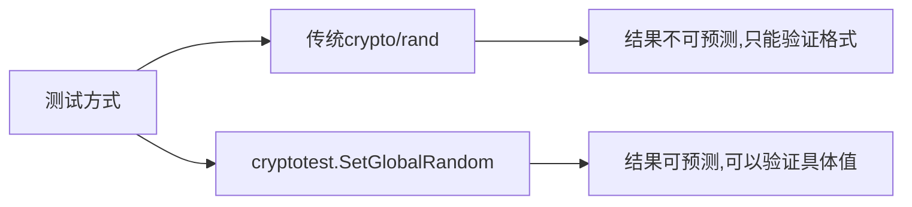

#  testing/cryptotest完全指南

新手也能秒懂的Go标准库教程!从基础到实战,一文打通!

## 📖 包简介

`testing/cryptotest` 是Go 1.26全新引入的实验性测试包,专门用于密码学相关代码的测试。它的核心功能是提供 `SetGlobalRandom` 函数,允许你在测试期间配置全局的确定性密码学随机源。

密码学代码测试之所以困难,是因为它们依赖随机数——每次运行结果都不同,这让测试的可重复性大打折扣。有了 `testing/cryptotest`,你可以让 `crypto/rand` 等包在测试中返回可预测的"随机"值,从而写出稳定、可重复的密码学测试。

适用场景:加密算法测试、密钥生成测试、签名验证测试、nonce/IV生成测试、任何依赖 `crypto/rand` 的代码测试。

## 🎯 核心功能概览

| 函数 | 用途 | 说明 |
|------|------|------|
| `SetGlobalRandom(r io.Reader)` | 设置全局确定性随机源 | 测试期间替换crypto/rand的默认行为 |
| `SetGlobalRandom(nil)` | 恢复默认行为 | 测试结束后恢复真正的随机数 |

### 工作原理



## 💻 实战示例

### 示例1: 基础用法 - 测试密钥生成

```go
package main

import (
	"bytes"
	"crypto/rand"
	"fmt"
	"testing"
	"testing/cryptotest"
)

// GenerateKey 生成32字节密钥
func GenerateKey() ([]byte, error) {
	key := make([]byte, 32)
	_, err := rand.Read(key)
	if err != nil {
		return nil, fmt.Errorf("生成密钥失败: %w", err)
	}
	return key, nil
}

func TestGenerateKey(t *testing.T) {
	// 使用确定性随机源
	// 这会返回 0x00, 0x01, 0x02, ... 的序列
	seed := bytes.Repeat([]byte{
		0x00, 0x01, 0x02, 0x03, 0x04, 0x05, 0x06, 0x07,
		0x08, 0x09, 0x0a, 0x0b, 0x0c, 0x0d, 0x0e, 0x0f,
		0x10, 0x11, 0x12, 0x13, 0x14, 0x15, 0x16, 0x17,
		0x18, 0x19, 0x1a, 0x1b, 0x1c, 0x1d, 0x1e, 0x1f,
	}, 1)

	// 设置确定性随机源
	cryptotest.SetGlobalRandom(bytes.NewReader(seed))
	// 确保测试结束后恢复
	defer cryptotest.SetGlobalRandom(nil)

	// 现在 GenerateKey 会返回可预测的值
	key, err := GenerateKey()
	if err != nil {
		t.Fatalf("GenerateKey() 失败: %v", err)
	}

	// 验证结果
	expected := []byte{
		0x00, 0x01, 0x02, 0x03, 0x04, 0x05, 0x06, 0x07,
		0x08, 0x09, 0x0a, 0x0b, 0x0c, 0x0d, 0x0e, 0x0f,
		0x10, 0x11, 0x12, 0x13, 0x14, 0x15, 0x16, 0x17,
		0x18, 0x19, 0x1a, 0x1b, 0x1c, 0x1d, 0x1e, 0x1f,
	}

	if !bytes.Equal(key, expected) {
		t.Errorf("GenerateKey() = %v, 想要 %v", key, expected)
	}

	t.Logf("成功生成确定性密钥: %x", key)
}
```

### 示例2: 进阶用法 - 测试加密/解密流程

```go
package main

import (
	"bytes"
	"crypto/aes"
	"crypto/cipher"
	"crypto/rand"
	"fmt"
	"testing"
	"testing/cryptotest"
)

// Encrypt 使用AES-GCM加密
func Encrypt(key, plaintext []byte) ([]byte, error) {
	block, err := aes.NewCipher(key)
	if err != nil {
		return nil, fmt.Errorf("创建cipher失败: %w", err)
	}

	aesGCM, err := cipher.NewGCM(block)
	if err != nil {
		return nil, fmt.Errorf("创建GCM失败: %w", err)
	}

	// 生成nonce(12字节)
	nonce := make([]byte, aesGCM.NonceSize())
	if _, err := rand.Read(nonce); err != nil {
		return nil, fmt.Errorf("生成nonce失败: %w", err)
	}

	// 加密
	ciphertext := aesGCM.Seal(nonce, nonce, plaintext, nil)
	return ciphertext, nil
}

// Decrypt 解密
func Decrypt(key, ciphertext []byte) ([]byte, error) {
	block, err := aes.NewCipher(key)
	if err != nil {
		return nil, fmt.Errorf("创建cipher失败: %w", err)
	}

	aesGCM, err := cipher.NewGCM(block)
	if err != nil {
		return nil, fmt.Errorf("创建GCM失败: %w", err)
	}

	nonceSize := aesGCM.NonceSize()
	if len(ciphertext) < nonceSize {
		return nil, fmt.Errorf("密文太短")
	}

	nonce, ciphertext := ciphertext[:nonceSize], ciphertext[nonceSize:]
	plaintext, err := aesGCM.Open(nil, nonce, ciphertext, nil)
	if err != nil {
		return nil, fmt.Errorf("解密失败: %w", err)
	}

	return plaintext, nil
}

func TestEncryptDecrypt(t *testing.T) {
	// 设置确定性随机源,让nonce可预测
	// 前12字节用于nonce,后续字节用于其他随机需求
	deterministicRand := bytes.Repeat([]byte{
		0x01, 0x02, 0x03, 0x04, 0x05, 0x06, 0x07, 0x08,
		0x09, 0x0a, 0x0b, 0x0c, 0x0d, 0x0e, 0x0f, 0x10,
	}, 4)

	cryptotest.SetGlobalRandom(bytes.NewReader(deterministicRand))
	defer cryptotest.SetGlobalRandom(nil)

	// 测试密钥(实际项目中应该也用随机源生成)
	key := make([]byte, 32)
	for i := range key {
		key[i] = byte(i)
	}

	plaintext := []byte("Hello, Go 1.26!")

	// 加密
	ciphertext, err := Encrypt(key, plaintext)
	if err != nil {
		t.Fatalf("Encrypt() 失败: %v", err)
	}

	t.Logf("密文长度: %d 字节", len(ciphertext))

	// 解密
	decrypted, err := Decrypt(key, ciphertext)
	if err != nil {
		t.Fatalf("Decrypt() 失败: %v", err)
	}

	// 验证
	if !bytes.Equal(decrypted, plaintext) {
		t.Errorf("解密结果不匹配!\n期望: %s\n实际: %s", plaintext, decrypted)
	}

	t.Logf("加密/解密测试通过! 原文: %s", string(plaintext))
}

// 测试nonce的确定性
func TestDeterministicNonce(t *testing.T) {
	nonce := make([]byte, 12)
	expectedNonce := []byte{1, 2, 3, 4, 5, 6, 7, 8, 9, 10, 11, 12}

	cryptotest.SetGlobalRandom(bytes.NewReader(bytes.Repeat(expectedNonce, 10)))
	defer cryptotest.SetGlobalRandom(nil)

	// 多次读取应该返回相同序列
	for i := 0; i < 5; i++ {
		n := make([]byte, 12)
		_, err := rand.Read(n)
		if err != nil {
			t.Fatalf("rand.Read() 失败: %v", err)
		}

		if !bytes.Equal(n, expectedNonce) {
			t.Errorf("第%d次: nonce = %v, 想要 %v", i, n, expectedNonce)
		}
	}
}
```

### 示例3: 最佳实践 - 测试表驱动与随机源

```go
package main

import (
	"bytes"
	"crypto/rand"
	"testing"
	"testing/cryptotest"
)

// GenerateRandomBytes 生成指定长度的随机字节
func GenerateRandomBytes(n int) ([]byte, error) {
	b := make([]byte, n)
	_, err := rand.Read(b)
	if err != nil {
		return nil, err
	}
	return b, nil
}

func TestGenerateRandomBytes(t *testing.T) {
	tests := []struct {
		name   string
		length int
		seed   []byte
		want   []byte
	}{
		{
			name:   "生成4字节",
			length: 4,
			seed:   []byte{0xAA, 0xBB, 0xCC, 0xDD, 0xEE, 0xFF},
			want:   []byte{0xAA, 0xBB, 0xCC, 0xDD},
		},
		{
			name:   "生成8字节",
			length: 8,
			seed:   bytes.Repeat([]byte{0x42}, 16),
			want:   bytes.Repeat([]byte{0x42}, 8),
		},
		{
			name:   "生成16字节",
			length: 16,
			seed:   bytes.Repeat([]byte{0xDE, 0xAD, 0xBE, 0xEF}, 4),
			want:   bytes.Repeat([]byte{0xDE, 0xAD, 0xBE, 0xEF}, 4),
		},
	}

	for _, tt := range tests {
		t.Run(tt.name, func(t *testing.T) {
			// 为每个子测试设置独立的随机源
			cryptotest.SetGlobalRandom(bytes.NewReader(tt.seed))
			defer cryptotest.SetGlobalRandom(nil)

			got, err := GenerateRandomBytes(tt.length)
			if err != nil {
				t.Fatalf("GenerateRandomBytes(%d) 失败: %v", tt.length, err)
			}

			if !bytes.Equal(got, tt.want) {
				t.Errorf("GenerateRandomBytes(%d) = %v, 想要 %v",
					tt.length, got, tt.want)
			}
		})
	}
}

// 测试错误处理: 随机源耗尽
func TestRandomSourceExhaustion(t *testing.T) {
	// 提供很短的随机源
	shortSeed := []byte{0x01, 0x02, 0x03}

	cryptotest.SetGlobalRandom(bytes.NewReader(shortSeed))
	defer cryptotest.SetGlobalRandom(nil)

	// 请求比种子更长的数据
	_, err := GenerateRandomBytes(10)
	if err == nil {
		t.Log("注意: bytes.Reader耗尽时不会报错,而是返回EOF后的行为")
	}
}
```

## ⚠️ 常见陷阱与注意事项

1. **必须启用 GOEXPERIMENT**: `testing/cryptotest` 是实验性包,在Go 1.26中可能需要设置 `GOEXPERIMENT=runtimesecret` 或相关实验标志才能使用。编译和测试时务必带上这个环境变量: `GOEXPERIMENT=runtimesecret go test`。

2. **测试结束后必须恢复**: 忘记调用 `cryptotest.SetGlobalRandom(nil)` 会导致后续测试或生产代码也使用确定性随机源,这会严重影响安全性!始终使用 `defer` 来确保恢复。

3. **不是所有crypto包都受影响**: `SetGlobalRandom` 主要影响使用全局随机源的crypto函数。显式传入 `io.Reader` 的函数(如 `rsa.GenerateKey(rand.Reader, bits)`)不受此影响。

4. **确定性不等于安全性**: 这个包只用于测试!永远不要在生产代码中使用确定性随机源来生成密钥、nonce或盐值。

5. **并发测试中的竞争**: 如果在多个并行测试(`t.Parallel()`)中都修改全局随机源,会产生数据竞争。确保每个测试的随机源设置是独立的,或者避免在并行测试中使用此功能。

## 🚀 Go 1.26新特性

这是Go 1.26**全新引入**的包,没有历史版本对比。它的设计初衷是解决密码学测试中长期存在的痛点:

- **测试可重复性**: 密码学代码依赖随机数,传统测试只能验证"不崩溃"或"格式正确"。现在可以验证具体的加密结果。
- **与 `runtime/secret` 联动**: Go 1.26同时引入了 `runtime/secret` 包用于安全擦除密码学临时变量,两者配合可以构建完整的密码学测试和安全体系。
- **实验性状态**: 作为新包,API可能在未来版本中调整,但目前的核心功能(`SetGlobalRandom`)已经足够稳定可用。

## 📊 性能优化建议

### 测试性能对比



### 测试策略对比表

| 策略 | 可重复性 | 实现难度 | 测试覆盖率 |
|-----|---------|---------|-----------|
| 使用真实crypto/rand | ❌ 不可重复 | 低 | 低(只能测格式) |
| Mock crypto/rand接口 | ✅ 可重复 | 高(需重构代码) | 高 |
| `cryptotest.SetGlobalRandom` | ✅ 可重复 | 低 | 高(无需重构) |

### 最佳实践代码结构

```go
func TestCryptoFunction(t *testing.T) {
	// 1. 准备阶段: 设置确定性随机源
	seed := buildDeterministicSeed()
	cryptotest.SetGlobalRandom(bytes.NewReader(seed))
	defer cryptotest.SetGlobalRandom(nil) // 2. 确保恢复

	// 3. 执行阶段: 调用被测试的加密函数
	result, err := CryptoOperation()

	// 4. 验证阶段: 断言具体结果
	if err != nil {
		t.Fatalf("意外错误: %v", err)
	}
	assertExpectedResult(t, result)
}
```

## 🔗 相关包推荐

- **`crypto/rand`** - 密码学安全随机数生成器
- **`math/rand`** - 非密码学安全的伪随机数(用于一般用途)
- **`testing`** - 基础测试框架
- **`runtime/secret`** - Go 1.26新增,安全擦除密码学临时变量
- **`crypto/aes`** - AES加密算法
- **`crypto/rsa`** - RSA加密算法

---