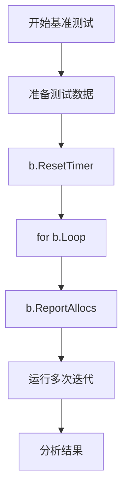

#  testing完全指南

新手也能秒懂的Go标准库教程!从基础到实战,一文打通!

## 📖 包简介

`testing` 包是Go语言内置的测试框架,也是每个Go开发者每天都会打交道的包。与第三方测试框架不同,Go的testing包设计理念是"简单而强大"——没有花哨的语法糖,但通过组合和辅助函数,你可以实现从单元测试到基准测试、从模糊测试到示例文档的完整测试体系。

在Go 1.26中,testing包迎来了实用性的重大更新:修复了长期存在的 `B.Loop` 阻止内联问题,消除了基准测试中的意外内存分配;新增了 `T/B/F.ArtifactDir()` 方法,让测试产物(如测试数据、截图、日志)有了标准化的输出目录。

适用场景:单元测试、基准测试、示例文档、模糊测试、测试产物管理。

## 🎯 核心功能概览

| 类型/函数 | 用途 | 说明 |
|----------|------|------|
| `testing.T` | 测试对象 | 单元测试的核心类型 |
| `testing.B` | 基准测试对象 | 性能基准测试 |
| `testing.F` | 模糊测试对象 | Go 1.18引入的fuzzing |
| `testing.M` | 测试主函数 | `TestMain` 的控制类型 |
| `T.Run()` | 子测试 | 组织测试用例的神器 |
| `T.Helper()` | 标记辅助函数 | 让错误行号指向调用方 |
| `T.Parallel()` | 并行测试 | 加速测试执行 |
| `T.Skip()` | 跳过测试 | 条件跳过某些测试 |
| `T.Cleanup()` | 清理函数 | 替代defer的更优选择 |
| `B.ResetTimer()` | 重置计时器 | 基准测试准备阶段 |
| `T.ArtifactDir()` | 产物目录 | Go 1.26新增! |

## 💻 实战示例

### 示例1: 基础用法 - 完整单元测试模板

```go
package main

import (
	"errors"
	"testing"
)

// 被测试的函数
func Divide(a, b float64) (float64, error) {
	if b == 0 {
		return 0, errors.New("除数不能为0")
	}
	return a / b, nil
}

// 基础单元测试
func TestDivide(t *testing.T) {
	// 定义测试用例表
	tests := []struct {
		name    string
		a, b    float64
		want    float64
		wantErr bool
	}{
		{
			name:    "正常除法",
			a:       10,
			b:       2,
			want:    5,
			wantErr: false,
		},
		{
			name:    "除法有小数",
			a:       7,
			b:       2,
			want:    3.5,
			wantErr: false,
		},
		{
			name:    "除以零",
			a:       10,
			b:       0,
			want:    0,
			wantErr: true,
		},
		{
			name:    "负数除法",
			a:       -10,
			b:       2,
			want:    -5,
			wantErr: false,
		},
	}

	// 遍历测试用例
	for _, tt := range tests {
		t.Run(tt.name, func(t *testing.T) {
			got, err := Divide(tt.a, tt.b)

			// 检查错误
			if (err != nil) != tt.wantErr {
				t.Errorf("Divide() 错误 = %v, 想要错误 %v", err, tt.wantErr)
				return
			}

			// 检查结果
			if got != tt.want {
				t.Errorf("Divide() = %v, 想要 %v", got, tt.want)
			}
		})
	}
}
```

### 示例2: 进阶用法 - 子测试、并行测试和辅助函数

```go
package main

import (
	"fmt"
	"testing"
)

// 被测试的用户服务
type UserService struct {
	users map[int64]string
}

func NewUserService() *UserService {
	return &UserService{
		users: make(map[int64]string),
	}
}

func (s *UserService) Create(id int64, name string) error {
	if id <= 0 {
		return fmt.Errorf("无效的用户ID: %d", id)
	}
	if name == "" {
		return fmt.Errorf("用户名不能为空")
	}
	if _, exists := s.users[id]; exists {
		return fmt.Errorf("用户ID已存在: %d", id)
	}
	s.users[id] = name
	return nil
}

func (s *UserService) Get(id int64) (string, error) {
	name, exists := s.users[id]
	if !exists {
		return "", fmt.Errorf("用户不存在: %d", id)
	}
	return name, nil
}

// 辅助函数: 创建带测试数据的UserService
func setupTestService(t *testing.T) *UserService {
	t.Helper() // 标记为辅助函数,错误行号指向调用方

	svc := NewUserService()
	testData := map[int64]string{
		1: "Alice",
		2: "Bob",
		3: "Charlie",
	}
	for id, name := range testData {
		if err := svc.Create(id, name); err != nil {
			t.Fatalf("初始化测试数据失败: %v", err)
		}
	}
	return svc
}

// 使用子测试和并行化
func TestUserService(t *testing.T) {
	t.Run("Create", func(t *testing.T) {
		t.Run("成功创建用户", func(t *testing.T) {
			t.Parallel() // 标记可并行执行
			svc := NewUserService()
			err := svc.Create(1, "David")
			if err != nil {
				t.Fatalf("Create() 失败: %v", err)
			}
		})

		t.Run("重复ID", func(t *testing.T) {
			t.Parallel()
			svc := NewUserService()
			svc.Create(1, "Alice")
			err := svc.Create(1, "Bob")
			if err == nil {
				t.Fatal("期望错误,但得到了nil")
			}
		})

		t.Run("空用户名", func(t *testing.T) {
			t.Parallel()
			svc := NewUserService()
			err := svc.Create(1, "")
			if err == nil {
				t.Fatal("期望错误,但得到了nil")
			}
		})
	})

	t.Run("Get", func(t *testing.T) {
		t.Run("获取存在的用户", func(t *testing.T) {
			t.Parallel()
			svc := setupTestService(t)

			name, err := svc.Get(1)
			if err != nil {
				t.Fatalf("Get() 失败: %v", err)
			}
			if name != "Alice" {
				t.Errorf("Get() = %v, 想要 %v", name, "Alice")
			}
		})

		t.Run("获取不存在的用户", func(t *testing.T) {
			t.Parallel()
			svc := NewUserService()
			_, err := svc.Get(999)
			if err == nil {
				t.Fatal("期望错误,但得到了nil")
			}
		})
	})
}
```

### 示例3: 最佳实践 - 基准测试(Go 1.26优化版)

```go
package main

import (
	"strings"
	"testing"
)

// 两种字符串拼接方式的基准测试
func ConcatStrings(strs []string) string {
	var result string
	for _, s := range strs {
		result += s
	}
	return result
}

func JoinStrings(strs []string) string {
	return strings.Join(strs, "")
}

// Go 1.26优化: B.Loop不再阻止内联,基准测试更准确了!
func BenchmarkConcatStrings(b *testing.B) {
	// 准备测试数据
	input := make([]string, 100)
	for i := range input {
		input[i] = "hello"
	}

	// 重置计时器,排除准备阶段的时间
	b.ResetTimer()

	// 运行b.N次
	for b.Loop() {
		ConcatStrings(input)
	}
}

func BenchmarkJoinStrings(b *testing.B) {
	input := make([]string, 100)
	for i := range input {
		input[i] = "hello"
	}

	b.ResetTimer()

	for b.Loop() {
		JoinStrings(input)
	}
}

// 使用 b.ReportAllocs() 报告内存分配
func BenchmarkWithAllocs(b *testing.B) {
	input := make([]string, 1000)
	for i := range input {
		input[i] = "test"
	}

	b.ReportAllocs() // 显示每次操作的内存分配
	b.ResetTimer()

	for b.Loop() {
		strings.Join(input, ",")
	}
}

// 对比不同大小的输入
func BenchmarkVaryingSizes(b *testing.B) {
	sizes := []int{10, 100, 1000, 10000}

	for _, size := range sizes {
		b.Run(fmt.Sprintf("size=%d", size), func(b *testing.B) {
			input := make([]string, size)
			for i := range input {
				input[i] = "x"
			}

			b.ReportAllocs()
			b.ResetTimer()

			for b.Loop() {
				strings.Join(input, "")
			}
		})
	}
}

func main() {} // 占位,实际运行 go test -bench=.
```

## ⚠️ 常见陷阱与注意事项

1. **忘记调用 `b.ResetTimer()`**: 在基准测试中,如果在 `b.N` 循环前做了大量准备工作(如创建测试数据),一定要调用 `b.ResetTimer()` 重置计时器,否则结果会包含准备时间。

2. **在并行测试中共享可变状态**: 使用 `t.Parallel()` 时,确保每个子测试有独立的测试数据。共享的map、slice等可变状态会导致数据竞争。

3. **`T.Helper()` 的误解**: 这个函数只影响错误报告中的行号,不改变任何测试逻辑。忘记调用它的后果是:错误会指向辅助函数内部,而不是实际调用处。

4. **`B.Loop` 在Go 1.26之前的坑**: 在Go 1.26之前,使用 `b.Loop()` 会阻止循环体内联,导致基准测试结果包含意外的分配开销。**Go 1.26已修复此问题**,现在可以放心使用 `b.Loop()`。

5. **过度使用 `t.Fatal`**: `t.Fatal` 会立即终止当前测试函数。如果你只是想记录错误并继续执行其他检查,使用 `t.Error` 代替。

## 🚀 Go 1.26新特性

### 1. `B.Loop` 修复阻止内联问题

在Go 1.26之前,`for b.Loop()` 会阻止编译器对循环体进行内联优化,导致基准测试结果中出现意外的内存分配。Go 1.26修复了这个问题:

```go
// Go 1.26之前: B.Loop阻止内联,可能产生额外分配
for b.Loop() {
	processData(data) // 无法内联,有额外开销
}

// Go 1.26: 内联正常工作,结果更准确
for b.Loop() {
	processData(data) // 正常内联,无额外开销
}
```

### 2. 新增 `T/B/F.ArtifactDir()` 方法

测试产物终于有了标准化的输出目录!

```go
func TestGenerateReport(t *testing.T) {
	// 获取测试产物目录
	dir := t.ArtifactDir()

	// 写入测试产物(如截图、日志、数据文件)
	reportPath := filepath.Join(dir, "report.json")
	err := os.WriteFile(reportPath, []byte(`{"status":"ok"}`), 0644)
	if err != nil {
		t.Fatalf("写入产物失败: %v", err)
	}

	// 产物会保存到: $TEST_ARTIFACTS/<testname>/
	t.Logf("测试产物已保存到: %s", reportPath)
}
```

## 📊 性能优化建议

### 基准测试最佳实践



### 基准测试结果解读

运行命令: `go test -bench=. -benchmem -count=5`

| 列名 | 含义 | 关注点 |
|-----|------|-------|
| `BenchmarkXxx-8` | 名称和GOMAXPROCS | 确保环境一致 |
| `10000000` | b.N(迭代次数) | 自动调整,无需关心 |
| `105.3 ns/op` | 每次操作耗时 | **核心指标** |
| `48 B/op` | 每次操作分配字节数 | 越小越好 |
| `2 allocs/op` | 每次操作分配次数 | 越少越好 |

### 加速测试执行

```go
// TestMain 中设置并行度
func TestMain(m *testing.M) {
	// 使用所有CPU核心
	runtime.GOMAXPROCS(runtime.NumCPU())
	os.Exit(m.Run())
}

// 或者命令行参数
// go test -parallel=8 ./...
```

## 🔗 相关包推荐

- **`testing/cryptotest`** - Go 1.26新增,密码学测试工具,提供确定性随机源
- **`testing/fstest`** - 文件系统测试,TestFS验证文件系统实现
- **`testing/iotest`** - I/O测试工具,模拟各种I/O错误场景
- **`testing/quick`** - 快速检查测试,基于属性的测试
- **`testing/synctest`** - 同步测试,测试并发代码
- **`github.com/stretchr/testify`** - 流行的第三方断言库
- **`go-cmp`** - Google推出的深度比较库

---