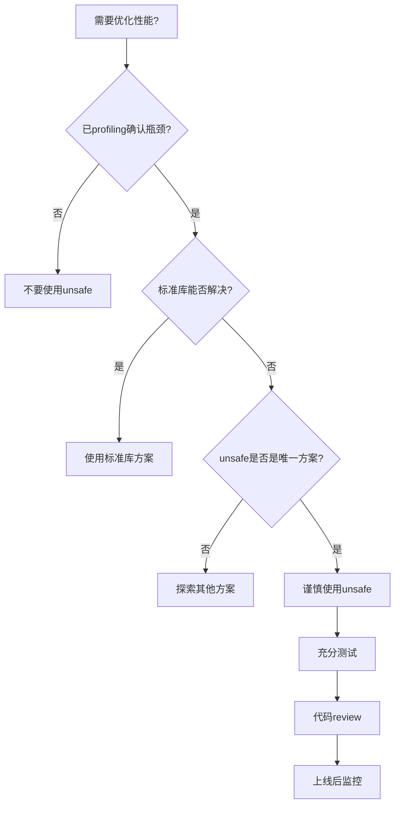

#  unsafe完全指南

新手也能秒懂的Go标准库教程!从基础到实战,一文打通!

## 📖 包简介

`unsafe` 包是Go标准库中最"危险"也最强大的包。它提供了绕过Go类型系统安全机制的能力,让你能够直接操作内存、转换类型指针、访问结构体内部布局。正如其名——使用它是"不安全"的,编译器不会对你的操作做任何安全检查,一切后果自负。

但不要被它的名字吓到。`unsafe` 在特定场景下是无可替代的:当你需要与C代码交互、实现高性能的无锁数据结构、做零拷贝的字节转换、或者编写底层系统工具时,`unsafe` 就是你手中的"瑞士军刀"。关键在于:理解规则、小心使用、充分测试。

适用场景:cgo交互、零拷贝转换、高性能数据结构、底层系统编程、序列化/反序列化优化、内存布局控制。

## 🎯 核心功能概览

### 核心类型

| 类型 | 用途 | 说明 |
|------|------|------|
| `unsafe.Pointer` | 通用指针 | 可以转换为任何指针类型,类似C的`void*` |

### 核心函数

| 函数 | 用途 | 返回值 | 危险等级 |
|------|------|--------|---------|
| `unsafe.Sizeof(x)` | 获取大小 | `uintptr` - 类型占用的字节数 | ⭐ 安全 |
| `unsafe.Alignof(x)` | 获取对齐 | `uintptr` - 对齐要求 | ⭐ 安全 |
| `unsafe.Offsetof(x)` | 获取偏移 | `uintptr` - 字段偏移量 | ⭐ 安全 |
| `unsafe.Pointer(&x)` | 转换为通用指针 | `unsafe.Pointer` | ⭐⭐ 小心 |
| `(*T)(unsafe.Pointer(p))` | 指针类型转换 | `*T` - 目标类型指针 | ⭐⭐⭐ 危险 |
| `unsafe.Slice(ptr, len)` | 创建slice | `[]T` - 从指针和长度创建 | ⭐⭐⭐ 危险 |
| `unsafe.SliceData(s)` | 获取slice底层指针 | `*T` - slice的第一个元素地址 | ⭐⭐ 小心 |
| `unsafe.String(ptr, len)` | 创建string | `string` - 从指针和长度创建 | ⭐⭐⭐ 危险 |
| `unsafe.StringData(s)` | 获取string底层指针 | `*byte` - string的字节指针 | ⭐⭐⭐ 危险 |

### unsafe的四大使用规则(Patterns)

Go官方文档定义了4种安全使用 `unsafe` 的模式:

| 模式 | 描述 | 示例 |
|------|------|------|
| Pattern 1 | `*T1` 转换为 `unsafe.Pointer`,再转换为 `*T2` | 类型双射转换 |
| Pattern 2 | `unsafe.Pointer` 转换为 `uintptr` 再转回 | 指针算术运算 |
| Pattern 3 | `unsafe.Pointer` 与 `uintptr` 转换用于系统调用 | syscall参数 |
| Pattern 4 | 读取或修改 `sync/atomic` 的64位对齐 | 原子操作对齐 |

## 💻 实战示例

### 示例1: 基础用法 - 类型大小和对齐查询

```go
package main

import (
	"fmt"
	"unsafe"
)

// 演示结构体的内存布局
type User struct {
	ID      int64   // 8 字节,偏移 0
	Name    string  // 16字节(两个指针),偏移 8
	Age     int32   // 4 字节,偏移 24
	Active  bool    // 1 字节,偏移 28
	// 注意: 编译器会插入3字节padding使TotalSize对齐到32
}

func main() {
	// ===== Sizeof: 获取类型大小 =====
	fmt.Println("=== 基本类型大小 ===")
	fmt.Printf("bool:    %d 字节\n", unsafe.Sizeof(false))
	fmt.Printf("int8:    %d 字节\n", unsafe.Sizeof(int8(0)))
	fmt.Printf("int32:   %d 字节\n", unsafe.Sizeof(int32(0)))
	fmt.Printf("int64:   %d 字节\n", unsafe.Sizeof(int64(0)))
	fmt.Printf("float64: %d 字节\n", unsafe.Sizeof(float64(0)))
	fmt.Printf("pointer: %d 字节\n", unsafe.Sizeof((*int)(nil)))

	// ===== 结构体大小和布局 =====
	fmt.Println("\n=== 结构体布局 ===")
	var u User
	fmt.Printf("User总大小: %d 字节\n", unsafe.Sizeof(u))
	fmt.Printf("  ID偏移:     %d\n", unsafe.Offsetof(u.ID))
	fmt.Printf("  Name偏移:   %d\n", unsafe.Offsetof(u.Name))
	fmt.Printf("  Age偏移:    %d\n", unsafe.Offsetof(u.Age))
	fmt.Printf("  Active偏移: %d\n", unsafe.Offsetof(u.Active))

	// ===== 对齐要求 =====
	fmt.Println("\n=== 对齐要求 ===")
	fmt.Printf("int64对齐: %d\n", unsafe.Alignof(int64(0)))
	fmt.Printf("int32对齐: %d\n", unsafe.Alignof(int32(0)))
	fmt.Printf("string对齐: %d\n", unsafe.Alignof(""))
	fmt.Printf("User对齐: %d\n", unsafe.Alignof(u))

	// ===== 结构体优化技巧 =====
	fmt.Println("\n=== 结构体优化对比 ===")

	// 未优化的结构体(字段按声明顺序排列)
	type Unoptimized struct {
		A bool    // 1 字节 + 7 padding
		B int64   // 8 字节
		C bool    // 1 字节 + 7 padding
		D int64   // 8 字节
	}

	// 优化后的结构体(大字段在前)
	type Optimized struct {
		A int64   // 8 字节
		B int64   // 8 字节
		C bool    // 1 字节
		D bool    // 1 字节 + 6 padding
	}

	var unopt Unoptimized
	var opt Optimized
	fmt.Printf("未优化: %d 字节\n", unsafe.Sizeof(unopt))
	fmt.Printf("优化后: %d 字节\n", unsafe.Sizeof(opt))
	fmt.Printf("节省: %.0f%%\n",
		float64(unsafe.Sizeof(unopt)-unsafe.Sizeof(opt))/float64(unsafe.Sizeof(unopt))*100)
}
```

### 示例2: 进阶用法 - 零拷贝字节转换

```go
package main

import (
	"encoding/binary"
	"fmt"
	"unsafe"
)

// ZeroCopyBytes 零拷贝: 将[]byte转换为[]uint32(不分配新内存)
func ZeroCopyBytes(data []byte) []uint32 {
	// 确保长度是4的倍数
	if len(data)%4 != 0 {
		panic("数据长度必须是4的倍数")
	}

	// 获取底层指针
	ptr := unsafe.SliceData(data)

	// 转换为uint32指针
	uint32Ptr := (*uint32)(unsafe.Pointer(ptr))

	// 计算新slice的长度
	length := len(data) / 4

	// 创建新的slice(共享底层数组)
	return unsafe.Slice(uint32Ptr, length)
}

// ZeroCopyString 零拷贝: 将[]byte转换为string(不复制)
// ⚠️ 危险! 只在确定底层字节不会修改时使用
func ZeroCopyString(data []byte) string {
	return unsafe.String(unsafe.SliceData(data), len(data))
}

// 反向操作: string到[]byte(零拷贝,可修改!)
// ⚠️ 极度危险! 修改string的底层字节是未定义行为
func StringToBytes(s string) []byte {
	return unsafe.Slice(unsafe.StringData(s), len(s))
}

// 网络字节序解析示例
func ParseNetworkPacket(data []byte) {
	if len(data) < 12 {
		fmt.Println("数据包太短")
		return
	}

	// 方法1: 传统方式(需要复制)
	fmt.Println("=== 传统方式 ===")
	magic := binary.LittleEndian.Uint32(data[0:4])
	version := binary.LittleEndian.Uint16(data[4:6])
	length := binary.LittleEndian.Uint32(data[8:12])

	fmt.Printf("Magic: %#x\n", magic)
	fmt.Printf("Version: %d\n", version)
	fmt.Printf("Length: %d\n", length)

	// 方法2: 零拷贝方式
	fmt.Println("\n=== 零拷贝方式 ===")
	header := (*struct {
		Magic   uint32
		Version uint16
		Padding uint16
		Length  uint32
	})(unsafe.Pointer(unsafe.SliceData(data)))

	fmt.Printf("Magic: %#x\n", header.Magic)
	fmt.Printf("Version: %d\n", header.Version)
	fmt.Printf("Length: %d\n", header.Length)
}

func main() {
	// 演示零拷贝字节转换
	data := []byte{
		0x01, 0x00, 0x00, 0x00,
		0x02, 0x00, 0x00, 0x00,
		0x03, 0x00, 0x00, 0x00,
		0x04, 0x00, 0x00, 0x00,
	}

	fmt.Println("原始字节:", data)
	uint32Slice := ZeroCopyBytes(data)
	fmt.Println("转换为[]uint32:", uint32Slice)

	// 验证: 修改uint32会影响原始字节
	uint32Slice[0] = 0xFFFFFFFF
	fmt.Println("修改后原始字节:", data)

	// 网络包解析
	fmt.Println("\n=== 网络包解析示例 ===")
	packet := []byte{
		0xAB, 0xCD, 0xEF, 0x01, // Magic
		0x02, 0x00,             // Version
		0x00, 0x00,             // Padding
		0x10, 0x00, 0x00, 0x00, // Length
	}
	ParseNetworkPacket(packet)

	// 零拷贝string
	fmt.Println("\n=== 零拷贝String ===")
	bytes := []byte("Hello, unsafe!")
	str := ZeroCopyString(bytes)
	fmt.Printf("String: %s\n", str)
}
```

### 示例3: 最佳实践 - 安全的类型转换和结构体操作

```go
package main

import (
	"fmt"
	"unsafe"
)

// ===== 安全的类型转换模式 =====

// Float64ToUint64 安全地将float64位模式转换为uint64
// 遵循Pattern 1: *T1 -> unsafe.Pointer -> *T2
func Float64ToUint64(f float64) uint64 {
	return *(*uint64)(unsafe.Pointer(&f))
}

// Uint64ToFloat64 反向转换
func Uint64ToFloat64(u uint64) float64 {
	return *(*float64)(unsafe.Pointer(&u))
}

// Int32ToFloat32 int32到float32的位转换
func Int32ToFloat32(i int32) float32 {
	return *(*float32)(unsafe.Pointer(&i))
}

// ===== 结构体字段访问和修改 =====

// StructFieldAccessor 结构体字段访问器
type User struct {
	ID   int64
	Name string
	Age  int32
}

// GetFieldByOffset 通过偏移量获取字段值(通用但危险!)
func GetFieldByOffset(ptr unsafe.Pointer, offset uintptr) interface{} {
	fieldPtr := unsafe.Pointer(uintptr(ptr) + offset)

	// 这里需要知道字段的实际类型才能正确转换
	// 实际项目中应该用泛型或具体函数
	return fieldPtr
}

// SetUserAge 安全地修改Age字段
func SetUserAge(u *User, age int32) {
	// 推荐: 直接访问字段(不需要unsafe)
	u.Age = age
}

// GetUserAgePtr 获取Age字段的指针(演示用)
func GetUserAgePtr(u *User) *int32 {
	// 通过偏移量计算
	agePtr := (*int32)(unsafe.Pointer(
		uintptr(unsafe.Pointer(u)) + unsafe.Offsetof(u.Age),
	))
	return agePtr
}

// ===== 数组操作 =====

// ArrayView 创建数组的视图(不复制数据)
func ArrayView[T any](data []byte) []T {
	size := unsafe.Sizeof(*new(T))
	count := len(data) / int(size)

	if count == 0 {
		return nil
	}

	ptr := (*T)(unsafe.Pointer(unsafe.SliceData(data)))
	return unsafe.Slice(ptr, count)
}

// ===== 内存对齐优化 =====

// 使用unsafe验证结构体优化效果
func VerifyStructOptimization() {
	type Before struct {
		A bool
		B int64
		C bool
	}

	type After struct {
		B int64
		A bool
		C bool
	}

	fmt.Println("=== 结构体优化验证 ===")
	fmt.Printf("Before: %d 字节\n", unsafe.Sizeof(Before{}))
	fmt.Printf("After:  %d 字节\n", unsafe.Sizeof(After{}))
	fmt.Printf("节省: %d 字节 (%.0f%%)\n",
		unsafe.Sizeof(Before{})-unsafe.Sizeof(After{}),
		float64(unsafe.Sizeof(Before{})-unsafe.Sizeof(After{}))/float64(unsafe.Sizeof(Before{}))*100)
}

func main() {
	// 类型转换
	fmt.Println("=== 位模式转换 ===")
	f := 3.14159
	u := Float64ToUint64(f)
	f2 := Uint64ToFloat64(u)
	fmt.Printf("float64: %v -> uint64: %d -> float64: %v\n", f, u, f2)
	fmt.Printf("位模式: %#016x\n", u)

	// 结构体字段操作
	fmt.Println("\n=== 结构体字段操作 ===")
	user := &User{ID: 1, Name: "Alice", Age: 30}
	fmt.Printf("修改前: %+v\n", user)

	agePtr := GetUserAgePtr(user)
	*agePtr = 31 // 通过指针修改
	fmt.Printf("通过指针修改后: %+v\n", user)

	SetUserAge(user, 32) // 通过函数修改
	fmt.Printf("通过函数修改后: %+v\n", user)

	// 数组视图
	fmt.Println("\n=== 数组视图 ===")
	data := []byte{0x01, 0x00, 0x00, 0x00, 0x02, 0x00, 0x00, 0x00}
	int32View := ArrayView[int32](data)
	fmt.Printf("[]byte: %v\n", data)
	fmt.Printf("[]int32 view: %v\n", int32View)

	// 结构体优化
	VerifyStructOptimization()
}
```

## ⚠️ 常见陷阱与注意事项

1. **`uintptr` 不是指针!** 这是最常见的错误。`uintptr` 是一个整数类型,GC不会追踪它指向的内存。如果你把 `unsafe.Pointer` 转换为 `uintptr` 做算术运算后,在转换回 `unsafe.Pointer` 之前,如果发生了GC,原来的对象可能已经被回收了。**正确做法**: 将 `Pointer->uintptr->Pointer` 的转换放在一个表达式中完成,或者确保中间没有GC发生。

```go
// 错误做法(可能在GC后访问已释放内存):
p := unsafe.Pointer(&obj)
addr := uintptr(p)
// ... 这里可能触发GC ...
newP := unsafe.Pointer(addr) // 可能指向已释放内存!

// 正确做法(单表达式,无GC机会):
newP := unsafe.Pointer(uintptr(p) + offset)
```

2. **string是只读的,不要通过unsafe修改**: Go的string语义上是不可变的。如果你用 `unsafe.StringData` 获取指针并修改内容,这是未定义行为。不同版本的Go可能有不同的实现,你的代码可能在明天就崩溃。

3. **结构体布局不是固定的**: 编译器会根据字段类型、大小和对齐要求自动插入padding。不同Go版本、不同架构的编译器可能生成不同的布局。不要硬编码偏移量,始终使用 `unsafe.Offsetof` 动态获取。

4. **不要过度优化**: `unsafe` 带来的性能提升在大多数场景下微不足道。在你确定这里是性能瓶颈、并且已经profiling验证之前,不要使用 `unsafe`。记住Donald Knuth的名言:"过早优化是万恶之源。"

5. **cgo中更危险**: 当你通过 `unsafe` 将Go指针传给C代码时,Go 1.6+的cgo检查机制会阻止你传递指向Go内存的指针给C,除非你用 `unsafe.Pointer` 做转换。即便如此,也要确保C代码不会在Go函数返回后继续持有这些指针。

## 🚀 Go 1.26新特性

Go 1.26对 `unsafe` 包继续增强安全性和功能:

- **`unsafe.Slice`、`unsafe.String`、`unsafe.StringData` 持续优化**: 这些在Go 1.20引入的函数在Go 1.26中性能进一步提升,编译器对它们的内联和优化做得更好。
- **编译器安全检查增强**: Go 1.26可能在某些常见错误模式下提供更好的编译期警告,帮助开发者避免unsafe相关的bug。
- **GC与unsafe的交互优化**: 在涉及 `uintptr` 和指针转换的场景中,GC的行为更加可预测。

### unsafe函数演进历史

| Go版本 | 新增功能 |
|--------|---------|
| Go 1.0 | `Sizeof`, `Alignof`, `Offsetof`, `Pointer` |
| Go 1.17 | `Add` (指针算术) |
| Go 1.20 | `Slice`, `SliceData`, `String`, `StringData` |
| Go 1.26 | 持续优化和编译器安全检查增强 |

## 📊 性能优化建议

### unsafe使用决策树



### 性能对比: 安全 vs unsafe

| 操作 | 安全方式 | unsafe方式 | 性能提升 | 风险 |
|-----|---------|-----------|---------|------|
| `[]byte` 到 `string` | `string(bytes)` | `unsafe.String` | ~50% | 高(修改string内容UB) |
| 类型位转换 | `math.Float64bits` | `*(*uint64)(unsafe.Pointer(&f))` | 相当 | 中(需要理解位模式) |
| 结构体字段访问 | `obj.Field` | 偏移量计算 | 无 | 极高(布局不固定) |
| `[]byte` 到 `[]T` | 循环复制 | `unsafe.Slice` | ~80% | 高(对齐/长度错误) |

### 推荐的unsafe使用原则

```go
// 原则1: 优先使用标准库提供的安全函数
// math包已经提供了大部分位转换函数
import "math"

u := math.Float64bits(3.14)  // 推荐
u := *(*uint64)(unsafe.Pointer(&f))  // 不推荐(除非有特殊需求)

// 原则2: 使用Go 1.20+的unsafe.Slice等函数,而不是自己实现
// 推荐(Go 1.20+):
slice := unsafe.Slice(ptr, length)

// 不推荐(旧方式,容易出错):
slice := (*[1<<30 - 1]T)(unsafe.Pointer(ptr))[:length:length]

// 原则3: 在函数边界处做转换,缩小unsafe的影响范围
// 推荐:
func internalProcess(data []byte) {
    // 内部使用unsafe,外部接口是安全的
    processed := zeroCopyProcess(data)
    useResult(processed)
}

// 原则4: 为unsafe代码添加注释和测试
// unsafe: 此处转换假设data的长度是4的倍数,调用方需保证
// test: TestZeroCopyBytes_AlignedLength 验证了这一假设
```

## 🔗 相关包推荐

- **`math`** - 提供安全的浮点/整数位转换函数(`Float64bits`等)
- **`encoding/binary`** - 字节序操作(许多场景下可以替代unsafe)
- **`sync/atomic`** - 原子操作(与unsafe配合实现无锁数据结构)
- **`reflect`** - 反射(另一个"绕过类型系统"的包,但更安全)
- **`syscall`** - 系统调用(大量使用unsafe.Pointer做参数转换)
- **`runtime`** - 运行时系统(与unsafe结合做底层操作)

---