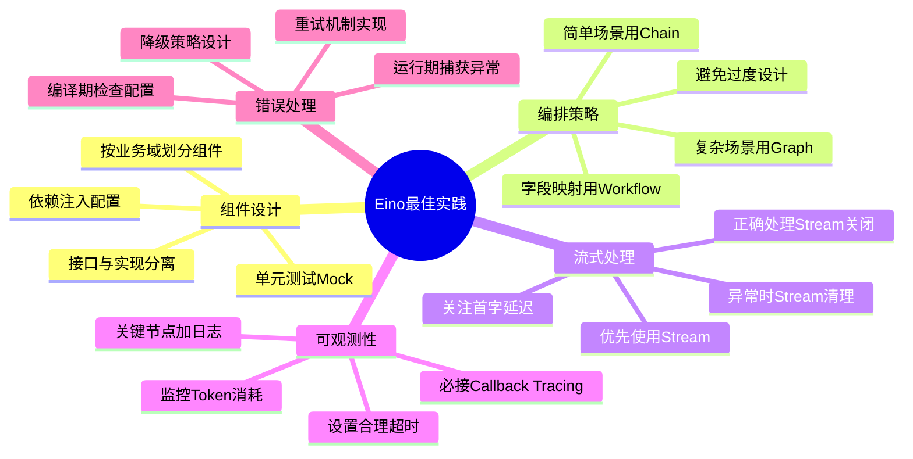
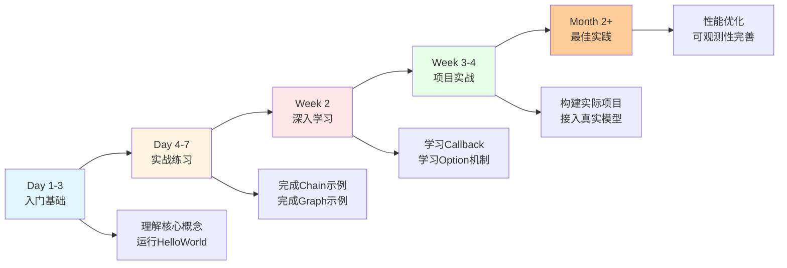
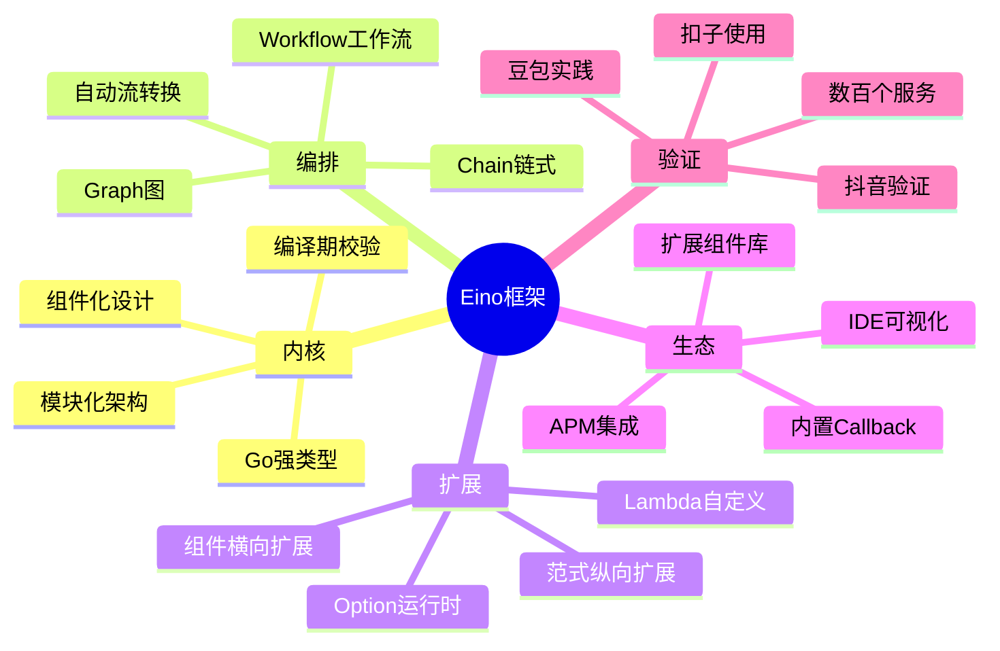

# 字节跳动Eino框架完全指南：用Go语言高效构建大模型应用

> **导语**：豆包、抖音、扣子背后的AI应用是用什么框架开发的？答案是——Eino。这是字节跳动开源的大模型应用开发框架，基于Go语言，

这正是Eino擅长的场景——**复杂的多Agent协作**。

---

## 十、最佳实践与避坑指南

### 10.1 架构设计最佳实践



### 10.2 代码组织建议

```
my-ai-app/
├── cmd/
│   └── server/
│       └── main.go          # 入口
├── internal/
│   ├── agents/              # Agent定义
│   │   ├── customer_service.go
│   │   └── code_review.go
│   ├── components/          # 组件实现
│   │   ├── models.go        # 模型配置
│   │   ├── tools.go         # 工具定义
│   │   └── retrievers.go    # 检索器
│   ├── graph/               # 图编排
│   │   └── builder.go       # Graph构建逻辑
│   └── service/             # 业务服务
│       └── ai_service.go    # 对外服务接口
├── configs/
│   └── config.yaml          # 配置文件
└── tests/                   # 测试
    └── agents_test.go
```

### 10.3 常见坑与解决方案

| 坑 | 原因 | 解决方案 |
|---|------|---------|
| **编译报错类型不匹配** | 上下游泛型类型不一致 | 检查Graph定义的Input/Output泛型参数 |
| **Graph运行死循环** | 分支条件设置错误 | 设置WithMaxRunSteps，检查分支逻辑 |
| **Stream未关闭导致泄漏** | 忘记defer stream.Close() | 始终使用defer关闭Stream |
| **State数据混乱** | StatePreHandler/PostHandler逻辑错误 | 仔细检查State读写时机 |
| **Callback不生效** | 未正确注入Context | 使用context.WithValue注入Callback |
| **工具调用不执行** | ToolsNode未正确配置或模型不支持 | 检查模型是否支持Function Calling |
| **首字延迟高** | 分支判断等待完整输出 | 使用StreamGraphBranch实现首包路由 |

### 10.4 性能优化建议

```go
// 1. 设置合理的超时
ctx, cancel := context.WithTimeout(ctx, 30*time.Second)
defer cancel()

// 2. 复用编译后的Runnable（编译只做一次）
var agent *compose.Runnable

func init() {
    // 程序启动时编译，运行时直接使用
    agent, _ = buildAndCompileGraph()
}

// 3. 并发调用安全
func handleRequest(ctx context.Context, input []*schema.Message) error {
    // agent是并发安全的，可直接并发调用
    stream, err := agent.Stream(ctx, input)
    // ...
}

// 4. 监控Token消耗
import "github.com/cloudwego/eino/callbacks"

// 在Callback中统计
func (m *MyCallback) OnEnd(ctx context.Context, info *compose.CallbackInfo) context.Context {
    if msg, ok := info.Output.(*schema.Message); ok {
        tokenUsage := msg.TokenUsage
        log.Printf("Token使用: Prompt=%d, Completion=%d, Total=%d",
            tokenUsage.PromptTokens,
            tokenUsage.CompletionTokens,
            tokenUsage.TotalTokens)
    }
    return ctx
}
```

---

## 十一、学习路径与资源

### 11.1 从零到精通的路径



### 11.2 官方资源

| 资源 | 链接 | 说明 |
|------|------|------|
| **官方文档** | https://www.cloudwego.io/zh/docs/eino/ | 完整文档 |
| **GitHub** | https://github.com/cloudwego/eino | 源代码 |
| **示例代码** | GitHub examples目录 | 官方示例 |
| **扩展组件** | https://github.com/cloudwego/eino-ext | 官方扩展 |
| **快速开始** | `go get github.com/cloudwego/eino` | 一行命令安装 |

### 11.3 Hello World快速开始

```bash
# 1. 创建Go项目
mkdir eino-demo && cd eino-demo
go mod init eino-demo

# 2. 安装Eino
go get github.com/cloudwego/eino

# 3. 创建main.go
```

```go
package main

import (
    "context"
    "fmt"
    "os"
    
    "github.com/cloudwego/eino/components/prompt"
    "github.com/cloudwego/eino/components/model"
    "github.com/cloudwego/eino/compose"
    "github.com/cloudwego/eino/schema"
    "github.com/cloudwego/eino-ext/components/model/openai"
)

func main() {
    ctx := context.Background()
    
    // 1. 创建ChatModel
    chatModel, err := openai.NewChatModel(ctx, &openai.Config{
        APIKey:  os.Getenv("OPENAI_API_KEY"),
        Model:   "gpt-3.5-turbo",
    })
    if err != nil {
        panic(err)
    }
    
    // 2. 创建Chain
    chain := compose.NewChain[[]*schema.Message, *schema.Message]()
    chain.AppendChatModel(chatModel)
    
    // 3. 编译
    runnable, err := chain.Compile(ctx)
    if err != nil {
        panic(err)
    }
    
    // 4. 运行
    result, err := runnable.Invoke(ctx, []*schema.Message{
        schema.UserMessage("你好，请用一句话介绍Eino框架"),
    })
    if err != nil {
        panic(err)
    }
    
    fmt.Println(result.Content)
}
```

```bash
# 4. 运行
export OPENAI_API_KEY="your-key"
go run main.go
```

---



### 12.2 为什么值得学？

1. **生产级验证**：不是玩具项目，而是经过亿级用户验证的工业级框架
2. **工程化思维**：学习如何构建可维护、可扩展的AI应用架构
3. **Go语言优势**：享受Go的编译期安全、高并发、简单部署
4. **未来趋势**：大模型应用从原型走向生产，Eino正是为此而生
5. **开源生态**：CloudWeGo是Apache 2.0协议，可商用

### 12.3 适合谁学？

- ✅ 正在使用或计划使用Go语言开发AI应用的工程师
- ✅ 对大模型应用工程化感兴趣的后端开发者
- ✅ 需要从原型验证走向生产级服务的团队
- ✅ 追求高并发、低延迟、强类型安全的架构师
- ❌ 仅做快速原型验证、不熟悉Go语言的开发者（建议先用LangChain）

---

## 附录：常见问题FAQ

**Q1：Eino支持哪些大模型？**
A：支持所有OpenAI兼容的模型（GPT、Claude兼容层、本地Ollama等），以及字节跳动豆包模型。通过接口设计，理论上可以接入任何模型。

**Q2：Eino和LangChain比谁好？**
A：不是简单的谁好谁坏，而是适用场景不同。LangChain生态丰富，适合快速原型；Eino强类型安全，适合生产级服务。如果团队用Go且对工程质量有要求，Eino更合适。

**Q3：Eino的学习曲线如何？**
A：中等。需要理解泛型、接口等Go语言特性，但Eino的API设计很直观。有Go基础的话，1天可入门，1周可实战。

**Q4：Eino的扩展组件多吗？**
A：正在快速增长中。官方已提供主流模型、向量库、工具的集成。也可以通过Lambda和接口自行扩展。

**Q5：可以在生产环境使用吗？**
A：完全可以。Eino已经在字节跳动内部数百个生产服务中运行，经过了大规模并发验证。

**Q6：Eino是Apache协议吗？**
A：是的，Eino作为CloudWeGo项目的一部分，采用Apache 2.0开源协议，可商用。

---

**Eino不仅仅是一个框架，更是一种大模型应用开发的工程化思维。**

**它告诉我们：AI应用开发可以既有Python生态的灵活性，又有Go语言的工程化能力。**

**在AI从玩具走向工具的时代，Eino正是那座桥梁。**

---