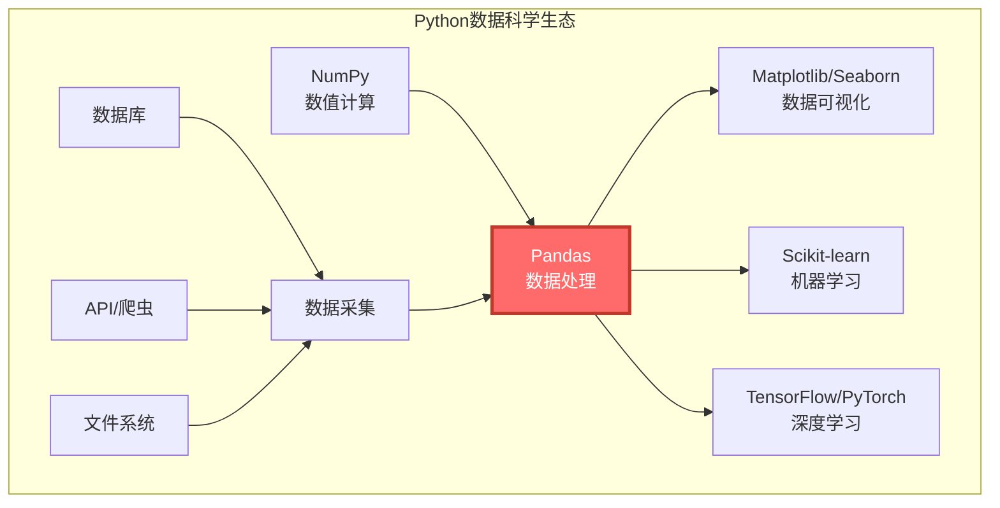
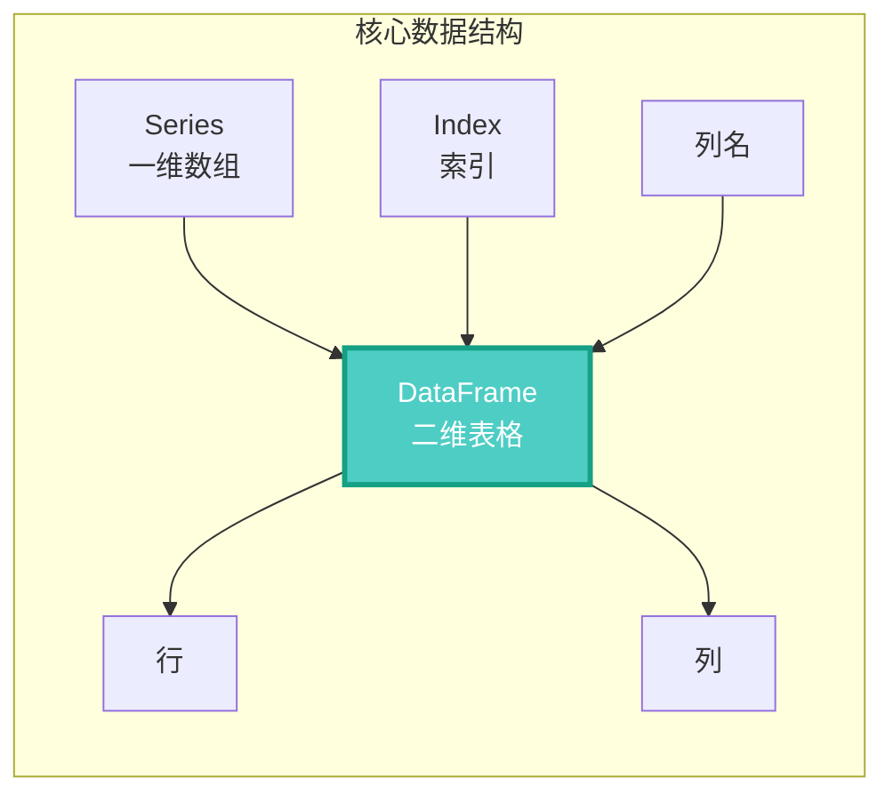
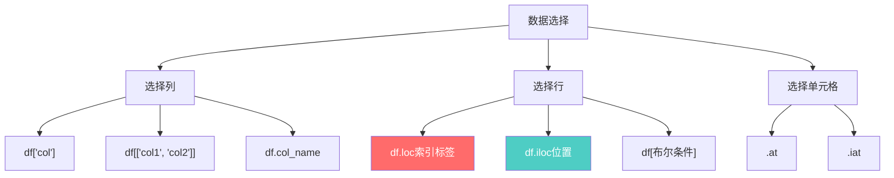
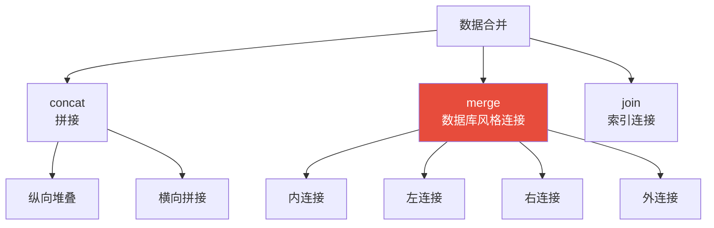
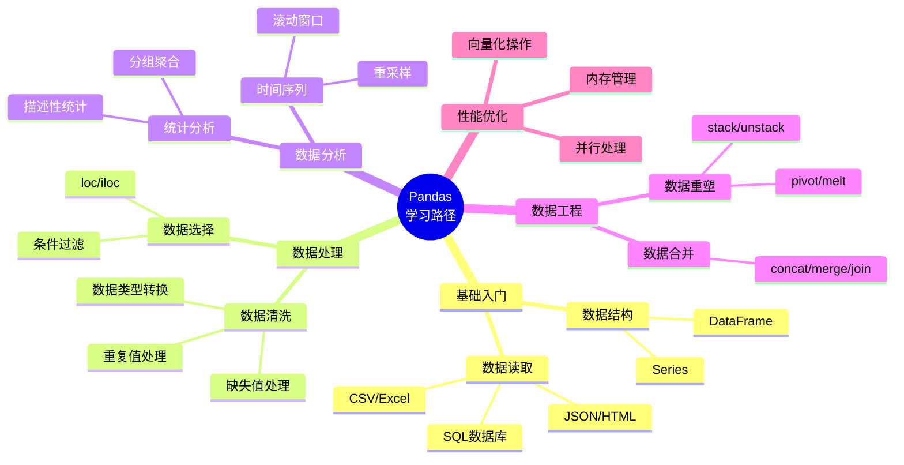

# Pandas数据分析完全指南：从零基础到数据科学家

---

## 引言

在数据分析领域，Pandas是当之无愧的王者。这个由Wes McKinney开发的库，以其强大的数据处理能力和灵活的API设计，成为Python数据科学生态系统的基石。

> "Pandas让Python成为了数据分析的首选语言"

无论你是数据分析师、机器学习工程师还是量化交易员，掌握Pandas都是必备技能。

---

## 一、Pandas全景认知

### 1.1 Pandas在数据科学生态中的位置



### 1.2 Pandas核心数据结构



### 1.3 为什么选择Pandas？

| 特性 | Pandas优势 | 传统方式 |
|-----|-----------|---------|
| 数据读取 | 支持多种格式（CSV、Excel、SQL等） | 需要手动解析 |
| 数据清洗 | 提供丰富的数据清洗函数 | 需要手动编写 |
| 数据分析 | 强大的聚合和分组功能 | 需要编写复杂循环 |
| 性能 | 基于NumPy，高效处理大数据 | 纯Python效率低 |
| 可视化 | 内置绘图功能 | 需要额外工具 |

---

## 二、快速入门：10分钟上手

### 2.1 安装与导入

```bash
# 安装Pandas
pip install pandas

# 安装完整数据分析套件
pip install pandas numpy matplotlib seaborn openpyxl xlrd
```

```python
import pandas as pd
import numpy as np

# 查看版本
print(f"Pandas版本: {pd.__version__}")
```

### 2.2 创建数据结构

#### 创建Series（一维数据）

```python
import pandas as pd

# 从列表创建
s1 = pd.Series([1, 2, 3, 4, 5])
print(s1)
# 0    1
# 1    2
# 2    3
# 3    4
# 4    5
# dtype: int64

# 指定索引
s2 = pd.Series([1, 2, 3], index=['a', 'b', 'c'])

# 从字典创建
s3 = pd.Series({'a': 100, 'b': 200, 'c': 300})

# 访问数据
print(s2['a'])      # 1
print(s2[0])        # 1（按位置）
print(s2['a':'b'])  # a和b两个元素
```

#### 创建DataFrame（二维表格）

```python
import pandas as pd

# 从字典创建
df1 = pd.DataFrame({
    'name': ['张三', '李四', '王五'],
    'age': [25, 30, 35],
    'city': ['北京', '上海', '深圳']
})
print(df1)
#   name  age city
# 0   张三   25   北京
# 1   李四   30   上海
# 2   王五   35   深圳

# 从列表创建
df2 = pd.DataFrame([
    ['张三', 25, '北京'],
    ['李四', 30, '上海'],
    ['王五', 35, '深圳']
], columns=['name', 'age', 'city'])

# 查看基本信息
print(df1.shape)        # (3, 3) - 3行3列
print(df1.columns)      # 列名
print(df1.dtypes)       # 数据类型
print(df1.head(2))      # 前2行
print(df1.tail(2))      # 后2行
print(df1.info())       # 详细信息
print(df1.describe())   # 统计摘要
```

### 2.3 数据读取与保存

```python
import pandas as pd

# ============ 读取数据 ============

# CSV文件
df = pd.read_csv('data.csv')
df = pd.read_csv('data.csv', encoding='utf-8', sep=',')

# Excel文件
df = pd.read_excel('data.xlsx')
df = pd.read_excel('data.xlsx', sheet_name='Sheet1')

# JSON文件
df = pd.read_json('data.json')

# SQL数据库
import sqlite3
conn = sqlite3.connect('database.db')
df = pd.read_sql('SELECT * FROM users', conn)

# HTML表格
dfs = pd.read_html('https://example.com/table')
df = dfs[0]  # 返回列表，取第一个表格

# 剪贴板
df = pd.read_clipboard()

# ============ 保存数据 ============

# 保存为CSV
df.to_csv('output.csv', index=False, encoding='utf-8')

# 保存为Excel
df.to_excel('output.xlsx', sheet_name='Sheet1', index=False)

# 保存为JSON
df.to_json('output.json', orient='records', force_ascii=False)

# 保存到SQL
df.to_sql('table_name', conn, if_exists='replace', index=False)
```

---

## 三、数据选择与过滤

### 3.1 数据选择方法对比



### 3.2 列选择

```python
import pandas as pd

df = pd.DataFrame({
    'name': ['张三', '李四', '王五'],
    'age': [25, 30, 35],
    'city': ['北京', '上海', '深圳'],
    'salary': [8000, 12000, 15000]
})

# 选择单列（返回Series）
print(df['name'])
print(df.name)  # 等价写法

# 选择多列（返回DataFrame）
print(df[['name', 'age']])

# 选择列类型
print(df.select_dtypes(include=['int64']))   # 选择整型列
print(df.select_dtypes(exclude=['object']))  # 排除字符串列
```

### 3.3 行选择

```python
# 使用.loc（标签索引）
print(df.loc[0])                 # 第1行
print(df.loc[0:1])               # 第1-2行
print(df.loc[0, 'name'])         # 第1行name列

# 使用.iloc（位置索引）
print(df.iloc[0])                # 第1行
print(df.iloc[0:2])              # 前2行
print(df.iloc[0, 0])             # 第1行第1列
print(df.iloc[0:2, 0:2])         # 前两行前两列

# 条件过滤
print(df[df['age'] > 25])                    # 年龄大于25
print(df[(df['age'] > 25) & (df['salary'] > 10000)])  # 多条件
print(df[df['city'].isin(['北京', '上海'])])          # 城市在指定列表

# 使用query方法
print(df.query('age > 25'))
print(df.query('age > 25 and salary > 10000'))
```

### 3.4 高级索引技巧

```python
import pandas as pd

df = pd.DataFrame({
    'name': ['张三', '李四', '王五', '赵六', '钱七'],
    'age': [25, 30, 35, 28, 32],
    'city': ['北京', '上海', '深圳', '北京', '广州'],
    'salary': [8000, 12000, 15000, 9000, 13000]
})

# 1. 使用isin
print(df[df['city'].isin(['北京', '上海'])])

# 2. 使用between
print(df[df['salary'].between(10000, 15000)])

# 3. 字符串方法
print(df[df['name'].str.startswith('张')])

# 4. 空值过滤
df_with_nan = df.copy()
df_with_nan.loc[2, 'salary'] = None
print(df_with_nan[df_with_nan['salary'].notna()])

# 5. 使用filter方法
print(df.filter(like='a'))  # 列名包含'a'的列
print(df.filter(regex='^[a-z]'))  # 正则匹配

# 6. 快速获取单个值
print(df.at[0, 'name'])     # 使用标签
print(df.iat[0, 0])         # 使用位置
```

---

## 四、数据清洗与预处理

### 4.1 数据清洗流程


### 4.2 缺失值处理

```python
import pandas as pd
import numpy as np

# 创建包含缺失值的数据
df = pd.DataFrame({
    'A': [1, 2, np.nan, 4, 5],
    'B': [10, np.nan, np.nan, 40, 50],
    'C': ['a', 'b', 'c', None, 'e']
})

# 检测缺失值
print(df.isnull())        # 返回布尔DataFrame
print(df.isnull().sum())  # 每列缺失值数量
print(df.isnull().any())  # 哪些列有缺失值

# 删除缺失值
print(df.dropna())                    # 删除包含缺失值的行
print(df.dropna(axis=1))              # 删除包含缺失值的列
print(df.dropna(how='all'))           # 只删除全为NaN的行
print(df.dropna(subset=['A', 'B']))   # 只考虑指定列
print(df.dropna(thresh=2))            # 保留至少有2个非NaN的行

# 填充缺失值
print(df.fillna(0))                      # 用0填充
print(df.fillna(df.mean()))              # 用均值填充
print(df.fillna(method='ffill'))         # 用前一个值填充
print(df.fillna(method='bfill'))         # 用后一个值填充
print(df.fillna({'A': 0, 'B': 20, 'C': 'unknown'}))  # 不同列不同值

# 插值法
print(df['A'].interpolate())             # 线性插值
print(df['A'].interpolate(method='quadratic'))  # 二次插值
```

### 4.3 重复值处理

```python
import pandas as pd

df = pd.DataFrame({
    'name': ['张三', '李四', '张三', '王五', '张三'],
    'age': [25, 30, 25, 35, 26],
    'city': ['北京', '上海', '北京', '深圳', '北京']
})

# 检测重复值
print(df.duplicated())              # 返回布尔Series
print(df.duplicated(keep='first'))  # 标记除第一个外的重复项
print(df.duplicated(keep='last'))   # 标记除最后一个外的重复项
print(df.duplicated(subset=['name']))  # 只考虑name列

# 删除重复值
print(df.drop_duplicates())                      # 删除完全重复的行
print(df.drop_duplicates(subset=['name']))       # 只考虑name列
print(df.drop_duplicates(subset=['name', 'city']))  # 多列组合
print(df.drop_duplicates(keep='last'))           # 保留最后一个

# 统计重复值
print(df['name'].value_counts())  # 每个值出现的次数
```

### 4.4 数据类型转换

```python
import pandas as pd

df = pd.DataFrame({
    'id': ['001', '002', '003'],
    'price': ['99.5', '199.0', '49.9'],
    'date': ['2024-01-01', '2024-01-02', '2024-01-03'],
    'flag': ['True', 'False', 'True']
})

# 查看数据类型
print(df.dtypes)

# 类型转换
df['id'] = df['id'].astype(int)
df['price'] = df['price'].astype(float)
df['flag'] = df['flag'].astype(bool)

# 日期转换
df['date'] = pd.to_datetime(df['date'])
df['date'] = pd.to_datetime(df['date'], format='%Y-%m-%d')

# 数值转换（处理错误）
df['price'] = pd.to_numeric(df['price'], errors='coerce')  # 错误转为NaN
df['price'] = pd.to_numeric(df['price'], errors='raise')   # 错误抛出异常

# 分类类型（节省内存）
df['city'] = df['id'].astype('category')

# 智能类型推断
df = df.convert_dtypes()  # 自动推断最佳类型
```

### 4.5 字符串处理

```python
import pandas as pd

df = pd.DataFrame({
    'name': ['  张三  ', '李四', '王五'],
    'email': ['zhang@example.com', 'li@test.org', 'wang@gmail.com'],
    'phone': ['138-1234-5678', '159-8765-4321', '186-1111-2222']
})

# 字符串方法（通过.str访问器）
print(df['name'].str.strip())          # 去除首尾空格
print(df['name'].str.lower())          # 转小写
print(df['name'].str.upper())          # 转大写
print(df['name'].str.len())            # 字符串长度

# 字符串查找
print(df['email'].str.contains('example'))
print(df['email'].str.startswith('zhang'))
print(df['email'].str.endswith('.com'))

# 正则表达式
print(df['email'].str.extract(r'@(\w+)\.'))
print(df['phone'].str.replace('-', ''))
print(df['email'].str.findall(r'\w+'))

# 字符串分割
print(df['email'].str.split('@'))
print(df['email'].str.split('@', expand=True))  # 展开为多列

# 字符串切片
print(df['name'].str[0:2])
```

---

## 五、数据分析与统计

### 5.1 描述性统计

```python
import pandas as pd
import numpy as np

df = pd.DataFrame({
    'category': ['A', 'B', 'A', 'B', 'A', 'B'],
    'value1': [10, 20, 15, 25, 12, 22],
    'value2': [100, 200, 150, 250, 120, 220]
})

# 基本统计
print(df.describe())              # 统计摘要
print(df.mean())                  # 均值
print(df.median())                # 中位数
print(df.std())                   # 标准差
print(df.var())                   # 方差
print(df.min())                   # 最小值
print(df.max())                   # 最大值
print(df.sum())                   # 求和
print(df.count())                 # 计数
print(df.quantile([0.25, 0.5, 0.75]))  # 分位数

# 相关系数
print(df.corr())                  # 相关系数矩阵
print(df.cov())                   # 协方差矩阵

# 自定义聚合
print(df.agg({
    'value1': ['mean', 'std', 'min', 'max'],
    'value2': ['sum', 'count']
}))
```

### 5.2 分组聚合（GroupBy）


```python
import pandas as pd

df = pd.DataFrame({
    'department': ['销售', '技术', '销售', '技术', '销售', '技术'],
    'name': ['张三', '李四', '王五', '赵六', '钱七', '孙八'],
    'salary': [8000, 12000, 9000, 15000, 8500, 13000],
    'age': [25, 30, 28, 35, 26, 32]
})

# 基本分组
grouped = df.groupby('department')

# 单列聚合
print(grouped['salary'].mean())     # 平均薪资
print(grouped['salary'].agg(['mean', 'std', 'count']))

# 多列聚合
print(grouped.agg({
    'salary': ['mean', 'max', 'min'],
    'age': ['mean', 'min', 'max']
}))

# 自定义聚合函数
print(grouped['salary'].agg(lambda x: x.max() - x.min()))

# 多个聚合函数
print(grouped.agg(['mean', 'std', 'count']))

# 命名聚合
print(grouped.agg(
    平均薪资=('salary', 'mean'),
    最高薪资=('salary', 'max'),
    人数=('salary', 'count')
))

# 多级分组
print(df.groupby(['department', 'age']).agg({
    'salary': 'mean'
}))

# 分组后过滤
print(grouped.filter(lambda x: x['salary'].mean() > 10000))

# 分组后转换
df['salary_normalized'] = grouped['salary'].transform(
    lambda x: (x - x.mean()) / x.std()
)

# 分组后应用函数
print(grouped.apply(lambda x: x.nlargest(2, 'salary')))
```

### 5.3 数据透视表

```python
import pandas as pd

df = pd.DataFrame({
    'date': ['2024-01', '2024-01', '2024-02', '2024-02'] * 3,
    'category': ['A', 'B', 'A', 'B'] * 3,
    'region': ['North', 'South', 'North', 'South'] * 3,
    'sales': [100, 200, 150, 250, 120, 220, 160, 260, 110, 210, 140, 240]
})

# 简单透视表
pivot = pd.pivot_table(
    df,
    values='sales',
    index='category',
    columns='region',
    aggfunc='mean'
)
print(pivot)

# 多级索引透视表
pivot = pd.pivot_table(
    df,
    values='sales',
    index=['date', 'category'],
    columns='region',
    aggfunc=['mean', 'sum', 'count']
)
print(pivot)

# 添加汇总
pivot = pd.pivot_table(
    df,
    values='sales',
    index='category',
    columns='region',
    aggfunc='sum',
    margins=True,
    margins_name='总计'
)
print(pivot)

# 交叉表（计数）
cross = pd.crosstab(df['category'], df['region'])
print(cross)

# 带聚合的交叉表
cross = pd.crosstab(
    df['category'],
    df['region'],
    values=df['sales'],
    aggfunc='mean'
)
print(cross)
```

### 5.4 时间序列分析

```python
import pandas as pd
import numpy as np

# 创建时间序列数据
dates = pd.date_range('2024-01-01', periods=100, freq='D')
df = pd.DataFrame({
    'date': dates,
    'value': np.random.randn(100).cumsum()
})
df.set_index('date', inplace=True)

# 时间索引操作
print(df['2024-01'])              # 选择2024年1月
print(df['2024-01-01':'2024-01-10'])  # 日期范围

# 时间序列重采样
print(df.resample('W').mean())    # 按周聚合
print(df.resample('M').sum())     # 按月聚合
print(df.resample('Q').agg(['mean', 'std']))  # 按季度聚合

# 滚动窗口
print(df.rolling(window=7).mean())     # 7日移动平均
print(df.rolling(window=7).std())      # 7日移动标准差
print(df.expanding().mean())           # 累积均值

# 时间偏移
print(df.shift(1))                 # 数据向后移1天
print(df.shift(-1))                # 数据向前移1天

# 时间差
print(df.index.to_period('M'))     # 转换为月份周期
print(df.index.to_period('Q'))     # 转换为季度周期

# 差分
print(df.diff(1))                  # 一阶差分
print(df.pct_change())             # 百分比变化
```

---

## 六、数据合并与重塑

### 6.1 数据合并方式对比



### 6.2 数据拼接（concat）

```python
import pandas as pd

df1 = pd.DataFrame({'A': [1, 2], 'B': [3, 4]})
df2 = pd.DataFrame({'A': [5, 6], 'B': [7, 8]})
df3 = pd.DataFrame({'C': [9, 10], 'D': [11, 12]})

# 纵向拼接（默认）
result = pd.concat([df1, df2])
print(result)
#    A  B
# 0  1  3
# 1  2  4
# 0  5  7
# 1  6  8

# 忽略索引
result = pd.concat([df1, df2], ignore_index=True)

# 添加层次索引
result = pd.concat([df1, df2], keys=['df1', 'df2'])

# 横向拼接
result = pd.concat([df1, df3], axis=1)

# 内连接（只保留共有列）
result = pd.concat([df1, df3], join='inner')

# 使用append（已弃用，建议使用concat）
# result = df1.append(df2)
```

### 6.3 数据库风格连接（merge）

```python
import pandas as pd

# 左表
left = pd.DataFrame({
    'key': ['A', 'B', 'C', 'D'],
    'value_left': [1, 2, 3, 4]
})

# 右表
right = pd.DataFrame({
    'key': ['A', 'B', 'E', 'F'],
    'value_right': [5, 6, 7, 8]
})

# 内连接（默认）
inner = pd.merge(left, right, on='key')
print(inner)
#   key  value_left  value_right
# 0   A           1            5
# 1   B           2            6

# 左连接
left_join = pd.merge(left, right, on='key', how='left')

# 右连接
right_join = pd.merge(left, right, on='key', how='right')

# 外连接
outer_join = pd.merge(left, right, on='key', how='outer')

# 多键连接
df1 = pd.DataFrame({
    'key1': ['A', 'A', 'B'],
    'key2': ['X', 'Y', 'X'],
    'value': [1, 2, 3]
})

df2 = pd.DataFrame({
    'key1': ['A', 'B', 'C'],
    'key2': ['X', 'Y', 'Z'],
    'value': [4, 5, 6]
})

result = pd.merge(df1, df2, on=['key1', 'key2'])

# 处理重复列名
result = pd.merge(left, right, on='key', suffixes=['_left', '_right'])
```

### 6.4 数据重塑

```python
import pandas as pd

# 原始数据
df = pd.DataFrame({
    'name': ['张三'] * 3 + ['李四'] * 3,
    'subject': ['语文', '数学', '英语'] * 2,
    'score': [85, 90, 88, 92, 87, 95]
})

# 宽转长（melt）
df_long = df.melt(
    id_vars=['name'],
    value_vars=['score'],
    var_name='metric',
    value_name='value'
)

# 长转宽（pivot）
df_wide = df.pivot(
    index='name',
    columns='subject',
    values='score'
)

# 多级列pivot
df_multi = df.pivot_table(
    index='name',
    columns='subject',
    values='score',
    aggfunc='mean'
)

# stack和unstack
df_stacked = df_wide.stack()      # 宽转长
df_unstacked = df_stacked.unstack()  # 长转宽
```

---

## 七、数据可视化

### 7.1 Pandas内置绘图

```python
import pandas as pd
import numpy as np
import matplotlib.pyplot as plt

# 设置中文显示
plt.rcParams['font.sans-serif'] = ['Arial Unicode MS']
plt.rcParams['axes.unicode_minus'] = False

# 创建示例数据
df = pd.DataFrame({
    'A': np.random.randn(100).cumsum(),
    'B': np.random.randn(100).cumsum(),
    'C': np.random.randn(100).cumsum()
}, index=pd.date_range('2024-01-01', periods=100))

# 折线图
df.plot()
plt.title('时间序列折线图')
plt.show()

# 柱状图
df.plot(kind='bar')
df.plot.bar()
df.plot.barh()  # 横向柱状图

# 直方图
df['A'].plot.hist(bins=20)

# 箱线图
df.plot.box()

# 散点图
df.plot.scatter(x='A', y='B')

# 饼图
df.sum().plot.pie(autopct='%1.1f%%')

# 面积图
df.plot.area()

# 核密度估计
df.plot.kde()

# 子图
df.plot(subplots=True, figsize=(10, 8))
```

### 7.2 样式设置

```python
import pandas as pd
import numpy as np

# 创建数据
df = pd.DataFrame({
    'A': [1, 2, 3, 4, 5],
    'B': [10, 20, 30, 40, 50],
    'C': [100, 200, 300, 400, 500]
})

# 条件格式化
def highlight_max(s):
    """高亮最大值"""
    is_max = s == s.max()
    return ['background-color: yellow' if v else '' for v in is_max]

styled = df.style.apply(highlight_max)

# 渐变色
styled = df.style.background_gradient(cmap='Blues')

# 条形图
styled = df.style.bar(subset=['A', 'B'], color='#5dadec')

# 格式化数字
styled = df.style.format({
    'C': '{:.2f}',
    'B': '{:,}'
})

# 设置标题
styled = df.style.set_caption('数据表格标题')

# 链式调用
styled = (df.style
    .format({'C': '{:.2f}'})
    .background_gradient(cmap='Greens')
    .set_caption('格式化表格')
)
```

---

## 八、性能优化技巧

### 8.1 向量化操作

```python
import pandas as pd
import numpy as np

# 创建大数据集
df = pd.DataFrame({
    'A': np.random.randn(1000000),
    'B': np.random.randn(1000000)
})

# 低效方式：循环
# for i in range(len(df)):
#     df.loc[i, 'C'] = df.loc[i, 'A'] + df.loc[i, 'B']

# 高效方式：向量化
df['C'] = df['A'] + df['B']  # 快100倍以上

# 使用NumPy函数
df['D'] = np.sqrt(df['A'] ** 2 + df['B'] ** 2)

# 使用内置方法
df['E'] = df['A'].abs()
```

### 8.2 内存优化

```python
import pandas as pd

# 查看内存使用
df = pd.read_csv('large_file.csv')
print(df.memory_usage())
print(df.memory_usage().sum() / 1024**2, 'MB')

# 优化数值类型
df['int_column'] = df['int_column'].astype('int32')  # 从int64降级
df['float_column'] = df['float_column'].astype('float32')  # 从float64降级

# 使用分类类型
df['category_column'] = df['category_column'].astype('category')

# 只读取需要的列
df = pd.read_csv('large_file.csv', usecols=['col1', 'col2', 'col3'])

# 指定数据类型
df = pd.read_csv('data.csv', dtype={
    'id': 'int32',
    'value': 'float32',
    'category': 'category'
})

# 分块读取
chunks = pd.read_csv('large_file.csv', chunksize=10000)
for chunk in chunks:
    process(chunk)  # 处理每个块
```

### 8.3 常用优化技巧

```python
import pandas as pd

# 1. 使用.loc而不是链式索引
# 慢：df[df['A'] > 0]['B'] = 1
# 快：df.loc[df['A'] > 0, 'B'] = 1

# 2. 使用isin代替多个OR
# 慢：df[(df['A'] == 1) | (df['A'] == 2) | (df['A'] == 3)]
# 快：df[df['A'].isin([1, 2, 3])]

# 3. 使用query方法
df.query('A > 0 and B < 10')

# 4. 预分配内存
result = pd.DataFrame(index=df.index, columns=['result'])
result['result'] = df['A'] + df['B']

# 5. 使用eval（大数据集）
df.eval('C = A + B', inplace=True)

# 6. 避免重复计算
# 缓存中间结果
mask = df['A'] > 0
df.loc[mask, 'B'] = df.loc[mask, 'B'] * 2
```

---

## 九、实战案例：电商数据分析

```python
import pandas as pd
import numpy as np
import matplotlib.pyplot as plt

# 设置中文显示
plt.rcParams['font.sans-serif'] = ['Arial Unicode MS']

# 模拟电商数据
np.random.seed(42)
orders = pd.DataFrame({
    'order_id': range(1, 1001),
    'user_id': np.random.randint(1, 101, 1000),
    'product_category': np.random.choice(['电子产品', '服装', '食品', '家居'], 1000),
    'order_amount': np.random.uniform(50, 2000, 1000),
    'order_date': pd.date_range('2024-01-01', periods=1000, freq='H'),
    'payment_method': np.random.choice(['支付宝', '微信', '银行卡', '货到付款'], 1000),
    'status': np.random.choice(['已完成', '已取消', '待发货', '已退款'], 1000, p=[0.7, 0.1, 0.15, 0.05])
})

# ============ 数据分析流程 ============

# 1. 数据概览
print("数据概览：")
print(orders.info())
print("\n数据统计：")
print(orders.describe())

# 2. 数据清洗
# 转换数据类型
orders['order_date'] = pd.to_datetime(orders['order_date'])
orders['order_amount'] = orders['order_amount'].round(2)

# 提取时间特征
orders['hour'] = orders['order_date'].dt.hour
orders['day_of_week'] = orders['order_date'].dt.day_name()
orders['month'] = orders['order_date'].dt.month

# 3. 业务指标计算

# 总销售额
total_sales = orders[orders['status'] == '已完成']['order_amount'].sum()
print(f"\n总销售额: ¥{total_sales:,.2f}")

# 各品类销售额
category_sales = orders[orders['status'] == '已完成'].groupby('product_category')['order_amount'].agg([
    ('销售额', 'sum'),
    ('订单数', 'count'),
    ('客单价', 'mean')
]).round(2)
print("\n各品类销售情况：")
print(category_sales)

# 支付方式分布
payment_dist = orders['payment_method'].value_counts(normalize=True) * 100
print("\n支付方式分布：")
print(payment_dist)

# 订单状态分布
status_dist = orders['status'].value_counts(normalize=True) * 100

# 4. 时间分析

# 每小时订单量
hourly_orders = orders.groupby('hour').size()

# 每周订单分布
weekly_orders = orders.groupby('day_of_week').size()

# 5. 用户分析

# 用户消费排行
top_users = orders.groupby('user_id').agg({
    'order_id': 'count',
    'order_amount': 'sum'
}).rename(columns={
    'order_id': '订单数',
    'order_amount': '消费总额'
}).nlargest(10, '消费总额')

print("\nTOP10消费用户：")
print(top_users)

# 用户分层（RFM模型简化版）
rfm = orders[orders['status'] == '已完成'].groupby('user_id').agg({
    'order_date': lambda x: (pd.Timestamp.now() - x.max()).days,
    'order_id': 'count',
    'order_amount': 'sum'
}).rename(columns={
    'order_date': 'Recency',
    'order_id': 'Frequency',
    'order_amount': 'Monetary'
})

# 6. 可视化

# 品类销售额柱状图
fig, axes = plt.subplots(2, 2, figsize=(12, 10))

category_sales['销售额'].plot(kind='bar', ax=axes[0, 0], title='各品类销售额')
axes[0, 0].set_ylabel('销售额（元）')

payment_dist.plot(kind='pie', ax=axes[0, 1], title='支付方式分布', autopct='%1.1f%%')
axes[0, 1].set_ylabel('')

hourly_orders.plot(kind='line', ax=axes[1, 0], title='每小时订单量')
axes[1, 0].set_xlabel('小时')
axes[1, 0].set_ylabel('订单数')

status_dist.plot(kind='barh', ax=axes[1, 1], title='订单状态分布')
axes[1, 1].set_xlabel('占比（%）')

plt.tight_layout()
plt.savefig('sales_analysis.png', dpi=300)
plt.show()

# 7. 导出报告
report = pd.DataFrame({
    '指标': ['总销售额', '平均客单价', '订单总数', '完成率'],
    '值': [
        f"¥{total_sales:,.2f}",
        f"¥{orders[orders['status']=='已完成']['order_amount'].mean():,.2f}",
        f"{len(orders):,}",
        f"{status_dist['已完成']:.1f}%"
    ]
})

print("\n数据报告摘要：")
print(report)
```

---



### 核心要点回顾：

1. **数据结构**：理解Series和DataFrame的本质
2. **数据访问**：熟练使用loc、iloc和条件过滤
3. **数据清洗**：掌握缺失值、重复值、异常值处理
4. **分组聚合**：GroupBy是数据分析的核心工具
5. **性能优化**：向量化操作和内存管理

---