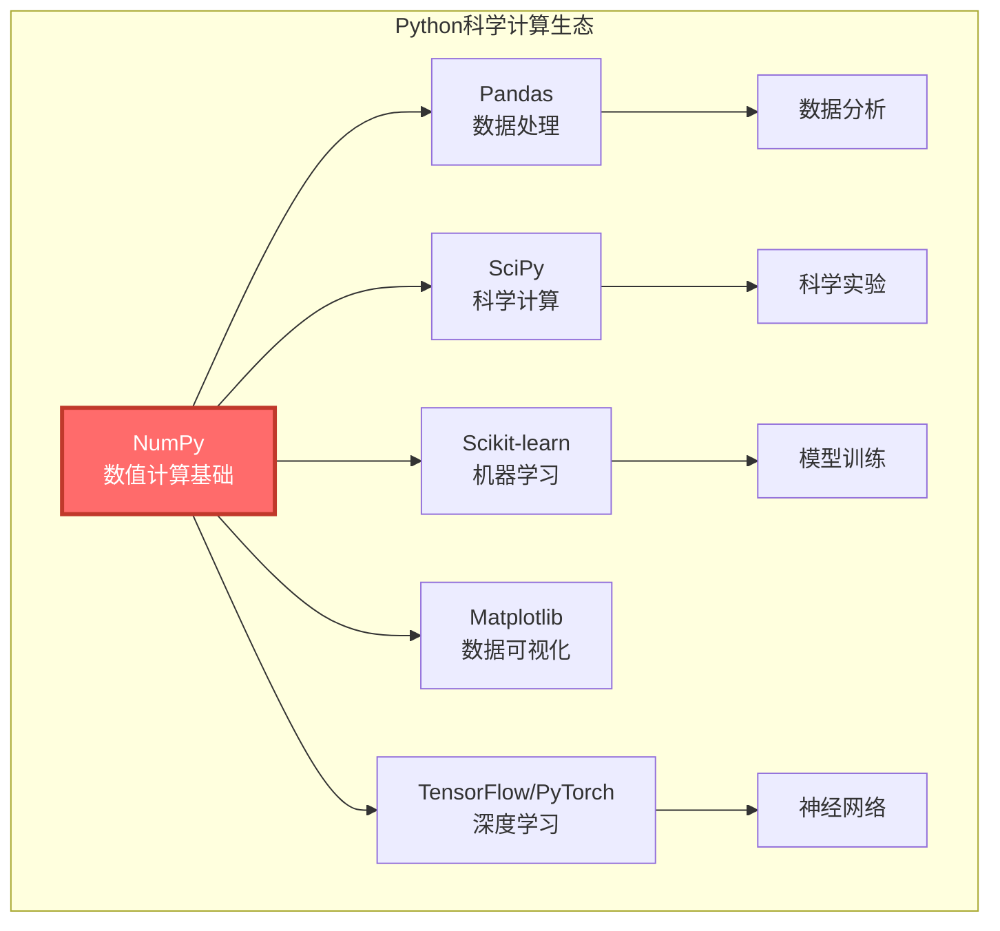
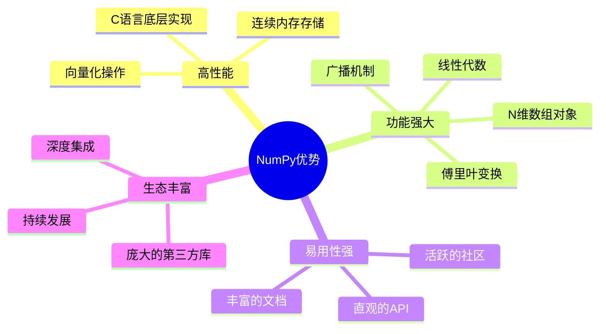
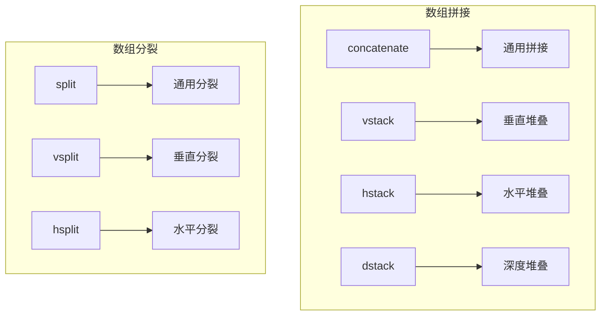
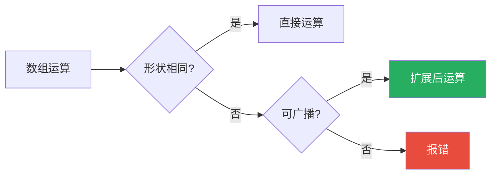
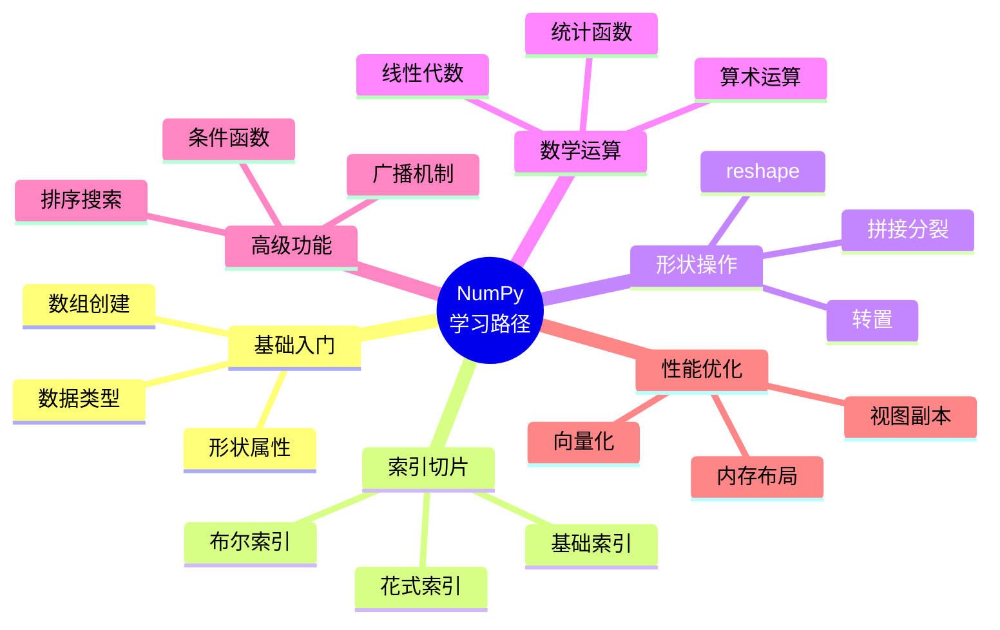

# NumPy科学计算完全指南：Python数值计算的基石

---

## 引言

NumPy（Numerical Python）是Python科学计算的基石。它提供了强大的N维数组对象、广播功能以及丰富的数学函数库，是Pandas、Scikit-learn、TensorFlow等库的底层支撑。

> "NumPy让Python成为了科学计算的主流语言"

无论你是数据科学家、机器学习工程师还是科研工作者，NumPy都是必须掌握的核心技能。

---

## 一、NumPy全景认知

### 1.1 NumPy在科学计算生态中的位置



### 1.2 NumPy核心优势



### 1.3 NumPy vs Python原生列表

| 特性 | NumPy数组 | Python列表 |
|-----|----------|-----------|
| 存储方式 | 连续内存 | 分散存储 |
| 数据类型 | 同质（相同类型） | 异质（任意类型） |
| 性能 | 快10-100倍 | 较慢 |
| 内存占用 | 小 | 大 |
| 数学运算 | 支持向量化 | 需要循环 |
| 多维支持 | 原生支持 | 需要嵌套 |

---

## 二、快速入门：15分钟上手

### 2.1 安装与导入

```bash
# 安装NumPy
pip install numpy

# 安装科学计算套件
pip install numpy scipy matplotlib
```

```python
import numpy as np

# 查看版本
print(f"NumPy版本: {np.__version__}")

# 查看配置
np.show_config()
```

### 2.2 创建数组

#### 从列表/元组创建

```python
import numpy as np

# 一维数组
arr1 = np.array([1, 2, 3, 4, 5])
print(arr1)  # [1 2 3 4 5]

# 二维数组
arr2 = np.array([[1, 2, 3], [4, 5, 6]])
print(arr2)
# [[1 2 3]
#  [4 5 6]]

# 三维数组
arr3 = np.array([[[1, 2], [3, 4]], [[5, 6], [7, 8]]])

# 指定数据类型
arr4 = np.array([1, 2, 3], dtype=np.float32)
arr5 = np.array([1.1, 2.2, 3.3], dtype=np.int32)  # 会截断

# 查看数组属性
print(f"形状: {arr2.shape}")      # (2, 3)
print(f"维度: {arr2.ndim}")       # 2
print(f"元素数: {arr2.size}")     # 6
print(f"数据类型: {arr2.dtype}")  # int64
print(f"元素大小: {arr2.itemsize}")  # 8字节
```

#### 使用内置函数创建

```python
import numpy as np

# 全0数组
zeros = np.zeros((3, 4))
print(zeros)
# [[0. 0. 0. 0.]
#  [0. 0. 0. 0.]
#  [0. 0. 0. 0.]]

# 全1数组
ones = np.ones((2, 3))

# 单位矩阵
eye = np.eye(3)
print(eye)
# [[1. 0. 0.]
#  [0. 1. 0.]
#  [0. 0. 1.]]

# 对角矩阵
diag = np.diag([1, 2, 3])

# 未初始化数组（快速，但值不确定）
empty = np.empty((2, 3))

# 全填充数组
full = np.full((3, 3), 7)

# 等差数列
arange = np.arange(0, 10, 2)  # [0, 2, 4, 6, 8]

# 线性等分
linspace = np.linspace(0, 1, 5)  # [0.  , 0.25, 0.5 , 0.75, 1.  ]

# 对数等分
logspace = np.logspace(0, 2, 5)  # 从10^0到10^2

# 随机数组
rand = np.random.rand(3, 3)      # [0, 1)均匀分布
randn = np.random.randn(3, 3)    # 标准正态分布
randint = np.random.randint(0, 10, (3, 3))  # 随机整数
```

### 2.3 数组数据类型

```python
import numpy as np

# 常用数据类型
dtypes = {
    'np.bool_': '布尔类型',
    'np.int8': '8位整数(-128到127)',
    'np.int16': '16位整数',
    'np.int32': '32位整数',
    'np.int64': '64位整数(默认)',
    'np.uint8': '无符号8位整数(0到255)',
    'np.float16': '16位浮点数',
    'np.float32': '32位浮点数',
    'np.float64': '64位浮点数(默认)',
    'np.complex64': '64位复数',
    'np.complex128': '128位复数',
    'np.str_': '字符串',
    'np.object_': 'Python对象'
}

# 类型转换
arr = np.array([1, 2, 3], dtype=np.int32)
print(arr.dtype)  # int32

# 转换类型
arr_float = arr.astype(np.float32)
print(arr_float.dtype)  # float32

# 自动推断最佳类型
arr_auto = np.array([1.5, 2.3, 3.7]).astype(int)  # 截断为整数
print(arr_auto)  # [1 2 3]

# 查看所有数据类型
print(np.sctypes)
```

---

## 三、数组索引与切片

### 3.1 基础索引

```mermaid
flowchart LR
    subgraph 一维数组索引
        A[arr[0]] --> B[第一个元素]
        C[arr[-1]] --> D[最后一个元素]
        E[arr[2:5]] --> F[切片]
    end
    
    subgraph 二维数组索引
        G[arr[0, 1]] --> H[第一行第二列]
        I[arr[:, 0]] --> J[所有行的第一列]
        K[arr[0, :]] --> L[第一行的所有列]
    end
```

```python
import numpy as np

# 一维数组索引
arr1d = np.array([1, 2, 3, 4, 5, 6, 7, 8, 9, 10])

print(arr1d[0])        # 1（第一个元素）
print(arr1d[-1])       # 10（最后一个元素）
print(arr1d[2:5])      # [3 4 5]（切片）
print(arr1d[:5])       # [1 2 3 4 5]（前5个）
print(arr1d[5:])       # [6 7 8 9 10]（从第6个开始）
print(arr1d[::2])      # [1 3 5 7 9]（步长为2）
print(arr1d[::-1])     # [10 9 8 7 6 5 4 3 2 1]（反转）

# 二维数组索引
arr2d = np.array([[1, 2, 3],
                  [4, 5, 6],
                  [7, 8, 9]])

print(arr2d[0, 0])     # 1（第一行第一列）
print(arr2d[1, 2])     # 6（第二行第三列）
print(arr2d[0])        # [1 2 3]（第一行）
print(arr2d[:, 0])     # [1 4 7]（第一列）
print(arr2d[0, :])     # [1 2 3]（第一行）
print(arr2d[:2, 1:])   # [[2 3], [5 6]]（前两行，第2列开始）
print(arr2d[::2, ::2]) # [[1 3], [7 9]]（步长为2）

# 三维数组索引
arr3d = np.array([[[1, 2], [3, 4]], [[5, 6], [7, 8]]])
print(arr3d[0, 1, 0])  # 3
print(arr3d[0])        # [[1 2], [3 4]]
```

### 3.2 高级索引

```python
import numpy as np

arr = np.array([[1, 2, 3], [4, 5, 6], [7, 8, 9]])

# 整数数组索引
print(arr[[0, 1, 2], [0, 1, 2]])  # [1 5 9]（对角线）
print(arr[[0, 2], [1, 2]])         # [2 9]

# 布尔索引
print(arr[arr > 5])  # [6 7 8 9]
print(arr[arr % 2 == 0])  # [2 4 6 8]

# 组合条件
mask = (arr > 3) & (arr < 8)
print(arr[mask])  # [4 5 6 7]

# 使用布尔数组修改值
arr_copy = arr.copy()
arr_copy[arr_copy > 5] = 0
print(arr_copy)
# [[1 2 3]
#  [4 5 0]
#  [0 0 0]]

# 花式索引
rows = np.array([0, 2])
cols = np.array([1, 2])
print(arr[rows[:, np.newaxis], cols])  # [[2 3], [8 9]]

# np.where条件索引
result = np.where(arr > 5, arr * 2, arr)
print(result)
# [[ 1  2  3]
#  [ 4  5 12]
#  [14 16 18]]

# np.extract提取
print(np.extract(arr > 5, arr))  # [6 7 8 9]
```

### 3.3 索引技巧

```python
import numpy as np

arr = np.arange(12).reshape(3, 4)
print(arr)
# [[ 0  1  2  3]
#  [ 4  5  6  7]
#  [ 8  9 10 11]]

# 获取对角线
print(np.diagonal(arr))      # [0 5 10]
print(np.diag(arr))          # [0 5 10]

# 获取上三角
print(np.triu(arr))
# [[ 0  1  2  3]
#  [ 0  5  6  7]
#  [ 0  0 10 11]]

# 获取下三角
print(np.tril(arr))
# [[ 0  0  0  0]
#  [ 4  5  0  0]
#  [ 8  9 10  0]]

# 非零元素索引
print(np.nonzero(arr > 5))   # (array([1, 2, 2, 2]), array([2, 0, 1, 2]))

# 按条件查找索引
print(np.argwhere(arr > 5))
# [[1 2]
#  [2 0]
#  [2 1]
#  [2 2]]

# 使用np.take
indices = [0, 2, 5]
print(np.take(arr, indices))  # [0 2 5]
```

---

## 四、数组形状操作

### 4.1 形状变换

```python
import numpy as np

arr = np.arange(12)
print(arr)  # [ 0  1  2  3  4  5  6  7  8  9 10 11]

# reshape - 改变形状（返回新数组）
arr2d = arr.reshape(3, 4)
print(arr2d.shape)  # (3, 4)

arr3d = arr.reshape(2, 2, 3)
print(arr3d.shape)  # (2, 2, 3)

# 自动计算维度
arr_auto = arr.reshape(3, -1)  # 自动计算列数
arr_auto2 = arr.reshape(-1, 4)  # 自动计算行数

# ravel - 展平为一维
flat = arr2d.ravel()  # 返回视图（不复制）
flat2 = arr2d.flatten()  # 返回副本

# 转置
transposed = arr2d.T  # 或 np.transpose(arr2d)
print(transposed.shape)  # (4, 3)

# swapaxes - 交换轴
arr3d = np.arange(24).reshape(2, 3, 4)
swapped = arr3d.swapaxes(0, 2)
print(swapped.shape)  # (4, 3, 2)

# moveaxis - 移动轴
moved = np.moveaxis(arr3d, [0, 1], [2, 0])
print(moved.shape)  # (4, 2, 3)

# resize - 改变形状（原地修改）
arr_copy = arr.copy()
arr_copy.resize(3, 5)  # 可以重复或截断元素
```

### 4.2 数组拼接与分裂



```python
import numpy as np

a = np.array([[1, 2], [3, 4]])
b = np.array([[5, 6], [7, 8]])

# 拼接

# concatenate（通用）
print(np.concatenate([a, b], axis=0))   # 垂直拼接
# [[1 2]
#  [3 4]
#  [5 6]
#  [7 8]]

print(np.concatenate([a, b], axis=1))   # 水平拼接
# [[1 2 5 6]
#  [3 4 7 8]]

# vstack（垂直堆叠）
print(np.vstack([a, b]))

# hstack（水平堆叠）
print(np.hstack([a, b]))

# dstack（深度堆叠）
print(np.dstack([a, b]))

# stack（创建新维度）
print(np.stack([a, b], axis=0).shape)  # (2, 2, 2)

# 分裂

arr = np.arange(12).reshape(3, 4)

# split（通用分裂）
print(np.split(arr, 3, axis=0))  # 垂直分裂成3份
print(np.split(arr, [2, 3], axis=1))  # 在第2、3列位置分裂

# vsplit（垂直分裂）
print(np.vsplit(arr, 3))

# hsplit（水平分裂）
print(np.hsplit(arr, 2))

# array_split（不等分分裂）
print(np.array_split(np.arange(10), 3))  # [array([0, 1, 2, 3]), array([4, 5, 6]), array([7, 8, 9])]
```

### 4.3 数组扩展与压缩

```python
import numpy as np

arr = np.array([[1, 2], [3, 4]])

# 扩展维度
print(np.newaxis)  # None的别名

# 在第0维扩展
expanded0 = arr[np.newaxis, :, :]  # 或 arr[None, :, :]
print(expanded0.shape)  # (1, 2, 2)

# 在最后一维扩展
expanded_end = arr[:, :, np.newaxis]
print(expanded_end.shape)  # (2, 2, 1)

# expand_dims
print(np.expand_dims(arr, axis=0).shape)  # (1, 2, 2)
print(np.expand_dims(arr, axis=-1).shape)  # (2, 2, 1)

# squeeze - 移除长度为1的维度
squeezed = expanded0.squeeze()
print(squeezed.shape)  # (2, 2)

# repeat - 重复元素
print(np.repeat(arr, 2))  # 每个元素重复2次
print(np.repeat(arr, 2, axis=0))  # 每行重复2次

# tile - 整体重复
print(np.tile(arr, 2))  # 整体重复2次
print(np.tile(arr, (2, 3)))  # 行重复2次，列重复3次
```

---

## 五、广播机制

### 5.1 广播规则



### 5.2 广播规则详解

```python
import numpy as np

"""
广播规则：
1. 如果维度数不同，在形状前面补1
2. 如果某个维度为1，可以扩展为任意大小
3. 如果维度既不相同也不为1，则报错
"""

# 规则1：维度数不同，前面补1
a = np.ones((3, 4))
b = np.ones(4)
print((a + b).shape)  # (3, 4)
# b的形状从(4,) -> (1, 4) -> (3, 4)

# 规则2：维度为1可以扩展
a = np.ones((3, 1))
b = np.ones((1, 4))
print((a + b).shape)  # (3, 4)
# a: (3, 1) -> (3, 4)
# b: (1, 4) -> (3, 4)

# 实例演示
a = np.array([[1, 2, 3],
              [4, 5, 6]])  # shape: (2, 3)

b = np.array([10, 20, 30])  # shape: (3,)
# b广播为: [[10, 20, 30],
#          [10, 20, 30]]

print(a + b)
# [[11 22 33]
#  [14 25 36]]

c = np.array([[1], [2]])  # shape: (2, 1)
# c广播为: [[1, 1, 1],
#          [2, 2, 2]]

print(a * c)
# [[ 1  2  3]
#  [ 8 10 12]]

# 不可广播示例（会报错）
# a = np.ones((3, 4))
# b = np.ones(3)
# print(a + b)  # ValueError

# 检查是否可广播
print(np.broadcast_shapes((3, 1), (1, 4)))  # (3, 4)
# print(np.broadcast_shapes((3, 4), (4,)))  # 可以
# print(np.broadcast_shapes((3, 4), (3,)))  # 报错
```

### 5.3 广播应用场景

```python
import numpy as np

# 1. 数据标准化
data = np.random.randn(100, 5)  # 100个样本，5个特征

# 计算均值和标准差
mean = data.mean(axis=0)   # shape: (5,)
std = data.std(axis=0)     # shape: (5,)

# 标准化（利用广播）
normalized = (data - mean) / std

# 2. 计算距离矩阵
points = np.random.rand(10, 2)  # 10个二维点

# 计算两两之间的欧氏距离
# 方法1：利用广播
diff = points[:, np.newaxis, :] - points[np.newaxis, :, :]  # shape: (10, 10, 2)
distances = np.sqrt((diff ** 2).sum(axis=2))  # shape: (10, 10)

# 方法2：使用SciPy
from scipy.spatial.distance import cdist
distances2 = cdist(points, points)

# 3. 图像处理
image = np.random.rand(256, 256, 3)  # RGB图像

# 调整亮度
brightness = 1.2
brightened = image * brightness

# 调整每个通道的不同亮度
channel_factors = np.array([1.1, 1.0, 0.9])  # R, G, B
adjusted = image * channel_factors  # 自动广播

# 4. 矩阵与向量运算
matrix = np.random.rand(5, 3)
vector = np.random.rand(3)
result = matrix @ vector  # shape: (5,)
```

---

## 六、数学运算

### 6.1 基础运算

```python
import numpy as np

a = np.array([1, 2, 3, 4, 5])
b = np.array([10, 20, 30, 40, 50])

# 算术运算
print(a + b)    # [11 22 33 44 55]
print(a - b)    # [-9 -18 -27 -36 -45]
print(a * b)    # [10 40 90 160 250]
print(a / b)    # [0.1 0.1 0.1 0.1 0.1]
print(a ** 2)   # [ 1  4  9 16 25]
print(a % 3)    # [1 2 0 1 2]
print(a // 2)   # [0 1 1 2 2]

# 比较运算
print(a > 2)    # [False False  True  True  True]
print(a == 3)   # [False False  True False False]
print((a > 2) & (a < 5))  # [False False  True  True False]

# 逻辑运算
print(np.logical_and(a > 2, a < 5))
print(np.logical_or(a < 2, a > 4))
print(np.logical_not(a > 3))

# 数学函数
print(np.abs([-1, -2, -3]))      # 绝对值
print(np.sqrt(a))                 # 平方根
print(np.square(a))               # 平方
print(np.exp(a))                  # e的幂
print(np.log(a))                  # 自然对数
print(np.log10(a))                # 以10为底的对数
print(np.sin(a))                  # 正弦
print(np.cos(a))                  # 余弦
print(np.tan(a))                  # 正切

# 取整函数
c = np.array([1.1, 2.5, 3.7, -1.8])
print(np.round(c))     # 四舍五入
print(np.floor(c))     # 向下取整
print(np.ceil(c))      # 向上取整
print(np.trunc(c))     # 截断
```

### 6.2 统计运算

```python
import numpy as np

arr = np.random.randn(5, 4)

# 基本统计
print(np.sum(arr))           # 总和
print(np.sum(arr, axis=0))   # 按列求和
print(np.sum(arr, axis=1))   # 按行求和

print(np.mean(arr))          # 均值
print(np.median(arr))        # 中位数
print(np.std(arr))           # 标准差
print(np.var(arr))           # 方差

print(np.min(arr))           # 最小值
print(np.max(arr))           # 最大值
print(np.argmin(arr))        # 最小值索引
print(np.argmax(arr))        # 最大值索引

# 百分位数
print(np.percentile(arr, [25, 50, 75]))  # 25%、50%、75%分位数

# 累积运算
print(np.cumsum(arr))        # 累积和
print(np.cumprod(arr))       # 累积积

# 差分
print(np.diff(arr))          # 一阶差分

# 相关性
print(np.corrcoef(arr))      # 相关系数矩阵
print(np.cov(arr))           # 协方差矩阵

# 直方图
hist, bins = np.histogram(arr, bins=10)

# 二值化
print(np.clip(arr, -1, 1))   # 限制在[-1, 1]范围内
print(np.sign(arr))          # 符号函数
```

### 6.3 线性代数运算

```python
import numpy as np

A = np.array([[1, 2], [3, 4]])
B = np.array([[5, 6], [7, 8]])

# 矩阵乘法
print(np.dot(A, B))          # 点积
print(A @ B)                 # Python 3.5+ 矩阵乘法运算符
print(np.matmul(A, B))       # 矩阵乘法

# 元素级乘法
print(A * B)                 # Hadamard积

# 矩阵转置
print(A.T)                   # 转置
print(np.transpose(A))

# 矩阵求逆
print(np.linalg.inv(A))      # 逆矩阵

# 行列式
print(np.linalg.det(A))      # 行列式

# 矩阵的秩
print(np.linalg.matrix_rank(A))

# 迹（对角线元素之和）
print(np.trace(A))

# 特征值和特征向量
eigenvalues, eigenvectors = np.linalg.eig(A)
print(f"特征值: {eigenvalues}")
print(f"特征向量:\n{eigenvectors}")

# 奇异值分解（SVD）
U, S, Vt = np.linalg.svd(A)
print(f"U:\n{U}")
print(f"奇异值: {S}")
print(f"Vt:\n{Vt}")

# 解线性方程组 Ax = b
A = np.array([[3, 1], [1, 2]])
b = np.array([9, 8])
x = np.linalg.solve(A, b)
print(f"解: {x}")  # [2. 3.]

# 最小二乘解
x, residuals, rank, s = np.linalg.lstsq(A, b, rcond=None)

# 范数
v = np.array([3, 4])
print(np.linalg.norm(v))           # L2范数（默认）
print(np.linalg.norm(v, ord=1))    # L1范数
print(np.linalg.norm(v, ord=np.inf))  # 无穷范数

# QR分解
Q, R = np.linalg.qr(A)

# Cholesky分解（适用于正定矩阵）
A_pos = np.array([[4, 2], [2, 3]])
L = np.linalg.cholesky(A_pos)
```

---

## 七、高级功能

### 7.1 条件函数

```python
import numpy as np

arr = np.array([1, 2, 3, 4, 5, 6, 7, 8, 9, 10])

# np.where
result = np.where(arr > 5, arr * 2, arr)
print(result)  # [ 1  2  3  4  5 12 14 16 18 20]

# 多条件
result = np.where(arr < 3, arr, 
                  np.where(arr < 7, arr * 2, arr * 3))
print(result)  # [ 1  2  6  8 10 12 21 24 27 30]

# np.select（多条件多选择）
conditions = [arr < 3, (arr >= 3) & (arr < 7), arr >= 7]
choices = [arr, arr * 2, arr * 3]
result = np.select(conditions, choices)
print(result)  # [ 1  2  6  8 10 12 21 24 27 30]

# np.piecewise
result = np.piecewise(arr, 
                       [arr < 3, (arr >= 3) & (arr < 7)],
                       [lambda x: x, lambda x: x * 2])
print(result)  # [ 1  2  6  8 10 12  0  0  0  0]

# np.clip
clipped = np.clip(arr, 3, 8)
print(clipped)  # [3 3 3 4 5 6 7 8 8 8]
```

### 7.2 排序与搜索

```python
import numpy as np

arr = np.array([3, 1, 4, 1, 5, 9, 2, 6, 5, 3])

# 排序
sorted_arr = np.sort(arr)  # 返回排序后的副本
print(sorted_arr)  # [1 1 2 3 3 4 5 5 6 9]

arr_copy = arr.copy()
arr_copy.sort()  # 原地排序
print(arr_copy)

# 排序索引
indices = np.argsort(arr)
print(indices)  # [1 3 6 0 9 2 4 8 7 5]
print(arr[indices])  # 排序后的数组

# 多维数组排序
arr2d = np.array([[3, 1, 4], [1, 5, 9], [2, 6, 5]])
print(np.sort(arr2d, axis=0))  # 按列排序
print(np.sort(arr2d, axis=1))  # 按行排序

# 部分排序（只排序前k个）
print(np.partition(arr, 3))  # 前3小的元素在最前面

# 搜索
arr = np.array([1, 2, 3, 4, 5, 6, 7, 8, 9, 10])

# 查找索引
print(np.argwhere(arr > 5))  # [[6], [7], [8], [9]]
print(np.where(arr > 5))     # (array([6, 7, 8, 9]),)

# 二分搜索（数组必须已排序）
sorted_arr = np.sort(arr)
print(np.searchsorted(sorted_arr, 5.5))  # 5（插入位置）

# 查找唯一值
arr = np.array([1, 2, 2, 3, 3, 3, 4, 4, 4, 4])
unique, counts = np.unique(arr, return_counts=True)
print(unique)   # [1 2 3 4]
print(counts)   # [1 2 3 4]

# 集合操作
a = np.array([1, 2, 3, 4])
b = np.array([3, 4, 5, 6])
print(np.intersect1d(a, b))  # 交集: [3 4]
print(np.union1d(a, b))      # 并集: [1 2 3 4 5 6]
print(np.setdiff1d(a, b))    # 差集: [1 2]
print(np.setxor1d(a, b))     # 对称差: [1 2 5 6]
```

### 7.3 文件操作

```python
import numpy as np

arr = np.arange(12).reshape(3, 4)

# 保存为二进制文件
np.save('array.npy', arr)          # 单个数组
np.savez('arrays.npz', a=arr, b=arr*2)  # 多个数组

# 加载二进制文件
loaded = np.load('array.npy')
arrays = np.load('arrays.npz')
print(arrays['a'])
print(arrays['b'])

# 文本文件
np.savetxt('array.txt', arr, delimiter=',', fmt='%d')
loaded = np.loadtxt('array.txt', delimiter=',', dtype=int)

# CSV文件
np.genfromtxt('data.csv', delimiter=',', skip_header=1)
```

---

## 八、性能优化

### 8.1 向量化 vs 循环

```python
import numpy as np
import time

# 创建大数据集
size = 1000000
a = np.random.rand(size)
b = np.random.rand(size)

# 方法1：Python循环（慢）
start = time.time()
result_loop = [a[i] + b[i] for i in range(size)]
loop_time = time.time() - start
print(f"循环耗时: {loop_time:.4f}秒")

# 方法2：NumPy向量化（快）
start = time.time()
result_vector = a + b
vector_time = time.time() - start
print(f"向量化耗时: {vector_time:.4f}秒")
print(f"加速比: {loop_time/vector_time:.1f}倍")

# 方法3：使用numba加速
from numba import jit

@jit(nopython=True)
def add_arrays(a, b):
    n = len(a)
    result = np.empty(n)
    for i in range(n):
        result[i] = a[i] + b[i]
    return result

start = time.time()
result_numba = add_arrays(a, b)
numba_time = time.time() - start
print(f"Numba耗时: {numba_time:.4f}秒")
```

### 8.2 内存布局

```python
import numpy as np

# C风格（行优先） vs Fortran风格（列优先）
arr_c = np.ones((1000, 1000), order='C')      # 行优先
arr_f = np.ones((1000, 1000), order='F')      # 列优先

# 访问模式匹配内存布局，性能更好
# 行优先：按行访问更快
# 列优先：按列访问更快

# 检查内存布局
print(arr_c.flags['C_CONTIGUOUS'])  # True
print(arr_c.flags['F_CONTIGUOUS'])  # False

# 转换内存布局
arr_f_converted = np.asfortranarray(arr_c)
arr_c_converted = np.ascontiguousarray(arr_f)
```

### 8.3 视图 vs 副本

```python
import numpy as np

arr = np.arange(12).reshape(3, 4)

# 视图（共享内存，快）
view = arr.reshape(2, 6)
view = arr.ravel()
view = arr[1:, :]

# 修改视图会影响原数组
view[0, 0] = 100
print(arr[1, 0])  # 100

# 副本（独立内存，慢）
copy = arr.flatten()
copy = arr.copy()
copy = arr[[1, 2], :]

# 修改副本不影响原数组
copy[0, 0] = 200
print(arr[1, 0])  # 100（未变）

# 检查是否共享内存
print(np.shares_memory(arr, view))  # True
print(np.shares_memory(arr, copy))  # False

# 确保是副本
def safe_operation(arr):
    arr = np.asarray(arr)
    if not arr.flags['OWNDATA']:
        arr = arr.copy()
    # 现在可以安全修改
    return arr
```

---

## 九、实战案例：图像处理

```python
import numpy as np
import matplotlib.pyplot as plt

# 设置中文显示
plt.rcParams['font.sans-serif'] = ['Arial Unicode MS']

# 创建示例图像（RGB）
height, width = 256, 256
image = np.random.randint(0, 256, (height, width, 3), dtype=np.uint8)

# ============ 图像基础操作 ============

# 1. 获取图像信息
print(f"图像形状: {image.shape}")
print(f"图像大小: {image.size}")
print(f"数据类型: {image.dtype}")
print(f"内存占用: {image.nbytes / 1024:.2f} KB")

# 2. 图像裁剪
cropped = image[50:200, 50:200, :]

# 3. 图像翻转
flipped_h = image[:, ::-1, :]  # 水平翻转
flipped_v = image[::-1, :, :]  # 垂直翻转

# 4. 图像旋转（90度）
rotated_90 = np.rot90(image)
rotated_180 = np.rot90(image, k=2)

# ============ 颜色处理 ============

# 5. RGB转灰度
def rgb2gray(rgb):
    """标准灰度转换"""
    return np.dot(rgb[...,:3], [0.2989, 0.5870, 0.1140]).astype(np.uint8)

gray = rgb2gray(image)

# 6. 通道分离
R, G, B = image[:,:,0], image[:,:,1], image[:,:,2]

# 7. 通道合并
merged = np.stack([R, G, B], axis=2)

# 8. 颜色调整
brighter = np.clip(image.astype(int) + 50, 0, 255).astype(np.uint8)
darker = np.clip(image.astype(int) - 50, 0, 255).astype(np.uint8)

# ============ 滤波操作 ============

# 9. 均值滤波（模糊）
def mean_filter(image, kernel_size=3):
    """简单的均值滤波"""
    h, w = image.shape[:2]
    k = kernel_size // 2
    result = np.zeros_like(image)
    
    for i in range(k, h-k):
        for j in range(k, w-k):
            result[i, j] = image[i-k:i+k+1, j-k:j+k+1].mean(axis=(0, 1))
    
    return result

# 使用向量化版本更快
def mean_filter_vectorized(image, kernel_size=3):
    """向量化均值滤波"""
    from scipy.ndimage import uniform_filter
    if len(image.shape) == 3:
        return np.stack([uniform_filter(image[:,:,i], size=kernel_size) 
                         for i in range(3)], axis=2).astype(np.uint8)
    return uniform_filter(image, size=kernel_size).astype(np.uint8)

# 10. 边缘检测（Sobel算子）
def sobel_edge(gray_image):
    """Sobel边缘检测"""
    # Sobel算子
    sobel_x = np.array([[-1, 0, 1], [-2, 0, 2], [-1, 0, 1]])
    sobel_y = np.array([[-1, -2, -1], [0, 0, 0], [1, 2, 1]])
    
    from scipy.ndimage import convolve
    gx = convolve(gray_image.astype(float), sobel_x)
    gy = convolve(gray_image.astype(float), sobel_y)
    
    return np.sqrt(gx**2 + gy**2).astype(np.uint8)

# ============ 直方图处理 ============

# 11. 计算直方图
def compute_histogram(gray_image):
    """计算直方图"""
    hist, bins = np.histogram(gray_image.flatten(), bins=256, range=[0, 256])
    return hist

# 12. 直方图均衡化
def histogram_equalization(gray_image):
    """直方图均衡化"""
    hist = compute_histogram(gray_image)
    cdf = hist.cumsum()  # 累积分布函数
    cdf_normalized = cdf * 255 / cdf[-1]  # 归一化
    
    # 映射
    result = cdf_normalized[gray_image].astype(np.uint8)
    return result

# ============ 可视化 ============

fig, axes = plt.subplots(2, 3, figsize=(12, 8))

axes[0, 0].imshow(image)
axes[0, 0].set_title('原始图像')

axes[0, 1].imshow(gray, cmap='gray')
axes[0, 1].set_title('灰度图像')

axes[0, 2].imshow(brighter)
axes[0, 2].set_title('增亮')

axes[1, 0].imshow(flipped_h)
axes[1, 0].set_title('水平翻转')

axes[1, 1].imshow(mean_filter_vectorized(image), cmap='gray')
axes[1, 1].set_title('均值滤波')

axes[1, 2].imshow(sobel_edge(gray), cmap='gray')
axes[1, 2].set_title('边缘检测')

for ax in axes.flat:
    ax.axis('off')

plt.tight_layout()
plt.savefig('image_processing.png', dpi=300)
plt.show()

# ============ 性能对比 ============

# 使用向量化操作的优势
import time

# 创建大图像
large_image = np.random.randint(0, 256, (2000, 2000, 3), dtype=np.uint8)
gray_large = rgb2gray(large_image)

start = time.time()
blurred = mean_filter_vectorized(large_image, 5)
vectorized_time = time.time() - start
print(f"向量化滤波耗时: {vectorized_time:.4f}秒")
```

---



### 核心要点回顾：

1. **数组基础**：理解ndarray的结构和属性
2. **广播机制**：掌握不同形状数组的运算规则
3. **向量化**：避免循环，使用NumPy内置函数
4. **内存管理**：理解视图与副本的区别
5. **线性代数**：熟练使用linalg模块

---
